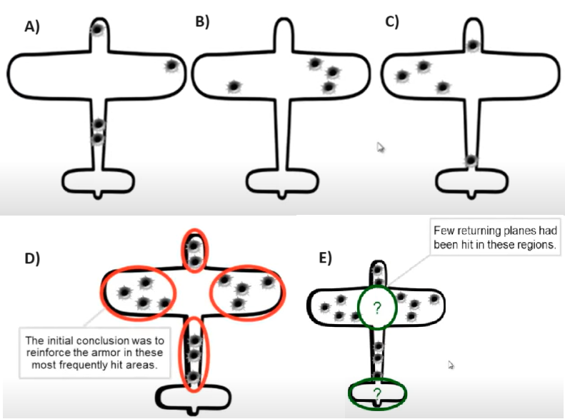
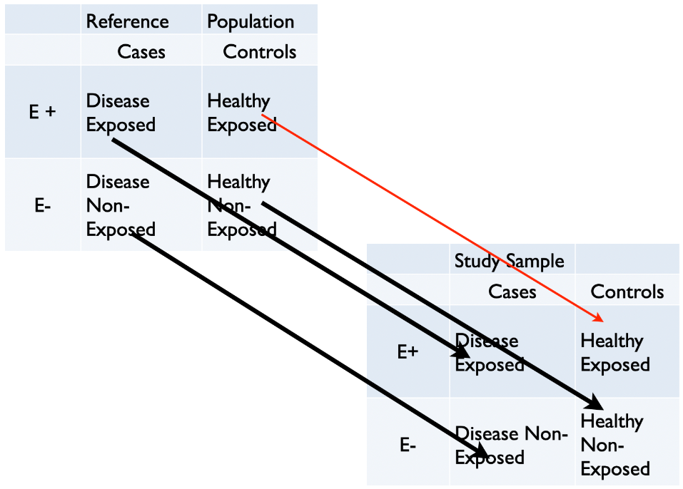
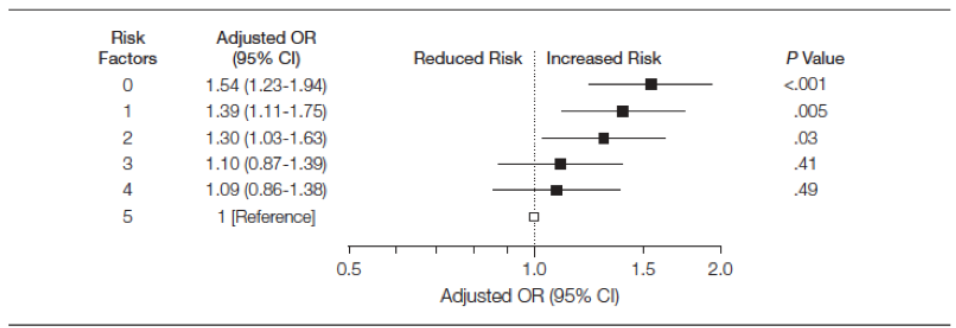
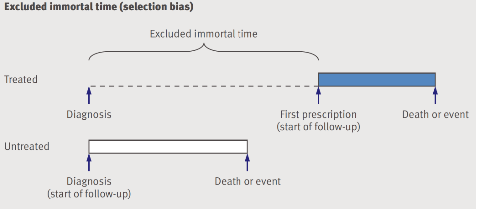
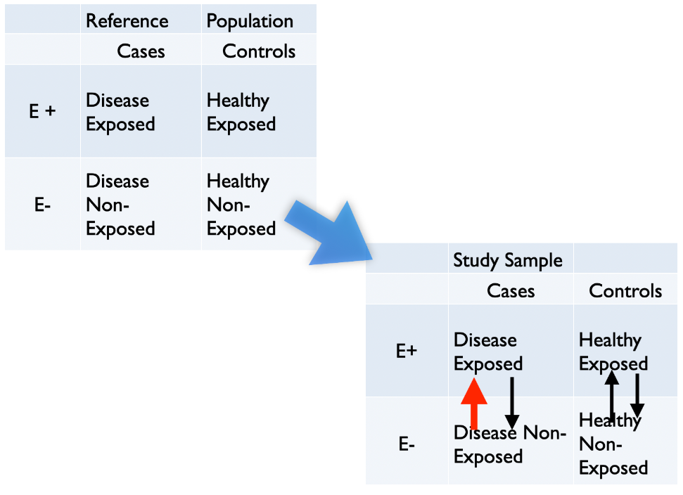
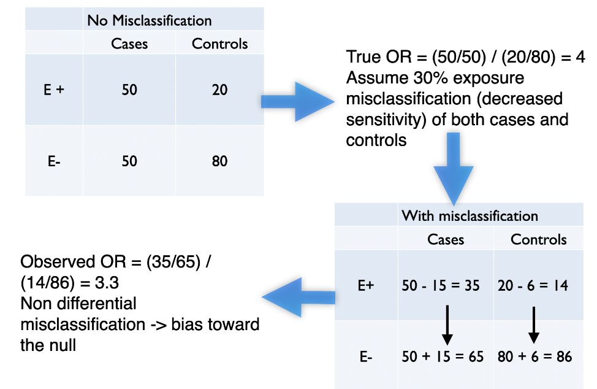

```{r echo = FALSE}
setwd("C:/Users/danfe/Dropbox/Proyectos Daniel/Cursos - diplomados - Maestrias/Programa de autoformación en investigación y análisis de datos/Rmarkdowns/Epidemiología/Semana 4 confusion_sesgo_missclassification")

knitr::opts_chunk$set(echo = TRUE, warning = FALSE, message = FALSE,
                         fig.show = "asis", results = "show", fig.width = 10,
                      fig.align='center',out.width = "100%",
                      fig.path = "figures/",  # Configura el directorio donde se guardan los gráficos
  dev = "png")
```


#### Librerias a usar{-}


```{r}
pacman::p_load(knitr, tidyverse, 
               dagitty, ggdag, patchwork, 
               broom, data.table, simstudy, 
               gridExtra, epiR, tableone, ipw, 
               sandwich, survey, haven, EValue)
```


# Confusión

## Introducción
La confusión es un concepto causal definido en términos del modelo de generación de datos como una variable que influye causalmente en la variable dependiente y se asocia con la variable independiente, provocando así una asociación espuria.

Mientras que las definiciones más antiguas de la confusión la consideraban un sesgo descrito como una mezcla de efectos de factores extraños (denominados factores de confusión) con el efecto de interés.

Existen multitud de métodos para controlar los factores de confusión, que se analizarán en esta lectura y en otros posteriores. El control de los factores de confusión puede realizarse en la fase de diseño mediante aleatorización, restricción o emparejamiento. En la fase de análisis, el control de los factores de confusión puede realizarse mediante estandarización, estratificación o regresión multivariable estándar. Las limitaciones de estos métodos han conducido al avance de nuevos enfoques, como los modelos causales estructurales o los gráficos acíclicos dirigidos (DAG), las puntuaciones de propensión, los modelos estructurales marginales con ponderación de probabilidad inversa y los métodos cuasi experimentales, como las variables instrumentales (revisaremos cada una de ellascon mayor detalle en semanas posteriores).

**Comprender la confusión con simulación y visualización**

Exploraremos la confusión a través del uso de R, la simulación de datos y la visualización de datos. La discusión y el código siguientes se han tomado prestados en gran medida de este Andrew Heiss (Georgia State University). El siguiente DAG representa una situación de confusión en la que una exposición (tratamiento) X causa un resultado Y, en presencia de un factor de confusión C, representado como la causa común tanto de la exposición como del resultado y e un término de error aleatorio.


  
```{r fig.cap="La importancia de los DAGs"}
# example 1
dag <- dagitty("dag {
  X -> Y
  C -> X
  C ->  Y
  e -> Y
               }")

coordinates( dag ) <-  list(
  x=c(X=1, C=3, Y=5, e=5),
  y=c(X=1, C=3, Y=1, e=3))

dag <- tidy_dagitty(dag)
ex1 <- ggdag(dag, layout = "circle") + 
  theme_dag_blank(plot.caption = element_text(hjust = 1)) + 
  geom_dag_node(color="pink") + 
  geom_dag_text(color="white") +
  ggtitle("a) DAG with a confounder (C)") +
  labs(caption = "X = drug exposure\nY = outcome\nC = confounder\n e = random error")
ex1

```


En términos de resultados potenciales, el efecto causal se define como  $CE_i = Y_{1i} - Y_{0i}$ donde  

$Y_{1i}$  y  $Y_{0i}$ representan los resultados potenciales para cada individuo \(i\) siendo ambos expuestos y no expuestos respectivamente. Si  $Y_{1i} = Y_{0i}$, concluiríamos en la ausencia de un efecto causal. En el mundo real solo observamos una de estas dos exposiciones, pero en el mundo de la simulación podemos generar ambos resultados potenciales y observados.

Vamos a crear un marco de datos de 1,000 individuos donde el efecto causal,  $CE_i = Y_{1i} - Y_{0i} = 1.0$  puntos, un factor de confusión \(C\) está presente en aproximadamente el 40% de la población, y aumenta el resultado en 2 puntos.


  
```{r}
def <- defData(varname = "C", formula = 0.4, dist = "binary")
def <- defData(def, "X", formula = "0.3 + 0.4 * C", dist = "binary")
def <- defData(def, "e", formula = 0, variance = 2, dist = "normal")
def <- defData(def, "Y0", formula = "2 * C + e", dist="nonrandom")
def <- defData(def, "Y1", formula = "1 + 2 * C + e", dist="nonrandom")
def <- defData(def, "Y_obs", formula = "Y0 + (Y1 - Y0) * X", dist = "nonrandom") #  = Y1*X + (1-X)*Y0

set.seed(2017)
dt <- genData(10000, def)
```

```{r echo=FALSE}
DT::datatable(round(dt, 2),  options = list(pageLength = 5, scrollX=T), class = 'white-space: nowrap' )

```


Podemos comprobar que los datos simulados representan las condiciones deseadas calculando el verdadero efecto causal, verificar el porcentaje con el factor de confusión y calcular el resultado observado para aquellos con y sin exposición. Los resultados observados son iguales a Y1 cuando X=1 e Y0 cuando X=0.


  
```{r}
paste0("Efecto causal medio calculado = ", 
       mean(dt[, Y1] - dt[, Y0])) #diferencia media de resultados contrafactuales
paste0("El porcentaje de la población con el factor de confusión C = ", 
       sum(dt[,C])/ nrow(dt))
paste0("Diferencia observada calculada = ", 
       round(dt[X == 1, mean(Y_obs)] - dt[X == 0, mean(Y_obs)],2))
```


Esto confirma la validez del conjunto de datos simulado, ya que representa fielmente las condiciones estipuladas. La diferencia observada no es igual a la diferencia causal de los resultados potenciales debido a la presencia del factor de confusión C. La diferencia observada = la diferencia casual (1.0) + sesgo (40% * 2 = .8) que se aproxima a la diferencia observada calculada.

La misma respuesta sesgada podría obtenerse utilizando una regresión lineal no ajustada.


  
```{r}
lm1 <- lm(Y_obs ~ X, data = dt)
tidy(lm1)

```


La regresión lineal multivariable permite ajustar los factores de confusión y proporciona el efecto causal construido para este caso simple sin interacciones ni exposiciones dependientes del tiempo.


  
```{r}
lm1 <- lm(Y_obs ~ X + C, data = dt)
tidy(lm1)

```


Sin embargo, vale la pena repetir, que incluso en un modelo aparentemente sencillo hay que tener cuidado de no añadir variables a ciegas a un algoritmo de regresión automatizado, ya que esto puede crear sesgos si la variable es un colisionador.

Examinemos este conjunto de datos por medios gráficos y las 2 funciones siguientes serán útiles para el trazado. (Entender este código no es necesario para entender el enfoque gráfico).


  
```{r}
getDensity <- function(vector, weights = NULL) {
  
  if (!is.vector(vector)) stop("Not a vector!")
  
  if (is.null(weights)) {
    avg <- mean(vector)
  } else {
    avg <- weighted.mean(vector, weights)
  }
  
  close <- min(which(avg < density(vector)$x))
  x <- density(vector)$x[close]
  if (is.null(weights)) {
    y = density(vector)$y[close]
  } else {
    y = density(vector, weights = weights)$y[close]
  }
  return(data.table(x = x, y = y))
  
}

plotDens <- function(dtx, var, xPrefix, title, textL = NULL, weighted = FALSE) {
  
  dt <- copy(dtx)
  
  if (weighted) {
    dt[, nIPW := IPW/sum(IPW)]
    dMarginal <- getDensity(dt[, get(var)], weights = dt$nIPW)
  } else {
    dMarginal <- getDensity(dt[, get(var)])
  }
  
  d0 <- getDensity(dt[C==0, get(var)])
  d1 <- getDensity(dt[C==1, get(var)])

  dline <- rbind(d0, dMarginal, d1)
  
  brk <- round(dline$x, 1)
  
  p <- ggplot(aes(x=get(var)), data=dt) +
    geom_density(data=dt[C==0], fill = "#ce682f", alpha = .4) +
    geom_density(data=dt[C==1], fill = "#96ce2f", alpha = .4)
  
  if (weighted) {
    p <- p + geom_density(aes(weight = nIPW),
                              fill = "#2f46ce", alpha = .8)
  } else p <- p + geom_density(fill = "#2f46ce", alpha = .8)
  
  p <- p +  geom_segment(data = dline, aes(x = x, xend = x, 
                                   y = 0, yend = y), 
                 size = .7, color =  "white", lty=3) +
            annotate(geom="text", x = 12.5, y = .24, 
             label = title, size = 5, fontface = 2) +
            scale_x_continuous(limits = c(-5, 8), 
                       breaks = brk,
                       name = paste(xPrefix, var)) +
            theme(panel.grid = element_blank(),
                  axis.text.x = element_text(size = 12),
                  axis.title.x = element_text(size = 13)
    )

    if (!is.null(textL))  {
      p <- p + 
        annotate(geom = "text", x = textL[1], y = textL[2], 
                 label = "C=0", size = 4, fontface = 2) +
        annotate(geom = "text", x = textL[3], y = textL[4], 
                 label="C=1", size = 4, fontface = 2) +
        annotate(geom = "text", x = textL[5], y = textL[6], 
                 label="Population distribution", size = 4, fontface = 2) +
        theme(axis.text.x = element_text(angle = 60, hjust = 1))
    } 
    
    return(p)
}

```


En primer lugar, consideraremos el conjunto de la población (curva azul), que es una media ponderada de los dos subgrupos definidos por la covariable C. En el gráfico de la izquierda, el resultado potencial Y0 es igual a 0,8 para la población no expuesta. El gráfico confirma la correcta construcción del conjunto de datos simulado, ya que el valor potencial esperado de Y1 (1,8) es 1,0 mayor que el de Y0 (0,8), lo que representa el efecto causal de X. El resultado potencial de Y1 (1,8) es 1,0 mayor que el de Y0 (0,8), lo que representa el efecto causal de X. El resultado potencial de Y1 (1,8) es 1,0 mayor que el de Y0 (0,8).


  
```{r}
grid.arrange(plotDens(dt, "Y0", "Potential outcome", "Full\npopulation", 
                         c(0, .24, 2, .21, 2.6, .06)),
             plotDens(dt, "Y1", "Potential outcome", "Full\npopulation",
                         c(0, .24, 2, .21, 2.6, .06)),
             nrow = 1
)
```


Se puede apreciar que la distribución de la población depende del factor de confusión C y de la exposición con el efecto causal, 1,0, que se aplica por igual a cada uno de los subgrupos de covariables (0,0 -> 1,0 y 2,0 -> 3,0). En otras palabras, los tamaños del efecto condicional son iguales al tamaño del efecto poblacional o marginal. La distribución de la población tiene una forma no simétrica, porque son una mezcla de las distribuciones normales condicionales, ponderadas por la proporción de cada nivel del factor de confusión con más peso dado a C=0 ya que representa el 60% de la población. Dado que las proporciones de los dos gráficos son las mismas y cada uno de ellos utiliza la totalidad de las poblaciones contrafactuales, las curvas de densidad a nivel de población para Y0 e Y1 tienen una forma similar.

Examinemos ahora los mismos dos gráficos, pero para los datos observados.


  
```{r}
g1 <- plotDens(dt[X==0], "Y_obs", 
               "Observed", "Unexposed\nonly", 
               c(0, .24, 2, .21)) 

g2 <- plotDens(dt[X==1], "Y_obs", 
               "Observed", "Unexposed\nonly", 
               c(0, .24, 2, .21))
g1 + g2 +
  plot_annotation(title = 'Plots of unexposed (left) and exposed (right) observations')
```


Mientras que las distribuciones de los Y observados (Y_obs) condicionales en C son idénticas a sus homólogas de resultados potenciales condicionales en toda la población, las distribuciones marginales (curvas azules) son bastante diferentes para los no expuestos y los expuestos. La diferencia observada entre los expuestos y los no expuestos = $E(Y_{obs} | X = 1) - E(Y_{obs} | X = 0) = 2,2 - 0,5 = 1,7 ≠ 1,0$ (el efecto causal). Esta diferencia indica la presencia de confusión. Observe que la diferencia observada de las diferencias estratificadas es igual al efecto causal,
$E(Y_{obs} | C = 1, X = 1) - E(Y_{obs} | C = 1, X = 0) = 3,0 - 2,0 = 1,0 (efecto causal)$ y
$E(Y_{obs} | C = 0, X = 1) - E(Y_{obs} | C = 0, X = 0) = 1.0 - 0.0 = 1.0 (efecto causal)$

¿Puede explicar por qué los marginales observados son diferentes entre los expuestos y los no expuestos? Sugerencia: recuerde la estructura de un factor de confusión y calcule el porcentaje de los que tienen el factor de confusión C en los grupos no expuesto y expuesto.


  
```{r}
paste0("En el grupo no expuesto, el porcentaje con el factor de confusión C = 1 is ", round(dt[, .(propLis1 = mean(C)), keyby = X][1,2]*100,2), "%")
paste0("En el grupo expuesto, el porcentaje con el factor de confusión C = 1 is ", round(dt[, .(propLis1 = mean(C)), keyby = X][2,2]*100,2), "%")
```


Por lo tanto, los marginales de exposición observados son diferentes, ya que tienen diferentes ponderaciones para los factores de confusión. La diferencia observada es una mezcla del verdadero efecto causal y el sesgo de confusión.

## Comprender la confusión con la ponderación de probabilidad inversa
La ponderación de cada observación individual por su probabilidad inversa de exposición crea una pseudopoblación mediante la cual se ha eliminado el efecto de confusión y se puede estimar el efecto marginal de la exposición sobre el resultado. Aunque es posible que usted acepte fácilmente que esto es cierto, yo prefiero confirmar tales afirmaciones mediante un ejemplo de simulación rápida. Este enfoque me parece más convincente que simplemente que me lo digan.


  
```{r}
lm1 <- lm(Y_obs ~ X, data = dt)
tidy(lm1)
```


Aquí observamos la estimación causal sesgada de 1.7 (valor verdadero = 1.0). Ahora crearemos un modelo de exposición, donde asumimos que esto es una función solo de C. Tener el modelo correcto es obviamente una suposición clave para el éxito del ponderado por probabilidad inversa. A partir de este modelo, podemos predecir la probabilidad, \( pX \), de estar expuesto para cada individuo. El ponderado por probabilidad inversa se puede calcular a partir de estas probabilidades: $ IPW = \frac{1}{P_x} $ para el grupo expuesto y $ IPW = \frac{1}{1 - P_x} $ para el grupo no expuesto.


  
```{r}
exposureModel <- glm(X ~ C, data = dt, family = "binomial")
tidy(exposureModel)

dt[, pX := predict(exposureModel, type = "response")]  # := creates and assigns a variable

# Define two new columns
defC2 <- defDataAdd(varname = "pX_actual", 
                    formula = "X * pX + (1-X) * (1-pX)", 
                    dist = "nonrandom")
defC2 <- defDataAdd(defC2, varname = "IPW", 
                    formula = "1/pX_actual", 
                    dist = "nonrandom")

# Add weights
dt <- addColumns(defC2, dt)
```

```{r echo=FALSE}
DT::datatable(round(dt, 2),  options = list(pageLength = 10, scrollX=T), class = 'white-space: nowrap' )

```


Con estas ponderaciones creamos una pseudopoblación que puede analizarse mediante un modelo de regresión simple no ajustado.


  
```{r}

tidy(lm(Y_obs ~ X , data = dt, weights = IPW)) 
```


El tamaño del efecto estimado se aproximó definitivamente al efecto causal simulado.

Además, en este sencillo ejemplo, el efecto marginal proporciona la misma información que la estimación del efecto condicional, pero veremos que con modelos más complejos no siempre es así.


  
```{r}
grid.arrange(plotDens(dt, "Y0", "Potential outcome", "Population", 
                         c(1, .24, 5, .22, 2.6, .06)),
             plotDens(dt[X==0], "Y_obs", "Observed", "Unexposed", 
                      c(1, .24, 5, .22), weighted = TRUE),
             plotDens(dt, "Y1", "Potential outcome", "Population",
                      c(1, .24, 5, .22, 2.6, .06)),
             plotDens(dt[X==1], "Y_obs", "Observed", "Exposed", 
                      c(1, .24, 5, .22), weighted = TRUE),
             nrow = 2
)
```


### Ejemplo - Ajuste de los factores de confusión mediante IPW
Como ejemplo, consideremos este conjunto de datos de 5.735 observaciones y 62 variables que examina el impacto de la colocación de un catéter cardiaco derecho (CSG o catéter de Swan Ganz) en la supervivencia de pacientes en estado crítico.

Como los grupos no se han aleatorizado, es esencial intentar equilibrar los grupos para otros factores pronósticos importantes con el fin de obtener una estimación real de cualquier beneficio o daño asociado con el CSG.


  
```{r}
# Carganos los datos
CSG <- rio::import("CSG.csv")

# mostraremos las primeras 200 observaciones
```


```{r echo=FALSE}
DT::datatable(head(CSG, 200),  options = list(pageLength = 5, scrollX=T), class = 'white-space: nowrap' )

```


Para nuestros fines basta con saber que la variable de exposición es swang1, el resultado es la muerte y las demás variables retenidas son posibles factores de confusión. Trabajaremos con un conjunto reducido de covariables, como se muestra aquí.


  
```{r}
# create a simpler data set with these limited variables, 
ARF<-as.numeric(CSG$cat1=='ARF')
CHF<-as.numeric(CSG$cat1=='CHF')
Cirr<-as.numeric(CSG$cat1=='Cirrhosis')
colcan<-as.numeric(CSG$cat1=='Colon Cancer')
Coma<-as.numeric(CSG$cat1=='Coma')
COPD<-as.numeric(CSG$cat1=='COPD')
lungcan<-as.numeric(CSG$cat1=='Lung Cancer')
MOSF<-as.numeric(CSG$cat1=='MOSF w/Malignancy')
sepsis<-as.numeric(CSG$cat1=='MOSF w/Sepsis')
female<-as.numeric(CSG$sex=='Female')
died<-as.integer(CSG$death=='Yes')
age<-CSG$age
treatment<-as.numeric(CSG$swang1=='RHC')
meanbp1<-CSG$meanbp1

# new dataset
mydata<-cbind(ARF,CHF,Cirr,colcan,Coma,lungcan,MOSF,sepsis,
              age,female,meanbp1,treatment,died)
mydata<-data.frame(mydata)

#covariates we will use (shorter list than you would likley use in practice)
xvars<-c("age","female","meanbp1","ARF","CHF","Cirr","colcan",
         "Coma","lungcan","MOSF","sepsis")
```


The data may be summarized in the following table along with the standardized mean differences (SMD) between the 2 exposure groups.


  
```{r}
#look at a table 1
library(gtsummary)

tbl_summary(mydata, by=treatment) %>% 
  add_overall() %>% 
  add_p()
```


Esto demuestra que existe un desequilibrio considerable entre estas variables basales entre los que recibieron y los que no recibieron el CSG.

Los datos brutos también muestran un mayor riesgo de muerte con el CSG.


  
```{r}
Epi::stat.table(list(treatment, died), contents=list(count(), "(%)" = percent(died)),
           margin=T, data=mydata)
```


La odds ratio cruda puede calcularse a partir de 1) una tabla 2X2 utilizando epi.2by2 de la biblioteca epiR o 2) a partir de una regresión logística estándar glm(formula, data, femily="binomial").


  
```{r}
dd <- matrix(c(1486,698,2236,1315), nrow = 2, byrow = FALSE)
epiR::epi.2by2(dd)

glm.obj<-glm(died~treatment, data= mydata, family="binomial")
tidy(glm.obj, exponentiate = T, conf.int = T)
```


Ambos enfoques proporcionan una odds ratio aumentada de 1,25.

Más interesante es la odds ratio ajustada, calculada tras equilibrar las covariables medidas de los 2 grupos, siguiendo estos pasos;

Construir un modelo logístico para la probabilidad de estar expuesto (puntuación de propensión).
Utilizar 1/PS para los expuestos y 1/(1-PS) para los no expuestos para crear una pseudopoblación.
Examinar las diferencias de medias estandarizadas (DME) entre los 2 grupos para evaluar el éxito del equilibrio.


  
```{r}
# step 1 - build PS model using all available variables (could be expanded to include interaction terms)
psmodel <- glm(treatment ~ age + female + meanbp1+ARF+CHF+Cirr+colcan+
                   Coma+lungcan+MOSF+sepsis,family  = binomial(link ="logit"))

## step 2 - calculate propensity score for each subject and then use it to calculate weights
ps <-predict(psmodel, type = "response")
weight<-ifelse(treatment==1,1/(ps),1/(1-ps))

#apply weights to data 
weighteddata<-svydesign(ids = ~ 1, data =mydata, weights = ~ weight)

# step 3 - display the weighted table (pseudo-population) with SMD
weightedtable <-svyCreateTableOne(vars = xvars, strata = "treatment", 
                                  data = weighteddata, test = FALSE)
 print(weightedtable, smd = TRUE)


tbl_svysummary(weighteddata, by=treatment) %>% 
  add_overall() %>% 
  add_p()

```


El éxito de la creación de la pseudopoblación a la hora de establecer el equilibrio entre las covariables medidas queda bien demostrado en la tabla anterior. Por supuesto, nuestra incapacidad para hacer una afirmación comparable sobre las diferencias en las covariables no medidas sigue siendo la principal limitación de este enfoque.

Ahora podemos evaluar la asociación de la exposición y el resultado en este conjunto de datos de pseudopoblación.


  
```{r}
#get causal relative risk. Weighted GLM
glm.obj<-glm(died~treatment,weights=weight,family=quasibinomial(link=log))
#summary(glm.obj)
betaiptw<-coef(glm.obj)
#to properly account for weighting, use asymptotic (sandwich) variance
SE<-sqrt(diag(vcovHC(glm.obj, type="HC0")))

#get point estimate and CI for relative risk (need to exponentiate)
causalrr<-exp(betaiptw[2])
lcl<-exp(betaiptw[2]-1.96*SE[2])
ucl<-exp(betaiptw[2]+1.96*SE[2])

paste0("The point estimate is ", round(causalrr,3), 
       " and the 95%CI is ", round(lcl,3), 
       " - ", round(ucl,3) )

## [1] "The point estimate is 1.082 and the 95%CI is 1.037 - 1.129"
```


Si se tiene en cuenta el desequilibrio entre las covariables, se produce una reducción de la magnitud del daño asociado al CSG, pero el aumento del riesgo de mortalidad, un 8,2%, sigue siendo estadísticamente significativo.

Una de las limitaciones del enfoque IPW es que los PS extremos conducen a ponderaciones muy grandes que pueden sesgar los resultados. A menudo se sugiere el truncamiento de las ponderaciones grandes, por ejemplo > 10, como salvaguarda contra esta ponderación excesiva de cualquier puntuación individual.


  
```{r}
#truncate weights at 10

truncweight<-replace(weight,weight>10,10)
#get causal risk ratio
glm.obj<-glm(died~treatment,weights=truncweight,family=quasibinomial(link="log"))
betaiptw<-coef(glm.obj)
#to properly account for weighting, use asymptotic (sandwich) variance
SE<-sqrt(diag(vcovHC(glm.obj, type="HC0")))

#get point estimate and CI for relative risk (need to exponentiate)
causalrr<-exp(betaiptw[2])
lcl<-exp(betaiptw[2]-1.96*SE[2])
ucl<-exp(betaiptw[2]+1.96*SE[2])
paste0("The point estimate is ", round(causalrr,3), 
       " and the 95%CI is ", round(lcl,3), 
       " - ", round(ucl,3) )

## [1] "The point estimate is 1.087 and the 95%CI is 1.043 - 1.133"
```


En este caso, el truncamiento no supuso ningún cambio significativo en el resultado.

El mismo ejercicio puede repetirse utilizando el paquete ipw.


  
```{r}
#first fit propensity score model to get weights
weightmodel<-ipwpoint(exposure= treatment, family = "binomial", link ="logit",
                      denominator= ~ age + female + meanbp1+ARF+CHF+Cirr+colcan+
                          Coma+lungcan+MOSF+sepsis, data=mydata)
#numeric summary and plot of weights
summary(weightmodel$ipw.weights)
ipwplot(weights = weightmodel$ipw.weights, logscale = FALSE,
        main = "weights", xlim = c(0, 22))


# update dataset with weights
mydata$wt<-weightmodel$ipw.weights

#fit the model
glm.obj<-glm(died~treatment,data=mydata, weights=mydata$wt,family=quasibinomial(link=log))

paste0("The point estimate is ", round(exp(coef(glm.obj)[2]),3), " and the 95%CI is ", round(exp(confint(glm.obj)[2]),3), " - ", round(exp(confint(glm.obj)[4]),3))

```


Esto da una respuesta consistente de mayor riesgo con CSG en pacientes críticamente enfermos. Sin embargo, como se ha mencionado anteriormente, puede que nos preocupen los posibles factores de confusión no medidos. Por ejemplo, es posible que deseemos examinar la solidez de los resultados calculando la magnitud de un factor de confusión no medido que sería necesario para anular la asociación observada.

Este enfoque, conocido como valor e, está bien descrito en la literatura. Por supuesto, existe un paquete R, **Evalue**, que automatiza los cálculos.


  
```{r}
evalues.RR(est = 1.087, lo = 1.043, hi = 1.133)            
```


Así, un factor de confusión no medido que tuviera un 39% más de riesgo de presencia en el grupo expuesto y tuviera un 39% más de riesgo de muerte sería suficiente para anular el aumento de riesgo observado con CSG. Si la fuerza de una de estas relaciones fuera más débil, la otra tendría que ser más fuerte para que el efecto causal de CSG sobre la mortalidad fuera realmente nulo.

Para ver cómo tendría que variar la magnitud de las relaciones exposición-factor de confusión y factor de confusión-resultado para explicar completamente la asociación observada, podemos utilizar bias_plot().


  
```{r}
bias_plot(1.087, xmax = 5)
```


Como estas magnitudes de asociación para un factor de confusión no medido están lejos de ser imposibles, debemos ser cautos en nuestra evaluación de la solidez de la asociación observada entre CSG y el aumento de la mortalidad.

### E-value

#### Valores E para factores de confusión no medidos

Revisemos el concepto de E-valor con algunos ejemplos más. 

Hammond y Horn estimaron que fumar cigarrillos aumentaba más de 10 veces el riesgo de cáncer de pulmón. Fisher propuso que la confusión genética puede explicar toda la aparente asociación. 2 Podemos calcular la magnitud de la confusión que sería necesaria para explicar completamente el índice de riesgo estimado de 10,73 (IC del 95 %: 8,02; 14,36):


  
```{r}
  evalues.RR(est = 10.73, lo = 8.02, hi = 14.36)
```


El valor E de 20,95 nos dice que un factor de confusión, o un conjunto de factores de confusión, como el propuesto por Fisher, tendría que estar asociado con un aumento de 20 veces en el riesgo de cáncer de pulmón, y debe ser 20 veces más prevalente en fumadores que no fumadores, para explicar el índice de riesgo observado. Si la fuerza de una de estas relaciones fuera más débil, la otra tendría que ser más fuerte para que el efecto causal del tabaquismo sobre el cáncer de pulmón fuera verdaderamente nulo.

Para ver cómo la magnitud de las relaciones exposición-confusor y confusor-resultado tendrían que variar para explicar completamente la asociación observada, podemos usar la bias_plot()función:


  
```{r}
bias_plot(10.73, xmax = 40)
```


Esto nos dice, por ejemplo, que si el factor de confusión de la exposición (RR_EU.) fuera 15, lo que significa que los factores de confusión son 15 veces más probables entre los fumadores, el parámetro (RR_UD) tendría que ser aproximadamente 40 para que fuera posible que los factores de confusión explicaran toda la asociación observada.

También podríamos trazar el límite inferior del intervalo de confianza, para el que calculamos un valor E de 15,52 más arriba.


  
```{r}
bias_plot(8.02, xmax = 40)
```


También podemos calcular un valor E para cambiar una estimación a un número distinto del nulo. Por ejemplo, para reducir un riesgo relativo observado de 2,5 a un riesgo relativo causal verdadero de 1,5, el valor E es:

#### Ejemplo 2 introducción del valor E

Un estudio de Victora et al. Al examinar la relación entre la lactancia materna y la muerte infantil por infección respiratoria, se encontró que la mortalidad aumentó en un factor de 3,9 (IC del 95%: 1,8; 8,7) entre los bebés que solo recibían fórmula. 3 Sin embargo, el tabaquismo, que no se evaluó en este estudio, puede ser un factor de confusión. Podemos calcular los valores E para la estimación puntual y el intervalo de confianza:


  
```{r}
evalues.OR(est = 3.9, lo = 1.8, hi = 8.7, rare = TRUE)
```

  
También podemos trazar la magnitud de cada uno de los parámetros que se requerirían para explicar la estimación puntual:


  
```{r}
bias_plot(3.9, xmax = 20)
```

  
#### Ejemplo 3 Para factores de protección

El siguiente ejemplo se refiere a un estudio de la Agencia para la Investigación y la Calidad de la Atención Médica, que encontró que la lactancia materna reducía el riesgo de leucemia infantil. 4 El artículo informó un RR de 0,80 (IC del 95 %: 0,71; 0,91). Este ejemplo demuestra que también podemos calcular valores E para factores de protección.


  
```{r}
evalues.RR(est = 0.80, lo = 0.71, hi = 0.91)

# E-Value corrected
1/1.809017

1/1.428571

```

  

# Sesgo de selección

#### Paquetes R necesarios {-}


  
```{r}

library(knitr)
library(tidyverse)
library(dagitty)
library(ggdag)
library(patchwork)
```


## Introducción
El sesgo de selección se introduce por la selección inadecuada (no aleatoria) de individuos, de modo que la muestra de expuestos/intervenidos y no expuestos/controles no se extrae de la misma población de referencia. Si la selección de casos y controles no se realiza independientemente de la exposición, entonces, cuando se comparan las distribuciones de exposición, cualquier diferencia observada es una combinación de un efecto verdadero y un artefacto de la forma en que se recopilaron los datos (es decir, selección diferencial en la muestra del estudio). En otras palabras, el sesgo de selección puede conducir a posibles análisis estadísticos espurios de las asociaciones exposición/resultado mediante el método de selección de muestras, afectando así negativamente a la validez interna. El sesgo de selección también puede tener un impacto negativo en la validez externa.

La siguiente [caricatura]<https://youtu.be/p52Nep7CBdQ> puede ayudar a ilustrar convincentemente el concepto.

```{r dr-cheese, echo=FALSE, fig.cap="Figura: Resumen de aviones dañados"}

```


Esta caricatura representaba los daños causados por los bombarderos que regresaban después de las incursiones durante la Segunda Guerra Mundial. Se pidió al estadístico Abraham Wald que ayudara a los británicos a decidir dónde añadir blindaje a sus bombarderos.

¿Es obvio dónde se debe colocar la armadura?

¡Después de analizar los registros, recomendó agregar armaduras en los lugares donde no hubo daños!

Esto puede parecer extraño al principio, pero Wald se dio cuenta de que los datos para su análisis provenían de bombarderos que sobrevivieron. Aquellos que fueron derribados sobre territorio enemigo no formaban parte de su muestra y las áreas no dañadas de los supervivientes mostraban dónde debieron haber sido alcanzados los aviones perdidos porque los aviones impactados en esas áreas no regresaron de sus misiones. Esto se conoce como sesgo de supervivencia, una forma de sesgo de selección.

## Sesgo de selección 
El sesgo de selección ocurre cuando la exposición y el resultado de la enfermedad afectan la participación en el estudio. Se aprecia más fácilmente en los diseños de casos y controles y surge cuando los casos y controles no se seleccionan independientemente de la exposición. Gráficamente esto se muestra al examinar la relación entre las tablas 2X2 de la población de referencia (objetivo) y de estudio (muestra). Si alguna de las celdas de la población de estudio no se completa en proporción directa a la población objetivo, puede ocurrir un sesgo de selección.

Visualización gráfica del sesgo de selección en el diseño de casos y controles.
```{r echo=FALSE, fig.cap="Figura: Visualización gráfica del sesgo de selección en el diseño de casos y controles"}

```


El sesgo de selección puede surgir de otros diseños de investigación, incluidos los ECA, pero en ocasiones puede ser difícil de identificar y con frecuencia queda eclipsado por otros sesgos. Sin embargo, el sesgo de selección es omnipresente y tiene el potencial de desviar la investigación. Parte de la dificultad para apreciar el sesgo de selección es que históricamente este sesgo ha sido identificado mediante ejemplos específicos más que mediante una formulación general.

Los ejemplos clásicos incluyen el sesgo de trabajador sano, sesgo de voluntario, pérdida diferencial durante el seguimiento, agotamiento de susceptibles, sesgo de incidencia-prevalencia, sesgo de falta de respuesta y sesgo de Berkson, una forma particular de sesgo de selección cuando se utilizan controles hospitalarios .

Los ejemplos más nuevos incluyen el sesgo del evento índice, también conocido como sesgo de estratificación del colisionador y el sesgo del tiempo inmortal, que tiene un componente tanto de clasificación errónea como de selección y es especialmente problemático en estudios farmacoepidemiológicos.

Hay una serie de excelentes artículos de revisión recientes sobre el sesgo de selección [Smith 2020]<https://www.louisahsmith.com/publications/smith2020selection.pdf>.

## Comparación de sesgos de confusión, mediación y selección con DAG

Los sesgos de confusión y de selección son dos sesgos importantes y, dado que en ocasiones su aparición puede no ser tan obvia, los DAG proporcionan un medio explícito para distinguirlos. La confusión es el resultado de una causa común, mientras que el sesgo de selección es el resultado del condicionamiento a un efecto común. La confusión puede entonces apreciarse como un estado de la naturaleza, mientras que el sesgo de selección es un artefacto del proceso de investigación, pero ambos resultan en la no comparabilidad (también conocida como falta de **intercambiabilidad**) entre los expuestos y los no expuestos.

Tipos de asociaciones


  
```{r}

# example 1
dag <- dagitty("dag {
  X -> Y
  Z -> X
  Z ->  Y
               }")

coordinates( dag ) <-  list(
  x=c(X=1, Z=3, Y=5),
  y=c(X=1, Z=3, Y=1) )

dag <- tidy_dagitty(dag)
ex1 <- ggdag(dag, layout = "circle") + 
  theme_dag_blank(plot.caption = element_text(hjust = 1)) + 
  geom_dag_node(color="pink") + 
  geom_dag_text(color="white") +
  ggtitle("a) Confounding ") +
  labs(caption = "Common cause")

# example 2
dag <- dagitty("dag {
  X -> Y
  X -> Z
  Z ->  Y
               }")

coordinates( dag ) <-  list(
  x=c(X=1, Z=3, Y=5),
  y=c(X=-.5, Z=1, Y=-.5) )

ex2 <- ggdag(dag, layout = "circle") + 
  theme_dag_blank(plot.caption = element_text(hjust = 1)) + 
  geom_dag_node(color="pink") + 
  geom_dag_text(color="white") +
  ggtitle("b) Causation") +
  labs(caption = "Mediation")

# example 3
dag <- dagitty("dag {
  X -> Y
  X -> Z
  Y ->  Z
               }")

coordinates( dag ) <-  list(
  x=c(X=1, Z=3, Y=5),
  y=c(X=-.5, Z=1, Y=-.5) )

ex3 <- ggdag(dag, layout = "circle") + 
  theme_dag_blank(plot.caption = element_text(hjust = 1)) + geom_dag_node(color="pink") + 
  geom_dag_text(color="white") +
  ggtitle("c) Collision") +
  labs(caption = "Selection /\nEndogeneity")

ex1 + ex2 + ex3 +
  plot_annotation(title = 'Causal diagrams - confounder, mediator and selection bias')
```


### Sesgo de Berkson
Considere un estudio de casos y controles sobre la asociación entre los estrógenos posmenopáusicos y el infarto de miocardio (IM), donde los controles se eligen de una población hospitalizada. Es posible que esta población no sea representativa de la población objetivo general. Por ejemplo, los controles hospitalarios pueden tener una muestra excesiva de fracturas de cadera. Se sabe que los estrógenos protegen la incidencia de fracturas de cadera, por lo que es menos probable que los controles tomen estrógenos que un caso de IM, incluso si la exposición a los estrógenos no causa IM.

Los DAG para representar este escenario son los siguientes


  
```{r}

coords <-  list(
  x=c(E=1, F=2, D=2, S=3),
  y=c(E=1, F=1.2, D=1, S=1) )

dag <- dagify(F ~ E, S ~ F + D, coords = coords)
dag1 <- dag %>% ggdag_drelationship("E", "D") + 
  theme_bw() + 
  ggtitle("a) D and E are d-spearated (in nature)")
dag2 <- dag %>% ggdag_drelationship("E", "D", controlling_for = "S") + 
  theme_bw() + 
  ggtitle("b) D and E are d-connected \n(conditional on S)") +
  labs(caption = "E = estrogen \nD = MI \nF = hip fracture \nS = selected for study")

dag1 + dag2 + 
  plot_annotation(title = 'DAGs showing Berkson bias') 
```


La Figura no muestra ninguna relación entre la exposición (E) y el resultado (D), pero una vez que hay condiciones para ser seleccionado en el estudio, se crea una asociación espuria debido a la estratificación del colisionador. De hecho, el ggdagpaquete muestra automáticamente las asociaciones espurias (líneas de puntos en la Figura b)

P: ¿Un ensayo clínico aleatorizado (ECA) adecuado también puede sufrir un sesgo de selección?

R: Sí. La pérdida selectiva durante el seguimiento puede provocar un sesgo de selección. Como es un ECA, no hay factores de confusión entre E y D. Sin embargo, imagine que la exposición a una de las intervenciones conduce a un aumento de los efectos secundarios (F), lo que a su vez lleva a que los pacientes abandonen el estudio, el equivalente a condicionarse a S. De hecho, este escenario es capturado por el mismo DAG que la Figura b, lo que demuestra la apertura de una asociación de puerta trasera espuria.

Observe que dentro de este modelo S también podría representar otras causas de ausencia que expliquen otros sesgos como la falta de respuesta, el voluntariado, la autoselección o el trabajador sano.

Esto también explica por qué los casos completos como medio para abordar los datos faltantes probablemente den resultados sesgados.

Recuerde, los ECA pueden sufrir los mismos sesgos de selección que los estudios observacionales.

### Sesgo de supervivencia

Considere un estudio de demencia (D) donde la exposición a investigar es la actividad física (E) y existen variables medidas o no medidas (F) asociadas tanto con la supervivencia (S) como con la demencia. Si la actividad física conduce a una mejor supervivencia (S), entonces un estudio de personas mayores, en otras palabras condicionando la supervivencia, puede inducir una asociación espuria entre la demencia y la actividad física. Esto puede dar lugar a una asociación cuando en realidad no existe ninguna o puede modificar, hasta el punto de revertirla, una asociación verdadera.


  
```{r fig.cap="Figura: Sesgo de selección (sesgo de supervivencia)"}
coords <-  list(
  x=c(E=1, F=2.5, D=3, S=2),
  y=c(E=1, F=1.2, D=1, S=1) )

dag <- dagify(D ~ F, S ~ F + E, coords = coords)
dag1 <- dag %>% ggdag_drelationship("E", "D") + 
  theme_bw() + 
  ggtitle("a) D and E are d-spearated (in nature)")
dag2 <- dag %>% ggdag_drelationship("E", "D", controlling_for = "S") + 
  theme_bw() + 
  ggtitle("b) D and E are d-connected \n(conditional on S)") +
  labs(caption = "E = physical activity \nD = dementia \nF = other variables e.g. smoking status \nS = selected for study based on survival")

dag1 + dag2 + 
  plot_annotation(title = 'DAGs showing survival bias') 
```


### Sesgo prevalente del usuario
Aquí E es el inicio de una droga, E1 es el uso continuo y S es la selección en un estudio de usuarios frecuentes. F es un conjunto de causas comunes de uso continuado y el resultado Y, como las condiciones de salud subyacentes, podría dar lugar a un sesgo de selección si no se tiene en cuenta.


  
```{r fig.cap="Figura: Sesgo de selección (sesgo de usuario predominante)"}

coords <-  list(
  x=c(E=1, F=2.5, S=3, E1=2, D=4),
  y=c(E=1, F=1.2, S=1, E1=1, D=1) )

dag <- dagify(E1 ~ E + F, S ~ E1, D ~ F, coords = coords)
dag1 <- dag %>% ggdag_drelationship("E", "D") + 
  theme_bw() + 
  ggtitle("a) D and E are d-spearated (in nature)")
dag2 <- dag %>% ggdag_drelationship("E", "D", controlling_for = "S") + 
  theme_bw() + 
  ggtitle("b) D and E are d-connected \n(conditional on S)") +
  labs(caption = "E = drug \nE1 = persistent drug use \nD = liver disease \nF = alcohol \nS = selected for study based on survival")

dag1 + dag2 + 
  plot_annotation(title = 'DAGs showing prevalent user bias') 
```


Este DAG demuestra que seleccionar un descendiente de un colisionador también puede abrir un camino no causal entre la exposición y el resultado.

### Sesgo de evento de índice
Como ejemplo, consideremos las numerosas publicaciones que informan sobre una aparente paradoja de la obesidad, según la cual la obesidad, un factor de riesgo cardíaco bien establecido, protege contra los infartos de miocardio recurrentes.

¿Alguien cree honestamente que esto sea cierto? No conozco ninguna clínica de prevención cardíaca secundaria que prescriba aumento de peso. El siguiente DAG deja claro que no existe ninguna paradoja y que esta observación es totalmente compatible con el sesgo de selección.


  
```{r fig.cap="Figura: Sesgo de selección (sesgo de evento de índice)"}
coords <-  list(
  x=c(E=1, F=2.5, D=3, S=2),
  y=c(E=1, F=1.2, D=1, S=1) )

dag <- dagify(D ~ S + F, S ~ F + E, coords = coords)
dag1 <- dag %>% ggdag_drelationship("E", "D") + 
  theme_bw() + 
  ggtitle("a) D and E are d-spearated (in nature)")
dag2 <- dag %>% ggdag_drelationship("E", "D", controlling_for = "S") + 
  theme_bw() + 
  ggtitle("b) D and E are d-connected \n(conditional on S)") +
  labs(caption = "E = age \nD = dementia \nF = smoking \nS = selected for study based on survival of initial event")

dag1 + dag2 + 
  plot_annotation(title = 'DAGs showing index bias') 
```


La figura de la izquierda muestra que el efecto de la obesidad sobre los resultados cardíacos recurrentes (D) está mediado por la supervivencia del primer evento cardíaco (S). A la derecha, vemos que la selección de los sobrevivientes creará una vía trasera entre la obesidad y otras variables que afectan tanto la supervivencia inicial como los eventos recurrentes que pueden explicar la asociación negativa (protectora) observada. Otras “paradojas” cardiovasculares de la reducción de los eventos recurrentes entre los fumadores y aquellos sin aspirina probablemente se explican por el mismo sesgo de selección (sesgo de estratificación del collier).

Lo más sorprendente es que este sesgo tiene incluso una cualidad dosis-respuesta. Considere esta publicación de JAMA donde entre los sobrevivientes de un infarto de miocardio inicial, el riesgo de mortalidad aumentó progresivamente a medida que disminuyó el número de factores de riesgo.

```{r echo=FALSE, fig.cap="Figura: Mortalidad según factores de riesgo entre los supervivientes de un IM inicial"}

```


¡Aparentemente nuestras clínicas preventivas secundarias no sólo deberían fomentar el aumento de peso sino también fumar más, hacer menos actividad física y aumentar el consumo de colesterol! Alternativamente, podríamos concluir que este artículo cae en la categoría de hallazgos falsos.

### Sesgo del tiempo inmortal
El tiempo inmortal se refiere a un período de seguimiento durante el cual, por diseño, la muerte o el resultado del estudio no pueden ocurrir. Este es un problema frecuente en los estudios de farmacoepidemiología observacional y a menudo se debe a un sesgo de selección, aunque la clasificación errónea también puede explicar este sesgo.

```{r echo=FALSE, fig.cap="Figura: Tiempo inmortal excluido: sesgo de selección"}

```


El problema surge de no alinear la elegibilidad, la exposición y los tiempos de seguimiento.

Si bien la mayoría de los investigadores y lectores son conscientes de que la confusión es un sesgo potencial en los estudios de farmacoepidemiología, no se aprecia tan bien que la magnitud del sesgo del tiempo inmortal suele ser sustancialmente mayor. Esto no es sorprendente por al menos tres razones

1. Aunque muchos estudios observacionales tienen factores de confusión no medidos, como el historial de tabaquismo, la obesidad o el nivel socioeconómico, la evidencia de que los médicos prescriben preferentemente en función de esas variables está lejos de ser definitiva.

2. La cantidad de tiempo excluido puede ser sustancial y esto conducirá a un efecto protector muy inflado para el fármaco del estudio y

3. está establecido que los resultados positivos son más fáciles de publicar

## Observaciones finales 
En un mundo ideal, el sesgo de selección se evitaría en la etapa de diseño o recopilación de datos, pero las realidades del mundo real a menudo lo hacen imposible, al menos parcialmente. Como se muestra arriba, los DAG pueden ayudar como primer paso a identificar posibles fuentes de sesgo de selección. La recopilación detallada de todas las variables asociadas con la selección de muestras y los resultados puede ayudar a mitigar el sesgo de selección. El diseño de estudios observacionales para emular los ECA también ayudará a minimizar los sesgos de selección (y otros). Las posibles soluciones analíticas pueden incluir análisis de casos completos, imputación múltiple y ponderación de probabilidad inversa.

# Misclassification (Sesgo de información)

#### Paquetes R necesarios{-}


  
```{r}
library(tidyverse)
library(epiR)
library(episensr)
```


## Introducción
La clasificación errónea se define como la clasificación errónea de un individuo, un valor o un atributo en una categoría distinta a aquella a la que debería asignarse. La clasificación errónea puede considerarse un error de medición y también se conoce como sesgo de información u observación.

Puede ocurrir una clasificación errónea con respecto al estado de exposición, el resultado o ambos y puede ocurrir debido a definiciones erróneas o recopilación de datos defectuosa. En los diseños de casos y controles, la clasificación errónea suele referirse a la exposición y puede ser diferencial, ya que la exposición se mide después del resultado. En los estudios de cohortes, es más probable que la clasificación errónea de la exposición no sea diferencial debido a su medición generalmente prospectiva. En los ECA también puede producirse una clasificación errónea y, en esta situación, a menudo se clasifica como sesgo de detección.

```{r echo=FALSE, fig.cap="Clasificación errónea más común en un estudio de casos y controles"}

```


La figura representa el sesgo de recuerdo por el cual los pacientes con el resultado muestran una mayor conciencia de la exposición en comparación con los controles. Una posible solución para minimizar el sesgo de recuerdo es validar los autoinformes con registros administrativos históricos o actuales, si es posible.

## Sesgo del tiempo inmortal
Como se analizó previamente, el sesgo del tiempo inmortal tiene dos componentes potenciales, el sesgo de selección y el sesgo de clasificación errónea, como se muestra en la siguiente figura.


```{r echo=FALSE, fig.cap="Tiempo inmortal mal clasificado: sesgo de clasificación errónea"}

```

El tiempo hasta que se prescribe el medicamento se considera inmortal porque, por definición, los individuos que terminan en el grupo tratado o expuesto tienen que sobrevivir sin ningún evento hasta que se cumpla la definición del tratamiento. Si tienen un evento antes, se les considera automáticamente en el grupo no tratado o no expuesto. Ya sea que este período de inmortalidad se trate como una clasificación errónea o se excluya, el resultado es un sesgo. Una de las ventajas del enfoque propuesto de “emular ensayos objetivo” para el diseño de estudios observacionales es evitar este sesgo.

Ejemplo de sesgo del tiempo inmortal

Levesque et al. 2010, brindan un excelente ejemplo de sesgo de tiempo inmortal con un nuevo análisis de un estudio con estatinas que informó una reducción del 26 % en el riesgo de progresión de la diabetes, definida como la necesidad de comenzar la terapia con insulina, al cabo de un año. o más tratamiento con estatinas (cociente de riesgo ajustado 0,74; IC del 95%: 0,56 a 0,97). En lugar de utilizar el análisis de tiempo fijo original que asignaba todo el tiempo antes de la exposición al medicamento al grupo tratado, Levesque realizó un análisis dependiente del tiempo en el que los días-persona de seguimiento se clasificaron como no tratados hasta que el estudio definió un año de uso de estatinas. y como se trata a partir de entonces. De hecho, este análisis dependiente del tiempo evitó 3 períodos de tiempo inmortales que estaban presentes en el análisis original; 1) Período libre de estatinas de 6 meses 2) tiempo desde que se administró la primera prescripción 3) 1 año de prescripción de estatinas.

Este tiempo inmortal representó el 68% del tiempo total de seguimiento asignado a los usuarios de estatinas, lo que dio lugar a una tasa de eventos falsamente baja. El análisis dependiente del tiempo corregido que evita el tiempo inmortal mostró que el uso de estatinas se asoció con un mayor riesgo de progresión a insulina (HR 1,97; IC del 95%: 1,53 a 2,52). Por supuesto, esta asociación no es causal y probablemente se vea confundida por la indicación, ya que aquellos con diabetes progresiva tienen más probabilidades de sufrir enfermedades cardíacas, una fuerte indicación para las estatinas.

Curiosamente, Levesque demostró además que al utilizar el mismo diseño de tiempo inmortal sesgado, podrían mostrar un beneficio de disminución de la progresión de la diabetes con AINE y medicamentos de protección gástrica, dos clases de medicamentos sin efectos conocidos sobre la diabetes. Finalmente, cuanto mayor sea la cantidad de tiempo inmortal, mayor será el sesgo y, como se mencionó anteriormente, esto puede conducir a magnitudes de sesgo que excedan con creces las del sesgo de confusión más comúnmente reconocido.

## Sesgo de vigilancia médica
Cuando se piensa en una clasificación errónea o un error de medición, suele resultar útil utilizar el marco de sensibilidad y especificidad (es decir, similar a las pruebas de diagnóstico). 

- Sensibilidad: Proporción de todos los individuos verdaderamente expuestos clasificados correctamente por el estudio.

- Especificidad: Proporción de todos los individuos verdaderamente no expuestos clasificados correctamente por el estudio.

Esto puede ser útil ya que el tipo de clasificación errónea puede basarse en las nociones de sensibilidad y especificidad:

- No diferencial: la sensibilidad y la especificidad de la determinación de la exposición son las mismas en casos y controles -> sesgo hacia el valor nulo (generalmente, si solo hay 2 categorías). y ningún otro sesgo)

- Diferencial: la sensibilidad o especificidad de la determinación de la exposición difiere entre casos y controles -> no se puede predecir la dirección del sesgo

```{r echo=FALSE, fig.cap="Ejemplo de clasificación errónea no diferencial"}

```

## Análisis de sesgo cuantitativo (QBA)

Muy a menudo, los sesgos de los estudios, ya sean sesgos de selección, de confusión o de clasificación errónea, sólo se evalúan cualitativamente y no cuantitativamente. Lash et al. 2009, han escrito un libro que aborda la cuestión del análisis de sesgo cuantitativo y proporcionan hojas de Excel para realizar estos análisis. Por supuesto, existe un paquete en R para realiza estos cálculos (**episensr**). Estos análisis de sensibilidad intentan cuantificar la dirección, magnitud e incertidumbre del sesgo que afecta una estimación de asociación del efecto observado.

### Ejemplo de clasificación errónea usando R

Un estudio de Mayo Clinic ( Hasin et al. 2013 ) informó que los pacientes que desarrollan insuficiencia cardíaca después de un infarto de miocardio tienen un mayor riesgo de sufrir un diagnóstico incidental de cáncer. Si bien los autores realizaron un análisis del tiempo hasta el evento para este ejemplo, solo compararemos las proporciones de personas con y sin insuficiencia cardíaca que desarrollan cáncer, ya que no tenemos acceso al conjunto de datos completo. Hubo 28 incidentes de cáncer entre los 228 pacientes con insuficiencia cardíaca y 70 casos entre los 853 pacientes sin insuficiencia cardíaca (OR = 1,5).


  
```{r}
dat <- matrix(c(28,70,200,783), nrow=2, ncol=2, byrow=TRUE)
rownames(dat) <- c("Cases", "Controls")
colnames(dat) <- c("Exposed","Unexposed")
dat
epiR::epi.2by2(dat)

```


Ahora, los pacientes con insuficiencia cardíaca eran seguidos regularmente en la clínica Mayo, mientras que los pacientes sin insuficiencia cardíaca eran seguidos en la comunidad. Parece bastante razonable suponer que la sensibilidad para detectar la exposición (diagnóstico de cáncer) entre los casos de insuficiencia cardíaca seguidos en la Clínica Mayo es mayor que la para detectar el cáncer entre los controles comunitarios.

Puede ser razonable suponer que la sensibilidad para detectar cáncer en los pacientes de Mayo Clinic = 0,9 mientras que en la comunidad es = 0,8. Si bien podríamos realizar los cálculos a mano, esto se puede hacer usando el paquete **episensr** y **misclassification** función para probar la solidez de la conclusión original. Los detalles sobre el paquete se pueden encontrar en **help(package="episensr")**. 


  
```{r}
out <- misclassification(dat, bias_parms=c(.9,.8,1,1), type="outcome")
out
print("Corrected Table")
out$corr.data
```


Como se esperaba, la corrección del sesgo ha movido el resultado hacia el valor nulo y ya no hay ninguna señal que sugiera un mayor riesgo de cáncer entre los pacientes que desarrollan insuficiencia cardíaca (OR 1,4; IC del 95%: 0,8 - 2,2). Para investigar más a fondo este análisis de sensibilidad, se podría realizar un análisis de sensibilidad de probabilidad utilizando **probsens** Por ejemplo, en lugar de suponer sensibilidades fijas para la exposición entre casos y controles, se podría tomar un muestreo a partir de una distribución de probabilidad. Por ejemplo, supongamos distribuciones normales con un rango de sensibilidad de 0,85 - 0,95 y 0,7 - 0,9 para casos y controles, respectivamente.


  
```{r}
probsens(dat,
         type = "exposure",
         reps = 20000,
         seca.parms = list("uniform", c(.85, .95)),
         seexp.parms = list("uniform", c(.7, .9)),
         spca.parms = list("uniform", c(.99, 1)),
         spexp.parms = list("uniform", c(.99, 1)),
         corr.se = .8,
         corr.sp = .8)
```


Se puede apreciar que, utilizando una amplia distribución de sensibilidades, no existe una señal sólida de un aumento de cánceres entre aquellos con insuficiencia cardíaca (OR 1,4; IC del 95%: 0,8 - 2,2).

Tenga en cuenta que no estamos insinuando que el análisis de sesgo cuantitativo proporcione la respuesta exacta e imparcial, pero muestra claramente la falta de solidez de las conclusiones originales respecto de una serie bastante razonable de análisis de sensibilidad. QBA pone en duda la conclusión bastante definitiva avanzada por los autores: "Los pacientes que desarrollan insuficiencia cardíaca después de un infarto de miocardio tienen un mayor riesgo de cáncer".

# Introducción al análisis de sensibilidad de sesgo múltiple

Es probable que un estudio epidemiológico esté afectado por más de un sesgo. Podemos utilizar el EValuepaquete para evaluar los sesgos de forma conjunta. Comenzamos caracterizando los sesgos de interés: confusión no medida, sesgo de selección y clasificación errónea diferencial. Las funciones nos permiten caracterizar estos sesgos según las opciones disponibles.

- **confounding()**: Esta función no necesita ningún argumento adicional.

- **selection(...)**: El sesgo de selección se puede describir "general"si el objetivo inferencial es la población total y "selected"si el objetivo es únicamente la población seleccionada. Si "general"se elige , el valor predeterminado, los argumentos adicionales son "increased risk"o "decreased risk"(supuestos sobre la dirección del riesgo en la población seleccionada) y "S = U"(se utiliza una simplificación si la característica de sesgo es común a toda la población seleccionada). 

- **misclassification(...)**: La clasificación errónea puede caracterizarse por, "outcome"o "exposure"dependiendo de, si el resultado diferencial o la clasificación errónea de la exposición son de interés. Si "exposure"se elige, los argumentos adicionales rare_outcome y rare_exposure deben establecerse en TRUE o FALSE, dependiendo de si el resultado y/o la exposición son lo suficientemente raros como para que los índices de probabilidades sean aproximadamente equivalentes a los índices de riesgo.

Cada sesgo adicional toma el argumento verbose, que especifica si algún mensaje debe imprimirse en la consola al llamar a la función. Este argumento generalmente no debe especificarse (predeterminado verbose = FALSE), ya que se imprimirán los mensajes apropiados cuando se utilicen los sesgos en otras funciones, pero ocasionalmente puede ser útil para la depuración.

Para utilizar las funciones de análisis de sensibilidad proporcionadas en este paquete, estos sesgos se pueden combinar usando multi_bias():


  
  
```{r }
biases <- multi_bias(confounding(), 
                     EValue::selection("general", "increased risk"), 
                     EValue::misclassification("exposure", rare_outcome = TRUE))

```


**Parámetros que describen los sesgos.**

Hay entre 1 y 4 parámetros que caracterizan cada sesgo, pero difieren según el orden de los sesgos y las opciones elegidas. La interpretación de los parámetros se da en Smith et al. 2020 , pero brevemente, cada uno es un índice de riesgo (o probabilidad) (RR/OR) que relaciona dos variables, posiblemente condicionado a otras. (Cada una está además condicionada a otras covariables medidas, que se omiten en la notación por simplicidad). La variable de exposición está etiquetada $A$, el resultado $Y$ y sus versiones mal clasificadas $A^∗$ y $Y^∗$, respectivamente. La selección en la muestra se denota con $S= 1$. Finalmente, se supone que los sesgos de selección y de confusión no medidos se deben a variables no medidas.$U_C$ y $U_s$, respectivamente.

La siguiente tabla contiene la lista completa de parámetros utilizando la notación de Smith et al. papel. También se proporciona la salida correspondiente que se imprimirá en la consola R. Finalmente, el argumento utilizado para especificar la magnitud del parámetro en la multi_bound()función se encuentra en la última columna.

```{r echo=FALSE}
library(gt)
library(tibble)
library(htmltools)

# Crear la tabla con los datos
tabla_bias <- tribble(
  ~Bias, ~Parameter, ~R_Output, ~Function_argument,
  "Confounding", "RR_{AUc}", "RR_AU_c", "RRAUc",
  "Confounding", "RR_{UcY}", "RR_U_cY", "RRUcY",
  "Selection after outcome misclassification", "RR_{UsY | A=1}", "RR_UsY&#124;A=1", "RRUsYA1",
  "Selection after outcome misclassification", "RR_{SUs | A=1}", "RR_SUs&#124;A=1", "RRSUsA1",
  "Selection after outcome misclassification", "RR_{UsY | A=0}", "RR_UsY&#124;A=0", "RRUsYA0",
  "Selection after outcome misclassification", "RR_{SUs | A=0}", "RR_SUs&#124;A=0", "RRSUsA0",
  "Selection after exposure misclassification", "RR_{UsY* | A=1}", "RR_UsY*&#124;A=1", "RRUsYA1",
  "Selection after exposure misclassification", "RR_{UsY* | A=0}", "RR_UsY*&#124;A=0", "RRUsYA0",
  "Selection after outcome misclassification", "RR_{UsY | A* = 1}", "RR_UsY&#124;A*=1", "RRUsYA1",
  "Selection after outcome misclassification", "RR_{SUs | A* = 1}", "RR_SUs&#124;A*=1", "RRSUsA1",
  "Selection after outcome misclassification", "RR_{UsY | A* = 0}", "RR_UsY&#124;A*=0", "RRUsYA0",
  "Selection after outcome misclassification", "RR_{SUs | A* = 0}", "RR_SUs&#124;A*=1", "RRSUsA1",
  "Confounding and selection", "RR_{AUsc | S=1}", "RR_AUsc&#124;S", "RRAUscS",
  "Confounding and selection", "RR_{UscY | S=1}", "RR_UscY&#124;S", "RRUscYS",
  "Outcome misclassification", "RR_{AY* | y}", "RR_AY*&#124;y", "RRAYy",
  "Exposure misclassification (rare outcome)", "OR_{YA* | a}", "OR_YA*&#124;a", "ORYAa",
  "Exposure misclassification (rare exposure and outcome)", "RR_{YA* | a}", "RR_YA*&#124;a", "RRYAa",
  "Outcome misclassification", "RR_{AY* | y, S=1}", "RR_AY*&#124;y,S", "RRAYyS",
  "Exposure misclassification (rare outcome)", "OR_{YA* | a, S=1}", "OR_YA*&#124;a,S", "ORYAaS",
  "Exposure misclassification (rare exposure and outcome)", "RR_{YA* | a, S=1}", "RR_YA*&#124;a,S", "RRYAaS"
)

# Formatear la tabla con gt y convertir las fórmulas a HTML
tabla_bias %>%
  gt() %>%
  tab_spanner(label = "Detalles de sesgos y parámetros", columns = everything()) %>%
  tab_style(
    style = cell_text(weight = "bold"),
    locations = cells_column_labels()
  ) %>%
  cols_label(
    Bias = "Sesgo",
    Parameter = "Parámetro",
    R_Output = "Salida R",
    Function_argument = "Argumento de función"
  ) 

```

## Ordenamiento de los sesgos

Si ambos están presentes, el sesgo de selección y la clasificación errónea deben enumerarse en la multi_bias()función en el orden en que se supone que afectan los datos. Se supone que la confusión es un estado de naturaleza que no depende de cómo se seleccionan o miden los datos. Si la selección ocurre antes de la medición de exposición/resultado, como se implica en el código anterior, entonces podemos definir parámetros que describan el alcance de la clasificación errónea diferencial dentro del grupo seleccionado. Si la medición tiene lugar antes de la selección, entonces los parámetros que describen la selección están en términos de variables mal clasificadas.

Podemos ver fácilmente qué parámetros describen los sesgos de interés usando la summary()función en el objeto creado por multi-bias():


  
```{r}
summary(biases)

```


Compare los parámetros anteriores con los que obtendríamos si cambiáramos el orden de la clasificación errónea y la selección. Esto ahora implica que la selección difiere según la exposición mal medida, y que el parámetro de clasificación errónea puede interpretarse con respecto a la población total, no solo a los seleccionados para el estudio.


  
```{r}
summary(
  multi_bias(confounding(), 
             EValue::misclassification("exposure", rare_outcome = TRUE),
             EValue::selection("general", "increased risk"))
  )
```


## Límites

Una vez que sabemos qué sesgos son de interés y los hemos caracterizado usando los argumentos de la función, podemos calcular un límite para el sesgo conjunto. Debemos elegir valores para los distintos parámetros que definen la magnitud de los sesgos.

Calcular un límite no requiere memorizar los argumentos de la tabla anterior. En cambio, los parámetros que deben especificarse para un conjunto determinado de sesgos se pueden imprimir usando la print()función en un objeto creado por multi_bias(). Por ejemplo, utilizando los sesgos elegidos anteriormente:


  
```{r}
print(biases)
```


A continuación, podemos elegir los valores de los parámetros necesarios. Para nuestro ejemplo, supongamos que pensamos que un factor de confusión no medido Uc se asocia con un riesgo 2 veces mayor del resultado y es 1,5 veces más probable en los grupos expuestos que en los no expuestos. Entonces RRUcY = 2 y RRAUc = 1,5. Entonces creemos que, entre los expuestos, el grupo seleccionado tiene 1,25 veces más probabilidades de tener algún nivel de la variable no medida Us que el grupo no seleccionado, y que Us  se asocia con un aumento de 2,5 veces en el riesgo del resultado. Esto implicaría que RRSUsA1 = 1,25 y RRUsYA1 = 2,5. Por último, planteamos la hipótesis de que las probabilidades de una medición de exposición falsa-positiva dentro de este grupo seleccionado eran 1,75 veces mayores en los expuestos que en los no expuestos, de modo que ORYAaS = 1,75. Podemos calcular el sesgo máximo que veríamos si todos esos parámetros describieran la verdadera magnitud del sesgo:


  
```{r}
multi_bound(biases, 
            RRUcY = 2, RRAUc = 1.5,
            RRSUsA1 = 1.25, RRUsYA1 = 2.5,
            ORYAaS = 1.75)
```


Es decir, si esos valores son correctos, entonces el verdadero índice de riesgo no puede ser más de 2,4 veces menor que el índice de riesgo observado. Entonces, si nuestro índice de riesgo observado fuera 4, el índice de riesgo real debe ser al menos 1,7.

Si no incluye los argumentos de parámetros necesarios dados sus sesgos de interés, un error le informará cuáles son necesarios. Los valores de 1 no implican ningún sesgo, por lo que los argumentos establecidos en 1 pueden usarse para explorar la ausencia de un determinado sesgo.

Como generalmente no conocemos la magnitud exacta de los parámetros, puede resultar útil calcular límites con un rango de valores. Por ejemplo, podemos variar cada uno de los parámetros del 1 al 3 en incrementos de 0,25:


  
```{r}
param_vals <- seq(1, 3, by = 0.5)

# create every combination of values
params <- expand.grid(
  RRUcY = param_vals, RRAUc = param_vals,
  RRSUsA1 = param_vals, RRUsYA1 = param_vals,
  ORYAaS = param_vals
)

params$bound <- mapply(multi_bound,
  RRUcY = params$RRUcY, RRAUc = params$RRAUc,
  RRSUsA1 = params$RRSUsA1, RRUsYA1 = params$RRUsYA1,
  ORYAaS = params$ORYAaS,
  MoreArgs = list(biases = biases)
)
```


Hay muchas dimensiones para resumir la relación entre los parámetros y los límites en una tabla o figura simple, pero podemos examinar la distribución general de los límites y cómo dependen de varios de los parámetros. Por ejemplo, un histograma simple de los límites calculado variando cada uno de los parámetros de sesgo entre 1 y 3.


  
```{r}

head(params,10)

hist(params$bound, main = NULL, xlab = "Bound")

```


## Valores E de sesgos múltiple

También podemos calcular valores E de sesgo múltiple, que son análogos a los valores E para factores de confusión no medidos, pero que tienen en cuenta sesgos múltiples. El valor E de sesgo múltiple describe el valor mínimo que todos los parámetros de sensibilidad para cada uno de los sesgos tendrían que asumir para que un índice de riesgo observado determinado sea compatible con un índice de riesgo verdaderamente nulo.

Para calcular una evaluación de sesgos múltiples, declaramos un conjunto de sesgos como antes y luego especificamos el índice de riesgo observado. Por ejemplo, dados los sesgos con los que hemos estado trabajando y un índice de riesgo observado de 4, el valor E del sesgo múltiple es round(summary(multi_evalue(biases, RR(4))), 2):


  
```{r}
multi_evalue(biases, est = RR(4))
```


Observe que hemos especificado que nuestra estimación es un índice de riesgo utilizando la RR()función. Si, en cambio, queremos calcular un valor E de sesgo múltiple para un índice de probabilidades o un índice de riesgo, debemos especificarlo con la función adecuada, así como decidir si es razonable suponer que el resultado es lo suficientemente raro como para utilizar un riesgo. aproximación de la relación. En caso contrario, se utilizarán otras aproximaciones .


  
```{r}
# square-root approximation of the odds ratio
multi_evalue(biases, est = OR(4, rare = FALSE))
```


Para calcular adicionalmente un valor E de sesgo múltiple para el intervalo de confianza, podemos incluirlo con los argumentos lo =y hi =(se supondrá que están en la misma escala que la estimación puntual):


  
```{r}
# use verbose = FALSE to suppress message about parameters
multi_evalue(biases, est = RR(4), lo = 2.5, hi = 6, verbose = FALSE)
```


La función también puede acomodar estimaciones de protección:


  
```{r}
multi_evalue(biases, est = RR(0.25), lo = 0.17, hi = 0.4, verbose = FALSE)

```


**Infección por VIH en el útero**

Un estudio de Omoni et al. descubrió que, en comparación con los niños que no estaban expuestos al VIH, los que habían estado infectados por el VIH en el útero tenían una probabilidad significativamente mayor de estar por debajo de una puntuación Z de peso para la talla de -2 cuando eran niños pequeños.^[Omoni AO, Ntozini R, Evans C, et al. Crecimiento infantil según el estado serológico materno e infantil en Zimbabue. Pediatr Infect Dis J. 2017;36:869-876]. La odds ratio que comparó los dos grupos fue de 6,75 (IC 95%: 2,79; 16,31) a los 2 años. La muestra del estudio era de participantes en un ensayo de suplementación vitamínica, pero se trataba de un estudio observacional con respecto a la infección por VIH. Podemos estar interesados en la sensibilidad de este resultado no ajustado a los factores de confusión y al sesgo de selección, ya que la decisión de participar podría haberse visto afectada por el estado serológico respecto al VIH, así como por otros factores.

Podemos declarar estos sesgos. El "mayor riesgo" significa que estamos dispuestos a asumir que el resultado es más probable en la parte seleccionada de ambos grupos de exposición. El argumento "general" contrasta con "seleccionado", este último significa que sólo nos interesa la inferencia en la población seleccionada. Dado que "general" es la opción por defecto, podríamos omitirla.


  
```{r}
HIV_biases <- multi_bias(confounding(), 
                          EValue::selection("general", "increased risk"))
HIV_biases
```


La impresión de los sesgos imprime los argumentos que se requieren para la función multi_bound(), lo que facilita copiar y pegar en esa función.


  
```{r}
multi_bound(biases = HIV_biases, 
            RRAUc = 2.3, RRUcY = 2.5, RRUsYA1 = 3, RRSUsA1 = 2)
```


Para calcular un valor E multi sesgo, debemos proporcionar la estimación del efecto observado junto con el conjunto de sesgos. Los autores informaron de una odds ratio, pero supondremos que el resultado de desgaste extremo es lo suficientemente raro como para que se aproxime a una razón de riesgo.


  
```{r}
multi_evalue(biases = HIV_biases, 
             est = OR(6.75, rare = TRUE), 
             lo = 2.79, hi = 16.31)
```


**Vitaminas durante el embarazo**

Un estudio de Ross et al. examinó el riesgo de leucemia en niños cuyas madres habían consumido o no suplementos vitamínicos durante el embarazo.^[Ross JA, Blair CK, Olshan AF, et al. Periconceptional vitamin use and leukemia risk in children with down syndrome: A children's oncology group study. Ann Ny Acad Sci. 2005;104:405- 410]. Informaron de una odds ratio de 0,51 (IC del 95%: 0,30; 0,89) para la leucemia linfoblástica aguda, condicionada a la edad materna, la raza y un indicador binario de educación. Es posible que nos preocupemos por otros factores de confusión no medidos, así como por un posible sesgo de recuerdo, ya que las madres de niños con diagnóstico de cáncer podrían ser más propensas a informar de que no tomaban vitaminas, incluso si lo hacían.

Al evaluar la clasificación errónea de la exposición, tenemos que especificar si el resultado y la exposición son poco frecuentes (independientemente de la escala real de la estimación del efecto).


  
```{r}

leuk_biases <- multi_bias(confounding(), 
                          EValue::misclassification("exposure", 
                                            rare_outcome = TRUE, 
                                            rare_exposure = FALSE))
leuk_biases

```


De nuevo podemos calcular el valor E límite y multibias como en el texto.


  
```{r}
multi_bound(biases = leuk_biases, RRAUc = 2, RRUcY = 1.22, ORYAa = 1.59) 
multi_evalue(biases = leuk_biases, 
             est = OR(0.51, rare = TRUE), 
             lo = 0.3, hi = 0.89)
```


# Referencias

Hasin, T., Y. Gerber, SM McNallan, SA Weston, SS Kushwaha, TJ Nelson, JR Cerhan y VL Roger. 2013. "Los pacientes con insuficiencia cardíaca tienen un mayor riesgo de sufrir cáncer". Artículo de revista. J Am Coll Cardiol 62 (10): 881–86. <https://doi.org/10.1016/j.jacc.2013.04.088>.

Hernán, MA, BC Sauer, S. Hernández-Díaz, R. Platt e I. Shrier. 2016. “La especificación de un ensayo objetivo previene el sesgo del tiempo inmortal y otras lesiones autoinfligidas en los análisis observacionales”. Artículo de revista. J Clin Epidemiol 79: 70–75. <https://doi.org/10.1016/j.jclinepi.2016.04.014>.

Lash TL, Fink AK, Fox MP. 2009. Aplicación del análisis de sesgo cuantitativo a datos epidemiológicos . Libro. Nueva York: Springer.

Levesque, LE, JA Hanley, A. Kezouh y S. Suissa. 2010. "Problema del sesgo del tiempo inmortal en estudios de cohortes: ejemplo del uso de estatinas para prevenir la progresión de la diabetes". Artículo de revista. BMJ 340: b5087. <https://doi.org/10.1136/bmj.b5087>.

Haneuse, S. 2016. "Distinguir el sesgo de selección y el sesgo de confusión en la investigación de eficacia comparada". Artículo de revista. Atención médica 54 (4): e23–9. <https://doi.org/10.1097/MLR.0000000000000011>.

Hernán, MA, S. Hernández-Díaz y JM Robins. 2004. "Un enfoque estructural del sesgo de selección". Artículo de revista. Epidemiología 15 (5): 615–25. <https://doi.org/10.1097/01.ede.0000135174.63482.43>.

Hernán, MA, BC Sauer, S. Hernández-Díaz, R. Platt e I. Shrier. 2016. “La especificación de un ensayo objetivo previene el sesgo del tiempo inmortal y otras lesiones autoinfligidas en los análisis observacionales”. Artículo de revista. J Clin Epidemiol 79: 70–75. <https://doi.org/10.1016/j.jclinepi.2016.04.014>.

Smith, Louisa H. 2020. " Mecanismos de selección y sus consecuencias: comprender y abordar el sesgo de selección ". Informes de epidemiología actuales , en prensa. <https://doi.org/10.1007/s40471-020-00241-6>.

Ding P, VanderWeele TJ. Sensitivity Analysis Without Assumptions [published correction appears in Epidemiology. 2018 May;29(3):e19]. Epidemiology. 2016;27(3):368-377. doi:<https://doi.org/10.1097/EDE.0000000000000457>

