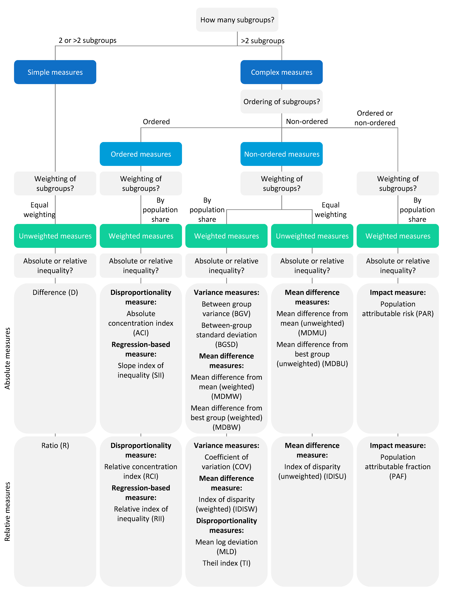

```{r echo = FALSE}
setwd("C:/Users/danfe/Dropbox/Proyectos Daniel/Cursos - diplomados - Maestrias/Programa de autoformación en investigación y análisis de datos/Rmarkdowns/Epidemiología/Semana 4 Epidemio con R")

knitr::opts_chunk$set(echo = TRUE, warning = FALSE, message = FALSE,
                         fig.show = "asis", results = "show",
                      fig.align='center',
                      fig.path = "figures/",  # Configura el directorio donde se guardan los gráficos
  dev = "png")
```

\newpage

# Tasas Estandarizadas

## ¿Qué son las tasas estandarizadas?

Las tasas estandarizadas son una herramienta estadística utilizada en epidemiología y salud pública para comparar tasas de eventos de salud (como mortalidad, morbilidad, o incidencia de una enfermedad) entre diferentes poblaciones, ajustando por diferencias en la estructura de edad u otras características demográficas que podrían afectar las tasas.

## ¿Por qué se utilizan?

Las tasas brutas de enfermedades o eventos de salud pueden ser engañosas si las poblaciones en comparación tienen diferentes distribuciones de edad, género u otras características. Por ejemplo, una población más anciana podría tener una mayor tasa de mortalidad simplemente porque las personas mayores tienen un mayor riesgo de morir. Para realizar comparaciones más justas y precisas, se utilizan tasas estandarizadas que ajustan estas diferencias.

## ¿Cómo se calculan?

El proceso de estandarización puede llevarse a cabo mediante dos métodos principales: la **Estandarización Directa** y la **Estandarización Indirecta**.

## Utilidad en Epidemiología:

- **Comparación justa:** Permite comparar la incidencia de enfermedades o la mortalidad entre diferentes poblaciones de manera justa y precisa.

- **Evaluación de intervenciones:** Ayuda a evaluar la efectividad de intervenciones de salud pública ajustando las diferencias demográficas.

- **Planificación de recursos:** Facilita la planificación y distribución de recursos sanitarios basándose en necesidades ajustadas por la estructura de la población.


## Análisis en R

**Cargar paquetes**
```{r}
pacman::p_load(
     rio,                 # importar/exportar datos
     here,                # localizar archivos
     tidyverse,           # gestión y visualización de datos
     stringr,             # limpieza de caracteres y cadenas
     #frailtypack,         # necesario para dsr, para modelos frailty
     #dsr,                 # estandarizar tasas
     #devtool,
     PHEindicatormethods) # alternativa para la estandarización de tasas

# devtools::install_github("socale/frailtypack", ref = "master")
# packageurl <- "https://cran.r-project.org/src/contrib/Archive/dsr/dsr_0.2.2.tar.gz"
# install.packages(packageurl, repos=NULL, type="source")

library(frailtypack)
library(dsr)
```

En esta sección se explican dos métodos para estandarizar resultados como hospitalizaciones o mortalidad considerando características demográficas como la edad y el sexo. Los métodos son la estandarización directa e indirecta. Utilizaremos los paquetes dsr y PHEindicatormethods en R para ilustrar estos procesos.

- Para la estandarización directa, tendrás que conocer el número de la población de riesgo y el número de defunciones para cada estrato de edad y sexo, para el país A y el país B. Un estrato en nuestro ejemplo podría ser el de las mujeres entre 15-44 años.

- Para la estandarización indirecta, sólo es necesario conocer el número total de defunciones y la estructura por edad y sexo de cada país. Por tanto, esta opción es factible si no se dispone de tasas de mortalidad específicas por edad y sexo o de cifras de población. La estandarización indirecta es, además, preferible en caso de números pequeños por estrato, ya que las estimaciones en la estandarización directa estarían influenciadas por una variación sustancial del muestreo.

Para demostrar la estandarización, usaremos datos ficticios de población y defunciones de dos países por edad (categorías de 5 años) y sexo (femenino, masculino). Los pasos incluyen:

1. Cargar Datos: Importar los datos de población y mortalidad de los dos países.

2. Unir Datos: Combinar los datos de población y mortalidad.

3. Pivotar Datos: Transformar los datos a un formato largo con una fila por estrato de edad y sexo.

4. Limpiar y Unir Población de Referencia: Usar una población estándar mundial (como world_standard_population_by_sex) y unirla a los datos del país.


## Población de Referencia

También necesitamos una población de referencia, la población estándar. Para los fines de este ejercicio utilizaremos la world_standard_population_by_sex. La población estándar mundial se basa en las poblaciones de 46 países y se elaboró en 1960. Hay muchas poblaciones “estándar”; por ejemplo, el sitio web del NHS de Escocia ofrece bastante información sobre la población estándar europea, la población estándar mundial y la población estándar de Escocia.

### Cargar los datos de población
Consulta la página de descargando el manual y los datos para obtener instrucciones sobre cómo descargar todos los datos de ejemplo del manual. Puedes importar los datos de la página de estandarización directamente a R desde nuestro repositorio de Github ejecutando los siguientes comandos import():

```{r echo=FALSE, eval=FALSE}
# importa los datos demográficos del país A directamente de Github
A_demo <- import("https://github.com/epirhandbook/Epi_R_handbook/raw/master/data/standardization/country_demographics.csv")
A_demo$Country <- "A"

# importa los datos demográficos del país B directamente de Github
B_demo <- import("https://github.com/epirhandbook/Epi_R_handbook/raw/master/data/standardization/country_demographics_2.csv")
B_demo$Country <- "B"

```

En primer lugar, cargamos los datos demográficos (recuentos de hombres y mujeres por categoría de edad de 5 años) de los dos países que vamos a comparar, “Country A” y “Country B”.

```{r }
# País A
A_demo <- import("country_demographics.csv")
A_demo$Country <- "A"

```

```{r, echo=FALSE}

DT::datatable(A_demo, rownames = T, filter="top", options = list(pageLength = 7, scrollX=T), class = 'white-space: nowrap' )

```


```{r }
# País B
B_demo <- import("country_demographics_2.csv")
B_demo$Country <- "B"

```

```{r, echo=FALSE}

DT::datatable(B_demo, rownames = T, filter="top", options = list(pageLength = 7, scrollX=T), class = 'white-space: nowrap' )

```

### Cargar datos de defunciones

Convenientemente, también tenemos los recuentos de las defunciones durante el período de interés, por edad y sexo. Los recuentos de cada país están en un archivo separado, que se muestra a continuación.

Defunciones en Country A

```{r }
# importa las defunciones del país A directamente de Github
A_deaths <- import("https://github.com/epirhandbook/Epi_R_handbook/raw/master/data/standardization/deaths_countryA.csv")
```
```{r, echo=FALSE}

DT::datatable(A_deaths, rownames = T, filter="top", options = list(pageLength = 20, scrollX=T), class = 'white-space: nowrap' )

```

Defunciones en Country B

```{r}
# importa las defunciones del país B directamente de Github
B_deaths <- import("https://github.com/epirhandbook/Epi_R_handbook/raw/master/data/standardization/deaths_countryB.csv")
```

```{r, echo=FALSE}

DT::datatable(B_deaths, rownames = T, filter="top", options = list(pageLength = 7, scrollX=T), class = 'white-space: nowrap' )

```

**Poblaciones y defunciones limpias**

Necesitamos unir y transformar estos datos de la siguiente manera:

- Combinar las poblaciones de los países en un solo conjunto de datos y hacer un pivote “largo” para que cada estrato de edad y sexo sea una fila

- Combinar los recuentos de defunciones por país en un solo conjunto de datos y hacer un pivote “largo” para que cada estrato de edad y sexo sea una fila

- Unir las defunciones a las poblaciones

En primer lugar, combinamos los datos de las poblaciones de los países, los pivotamos “largo” y realizamos una pequeña limpieza. 

```{r}
pop_countries <- A_demo %>%  # comienza con el conjunto de datos del país A
     bind_rows(B_demo) %>%        # une las filas, porque las columnas tienen el mismo nombre
     pivot_longer(                       # pivota a lo largo
          cols = c(m, f),                   # columnas para combinar en una sola
          names_to = "Sex",                 # nombre de la nueva columna que contiene la categoría ("m" o "f") 
          values_to = "Population") %>%     # nombre de la nueva columna que contiene los valores numéricos pivotados
     mutate(Sex = recode(Sex,            # valores recodificados para mayor claridad
          "m" = "Male",
          "f" = "Female"))
```

Los datos de población combinados tienen ahora este aspecto

```{r, echo=FALSE}

DT::datatable(pop_countries, rownames = T, filter="top", options = list(pageLength = 7, scrollX=T), class = 'white-space: nowrap' )

```

Y ahora realizamos operaciones similares en los dos conjuntos de datos de defunciones.

```{r}
deaths_countries <- A_deaths %>%    # comienza con el conjunto de datos de defunciones del país A
     bind_rows(B_deaths) %>%        # une las filas con el conjunto de datos B, porque las cols tienen el mismo nombre
     pivot_longer(                  # pivota a lo largo
          cols = c(Male, Female),        # columna a transformar en una sola
          names_to = "Sex",              # nombre de la nueva columna que contiene la categoría ("m" o "f")  
          values_to = "Deaths") %>%      # nombre para la nueva columna que contiene los valores numéricos pivotados
     rename(age_cat5 = AgeCat)      # renombra para mayor claridad
```

```{r, echo=FALSE}

DT::datatable(deaths_countries, rownames = T, filter="top", options = list(pageLength = 7, scrollX=T), class = 'white-space: nowrap' )

```

Ahora unimos los datos de defunciones y población basándonos en las columnas comunes Country, age_cat5, y Sex. Esto añade la columna Deaths.

```{r}
country_data <- pop_countries %>% 
     left_join(deaths_countries, by = c("Country", "age_cat5", "Sex"))
```

```{r, echo=FALSE}

DT::datatable(country_data, rownames = T, filter="top", options = list(pageLength = 7, scrollX=T), class = 'white-space: nowrap' )

```

PRECAUCIÓN: Si tienes pocas defunciones por estrato, considera la posibilidad de utilizar categorías de 10 o 15 años, en lugar de categorías de 5 años para la edad.


### Carga de la población de referencia

Por último, para la estandarización directa, importamos la población de referencia (la “población estándar” mundial por sexo)


```{r}
# importa la población estándar mundial directamente de Github
standard_pop_data <- import("https://github.com/epirhandbook/Epi_R_handbook/raw/master/data/standardization/world_standard_population_by_sex.csv")

```

```{r eval=FALSE, echo=FALSE}
# Población de referencia
standard_pop_data <- import("world_standard_population_by_sex.csv")
```

```{r, echo=FALSE}

DT::datatable(standard_pop_data, rownames = T, filter="top", options = list(pageLength = 7, scrollX=T), class = 'white-space: nowrap' )

```

### Población de referencia limpia

Los valores de la categoría de edad en los dataframes country_data y standard_pop_data tendrán que estar alineados.

Actualmente, los valores de la columna age_cat5 del dataframe standard_pop_data contienen la palabra “years” y “plus”, mientras que los del dataframe country_data no. Tendremos que hacer coincidir los valores de la categoría de edad. Usamos str_replace_all() del paquete stringr para reemplazar estos patrones sin espacio "".

Además, el paquete dsr espera que en la población estándar, la columna que contiene los recuentos se llame "pop". Así que cambiaremos el nombre de esa columna.

```{r}
# Elimina una cadena específica de los valores de columna
standard_pop_clean <- standard_pop_data %>% rename(age_cat5 = AgeGroup)%>%
     mutate(
          age_cat5 = str_replace_all(age_cat5, "years", ""),   # elimina "year"
          age_cat5 = str_replace_all(age_cat5, "plus", ""),    # elimina "plus"
          age_cat5 = str_replace_all(age_cat5, "\\+", ""),    # elimina "+"
          age_cat5 = str_replace_all(age_cat5, " ", "")) %>%   # elimina " " space
     
     rename(pop = WorldStandardPopulation)   # cambia el nombre de la columna por "pop", ya que es lo que espera el paquete dsr
```

PRECAUCIÓN: Si intentas utilizar str_replace_all() para eliminar un símbolo de suma, no funcionará porque es un símbolo especial. “Escapa” de los símbolos especiales poniendo dos barras invertidas delante, como en str_replace_call(columna, "\\+", "").

### Crear un conjunto de datos con una población estándar

Por último, el paquete PHEindicatormethods, que se detalla a continuación, espera que las poblaciones estándar se unan a los recuentos de eventos y poblaciones del país. Por lo tanto, crearemos un conjunto de datos all_data con ese fin.

```{r}
all_data <- left_join(country_data, standard_pop_clean, by=c("age_cat5", "Sex"))
```

```{r, echo=FALSE}

DT::datatable(all_data, rownames = T, filter="top", options = list(pageLength = 7, scrollX=T), class = 'white-space: nowrap' )

```

## paquete dsr

A continuación mostramos el cálculo y la comparación de tasas estandarizadas directamente utilizando el paquete dsr. El paquete dsr permite calcular y comparar tasas estandarizadas directamente (¡no hay tasas estandarizadas indirectamente!).

En la sección de preparación de datos, hemos creado conjuntos de datos separados para los recuentos de países y la población estándar:

1. el objeto country_data, que es una tabla de población con el número de habitantes y el número de defunciones por estrato por país

2. el objeto standard_pop_clean, que contiene el número de población por estrato para nuestra población de referencia, la población estándar mundial

Utilizaremos estos conjuntos de datos separados para el enfoque dsr.

### Tasas estandarizadas

A continuación, calculamos las tasas por país directamente estandarizadas por edad y sexo. Utilizamos la función dsr().

Cabe destacar que dsr() espera un dataframe para las poblaciones de los países y los recuentos de eventos (defunciones), y un dataframe separado con la población de referencia. También espera que en este conjunto de datos de la población de referencia el nombre de la columna de la unidad de tiempo sea “pop” (lo aseguramos en la sección de preparación de datos).

Hay muchos argumentos, como se anota en el código siguiente. En particular, el event = se establece en la columna Deaths, y fu = (“seguimiento”) con la columna Population. Establecemos los subgrupos de comparación como la columna Country y estandarizamos en base a age_cat5 y Sex. A estas dos últimas columnas no se les asigna un argumento con nombre concreto. Consulta ?dsr para obtener más detalles.

```{r}
# Calcula las tasas estandarizadas por el método directo por país por edad y sexo
mortality_rate <- dsr::dsr(
     data = country_data,  # especifica el objeto que contiene el número de defunciones por estrato
     event = Deaths,       # columna que contiene el número de defunciones por estrato 
     fu = Population,      # columna que contiene el número de habitantes por estrato
     subgroup = Country,   # unidades que queremos comparar
     age_cat5,             # otras columnas - las tasas se estandarizarán por éstas
     Sex,
     refdata = standard_pop_clean, # conjunto de datos de la población de referencia, con la columna llamada pop
     method = "gamma",      # método para calcular el IC del 95%
     sig = 0.95,            # nivel de significación
     mp = 100000,           # queremos tasas por 100.000 habitantes
     decimals = 2)          # número de decimales)


# Imprimir la salida como una tabla HTML de aspecto agradable
knitr::kable(mortality_rate) # muestra la tasa de mortalidad antes y después de la estandarización directa
```

Arriba, vemos que mientras Country A tenía una tasa de mortalidad bruta más baja que Country B, ahora tiene una tasa estandarizada más alta después de la estandarización directa por edad y sexo.

### Razón de tasas estandarizadas

```{r}
# Calcular el RR
mortality_rr <- dsr::dsrr(
     data = country_data, # específica el objeto que contiene el número de defunciones por estrato
     event = Deaths,      # columna que contiene el número de defunciones por estrato 
     fu = Population,     # columna que contiene el número de población por estrato
     subgroup = Country,  # unidades que queremos comparar
     age_cat5,
     Sex,                 # características por las que queremos estandarizar  
     refdata = standard_pop_clean, # población de referencia, con números en la columna llamada pop
     refgroup = "B",      # referencia para la comparación
     estimate = "ratio",  # tipo de estimación
     sig = 0.95,          # nivel de significación
     mp = 100000,         # queremos tasas por 100.000 habitantes
     decimals = 2)        # número de decimales

# Imprimir tabla
knitr::kable(mortality_rr) 
```

La tasa de mortalidad estandarizada es 1,22 veces mayor en Country A en comparación con Country B (IC del 95%: 1,17-1,27).

### Diferencia de tasas estandarizadas

```{r}
# Calcular la DR
mortality_rd <- dsr::dsrr(
     data = country_data,       # específica el objeto que contiene el número de defunciones por estrato
     event = Deaths,            # columna que contiene el número de defunciones por estrato 
     fu = Population,           # columna que contiene el número de población por estrato
     subgroup = Country,        # unidades que queremos comparar
     age_cat5,                  # características por las que queremos estandarizar
     Sex,                        
     refdata = standard_pop_clean, # población de referencia, con números en la columna llamada pop
     refgroup = "B",            # referencia para la comparación
     estimate = "difference",   # tipo de estimación
     sig = 0.95,                # nivel de significación
     mp = 100000,               # queremos tasas por 100.000 habitantes
     decimals = 2)              # número de decimales

# Imprimir tabla
knitr::kable(mortality_rd) 
```

El país A tiene 4,24 defunciones adicionales por cada 100.000 habitantes (IC del 95%: 3,24-5,24) en comparación con el país A.

## Paquete PHEindicatormethods

Otra forma de calcular las tasas estandarizadas es con el paquete PHEindicatormethods. Este paquete permite calcular las tasas estandarizadas tanto directa como indirectamente. Mostraremos ambos métodos.

En esta sección se utilizará el dataframe all_data creado al final de la sección previa.

### Tasas estandarizadas directamente
A continuación, primero agrupamos los datos por país y luego los pasamos a la función phe_dsr() para obtener directamente las tasas estandarizadas por país.

Cabe destacar que la población de referencia (estándar) puede proporcionarse como una columna dentro del dataframe específico del país o como un vector separado. Si se proporciona dentro del dataframe específico del país, hay que establecer stdpoptype = "field". Si se proporciona como un vector, hay que establecer stdpoptype = "vector". En este último caso, hay que asegurarse de que el orden de las filas por estratos es similar tanto en el dataframe específico del país como en la población de referencia, ya que los registros se emparejarán por posición. En nuestro ejemplo siguiente, proporcionamos la población de referencia como una columna dentro del dataframe específico del país.

Consulta la ayuda de ?phr_dsr o los enlaces de la sección Referencias para obtener más información.

```{r}
# Calcula las tasas estandarizadas por el método directo por país por edad y sexo
mortality_ds_rate_phe <- all_data %>%
     group_by(Country) %>%
     PHEindicatormethods::phe_dsr(
          x = Deaths,                 # columna con el número observado de sucesos
          n = Population,             # columna con poblaciones no estándar para cada estrato
          stdpop = pop,               # poblaciones estándar para cada estrato
          stdpoptype = "field")       # cualquier "vector" para un vector independiente o "filed" significando poblaciones estándar en los datos   
 
# Imprimir tabla
knitr::kable(mortality_ds_rate_phe)
```

### Tasas estandarizadas indirectamente
Para la estandarización indirecta, se necesita una población de referencia con el número de defunciones y el número de población por estrato. En este ejemplo, calcularemos las tasas del país A utilizando el país B como población de referencia, ya que la población de referencia de standard_pop_clean no incluye el número de defunciones por estrato.

A continuación, creamos primero la población de referencia del país B. Luego, pasamos los datos de mortalidad y población del país A, los combinamos con la población de referencia y los pasamos a la función phe_isr(), para obtener tasas estandarizadas indirectamente. Por supuesto, también se puede hacer a la inversa.

En nuestro ejemplo, la población de referencia se proporciona como un dataframe separado. En este caso, nos aseguraremos que los vectores x =, n =, x_ref = y n_ref = estén ordenados por los mismos valores de categoría de normalización (estrato) que los de nuestro dataframe específico del país, ya que los registros se emparejarán por posición.

Consulta la ayuda de ?phr_isr o los enlaces de la sección Referencias para obtener más información.

```{r}
# Crear población de referencia
refpopCountryB <- country_data %>% 
  filter(Country == "B") 

# Calcular las tasas del país A estandarizadas indirectamente por edad y sexo
mortality_is_rate_phe_A <- country_data %>%
     filter(Country == "A") %>%
     PHEindicatormethods::calculate_ISRate(
          x = Deaths,                 # columna con el número observado de sucesos
          n = Population,             # columna con población no estándar para cada estrato
          x_ref = refpopCountryB$Deaths,  # número de defunciones de referencia para cada estrato
          n_ref = refpopCountryB$Population)  # población de referencia para cada estrato


# Imprimir tabla
knitr::kable(mortality_is_rate_phe_A)
```


# Medias moviles

Una media móvil en epidemiología es una técnica estadística utilizada para analizar datos de series temporales, como los casos de una enfermedad, hospitalizaciones o muertes a lo largo del tiempo. Su propósito principal es suavizar las fluctuaciones a corto plazo y destacar las tendencias a más largo plazo. Esto es particularmente útil en el contexto de brotes de enfermedades y pandemias, donde los datos diarios pueden mostrar variabilidad significativa.

## ¿Cómo se calcula?

La media móvil se calcula tomando el promedio de un número determinado de puntos de datos sucesivos. Por ejemplo, en una media móvil de 7 días para los casos diarios de una enfermedad, se calcula el promedio de los casos reportados en los últimos 7 días, y este promedio se utiliza como el valor representativo para el día central de ese período.

## Pasos para calcular una media móvil de 7 días:

1. **Seleccionar el periodo:** Decidir cuántos días incluir en el cálculo de la media móvil (por ejemplo, 7 días).

2. **Sumar los valores:** Sumar los valores de los casos diarios durante el periodo seleccionado.

3. **Dividir entre el número de días:** Dividir la suma obtenida por el número de días (7 en este caso) para obtener la media.

4. **Desplazar el periodo:** Mover un día hacia adelante y repetir el proceso para calcular la media para el siguiente día.

### Ejemplo:

Si tenemos los siguientes números de casos diarios en una semana: 10, 12, 11, 14, 13, 15, 16, la media móvil para el cuarto día sería:

\[ \text{Media móvil} = \frac{10 + 12 + 11 + 14 + 13 + 15 + 16}{7} = \frac{91}{7} = 13 \]

### Utilidad

- **Identificación de tendencias:** Ayuda a identificar si una enfermedad está aumentando, disminuyendo o permaneciendo estable, eliminando el "ruido" diario.

- **Planificación de recursos:** Facilita la toma de decisiones sobre la asignación de recursos, como camas de hospital y personal médico.

- **Comunicación clara:** Proporciona una visión más clara y comprensible de la evolución de una enfermedad para el público y los responsables de la toma de decisiones.

En resumen, las medias móviles son una herramienta esencial en epidemiología para el análisis y la interpretación de datos sobre enfermedades a lo largo del tiempo, ayudando a los epidemiólogos y a los responsables de la salud pública a responder de manera más efectiva a los brotes y a las tendencias de salud.


## Análisis de medias moviles en R

```{r}
pacman::p_load(
  tidyverse,      # para la gestión de datos 
  slider,         # para calcular medias móviles
  tidyquant       # para calcular medias móviles dentro de ggplot
)
```

**cargamos datos para ejemplo**
```{r}
# importar linelist
linelist <- import("linelist_cleaned.xlsx")
```

```{r, echo=FALSE}

DT::datatable(head(linelist,100), rownames = T, filter="top", options = list(pageLength = 7, scrollX=T), class = 'white-space: nowrap' )

```
### Calcular con slider

Utiliza este enfoque para calcular una media móvil en un dataframe antes de representarla

El paquete slider proporciona varias funciones de “ventana deslizante” para calcular medias móviles, sumas acumulativas, regresiones móviles, etc. Trata un dataframe como un vector de filas, permitiendo la iteración por filas sobre un dataframe.

Estas son algunas de las funciones más comunes:

- slide_dbl() - itera a través de una columna numérica (de ahí “_dbl”) realizando una operación mediante una ventana deslizante

- slide_sum() - función abreviada de suma móvil para slide_dbl()

- slide_mean() - función abreviada de media móvil para slide_dbl()

- slide_index_dbl() - aplica la ventana móvil en una columna numérica utilizando una columna separada para indexar la progresión de la ventana (útil si se rueda por fecha con algunas fechas ausentes)

- slide_index_sum() - Función abreviada de suma móvil con indexación

- slide_index_mean() - Función de acceso directo a la media móvil con indexación

**Argumentos básicos**

- .x, el primer argumento por defecto, es el vector sobre el que iterar y al que aplicar la función

- .i = para las versiones de “índice” de las funciones de deslizamiento - proporciona una columna para “indexar” el rollo (véase la sección siguiente)

- .f = , el segundo argumento por defecto, bien: *Una función, escrita sin paréntesis, como mean, o* *Una fórmula, que se convertirá en una función*. Por ejemplo ~ .x - mean(.x) devolverá el resultado del valor actual menos la media del valor de la ventana

**Tamaño de la ventana de tiempo**

Especifica el tamaño de la ventana utilizando los argumentos .before, .after, o ambos:

- .before = - Proporcionar un número entero

- .after =- Proporcionar un número entero

- .complete =- Pon este valor a TRUE si sólo quieres que se realicen cálculos en ventanas completas

Por ejemplo, para conseguir una ventana de 7 días que incluya el valor actual y los seis anteriores, utiliza .before = 6. Para conseguir una ventana “centrada” proporciona el mismo número tanto a .before = como a .after =.

Por defecto, .complete = será FALSE por lo que si la ventana completa de filas no existe, las funciones utilizarán las filas disponibles para realizar el cálculo. Si se ajusta a TRUE, los cálculos sólo se realizan en ventanas completas.

**Datos indexados**

A continuación, mostramos un ejemplo utilizando slide_index_dbl() en la lista de casos. Digamos que nuestro objetivo es calcular una incidencia acumulada de 7 días - la suma de casos utilizando una ventana móvil de 7 días. Si estás buscando un ejemplo de media móvil, mira la sección de abajo sobre balanceo agrupado.

Para empezar, se crean los datos daily_counts para reflejar los recuentos diarios de casos de linelist, calculados con count() de dplyr.

```{r}
# crea un conjunto de datos de recuentos diarios
daily_counts <- linelist %>% 
  count(date_hospitalisation, name = "new_cases")
```

Aquí está el dataframe daily_counts - hay nrow(daily_counts) filas, cada día está representado por una fila, pero especialmente al principio de la epidemia algunos días no están presentes (no hubo casos admitidos en esos días).


```{r, echo=FALSE}

DT::datatable(daily_counts, rownames = T, filter="top", options = list(pageLength = 7, scrollX=T), class = 'white-space: nowrap' )

```

Es crucial reconocer que una función estándar de balanceo (como slide_dbl() utilizaría una ventana de 7 filas, no de 7 días. Por lo tanto, si hay fechas ausentes, ¡algunas ventanas se extenderán realmente más de 7 días naturales!

Se puede conseguir una ventana móvil “inteligente” con slide_index_dbl(). El “índex” significa que la función utiliza una columna independiente como “index” para la ventana móvil. La ventana no se basa simplemente en las filas del dataframe.

Si la columna índex es una fecha, tienes la posibilidad añadida de especificar la extensión de la ventana a .before = y/o .after = en unidades de days() o months() de lubridate. Si haces estas cosas, la función incluirá los días ausentes en las ventanas como si estuvieran allí (como valores NA).

Mostremos una comparación. A continuación, calculamos la incidencia móvil de casos de 7 días con ventanas regulares e indexadas.

```{r}
rolling <- daily_counts %>% 
  mutate(                                # crea columnas nuevas
    # usando slide_dbl()
    ####################
    reg_7day = slide_dbl(
      new_cases,                         # calcula sobre new_cases
      .f = ~sum(.x, na.rm = T),          # la función es sum() con los valores faltantes eliminados
      .before = 6),                      # la ventana es la FILA y 6 FILAS anteriores
    
    # Usando slide_index_dbl()
    ##########################
    indexed_7day = slide_index_dbl(
        new_cases,                       # calcula sobre new_cases
        .i = date_hospitalisation,       # indexado con date_onset 
        .f = ~sum(.x, na.rm = TRUE),     # la función es sum() con los valores faltantes eliminados
        .before = days(6))               # la ventana es el DÍA y los 6 DÍAS anteriores
    )
```

Fíjate cómo en la columna normal de las 7 primeras filas el recuento aumenta constantemente a pesar de que las filas no tienen 7 días de diferencia. La columna adyacente “indexada” tiene en cuenta estos días naturales ausentes, por lo que la suma de 7 días son mucho menores, al menos en este periodo de la epidemia en el que los casos están más alejados.

```{r, echo=FALSE}

DT::datatable(rolling, rownames = T, filter="top", options = list(pageLength = 7, scrollX=T), class = 'white-space: nowrap' )

```
Ahora puede trazar estos datos utilizando ggplot():

```{r}
ggplot(data = rolling)+
  geom_line(mapping = aes(x = date_hospitalisation, y = indexed_7day), linewidth = 1)
```

### Balanceando por grupo

A continuación, contamos los casos del listado por fecha y por hospital. Luego ordenamos las filas en orden ascendente, primero ordenando por hospital y luego dentro de éste por fecha. A continuación establecemos group_by(). Entonces podemos crear nuestra nueva media móvil.


```{r}
grouped_roll <- linelist %>%

  count(hospital, date_hospitalisation, name = "new_cases") %>% 

  arrange(hospital, date_hospitalisation) %>%   # ordena las filas por hospital y luego por fecha
  
  group_by(hospital) %>%              # agrupa por hospital 
    
  mutate(                             # media móvil   
    mean_7day_hosp = slide_index_dbl(
      .x = new_cases,                 # recuento de casos por hospitalización-día
      .i = date_hospitalisation,      # índice de la fecha de ingreso
      .f = mean,                      # utiliza mean()                   
      .before = days(6)               # utiliza el día y los 6 días anteriores
      )
  )
```

```{r, echo=FALSE}

DT::datatable(grouped_roll, rownames = T, filter="top", options = list(pageLength = 7, scrollX=T), class = 'white-space: nowrap' )

```

Ahora podemos trazar las medias móviles, mostrando los datos por grupo especificando ~ hospital a facet_wrap() en ggplot(). Para divertirnos, trazamos dos geometrías: una geom_col() que muestra los recuentos de casos diarios y una geom_line() que muestra la media móvil de 7 días.


```{r}
ggplot(data = grouped_roll)+
  geom_col( # traza los recuentos diarios de casos como barras grises
    mapping = aes(
      x = date_hospitalisation,
      y = new_cases),
    color = "grey",
    width = 1) +
  geom_line(                      # trazar la media móvil como línea coloreada por hospital
    mapping = aes(
      x = date_hospitalisation,
      y = mean_7day_hosp,
      color = hospital),
    size = 1)+
  facet_wrap(~hospital, ncol = 2)+ # crea mini-gráficos por hospital
  theme_bw()+                 # se simplifica el fondo   
  theme(legend.position = "none")+ # se elimina la leyenda
  labs(                            # añade etiquetas a los gráficos
    title = "7-day rolling average of daily case incidence",
    x = "Date of admission",
    y = "Case incidence")
```

### Calcular con tidyquant dentro de ggplot()

Bajo linelist, los datos se cuentan por fecha de inicio, y esto se traza como una línea descolorida (alpha < 1). Encima hay una línea creada con geom_ma() del paquete tidyquant, con una ventana de 7 días (n = 7) con el color y el grosor especificados.

Por defecto geom_ma() utiliza una media móvil simple (ma_fun = "SMA"), pero se pueden especificar otros tipos, como:

“EMA” - media móvil exponencial (más peso a las observaciones recientes)

“WMA” - media móvil ponderada (los wts se utilizan para ponderar las observaciones en la media móvil)

Otros se pueden encontrar en la documentación de la función

```{r}
linelist %>% 
  count(date_onset) %>%                 # recuento de casos por día
  drop_na(date_onset) %>%               # eliminar casos sin fecha de inicio
  ggplot(aes(x = date_onset, y = n))+   # inicia ggplot
    geom_line(                          # traza los valores crudos
      linewidth = 1,
      alpha = 0.2                       # línea semitransparente
      )+             
    tidyquant::geom_ma(                 # representa la media móvil
      n = 7, size=2,          
      color = "red")+ 
  theme_minimal()                       # fondo sencillo
```

# Análisis de inequidad

La medición y el seguimiento de las desigualdades en salud son importantes para fundamentar las políticas y los programas destinados a combatirlas. En términos generales, las desigualdades en salud son diferencias medibles entre subgrupos de población definidos por dimensiones de desigualdad (características demográficas, socioeconómicas o geográficas). Las medidas sintéticas de la desigualdad resumen la magnitud de la desigualdad entre subgrupos en una sola cifra, lo que facilita la comparación de las desigualdades a lo largo del tiempo y entre distintos contextos e indicadores.

Las medidas de resumen de la desigualdad sanitaria utilizan datos desagregados o datos a nivel individual.

-  Los datos desagregados se refieren a los datos de indicadores de salud registrados para diferentes subgrupos de una población que se definen según dimensiones de desigualdad, como características demográficas, socioeconómicas o geográficas (como quintiles de riqueza o regiones subnacionales). Cada registro del conjunto de datos contiene datos de un subgrupo de población.

-  Los datos a nivel individual se refieren a datos en los que cada registro del conjunto de datos contiene datos relativos a un individuo.


## Medidas de resumen

Las medidas de resumen simples (diferencia y ratio) comparan dos subgrupos de población. Pueden calcularse para todas las dimensiones de desigualdad (con dos subgrupos o más). Las medidas complejas se calculan para dimensiones de desigualdad con más de dos subgrupos de población y consideran la situación en todos los subgrupos. Sólo pueden calcularse para dimensiones con más de dos subgrupos.

La selección de medidas adecuadas para analizar e informar sobre la desigualdad implica considerar varias cuestiones metodológicas. Hay consideraciones relativas a las características de los datos subyacentes, que determinan los tipos de medidas que pueden calcularse y cómo se calculan:

-   **Si la dimensión de la desigualdad está ordenada o no**. Las dimensiones ordenadas tienen subgrupos con un orden inherente (como el nivel educativo o los quintiles de riqueza), mientras que las dimensiones no ordenadas y binarias tienen subgrupos que no pueden ordenarse lógicamente (como las regiones subnacionales, la etnia o el sexo).

-   **Si la dimensión de la desigualdad tiene dos o más de dos subgrupos**. Las medidas simples pueden calcularse para todas las dimensiones de desigualdad, pero las medidas complejas sólo pueden calcularse para dimensiones con más de dos subgrupos.

-   El nivel óptimo que debe alcanzarse para el indicador de salud**. Para los indicadores favorables, el objetivo es alcanzar un nivel máximo; para los indicadores adversos, el objetivo es alcanzar un nivel mínimo. Tenga en cuenta que para algunos indicadores no existe un nivel óptimo. El nivel óptimo influye en el cálculo de determinadas medidas de síntesis.

También hay consideraciones relativas a las propiedades de las diferentes medidas y al objetivo deseado del análisis:

-   **Si la desigualdad se mide en términos absolutos o relativos**. Las medidas absolutas indican la magnitud de la desigualdad entre subgrupos de población, mientras que las medidas relativas muestran la desigualdad proporcional entre subgrupos.

-   **Si los subgrupos deben ponderarse en función de su tamaño poblacional o no**. Esto implica un juicio de valor en función de la finalidad del análisis.

-   La selección de un punto de referencia para las medidas no ordenadas**. Por ejemplo, puede ser la media, el subgrupo con mejores resultados o un grupo de referencia seleccionado por el usuario.

El documento [Summary measures of health inequality: a review of existing measures and their application](https://doi.org/10.3390%2Fijerph19063697) ofrece más información sobre estas consideraciones.

```{r, echo=FALSE}

```

## Medidas resumidas de desigualdad sanitaria

La libreria `healthequal` en R, incluye las siguientes medidas resumidas de desigualdad sanitaria:

- Medidas simples
    - Diferencia (`d`)
    - Ratio (`r`)
- Medidas de desproporcionalidad (dimensiones ordenadas)
    - Índice de concentración absoluta (`aci`)
    - Índice de concentración relativa (`rci`)
- Medidas basadas en la regresión (dimensiones ordenadas)
    - Índice de pendiente de la desigualdad (`sii`)
    - Índice relativo de desigualdad (`rii`)
- Medidas de varianza (dimensiones no ordenadas)
    - Varianza entre grupos (`bgv`)
    - Desviación típica entre grupos (`bgsd`)
    - Coeficiente de variación (`covar`)
- Medidas de diferencia de medias (dimensiones no ordenadas)
    - Diferencia media respecto a la media - no ponderada y ponderada (`mdmu` y `mdmw`)
    - Diferencia de medias respecto al subgrupo de mejor rendimiento - no ponderada y ponderada (`mdbu` y `mdbw`)
    - Diferencia media con el subgrupo de referencia - no ponderada y ponderada (`mdru` y `mdrw`)
    - Índice de disparidad - no ponderado y ponderado (`idisu` y `idisw`)
- Medidas de desproporcionalidad (dimensiones no ordenadas)
    - Índice de Theil (`ti`)
    - Desviación logarítmica media (`mld`)
- Medidas de impacto
    - Riesgo atribuible a la población (`parisk`)
    - Fracción atribuible a la población (`paf`)


# Cargar la librería `healthequal

En primer lugar, cargue la biblioteca `healthequal` en su sesión R. Esto requiere el paquete `dplyr`.

```{r setup}
pacman::p_load(healthequal)
```

# Leer y consultar los datos incluidos en el paquete `healthequal

El paquete `healthequal` incluye datos de muestra para que los usuarios puedan probar las funciones del paquete. Los datos `OrderedSample` y `NonorderedSample` contienen datos desagregados por estatus económico y región subnacional, respectivamente, para un único indicador.

```{r}
data(OrderedSample)
```

```{r, echo=FALSE}

DT::datatable(OrderedSample, rownames = T, filter="top", options = list(pageLength = 7, scrollX=T), class = 'white-space: nowrap' )

```

```{r}
data(NonorderedSample)
```

```{r, echo=FALSE}

DT::datatable(NonorderedSample, rownames = T, filter="top", options = list(pageLength = 7, scrollX=T), class = 'white-space: nowrap' )

```


Los datos `OrderedSampleMultipleind` y `OrderedSampleMultipleind` contienen datos desglosados por situación económica y región subnacional, respectivamente, para dos indicadores.

```{r}
data(OrderedSampleMultipleind)
```
```{r, echo=FALSE}

DT::datatable(OrderedSampleMultipleind, rownames = T, filter="top", options = list(pageLength = 7, scrollX=T), class = 'white-space: nowrap' )

```


```{r}
data(NonorderedSampleMultipleind)
```

```{r, echo=FALSE}

DT::datatable(NonorderedSampleMultipleind, rownames = T, filter="top", options = list(pageLength = 7, scrollX=T), class = 'white-space: nowrap' )

```


Para obtener información sobre los conjuntos de datos, escriba los siguientes comandos, que mostrarán el archivo de ayuda del conjunto de datos correspondiente:

```{r eval=F}
?healthequal::OrderedSample
?healthequal::NonorderedSample
?healthequal::OrderedSampleMultipleind
?healthequal::NonorderedSampleMultipleind
?healthequal::IndividualSample
```

## Examples

### Calcular el índice de concentración absoluta (ICA)

El índice de concentración absoluta (ICA) es una medida resumida de la desigualdad sanitaria que puede utilizarse con **dimensiones ordenadas**. Para obtener información sobre la función ACI, escriba el siguiente comando, que mostrará el archivo de ayuda correspondiente:

```{r eval=FALSE}
?aci
```

El conjunto de datos `OrderedSample` puede utilizarse para calcular ACI. Se requieren dos argumentos: `est` (la estimación del subgrupo, registrada como `estimate` en el mismo conjunto de datos), y `subgroup_order` (el orden de los subgrupos en una secuencia creciente). Otros argumentos, como `pop` (el número de personas dentro de cada subgrupo, registrado como `population` en el conjunto de datos de la muestra) o `weight` (el peso muestral para los datos de la encuesta), son opcionales. Por último, el argumento `force` puede utilizarse para estimar el ACI cuando faltan algunas estimaciones.


```{r}
with(OrderedSample,
     aci(est = estimate,
         subgroup_order = subgroup_order,
         pop = population
         )
     )
```

Interpretación: Cuanto mayor sea el valor absoluto del ACI, mayor será el nivel de desigualdad. Para los indicadores favorables, los valores positivos indican una concentración del indicador entre los favorecidos, mientras que los valores negativos indican una concentración del indicador entre los desfavorecidos. Para los indicadores desfavorables, ocurre lo contrario: los valores positivos indican una concentración del indicador entre los desfavorecidos, mientras que los valores negativos indican una concentración del indicador entre los favorecidos. El ACI es cero si no hay desigualdad.


### Calcular el índice de pendiente de la desigualdad (SII)

El índice de pendiente de la desigualdad (SII) es una medida resumida de la desigualdad sanitaria que puede utilizarse con **dimensiones ordenadas**. El índice de desigualdad de pendiente (SII) es una medida absoluta de desigualdad que representa la diferencia en los valores estimados del indicador entre los más favorecidos y los más desfavorecidos, teniendo en cuenta la situación en todos los demás subgrupos/individuos -- utilizando un modelo de regresión apropiado.

El SII puede calcularse utilizando datos desagregados o individuales. En este ejemplo, se utiliza el conjunto de datos `IndividualSample`, un conjunto de datos ponderados por encuestas. Para este tipo de datos, se requieren cinco argumentos: `est` (la estimación individual, registrada como `sba` en el mismo conjunto de datos), `subgroup_order` (el orden de los subgrupos en una secuencia creciente), `weight` (la ponderación muestral), `psu` (la unidad primaria de muestreo) y `strata` (la variable que identifica los estratos).


```{r}
with(IndividualSample,
     sii(est = sba,
         subgroup_order = subgroup_order,
         weight = weight,
         psu = psu,
         strata = strata
          )
     )
```

Interpretación: El SII es cero si no hay desigualdad. Los valores absolutos mayores indican mayores niveles de desigualdad. Para los indicadores favorables, los valores positivos indican una concentración del indicador entre los favorecidos, mientras que los valores negativos indican una concentración del indicador entre los desfavorecidos. Para los indicadores desfavorables, ocurre lo contrario: los valores positivos indican una concentración del indicador entre los desfavorecidos, mientras que los valores negativos indican una concentración del indicador entre los favorecidos.


### Calcular la varianza entre grupos (VGG)

La varianza entre grupos (VGG) es una medida resumida de la desigualdad sanitaria que puede utilizarse para medir la desigualdad en **dimensiones no ordenadas** de desigualdad. Se calcula como la media ponderada de las diferencias al cuadrado entre las estimaciones de los subgrupos y la media ponderada. Escriba `?bgv` para ver el archivo de ayuda correspondiente.

El conjunto de datos `NonorderedSample` se puede utilizar para calcular BGV, que requiere dos argumentos: `pop` (el número de personas dentro de cada subgrupo, registrado como `population` en el conjunto de datos de la muestra), y `est` (la estimación del subgrupo, registrada como `estimate` en el mismo conjunto de datos). El argumento `se` (el error estándar de la estimación del subgrupo) sólo es necesario para calcular los intervalos de confianza del 95% correspondientes.


```{r}
with(NonorderedSample,
     bgv(pop = population,
         est = estimate,
         se = se
         )
     )
```
Interpretación: El BGV sólo tiene valores positivos, y los valores mayores indican niveles más altos de desigualdad. BGV es cero si no hay desigualdad. El VBG es más sensible a las estimaciones atípicas, ya que da más peso a las estimaciones que están más alejadas de la media del entorno. Se presenta como la unidad al cuadrado del indicador de salud.


### Calcular múltiples medidas de desigualdad para un conjunto de datos con múltiples indicadores

Los ejemplos anteriores mostraban el cálculo de una única medida de desigualdad para una única combinación indicador-dimensión. Los siguientes ejemplos utilizan el conjunto de datos `NonorderedSampleMultipleind`, que contiene datos desagregados por región subnacional para dos indicadores:

- Partos asistidos por personal sanitario cualificado (%) y
- Tasa de mortalidad de niños menores de 5 años (muertes por 1000 nacidos vivos).

Los datos pueden examinarse aquí:

```{r, echo=FALSE}

DT::datatable(NonorderedSampleMultipleind, rownames = T, filter="top", options = list(pageLength = 7, scrollX=T), class = 'white-space: nowrap' )

```


```{r}
unique(NonorderedSampleMultipleind$indicator)
```

El Coeficiente de Variación (COV) es una medida resumida de la desigualdad sanitaria que puede utilizarse para medir la desigualdad en **dimensiones no ordenadas** de desigualdad. El COV es una medida relativa de la desigualdad que tiene en cuenta todos los subgrupos de población. Escriba `?covar` para ver el archivo de ayuda correspondiente. El conjunto de datos `NonorderedSampleMultipleind` se puede utilizar para calcular el COV para dos dimensiones diferentes.

```{r}
library(dplyr)
measures <- NonorderedSampleMultipleind %>%
  dplyr::group_by(indicator) %>%
  dplyr::summarize(covar(pop = population,
                   est = estimate,
                   scaleval = indicator_scale
                   )
  )

as.data.frame(measures) 

```

Interpretación: El COV sólo tiene valores positivos, siendo los valores mayores los que indican mayores niveles de desigualdad. COV es cero si no hay desigualdad.

El conjunto de datos `NonorderedSampleMultipleind` también se puede utilizar para calcular dos o más medidas de resumen diferentes (en el ejemplo siguiente COV y BGV) para múltiples dimensiones.

```{r}
multiplemeasures <- NonorderedSampleMultipleind %>%
  dplyr::group_by(indicator,
                  dimension) %>%
  dplyr::summarize(
    covar = covar(pop = population,
                        est = estimate,
                        scaleval = indicator_scale),
    bgv = bgv(pop = population,
                    est = estimate,
                    se = se   
                    )
            ) 

# It is possible to extract the measures separetly
multiplemeasures$covar
multiplemeasures$bgv

```


## Ejemplo con data nacional

```{r}
# Base de datos ----------------------------------------------------------------
inequality <- import("Datos tarea.xlsx")

```


```{r}
inequality_clean2 <- inequality %>%
  slice(2:25) %>%               ## seleccionamos filas
  discard(~all(is.na(.))) %>%   # descartamos columnas vacias
  `colnames<-`(c('departamento', 
                 'pob_2003', 'pob_2012', 
                 'nacviv_2003', 'nacviv_2012', 
                 'ingpc_2003', 'ingpc_2012',
                 'mortinf_2003', 'mortinf_2012',
                 'mortnin_2003', 'mortnin_2012',
                 'inctb_2003', 'inctb_2012',
                 'razmed_2003', 'razmed_2012',
                 'espvid_2003', 'espvid_2012')) %>% 
  mutate(across(c(pob_2003, pob_2012, mortinf_2003, mortinf_2012),
                ~as.numeric(.))
  )  %>% 
  pivot_longer(names_to = 'variable', values_to = 'valor', -departamento) %>% 
  separate(variable, into = c('tipo', 'anio'), sep = '_') %>% 
  pivot_wider(names_from = tipo, values_from = valor)
```

```{r, echo=FALSE}

DT::datatable(inequality_clean2, rownames = T, filter="top", options = list(pageLength = 7, scrollX=T), class = 'white-space: nowrap' )

```


```{r}
inequality_clean <- inequality_clean2 %>% 
  dplyr::select(year = anio,
         hexp = ingpc, #ingpc, espvid
         ir_tb = mortinf, #inctb, mortinf, mortnin, razmed
         population = nacviv, #pob, nacviv
         country = departamento) %>% 
  mutate(num_tb_cases = ir_tb*population/1000)

```

```{r, echo=FALSE}

DT::datatable(inequality_clean, rownames = T, filter="top", options = list(pageLength = 7, scrollX=T), class = 'white-space: nowrap' )

```


**Figura 1:** Análisis exploratorio de brechas de desigualdad en salud entre departamentos 


```{r}
brecha_des <- inequality_clean %>% 
  dplyr::select(year, hexp, population, ir_tb) %>%              # Seleccionamos variables de interes
  filter(year %in% c(2003, 2012)) %>%              # Filtramos años de interes
  group_by(year) %>% 
  mutate(qhexp = cut(hexp, quantile(hexp),
                     include.lowest = TRUE,
                     labels=c("Q1","Q2","Q3","Q4"))) %>% # Agrupar por cuantiles en funcion del gasto en salud
  ungroup() %>% 
  group_by(year, qhexp) %>% 
  mutate(qph = sum(population)) %>%                      # Suma de la poblacion de cada cuantil
  ungroup() %>% 
  group_by(year) %>% 
  mutate(wpoph = qph/sum(population),                    # Proporcion de la poblacion de cada cuantil sobre el total
         wpop = population/qph,                          # tasa entre la poblacion y la poblacion de cada su cuartil
         wrate = wpop*ir_tb) %>%                         # Ajustamos la incidencia en funcion a la poblacion
  ungroup() %>% 
  group_by(year, qhexp) %>% 
  summarise(meanh = round(sum(wrate), 2),                # Sumamos la incidencia por cada cuantil
            wpoph = mean(wpoph)) %>%                  
  ungroup()

brecha_des %>% 
  ggplot(aes(x = factor(year), y = meanh, fill = qhexp))+
  geom_col(position = 'dodge', color="black") + 
  geom_label(aes(label = meanh), color="black", fill="white",
             position = position_dodge2(width = 0.9),
             size = 3, hjust = 0.5, vjust = 1.5)+
  scale_fill_brewer(palette = 1,
                    labels = c('Q1 Most disadvantaged', 'Q2', 'Q3', 'Q4 Least disadvantaged'))+
  labs(x = 'Quantiles of total health expenditure per capita', 
       y = 'Average estimated incidence', 
       fill = '')+
  scale_y_continuous(limits= c(0,52), breaks = seq(0,50,10), expand = c(0,0))+
  theme_classic()+
  theme(legend.position = c(0.82, 0.87))

```

Interpretación: existe una mayor incidencia / mortalidad de [Colocar la enfermedad de su preferencia] entre los menos favorecidos


**Tabla:** Metrics of country-level inequalities in TB incidence according to social stratifiers and year assessed

```{r}
glimpse(brecha_des)

df_aki <- brecha_des %>% 
  group_by(year) %>% 
  mutate(absolute_Kuznets_index = first(meanh) - last(meanh)) %>% 
  summarise(absolute_Kuznets_index = mean(absolute_Kuznets_index))

df_rki <- brecha_des %>% 
  group_by(year) %>% 
  mutate(relative_Kuznets_index = first(meanh) / last(meanh)) %>% 
  summarise(relative_Kuznets_index = mean(relative_Kuznets_index))

df_indices <- df_aki %>% 
  left_join(df_rki)

df_indices

```

**absolute_Kuznets_index**

Interpretación: Un valor más alto del índice indica una mayor desigualdad absoluta en la distribución del recurso o condición. Por ejemplo, si estamos midiendo la incidencia de tuberculosis (TB) entre diferentes países, un índice alto indicaría que hay grandes diferencias absolutas en las tasas de incidencia de TB entre los países.

Un valor de 0 indicaría igualdad absoluta, es decir, que el recurso o condición está distribuido equitativamente entre todos los grupos.

**relative_Kuznets_index**

Un valor más alto del índice indica una mayor desigualdad relativa en la distribución del recurso o condición. En el contexto de salud pública, un índice alto podría señalar que, proporcionalmente, ciertos grupos de la población tienen una incidencia mucho mayor de una enfermedad en comparación con otros grupos.

Un valor de 1 indicaría igualdad relativa perfecta, donde las proporciones de distribución del recurso o condición son iguales en todos los grupos.

Valores menores que 1 indican que la distribución está más equitativamente balanceada.


**Figura 2:** Health inequality for Health expenditure per capita

```{r}
## 2.1) Filtramos años de interes y creamos variables
library(tidyverse)
hexp <- inequality_clean %>%
  dplyr::select(country, year, population, hexp, num_tb_cases, ir_tb) %>%  # Seleccionamos variables de interés
  filter(year %in% c(2003, 2012)) %>%  # Filtramos años de interés
  group_by(year) %>% 
  arrange(hexp) %>%  # Ordenamos la tabla en función del gasto en salud (de menor a mayor)
  mutate(
    wpop = population / sum(population),  # Tasa entre la población y la población de cada cuartil
    cwpop = cumsum(wpop),  # Suma acumulada de la tasa anterior
    ridit = (cwpop + lag(cwpop, default = 0)) / 2,  # Media móvil de la suma acumulada (ventana de dos)
    whealth = num_tb_cases / sum(num_tb_cases),  # Proporción de casos respecto al total
    cwhealth = cumsum(whealth),  # Suma acumulada de la proporción anterior
    logridit = log10(ridit),  # Logaritmo de ridit
    wi = sqrt(population),  
    xiwi = wi * logridit,
    yiwi = wi * ir_tb
  ) %>% 
  ungroup()
```


```{r}
## 2.2) Realizamos la prediccion para cada año

# 2000
hexp_2000 <- hexp %>% filter(year == 2003)

f_2000 <- lm(hexp_2000$yiwi ~ hexp_2000$wi + hexp_2000$xiwi + 0)

hexp_2000 <- hexp_2000 %>% 
  mutate(predict = coef(summary(f_2000))[1,1] + coef(summary(f_2000))[2,1]*logridit)

slope_index_2000 <- f_2000$coefficients[2]


# 2005
hexp_2005 <- hexp %>% filter(year == 2012)

f_2005 <- lm(hexp_2005$yiwi ~ hexp_2005$wi + hexp_2005$xiwi + 0)

hexp_2005 <- hexp_2005 %>% 
  mutate(predict = coef(summary(f_2005))[1,1] + coef(summary(f_2005))[2,1]*logridit)

slope_index_2005 <- f_2005$coefficients[2]


## 2.3) Unimos las tablas generadas para cada año
hexp_2000_2010 <- bind_rows(hexp_2000, hexp_2005)

## 2.4) Graficamos

hexp_2000_2010 %>% 
  ggplot()+
  geom_point(aes(x = ridit, y = ir_tb, color = factor(year), shape = factor(year)), size =3)+
  geom_line(aes(x = ridit, y = predict, color = factor(year), linetype = factor(year)), size = 1.5)+
  labs(x = 'Region-level population gradient defined \nby total health expenditure per capita',
       y = 'Mortality rates per 1000 population\n',
       color = 'Años', shape = 'Años', linetype = 'Años')+
  scale_y_continuous(limits= c(0,70), breaks = seq(0,70,10))+
  theme_classic()+
  theme(legend.position = c(0.85, 0.85))


```

Interpretación: en 2012 en promedio se observó una menor tasa de mortalidad que en 2003


**Figura 3:** Concentration Curve: health expenditure per capita

```{r}
library(optimx)

## 3.1) Generamos las funciones para el calculo de la curva
ccurve_f <- function(k,mydata){
  sum((mydata$y-(exp(mydata$x/(k-mydata$x))-1)/(exp(1/(k-1))-1)))^2
}
f<-function(x,k) {
  (exp(x/(k-x))-1)/(exp(1/(k-1))-1)
}

## 3.2) Calculo de la curva por años

# 2000
df_ano_curve <- rbind(c(0, 0), hexp_2000 %>%
                        dplyr::select(y = cwhealth, x = cwpop))

ccurve <- optimx(par=-1.5, fn=ccurve_f, mydata=df_ano_curve, control=list(all.methods=TRUE, save.failures=TRUE, maxit=2500))
x<-seq(0,1,0.01)
k<-ccurve[1,1]
line_curve_1 <-f(x,k)

# 2005
df_ano_curve <- rbind(c(0, 0), hexp_2005 %>%
                        dplyr::select(y = cwhealth, x = cwpop))

ccurve <- optimx(par=-1.5, fn=ccurve_f, mydata=df_ano_curve, control=list(all.methods=TRUE, save.failures=TRUE, maxit=2500))
x<-seq(0,1,0.01)
k<-ccurve[1,1]
line_curve_2 <-f(x,k)


## 3.3) Unimos las bases
df_curvas <- bind_rows(data.frame(val = line_curve_1, x = x, ano = 2003),
                       data.frame(val = line_curve_2, x = x, ano = 2012))

## 3.4) Graficamos

bind_rows(hexp_2000, hexp_2005) %>% 
  ggplot()+
  geom_point(aes(x = cwpop, y = cwhealth, color = factor(year),
                 fill = factor(year), shape = factor(year)), size = 2)+
  geom_line(data = df_curvas, aes(x = x, y = x))+
  geom_line(data = df_curvas, aes(x = x, y = val,  color = factor(ano)))+
  scale_color_brewer(type = 'qual', palette = 2)+
  theme(legend.position = c(0.9, 0.1),
        legend.spacing.y = unit(0, "mm"), 
        panel.border = element_rect(colour = "black", fill=NA),
        aspect.ratio = 1, axis.text = element_text(colour = 1, size = 12),
        legend.background = element_blank(),
        legend.box.background = element_rect(colour = "black"))+
  labs(x = 'Region-level population gradient defined \nby health expenditure per capita',
       y = 'Mortality  rates per 1000 population\n',
       fill = 'Años', color = 'Años', linetype = 'Años', shape = 'Años')+
  scale_y_continuous( expand = c(0,0.02))+
  scale_x_continuous( expand = c(0,0.02))+
  theme_classic()+
  theme(
    plot.title = element_text(hjust = 0.5, face = 'bold'),
    plot.subtitle = element_text(hjust = 0.5)
  )


```


La Curva de Lorenz es una representación gráfica de la distribución acumulativa de un recurso o condición (como ingresos, riqueza o incidencia de una enfermedad) en una población. Es una herramienta crucial en economía y epidemiología para medir la desigualdad.

**Definición**

Eje Horizontal (X): Representa la proporción acumulada de la población, ordenada de la más pobre a la más rica (o de menor a mayor incidencia de una enfermedad).

Eje Vertical (Y): Representa la proporción acumulada del recurso o condición (por ejemplo, ingreso total, riqueza total, o casos totales de una enfermedad).

**Cómo Leer la Curva de Lorenz**

Línea de Igualdad Perfecta:
Una línea de 45 grados desde el origen (0,0) hasta el punto (1,1) representa la igualdad perfecta. En este caso, cada porcentaje de la población recibe el mismo porcentaje del recurso.

**Curva de Lorenz:**

Esta curva muestra la distribución real del recurso. Cuanto más cerca esté de la línea de igualdad perfecta, más equitativamente está distribuido el recurso.
Interpretación

**Desigualdad:**

Si la Curva de Lorenz se aleja significativamente de la línea de igualdad perfecta, esto indica una alta desigualdad. Por ejemplo, si los ingresos o los casos de una enfermedad están concentrados en una pequeña parte de la población, la curva se inclinará más hacia la esquina inferior derecha.

**Área entre la Curva y la Línea de Igualdad:**

El área entre la Curva de Lorenz y la línea de igualdad perfecta es una medida de desigualdad. Cuanto mayor sea esta área, mayor será la desigualdad.

**Ejemplos en Epidemiología**

Distribución de Casos de Enfermedad:

Supongamos que estamos analizando la distribución de casos de tuberculosis (TB) en una región. Si la Curva de Lorenz muestra que el 10% de la población tiene el 50% de los casos de TB, esto indica una alta concentración de la enfermedad en un pequeño segmento de la población, sugiriendo desigualdad en la incidencia de TB.

Acceso a Servicios de Salud:

Si la Curva de Lorenz para el acceso a servicios de salud se acerca mucho a la línea de igualdad perfecta, esto indica que los servicios de salud están distribuidos equitativamente en toda la población. Sin embargo, si la curva está lejos de la línea de igualdad, esto indica desigualdad en el acceso.

**Usos Prácticos**

Evaluación de Políticas de Salud:

Al analizar la Curva de Lorenz antes y después de implementar una política de salud, los responsables pueden evaluar la efectividad de la política en reducir la desigualdad.

Planificación de Intervenciones:

Identificar áreas de alta desigualdad en la distribución de recursos o incidencia de enfermedades permite a los planificadores de salud dirigir intervenciones a los grupos más desfavorecidos.


**Erreygers’ normalised concentration index (ECI)**

```{r}
library(rineq)

example <- with(inequality_clean , ci(x = hexp, y = ir_tb, type = "CIc"))
plot(example)
summary(example)

# Función ajustada para calcular el índice de concentración y extraer el valor numérico correcto
calculate_ci <- function(wealth, estimate) {
  ci_result <- ci(x = wealth, y = estimate, type = "CIc")
  as.numeric(ci_result$concentration_index)
}

# Agrupar los datos por país y calcular el índice de concentración para cada grupo
ci_results <- inequality_clean %>%
  group_by(country) %>%
  summarize(
    ci_value = calculate_ci(wealth = hexp, estimate=ir_tb)
  )

# Ver los resultados
print(ci_results)

```

Para cuantificar la magnitud de la desigualdad se calculó el ICE. El rango del ICE fue de -1 a +1. Los valores positivos implican que la variable tiene una distribución favorable a los ricos, mientras que un valor negativo implica una distribución favorable a los pobres. El ICE corrige el inconveniente del índice de concentración tradicional (también conocido como índice de Gini) para variables binarias, ya que satisface algunas propiedades como propiedades de transferencia, independencia de nivel, invariancia cardinal y espejo 

# References

World Health Organization. Handbook on health inequality monitoring: with a special focus on low- and middle-income countries. Geneva: World Health Organization; 2013. <https://www.who.int/publications/i/item/9789241548632>

*Poverty and Inequality with Complex Survey Data* <https://guilhermejacob.github.io/context/>

healthequal - Calculating summary measures of inequality <https://whoequity.github.io/healthequal/   >

Batra, Neale, et al. The Epidemiologist R Handbook. 2021. <https://epirhandbook.com/en/>