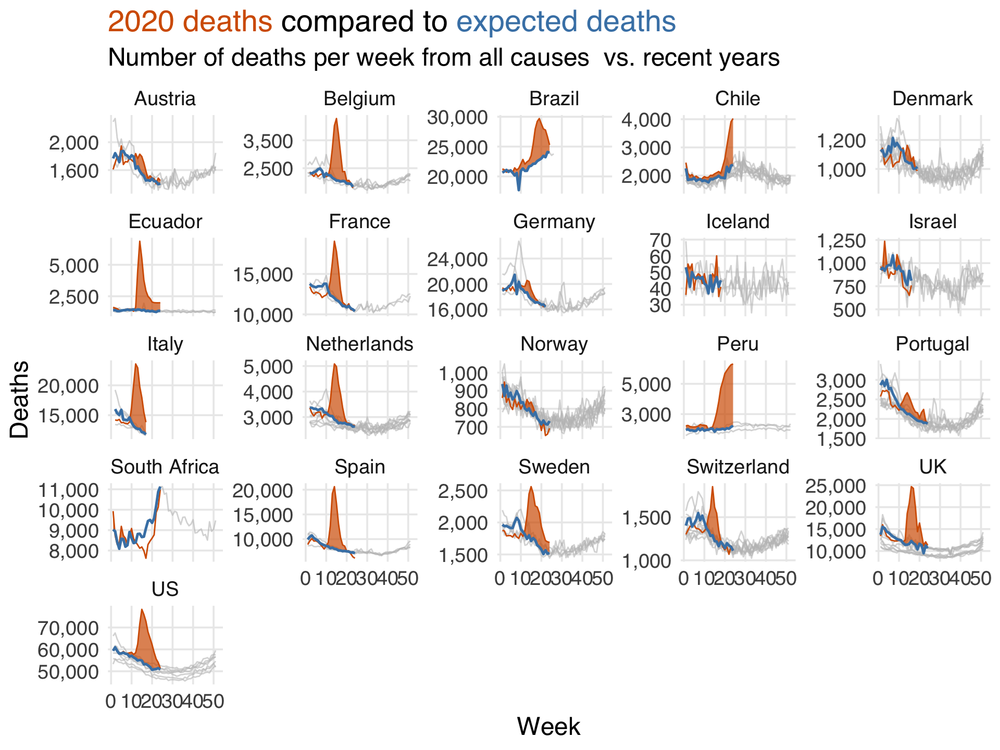

```{r echo = FALSE}
setwd("C:/Users/danfe/Dropbox/Proyectos Daniel/Cursos - diplomados - Maestrias/Programa de autoformación en investigación y análisis de datos/Rmarkdowns/Epidemiología/Semana 6 Descripción predicción y causalidad")

knitr::opts_chunk$set(echo = TRUE, warning = FALSE, message = FALSE,
                         fig.show = "asis", results = "show",
                      fig.align='center',
                      fig.path = "figures/",  # Configura el directorio donde se guardan los gráficos
  dev = "png")
```
Un excelente primer paso para abordar este problema es reconocer que las preguntas sobre descripción, predicción y explicación son fundamentalmente diferentes. La ciencia de datos en la industria no está tan cargada por la inferencia causal de Schrödinger como las ciencias académicas, pero la inferencia casual ocurre de muchas otras maneras. Por ejemplo, cuando una parte interesada pregunta por los “impulsores” de un evento en particular, ¿qué pregunta? ¿Para que un modelo prediga el evento? ¿Para una comprensión más profunda de las causas del evento? Es una petición vaga, pero nos huele a interés causal; sin embargo, muchos científicos de datos se sentirán tentados a responder esta pregunta con un modelo predictivo. Cuando tenemos claros nuestros objetivos, podemos utilizar los tres enfoques con mayor eficacia (y, como veremos, tanto el análisis descriptivo como los modelos de predicción siguen siendo útiles cuando el objetivo es hacer inferencias causales). Además, los tres enfoques son herramientas útiles para la toma de decisiones.


# Description

El análisis descriptivo tiene como objetivo describir la distribución de variables, a menudo estratificadas por variables clave de interés. Una idea relacionada es el análisis exploratorio de datos (EDA), aunque los estudios descriptivos a menudo tienen objetivos más explícitos que los de EDA.

Estos análisis se basan generalmente en resúmenes estadísticos como medidas de centralidad (medias, medianas) y dispersión (mínimos, máximos, cuartiles), pero ocasionalmente también utilizan técnicas como el modelado de regresión. El objetivo de aplicar técnicas más avanzadas como la regresión es diferente en los análisis descriptivos que en los predictivos o causales. "Ajustar" una variable en análisis descriptivos significa que estamos eliminando su efecto asociativo (y así cambiando nuestra pregunta), no que estamos controlando la confusión.

En epidemiología, un concepto valioso para análisis descriptivos es "persona, lugar y tiempo" - quién tiene qué enfermedad, dónde y cuándo. Este concepto también es una buena plantilla para análisis descriptivos en otros campos. Por lo general, queremos ser claros sobre qué población estamos tratando de describir, por lo que necesitamos ser lo más específicos posible. Para la salud humana, describir a las personas involucradas, el lugar y el período son críticos. En otras palabras, concéntrate en los primeros principios para generar comprensión de tus datos y describe tus datos en consecuencia.

**Ejemplos**

-   Contar cosas es una de las mejores cosas que podemos hacer con datos. EDA beneficia tanto a los análisis predictivos como a los causales, pero los análisis descriptivos son valiosos independientemente de las otras tareas de análisis. Pregunta a cualquier científico de datos que pensaba que desarrollaría modelos de aprendizaje automático complejos y que encontró que pasaba la mayor parte de su tiempo en paneles de control. Comprender las distribuciones de los datos, especialmente para objetivos de análisis clave (por ejemplo, KPI en la industria o la incidencia de enfermedades en epidemiología), es fundamental para muchos tipos de toma de decisiones.

-   Uno de los mejores ejemplos recientes de análisis descriptivos surgió de la pandemia de COVID-19 (Fox et al. 2022). En 2020, especialmente en los primeros meses de la pandemia, los análisis descriptivos fueron vitales para comprender el riesgo y asignar recursos (inicialmente como estudios de factores asociados). Dado que el coronavirus es similar a otras enfermedades respiratorias, teníamos muchas herramientas de salud pública para reducir el riesgo (por ejemplo, distanciamiento y, más tarde, mascarillas). Las estadísticas descriptivas de casos por región fueron vitales para decidir políticas locales y la fuerza de esas políticas.

-   Un gran ejemplo de un análisis descriptivo más complejo durante la pandemia fue un informe continuo del Financial Times sobre muertes esperadas vs. muertes observadas en varios países y regiones. Si bien el cálculo de las muertes esperadas es ligeramente más sofisticado que la mayoría de las estadísticas descriptivas, proporcionó una tremenda cantidad de información sobre las muertes actuales sin necesidad de desentrañar efectos causales (por ejemplo, ¿fueron debido al COVID-19 directamente? ¿Atención médica inaccesible? ¿Eventos cardiovasculares post-COVID?).

```{r, echo=FALSE, fig.cap=" "}

```

-   Estimación de las desigualdades en la histerectomía en función de la raza y la etnia (Gartner et al. 2020). Este estudio examinó las desigualdades en histerectomías específicas por raza y etnia. Utiliza técnicas descriptivas para entender disparidades en áreas como economía y epidemiología. Los autores se preguntan si el riesgo de histerectomía varía según el origen racial o étnico. Aunque el análisis está estratificado por una variable clave, sigue siendo descriptivo. Los autores también se aseguraron de que la investigación respondiera preguntas sobre la población objetivo correcta, combinando varias fuentes de datos para estimar mejor la prevalencia real en la población general y ajustando por la prevalencia de histerectomía, calculando la tasa de incidencia solo entre aquellos que podrían tener una histerectomía.

-   La prevalencia de infecciones por clamidia y gonococos ( Miller 2004 ). Medir la prevalencia de una enfermedad (cuántas personas padecen actualmente una enfermedad, generalmente expresada como una tasa por número de personas) es útil para la salud pública básica (recursos, prevención, educación) y la comprensión científica. En este estudio, los autores realizaron una encuesta compleja destinada a ser representativa de todas las escuelas secundarias de los Estados Unidos (la población objetivo); utilizaron ponderaciones de la encuesta para abordar una variedad de factores relacionados con su pregunta, luego calcularon las tasas de prevalencia y otras estadísticas. Como veremos, las ponderaciones son útiles en la inferencia causal por la misma razón: apuntar a una población en particular. Dicho esto, no todas las técnicas de ponderación son de naturaleza causal.

**Validez**

Hay dos cuestiones críticas de validez en los análisis descriptivos: errores de medición y de muestreo.

El error de medición ocurre cuando hemos medido mal una o más variables de alguna manera. Para los análisis descriptivos, medir mal las cosas significa que es posible que no obtengamos la respuesta a nuestra pregunta. Sin embargo, el grado en que esto sea así depende tanto de la gravedad del error de medición como de la pregunta misma.

El error de muestreo es un tema más matizado en los análisis descriptivos. Está relacionado con la población que estamos analizando (sobre quién debería producir descripciones el análisis) y la incertidumbre (qué tan seguros estamos de que las descripciones de aquellos de quienes tenemos datos representan la población que estamos tratando de describir).

La población de la que provienen nuestros datos y la población que intentamos describir deben ser la misma para que podamos proporcionar descripciones válidas. Considere un conjunto de datos generado por una encuesta en línea. ¿Quiénes son las personas que responden estas preguntas y cómo se relacionan con las personas que queremos describir? Para muchos análisis, las personas que se toman el tiempo para responder encuestas son diferentes de las personas que queremos describir; por ejemplo, el grupo de personas que completan encuestas puede tener una distribución de variables diferente a la de aquellos que no lo hacen. Los resultados de datos como estos no están técnicamente sesgados porque, aparte de la incertidumbre relacionada con el tamaño de la muestra y el error de medición, las descripciones son precisas; ¡simplemente no son para el grupo correcto de personas! En otras palabras, hemos obtenido una respuesta a la pregunta equivocada .

En particular, a veces nuestros datos representan a toda la población (o lo suficientemente cerca) como para que el error de muestreo sea irrelevante. Considere una empresa con ciertos datos sobre cada cliente que utiliza su servicio. Para muchos análisis, esto representa a toda la población (clientes actuales) sobre la cual queremos información. De manera similar, en países con registros sanitarios de toda la población, los datos disponibles para fines prácticos específicos son lo suficientemente cercanos a toda la población como para que no sea necesario realizar un muestreo (aunque los investigadores podrían utilizar el muestreo para cálculos más simples). En estos casos, no existe realmente la incertidumbre. Suponiendo que todo esté bien medido, las estadísticas resumidas que generamos son inherentemente imparciales y precisas porque tenemos información de todos los miembros de la población. Por supuesto, en la práctica, generalmente tenemos alguna combinación de errores de medición, datos faltantes, etc., incluso en las mejores circunstancias.

Un detalle crucial del análisis descriptivo es que el sesgo de confusión, una de las principales preocupaciones de este programa, no está definido. Esto se debe a que la confusión es una preocupación causal. Los análisis descriptivos no pueden confundirse porque son una descripción estadística de las relaciones tal como están en la realidad, no los mecanismos detrás de esas relaciones.

**Relación con la inferencia causal**

Los humanos ven patrones en todos lados. La búsqueda de patrones es una característica útil de nuestro cerebro, pero también puede llevarnos a una pendiente resbaladiza de inferencia cuando no estamos trabajando con datos o métodos que nos permitan hacerlo de manera válida. Lo más importante con lo que hay que tener cuidado cuando el objetivo es describir es dar el salto de la descripción a la causalidad (implícita o explícitamente).

Pero, por supuesto, el análisis descriptivo es útil cuando estimamos efectos causales. Nos ayuda a comprender la población con la que estamos trabajando, la distribución de los resultados, las exposiciones (variables que creemos que podrían ser causales) y los factores de confusión (variables que debemos tener en cuenta para obtener efectos causales imparciales de la exposición). También nos ayuda a asegurarnos de que la estructura de datos que estamos usando coincida con la pregunta que intentamos responder. Siempre debe realizar análisis descriptivos de sus datos al realizar una investigación causal.

Finalmente, hay ciertas circunstancias en las que podemos hacer inferencias causales con estadísticas básicas. Tenga cuidado también aquí con la distinción entre la pregunta causal y el componente descriptivo: sólo porque estemos usando el mismo cálculo (por ejemplo, una diferencia de medias) no significa que todas las descripciones que pueda generar sean causales. Que un análisis descriptivo se superponga con un análisis causal es una función de los datos y de la pregunta.

# Predicción

El objetivo de la predicción es utilizar datos para hacer predicciones precisas sobre variables, generalmente sobre datos nuevos. Lo que esto significa depende de la pregunta, el dominio, etc. Los modelos de predicción se utilizan en prácticamente todos los entornos imaginables, desde modelos clínicos revisados ​​por pares hasta modelos de aprendizaje automático personalizados integrados en dispositivos de consumo. Incluso los modelos de lenguaje grandes como en los que se basa ChatGPT son modelos de predicción: predicen cómo sería una respuesta a un mensaje.

El modelado predictivo generalmente utiliza un flujo de trabajo diferente al flujo de trabajo del modelado causal que presentaremos en este libro. Dado que el objetivo de la predicción suele estar relacionado con hacer predicciones sobre datos nuevos, el flujo de trabajo de este tipo de modelado se centra en maximizar la precisión predictiva manteniendo al mismo tiempo la generalización a datos nuevos, lo que a veces se denomina equilibrio entre sesgo y varianza. En la práctica, esto significa dividir sus datos en conjuntos de entrenamiento (la parte de los datos sobre la que construye su modelo) y conjuntos de prueba (la parte con la que evalúa su modelo, un indicador de cómo se comportaría con datos nuevos). Por lo general, los científicos de datos utilizan validación cruzada u otras técnicas de muestreo para reducir aún más el riesgo de sobreajustar su modelo al conjunto de entrenamiento.

**Ejemplos:**

-   Veamos un ejemplo de predicción sobre COVID-19. En 2021, los investigadores publicaron el modelo de Deterioro ISARIC 4C, un modelo pronóstico clínico para predecir resultados adversos graves para el COVID-19 agudo (Gupta et al. 2021). Los autores incluyeron un análisis descriptivo para comprender la población a partir de la cual se desarrolló este modelo, particularmente la distribución del resultado y los predictores candidatos. Un aspecto útil de este modelo es que utiliza elementos comúnmente medidos el primer día de hospitalización relacionada con COVID. Los autores construyeron este modelo utilizando validación cruzada por región del Reino Unido y luego probaron el modelo en datos de una región excluida. El modelo final incluyó once elementos y una descripción de sus atributos del modelo, relación con el resultado, entre otros. Notablemente, los autores utilizaron conocimientos clínicos del dominio para seleccionar variables candidatas pero no cayeron en la tentación de interpretar los coeficientes del modelo como causales. Sin lugar a dudas, parte del valor predictivo de este modelo se deriva de la estructura causal de las variables en relación con el resultado, pero los investigadores tenían un objetivo completamente diferente para este modelo y se adhirieron a él.

-   Uno de los trabajos más emocionantes en modelado predictivo se encuentra en la industria. Netflix comparte regularmente detalles sobre su éxito en modelado y estrategias novedosas en su blog de investigación. También publicaron recientemente un documento que revisa su uso de modelos de aprendizaje profundo para sistemas de recomendación (en este caso, recomendando programas y películas a los usuarios) (Steck et al. 2021). Los autores explican su experimentación con modelos, los detalles de esos modelos y muchos de los desafíos que enfrentaron, lo que resulta en una guía práctica sobre el uso de tales modelos

**NOTA**.

Existen muchos modelos de predicción propuestos para diferentes patologías. Algunos autores recomiendan ya no construir modelos de predicción nuevos.

-   Un ejemplo de ello, podemos ver en una revisión sobre modelos de predicción del riesgo de enfermedad cardiovascular en la población general, donde existe un exceso de modelos que predicen la incidencia de ECV en la población general. La utilidad de la mayoría de los modelos sigue sin estar clara debido a deficiencias metodológicas, presentación incompleta y falta de validación externa y estudios de impacto del modelo. los autores de la revisión recomendaron que, en lugar de desarrollar otro modelo similar de predicción del riesgo de ECV, en esta era de grandes conjuntos de datos, la investigación futura debería centrarse en validar y comparar externamente modelos prometedores de riesgo de ECV que ya existen, en adaptar o incluso combinar estos modelos a entornos locales. e investigar si estos modelos pueden ampliarse mediante la adición de nuevos predictores (<https://www.bmj.com/content/353/bmj.i2416>).

**Validez**

La medida clave de validez en el modelado predictivo es la precisión predictiva, que puede medirse de varias maneras, como el error cuadrático medio (RMSE), el error absoluto medio (MAE), el área bajo la curva (AUC), y muchas más. Un detalle conveniente sobre el modelado predictivo es que a menudo podemos evaluar si estamos en lo correcto (clasificación correcta en función a un gold standar que representaría el valor real), lo cual no es cierto para las estadísticas descriptivas, para las cuales solo tenemos un subconjunto de datos, o para la inferencia causal, para la cual no conocemos la verdadera estructura causal. No siempre podemos evaluar contra la verdad, pero casi siempre es necesario para ajustar el modelo predictivo inicial.

El error de medición también es una preocupación para el modelado predictivo porque generalmente necesitamos datos precisos para predicciones precisas. Curiosamente, el error de medición y la falta de datos pueden ser informativos en entornos predictivos. En un entorno causal, esto podría inducir sesgo, pero los modelos predictivos pueden consumir esa información sin problemas.

Al igual que en el análisis descriptivo, la confusión no está definido para el modelado predictivo. Un coeficiente en un modelo de predicción no puede ser confundido; solo nos importa si la variable proporciona información predictiva, no si esa información se debe a una relación causal o a algo más.

**La relación con la inferencia causal**

El mayor riesgo en la predicción es asumir que un coeficiente dado en un modelo tiene una interpretación causal. Existe una buena posibilidad de que esto no sea así. Un modelo puede predecir bien pero también puede tener coeficientes completamente sesgados desde un punto de vista causal.

A menudo, las personas utilizan erróneamente métodos para seleccionar características (variables) de los modelos de predicción para seleccionar factores de confusión en los modelos causales. Aparte del riesgo de sobreajuste, estos métodos son apropiados para modelos de predicción pero no para modelos causales. Las métricas de predicción no pueden determinar la estructura causal de su pregunta y el valor predictivo del resultado no convierte una variable en un factor de confusión. En general, el conocimiento previo (no la predicción ni las estadísticas asociativas) debería ayudarle a seleccionar variables para los modelos causales Robins y Wasserman ( 1999 ).

Sin embargo, la predicción es crucial para la inferencia causal. Desde una perspectiva filosófica, estamos comparando predicciones de diferentes escenarios hipotéticos : ¿cuál sería el resultado si sucediera una cosa versus si sucediera otra? Dedicaremos mucho tiempo a este tema (proximas semanas). También hablaremos mucho sobre la predicción desde una perspectiva práctica: al igual que en la predicción y algunas descripciones, usaremos técnicas de modelado para responder preguntas causales. Técnicas como los métodos de puntuación de propensión y el cálculo g utilizan predicciones de modelos para responder preguntas causales, pero el flujo de trabajo para construir e interpretar los modelos en sí es bastante diferente.


# Inferencia causal

El objetivo de la inferencia causal es comprender el impacto que una variable, a veces denominada exposición, tiene sobre otra variable, a veces denominada resultado. “Exposición” y “resultado” son los términos que usaremos en este libro para describir la relación causal que nos interesa. Es importante destacar que nuestro objetivo es responder esta pregunta de forma clara y precisa. En la práctica, esto significa utilizar técnicas como el diseño del estudio (por ejemplo, un ensayo aleatorio) o métodos estadísticos (como puntuaciones de propensión) para calcular un efecto insesgado de la exposición sobre el resultado.

Al igual que con la predicción y la descripción, es mejor comenzar con una pregunta clara y precisa para obtener una respuesta clara y precisa. En estadística y ciencia de datos, particularmente mientras navegamos por el océano de datos del mundo moderno, a menudo terminamos con una respuesta sin una pregunta. Esto, por supuesto, dificulta la interpretación de la respuesta.

**Inferencia causal vs explicación** 

Algunos autores utilizan las frases "inferencia causal" y "explicación" indistintamente. Somos un poco más cautelosos al respecto. La inferencia causal siempre tiene una relación con la explicación, pero podemos estimar con precisión el efecto de una cosa sobre otra sin entender cómo sucede.

Pensemos en John Snow, el llamado padre de la epidemiología. En 1854, Snow investigó un brote de cólera en Londres e identificó que fuentes de agua específicas eran las culpables de la enfermedad. Tenía razón: el agua contaminada era un mecanismo de transmisión del cólera. Sin embargo, no tenía suficiente información para explicar cómo: Vibrio cholerae , la bacteria responsable del cólera, no fue identificada hasta casi treinta años después.


**Ejemplos** 

-   A medida que la pandemia continuaba y herramientas como vacunas y tratamientos antivirales estaban disponibles, políticas como el uso universal de mascarillas también comenzaron a cambiar. En febrero de 2022, el estado de Massachusetts en EE. UU. revocó una política estatal que requería el uso universal de mascarillas en las escuelas públicas. En el área metropolitana de Boston, algunos distritos escolares continuaron con la política mientras que otros la discontinuaron; aquellos que la discontinuaron también lo hicieron en diferentes momentos en las semanas siguientes al cambio de política. Esta diferencia en la política permitió a los investigadores aprovechar las diferencias en las políticas de los distritos durante este período para estudiar el impacto del uso universal de mascarillas en los casos de COVID-19.

-   Los investigadores incluyeron un análisis descriptivo de los distritos escolares para comprender la distribución de los factores relacionados con COVID-19 y otros determinantes de la salud. Para estimar el efecto del uso universal de mascarillas en los casos, los autores utilizaron una técnica común en la inferencia causal relacionada con políticas llamada diferencia en diferencias para estimar este efecto.

-   Su diseño alivia algunas suposiciones problemáticas necesarias para la inferencia causal, pero también controlaron sabiamente los posibles confundidores a pesar de esa ventaja. Los autores encontraron que los distritos que continuaron usando mascarillas vieron una carga de casos drásticamente menor que aquellos que no lo hicieron; su análisis concluyó que casi 12,000 casos adicionales ocurrieron debido al cambio de política, casi el 30% de los casos en los distritos durante las 15 semanas del estudio.

-   El Estudio Tuskegee es uno de los ejemplos más infames de abuso médico en la historia moderna. Comúnmente se señala como una fuente de desconfianza en la comunidad médica por parte de los afroamericanos. Los investigadores en economía de la salud utilizaron una variación de las técnicas de diferencia en diferencias para evaluar el efecto del Estudio Tuskegee en la desconfianza y la esperanza de vida en hombres negros mayores. Los resultados son importantes y perturbadores: "Encontramos que la divulgación del estudio en 1972 se correlaciona con aumentos en la desconfianza médica y la mortalidad, y disminuciones tanto en las interacciones con médicos ambulatorios como hospitalarios para hombres negros mayores. Nuestras estimaciones implican que la esperanza de vida a los 45 años para los hombres negros disminuyó hasta 1.5 años en respuesta a la divulgación, representando aproximadamente el 35% de la brecha en la esperanza de vida en 1980 entre hombres blancos y negros y el 25% de la brecha entre hombres negros y mujeres".

**Validez**

Hacer inferencias causales válidas requiere varios supuestos que analizaremos en la siguientes semanas. A diferencia de la predicción, generalmente no podemos confirmar que nuestros modelos causales sean correctos. En otras palabras, la mayoría de las suposiciones que debemos hacer no son verificables. Volveremos a este tema una y otra vez en el libro, desde los conceptos básicos de estos supuestos hasta la toma de decisiones prácticas y la investigación de problemas en nuestros modelos.


# ¿Por qué el modelo causal correcto no es sólo el mejor modelo de predicción?

En este punto, puede preguntarse por qué el modelo causal correcto no es simplemente el mejor modelo predictivo. Tiene sentido que los dos estén relacionados: naturalmente, las cosas que causan otras cosas serían predictores. La causalidad se extiende hasta el fondo, por lo que cualquier información predictiva está relacionada, en cierta medida, con la estructura causal de lo que estamos prediciendo. ¿No sería lógico pensar que un modelo que predice bien también es causal? Es cierto que algunos modelos predictivos pueden ser excelentes modelos causales y viceversa. Desafortunadamente, este no siempre es el caso; los efectos causales no necesariamente predicen particularmente bien, y los buenos predictores no necesariamente son imparciales causalmente (Shmueli 2010). No hay forma de saberlo solo usando datos.

Veamos primero la perspectiva causal porque es un poco más simple. Considere un modelo causalmente imparcial para una exposición pero que solo incluye variables relacionadas con el resultado y la exposición. En otras palabras, este modelo nos proporciona la respuesta correcta para la exposición de interés pero no incluye otros predictores del resultado. Si un resultado tiene muchas causas, es probable que un modelo que describe con precisión la relación con la exposición no prediga muy bien el resultado. Del mismo modo, si un efecto causal real de la exposición sobre el resultado es pequeño, aportará poco valor predictivo. En otras palabras, la capacidad predictiva de un modelo, ya sea alta o baja, no puede ayudarnos a distinguir si el modelo nos está dando la respuesta correcta. Por supuesto, una baja potencia predictiva también podría indicar que un efecto causal no es muy útil desde una perspectiva aplicada, aunque eso depende de varios factores estadísticos.

En segundo lugar, las variables que son sesgadas desde una perspectiva causal a menudo también aportan poder predictivo. Discutiremos qué variables incluir y cuáles no en sus modelos en proximas sesiones, pero consideremos un ejemplo simple. Uno de los famosos ejemplos de relaciones confundidas es la venta de helados y la criminalidad en verano. Descriptivamente, la venta de helados y la criminalidad están relacionadas, pero esta relación está confundida por el clima, es decir, tanto la venta de helados como la criminalidad aumentan cuando hace más calor. (Esto es simplista, por supuesto, ya que el clima en sí mismo no causa la criminalidad, pero está en el camino causal).

Considere un experimento mental en el que está en una habitación oscura. Su objetivo es predecir la criminalidad, pero no sabe el clima ni la época del año. Sin embargo, tiene información sobre la venta de helados. Un modelo con ventas de helados sobre la criminalidad estaría sesgado desde una perspectiva causal: las ventas de helados no causan la criminalidad, aunque el modelo mostraría un efecto, pero proporcionaría algún valor predictivo a su modelo de criminalidad. La razón de ambas condiciones es la misma: las ventas de helados y el clima están correlacionados, al igual que el clima y la criminalidad. Las ventas de helados pueden servir, con éxito pero de manera imperfecta, como un proxy para el clima. Eso resulta en una estimación de efecto sesgada del impacto causal de las ventas de helados en la criminalidad pero en una predicción parcialmente efectiva de la criminalidad. Otras variables también, que son inválidas desde una perspectiva causal, ya sea porque están sesgadas ellas mismas o porque introducen sesgo en la estimación del efecto causal, a menudo aportan un buen valor predictivo. Por lo tanto, la precisión predictiva no es una buena medida de causalidad.

Una idea estrechamente relacionada es la "falacia de la Tabla Dos", así llamada porque, en los documentos de investigación en salud, los análisis descriptivos a menudo se presentan en la Tabla 1, y los modelos de regresión a menudo se presentan en la Tabla 2 (Westreich y Greenland 2013). La falacia de la Tabla Dos es cuando un investigador presenta confundidores y otras variables no efectivas, particularmente cuando interpreta esos coeficientes como si también fueran causales. El problema es que, en algunas situaciones, el modelo para estimar un efecto imparcial de una variable puede no ser el mismo modelo para estimar un efecto imparcial de otra variable. En otras palabras, no podemos interpretar los efectos de los confundidores como causales porque ellos mismos podrían estar confundidos por otra variable no relacionada con la exposición original.

Los análisis descriptivos, predictivos y causales siempre contendrán algún aspecto de los demás. Un modelo predictivo obtiene parte de su poder predictivo de la estructura causal del resultado, y un modelo causal tiene cierto poder predictivo porque contiene información sobre el resultado. Sin embargo, el mismo modelo en los mismos datos con diferentes objetivos tendrá diferentes utilidades según esos objetivos.

# Referencias

-   Ross, R.D., Shi, X., Caram, M.E.V. et al. Veridical causal inference using propensity score methods for comparative effectiveness research with medical claims. Health Serv Outcomes Res Method (2020). <https://doi.org/10.1007/s10742-020-00222-8>

-   Elwert, F. (2013). Graphical Causal Models. In S. L. Morgan (Ed.), *Handbook of Causal Analysis for Social Research* (pp. 245--273). Springer.

-   Hernán, M. A., & Robbins, J. M. (2020). *Causal Inference: What If*. CRC Press.

-   Morgan, S. L., & Winship, C. (2007). *Counterfactuals and Causal Inference: Methods and Principles for Social Research*. Cambridge University Press.

-   Pearl, J., Glymour, M., & Jewell, N. P. (2016). *Causal Inference in Statistics: A Primer*. Wiley.

-   Pearl, J., & Mackenzie, D. (2018). *The Book of Why: The New Science of Cause and Effect*. Basic Books.

-   Rohrer, J. M. (2018). Thinking Clearly About Correlations and Causation: Graphical Causal Models for Observational Data. *Advances in Methods and Practices in Psychological Science*, *1*(1), 27--42.

-   Shalizi, C. R. (2019). *Advanced Data Analysis From an Elementary Point of view*. <https://www.stat.cmu.edu/~cshalizi/ADAfaEPoV/ADAfaEPoV.pdf>

-   Causal Inference <https://www.r-causal.org/>
