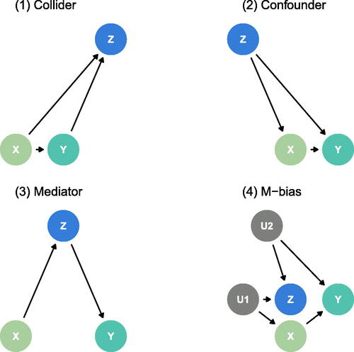
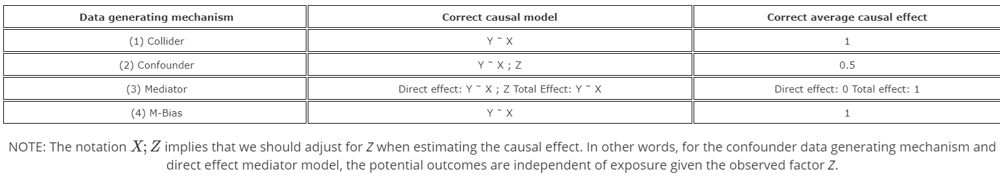
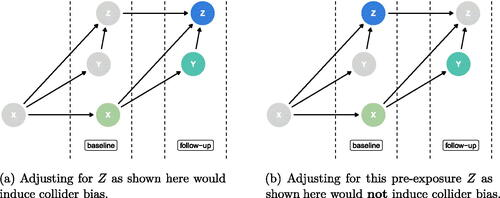

## Cuarteto causal

```{r}

setwd("C:/Users/danfe/Dropbox/Proyectos Daniel/Cursos - diplomados - Maestrias/Programa de autoformación en investigación y análisis de datos/Rmarkdowns/Epidemiología/Semana 8 DAG")

library(tidyverse)
# install.packages("quartets")
library(quartets)
```

```{r, echo=FALSE, fig.cap=" "}

```

```{r}
## Figure 2
ggplot(causal_quartet, aes(x = exposure, y = outcome)) +
geom_point(alpha = 0.25) +
geom_smooth(
    method = "lm",
    formula = "y ~ x",
    linewidth = 1.1,
    color = "steelblue",
    se = FALSE) +
facet_wrap(~dataset)
```

```{r, echo=FALSE, fig.cap=" "}

```

```{r}
## Table 1
tbl_1 <- causal_quartet |>
        nest_by(dataset) |>
        mutate(ate_x = coef(lm(outcome ~ exposure, data = data))[2],
        ate_xz = coef(lm(outcome ~ exposure + covariate, data = data))[2],
        cor = cor(data$exposure, data$covariate)) |>
        select(-data, dataset)

tbl_1
```

DAG de colisionador ordenado en el tiempo (con el tiempo aumentando de izquierda a derecha) donde cada factor se mide dos veces. X es la exposición, Y es el resultado y Z es el factor medido. El nodo Z resaltado indica qué punto temporal se está ajustando al estimar el efecto promedio del tratamiento del X resaltado sobre el Y resaltado.

```{r, echo=FALSE, fig.cap=" "}

```

```{r}
## Table 2
tbl_2 <- causal_quartet_time |>
          nest_by(dataset) |>
          mutate(ate_x = coef(lm(outcome_followup ~ exposure_baseline, 
                                 data = data))[2],
          ate_xz = coef(lm(outcome_followup ~ exposure_baseline + 
                             covariate_baseline,
                             data = data))[2]) |>
          bind_cols(tibble(truth = c(1, 0.5, 1, 1))) |>
          select(-data, dataset)

tbl_2
```

Se recomienda ampliamente ajustar únicamente los factores previos a la exposición. La única excepción es cuando un factor de confusión conocido se mide únicamente después de la exposición en un análisis de datos en particular, en cuyo caso algunos expertos recomiendan ajustarlo. Aun así, se recomienda precaución.

## Evaluación de DAGs

```{r}
# remotes::install_github("easystats/performance")
#install.packages("ggdag")
#install.packages("dagitty")

library(performance)
library(ggdag)
library(dagitty)
library(tidyverse)


# no adjustment needed
check_dag(
  y ~ x + b,
  outcome = "y",
  exposure = "x"
)
```

```{r}
# incorrect adjustment
dag <- check_dag(
  y ~ x + b + c,
  x ~ b + d,
  outcome = "y",
  exposure = "x"
)

dag

adjustmentSets(dag)

ggdag::ggdag_status(dag, node_size = 12, label_size = 3.88) + 
  theme_dag()

ggdag_paths(dag) + 
  theme_dag()
```

```{r}
# After adjusting for `b`, the model is correctly specified
dag <- check_dag(
  y ~ x + b + c,
  x ~ b + d,
  outcome = "y",
  exposure = "x",
  adjusted = "b"
)
dag

# Objects returned by `check_dag()` can be used with "ggdag" or "dagitty"
ggdag::ggdag_status(dag) + 
  theme_dag()
```

```{r}
# Using a model object to extract information about outcome,
# exposure and adjusted variables
data(mtcars)
m <- lm(mpg ~ wt + gear + disp + cyl, data = mtcars)
dag <- check_dag(
  m,
  wt ~ disp + cyl,
  wt ~ am 
)
dag

ggdag::ggdag_status(dag) + 
  theme_dag()
```

### Ejemplo: Mosquitos

```{r}
mosquito_dag <- check_dag( 
  malaria_risk ~ net + income + health + temperature + resistance,
  net ~ income + health + temperature + eligible + household,
  eligible ~ income + household,
  health ~ income,
  exposure = "net",
  outcome = "malaria_risk",
  coords = list(x = c(malaria_risk = 7, net = 3, income = 4, health = 5,
                      temperature = 6, resistance = 8.5, eligible = 2, household = 1),
                y = c(malaria_risk = 2, net = 2, income = 3, health = 1,
                      temperature = 3, resistance = 2, eligible = 3, household = 2)),
  labels = c(malaria_risk = "Risk of malaria", net = "Mosquito net", income = "Income",
             health = "Health", temperature = "Nighttime temperatures", 
             resistance = "Insecticide resistance",
             eligible = "Eligible for program", household = "Number in household")
)

mosquito_dag

adjustmentSets(mosquito_dag)

ggdag_status(mosquito_dag, use_labels = "label", text = FALSE,
             node_size = 12, label_size = 3.88) + 
  guides(fill = FALSE, color = FALSE) +  # Disable the legend
  theme_dag()


ggdag_paths(mosquito_dag, use_labels = "label", 
            text = FALSE, node_size = 10, label_size = 2.88, stylized=T) + 
  theme_dag()

```
