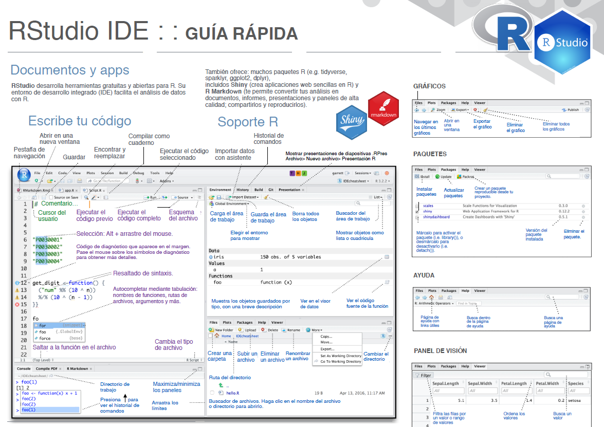
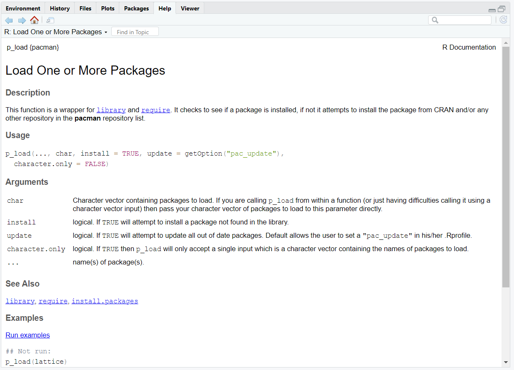
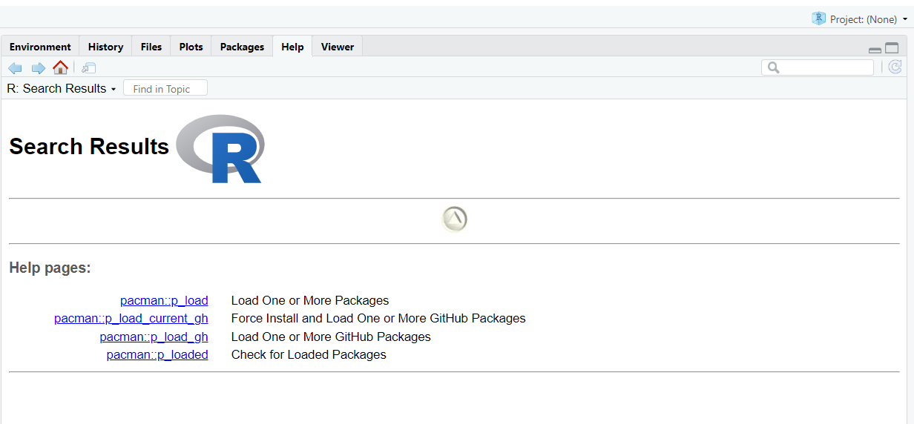
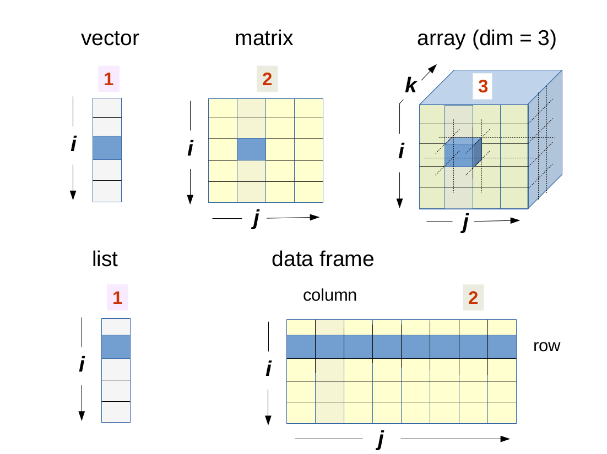
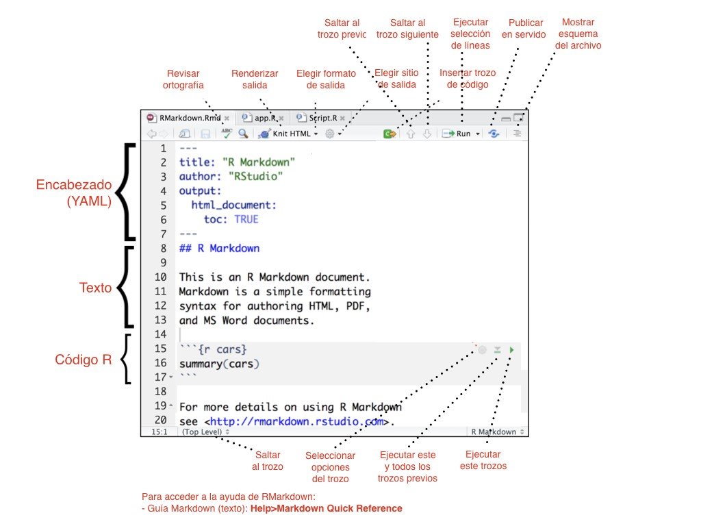
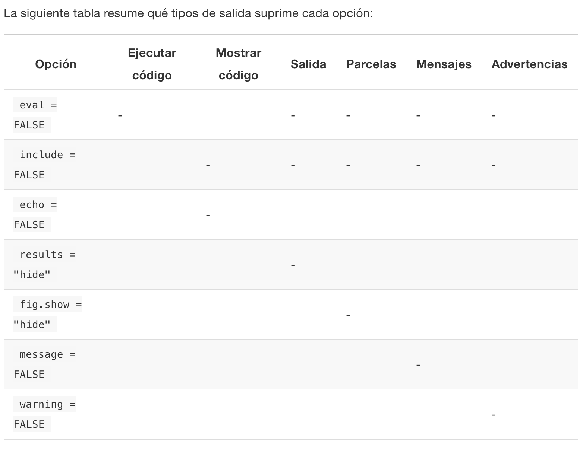

```{r echo = FALSE}
setwd("C:/Users/danfe/Dropbox/Proyectos Daniel/Cursos - diplomados - Maestrias/Programa de autoformación en investigación y análisis de datos/Rmarkdowns/Estadística/Programa de formación/Semana 1 introR")

knitr::opts_chunk$set(echo = TRUE, warning = FALSE, message = FALSE,
                         fig.show = "asis", results = "show",
                      fig.align='center',
                      fig.path = "figures/",  # Configura el directorio donde se guardan los gráficos
  dev = "png")
```


\newpage

# ¿Qué es R, RStudio?

## R

Para empezar, R es un software que fue diseñado para hacer análisis estadísticos y gráficas, y es software libre.

## RStudio

Ahora, por un lado, R es el lenguaje de programación, como el que hace las cuentas.
Por otro lado, R Studio es un IDE o entorno de desarrollo integrado.
En español, eso significa que RStudio es un programa para manejar R y utilizarlo de manera más cómoda en algunos aspectos.

## ¿Cómo instalar R y RStudio?
Ir a la web de Posit (https://posit.co/download/rstudio-desktop/), instalar R y luego RStudio. Simplemente descargar el archivo que corresponde a vuestro sistema operativo (Linux, Mac o Window), abrir el archivo y realizar la instalación por defecto.

Y les dejo algunas indicaciones extra según vuestro sistema operativo para que todo funcione:

Si usas Mac, y aún no lo tienes, descarga e instala XQuartz ( https://www.xquartz.org/) el gestor de ventanas de X11 (no es una instalación predeterminada desde Mac OS X 10.8). A continuación, instalamos las herramientas xcode para terminal de OSX. Ejecutando lo siguiente en la terminal de OSX: xcode-select –install

Si usas Windows y aún no lo tienes, descarga e instala RTools ( https://cran.r-project.org/bin/windows/Rtools/ ), un conjunto de programas necesarios en Windows para crear paquetes R desde el código fuente. Descarga la versión de RTools que corresponda con la versión de R que hayas instalado (e.g. 4.3 en ambos).

Finalmente tras abrir RStudio debemos instalar los paquetes tidyverse, rmarkdown y tinytex con el que trabajaremos a lo largo del curso, os iré indicando más paquetes en cuanto vayamos avanzando. Escribir en la consola R:


\newpage

# Tour rápido por RStudio

```{r echo=FALSE, out.width="85%"}

```

\newpage

# Conceptos básicos de R

## Paquetes o librerias

Cada paquete es una colección de funciones diseñadas para atender una tarea específica.
Por ejemplo, hay paquetes para trabajo visualización geoespacial, análisis psicométricos, mineria de datos, interacción con servicios de internet y muchas otras cosas más.

Estos paquetes se encuentran alojados en **CRAN**, así que pasan por un control riguroso antes de estar disponibles para su uso generalizado.

Podemos instalar paquetes usando la función **install.packages()** y activarlas en el ambiente de R con **library()** Por ejemplo instalar la libraría "pacman": *install.packages("pacman")*.
Esta libreria contiene una función llamada "p_load" que nos permitirá cargar otras librerias de forma simultanea y en caso no tengas instalada alguna la instalará.

```{r}
install.packages("pacman")

# Cargar las librerías
pacman::p_load(
  fs,             # interacciones archivo/directorio
  rio,            # importación/exportación
  here,           # rutas relativas de archivos
  tidyverse)      # gestión y visualización de datos
```

Ahora podremos usar las diferentes funciones ubicadas dentro de cada libreria.
Ejemplo 1: Imprimamos el directorio como un árbol de dendrogramas

- Nota: para indicar el directorio de trabajo presiona  **Ctr+Shift+H** en Windows.

```{r}
fs::dir_tree(path = here("Semana 1 introR"), recurse = TRUE)
```

Ejemplo 2: Veamos los archivos dentro de la sub carpeta "datos"

```{r}
dir(here("Semana 1 introR","datos"))
```

## Funciones

Hemos hablado de funciones dentro de librerias, pero ¿Qué son las funciones?

La instalación base de R tiene suficientes funciones para que realicemos todas las tareas básicas de análisis de datos, desde importar información hasta crear documentos para comunicarla (¡este libro ha sido creado con R!).

Sin embargo, es comun que necesitemos realizar tareas para las que no existe una función específica o que para encontrar solución necesitemos combinarl o utilizar funciones en sucesión, lo cual puede complicar nuestro código.

Ilustremos lo anterior con un ejemplo.

Supongamos que tenemos un jefe que nos ha pedido crear un histograma con datos de edad que hemos recogido en una encuesta.

Esto es sencillo de resolver pues contamos con la función hist() que hace exactamente esto.

Primero, generaremos datos aleatorios sacados de una distribución normal con la función rnorm().
Esta función tiene los siguientes argumentos:

n: Cantidad de números a generar.
mean: Media de la distribución de la que sacaremos nuestros números.
sd: Desviación estándar de la distribución de la que sacaremos nuestros números.

Además, llamaremos set.seed() para que estos resultados sean replicables.
Cada que llamamos rnorm() se generan número aleatorios diferentes, pero si antes llamamos a set.seed(), con un número específico como argumento obtendremos los mismos resultados.

Obtendremos 1500 números con media 15 y desviación estándar .75.

```{r}
set.seed(173)
edades <- rnorm(n = 1500, mean = 15, sd = .75)

```

Veamos los primero diez números de nuestro objeto.

```{r}
edades[1:10]
```

Ahora, sólo tenemos que ejecutar hist() con el argumento x igual a nuestro vector y obtendremos un histograma.

```{r}
# Histograma
hist(x = edades)
```

Estupendo.
Hemos logrado nuestro objetivo.

Nuestro jefe está satisfecho, pero le gustaría que en el histograma se muestre la media y desviación estándar de los datos, que tenga un título descriptivo y que los ejes estén etiquetados en español, además de que las barras sean de color dorado.

Suena complicado, pero podemos calcular la media de los datos usando la función mean(), la desviación estándar con sd() y podemos agregar los resultados de este cálculo al histograma usando la función abline().
Para agregar título, etiquetas en español y colores al histograma sólo basta agregar los argumentos apropiados a la función hist().

No te preocupes mucho por los detalles de todo esto, lo veremos más adelante.

Calculamos media y desviación estándar de nuestros datos.

```{r}
media <- mean(edades)
desv_est <- sd(edades)

```

Agregamos líneas con abline(), para la media de rojo y desviación estándar con azúl.
También ajustamos los argumentos de hist().

```{r}
hist(edades, main = "Edades", xlab = "Datos", ylab = "Frecuencia", col = "gold")
abline(v = media, col = "red")
abline(v = media + (desv_est * c(1, -1)), col = "blue")

```

Con esto nuestro jefe ahora sí ha quedado complacido.
Tanto, que nos pide que hagamos un histograma igual para todas las variables numéricas de esa encuesta.
Que son cincuenta en total.

Para cumplir con esta tarea podríamos usar el código que ya hemos escrito.
Simplemente lo copiamos y pegamos cincuenta veces, cambiando los valores para cada una de variables que nos han pedido.

Pero hacer las cosas de este modo propicia errores y es difícil de corregir y actualizar.

Para empezar, si copias el código anterior cincuenta veces, tendrás un script con más de 400 líneas.
Si en algún momento te equivocas porque escribiste “Enceusta” en lugar de “Encuesta”, incluso con las herramientas de búsqueda de RStudio, encontrar donde está el error será una tarea larga y tediosa.

Y si tu jefe en esta ejemplo quiere que agregues, quites o modifiques tu histograma, tendrás que hacer el cambio cincuenta veces, una para cada copia del código.
De nuevo, con esto se incrementa el riesgo de que ocurran errores.

Es en situaciones como esta en las que se hace evidente la necesidad de crear nuestras propias funciones, capaces de realizar una tarea específica a nuestros problemas, y que pueda usarse de manera repetida.
Así reducimos errores, facilitamos hacer correcciones o cambios y nos hacemos la vida más fácil, a nosotros y a quienes usen nuestro código después.

## crear funciones

Una función tiene un nombre, argumentos y un cuerpo.
Las funciones definidas por el usuario son creadas usando la sigiente estructura.

```{r}
nombre <- function(argumentos) {
  operaciones
}

```

Cuando asignamos una función a un nombre decimos que hemos definido una función.

Los argumentos son las variables que necesita la función para realizar sus operaciones.
Aparecen entre paréntesis, separados por comas.
Los valores son asignados al nombre del argumento por el usuario cada vez que ejecuta una función.
Esto permite que usemos nuestras funciones en distintas situaciones con diferentes datos y especificaciones.

El cuerpo de la función contiene, entre llaves, todas las operaciones que se ejecutarán cuando la función sea llamada.
El cuerpo de una función puede ser tan sencillo o complejo como nosotros deseemos, incluso podemos definir funciones dentro de una función

## Nuestra primera función

Partimos del algoritmo para calcular el área de un cuadrilátero: lado x lado.

Podemos convertir esto a operaciones de R y asignarlas a una función llamada area_cuad de la siguiente manera:

```{r}
area_cuad <- function(lado1, lado2) {
  lado1 * lado2
}
```

Las partes de nuestra función son:

Nombre: area_cuad.
Argumentos: lado1, lado2.
Estos son los datos que necesita la función para calcular el área, representan el largo de los lados de un cuadrilátero.
Cuerpo: La operación lado1 \* lado2, escrita de manera que R pueda interpretarla.
Ejecutaremos nuestra función para comprobar que funciona.
Nota que lo único que hacemos cada que la llamamos es cambiar la medida de los lados del cuadrilátero para el que calcularemos un área, en lugar de escribir la operación lado1 \* lado2 en cada ocasión.

```{r}
area_cuad(lado1 = 4, lado2 = 6)
area_cuad(lado1 = 36, lado2 = 36)
```

En cada llamada a nuestra función estamos asignando valores distintos a los argumentos usando el signo de igual.
Si no asignamos valores a un argumento, se nos mostrará un error

```{r}
# area_cuad(lado1 = 14)
# Error en area_cuad(lado1 = 14): 
  #no se pudo encontrar la función "area_cuad"
```

En R, podemos especificar los argumentos por posición.
El orden de los argumentos se determina cuando creamos una función.

En este caso, nosotros determinamos que el primer argumento que recibe area_cuad es lado1 y el segundo es lado2.
Así, podemos escribir lo siguiente y obtener el resultado esperado.

```{r}
area_cuad(128, 64)
```

Esto es equivalente a escribir lado1 = 128, lado2 = 64 como argumentos.

## Definiendo la función crear_histograma()

Definiremos una función con el nombre crear_histograma() para generar un gráfico con las especificaciones que se nos han pedido.

Partimos de una función sin argumentos y el cuerpo vacio.

```{r}
crear_histograma <- function() {

}
```

Para que esta función realice lo que deseamos necesitamos:

Los datos que serán graficados.
El nombre de la variable graficada Por lo tanto, nuestros argumentos serán:

datos nombre

```{r}
crear_histograma <- function(datos, nombre) {
  
}
```

Ya sabemos las operaciones realizaremos, sólo tenemos que incluirlas al cuerpo de nuestro función.

Reemplazaremos las variables que hacen referencia a un objeto en particular por el nombre de nuestros argumentos.
De esta manera será generalizable a otros casos.

En este ejemplo, cambiamos la referencia a la variable edades por referencias al argumento datos y la referencia a Edades, que usaremos como título del histograma, por una referencia al argumento nombre.

```{r}
crear_histograma <- function(datos, nombre) {
  media <- mean(datos)
  desv_est <- sd(datos)
  
  hist(datos, main = nombre, xlab = "Datos", ylab = "Frecuencia", col = "gold")
  abline(v = media, col = "red")
  abline(v = media + (desv_est * c(1, -1)), col = "blue")
}
```

Probemos nuestra función usando datos distintos, generados de manera similar a las edades, con la función rnorm().

Generaremos datos de ingreso, con una media igual a 15000 y una desviación estándar de 4500.

```{r}
ingreso <- rnorm(1500, mean = 15000, sd = 4500)
```

Corremos nuestra función.

```{r}
crear_histograma(ingreso, "Ingreso")
```

Luce bien.
Probemos ahora con datos sobre el peso de las personas.
siguiendo el mismo procedimiento.

```{r}
peso <- rnorm(75, mean = 60, sd = 15)

crear_histograma(peso, "Peso")

```

No te asustes.
La comunidad de R es tan grande que no tendras necesidad de crear tus propias funciones ya que estas vienen dentro de diferentes librerias.
Por lo que cada vez que necesites correr alguna función en especifico deberas llamar la libreria que lo contiene con p_load() o library().

## Ayuda

¿Qué hacer si no saber que hace una función o que argumentos tiene esta?

Te recomendamos ejecutar la función **help()** o la función **??**

Ejemplo de help(): te llevará a la documentación correspondiente de la función

```{r}
help(p_load)
```

```{r  echo=FALSE, out.width="75%"}

```

Ejemplo de ??:
te presentará todas las funciones que incluyan el nombre "p_load"

```{r}
??p_load
```

```{r  echo=FALSE, out.width="75%"}

```

## Operadores dentro de R

### Operadores aritméticos

Como su nombre lo indica, este tipo de operador es usado para operaciones aritméticas.

En R tenemos los siguientes operadores aritméticos:

```{r message=FALSE, warning=FALSE, echo = FALSE}
# Creamos un dataframe con la información de la tabla
library(knitr)
library(gt)

# Creamos una tabla con tribble
tabla_operadores <- tribble(
  ~Operación, ~Signo, ~Ejemplo, ~Resultado,
  "Suma", "+", "5 + 3", "8",
  "Resta", "-", "5 - 3", "2",
  "Multiplicación", "*", "5 * 3", "15",
  "División", "/", "5 / 3", "1.666667",
  "Potencia", "^", "5 ^ 3", "125",
  "División entera", "%%", "5 %% 3", "2"
)

# Generamos la tabla usando gt
tabla_operadores |> 
  gt() |> 
  tab_style(
    style = cell_text(weight = "bold"),
    locations = cells_column_labels()
  ) |> 
  tab_style(
    style = cell_text(v_align = "top"),
    locations = cells_body()
  ) |> 
  opt_horizontal_padding(scale = 3) |> 
  opt_table_font(font = "Jost")


```

```{r}
# suma
3 + 3

# resta
10 - 7

#multiplicacion
3*3

# división
4/2

# logaritmos
log(100)
log10(100)

# exponenciación
exp(4.60517)
10^2

# valores absolutos
abs(-5)


```

### Operadores relacionales

Los operadores lógicos son usados para hacer comparaciones y siempre devuelven como resultado TRUE o FALSE (verdadero o falso, respectivamente).

```{r message=FALSE, warning=FALSE, echo = FALSE}
tabla_comparadores <- tribble(
  ~Operador, ~Comparación, ~Ejemplo, ~Resultado,
  "<", "Menor que", "5 < 3", "FALSE",
  "<=", "Menor o igual que", "5 <= 3", "FALSE",
  ">", "Mayor que", "5 > 3", "TRUE",
  ">=", "Mayor o igual que", "5 >= 3", "TRUE",
  "==", "Exactamente igual que", "5 == 3", "FALSE",
  "!=", "No es igual que", "5 != 3", "TRUE"
)

# Crear la tabla con gt y personalizar el estilo
tabla_comparadores |> 
  gt() |> 
  tab_style(
    style = cell_text(weight = "bold"),
    locations = cells_column_labels()
  ) |> 
  tab_style(
    style = cell_text(v_align = "middle"),
    locations = cells_body()
  ) |> 
  tab_options(
    table.font.size = "medium",
    table.width = pct(90)
  ) |> 
  opt_horizontal_padding(scale = 3)
```

### Operadores lógicos

Los operadores lógicos son usados para operaciones de álgebra Booleana, es decir, para describir relaciones lógicas, expresadas como verdadero (TRUE) o falso (FALSO).

```{r message=FALSE, warning=FALSE, echo = FALSE}
# Crear la tabla usando tribble
tabla_operadores_logicos <- tribble(
  ~Operador, ~Comparación, ~Ejemplo, ~Resultado,
  "|", "x Ó y es verdadero", "TRUE | FALSE", "TRUE",
  "&", "x Y y son verdaderos", "TRUE & FALSE", "FALSE",
  "!", "x no es verdadero (negación)", "!TRUE", "FALSE",
  "isTRUE(x)", "x es verdadero (afirmación)", "isTRUE(TRUE)", "TRUE"
)

# Crear la tabla con gt y personalizar el estilo
tabla_operadores_logicos |> 
  gt() |> 
  tab_style(
    style = cell_text(weight = "bold"),
    locations = cells_column_labels()
  ) |> 
  tab_style(
    style = cell_text(v_align = "middle"),
    locations = cells_body()
  ) |> 
  tab_options(
    table.width = pct(100),
    table.font.size = "medium"
  ) |> 
  opt_horizontal_padding(scale = 2)
```

Los operadores \| y & siguen estas reglas:

-   **$|$** devuelve *TRUE* si alguno de los datos es *TRUE*
-   **$&$** solo devuelve *TRUE* si ambos datos es *TRUE*
-   **$|$** solo devuelve *FALSE* si ambos datos son *FALSE*
-   **$&$** devuelve *FALSE* si alguno de los datos es *FALSE*

Estos operadores pueden ser usados con estos con datos de tipo numérico, lógico y complejo.
Al igual que con los operadores relacionales, los operadores lógicos siempre devuelven TRUE o FALSE.

### Operadores de asignación
Este es probablemente el operador más importante de todos, pues nos permite asignar datos a variables.

```{r message=FALSE, warning=FALSE, echo = FALSE}
# Crear la tabla usando tribble
tabla_operadores_asignacion <- tribble(
  ~Operador, ~Operación,
  "<-", "Asigna un valor a una variable",
  "=", "Asigna un valor a una variable"
)

# Crear la tabla con gt y personalizar el estilo
tabla_operadores_asignacion |> 
  gt() |> 
  tab_style(
    style = cell_text(weight = "bold"),
    locations = cells_column_labels()
  ) |> 
  tab_style(
    style = cell_text(v_align = "middle"),
    locations = cells_body()
  ) |> 
  tab_options(
    table.width = pct(100),
    table.font.size = "medium"
  ) |> 
  opt_horizontal_padding(scale = 2)
```

En este ejemplo, asignamos valores a las variables estatura y peso.

```{r}
estatura <- 1.73
peso <- 83

```

Llamamos a sus valores asignados
```{r}
estatura
peso
# Usamos operaciones aritmeticas 
peso / estatura ^ 2
# Asignamos dentro de un objeto llamado "bmi"
bmi <- peso / estatura ^ 2
# llamamos bmi
bmi
```


### Orden de operaciones
En R, al igual que en matemáticas, las operaciones tienen un orden de evaluación definido.

Cuanto tenemos varias operaciones ocurriendo al mismo tiempo, en realidad, algunas de ellas son realizadas antes que otras y el resultado de ellas dependerá de este orden.

El orden de operaciones incluye a las aritméticas, relacionales, lógicas y de asignación.

En la tabla siguiente se presenta el orden en que ocurren las operaciones que hemos revisado en este capítulo.

```{r message=FALSE, warning=FALSE, echo = FALSE}
tabla_orden_operadores <- tribble(
  ~Orden, ~Operadores,
  1, "^",
  2, "* /",
  3, "+ -",
  4, "< > <= >= == !=",
  5, "!",
  6, "&",
  7, "|",
  8, "<-"
)

# Crear la tabla con gt y personalizar el estilo
tabla_orden_operadores |> 
  gt() |> 
  tab_style(
    style = cell_text(weight = "bold",align = "center"),
    locations = cells_column_labels()
  ) |> 
  tab_style(
    style = cell_text(v_align = "middle", align = "center"),
    locations = cells_body()
  ) |> 
  tab_options(
    table.width = pct(100),
    table.font.size = "left"
  ) |> 
  opt_horizontal_padding(scale = 1)
```

Si deseamos que una operación ocurra antes que otra, rompiendo este orden de evaluación, usamos paréntesis.

## Estructuras de datos
Las estructuras de datos son objetos que contienen datos. Cuando trabajamos con R, lo que estamos haciendo es manipular estas estructuras.

Las estructuras tienen diferentes características. Entre ellas, las que distinguen a una estructura de otra son su número de dimensiones y si son homogeneas o hereterogeneas.

La siguiente tabla muestra las principales estructuras de control que te encontrarás en R.

```{r message=FALSE, warning=FALSE, echo = FALSE}
# Crear la tabla usando tribble
tabla_dimensiones <- tribble(
  ~Dimensiones, ~Homogeneas, ~Heterogeneas,
  "1", "Vector", "Lista",
  "2", "Matriz", "Data frame",
  "n", "Array", " "
)

# Crear la tabla con gt y aplicar estilo para centrar el texto
tabla_dimensiones |> 
  gt() |> 
  tab_style(
    style = cell_text(weight = "bold", align = "center"),
    locations = cells_column_labels()
  ) |> 
  tab_style(
    style = cell_text(align = "center"),
    locations = cells_body()
  ) |> 
  tab_options(
    table.width = pct(60),
    table.font.size = "medium"
  ) |> 
  opt_horizontal_padding(scale = 2)
```
Diferencias
```{r echo=FALSE, out.width="75%"}

```
### CREACIÓN DE VECTORES. Función c() de concatenar
Un vector es una colección ordenada de elementos del mismo tipo.
Podemos crear un vector de distintas maneras. Por ejemplo, utilizando el operador de concatenación *c()*

```{r}
edades <- c(41, 35, 23)
edades
```


```{r}
nombres <- c("Juan", "Carlos", "Ana") # factor
nombres
```


```{r}
# podemos preguntarle a R si son vectores
is.vector(nombres)
```
NOTA: cada elemento se separa por comas. 

#### INDEXACIÓN o selección de elementos.

```{r}
edades[2] #selecciona el elemento de la posición 2
```
```{r}
edades[c(1,3)] #selecciona el elemento de la posición 1 y 3
```
```{r}
edades[2:3] #":" genera un vector con todos los números naturales del primero al último
```
```{r}
edades > 30 #funciones lógicas
```
```{r}
edades[edades > 30] 
```

#### VECTORIZACIÓN.
Aplicar una operación a cada elemento del vector
```{r}
# Vectores de dos dimensions
c() # Este es el signo que indica un vector
c(5)
c(13,16) ## Numerico
c(13:16) ## Secuencia numérica
c("Daniel", "06") ## Caracter
rep(c("Daniel", "06"),3) ## Secuencia de caracteres
c(TRUE, FALSE) ## Vectores lógico: TRUE, FALSE

# Más ejemplos
cajas <- c(1,5,2)
precio <- c(10,7,3)

# Operaciones con vectores de dimenciones iguales 
cajas*precio # multiplicación de vectores

c(2,3)*c(4,5) #multiplicacion
c(2,3)*2
c(2,3)+c(4,5) #Suma
c(2,3)-c(4,5) #Resta
c(2,3)/c(4,5) #Division

# Operaciones entre vectores de dimensiones diferentes
c(2,3,4,6,1)*c(4, 5) 

```

### CREACIÓN DE MATRICES
Son generalizaciones multidimensionales del vector, con elementos del mismo tipo. Es decir, están formados por varias columnas (o filas) de vectores. Para crear una matriz en R solo tienes que utilizar la función matrix con los valores que querramos agregar y el número de columnas o filas que queremos generar. Además puedes especificar cómo quieres que se rellene la matriz, si con los valores agregados por filas o columnas (argumento byrow = TRUE o FALSE).

```{r}
#ordena por columnas
b<-matrix(1:9,nrow=3) 

#ordena por columnas
b

# Podemos obtener los elementos especificos indicando la fila y columna
b[1,2]

#si quisiéramos que ordenada por filas
matrix(1:9,nrow=3,byrow=TRUE)


```
### CREACIÓN DE ARRAY 
También son generalizaciones multidimensionales del vector, con elementos de un solo tipo. Un vector tiene una dimensión(o ninguna según R), una matriz tiene dos dimensiones, y un array tiene dos o más dimensiones.

```{r}
a<-array(1:24, dim=c(2,3,4))
a

# identificacion de elementos
a[1,2,3] #fila 1, columna 2, tabla 3

#podemos preguntar a R si a es un array
is.array(a) 
```

### CREACIÓN DE DATA FRAMES
Similar al array, pero admite columnas de diferentes tipos.
Por ejemplo:

```{r}
df<-data.frame(ID=c("gen0","genB","genZ"),
              subj1=c(10,25,33),
              subj2=c(NA,34,15),
              oncogen=c(TRUE,TRUE,FALSE),
              loc=c(1,30,125))

df
```

```{r}
# ver solo las primeras 2 filas
head(df, 2)
```


```{r}
# trasformar una matriz a un data frame
b
is.matrix(b)
```


```{r}
df2 <- as.data.frame(b)
df2
```

## Tipos de elementos (variables) identificadas en R
```{r}
w=sample(c(rep("Alto",3),rep("Mediano",3),rep("Bajo",4)))
x=runif(10)
y=letters[1:10]
z=sample(c(rep(T,5),rep(F,5)))
new=data.frame(y,z,x,w)

#veamos la base de datos
new

# Veamos que tipo de variables tiene el data frame
str(new)
```
Los tipos de datos de uso más común en R son los siguientes.
```{r message=FALSE, warning=FALSE, echo = FALSE}
# Crear la tabla usando tribble
tabla_tipos_datos <- tribble(
  ~Tipo, ~Ejemplo, ~Nombre_en_ingles,
  "Entero", "1", "integer",
  "Numérico", "1.3", "numeric",
  "Cadena de texto", "\"uno\"", "character",
  "Factor", "uno", "factor",
  "Lógico", "TRUE", "logical",
  "Perdido", "NA", "NA",
  "Vacio", "NULL", "null"
)

# Crear la tabla con gt y aplicar formato
tabla_tipos_datos |> 
  gt() |> 
  tab_style(
    style = cell_text(weight = "bold", align = "center"),
    locations = cells_column_labels()
  ) |> 
  tab_style(
    style = cell_text(align = "center"),
    locations = cells_body()
  ) |> 
  tab_options(
    table.width = pct(80),
    table.font.size = "medium"
  ) |> 
  opt_horizontal_padding(scale = 2)
```

```{r}
# ejemplos
class(2) # Función que permite evaluar el tipo de vector (variable) con el que trabajo

# Numeric
a<-c(2,3,4,6,1)
a
class(a)

d<-c(4,5,NA,3,1)
d # NA es reconocido con dato faltante
class(d)

# Caracter
b<-c("a","b")
b
class(b)

c<-c(4,5,"a",3,1)
c
class(c)

# Logical
vino_a_clase<-c(FALSE, TRUE, TRUE)
class(vino_a_clase)

#Factor (variable ordinal)
Estado_nutricional<-c("Sobrepeso", "Normopeso", "Obesidad")
Estado_nutricional
class(Estado_nutricional)
    # Es necesario indicarle a R que tu variable tiene un orden lógico (si no las podría ordenar alfabeticamente)
Estado_nutricional <- factor(Estado_nutricional, levels = c("Normopeso", "Sobrepeso", "Obesidad"))
class(Estado_nutricional)

```


NOTA: Tipo factor vs caracter
Un factor es un tipo de datos específico a R. Puede ser descrito como un dato numérico representado por una etiqueta.

Supongamos que tenemos un conjunto de datos que representan el sexo de personas encuestadas por teléfono, pero estos se encuentran capturados con los números 1 y 2. El número 1 corresponde a femenino y el 2 a masculino.

En R, podemos indicar que se nos muestre, en la consola y para otros análisis, los 1 como femenino y los 2 como masculino. Aunque para nuestra computadora, femenino tiene un valor de 1, pero a nosotros se nos muestra la palabra femenino. De esta manera reducimos el espacio de almacenamiento necesario para nuestros datos.
Este comportamiento es similar a lo que ocurre con paquetes estadísticos comerciales como SPSS Statistics, en los que podemos asignar etiquetas a los datos, dependiendo de su valor. La diferencia se encuentra en que R trata a los factores de manera diferente a un dato numérico.

Por último, cada una de las etiquetas o valores que puedes asumir un factor se conoce como nivel. En nuestro ejemplo con femenino y masculino, tendríamos dos niveles y R identificaría a la variable como ordinal donde el nivel más bajo sería " femenino".


# resumen
 veremos más funciones a lo largo del programa, te recomiendo tener este manual a la mano para repasar 
```{r  echo=FALSE, out.width="75%"}

```

## Recuerda {-}
- Los paquetes son las unidades fundamentales del código R reproducible. Incluye funciones R reutilizables, la documentación que describe cómo usarlas y datos de muestras (bases de datos).

Nomenclatura:

 - Funciones: herramientas de trabajo de R.

 - Paquetes: conjunto de herramientas específicas.

 - Repositorio/Biblioteca/Librería: la tienda donde se almacenan los paquetes. E.g. CRAN, GitHub, Bioconductor.


\newpage

## RMarkdown {-}

Antiguamente los investigadores y analistas de datos solían generar códigos en R y luego copiaban los resultados tediosamente en sus documentos Word o Power Point. 

Hoy en día, se pueden producir y reproducir informes completos desde R y RStudio, utilizando el lenguaje RMarkdown, combinando fragmentos de código R, texto formateado, imágenes, tablas y figuras.

RMarkdown, como lo indica su nombre, es una combinación de R + Markdown, pero....

¿QUÉ ES MARKDOWN?

Markdown es un lenguaje de marcado ligero creado por “John Gruber” en 2004, que busca conseguir la máxima legibilidad y facilidad de publicación tanto de entrada como de salida.

La creación de documentos con RMarkdown comienza con un archivo .Rmd que contiene una combinación de markdown (contenido con formato de texto simple) y fragmentos de código R. El archivo .Rmd se pasa a knitr , que ejecuta todos los fragmentos de código R y crea un nuevo documento de .md que incluye el código R y su salida.

El archivo .md generado por knitr luego es procesado por pandoc, que es responsable de crear una página web terminada, PDF, documento de MS Word, presentación de diapositivas, folleto, libro, tablero, viñeta de paquete u otro formato.

Esto puede sonar complicado, pero R Markdown lo hace extremadamente simple al encapsular todo el procesamiento anterior en una sola función render. Mejor aún, RStudio incluye un botón "Knit" que le permite renderizar un .Rmd y obtener una vista previa con un solo clic o atajo de teclado.

```{r echo=FALSE, out.width="75%"}

```
Opciones de chunk (cuadro de códigos)
```{r echo=FALSE, out.width="75%"}

```


## ¿Qué webs, blogs seguir para las dudas en R? {-}

* Blogs recomendados:

R Bloggers
RStudio Blog
R4Stats
Simply Statistics
RViews 

* Webs recomendados:

Quick-R site

# Referencia: 

https://rmarkdown.rstudio.com/authoring_quick_tour.html

https://bookdown.org/jboscomendoza/r-principiantes4/ 

https://bookdown.org/yihui/rmarkdown/basics-examples.html

https://www.rpubs.com/JohanMarin/Rmarkdown 
