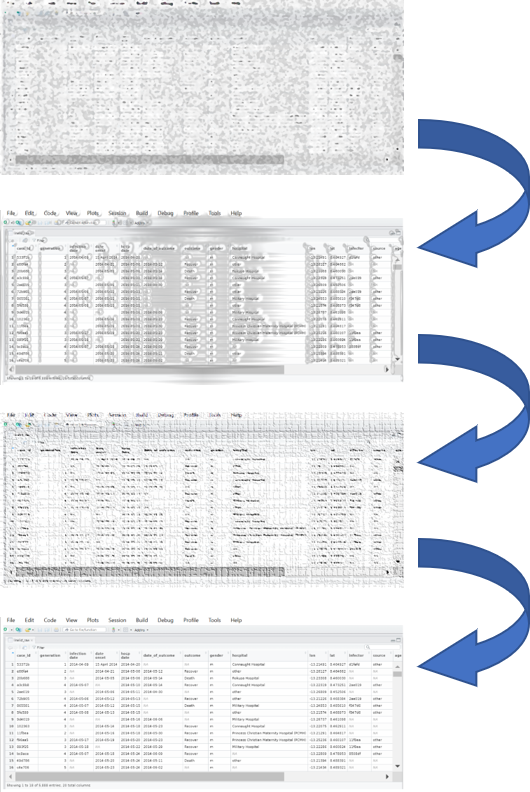
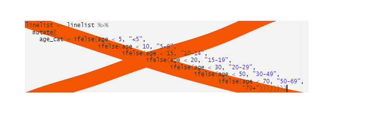
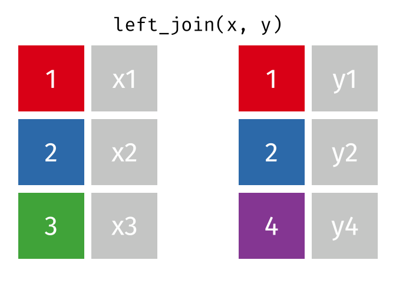
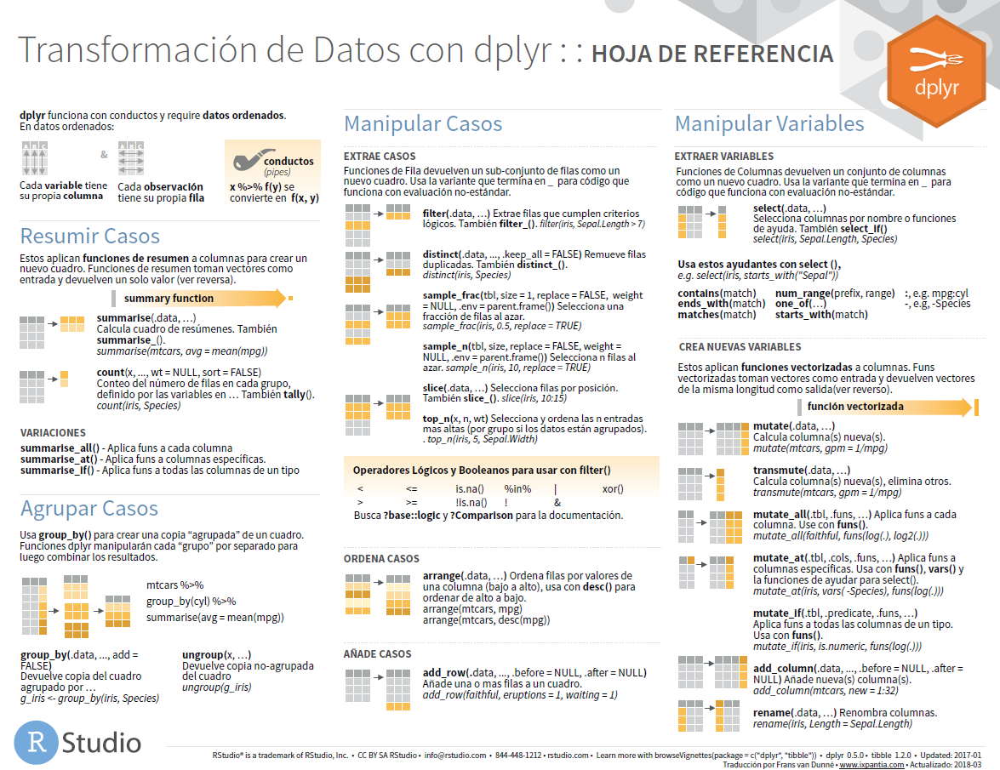

```{r echo=FALSE}
setwd("C:/Users/danfe/Dropbox/Proyectos Daniel/Cursos - diplomados - Maestrias/Programa de autoformación en investigación y análisis de datos/Rmarkdowns/Estadística/Programa de formación/Semana 2 limpieza_manejo")

knitr::opts_chunk$set(echo = TRUE, warning = FALSE, message = FALSE,
                         fig.show = "asis", results = "show",
                      fig.align='center',
                      fig.path = "figures/",  # Configura el directorio donde se guardan los gráficos
  dev = "png")
```

# Paquetes / librerias recomendadas

A continuación se muestra lista de paquetes de R de utilidad para la realización de tareas frecuentes en epidemiología. Puedes copiar este código, ejecutarlo, y todos estos paquetes se instalarán desde CRAN y se cargarán para su uso en la sesión actual de R. Si un paquete ya está instalado, únicamente se cargará.

```{r eval=FALSE}
# Asegúrate que el paquete "pacman" está instalado
if (!require("pacman")) install.packages("pacman")


# Paquetes disponibles desde CRAN
#################################
pacman::p_load(
     
     # Aprendiendo R
     ###############
     learnr,   # tutoriales interactivos en tu panel de R Studio
     swirl,    # tutoriales interactivos en tu consola de R
        
     # Manejo de archivos y proyecto 
     ###############################
     here,     # describir ruta de archivo dentro de la carpeta principal del proyecto
     rio,      # importación/exportación de múltiples tipos de datos
     openxlsx, # importación/exportación de libros con múltiples hojas de excel
     
     # Manejo e instalación de paquetes
     ##################################
     pacman,   # instalación/carga de paquetes
     renv,     # manejo de versiones de paquetes para trabajar con grupos colaborativos.
     remotes,  # instalación de paquetes desde github
     
     # Manejo general de datos
     #########################
     tidyverse,    # incluye múltiples paquetes para el tratamiento de datos en formato tidy y presentación de los mismos.
          #dplyr,      # manejo de datos
          #tidyr,      # manejo de datos
          #ggplot2,    # visualización de datos
          #stringr,    # trabajo con cadenas y caracteres
          #forcats,    # trabajo con factores
          #lubridate,  # trabajo con fechas
          #purrr       # iteraciones y trabajo con listas
     linelist,     # limpiar linelists
     naniar,       # trabajo con valores perdidos
     
     # Estadística  
     ############
     janitor,      # tablas y limpieza de datos
     gtsummary,    # hacer tablas descriptivas con valores estadísticos
     rstatix,      # realización rápida de test estadísticos y tablas descriptivas
     broom,        # pasar a formato tidy los resultados de las regresiones
     lmtest,       # realizar test de likelihood-ratio
     easystats,
          # parameters, # alternativa para pasar a formato tidy los resultados de las regresiones 
          # see,        # alternativa para visualizar forest plots 
     
     # Realización de modelos epidémicos
     ###################################
     epicontacts,  # analizar cadenas de transmisión
     EpiNow2,      # estimación de Rt 
     EpiEstim,     # estimación de Rt
     projections,  # proyecciones de incidencia
     incidence2,   # hacer curvas epidémicas y manejar datos de incidencia
     i2extras,     # Funciones extra para el paquete incidence2 
     epitrix,      # funciones útiles para epidemiología
     distcrete,    # Distribuciones discretas de demora o retardo
     
     # plots - general
     #################
     #ggplot2,         # incluido en tidyverse
     cowplot,          # combinar plots  
     # patchwork,      # alternativa para combinar plots    
     RColorBrewer,     # escalas de color
     ggnewscale,       # para añadir capas de color adicionales
     
     # plots - tipos específicos
     ########################
     DiagrammeR,       # diagramas empleando lenguaje DOT
     incidence2,       # curvas epidémicas
     gghighlight,      # destacar un subgrupo
     ggrepel,          # etiquetas inteligentes (smart labels)
     plotly,           # gráficos interactivos
     gganimate        # gráficos animados
)
```

# Importar y exportar archivos

Cuando importas unos “datos” en R, generalmente estás creando un nuevo objeto data frame en tu entorno de R y definiéndolo como un archivo importado (por ejemplo, Excel, CSV, TSV, RDS) que será guardado en tu disco en una determinada ruta/dirección.

Puedes importar/exportar muchos tipos de archivos, incluidos los creados por otros programas estadísticos (SAS, STATA, SPSS). También puedes conectarte a bases de datos relacionales.

R tiene incluso sus propios formatos de datos:

Un archivo RDS (.rds) almacena un único objeto R, como un dataframe. Son útiles para almacenar datos limpios, ya que mantienen los tipos de columnas de R. Lee más en esta sección. Un archivo RData (.Rdata) puede utilizarse para almacenar múltiples objetos, o incluso un espacio de trabajo R completo.

## Importación con el paquete rio

El paquete de R que recomendamos es: rio. El nombre “rio” es una abreviatura de “R I/O” (input/output).

Sus funciones import() y export() pueden manejar muchos tipos de archivos diferentes (por ejemplo, .xlsx, .csv, .rds, .tsv).

## Necesidad del paquete here

El paquete here y su función here() facilitan la tarea de decirle a R dónde encontrar y guardar tus archivos (en esencia, construye rutas de archivos).

Las rutas de here() pueden utilizarse tanto para la importación como para la exportación

Por ejemplo, a continuación, la función import() recibe una ruta de archivo construida con here().

```{r}
# nos fijamos el directorio
library(here); library(rio)
here()

# importamos archivo .xlsx
df1 <- import(here("Semana 2 limpieza_manejo", "data", "ejemplo", "datos_recolectados.xlsx"))

df1

# Esto evita rutas absolutas
df1 <- import("C:/Users/danfe/Dropbox/Proyectos Daniel/Cursos - diplomados - Maestrias/Programa de autoformación en investigación y análisis de datos/Rmarkdowns/Estadística/Programa de formación/Semana 2 limpieza_manejo/data/Ejemplo/datos_recolectados.xlsx")

df1
```

Tambien podemos importar desde hojas especificas de un archivo excel

```{r}
df2 <- import(here("Semana 2 limpieza_manejo", "data", "ejemplo", "datos_recolectados.xlsx"), 
              which = "Sheet2")

df2

```

Puedes importar datos de una hoja de cálculo de Google en línea con el paquete googlesheet4 y autenticando tu acceso al archivo.

```{r }
pacman::p_load("googlesheets4")
Gsheets_demo <- read_sheet("https://docs.google.com/spreadsheets/d/1scgtzkVLLHAe5a6_eFQEwkZcc14yFUx1KgOMZ4AKUfY/edit#gid=0")
```

```{r}
head(Gsheets_demo)
```

La hoja también puede importarse utilizando sólo el ID de la hoja, así
es una url más corta:

```{r eval=FALSE}
Gsheets_demo <- read_sheet("1scgtzkVLLHAe5a6_eFQEwkZcc14yFUx1KgOMZ4AKUfY")
```

```{r}
Gsheets_demo

```

## Exportación con el paquete rio

Con rio, puedes utilizar la función export() de forma muy similar a import(). Primero indica el nombre del objeto de R que deseas guardar (por ejemplo, base2) y luego escribe entre comillas la ruta de acceso al archivo donde deseas guardarlo, incluyendo el nombre y la extensión de archivo deseados. Por ejemplo:

```{r eval=FALSE}
export(linelist, "base2.xlsx") # lo guardará en el directorio de trabajo

```

Se puede guardar el mismo dataframe como un archivo csv cambiando la extensión. Por ejemplo, también lo guardamos en una ruta de archivo construida con here():

```{r eval=FALSE}
export(linelist, here("data", "Ejemplo", "base.csv"))

```

## Archivos RDS

Además de .csv, .xlsx, etc., también puedes exportar/guardar dataframes de R como archivos .rds. Este es un formato de archivo específico de R, y es muy útil si sabes que vas a trabajar con los datos exportados de nuevo en R.

Los tipos de columnas se conservan, por lo que no hay que volver a hacer la limpieza cuando se importan (con un archivo Excel o incluso CSV esto puede ser un dolor de cabeza). También es un archivo más pequeño, lo que es útil para la exportación e importación si tu conjunto de datos es grande.

```{r eval=FALSE}
export(linelist, here("data", "Ejemplo", "base2.rds"))
```

## Resumen para importar y exportar datos

```{r echo=FALSE}
# Cargar las bibliotecas necesarias
library(dplyr)
library(gt)

# Crear la tabla usando tribble
tabla_formatos <- tribble(
  ~Formato, ~Extensión_típica, ~Paquete_importación, ~Paquete_exportación, ~Instalado_por_defecto,
  "Datos separados por comas", ".csv", "data.table fread()", "data.table", "Sí",
  "Datos separados por tabulaciones", ".tsv", "data.table fread()", "data.table", "Sí",
  "SAS", ".sas7bdat", "haven", "haven", "Sí",
  "SPSS", ".sav", "haven", "haven", "Sí",
  "Stata", ".dta", "haven", "haven", "Sí",
  "SAS XPORT", ".xpt", "haven", NA, "Sí",
  "SPSS Portable", ".por", "haven", NA, "Sí",
  "Excel", ".xls", "readxl", NA, "Sí",
  "Excel", ".xlsx", "readxl", "openxlsx", "Sí",
  "Syntaxis R", ".R", "base", "base", "Sí",
  "Objetos R guardados", ".RData, .rda", "base", "base", "Sí",
  "Objetos R serializados", ".rds", "base", "base", "Sí",
  "Epiinfo", ".rec", "foreign", NA, "Sí",
  "Minitab", ".mtp", "foreign", NA, "Sí",
  "Systat", ".syd", "foreign", NA, "Sí"
)

# Crear la tabla con gt y aplicar formato
tabla_formatos |> 
  gt() |> 
  tab_style(
    style = cell_text(weight = "bold", align = "center"),
    locations = cells_column_labels()
  ) |> 
  tab_style(
    style = cell_text(align = "center"),
    locations = cells_body()
  ) |> 
  tab_options(
    table.width = pct(100),
    table.font.size = "medium"
  ) |> 
  opt_horizontal_padding(scale = 2)

```

# Limpieza de datos y funciones básicas

```{r echo=FALSE, out.width="75%"}

```

Para explicar esta sección, usaremos datos de una base de datos con datos crudos, y se avanzará paso a paso a través del proceso de limpieza. En el código R, esto se manifiesta como una cadena de “pipes”, que hacen referencia al operador “pipe” $$\text$$ que pasa los datos de una operación a la siguiente.

## Funciones principales

Este pequeño tutorial hace hincapié en el uso de las funciones de la familia de paquetes de R tidyverse. Las funciones esenciales que semuestran en esta página se enumeran a continuación.

```{r echo =FALSE}
# Crear la tabla usando tribble
# Cargar las bibliotecas necesarias
library(dplyr)
library(gt) 
tabla_funciones <- tribble(
  ~Función, ~Utilidad, ~Paquete,
  "%>%", "tunelizar (pasar) datos de una función a la siguiente", "magrittr",
  "mutate()", "crear, transformar y redefinir columnas", "dplyr",
  "select()", "mantener, eliminar, seleccionar o renombrar columnas", "dplyr",
  "rename()", "cambiar el nombre de las columnas", "dplyr",
  "clean_names()", "estandarizar la sintaxis de los nombres de las columnas", "janitor",
  "as.character(), as.numeric(), as.Date(), etc.", "convertir el tipo de una columna", "R base",
  "across()", "transformar varias columnas a la vez", "dplyr",
  "filter()", "mantener ciertas filas", "dplyr",
  "distinct()", "de-duplicar filas", "dplyr",
  "rowwise()", "operaciones por/en cada fila", "dplyr",
  "add_row()", "añadir filas manualmente", "tibble",
  "arrange()", "ordenar las filas", "dplyr",
  "recode()", "recodificar los valores de una columna", "dplyr",
  "case_when()", "recodificar los valores de una columna con criterios lógicos más complejos", "dplyr",
  "replace_na(), na_if(), coalesce()", "funciones especiales de recodificación", "tidyr",
  "age_categories(), cut()", "crear grupos categóricos a partir de una columna numérica", "epikit y R base",
  "match_df()", "recodificación/limpieza de valores mediante un diccionario de datos", "matchmaker",
  "which()", "aplicar criterios lógicos y devolver los índices", "R base"
)

# Crear la tabla con gt y aplicar formato
tabla_funciones |> 
  gt() |> 
  tab_style(
    style = cell_text(weight = "bold", align = "center"),
    locations = cells_column_labels()
  ) |> 
  tab_style(
    style = cell_text(align = "center"),
    locations = cells_body()
  ) |> 
  tab_options(
    table.width = pct(100),
    table.font.size = "medium"
  ) |> 
  opt_horizontal_padding(scale = 2)
```

## Nomenclatura

En este manual, se usará el término “columnas” como sinónimo de “variables” y “filas” como sinónimo de “observaciones”.

## Pasos para la limpieza

Los pasos de limpieza pueden incluir:

1.  Importación de datos

2.  Limpieza o cambio de los nombres de las columnas

3.  de-duplicación

4.  Creación y transformación de columnas (por ejemplo, recodificación o normalización de valores)

5.  Filtrado o añadido de filas

### Cargamos los paquetes necesarios

```{r}
pacman::p_load(
  rio,        # importación/exportación de múltiples tipos de datos
  here,       # ruta relativa de los archivos
  janitor,    # limpieza de datos y tablas
  lubridate,  # trabajar con fechas
  epikit,     # función age_categories()
  tidyverse,   # gestión y visualización de datos
  #skimr       # Visualización rápida de datos 
  # En caso no instale skimr usar
  # devtools::install_github("ropensci/skimr")
  # esto úede llevar algunos minutos
  )
```

### Importar datos

Aquí importamos el archivo Excel "linelist_raw.xlsx" utilizando la función import() del paquete rio.

```{r}
linelist_raw <- import("linelist_raw.xlsx")
```

Puedes ver las primeras 50 filas del dataframe a continuación. 

Nota: la función base de R head(n) te permite ver sólo las primeras n filas en la consola de R.

```{r eval =FALSE}
head(linelist_raw, 10)
```

```{r, echo=FALSE}

DT::datatable(linelist_raw, rownames = T, filter="top", options = list(pageLength = 10, scrollX=T), class = 'white-space: nowrap' )

```

### Revisión de las columnas

Puedes utilizar la función skim() del paquete skimr para obtener una visión general de todo el dataframe.

Las columnas se resumen por clase o tipo, como, por ejemplo, carácter, numérico. Nota: “POSIXct” es un tipo de fecha cruda.

```{r}
skimr::skim(linelist_raw)
```

### Nombres de columnas

En R, los nombres de las columnas son la “cabecera” o el valor “superior” de una columna. Se utilizan para referirse a las columnas en el código, y sirven como etiqueta por defecto en las figuras.

Como los nombres de las columnas de R se utilizan con mucha frecuencia, deben tener una sintaxis “limpia”. Sugerimos lo siguiente:

-   Nombres cortos

-   Sin espacios (sustituir por barras bajas \_ )

-   Sin caracteres inusuales (&, #, \<, \>, …)

-   Nomenclatura de estilo similar (por ejemplo, todas las columnas de fecha nombradas como date_onset, date_report, date_death…)

Los nombres de las columnas de linelist_raw se muestran continuación utilizando names() de R base. Podemos ver que inicialmente. Algunos nombres contienen espacios (por ejemplo, infection date)

```{r}
names(linelist_raw)
```

*   Se utilizan diferentes patrones de nomenclatura para las fechas (date onset vs. infection date)

Debe haber una cabecera fusionada en las dos últimas columnas del .xlsx. Lo sabemos porque el nombre de dos columnas fusionadas (“merged_header”) fue asignado por R a la primera columna, y a la segunda columna se le asignó un nombre de marcador de posición “…28” (ya que entonces estaba vacía y es la columna 28).

NOTA: Para hacer referencia a un nombre de columna que incluya espacios, rodea el nombre con tildes, por ejemplo: linelist$` '\x60infection date\x60'`. Ten en cuenta que, en tu teclado, la tilde (`) es diferente de la comilla simple (’).

#### Limpieza automática
La función **clean_names()** del paquete **janitor** estandariza los nombres de las columnas y los hace únicos haciendo lo siguiente:

- Convierte todos los nombres para que estén compuestos sólo por letras minúsculas, números y letras

- Los caracteres acentuados se transliteran a ASCII (por ejemplo, la o alemana con diéresis se convierte en “o”, la “ñ” española se convierte en “n”)

- Se puede especificar la preferencia de mayúsculas para los nuevos nombres de columna utilizando case = argumento (“snake” es el valor por defecto, las alternativas incluyen “sentence”, “title”, “small_camel”…)

- Puedes especificar sustituciones de nombres concretos proporcionando un vector replace = argumento (por ejemplo, replace = c(onset = "date_of_onset"))

A continuación, el proceso de limpieza comienza utilizando clean_names() sobre linelist_raw.

```{r}
# enlaza el conjunto de datos con un pipe a la función clean_names(), y el resultado lo guarda como "linelist"  
linelist <- linelist_raw %>% 
  janitor::clean_names()

# ver los nombres de las columnas
names(linelist)
```
NOTA: El nombre de la última columna “…28” se ha cambiado por “x28”.

#### Limpieza manual de nombres
A menudo es necesario renombrar las columnas manualmente, incluso después del paso de estandarización anterior. A continuación, el renombramiento se realiza utilizando la función rename() del paquete dplyr, como parte de una cadena de pipes. rename() utiliza el estilo NUEVO_NOMBRE = ANTIGUO_NOMBRE - el nombre nuevo de la columna se escribe antes que el antiguo.

A continuación, se añade un comando de renombramiento a la tubería de limpieza. Se han añadido espacios estratégicamente para alinear el código y facilitar la lectura.

```{r}
linelist <- linelist_raw %>%
    
    # estandariza los nombres de las columnas
    janitor::clean_names() %>% 
    
    # manualmente re-nombra columnas
           # nombre NUEVO         # nombre ANTIGUO
    rename(date_infection       = infection_date,
           date_hospitalisation = hosp_date,
           date_outcome         = date_of_outcome)
```

Ahora puedes ver que los nombres de las columnas han cambiado:

```{r}
names(linelist)
```
#### Renombrar por posición de columna
También puedes renombrar por la posición de la columna, en lugar del nombre de la columna, por ejemplo:

```{r eval=FALSE}
rename(newNameForFirstColumn  = 1,
       newNameForSecondColumn = 2)
```

### Seleccionar o reordenar columnas
Utiliza select() de dplyr para seleccionar las columnas que deseas conservar y para especificar su orden en el dataframe.

**ATENCIÓN: En los ejemplos siguientes, el dataframe linelist se modifica con select() y se muestra, pero no se guarda. Esto es a efectos de demostración. Los nombres de las columnas modificadas se imprimen pasando el dataframe a names().**

Aquí están TODOS los nombres de las columnas en linelist antes de la limpieza:
```{r}
names(linelist)
```

#### Mantener las columnas
Selecciona sólo las columnas que desees conservar

Escribe sus nombres en el comando select(), sin comillas. Aparecerán en el dataframe en el orden que indiques. Ten en cuenta que si incluyes una columna que no existe.

```{r}
# linelist se enlaza con pipe al comando select(), y names() imprime (en consola) sólo los nombres de columna
linelist %>% 
  select(case_id, date_onset, date_hospitalisation, fever) %>% 
  names()  # display the column names
```

#### Funciones de ayuda “tidyselect”
Estas funciones de ayuda existen para facilitar la especificación de las columnas a conservar, descartar o transformar. Provienen del paquete tidyselect, que se incluye en tidyverse y se basa en la forma en que se seleccionan las columnas en las funciones de dplyr.

Por ejemplo, si deseas reordenar las columnas, everything() es una función útil para indicar “todas las demás columnas no mencionadas”. El comando siguiente mueve las columnas date_onset y date_hospitalisation al principio (izquierda) de los datos, pero mantiene todas las demás columnas después. Fíjate en que everything() se escribe con paréntesis vacíos:

```{r}
# mueve date_onset y date_hospitalisation al principio
linelist %>% 
  select(date_onset, date_hospitalisation, everything()) %>% 
  names()
```

Aquí hay otras funciones de ayuda “tidyselect” que también funcionan dentro de las funciones de dplyr como select(), across() y summarise():

- *everything()* - todas las demás columnas no mencionadas

- *last_col()* - la última columna

- *where()* - aplica una función a todas las columnas y selecciona las que son TRUE

- *contains()* - columnas que contienen una cadena de caracteres ejemplo: select(contains("time"))

- *starts_with()* - coincide con un prefijo especificado ejemplo: select(starts_with("date_"))

- *ends_with()* - coincide con un sufijo especificado ejemplo: select(ends_with("_post))

- *matches()* - para aplicar una expresión regular (regex) ejemplo: select(matches("[pt]al"))

Utiliza where() para especificar criterios lógicos para las columnas. Si escribes una función dentro de where(), no incluyas los paréntesis vacíos de la función. El comando siguiente selecciona las columnas de tipo Numeric.

```{r}
# selecciona las columnas que son de clase Numeric
linelist %>% 
  select(where(is.numeric)) %>% 
  names()
```

Utiliza contains() para seleccionar sólo las columnas en las que el nombre de la columna contiene una cadena de caracteres especificada. ends_with() y starts_with() proporcionan más matices.

```{r}
# selecciona las columnas que contienen ciertos caracteres
linelist %>% 
  select(contains("date")) %>% 
  names()
```

La función matches() funciona de forma similar a contains(), pero puede escribirse en una expresión regular (mira la página sobre Caracteres y cadenas), como varias cadenas separadas por barras “O” dentro de los paréntesis:


```{r}
# selecciona por multiples coincidencias de caracteres
linelist %>% 
  select(matches("onset|hosp|fev")) %>%   # note the OR symbol "|"
  names()
```

#### Eliminar columnas
Indica qué columnas se van a eliminar colocando el símbolo “-” delante del nombre de la columna (por ejemplo, select(-outcome)), o un vector de nombres de columnas (como se indica a continuación). Todas las demás columnas se mantendrán.

```{r}
linelist %>% 
  select(-c(date_onset, fever:vomit)) %>% # remove date_onset and all columns from fever to vomit
  names()
```

Puedes utilizar la negación para seleccionar todas las columnas menos las que contengan ciertos caracteres

```{r}
# selecciona las columnas que no contienen ciertos caracteres
linelist %>% 
  select(-contains("date")) %>% 
  names()
```

También puedes eliminar una columna utilizando la sintaxis de R base, definiéndola como NULL. Por ejemplo:

```{r}
linelist$x28 <- NULL   # borra columnas con sentencias de R base 
```

### De-duplicación
El paquete dplyr ofrece la función distinct(). Esta función examina cada fila y reduce el dataframe con sólo filas únicas. Es decir, elimina las filas que están 100% duplicadas.

Al evaluar las filas duplicadas, tiene en cuenta un rango de columnas - por defecto considera todas las columnas. Puedes ajustar este rango de columnas para que la singularidad de las filas sólo se evalúe con respecto a determinadas columnas.

En este sencillo ejemplo, simplemente añadimos el comando vacío distinct() a la cadena de pipes. Esto garantiza que no haya filas que estén 100% duplicadas de otras filas (evaluadas en todas las columnas).

Comenzamos con nrow(linelist) filas en linelist.

```{r}
# Contamos el número de filas
nrow(linelist)

# Eliminamos duplicados
linelist <- linelist %>% 
  distinct()

# Verificamos el número de filas
nrow(linelist) # se eliminaron 2 obsevaciones repetidas

```
### Creación y transformación de columnas
Recomendamos utilizar la función mutate() de dplyr para añadir o crear una nueva columna, o para modificar una existente.

A continuación se muestra un ejemplo de creación de una nueva columna con mutate(). La sintaxis es: mutate(nombre_nueva_columna = valor o transformación)

Nota: la función de mutate(), no es destructivo: todos nuestros datos existentes seguirán ahí después de agregar nuevas columnas

También puedes referenciar valores en otras columnas, para realizar cálculos. A continuación, se crea una nueva columna bmi para mantener el Índice de Masa Corporal (BMI) de cada caso - calculado mediante la fórmula BMI = kg/m^2, utilizando la columnas ht_cm y wt_kg.

```{r}
linelist <- linelist %>% 
  mutate(bmi = wt_kg / (ht_cm/100)^2)

# visualizamos datos de nueva columna
summary(linelist$bmi)
```
Si creas varias columnas nuevas, separa cada una con una coma y una nueva línea. A continuación se muestran ejemplos de nuevas columnas, incluidas las que consisten en valores de otras columnas combinadas mediante str_glue() del paquete stringr (véase la página sobre Caracteres y cadenas.

```{r}
new_col_demo <- linelist %>%                       
  mutate(
    new_var_dup    = case_id,             # columna nueva = duplicar/copiar otra columna existente
    new_var_static = 7,                   # columna nueva = todos los valores iguales a 7
    new_var_static = new_var_static + 5,  # se puede sobreescribir una columna y puede ser un cálculo con otras variables
    new_var_paste  = stringr::str_glue("{hospital} on ({date_hospitalisation})") # columna nueva = pegar valores de otras columnas
    ) %>% 
  select(case_id, hospital, date_hospitalisation, contains("new"))        # muestra solo columnas nuevas, sólo por mostrarlas
```

Revisa las columnas nuevas. A efectos de demostración, sólo se muestran las columnas nuevas y las utilizadas para crearlas:

```{r eval =FALSE}
head(new_col_demo, 10)
```
```{r, echo=FALSE}

DT::datatable(new_col_demo, rownames = T, filter="top", options = list(pageLength = 10, scrollX=T), class = 'white-space: nowrap' )

```

### Convertir el tipo de columna
Las columnas que contienen valores que son fechas, números o valores lógicos (TRUE/FALSE) sólo se comportarán como se espera si están correctamente clasificadas. Hay una diferencia entre “2” de tipo carácter y 2 de tipo numérico!

Actualmente, el tipo de la columna age es un carácter. Para realizar análisis cuantitativos, ¡necesitamos que estos números sean reconocidos como numéricos!.

```{r}
class(linelist$age)
```

El tipo de la columna date_onset ¡también es un carácter! Para realizar los análisis, ¡estas fechas deben ser reconocidas como fechas!

```{r}
class(linelist$date_onset)
```

Para resolver esto, utiliza la capacidad de mutate() para redefinir una columna mediante una transformación. Definimos la columna como ella misma, pero convertida a un tipo diferente. He aquí un ejemplo básico, convirtiendo o asegurando que la columna age sea de tipo Numeric:

```{r}
linelist <- linelist %>% 
  mutate(age = as.numeric(age))
```
De forma similar, puedes utilizar as.character() y as.logical(). Para convertir al tipo Factor, puedes utilizar factor() de R base o as_factor() de forcats. 

### Transformar múltiples columnas

A menudo, para escribir un código conciso, se desea aplicar la misma transformación a varias columnas a la vez. Se puede aplicar una transformación a varias columnas a la vez utilizando la función across() del paquete dplyr (también contenido en el paquete tidyverse). across() se puede utilizar con cualquier función de dplyr, pero se suele utilizar dentro de select(), mutate(), filter() o summarise().

Aquí la transformación as.character() se aplica a columnas específicas nombradas dentro de across().

```{r}
linelist <- linelist %>% 
  mutate(across(.cols = c(temp, ht_cm, wt_kg), .fns = as.character))
```

Las funciones de ayuda “tidyselect” están disponibles para ayudarle a especificar las columnas. Se detallan más arriba en la sección sobre Selección y reordenación de columnas, e incluyen: everything(), last_col(), where(), starts_with(), ends_with(), contains(), matches()

A continuación, un ejemplo de mutación de las columnas que actualmente son de tipo POSIXct (un tipo datetime cruda que muestra etiquetas) - en otras palabras, donde la función is.POSIXct() evalúa a TRUE. Entonces queremos convertirlas con la función as.Date() en columnas de tipo Date normal.

```{r}
library(lubridate)
linelist <- linelist %>% 
  mutate(across(.cols = where(is.POSIXct), .fns = as.Date))

```

### Recodificar valores

A continuación, se presentan algunos escenarios en los que es necesario recodificar (cambiar) los valores:

- para editar un valor específico (por ejemplo, una fecha con un año o formato incorrecto)

- para conciliar valores que no se escriben igual

- para crear una nueva columna de valores categóricos

- para crear una nueva columna de categorías numéricas (por ejemplo, categorías de edad)

#### Valores específicos

Para cambiar los valores manualmente puedes utilizar la función recode() dentro de la función mutate().

Imagínate que hay una fecha sin sentido en los datos (por ejemplo, “2014-14-15”): podrías corregir la fecha manualmente en los datos originales, o bien, podrías escribir el cambio en la serie de comandos de limpieza a través de mutate() y recode(). Esto último es más transparente y reproducible para cualquier otra persona que quiera entender o repetir su análisis.

```{r}
# corregir valores incorrectos          # valor antiguo   # valor nuevo
linelist <- linelist %>% 
  mutate(date_onset = recode(date_onset, "2014-14-15" = "2014-04-15"))
```

La línea mutate() anterior puede leerse como: “mutar la columna date_onset para que sea igual a la columna date_onset recodificada de forma que el VALOR ANTIGUO se cambie por el NUEVO VALOR”.

Veamos otro ejemplo
```{r}
linelist <- linelist %>% 
  mutate(hospital = recode(hospital,
                     # for reference: OLD = NEW
                      "Mitylira Hopital"  = "Military Hospital",
                      "Mitylira Hospital" = "Military Hospital",
                      "Military Hopital"  = "Military Hospital",
                      "Port Hopital"      = "Port Hospital",
                      "Central Hopital"   = "Central Hospital",
                      "other"             = "Other",
                      "St. Marks Maternity Hopital (SMMH)" = "St. Mark's Maternity Hospital (SMMH)"
                      ))
```

Además, podemos sustituir valores por lógica

A continuación, demostramos cómo recodificar los valores de una columna utilizando lógica y condiciones:

Uso de replace(), ifelse() para una lógica simple

Uso de case_when() para una lógica más compleja

##### sustituir con replace()
Para recodificar con criterios lógicos simples, puedes utilizar replace() dentro de mutate().
Estructura: **mutate(col_to_change = replace(col_a_cambiar, criterio para filas, nuevo valor))**
```{r}
# Ejemplo: cambiar el género de una observación específica a "Female" 
linelist <- linelist %>% 
  mutate(gender = replace(gender, case_id == "2195", "Female"))
```

##### ifelse() 
La sintaxis general es: **ifelse(condición, valor a devolver si la condición evalúa como TRUE, valor a devolver si la condición evalúa como FALSE)**

A continuación, se define la columna source_known. Su valor en una fila determinada se establece como “known” si no falta el valor de la fila en la columna source. Si falta el valor en source, el valor de source_known se establece como “unknown”.
```{r}
linelist <- linelist %>% 
  mutate(source_known = ifelse(!is.na(source), "known", "unknown"))
```

Evita encadenar muchos comandos ifelse… ¡utilza case_when() en su lugar! case_when() es mucho más fácil de leer y cometerás menos errores.

```{r echo=FALSE, out.width="75%"}


```


##### Lógica compleja: case_when()
Utiliza case_when() de dplyr si estás recodificando en muchos grupos nuevos, o si necesita utilizar sentencias lógicas complejas para recodificar valores. Esta función evalúa si cada fila del dataframe cumple los criterios especificados y asigna el nuevo valor correcto.

Por ejemplo, aquí utilizamos las columnas age y age_unit para crear una columna age_years:

```{r}
linelist <- linelist %>% 
  mutate(age_years = case_when(
            age_unit == "years"  ~ age,       # si la edad se da en años
            age_unit == "months" ~ age/12,    # si la edad se da en meses
            is.na(age_unit)      ~ age))      # si falta la unidad de edad, asumir años
                                              # cualquier otra circunstancia, asignar NA (missing)
```

A medida que se evalúa cada fila de los datos, los criterios se aplican/evalúan en el orden en que se escriben las sentencias case_when(), de arriba a abajo. Si el criterio superior se evalúa como TRUE para una fila determinada, se asigna el valor RHS, y los criterios restantes ni siquiera se prueban para esa fila. Por lo tanto, es mejor escribir los criterios más específicos primero y los más generales al final. A una fila de datos que no cumpla ninguno de los criterios del RHS se le asignará NA.

A continuación se muestra otro ejemplo de case_when() utilizado para crear una nueva columna con la clasificación del paciente, según una definición de caso para los casos confirmados y sospechosos:

```{r}
linelist <- linelist %>% 
     mutate(case_status = case_when(
          
          # si el paciente se somete a una prueba de laboratorio y es positiva,
          # entonces se marca como un caso confirmado  
          ct_blood < 20                   ~ "Confirmed",
          
          # si el paciente no tiene un resultado de laboratorio positivo,
          # si el paciente tiene una "fuente" (vínculo epidemiológico) Y tiene fiebre, 
          # entonces se marca como caso sospechoso
          !is.na(source) & fever == "yes" ~ "Suspect",
          
          # cualquier otro paciente que no haya sido tratado anteriormente 
          # se marca para su seguimiento
          TRUE                            ~ "To investigate"))
```

### Categorizar variables numéricas

Aquí describimos algunos enfoques especiales para crear categorías a partir de columnas numéricas. Algunos ejemplos comunes son las categorías de edad, los grupos de valores de laboratorio, etc. 

- age_categories(), del paquete epikit

- cut(), de R base

- case_when()

- ruptura de cuantiles con quantile() y ntile()

En primer lugar, examina la distribución de tus datos, para hacer los puntos de corte apropiados. 

```{r}
# examine the distribution
hist(linelist$age_years)

```

#### age_categories()
Con el paquete epikit, puedes utilizar la función age_categories() para categorizar y etiquetar fácilmente las columnas numéricas (nota: esta función puede aplicarse también a las variables numéricas no relacionadas con la edad). Además, la columna de salida es automáticamente un factor ordenado

```{r}
# Ejemplo simple
# usar devtools::install_github(repo = "R4EPI/epikit") para instalación (OJO: puede demorar mucho)
pacman::p_load(epikit)                    # cargar paquete

linelist <- linelist %>% 
  mutate(
    age_cat = age_categories(             # crear una columna nueva
      age_years,                            # columna numérica para hacer grupos
      breakers = c(0, 5, 10, 15, 20,        # puntos de ruptura
                   30, 40, 50, 60, 70)))

# mostrar la tabla
table(linelist$age_cat, useNA = "always")
```
Alternativamente, en lugar de los breakers =, puedes proporcionar todos los lower =, upper =, and by =:
```{r}
linelist <- linelist %>% 
  mutate(
    age_cat = age_categories(
      age_years, 
      lower = 0,
      upper = 100,
      by = 20))

# mostrar tabla
table(linelist$age_cat, useNA = "always")
```

**¡Comprueba tu trabajo! **
```{r}
# Tabulación cruzada de las columnas numéricas y categóricas. 
table("Numeric Values" = linelist$age_years,   # nombres especificados en la tabla para mayor claridad.
      "Categories"     = linelist$age_cat,
      useNA = "always")                        # no olvides examinar los valores NA
```

#### Grupos de tamaño uniforme
Otra herramienta para hacer grupos numéricos es la función ntile() de dplyr, que intenta dividir los datos en n grupos de tamaño uniforme - pero ten en cuenta que, a diferencia de quantile(), el mismo valor podría aparecer en más de un grupo. Proporcione el vector numérico y luego el número de grupos. Los valores de la nueva columna creada son sólo “números” de grupo (por ejemplo, del 1 al 10), no el rango de valores en sí mismo como cuando se utiliza cut().


```{r}
# crea grupos con ntile()
ntile_data <- linelist %>% 
  mutate(even_groups = ntile(age_years, 10))

# crea una tabla de recuentos y proporciones por grupo
ntile_table <- ntile_data %>% 
  janitor::tabyl(even_groups)
  
ntile_table

# adjunta los valores mínimo/máximo para demostrar los rangos
ntile_ranges <- ntile_data %>% 
  group_by(even_groups) %>% 
  summarise(
    min = min(age_years, na.rm=T),
    max = max(age_years, na.rm=T)
  )

# combina e imprime - ten en cuenta que los valores están presentes en varios grupos
left_join(ntile_table, ntile_ranges, by = "even_groups")
```

### Filtrar filas
Un paso típico de limpieza después de haber limpiado las columnas y recodificado los valores es filtrar el dataframe para filas específicas usando el verbo dplyr filter().

En la práctica, he usado filter() para quedarme unicamente con las observaciones que cumplen los criterios de selección o que tengan datos completos en las variables de interes.

#### Filtrado simple
Este sencillo ejemplo redefine el dataframe linelist en sí mismo, habiendo filtrado las filas para que cumplan una condición lógica. Sólo se conservan las filas en las que la declaración lógica dentro de los paréntesis se evalúa como TRUE.

En este ejemplo, la sentencia lógica es gender == "f", que pregunta si el valor de la columna gender es igual a “f” (distingue entre mayúsculas y minúsculas).

```{r}
# numero de filas original
nrow(linelist)

# Filtro
linelist <- linelist %>% 
  filter(gender == "f")   # mantener sólo las filas en las que gender es igual a "f"

# numero de filas 
nrow(linelist)


```
#### Filtrar los valores faltantes
para ello utilizaremos la función drop_na() del paquete tidyr

```{r eval=F}
linelist %>% 
  drop_na(case_id, age_years)  # eliminar las filas con valores perdidos para case_id o age_years
```

#### Filtro por número de filas

```{r}
# Ver las filas 2 a 20, y sólo tres columnas específicas
linelist %>% filter(row_number() %in% 2:20) %>% select(date_onset, outcome, age)
```

#### Filtro complejo

Se pueden construir sentencias lógicas más complejas utilizando paréntesis ( ), OR |, negación ! , %in%, y operadores AND &. Un ejemplo es el siguiente:

Nota: Puedes utilizar el operador ! delante de un criterio lógico para negarlo. Por ejemplo, !is.na(column) se evalúa como verdadero si el valor de la columna no falta. Del mismo modo, !column %in% c("a", "b", "c") es verdadero si el valor de la columna no está en el vector.

Ejemplo:

visualizamos los datos previos al filtrado
```{r}
table(Hospital  = linelist$hospital,                     # nombre del hospital
      YearOnset = lubridate::year(linelist$date_onset),  # año de date_onset
      useNA     = "always")                              # mostrar los valores perdidos

```

Filtramos

```{r}
linelist <- linelist %>% 
  # conservar las filas donde el inicio sea posterior al 1 de junio de 2013 O en las que falte el inicio y se trate de un hospital distinto del Hospital A o B
  filter(date_onset > as.Date("2013-06-01") | (is.na(date_onset) & !hospital %in% c("Hospital A", "Hospital B")))

nrow(linelist)
```

Cuando volvemos a hacer la tabulación cruzada, vemos que los hospitales A y B se eliminan por completo, y los 10 casos del Port Hospital de 2012 y 2013 se eliminan, y todos los demás valores son los mismos, tal y como queríamos.

```{r}
table(Hospital  = linelist$hospital,                     # nombre del hospital
      YearOnset = lubridate::year(linelist$date_onset),  # año de date_onset
      useNA     = "always")                              # mostrar los valores perdidos
```

### Cálculos por filas

Si deseas realizar un cálculo dentro de una fila, puedes utilizar rowwise() de dplyr. Por ejemplo, este código aplica rowwise() y luego crea una nueva columna que suma el número de las columnas de síntomas especificadas que tienen valor “yes”, para cada fila Las columnas se especifican dentro de sum() por su nombre dentro de un vector c(). rowwise() es esencialmente un tipo especial de group_by(), por lo que es mejor utilizar ungroup() cuando hayas terminado.

```{r}
linelist %>%
  rowwise() %>%
  mutate(num_symptoms = sum(c(fever, chills, cough, aches, vomit) == "yes")) %>% 
  ungroup() %>% 
  select(fever, chills, cough, aches, vomit, num_symptoms) %>%  # for display
  head(10)
```
Veamos otro ejemplo:

Utiliza rowwise() para que la siguiente operación (sum()) se aplique dentro de cada fila (no sumando columnas enteras)

Crea una nueva columna num_NA_dates, definida para cada fila como el número de columnas (con nombre que contiene “date”) para las que is.na() se evaluó como TRUE (son valores faltantes).

ungroup() para eliminar los efectos de rowwise() en los pasos siguientes

```{r}
# No olvides que las variables deben ser de la misma clase
linelist$date_onset <- as.Date(linelist$date_onset) 

linelist %>%
  rowwise() %>%
  mutate(num_NA_dates = sum(is.na(c_across(contains("date"))))) %>% 
  ungroup() %>% 
  select(num_NA_dates, contains("date")) %>% # for display
  head(10)
```
También podrías proporcionar otras funciones, como max() para obtener la fecha más reciente o más reciente de cada fila:

```{r}
linelist %>%
  rowwise() %>%
  mutate(latest_date = max(c_across(contains("date")), na.rm=T)) %>% 
  ungroup() %>% 
  select(latest_date, contains("date"))   %>% # for display
  head(10)
```
 
### Datos agrupados / desagrupados
La función group_by() y su contraparte ungroup() son herramientas esenciales en el análisis de datos cuando se trabaja con conjuntos de datos agrupados y desagrupados.

group_by(): Esta función, parte del paquete dplyr en R, se utiliza para agrupar los datos en función de una o más variables. Al aplicar group_by(), se crean grupos dentro del conjunto de datos, lo que permite realizar operaciones y cálculos específicos dentro de cada grupo. 

Por ejemplo, si tienes un conjunto de datos de ventas y quieres calcular la suma de ventas por cada mes, puedes agrupar los datos por mes usando group_by() y luego aplicar la función summarise() para calcular la suma de ventas para cada mes.
```{r echo=FALSE, results='asis', out.width="120%"}
cat('<video width="600" autoplay loop controls>
        <source src="group_by _ mutate.mp4" type="video/mp4">
        Tu navegador no soporta la etiqueta de video.
      </video>')
```


ungroup(): Una vez que has realizado operaciones o cálculos dentro de grupos específicos utilizando group_by(), es importante desagrupar los datos utilizando ungroup() cuando ya no necesitas el conjunto de datos agrupado. Esto restaura el conjunto de datos a su estado original, lo que facilita el análisis y la manipulación posteriores.

```{r echo=FALSE, results='asis', out.width="120%"}
cat('<video width="600" autoplay loop controls>
        <source src="group_by-ungroup.mp4" type="video/mp4">
        Tu navegador no soporta la etiqueta de video.
      </video>')
```


### Otras funciones útiles

#### Ordenar y clasificar
Utiliza la función arrange() de dplyr para ordenar las filas por los valores de las columnas.

Por ejemplo, para ordenar las filas de nuestro linelist por hospital y luego por date_onset (fecha de inicio) en orden descendente, utilizaríamos:

```{r eval=FALSE}
linelist %>% 
   arrange(hospital, desc(as.date_onset))
```

#### La función summarize()
La función summarise() (o summarize(), ambas formas son válidas) del paquete dplyr se utiliza para generar resúmenes estadísticos sobre datos agrupados. En conjunto con group_by(), permite realizar cálculos agregados, como medias, medianas, sumas, conteos, entre otros, para cada grupo especificado.

Uso de summarise()

Propósito: summarise() se utiliza para crear resúmenes estadísticos a partir de datos agrupados. Toma un conjunto de datos, realiza cálculos específicos (por ejemplo, mean(), sum(), count()), y devuelve un nuevo data frame con el resultado del resumen.

Ejemplo 1
```{r echo=FALSE, results='asis', out.width="120%"}
cat('<video width="600" autoplay loop controls>
        <source src="grp-summarize-00.mp4" type="video/mp4">
        Tu navegador no soporta la etiqueta de video.
      </video>')
```

Ejemplo 2
```{r echo=FALSE, results='asis', out.width="120%"}
cat('<video width="600" autoplay loop controls>
        <source src="grp-summarize-01.mp4" type="video/mp4">
        Tu navegador no soporta la etiqueta de video.
      </video>')
```

Ejemplo 3
```{r echo=FALSE, results='asis', out.width="120%"}
cat('<video width="600" autoplay loop controls>
        <source src="grp-summarize-02.mp4" type="video/mp4">
        Tu navegador no soporta la etiqueta de video.
      </video>')
```

Ejemplo 4
```{r echo=FALSE, results='asis', out.width="120%"}
cat('<video width="600" autoplay loop controls>
        <source src="grp-summarize-03.mp4" type="video/mp4">
        Tu navegador no soporta la etiqueta de video.
      </video>')
```


#### Unión de bases de datos

He utilizado las animaciones [tidyexplain](https://www.garrickadenbuie.com/project/tidyexplain/) de Garrick Aden-Buie (2018). Son increíblemente útiles para la enseñanza y poder ver qué filas incluye las diferentes funciones de unión. 

En este programa solo nos centraremos en revisar la función: [`left_join()`](https://www.garrickadenbuie.com/project/tidyexplain/#left-join)

```{r echo=FALSE, out.width="75%"}

```


#### Conbinando funciones 
Los grupos sobrantes son ***muy importantes*** cuando se utilizan funciones dentro de `mutate()`.

Como aquí, crearemos una columna de proporción basada en total / suma(total)`. Debido a que sólo se agrupan por una cosa, no hay agrupaciones sobrantes, por lo que la columna `prop` suma 100%:

```{r}
library(palmerpenguins)
# para los siguientes ejemplos usaremos la base "palmerpenguins" de la libraria palmerpenguins... para más información utiliza: "help(penguins)"

# veamos la base de datos
head(penguins, 10)

# generemos la salida del conteo y proporción por especie
penguins |> 
  group_by(species) |> 
  summarize(n = n()) |> 
  mutate(prop = n*100 / sum(n))

# NOTA:  |>  es el pipe nativo --> es igual que usar %>% 
```

A continuación, agruparemos por dos variables, especie y sexo. Cuando {dplyr} termina, desagrupa el grupo de sexo, pero deja el conjunto de datos agrupado por especies. La columna `prop` ya no suma 100%; suma 300%. Esto se debe a que se ha calculado `total/suma(total)` *dentro* de cada grupo de especies (de modo que el 50% de las Adelia son hembras, el 50% son machos, etc.).


```{r }
penguins |> 
  group_by(species, sex) |> 
  summarize(n2 = n()) |> 
  mutate(prop = n2 / sum(n2))
```

Si invertimos el orden de agrupación para que el sexo venga primero, {dplyr} dejará automáticamente de agrupar por especies y mantendrá el conjunto de datos agrupado por sexo. Esto significa que `mutate()` funcionará *dentro* de cada grupo de sexo, por lo que la columna `prop` aquí suma 200%. El 44% de las hembras de pingüino son Adelia, el 21% de las hembras de pingüino son Barbijo, y el 35% de las hembras de pingüino son Papúa, y así sucesivamente.


```{r }
penguins |> 
  group_by(sex, species) |> 
  summarize(total = n()) |> 
  mutate(proporción = total / sum(total))
```


Si desagrupamos explícitamente antes de calcular la proporción, entonces `mutate()` funcionará en todo el conjunto de datos en lugar de en grupos específicos por sexo o especie. Aquí, el 22% de todos los pingüinos son hembras de Adelia, el 10% son hembras de Barbijo, etc. O utilice el argumento `.groups` o `.by` en `summarize()`.

```{r }
penguins |> 
  group_by(sex, species) |> 
  summarize(total = n()) |> 
  ungroup() |> 
  mutate(prop = total / sum(total))
```

No tenemos que confiar en la función automática de {dplyr} de desagrupar el último agrupamiento y podemos añadir nuestro propio agrupamiento explícitamente más tarde. Como aquí, {dplyr} deja de agrupar por sexo, lo que significa que la columna `prop` sumaría un 300%, mostrando la proporción de sexos dentro de cada especie. Pero si lanzamos un `group_by(sex)` antes de `mutate()`, pondrá todo en dos conjuntos de datos entre sexo (macho y hembra) y calculará la proporción de especies dentro de cada sexo. El conjunto de datos resultante sigue agrupado por sexo, ya que `mutate()` no elimina ningún grupo como `summarize()`:

```{r}

penguins |> 
  group_by(species, sex) |> 
  summarize(total = n()) |> 
  group_by(sex) |>
  mutate(prop = total / sum(total))
```

# LOOPS

**for**  Los loops se usan para iterar o repetir una acción o tarea una cantidad determinanada de veces, hasta obtener el resultado deseado

Sintaxis
```{r eval=FALSE}
# SINTAXIS: NO LES VA A CORRER PORQUE LOS DATOS NO EXISTEN
for (variable in sequence) {
  expression}

```

Ejemplo

```{r}
# ejemplos sencillos 

for (x in 1:5) {  # x tomará el valor de la lista de valores
  print(x)}

for (x in 1:5) {
  print(x**2)}


#Ejemplo con base de datos

base <- head(iris[-5])

base

#Imprimir la fila 1, luego la 2... hasta la 5
for (x in 1:5) { 
  print(base[x,])}

#Imprimir media columnas 1, 2 y 3

mean.col <- function(base){ 
  means <- c()
  for (x in 1:4){
    new_mean <- apply(base[x], 2, mean)
    means <- c(means, new_mean)
  }
  means
}
mean.col(iris)


```


# Referencias

## Hojas resumenes
Puedes consular algunas hojas resumen en [`cheatsheets`](https://posit.co/resources/cheatsheets/)

```{r, echo=FALSE, fig.cap="Página de ejemplo"}

```

## otras referencias usadas 

Wickham 2017. R for Data Science. https://r4ds.had.co.nz/

Batra, Neale, et al. The Epidemiologist R Handbook. 2021. DOI

Andrew Heiss. https://www.andrewheiss.com/blog/2024/04/04/group_by-summarize-ungroup-animations/


