```{r echo = FALSE}
setwd("C:/Users/danfe/Dropbox/Proyectos Daniel/Cursos - diplomados - Maestrias/Programa de autoformación en investigación y análisis de datos/Rmarkdowns/Estadística/Programa de formación/Semana 3 analisis_desc_bivar")

knitr::opts_chunk$set(echo = TRUE, warning = FALSE, message = FALSE,
                         fig.show = "asis", results = "show",
                      fig.align='center',
                      fig.path = "figures/",  # Configura el directorio donde se guardan los gráficos
  dev = "png")
```

\newpage

# Alistemos los ingredientes necesarios

## Cargar paquetes
```{r}
pacman::p_load(
  rio,          # Importación de ficheros
  here,         # localizador de ficheros
  skimr,        # obtener una visión general de los datos
  gtsummary,    # resumen estadístico y tests
  MASS,         # correlacion
  tidyverse,    # gestión de datos + gráficos ggplot2
  janitor,      # añadir totales y porcentajes a las tablas
  scales,       # convertir fácilmente proporciones en porcentajes  
  flextable     # convertir tablas en imágenes bonitas
  )
```

Tienes varias opciones para producir tablas de resumen de tabulación y tabulación cruzada. Algunos de los factores a tener en cuenta son la simplicidad del código, la posibilidad de personalización, la salida deseada (impresa en la consola de R, como dataframe, o como una imagen .png/.jpeg/.html “bonito”), y la facilidad de posprocesamiento. Ten en cuenta los siguientes puntos a la hora de elegir la herramienta para tu situación.

- Utiliza tabyl() de janitor para producir y “adornar” tabulaciones y tabulaciones cruzadas

- Utiliza get_summary_stats() de rstatix para generar fácilmente dataframes de estadísticas de resumen numérico para múltiples columnas y/o grupos

- Utiliza summarise() y count() de dplyr para obtener estadísticas más complejas, ordenar las salidas de los dataframes o preparar los datos para ggplot()

- Utiliza tbl_summary() de gtsummary para producir tablas detalladas listas para su publicación

- Utiliza table() de R base si no tienes acceso a los paquetes anteriores

## Importación de base 

Importamos los datos de casos de una epidemia de ébola simulada (archivo .rds). Importa los datos con la función import() del paquete rio.

```{r}
# importar el listado de casos
linelist <- import("linelist_cleaned.rds")

head(linelist, 10)
```
\newpage

# Estadísticas resumidas
Utilizando el paquete skimr, puedes obtener una visión detallada y estéticamente agradable de cada una de las variables de tu conjunto de datos. 

```{r}
## obtener información sobre cada variable de un conjunto de datos 
skim(linelist)
```
Nota: Puedes mostrar estadísticas individuales con funciones de R base como max(), min(), median(), mean(), quantile(), sd(), y range().

PRECAUCIÓN: Si tus datos contienen valores faltantes, R quiere que lo sepas y por ello mostrará NA a menos que se especifique en las funciones matemáticas anteriores que quieres que R ignore los valores faltantes, mediante el argumento na.rm = TRUE.

\newpage

# uso de dplyr
dplyr forma parte de los paquetes tidyverse y es una herramienta de gestión de datos muy común. La creación de tablas con las funciones de dplyr summarise() y count() es un enfoque útil para calcular estadísticas de resumen, resumir por grupos o pasar tablas a ggplot().

summarise() crea un nuevo dataframe de resumen. Si los datos no están agrupados, se producirá un dataframe de una fila con las estadísticas de resumen especificadas de todo el dataframe. Si los datos están agrupados, el nuevo dataframe tendrá una fila por grupo

```{r}
age_summary <- linelist %>% 
  count(age_cat) %>%                     # agrupa y cuenta por sexo (produce la columna "n")
  mutate(                                # crea porcentaje de columna - mira el denominador
    percent = scales::percent(n / sum(n))) 

# imprime
age_summary
```
A continuación se presenta un método para calcular las proporciones dentro de los grupos. 

```{r}
age_by_outcome <- linelist %>%                  # comienza con linelist
  group_by(outcome) %>%                         # agrupa por resultado 
  count(age_cat) %>%                            # agrupa y cuenta por age_cat, y luego elimina la agrupación age_cat
  mutate(percent = scales::percent(n / sum(n))) # calcula el porcentaje - observa que el denominador es por grupo de resultados

age_by_outcome
```

A continuación se presenta un método para calcular percentiles 

```{r}
# obtiene valores de percentil de edad especificados manualmente (5%, 50%, 75%, 98%)
linelist %>% 
  group_by(hospital) %>% 
  summarise(
    p25 = quantile(age_years, probs = 0.25, na.rm=T),
    p50 = quantile(age_years, probs = 0.5, na.rm=T),
    p75 = quantile(age_years, probs = 0.75, na.rm=T)
    )
```

Recuerda que cuando la distribución de la variable numérica es normal se debe de presentar media y desviación standar, mientras que en datos con una distribución no normal se presentará mediana y percentil 25 y 75

```{r, echo=FALSE}
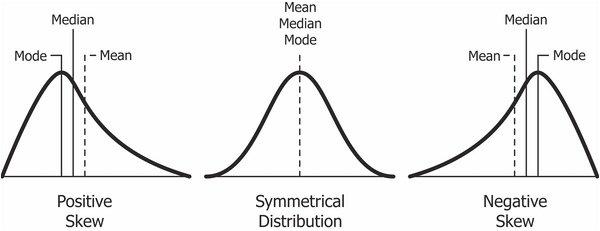
```

\newpage

# Paquete gtsummary
Si deseas imprimir tus estadísticas de resumen en un gráfico bonito y listo para tu publicación, puedes utilizar el paquete gtsummary.
Personalmente es el que uso para la mayoria de mis análisis. Sin embargo, se deben procesar posteriormente en excel o en word para adaptarlos a las revistas.

## Tabla descriptiva 

El comportamiento por defecto de tbl_summary() es bastante increíble: toma las columnas que proporcionas y crea una tabla de resumen en un solo comando. La función imprime las estadísticas apropiadas para el tipo de columna: mediana y rango intercuartil (IQR) para las columnas numéricas, y recuentos (%) para las columnas categóricas. Los valores faltantes se convierten en “Missing”. Se añaden notas a pie de página para explicar las estadísticas, mientras que el N total se muestra en la parte superior.

```{r}
linelist %>% 
  select(age_years, gender, outcome, fever, temp, hospital) %>%  # mantiene sólo las columnas de interés por defecto
  tbl_summary()          
```

Nota: Unknown hace referencia a NA o datos perdidos

## Personalización
Ahora explicaremos cómo trabaja la función y cómo hacer los ajustes. Los argumentos clave se detallan a continuación:

by = Puedes estratificar tu tabla por una columna (por ejemplo, por resultado), creando una tabla de dos vías.

statistic = Usa una ecuación para especificar qué estadísticas mostrar y cómo mostrarlas. La ecuación tiene dos lados, separados por una tilde ~. En el lado derecho, entre comillas, está la visualización estadística deseada, y en el izquierdo están las columnas a las que se aplicará esa visualización.

El lado derecho de la ecuación utiliza la sintaxis de str_glue() de stringr, con la cadena de visualización deseada entre comillas y los propios estadísticos entre llaves. Puedes incluir estadísticas como “n” (para los recuentos), “N” (para el denominador), “mean”, “median”, “sd”, “max”, “min”, percentiles como “p##” como “p25”, o porcentaje del total como “p”. Consulta ?tbl_summary para obtener más detalles.
Para el lado izquierdo de la ecuación, puedes especificar las columnas por su nombre (por ejemplo, age o c(age, gender)) o utilizando ayudantes como all_continuous(), all_categorical(), contains(), starts_with(), etc.

Un ejemplo sencillo de una ecuación statistic = podría ser como el siguiente, para imprimir la media, el valor mínimo y máximo de la columna age_years:

```{r}
linelist %>% 
  select(age_years) %>%         # mantiene sólo las columnas de interés 
  tbl_summary(                  # crea tabla resumen
    statistic = age_years ~ "{mean} ({sd}) vs {median}, ({p25}, {p75}) vs ({min}, {max})") # imprime la media de edad
```

También puedes diferenciar la sintaxis para columnas separadas o tipos de columnas. En el ejemplo más complejo de abajo, el valor proporcionado a statistc = es una lista que indica que para todas las columnas continuas la tabla debe imprimir la media con la desviación estándar entre paréntesis, mientras que para todas las columnas categóricas debe imprimir el n, el denominador y el porcentaje.

**digits =** Ajusta los dígitos y el redondeo. Opcionalmente, se puede especificar que sea sólo para columnas continuas (como a continuación).

**label =** Ajustar cómo debe mostrarse el nombre de la columna. Proporciona el nombre de la columna y la etiqueta deseada separados por una tilde. El valor por defecto es el nombre de la columna.

**missing_text =** Ajustar cómo se muestran los valores faltantes. El valor por defecto es “Unknown”.

**type =** Se utiliza para ajustar cuántos niveles de la estadística se muestran. La sintaxis es similar a statistic = en el sentido de que se proporciona una ecuación con columnas a la izquierda y un valor a la derecha. Dos escenarios comunes incluyen:

**type = all_categorical() ~ "categorical"** Fuerza a las columnas dicotómicas (por ejemplo, fever sí/no) a mostrar todos los niveles en lugar de sólo la fila “sí”

**type = all_continuous() ~ "continuous2"** Permite estadísticas de varias líneas por variable, como se muestra en una sección posterior

En el siguiente ejemplo, cada uno de estos argumentos se utiliza para modificar la tabla resumen original:

```{r}
linelist %>% 
  select(age_years, gender, outcome, fever, temp, hospital) %>% # conserva sólo las columnas de interés
  tbl_summary(     
    by = outcome,                                               # estratifica toda la tabla por resultado
    statistic = list(all_continuous() ~ "{mean} ({sd})",        # estadísticas y formato de las columnas continuas
                     all_categorical() ~ "{n} ({p}%)"),   # estadísticas y formato para columnas categóricas
    digits = all_continuous() ~ 1,                              # redondeo para columnas continuas
    type   = all_categorical() ~ "categorical",                 # fuerza la visualización de todos los niveles categóricos
    label  = list(                                              # muestra las etiquetas de las columnas
      outcome   ~ "Outcome",                           
      age_years ~ "Age (years)",
      gender    ~ "Gender",
      temp      ~ "Temperature",
      hospital  ~ "Hospital"),
    missing_text = "Missing"                                    # cómo deben mostrarse los valores perdidos
  )
```

Si deseas imprimir varias líneas de estadísticas para variables continuas, puedes indicarlo estableciendo type = a “continuous2”. Puedes combinar todos los elementos mostrados anteriormente en una tabla eligiendo qué estadísticas quiere mostrar. Para ello, debes indicar a la función que deseas obtener una tabla escribiendo el tipo como “continuous2”. El número de valores faltantes se muestra como “Desconocido”.

```{r}
linelist %>% 
  select(age_years, temp) %>%                      # conserva sólo las columnas de interés
  tbl_summary(                                     # crea tabla resumen
    type = all_continuous() ~ "continuous2",       # indica que quieres imprimir múltiples estadísticas  
    statistic = all_continuous() ~ c(
      "{mean} ({sd})",                             # línea 1: media y DE
      "{median} ({p25}, {p75})",                   # línea 2: mediana y RIQ
      "{min}, {max}")                               # línea 3: mín. y máx.
    )
```

\newpage

# Inferencia estadística
Este tema te ayudará a comprender la inferencia estadística en la investigación empírica. Se trata de un tema crucial para el investigador, ya que el mal uso o mala interpretación de las pruebas de hipótesis y los p-valores, son parte fundamental la crisis de la reproducibilidad en la ciencia.

En esta primera lección, discutiremos los conceptos claves de la inferencia estadística. Aprenderás a interpretar estimaciones puntuales e intervalos de confianza, a plantear preguntas de investigación, a traducirlas a hipótesis estadísticas, y a interpretar correctamente los p-valores,

```{r, echo=FALSE, fig.cap="Figura sacada del curso de R de Evisalud"}
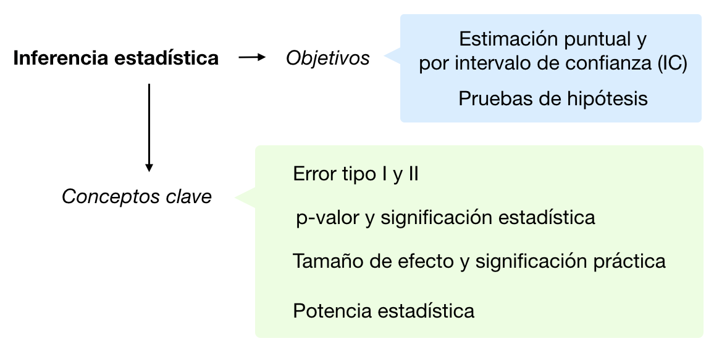
```

La inferencia estadística permite realizar afirmaciones sobre una población basándose en los datos de una muestra.  

Debido a que no tenemos datos de la población entera, nuestras afirmaciones tienen incertidumbre. La inferencia estadística puede ayudar a medir esa incertidumbre.

Por ende, utilizaremos:

- Intervalos de confianza: cuando nos interesa cuantificar la estimación y su incertidumbre.

- Prueba de hipótesis: cuando nos interesa la toma de decisiones en presencia de incertidumbre.

a estimación de un parámetro (por ejemplo, la media) diferirá entre muestras, pero podemos utilizar el error estándar para tener una idea de hasta qué punto estas estimaciones difieren entre muestras. También podemos usar esta información para calcular los límites dentro de los cuales creemos que caerá el valor de la población. Estos límites se denominan intervalos de confianza. 

**¿Cómo interpretar un intervalo de confianza?**

Un intervalo de confianza del 95% nos proporciona un intervalo de valores plausibles para un parámetro poblacional a largo plazo. Es decir, si tomamos muchas muestras del mismo tamaño y calculamos muchos intervalos para el parámetro, esperaríamos que el 95% de ellos contengan el verdadero valor del parámetro poblacional.

El ancho de un intervalo de confianza depende del nivel de confianza, del tamaño de la muestra y de la variabilidad de los datos en la población. 

El nivel de confianza establece la probabilidad de que el método dé una respuesta correcta si lo repetimos muchas veces. Usualmente se toma el valor 95%.

En igualdad de condiciones, el ancho del IC aumenta a medida que disminuye el tamaño de la muestra, aumenta la variación en la población o aumentamos el nivel de confianza. 

Al proporcionar una estimación de intervalo, podemos describir nuestra incertidumbre sobre un parámetro: cuanto más incertidumbre tenemos, más amplio es el intervalo.

En esta situación, la media de la muestra podría ser muy diferente de la media real, lo que indica que la estimación de la muestra no es una buena representación de la población.

**Fórmula para calcular un IC para una media**
Hemos dicho que la variación en la población, el tamaño de la muestra y el nivel de confianza, determinan (afectan) el ancho de cualquier intervalo de confianza.

Como no conocemos la variación en la población, utilizaremos la variación (la desviación estándar) en la muestra como una aproximación. La desviación estándar s indica la distancia promedio entre los valores y la media de la muestra. 

Este valor depende del tamaño de la muestra n, nuestro segundo ingrediente del intervalo de confianza. Por eso, para estandarizar el valor, calculamos el error estándar: la desviación estándar de la muestra dividida por la raíz cuadrada del tamaño de la muestra. Entonces, si tomamos muchas muestras de tamaño n de la misma población, el error estándar nos indica cuán dispersos están los datos. Cuanta más información tenemos (mayor tamaño de la muestra) menor será el ancho del intervalo de confianza, pero el efecto se diluye a medida que aumenta n.

El tercer ingrediente es el nivel de confianza (usualmente del 95%, pero también 90 o 99%), recuerda que si repetimos 100 veces el estudio el nivel de confianza nos indica cuántas veces podríamos capturar el verdadero valor del parámetro poblacional. Esto de “capturar” lo puedes pensar como una red, cuanta más confianza queramos tener en capturar este valor mayor será la red, mayor será nuestro intervalo de confianza.

Según el nivel de confianza y el tamaño de la muestra, calculamos un estadístico t que representa la distribución de muestreo de la media (aquí utilizaremos la distribución más utilizada que es la t de Student, para parámetros desconocidos y muestras pequeñas, pero puedes utilizar en otras circunstancias una distribución z Normal). Por ejemplo, para 30 observaciones y un nivel de confianza del 95%, el valor del estadístico t es 2.05. Es decir, asumimos que el 95% de las medias no distan más de 2.05 desviaciones estándar de la media. 

Multiplicamos el error estándar por el valor del estadístico t para obtener el margen de error del intervalo de confianza. Sumamos y restamos esto a la media muestral para obtener el intervalo de confianza.

Esta es la fórmula final:

$$
\bar{x} \pm t_{\alpha/2} \cdot \left( \frac{s}{\sqrt{n}} \right)
$$

Donde:
- \(\bar{x}\) es la media de la muestra
- \(t_{\alpha/2}\) es el valor crítico de la distribución t de Student con \(df = n - 1\) grados de libertad
- \(s\) es la desviación estándar de la muestra
- \(n\) es el tamaño de la muestra

**¿Qué es una prueba de hipótesis?**

Hasta ahora hemos visto cómo estimar un parámetro poblacional (y su intervalo de confianza) a partir de una muestra. Sin embargo, a menudo como investigadores deseamos decir algo sobre una teoría. 

Las pruebas de hipótesis estadísticas evalúan si los datos de una muestra dan una buena evidencia contra una afirmación o hipótesis sobre una población. Esta evidencia se relaciona con la significación estadística. 

Una prueba de hipótesis utiliza muestras representativas de una población para comprobar la certeza de nuestras afirmaciones (llamadas hipótesis). Esta certeza se expresa en términos de probabilidad (el p-valor).

La prueba de hipótesis nulas es un método generalizado para evaluar teorías científicas. Utiliza dos hipótesis en competencia: una dice que existe un efecto (la hipótesis alternativa, H1) y la otra dice que no existe un efecto (la hipótesis nula, H0). En el procedimiento se calcula una estadística de prueba que representa la hipótesis alternativa y se calcula la probabilidad de que obtenga un valor tan grande como el que se obtiene si la hipótesis nula fuera verdadera (llamado p-valor). Si esta probabilidad es inferior a un nivel de significación alfa seleccionado a priori (usualmente 0.05), los científicos rechazan la idea de que no hay efecto y concluyen que tienen un hallazgo estadísticamente significativo. Si la probabilidad es mayor que 0.05, no rechazan la idea de que no hay efecto y concluyen que tienen un resultado no estadísticamente significativo. 

Entonces, el 𝑝-valor es la probabilidad de encontrar —a largo plazo- un efecto tan grande o más que el efecto observado (en el sentido de proporcionar evidencia contra la hipótesis nula) si el modelo que evaluamos es correcto (i.e. la hipótesis nula es cierta y los requisitos o supuestos de la prueba se cumplen).

El 𝑝-valor mide la fuerza de la evidencia contra la 𝐻0. Menor 𝑝-valor → Mayor evidencia contra 𝐻0.

Comparamos con el nivel de significación 𝛼 (probabilidad del error tipo I). Usualmente consideramos 𝛼=0.05, con lo cual si repetimos el experimento un gran número de veces, la prueba estadística debería rechazar la 𝐻0 el 5% (1 vez en 20 repeticiones) del tiempo o menos. Puedes utilizar otros valores de 𝛼.

```{r, echo=FALSE, fig.cap="Figura sacada del curso de R de Evisalud"}
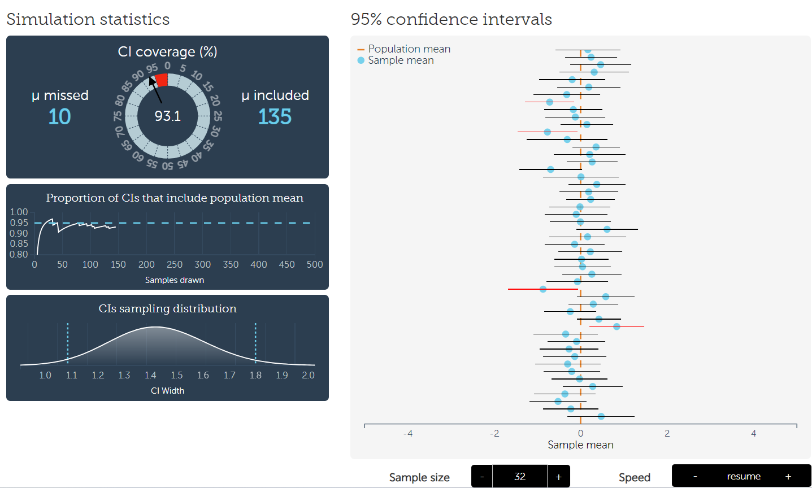
```
Tamaño de muestra = 32 

https://rpsychologist.com/d3/ci/

## Preparación para evaluar pruebas de hipótesis

Cargamos las librerias necesarias

```{r}
pacman::p_load(
  tidyverse,    # gestión de datos + gráficos ggplot2, 
  gtsummary,    # resumen estadístico y pruebas
  corrr        # análisis de correlación para variables numéricas
  )
```

Importamos la base de datos **"linelist_cleaned.rds"**

```{r}
# importar linelist
linelist <- import("linelist_cleaned.rds")

head(linelist, 10)
```

## Pruebas de hipótesis

En la presente sección se abordarán las siguientes pruebas de hipótesis:

```{r, echo=FALSE, fig.cap="Figura sacada del curso de R de Evisalud"}
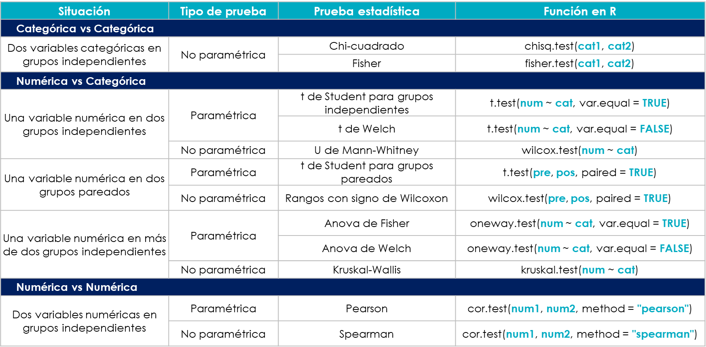
```

## R base

### Test de Chi-cuadrado

El test de Chi-cuadrado de Pearson se utiliza para comprobar las diferencias significativas entre grupos categóricos.

```{r}
## comparar las proporciones en cada grupo con un test de chi-cuadrado
chisq.test(linelist$gender, linelist$outcome)
```

#### Supuestos

1. Selección aleatoria de las muestras. 
Se considera que la muestra disponible para el análisis, equivale a una muestra aleatoria extraída de la población de interés

2. Independencia de las observaciones.  
No existe posibilidad de agregación, porque la muestra ha sido tomada de forma aleatoria y el medir la variable de interés en una observación no afecta el cómo se mide dicha variable en otra observación.
Supuesto teórico, el valor de la variable dependiente de un individuo no debería ser influenciada por las características o acciones de otros individuos. 

3. Menos del 20% de celdas tienen valores esperados menores a 5.

```{r, echo=FALSE}
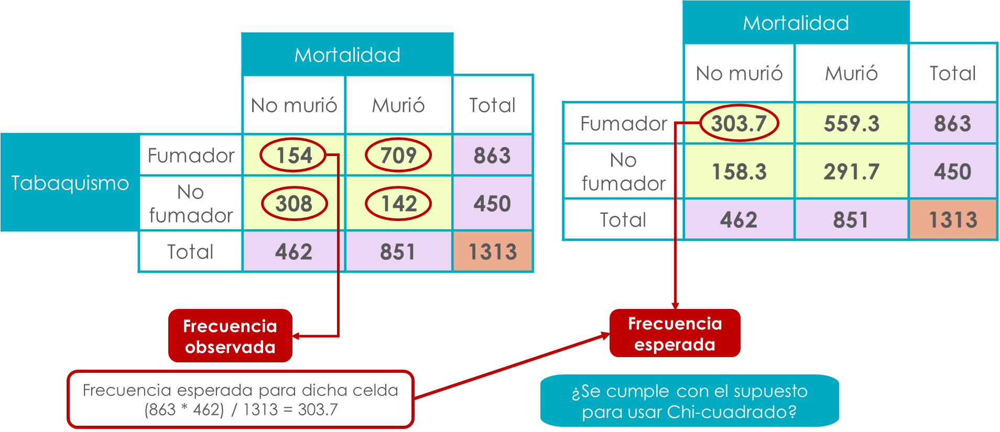
```

OJO: nos referimos al valor de la celda
```{r, echo=FALSE}
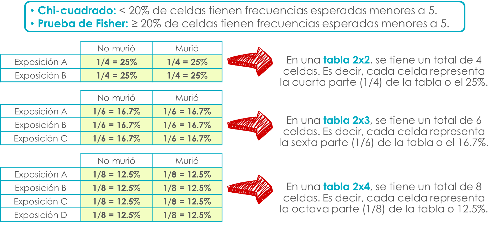
```

```{r}
# almacenamos todos los objetos de chi cuadrado en un objeto
Objeto <- chisq.test(linelist$gender, linelist$outcome)

# solicitamos los valores esperados
Objeto$expected
```

### test de Fisher
El test exacto de Fisher se usa para tablas de contingencia, especialmente cuando las frecuencias esperadas en alguna de las celdas son bajas. Es útil para determinar si existe una asociación significativa entre dos variables categóricas.


```{r, echo=FALSE}
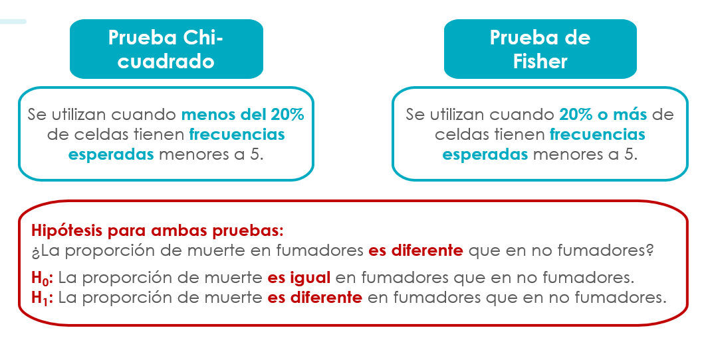
```

```{r}
## comparar las proporciones en cada grupo con un test de chi-cuadrado
fisher.test(linelist$gender, linelist$outcome)
```

#### Supuestos

1. Selección aleatoria de las muestras. 
Se considera que la muestra disponible para el análisis, equivale a una muestra aleatoria extraída de la población de interés

2. Independencia de las observaciones.  
Supuesto teórico, el valor de la variable dependiente de un individuo no debería ser influenciada por las características o acciones de otros individuos. 

3. Más del 20% de celdas tienen valores esperados menores a 5.


### Tests-T
Un test-t, también llamado “Test t de Student” o “Prueba t de Student”, se utiliza normalmente para determinar si existe una diferencia significativa entre las medias de alguna variable numérica entre dos grupos. Aquí mostraremos la sintaxis para hacer esta prueba dependiendo de si las columnas se encuentran o no en el mismo dataframe.

Sintaxis 1: Esta es la sintaxis cuando las columnas numéricas y categóricas están en el mismo dataframe. Sitúa la columna numérica en el lado izquierdo de la ecuación y la columna categórica en el lado derecho. Especifica los datos en data =. Opcionalmente, establece paired = TRUE, conf.level = (0.95 por defecto), y alternative = (ya sea “two.sided”, “less”, o “greater”). Escribe ?t.test para obtener más detalles.

```{r}
## comparar la edad media por grupo de resultados con un test-t
t.test(age_years ~ gender, data = linelist, var.equal=T)
```

#### Supuestos
##### 1. Las observaciones son independientes
Supuesto teórico, el valor de la variable dependiente de un individuo no debería ser influenciada por las características o acciones de otros individuos. 

##### 2. Selección aleatoria de las muestras
La cruda realidad de estas pruebas es que necesitamos tener datos aleatorios. A pesar de ello, son muy empleadas.

##### 3. La variable dependiente es numérica continua. 

```{r}
is.numeric(linelist$age_years)
```


##### 4. La distribución de la variable dependiente es aproximadamente normal en ambos grupos

Para evaluar la normalidad de una variable puedes utilizar diferentes pruebas estadísticas, te recomiendo evaluar el histograma, la simetría y curtosis

```{r, echo=FALSE, fig.cap="Figura sacada del curso de R de Evisalud"}
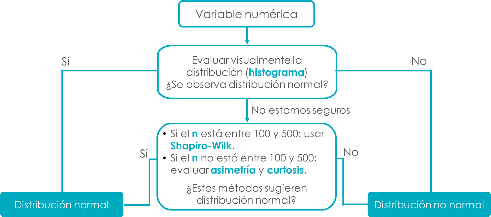
```

```{r}
hist(linelist$age_years) # para fines del ejercicio supondremos que si tiene distribución normal (es evidente que no)
```
Skewness y Kurtosis
```{r}
pacman::p_load(moments)

skewness(linelist$age_years, na.rm = T) # valores de normalidad entre -1 y +1
kurtosis(linelist$age_years, na.rm = T) # valores de normalidad entre 2.5 y 3.5
```
Pruebas de normalidad

```{r}
pacman::p_load(nortest)

#Cramer-von Mises normality test
cvm.test(linelist$age_years)

#Lilliefors (Kolmogorov-Smirnov) normality test
lillie.test(linelist$age_years) 

# Pearson chi-square normality test
pearson.test(linelist$age_years)

# las siguientes pruebas solo permiten hacer los calculos para n < 5000

linelist2 <- linelist %>% na.omit()

# Shapiro-Wilk test
shapiro.test(linelist2$age_years)  

# Shapiro francia
sf.test(linelist2$age_years)

```


Evaluación por subgrupo

```{r}
# para sexo masculino
base_m <- linelist %>% filter(gender=="m")   
  hist(base_m$age_years)
  skewness(base_m$age_years, na.rm = T) # valores de normalidad entre -1 y +1
  kurtosis(base_m$age_years, na.rm = T) # valores de normalidad entre 2.5 y 3.5
  shapiro.test(base_m$age_years)  

# para sexo femenino
base_f <- linelist %>% filter(gender=="m")   
  hist(base_f$age_years)
  skewness(base_f$age_years, na.rm = T) # valores de normalidad entre -1 y +1
  kurtosis(base_f$age_years, na.rm = T) # valores de normalidad entre 2.5 y 3.5
  shapiro.test(base_f$age_years)  

```

##### La homocedasticidad 
NO es un supuesto de la prueba t de student, pero segun su ausencia podrías necesitar una estimación más robusta. 

```{r}
## comparar la edad media por grupo de resultados con un test-t
t.test(age_years ~ gender, data = linelist, var.equal=T)
```

###### Análisis de homocedasticidad
```{r}
pacman::p_load(car)
# necesitamos datos completos para las variables
linelist2 <- linelist %>% select(age_years, gender) %>% na.omit()

# prueba de levene
leveneTest(linelist2$age_years, linelist2$gender) # si el valor p = 0.005 hay homocedasticidad
```
Como nos indica la salida, el valor p es < 0.005 por lo que se necesita hacer una prueba t para varianzas desiguales (prueba más robusta)

```{r}
## comparar la edad media por grupo de resultados con un test-t
t.test(age_years ~ gender, data = linelist, var.equal=F) # solo cambiamos el argumento de var.equal
```
Nota: la prueba de Welch tambien es denominada como prueba t de student para grupos independientes con varianzas desiguales (heterocedasticidad)

Al no cumplirse con alguno de los supuestos podemos evaluar si se puede realizar una prueba de U de Mann Whitney

### Test de suma de rangos de Wilcoxon 
El test de suma de rangos de Wilcoxon, también llamada **test U de Mann-Whitney**, se utiliza a menudo para ayudar a determinar si dos muestras numéricas proceden de la misma distribución cuando tus poblaciones no se distribuyen normalmente o tienen una varianza desigual.

```{r, echo=FALSE, fig.cap="Figura sacada del curso de R de Evisalud"}
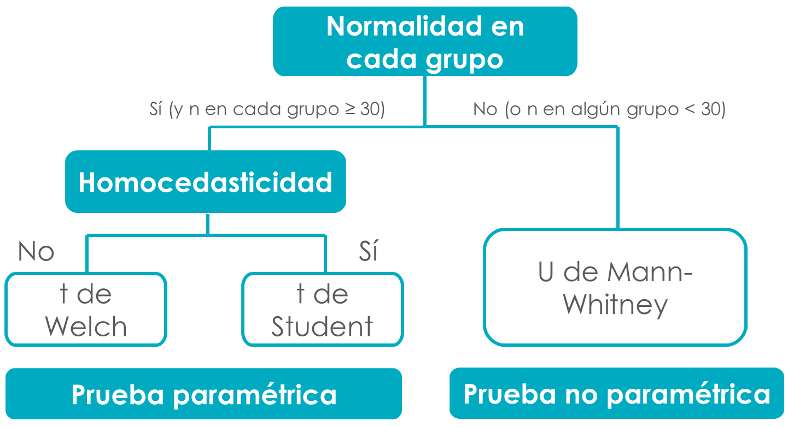
```


```{r}
## comparar la distribución de edad por grupo de resultados con un test de wilcox
wilcox.test(age_years ~ outcome, data = linelist)
```

#### Supuestos

##### 1. Las observaciones son independientes
Supuesto teórico, el valor de la variable dependiente de un individuo no debería ser influenciada por las características o acciones de otros individuos. 

##### 2. Selección aleatoria de las muestras
La cruda realidad de estas pruebas es que necesitamos tener datos aleatorios. A pesar de ello, son muy empleadas.

##### 3. La variable dependiente es al menos numérica discreta. 

```{r}
is.integer(linelist$age_years) # para ver si es numerica discreta
is.numeric(linelist$age_years) # si es numerica mucho mejor
```

##### 4. La distribución de la variable dependiente es similar en ambos grupos
OJO: No porque no es normal en una de los grupos quiere decir que uso si o si Mann Whitney, ya que debería cumplirse este supuesto. En la práctica no se suele evaluar. 


### ANOVA
ANOVA (Análisis de Varianza) se usa para comparar las medias de más de dos grupos y determinar si hay diferencias significativas. A diferencia del test-t, que se limita a dos grupos, ANOVA permite comparar varios grupos a la vez.

```{r}
# Aplicar ANOVA para ver si hay diferencias significativas en el BMI entre grupos etarios
anova_result <- aov(bmi ~ age_cat, data = linelist)
summary(anova_result)
```

#### Supuestos

1. Selección aleatoria de las muestras.  

2. Independencia de las observaciones.  

3. La variable dependiente es numérica con escala al menos de intervalo: 

4. La variable dependiente tiene una distribución aproximadamente normal dentro de cada grupo de la variable independiente categórica 

5. La varianza de la variable dependiente es igual en todas las poblaciones (homocedasticidad):

Prueba de Levene: 

```{r}
# Aplicar la prueba de Levene para homocedasticidad
leveneTest(bmi ~ age_cat, data = linelist)
```

Prueba de Bartlett: 
Se utiliza para evaluar la homogeneidad de varianzas, pero es más sensible a desviaciones de la normalidad.
```{r}
# Aplicar la prueba de Bartlett para homocedasticidad
bartlett.test(bmi ~ age_cat, data = linelist)

```

Como nos indica la salida, el valor p es < 0.005 por lo que se necesita hacer una prueba de ANOVA para varianzas desiguales (prueba más robusta)

```{r}
oneway.test(bmi ~ age_cat, data = linelist, var.equal = FALSE)
```

Al no cumplir con alguno de los supuesto, se optaría por una prueba no paramétrica como Kruskall Wallis.

##### Podemos realizar pos estimaciones
La corrección de Bonferroni es un método para ajustar el nivel de significancia en pruebas múltiples para reducir el riesgo de obtener resultados falsamente significativos (errores de Tipo I). Se utiliza cuando se realizan muchas pruebas estadísticas simultáneamente, como en experimentos con múltiples comparaciones.

¿Cuándo usar Bonferroni?
Pruebas Múltiples: Si realizas varias pruebas estadísticas (por ejemplo, comparaciones de medias entre múltiples grupos), el riesgo de falsos positivos aumenta. La corrección de Bonferroni ayuda a mantener el error de Tipo I bajo control.
ANOVA con Comparaciones Post-Hoc: Si haces ANOVA y necesitas comparar múltiples pares de grupos, Bonferroni es una opción para mantener la tasa de error bajo control.
Cómo Aplicar la Corrección de Bonferroni
La corrección de Bonferroni ajusta el nivel de significancia (α) dividiendo el nivel de significancia por el número de pruebas realizadas (m). Para cualquier prueba individual, el nivel de significancia ajustado se calcula como:
\[ \alpha_{Bonferroni} = \frac{\alpha}{m} \]

```{r}
pacman::p_load(multcomp)
# Aplicar ANOVA
anova_result <- aov(bmi ~ age_cat, data = linelist)
summary(anova_result)  # Ver el resultado del ANOVA

# Aplicar comparaciones post-hoc con corrección Bonferroni
comparaciones <- glht(anova_result, linfct = mcp(age_cat = "Tukey"))
summary(comparaciones, test = adjusted("bonferroni"))
```

### Test de Kruskal-Wallis
El test de Kruskal-Wallis es una extensión del test de suma de rangos de Wilcoxon. Puede utilizarse para comprobar las diferencias en la distribución de más de dos muestras. Cuando sólo se utilizan dos muestras, los resultados son idénticos a los del test de suma de rangos de Wilcoxon.

```{r}
## comparar la distribución de edad por grupo de resultados con un test de kruskal-wallis
kruskal.test(age_years ~ outcome, linelist)
```

#### Supuestos

1. Selección aleatoria de las muestras.  

2. Independencia de las observaciones.  

3. La variable dependiente es numérica con escala al menos ordinal 

4. La variable dependiente tiene una distribución similar entre los grupos de la variable independiente categórica 


### Correlación
El punto de partida para el análisis de correlación es la representación gráfica de las variables. Para ello utilizaremos un diagrama de dispersión, la herramienta más común y efectiva para visualizar la relación entre dos variables numéricas.

Lo que nos interesa es identificar el tipo de relación o asociación entre ambas variables, su dispersión y si existen datos que se comportan de manera atípica (outliers).

Este paso previo nos permitirá seleccionar el coeficiente de correlación adecuado para medir la relación entre las dos variables numéricas.

¿Qué debes mirar?

1.forma (lineal vs no lineal), 

```{r}
linelist %>% 
  ggplot(aes(x=age_years, y=wt_kg))+
  geom_point()+
  theme_test()
```

2. dirección (tendencia positiva vs negativa)

```{r echo=FALSE}
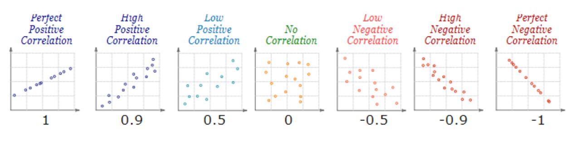
```

3. dispersión (o magnitud, si existe más o menos variabilidad en la tendencia) 

4. presencia de valores atípicos (outliers): si bien se observan valores no plausibles en el scatterplot es mejor valorar de forma independiente cada variable con un histograma o con un boxplot

```{r}
# para edad
linelist %>% 
  ggplot(aes(x=age_years))+
  geom_boxplot()+
  theme_test()

# para peso
linelist %>% 
  ggplot(aes(x=wt_kg))+
  geom_boxplot()+
  theme_test()

# Valores atípicos 

nueva_base <- linelist %>% dplyr::select(age,wt_kg) %>% na.omit()

# Calcular la distancia de Mahalanobis
mu_est <- colMeans(nueva_base)
sigma_est <- cov(nueva_base)
nueva_base$mahalanobis <- apply(nueva_base, 1, function(row) {
  mahalanobis(row, mu_est, sigma_est)
})

head(nueva_base)

# Identificar valores atípicos
outliers <- nueva_base[nueva_base$mahalanobis > 5, ]
head(outliers, 30)


```

La correlación es un tipo de asociación con tendencia creciente o decreciente (lineal o monotónica), su valor refleja el signo y magnitud (tamaño del efecto) de la relación. 

- Correlación de Pearson (r): para tendencias lineales, datos con distribución normal (o aproximada; y por lo tanto no ordinales), es sensible a los outliers.

- Correlación de Spearman (s): para tendencias no necesariamente lineales pero sí monotóna (de aumento o decrecimiento). Se basa en rangos, no en los valores originales, por lo que no asume la normalidad, se puede analizar datos ordinales y es menos sensible a los outliers.


### Correlación de Pearson
El coeficiente de correlación de Pearson mide la relación lineal entre dos variables numéricas. Un coeficiente cercano a 1 o -1 indica una fuerte relación lineal, mientras que un coeficiente cercano a 0 indica una relación débil o inexistente.

```{r}
# Comprobar si hay valores faltantes
sum(is.na(linelist$age))   # Debe ser cero
sum(is.na(linelist$wt_kg)) # Debe ser cero

nueva_base <- linelist %>% filter(age_unit=="years" & wt_kg>=10) %>%  dplyr::select(age,wt_kg) %>% na.omit()

# Calcular el coeficiente de correlación de Pearson entre edad y peso
cor(nueva_base$age, nueva_base$wt_kg, method = "pearson")

#alternativa más sencilla: usar datos completos
cor(linelist$age_years, linelist$wt_kg, method = "pearson", use = "pairwise.complete.obs")

# prueba de hipotesis (valor p)
cor.test(linelist$age_years, linelist$wt_kg, method = "pearson", use = "pairwise.complete.obs")
  
```


#### Supuestos

1. Selección aleatoria de las muestras.  

2. Independencia de las observaciones.  

3. La relación entre las variables es aproximadamente lineal

4. Ambas variables tienen distribución normal

5. Debe existir una distribución normal bivariada

```{r, echo=FALSE}
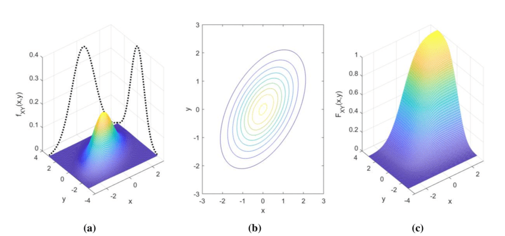
```

El supuesto de normalidad bivariante puede ser importante cuando se quiere hacer inferencia (probar una hipótesis o estimar intervalos de confianza) aplicando un estadístico t o Z como las que se calculan con en R.

```{r}
library(ggExtra)

nueva_base <- linelist %>% filter(age_unit=="years" & wt_kg>=10) %>%  dplyr::select(age,wt_kg) %>% na.omit()

# visualicemos
ggplot(nueva_base, aes(x = wt_kg, y = age)) +
  geom_point() +
  stat_ellipse(level = 0.95, linewidth= 2, color= "red") +  # Elipse de confianza del 95%
  labs(title = "Gráfico de dispersión con elipses de confianza")
```

```{r}

# normalidad univaraida y bivariada 
# devtools::install_github("daattali/ggExtra")

p <- ggplot(nueva_base, aes(x=age, y = wt_kg)) + geom_point() + theme_classic()
ggExtra::ggMarginal(p, size = 2, type = "histogram",
            fill = "orange")

```

Prueba de Doornik-Hansen
En qué casos usarla: Se basa en la combinación de asimetría y curtosis para evaluar la normalidad multivariada, similar a Mardia, pero con diferentes supuestos.
Cuándo es adecuada: Para obtener una visión general de la normalidad multivariada, especialmente con datos de tamaño moderado a grande.
```{r}
# pruebas estadisticas para normalidad bivariada
pacman::p_load(MVN)

df <- linelist %>% filter(age_unit=="years" & wt_kg>=10) %>%  dplyr::select(age,wt_kg) %>% na.omit()

# Realizar la prueba de Doornik-Hansen (recomendada)
doornik_hansen_test <- mvn(data = df, mvnTest = "dh",  multivariatePlot = "qq")

# Mostrar resultados de la prueba de Doornik-Hansen
print(doornik_hansen_test)
```

Prueba de Mardia
En qué casos usarla: Útil para detectar asimetría y curtosis multivariada. Funciona bien con conjuntos de datos grandes, aunque puede tener menor poder con datos pequeños.
Cuándo es adecuada: Cuando deseas un análisis detallado de asimetría y curtosis para evaluar la normalidad multivariada.
```{r}
# Realizar la prueba de Mardia para evaluar la normalidad multivariada
mardia_test <- mvn(data = df, mvnTest = "mardia")

# Mostrar resultados de la prueba de Mardia
print(mardia_test)
```


Prueba de Henze-Zirkler
En qué casos usarla: Se basa en una aproximación basada en funciones características y es adecuada para diversas distribuciones, no solo la normalidad multivariada.
Cuándo es adecuada: Cuando necesitas un enfoque robusto para datos con variabilidad en la forma o cuando la normalidad no es claramente evidente.
```{r}
# Usar la prueba de Henze-Zirkler
hz_test <- mvn(data = df, mvnTest = "hz")
print(hz_test)
```

Prueba de Royston
En qué casos usarla: Es una extensión de la prueba de Shapiro-Wilk para datos multivariados. Puede ser más sensible para detectar desviaciones de la normalidad.
Cuándo es adecuada: Si tienes conjuntos de datos pequeños a medianos y deseas un enfoque sensible para detectar desviaciones sutiles
```{r}
# Usar la prueba de Royston
# Solo acepta data.frame con menos de 5000 observaciones
df <- linelist %>% na.omit() %>% filter(age_unit=="years" & wt_kg>=10) %>%  dplyr::select(age,wt_kg) 

royston_test <- mvn(data = df, mvnTest = "royston")
print(royston_test)

```


Sin embargo, las simulaciones muestran que la prueba de hipótesis para el coeficiente de correlación lineal es robusta al incumplimiento ligero a moderado del supuesto de normalidad bivariante cuando las muestras son grandes. 

Por el contrario, en muestras pequeñas, el supuesto de normalidad bivariante es de vital importancia. 

Por último, si el supuesto de normalidad bivariante no se cumple en muestras pequeñas y se desea hacer inferencia, entonces una correlación de Spearman es una buena opción siempre que se cumplan los supuestos de estos.


### Correlación de Spearman
El coeficiente de correlación de Spearman se usa para medir la relación entre dos variables ordinales o cuando los datos no cumplen con los supuestos de Pearson (como la no linealidad). Spearman es menos sensible a valores extremos o distribuciones no normales.

```{r}
# Calcular el coeficiente de correlación de Spearman entre edad y peso
cor(nueva_base$age, nueva_base$wt_kg, method = "spearman")

#alternativa más sencilla: usar datos completos
cor(linelist$age_years, linelist$wt_kg, method = "spearman", use = "pairwise.complete.obs")

# prueba de hipotesis (valor p)
cor.test(linelist$age_years, linelist$wt_kg, method = "spearman", use = "pairwise.complete.obs")
  
```

#### Supuestos

1. Selección aleatoria de las muestras.  

2. Independencia de las observaciones.  

3. La relación entre las variables es monotonica

4. Ambas variables tienen distribución similar entre ellas


#### Correlación vs. Causalidad
La correlación implica asociación, pero no causalidad. A la inversa, la causalidad implica asociación, pero no correlación. No obstante, las correlaciones pueden ser útiles para generar un modelo de predicción incluso cuando no existe una relación causal entre las dos variables.
Un ejemplo es la paradoja de Simpson, que produce múltiples errores en la interpretación de la asociación y correlación. Esta paradoja indica que en determinados casos se produce un cambio en la relación entre un par de variables, cuando se controla el efecto de una tercera variable (factor de confusión).

\newpage

## Vistazo general
```{r, echo=FALSE, fig.cap="Figura sacada del curso de R de Evisalud"}
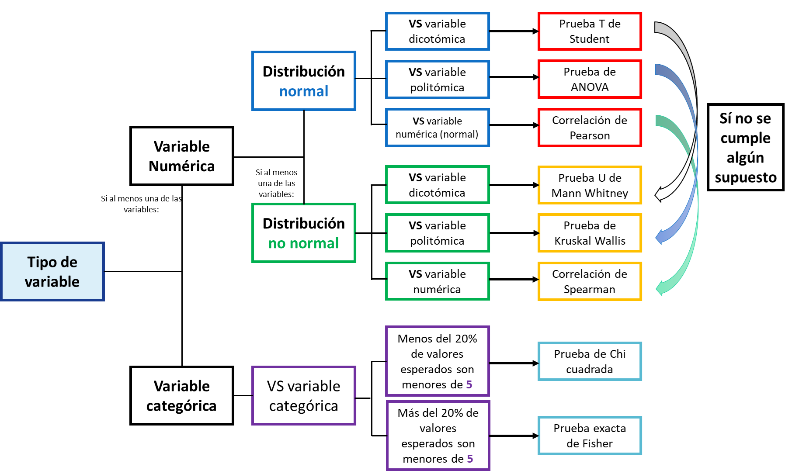
```
\newpage
# Forma simplificada
Sí llegaste hasta aquí y comprendiste cuando usa cada prueba de hipótesis dejame felicitarte :D 
Ahora te presento la forma resumida de hacer las pruebas estadísticas

## Paquete gtsummary

```{r}

# theme to round percentages to one decimal place
set_gtsummary_theme(list(
  `tbl_summary-fn:percent_fun` = function(x) sprintf("%.1f", x * 100)
))


tabla_resumen <- linelist %>% filter(!is.na(outcome)) %>% 
  dplyr::select(age_years, gender, outcome, fever, temp, hospital) %>% # conserva sólo las columnas de interés
  tbl_summary(     
    by = outcome,                                               # estratifica toda la tabla por resultado
    statistic = list(all_continuous() ~ "{mean} ({sd})",        # estadísticas y formato de las columnas continuas
                     percent = "row",
                     all_categorical() ~ "{n} ({p}%)"),         # estadísticas y formato para columnas categóricas
    digits = all_continuous() ~ 1,                              # redondeo para columnas continuas
    type   = all_categorical() ~ "categorical",                 # fuerza la visualización de todos los niveles categóricos
    missing_text = "Missing",                                   # cómo deben mostrarse los valores perdidos
      label  = list(                                              # muestra las etiquetas de las columnas
      outcome   = "Outcome",                           
      age_years = "Age (years)",
      gender    = "Gender",
      fever    = "Fever",
      temp      = "Temperature",
      hospital  = "Hospital")
) %>% 
  add_overall() %>% 
  add_p(pvalue_fun = ~ style_pvalue(.x, digits = 3),
        test = list(age_years ~ "kruskal.test",            # "t.test", "wilcox.test", "aov", all_continuous() ~ "t.test", 
                    gender ~ "fisher.test"                 # all_categorical() ~ "chisq.test"
        )) %>% 
  modify_header(label ~ "**Variable**") %>%
  modify_spanning_header(c("stat_1", "stat_2") ~ "**Outcome**") %>%
  modify_caption("**Table 1. Patient Characteristics by outcome**") %>%
  bold_labels()


tabla_resumen
  
```

Exportación de la tabla a word

```{r}
library(flextable)
library(officer)

# Convertir la tabla gtsummary a flextable
tabla_flextable <- as_flex_table(tabla_resumen)

# Guardar la tabla en un documento de Word
read_docx() %>%
  body_add_flextable(value = tabla_flextable) %>%
  print(target = "tabla_resumen.docx")
```


