```{r echo = FALSE}
setwd("C:/Users/danfe/Dropbox/Proyectos Daniel/Cursos - diplomados - Maestrias/Programa de autoformación en investigación y análisis de datos/Rmarkdowns/Estadística/Programa de formación/Semana 6 reg_lineal")

knitr::opts_chunk$set(echo = TRUE, warning = FALSE, message = FALSE,
                         fig.show = "asis", results = "show",
                      fig.align='center',
                      fig.path = "figures/",  # Configura el directorio donde se guardan los gráficos
  dev = "png")
```

\newpage

# Alistemos los ingredientes necesarios

## Cargar paquetes
```{r}
pacman::p_load(
  rio,          # Importación de ficheros
  here,         # localizador de ficheros
  skimr,        # obtener una visión general de los datos
  gtsummary,    # resumen estadístico y tests
  MASS,         # correlacion
  tidyverse,    # gestión de datos + gráficos ggplot2
  janitor,      # añadir totales y porcentajes a las tablas
  scales,       # convertir fácilmente proporciones en porcentajes  
  flextable     # convertir tablas en imágenes bonitas
  )
```

# Conceptos generales
## ¿Qué es una regresión lineal?
Una regresión lineal es un modelo estadístico que analiza la relación entre una variable de respuesta (a menudo llamada y) y una o más variables y sus interacciones (a menudo llamadas x o variables explicativas). Haces este tipo de relación en tu cabeza todo el tiempo, por ejemplo, cuando calculas la edad de un niño en función de su altura, estás asumiendo que cuanto mayor sea, más alto será.

La regresión lineal es uno de los modelos estadísticos más básicos que existen, sus resultados pueden ser interpretados por casi todo el mundo y existe desde el siglo XIX. Esto es precisamente lo que hace que la regresión lineal sea tan popular. Es simple y ha sobrevivido durante cientos de años. Aunque no es tan sofisticado como otros algoritmos como las redes neuronales artificiales o los bosques aleatorios, según una encuesta realizada por KD Nuggets, la regresión fue el algoritmo más utilizado por los científicos de datos en 2016 y 2017 . ¡Incluso se predice que seguirá utilizándose en el año 2118 

## Creando una regresión lineal en R
No todos los problemas se pueden resolver con el mismo algoritmo. En este caso, la regresión lineal supone que existe una relación lineal entre la variable de respuesta y las variables explicativas. Esto significa que puede colocar una línea entre las dos (o más variables). En el ejemplo anterior de la edad del niño, queda claro que existe una relación entre la edad de los niños y su altura.

```{r, echo=FALSE}
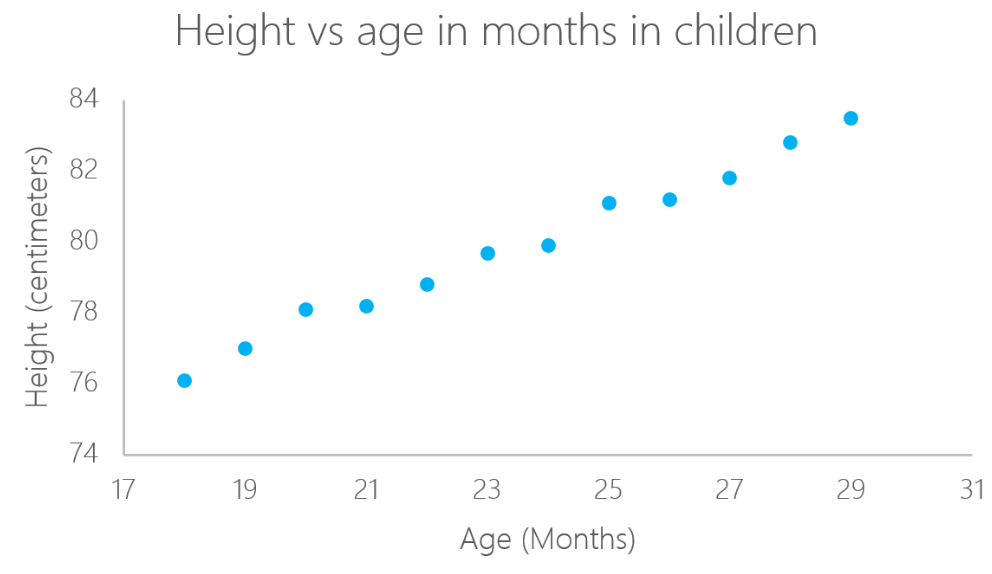
```

En este ejemplo particular, puedes calcular la altura de un niño si conoces su edad:

$$\text{Height} = \alpha + \beta \cdot X + \text{error}$$
En este caso, $\alpha$ y $\beta$ se denominan intercepto y pendiente, respectivamente. Con el mismo ejemplo, $\alpha$ o la intersección, es el valor desde donde se empieza a medir. Los bebés recién nacidos con cero meses no miden necesariamente cero centímetros; esta es la función de la intersección. La pendiente mide el cambio de altura respecto a la edad en meses. En general, por cada mes que tenga el niño, su altura aumentará con $\beta$

# lm en R
Se puede calcular una regresión lineal en R con el comando lm. En el siguiente ejemplo, utilice este comando para calcular la altura según la edad del niño.

```{r}
library(readxl)
ageandheight <- read_excel("ageandheight.xls", sheet = "Hoja2") #Upload the data
lmHeight = lm(height~age, data = ageandheight) #Create the linear regression
summary(lmHeight) #Review the results
```
En la sección de **Estimate** puedes ver los valores de la intersección (valor $\alpha$) y la pendiente (valor $\beta$) para la edad. Estos valores $\alpha$ y $\beta$ trazan una línea entre todos los puntos de los datos. Entonces, en este caso, si hay un niño que tiene 20,5 meses, a es 64,92 y b es 0,635, el modelo predice (en promedio) que su altura en centímetros es alrededor de $$64,92 + (0,635 * 20,5) = 77,93 cm$$ .

Cuando una regresión tiene en cuenta dos o más predictores para crear la regresión lineal, se denomina regresión lineal múltiple. Con la misma lógica que usaste en el ejemplo simple anterior, la altura del niño se medirá mediante:

$$\text{Altura} = \alpha + \beta_1 \cdot \text{Edad} + \beta_2 \cdot \text{Número de hermanos}$$
Ahora está considerando la altura en función de la edad en meses y del número de hermanos que tiene el niño. 

Puedes interpretar estos coeficientes de la siguiente manera:

Al comparar niños con el mismo número de hermanos, la altura promedio prevista aumenta en 0,63 cm por cada mes que tiene el niño. De la misma manera, al comparar niños de la misma edad, la altura disminuye (porque el coeficiente es negativo) en -0,01 cm por cada aumento en el número de hermanos.

En R, para agregar otro coeficiente, agregue el símbolo "+" por cada variable adicional que desee agregar al modelo.

```{r}
lmHeight2 = lm(height~age + no_siblings, data = ageandheight) #Create a linear regression with two variables
summary(lmHeight2) #Review the results
```
Como ya habrás notado, observar el número de hermanos es una forma tonta de predecir la altura de un niño. Otro aspecto al que debes prestar atención en tus modelos lineales es el valor p de los coeficientes. 

En términos simples, un valor p indica si se puede rechazar o aceptar una hipótesis. La hipótesis, en este caso, es que el predictor no es significativo para su modelo.

El valor p para la edad es 4,34*e-10 o 0,000000000434. Un valor muy pequeño significa que la edad probablemente sea una excelente adición a su modelo.

El valor p para el número de hermanos es 0,85. En otras palabras, existe un 85% de posibilidades de que este predictor no sea significativo para la regresión.

Una forma estándar de probar si los predictores no son significativos es observar si los valores de p son menores que 0,05.


## Residuales

Una buena forma de probar la calidad del ajuste del modelo es observar los residuos o las diferencias entre los valores reales y los valores predichos. La línea recta en la imagen de abajo representa los valores predichos. Las líneas verticales  desde la línea recta hasta el valor de los datos observados es el residual.

```{r, echo=FALSE, out.width='80%', out.height='80%'}
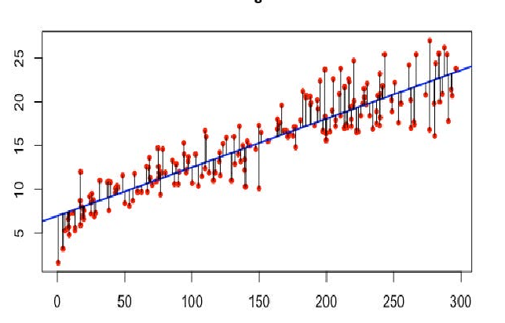
```

La idea aquí es que la suma de los residuos sea aproximadamente cero o lo más baja posible. En la vida real, la mayoría de los casos no seguirán una línea perfectamente recta, por lo que se esperan residuos. En el resumen R de la función lm se pueden ver estadísticos descriptivos sobre los residuos del modelo, siguiendo el mismo ejemplo, el cuadrado rojo muestra como los residuos son aproximadamente cero.

```{r, echo=FALSE, out.width='60%', out.height='60%'}
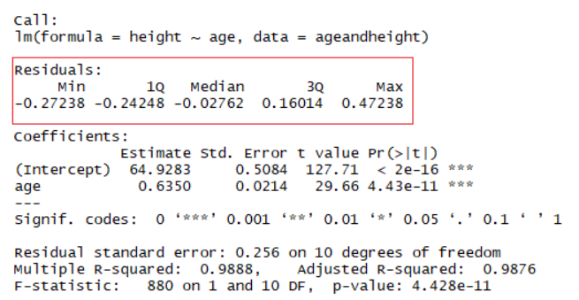
```

## Construcción del modelo

Método de mínimos cuadrados

Para encontrar la línea que mejor se ajusta a los datos y estimar los coeficientes del modelo de regresión, utilizamos el método de mínimos cuadrados ordinario (ordinary least squares, OLS). La idea detrás es que un modelo se ajusta bien a los datos si las diferencias entre los valores observados y los valores que el modelo predice son pequeñas (i.e. los residuos son pequeños). Si miramos un diagrama de dispersión, este método ajusta la línea que pase por, o lo más cerca posible de, la mayor cantidad de puntos. Por lo tanto, este método determina la mejor línea, de todas las posibles que podrían ajustarse. 

Técnicamente, la regresión por mínimos cuadrados minimiza la suma de los residuos al cuadrado. Las diferencias las elevamos al cuadrado antes de sumarlas para que las direcciones de las diferencias (positivas o negativas) no se cancelen


```{r, echo=FALSE, out.width='80%', out.height='80%'}
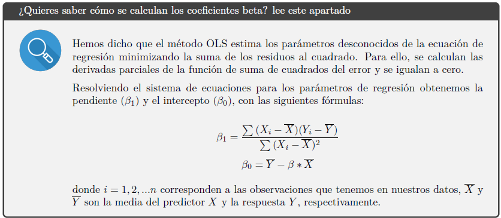
```


## Bondad o calidad global del ajuste.

Para evaluar el desempeño del modelo de regresión debemos comprobar qué tan bien se ajusta el modelo
a los datos, esto es la calidad general del ajuste de regresión lineal. Para ello, se pueden utilizar las
siguientes tres medidas, que se muestran en el resumen del modelo

```{r, echo=FALSE, out.width='80%', out.height='80%'}
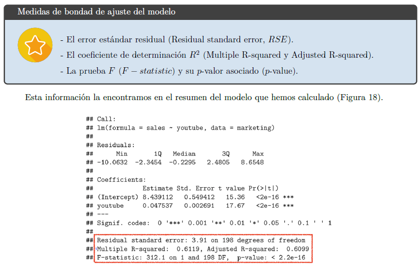
```

### El Error Estándar Residual (RSE)

El Error Estándar Residual (Residual standard error, RSE o sigma) representa la variación promedio de los puntos alrededor de la línea de regresión ajustada. 

Nos da una medida absoluta (en las unidades de la variable de respuesta) de la falta de ajuste del modelo a los datos o del error de predicción. Es decir, indica qué tan incorrecto es el modelo de regresión en promedio. 

Cuanto más bajo sea el RSE (más cercano a 0), mejor se ajusta el modelo a nuestros datos (i.e. las observaciones están más cerca de la línea ajustada).

En R podemos obtener el valor de RSE escribiendo:

```{r}
sigma(lmHeight2) #RSE
```
Aquí RSE = 0.245, lo que significa que los valores de ventas predichos por el modelo se alejan 0.245 unidades del verdadero valor.

Ten en cuenta que el valor del RSE se vuelve subjetivo porque depende tanto de las unidades de la variable respuesta como del contexto del problema. En estos casos, podemos calcular una medida relativa del error, que no dependa de las unidades, llamado porcentaje de error o tasa de error de predicción.

La división del RSE por el valor promedio de la variable de respuesta dará la tasa de error de predicción, que debería ser lo más pequeña posible.

Cuanto menor sea la tasa de error de predicción, mejor es el ajuste del modelo.

```{r}
#tasa de error de predicción
sigma(lmHeight2)*100/mean(ageandheight$height)
```
En nuestro conjunto de datos, el porcentaje de error es del 33.1%.

### Coeficiente de determinación $R^2$

El coeficiente de determinación $R^2$ es una medida relativa de qué tan bien se ajusta el modelo a los datos. Representa el porcentaje de información en los datos que puede ser explicado por el modelo. Dicho de otro modo, es la cantidad de variación en la variable respuesta que es explicada por el modelo en relación con la variación total. Varía de 0 a 1, y se puede expresar como un porcentaje si lo multiplicamos por 100. En general, cuanto mayor sea el $R^2$, mejor se ajustará el modelo a nuestros datos.

$$
R^2 = \frac{{\text{Varianza explicada por el modelo}}}{{\text{Varianza total}}}
$$


```{r, echo=FALSE, out.width='60%', out.height='60%'}
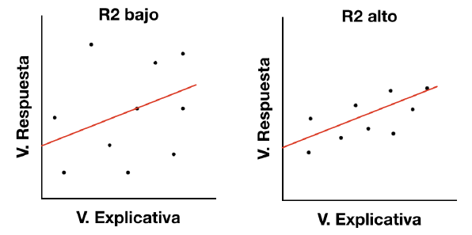
```

Sin embargo, es esencial tener en cuenta que a veces un R² alto no es necesariamente bueno siempre (ver gráficos residuales a continuación) y un R² bajo no siempre es necesariamente malo. En la vida real, los acontecimientos no siempre encajan en una línea perfectamente recta. Por ejemplo, puedes tener en tus datos niños más altos o más pequeños con la misma edad. En algunos campos, un R² de 0,5 se considera bueno.

Con el mismo ejemplo anterior, mire el resumen del modelo lineal para ver su R².

```{r}
lmHeight2 = lm(height~age + no_siblings, data = ageandheight) #Create a linear regression with two variables
summary(lmHeight2)$r.squared #Review the results
```


$R^2$ ajustado:

El $R^2$ ajustado modifica el $R^2$ para penalizar la inclusión de variables adicionales que no mejoran el modelo significativamente. Es más útil cuando se comparan modelos con diferente número de variables.

OJO: El valor del R2 no nos dice si un modelo de regresión lineal es adecuado.

Los gráficos son esenciales para interpretar correctamente el valor del R2. Por ejemplo, en el conjunto de datos de Anscombe hemos visto cuatro casos con el mismo valor de R2 pero con relaciones muy distintas, y solo en uno de ellos tenía sentido ajustar un modelo de regresión lineal.

```{r, echo=FALSE, out.width='60%', out.height='60%',  fig.cap="Conjunto de datos de Anscombe. Los cuatro casos presentan el mismo valor de R2 pero con relaciones muy distintas."}
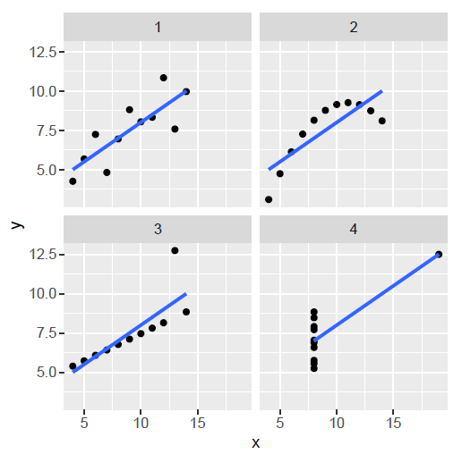
```
OJO 2: El valor de R2 no afecta la interpretación de variables significativas.

No necesitamos un valor en particular del R2 para obtener una interpretación válida de nuestro modelo.

En su lugar, debes preguntarte: ¿El modelo es lógico? ¿se ajusta a la teoría? ¿Los datos que tengo son confiables? ¿Cómo interpreto los p-valores y los coeficientes de la regresión? ¿El diagnóstico gráfico del modelo se ve bien? ¿cumple con los supuestos (requisitos)?

### La prueba F 

El RSE y R2 proporcionan una estimación de la fuerza de la relación entre el modelo y la variable respuesta
para los datos estudiados. Sin embargo, si queremos sacar conclusiones sobre la población, no solo sobre
nuestra muestra, tenemos que realizar pruebas de hipótesis para evaluar la relación que analizamos. Una de
las pruebas posibles es la prueba F que evalúa el ajuste global del modelo.

```{r, echo=FALSE, out.width='80%', out.height='80%'}
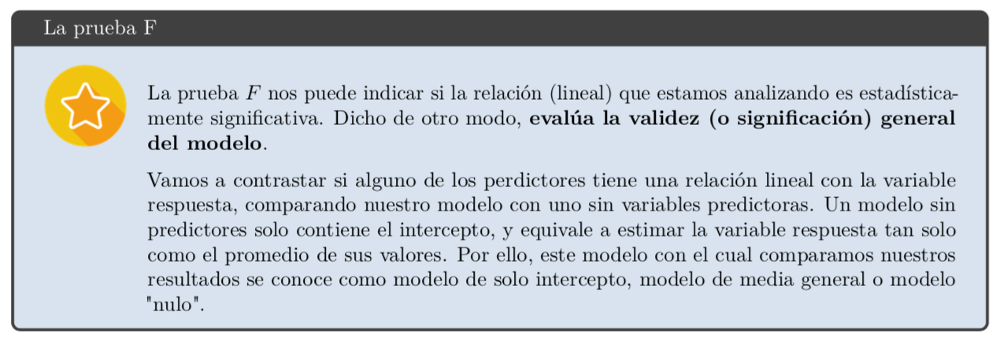
```
Las hipótesis para esta prueba F son las siguientes:

- Hipótesis nula: los datos se ajustan tan bien a nuestro modelo como a un modelo sin variables predictoras. Por lo tanto, nuestro modelo no mejora la estimación de la respuesta. Esto equivale al caso en que todos los coeficientes de regresión (sin considerar la constante) del modelo son iguales a cero.

- Hipótesis alternativa: el ajuste de nuestro modelo es mejor que utilizar tan solo un modelo con el intercepto para estimar la respuesta. Es decir, nuestro modelo mejora la estimación de la respuesta. Esto equivale a decir que alguno de los coeficientes de regresión (sin considerar la constante) del modelo no es igual a cero.

El estadístico F varía de cero a un número muy grande. Un valor grande de F corresponderá a un p-valor pequeño. Para determinar la significación de la prueba debemos comparar el p-valor asociado al estadístico F con nuestro valor de referencia, usualmente .05 porque asumimos un 95% de confianza. Si el p-valor de la prueba F para evaluar el modelo general es menor que nuestro nivel de significación de referencia (.05), podemos rechazar la hipótesis nula y concluir que nuestro modelo proporciona un mejor ajuste que el modelo sin variables predictoras. Diremos aquí que el modelo es significativo. En su lugar, cuando el p-valor que obtenemos es mayor que el nivel de significación .05, indica que no hay pruebas suficientes en nuestra muestra para concluir que el modelo lineal es válido para ajustar nuestros datos.

La prueba F para la significación general la encontramos al final del resumen del modelo (summary(model))
o en la tabla de análisis de varianza (ANOVA) para el modelo:

```{r, echo=FALSE, out.width='100%', out.height='100%'}
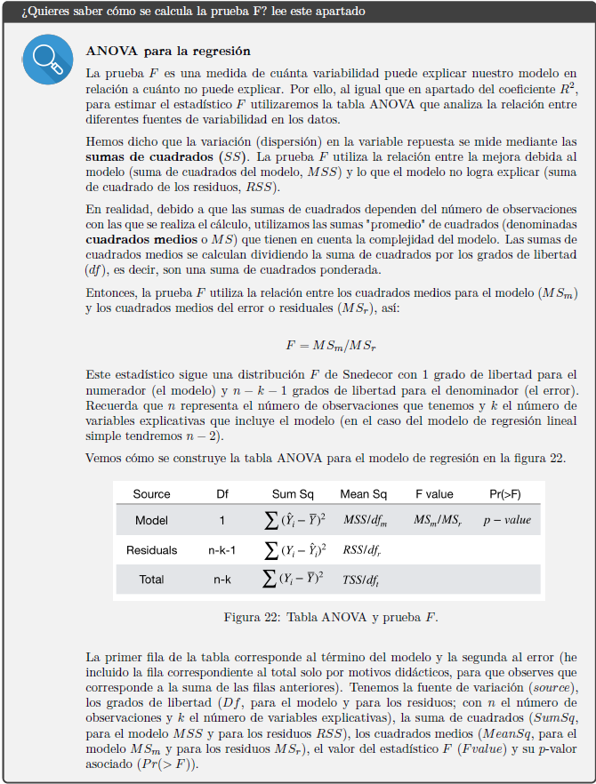
```

```{r}
lmHeight_x = lm(height~ no_siblings, data = ageandheight) 
summary(lmHeight_x) #Review the results
```

Este resultado indica que el modelo es (globalmente) significativo (F(1, 10) = 2.68, p = 0.1327).

Para obtener la tabla ANOVA completa, con las estimaciones de las sumas de cuadrado SumSq o SS, podemos utilizar la función Anova() del paquete car:

```{r}
library(car) # activa el paquete car
Anova(lmHeight_x)
```

Observamos nuevamente que aquí el valor del estadístico F vale 2.68, con 1 grado de libertad en el numerador y 10 en el denominador. Este valor no es significativo porque el p-valor asociado es > 0.05.

Por lo tanto, podemos concluir que el modelo de regresión en general no predice la talla significativamente bien.


### Otros indicadores
NOTA: Existen otros indicadores de que tan bien se ajusta un modelo, y en general pueden ser usados para comparar modelos 

```{r}
# Indicadores 
library(performance)
model_performance(lmHeight_x)

# Ejemplo de comparación entre modelos
#Modelo con una variable vs modelo sin variables independientes
test_likelihoodratio(lmHeight_x)
```
Likelihood Ratio Test (LRT)

El Likelihood Ratio Test (LRT) es una prueba estadística que se utiliza para comparar la bondad de ajuste de dos modelos, uno de los cuales es un modelo anidado dentro del otro. Es decir, el modelo más simple es un caso especial del modelo más complejo. Esta prueba es útil para determinar si el modelo más complejo proporciona una mejora significativa en el ajuste a los datos en comparación con el modelo más simple.

AIC (Akaike Information Criterion):

- El Criterio de Información de Akaike (“Akaike’s Information Criterion”, AIC) se basa en la teoría de la información. Cuando se utiliza un modelo estadístico para representar el proceso que generó los datos, la representación casi nunca será exacta; por lo que se perderá cierta información al utilizar el modelo para representar el proceso. El AIC calcula la cantidad relativa de información perdida por un modelo dado: cuanta menos información pierde un modelo, mayor es la calidad de ese modelo. Dado un conjunto de modelos candidatos para los datos, el modelo preferido será aquel que tiene el menor valor de AIC. Incluso puede tomar valores negativo.

- El AIC representa el compromiso entre la bondad de ajuste del modelo y la complejidad del modelo. Utiliza la fórmula: −2 ∗ log − likelihood + k ∗ npar donde el primer término mide el ajuste (es la devianza) y el segundo la complejidad (npar es el número de parámetros y k = 2). Es decir, el segundo término es una penalización que evita el sobreajuste (evita que al aumentar el número de parámetros del modelo mejore la bondad del ajuste solo por azar). Cuando agregamos una nueva variable al modelo, el AIC aumenta 2 puntos, por lo cual para seleccionar el mejor modelo consideraremos aquel con menor AIC y con una diferencia de al menos 2 puntos.

- El AIC no equivale a significación (p-valor). Debido a que se plantea dentro de una concepción de la estadística distinta y alternativa, el AIC no proporciona una prueba de un modelo en el sentido de probar una hipótesis nula. Es decir, el AIC no puede decir nada acerca de la calidad del modelo en un sentido absoluto. Si todos los modelos candidatos encajan mal, el AIC no dará cuenta de ello.

- Solo tiene sentido comparar el AIC solo entre modelos de los mismos datos, ya que su valor depende de las unidades de las variables consideradas.

- Existe también el AIC corregido (AICc) que es una variante del AIC para tamaños de muestra pequeños (cuando tenemos pocos datos).


BIC (Bayesian Information Criterion):

El Criterio de Información Bayesiano BIC (Bayesian’s information criterion). Es una variante del AIC con una penalización más fuerte al incluir variables adicionales al modelo. Su interpretación es similar al AIC. Cuanto más bajas sea esta métrica, mejor será el modelo.
El BIC penaliza a los modelos más grandes más que AIC. En consecuencia, BIC favorecerá modelos más pequeños que AIC. Cuando se construye un modelo para ser utilizado con fines predictivos, AIC generalmente se verá favorecido sobre BIC.


## Interpretación del modelo
La tabla ANOVA nos dice si el modelo, en general, es significativamente bueno para la predicción de la variable respuesta. Sin embargo, no nos indica la contribución (significación) individual de las variables en el modelo.

### Prueba t

Las pruebas t se utilizan para evaluar los coeficientes de regresión $\beta$ obtenidos en la regresión lineal. Es decir, la prueba t nos permite analizar la significación individual de los coeficientes del modelo

La prueba t20 evalúa las siguientes hipótesis:
-Hipótesis nula: el valor del coeficiente $\beta_x$ evaluado vale cero.
-Hipótesis alternativa: el valor del coeficiente $\beta_x$ evaluado no vale cero.

Las diferencia entre la prueba F y la prueba t para la pendiente las encontramos en el modelo de regresión lineal múltiple, donde trabajaremos con varios predictores. En el caso de la regresión lineal simple, como solo hay una variable explicativa en el modelo, cuando el modelo general es significativo podemos inferir que la variable X es un buen predictor de la respuesta Y . Es decir, los resultados de ambas pruebas son equivalentes para el modelo de regresión lineal simple.


# Evaluación de supuestos

Antes de enviar nuestros hallazgos al Journal of Pepito Science, debemos verificar que no violamos ningún supuesto de regresión.

Repasemos cuáles son conceptualmente nuestros supuestos básicos de regresión lineal y luego pasaremos a diagnosticar estos supuestos en la siguiente sección.

* Selección aleatoria de las muestras. 

* Linealidad La regresión lineal se basa en el supuesto de que su modelo es lineal (impactante, lo sé). La violación de esta suposición es muy grave: significa que su modelo lineal probablemente haga un mal trabajo al predecir sus datos reales (no lineales). Quizás la relación entre su(s) predictor(es) y su criterio sea en realidad curvilínea o cúbica. Si ese es el caso, un modelo lineal no funciona bien al modelar esa relación y es inapropiado utilizar dicho modelo. No tiene sentido preocuparse por las pruebas de significancia o los intervalos de confianza si un modelo lineal no refleja sus datos no lineales. NOTA: Las variables independientes categóricas cumplen por defecto este supuesto

* residuos normalmente distribuidas El supuesto de normalidad en la regresión se manifiesta de tres maneras: 1. Para que los intervalos de confianza alrededor de un parámetro sean precisos, el parámetro debe provenir de una distribución normal. 2. Para que las pruebas de significancia de los modelos sean precisas, la distribución muestral del residuo que se está probando debe ser normal. 3. Para obtener las mejores estimaciones de los parámetros (es decir, betas en una ecuación de regresión), los residuos de la población deben tener una distribución normal. Esta suposición es más importante cuando tiene un tamaño de muestra pequeño (porque el teorema del límite central no funciona a su favor) y cuando está interesado en construir intervalos de confianza/realizar pruebas de significancia.

* Homoscedasticidad/homogeneidad de la varianza La homogeneidad de la varianza ocurre cuando la distribución de las puntuaciones de su criterio es la misma en cada nivel del predictor. Cuando se cumpla este supuesto, las estimaciones de sus parámetros serán óptimas. Cuando hay variaciones desiguales del criterio en diferentes niveles del predictor (es decir, cuando se viola este supuesto), habrá inconsistencia en el error estándar y las estimaciones de los parámetros en su modelo. Posteriormente, sus intervalos de confianza y pruebas de significancia estarán sesgados.

* Independencia Por último, pero no menos importante, la independencia significa que los errores de su modelo no están relacionados entre sí. El cálculo del error estándar se basa en el supuesto de independencia, por lo que si no tiene un error estándar, diga adiós a los intervalos de confianza y las pruebas de significancia.

* Sin valores atípicos o influyentes: Técnicamente, esto no es una suposición de regresión, pero es una buena práctica evitar valores atípicos influyentes. ¿Por qué es problemático tener valores atípicos en sus datos? Los valores atípicos pueden sesgar las estimaciones de los parámetros (por ejemplo, la media) y también afectan las sumas de cuadrados. Las sumas de cuadrados se utilizan para estimar el error estándar, por lo que si sus sumas de cuadrados están sesgadas, es probable que su error estándar también lo esté. Es realmente malo tener un error estándar sesgado porque se utiliza para calcular intervalos de confianza en torno a nuestra estimación de parámetros. En otras palabras, los valores atípicos podrían dar lugar a intervalos de confianza sesgados. ¡No es bueno! ¡Necesitamos deshacernos de esos molestos valores atípicos!


Entonces, ahora que conoce sobre todos los supuestos de regresión, ¿cómo sabemos si hemos violado alguno de esos supuestos? Podemos ejecutar diagnósticos en R para evaluar si nuestras suposiciones se cumplen o se violan.

Pero primero, siempre ayuda visualizar la relación entre nuestras variables para obtener una comprensión intuitiva de los datos.

Ahora utilizaremos otra base de datos

# Ejemplo 2: Un Día de Acción de Gracias para no recordar, Parte 2
Recuerden que me interesa todo lo relacionado con el Día de Acción de Gracias. Tomé una muestra aleatoria de 250 personas y les pregunté sobre su Día de Acción de Gracias. Ahora, estoy específicamente interesado en el impacto del consumo de pavo (medido en gramos) en la cantidad de tiempo que las personas necesitan para tomar una siesta después de la cena de Acción de Gracias (medido en minutos). Mi hipótesis fue que un mayor consumo de pavo predeciría más tiempo para tomar una siesta después de la cena.

Creemos el marco de datos. Tenga en cuenta que, a diferencia del ejemplo anterior, ahora estamos trabajando con un predictor continuo y un criterio continuo.

```{r}
#set the seed. This ensures that rnorm will sample the same datapoints for you as it did for me.
set.seed(59)

 N <- 250
    TurkeyTime <- runif(N, 0, 50)
    NapTime <- (2*TurkeyTime + rnorm(N, sd=2)) + 1.5
    #I made nap time have a positive linear relationship with turkey so this example would work out nicely. Hence, the 2*TurkeyTime above. 
    #Why did I add rnorm(N, sd=2)? To add normally distributed errors to the Naptime on TurkeyTime linear relationship.
    #Why did I add a 1.5 to the equation? To ensure that I don't get an intercept for NapTime that is negative (it wouldn't make sense to nap negative minutes!)
    
#ID number
ID<-factor(c(seq(1:N)))

### Let's put it all together
dataset.gobble2<-data.frame(
  subjectID = ID,
  Turkeyyy = TurkeyTime,
  Sleepyyy = NapTime)

str(dataset.gobble2)
```
Ahora ejecutemos nuestro modelo de regresión, prediciendo el consumo de pavo la hora de la siesta.

```{r}
#use lm() function here to run your regression model
Gobble.model.2<-lm(Sleepyyy~Turkeyyy, data=dataset.gobble2)
summary(Gobble.model.2)
```

```{r}
plot(TurkeyTime, NapTime, main="Scatterplot of Thanksgiving", 
    xlab="Turkey Consumption in Grams ", ylab="Sleep Time in Minutes ", pch=19)
```
¡La relación entre el consumo de pavo y el tiempo de sueño parece bastante lineal! ¡Bien! Pero veamos qué dicen nuestros otros gráficos de diagnóstico.


## Obtener una instantánea de la evaluación de supuestos

Ejecutemos la función plot() para ejecutar cuatro gráficos de diagnóstico diferentes. Podemos inspeccionar visualmente estos gráficos para tener una idea de cómo nos fue con varios de los supuestos descritos anteriormente. Tenga en cuenta que estoy inspeccionando cómo le fue a mi segundo modelo al satisfacer los supuestos (es decir, cuando el consumo de pavo predijo la hora de la siesta).

```{r}
#This lets you view each diagnistic plot one at a time.
#I will walk you through 4 plots, and interpret each in turn. 

plot(Gobble.model.2,which=1)
```
Gráfico 1 : El primer gráfico muestra los residuos frente a los valores ajustados. La gráfica de residuos versus valores predichos es útil para verificar el supuesto de linealidad y homocedasticidad . Si el modelo NO cumple con el supuesto del modelo lineal, veríamos que nuestros residuos adoptan una forma definida o un patrón distintivo. Por ejemplo, si tu trama parece una parábola, eso es malo. Su diagrama de dispersión de residuos debería parecerse al cielo nocturno, sin patrones distintivos. La línea roja que atraviesa su diagrama de dispersión también debe ser recta y horizontal, no curva, si se cumple el supuesto de linealidad. Para evaluar si se cumple el supuesto de homocedasticidad, buscamos asegurarnos de que los residuos estén distribuidos equitativamente alrededor de la línea y = 0.

¿Como lo hicimos? R marcó automáticamente 3 puntos de datos que tienen residuos grandes (observaciones 116, 187 y 202). Además de eso, nuestros residuos parecen ser bastante lineales, como lo demuestra la línea recta roja trazada a través de nuestros residuos (si fueran cuadráticos, por ejemplo, esa línea se parecería a la forma de una parábola). También parece que nuestros datos son homocedásticos, dado que aparecen distribuidos uniformemente alrededor de la recta y = 0. ¡Hurra!

```{r}
#Let's look at our second plot now.

plot(Gobble.model.2,which=2)
```

Gráfico 2 : el supuesto de normalidad se evalúa en función de los residuos y se puede evaluar utilizando un gráfico QQ comparando los residuos con observaciones normales "ideales" a lo largo de la línea de 45 grados.

¿Como lo hicimos? R marcó automáticamente esos mismos 3 puntos de datos que tienen residuos grandes (observaciones 116, 187 y 202). Sin embargo, aparte de esos 3 puntos de datos, las observaciones se encuentran a lo largo de la línea de 45 grados en el gráfico QQ, por lo que podemos suponer que la normalidad se mantiene aquí.

```{r}
#Let's look at our third plot now.

plot(Gobble.model.2,which=3)
```

Gráfico 3 : El tercer gráfico es un gráfico de ubicación de escala (residuo estandarizado de raíz cuadrada versus valor previsto). Esto es útil para comprobar el supuesto de homocedasticidad . En este gráfico en particular estamos comprobando si hay un patrón en los residuos. Si la línea roja que ves en tu gráfico es plana y horizontal con puntos de datos distribuidos de manera uniforme y aleatoria (como el cielo nocturno), estás bien. Si su línea roja tiene una pendiente positiva, o si sus puntos de datos no están distribuidos aleatoriamente, ha violado esta suposición.

¿Como lo hicimos? R marcó las observaciones 116, 187 y 202. Además de eso, vemos una línea horizontal con puntos de datos dispersos aleatoriamente a su alrededor, lo que sugiere que aquí se cumple el supuesto de homocedasticidad.

```{r}
#Let's look at our final plot now.
#Note that this specific plot ID is considered '5' in R. That's why I called for which=5. 

plot(Gobble.model.2,which=5)
```

Gráfico 4 : El cuarto gráfico nos ayuda a encontrar casos influyentes , si alguno está presente en los datos. Nota: Los valores atípicos pueden ser puntos influyentes o no. Los valores atípicos influyentes son los que más preocupan. Podrían alterar los resultados, según se incluyan o excluyan del análisis. Si es bueno y no tiene casos influyentes, difícilmente verá una curva roja discontinua, si es que la ve (esa línea curva discontinua roja representa la distancia de Cook). Si no ve una línea curva roja de la distancia de Cook, o si una apenas sobresale de la esquina o de su gráfico pero ninguno de sus puntos de datos está dentro de ella, está bien. Si nota que algunos de sus puntos de datos cruzan esa línea de distancia, no es tan bueno/tiene puntos de datos influyentes.

¿Como lo hicimos? Destacan las observaciones 152, 187 y 202. Sin embargo, no cruzan la línea de distancia de Cook (que ni siquiera está presente en esta trama), ¡así que estamos bien!

```{r}
#Alternatively, if you'd like to see all 4 plots side by side, try this:
layout(matrix(c(1,2,3,4),2,2)) 
plot(Gobble.model.2)
```

```{r, fig.height=10, fig.width=10}
# o con la libreria performance
library(performance)

check_model(Gobble.model.2)
```

Evaluación general : Las observaciones 187 y 202 están marcadas en cada una de las 4 parcelas anteriores. Debería considerar observar estas observaciones más de cerca. ¿Hay algo extraño en estos temas o hubo errores en el ingreso de datos? Sin embargo, además de estas observaciones potencialmente extrañas, ¡nuestros datos se ven geniales!


## Pruebas de observaciones influyentes: distancia de Cook

OJO: presentamos algunas diferencias entre valor atípico, valor de apalancamiento, y valor influyente

```{r, echo=FALSE, out.width='80%', out.height='80%'}
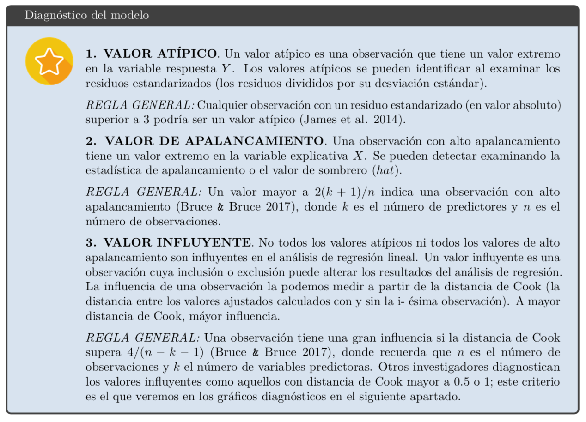
```


El siguiente código traza la distancia de Cook, que es una medida de la influencia de cada observación en los coeficientes de regresión. La estadística de distancia de Cook es una medida, para cada observación por turno, del grado de cambio en las estimaciones del modelo cuando se omite esa observación en particular. Cualquier observación en la que la distancia de Cook sea cercana a 1 o más, o que sea sustancialmente mayor que otras distancias de Cook (puntos de datos muy influyentes), requiere investigación.

```{r}
# Influential Observations
# Cook's D plot
# identify D values > 4/(n-k-1) 
cutoff <- 4/((nrow(dataset.gobble2)-length(Gobble.model.2$coefficients)-2)) 
plot(Gobble.model.2, which=4, cook.levels=cutoff)
```
¿Como lo hicimos? Las observaciones 152, 187 y 202 parecen ser las más influyentes en nuestros datos, lo que confirma lo que vimos anteriormente cuando usamos la función plot() para tener una idea de si algún punto de datos es influyente (gráfico 4, específicamente). Sin embargo, tenga en cuenta que el gráfico 4 de la función plot() sugirió que estas observaciones no influyeron realmente en nuestros resultados de regresión.

¿Qué hacemos con los valores influyentes? 
En general, hay tres razones por las que un valor puede ser influyente:

- Se trata de un error en la recopilación de los datos.

- Se trata de un error en el registro de la observación a la hora de crear la base de datos.

- No es un error sino un valor válido, cuyo comportamiento no se puede explicar correctamente por nuestro modelo. En los dos primeros casos podemos corregir o eliminar la observación, mientras que en el tercer caso lo ideal es explicarlo. Puedes calcular las rectas de regresión incluyendo y excluyendo dicho valor, y elegir la que mejor se adapte al problema y a las observaciones futuras.

Además de evaluar estos valores en los gráficos de residuos, podemos calcular varios estadísticos que nos permitirán interpretar e identificar posibles valores problemáticos en el modelo de regresión.

Utilizamos para ello la función influence.measures() del paquete stats (precargado). Calcula algunos de los diagnósticos de regresión tras la eliminación del posible valor problemático (Belsley, Kuh & Welsch 1980, Cook & Weisberg 1982):

```{r}
summary(influence.measures(Gobble.model.2))
```

- dffit: mide el cambio en los valores ajustados (con la escala apropiada). Se utiliza como punto de corte 2 ∗ sqrt(k + 1)/n, donde k es el número de predictores y n el tamaño de la muestra. 

- dfb: mide el cambio en los coeficientes (con la escala apropiada). Se utiliza como punto de corte 2/sqrt(n). 

- cov.r: mide el cambio en la estimación de la matriz de covarianza. Se utiliza como punto de corte 1±3∗(p+1)/n.

- cook.d: las distancias de Cook, es una combinación del valor de apalancamiento y el tamaño residuo, y se utiliza para detectar valores influyentes. Se utiliza como punto de corte 4/n.

- hat: o valor de apalancamiento, sirven para detectar valores extremos en las variables explicativas X. Mide la distancia estandarizada a la media de el/los predictor/es. Se utiliza como punto de corte 2 ∗ (k + 1)/n.

Los casos que son influyentes con respecto a cualquiera de estas medidas están se marcan con un asterisco en la siguiente salida.

Luego de identificar estos posibles valores problemáticos debemos revisar los datos originales y elegir la solución adecuada para su tratamiento según el caso.


## Prueba del supuesto de normalidad: studres()
La función studres() hace exactamente lo que parece: traza la distribución de residuos. Queremos que parezca distribuido normalmente, de acuerdo con el supuesto de normalidad.

```{r}
# distribution of studentized residuals
sresid <- studres(Gobble.model.2) 
hist(sresid, freq=FALSE, 
     main="Distribution of Studentized Residuals")
xfit<-seq(min(sresid),max(sresid),length=40) 
yfit<-dnorm(xfit) 
lines(xfit, yfit)
```
¿Como lo hicimos? ¡Me parece bonito y normal!

## Prueba del supuesto de homocedasticidad: ncvTest()

ncvTest() nos proporciona otra prueba del supuesto de homocedasticidad. Específicamente, esta es una estadística que prueba si existe una varianza no constante (es decir, heterocedasticidad). La nula establece que hay una varianza constante.

```{r}
# Evaluate homoscedasticity
library(car)
# non-constant error variance test
# This test is often called the Breusch-Pagan test; it was independently suggested with some extension by Cook and Weisberg (1983).
ncvTest(Gobble.model.2)
```

¿Como lo hicimos? p > .05, lo que sugiere que nuestros datos son homocedásticos. ¡Hurra!

Opcionalmente puedes valorar la homocedasticidad mediante la prueba de Cook Weisberg

```{r}
library(skedastic)
cook_weisberg(Gobble.model.2) #p=0.220, sí cumple con supuesto de homocedasticidad (p>0.05)
```

## Prueba del supuesto de linealidad: crPlots()

La función crPlots() es excelente para ver visualmente si sus predictores tienen una relación lineal con su variable dependiente. Debería ver una línea verde que modela los residuos de su predictor frente a su variable dependiente (es decir, la línea de loess). La línea roja representa la línea de mejor ajuste. Si su línea verde parece ser igualmente lineal que su línea roja, está bien. Si la línea verde parece curvada con respecto a la línea roja, es probable que tengas un problema de linealidad.

```{r}
# Evaluate Nonlinearity
# component + residual plot aka partial-residual plots
crPlots(Gobble.model.2)
```
¿Como lo hicimos? ¡Excelente! Tanto la línea roja como la verde son bonitas y lineales, como deberían ser.

## Prueba del supuesto de independencia: durbinWatsonTest()

El Durbin Watson examina si los errores están autocorrelacionados consigo mismos. El nulo indica que no están autocorrelacionados (lo que queremos). Esta prueba podría resultar especialmente útil cuando se realiza una regresión múltiple (series temporales). Por ejemplo, esta prueba podría indicarle si los residuos en el momento 1 están correlacionados con los residuos en el momento 2 (no deberían estarlo). En otras palabras, esta prueba es útil para verificar que no hemos violado el supuesto de independencia .

```{r}
durbinWatsonTest(Gobble.model.2)
```
¿Como lo hicimos? p > 0,05, por lo que los errores no están autocorrelacionados. No hemos violado el supuesto de independencia. ¡Hurra!

##  Prueba global de supuestos del modelo: gvlma()

Finalmente, si le da pereza, siempre puede realizar una prueba global de los supuestos del modelo utilizando el paquete gvlma. ¡Mira (casi) todo usando un solo paquete! Tal como sugirieron las otras tramas, todas nuestras suposiciones parecen aceptables. Nota especial : no hay muchos aportes de la comunidad de usuarios de R sobre cada una de estas decisiones y qué significa exactamente cada decisión. ¡Cuidado usuario!

```{r}
library(gvlma)
gvmodel.gobble <- gvlma(Gobble.model.2) 
summary(gvmodel.gobble)
```

# ¿Qué tal un ejemplo más problemático?

Hagamos intencionalmente que la relación entre el consumo de pavo y la hora de la siesta sea positivamente cuadrática.

```{r}
#set the seed. This ensures that rnorm will sample the same datapoints for you as it did for me.
set.seed(66)

 N <- 250
    TurkeyTime2 <- runif(N, 0, 50)
    NapTime2 <- (TurkeyTime2^2 + rnorm(N, sd=16)) + 500
    #I made nap time have a positive quadratic relationship with turkey so this example would be icky.
    #I also added 500 to the equation to ensure we don't get a negative intercept for nap time.
    
#Let's make a data frame
dataset.gobble3<-data.frame(
  Turkeyyy2 = TurkeyTime2,
  Sleepyyy2 = NapTime2)
    

#Let's make things really interesting by adding some bad outliers to the data!
outliers<-data.frame(Turkeyyy2=c(45, 50), Sleepyyy2=c(3000,4000))
dataset.gobble3<-rbind(outliers, dataset.gobble3)
#binds 2 new outliers to the top of our dataset

str(dataset.gobble3)
```
```{r}
#note that our 2 outliers are at the top of the dataset now
head(dataset.gobble3)
```

Probemos nuestro nuevo modelo ridículo (fíjate cuánto tiempo duerme la gente ahora...)

```{r}
#use lm() function here to run your regression model
Gobble.model.3<-lm(Sleepyyy2~Turkeyyy2, data=dataset.gobble3)
summary(Gobble.model.3)
```
```{r}
#Stargazer package gave us a pretty summary table, right?!
#Note that it outputs a measure of effect size for the model (i.e., adjusted R-squared)
library(stargazer)
stargazer(Gobble.model.3,type="text", ci = T)
```

Con nuestro nuevo modelo, parece que un mayor consumo de pavo todavía predice un mayor tiempo de siesta. ¿Pero se cumplen nuestras suposiciones?

Primero visualicemos esta relación para obtener una comprensión intuitiva de los datos.

```{r}
plot(dataset.gobble3, main="Scatterplot of Thanksgiving", 
    xlab="Turkey Consumption in Grams ", ylab="Sleep Time in Minutes ", pch=19)
```

Seguro que no parece lineal y podemos ver nuestros valores atípicos. Pero ¿qué pasa con los otros supuestos?

## Obtener una instantánea amplia: plot()

Ejecutemos la función plot() para obtener una instantánea de cuántas de nuestras suposiciones están funcionando.

```{r}
#Let's go through each plot one by one. 
plot(Gobble.model.3,which=1)
```

Trama uno : ¿Son los datos lineales? No; los residuos no deben agruparse en forma de sonrisa. Deben estar esparcidos aleatoriamente a lo largo de la trama y la línea roja debe ser horizontal/no curvada. ¿Son los datos homocedásticos? No parece serlo, porque los residuos no están distribuidos equitativamente alrededor de la recta y = 0. Hasta ahora, parece que hemos violado los supuestos de linealidad y homocedasticidad.

```{r}
#Let's look at our second plot. 
plot(Gobble.model.3,which=2)
```

Trama dos : ¿Cómo nos va con el supuesto de normalidad? No es bueno; el QQplot es curvo en los extremos en lugar de recto a lo largo de la línea de puntos del ángulo de 45 grados. Esto sugiere que hemos violado el supuesto de normalidad.

```{r}
#Let's look at our third plot.
plot(Gobble.model.3,which=3)
```

Trama tres : ¿Son nuestros datos homocedásticos? Éste es complicado; la línea roja es bastante horizontal, lo que sugiere que los datos son, de hecho, homocedásticos. Sin embargo, observe cómo nuestros residuos están agrupados en forma de W en lugar de verse distribuidos aleatoriamente como el cielo nocturno. Esto no es bueno: sugiere que hay mucha variación en la dispersión residual alrededor de la línea de mejor ajuste. En otras palabras, se ha violado el supuesto de homocedasticidad.

```{r}
#Let's go through each plot one by one. 
plot(Gobble.model.3,which=5)
```

Trama cuatro : ¿Tenemos casos influyentes? La observación 2 está muy cerca de cruzar la línea de puntos de la distancia de Cook (es decir, la distancia de Cook para la observación 2 es casi > 0,5), pero en realidad no la cruza. Estrictamente hablando, esta trama sugiere que nuestros valores atípicos no son influyentes.

```{r}
#Or, if you'd like to see all 4 plots side by side, try this:
layout(matrix(c(1,2,3,4),2,2)) 
plot(Gobble.model.3)
```

```{r, fig.height=10, fig.width=10}
check_model(Gobble.model.3)
```

Evaluación general : no sorprende que se viole el supuesto de linealidad en este ejemplo (visible en el gráfico 1). Además, el gráfico 2 sugiere que se viola el supuesto de normalidad, y los gráficos 1 y 3 sugieren que se viola el supuesto de homocedasticidad. Las observaciones 1, 2 y 235 son valores atípicos (pero no influyen, como se revela en el gráfico 4): están marcadas como valores atípicos en cada uno de los gráficos anteriores. Verifique si hay algo extraño en estos temas o si hubo errores en el ingreso de datos. En resumen, ¡nuestro modelo es un desastre!

## Pruebas de valores atípicos: outlierTest()

apalancamiento

También podemos usar la función outlierTest() para detectar valores atípicos en los datos. Esta función ejecuta una prueba de valores atípicos ajustada por Bonferonni. El punto nulo de esta prueba es que la observación no es un valor atípico.

```{r}
# Assessing Outliers
#Are there outliers? Yes, 
summary(influence.measures(Gobble.model.3))

```

¿Como lo hicimos? No sorprende que la observación 2 sea un valor atípico. Rechazamos el supuesto nulo de que no hay valores atípicos (p < 0,05). Sin embargo, ninguno de los valores es un valor influeyente (ver cook.d) ni de apalancamiento (ver hat)


### Pruebas de observaciones influyentes: distancia de Cook

Revisemos la distancia de Cook: debería marcar las mismas observaciones que en el gráfico 4 en la función plot().

```{r}
# Influential Observations
# Cook's D plot
# identify D values > 4/(n-k-1) 
cutoff <- 4/((nrow(dataset.gobble3)-length(Gobble.model.3$coefficients)-2)) 
plot(Gobble.model.3, which=4, cook.levels=cutoff)
```

¿Como lo hicimos? Las observaciones 1, 2 y 235 parecen ser las más influyentes en nuestros datos, las mismas que se señalan en el gráfico de residuos versus apalancamiento anterior. Sin embargo, tenga en cuenta que el gráfico de residuos frente a apalancamiento anterior (gráfico 4) sugiere que estas observaciones no influyen realmente en los resultados de nuestra regresión.

## Prueba del supuesto de normalidad: studres()

¿Están nuestros residuos distribuidos normalmente?

```{r}
# distribution of studentized residuals
sresid <- studres(Gobble.model.3) 
hist(sresid, freq=FALSE, 
     main="Distribution of Studentized Residuals")
xfit<-seq(min(sresid),max(sresid),length=40) 
yfit<-dnorm(xfit) 
lines(xfit, yfit)
```

¡No! No sorprendido; ¡Nuestro modelo es intencionalmente horrible!

## Prueba del supuesto de homocedasticidad: ncvTest()

¿Somos homocedásticos? Recuerde: el valor nulo aquí indica que hay una variación constante.

```{r}
# Evaluate homoscedasticity
# non-constant error variance test
ncvTest(Gobble.model.3)
```
Hemos violado el supuesto de homocedasticidad (p < 0,05), y esta conclusión se ve reforzada por lo que vimos en los gráficos 1 y 3 anteriores.

## Prueba del supuesto de linealidad: crPlots()

¿Nuestro predictor tiene una relación lineal con la variable dependiente?

```{r}
# Evaluate Nonlinearity
# component + residual plot aka partial-residual plots
crPlots(Gobble.model.3)
```

No, nuestro modelo no parece lineal. Parece una relación cuadrática.

## Prueba del supuesto de independencia: durbinWatsonTest()

¿Independencia de errores? El nulo indica que no están autocorrelacionados (lo que queremos).

```{r}
durbinWatsonTest(Gobble.model.3)
```

Hemos violado el supuesto de independencia (p < 0,05).

## Prueba global de supuestos del modelo: gvlma()

¡Finalmente, veamos qué dice el paquete gvlma!

```{r}
gvmodel.gobble3 <- gvlma(Gobble.model.3) 
summary(gvmodel.gobble3)
```

Esto confirma lo que vimos arriba. ¡Tenemos grandes problemas con todas las suposiciones! Nota especial : no hay muchos aportes de la comunidad de usuarios de R sobre cada una de estas decisiones y qué significa exactamente cada decisión. ¡Cuidado usuario!

# Introducción a la regresión múltiple

Repasemos un ejemplo muy básico para presentarle la regresión múltiple en R.

Creemos un marco de datos que combine nuestras variables de consumo de pavo, consumo de vino y tiempo de sueño.

```{r}
#set the seed. This ensures that rnorm will sample the same datapoints for you as it did for me.
set.seed(99)

N <- 250
    TurkeyYum <- runif(N, 0, 50)
    WineYum <- runif(N, 0, 50) 
    NapYum <- 2*TurkeyYum + rnorm(N, sd=0.5)
    
#ID number
IDMultiple<-factor(c(seq(1:N)))

### Let's put it all together
dataset.gobble.multiple<-data.frame(
  subjectIDmultiple = IDMultiple,
  TurkeyYummy = TurkeyYum, 
  WineYummy = WineYum,
  SleepyYummy = NapYum)

str(dataset.gobble.multiple)
```
```{r}
head(dataset.gobble.multiple)
```
Ahora ejecutemos un modelo de regresión múltiple (definido como un modelo de regresión con 2 o más predictores) que considere si el consumo de pavo Y el consumo de vino predicen el tiempo de sueño. Lo que notará en el modelo a continuación es que generalmente toma la misma forma que la regresión lineal simple: “Nombra tu modelo” <- lm(Criterio~Predictor1 + Predictor2, datos=“nombre de tu conjunto de datos”). Ahora, sin embargo, tengo 2 predictores y hay un signo + entre ellos. Lo que esto significa es que los predictores se ingresan simultáneamente en el modelo y el resultado refleja el efecto de cada uno sobre el criterio, controlando el otro.

```{r}
Gobble.model.multiple<-lm(SleepyYummy~TurkeyYummy+WineYummy, data=dataset.gobble.multiple)
summary(Gobble.model.multiple)
```
¿Qué quiere decir esto? Significa que el pavo es un predictor importante del tiempo de sueño, controlando el consumo de vino: cuanto más pavo se consume, más largas son las siestas. Sin embargo, el vino no es un predictor significativo del tiempo de sueño después de controlar el consumo de pavo; no están relacionados.

## Supuestos

Se evaluan los mismos supuestos que la regresión lineal simple.

### Evaluación rápida de supuestos

```{r, fig.height=10, fig.width=10}
# o con la libreria performance
library(performance)

check_model(Gobble.model.multiple)
```

Sin embargo, tambien se debe evaluar la Multicolinealidad

### Multicolinealidad

¿Qué es la multicolinealidad? Cuando dos variables predictoras están muy correlacionadas entre sí decimos que existe colinealidad. Cuando son tres o más las variables involucradas, la llamamos multi-colinealidad, esto significa que hay redundancia entre las variables predictoras.

¿Qué pasa si no se cumple este supuesto? La multicolinealidad reduce la precisión de los coeficientes estimados, lo que debilita la potencia estadística de nuestro modelo de regresión y dificulta identificar la significación e importancia de los predictores. Si deseas más información específica, puedes leer este post.

¿Cómo comprobarlo? Para un predictor dado, la multicolinealidad puede evaluarse mediante el cálculo del factor de inflación de varianza (Variance Inflation Factor, V IF)34 que mide cuánto se infla la varianza (variación) de un coeficiente de regresión debido a la multicolinealidad en el modelo. O dicho de otro modo, indica si un predictor tiene una fuerte relación lineal con otros predictores. El valor más pequeño posible de VIF es uno (que indica ausencia de multicolinealidad), pero el valor del VIF no tiene un límite superior. Para determinar qué valor del V IF debería ser preocupante no existen reglas estrictas, pero algunos autores han sugerido que el VIF no supere ciertos valores. Myers (1990) sugiere que un valor mayor a 10 es preocupante, mientras que James et al. 2014 sugieren que es recomendable que no se exceda de 5.

```{r, echo=FALSE, out.width='80%', out.height='80%'}
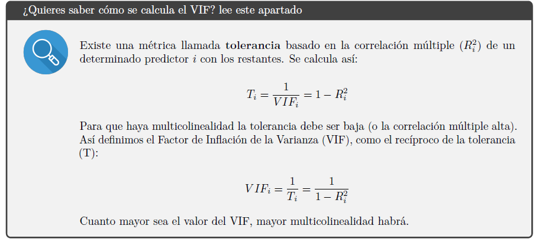
```


¿Cómo puedes mejorar el modelo? Si eliminamos de nuestro modelo las variables con problema de multi-colinealidad, obtendremos un modelo más simple sin comprometer la precisión del modelo, lo cual es bueno. También puedes realizar un análisis de componentes principales (PCA) para crear una combinación de variables explicativas independientes antes de realizar el modelo RLM, o utilizar el método de mínimos cuadrados parciales (PLS) para realizar la regresión.

```{r}

# Solo fijate en el estimado puntual no en el IC95%
check_collinearity(Gobble.model.multiple)
```


# REFERENCIAS

Revisar: https://ademos.people.uic.edu/Chapter12.html#

The following websites were very helpful to me while writing this chapter.

http://sphweb.bumc.bu.edu/otlt/MPH-Modules/BS/R/R5_Correlation-Regression/R5_Correlation-Regression7.html (author: Boston University School of Public Health)

http://www.vikparuchuri.com/blog/r-regression-diagnostics-part-1/ (author: Vik Paruchuri)

http://data.library.virginia.edu/diagnostic-plots/ (author: Bommae Kim, University of Virginia)

Other useful online tutorials: https://ww2.coastal.edu/kingw/statistics/R-tutorials/simplelinear.html http://www.statmethods.net/stats/regression.html http://tutorials.iq.harvard.edu/R/Rstatistics/Rstatistics.html http://www.statmethods.net/stats/rdiagnostics.html

Brush up on your regression diagnositics options: https://cran.r-project.org/web/packages/car/vignettes/embedding.pdf


