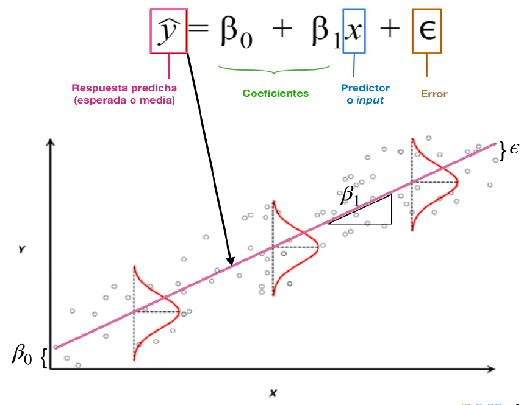
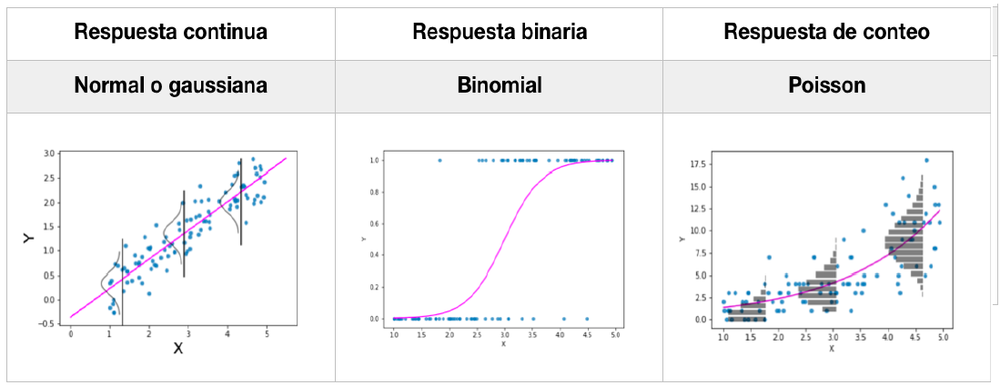
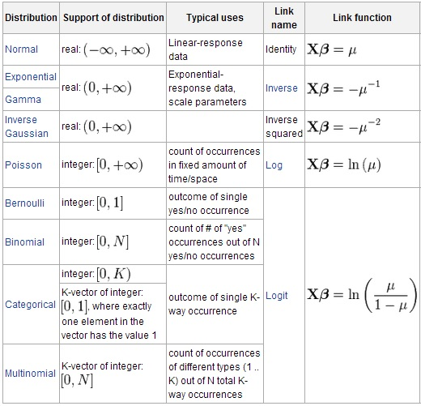
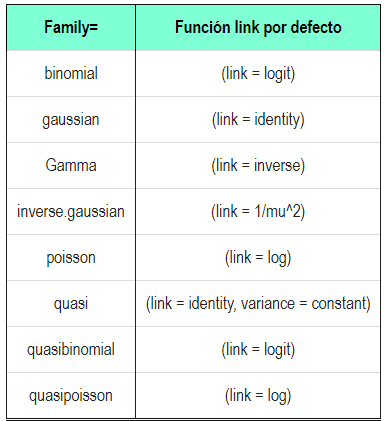
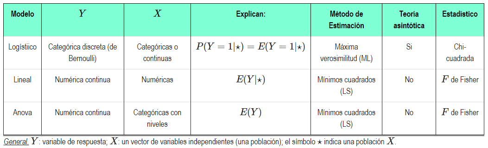
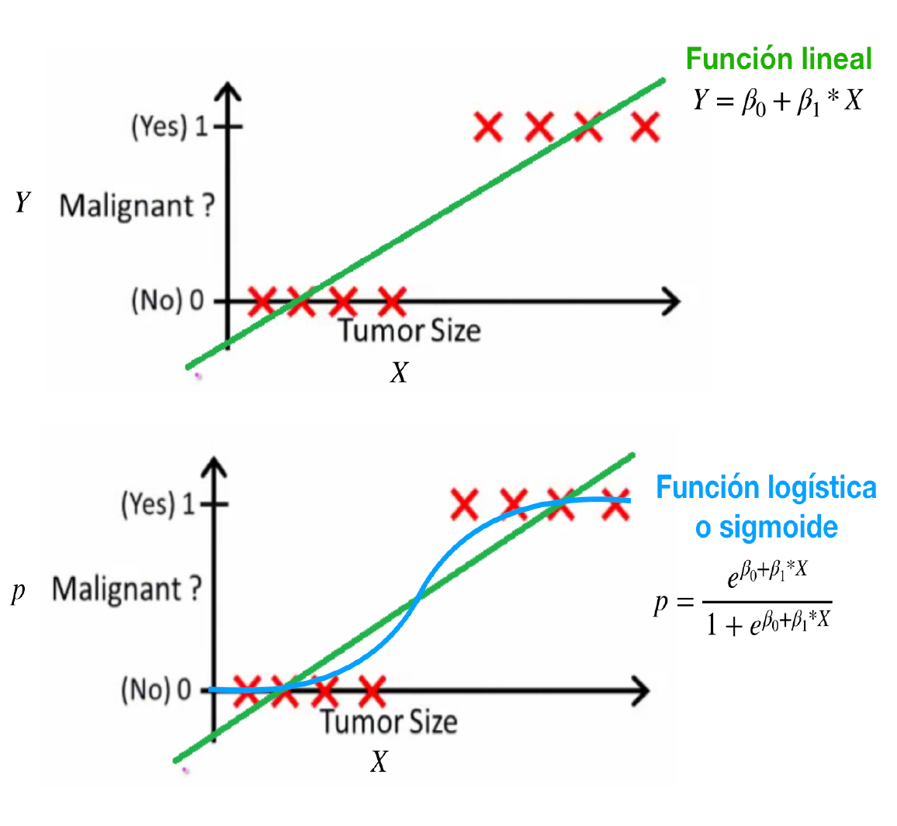
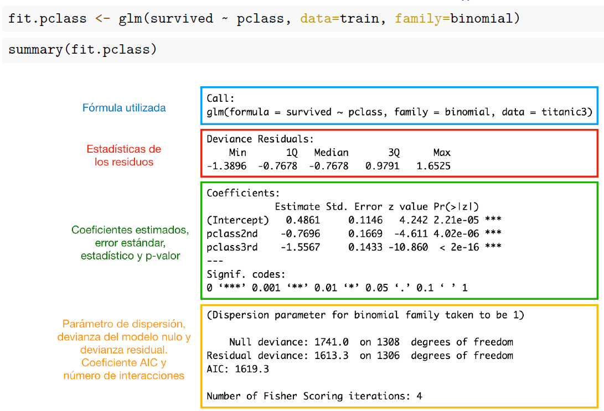
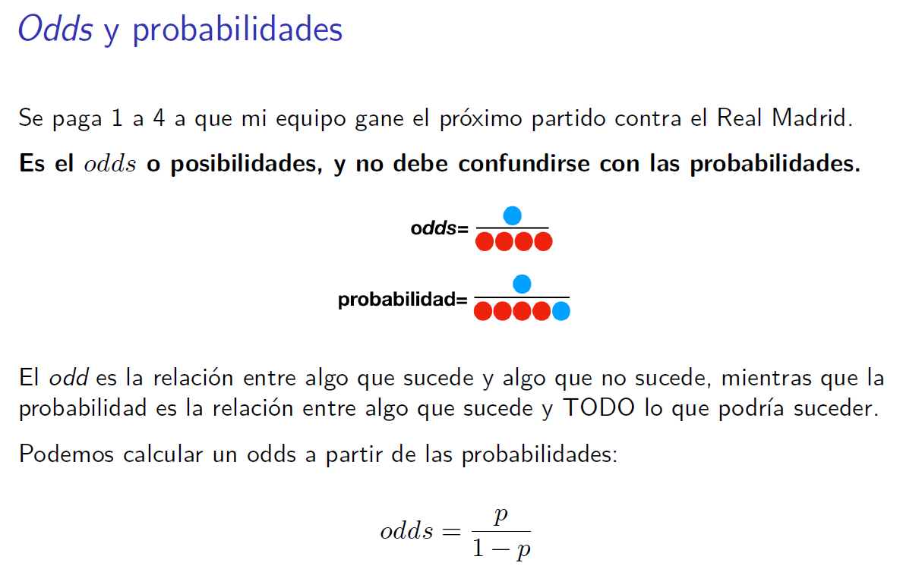
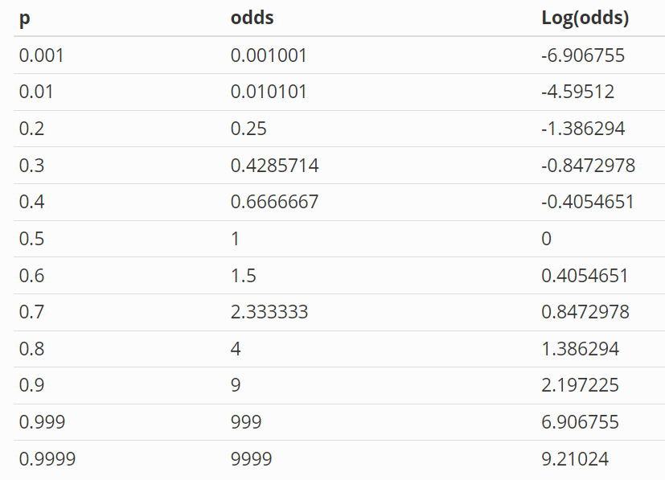
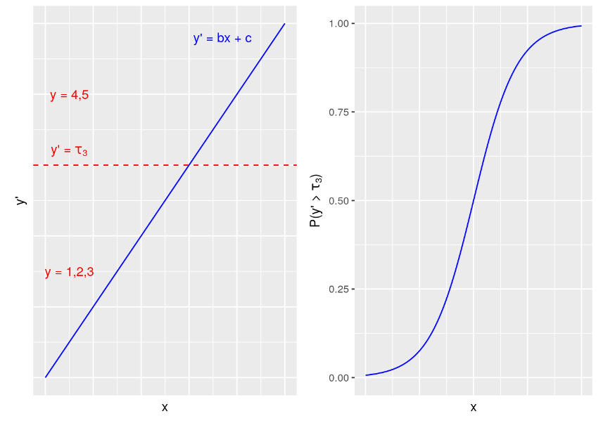

```{r echo = FALSE}
setwd("C:/Users/danfe/Dropbox/Proyectos Daniel/Cursos - diplomados - Maestrias/Programa de autoformación en investigación y análisis de datos/Rmarkdowns/Estadística/Programa de formación/Semana 7")

knitr::opts_chunk$set(echo = TRUE, warning = FALSE, message = FALSE,
                         fig.show = "asis", results = "show",
                      fig.align='center',
                      fig.path = "figures/",  # Configura el directorio donde se guardan los gráficos
  dev = "png")
```

\newpage

# Modelos lineales generalizados

El modelo de regresión lineal sirve como un caballo de batalla en estadística pero tiene ciertas limitaciones, recuerda que se deben cumplir ciertos supuestos estadísticos, por ejemplo, los residuos deben tener una distribución normal (o gaussiana).

```{r, echo=FALSE, out.width='80%', out.height='80%'}

```

Afortunadamente, podemos generalizar estos modelos de regresión para incluir respuestas (o errores) que NO siguen una distribución normal. Esta familia se denomina modelos lineales generalizados o GLM para abreviar.

```{r, echo=FALSE, out.width='80%', out.height='80%'}

```

Los modelos lineales generalizados (GLM) extienden la regresión lineal a modelos con una respuesta no gaussiana o incluso discreta. Por ejemplo, para datos binomiales (de la forma 0/1 o presencia-ausencia, proporciones entre cero y uno, o porcentajes) y datos de recuento.

Además, utilizan una función arbitraria de la variable de respuesta (la función de enlace, link) que varía linealmente con las variables independientes (en lugar de suponer que el la respuesta en sí debe variar linealmente).

```{r, echo=FALSE, out.width='80%', out.height='80%'}

```

En R utilizaremos la función glm() para su modelado e incluye las siguientes familias y funciones de enlace.

```{r, echo=FALSE, out.width='80%', out.height='80%'}

```

Además estos métodos utilizan métodos de Máxima verosimilitud para la estimación de los coeficientes. La idea central es encontrar los valores de los parámetros que maximicen la probabilidad (o verosimilitud) de observar los dados.

```{r, echo=FALSE, out.width='80%', out.height='80%'}

```

## ¿Por qué hacer regresión logística?

Si una variable cualitativa con dos niveles se codifica como 1 y 0, matemáticamente es posible ajustar un modelo de regresión lineal por mínimos cuadrados $β_0 + β_1 * x$. El problema de esta aproximación es que, al tratarse de una recta, para valores extremos del predictor, se obtienen valores de Y menores que 0 o mayores que 1, lo que entra en contradicción con el hecho de que las probabilidades siempre están dentro del rango [0,1].

La regresión logística, también conocida como regresión logit, es la que se utiliza cuando la variable de resultado (variable dependiente) es dicotómica. Esto se referiría a todas las preguntas sí/no de su investigación: ¿Ha votado, sí o no? Padece alguna enfermedad, ¿sí o no? ¿Consumió [inserte aquí su sustancia ilícita favorita] la semana pasada, sí o no? También se puede pensar en pasar/no pasar, acertar/fallar, éxito/fracaso, vivo/muerto, etc.

En lugar de estimar los tamaños $\beta$ de la regresion lineal, la regresión logística estima la probabilidad de obtener uno de los dos resultados (es decir, la probabilidad de votar frente a la de no votar) en función de una o varias variables predictoras/independientes. 


### Paquetes{-}

Vamos a empezar cargando las siguientes librerías. He aquí por qué:

-   **aod:** Significa Análisis de Datos Sobredispersos, contiene un montón de funciones para este tipo de análisis sobre recuentos o proporciones. La que más verás en este capítulo es wald.test (es decir, Prueba de Wald para Coeficientes de Modelos).

-   **effects:** Otro paquete de gráficos porque las opciones son buenas.

-   **pscl:** Necesita esto para crear un pseudo R-cuadrado para la regresión logística.

```{r echo=FALSE}
pacman::p_load(
  aod,
  ggplot2,
  effects,
  graphics,
  tidyverse,
  car,
  pscl)
```

# Regresión logística

### Carga los siguientes datos {-}

Voy a traer un par de conjuntos de datos disponibles libremente en línea con el fin de demostrar lo que debe suceder en la regresión logística. Básicamente reúno cosas disponibles en varios lugares en línea para que tengamos todo lo que necesitamos para el análisis de regresión logística. Consulte las notas finales para ver los enlaces y las referencias. 

Dado que utilizaremos múltiples conjuntos de datos y cambiaremos entre ellos, utilizaré attach y detach para indicar a R a qué conjunto de datos se refiere cada bloque de código. *Attach* es una función que activa el conjunto de datos y *detach* lo desactiva.

```{r}
cuse <- read.table("https://grodri.github.io/datasets/cuse.dat", header = TRUE)
mydata <- read.csv("https://stats.idre.ucla.edu/stat/data/binary.csv")
#Notice we're not setting a working directory because we're reading in data from the internet.
```

### Limpieza de datos y lectura de la salida {-}

...¡Porque nada de esto importa si sus datos no están en forma binaria!

Empecemos por aprender algunas formas de gestionar nuestros datos para poder utilizarlos para un resultado dicotómico.
 
El conjunto de datos cuse es antiguo e incluye un 16 grupos de mujeres de acuerdo al grupo de edad al que pertenecen, su nivel educativo, si desean tener más hijos y si utilizan o no anticonceptivos. 


```{r}
attach(cuse)
str(cuse) 
cuse$wantsMore<- as.factor(cuse$wantsMore)
cuse$age <- cuse$age %>%  factor(levels = c("<25", "25-29", "30-39", "40-49"))
cuse$education <- cuse$education %>%  factor(levels = c("low", "high"))
levels(cuse$age)
cuse
detach(cuse)
```
## Corramos el modelo

### Situación 1

Este es el modelo glm básico, en el que el objeto wantsMorefit (es decir, quieren tener más hijos: sí o no) es el primer modelo que ajustamos. Especificamos la función glm, nuestra variable de resultado (es decir, wantsMore) y nuestros predictores (es decir, la edad y la educación, sin ningún factor de interacción todavía, por lo tanto, sólo utilizamos + para los efectos principales), le decimos qué datos utilizar (es decir, cuse), y que la función de familia para nuestra distribución (es decir, binomial.) Este modelo está preguntando: "¿La edad y la educación predicen querer más hijos? En caso afirmativo, ¿en qué medida?". Aquí, nuestro resultado (querer más hijos/wantsMore) ya está en forma binaria:

```{r}
attach(cuse)
wantsMorefit <- glm(wantsMore ~ age + education, data=cuse, family=binomial(link="logit")) 
wantsMorefit <- glm(wantsMore ~ age + education, data=cuse, family=binomial)# por defecto el enlace es link="logit"
summary(wantsMorefit) # display results
```

Algunas notas sobre las estadísticas que generamos anteriormente: A diferencia de la regresión lineal, estamos utilizando glm y nuestra familia es binomial. En la regresión logística, ya no hablamos en términos de tamaños beta. La función logística tiene forma de S y constriñe el rango a 0-1. Por lo tanto, en su lugar estamos calculando las probabilidades de obtener un resultado 0 frente a 1.

```{r, echo=FALSE}


```

Veamos el resultado: Lo primero que vemos son los residuos de desviación, que es una medida del ajuste del modelo (cuanto más alto, peor). De izquierda a derecha, la tabla de coeficientes muestra el cambio "estimado" en las probabilidades logarítmicas de la variable de resultado por un aumento de una unidad en la variable de predicción, el error estándar, el estadístico z, también conocido como el estadístico z de Wald, y el valor p.

```{r, echo=FALSE}


```
### Interpretación {-}

He aquí un ejemplo de cómo interpretar los coeficientes anteriores: Por cada cambio unitario en [inserte la variable predictora], las probabilidades logarítmicas de [lograr el resultado de interés] aumentan en [coeficiente]. 

¿Nunca ha visto a nadie informar de nada en términos de probabilidades logarítmicas y no está seguro de que esto sea una descripción significativa de la variable de resultado? Por eso exponenciamos: para ponerlo en términos de odds ratios (véase más abajo la interpretación de OR).

### Intervalos de confianza {-}
La siguiente parte de nuestros resultados son los intervalos de confianza (IC) del 95% para los coeficientes no exponenciados. En regresión logística, si el intervalo de confianza cruza por encima de cero, como en el intervalo se extiende desde un valor negativo a un valor positivo, ese efecto no es significativo.

```{r}
confint(wantsMorefit) # 95% CI for the coefficients
```


A continuación se muestra lo mismo, pero esta vez con coeficientes exponenciados (aquí el punto de no significancia es 1):

```{r}
exp(coef(wantsMorefit)) # exponentiated coefficients
exp(confint(wantsMorefit)) # 95% CI for exponentiated coefficients
```
### Interpretación {-}

Interpretación de las OR: Por cada unidad ["aumento" si la OR es positiva/"disminución" si la OR es negativa], las probabilidades de [lograr el resultado de interés frente a no lograrlo] aumentan/disminuyen en un factor de [la OR de esa variable predictora].

### Situación 2

Arriba, para calcular los predictores del uso de anticonceptivos, no tenemos la forma de introducirla como 0 o 1. Sin embargo esto es lo que puede hacer: Intente trabajar a través de columnas. Si une las dos columnas en 1 vector, R puede leer una columna como "aciertos" y la siguiente como "errores", igual que los análisis anteriores leen los 0 y los 1. Así es como configuramos las columnas.

Para tu información, copiamos una nueva columna porque prefiero no sobrescribir los datos originales para no poder utilizarlos más tarde. Además, R lee la columna en orden como "aciertos" y luego "errores", así que si tus datos no están ya en ese orden, puede que tengas que mover o añadir columnas para ponerlas en ese orden. He aquí cómo.

Copiar una columna en R 

1.  Cree la nueva columna

```{r}
attach(cuse)
cuse$wantsMore_copy <- NA #This gives you a column of NAs. 
```

2.  Copie los datos de la columna existente en la nueva.

```{r}
cuse$wantsMore_copy <- cuse$wantsMore

cuse <- cuse %>%
  mutate(wantsMore_copy = dplyr::recode(wantsMore_copy, "no" = 0, "yes" = 1)) #Now those NAs have actual values.

cuse

```

3.  Ejecute el modelo cbinding a través de las columnas donde la primera columna se convierte en "aciertos" y la segunda en "fallos". Verá que en nuestra primera línea del modelo, donde normalmente aparece la variable de resultado, tenemos un cbind a través de nuestras dos columnas en su lugar. Las hemos unido en una sola variable a efectos de este análisis.

```{r}
usingfit <- glm(cbind(using, notUsing)~age+education+wantsMore_copy,data=cuse,family=binomial()) 
summary(usingfit) # display results
confint(usingfit) # 95% CI for the coefficients
exp(coef(usingfit)) # exponentiated coefficients
exp(confint(usingfit)) # 95% CI for exponentiated coefficients
detach(cuse)
```

## Concepto de ODDS y OR 

```{r, echo=FALSE, out.width='80%', out.height='80%'}


```

En la regresión lineal simple, se modela el valor de la variable dependiente Y en función del valor de la variable independiente X. Sin embargo, en la regresión logística, tal como se ha descrito en la sección anterior, se modela la probabilidad de que la variable respuesta Y pertenezca al nivel de referencia 1 en función del valor que adquieran los predictores, mediante el uso de LOG of ODDs.

Supóngase que la probabilidad de que un evento sea verdadero es de 0.8, por lo que la probabilidad de evento falso es de 1 - 0.8 = 0.2. Los ODDs o razón de probabilidad de verdadero se definen como el ratio entre la probabilidad de evento verdadero y la probabilidad de evento falso pq . En este caso los ODDs de verdadero son 0.8 / 0.2 = 4, lo que equivale a decir que se esperan 4 eventos verdaderos por cada evento falso.

La trasformación de probabilidades a ODDs es monotónica, si la probabilidad aumenta también lo hacen los ODDs, y viceversa. El rango de valores que pueden tomar los ODDs es de [0,∞]. Dado que el valor de una probabilidad está acotado entre [0,1] se recurre a una trasformación logit (existen otras) que consiste en el logaritmo natural de los ODDs. Esto permite convertir el rango de probabilidad previamente limitado a [0,1] a [−∞,+∞ ].

```{r, echo=FALSE}


```


## Ajuste del modelo

Una vez obtenida la relación lineal entre el logaritmo de los ODDs y la variable predictora X, se tienen que estimar los parámetros β0 y β1. La combinación óptima de valores será aquella que tenga la máxima verosimilitud (maximum likelihood ML), es decir el valor de los parámetros β0 y β1 con los que se maximiza la probabilidad de obtener los datos observados.

El método de maximum likelihood está ampliamente extendido en la estadística aunque su implementación no siempre es trivial. En el este enlace se puede obtener una descripción detallada de cómo encontrar los valores β0 y β1 de máxima verosimilitud empleando el método de Newton.

Otra forma para ajustar un modelo de regresión logística es empleando descenso de gradiente. Si bien este no es el método de optimización más adecuado para resolver la regresión logística, está muy extendido en el ámbito del machine learning para ajustar otros modelos. 

## Evaluación del modelo

Existen diferentes técnicas estadísticas para calcular la significancia de un modelo logístico en su conjunto (p-value del modelo). Todos ellos consideran que el modelo es útil si es capaz de mostrar una mejora respecto a lo que se conoce como modelo nulo, el modelo sin predictores, solo con β0. Dos de los más empleados son:

* Wald chi-square: está muy expandido pero pierde precisión con tamaños muestrales pequeños.

```{r}
# comparamos el modelo full vs nulo
usingfit <- glm(cbind(using, notUsing)~age+education+wantsMore_copy,data=cuse,family=binomial()) 
library(car) # activa el paquete car
Anova(usingfit)
```


* Likelihood ratio: usa la diferencia entre la probabilidad de obtener los valores observados con el modelo logístico creado y las probabilidades de hacerlo con un modelo sin relación entre las variables. Para ello, calcula la significancia de la diferencia de residuos entre el modelo con predictores y el modelo nulo (modelo sin predictores). El estadístico tiene una distribución chi-cuadrado con grados de libertad equivalentes a la diferencia de grados de libertad de los dos modelos comparados. Si se compara respecto al modelo nulo, los grados de libertad equivalen al número de predictores del modelo generado. En el libro Handbook for biological statistics se recomienda usar este.

```{r}
# Ejemplo de comparación entre modelos
#Modelo con una variable vs modelo sin variables independientes
usingfit <- glm(cbind(using, notUsing)~age+education+wantsMore_copy,data=cuse,family=binomial()) 
usingfit_null <- glm(cbind(using, notUsing)~1,data=cuse,family=binomial()) 

library(performance)
test_likelihoodratio(usingfit, usingfit_null)
```

A diferencia de los modelos de regresión lineal, en los modelos logísticos no existe un equivalente a R2 que determine exactamente la varianza explicada por el modelo. Se han desarrollado diferentes métodos conocidos como pseudoR2 que intentan aproximarse al concepto de R2 pero que, aunque su rango oscila entre 0 y 1, no se pueden considerar equivalentes.
 

* McFadden’s: $R^2_{\text{McF}} = 1 - \frac{\ln L(\text{modelo})}{\ln L(\text{modelo nulo})}$, siendo L el valor de likelihood de cada modelo. La idea de esta fórmula es que, ln(L), tiene un significado análogo a la suma de cuadrados de la regresión lineal. De ahí que se le denomine pseudoR2

```{r eval =FALSE}
library(performance)
r2_mcfadden(usingfit)
r2_nagelkerke(usingfit)
```

* Otra opción bastante extendida es el test de Hosmer-Lemeshow. Este test examina mediante un Pearson chi-square test si las proporciones de eventos observados son similares a las probabilidades predichas por el modelo, haciendo subgrupos.

```{r}
library(ResourceSelection)
hoslem.test(x = cuse$using, y = fitted(usingfit))
```

Nuestro modelo parece no encajar bien porque tenemos una diferencia significativa entre el modelo y los datos observados (𝑝 < 0.05).

**NOTA:**

__Para determinar la significancia individual de cada uno de los predictores introducidos en un modelo de regresión logística se emplea el estadístico Z y el test Wald chi-test. En R, este es el método utilizado para calcular los p-values que se muestran al hacer summary() del modelo.__


# Evaluación completa del modelo

Para la evaluación de los modelos utilizaremos la base de datos *mydata*.

En *mydata*, nuestra variable de resultado es admit (es decir, admisión en la escuela de posgrado, que es una respuesta sí/no.) También tenemos variables predictoras: gre (es decir, puntuación en el examen GRE) y gpa (nota media de la licenciatura), que son continuas (más o menos), y rank (clasificación de la institución de licenciatura, donde 1 es la mejor y 4 es la peor, algo así como niveles), que es una variable más ordinal/categórica. Este conjunto de datos pregunta si el GPA, la puntuación GRE y el rango de la institución modifican la probabilidad de ser admitido en una escuela de posgrado, y en qué medida.

Echemos un vistazo a nuestros datos y asegurémonos de que tenemos un resultado binario. Ciertos gráficos y análisis requieren predictores continuos frente a categóricos, por lo que podemos confirmar con qué estamos trabajando obteniendo un resumen. Conocer nuestros datos debería ayudarnos a cubrir el 1er supuesto. Utilizaremos los datos del tutorial del UCLA Statistical Consulting Group y los modificaremos/añadiremos. Su conjunto de datos es diferente de cuse y nos permite hacer diferentes análisis logísticos.

```{r echo=FALSE}
attach(mydata)
mydata
summary(mydata)
#But the summary doesn't give us the standard deviation, so we need to add that ourselves.
sapply(mydata, sd)

```

A continuación se indican algunas formas de evaluar los datos en función de sus suposiciones. ¿La variable de resultado es dicotómica? Sólo debería haber 2 resultados (o niveles) posibles para esa variable. La visualización de los datos en una tabla le mostrará con cuántos niveles está tratando. Eche un vistazo: Dado que admitir (admisión a la escuela de posgrado, sí o no) es nuestra variable de resultado aquí, ¿le muestra exactamente 2 niveles de admitir en la tabla? Si es así, eso es un punto hacia el cumplimiento de nuestros supuestos.

```{r}

xtabs(~ admit + rank, data = mydata) 

```

Un gráfico de densidad condicional también nos mostrará si nuestra distribución parece binaria. Usted está buscando un diagrama diagonal con probabilidades que difieren según el nivel (0 o 1) de su variable de resultado.

¿Qué pasa si no está leyendo la VD como un factor? 

Anteriormente nos dio una media en esto, por lo que probablemente lo está leyendo como un valor numérico, no como un factor, como debe ser. Hagamos una segunda versión de admitir que R definitivamente leerá como un factor con 2 niveles. Tenga esto en cuenta: es un error muy común en la regresión logística en R. He aquí cómo recordar a R que es definitivamente un factor:

```{r}

mydata$admit2 = factor(mydata$admit)

```

Le decimos a R que añada una variable llamada admit2 a mydata, que es una versión factorizada de nuestra admit original.

```{r}
levels(mydata$admit2) = c("no","yes") 
```

Y sólo para asegurarnos de que no se lee como un numérico de nuevo, vamos a poner algunos niveles no numéricos en admit2. Si hace clic en mydata en el Entorno Global, debería ver admit2 como una columna con sí y no correspondientes a los 0 y 1 de admit.

Recordatorio: 0 = no, 1 = sí.

```{r echo=FALSE}
cdplot(mydata$gre, mydata$admit2,
       plot = TRUE, tol.ylab = 0.05, ylevels = NULL,
       bw = "nrd0", n = 400, from = NULL, to = NULL,
       col = NULL, border = 1, main = "", xlab = NULL, ylab = NULL,
       yaxlabels = NULL, xlim = NULL, ylim = c(0, 1))

```

Corremos entonces nuestro modelo

```{r}
model <- glm(admit2 ~ gre + gpa + factor(rank), data= mydata, family = binomial)

mydata$rank <- factor(mydata$rank)

model <- glm(admit2 ~ gre + gpa + rank, data= mydata, family = binomial)

library(broom)

tidy(model, conf.int = T, exponentiate = T) # Nos entregará un OR

```

## Veamos la bondad de ajuste del modelo 

* Wald chi-square: 

```{r}
# comparamos el modelo full vs nulo
library(car) # activa el paquete car
Anova(model)
```


* Likelihood ratio: 
```{r}
# Ejemplo de comparación entre modelos
#Modelo con una variable vs modelo sin variables independientes
model_null <- glm(admit2 ~ 1, data= mydata, family = binomial)
test_likelihoodratio(model, model_null)
```

* McFadden’s:

```{r eval =FALSE}
library(performance)
r2_mcfadden(model)

#McFadden R^2 is a pseudo R^2 for logistic regression
pR2(model)

```

* Prueba global de Hosmer-Lemeshow: 

```{r}
library(ResourceSelection)

# OJO: cambiamos la variable dependiente por admit codificada como 0 y 1
model_hl <- glm(admit ~ gre + gpa + rank, data= mydata, family = binomial)
hoslem.test(x = mydata$admit, y = fitted(model_hl))
```

## Supuestos

1.  Independencia: las observaciones tienen que ser independientes unas de otras.Por tanto, conozca sus datos, conozca sus métodos de muestreo.

2.  Relación lineal entre el logaritmo natural de odds y la variable continua: patrones en forma de U son una clara violación de esta condición.

```{r}
library(car)
crPlots(model)
```

Nota: Las variables categoricas siempre cumplen con el supuesto de linealidad 


* La regresión logística no precisa de una distribución normal de las variables continuas independientes.

### Visión general de los supuestos {-}
```{r}
plot(model, 1:6)

library(performance)
check_model(model)
```


# Representación gráfica del modelo

```{r}
library(sjPlot)
plot_model(model, transform = "exp", 
           show.values = TRUE,
           value.offset = .3)+
  theme_classic()

```

```{r}
library(effects)
exp(coef(model))
allEffects(model)

plot(allEffects(model))
```


## Presentación de informe

```{r}
library(report)
# report
summary(report(model))
```

# Regresión logística Multinomial

La regresión logística es una técnica que se utiliza cuando la variable dependiente es categórica (o nominal). Para la regresión logística binaria, el número de variables dependientes es dos, mientras que el número de variables dependientes para la regresión logística multinomial es más de dos.

**Prueba de hipótesis de coeficientes**

En regresión logística, las hipótesis son de interés:

- La hipótesis nula, que es cuando todos los coeficientes de la ecuación de regresión toman el valor cero, y

- La hipótesis alternativa es que el modelo actualmente bajo consideración es preciso y difiere significativamente del nulo de cero,

Regresión logística multinomial para predecir la pertenencia a más de dos categorías. (Básicamente) funciona de la misma manera que la regresión logística binaria. El análisis divide la variable de resultado en una serie de comparaciones entre dos categorías.

-Por ejemplo, si tiene tres categorías de resultados (A, B y C), entonces el análisis consistirá en dos comparaciones que usted elija:

- Compare todo con su primera categoría (por ejemplo, A versus B y A versus C),

- O su última categoría (por ejemplo, A vs. C y B vs. C),

- O una categoría personalizada (por ejemplo, B frente a A y B frente a C).

## corremos el modelo en R

Para ello utilizaremos un conjunto de datos que contiene la elección entre programa general, programa vocacional y programa académico para 200 estudiantes de secundaria, así como algunas variables explicativas.

La variable de resultado es *program*, tipo de programa (1=general, 2=académico y 3=vocacional). Las variables predictoras son *ses*, estatus económico social (1=bajo, 2=medio y 3=alto), *write*, puntaje en matemáticas, y *female* sexo femenino

```{r}
library(UPG)

data(program)

program
```
Indicamos a R cuales son variables de tipo factor

```{r}
program$program <- factor(program$program)
program$female <- factor(program$female)
program$ses <- factor(program$ses)
program$intercept <- NULL
```


```{r}


library(jmv)
descriptives(program, vars = vars(ses, program, write, female), freq = TRUE)
```
A continuación utilizamos la función multinomial del paquete nnet para estimar un modelo de regresión logística multinomial. Hay otras funciones en otros paquetes de R capaces de realizar regresión multinomial. Elegimos la función multinom porque no requiere remodelar los datos (como lo hace el paquete mlogit) y para reflejar el código de ejemplo que se encuentra en los modelos de regresión logística de Hilbe.

Primero, debemos elegir el nivel de nuestro resultado que deseamos usar como línea de base y especificarlo en la función de renivelación. Luego, ejecutamos nuestro modelo usando multinom. El paquete multinom no incluye el cálculo del valor p para los coeficientes de regresión, por lo que calculamos los valores p utilizando las pruebas de Wald (aquí pruebas z).

```{r}
# Load the multinom package
library(nnet)

# Since we are going to use Academic as the reference group, we need relevel the group.
program$prog2 <- relevel(as.factor(program$program), ref = 1)
levels(program$program2)
```
```{r}
# Run a "null" model
OIM <- multinom(prog2 ~ 1, data = program)

summary(OIM)

# Run a multinomial model
multi_mo <- multinom(prog2 ~ ses + write + female + write*female, data = program,model=TRUE)
summary(multi_mo)

```

## Verificar la información de ajuste del modelo

```{r}
# the anova function is confilcted with JMV's anova function, so we need to unlibrary the JMV function before we use the anova function.
detach("package:jmv", unload=TRUE)
# Compare the our test model with the "Only intercept" model
anova(OIM,multi_mo)
```
El índice de probabilidad chi-cuadrado  presenta un valor p < 0,001, lo que indica que nuestro modelo en su conjunto se ajusta significativamente mejor que un modelo vacío o nulo (es decir, un modelo sin predictores).

## Calcular la bondad de ajuste

```{r}
# Check the predicted probability for each program
head(multi_mo$fitted.values,20)

# We can get the predicted result by use predict function
head(predict(multi_mo),20)

# Test the goodness of fit
chisq.test(program$prog2,predict(multi_mo))
```
## Pruebas de razón de verosimilitud

```{r}
# Use the lmtest package to run Likelihood Ratio Tests
library(lmtest)
lrtest(multi_mo, "ses") 
lrtest(multi_mo, OIM) 
```
Los resultados de las pruebas de razón de verosimilitud se pueden utilizar para determinar la importancia de los predictores para el modelo

## Estimaciones de parámetros

Tenga en cuenta que la tabla está dividida en dos filas. Esto se debe a que estos parámetros comparan pares de categorías de resultados.

Especificamos la segunda categoría (2 = académica) como nuestra categoría de referencia; por lo tanto, la primera fila de la tabla denominada General compara esta categoría con la categoría "Académica". la segunda fila de la tabla denominada Vocacional también compara esta categoría con la categoría "Académica".

Como solo estamos comparando dos categorías, la interpretación es la misma que para la regresión logística binaria

```{r}
# Run a multinomial model
multi_mo <- multinom(prog2 ~ ses + write + female + write*female, data = program,model=TRUE)
summary(multi_mo)

```

```{r}
# Check the Z-score for the model (wald Z)
z <- summary(multi_mo)$coefficients/summary(multi_mo)$standard.errors
z

# 2-tailed z test
p <- (1 - pnorm(abs(z), 0, 1)) * 2
p
```

```{r}
# extract the coefficients from the model and exponentiate
exp(coef(multi_mo))
```
Las probabilidades logarítmicas relativas de estar en un programa general versus un programa académico disminuirán en 69% si se pasa del nivel más bajo de NSE (NSE = 1) al nivel más alto de NSE (NSE = 3), b = -1.14, Wald χ2( 1) = -2.18, p=0.029.

## Evaluación de supuestos

```{r}
check_model(multi_mo)
```

# Regresión logística ordinal

A menudo nuestros resultados serán de naturaleza categórica, pero también tendrán un orden. A veces se les conoce como resultados ordinales . Algunos ejemplos muy comunes de esto incluyen calificaciones de algún tipo, como calificaciones de desempeño laboral o respuestas a encuestas en escalas Likert. El enfoque de modelado apropiado para estos tipos de resultados es la regresión logística ordinal. Sorprendentemente, los analistas frecuentemente no comprenden ni adoptan este enfoque. A menudo tratan el resultado como una variable continua y realizan una regresión lineal simple, lo que puede conducir a inferencias tremendamente inexactas.

Los modelos de probabilidades proporcionales (a veces conocidos como modelos logísticos acumulativos restringidos) son más atractivos que otros enfoques debido a su facilidad de interpretación, pero no pueden usarse a ciegas sin una verificación importante de los supuestos subyacentes

## ¿Cuando utilizarlo?

Se puede considerar que los resultados ordinales son adecuados para un enfoque en algún punto "entre" la regresión lineal y la regresión multinomial. Al igual que la regresión lineal, podemos considerar que nuestro resultado aumenta o disminuye dependiendo de nuestras entradas. Sin embargo, a diferencia de la regresión lineal, el aumento y la disminución son "escalonados" en lugar de continuos, y no sabemos si la diferencia entre los pasos es la misma en toda la escala. En entornos médicos, la diferencia entre pasar de una enfermedad sana a una enfermedad en etapa temprana puede no ser equivalente a pasar de una enfermedad en etapa temprana a una etapa intermedia o avanzada. Del mismo modo, puede ser un paso psicológico mucho mayor para un individuo decir que está muy insatisfecho con su trabajo que decir que está muy satisfecho con su trabajo. En este sentido, estamos analizando resultados categóricos similares a un enfoque multinomial.

Para formalizar esta intuición, podemos imaginar una versión latente de nuestra variable de resultado que adopta una forma continua, donde las categorías se forman en puntos de corte específicos de esa variable continua. Por ejemplo, si nuestra variable de resultado `y` representa las respuestas de la encuesta en una escala Likert ordinal de 1 a 5, podemos imaginar que en realidad estamos tratando con una variable continua `y'` junto con cuatro 'puntos límite' crecientes para `y'` en `τ1`, `τ2`, `τ3` y `τ4`. Luego definimos cada categoría ordinal de la siguiente manera:

- `y=1` corresponde a `y' ≤ τ1`
- `y=2` corresponde a `τ1 < y' ≤ τ2`
- `y=3` corresponde a `τ2 < y' ≤ τ3`
- `y=4` corresponde a `τ3 < y' ≤ τ4`
- `y=5` corresponde a `y' > τ4`

En cada uno de esos límites `τk`, suponemos que la probabilidad `P(y > τk)` toma la forma de una función logística. Por lo tanto, en el modelo de probabilidades proporcionales, "dividimos" el espacio de probabilidad en cada nivel de la variable de resultado y consideramos cada uno como un modelo de regresión logística binomial.

Por ejemplo, para la calificación 3, generamos un modelo de regresión logística binomial de `P(y > τ3)`. Este enfoque permite modelar la relación entre las variables predictoras y la variable de resultado ordinal al considerar cada punto de corte como una regresión logística binaria independiente, proporcionando así una manera estructurada y coherente de entender cómo los factores influyen en las probabilidades de estar en categorías superiores de la escala ordinal.

La siguiente figura ilustra este concepto, mostrando cómo la probabilidad de estar por encima de cada punto de corte `τk` se modela usando regresiones logísticas binarias, permitiendo visualizar y entender mejor las transiciones entre las categorías ordinales de la variable de resultado.


```{r, echo=FALSE}

```
Este enfoque conduce a un modelo altamente interpretable que proporciona un conjunto único de coeficientes que son independientes de la categoría de resultado. Por ejemplo, podemos decir que cada unidad de aumento en la variable de entrada $X$ aumenta las probabilidades de $Y$ estar en una categoría superior en cierta proporción.

Un supuesto subyacente importante es que ninguna variable de entrada tiene un efecto desproporcionado en un nivel específico de la variable de resultado. Esto se conoce como el supuesto de probabilidades proporcionales. Este supuesto significa que la 'pendiente' de la función logística es la misma para todos los límites de categoría. Si se viola este supuesto, no podemos reducir los coeficientes del modelo a un único conjunto para todas las categorías de resultados, y este enfoque de modelado falla. Por lo tanto, probar el supuesto de probabilidades proporcionales es un paso de validación importante para cualquiera que ejecute este tipo de modelo.

## Ejemplo 

Usted es analista de una emisora ​​deportiva y realiza un artículo sobre la disciplina de los jugadores en partidos de fútbol profesional. Para prepararse para la función, se le ha pedido que verifique si ciertas métricas son significativas para influir en el grado en que el árbitro disciplinará a un jugador por juego injusto o peligroso en un juego. Se le han proporcionado datos sobre más de 2000 jugadores diferentes en diferentes juegos, y los datos contienen estos campos:

```{r}
# if needed, download data
url <- "http://peopleanalytics-regression-book.org/data/soccer.csv"
soccer <- read.csv(url)
soccer
```
- discipline: Un registro de la disciplina máxima tomada por el árbitro contra el jugador en el juego. "Ninguno" significa que no se tomó ninguna medida disciplinaria, "Amarillo" significa que el jugador recibió una tarjeta amarilla (advertida), "Rojo" significa que el jugador recibió una tarjeta roja y se le ordenó salir del campo de juego.

- n_yellow_25: es el número total de tarjetas amarillas emitidas al jugador en los 25 partidos anteriores que jugó antes de este partido.

- n_red_25: es el número total de tarjetas rojas emitidas al jugador en los 25 juegos anteriores que jugó antes de este juego.

- position: es la posición de juego del jugador en el juego: 'D' es defensa (incluido el portero), 'M' es mediocampo y 'S' es delantero/atacante.

- level: es el nivel de habilidad de la competición en la que se desarrolló el juego, siendo 1 mayor y 2 menor.

- country: es el país en el que se desarrolló el juego: Inglaterra o Alemania.

- result: es el resultado del juego para el equipo del jugador: 'W' es victoria, 'L' es pérdida, 'D' es empate/empate.


Vemos que hay numerosos campos que deben convertirse en factores antes de que podamos modelarlos. En primer lugar, nuestro resultado de interés es discipliney debe ser un factor ordenado, que podemos optar por aumentar con la gravedad de la acción disciplinaria.

```{r}
# convert discipline to ordered factor
soccer$discipline <- ordered(soccer$discipline, 
                             levels = c("None", "Yellow", "Red"))

# apply as.factor to four columns
cats <- c("position", "country", "result", "level")
soccer[ ,cats] <- lapply(soccer[ ,cats], as.factor)

# check conversion
str(soccer)
```
Ahora nuestros datos están en condiciones de ejecutar un modelo. Es posible que desee realizar algún análisis de datos exploratorio en esta etapa similar a los capítulos anteriores, pero a partir de este capítulo lo omitiremos y nos centraremos en la metodología de modelado.


El paquete *MASS* proporciona una función polr()para ejecutar un modelo de regresión logística de probabilidades proporcionales en un conjunto de datos de manera similar a nuestros modelos anteriores.

```{r}
# run proportional odds model
library(MASS)
model <- polr(
  formula = discipline ~ n_yellow_25 + n_red_25 + position + 
    country + level + result, 
  data = soccer
)

# get summary
summary(model)
```

Podemos ver que el resumen devuelve un único conjunto de coeficientes en nuestras variables de entrada como esperábamos, con errores estándar y estadísticos t. También vemos que hay intersecciones separadas para los distintos niveles de nuestros resultados, como también esperábamos. Al interpretar nuestro modelo, generalmente no tenemos mucho interés en las intersecciones, pero nos centraremos en los coeficientes. Primero nos gustaría obtener valores p, por lo que podemos agregar una columna de valores p usando los métodos de conversión del estadístico t 


```{r}
# get coefficients (it's in matrix form)
coefficients <- summary(model)$coefficients

# calculate p-values
p_value <- (1 - pnorm(abs(coefficients[ ,"t value"]), 0, 1))*2

# bind back to coefficients
(coefficients <- cbind(coefficients, p_value))
```
A continuación podemos convertir nuestros coeficientes en odds ratios.

```{r}
# calculate odds ratios
odds_ratio <- exp(coefficients[ ,"Value"])

# combine with coefficient and p_value
(coefficients <- cbind(
  coefficients[ ,c("Value", "p_value")],
  odds_ratio
))
```
Teniendo en cuenta los valores p, podemos interpretar nuestros coeficientes de la siguiente manera, suponiendo en cada caso que los demás coeficientes se mantienen quietos:

Cada tarjeta amarilla adicional recibida en los 25 juegos anteriores se asocia con aproximadamente un 38% más de probabilidades de una mayor acción disciplinaria por parte del árbitro.

Cada tarjeta roja adicional recibida en los 25 juegos anteriores se asocia con aproximadamente un 47% más de probabilidades de una mayor acción disciplinaria por parte del árbitro.

Los delanteros tienen aproximadamente un 50% menos de probabilidades de sufrir una mayor acción disciplinaria por parte de los árbitros en comparación con los defensores.

Un jugador de un equipo que perdió el juego tiene aproximadamente un 62% más de probabilidades de sufrir una mayor acción disciplinaria que un jugador de un equipo que empató el juego.

Un jugador de un equipo que ganó el juego tiene aproximadamente un 52% menos de probabilidades de sufrir una mayor acción disciplinaria que un jugador de un equipo que empató el juego.


### Calcular la probabilidad de que una observación esté en una categoría ordinal específica {-}

```{r}
head(fitted(model))
```
En este resultado se puede ver cómo los modelos de regresión logística ordinal se pueden utilizar en análisis predictivo clasificando nuevas observaciones en la categoría ordinal con la probabilidad ajustada más alta. Esto también nos permite comprender gráficamente el resultado de un modelo de probabilidades proporcionales.

Podemos ver en la mayoría de situaciones que ninguna sanción es el resultado más probable y una tarjeta roja es el resultado menos probable. Sólo en los extremos superiores de la escala vemos la probabilidad de que la disciplina supere la probabilidad de no disciplina, con una gran probabilidad de tarjetas rojas para aquellos con un historial disciplinario reciente extremadamente pobre.

```{r ordgraph, fig.cap = "Visualización 3D de un modelo de probabilidades proporcional simple disciplineajustado contra n_yellow_25y n_red_25en el soccerconjunto de datos. El azul representa la probabilidad de que el árbitro no sea disciplinado. El amarillo y el rojo representan la probabilidad de recibir una tarjeta amarilla y una tarjeta roja, respectivamente", fig.align = "center", echo = FALSE}

  library(plotly)
  library(magrittr)
  
  simpmodel <- polr(
    formula = discipline ~ n_yellow_25 + n_red_25, 
    data = soccer
  )
  
  plot_ly(data = soccer) %>%
    add_trace(z = simpmodel$fitted.values[ , 1], x = ~n_yellow_25, y = ~n_red_25, type = "mesh3d", 
              name = "P(No Discipline)", intensity = simpmodel$fitted.values[ , 1],
              colorscale = list(c(0, "blue"), c(1, "blue")),
              showscale = FALSE) %>%
    add_trace(z = simpmodel$fitted.values[ , 2], x = ~n_yellow_25, y = ~n_red_25, type = "mesh3d", 
              name = "P(Yellow Card)", intensity = simpmodel$fitted.values[ , 2],
              colorscale = list(c(0, "yellow"), c(1, "yellow")),
              showscale = FALSE) %>%
    add_trace(z = simpmodel$fitted.values[ , 3], x = ~n_yellow_25, y = ~n_red_25, type = "mesh3d", 
              name = "P(Red Card)", intensity = simpmodel$fitted.values[ , 3],
              colorscale = list(c(0, "red"), c(1, "red")),
              showscale = FALSE) %>%
    layout(scene = list(xaxis = list(title = 'n_yellow_25'), yaxis = list(title = 'n_red_25', dtick = 1),
                        camera = list(eye = list(x = 1, y = -1.2, z = 0)),
                        zaxis = list(title = 'Probability'), aspectmode='cube'),
           showlegend = TRUE) 

```

## Diagnóstico del modelo

Similar a los modelos binomiales y multinomiales, los pseudo-R2 Hay métodos disponibles para evaluar el ajuste del modelo, y AIC se puede utilizar para evaluar la parsimonia del modelo. Tenga en cuenta que DescTools::PseudoR2()también ofrece AIC.

```{r}
# diagnostics of simpler model
DescTools::PseudoR2(
  model, 
  which = c("McFadden", "CoxSnell", "Nagelkerke", "AIC")
)
```
Existen numerosas pruebas de bondad de ajuste que pueden aplicarse a modelos de regresión logística ordinal, y esta área es objeto de considerables investigaciones recientes. El generalhoslempaquete en R contiene rutas a cuatro pruebas posibles, dos de ellas particularmente recomendadas para modelos ordinales. 

```{r}
# lipsitz test 
library(generalhoslem)
lipsitz.test(model)

# pulkstenis-robinson test 
# (requires the vector of categorical input variables as an argument)
pulkrob.chisq(model, catvars = cats)
```
## Supuesto de probabilidades proporcionales

La prueba de Brant-Wald:

Para quienes requieren un apoyo más formal, una opción es la prueba de Brant-Wald. En esta prueba, se aproxima un modelo de regresión logística ordinal generalizado y se compara con el modelo de probabilidades proporcionales calculado. Un modelo de regresión logística ordinal generalizado es simplemente una relajación del modelo de probabilidades proporcionales para permitir diferentes coeficientes en cada nivel de la variable de resultado ordinal.

La prueba de Wald se realiza comparando las probabilidades proporcionales y los modelos generalizados. Una prueba de Wald es una prueba de hipótesis de la importancia de la diferencia en los coeficientes del modelo, que produce una estadística de chi-cuadrado. Un valor p bajo en una prueba de Brant-Wald es un indicador de que el coeficiente no satisface el supuesto de probabilidades proporcionales. El brantpaquete en R proporciona una implementación de la prueba de Brant-Wald y en este caso respalda nuestro juicio de que se cumple el supuesto de probabilidades proporcionales.

```{r}
library(brant)
brant::brant(model)
```
Un valor p inferior a 0,05 en esta prueba (particularmente en el Omnibus más al menos una de las variables) debe interpretarse como un fracaso del supuesto de probabilidades proporcionales.


# References

## Revisar y usar bases de datos

<https://stats.oarc.ucla.edu/other/dae/>

<https://grodri.github.io/glms/datasets/#cuse>

## otras referencias

<https://peopleanalytics-regression-book.org/>

<https://ademos.people.uic.edu/Chapter19.html>

Kabacoff, R.I. Generalized Linear Models. Retrieved from
<http://www.statmethods.net/advstats/glm.html> 

Lillis, D. Generalized
Linear Models in R, Part 6: Poisson Regression for Count Variables.
Retrieved from
<http://www.theanalysisfactor.com/generalized-linear-models-in-r-part-6-poisson-regression-count-variables/>\


Rodríguez, G. 5 Generalized Linear Models. Retrieved from
<http://data.princeton.edu/R/glms.html> UCLA: Statistical Consulting


Group. R Data Analysis Examples: Logit Regression. Retrieved from
<http://www.ats.ucla.edu/stat/r/dae/logit.htm>

