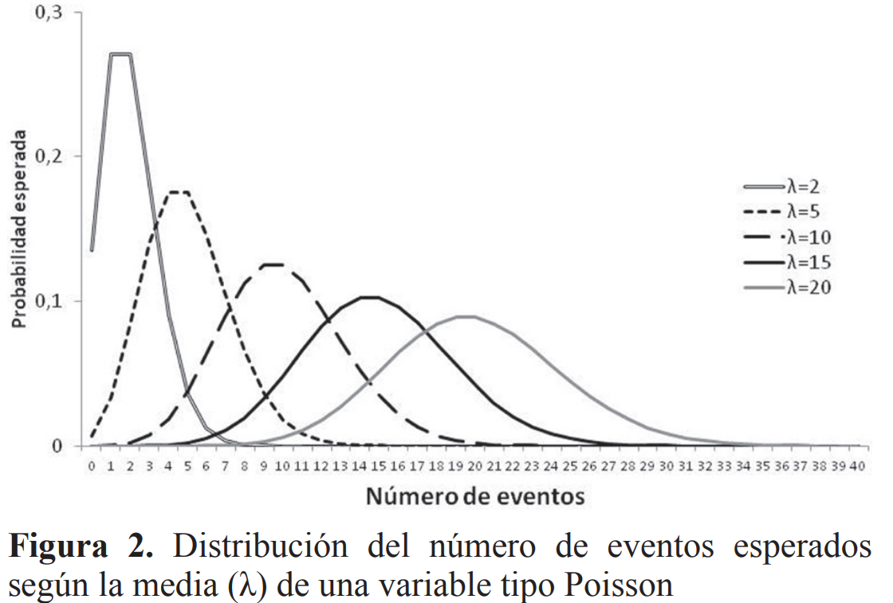
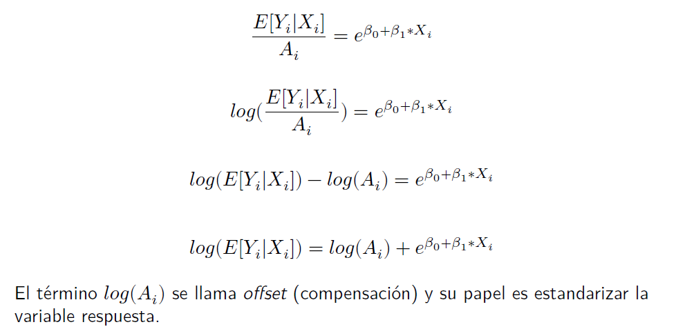

```{r echo = FALSE}
setwd("C:/Users/danfe/Dropbox/Proyectos Daniel/Cursos - diplomados - Maestrias/Programa de autoformación en investigación y análisis de datos/Rmarkdowns/Estadística/Programa de formación/Semana 7")

knitr::opts_chunk$set(echo = TRUE, warning = FALSE, message = FALSE,
                         fig.show = "asis", results = "show",
                      fig.align='center',
                      fig.path = "figures/",  # Configura el directorio donde se guardan los gráficos
  dev = "png")
```

\newpage

# Introducción 

## ¿Por qué realizar una regresión de Poisson?{-}

Un modelo de regresión de Poisson es un modelo lineal generalizado (GLM) que se utiliza para modelar datos de recuento (es decir, numérica, pero no tan amplia como una variable continua) y tasas de ocurrencias. La salida  $Y$  (recuento) es un valor que sigue la distribución de Poisson. 

```{r, echo=FALSE, out.width='80%', out.height='80%'}

```

Ejemplos de variables de recuento en investigación: 

- cuántos ataques al corazón o derrames cerebrales se han tenido, 

- cuántos días en el último mes se ha consumido $\text{[inserte aquí su sustancia ilícita favorita]}$ o, 

- como en el análisis de supervivencia, cuántos días han pasado desde el brote hasta la infección. 

Para transformar la relación no lineal en forma lineal, se utiliza una función de enlace que es el logaritmo de la regresión de Poisson. Por esa razón, un modelo de regresión de Poisson también se denomina modelo log-lineal. La forma matemática general del modelo de regresión de Poisson es:

$\text{log(Y)= β0 + β1X1 + β2X2 + ⋯ + βpXp}$

Los coeficientes se calculan utilizando métodos como la estimación de máxima verosimilitud (MLE) o la cuasi-verosimilitud máxima.

La distribución de Poisson es única en el sentido de que su media y su varianza son iguales. Esto se debe a menudo a que los datos tienen inflación de ceros. Utilizando nuestras variables de recuento anteriores, podría tratarse de una muestra que contenga individuos con y sin cardiopatías: los que no padecen cardiopatías provocan una cantidad desproporcionada de ceros en los datos y los que padecen cardiopatías siguen una cola hacia la derecha con cantidades crecientes de infartos. 

## ¿En qué se diferencia la distribución de Poisson de la distribución normal? {-}

```{r echo =FALSE}
library(gt)
library(dplyr)

# Crear la tabla con los datos
tabla_distribuciones <- tribble(
  ~Distribución_Poisson, ~Distribución_Normal,
  "Se utiliza para contar datos o tasa(razón) de datos.", "Usada para variables continuas",
  "Sesgada según los valores de lambda", "Curva en forma de campana que es simétrica alrededor de la media",
  "Varianza igual que la media", "La varianza y la media son parámetros diferentes; media, mediana y moda son iguales"
)

# Crear la tabla con gt y aplicar formato
tabla_distribuciones |> 
  gt() |> 
  tab_style(
    style = cell_text(weight = "bold", align = "center"),
    locations = cells_column_labels()
  ) |> 
  tab_style(
    style = cell_text(align = "center"),
    locations = cells_body()
  ) |> 
  tab_options(
    table.width = pct(80),
    table.font.size = "medium"
  ) |> 
  opt_horizontal_padding(scale = 2)


```


### Paquetes necesarios {-}

```{r echo=FALSE}
pacman::p_load(
  aod,
  ggplot2,
  effects,
  graphics,
  tidyverse,
  car,
  pscl)
```

# Ejemplo 1

**Solo Cambiemos la familia a "Poisson" en la función GLM **

```{r}
#Poisson Regression
#where count is a count and 
# x1-x3 are continuous predictors 
#fit <- glm(count ~ x1+x2+x3, data=mydata, family=poisson())
#summary(fit) display results
```

**Fin**

¿Lo veis? es todo. Pero destaquemos su uso con un ejemplo.

Vamos a modelar la regresión de Poisson relacionada con la frecuencia con la que el hilo se rompe durante el tejido. Estos datos se encuentran en el paquete $datasets$ en R, por lo que lo primero que debemos hacer es instalar el paquete usando install.packages("datasets") y cargar la biblioteca con la librería library(datasets):

```{r}
library(datasets)

data<-warpbreaks

str(data)

head(data,10)

```

¿Qué hay en nuestros datos?

Este conjunto de datos analiza cuántas roturas del tejido ocurrieron para diferentes tipos de telares por telar, por longitud fija de hilo. Podemos leer más detalles sobre este conjunto de datos en la documentación, pero aquí están las tres columnas que veremos y a qué se refiere cada una:

- breaks:	número de roturas

- wool:	El tipo de lana(A o B)

- tension:	El nivel de tensión (L, M, H)

Aquí, breaks es la variable de desenlace y wool y tension son variables independientes

Podemos ver que la distribución de los datos de la variable dependiente breaks creando un histograma:

```{r}
hist(data$breaks)
```
Claramente, los datos no tienen la forma de una curva de campana como en una distribución normal.

Veamos la media mean()y la varianza var ()de la variable dependiente:

```{r}
library(skimr)

skim(data$breaks)

var(data$breaks)

```
La varianza es mucho mayor que la media, lo que sugiere que tendremos una dispersión excesiva en el modelo.

Ajustemos el modelo de Poisson usando el comando glm ().

```{r}
# model poisson regression using glm()
poisson.model<-glm(breaks ~ wool + tension, data, family = poisson(link = "log"))

library(broom)

tidy(poisson.model, conf.int = T, exponentiate = T)
```

 **Grafiquemos los efectos para una mejor comprensión**
 
```{r}
library(sjPlot)
plot_model(poisson.model, transform  = "exp")+
  geom_hline(yintercept = 1)+
  theme_classic()
```

**Interpretación de los coeficientes**

$\text{exp(} {𝛽_j} text{})}$ representa el riesgo relativo (RR) sobre la tasa de incidencia de los sucesos asociado a un incremento de una unidad en el predictor X


**Evaluemos los efectos de cada variable en cada uno de los valores (efectos marginales).**

```{r}
library(effects)
summary(allEffects(poisson.model))

# grafiquemos
plot(allEffects(poisson.model)) # En el eje Y se presenta los conteos de rupturas

```

## Bondad de ajuste del modelo

**Coeficiente de determinación: pseudo-𝑅2:** 

Es un índice “absoluto” de bondad de ajuste que varía de 0 a 1 (%) y se puede utilizar para la evaluación del rendimiento del modelo o la comparación de modelos (con precaución). 

No mide el porcentaje de “varianza explicada”, ya que este concepto no se aplica al GLM. 

Pero tiene propiedades similares (rango, sensibilidad e interpretación).

```{r}
library(performance)
r2(poisson.model) # R2_Nagelkerke
```


## Supuestos

- Independencia de observaciones

- Los datos provienen de muestras independientes

- Linealidad El logaritmo de la tasa media, log(λ), debe ser una función lineal de x.

```{r}
plot(poisson.model, 1:4)

check_model(poisson.model)
```


- Equidispersión (varianza  = media)

Ya conocemos como evaluar los primeros supuestos por lo que ahora abordaremos la equidispersión

verifiquemos si el modelo tiene una dispersión excesiva o insuficiente. 

**Sobredispersión**

Las causas de la sobredispersión pueden ser: 

- aparentes, debido a la mala especificación del modelo. 

- real, debido a que la variación de los datos realmente es mayor que la media. 


**Como evaluarla**

Si la desviación residual es mayor que los grados de libertad.

Entonces existe una dispersión excesiva. Esto significa que las estimaciones son correctas, pero los errores estándar (desviación estándar) son incorrectos y el modelo no los tiene en cuenta.

**Evaluación metodo 1**
```{r}
library(DHARMa)
simres <- simulateResiduals(poisson.model, refit = TRUE)
testDispersion(simres, plot = FALSE)
```


**Evaluación metodo manual**

```{r}
summary(poisson.model)

poisson.model$deviance

poisson.model$df.residual

poisson.model$deviance / poisson.model$df.residual

pchisq(poisson.model$deviance, poisson.model$df.residual, lower.tail=F)
``` 

Cuando p-valor < 0.05 sugiere que una desviación residual tan grande o más grande que lo que observamos con el modelo es altamente improbable. El modelo no es adecuado o hay falta de ajuste.


**Alternativas**

* Verificar si el modelo está especificado adecuadamente (e.g. variables omitidas y forma funcional).

* Errores estándar robustos:

* Regresión quasi-poisson:

* Regresión binomial negativa: para datos de recuento excesivamente dispersos.

* Modelo de regresión inflado con cero: intentan tener en cuenta el exceso de ceros (para sub dispersión).

* Regresión OLS: la variable respuesta de recuento a veces se transforma logarítmicamente y se analiza mediante regresión OLS.

# GLM Poisson con errores estándar robustos

Puedes utilizar el paquete $𝑠𝑎𝑛𝑑𝑤𝑖𝑐ℎ$ para obtener los SE robustos y calcular los p-valores e IC con ellos.

```{r}

library(sandwich)
cov.m1 <- vcovHC(poisson.model, type="HC0") 
library(lmtest)
ct <- coeftest(poisson.model, vcov = cov.m1 )  # t test robusto
ct <- coeftest(poisson.model, vcov = sandwich )  # t test robusto


exp(coef(ct))

exp(confint(ct))
# Ojo: no cambian las estimaciones puntuales pero sí los SE.

# valores p 
ct
```


# GLM Quasi-poisson: dando cuenta de la sobredispersión

```{r}
Qfit <- glm(breaks ~ wool + tension, family = quasipoisson(link = "log"), 
    data = data)

summary(Qfit)

tidy(Qfit, conf.int = T, exponentiate = T)

#Evaluación del modelo
anova(Qfit, test = "Chisq")
```

```{r}
library(sjPlot)
plot_model(Qfit, transform  = "exp")+
  geom_hline(yintercept = 1)+
  theme_classic()
```


# regresión binomial negativa

La regresión binomial negativa es similar en aplicación a la regresión de Poisson, pero permite una dispersión excesiva en la variable de conteo dependiente.

```{r}
library(MASS)

model.nb = glm.nb(breaks ~ wool + tension, 
                  data = data,
                  control = glm.control(maxit=1000))

summary(model.nb)

tidy(model.nb, conf.int = T, exponentiate = T)


```

```{r}
library(sjPlot)
plot_model(model.nb, transform  = "exp")+
  geom_hline(yintercept = 1)+
  theme_classic()
```


# GLM con datos inflados a cero
 
La regresión inflada con cero es similar en aplicación a la regresión de Poisson, pero permite una abundancia de ceros en la variable de conteo dependiente.


```{r eval=F}
library(pscl)

model.zi = zeroinfl(breaks ~ wool + tension,
                    data = data,
                    dist = "poisson")

                       ### dist = "negbin" may be used

summary(model.zi)


```

# GLM Poisson para tasas de incidencia

**¿Conteo o tasa de ocurrencia?**

Número de incidentes agresivos realizados por pacientes en un centro de rehabilitación.

Si todos los pacientes están en el centro el mismo número de días, no es necesaria considerar la tasa de incidentes. Pero si hay una variación en el número de días que cada paciente está presente, la asistencia en sí podría afectar el recuento. Un recuento de 10 incidentes de 180 días es mucho menor que un recuento de 10 incidentes en 15 días.

```{r, echo=FALSE, out.width='80%', out.height='80%'}

```
Utilizaremos un ejemplo con datos de cancer de pulmon

```{r}
library(ISwR)
data(eba1977)
head(eba1977, 10)
```
𝑇𝑎𝑠𝑎 = 𝑋/𝑛 donde 𝑋 = 𝑐𝑎𝑠𝑒𝑠 (el evento es un caso de cáncer) y 
                       𝑛 = 𝑝𝑜𝑝 (la población es la agrupación).

Ajustamos el modelo

```{r}
eba1977$logpop <- log(eba1977$pop)
fit.rate<-glm(cases ~ city + age + offset(logpop),family = poisson,data = eba1977)
summary(fit.rate)

tidy(fit.rate, exponentiate = T, conf.int = T)
```

Grafiquemos el modelo 

```{r}
library(sjPlot)
plot_model(fit.rate, transform  = "exp")+
  geom_hline(yintercept = 1)+
  theme_classic()
```


# References

## Revisar y usar bases de datos

<https://stats.oarc.ucla.edu/other/dae/>

<https://grodri.github.io/glms/datasets/#cuse>

## otras referencias

<https://ademos.people.uic.edu/Chapter19.html#>

Kabacoff, R.I. Generalized Linear Models. Retrieved from
<http://www.statmethods.net/advstats/glm.html> Lillis, D. Generalized
Linear Models in R, Part 6: Poisson Regression for Count Variables.
Retrieved from
<http://www.theanalysisfactor.com/generalized-linear-models-in-r-part-6-poisson-regression-count-variables/>\
Rodríguez, G. 5 Generalized Linear Models. Retrieved from
<http://data.princeton.edu/R/glms.html> UCLA: Statistical Consulting
Group. R Data Analysis Examples: Logit Regression. Retrieved from
<http://www.ats.ucla.edu/stat/r/dae/logit.htm>

</script>
