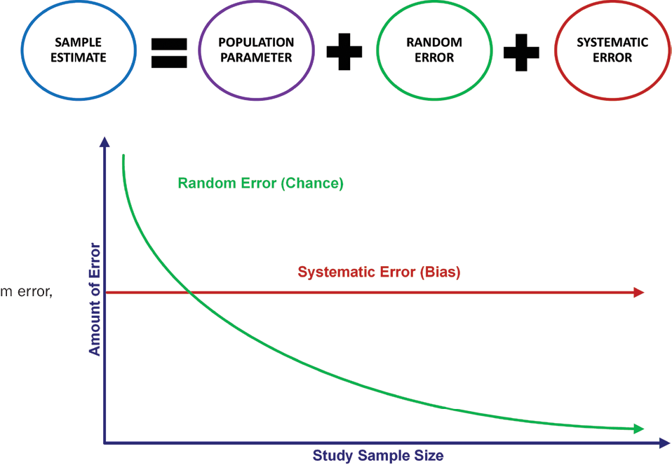
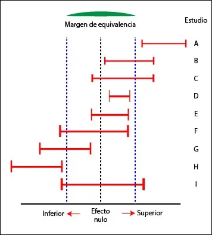
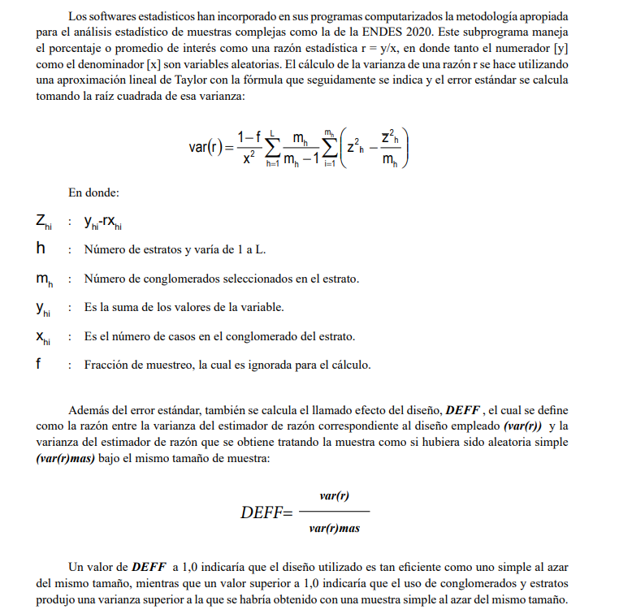

```{r}
#| echo = FALSE
knitr::opts_chunk$set(echo = TRUE, warning = FALSE, message = FALSE)
```

```{r }

```

## No es necesario importar datos

```{r}
setwd("C:/Users/danfe/Dropbox/Proyectos Daniel/Cursos - diplomados - Maestrias/Programa de autoformación en investigación y análisis de datos/Rmarkdowns/Estadística/Programa de formación/Semana11 sample_size")

```

Estimar el tamaño de la muestra de un estudio prospectivo es una de las primeras cosas que hacen los investigadores antes de inscribir a los pacientes.

En este tutorial, aprenderá a utilizar R para:

1.  Estimar el **tamaño de la muestra** para un estudio prospectivo que responda una pregunta causal (por ejemplo, un ECA)

2.  Determinar la **potencia** de que se dispone para detectar una diferencia causal (análisis post hoc)

# Tamaño de la muestra en un ECA

Antes de inscribir a los pacientes, debe asegurarse de estimar el número óptimo de pacientes que necesitará para su estudio. No sería eficiente inscribir a todo el mundo en el estudio porque sería costoso y poco ético.

El tamaño de muestra lidiara con asociaciones que puedan deberse al azar pero no puede lidiar con errores sistemáticos.



## Para comparar dos proporciones

-   nivel alfa (normalmente bilateral): El nivel alfa es el umbral a partir del cual se determina si algo es estadísticamente significativamente diferente. Normalmente utilizamos un nivel alfa de 0,05 (error de tipo I). Esta es la convención para la mayoría de las ciencias biomédicas, pero puede variar dependiendo de la situación (por ejemplo, *comparaciones múltiples*).

-   potencia (ajústela al 80%): Potencia (1 - β) es la capacidad de rechazar correctamente la hipótesis nula si el efecto real de la población es igual o mayor que el tamaño del efecto especificado. (Recordemos que el error de tipo II es β.) En otras palabras, si se concluye que no hay diferencia en la muestra, entonces no hay diferencia real en la población condicionada al tamaño del efecto especificado. Por lo general, usaremos la potencia de 80

Con estos datos, podemos estimar el tamaño de la muestra para un estudio con dos proporciones como resultado mediante la siguiente fórmula:

$$n_i = \frac{(Z_{\alpha/2} + Z_{1-\beta})^2 \cdot (p_1 (1 - p_1) + p_2 (1 - p_2))}{(p_1 - p_2)^2}$$

donde ni: es el tamaño de la muestra para un grupo.

Afortunadamente, no tenemos que hacer todo este trabajo. Podemos estimar el tamaño de la muestra utilizando el paquete pwr de R para hacer el trabajo pesado.

Utiliza la función pwr.2p.test() para averiguar cuántos pacientes son necesarios. Vamos a necesitar un par de datos. Ya hemos explicado que necesita el nivel alfa (alfa = 0,05), y el nivel de potencia (potencia = 80%).

También necesitamos el $\pi$ para el Tratamiento A y el grupo control (**Placebo**). Esto es algo que tenemos que averiguar o estimar en base a la literatura existente (preferentemente de la misma población).

Yo suelo empezar con el 50% porque es un buen punto neutro; es como lanzar una moneda al aire (50-50). Si asignaría el placebo, el 50% no desarrollaria el desenlace (mortalidad). Ahora, "en base a la literatura" pensamos que el Tratamiento A es ligeramente mejor, con una respuesta del 60% (no moriran 10% más). Por lo tanto, tengo

p1=0.60

p2=0.50

Con estos datos, puedo estimar el tamaño de la muestra necesario para detectar una diferencia en la proporción de "mortalidad" entre el Tratamiento A y el placebo que sea del 10% (p1 - p2) con un alfa del 5% y una potencia del 80%.

```{r}
library("pwr")
prop_2 <-pwr.2p.test(h = ES.h(p1 = 0.60, p2 = 0.50), sig.level = 0.05, power = 0.80)
prop_2

# Tambien puedes usar la libreria 
#install.packages("pwrss")
library(pwrss)
# normal approximation
pwrss.z.2props(p1 = 0.30, p2 = 0.20,
               alpha = 0.05, power = 0.80,
               alternative = "not equal", 
               arcsin.trans = FALSE) # cuando prevalencia < 1%

# arcsine transformation
pwrss.z.2props(p1 = 0.6, p2 = 0.50,
               alpha = 0.05, power = 0.80,
               alternative = "not equal",
               arcsin.trans = TRUE)

```

El tamaño del efecto h es 0,201, y la muestra n es 387,2 o 388 redondeado al número entero más próximo. Este n es sólo para un grupo. Por lo tanto, basándonos en los parámetros de nuestro estudio, necesitamos aproximadamente 388 pacientes en el Tratamiento A y 388 pacientes en el grupo placebo para detectar una diferencia del 10% de mortalidad o superior con un alfa de 0,05 y una potencia del 80%.

**¿Qué es la Transformación de Arcsine?** La transformación de arcseno se utiliza en el cálculo del tamaño de muestra cuando se comparan dos proporciones para estabilizar la varianza y hacer que los datos sigan una distribución más cercana a la normal, lo cual facilita la aplicación de métodos estadísticos que asumen normalidad. Esto es especialmente útil cuando las proporciones son extremas (muy cercanas a 0 o 1), ya que en esos casos la varianza de las proporciones no es constante y la distribución binomial de las proporciones no se aproxima bien a una distribución normal.

## Para dos medias independientes

Calculemos ahora el tamaño de la muestra para un estudio en el que comparamos las medias entre dos grupos. Supongamos que estamos trabajando en un ensayo controlado aleatorizado que pretende evaluar la diferencia en el cambio medio de la hemogloblina A1c (HbA1c) desde el inicio entre el Tratamiento A y el Placebo.

Para determinar el tamaño de la muestra necesario para detectar una diferencia significativa en el cambio medio de HbA1c con respecto al valor inicial entre el Tratamiento A y el Tratamiento B, podemos utilizar la siguiente fórmula:

$$
n_i = \frac{2\sigma^2 \cdot (Z_{\alpha/2} + Z_{1-\beta})^2}{(\mu_1 - \mu_2)^2}
$$

Con R no necesitará utilizar esta fórmula. Sin embargo, si decide estimar el tamaño de la muestra a mano, deberá asegurarse de utilizar correctamente Zα/2= 1,96 y Z(1-β)= 0.84.

donde $n_i$ es el tamaño de la muestra de uno de los grupos, μ1 y μ2 son las diferencias de medias del valor de la HbA1c entre el inicio y final del estudio para el Tratamiento A y el placebo, respectivamente.

También necesitamos la siguiente información nivel alfa (normalmente de dos colas) tamaño del efecto (d de Cohen) potencia (establézcala en 80%) Fijaremos el nivel alfa de dos colas en 0,05.

El tamaño del efecto, también conocido como d de Cohen se estima mediante la siguiente ecuación:

$$
d = \frac{\mu_1 - \mu_2}{\sigma_{\text{pooled}}}
$$

Existen otras fórmulas que proporcionan medidas normalizadas, como Hedges g. Sin embargo, no siempre está claro qué significa el tamaño del efecto normalizado. La interpretación del tamaño del efecto varía, pero la convención común recomienda lo siguiente:

-   d = 0,2 (efecto pequeño)

-   d = 0,5 (efecto medio)

-   d = 0,8 (efecto grande)

La desviación típica agrupada se estima mediante la siguiente fórmula:

$$
\sigma_{\text{pooled}} = \sqrt{\frac{sd_1^2 + sd_2^2}{2}}
$$

Una vez más, el paquete R pwr puede facilitarnos esta tarea. Sin embargo, tendremos que estimar la d de Cohen.

Como no hemos empezado el estudio, tenemos que hacer algunas suposiciones sobre el cambio en la HbA1c de cada estrategia de tratamiento. Puede hacerlo revisando la literatura y obteniendo una idea general de lo que se considera el cambio medio en la HbA1c y, a continuación, hacer una conjetura. Para nuestro ejemplo, supongamos que el cambio medio esperado en la HbA1c desde el valor basal para el tratamiento A fue del 1,5% con una desviación estándar del 0,25%. Además, supongamos que el cambio medio esperado en la HbA1c desde el valor basal para el grupo placebo fue del 1,0% con una desviación estándar del 0,20.

En primer lugar, calcularemos la desviación estándar agrupada $\sigma_{\text{pooled}}$:

```{r}
sd1 <- 0.25
sd2 <- 0.30
sd_pooled <- sqrt((sd1^2 +sd2^2) / 2)
sd_pooled
```

Una vez que tenemos la $\sigma_{\text{pooled}}$ podemos estimar la d de Cohen:

```{r}
mu1 <- 1.5
mu2 <- 1.0
d <- (mu1 - mu2) / sd_pooled
d
```

La d de Cohen es de 1,81, lo que se considera un gran tamaño del efecto.

Ahora, podemos aprovechar el paquete pwr y estimar el tamaño de la muestra necesario para detectar una diferencia del 0,5% (1,5% - 1,0%) en el cambio medio de HbA1c desde el valor basal entre el Tratamiento A y el placebo con una potencia del 80% y un umbral de significación del 5%.

```{r}
n_i <- pwr.t.test(d = d, power = 0.80, sig.level = 0.05)
n_i

# alternativa
#install.packages("pwrss")
library(pwrss)
pwrss.t.2means(mu1 = 3, mu2 = 1.0, sd1 = 1, sd2 = 1, 
               kappa = 1, # tamaños de muestra iguales ( kappa = 1)
               power = .80, alpha = 0.05,
               alternative = "not equal")
```

Basándonos en los parámetros de nuestro estudio, necesitamos 6 pacientes en cada grupo para detectar una diferencia del 0,5 unidades o superior con una potencia del 80% y un umbral de significación del 5%.

### NOTA {.unnumbered}

```{r, echo=FALSE}

```

Los ECA suelen tener diferentes propósitos, habitualmente se trata de buscar superioridad de la intervención vs placebo, pero cuando comparamos dos intervenciones nos interesa saber si existe equivalencia, no inferioridad o superioridad:

Así, al momento de diseñar el ECA se debe considerar si el tamaño de la muestra será el adecuado de acuerdo al objetivo del estudio

```{r}
library(pwrss)
# Te dejo las diferentes opciones para que las pruebes
pwrss.z.2props(p1 = 0.6, p2 = 0.50,
               alpha = 0.05, power = 0.80,
               alternative = "less", # “not equal”, “greater”, “less”, “equivalent”, “non-inferior”, “superior”
               arcsin.trans = FALSE)

```

## Para dos medias pareada

Supongamos que para el primer punto (por ejemplo, antes de la prueba) y el segundo (por ejemplo, después de la prueba) las medias esperadas son 30 y 28 (una reducción de 2 puntos), y las desviaciones estándar esperadas son 12 y 8, respectivamente. Suponga también una correlación de 0,50 entre la primera y la segunda medición (por defecto paired.r = 0.50). ¿Cuál es el tamaño mínimo de muestra requerido?

```{r}
pwrss.t.2means(mu1 = 30, mu2 = 28, sd1 = 12, sd2 = 8, 
               paired = TRUE, paired.r = 0.50,
               power = .80, alpha = 0.05,
               alternative = "not equal")
```

## Otras situaciónes

### Muestras independientes (prueba de Wilcoxon-Mann-Whitney)

Sí tienes esperado un bajo tamaño de muestra o que la distribución del desenlace en ambos grupos del experimento tendrán una distribución no normal tendrás que calcular tu tamaño de muestra en función de:

```{r}
pwrss.np.2groups(mu1 = 30, mu2 = 28, sd1 = 12, sd2 = 15, kappa = 1, 
               power = .80, alpha = 0.05,
               alternative = "not equal")
```

### Muestras pareadas (prueba de rangos de Wilcoxon)

Sí al enunciado anterior le sumas que las muestras estaran pareadas (estudios de pre y post intervención) deberas usar:

```{r}
pwrss.np.2groups(mu1 = 30, mu2 = 28, sd1 = 12, sd2 = 8, 
               paired = TRUE, paired.r = 0.50,
               power = .80, alpha = 0.05,
               alternative = "not equal")
```

## Potencia estadística en un ECA

p\<0.05 n = 300 potencia = 60% Error tipo 2

p\>0.05 n = 300 potencia = 60% Error tipo 2 ( Aceptar H0 (p\>0.05) cuando es falsa)

También podemos utilizar la función de gráfico para ver cómo cambia el nivel de potencia con distintos tamaños de muestra. A medida que aumenta el tamaño de la muestra, aumenta la potencia. A medida que disminuye el tamaño de la muestra, disminuye la potencia.

A medida que aumentamos el tamaño de la muestra, reducimos la incertidumbre en torno a las estimaciones. Al reducir esta incertidumbre, obtenemos una mayor precisión en nuestras estimaciones, lo que se traduce en una mayor confianza en nuestra capacidad para evitar cometer un error de tipo II.

Esto no suele hacerse a menos que tenga un valor no significativo y desee determinar si tiene un alto potencial de error de tipo II debido a una muestra pequeña.

### Para dos proporciones

```{r}
### Podemos trazar la potencia relativa a diferentes niveles del tamaño de la muestra. 
plot(prop_2)

```

Cambiemos $\pi$ y veamos cómo cambia el nivel de potencia; estamos fijando nuestro tamaño de muestra en 388 para cada grupo con un alfa de 0,05. Creamos una secuencia de valores variando la proporción de mortalidad en el Tratamiento A. Los cambiaremos del 50% al 100% en intervalos del 5%.

```{r}
p1 <- seq(0.5, 1.0, 0.05)

power1 <-pwr.2p.test(h = ES.h(p1 = p1, p2 = 0.50),
                     n = 388,
                     sig.level = 0.05)

powerchange <- data.frame(p1, power = power1$power * 100)

plot(powerchange$p1, 
     powerchange$power, 
     type = "b", 
     xlab = "Proportion of Responders in Treatment A", 
     ylab = "Power (%)")

iteration <- function(p_i, P_i, i_i, p2, n, alpha) {
              p1 <- seq(p_i, P_i, i_i)
              power1 <-pwr.2p.test(h = ES.h(p1 = p1, p2 = p2),
                                   n = n,
                                   sig.level = alpha)
              powerchange <- data.frame(p1, power = power1$power * 100)
              powerchange
}

iteration(0.5, 1.0, 0.05, 0.50, 388, 0.05)
```

### Para dos medias

```{r}
### We can plot the power relative to different levels of the sample size. 
n <- seq(1, 10, 1)
nchange <- pwr.t.test(d = d, n = n, sig.level = 0.05)
## Warning in qt(sig.level/tside, nu, lower = FALSE): NaNs produced
nchange.df <- data.frame(n, power = nchange$power * 100)
nchange.df

plot(nchange.df$n, 
     nchange.df$power, 
     type = "b", 
     xlab = "Sample size, n", 
     ylab = "Power (%)")

```

Cambiemos μi y veamos cómo cambia el nivel de potencia; estamos fijando nuestro tamaño de muestra en 6 para cada grupo con un alfa de 0,05.

Estimar la potencia es fácil. Se escribe el mismo comando, pero la única diferencia es que se introduce un valor para el tamaño de la muestra para un grupo (n) y se hace que potencia = NULL eliminándolo de las opciones. He aquí un ejemplo:

pwr.t.test(d = d, n = 6, nivel sig = 0.05)

Creamos una secuencia de valores variando el cambio medio en la HbA1c desde el valor basal para el Tratamiento A. Cambiaremos estos valores de 0% a 2% en intervalos de 0,1%.

```{r}
mu1 <- seq(0.0, 2.0, 0.1)

d <- (mu1 - mu2) / sd_pooled

power1 <- pwr.t.test(d = d, n = 6, sig.level = 0.05)
powerchange <- data.frame(d, power = power1$power * 100)
powerchange
```

```{r}
plot(powerchange$d, 
     powerchange$power, 
     type = "b", 
     xlab = "Cohen's d", 
     ylab = "Power (%)")
```

Esta figura muestra cómo cambia la potencia con la d de Cohen. Tiene un patrón simétrico debido al rango negativo y positivo asociado a la d de Cohen. Pero la historia es la misma. A medida que aumenta el tamaño del efecto (los signos negativo y positivo no importan; sólo nos importan los valores absolutos), aumenta la potencia. Esto tiene sentido porque sólo tenemos suficiente potencia para detectar grandes diferencias con el tamaño de muestra actual (que es fijo en este caso). Si las diferencias son pequeñas, entonces no tenemos suficiente potencia con el tamaño de muestra actual de 6.

### Para otras situaciones

solo borra el parametro de **power** y añade el tamaño de muestra de tu estudio

```{r}
pwrss.t.2means(mu1 = 1.5, mu2 = 1.0, sd1 = 0.25, sd2 = 0.30, 
               kappa = 1, # tamaños de muestra iguales ( kappa = 1)
               n = 5, alpha = 0.05,
               alternative = "not equal")

```

Statistical power = 0.709

### ¿Qué hay con el tamaño de muestra para estudios observacionales?

Si no sabemos cuan importante es el sesgo de selección o la confusión poco o nada podemos hacer para estimar el tamaño de muestra que demuestre un efecto causal.

El calculo de tamaño de muestra para ECA podría tomarse como referencial e incrementar al menos en 10 (algunos sugieren hasta 50) por cada variable confusora en tu modelo

# Tamaño de muestra en estudios de predicción

¿Será útil el criterio de Eventos Por Predictor (EPP)?

Leer [Riley et al](https://www.ncbi.nlm.nih.gov/pmc/articles/PMC6519266/) y [Riley et al 2](https://onlinelibrary.wiley.com/doi/10.1002/sim.7993)

### Desenlaces dicotómico: modelo de predicción diagnóstica para la enfermedad de Chagas crónica

```{r}
#install.packages("pmsampsize")
library(pmsampsize)
```

Nuestro primer ejemplo considera el tamaño mínimo de muestra requerido para desarrollar un modelo de diagnóstico para predecir un resultado binario (enfermedad: sí o no). Brasil et al desarrollaron un modelo de regresión logística que contiene 14 parámetros predictores para predecir el riesgo de tener enfermedad de Chagas crónica en pacientes con sospecha de enfermedad de Chagas. Tras la validación externa en una cohorte de 138 participantes que contenía 24 con enfermedad de Chagas, el modelo tuvo una estadística *C (ROC \_ AUC)* estimada de 0,91 y una $R^2 Nagelkerke$ de 0,48. Considere que un investigador quiere actualizar este modelo y mejorar el rendimiento predictivo. Nuestro enfoque de tamaño de muestra se puede aplicar de la siguiente manera.

Supongamos que el investigador ha identificado (por ejemplo, basándose en estudios recientes) 10 parámetros predictores adicionales que desea añadir al modelo original. Por tanto, en total, el número de parámetros predictores, *p,* es 24. El siguiente paso es identificar un valor razonable para el Cox-Snell previsto $R^2_{adj}$

```{r}
# prevalencia de la enfermedad
24/138*100

pmsampsize(type = "b", nagrsquared = 0.48, parameters = 24, prevalence = 0.174)

pmsampsize(type = "b", cstatistic = 0.91, parameters = 24, prevalence = 0.174)

```

### Desenlaces de tiempo a evento: Modelos de predicción de Cox

Utilice pmsampsize para calcular el tamaño mínimo de muestra necesario para desarrollar un modelo de predicción multivariable con un resultado de supervivencia utilizando 30 candidatos predictores candidatos.

Sabemos que un modelo de predicción existente en el mismo campo tiene una R-cuadrado ajustado de 0,051. Además, en el estudio anterior la media seguimiento fue de 2,07 años y la tasa global de eventos fue de 0,065.

Seleccionamos un punto temporal de interés para la predicción utilizando el modelo recién desarrollado de 2 años

```{r}
pmsampsize(type = "s", csrsquared = 0.051, parameters = 30, rate = 0.065,
timepoint = 2, meanfup = 2.07)

```

### Desenlace numérico: Modelos de regresion lineal

Utilice pmsampsize para calcular el tamaño mínimo de muestra necesario para desarrollar un modelo de predicción multivariable para un resultado continuo (aquí, FEV1), utilizando 25 predictores candidatos. Sabemos que un modelo de predicción existente en el mismo campo tiene un R-cuadrado ajustado de 0,2, y que los valores de FEV1 en la población tienen una media de 1,9 y una DE de 0,6

```{r}
pmsampsize(type = "c", rsquared = 0.2, parameters = 25, intercept = 1.9, sd = 0.6)
```

# Tamaño de muestra en estudios descriptivos

## Prevalencia

Utilizaremos el enfoque de las Demographic Health Surveys (DHS).

La mayoría de las encuestas DHS son representativas\* a nivel nacional, para zonas urbanas y rurales, y para las subdivisiones del primer nivel administrativo, que suelen denominarse regiones, zonas, provincias, gobernaciones o estados. Existe un interés creciente en proporcionar datos de DHS para niveles administrativos incluso inferiores, como condados y distritos. \*En este documento, por "representativo a un nivel de dominio específico" se entiende que la mayoría de los resultados/indicadores de la encuesta pueden producirse a nivel de ese dominio con buena precisión.

**¿Qué factores determinan el tamaño de la muestra?**

El tamaño de las muestras para las encuestas de DHS se basa en el número de dominios de la encuesta (normalmente unidades subnacionales como las regiones), los requisitos de precisión para los indicadores prioritarios y el presupuesto. En general, los muestreadores del Programa DHS diseñan las encuestas teniendo en cuenta las estimaciones de fecundidad y mortalidad infantil. Para calcular la fecundidad con un nivel adecuado de precisión, por ejemplo, los muestreadores incluyen entre 800 mujeres por cada región subnacional en países con una tasa global de fecundidad (TGF) alta y 1.000 mujeres en países con una TGF baja. La región subnacional típica suele ser el nivel administrativo 1.

En otras palabras, un país con una TGF alta y 10 regiones necesita entrevistar al menos a 8.000 mujeres para disponer de estimaciones de la fecundidad y la mortalidad infantil con errores estándar razonablemente pequeños para cada una de las 10 regiones.

En países con más de 10 regiones, una opción para mantener bajo el tamaño de la muestra y reducir costes es agrupar algunas regiones para formar dominios de estudio. Una muestra total de unas 10.000 mujeres es ideal para mantener la rentabilidad y la calidad de los datos.

Pero este método podría no ser muy adecuado, por lo que es mejor utilizar alguna formula validada.

**Caso de Perú**

Para calcular el tamaño de muestra en encuestas como las Demographic and Health Surveys (DHS) cuando se tiene un diseño estratificado por regiones y áreas (urbana y rural), se utiliza la siguiente fórmula:

$$
n = \frac{Z_{\alpha/2}^2 \cdot p \cdot (1 - p)}{d^2} \cdot \frac{DEFF}{R}
$$

Donde:

-   n es el tamaño de muestra total requerido.

-𝑍α/2: es el valor Z correspondiente al nivel de confianza deseado (por ejemplo, 1.96 para un nivel de confianza del 95%).

-   p es la proporción estimada de la población con la característica de interés.

-   d es la precisión deseada (margen de error) de la estimación.

-   DEFF es el efecto del diseño, que ajusta el tamaño de la muestra para tener en cuenta la variabilidad adicional introducida por el diseño complejo de la encuesta.

-   R es la tasa de respuesta esperada.

**Calculo del DEFF**

```{r, echo=FALSE}

```

Dado que Perú tienes 25 regiones, cada región tiene zonas urbanas y rurales, y cada división esta dividido en 5 quintiles de riqueza, da como resultado la presencia de 250 estratos. La muestra total se distribuye entre los estratos proporcionalmente o de acuerdo a un esquema de muestreo óptimo.

La fórmula para calcular el tamaño de muestra por cada estrato (una combinación de una región y un área urbana/rural) sería:

$$
n_{h} = \frac{n \cdot W_{h}}{N}
$$ Donde:

-   𝑛ℎ: es el tamaño de muestra para el estrato

-   n es el tamaño de muestra total calculado.

-   𝑊ℎ: es el peso del estrato ℎ (proporción de la población total en el estrato ℎ).

-   N es la población total.

Entonces, al dividir el tamaño de muestra entre los diferentes estratos, se asegurará que cada estrato esté representado de manera adecuada.

[Ver informe de ENDES para más detalle](https://proyectos.inei.gob.pe/endes/2020/INFORME_PRINCIPAL_2020/INFORME_PRINCIPAL_ENDES_2020.pdf)

**¿Hasta qué punto son precisas estas estimaciones?**

Todas las estrategias de muestreo de encuestas están sujetas a errores de muestreo. El Programa DHS diseña muestras para proporcionar estimaciones nacionales y subnacionales con un error estándar relativo razonable. Cuanto mayor sea el tamaño de la muestra, menor será el error típico relativo de cualquier indicador.

Los errores estándar en el nivel admin 1 son más amplios que los del nivel nacional; los errores estándar del nivel admin 2 son mayores que los del nivel admin 1. Por este motivo, la interpretación de las tendencias subnacionales y la comparación de las unidades subnacionales deben realizarse con precaución, a menos que la muestra total sea muy amplia.

Es necesario realizar pruebas de significación adecuadas para confirmar los cambios a lo largo del tiempo o las verdaderas diferencias entre áreas subnacionales.

[Revisar DHS manual](https://www.dhsprogram.com/pubs/pdf/DHSG1/Guide_to_DHS_Statistics_DHS-8.pdf)
