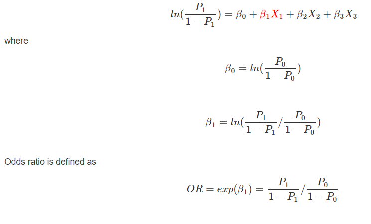
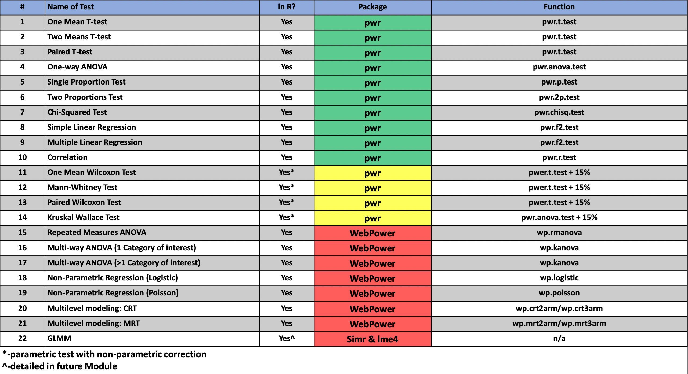

```{r echo = FALSE}
setwd("C:/Users/danfe/Dropbox/Proyectos Daniel/Cursos - diplomados - Maestrias/Programa de autoformación en investigación y análisis de datos/Rmarkdowns/Estadística/Programa de formación/Semana11 sample_size")

knitr::opts_chunk$set(echo = TRUE, warning = FALSE, message = FALSE,
                         fig.show = "asis", results = "show",
                      fig.align='center',
                      fig.path = "figures/",  # Configura el directorio donde se guardan los gráficos
  dev = "png")
```


\newpage

# Introduccion

Estimar el tamaño de la muestra de un estudio prospectivo es una de las primeras cosas que hacen los investigadores antes de inscribir a los pacientes. Este ejercicio ayuda al investigador a determinar si es factible inscribir al número necesario de pacientes para responder a la pregunta de investigación formulada. Si el tamaño estimado de la muestra de un estudio superara el millón de pacientes, sería un proyecto de enormes proporciones. Conocer esta información al comienzo del diseño de un estudio ayuda a calibrar y ajustar las expectativas a niveles más razonables.

En este tutorial, aprenderá a utilizar R para:

1. stimar el tamaño de la muestra para un estudio prospectivo (por ejemplo, un ensayo controlado aleatorizado)

2. determinar la potencia de que se dispone para detectar una diferencia en caso de que existiera (análisis post hoc)


Si está realizando un estudio prospectivo en el que necesita inscribir pacientes, estimar el número óptimo de pacientes es necesario para su Plan de análisis estadístico.

Si está realizando un estudio retrospectivo, puede determinar de cuánta potencia dispone para detectar una diferencia si existiera. Esto no suele hacerse a menos que tenga un valor no significativo y desee determinar si tiene un alto potencial de error de tipo II debido a una muestra pequeña.

# Tamaño de la muestra en un ECA
Antes de inscribir a los pacientes, debe asegurarse de estimar el número óptimo de pacientes que necesitará para su estudio. No sería eficiente inscribir a todo el mundo en el estudio porque sería costoso y poco ético.

## Para dos proporciones
Supongamos que le piden que calcule el número de pacientes que se necesitarán para un próximo ensayo controlado aleatorizado. El objetivo principal del estudio es estimar la eficacia del tratamiento A frente al tratamiento B. El criterio de valoración principal es una variable dicotómica: "Respuesta" o "Sin respuesta".

La hipótesis nula es

- H0: No hay diferencia en la proporción de respondedores entre el Tratamiento A y el Tratamiento B.

La hipótesis alternativa es: 

- Ha: Existe una diferencia en la proporción de respondedores entre el Tratamiento A y el Tratamiento B.

Para determinar el tamaño de la muestra necesario para detectar una diferencia significativa en la proporción de respondedores entre el Tratamiento A y el Tratamiento B, necesitamos la siguiente información:

- nivel alfa (normalmente bilateral): El nivel alfa es el umbral a partir del cual se determina si algo es estadísticamente significativamente diferente. Normalmente utilizamos un nivel alfa de 0,05 (error de tipo I). Esta es la convención para la mayoría de las ciencias biomédicas, pero puede variar dependiendo de la situación (por ejemplo, comparaciones múltiples).


- tamaño del efecto (h): El tamaño del efecto es la diferencia estandarizada que cabría esperar entre los grupos de tratamiento. Se trata de una estimación y suele basarse en estudios anteriores. A menudo, los investigadores tienen que adivinar el tamaño del efecto.

    -  Podemos estimar el tamaño h mediante la siguiente ecuación: h=φ1-φ2, donde φi=2∗arcsine(√pi) donde pi denota la proporción en el tratamiento i que fueron clasificados como "respondedores".

- potencia (ajústela al 80%): Potencia (1 - β) es la capacidad de rechazar correctamente la hipótesis nula si el efecto real de la población es igual o mayor que el tamaño del efecto especificado. (Recordemos que el error de tipo II es β.) En otras palabras, si se concluye que no hay diferencia en la muestra, entonces no hay diferencia real en la población condicionada al tamaño del efecto especificado

    -   Por lo general, ajustamos la potencia al 80
    
Con estos datos, podemos estimar el tamaño de la muestra para un estudio con dos proporciones como resultado mediante la siguiente fórmula:

$$n_i = \frac{(Z_{\alpha/2} + Z_{1-\beta})^2 \cdot (p_1 (1 - p_1) + p_2 (1 - p_2))}{(p_1 - p_2)^2}$$

donde ni: es el tamaño de la muestra para un grupo.

Afortunadamente, no tenemos que hacer todo este trabajo. Podemos estimar el tamaño de la muestra utilizando el paquete pwr de R para hacer el trabajo pesado.

Asegúrese de tener instalado el paquete escribiendo install.packages("pwr").

Una vez instalado, asegúrese de cargar el paquete escribiendo library("pwr").

Utiliza la función pwr.2p.test() para averiguar cuántos pacientes son necesarios. Vamos a necesitar un par de datos. Ya hemos explicado que necesita el nivel alfa (alfa = 0,05), el tamaño del efecto h
y el nivel de potencia (potencia = 80%).

También necesitamos el pi para el Tratamiento A y el Tratamiento B. Esto es algo que tenemos que adivinar. Hacemos esta suposición mirando estudios anteriores y determinando la tasa normal de respuesta. A veces no se puede encontrar esto en la literatura, por lo que hay que hacer una conjetura. Yo suelo empezar con el 50% porque es un buen punto neutro; es como lanzar una moneda al aire (50-50). Asignaré el Tratamiento B como referencia (por ejemplo, control) con una tasa de respuesta del 50%. Ahora, "adivinaré" que el Tratamiento A es ligeramente mejor, con una tasa de respuesta del 60%. Por lo tanto, tengo

p1=0.60

p2=0.50

Con estos datos, puedo estimar el tamaño de la muestra necesario para detectar una diferencia en la tasa de "respuesta" entre el Tratamiento A y el Tratamiento B que sea del 10% (p1 - p2) con un alfa del 5% y una potencia del 80%.

```{r}
library("pwr")
prop_2 <-pwr.2p.test(h = ES.h(p1 = 0.60, p2 = 0.50), sig.level = 0.05, power = .80)
prop_2

# Tambien puedes usar la libreria 
#install.packages("pwrss")
library(pwrss)
# normal approximation
pwrss.z.2props(p1 = 0.6, p2 = 0.50,
               alpha = 0.05, power = 0.80,
               alternative = "not equal", 
               arcsin.trans = FALSE)

# arcsine transformation
pwrss.z.2props(p1 = 0.6, p2 = 0.50,
               alpha = 0.05, power = 0.80,
               alternative = "not equal",
               arcsin.trans = TRUE)

```
El tamaño del efecto h es 0,201, y la muestra n es 387,2 o 388 redondeado al número entero más próximo. Este n es sólo para un grupo. Suponemos que se trata de una proporción de 1 a 1. Por lo tanto, basándonos en los parámetros de nuestro estudio, necesitamos aproximadamente 388 pacientes en el Tratamiento A y 388 pacientes en el Tratamiento B para detectar una diferencia del 10% de respuesta o superior con un alfa de 0,05 y una potencia del 80%.

**¿Qué es la Transformación de Arcsine?**
La transformación de arcseno se utiliza en el cálculo del tamaño de muestra cuando se comparan dos proporciones para estabilizar la varianza y hacer que los datos sigan una distribución más cercana a la normal, lo cual facilita la aplicación de métodos estadísticos que asumen normalidad. Esto es especialmente útil cuando las proporciones son extremas (muy cercanas a 0 o 1), ya que en esos casos la varianza de las proporciones no es constante y la distribución binomial de las proporciones no se aproxima bien a una distribución normal.


## Para dos medias independientes

Calculemos ahora el tamaño de la muestra para un estudio en el que comparamos las medias entre dos grupos. Supongamos que estamos trabajando en un ensayo controlado aleatorizado que pretende evaluar la diferencia en el cambio medio de la hemogloblina A1c (HbA1c) desde el inicio entre el Tratamiento A y el Tratamiento B.

La hipótesis nula es

- H0: No hay diferencia en el cambio medio de la HbA1c con respecto al valor inicial entre el Tratamiento A y el Tratamiento B.

La hipótesis alternativa es

- Ha: Existe una diferencia en el cambio medio de la HbA1c con respecto al valor inicial entre el Tratamiento A y el Tratamiento B.

Para determinar el tamaño de la muestra necesario para detectar una diferencia significativa en el cambio medio de HbA1c con respecto al valor inicial entre el Tratamiento A y el Tratamiento B, podemos utilizar la siguiente fórmula:

$$
n_i = \frac{2\sigma^2 \cdot (Z_{\alpha/2} + Z_{1-\beta})^2}{(\mu_1 - \mu_2)^2}
$$
__Con R no necesitará utilizar esta fórmula. Sin embargo, si decide estimar el tamaño de la muestra a mano, deberá asegurarse de utilizar correctamente Zα/2= 1,96 y Z(1-β)= 0.84.__

donde ni es el tamaño de la muestra de uno de los grupos, μ1 y μ2 son los cambios medios en la HbA1c desde el inicio para el Tratamiento A y el Tratamiento B, respectivamente.

También necesitamos la siguiente información nivel alfa (normalmente de dos caras)tamaño del efecto (d de Cohen) potencia (establézcala en 80%) Fijaremos el nivel alfa de dos colas en 0,05.

El tamaño del efecto, también conocido como d de Cohen se estima mediante la siguiente ecuación:

$$
d = \frac{\mu_1 - \mu_2}{\sigma_{\text{pooled}}}
$$

Existen otras fórmulas que proporcionan medidas normalizadas, como Hedges g. Sin embargo, no siempre está claro qué significa el tamaño del efecto normalizado. La interpretación del tamaño del efecto varía, pero la convención común recomienda lo siguiente:

- d = 0,2 (efecto pequeño)

- d = 0,5 (efecto medio)

- d = 0,8 (efecto grande)

La desviación típica agrupada se estima mediante la siguiente fórmula:

$$
\sigma_{\text{pooled}} = \sqrt{\frac{sd_1^2 + sd_2^2}{2}}
$$

Una vez más, el paquete R pwr puede facilitarnos esta tarea. Sin embargo, tendremos que estimar la d de Cohen.

Como no hemos empezado el estudio, tenemos que hacer algunas suposiciones sobre el cambio en la HbA1c de cada estrategia de tratamiento. Puede hacerlo revisando la literatura y obteniendo una idea general de lo que se considera el cambio medio en la HbA1c y, a continuación, hacer una conjetura. Para nuestro ejemplo, supongamos que el cambio medio esperado en la HbA1c desde el valor basal para el tratamiento A fue del 1,5% con una desviación estándar del 0,25%. Además, supongamos que el cambio medio esperado en la HbA1c desde el valor basal para el Tratamiento B fue del 1,0% con una desviación estándar del 0,20.

En primer lugar, calcularemos la desviación estándar agrupada $\sigma_{\text{pooled}}$:

```{r}
sd1 <- 0.25
sd2 <- 0.30
sd_pooled <- sqrt((sd1^2 +sd2^2) / 2)
sd_pooled
```
Una vez que tenemos la $\sigma_{\text{pooled}}$ podemos estimar la d de Cohen:

```{r}
mu1 <- 1.5
mu2 <- 1.0
d <- (mu1 - mu2) / sd_pooled
d
```
La d de Cohen es de 1,81, lo que se considera un gran tamaño del efecto.

Recordemos que el cambio medio en la HbA1c desde el valor basal para el Tratamiento A fue del 1,5% y del 1,0% para el Tratamiento B.

Ahora, podemos aprovechar el paquete pwr y estimar el tamaño de la muestra necesario para detectar una diferencia del 0,5% (1,5% - 1,0%) en el cambio medio de HbA1c desde el valor basal entre el Tratamiento A y el Tratamiento B con una potencia del 80% y un umbral de significación del 5%.


```{r}
n_i <- pwr.t.test(d = d, power = 0.80, sig.level = 0.05)
n_i

# alternativa
#install.packages("pwrss")
library(pwrss)
pwrss.t.2means(mu1 = 1.5, mu2 = 1.0, sd1 = 0.25, sd2 = 0.30, 
               kappa = 1, # tamaños de muestra iguales ( kappa = 1)
               power = .80, alpha = 0.05,
               alternative = "not equal")
```
Basándonos en los parámetros de nuestro estudio, necesitamos 6 pacientes en cada grupo para detectar una diferencia del 0,5% o superior con una potencia del 80% y un umbral de significación del 5%.


### NOTA {-}
```{r, echo=FALSE}
knitr::include_graphics("equivalencia.png")
```
Los ECA suelen tener diferentes propósitos, habitualmente se trata de buscar superioridad de la intervención vs placebo, pero cuando comparamos dos intervenciones nos interesa saber si existe equivalencia, no inferioridad o superioridad:

Ejemplifiquemos estos conceptos con el gráfico anterior:

Tenemos los intervalos de nueve estudios representados con su posición respecto a la línea de efecto nulo y los límites del margen de equivalencia (si el IC cae dentro de estas lineas pensariamos que elefecto de ambas intervenciones es similar). Solo los estudios A, B, D, G y H muestran una diferencia estadísticamente significativa, porque son los que no cruzan la línea de efecto nulo. La intervención del estudio A es superior, mientras que la del estudio H se demuestra inferioridad ( ver los limites de equivalencia). Sin embargo, solo en el caso del estudio D puede concluirse la equivalencia de las dos intervenciones, mientras que son inconcluyentes los estudios B y G, en lo que respecta a equivalencia.

Además de en  los estudios B y G ya comentados, en los estudios C, F e I, no puede concluirse si son o no equivalentes. Sin embargo, el C probablemente no sean inferiores y el F podría sea inferior.

Así, al momento de diseñar el ECA se debe considerar si el tamaño de la muestra será el adecuado de acuerdo al objetivo del estudio

```{r}
library(pwrss)
# Te dejo las diferentes opciones para que las pruebes
pwrss.z.2props(p1 = 0.6, p2 = 0.50,
               alpha = 0.05, power = 0.80,
               alternative = "less", # “not equal”, “greater”, “less”, “equivalent”, “non-inferior”, “superior”
               arcsin.trans = FALSE)

```


## Para dos medias pareada
Supongamos que para el primer punto (por ejemplo, antes de la prueba) y el segundo (por ejemplo, después de la prueba) las medias esperadas son 30 y 28 (una reducción de 2 puntos), y las desviaciones estándar esperadas son 12 y 8, respectivamente. Suponga también una correlación de 0,50 entre la primera y la segunda medición (por defecto paired.r = 0.50). ¿Cuál es el tamaño mínimo de muestra requerido?

```{r}
pwrss.t.2means(mu1 = 30, mu2 = 28, sd1 = 12, sd2 = 8, 
               paired = TRUE, paired.r = 0.50,
               power = .80, alpha = 0.05,
               alternative = "not equal")
```
## Otras situaciónes 

### Muestras independientes (prueba de Wilcoxon-Mann-Whitney)

Sí tienes esperado un bajo tamaño de muestra o que la distribución del desenlace en ambos grupos del experimento tendrán una distribución no normal tendrás que calcular tu tamaño de muestra en función de:

```{r}
pwrss.np.2groups(mu1 = 30, mu2 = 28, sd1 = 12, sd2 = 8, kappa = 1, 
               power = .80, alpha = 0.05,
               alternative = "not equal")
```
### Muestras pareadas (prueba de rangos con signo de Wilcoxon)

Sí al enunciado anterior le sumas que las muestras estaran pareadas (estudios de pre y post intervención) deberas usar:

```{r}
pwrss.np.2groups(mu1 = 30, mu2 = 28, sd1 = 12, sd2 = 8, 
               paired = TRUE, paired.r = 0.50,
               power = .80, alpha = 0.05,
               alternative = "not equal")
```

### Linear Regression (F and t Tests)

Esto podría servir mejor para estudios donde se tiene planeado realizar un modelo multivariable (principalmente estudios predictivos), te recomiendo leer más a fondo si desides usarlos para tus estudios.

#### Omnibus F Test

**R2>0 in Linear Regression**

Supongamos que queremos predecir una variable continua Y utilizando las variables X1, X2 y X2 (una combinación binaria o continua).

$$Y=β_0+β_1X1+β_2X2+β_3X3+r,r∼N(0,σ^2)$$

We are expecting that these three variables explain 30% of the variance in the outcome (R2=0.30 or r2 = 0.30 in the code). What is the minimum required sample size?

```{r}
pwrss.f.reg(r2 = 0.30, k = 3, power = 0.80, alpha = 0.05)
```


**ΔR2>0 in Hierarchical Regression**
Supongamos que queremos añadir dos predictores más al modelo de regresión anterior (X4 , y X5 ; por tanto, m = 2) y comprobar si el aumento de R2 es superior a 0 (cero). En total hay cinco predictores en el modelo (k = 5). Al añadir dos predictores esperamos un aumento de ΔR2=0,15 . ¿Cuál es el tamaño mínimo de muestra necesario?

$$Y=β0+β1X1+β2X2+β3X3+β4X4+β5X5+r,r∼N(0,σ2)$$

```{r}
pwrss.f.reg(r2 = 0.15, k = 5, m = 2, power = 0.80, alpha = 0.05)

```
**Single Regression Coefficient (z or t Test)**

En el ejemplo anterior, supongamos que queremos predecir una variable continua Y utilizando un predictor continuo X1 pero controlando las variables X2 , y X2 (una combinación de binarias o continuas). Nos interesa principalmente el efecto de X1 y esperamos un coeficiente de regresión estandarizado de β1=0,20. 

$$Y=β0+β1X1+β2X2+β3X3+r,r∼N(0,σ2)$$

De nuevo, esperamos que estas tres variables expliquen el 30% de la varianza del resultado (R2=0,30 ). ¿Cuál es el tamaño mínimo de muestra necesario? Basta con proporcionar el coeficiente de regresión estandarizado para beta1 porque sdx = 1 y sdy = 1 por defecto.


```{r}
pwrss.t.reg(beta1 = 0.20, k = 3, r2 = 0.30, 
            power = .80, alpha = 0.05, alternative = "not equal")
```

Para los coeficientes no estandarizados, especifique sdy y sdx. Supongamos que esperamos un coeficiente de regresión no estandarizado de beta1 = 0,60, una desviación estándar de sdy = 12 para el resultado y una desviación estándar de sdx = 4 para el predictor principal. ¿Cuál es el tamaño mínimo requerido de la muestra?

```{r}
pwrss.t.reg(beta1 = 0.60, sdy = 12, sdx = 4, k = 3, r2 = 0.30, 
            power = .80, alpha = 0.05, alternative = "not equal")
```
Si el predictor principal es binario (por ejemplo, tratamiento/control), el coeficiente de regresión estandarizado es la d de Cohen. La desviación estándar del predictor principal es `√(p(1-p))` donde p es la proporción de la muestra en uno de los grupos. Supongamos que la mitad de la muestra está en el primer grupo p=0,50 . Cuál es el tamaño mínimo requerido de la muestra? Es suficiente proporcionar la d de Cohen para beta1 (diferencia estandarizada entre dos grupos) pero especificar sdx = sqrt(p*(1-p)) donde p es la proporción de sujetos en uno de los grupos. 

```{r}
p <- 0.50 # habitualmente en un ECA la relación va de 1 a 1 

pwrss.t.reg(beta1 = 0.20, k = 3, r2 = 0.30, sdx = sqrt(p*(1-p)),
            power = .80, alpha = 0.05, alternative = "not equal")
```
### Logistic Regression (Wald’s z Test)

Esto podría servir mejor para estudios donde se tiene planeado realizar un modelo multivariable (principalmente estudios predictivos), te recomiendo leer más a fondo si desides usarlos para tus estudios.

En la regresión logística se modela una variable de resultado binaria (0/1: fallido/pasado, muerto/vivo, ausente/presente) mediante la predicción de la probabilidad de estar en el grupo 1 (P1 ) mediante la transformación logit (logaritmo natural de las probabilidades). La probabilidad base P0 es la probabilidad global de estar en el grupo 1 sin influencia de los predictores del modelo (nula). En la hipótesis alternativa, la probabilidad de estar en el grupo 1 (P1 ) se desvía de P0 en función del valor del predictor, mientras que en la hipótesis nula es igual a P0 . Un modelo con un predictor principal (X1 ) y otras dos covariables (X2 y X3 ) puede construirse como :


```{r, echo=FALSE}

```

Supongamos 

- Una correlación múltiple al cuadrado de 0,20 entre X1 y otras covariables (r2.other.x = 0,20 en el código). Puede encontrarse en forma de R-cuadrado ajustado mediante la regresión de X1 sobre X2 y X3 .  Los valores más altos requieren muestras de mayor tamaño. El valor por defecto es 0 (cero). 

- Una probabilidad base de P0=0,15 . Esta es la tasa cuando el predictor X1=0 o cuando β1=0 . 

- Al aumentar X1 de 0 a 1 reduce la probabilidad de estar en el grupo 1 de 0,15 a 0,10 (P1=0,10 ). 

¿Cuál es el tamaño mínimo necesario de la muestra? 

Existen tres tipos de especificación para los cálculos de potencia estadística o tamaño de la muestra: 

(i) especificación de probabilidad, 

```{r}
pwrss.z.logreg(p0 = 0.15, p1 = 0.10, r2.other.x = 0.20,
               power = 0.80, alpha = 0.05, 
               dist = "normal")
```

(ii) especificación de odds ratio y 

```{r}
pwrss.z.logreg(p0 = 0.15, odds.ratio = 0.6296, r2.other.x = 0.20,
               alpha = 0.05, power = 0.80,
               dist = "normal")
```


(iii) especificación de coeficiente de regresión (como en la salida de software estándar). 

```{r}
pwrss.z.logreg(p0 = 0.15, beta1 = -0.4626, r2.other.x = 0.20,
               alpha = 0.05, power = 0.80,
               dist = "normal")
```

**Change the distribution’s parameters for predictor X:**

La media y la desviación estándar de un predictor principal distribuido normalmente son 0 y 1 por defecto. Pueden modificarse. En el siguiente ejemplo, la media es 25 y la desviación estándar es 8.

```{r}
dist.x <- list(dist = "normal", mean = 25, sd = 8)

pwrss.z.logreg(p0 = 0.15, beta1 = -0.4626, r2.other.x = 0.20,
               alpha = 0.05, power = 0.80,
               dist = dist.x)
```
**Change the distribution family of predictor X:**

La función admite más tipos de distribución. Por ejemplo, el predictor principal puede ser binario (por ejemplo, grupos de tratamiento/control). A menudo, la mitad de la muestra se asigna al grupo de tratamiento y la otra mitad al de control (prob = 0,50 por defecto).

```{r}
pwrss.z.logreg(p0 = 0.15, beta1 = -0.4626, r2.other.x = 0.20,
               alpha = 0.05, power = 0.80,
               dist = "bernoulli")
```

**Change the treatment group allocation rate of the binary predictor X (prob = 0.40):**
En ocasiones, el coste por sujeto en un grupo de tratamiento es sustancialmente superior al coste por sujeto en el grupo de control. En otras ocasiones, es difícil reclutar sujetos para un tratamiento mientras que hay muchos sujetos a tener en cuenta para el grupo de control (por ejemplo, una larga lista de espera). En estos casos, hay cierto margen para elegir una muestra desequilibrada (pero no demasiado desequilibrada). Supongamos que la tasa de asignación al grupo de tratamiento es del 40%. ¿Cuál es el tamaño mínimo necesario de la muestra?


```{r}
dist.x <- list(dist = "bernoulli", prob = 0.40)

pwrss.z.logreg(p0 = 0.15, beta1 = -0.4626, r2.other.x = 0.20,
               alpha = 0.05, power = 0.80,
               dist = dist.x)
```
### Regresión de Poisson

En la regresión de Poisson se modela una variable de resultado de recuento (por ejemplo, número de visitas al hospital/tienda/sitio web, número de ausencias/muertes/compras en un día/semana/mes) mediante la predicción de la tasa de incidencia (λ ) mediante transformación logarítmica (logaritmo natural de las tasas). Un modelo con un predictor principal (X1 ) y otras dos covariables (X2 y X3 ) puede construirse como 

Supongamos 

- La tasa de incidencia de base esperada es de 1,65: exp(0,50)=1,65 . 

- Al aumentar X1 de 0 a 1 reduce la tasa de incidencia media de 1,65 a 0,905: exp(-0,10)=0,905 . 

¿Cuál es el tamaño mínimo necesario de la muestra? 

Existen dos tipos de especificación: 

(i) especificación del coeficiente de incidencia (coeficiente de regresión exponenciado) 

```{r}
pwrss.z.poisreg(exp.beta0 = exp(0.50),
                exp.beta1 = exp(-0.10),
                power = 0.80, alpha = 0.05, 
                dist = "normal")
```


(ii) especificación del coeficiente de regresión sin procesar (como en la salida de software estándar). 

```{r}
pwrss.z.poisreg(beta0 = 0.50, beta1 = -0.10,
                power = 0.80, alpha = 0.05, 
                dist = "normal")
```


## Potencia estadística en un ECA

También podemos utilizar la función de gráfico para ver cómo cambia el nivel de potencia con distintos tamaños de muestra. A medida que aumenta el tamaño de la muestra, aumenta la potencia. A medida que disminuye el tamaño de la muestra, disminuye la potencia. Es importante comprender esto. A medida que aumentamos el tamaño de la muestra, reducimos la incertidumbre en torno a las estimaciones. Al reducir esta incertidumbre, obtenemos una mayor precisión en nuestras estimaciones, lo que se traduce en una mayor confianza en nuestra capacidad para evitar cometer un error de tipo II.


### Para dos proporciones

```{r}
### Podemos trazar la potencia relativa a diferentes niveles del tamaño de la muestra. 
plot(prop_2)

```
Cambiemos pi y veamos cómo cambia el nivel de potencia; estamos fijando nuestro tamaño de muestra en 388 para cada grupo con un alfa de 0,05. Creamos una secuencia de valores variando la proporción de "respondedores" para el Tratamiento A. Los cambiaremos del 50% al 100% en intervalos del 5%.


```{r}
p1 <- seq(0.5, 1.0, 0.05)
power1 <-pwr.2p.test(h = ES.h(p1 = p1, p2 = 0.50),
                     n = 388,
                     sig.level = 0.05)
powerchange <- data.frame(p1, power = power1$power * 100)
plot(powerchange$p1, 
     powerchange$power, 
     type = "b", 
     xlab = "Proportion of Responders in Treatment A", 
     ylab = "Power (%)")

iteration <- function(p_i, P_i, i_i, p2, n, alpha) {
              p1 <- seq(p_i, P_i, i_i)
              power1 <-pwr.2p.test(h = ES.h(p1 = p1, p2 = p2),
                                   n = n,
                                   sig.level = alpha)
              powerchange <- data.frame(p1, power = power1$power * 100)
              powerchange
}

iteration(0.5, 1.0, 0.05, 0.50, 388, 0.05)
```


### Para dos medias
Podemos representar gráficamente cómo cambiará la potencia a medida que cambie el tamaño de la muestra. A medida que aumenta el tamaño de la muestra, aumenta la potencia. Esto debería tener sentido. Como en nuestro ejemplo anterior con dos proporciones, a medida que aumentamos el tamaño de la muestra, reducimos la incertidumbre en torno a las estimaciones. Al reducir esta incertidumbre, obtenemos una mayor precisión en nuestras estimaciones, lo que se traduce en una mayor confianza en nuestra capacidad para evitar cometer un error de tipo II.

```{r}
### We can plot the power relative to different levels of the sample size. 
n <- seq(1, 10, 1)
nchange <- pwr.t.test(d = d, n = n, sig.level = 0.05)
## Warning in qt(sig.level/tside, nu, lower = FALSE): NaNs produced
nchange.df <- data.frame(n, power = nchange$power * 100)
nchange.df

plot(nchange.df$n, 
     nchange.df$power, 
     type = "b", 
     xlab = "Sample size, n", 
     ylab = "Power (%)")

```

A medida que aumenta el tamaño de la muestra, aumenta nuestra potencia. Esto tiene sentido porque tenemos más pacientes para detectar diferencias que pueden ser menores. Pero fijamos nuestro tamaño del efecto (d de Cohen), por lo que a medida que aumentamos el tamaño de la muestra, nuestra potencia para detectar esa diferencia aumenta en última instancia.

Cambiemos μi y veamos cómo cambia el nivel de potencia; estamos fijando nuestro tamaño de muestra en 6 para cada grupo con un alfa de 0,05.

Estimar la potencia es fácil. Se escribe el mismo comando, pero la única diferencia es que se introduce un valor para el tamaño de la muestra para un grupo (n) y se hace que potencia = NULL eliminándolo de las opciones. He aquí un ejemplo:

pwr.t.test(d = d, n = 6, nivel sig = 0.05)

Creamos una secuencia de valores variando el cambio medio en la HbA1c desde el valor basal para el Tratamiento A. Cambiaremos estos valores de 0% a 2% en intervalos de 0,1%.

```{r}
mu1 <- seq(0.0, 2.0, 0.1)

d <- (mu1 - mu2) / sd_pooled

power1 <- pwr.t.test(d = d, n = 6, sig.level = 0.05)
powerchange <- data.frame(d, power = power1$power * 100)
powerchange
```


```{r}
plot(powerchange$d, 
     powerchange$power, 
     type = "b", 
     xlab = "Cohen's d", 
     ylab = "Power (%)")
```

Esta figura muestra cómo cambia la potencia con la d de Cohen. Tiene un patrón simétrico debido al rango negativo y positivo asociado a la d de Cohen. Pero la historia es la misma. A medida que aumenta el tamaño del efecto (los signos negativo y positivo no importan; sólo nos importan los valores absolutos), aumenta la potencia. Esto tiene sentido porque sólo tenemos suficiente potencia para detectar grandes diferencias con el tamaño de muestra actual (que es fijo en este caso). Si las diferencias son pequeñas, entonces no tenemos suficiente potencia con el tamaño de muestra actual de 6.

### Para otras situaciones

solo borra el parametro de **power** y añade el tamaño de muestra de tu estudio

```{r}
pwrss.t.2means(mu1 = 1.5, mu2 = 1.0, sd1 = 0.25, sd2 = 0.30, 
               kappa = 1, # tamaños de muestra iguales ( kappa = 1)
               n = 5, alpha = 0.05,
               alternative = "not equal")

```
Statistical power = 0.709 

## Resumen

Aquí dejo varias opciones para que evalues si decides usarlas (recuerda que debes revisar la documentación que acompaña cada función con ?? funcion o help(funcion) )

```{r, echo=FALSE}

```


# Tamaño de muestra en estudios de predicción

Aunque no nos centraremos en este tipo de estudios te recomiendo evaluar los siguientes articulos:

Deberas reflexionar si confiaras en el concepto de Eventos Por Predictor (EPP) o si confiarás en las formulas proporcionadas :D

Lees primero {Riley et al} <https://www.ncbi.nlm.nih.gov/pmc/articles/PMC6519266/>

opcionalmente revisa {Riley 2 et al} <https://onlinelibrary.wiley.com/doi/10.1002/sim.7993>


# Tamaño de muestra en estudios descriptivos

## Prevalencia 

Utilizaremos el enfoque de las Demographic Health Surveys (DHS).

La mayoría de las encuestas DHS son representativas* a nivel nacional, para zonas urbanas y rurales, y para las subdivisiones del primer nivel administrativo, que suelen denominarse regiones, zonas, provincias, gobernaciones o estados. Existe un interés creciente en proporcionar datos de DHS para niveles administrativos incluso inferiores, como condados y distritos. *En este documento, por "representativo a un nivel de dominio específico" se entiende que la mayoría de los resultados/indicadores de la encuesta pueden producirse a nivel de ese dominio con buena precisión.

**¿Qué factores determinan el tamaño de la muestra?** 

El tamaño de las muestras para las encuestas de DHS se basa en el número de dominios de la encuesta (normalmente unidades subnacionales como las regiones), los requisitos de precisión para los indicadores prioritarios y el presupuesto. En general, los muestreadores del Programa DHS diseñan las encuestas teniendo en cuenta las estimaciones de fecundidad y mortalidad infantil. Para calcular la fecundidad con un nivel adecuado de precisión, por ejemplo, los muestreadores incluyen entre 800 mujeres por cada región subnacional en países con una tasa global de fecundidad (TGF) alta y 1.000 mujeres en países con una TGF baja. La región subnacional típica suele ser el nivel administrativo 1. 

En otras palabras, un país con una TGF alta y 10 regiones necesita entrevistar al menos a 8.000 mujeres para disponer de estimaciones de la fecundidad y la mortalidad infantil con errores estándar razonablemente pequeños para cada una de las 10 regiones. 

En países con más de 10 regiones, una opción para mantener bajo el tamaño de la muestra y reducir costes es agrupar algunas regiones para formar dominios de estudio. Una muestra total de unas 10.000 mujeres es ideal para mantener la rentabilidad y la calidad de los datos.

Pero este método podría no ser muy adecuado, por lo que es mejor utilizar alguna formula validada.

**Caso de Perú**

Para calcular el tamaño de muestra en encuestas como las Demographic and Health Surveys (DHS) cuando se tiene un diseño estratificado por regiones y áreas (urbana y rural), se utiliza la siguiente fórmula:

$$
n = \frac{Z_{\alpha/2}^2 \cdot p \cdot (1 - p)}{d^2} \cdot \frac{DEFF}{R}
$$

Donde:


- n es el tamaño de muestra total requerido.

-𝑍α/2: es el valor Z correspondiente al nivel de confianza deseado (por ejemplo, 1.96 para un nivel de confianza del 95%).

- p es la proporción estimada de la población con la característica de interés.

- d es la precisión deseada (margen de error) de la estimación.

- DEFF es el efecto del diseño, que ajusta el tamaño de la muestra para tener en cuenta la variabilidad adicional introducida por el diseño complejo de la encuesta.

- R es la tasa de respuesta esperada.


**Calculo del DEFF**

```{r, echo=FALSE}
knitr::include_graphics("DEFF.png")
```

Dado que Perú tienes 25 regiones, cada región tiene zonas urbanas y rurales, y cada división esta dividido en 5 quintiles de riqueza, da como resultado la presencia de 250 estratos. La muestra total se distribuye entre los estratos proporcionalmente o de acuerdo a un esquema de muestreo óptimo.

La fórmula para calcular el tamaño de muestra por cada estrato (una combinación de una región y un área urbana/rural) sería:

$$
n_{h} = \frac{n \cdot W_{h}}{N}
$$
Donde:

- 𝑛ℎ: es el tamaño de muestra para el estrato 

- n es el tamaño de muestra total calculado.

- 𝑊ℎ: es el peso del estrato ℎ (proporción de la población total en el estrato ℎ).

- N es la población total.

Entonces, al dividir el tamaño de muestra entre los diferentes estratos, se asegurará que cada estrato esté representado de manera adecuada.

[Ver informe de ENDES para más detalle]<https://proyectos.inei.gob.pe/endes/2020/INFORME_PRINCIPAL_2020/INFORME_PRINCIPAL_ENDES_2020.pdf>

**¿Hasta qué punto son precisas estas estimaciones?**

Todas las estrategias de muestreo de encuestas están sujetas a errores de muestreo. El Programa DHS diseña muestras para proporcionar estimaciones nacionales y subnacionales con un error estándar relativo razonable. Cuanto mayor sea el tamaño de la muestra, menor será el error típico relativo de cualquier indicador. 

Los errores estándar en el nivel admin 1 son más amplios que los del nivel nacional; los errores estándar del nivel admin 2 son mayores que los del nivel admin 1. Por este motivo, la interpretación de las tendencias subnacionales y la comparación de las unidades subnacionales deben realizarse con precaución, a menos que la muestra total sea muy amplia. 

Es necesario realizar pruebas de significación adecuadas para confirmar los cambios a lo largo del tiempo o las verdaderas diferencias entre áreas subnacionales. 

[Revisar DHS manual]<https://www.dhsprogram.com/pubs/pdf/DHSG1/Guide_to_DHS_Statistics_DHS-8.pdf>

# Reflexión final

Hemos visto que para diseñar un ECA o para evaluar la prevalencia en una población el calculo de tamaño esta bien definido y documentado, por lo que te recomiendo usar las formulas y funciones vistas durante este programa.

En caso de estudios predistivos, hay una fuerte corriente por calcular el tamaño de muestra de acuerdo a los EPP, si bien el enfoque es efectivo, podría conllevarte a un número de encuestados muy alto que resulte economicamente no factible realizar. Te recomiendo utilizar las formulas propuestas por Riley :D

En caso de estudios observacionales donde sabes que para encontrar asociaciones causales necesitas ajustar por confusores, te recomiendo calcular como si fuera un ECA y agregar entre 10 a 50 pacientes por cada variable confusora. Otra opción sería alcanzar una muestra lo suficientemente grande para que tus estimaciones no se vean comprometidas por sobreajuste o baja frecuencia en alguna de las categorias de las variables de interes (minimo **creo** podría ser 500 pacientes para 10 covariables).

Cualquiera de las situaciones en la que te encuentres, la verdad es que el calcular tu tamaño de muestra es solo una parte de los problemas a los que te enfrentaras. Sin un muestreo probabilístico, de nada te sirvio hacer un calculo de tamaño de muestra, ya que en ECA se rompera la aleatorización y se introducirá sesgo de selección. Así mismo, en estudios observacionales sin un muestreo adecuado el sesgo de selección podría ser más importante.

