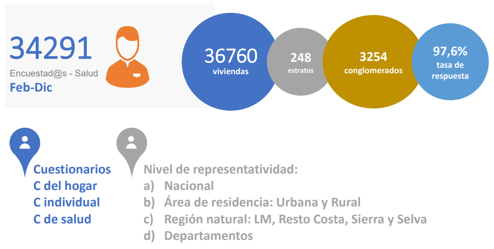
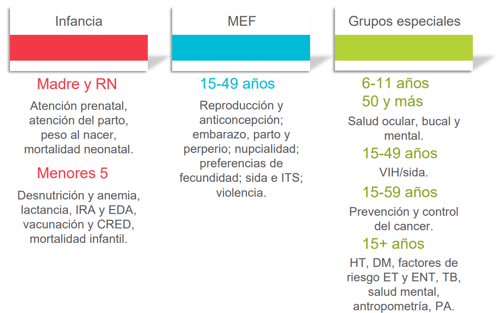
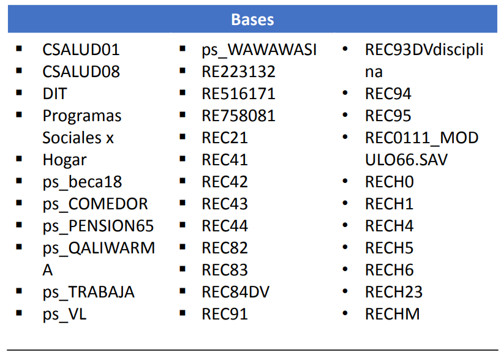

```{r echo = FALSE}
setwd("C:/Users/danfe/Dropbox/Proyectos Daniel/Cursos - diplomados - Maestrias/Programa de autoformación en investigación y análisis de datos/Rmarkdowns/Estadística/Programa de formación/Semana12 svy_ENDES")

knitr::opts_chunk$set(echo = TRUE, warning = FALSE, message = FALSE,
                         fig.show = "asis", results = "show",
                      fig.align='center',
                      fig.path = "figures/",  # Configura el directorio donde se guardan los gráficos
  dev = "png")
```

\newpage

# Conceptos básicos del análisis de datos de encuestas

## Estrategia de muestreo
Existen diferentes formas de muestrear poblaciones para encuestas. 

- Muestreo aleatorio simple (SRS): requiere un marco de muestreo completo (es decir, una lista total de hogares dentro de un campamento de refugiados o muestreo basado en GPS en un área conocida).

- Muestreo basado en conglomerados: se utiliza más comúnmente en combinación con muestreo proporcional al tamaño de la población en cada conglomerado.

- Muestras estratificadas: utiliza SRS o muestreo basado en conglomerados, pero en dos áreas administrativas diferentes para obtener estimaciones precisas de prevalencia para ellas.

## Tamaño de la muestra

Antes de implementar una encuesta, deberá calcular el tamaño de la muestra para esa encuesta. 

Al calcular el tamaño de la muestra para su encuesta, debe tener en cuenta los siguientes parámetros:

- Estimación de la prevalencia

- Efecto de diseño o coeficiente intraclase

- Precisión requerida alrededor de su estimación de prevalencia

### Estimación de la prevalencia
Deberá utilizar una estimación de la prevalencia/cobertura de su principal resultado de interés en su población a ser encuestada (prevalencia de desnutrición, cobertura de vacunación contra el sarampión, etc.). Utilizará literatura publicada o gris para determinar una estimación lógica de este parámetro.

El tamaño de muestra más grande que necesitará será el que se calcula utilizando una estimación de prevalencia del 50%. Cuanto más cerca del 0% o del 100% establezca su estimación de prevalencia, más pequeño será su tamaño de muestra. Por lo tanto, si no tiene idea de cuál es su estimación de prevalencia, intente usar el 50% y el tamaño de muestra más grande posible.

### Efecto de diseño
La forma más fácil de recordar el efecto de diseño (al que normalmente nos referimos como DEFF), es que es una medida de la variabilidad del resultado de interés dentro de sus conglomerados (si está realizando una encuesta basada en conglomerados) y entre sus conglomerados.

Cuanto mayor sea el DEFF, mayor será la variabilidad entre conglomerados y mayor será la probabilidad de que los sujetos dentro de un conglomerado sean similares.

En una encuesta bien diseñada, su objetivo será tener un DEFF calculado para su resultado de interés lo más cercano posible a 1. Esto se debe a que un DEFF de 1 significa que su diseño de encuesta se ha aproximado al Muestreo Aleatorio Simple (SRS) para su resultado de interés. SRS es el estándar de oro en el diseño de encuestas, pero a menudo no es posible. En general, en las encuestas de muestreo de conglomerados en dos etapas, asumimos un DEFF de 2.

Matemáticamente, el DEFF se calcula como:

DEFF=1+(1-n) * rho

donde n=tamaño de la muestra de su encuesta y rho=coeficiente intraclase

Cuando se analiza los datos de su encuesta, a menudo se recalcula el DEFF para los principales resultados de interés. Esto se debe a que el DEFF le dará una buena estimación de si el diseño de la encuesta y el enfoque de muestreo tenían sentido en su encuesta para su resultado de interés.

### Precisión alrededor de su estimación
La precisión alrededor de su estimación estipula qué tan cerca de su estimación le gustaría que caiga el intervalo de confianza del 95% de su estimación de prevalencia.

Por ejemplo: ha calculado una cobertura de vacunación contra el sarampión del 72% en su población de estudio. Le gustaría asegurarse de que el intervalo de confianza del 95% sea estrecho (entre 70-74%); por lo tanto, establecería su precisión en 2% (2% por encima y por debajo del 72%).

Cuanto menor sea su precisión, mayor será el cálculo de su tamaño de muestra.

Solo utiliza la estimación de la precisión cuando calcula un tamaño de muestra antes de su encuesta.

## Recolección de datos y bases de datos
Las plantillas asumen que los datos se habrán recopilado mediante la recolección de datos móviles o se habrán ingresado en una base de datos electrónica (Excel, Epi Data, Redcap, etc.).

Le recomendamos que intente establecer diccionarios de datos genéricos para la recolección de datos móviles (a través de cuestionarios de plantilla) o a través de bases de datos de plantilla. Esto mejorará la coherencia de la denominación de sus variables y facilitará el uso frecuente y sistemático de las Plantillas de Encuesta.


# Análisis en R

La mayoría de los paquetes R de encuestas se basan en el paquete survey para realizar análisis ponderados. Utilizaremos survey, así como srvyr (una envoltura para survey que permite la codificación al estilo tidyverse) y gtsummary (una envoltura para survey que permite obtener tablas listas para su publicación). 

**Cargar paquetes**
```{r}
# CRAN
# Install and load required packages for this template
pacman::p_load(
  knitr,       # create output docs
  here,        # find your files
  rio,         # for importing data
  janitor,     # clean/shape data
  dplyr,       # clean/shape data
  tidyr,       # clean/shape data
  forcats,     # manipulate and rearrange factors
  stringr,     # manipulate texts
  ggplot2,     # create plots and charts
  ggalluvial,  # for visualising population flows
  apyramid,    # plotting age pyramids
  sitrep,      # MSF field epi functions
  survey,      # for survey functions
  srvyr,       # dplyr wrapper for survey package
  gtsummary,   # produce tables
  flextable,   # for styling output tables
  labelled,    # add labels to variables
  matchmaker,  # recode datasets with dictionaries
  lubridate,   # working with dates
  parsedate,   # guessing dates
  DT           # interactive tables for this walkthrough
  )

# Github
pacman::p_load_gh(
  "r4epi/sitrep" # para el tiempo de observación / funciones de ponderación
  )

#remotes::install_version("fastmap", version = "1.2.0")
library(fastmap)

```


## Importación de la base

Importamos la base de datos con las respuestas de los hogares

```{r}
# Import the sheet containing household responses
survey_data_hh <- import("mortality_survey_data.xlsx", which = "Mortality Survey", na = "")

nrow(survey_data_hh)

```

visualizamos las primeras lineas

```{r, echo=FALSE}

DT::datatable(head(survey_data_hh, 25), rownames = FALSE, filter="top", options = list(pageLength = 10, scrollX=T), class = 'white-space: nowrap' )

```

Importamos la base de datos con las respuestas a snivel individual

```{r}
# import the sheet containing individual responses
survey_data_ind <- import("mortality_survey_data.xlsx", which = "hh_member", na = "")
nrow(survey_data_ind)

```

visualizamos las primeras lineas

```{r, echo=FALSE}
DT::datatable(head(survey_data_ind, 25), rownames = FALSE, filter="top", options = list(pageLength = 10, scrollX=T), class = 'white-space: nowrap' )
```


## Mergeo de las bases 

Habitualmente nos enfrentaremos a esta situación (tenemos los datos en más de una base de datos). Frente a ello tenemos que unir las bases de datos con los identificados (que pueden ser a nivel individual o de hogar)

__NOTA: las variables e identificadores son entregados normalmente en un archivo de diccionario de datos__

```{r}
# visualicemos los identificados

survey_data_ind %>% select(`_index`,`_parent_index`) %>% head(10) # 
survey_data_ind %>% select(`_index`,`_parent_index`) %>% tail(10) # 


# Merge
## join the individual and household data to form a complete data set
survey_data <- left_join(survey_data_hh, survey_data_ind, by = c("_index" = "_parent_index"))

```

visualizamos las primeras lineas

```{r, echo=FALSE}
DT::datatable(head(survey_data, 25),  options = list(pageLength = 10, scrollX=T), class = 'white-space: nowrap' )
```


## Consideración de la población de referencia

En caso estes realizando un estudio poblacional con muestreo complejo podrías añadir las caracteristicas de tu población para que las ponderaciones sean más exactas.

* crearemos una población ficticia (N=10000) de la que se muestre el porcentaje de grupos etarios por sexo de sus dos unicos departamentos

```{r}
population_data_age_district_a <- gen_population(total_pop = 10000, # set total population 
  groups      = c("0-2", "3-14", "15-29", "30-44", "45+"), # set groups
  proportions = c(0.0440, 0.1772, 0.0980, 0.1208, 0.15), # set proportions for each group
  strata      = c("Male", "Female")) %>%           # stratify by gender
  rename(age_group  = groups,                      # rename columns (NEW NAME = OLD NAME)
         sex        = strata,
         population = n) %>% 
  mutate(health_district = "Town A")           # add a column to identify region 


## generate population data by age groups in years for district B
population_data_age_district_b <- gen_population(total_pop = 10000, # set total population 
  groups      = c("0-2", "3-14", "15-29", "30-44", "45+"), # set groups
  proportions = c(0.0440, 0.1772, 0.0980, 0.1208, 0.15), # set proportions for each group
  strata      = c("Male", "Female")) %>%           # stratify by gender
  rename(age_group  = groups,                      # rename columns (NEW NAME = OLD NAME)
         sex        = strata,
         population = n) %>% 
  mutate(health_district = "Town B")           # add a column to identify region 


## bind region population data together to get overall population 
population_data_age <- bind_rows(population_data_age_district_a, 
                                 population_data_age_district_b)

print(population_data_age)

```

### Cluster counts

Podemos ver que hay 17 agrupaciones, de cada ciudad:  

```{r}
study_data_cleaned<- survey_data

study_data_cleaned <- rename(study_data_cleaned,
  health_district = location)

study_data_cleaned <- clean_names(study_data_cleaned)


study_data_cleaned %>% 
  tabyl(cluster_number, health_district)
```

El hecho de que haya conglomerados del 1 al 17 en cada una de las ciudades complicará los análisis posteriores (ya que un mismo numero de cluster se leerá para ambas ciudades). Cada conglomerado debe tener un valor de identificación único. Por tanto, creemos uno. Utilizamos la función `str_glue()` de {stringr} para combinar el número de conglomerado y la letra de la localidad. La letra de la localidad se extrae del nombre de la localidad utilizando `str_sub()`, que también es del paquete {stringr}. El -1 extrae la última letra del nombre del pueblo, y la coloca en el ID.  


```{r}
study_data_cleaned <- study_data_cleaned %>% 
  mutate(cluster_number_uid = str_glue(
    "{town_letter}_{cluster_number}",
    town_letter = str_sub(health_district, -1)))
```

verificamos

```{r}
study_data_cleaned %>% 
  tabyl(cluster_number_uid, health_district)
```

Ahora, nuestra tarea consiste en crear un *nuevo* marco de datos que contenga el número de hogares de cada agrupación. No se trata del número de hogares elegidos para ser entrevistados, sino del universo de *posibles* hogares que podrían haber sido elegidos en cada conglomerado.  

Para crear un *nuevo* marco de datos, la plantilla R Markdown utiliza la función `tibble()` para que usted introduzca manualmente los nombres de las agrupaciones y el número de hogares. A continuación, utilizamos una ligera adaptación para facilitar su uso: utilizamos la función `tribble()` (nótese la "r") para poder escribir esta información en "filas" que parecen un marco de datos normal. Observe cómo las columnas se especifican en la parte superior con tildes (~).  

```{r cluster_counts}

cluster_counts <- tribble(
  ~cluster, ~households,
  "A_1",     100,
  "A_2", 100, 
  "A_3", 100, 
  "A_4", 100,
  "A_5", 100,
  "A_6", 100, 
  "A_7", 100,
  "A_8", 100, 
  "A_9", 100, 
  "A_10", 100, 
  "A_11", 100, 
  "A_12", 100, 
  "A_13", 100,
  "A_14", 100, 
  "A_15", 100, 
  "A_16", 100, 
  "A_17", 100, 
  
  "B_1", 100,
  "B_2", 100, 
  "B_3", 100, 
  "B_4", 100,
  "B_5", 100,
  "B_6", 100, 
  "B_7", 100,
  "B_8", 100, 
  "B_9", 100, 
  "B_10", 100, 
  "B_11", 100, 
  "B_12", 100, 
  "B_13", 100,
  "B_14", 100, 
  "B_15", 100, 
  "B_16", 100, 
  "B_17", 100)

cluster_counts
```


## Limpieza de datos

Revisar unidad de limpieza de datos para entender esta parte. Para abordar el tema de análisis de datos provenientes de muestreo complejo pasa a la sección de **Pesos muestrales**

### Renombramos variables

```{r}
# Creamos copia de la base
study_data_cleaned<- survey_data

# renombramos
study_data_cleaned <- rename(study_data_cleaned,
  # pattern is NEW name = OLD name
  uid = `_index.y`,
  consent = household_consents_to_particip,
  age_years = age_in_years,       
  age_months = age_in_months,
  date_arrived = doa,
  date_birth = dob,
  date_left = dod,
  date_death = dodeath,
  member_number = no_household
  )

```

```{r}
study_data_cleaned <- rename(study_data_cleaned,
  health_district = location)


study_data_cleaned <- study_data_cleaned %>% 
  mutate(cluster_number_uid = str_glue(
    "{town_letter}_{cluster_number}",
    town_letter = str_sub(health_district, -1)))


```

Formatemos los nombres de las variables a nombres mas legibles

```{r}
## define clean variable names using clean_names from the janitor package. 
study_data_cleaned <- clean_names(study_data_cleaned)
```

### Normalizar fechas

El objetivo con este trozo de código es convertir todas las columnas de fecha a la clase Date para que R pueda manejarlas correctamente. 

Para convertir las fechas a la clase "Date" utilizamos la función `parse_date()` del paquete {parsedate}. Esta función no asume un formato estándar para las fechas, y evalúa cada celda del marco de datos individualmente, utilizando adivinanzas inteligentes para decidir si la fecha está escrita como Mes-Día-Año, Día-Mes-Año, o Año-Mes-Día, etc.

El resultado de `parse_date()` es en realidad de clase "POSIXct" (un tipo específico de clase de fecha), por lo que el resultado se pasa a `as.Date()` para convertirlo en una clase que sea más fácilmente aceptada por las funciones posteriores.  

```{r}
# use the parse_date() function to make a first pass at date variables.
# parse_date() produces a complicated format - so we use as.Date() to simplify
study_data_cleaned <- study_data_cleaned %>%
  mutate(
    across(.cols = matches("date|Date"),
           .fns  = ~parsedate::parse_date(.x) %>% as.Date()))

```

### Definir periodo de retirada

La siguiente sección de código a ejecutar define el "periodo de retirada".  

En esta ejemplo, el periodo de recuperación es del 15 de julio de 2020 al 15 de julio de 2021, porque así se indica en las preguntas del diccionario de datos sobre llegadas, salidas, nacimientos y defunciones. *Por lo tanto, ajustamos el código para que para cada entrada en `study_data_cleaned` utilice `as.Date("2020-07-15)` como valor en la nueva columna `recall_start`, y utilice `as.Date("2021-07-15")` como valor en la nueva columna `recall_end`.  

```{r}
## set the start/end of recall period
## can be changed to date variables from dataset 
## (e.g. arrival date & date questionnaire)
study_data_cleaned <- study_data_cleaned %>% 
  mutate(recall_start = as.Date("2020-07-15"),  
         recall_end   = as.Date("2021-07-15")   
  )
```

### Creamos los grupos etarios

La información sobre la edad se distribuye en dos columnas: `edad_años` y `edad_meses`.


Lamentablemente, los valores de estas columnas han sido interpretados por R como clase "carácter" (palabras), y no como números.  

```{r}
class(study_data_cleaned$age_years)
class(study_data_cleaned$age_months)

```

También podemos revisar el conjunto de datos y ver que si la edad de los encuestados es inferior a 1 año, los meses aparecen en la columna `age_months`, pero el valor de `age_years` es `NA` (falta). En este caso, necesitaremos que la columna `age_years` tenga el valor `0` para los cálculos posteriores. Por lo tanto, escribimos y ejecutamos el siguiente comando:  


```{r}
study_data_cleaned <- study_data_cleaned %>% 
  
  # convert both columns to class integer
  mutate(age_years = as.integer(age_years),
         age_months = as.integer(age_months)) %>%
  
  # convert age_years to 0 if age_months is less than 12
  mutate(age_years = case_when(
    age_months < 12 ~ as.integer(0),    # if age is less than 12 months, put 0
    TRUE            ~ age_years         # otherwise, leave as age_years value
  ))

```


Ahora podemos ejecutar los comandos siguientes tal y como están escritos, para crear columnas de grupos de edad que reflejen años y meses.  

El primer comando utiliza `mutate()` para crear una columna llamada `age_group`, utilizando la función `age_categories()` del paquete {sitrep}. Esta función puede funcionar de varias maneras, pero nosotros proporcionamos una lista de valores de punto de ruptura ("breakers") para nuestros grupos de edad.  

```{r}
## crear una variable de grupo de edad especificando rupturas categóricas (de años)

study_data_cleaned <- study_data_cleaned %>% 
  mutate(age_group = age_categories(age_years, 
                                    breakers = c(0, 3, 15, 30, 45)
                                    ))
```


El segundo comando de la plantilla es muy similar al primero, pero examina la columna `edad_meses` y comprueba si la edad en meses es inferior a 12. En caso afirmativo, aplica el mismo `grupo_edad`. En caso afirmativo, aplica la misma función `age_categories()` pero utiliza puntos de ruptura más relevantes para los valores de los meses (por ejemplo, 6 meses, 9 meses y 12 meses). Si el valor de `age_months` es superior a 12, se sustituye por missing.  

```{r}
## create age group variable for under 2 years based on months
study_data_cleaned <- study_data_cleaned %>% 
  mutate(age_group_mon = if_else(
    ## if months <= 12 then calculated age groups 
    age_months <= 12, 
    age_categories(study_data_cleaned$age_months, 
                                        breakers = c(0, 6, 9, 12), 
                                        ceiling = TRUE), 
    ## otherwise set new variable to missing
    factor(NA)))
```

Finalmente, ejecutamos el último comando de este chunk que crea una columna `age_category` que combina las agrupaciones de años y las agrupaciones de meses en una columna, con un orden especificado.  

```{r}
## para combinar diferentes categorias de edad usa la siguiente funcion 
## esto da prioridad a la unidad más pequeña, es decir:
## ordenará tu categoría_edad de menor a mayor unidad 
## es decir, primero los días, luego los meses y por último los años (dependiendo de los que se indiquen)

study_data_cleaned <- group_age_categories(study_data_cleaned, 
                                           years  = age_group,
                                           months = age_group_mon)
```


Podemos ver esta ordenación si ejecutamos una tabla rápida de la nueva columna:

```{r}
study_data_cleaned %>% 
  tabyl(age_category) %>% 
  adorn_pct_formatting()
```
### Utilizando un diccionario de datos para recodificar

Los conjuntos de datos de este ejemplo ya utilizan los valores depurados, según su diccionario de datos. Por ejemplo, la ciudad se registra como "Ciudad A" o "Ciudad B", no como ciudad_a y ciudad_b. 

Si su conjunto de datos contiene valores "sin procesar", sin limpiar o sin formato de visualización, puede recodificarlos utilizando el diccionario de datos.

¿Cómo?

Por ejemplo, en el diccionario de datos (`study_data_dict`) podemos ver que la columna `option_name` contiene valores como `diarrhoea` y `respiratory_infection` para la variable de causa de muerte. En cambio, la etiqueta `option_label` contiene los valores de visualización "Diarrhoea" y "Respiratory infection".  

Un comando como el siguiente revisaría todos los valores de opción brutos a su versión de etiqueta de visualización, en todo el conjunto de datos. La función `match_df()` acepta el nombre de nuestro marco de datos, y el diccionario, las columnas en el diccionario de datos para guiar la conversión de valores (`de = ` y `a = `). Tenga en cuenta que si se proporciona en el diccionario de datos, también podría ejecutar el código con `to = "option_label_french"` para convertir los valores al francés.  

De nuevo, no es necesario ejecutar este código para esta viñeta porque los valores ya están en formato de visualización.  

```{r}
# veamos el contenido de las columnas del diccionario que usaremos

study_data_dict <- msf_dict_survey(name = "mortality_survey_dict.xlsx",
                            template = FALSE, 
                            compact = FALSE)


```

```{r, echo=FALSE}

study_data_dict2 <- study_data_dict %>%  
  select(name, option_name, option_label, option_order_in_set)

DT::datatable(head(study_data_dict2, 40),  options = list(pageLength = 20, scrollX=T), class = 'white-space: nowrap' )
```


```{r, eval=FALSE}
## recode values with matchmaker package (value labels cant be used for analysis) 
study_data_cleaned <- match_df(study_data_cleaned, 
         study_data_dict, 
         from = "option_name", 
         to = "option_label", 
         by = "name", 
         order = "option_order_in_set")
```

### Limpiar variables factoriales

En R, los factores son una clase de columna que indica una variable ordinal, es decir, una variable con valores que deberían tener un orden intrínseco. 

El primer código R se ocupa de la columna llamada `consent`, que está presente en nuestro conjunto de datos. el código la convierte de "Sí" o "No" a `TRUE` o `FALSE`. Esto lo hace aprovechando un comportamiento de la función `mutate()`, que si se proporciona una declaración lógica (`consent == "Yes"`) entonces devolverá `TRUE` o `FALSE`.  

```{r}
study_data_cleaned <- study_data_cleaned %>% 
  mutate(consent = consent == "Yes")
```

Este cambio también se aplica a la columna `died`:

```{r}
study_data_cleaned <- study_data_cleaned %>% 
  mutate(died = died == "Yes")
```


Para las filas en las que es posible, necesitamos calcular el tiempo de observación. Existen varias funciones de ayuda para ello:  

* `find_start_date()` a continuación se configura para buscar en las columnas `date_birth` (más importante) y `date_arrived` (importancia secundaria) fechas dentro de las restricciones de las columnas `recall_start` y `recall_end`. La función creará las nuevas columnas `startdate` y `startcause`.  

* `find_end_date()` realiza una acción similar pero para las fechas de las columnas `date_left` y `date_death`, creando las columnas `enddate` y `endcause`.  


```{r}

## create new variables for start and end dates/causes
study_data_cleaned <- study_data_cleaned %>%
  ## choose earliest date entered in survey
  ## from births, household arrivals, and camp arrivals 
  find_start_date("date_birth",
                  "date_arrived",
                  "recall_start",
                  period_start = "recall_start",
                  period_end   = "recall_end",
                  datecol      = "startdate",
                  datereason   = "startcause" 
                 ) %>%
  ## choose latest date entered in survey
  ## from camp departures, death and end of the study
  find_end_date("date_left",
                "date_death",
                "recall_end",
                period_start = "recall_start",
                period_end   = "recall_end",
                datecol      = "enddate",
                datereason   = "endcause" 
               ) %>%
  ## label those that were present at the start/end (except births/deaths)
  mutate(startcause = if_else(startdate == recall_start & startcause != "birthday_date",
                              "Present at start", startcause)) %>%
  mutate(endcause = if_else(enddate == recall_end & endcause != "death_date", 
                            "Present at end", endcause))
```

Estas funciones `fct_recode()` cambian los valores de estas columnas "causa" para que sean más legibles.  

```{r}
## fix factor levels -----------------------------------------------------------

## make sure there are the appropriate levels (names)
study_data_cleaned$startcause <- fct_recode(study_data_cleaned$startcause,
                                            "Present at start" = "Present at start",
                                            "Born" = "date_birth",
                                            "Other arrival" = "date_arrived"
                                           )

## make sure there are the appropriate levels (names)
study_data_cleaned$endcause <- fct_recode(study_data_cleaned$endcause,
                                          "Present at end" = "Present at end",
                                          "Died" = "date_death",
                                          "Other departure" = "date_left")
```

Este comando `mutate()` crea la columna `obstime` que es el número de días entre las fechas de inicio y fin de cada individuo.  


```{r}
## Definir el tiempo de observación en días
study_data_cleaned <- study_data_cleaned %>% 
  mutate(obstime = as.numeric(enddate - startdate))

```

La ejecución de algunas estadísticas de resumen en estos datos muestra que la mayoría de las filas no tenían nacimientos ni muertes, por lo que su tiempo de observación volvió al valor predeterminado del periodo de recuerdo (1 año).  

```{r}
summary(study_data_cleaned$obstime)
```
### Etiquetado de columnas  

Anteriormente, utilizamos el paquete {matchmaker} para limpiar los *valores* de las columnas, utilizando el diccionario de datos. En este trozo, utilizamos el paquete {labelled} para asignar etiquetas a los *nombres de las columnas (encabezados)*, de forma que al imprimirlas muestren nombres con espacios y otro formato legible por humanos.  

Utilizaremos el código para el etiquetado manual, porque hemos ajustado los nombres de nuestras columnas para que ya no coincidan con nuestro diccionario de datos.  


```{r}
## it is possible to update individual variables manually too
study_data_cleaned <- study_data_cleaned %>% 
  set_variable_labels(
    ## variable name = variable label 
    age_years     = "Age (years)",
    age_group     = "Age group (years)",
    age_months    = "Age (months)", 
    age_group_mon = "Age group (months)",
    age_category  = "Age category", 
    died          = "Died", 
    startcause    = "Observation start", 
    endcause      = "Observation end"
    )
```

### Eliminar datos no utilizados  

Este fragmento contiene código para eliminar y examinar filas para las que no hay consentimiento, faltan fechas de inicio o fin, el nombre del pueblo (ciudad A o B) es "Otro", falta la edad o falta el sexo. Estas filas se guardan primero como "descartadas". Esto le permite inspeccionarlas antes de eliminarlas.

En el segundo comando, se utiliza `anti_join()` para eliminar las filas de `study_data_cleaned`. Un anti join es un "filtering join" que busca en el marco de datos `dropped` y deja sólo las filas en `study_data_cleaned` que *no* están presentes en `dropped`. Es una manera elegante de hacer un filtro, pero que le permite la oportunidad de inspeccionar las filas en primer lugar.  


```{r}
## store the cases that you drop so you can describe them (e.g. non-consenting 
## or wrong village/cluster)
dropped <- study_data_cleaned %>% 
  filter(!consent | is.na(startdate) | is.na(enddate) | 
           ## note that whatever you use for weights cannot be missing!
           is.na(health_district) | is.na(age_years) | is.na(sex))

## use the dropped cases to remove the unused rows from the survey data set  
study_data_cleaned <- anti_join(study_data_cleaned, dropped, by = names(dropped))
```

veamos el número de  filas eliminadas
```{r}
nrow(dropped)
```

### Eliminar duplicados  

En este fragmento de código, se ofrece una orden sencilla de deduplicación utilizando la función `distinct()`. En este ejemplo, para cualquier fila que tenga idénticos `uid`, `sex`, AND `age_group`, sólo se conserva la primera fila. El parámetro `.keep_all = TRUE` se refiere a las *columnas* y garantiza que se conservan todas las columnas, no sólo las que se utilizaron para evaluar los duplicados.  


```{r}
## option 1: only keep the first occurrence of duplicate case 
study_data_cleaned <- study_data_cleaned %>% 
  ## find duplicates based on case number, sex and age group 
  ## only keep the first occurrence 
  distinct(uid, sex, age_group, .keep_all = TRUE)
  
```

## Pesos muestrales

Estos datos proceden de una encuesta que uso muestreo bietapico (por estratos y luego por conglomerados), como disponemos de recuentos de población por edad y sexo, podemos hacer ajustes para reflejar mejor la población y, por tanto, producir estimaciones estratificadas por edad y sexo (generamos la ponderación). 


```{r}

## create a variable called "surv_weight_strata" 
## contains weights for each individual - by age group, sex and health district
study_data_cleaned <- add_weights_strata(x = study_data_cleaned, 
                                         p = population_data_age, 
                                         surv_weight = "surv_weight_strata",
                                         surv_weight_ID = "surv_weight_ID_strata",
                                         age_group, sex, health_district)
```


En el segundo conjunto de comandos:  

* Se hace referencia al marco de datos `cluster_counts`, que creamos en un paso anterior. Los argumentos que terminan con `_cl` deben hacer referencia a columnas de este marco de datos. Utilice la documentación de ayuda de esta función ejecutando `?add_weights_cluster`.  


```{r}
## cluster ---------------------------------------------------------------------

## get the number of individuals interviewed per household 
## adds a variable with counts of the household (parent) index variable
study_data_cleaned <- study_data_cleaned %>% 
  add_count(index, name = "interviewed")

study_data_cleaned <- study_data_cleaned %>% 
  mutate(member_number = as.numeric(member_number))


## create cluster weights 
study_data_cleaned <- add_weights_cluster(x = study_data_cleaned, 
                                          cl = cluster_counts, 
                                          eligible = member_number, 
                                          interviewed = interviewed, 
                                          cluster_x = cluster_number_uid, 
                                          cluster_cl = cluster, 
                                          household_x = id, 
                                          household_cl = households, 
                                          surv_weight = "surv_weight_cluster", 
                                          surv_weight_ID = "surv_weight_ID_cluster", 
                                          ignore_cluster = FALSE, 
                                          ignore_household = FALSE)

## stratified and cluster ------------------------------------------------------

## create a survey weight for cluster and strata 
study_data_cleaned <- study_data_cleaned %>% 
  mutate(surv_weight_cluster_strata = surv_weight_strata * surv_weight_cluster)
```


```{r, echo=FALSE}

study_data_cleaned2 <- study_data_cleaned %>%  
  select(health_district, cluster_number, household_number, surv_weight_ID_strata, surv_weight_strata, interviewed, surv_weight_cluster, surv_weight_ID_cluster, surv_weight_cluster_strata)

DT::datatable(head(study_data_cleaned2, 40),  options = list(pageLength = 10, scrollX=T), class = 'white-space: nowrap' )
```

## Diseño de la encuesta

Crea un objeto de encuesta de acuerdo con el diseño de tu estudio. Se utiliza de la misma manera que los dataframes para calcular las proporciones ponderadas, etc. Asegúrate que todas las variables necesarias están creadas antes de esto.

Hay cuatro opciones, comenta las que no utilizas: - Aleatorio simple - Estratificado - Conglomerado - Conglomerado estratificado

Para esta plantilla, supondremos que agrupamos las encuestas en dos estratos distintos (distritos sanitarios A y B). Por lo tanto, para obtener las estimaciones globales necesitamos haber combinado las ponderaciones de los grupos y de los estratos.

Como se ha mencionado anteriormente, hay dos paquetes disponibles para hacer esto. El clásico es survey y luego hay un paquete envolvente llamado srvyr que hace objetos y funciones amigables con tidyverse. Mostraremos ambos, pero ten en cuenta que la mayor parte del código de este capítulo utilizará objetos basados en srvyr. La única excepción es que el paquete gtsummary sólo acepta objetos de survey.

**Paquete survey**
El paquete survey utiliza efectivamente la codificación de R base, por lo que no es posible utilizar pipes (%>%) u otra sintaxis de dplyr. Con el paquete de survey utilizamos la función svydesign() para definir un objeto de encuesta con clusters, pesos y estratos adecuados.

NOTA: necesitamos utilizar la tilde (~) delante de las variables, esto es porque el paquete utiliza la sintaxis de R base de asignación de variables basadas en fórmulas.

En el siguiente trozo, se deja las diferentes opciones para setear las ponderaciones de acuerdo a la estrategia de muestreo, para nuestro ejemplo utilizamos sólo el código "cluster estratificado":  


```{r, eval=FALSE}
# Metodo 1

# aleatorio simple  ---------------------------------------------------------------
base_survey_design_simple <- svydesign(ids = ~1, # 1 para cluster sin ids
                   weights = NULL,               # no se añade peso
                   strata = NULL,                # el muestreo fue simple (sin estratos)
                   data = survey_data            # hay que especificar los datos
                  )

## estratificado  ------------------------------------------------------------------
base_survey_design_strata <- svydesign(ids = ~1,  # 1 para cluster sin ids
                   weights = ~surv_weight_strata, # variable de peso creada anteriormente
                   strata = ~health_district,     # el muestreo se estratificó por distrito
                   data = survey_data             # hay que especificar los datos
                  )

# cluster ---------------------------------------------------------------------
base_survey_design_cluster <- svydesign(ids = ~village_name, # ids de cluster
                   weights = ~surv_weight_cluster,           # variable de peso creada anteriormente
                   strata = NULL,                            # el muestreo fue simple (sin estratos)
                   data = survey_data                        # hay que especificar los datos
                  )

# cluster estratificado  ----------------------------------------------------------
base_survey_design <- svydesign(ids = ~village_name,      # ids de cluster
                   weights = ~surv_weight_cluster_strata, # variable de peso creada anteriormente
                   strata = ~health_district,             # el muestreo se estratificó por distrito
                   data = survey_data                     # hay que especificar los datos
                  )
```


**Paquete Srvyr**
Con el paquete srvyr podemos utilizar la función as_survey_design(), que tiene los mismos argumentos que la anterior pero permite los pipes (%>%), por lo que no es necesario utilizar la tilde (~).

```{r eval=FALSE}
# aleatorio simple ---------------------------------------------------------------
survey_design_simple <- survey_data %>% 
  as_survey_design(ids = 1, # 1 para cluster sin ids 
                   weights = NULL, # no se añade peso
                   strata = NULL # el muestreo fue simple (sin estratos)
                  )
## estratificado ------------------------------------------------------------------
survey_design_strata <- survey_data %>%
  as_survey_design(ids = 1, # 1 para cluster sin ids
                   weights = surv_weight_strata, # variable de peso creada anteriormente
                   strata = health_district # el muestreo se estratificó por distrito
                  )
## cluster ---------------------------------------------------------------------
survey_design_cluster <- survey_data %>%
  as_survey_design(ids = village_name, # ids de cluster
                   weights = surv_weight_cluster, # variable de peso creada anteriormente
                   strata = NULL # el muestreo fue simple (sin estratos)
                  )

# cluster estratificado ----------------------------------------------------------
survey_design <- survey_data %>%
  as_survey_design(ids = village_name, # ids de cluster
                   weights = surv_weight_cluster_strata, # variable de peso creada anteriormente
                   strata = health_district # el muestreo se estratificó por distrito
                  )
```
En nuestro ejemplo el que utilizaremos será este último 

```{r }
# cluster estratificado ----------------------------------------------------------
survey_design <- study_data_cleaned %>% 
  as_survey_design(ids = cluster_number_uid, # cluster ids 
                   weights = surv_weight_cluster_strata, # weight variable created above 
                   strata = health_district # sampling was stratified by district
                  )

```


## Análisis descriptivo

En general, debes considerar incluir los siguientes análisis descriptivos:

1. Número final de agrupaciones, hogares e individuos incluidos

2. Número de personas excluidas y motivos de la exclusión

3. Mediana (rango) del número de hogares por grupo y de individuos por hogar


Ejecuta esto para obtener dicha información.

```{r inclusion_counts}

## get counts of number of clusters 
num_clus <- study_data_cleaned %>%
  ## trim data to unique clusters
  distinct(cluster_number_uid) %>% 
  ## get number of rows (count how many unique)
  nrow()

num_clus

## get counts of number households 
num_hh <- study_data_cleaned %>% 
  ## get unique houses by cluster
  distinct(cluster_number, id) %>% 
  ## get number of rounds (count how many unique)
  nrow()

num_hh
```


El texto dinámico del informe será el siguiente:  

Hemos incluido `r num_hh` hogares en `r num_clus` agrupaciones en este análisis de la encuesta. 


Entre los `r nrow(dropped)` individuos excluidos del análisis de la encuesta, 
Se excluyeron los individuos de `r fmt_count(dropped, consent)` debido a que faltaban las fechas de inicio o finalización y a que faltaban las fechas de inicio o finalización. 
de inicio o finalización y `r fmt_count(dropped, !consent)` se excluyeron 
por falta de consentimiento. Los motivos de la falta de consentimiento se muestran a continuación. 

En nuestro conjunto de datos, no se recogió el motivo de la denegación, por lo que la siguiente sección no es relevante.  


```{r cluster_hh_size}

## get counts of the number of households per cluster
clustersize <- study_data_cleaned %>% 
  ## trim data to only unique households within each cluster
  distinct(cluster_number_uid, id) %>%
  ## count the number of households within each cluster
  count(cluster_number_uid) %>% 
  pull(n)

clustersize

## get the median number of households per cluster
clustermed <- median(clustersize)

clustermed

## get the min and max number of households per cluster
## paste these together seperated by a dash 
clusterrange <- str_c(range(clustersize), collapse = "--")

clusterrange

## get counts of children per household 
## do this by cluster as household IDs are only unique within clusters
hhsize <- study_data_cleaned %>% 
  count(cluster_number_uid, id) %>%
  pull(n) 
## get median number of children per household
hhmed <- median(hhsize)
hhmed
## get the min and max number of children per household
## paste these together seperated by a dash 
hhrange <- str_c(range(hhsize), collapse = "--")
hhrange
## get standard deviation 
hhsd <- round(sd(hhsize), digits = 1)
hhsd
```


La mediana del número de hogares por agrupación fue de
r clustermed`, con un rango de `r clusterrange`. La mediana del número de niños
por hogar era `r hhmed` (rango: `r hhrange`, desviación estandar: `r hhsd`). 


## Sesgo de muestreo

En este apartado nos centraremos en cómo investigar el sesgo de la muestra y visualizarlo. 

Compara las proporciones de cada grupo de edad entre tu muestra y la población de origen. Esto es importante para poder resaltar el posible sesgo de muestreo. También puedes repetir esta operación para ver las distribuciones por sexo.

Ten en cuenta que estos valores-p son sólo indicativos, y que una discusión descriptiva (o la visualización con las pirámides de edad que aparecen a continuación) de las distribuciones en tu muestra de estudio en comparación con la población de origen es más importante que la prueba binomial en sí. Esto se debe a que el aumento del tamaño de la muestra suele dar lugar a diferencias que pueden ser irrelevantes después de ponderar los datos.


```{r descriptive_sampling_bias, warning = FALSE}
## counts and props of the study population
ag <- tabyl(study_data_cleaned, age_group, show_na = FALSE) %>% 
  mutate(n_total = sum(n), 
         age_group = fct_inorder(age_group))

ag

## counts and props of the source population
propcount <- population_data_age %>% 
  group_by(age_group) %>%
    tally(population) %>%
    mutate(percent = n / sum(n))

## bind together the columns of two tables, group by age, and perform a 
## binomial test to see if n/total is significantly different from population
## proportion.
  ## suffix here adds to text to the end of columns in each of the two datasets
left_join(ag, propcount, by = "age_group", suffix = c("", "_pop")) %>%
  group_by(age_group) %>%

  ## broom::tidy(binom.test()) makes a data frame out of the binomial test and
  ## will add the variables p.value, parameter, conf.low, conf.high, method, and
  ## alternative. We will only use p.value here. You can include other
  ## columns if you want to report confidence intervals
  mutate(binom = list(broom::tidy(binom.test(n, n_total, percent_pop)))) %>%
  unnest(cols = c(binom)) %>% # important for expanding the binom.test data frame
  mutate(
    across(.cols = contains("percent"), 
            .fns = ~.x * 100)) %>%

  ## Adjusting the p-values to correct for false positives 
  ## (because testing multiple age groups). This will only make 
  ## a difference if you have many age categories
  mutate(p.value = p.adjust(p.value, method = "holm")) %>%
                      
  ## Only show p-values over 0.001 (those under report as <0.001)
  mutate(p.value = ifelse(p.value < 0.001, "<0.001", as.character(round(p.value, 3)))) %>%

  ## rename the columns appropriately
  select(
    "Age group" = age_group,
    "Study population (n)" = n,
    "Study population (%)" = percent,
    "Source population (n)" = n_pop,
    "Source population (%)" = percent_pop,
    "P-value" = p.value
  ) %>%
  # produce styled output table with auto-adjusted column widths with {flextable}
  qflextable() %>% 
  # make header text bold (using {flextable})
  bold(part = "header") %>% 
  # make your table fit to the maximum width of the word document
  set_table_properties(layout = "autofit") %>% 
  ## set to only show 1 decimal place 
  colformat_double(digits = 1)
```
Podemos observar que los porcentajes de la muestra (primeras dos columnas) son diferentes a la de la población de la que proviene la muestra (columnas 3 y 4). Comprobamos que la muestra esta sesgada.

**Pirámides demográficas**

Las pirámides demográficas (o de edad y sexo) son una forma sencilla de visualizar la distribución de la población de la encuesta. También vale la pena considerar la creación de tablas descriptivas de edad y sexo por estratos de la encuesta. Demostraremos el uso del paquete apyramid, ya que permite las proporciones ponderadas utilizando nuestro objeto de diseño de la encuesta creado anteriormente.También utilizaremos una función envolvente de sitrep llamada age_pyramid() que ahorra algunas líneas de codificación para producir un gráfico con proporciones.

```{r median_age_sex_ratios}
## compute the median age 
medage <- median(study_data_cleaned$age_years)
## paste the lower and upper quartile together
iqr <- str_c(  # basically copy paste together the following
  ## calculate the 25% and 75% of distribution, with missings removed
  quantile(     
    study_data_cleaned$age_years, 
    probs = c(0.25, 0.75), 
    na.rm = TRUE), 
  ## between lower and upper place an en-dash
  collapse = "--")

medage

## compute overall sex ratio 
sex_ratio <- study_data_cleaned %>% 
  count(sex) %>% 
  pivot_wider(names_from = sex, values_from = n) %>%
  mutate(ratio = round(Male/Female, digits = 1)) %>%
  pull(ratio)

sex_ratio

## compute sex ratios by age group 
sex_ratio_age <- study_data_cleaned %>% 
  count(age_group, sex) %>% 
  pivot_wider(names_from = sex, values_from = n) %>%
  mutate(ratio = round(Male/Female, digits = 1)) %>%
  select(age_group, ratio)

sex_ratio_age

## sort table by ascending ratio then select the lowest (first)
min_sex_ratio_age <- arrange(sex_ratio_age, ratio) %>% slice(1)

min_sex_ratio_age
```


El párrafo tendrá ahora este aspecto:  


Entre los individuos encuestados `r nrow(study_data_cleaned)`, había 
`r fmt_count(study_data_cleaned, sex == "Female")` mujeres y 
`r fmt_count(study_data_cleaned, sex == "Male")` hombres (sin ponderar). La proporción
femenina era `r sex_ratio` en la población encuestada. La proporción más baja entre hombres y
femenina fue `r min_sex_ratio_age$ratio` en la población encuestada. 
grupo de edad `r min_sex_ratio_age$group`.
La mediana de edad de las personas encuestadas era `r medage` años (Q1-Q3 de `r iqr`
años). Los niños menores de cinco años constituían 
r fmt_count(study_data_cleaned, age_years < 5)`de los encuestados.
El mayor número de individuos encuestados (sin ponderar) se encontraba en el grupo de edad de 
`r table(study_data_cleaned$age_group) %>% which.max() %>% names()`.
grupo de edad.


```{r describe_by_age_group_and_sex}

# get cross tabulated counts and proportions
study_data_cleaned %>% 
  tbl_cross( 
    row = age_group, 
    col = sex, 
    percent = "cell") %>% 
  ## make variable names bold 
  bold_labels() %>% 
  # change to flextable format
  as_flex_table() %>%
  # make header text bold (using {flextable})
  bold(part = "header") %>% 
  # make your table fit to the maximum width of the word document
  set_table_properties(layout = "autofit")
```


```{r describe_by_age_category_and_sex}

# get cross tabulated counts and proportions
study_data_cleaned %>% 
  tbl_cross( 
    row = age_category, 
    col = sex, 
    percent = "cell") %>% 
  ## make variable names bold 
  bold_labels() %>% 
  # change to flextable format
  as_flex_table() %>%
  # make header text bold (using {flextable})
  bold(part = "header") %>% 
  # make your table fit to the maximum width of the word document
  set_table_properties(layout = "autofit")
```


Al igual que con el test binomial formal de la diferencia, vista anteriormente en la sección de sesgo de muestreo, aquí estamos interesados en visualizar si nuestra población muestreada es sustancialmente diferente de la población de origen y si la ponderación corrige esta diferencia. Para ello, utilizaremos el paquete patchwork para mostrar nuestras visualizaciones ggplot una al lado de la otra. Visualizaremos nuestra población de origen, nuestra población de encuesta no ponderada y nuestra población de encuesta ponderada. También puedes considerar la posibilidad de visualizar por cada estrato de tu encuesta - en nuestro ejemplo aquí sería utilizando el argumento stack_by = "health_district" (ver ?plot_age_pyramid para más detalles).

NOTA: Los ejes-x e y están invertidos en las pirámides


```{r age_pyramid, warning=FALSE}

## define los límites y etiquetas del eje-x ---------------------------------------------
## (actualiza estos números para que sean los valores del gráfico)
max_prop <- 35      ## elige la proporción más alta que se quiere mostrar 
step <- 5           # elige el espacio que se desea entre etiquetas

## esta parte define el vector usando los números anteriores con saltos de eje
breaks <- c(
    seq(max_prop/100 * -1, 0 - step/100, step/100), 
    0, 
    seq(0 + step / 100, max_prop/100, step/100)
    )

## esta parte define el vector usando los números anteriores con los límites del eje
limits <- c(max_prop/100 * -1, max_prop/100)

## esta parte define el vector usando los números anteriores con las etiquetas de los ejes
labels <-  c(
      seq(max_prop, step, -step), 
      0, 
      seq(step, max_prop, step)
    )


## crear gráficos individualmente   --------------------------------------------------

## representar la población de origen 
## nota: esto necesita estar colapsado para la población total (es decir, eliminando los distritos sanitarios)
source_population <- population_data_age %>%
  ## asegurar que la edad y el sexo son factores
  mutate(age_group = factor(age_group, 
                            levels = c("0-2", 
                                       "3-14", 
                                       "15-29",
                                       "30-44", 
                                       "45+")), 
         sex = factor(sex)) %>% 
  group_by(age_group, sex) %>% 
  ## sumar los recuentos de cada distrito sanitario 
  summarise(population = sum(population)) %>% 
  ## eliminar la agrupación para poder calcular la proporción global
  ungroup() %>% 
  mutate(proportion = population / sum(population)) %>% 
  ## representar la pirámide 
  age_pyramid(
            age_group = age_group, 
            split_by = sex, 
            count = proportion, 
            proportional = TRUE) +
  ## mostrar sólo la etiqueta del eje-y (por lo demás se repite en los tres gráficos)
  labs(title = "población de origen", 
       y = "", 
       x = "Age group (years)") + 
    theme_bw()+
  ## hacer que el eje-x sea el mismo para todos los gráficos 
  scale_y_continuous(breaks = breaks, 
    limits = limits, 
    labels = labels)
  


#### dibujar la población de la muestra no ponderada
sample_population <- age_pyramid(study_data_cleaned, 
            age_group, 
            split_by = sex, 
            proportional = TRUE) + 
  ## mostrar sólo la etiqueta del eje-y (por lo demás se repite en los tres gráficos)
  labs(title = "muestra no ponderada", 
       y = "", 
       x = "Age group (years)") + 
  theme_bw()+
  ## hacer que el eje-x sea el mismo para todos los gráficos 
  scale_y_continuous(breaks = breaks, 
    limits = limits, 
    labels = labels)


## dibujar la población de la muestra ponderada 
weighted_population <- age_pyramid(survey_design,
                 age_group,
                 split_by = sex, 
                 proportion = TRUE) +
  ## mostrar sólo la etiqueta del eje-y (por lo demás se repite en los tres gráficos)
  labs(title = "muestra ponderada", 
       y = "", 
       x = "Age group (years)") + 
  theme_bw()+
  ## hacer que el eje-x sea el mismo para todos los gráficos 
  scale_y_continuous(breaks = breaks, 
    limits = limits, 
    labels = labels)

```
```{r , fig.width=18, fig.height=8, out.width='120%'}
library(patchwork)
source_population + sample_population + weighted_population
```

## Proporciones ponderadas

Esta sección detallará cómo producir tablas para recuentos y proporciones ponderadas, con los intervalos de confianza asociados y el efecto del diseño. Hay cuatro opciones diferentes que utilizan funciones de los siguientes paquetes: survey, srvyr, sitrep y gtsummary. Para una codificación mínima que produzca una tabla de estilo epidemiológico estándar, recomendaríamos la función sitrep - que es una envoltura para el código srvyr; Ten en cuenta, sin embargo, que esto no está todavía en CRAN y puede cambiar en el futuro. Por lo demás, es probable que el código de survey sea el más estable a largo plazo, mientras que srvyr se adaptará mejor a los flujos de trabajo de tidyverse. Aunque las funciones de gtsummary tienen mucho potencial, parecen ser experimentales e incompletas en el momento de escribir esta unidad

### Paquete survey

Podemos utilizar la función svyciprop() de survey para obtener las proporciones ponderadas y los correspondientes intervalos de confianza del 95%. Se puede extraer un efecto de diseño apropiado utilizando la función svymean() en lugar de svyprop(). Cabe señalar que svyprop() sólo parece aceptar variables entre 0 y 1 (o TRUE/FALSE), por lo que las variables categóricas no funcionarán.

NOTA: Las funciones de survey también aceptan objetos de diseño srvyr, pero aquí hemos utilizado el objeto de diseño de survey sólo por coherencia

```{r}
## producir recuentos ponderados  
svytable(~died, survey_design)

## producir proporciones ponderadas
svyciprop(~died, survey_design, na.rm = T)

## producir proporciones ponderadas
svymean(~died, survey_design, na.rm = T, deff = T) %>% 
  deff()

```
### Paquete Sitrep
La función tab_survey() de sitrep es una envoltura para srvyr, que permite crear tablas ponderadas con una codificación mínima. También permite calcular proporciones ponderadas para variables categóricas.

```{r}
## utilizando el objeto de diseño de la encuesta
survey_design %>% 
  ## pasar los nombres de las variables de interés sin comillas
  tab_survey( died, sex, age_category,
             deff = TRUE,   # calcular el efecto del diseño
             pretty = TRUE  # unir la proporción y el IC 95%
             )
```
# Análisis con gtsummary

## Tabla 1 - caracteristicas

```{r}
# Formateamos los decimales de las tablas 
library(gtsummary)

# theme to round percentages to one decimal place
set_gtsummary_theme(list(
  `tbl_summary-fn:percent_fun` = function(x) sprintf("%.1f", x * 100)
))

library(magrittr)

style_percent_1digits <- purrr::partial(gtsummary::style_percent, digits = 1)
style_number_2digits <- purrr::partial(gtsummary::style_number, digits = 2)

# trasformamos a clase factor la variable de desenlace
class(study_data_cleaned$died)

study_data_cleaned$died <- factor(study_data_cleaned$died,
                                  labels = c("No", "Yes"))

class(study_data_cleaned$died)

study_data_cleaned$sex <- factor(study_data_cleaned$sex)


survey::svydesign(id = ~cluster_number_uid, 
                    weights = ~surv_weight_cluster_strata, 
                    strata = ~health_district,
                    data = study_data_cleaned) %>%                   
  tbl_svysummary(include = c(died, sex, age_category)) %>%
    add_ci(style_fun = list("died" ~ style_percent_1digits,
                            "sex" ~ style_percent_1digits,
                          "age_category" ~ style_percent_1digits))
```

## Tabla 2 - bivariado

```{r}
survey::svydesign(id = ~cluster_number_uid, 
                    weights = ~surv_weight_cluster_strata, 
                    strata = ~health_district,
                    data = study_data_cleaned) %>%                   
  tbl_svysummary(by = sex,
                 percent = "row",
    include = c(died, sex, age_category)) %>%
    add_ci(style_fun = list("died" ~ style_percent_1digits,
                          "age_category" ~ style_percent_1digits)) %>% 
  add_p(pvalue_fun = ~ style_pvalue(.x, digits = 3))

```

## Tabla 3 - Regressiones

```{r}
# Regression bivariada

bivariado <- survey::svydesign(id = ~cluster_number_uid, 
                    weights = ~surv_weight_cluster_strata, 
                    strata = ~health_district,
                    data = study_data_cleaned) %>% 
    tbl_uvregression(
      method = survey::svyglm,
      y = sex,
      method.args = list(family = binomial(link="logit")),
      include = c(died, sex, age_category),
      exponentiate = TRUE,    
      pvalue_fun = ~style_pvalue(.x, digits = 3),
      label = list(age_category ~ "Age",  
                   died ~ "Died")) 


# Regression multivariable
svy_data <- survey::svydesign(id = ~cluster_number_uid, 
                    weights = ~surv_weight_cluster_strata, 
                    strata = ~health_district,
                    data = study_data_cleaned)
  
  regresion_multi <- survey::svyglm(sex ~ died + age_category, 
                                    family = binomial(link="logit"), design = svy_data)

multivariable <-   tbl_regression(regresion_multi,
      exponentiate = TRUE,    
      pvalue_fun = ~style_pvalue(.x, digits = 3),
      label = list(age_category ~ "Age",  
                   died ~ "Died")) 

  
theme_gtsummary_journal("jama") # “jama”, “lancet”, “nejm”, “qjecon”

## combinar con resultados univariantes 
tbl_merge(
  tbls = list(bivariado, multivariable),                          # combina
  tab_spanner = c("**Univariate**", "**Multivariable**")) # establece los nombres de las cabeceras


```


# Ejemplo con ENDES

Espero aún te quede energias para poder seguir con este ejemplo más local.

## ¿Qué es ENDES?

OBJETIVO: Proveer información actualizada sobre la dinámica demográfica, el estado de salud de las madres y niños menores de cinco años, así como brindar información sobre el estado y factores asociados a las enfermedades no transmisibles y transmisibles.

```{r, echo=FALSE}

```

### Marco de estudio

```{r, echo=FALSE}

```

### Bases disponibles

```{r, echo=FALSE}

```

## Importación 

```{r}
library(tidyverse)
library(haven)
library(survey)
# devtools::install_github("horaciochacon/ENDES.PE")
library(ENDES.PE)
```

descarga las bases de datos de microdatos de INEI <https://proyectos.inei.gob.pe/microdatos/>

Cargamos las bases de datos de la ENDES 2023 con la función read_sav()

```{r}
# Listar todos los archivos .sav
main_dir <- "C:/Users/danfe/Dropbox/Proyectos Daniel/Cursos - diplomados - Maestrias/Programa de autoformación en investigación y análisis de datos/Rmarkdowns/Estadística/Programa de formación/Semana12 svy_ENDES/ENDES2023"

#Definir la ruta principal y listar las carpetas de los módulos:
modulos <- list.dirs(main_dir, recursive = FALSE)


# Crear una función para leer los archivos .sav y asignar nombres:
importar_datos <- function(modulo) {
    archivos_sav <- list.files(modulo, pattern = "\\.sav$", full.names = TRUE)
    datos <- lapply(archivos_sav, haven::read_sav)
    nombres <- paste0(basename(modulo), "_",basename(archivos_sav))
    names(datos) <- nombres
    return(datos)
}

# Aplicar la función a cada módulo y combinar los resultados:

lista_datos <- lapply(modulos, importar_datos)

datos_finales <- unlist(lista_datos, recursive = FALSE)

# Acceder a los datos importados por su nuevo nombre:

# Por ejemplo, para acceder al primer conjunto de datos:
primer_dataset <- datos_finales$`910-Modulo1629_RECH0_2023.sav`

SALUD     <- datos_finales$`910-Modulo1640_CSALUD01_2023.sav`
MUJER_OBS <- datos_finales$`910-Modulo1632_RE223132_2023.sav`
MUJER_LAC <- datos_finales$`910-Modulo1634_REC42_2023.sav`
MUJER_ANT <- datos_finales$`910-Modulo1638_RECH5_2023.sav`
PERSONA   <- datos_finales$`910-Modulo1629_RECH1_2023.sav`
VIVIENDA  <- datos_finales$`910-Modulo1630_RECH23_2023.sav`
HOGAR     <- datos_finales$`910-Modulo1629_RECH0_2023.sav`

```

Opcionalmente podrías cargar las bases de datos usando la siguiente estructura (cambiar data por el directorio en el que se encuentre cada base)

```{r eval=FALSE}
SALUD     <- read_sav("data/CSALUD01.sav", encoding = 'UTF-8')
MUJER_OBS <- read_sav("data/RE223132.SAV", encoding = 'UTF-8')
MUJER_LAC <- read_sav("data/REC42.SAV", encoding = 'UTF-8')
MUJER_ANT <- read_sav("data/RECH5.SAV", encoding = 'UTF-8')
PERSONA   <- read_sav("data/RECH1.SAV", encoding = 'UTF-8')
VIVIENDA  <- read_sav("data/RECH23.SAV", encoding = 'UTF-8')
HOGAR     <- read_sav("data/RECH0.SAV", encoding = 'UTF-8')
```

Tambien puedes hacer uso de la libreria ENDES.PE

```{r eval=FALSE}
# necesitas actualizar la funcion

consulta_endes <- function(periodo, codigo_modulo, base, guardar = FALSE, ruta = "", codificacion=NULL) {
  # Generamos dos objetos temporales: un archivo y una carpeta 
  temp <- tempfile() ; tempdir <- tempdir()
  
  # Genera una matriz con el número identificador de versiones por cada año
  versiones <- matrix(c(2023, 910, 2022, 786, 2021, 760, 2020, 739, 2019, 691, 
                        2018, 638, 2017,605,2016,548,2015,504,2014,441,
                        2013,407,2012,323,2011,290,2010,260,
                        2009,238,2008,209,2007,194,2006,183,
                        2005,150,2004,120),byrow = T,ncol = 2)
  
  # Extrae el código de la encuesta con la matriz versiones
  codigo_encuesta <- versiones[versiones[,1] == periodo,2]
  ruta_base <- "https://proyectos.inei.gob.pe/iinei/srienaho/descarga/SPSS/" # La ruta de microdatos INEI
  modulo <- paste("-modulo",codigo_modulo,".zip",sep = "")
  url <- paste(ruta_base,codigo_encuesta,modulo,sep = "")
  
  # Descargamos el archivo
  utils::download.file(url,temp)
  
  # Listamos los archivos descargados y seleccionamos la base elegida
  archivos <- utils::unzip(temp,list = T)
  archivos <- archivos[stringr::str_detect(archivos$Name, paste0(base,"\\.")) == TRUE,]
  
  # Elegimos entre guardar los archivos o pasarlos directamente a un objeto
  if(guardar == TRUE) {
    utils::unzip(temp, files = archivos$Name, exdir = paste(getwd(), "/", ruta, sep = ""))
    print(paste("Archivos descargados en: ", getwd(), "/", ruta, sep = ""))
  } 
  else {
    endes <- haven::read_sav(
      utils::unzip(
        temp, 
        files = archivos$Name[grepl(".sav|.SAV",archivos$Name)], 
        exdir = tempdir
        ), 
      encoding = codificacion
      )
    nombres <- toupper(colnames(endes))
    colnames(endes) <- nombres
    endes
  }
}

```


```{r eval = FALSE}
# Cargando las base de datos 

año <- 2017

# Household
hogar <- consulta_endes(periodo = año, codigo_modulo = 64, base = "RECH0", 
                        guardar = FALSE, codificacion = "latin1") 

vivienda <- consulta_endes(periodo = año, codigo_modulo = 65, base = "RECH23",
                           guardar = FALSE, codificacion = "latin1")


# Subjects
persona <- consulta_endes(periodo = año, codigo_modulo = 64, base = "RECH1", 
                          guardar = FALSE, codificacion = "latin1")

salud <- consulta_endes(periodo = año, codigo_modulo = 414, base = "CSALUD01",
                        guardar = FALSE, codificacion = "latin1")

mujer_obs <- consulta_endes(periodo = 2017, codigo_modulo = 67, 
                            base = "RE223132", guardar = FALSE,
                            codificacion = "latin1")

mujer_lac <- consulta_endes(periodo = 2017, codigo_modulo = 70, base = "REC42",
                            guardar = FALSE, codificacion = "latin1")

mujer_ant <- consulta_endes(periodo = 2017, codigo_modulo = 74, base = "RECH5",
                            guardar = FALSE, codificacion = "latin1")

```
## Unión de bases

Visualizaremos los nombres de las primeras variables

### Llaves para union 
HHID para encuestas a nivel de hogar
CASEID para encuestas a nivel individual

```{r, echo=FALSE}
knitr::include_graphics("ID.png")
```

```{r}
names(SALUD)[1:10]   #"HHID","QSNUMERO"            # SALUD1
names(PERSONA)[1:10] #"HHID",                       # RECH1
names(VIVIENDA)[1:10]#"HHID"                          # RECH23
names(HOGAR)[1:10]#"HHID"                           # RECH0
names(MUJER_OBS)[1:10]#"CASEID"                      # RE223132
names(MUJER_LAC)[1:10]#"CASEID"                         # REC42
names(MUJER_ANT)[1:10]#"HHID"                          # RECH05

```

### Tipos de mergeo

```{r, echo=FALSE}
knitr::include_graphics("merge.png")
```
### Mergeo

```{r}
# Unimos base de personas ("individual")
union_individuo1 <- unir_endes(base1 = PERSONA, base2 = SALUD, 
                              tipo_union = "individual") %>% 
  unir_endes(base2 = MUJER_ANT, tipo_union = "individual")

union_individuo2 <- unir_endes(base1 = MUJER_OBS, base2 = MUJER_LAC,
                               tipo_union = "individual")

union_individuo <- unir_endes(base1 = union_individuo1, base2 = union_individuo2,
                              tipo_union = "individual")

# Unimos base de Hogar y vivienda ("hogar") 
union_vivienda <- unir_endes(base1 = HOGAR, base2 = VIVIENDA, 
                             tipo_union = "hogar") 

# Union final de individuos con base de Hogares ("hogar")
base_final <- unir_endes(base1 = union_vivienda, base2 = union_individuo,
                         tipo_union = "hogar")

```

## Limpieza de datos

Limpieza de base de datos

Filtramos aquellas personas que concluyeron la encuesta

```{r}
base_final <- base_final %>% 
  filter(QSRESINF == 1)
```

Creamos las variables de interes 

```{r}
base <- base_final %>% 
  filter(QSRESINF == 1) %>%   # Filtrar por cuestionario de salud
  mutate(                     
    # Hipertensión
    PAMS = (QS905S + QS903S) / 2,  # PAM sistólica promedio de dos mediciones
    PAMD = (QS905D + QS903D) / 2,  # PAM diastólica promedio de dos mediciones
    HIPERTENSION = case_when(
      PAMS >= 140 | PAMD >= 90 ~ "Sí",
      TRUE ~ "No"), 
    
    HIPERTENSION = as.factor(HIPERTENSION),# Definimos el criterio de HTA con categorías "Sí" y "No"

    # Obesidad QS900 general HA2 en mujeres
    PESO = case_when(
      QS902 == 1 & QS900 >= 1 & QS900 < 999 ~ QS900,
      QS902 == 4 ~ HA2 / 10,
      TRUE ~ NA_real_
    ),
    TALLA = case_when(
      QS902 == 1 & QS901 >= 1 & QS901 < 999 ~ QS901,
      QS902 == 4 ~ HA3 / 10,
      TRUE ~ NA_real_
    ),
    # medición de la entrevistada (mujer)
    ha13tmp = case_when(
      HA13 == 0 ~ 1,
      HA13 == 3 ~ 2,
      HA13 == 4 ~ 3,
      HA13 == 6 ~ 6
    ),
    # medición antropométrica (general)
    RQS902 = ifelse(QS902 == 4, ha13tmp, QS902),
    
    #IMC
    IMC = PESO / (TALLA^2) * 10000,
    OBESIDAD = case_when(
      IMC >= 30 ~ "Obesidad",
      IMC >= 25 & IMC < 30 ~ "Sobrepeso",
      IMC < 25 ~ "Peso normal o bajo"
    ),
    OBESIDAD = factor(OBESIDAD, levels=c("Peso normal o bajo","Sobrepeso", "Obesidad")),

    # Otras variables categóricas
    #Sexo
    SEXO = as_factor(HV104),
    
    #Area de residencia
    AREA_RESIDENCIA = as_factor(HV025),
    
    # Quintil de riqueza
    QUINTIL_BIENESTAR = as_factor(HV270),
    
    #Region natural
    REGION_NATURAL = as_factor(SHREGION),

    # Diseño de encuesta
    CONGLOMERADO = HV001,
    HHID = as.numeric(HHID),
    ESTRATO = HV022,
    PONDERACION = HV005 / 1000000
  ) %>% 
  # Filtramos aquellas que no estan embarazadas y aquellos con entrevista y medicion antropometrica
  filter(V213 != 1 | is.na(V213), RQS902 == 1)


# Calculamos la variable dieta

# Fruta
base <- base %>%
  mutate(fruta_dxs = ifelse(QS213U == 1, QS213C, NA), fruta_uxd = QS214C,
         fruta_semana = fruta_dxs * fruta_uxd)

# Jugo de Fruta
base <- base %>%
  mutate(jugof_dxs = ifelse(QS215U == 1, QS215C, NA), jugof_vxd = QS216C,
         jugof_semana = jugof_dxs * jugof_vxd * 2)

# Ensalada de Fruta
base <- base %>%
  mutate(ensaladaf_dxs = ifelse(QS217U == 1, QS217C, NA), ensaladaf_pxd = QS218C,
         ensaladaf_semana = ensaladaf_dxs * ensaladaf_pxd * 2)

# Ensalada de Verdura
base <- base %>%
  mutate(ensaladav_dxs = ifelse(QS219U == 1, QS219C, NA), ensaladav_u = QS220U,
         ensaladav_uxd = coalesce(as.numeric(QS220CV), as.numeric(QS220CC)),
         ensaladav_porcion = ifelse(ensaladav_u == 2, ensaladav_uxd / 4,
                                    ifelse(ensaladav_u == 1, ensaladav_uxd, NA)),
         ensaladav_semana = ensaladav_dxs * ensaladav_porcion)

# Porciones de alimentos sanos
base <- base %>% 
  mutate(frutaensalada_pxs = rowSums(cbind(ensaladav_semana,ensaladaf_semana,
                                           jugof_semana, fruta_semana), 
                                     na.rm = TRUE)) %>% 
  mutate(DIETA = ifelse(frutaensalada_pxs == 0, NA, 
                        as.numeric(frutaensalada_pxs >= 31.5)),
         DIETA = factor(DIETA, labels = c("Consumo inadecuado", "Conssumo adecuado")))


# Generamos la base de datos final solo con las variables necesarias

ENDES <- select(base, HHID, QSNUMERO, 
                CONGLOMERADO = HV001, 
                ESTRATO = HV022, 
                PONDERACION = Peso15_amas,
                SEXO = HV104, 
                AREA_RESIDENCIA = HV025, 
                QUINTIL_BIENESTAR = HV270, 
                REGION_NATURAL = SHREGION,
                HIPERTENSION, PESO, TALLA, IMC, OBESIDAD,DIETA)  

# trasformamos las variables de tipo caracter a tipo factor 
ENDES$SEXO<-ENDES$SEXO %>% as_factor()
ENDES$AREA_RESIDENCIA<-ENDES$AREA_RESIDENCIA %>% as_factor()
ENDES$QUINTIL_BIENESTAR<-ENDES$QUINTIL_BIENESTAR %>% as_factor()
ENDES$REGION_NATURAL<-ENDES$REGION_NATURAL %>% as_factor()

```


## setear base según diseño muestral

```{r}
diseño <- svydesign(id =~ CONGLOMERADO, strata =~ ESTRATO, weights=~ PONDERACION, data=ENDES) 
options(survey.lonely.psu = "certainty")

```

## Tabla 1 - caracteristicas

```{r}

# Eliminamos missings de variables incluidas

nrow(ENDES)
ENDES %>%
  summarise(across(everything(), ~ sum(is.na(.))))

ENDES <- na.omit(ENDES)

nrow(ENDES) # 1,148 observations deleted


# Formateamos los decimales de las tablas 
library(gtsummary)

# theme to round percentages to one decimal place
set_gtsummary_theme(list(
  `tbl_summary-fn:percent_fun` = function(x) sprintf("%.1f", x * 100)
))

# visualiza los datos no ponderados
tbl_summary(ENDES[,-c(1:5)],
            statistic = all_continuous() ~ "{mean} ({sd})",
                 digits = all_continuous() ~ 2)


# formato de digitos
library(magrittr)

style_percent_1digits <- purrr::partial(gtsummary::style_percent, digits = 1)
style_number_2digits <- purrr::partial(gtsummary::style_number, digits = 2)


# Datos ponderados

survey::svydesign(id =~ CONGLOMERADO, 
                  strata =~ ESTRATO, 
                  weights=~ PONDERACION, 
                  data=ENDES ) %>%                   
  tbl_svysummary(include = c(SEXO, 
                            AREA_RESIDENCIA, 
                            QUINTIL_BIENESTAR, 
                            REGION_NATURAL,
                            HIPERTENSION, 
                            PESO, TALLA, 
                            IMC, OBESIDAD, DIETA),
                 statistic = all_continuous() ~ "{mean} ({sd})",
                 digits = all_continuous() ~ 2) %>%
    add_ci(style_fun = list(all_categorical() ~ style_percent_1digits,
                            all_continuous() ~ style_number_2digits))

```

## Tabla 2 - bivariado

```{r}

# visualiza los datos no ponderados
tbl_summary(ENDES[,-c(1:5)], by = HIPERTENSION,
            statistic = all_continuous() ~ "{mean} ({sd})",
                 digits = all_continuous() ~ 2)

# Datos ponderados

survey::svydesign(id =~ CONGLOMERADO, 
                  strata =~ ESTRATO, 
                  weights=~ PONDERACION, 
                  data=ENDES ) %>%                   
  tbl_svysummary(include = c(SEXO, 
                            AREA_RESIDENCIA, 
                            QUINTIL_BIENESTAR, 
                            REGION_NATURAL,
                            HIPERTENSION, 
                            PESO, TALLA, 
                            IMC, OBESIDAD, DIETA),
                 by = HIPERTENSION,
                 percent = "row",
                 statistic = all_continuous() ~ "{mean} ({sd})",
                 digits = all_continuous() ~ 2) %>%
    add_ci(style_fun = list(all_categorical() ~ style_percent_1digits,
                            all_continuous() ~ style_number_2digits)) %>% 
    add_p(pvalue_fun = ~ style_pvalue(.x, digits = 3))

```

## Tabla 3 - Regressiones

```{r}
# Regression bivariada

bivariado <- survey::svydesign(id =~ CONGLOMERADO, 
                  strata =~ ESTRATO, 
                  weights=~ PONDERACION, 
                  data=ENDES ) %>%                   
  tbl_uvregression(
      method = survey::svyglm,
      y = HIPERTENSION,
      method.args = list(family = binomial(link="logit")),
      include = c(SEXO, 
                            AREA_RESIDENCIA, 
                            QUINTIL_BIENESTAR, 
                            REGION_NATURAL,
                            HIPERTENSION, 
                            PESO, TALLA, 
                            IMC, OBESIDAD, DIETA),
      exponentiate = TRUE,    
      pvalue_fun = ~style_pvalue(.x, digits = 3))


# Regression multivariable
svy_data <- survey::svydesign(id =~ CONGLOMERADO, 
                  strata =~ ESTRATO, 
                  weights=~ PONDERACION, 
                  data=ENDES )
options(survey.lonely.psu = "certainty")

  
  regresion_multi <- survey::svyglm(HIPERTENSION ~ SEXO + AREA_RESIDENCIA + 
                                      QUINTIL_BIENESTAR + REGION_NATURAL + 
                                      OBESIDAD + DIETA, 
                                    family = binomial(link="logit"), design = svy_data)

multivariable <-   tbl_regression(regresion_multi,
      exponentiate = TRUE,    
      pvalue_fun = ~style_pvalue(.x, digits = 3)) 

  
theme_gtsummary_journal("lancet") # “jama”, “lancet”, “nejm”, “qjecon”

## combinar con resultados univariantes 
tbl_merge(
  tbls = list(bivariado, multivariable),                          # combina
  tab_spanner = c("**Univariate**", "**Multivariable**")) # establece los nombres de las cabeceras


```


## Evaluar supuestos

```{r}
library(performance)
check_model(regresion_multi)
model_performance(regresion_multi)
test_likelihoodratio(regresion_multi)
```


