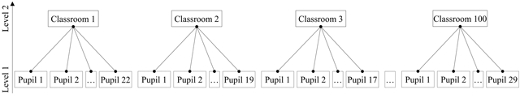
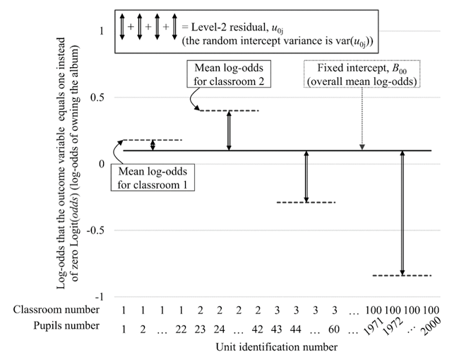
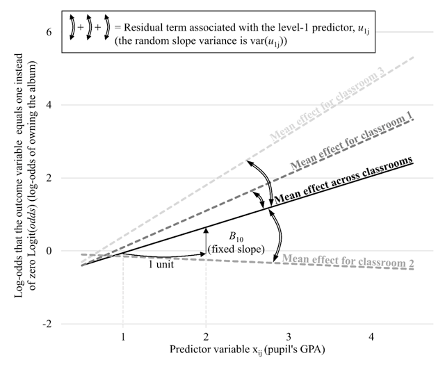
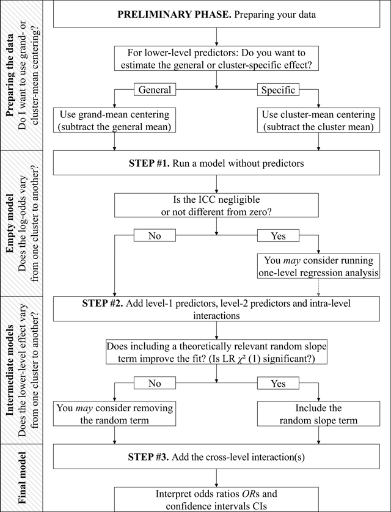
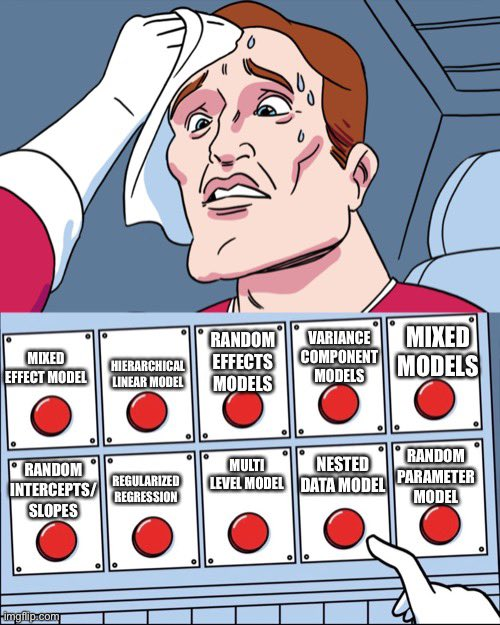

```{r setup, include=FALSE}
setwd("C:/Users/danfe/Dropbox/Proyectos Daniel/Cursos - diplomados - Maestrias/Programa de autoformación en investigación y análisis de datos/Rmarkdowns/Estadística/Programa de formación/Semana13 Multilevel")

knitr::opts_chunk$set(echo = TRUE, warning = FALSE, message = FALSE, fig.retina = 3,
                      fig.width = 6, fig.height = (6 * 0.618),
                         fig.show = "asis", results = "show",
                      fig.align='center', collapse = TRUE,
                      fig.path = "figures/",  # Configura el directorio donde se guardan los gráficos
  dev = "png")
options(digits = 3, width = 90)

```


```{r knitr-hook, include=FALSE}
library(knitr)

# https://stackoverflow.com/a/23147563/120898
hook_output <- knit_hooks$get("output")
knit_hooks$set(output = function(x, options) {
  lines <- options$output.lines
  if (is.null(lines)) {
    return(hook_output(x, options))  # pass to default hook
  }
  x <- unlist(strsplit(x, "\n"))
  more <- "..."
  if (length(lines) == 1) {        # first n lines
    if (length(x) > lines) {
      # truncate the output, but add ....
      x <- c(head(x, lines), more)
    }
  } else {
    x <- c(more, x[lines], more)
  }
  # paste these lines together
  x <- paste(c(x, ""), collapse = "\n")
  hook_output(x, options)
})
```

# AMN para datos anidados

El objetivo general de la regresión logística multinivel es estimar las probabilidades de que ocurra un evento (el resultado de sí/no) teniendo en cuenta la dependencia de los datos (el hecho de que los alumnos estén agrupados en las aulas y que pertenezcan a diferentes colegios, distritos, departamentos, países e incluso periodos de tiempo [1996 vs 2020]). En la práctica, le permitirá estimar dichas probabilidades en función de variables de nivel inferior (por ejemplo, la edad del alumno), variables de nivel superior (por ejemplo, tamaño del aula) y la forma en que se interrelacionan (interacciones entre niveles).

La regresión logística multinivel se puede utilizar para una variedad de situaciones comunes en ciencias de la salud, como cuando la variable de resultado describe la presencia/ausencia de un evento o una enfermedad. Por ejemplo, se ha utilizado la regresión logística multinivel para probar la influencia de la experiencia de los individuos de un evento vital negativo y la calidad de su vecindario en las probabilidades de depresión ( Cutrona et al., 2005 ), o la influencia del género de los solicitantes de subvenciones y el género de sus revisores en las probabilidades de financiación ( Mutz, Bornmann y Daniel, 2015 ). El modelado multinivel también se puede aplicar a diseños de medidas repetidas. Por ejemplo, si los participantes reciben entrenamiento durante varias semanas, el uso de este enfoque permitirá a los usuarios avanzados tener en cuenta tanto los estímulos como las variaciones entre los participantes.


**¿Qué es la regresión logística multinivel?**

Ahora suponga que su estudio involucra a N = 2000 alumnos de K = 100 aulas. Es decir, tiene N participantes (unidades de nivel 1) anidados en K grupos (unidades de nivel 2). Las aulas pertenecen a un nivel (más que a una variable individuales), ya que:

(a) las aulas se tomaron muestras aleatoriamente de una población de unidades (las aulas de todo el mundo son potencialmente infinitas y usted ha muestreado algunas de ellas), y 

(b) las aulas no tienen significado intrínseco per se (las aulas son unidades intercambiables sin contenido teórico). 

Por el contrario, el estatus socioeconómico pertenecería, por ejemplo, a un individuo (más que a un nivel), ya que sus categorías no son aleatorias y son teóricamente significativas (por ejemplo, las clases baja, media y alta no son unidades aleatorias “ateóricas”). 


```{r, echo=FALSE, fig.cap="Ejemplo de una estructura de datos jerárquica, en la que N participantes (alumnos, unidades de nivel inferior) están anidados en K grupos (aulas, unidades de nivel superior). Notas : El modelado multinivel es lo suficientemente flexible como para manejar este tipo de datos desequilibrados, es decir, con números desiguales de participantes dentro de los grupos.", out.width="100%", out.height="100%"}

```

Con una estructura de datos de este tipo, no se puede ejecutar un análisis de regresión logística estándar. La razón es que esto viola uno de los supuestos más importantes de los modelos lineales generalizados, el supuesto de independencia (o falta de correlación) de los residuos ( Bressoux, 2010 ). 

**¿Por qué no serían observaciones interdependientes?** 

Los participantes anidados en el mismo grupo tienen más probabilidades de funcionar de la misma manera que los participantes anidados en grupos diferentes. En nuestro ejemplo, puede haber algunas aulas en las que se adora a Justin Bieber (y los alumnos tienen más posibilidades de poseer el último álbum de Justin) y otras aulas en las que se aborrece a Justin Bieber (y los alumnos tienen menos posibilidades de poseer el último álbum de Justin). 

El modelado multinivel (logístico) apunta en particular a desenredar los efectos dentro del grupo (la medida en que algunas características de los participantes están asociadas con las probabilidades de poseer el último álbum de Justin) de los efectos entre grupos (la medida en que algunas características del aula están asociadas con las probabilidades de poseer el último álbum de Justin).

**¿Qué pasa con el tamaño de la muestra?** 

Un tamaño de muestra suficiente es uno de los primeros indicios de la calidad de la investigación ( Świątkowski y Dompnier, 2017 ). En el modelado multinivel, el número de conglomerados es más importante que el número de observaciones por conglomerado ( Swaminathan, Rogers y Sen, 2011 ). En el modelado lineal multinivel, los estudios de simulación muestran que se necesitan 50 o más unidades de nivel 2 para estimar con precisión los errores estándar ( Maas & Hox, 2005 ; ver también Paccagnella, 2011 ). Más concretamente, en el modelado logístico multinivel, Schoeneberger ( 2016 ) demostró que se necesita un mínimo de 50 unidades de nivel 1 y 40 unidades de nivel 2 para estimar con precisión pequeños efectos fijos (establecidos en OR = 1,70) cuando la varianza del intercepto es pequeña. (establecido en var( u 0j ) ≈ 0,1), mientras que se necesitan 100 unidades de nivel 1 y 80 unidades de nivel 2 cuando se estiman los efectos de interacción entre niveles y/o cuando la varianza del intercepto es grande (establecido en var( u 0j ) ≈ 0,5). 

Un tamaño de muestra insuficiente obviamente reduce el poder estadístico (la probabilidad de “detectar” un efecto verdadero); además, un tamaño de muestra insuficiente en el nivel 2 aumenta las tasas de error de tipo I correspondientes al efecto fijo del nivel 2 (el riesgo de "detectar" un efecto falso). Para detectar con mayor precisión el sesgo en los coeficientes de regresión y los errores estándar debido al tamaño de la muestra en ambos niveles, los usuarios avanzados deberían considerar realizar un estudio de Monte Carlo (por ejemplo, Muthèn y Muthèn, 2002 ).

## Implicaciones del modelo multinivel

**Una primera implicación: las probabilidades logarítmicas pueden variar entre grupos**

La primera diferencia entre la regresión logística simple y multinivel es que se permite que las probabilidades logarítmicas de que la variable de resultado sea igual a uno en lugar de cero varíen de un grupo a otro. Para ilustrar esto, regrese a su estudio e imagine construir un modelo logístico multinivel vacío. Este modelo todavía apunta a estimar las probabilidades logarítmicas de poseer el álbum de Justin, sin incluir predictores. Esta ecuación de regresión logística multinivel vacía se muestra a continuación (Ec. 4):

${\rm{Logit}}\left({odds} \right) = {B_{00}} + {u_{{\rm{0j}}}}$ .........(4)

…en el que Logit( probabilidades ) son las probabilidades logarítmicas de que la variable de resultado sea igual a uno en lugar de cero (es decir, la probabilidad de que un alumno i de un aula j posea el último álbum de Justin).

…y B 00 es la intersección fija, mientras que $\text{u 0j}$ es la desviación de la intersección específica del conglomerado respecto de la intersección fija (es decir, el residual de nivel 2).

Primero, recuerde que no estamos tratando de predecir las probabilidades logarítmicas de poseer el álbum de Justin para un simple participante ; Estamos tratando de predecir tales probabilidades logarítmicas para un participante i en un aula j .

En segundo lugar, ahora estamos estimando dos tipos de parámetros relacionados con la intersección: la intersección fija y la varianza de la intersección aleatoria . Vayamos paso a paso. 

La intersección fija B 00 es un término constante general. Dado que aquí no hay predictores, la intersección fija B 00 corresponde a las probabilidades logarítmicas generales de poseer el álbum de Justin (en lugar de no poseerlo) para un alumno típico que pertenece a un aula típica. Tenga en cuenta que todavía estamos estimando las probabilidades logarítmicas (o el logit de las probabilidades). Si desea calcular la probabilidad promedio de poseer el álbum, debe convertir la intersección fija usando la transformación logit. En su estudio, B 00 = 0,10, por lo tanto $P(Y ij = 1) = exp ( B 00 )/(1 + exp ( B 00 ) = 1,10/(1 + 1,10) ≈ 0,52$, es decir, los alumnos tienen en promedio "52% de posibilidades de poseer el álbum de Justin en todas las aulas" .

Pero como se señaló anteriormente, las probabilidades logarítmicas pueden variar de un grupo a otro. En otras palabras, la intersección no es la misma en todos los grupos. El residual de nivel 2 u 0j proporcionará información sobre el alcance de la variación de la intersección. Dado que aquí no hay predictores, el residuo de nivel 2 u 0j corresponde a la desviación de las probabilidades logarítmicas específicas de poseer el álbum de Justin en un aula determinada de las probabilidades logarítmicas generales de poseer el álbum de Justin en todas las aulas (la media de estos se supone que las desviaciones son cero). El componente de la varianza de dicha desviación es la varianza del intercepto aleatorio var( u 0j ). Este es el elemento clave aquí: cuanto mayor sea la varianza de la intercepción aleatoria, mayor será la variación de las probabilidades logarítmicas de poseer el álbum de Justin de un grupo a otro; esto indica que los alumnos tienen más posibilidades de poseer el álbum de Justin en algunas aulas que en otras 

```{r, echo=FALSE, fig.cap="Representación gráfica de la intersección fija B 00 y el residual de nivel 2 u 0j (cf. Ec. 4); la intercepción fija B 00 corresponde a las probabilidades logarítmicas medias generales de poseer el álbum de Justin en todas las aulas; la varianza de la intersección aleatoria var( u 0j ) corresponde a la varianza de la desviación de las probabilidades logarítmicas medias específicas del aula de las probabilidades logarítmicas medias generales (aquí representadas por la flecha de dos puntas para el 1º, 2º, 3º y 200 aulas solamente). Notas : Los datos son ficticios y no corresponden al conjunto de datos proporcionado.", out.width="100%", out.height="100%"}

```

**Una segunda implicación: el efecto de una variable de nivel inferior puede variar entre grupos**

El segundo cambio con el modelado logístico multinivel es que se permite que el efecto de una variable de nivel inferior varíe de un grupo a otro. Antes de entrar en detalles, debemos distinguir entre las variables de nivel 1, denominadas x ij (en minúsculas), y las variables de nivel 2, denominadas X j (en mayúsculas y negrita). Por un lado, las variables de nivel 1 son características de observación de nivel inferior (por ejemplo, la edad del alumno). El valor de una variable de nivel 1 puede cambiar dentro de un grupo determinado (puede haber alumnos de diferentes edades dentro de la misma clase). Por otro lado, las variables de nivel 2 son características de conglomerados de nivel superior (por ejemplo, el tamaño de la clase). El valor de una variable de nivel 2 no puede cambiar dentro de los grupos (el tamaño de la clase es obviamente el mismo para todos los alumnos dentro de un aula).

Podemos entender que el efecto de una variable de nivel 1, pero no el de una variable de nivel 2 (!), puede variar de un grupo a otro. Por ejemplo, el efecto de la edad del alumno sobre alguna variable de resultado puede ser positivo en algunas aulas y negativo en otras. Esto también significa que el efecto promedio podría no ser estadísticamente significativo, porque es positivo en la mitad de las aulas y negativo en la otra mitad. Por lo tanto, considerar sólo el efecto fijo en presencia de diferencias entre aulas puede llevar a concluir erróneamente que el efecto es insignificante, cuando en realidad el efecto es positivo (o más fuerte) en algunos grupos y negativo (o más débil) en otros.

Para ilustrar esto, regrese a su estudio e imagine construir un modelo de regresión logística multinivel simple. Este modelo tiene como objetivo estimar las probabilidades logarítmicas de poseer el álbum de Justin utilizando el **GPA (promedio de calificaciones)** como único predictor. Esta sencilla ecuación de regresión logística multinivel se muestra a continuación (Ec. 5):

${\rm{Logit}}\left({odds} \right) = {B_{00}} + ({B_{10}} + {u_{{\rm{1j}}}})\ {^*}\ {{\rm{x}}_{{\rm{ij}}}} + {u_{{\rm{0j}}}}$ ...............(5)

…en el que x ij es el valor observado de la variable predictiva para un alumno i en un aula j (su GPA);

…y B 10 es la pendiente fija, mientras que **u 1j** es la desviación de la pendiente específica del grupo respecto de la pendiente fija (es decir, el término residual asociado con la variable de nivel 1).

Además de (todavía) tener dos tipos de parámetros relacionados con la intersección (la intersección fija B 00 y la varianza de la intersección aleatoria var( u 0j ), ahora tenemos dos tipos de parámetros relacionados con el efecto de nivel 1: La pendiente fija y la varianza de la pendiente aleatoria.

Nuevamente, vayamos paso a paso.

La pendiente fija B 10 es el efecto general de la variable de nivel 1 x ij . La interpretación es similar al caso de un análisis de regresión logística de un solo nivel: un aumento de una unidad en el GPA da como resultado un cambio de B 10 en las probabilidades logarítmicas generales de poseer el álbum de Justin para un alumno típico que pertenece a un aula típica. Una vez más, para interpretar B 10 , elévelo al exponente para obtener la razón de probabilidades. En su estudio, B 10 = 0,70, OR = exp ( B 10 ) = exp (0,70) ≈ 2, es decir, cuando el GPA aumenta en una unidad, los alumnos tienen el doble de probabilidades de poseer el álbum de Justin en lugar de no poseerlo en todos los casos - aulas (es decir, un aumento del 100%).

Al igual que la intercepción, este efecto puede variar de un grupo a otro. El término residual asociado con el predictor de nivel 1 u 1j proporcionará información sobre el alcance de la variación del efecto. Específicamente, este residual u 1j corresponde a la desviación de los efectos específicos de la variable de nivel 1 x ij en un aula determinada del efecto general de la variable de nivel 1 x ij en todas las aulas (se supone que la media de estas desviaciones es ser cero). El componente de varianza de dicha desviación es la varianza de la pendiente aleatoria var( u 1j ). Este es el elemento clave aquí: cuanto mayor sea la varianza de la pendiente aleatoria, mayor será la variación del efecto del GPA de un grupo a otro. 

```{r, echo=FALSE, fig.cap="Representación gráfica de la pendiente fija B 10 y el término residual asociado con el predictor de nivel 1 u 1j (cf. Ec. 5); la pendiente fija B 10 corresponde al efecto general del GPA del alumno sobre las probabilidades logarítmicas de poseer el álbum de Justin en todas las aulas; la varianza de la intersección aleatoria var( u 0j ) corresponde a la varianza de la desviación de los efectos específicos del aula del GPA del alumno del efecto general del GPA del alumno (aquí representado por la flecha de dos puntas para la 1.ª, 2.ª y 3.ª clase ). Notas : Los datos son ficticios y no corresponden al conjunto de datos proporcionado.", out.width="100%", out.height="100%"}

```

## Procedimiento 

Recuerda: 

(a) la regresión logística multinivel permite predecir las probabilidades logarítmicas de que una variable de resultado sea igual a uno en lugar de cero (recuerde mis palabras: algunos paquetes de software, por ejemplo SPSS, hacen lo contrario y estiman la probabilidad de que siendo el resultado cero en lugar de uno). 

(b) se permite que las probabilidades logarítmicas promedio varíen de un grupo a otro (formando la varianza del intercepto aleatorio), y (c) también se puede permitir que un efecto de nivel inferior varíe de un grupo a otro (formando la varianza de la pendiente aleatoria).

Los pasos del procedimiento son los siguientes:

1. Fase preliminar: Preparación de los datos (centrado de variables)

2. Paso #1: Construir un modelo vacío, para evaluar la variación de las probabilidades logarítmicas de un grupo a otro

3. Paso #2: Construir un modelo intermedio, para evaluar la variación de los efectos de nivel inferior de un grupo a otro

4. Paso #3: Construir un modelo final para probar la(s) hipótesis(s)

```{r, echo=FALSE, fig.cap="", out.width="100%", out.height="100%"}

```


Retomando nuestro ejemplo con ( N = 2000 ) alumnos agrupados en ( K = 100 ) aulas. Imagina que tienes dos variables de interes. La primera sigue siendo el GPA, que varía de 1 a 4. Esta es una variable de nivel 1, ya que puede variar entre los alumnos dentro de cada aula. El segundo predictor es "afición del profesor por Bieber", codificado como 0 para "no aficionado" y 1 para "aficionado". Esta es una variable de nivel 2, ya que es constante para todos los alumnos dentro de cada aula. Asumimos que cada aula tiene un solo profesor y todos los profesores vienen de las mismas escuelas. Se debe cumplir el supuesto de independencia para los residuos de nivel 2, lo que implica que los profesores de aula no están agrupados en unidades superiores como escuelas, barrios o países diferentes.

Estás tratando de predecir las probabilidades de que los alumnos posean el último álbum de Justin y planteas dos hipótesis. Primero, predices que el gusto musical de los alumnos está influenciado por el gusto musical de sus profesores:

- Hipótesis del efecto principal: Los alumnos tienen más probabilidades de poseer el álbum de Justin cuando su profesor es creyente que cuando no lo es.

Segundo, planteas que los estudiantes con un GPA alto tienden a identificarse más con sus profesores y, por lo tanto, deberían estar más influenciados por ellos, mientras que los de bajo rendimiento estarán menos influenciados:

- Hipótesis de interacción entre niveles: Los alumnos con un GPA alto tienen más probabilidades de poseer el álbum de Justin cuando su profesor es creyente que cuando no lo es; este efecto es menos pronunciado para los alumnos con un GPA bajo.


## Proceso de análisis

Carla la base de datos proporcionada

```{r}
load("Dataset R.rdata")

attr(d$pupils, "labels") <-  "level-1 identifier"
attr(d$classes, "labels") <-  "level-2 identifier"
attr(d$gpa, "labels")    <-  "level-1 predictor variable"
attr(d$teacher_fan, "labels") <-"level-2 predictor variable"
attr(d$bieber, "labels") <-  "binary outcome variable"
```

```{r, echo=FALSE}

DT::datatable(round(d,2), rownames = T, filter="top", options = list(pageLength = 5, scrollX=T), class = 'white-space: nowrap' )

```


## Fase preliminar: Preparación de datos y centrado

Centrar las variables predictoras puede facilitar la interpretación de las estimaciones. Una variable de nivel 2 se centra en la media global, mientras que una de nivel 1 puede centrarse en la media global o en la media del grupo. 

Centrar en la media global implica restar la media general de la variable (x̄) de cada observación. Por otro lado, centrar en la media del grupo implica restar la media específica del grupo. 

Tenga en cuenta que el tipo de centrado (grupo versus gran media) puede afectar su modelo y sus resultados. La elección de uno u otro debe realizarse en función de su pregunta de investigación específica. Por ejemplo, se recomienda el centrado en media general si está interesado en el efecto de una variable predictiva de nivel 2 o el efecto absoluto (entre observaciones) de una variable predictiva de nivel 1, mientras que se recomienda el centrado en media de conglomerados cuando el enfoque está en el efecto relativo (dentro del grupo) de una variable de nivel 1. En nuestro ejemplo, usted decide agrupar la media central del GPA de los alumnos (es decir, restar la media específica del aula, para estimar el efecto dentro del aula) y centrar el cariño del profesor por Bieber utilizando –0,5 para “no soy un creyente” y +0,5. para "belieber" porque su objetivo es probar la idea de que los estudiantes de mayor rendimiento de un aula determinada tienen más probabilidades de ser influenciados por su maestro.


```{r}
#A continuación se muestran los comandos para centrar la media general de "gpa" (es decir, restando la media general de la variable predictora).
#La nueva variable es "gpa_gmc".
grand_mean_gpa <- mean(d$gpa, na.rm=T)
d$gpa_gmc <- d$gpa - grand_mean_gpa


#A continuación se muestran los comandos para agrupar-centrar la media de "gpa" (es decir, restando la media específica de la clase de la variable predictora). 
#La nueva variable es "gpa_cmc".
cluster_mean_gpa <- data.frame(tapply(d$gpa, d$classes, mean))
cluster_mean_gpa$classes <- rownames(cluster_mean_gpa)
names(cluster_mean_gpa)<- c("cluster_mean_gpa","classes")
d <- merge(d, cluster_mean_gpa, by="classes")
d$gpa_cmc <- d$gpa - d$cluster_mean_gpa


#Below is the command to center "teacher_fan"
d$teacher_fan_c <- NA
d$teacher_fan_c[d$teacher_fan==0] <- -0.5
d$teacher_fan_c[d$teacher_fan==1] <- 0.5

```

## Paso 1: Construcción de un modelo vacío

Ejecuta un modelo vacío para medir la variabilidad entre aulas en las probabilidades de poseer el álbum. Calcula el coeficiente de correlación intraclase (ICC) para evaluar la homogeneidad dentro de las aulas.

${\rm{ICC}} = \frac{{{\rm{var}}({u_{{\rm{0j}}}})}}{{{\rm{var}}({u_{{\rm{0j}}}}) + \left({{\pi ^2} \  / \ 3} \right)}}$

…en el que var( u 0j ) es la varianza del intercepto aleatorio, es decir, el componente de varianza de nivel 2: cuanto mayor var( u 0j ), mayor es la variación de las probabilidades logarítmicas promedio entre conglomerados;

…y (π 2 /3) ≈ 3.29 se refiere a la distribución logística estándar, es decir, el componente de varianza de nivel 1 asumido: Tomamos este valor asumido, ya que el modelo de regresión logística no incluye el residual de nivel 1

El ICC puede oscilar entre 0 y 1. ICC = 0 indica perfecta independencia de los residuos: las observaciones no dependen de la pertenencia al grupo. La posibilidad de poseer el álbum de Justin no difiere de un aula a otra (no hay variación entre aulas). Cuando el ICC no es diferente de cero o insignificante, se podría considerar ejecutar un análisis de regresión tradicional de un nivel. 5 Sin embargo, ICC = 1 indica una interdependencia perfecta de los residuos: las observaciones solo varían entre conglomerados. En un aula determinada, todo el mundo o nadie posee el álbum de Justin (no hay variación dentro del aula).


```{r}
#Import the library for multilevel logistic modeling
library(lme4)
library(performance)
library(equatiomatic)


#Below are the commands to run an empty model, that is, a model containing no predictors, 
# and calculate the intraclass correlation coefficient (ICC; the degree of homogeneity of the outcome within clusters).


M0 <- glmer(bieber ~ ( 1 | classes), data=d, family = "binomial")

#Formula
equatiomatic::extract_eq(M0)

# Resumen 
summary(M0)

#ICC
icc(M0)

icc <- M0@theta[1]^2/ (M0@theta[1]^2 + (3.14159^2/3))
icc

#########
#interpretación#
#########
#N = 2000 alumnos están anidados en K = 100 clases (n = 20 alumnos por clase);
#El intercepto fijo está en la parte "Efectos fijos" de la salida: (Intercepto) 0,1028; 
#La varianza del intercepto aleatorio (es decir, el residuo de nivel 2) se encuentra en la parte "Efectos aleatorios" del resultado: clases (Intercepto) 1,254;
#El coeficiente de correlación intraclase es ICC = .28; 
#Esto indica que el 28% de las posibilidades de poseer un álbum se explica por diferencias entre aulas (y, a la inversa, que el 72% se explica por diferencias dentro de las aulas). 

```


## Paso 2: Construcción de un modelo intermedio

Evalúa la variación del efecto del GPA entre aulas ejecutando un modelo intermedio restringido y un modelo intermedio aumentado. Compara estos modelos usando una prueba de razón de verosimilitud para determinar si la inclusión de la varianza aleatoria mejora el ajuste.

El modelo intermedio restringido contiene todas las variables de nivel 1 (en nuestro caso: GPA), todas las variables de nivel 2 (en nuestro caso: la afición del profesor por Bieber), así como todas las interacciones dentro del nivel (nivel 1 * nivel 1). o interacciones de nivel 2 * nivel 2; en nuestro caso: ninguna). Tenga en cuenta que el modelo intermedio restringido no contiene interacciones entre niveles, ya que el modelo apunta precisamente a estimar la variación inexplicable de los efectos de nivel inferior. Por ejemplo, si su estudio incluyera el sexo de los alumnos (una variable de segundo nivel 1) y el tamaño del aula (una variable de segundo nivel 2), el modelo intermedio restringido solo contendría las interacciones intranivel “GPA * sexo” y “calificación del maestro”. cariño por Bieber * tamaño del aula”, no la interacción entre niveles como “GPA * tamaño del aula” o “sexo * cariño del profesor por Bieber”).

${\rm{Logit}}\left({odds} \right) = {B_{00}} + {B_{10}} \ {^*} \ {{\rm{x}}_{{\rm{ij}}}} + {B_{01}} \ {^*} \ {{\bf{X}}_{\rm{j}}} + {u_{{\rm{0j}}}}$

El modelo intermedio aumentado es similar al modelo intermedio restringido, con la excepción de que incluye el término residual asociado con la variable relevante de nivel 1, estimando así la varianza de la pendiente aleatoria (si tiene varias variables relevantes de nivel inferior, pruébelas una a la vez; para el procedimiento. Recuerde que la varianza de la pendiente aleatoria corresponde a la magnitud de la variación del efecto de la variable de nivel inferior de un grupo a otro (en nuestro caso: la magnitud de la variación del efecto del GPA de un aula a otra). Tenga en cuenta que solo se cree que varían los términos principales de nivel 1, no los términos de interacción.

${\rm{Logit}}\left({odds} \right) = {B_{00}} + \left({{B_{10}} + {u_{{\rm{1j}}}}} \right) \ {^*} \ {{\rm{x}}_{{\rm{ij}}}} + {B_{01}} \ {^*} \ {\bf{X}_{\rm{j}}} + {u_{{\rm{0j}}}}$

```{r}
#Si se centra en el efecto entre observaciones de la variable (nivel 1), puede utilizar la variable centrada en la media general ("gpa_gmc"). 
#Si se centra en el efecto dentro del conglomerado, utilice la variable centrada en la media del conglomerado ("gpa_cmc"). 
#Aquí usamos la variable centrada en la media del cluster.

# A continuación se muestran los comandos para ejecutar el modelo intermedio restringido (CIM); 
# el modelo contiene todas las variables de nivel 1, todas las variables de nivel 2 así como todas las interacciones intra-nivel).


CIM <- glmer(bieber ~ gpa_cmc + teacher_fan_c + (1 | classes), data = d, family = "binomial")
#Formula
equatiomatic::extract_eq(CIM)

# Resumen 
summary(CIM)

paste("FYI: The deviance of the CIM is:", CIM@devcomp$cmp[[8]])

# A continuación se muestran los comandos para ejecutar el modelo intermedio aumentado (AIM); 
# el modelo es similar al modelo intermedio restringido con la excepción de que incluye el término de pendiente aleatoria de "gpa_cmc").

AIM <- glmer(bieber ~ gpa_cmc + teacher_fan_c + (1 + gpa_cmc || classes), data = d, family = "binomial")

# Resumen 
summary(AIM)
paste("FYI: The deviance of the AIM is:", AIM@devcomp$cmp[[8]])

#El componente aleatorio de la pendiente es "classes.1 gpa_cmc 0.7720" (correspondiente a la variación del efecto de "gpa_cmc" de una clase a otra);

# A veces la función glmer muestra un mensaje de advertencia de no convergencia. Para entender si representa un problema para sus resultados 
# debería ejecutar el análisis con diferentes optimizadores (por ejemplo, AIM <- glmer(bieber ~ gpa_cmc + teacher_fan_c + (1 + gpa_cmc || classes), data = d, family = "binomial",control=glmerControl(optimizer="bobyqa"))) y comparar los resultados. 

AIM2 <- glmer(bieber ~ gpa_cmc + teacher_fan_c + (1 + gpa_cmc || classes), data = d, family = "binomial", 
             control=glmerControl(optimizer="bobyqa"))
summary(AIM2)

# En la mayoría de los casos, la diferencia es muy pequeña (en el cuarto decimal) y puede no comprometer la interpretación de los resultados. 
# véase lme4 convergence warnings: troubleshooting https://rstudio-pubs-static.s3.amazonaws.com/33653_57fc7b8e5d484c909b615d8633c01d51.html

```

No es necesario no observar las estimaciones de coeficientes o los componentes de varianza de los modelos intermedios. Su objetivo es determinar si el modelo intermedio aumentado logra un mejor ajuste a los datos que el modelo intermedio restringido. En otras palabras, su objetivo es determinar si considerar la variación basada en conglomerados del efecto de la variable de nivel inferior mejora el modelo. Para hacerlo, después de recopilar o almacenar la desviación de CIM y AIM, deberá realizar una prueba de razón de verosimilitud, anotada LR χ 2 (1). A continuación se muestra la fórmula de la prueba de razón de verosimilitud:

${\rm{LR}}\ \chi^{2} \left(1 \right) = deviance\left({{\rm{CIM}}} \right)-deviance\left({{\rm{AIM}}} \right)$


…en el que la desviación (CIM) es la desviación del modelo intermedio restringido, mientras que la desviación (AIM) es la desviación del modelo intermedio aumentado;

…y “(1)” corresponde al número de grados de libertad (esto es igual a uno porque solo hay un parámetro adicional que estimarse en el AIM en comparación con el CIM, a saber, la varianza de la pendiente aleatoria).

La desviación es un índice de calidad de (des)ajuste: cuanto menor sea la desviación, mejor será el ajuste. Hay dos escenarios posibles:

La desviación del modelo intermedio aumentado es significativamente menor que la desviación del modelo restringido. Es decir, incluir el término residual u 1j mejora significativamente el ajuste. En este caso, el término residual u 1j debe mantenerse en el modelo final. 

```{r}
#A continuación se muestra el comando para determinar si la inclusión de la pendiente aleatoria de "gpa_cmc" mejora el modelo. 
#El software realiza una prueba de razón de verosimilitud LR X(1)², comparando la desviación de la CIM con la desviación de la AIM.

anova(CIM, AIM)

test_likelihoodratio(CIM, AIM)

#########
#RESULTADOS
#########
#La prueba likelihood-ratio viene dada por la función anova, y referida por el parámetro Chisq = 26.896, Chi Df = 1, p < .001.
#Así, permitir que el efecto de "gpa_cmc" varíe entre clases mejora el ajuste y es mejor tener en cuenta la pendiente aleatoria. 
```

En el estudio, desviación (CIM) = 2341 y desviación (AIM) = 2312. 7 Por lo tanto, LR χ 2 (1) = 2,341 – 2,312 = 29, p < 0,001 (puede encontrar el valor p utilizando una tabla de distribución de chi-cuadrado común). Esto indica que permitir que el efecto del GPA varíe entre aulas mejora el ajuste y que es mejor tener en cuenta dicha variación.

Escenario 2: La desviación del modelo intermedio aumentado no es significativamente menor que la desviación del modelo restringido. Es decir, incluir el término residual u 1j no mejora significativamente el ajuste. En este caso, el término quizás podría descartarse para evitar una sobreparametrización ( Bates et al., 2015 ). Sin embargo, esto no significa necesariamente que el efecto de la variable de nivel inferior no varíe de un grupo a otro (la ausencia de evidencia de variación no es evidencia de ausencia de variación; ver Nezlek, 2008 ). Es importante destacar que un LR χ 2 (1) no significativo no debería impedirle probar interacciones entre niveles. 


## Paso 3: Construcción del modelo final

Ejecuta el modelo final, agregando interacciones entre niveles para probar tus hipótesis. Interpreta los resultados usando odds ratios para determinar el impacto del GPA y la afición del profesor por Bieber en las probabilidades de poseer el álbum.

Las variables predictoras son las mismas que en los modelos intermedios (variable de nivel 1, variable de nivel 2 e interacciones intranivel ), excepto que ahora se incluyen las interacciones de nivel 1 * nivel 2 (en nuestro caso: el GPA * afición del profesor por la interacción con Bieber). La ecuación del modelo final se muestra a continuación 

$\begin{array}{ccccc} {\rm{Logit}}\left({odds} \right) = & {B_{00}} + \left({{B_{10}} + {u_{{\rm{1j}}}}} \right)*{{\rm{x}}_{{\rm{ij}}}} + {B_{01}}\\ & * {{\bf{X}}_{\rm{j}}} + {B_{11}}*{{\rm{x}}_{{\rm{ij}}}}*{{\bf{X}}_{\rm{j}}} + {u_{0{\rm{j}}}}\end{array}$

…en el que B 11 es la estimación del coeficiente asociado con la interacción entre niveles, es decir, el GPA * afición del profesor por la interacción con Bieber.


```{r}
#A continuación se muestra el comando para ejecutar el modelo final (añadiendo la(s) interacción(es) entre niveles). 
FM <- glmer(bieber ~ gpa_cmc + teacher_fan_c + (1 + gpa_cmc || classes) + gpa_cmc:teacher_fan_c, data = d, family = "binomial")
summary(FM)
```


```{r}
#Nota:
#hemos decidido aquí mantener el componente de pendiente aleatoria de "gpa_cmc"

#Abajo está el comando para calcular la primera pendiente simple
#a saber, el efecto de "profesor_fan_c" cuando "gpa_cmc" es bajo (-1 SD).

sd_gpa_cmc <- sd(d$gpa_cmc)
d$gpa_m1SD <- d$gpa_cmc + sd_gpa_cmc
FM_m1SD <- glmer(bieber ~ gpa_m1SD + teacher_fan_c + (1 + gpa_cmc || classes) + gpa_m1SD:teacher_fan_c, data = d, family = "binomial")
summary(FM_m1SD)
```


```{r}
#A continuación se muestra el comando para calcular la segunda pendiente simple
#es decir, el efecto de "profesor_fan_c" cuando "gpa_cmc" es alto (+1 SD).
d$gpa_p1SD <- d$gpa_cmc - sd_gpa_cmc
FM_p1SD <- glmer(bieber ~ gpa_p1SD + teacher_fan_c + (1 + gpa_cmc || classes) + gpa_p1SD:teacher_fan_c, data = d, family = "binomial")
summary(FM_p1SD)
```


```{r}
#A continuación se muestran los comandos para comparar las estimaciones de coeficientes obtenidas en el modelo final,
#con (glmer) o sin (glm) el uso de la modelización multinivel.
GLMER <- glmer(bieber ~ gpa_cmc + teacher_fan_c + (1 + gpa_cmc || classes) + gpa_cmc:teacher_fan_c, data = d, family = "binomial")
GLM <-  glm(bieber ~ gpa_cmc + teacher_fan_c + gpa_cmc:teacher_fan_c, data = d, family = "binomial")

summary(GLMER)
summary(GLM)
```


```{r}
#Calculate Odds-Ratios

library(gtsummary)

FM %>%   tbl_regression(
    # set the tidying function to broom.mixed::tidy to show random effects
    tidy_fun = broom.mixed::tidy,
    exponentiate =T
  )
```


```{r}
# calculo manual

OR <- exp(fixef(FM))
CI <- exp(confint(FM,parm="beta_",method="Wald")) # puede ser lento (~ unos minutos). Como alternativa, puede utilizarse el método de Wald, mucho más rápido pero menos preciso: CI <- exp(confint(FM,parm="beta_",method="Wald")) 


OR.CI<-rbind(cbind(OR,CI))
OR.CI

#########
#RESULTADOS
#########
#Respecto a su hipótesis de efecto principal, el efecto de "profesor_fan_c" es significativo, profesor_fan_c OR = 7,47, IC 95% [5,00, 11,16]
#los alumnos cuyo profesor es un belieber tienen 7,50 veces más probabilidades de poseer el álbum de Justin que los alumnos cuyo profesor no es fan de Justin Bieber 
#respecto a su hipótesis de interacción, la interacción entre "profesor_fan_c" y "gpa_cmc" es significativa, gpa_cmc:profesor_fan_c OR = 2,99, IC 95% [1,87, 4,78]

OR_m1SD <- exp(fixef(FM_m1SD))
CI_m1SD <- exp(confint(FM_m1SD,parm="beta_",method="Wald")) 

OR_p1SD <- exp(fixef(FM_p1SD))
CI_p1SD <- exp(confint(FM_p1SD,parm="beta_",method="Wald")) 

OR.CI<-rbind(cbind(OR_m1SD,CI_m1SD)[3,], cbind(OR_p1SD,CI_p1SD)[3,])
rownames(OR.CI)<-c("teacher_fan_c_m1SD", "teacher_fan_c_p1SD")
OR.CI

# el análisis de pendiente simple muestra que para los alumnos con mejores resultados de su aula (-1 DE), 
#tener un profesor que es belieber resulta en 3,50 veces más probabilidades de poseer el último álbum de Justin, teacher_fan_c_m1SD OR = 3,47. 95% CI [2.15, 5.65]
#...y para los alumnos con peores resultados de su clase (-1 SD), 
#tener un profesor que es belieber resulta en 16 veces más posibilidades de tener el último álbum de Justin, gpa_p1SD:tteacher_fan_c_p1SD OR = 16.05. 95% CI [9.35, 28.67]

library(effects)

plot(allEffects(FM))

```

# AMN para diseños de medidas repetidas

Esta sección explica cómo se puede utilizar el modelo multinivel para examinar las asociaciones dentro de una persona y cómo estas asociaciones se ven moderadas por las diferencias entre personas. 

En esta sesión cubriremos...

A. Preparación y descripción de variables para su uso en el modelo multinivel   

B. Configuración del modelo multinivel     

C. Utilización del modelo multinivel para examinar las diferencias entre personas en las asociaciones intrapersonales     

D. Trazado y análisis de interacciones     


**Cargamos las librerias a usar**

```{r, message=FALSE, warning=FALSE}
library(backports)     # to revive the isFALSE() function for sim_slopes()
library(effects)       # for probing interactions
library(ggplot2)       # for data visualization
library(interactions)  # for probing/plotting interactions
library(lme4)          # for multilevel models
library(lmerTest)      # for p-values
library(psych)         # for describing the data
library(plyr)          # for data manipulation
```

**Datos**

Nuestro ejemplo utiliza los archivos de datos AMIB a nivel de persona y a nivel de día (tipo EMA), datos de dominio público procedentes de un estudio de muestreo de experiencias. Encontrará información sobre los datos en la página web de QuantDev.  

Utilizamos tres variables:      

Resultado: *afecto negativo diario* (**continuo**), la variable `negaff` del archivo de datos a nivel diario; 

Predictor variable en el tiempo: Predictor variable en el tiempo: *estrés diario*, una variable de "estrés" obtenida a través de la codificación inversa de "pss" en el archivo de datos diarios;    

Predictor/moderador a nivel de persona: rasgo de *neuroticismo*, la variable `bfi_n` en el archivo de datos a nivel de persona. 

Carga del archivo a nivel de persona (*N* = 190) y subconjunto de variables de interés


```{r, message=FALSE}
#set filepath for data file
filepath <- "https://quantdev.ssri.psu.edu/sites/qdev/files/AMIBshare_persons_2019_0501.csv"

#read in the .csv file using the url() function
AMIB_persons <- read.csv(file=url(filepath),header=TRUE)

#subsetting to variables of interest
AMIB_persons <- AMIB_persons[ ,c("id","bfi_n")]
```

Observemos que en la base de datos solo tenemos el identificador y el rasgo de *neuroticismo* (variable numérica - puntaje de una escala)

```{r, echo=FALSE}

DT::datatable(AMIB_persons, rownames = F, filter="top", options = list(pageLength = 5, scrollX=T), class = 'white-space: nowrap' )

```


Carga del archivo a nivel de día (*T* = 8) y subconjunto de variables de interés.

```{r, message=FALSE}
#set filepath for data file
filepath <- "https://quantdev.ssri.psu.edu/sites/qdev/files/AMIBshare_daily_2019_0501.csv"

#read in the .csv file using the url() function
AMIB_daily <- read.csv(file=url(filepath),header=TRUE)

#subsetting to variables of interest
AMIB_daily <- AMIB_daily[ ,c("id","day","negaff","pss")]
```

Observemos que esta otra base posee los datos de los participantes por día (participante 101 evaluado por 7 días) y los puntajes de afectividad negativa y estres cada día

```{r, echo=FALSE}

DT::datatable(AMIB_daily, rownames = F, filter="top", options = list(pageLength = 5, scrollX=T), class = 'white-space: nowrap' )

```

## A. Preparación y descripción de variables para su uso en el modelo multinivel

En este ejemplo, los datos se preparan mediante cierta recodificación (idiosincrásica para este conjunto de datos) y la separación de las variables predictoras variables en el tiempo en componentes entre personas y dentro de las personas (típico de todos los análisis multinivel). 

**Recodificación de datos** 

Revertir el código `pss` en una nueva variable `stress` donde los valores más altos indican un mayor estrés percibido.  

```{r, warning=FALSE, message = FALSE}
#reverse coding the pss variable into a new stress variable
AMIB_daily$stress <- 4 - AMIB_daily$pss

#describing new variable
psych::describe(AMIB_daily$stress)

#histogram
ggplot(data=AMIB_daily, aes(x=stress)) +
  geom_histogram(fill="white", color="black",bins=20) +
  labs(x = "Stress (high = more stressed)")
```

**Preparación de los datos (entre los componentes y dentro de los componentes)**

Ahora dividimos el predictor variable en el tiempo en componentes de "rasgo" (diferencias entre personas) y "estado" (desviaciones dentro de las personas). En concreto, la variable diaria `estrés` se divide en dos varaibles: `estrés_rasgo` es el componente inter-personal centrado en la media muestral, y `estrés_estado` es el componente intra-personal centrado en la persona. 

Aunque no es formalmente necesario, hacemos esto para todas las variables que varían con el tiempo (predictores, resultados) para facilitar el trazado más adelante.

Creación de variables de rasgo.

```{r, warning=FALSE, message = FALSE}
#calculating intraindividual means
#Alternative approach using dplyr
    #AMIB_imeans <- AMIB_daily %>% 
    #               group_by(id) %>% 
    #               summarize(stress_trait=mean(stress, na.rm=TRUE))

AMIB_imeans <- ddply(AMIB_daily, "id", summarize,
                       stress_trait = mean(stress, na.rm=TRUE),
                       negaff_trait = mean(negaff, na.rm=TRUE))
describe(AMIB_imeans)

#merging into person-level file
AMIB_persons <- merge(AMIB_persons, AMIB_imeans, by="id")   

#make centered versions of the person-level scores
AMIB_persons$bfi_n_c <- scale(AMIB_persons$bfi_n,center=TRUE,scale=FALSE)
AMIB_persons$stress_trait_c <- scale(AMIB_persons$stress_trait,center=TRUE,scale=FALSE)

#describe person-level data
describe(AMIB_persons)
```

Observemos que bfi_n_c y stress_trait_c son los puntajes de afectividad negativa y estres centradas (media= 0) dentro de cada individuo 

```{r, echo=FALSE}

DT::datatable(round(AMIB_persons,2), rownames = F, filter="top", options = list(pageLength = 5, scrollX=T), class = 'white-space: nowrap' )

```

Hacer variables de estado en datos largos (como desviaciones de la variable de rasgo no centrada).

```{r}
#merging person-level data into daily data
daily_long <- merge(AMIB_daily,AMIB_persons,by="id")

#calculating state variables
daily_long$stress_state <- daily_long$stress - daily_long$stress_trait
daily_long$negaff_state <- daily_long$negaff - daily_long$negaff_trait

#describing data
describe(daily_long)
```

Al juntar la base a un formato *long* (un participante tiene valores en más de una fila) observamos que bfi_n_c y stress_trait_c son iguales en cada individuos. Usamos esos datos para restar a los valores originales de cada día de cada individuo para crear stress_state y negaff_state

```{r, echo=FALSE}

DT::datatable(round(daily_long,2), rownames = F, filter="top", options = list(pageLength = 5, scrollX=T), class = 'white-space: nowrap' )

```

Estupendo. Ahora todos los datos están preparados según es necesario.


##B. Configuración del modelo multinivel     

**Configuración de un modelo multinivel básico con resultados continuos**.

Esquema de la investigación sustantiva.

Definimos la **reactividad al estrés** (una *característica dinámica* a nivel de persona; Ram & Gerstorf, 2009) como el grado en que el afecto negativo diario de un individuo está relacionado con el estrés diario. Es decir, la *reactividad al estrés* es la *asociación dentro de la persona* entre el afecto negativo diario y el estrés diario. 
Examinemos algunos de nuestros datos preparados para ver qué aspecto tiene la *reactividad al estrés*. 

Trazado de asociaciones dentro de la persona para un subconjunto de individuos. 

```{r, warning=FALSE, message = FALSE}
#faceted plot
ggplot(data=daily_long[which(daily_long$id <= 125),], aes(x=stress_state,y=negaff)) +
  geom_point() +
  stat_smooth(method="lm", fullrange=TRUE) +
  xlab("Stress State") + ylab("Negative Affect (Continuous)") + 
  facet_wrap( ~ id) +
  theme(axis.title=element_text(size=16),
        axis.text=element_text(size=14),
        strip.text=element_text(size=14))
```

Para restringir la línea de regresión dentro del rango de puntuaciones de estrés de cada persona (en lugar de extrapolar al rango completo de puntuaciones de estrés), especifique `fullrange=FALSE` en la capa `stat_smooth` anterior.

Del panel de gráficos se deduce que el *afecto negativo* de los individuos es mayor en los días en los que su *estrés* es mayor, pero en distinta medida para cada persona. Estas diferencias en la *reactividad al estrés* se indican mediante diferencias en la pendiente de las líneas de regresión. 

Nuestro interés principal es describir las diferencias individuales en la *reactividad al estrés* y determinar si esas diferencias están relacionadas con las diferencias en el *neuroticismo*.


El modelo multinivel lineal básico se escribe como 

$$y_{it} = \beta_{0i} + \beta_{1i}x_{it} + e_{it}$$

donde la variable de resultado variable en el tiempo, $y_{it}$ (*afecto negativo*) se modela como una función de un intercepto específico de la persona, $\beta_{0i}$, una pendiente específica de la persona, $\beta_{1i}$, que captura la asociación de interés dentro de la persona (en nuestro caso *reactividad al estrés*), y el error residual, $e_{it}$.

Los interceptos y las pendientes específicos de la persona se modelan a su vez como 

$$\beta_{0i} = \gamma_{00} + \gamma_{01}z_{i} + u_{0i}$$
$$\beta_{1i} = \gamma_{10} + \gamma_{11}z_{i} + u_{1i}$$


donde los *efectos fijos* $\gamma_{00}$ y $\gamma_{01}$ describen el intercepto y la pendiente del individuo prototípico; $\gamma_{10}$ y $\gamma_{11}$ indican cómo se relacionan las diferencias individuales en los interceptos y pendientes específicos de la persona con una variable de diferencias entre personas, $z_{i}$; y los *efectos aleatorios* $u_{0i}$ y $u_{1i}$ son diferencias residuales no explicadas en interceptos y pendientes.

Es importante destacar que $$e_{it} \tilde{} N(0,\mathbf{R})$$, y 
$$\mathbf{U}_{i} \tilde{} MVN(0,\mathbf{G})$$ 

$$\mathbf{R} = \mathbf{I}\sigma^{2}_{e}$$, donde
donde $I$ es la matriz de identidad (matriz diagonal de 1s) y $\sigma^{2}_{e}$ es la varianza residual (dentro de la persona).


En conjunto, el conjunto completo de parámetros proporciona una descripción parsimoniosa de los datos que permite inferir acerca de las asociaciones entre personas y las diferencias entre personas en esas asociaciones. 

##B. Configuración del modelo multinivel

Una vez definida la característica dinámica de interés, la reactividad al estrés, podemos operacionalizarla utilizando el modelo multinivel.

Utilizamos el paquete `lme4` para ajustar modelos de efectos mixtos y algunos paquetes complementarios: `lmerTest` proporciona herramientas para obtener valores p; `effects` proporciona herramientas para calcular y trazar predicciones basadas en modelos; e `interactions` proporciona herramientas para trazar y sondear interacciones.

La función `lmer()` ajusta los MLM
El argumento `data` especifica las fuentes de datos
El argumento `na.action` especifica qué hacer con los datos que faltan


Para empezar, a menudo ajustamos un *modelo de medias incondicionales* o *modelo nulo* que nos proporciona información sobre qué parte de la varianza total en la variable de resultado es varianza dentro de la persona y qué parte es varianza entre personas.

Ajuste del modelo de medias incondicionales.


```{r, warning=FALSE, message = FALSE}
#unconditional means model o null model
model0_fit <- lmer(formula = negaff ~ 1 + (1|id), 
              data=daily_long,
              na.action=na.exclude)
summary(model0_fit)
```


A continuación, calcular la correlación intraclase (ICC) como la relación entre la varianza del intercepto aleatorio (entre personas) y la varianza total, definida como la suma de la varianza del intercepto aleatorio y la varianza residual (entre + dentro). En concreto
$$ICC_{entre} = \frac{\sigma^{2}_{u0}}{\sigma^{2}_{u0} + \sigma^{2}_{e}}$$


```{r}
RandomEffects <- as.data.frame(VarCorr(model0_fit))
ICC_between <- RandomEffects[1,4]/(RandomEffects[1,4]+RandomEffects[2,4]) 
ICC_between
icc(model0_fit)
```

A partir del modelo de medias incondicionales, se calculó el ICC, que indicaba que de la varianza total en el afecto negativo, `r round(ICC_between*100,2)`% es atribuible a la variación entre personas, mientras que `r round(100-(ICC_between*100),2)`% es atribuible a la variación dentro de las personas.

Esto significa que hay una buena parte de la variación intrapersonal para modelizar utilizando un predictor variable en el tiempo.

##C. Uso del modelo multinivel para examinar las diferencias entre personas en las asociaciones intrapersonales     

Bien, añadamos el predictor, que se dividió en dos componentes: "stress_trait" (componente entre personas) y "stress_state" (componente dentro de las personas), que nos da la posibilidad de cuantificar la "reactividad al estrés" de cada individuo. Obsérvese que también incluimos el "día" como predictor variable en el tiempo, pero simplemente como variable de control para tener en cuenta cualquier tendencia temporal sistemática en los datos. 

```{r, warning=FALSE, message = FALSE}
# fit model
model1_fit <- lmer(formula = negaff ~ 1 + day + stress_trait_c + 
                      stress_state + stress_state:stress_trait_c + 
                      (1 + stress_state|id), 
                    data=daily_long,
                    na.action=na.exclude)
summary(model1_fit)

# save predicted scores
daily_long$pred_m1 <- predict(model1_fit)
```

**Interpretación y representación gráfica de los resultados**

Los resultados indican que existe una asociación entre el estrés percibido y el afecto negativo, tanto entre personas (asociación entre personas) como dentro de las personas (asociación media dentro de las personas). Esto se describe mediante los parámetros de efectos fijos.   

* Efectos fijos
    * (Intercepto): El valor esperado del afecto negativo para la persona prototípica en un día prototípico es `r round(summary(model1_fit)$coefficients[1,1],2)`.
    * día: el afecto negativo disminuyó a lo largo de los días de estudio - por cada unidad de aumento en el día, el afecto negativo disminuyó en `r round(model1_fit@beta[2],2)` (*p* = `r round(summary(model1_fit)$coefficients[2,5],2)`)
    * stress_trait_c: Los individuos con mayor estrés percibido tendían a experimentar mayor afecto negativo, `r round(model1_fit@beta[3],2)`, que es estadísticamente significativamente diferente de cero (*p* = `r round(summary(model1_fit)$coefficients[3,5],2)`).
    * stress_state : En los días en los que el estrés percibido por el individuo prototípico era mayor de lo habitual, su afecto negativo también tendía a ser mayor de lo habitual, `r round(summary(model1_fit)$coefficients[4,1],2)`, que es estadísticamente significativamente diferente de cero (*p* = `r round(summary(model1_fit)$coefficients[4,5],2)`). 
    * stress_trait_c:stress_state: las diferencias en la asociación intrapersonal entre el estado de estrés y el afecto negativo no están moderadas por el nivel de estrés rasgo (`r round(summary(model1_fit)$coefficients[5,1],2)`, *p* = `r round(summary(model1_fit)$coefficients[5,5],2)`)
    
* **Efectos aleatorios:**
    * sd((Intercept)): Existen diferencias sustanciales entre personas en el valor esperado de afecto negativo de los individuos (`r round(summary(model1_fit)$varcor$id[1,1],2)`)
    * sd(stress_state): Existen diferencias sustanciales entre personas en la asociación intrapersonal entre el estrés percibido y el afecto negativo, la reactividad al estrés, (`r round(summary(model1_fit)$varcor$id[2,2],2)`)
    * cov((Intercept),stress_state: La correlación entre el intercepto aleatorio y la pendiente aleatoria fue `r round(cov2cor(summary(model1_fit)$varcor$id)[2,1],2)`, lo que indica que los que tenían interceptos más altos para el afecto negativo también tenían más probabilidades de tener asociaciones mayores (más positivas) entre el afecto negativo y el estrés percibido.
    
También podemos obtener intervalos de confianza para los efectos fijos y aleatorios. Dependiendo de la complejidad del modelo, `confint()` puede tardar un poco en ejecutarse.


```{r}
# Get confidence intervals for both fixed and random effects
confint(model1_fit)
```

Las etiquetas para los efectos aleatorios no son del todo intuitivas (por ejemplo, `sig01`, `sig02`, `sig03`, `sigma`) - especialmente para modelos con varios efectos aleatorios. Por lo tanto, es necesario comprobar cuidadosamente cómo interpretar la salida.

En la salida anterior: 

* sig01 = efecto aleatorio CI para intercepción aleatoria (dado en unidades SD - necesita elevar los valores al cuadrado si quiere las varianzas)
* sig02 = correlación entre el intercepto aleatorio y la pendiente aleatoria (para stress_state)
* sig03 = IC del efecto aleatorio para la pendiente aleatoria (stress_state; dado en unidades SD - necesita elevar los valores al cuadrado si quiere las varianzas)
* sigma = CI del error residual (dado en unidades SD - es necesario elevar los valores al cuadrado si se desean las varianzas)

En general, la salida dada por `confint()` le dará los intervalos de confianza (dados en unidades SD - necesitará elevar al cuadrado estos valores si quiere las varianzas) para el primer efecto aleatorio (por ejemplo, el intercepto aleatorio). Luego le dará las correlaciones entre ese efecto aleatorio y todos los demás efectos aleatorios con los que está correlacionado. La siguiente fila de valores CI corresponderá al segundo efecto aleatorio (por ejemplo, la pendiente aleatoria para estado_estrés), con las siguientes filas correspondientes a todos los efectos aleatorios con los que está correlacionado (pero sin incluir las correlaciones ya dadas - porque, por ejemplo, la correlación para el intercepto aleatorio y la pendiente aleatoria para estado_estrés ya se dio). La última fila perteneciente a los efectos aleatorios siempre se llama `sigma`, y pertenece al error residual (dado en unidades SD - tendrá que elevar al cuadrado estos valores si quiere las varianzas).
    
    
A continuación, podemos trazar las asociaciones entre personas. 


```{r}
ggplot(data=AMIB_imeans, aes(x=stress_trait, y=negaff_trait, group=factor(id)), legend=FALSE) +
  geom_point(colour="gray40") +
  geom_smooth(aes(group=1), method=lm, se=FALSE, fullrange=FALSE, lty=1, size=2, color="blue") +
  xlab("Trait Stress") + ylab("Trait Negative Affect") +
  theme_classic() +
  theme(axis.title=element_text(size=16),
        axis.text=element_text(size=12),
        plot.title=element_text(size=16, hjust=.5)) +
  ggtitle("Between-Person Association Plot\nTrait Stress & Negative Affect")
```

Tenga en cuenta que el gráfico no está utilizando realmente la salida del modelo - por lo que es sólo una aproximación del modelo exacto (utilizando geom_smooth incrustado dentro de ggplot). Sin embargo, es una visualización muy útil.

Representación gráfica de las asociaciones predichas dentro de una misma persona. 
```{r}
ggplot(data=daily_long, aes(x=stress_state, y=negaff_state, group=factor(id), colour="gray"), legend=FALSE) +
  geom_smooth(method=lm, se=FALSE, fullrange=FALSE, lty=1, size=.5, color="gray40") +
  geom_smooth(aes(group=1), method=lm, se=FALSE, fullrange=FALSE, lty=1, size=2, color="blue") +
  xlab("Stress State") + ylab("Predicted State Negative Affect") +
  theme_classic() +
  theme(axis.title=element_text(size=18),
        axis.text=element_text(size=14),
        plot.title=element_text(size=18, hjust=.5)) +
  ggtitle("Within-Person Association Plot\nPerceived Stress & Negative Affect")
```

Tenga en cuenta que el gráfico no está utilizando realmente la salida del modelo - por lo que es sólo una aproximación del modelo exacto (utilizando geom_smooth con *state* puntuaciones incrustadas dentro de ggplot). Sin embargo, es una visualización muy útil.

**Añadir otro predictor a nivel de persona**

Ahora añadimos el rasgo neuroticismo al modelo, para ver si y cómo las diferencias entre personas en neuroticismo están relacionadas con la *reactividad al estrés*. 

Ejecutando el modelo ampliado. 

```{r, warning=FALSE, message = FALSE}
# fit model
model2_fit <- lmer(formula = negaff ~ 1 + day + stress_trait_c + 
                      bfi_n_c + stress_trait_c:bfi_n_c +
                      stress_state + stress_state:stress_trait_c + 
                      stress_state:bfi_n_c + stress_state:stress_trait_c:bfi_n_c + 
                      (1 + stress_state|id),
                    data=daily_long,
                    na.action=na.exclude)
#Look at results
summary(model2_fit)

# save predicted scores
daily_long$pred_m2 <- predict(model2_fit)
```

* **Efectos fijos:**
    * (Intercepción): El valor esperado de afecto negativo para la persona prototípica en un día prototípico es `r round(summary(model2_fit)$coefficients[1,1],2)`.
    * día: Por cada unidad de aumento en el día, se espera que el afecto negativo disminuya en `r round(summary(model2_fit)$coefficients[2,1],2)` (*p* = `r round(summary(model2_fit)$coefficients[2,5],2)`)
    * stress_trait_c: Los individuos con mayor estrés percibido tendían a experimentar mayor afecto negativo, `r round(model2_fit@beta[3],2)`, que es estadísticamente significativamente diferente de cero (*p* = `r round(summary(model2_fit)$coefficients[3,5],2)`).
    * bfi_n_c: En promedio, los individuos con mayor neuroticismo también tendían a experimentar un mayor afecto negativo (`r round(model2_fit@beta[4],2)`, *p* = `r round(summary(model2_fit)$coefficients[4,5],2)`)
    *estado_estrés : En los días en los que el estrés percibido por el individuo prototípico era mayor de lo habitual, su afecto negativo también tendía a ser mayor de lo habitual, `r round(summary(model2_fit)$coefficients[5,1],2)`, que era estadísticamente significativamente diferente de cero (*p* = `r round(summary(model2_fit)$coefficients[5,5],2)`). 
    * stress_trait_c:bfi_n_c: el rasgo neuroticismo no moderó la asociación entre personas entre el estrés y el afecto negativo (`r round(model2_fit@beta[6],2)`, *p* = `r round(summary(model2_fit)$coefficients[6,5],2)`).
    * stress_trait_c:stress_state: el rasgo estrés no modera la asociación intrapersonal entre el estado de estrés y el afecto negativo (`r round(summary(model2_fit)$coefficients[7,1],2)`, *p* = `r round(summary(model2_fit)$coefficients[7,5],2)`)
    * bfi_n_c:stress_state: el rasgo neuroticismo no modera la asociación intra-persona entre estrés y afecto negativo (`r round(summary(model2_fit)$coefficients[8,1],2)`, *p* = `r round(summary(model2_fit)$coefficients[8,5],2)`)
    * stress_trait_c:bfi_n_c:stress_state: el neuroticismo no modera el rasgo moderador del estrés (`r round(summary(model2_fit)$coefficients[9,1],2)`, *p* = `r round(summary(model2_fit)$coefficients[9,5],2)`)
    
* **Efectos aleatorios:**
    * sd((Intercept)): Hubo un grado sustancial de diferencias entre personas en el valor medio del afecto negativo (`r round(summary(model2_fit)$varcor$id[1,1],2)`)
    * sd(stress_state): Hubo un grado sustancial de diferencias entre personas en la asociación media dentro de la persona entre el estrés percibido y el afecto negativo (`r round(summary(model2_fit)$varcor$id[2,2],2)`)
    * cov((Intercept),stress_state: La correlación entre el intercepto aleatorio y la pendiente aleatoria fue `r round(cov2cor(summary(model2_fit)$varcor$id)[2,1],2)`, lo que indica que quienes tenían valores de intercepto más altos para el afecto negativo también tenían más probabilidades de mostrar reactividad al estrés (asociaciones intrapersonales más positivas entre el afecto negativo y el estrés percibido).


##D. Trazado y sondeo de interacciones 

**Trazado y análisis de la interacción**

La moderación no es significativa. Sin embargo, si lo fuera, nos gustaría trazar y sondear el término de interacción, específicamente el término `estado_de_estrés:bfi_n_c`.  

Podemos utilizar la función `effect`.   
Examinamos cuál es el efecto según los distintos niveles de los predictores. La práctica estándar es utilizar +1 y -1 SD.


```{r}
#xlevels = is the list of values that we want to evaluate at.
#obtaining the standard deviation of the between-person moderator
describe(daily_long$bfi_n_c)

#obtaining the standard deviation of the time-varying predictor
describe(daily_long$stress_state)

#calculate effect
effects_model2 <- effect(term="bfi_n_c*stress_state", mod=model2_fit, 
                         xlevels=list(bfi_n_c=c(-0.96, +0.96), stress_state=c(-0.49,+0.49)))
summary(effects_model2)

plot(effects_model2)
```
Todo lo que necesitamos está ahí.

Podemos convertirlo en un marco de datos y trazarlo.
```{r}
#convert to dataframe
effectsdata <- as.data.frame(effects_model2)
#plotting the effect evaluation (with standard error ribbon)
ggplot(data=effectsdata, aes(x=stress_state, y=fit, group=bfi_n_c), legend=FALSE) + 
  geom_point() +
  geom_line() +
  #geom_ribbon(aes(ymin=lower, ymax=upper), alpha=.3) +
  geom_errorbar(aes(ymin=lower, ymax=upper), width=.15) +
  xlab("Stress State") + xlim(-2,2) +
  ylab("Predicted Negative Affect") + ylim(1,7) +
  ggtitle("Differences in Stress Reactivity across Neuroticism")
```

Obsérvese que la interacción no significativa aparece como dos líneas prácticamente paralelas. 

**Técnica de Johnson-Neyman**

Vayamos un poco más lejos... 

Nos gustaría identificar el rango de valores del moderador en el que la pendiente intra-persona es significativa. Formalmente, la técnica *Johnson-Neyman* se utiliza para sondear interacciones significativas con el fin de determinar para qué valores del moderador el predictor focal está significativamente relacionado con el resultado, es decir, para identificar la *región de significación*. Esto se está convirtiendo rápidamente en una práctica estándar a la hora de informar sobre interacciones en modelos multinivel.

En nuestro caso, estamos interesados en conocer el rango de puntuaciones de *neuroticismo* en el que esperaríamos que los individuos tuvieran una *reactividad al estrés* significativa (asociación dentro de la persona entre el estrés diario y el afecto negativo diario).

Utilizamos la función `johnson-neyman()` del paquete `interactions`. Tenga en cuenta que el paquete `backports` también puede ser necesario para obtener una función obsoleta `isFALSE()` que utiliza este paquete.  

Además, cuando se utiliza el paquete `interactions` tenemos que hacer un poco de formateo de datos (para asegurarse de que todas las variables son vectores), y ejecutar el modelo utilizando lmer() sin la superposición lmerTest() (para obtener un objeto merMod).

Arreglar los datos.


```{r}
#check for embedded matrices
str(daily_long)

#fixing a few variables that were matrices to be vectors
daily_long$bfi_n_c <- as.vector(daily_long$bfi_n_c)
daily_long$stress_trait_c <- as.vector(daily_long$stress_trait_c)
```

Especifique y ajuste el modelo como `lme4::lmer` específico para obtener el objeto `merMod` (en lugar de un objeto `lmerModLmerTest`).

```{r}
# fit model
model2a_fit <- lme4::lmer(formula = negaff ~ 1 + day + stress_trait_c + 
                      bfi_n_c + stress_trait_c:bfi_n_c +
                      stress_state + stress_state:stress_trait_c + 
                      stress_state:bfi_n_c + stress_state:stress_trait_c:bfi_n_c + 
                      (1 + stress_state|id),
                    data=daily_long,
                    na.action=na.exclude)

# Look at results
summary(model2a_fit)
  
# Get confidence intervals for both fixed and random effects
#confint(model2a_fit)
  
# Save predicted scores
daily_long$pred_m2a <- predict(model2a_fit)

# Fit statistics  
AIC(logLik(model2a_fit)) 
BIC(logLik(model2a_fit))
logLik(logLik(model2a_fit))
```

Trazado y sondeo de las pendientes simples (asociación intrapersonal entre `estado_de_estrés` y `negaff`) en todo el rango del moderador (`bfi_n_c`). 

```{r}
#probing 2-way interaction
johnson_neyman(model=model2a_fit, pred=stress_state, modx=bfi_n_c)
```

Vemos en el resultado y en el gráfico que las pendientes de *reactividad al estrés* dentro de la persona son significativas en todos los valores observados de neuroticismo, como cabría esperar dada la no significación del término de interacción. 


También podemos sondear la interacción de 3 vías, siempre que elijamos valores específicos para el 2º moderador.

```{r eval=FALSE}
#obtaining the standard deviation of the 2nd moderator 
describe(daily_long$stress_trait_c)

#probing 3-way interaction
 simpleslopes_model2a <- interactions::sim_slopes(model=model2a_fit, pred=stress_state, modx=bfi_n_c,
                                   mod2=stress_trait_c,mod2.values = c(-0.47,+0.47))
 plot(simpleslopes_model2a)
```

Del resultado vemos que el valor de las pendientes de *reactividad al estrés* dentro de la persona (es decir, las pendientes simples) son similares en todos los valores de los moderadores y tienen intervalos de confianza superpuestos, como cabría esperar dada la no significación del término de interacción.


# AMN con datos de panel año-país


**No es necesario que sigas leyendo pero cuida este script por si lo llegaras a necesitarlo en el futuro**

Esta parte de la guia es más densa y empezará a comparar resultados bajo el enfoque de la estadística frecuentista lo que estuvimos viendo y bajo el enfoque de la estadística bayesiana (pero creo que puede ser entendible si comprendiste los conceptos anteriores)

Recuerda que estos modelos también se denominan modelos de efectos mixtos, modelos de efectos aleatorios y modelos jerárquicos, ¡entre otros! ¡Son todos iguales

```{r chelsea-meme, echo=FALSE, out.width="60%", indent="  "}

```


En muchas de la investigaciones con datos de panel se trabaja con datos a nivel de país, por tanto la base de datos contendrá en cada fila un país en un año específico (Afganistán en 2010, Afganistán en 2011, etc.). Estos datos de panel también son conocidos como serie de tiempo transversal (TSCS, por sus siglas en inglés). Crear modelos estadísticos para datos de panel es complicado y la mayoría de las clases de introducción a la estadística no suelen cubrir cómo hacerlo. 

Los países se repiten longitudinalmente a lo largo del tiempo, lo que significa que el tiempo mismo influye en los cambios en la variable de resultado. Los países también tienen tendencias y características internas que influyen en el resultado; algunos podrían tener un legado de guerra civil poscolonial, por ejemplo. Y para hacerlo todo más complejo, los países están anidados en continentes y regiones, y puede haber tendencias regionales que influyan en el resultado. Ah, y las tendencias temporales también pueden ser diferentes entre países y continentes. Trabajar con todas estas diferentes partes móviles se vuelve realmente difícil.

Comencemos cargando todas las bibliotecas que necesitaremos (y creando un par de funciones auxiliares):

```{r libraries-functions, warning=FALSE, message=FALSE}
library(tidyverse) # ggplot, dplyr, %>%, y amigos
library(gapminder) # Datos de panel país-año del proyecto Gapminder
library(brms) # Modelización bayesiana mediante Stan
library(tidybayes) # Manipular objetos Stan de forma ordenada
library(broom) # Convertir objetos modelo en marcos de datos
library(broom.mixed) # Convierte objetos modelo brms en marcos de datos
library(emmeans) # Calcular efectos marginales de forma aún más elegante
library(ggh4x) # Para facetas anidadas en ggplot
library(ggrepel) # Para etiquetas no superpuestas en ggplot
library(ggdist) # Para geoms ggplot relacionados con la distribución
library(scales) # Para formatear números con coma(), dólar(), etc.
library(patchwork) # Para combinar gráficos
library(ggokabeito) # Paleta de colores para daltónicos

# Hacer todos los dibujos aleatorios reproducibles
set.seed(1234)

# Bayes stuff
# Usar el backend cmdstanr para Stan porque es más rápido y más moderno que
# el rstan por defecto. Necesitas instalar el paquete cmdstanr primero
# (https://mc-stan.org/cmdstanr/) y luego ejecutar cmdstanr::install_cmdstan() para
# instalar cmdstan en tu ordenador.
options(mc.cores = 4,  # Use 4 cores
        brms.backend = "cmdstanr")
bayes_seed <- 1234

# Custom ggplot theme to make pretty plots
# Get Barlow Semi Condensed at https://fonts.google.com/specimen/Barlow+Semi+Condensed
theme_clean <- function() {
  theme_minimal(base_family = "Barlow Semi Condensed") +
    theme(panel.grid.minor = element_blank(),
          plot.background = element_rect(fill = "white", color = NA),
          plot.title = element_text(face = "bold"),
          axis.title = element_text(face = "bold"),
          strip.text = element_text(face = "bold", size = rel(0.8), hjust = 0),
          strip.background = element_rect(fill = "grey80", color = NA),
          legend.title = element_text(face = "bold"))
}

# Make labels use Barlow by default
update_geom_defaults("label_repel", 
                     list(family = "Barlow Semi Condensed",
                          fontface = "bold"))
update_geom_defaults("label", 
                     list(family = "Barlow Semi Condensed",
                          fontface = "bold"))

# El paquete ggh4x incluye una función `facet_nested()` para anidar facetas
# (como países en continentes). A lo largo de este post, quiero que
# facetas a nivel de continente utilicen un texto más grueso y una franja gris más clara. No quiero
# no quiero seguir repitiendo todos estos ajustes, así que creo una lista de los
# ajustes aquí con `strip_nested()` y se la paso a `facet_nested_wrap()` más tarde
nested_settings <- strip_nested(
  text_x = list(element_text(family = "Barlow Semi Condensed Black", 
                             face = "plain"), NULL),
  background_x = list(element_rect(fill = "grey92"), NULL),
  by_layer_x = TRUE)
```


## Datos de ejemplo: salud y riqueza a lo largo del tiempo

En este ejemplo, vamos a utilizar datos del [proyecto Gapminder](https://www.gapminder.org/) de Hans Rosling para explorar la relación entre la riqueza (medida como PBI o PIB per cápita, o renta media por persona) y la salud (medida como esperanza de vida). Es posible que haya visto la [encantadora charla TED](https://www.ted.com/talks/hans_rosling_shows_the_best_stats_you_ve_ever_seen) de Hans Rosling en la que muestra cómo la salud y la riqueza mundiales han ido en aumento desde 1800; se hizo famoso en Internet gracias a este trabajo.

Antes de empezar, mira esta breve versión de 4 minutos de su famosa presentación sobre salud/riqueza. Es el mejor resumen de las complejidades de los datos de panel con los que vamos a trabajar:

```{css echo=FALSE}
.video-container { position: relative; padding-bottom: 56.25%; padding-top: 30px; height: 0; overflow: hidden; margin-bottom: 1em;}

.video-container iframe, .video-container object, .video-container embed { position: absolute; top: 0; left: 0; width: 100%; height: 100%}
```

<div class="video-container">
<iframe src="https://www.youtube.com/embed/Z8t4k0Q8e8Y" title="YouTube video player" frameborder="0" allow="accelerometer; autoplay; clipboard-write; encrypted-media; gyroscope; picture-in-picture" allowfullscreen></iframe>
</div>

Los datos originales sobre salud y riqueza están disponibles en el [Proyecto Gapminder](https://www.gapminder.org/), pero Jenny Bryan ha creado convenientemente [un paquete R llamado **gapminder**](https://github.com/jennybc/gapminder) con los datos ya depurados y bien estructurados, así que lo utilizaremos. Los datos de **gapminder** incluyen observaciones de 142 países diferentes de los 5 continentes, y abarcan desde 1952 hasta 2007 (saltando cada cinco años, por lo que hay observaciones para 1952, 1957, 1962, etc.). Para simplificar las cosas, eliminaremos el continente de Oceanía (que incluye sólo dos países: Australia y Nueva Zelanda) y elegiremos dos países más o menos, que sean representativos en cada uno de los continentes restantes para las diferentes tendencias específicas de cada país que estudiaremos a lo largo de esta guía.

```{r clean-data}
# Un pequeño conjunto de datos de 8 países (2 por cada uno de los 4 continentes de los datos)
# que son buenos ejemplos de diferentes tendencias e intercepciones
countries <- tribble(
  ~country,       ~continent,
  "Egypt",        "Africa",
  "Sierra Leone", "Africa",
  "Pakistan",     "Asia",
  "Yemen, Rep.",  "Asia",
  "Bolivia",      "Americas",
  "Canada",       "Americas",
  "Italy",        "Europe",
  "Portugal",     "Europe"
)

# Clean up the gapminder data a little
gapminder <- gapminder::gapminder %>%
  # Remove Oceania since there are only two countries there and we want bigger
  # continent clusters
  filter(continent != "Oceania") %>%
  # Reducir el PIB per cápita para que sea más interpretable ("un aumento de 1.000 $ en el
  # PIB" frente a "un aumento de 1 $ en el PIB")
  # También logarítmico
  mutate(gdpPercap_1000 = gdpPercap / 1000,
         gdpPercap_log = log(gdpPercap)) %>% 
  mutate(across(starts_with("gdp"), list("z" = ~scale(.)))) %>% 
  # Make year centered on 1952 (so we're counting the years since 1952). Esto
  # (1) ayuda con la interpretabilidad, ya que el intercepto mostrará el promedio
  # en 1952 en lugar de la media en 0 CE, y (2) ayuda con la velocidad de estimacion
  # ya que a brms/Stan le gusta trabajar con números pequeños
  mutate(year_orig = year,
         year = year - 1952) %>% 
  # Indicator for the 8 countries we're focusing on
  mutate(highlight = country %in% countries$country)

# Extract rows for the example countries
original_points <- gapminder %>% 
  filter(country %in% countries$country) %>% 
  # Use real years
  mutate(year = year_orig)
```

Este es el aspecto de los datos depurados. Observe cómo las columnas escaladas y centradas (las que tienen el sufijo `_z`) se muestran aquí de forma un poco diferente (como matrices de una columna); veremos por qué más adelante.

```{r show-clean-data}
glimpse(gapminder)
```


## El efecto del continente, el país y el tiempo en la esperanza de vida

Antes de examinar la relación entre la riqueza y la salud a lo largo del tiempo, es importante entender cómo funciona la modelización multinivel, por lo que simplificaremos las cosas y nos limitaremos a examinar la relación entre la esperanza de vida y el tiempo y cómo difiere esa relación entre continentes y países.

Como hemos visto en el vídeo, la esperanza de vida de casi todos los países ha aumentado con el tiempo. Todos los países tienen diferentes puntos de partida o intercepciones en 1952, y las diferencias específicas de cada continente influyen en esas intercepciones (por ejemplo, Europa Occidental tiene una esperanza de vida mucho mayor que el África subsahariana), y cada país tiene sus propias tendencias a lo largo del tiempo. Compárese Egipto, que empieza bastante bajo y luego se dispara rápidamente de los años 70 a los 90, con Canadá, que empieza bastante alto y termina muy alto. Algunos países registran tendencias negativas a lo largo del tiempo, como Ruanda y Sierra Leona.


```{r plot-year-trends, fig.width=7, fig.height=5, warning=FALSE}
#| column: page-inset-right
ggplot(gapminder, aes(x = year_orig, y = lifeExp, 
                      group = country, color = continent)) +
  geom_line(aes(size = highlight)) +
  geom_smooth(method = "lm", aes(color = NULL, group = NULL), 
              color = "grey60", size = 1, linetype = "21",
              se = FALSE, show.legend = FALSE) +
  geom_label_repel(data = filter(gapminder, year == 0, highlight == TRUE), 
                   aes(label = country), direction = "y", size = 3, seed = 1234, 
                   show.legend = FALSE) +
  annotate(geom = "label", label = "Global trend", x = 1952, y = 50,
           size = 3, color = "grey60") +
  scale_size_manual(values = c(0.075, 1), guide = "none") +
  scale_color_okabe_ito(order = c(2, 3, 6, 1)) +
  labs(x = NULL, y = "Life expectancy", color = "Continent") +
  theme_clean() +
  theme(legend.position = "bottom")
```

### Regresión regular

Para empezar, haremos un modelo sencillo y aburrido que ignora por completo las diferencias entre continentes y países y sólo se fija en cuánto aumenta la esperanza de vida a lo largo del tiempo. Esta es la línea gris punteada del gráfico anterior.


```{r model-boring, cache=F, warning=FALSE, results="hide"}
model_boring <- brm(
  bf(lifeExp ~ year),
  data = gapminder,
  chains = 4, seed = bayes_seed
)
```

```{r show-model-boring}
tidy(model_boring)
```

```{r extract-model-boring, include=FALSE}
m_boring <- tidy(model_boring) %>% 
  mutate(term = janitor::make_clean_names(term),
         est = round(estimate, 2)) %>% 
  split(.$term)
```

Cuando `year` es cero, o en 1952, la esperanza media de vida es `r m_boring$intercept$est` años, y aumenta en `r m_boring$year$est` años cada año después de eso. 

Eso está bien, supongo, pero estamos ignorando la estructura de los datos. No tenemos en cuenta las tendencias específicas de cada país o región que también pueden influir en la esperanza de vida. Esto es evidente cuando trazamos las predicciones de este modelo: cada país tiene la misma tendencia prevista y el mismo punto de partida. Ninguna de estas líneas se ajusta a ninguno de los países del ejemplo.


```{r plot-preds-boring, fig.width=8, fig.height=5, warning=FALSE}
#| column: page-inset-right
pred_model_boring <- model_boring %>%
  epred_draws(newdata = expand_grid(country = countries$country,
                                    year = unique(gapminder$year))) %>% 
  mutate(year = year + 1952) %>% 
  left_join(countries, by = "country")

ggplot(pred_model_boring, aes(x = year, y = .epred)) +
  geom_point(data = original_points, aes(y = lifeExp), 
             color = "grey50", size = 3, alpha = 0.5) +
  stat_lineribbon(alpha = 0.5, size = 0.5) +
  scale_fill_brewer(palette = "Reds") +
  labs(title = "Global year trend with no country-based variation",
       subtitle = "lifeExp ~ year",
       x = NULL, y = "Predicted life expectancy") +
  guides(fill = "none") +
  facet_nested_wrap(vars(continent, country), nrow = 2, strip = nested_settings) +
  theme_clean() +
  theme(legend.position = "bottom",
        plot.subtitle = element_text(family = "Consolas"),
        axis.text.x = element_text(angle = 45, hjust = 0.5, vjust = 0.5))
```


### Introducción a los efectos aleatorios: Interceptos para cada continente

Por ahora, nos interesa el efecto del tiempo sobre la esperanza de vida: ¿cuánto aumenta la esperanza de vida por término medio a medida que pasa el tiempo (o a medida que aumenta el `año`)? Ya hemos estimado este modelo básico:

$$
\text{Life expectancy} = \beta_0 + \beta_1 \text{Year} + \epsilon
$$

El efecto del año es el coeficiente $\beta_1$, pero esta estimación global no tiene en cuenta las diferencias entre continentes o países, y ese tipo de variación es importante: no queremos combinar necesariamente las tendencias de la esperanza de vida en Europa Occidental y América Latina, ya que son muy diferentes. 

Ese término de error $\epsilon$ está haciendo mucho trabajo. Representa toda la variación en la esperanza de vida que no se explica por (1) la esperanza de vida global de referencia cuando `año` es 0 (o 1952), y por (2) los aumentos en `año`. En ese $\epsilon$ se esconden todo tipo de cosas no medidas, como diferencias entre continentes que podrían explicar alguna variación adicional en la esperanza de vida. Podemos extraer esa variación específica de cada continente del término de error para demostrar que existe:


$$
\text{Life expectancy} = \beta_0 + \beta_1 \text{Year} + (b_{\text{Continent}} + \epsilon)
$$

Utilizamos la letra latina $b$ en lugar de la griega $\beta$ para indicar que se trata de un tipo diferente de parámetro. Los parámetros $\beta$ son "efectos fijos" (esto se vuelve ***tan confuso*** ya que en el mundo de la econometría y la ciencia política, los "efectos fijos" suelen referirse a variables indicadoras, como cuando se controla por estado o país. Este no es el caso. Los efectos fijos se refieren aquí a parámetros a nivel de población que se aplican a todas las observaciones de los datos. Los efectos aleatorios se refieren a variaciones o desviaciones dentro de subpoblaciones en los datos (país, año, región, etc.)). Los efectos aleatorios, o $b$, muestran la desviación de parámetros fijos específicos. 

En este momento, este desplazamiento a nivel continental está oculto en el término de error no estimado $\epsilon$, pero podemos desplazarlo y emparejarlo con uno de los términos fijos del modelo: el intercepto o el año. Por ahora lo agruparemos con el intercepto y diremos que este efecto aleatorio del continente desplaza el intercepto hacia arriba y hacia abajo en función de las diferencias entre continentes (lo agruparemos con el efecto del año un poco más adelante). Ahora podemos reescribir nuestro modelo así:


$$
\text{Life expectancy} = (\beta_0 + b_{0, \text{Continent}}) + \beta_1 \text{Year} + \epsilon
$$

Todo lo que hemos hecho realmente es tomar $b_{text{Continent}}$, moverlo al lado del término de intercepción $\beta_0$, y añadir un subíndice 0 para mostrar que representa el desplazamiento o desviación de $\beta_0$ para cada continente.

Si alguna vez ha trabajado con la regresión OLS normal con `lm()`, puede estar pensando que esto es básicamente lo mismo que incluir una variable indicadora para el continente. Por ejemplo, si ejecuta un modelo como este...


```{r model-super-boring}
model_super_boring <- lm(lifeExp ~ year + continent, data = gapminder)
tidy(model_super_boring)
```

```{r extract-model-super-boring, include=FALSE}
m_super_boring <- tidy(model_super_boring) %>% 
  mutate(term = janitor::make_clean_names(term),
         est = round(estimate, 2)) %>% 
  split(.$term)
m_super_boring$intercept$est
```

...se obtienen coeficientes para cada uno de los continentes (excepto África, que es el caso base). A continuación, puede añadir estos coeficientes específicos de cada continente al intercepto para obtener los interceptos específicos de cada continente. Por ejemplo, la esperanza de vida media en África en 1952 (es decir, cuando `año` es 0, o el intercepto) es `r m_super_boring$intercept$est` años. La esperanza de vida media en Europa en 1952 es `r m_super_boring$intercept$est` + `r m_super_boring$continent_europe$est`, o `r round(m_super_boring$intercept$estimate + m_super_boring$continent_europe$estimate, 2)` años, y así sucesivamente.

Entonces, ¿por qué utilizar estos efectos aleatorios en lugar de utilizar variables indicadoras como éstas?

Una de las razones es que pensar en estas compensaciones específicas de grupo como efectos aleatorios nos permite modelizarlas de forma más eficiente. Podemos definir toda la gama de compensaciones de grupo utilizando una distribución. Por ejemplo, podríamos decir que las compensaciones de intercepción se distribuyen normalmente con una media de 0 y una desviación típica de $\tau$ (nótese que estamos utilizando el griego de nuevo: esta varianza de $\tau$ es un parámetro a nivel de población y no varía según el grupo). Algunos continentes tendrán una desviación positiva; otros, negativa; en general, la media de las desviaciones debería ser 0; y la variación de esas desviaciones puede medirse con $\tau$.


$$
b_{0, \text{Continent}} \sim \mathcal{N}(0, \tau)
$$

Observe cómo ahora estamos trabajando con un modelo de regresión con dos partes: una parte a nivel de continente donde estimamos compensaciones específicas de cada continente en la intersección, y una parte a nivel de observación (que en este caso son los países). Es por eso que este enfoque a menudo se denomina "modelado multinivel": tenemos múltiples niveles en nuestro modelo:


$$
\begin{aligned}
\text{Life expectancy} &= (\beta_0 + b_{0, \text{Continent}}) + \beta_1 \text{Year} + \epsilon \\
b_{0, \text{Continent}} &\sim \mathcal{N}(0, \tau)
\end{aligned}
$$

#### Efectos fijos (a nivel de población)

Esto es lo que ocurre en la práctica. Tomaremos nuestro aburrido modelo básico y añadiremos un término `(1 | continente)`, lo que significa que estamos dejando que el intercepto (o `1`) varíe según el continente. Esta es la versión del código de agrupar el efecto aleatorio continente con el intercepto, o la creación de $(\beta_0 + b_{0, \text{Continent}})$.

```{r model-continent-only, warning=FALSE, cache=F, results="hide"}
# Each continent gets its own intercept
model_continent_only <- brm(
  bf(lifeExp ~ year + (1 | continent)),
  data = gapminder,
  control = list(adapt_delta = 0.95),
  chains = 4, seed = bayes_seed
)
```

```{r extract-model-continent-only, include=FALSE}
m_continent_only <- tidy(model_continent_only) %>% 
  mutate(term = janitor::make_clean_names(term),
         est = round(estimate, 2)) %>% 
  split(~ term)
```

Si observamos los resultados, encontramos básicamente los mismos coeficientes que encontramos en el modelo aburrido original: la esperanza de vida media mundial en 1952 es de `r m_continent_only$intercept$est` años, y aumenta en `r m_continent_only$year$est` cada año a partir de entonces, de media. También tenemos errores e intervalos creíbles, como cualquier modelo de regresión normal basado en **brms**.


```{r show-model-continent-only}
tidy(model_continent_only)
```

Estos coeficientes $\beta_0$ y $\beta_1$ para el intercepto y el año se consideran "efectos fijos" (de nuevo, esto no tiene nada que ver con la idea de variables indicadoras de la econometría, las ciencias políticas y otras ciencias sociales). Se trata de parámetros a nivel de población que trascienden las diferencias entre continentes. Los resultados por defecto de `summary()` hacen esta distinción un poco más clara y los llama "Population-Level Effects":


```{r summary-model-continent-only, output.lines=13:16, warning=FALSE}
summary(model_continent_only)
```

Podemos limpiar los resultados de `tidy()` y mostrar sólo estos efectos fijos con el argumento `effects = "fixed"`:

```{r show-model-continent-only-fixed}
tidy(model_continent_only, effects = "fixed")
```

#### Varianza a nivel de continente

La razón por la que estamos utilizando un modelo multinivel en lugar de variables indicadoras es que podemos utilizar la información sobre la variación en los continentes para mejorar nuestras estimaciones de coeficientes y la precisión del modelo. Observe que hay nuevos parámetros adicionales en la salida de `tidy()`, que también podemos ver si utilizamos el argumento `effects = "ran_pars"` (también aparecen en la salida de `summary()` como "Efectos a nivel de grupo"):

```{r show-model-continent-only-random}
tidy(model_continent_only, effects = "ran_pars")
```

Aquí tenemos dos parámetros aleatorios adicionales: 

1. La varianza/desviación estándar estimada del efecto continente, o $\tau$ de nuestro nivel de modelo $b_{0, \text{Continent}}(0, \tau)$ de antes, representado con el término `sd__(Intercept)` en el grupo `continent`: **`r m_continent_only$sd_intercept$est`**

2. La variación residual total (es decir, la variación no explicada en la esperanza de vida), representada con el término `sd__Observation` en el grupo `Residual`: **`r m_continent_only$sd_observation$est`**

Este parámetro $\tau$ indica en qué medida la esperanza de vida cambia a medida que nos desplazamos de un continente a otro. Podemos predecir la esperanza de vida basándonos en la tendencia anual, pero cada continente tiene su propia desviación de la esperanza de vida, y esta $\tau$ es la desviación media de todos los continentes. Prácticamente hablando, hay una cantidad sustancial de variación entre continentes aquí: ¡`r m_continent_only$sd_intercept$est` años!

#### Efectos aleatorios a nivel de continente

Podemos ver estos desplazamientos reales con la función `ranef()`. Por defecto, devuelve una lista difícil de manejar con matrices multidimensionales anidadas, así que la convertiremos en un bonito marco de datos para poder trabajar con ella más adelante.

```{r show-continent-offsets}
continent_offsets <- ranef(model_continent_only)$continent %>% 
  as_tibble(rownames = "continent")
continent_offsets
```

```{r extract-continent-offsets, include=FALSE}
cont_off <- continent_offsets %>% 
  mutate(offset = round(Estimate.Intercept, 2),
         int = round(Estimate.Intercept + 
                       m_continent_only$intercept$estimate, 2)) %>% 
  split(~ continent)
```

Cada una de estas estimaciones representa las compensaciones específicas de cada continente en el intercepto, o $b_{0, \text{Continent}}$. Para ayudar con la intuición, podemos añadir estas compensaciones a la intercepción global a nivel de población para ver la intercepción real para cada continente. Introduzcamos estos valores en la ecuación de nuestro modelo, con el año fijado en 0 (o 1952):

$$
\begin{aligned}
\text{Life expectancy}_\text{general} &= (\beta_0 + b_{0, \text{Continent}}) + \beta_1 \text{Year} + \epsilon \\
\text{Life expectancy}_\text{Africa} &= (`r m_continent_only$intercept$est` + `r cont_off$Africa$offset`) + (`r m_continent_only$year$est` \times 0) = `r cont_off$Africa$int` \\
\text{Life expectancy}_\text{Americas} &= (`r m_continent_only$intercept$est` + `r cont_off$Americas$offset`) + (`r m_continent_only$year$est` \times 0) = `r cont_off$Americas$int` \\
\text{Life expectancy}_\text{Asia} &= (`r m_continent_only$intercept$est` + `r cont_off$Asia$offset`) + (`r m_continent_only$year$est` \times 0) = `r cont_off$Asia$int` \\
\text{Life expectancy}_\text{Europe} &= (`r m_continent_only$intercept$est` + `r cont_off$Europe$offset`) + (`r m_continent_only$year$est` \times 0) = `r cont_off$Europe$int`
\end{aligned}
$$

Sin embargo, no necesitamos hacer todo esto a mano. La función `coef()` devolverá estos interceptos específicos de grupo con las compensaciones ya incorporadas. Observe que los resultados son los mismos: cada continente tiene su propio intercepto, mientras que el coeficiente $\beta_1$ para "año" es el mismo en todos los continentes:

```{r show-continent-coefs}
coef(model_continent_only)$continent %>% 
  as_tibble(rownames = "continent") %>% 
  select(continent, starts_with("Estimate"))
```

Alternativamente, también podemos utilizar el potente paquete **emmeans** para calcular los valores predichos en diferentes combinaciones de las variables de nuestro modelo. En este caso, nuestro modelo utiliza una distribución gaussiana, por lo que funciona como una regresión OLS normal (lo que significa que sólo tenemos que sumar los coeficientes), pero otros modelos, como la regresión logística o la regresión beta, requieren mucho más trabajo para combinar los coeficientes correctamente. La función `emmeans()` calculará los valores predichos de la esperanza de vida, mientras que la función `emtrends()` calculará los coeficientes, incorporando los efectos a nivel de grupo según sea necesario (eso es lo que hace aquí el argumento `re_formula = NULL`; véase [este post para más detalles al respecto](https://www.andrewheiss.com/blog/2021/11/10/ame-bayes-re-guide/)). Estos valores deberían ser los mismos que encontramos manualmente con math y con `coef()`:


```{r continent-emmeans}
model_continent_only %>% 
  emmeans(~ continent + year,
          at = list(year = 0),  # Look at predicted values for 1952
          epred = TRUE,  # Use expected predictions from the posterior
          re_formula = NULL)  # Incorporate random effects
```
#### Visualizar las tendencias específicas de cada continente

Por último, visualicemos esta tendencia anual por continentes. Cada una de estas líneas tiene la misma pendiente, pero los interceptos se desplazan hacia arriba y hacia abajo en función del continente. Las líneas son mucho más altas en Europa y mucho más bajas en África:

```{r plot-preds-continent, out.width="100%", fig.width=8, fig.height=5, warning=FALSE}
#| column: page-inset-right
newdata_country_continent <- expand_grid(country = countries$country,
                                         year = unique(gapminder$year)) %>% 
  left_join(countries, by = "country")

pred_model_continent_only <- model_continent_only %>%
  epred_draws(newdata_country_continent, re_formula = NULL) %>% 
  mutate(year = year + 1952)

ggplot(pred_model_continent_only, aes(x = year, y = .epred)) +
  geom_point(data = original_points, aes(y = lifeExp),
             color = "grey50", size = 3, alpha = 0.5) +
  stat_lineribbon(alpha = 0.5) +
  scale_fill_brewer(palette = "Reds") +
  labs(title = "Intercepts for year trend vary by continent",
       subtitle = "lifeExp ~ year + (1 | continent)",
       x = NULL, y = "Predicted life expectancy") +
  guides(fill = "none") +
  facet_nested_wrap(vars(continent, country), nrow = 2, strip = nested_settings) +
  theme_clean() +
  theme(legend.position = "bottom",
        plot.subtitle = element_text(family = "Consolas"),
        axis.text.x = element_text(angle = 45, hjust = 0.5, vjust = 0.5))
```

### Interceptos para cada país

Los efectos por continente son interesantes, pero las tendencias predichas en el gráfico anterior siguen sin ajustarse bien a los datos (excepto quizá en Europa). En lugar de incluir efectos aleatorios para los continentes, podemos incluir efectos de país de forma que cada país tenga su propio desplazamiento e intercepto. Hagamos este modelo:

$$
\begin{aligned}
\text{Life expectancy} &= (\beta_0 + b_{0, \text{Country}}) + \beta_1 \text{Year} + \epsilon \\
b_{0, \text{Country}} &\sim \mathcal{N}(0, \tau)
\end{aligned}
$$

```{r model-country-only, cache=F, warning=FALSE, results="hide"}
# Each country gets its own intercept
model_country_only <- brm(
  bf(lifeExp ~ year + (1 | country)),
  data = gapminder,
  chains = 4, seed = bayes_seed,
  iter = 4000  # Double the number of iterations to help with convergence
)
```

```{r show-model-country-only}
tidy(model_country_only)
```

```{r extract-model-country-only, include=FALSE}
m_country_only <- tidy(model_country_only) %>% 
  mutate(term = janitor::make_clean_names(term),
         est = round(estimate, 2)) %>% 
  split(.$term)
```

#### Efectos fijos (a nivel de población)

Los coeficientes globales a nivel de población (o "efectos fijos", pero ***otra vez*** ¡no son lo mismo que las variables indicadoras!) son aproximadamente los mismos que vimos tanto en el modelo aburrido original como en el modelo con efectos de continente: en 1952 (cuando `año` es 0) la esperanza de vida media es de `r  m_country_only$intercept$est` años, y aumenta en `r m_country_only$year$est` años anualmente después de eso.

#### Variación a nivel de país

Como estamos utilizando efectos aleatorios, tenemos información sobre el parámetro $\tau$ para la varianza en las compensaciones de los países, que nos muestra cuánto rebota la esperanza de vida de un país a otro. Al igual que con los continentes, tenemos una gran variación entre países: `r m_country_only$sd_intercept$est` ¡años! Las desviaciones específicas de cada país se centran en torno a 0 ± una enorme desviación estándar de `r m_country_only$sd_intercept$est`. Tener en cuenta las diferencias entre países va a ser crucial para este modelo.

Si observamos la varianza a nivel de país como porcentaje de la varianza residual total, podemos ver que las diferencias entre países son realmente importantes. `r percent(m_country_only$sd_intercept$estimate / (m_country_only$sd_intercept$estimate + m_country_only$sd_observation$estimate))` (`r m_country_only$sd_intercept$est` / (`r m_country_only$sd_intercept$est` + `r m_country_only$sd_observation$est`)) 


#### Efectos aleatorios a nivel de país

Podemos observar las compensaciones a nivel de país para nuestros ocho países de ejemplo con `ranef()`. Canadá, Italia y Portugal tienen compensaciones muy por encima de la media mundial, mientras que Yemen y Sierra Leona están muy por debajo.

```{r show-country-offsets}
country_offsets <- ranef(model_country_only)$country %>%
  as_tibble(rownames = "country") %>% 
  filter(country %in% countries$country) %>% 
  select(country, starts_with("Estimate"))
country_offsets
```

También podemos ver los interceptos específicos de cada país. Cada uno de estos interceptos representa la esperanza de vida en estos países en 1952. Obsérvese que el coeficiente del "año" es el mismo en todos los casos, porque se trata de un efecto global a nivel de población y no específico de cada país.

```{r show-country-coefs}
coef(model_country_only)$country %>%
  as_tibble(rownames = "country") %>% 
  filter(country %in% countries$country) %>% 
  select(country, starts_with("Estimate"))
```

#### Visualizar las tendencias específicas de cada país

Con estos interceptos específicos de cada país, ahora podemos ver que el modelo se ajusta mucho mejor en todos los países. Cada tendencia anual prevista sigue teniendo la misma pendiente, pero la línea se desplaza hacia arriba y hacia abajo en función de las compensaciones específicas de cada país. Estupendo.

```{r plot-preds-country, out.width="100%", fig.width=8, fig.height=5, warning=FALSE}
#| column: page-inset-right
pred_model_country_only <- model_country_only %>%
  epred_draws(newdata = expand_grid(country = countries$country,
                                    year = unique(gapminder$year)),
              re_formula = NULL) %>% 
  mutate(year = year + 1952) %>% 
  left_join(countries, by = "country")

ggplot(pred_model_country_only, aes(x = year, y = .epred)) +
  geom_point(data = original_points, aes(y = lifeExp), 
             color = "grey50", size = 3, alpha = 0.5) +
  stat_lineribbon(alpha = 0.5) +
  scale_fill_brewer(palette = "Reds") +
  labs(title = "Intercepts for year trend vary by country",
       subtitle = "lifeExp ~ year + (1 | country)",
       x = NULL, y = "Predicted life expectancy") +
  guides(fill = "none") +
  facet_nested_wrap(vars(continent, country), nrow = 2, strip = nested_settings) +
  theme_clean() +
  theme(legend.position = "bottom",
        plot.subtitle = element_text(family = "Consolas"),
        axis.text.x = element_text(angle = 45, hjust = 0.5, vjust = 0.5))
```

### `r emoji::emoji("star")` Interceptos y pendientes para cada país `r emoji::emoji("star")`

Estos efectos a nivel de país son geniales y se ajustan bastante bien a los datos, pero sigue habiendo algunos errores sustanciales. Las líneas predichas se ajustan bastante bien a Italia y Portugal, pero la tendencia anual en Yemen, Egipto y Bolivia es más pronunciada de lo previsto, mientras que la tendencia anual en Sierra Leona es menos pronunciada. Sería estupendo poder incorporar compensaciones específicas de cada país tanto en el intercepto *como* en la tendencia anual. Afortunadamente, la modelización multinivel nos permite hacerlo.

Anteriormente habíamos eliminado los efectos aleatorios de país $b_{text{Country}}$ del término de error $\epsilon$ y los habíamos agrupado con el término de intercepto fijo, creando compensaciones específicas de país $b_{0, \text{Country}}$. Podemos hacer algo similar y añadir compensaciones específicas de cada país al término de año fijo también. Lo llamaremos $b_{1, \text{Country}}$ (con un subíndice 1 para mostrar que va con $\beta_1$). Este término aleatorio también tiene su propia distribución de errores con su propia variación. Vamos a añadir subíndices a estos términos $\tau$ para que podamos realizar un seguimiento de la varianza del intercepto y la varianza de la tendencia del año.


$$
\begin{aligned}
\text{Life expectancy} &= (\beta_0 + b_{0, \text{Country}}) + (\beta_1 + b_{1, \text{Country}}) \text{Year} + \epsilon \\
b_{0, \text{Country}} &\sim \mathcal{N}(0, \tau_0) \\
b_{1, \text{Country}} &\sim \mathcal{N}(0, \tau_1)
\end{aligned}
$$

La sintaxis de R para este tipo de término de efectos aleatorios es `(1 + año | país)`, lo que significa que estamos dejando que tanto el intercepto (`1`) como el `año` varíen según el país.

```{r model-country-year, cache=F, warning=FALSE, results="hide"}
# Each country gets its own slope and intercept for the year trend
model_country_year <- brm(
  bf(lifeExp ~ year + (1 + year | country)),
  data = gapminder,
  chains = 4, seed = bayes_seed,
  iter = 4000  # Double the number of iterations to help with convergence
)
```

```{r show-model-country-year}
tidy(model_country_year)
```

```{r extract-model-country-year, include=FALSE}
m_country_year <- tidy(model_country_year) %>% 
  mutate(term = janitor::make_clean_names(term),
         est = round(estimate, 2)) %>% 
  split(~ term)
```

#### Efectos fijos (a nivel de población)

Los coeficientes globales a nivel de población son, una vez más, básicamente los mismos que hemos visto antes: en 1952, la esperanza de vida media es de `r m_country_year$intercept$est` años, y aumenta en `r m_country_year$year$est` años anualmente a partir de entonces.

#### Variación por países

Tenemos un par de filas nuevas en la parte de parámetros aleatorios de nuestros resultados. La varianza para el intercepto (`sd__(Intercepto)`) corresponde a $\tau_0$ y nos sigue mostrando cuánto rebota la esperanza de vida entre países. Tenemos un nuevo término para la variación específica de cada país en el efecto del año (`sd__year`), que corresponde a $\tau_1$. Es considerablemente menor que la varianza del intercepto, pero esto se debe a que la tendencia anual es una pendiente que mide el aumento o la disminución de la esperanza de vida a medida que aumenta el "año". Recordemos que nuestra tendencia anual global es `r m_country_year$year$est`. Las diferencias específicas de cada país implican que nuestra tendencia es algo así como `r m_country_year$year$est` ± `r m_country_year$sd_year$est` desviaciones estándar entre países. 

Puesto que suponemos una distribución normal de desviaciones aleatorias, la distribución de todas las tendencias anuales específicas de cada país tiene este aspecto. En la mayoría de los países, la tendencia anual es positiva, llegando en algunos casos a 0,8 años de esperanza de vida al año:


```{r plot-year-slopes-country}
ggplot(data = tibble(x = seq(-0.3, 1, by = 0.1)), aes(x = x)) +
  stat_function(geom = "area",
                fun = dnorm, args = list(mean = 0.327, sd = 0.161),
                fill = palette_okabe_ito(order = 6)) +
  geom_vline(xintercept = 0) +
  labs(title = "Year trend across countries",
       x = "Annual increase in life expectancy") +
  theme_clean()
```

El segundo parámetro nuevo que tenemos es `cor__(Intercept).year`, que nos muestra la correlación de los interceptos y pendientes específicos de cada país. Se trata de una correlación, por lo que oscila entre -1 y 1, donde 0 indica que no hay correlación. En este caso, vemos una correlación de `r m_country_year$cor_intercept_year$est`, que es bastante fuerte. Indica que los países con interceptos más bajos están asociados a tendencias anuales mayores. Esto tiene sentido: todos los países del conjunto de datos ven aumentar su esperanza de vida con el tiempo, y los países con un punto de partida más bajo tienen más margen para crecer y lo hacen más rápidamente. Canadá, por ejemplo, empieza con una esperanza de vida alta y crece poco entre 1952 y 2007, mientras que Egipto empieza con una esperanza de vida baja y crece rápidamente hasta 2007.

#### Efectos aleatorios por países

Ahora podemos observar las compensaciones a nivel de país tanto para el intercepto como para la pendiente del año. Como antes, Canadá, Italia y Portugal tienen compensaciones de intercepción que están sustancialmente por encima de la media global, mientras que Bolivia, Yemen y Sierra Leona están sustancialmente por debajo. Ahora también podemos observar las compensaciones de pendiente específicas de cada país: Egipto y Yemen tienen pendientes mucho más pronunciadas que la media mundial, mientras que la de Canadá es inferior al efecto mundial.


```{r show-country-year-offsets}
country_year_offsets <- ranef(model_country_year)$country %>%
  as_tibble(rownames = "country") %>% 
  filter(country %in% countries$country) %>% 
  select(country, starts_with("Estimate"))
country_year_offsets
```

También podemos observar el efecto fijo + el desplazamiento aleatorio ya combinados para los interceptos y las pendientes específicos de cada país. Observe cómo tanto el intercepto como la pendiente son diferentes en cada país. ¡Eso es mágico!

```{r show-country-year-coefs}
coef(model_country_year)$country %>%
  as_tibble(rownames = "country") %>% 
  filter(country %in% countries$country) %>% 
  select(country, starts_with("Estimate"))
```

#### Visualizar interceptos y pendientes específicos de cada país

Con interceptos *y* pendientes específicos de cada país, la esperanza de vida prevista se ajusta realmente bien a cada país a lo largo del tiempo. Cada país tiene un punto de partida diferente *y* crece a ritmos diferentes.

```{r plot-preds-country-year, out.width="100%", fig.width=8, fig.height=5, warning=FALSE}
#| column: page-inset-right
pred_model_country_year <- model_country_year %>%
  epred_draws(newdata = expand_grid(country = countries$country,
                                    year = unique(gapminder$year)),
              re_formula = NULL) %>% 
  mutate(year = year + 1952) %>% 
  left_join(countries, by = "country")

ggplot(pred_model_country_year, aes(x = year, y = .epred)) +
  geom_point(data = original_points, aes(y = lifeExp), 
             color = "grey50", size = 3, alpha = 0.5) +
  stat_lineribbon(alpha = 0.5) +
  scale_fill_brewer(palette = "Reds") +
  labs(title = "Intercepts and slopes for year trend vary by country",
       subtitle = "lifeExp ~ year + (1 + year | country)",
       x = NULL, y = "Predicted life expectancy") +
  guides(fill = "none") +
  facet_nested_wrap(vars(continent, country), nrow = 2, strip = nested_settings) +
  theme_clean() +
  theme(legend.position = "bottom",
        plot.subtitle = element_text(family = "Consolas"),
        axis.text.x = element_text(angle = 45, hjust = 0.5, vjust = 0.5))
```


### Interceptos y pendientes para cada país + tener en cuenta las diferencias específicas de cada año.

Normalmente, el enfoque `año + (1 + año | país)` es suficiente para trabajar con datos de panel, ya que los efectos de año a nivel de población obtienen sus propios interceptos y pendientes específicos de cada país. Sin embargo, podemos hacer un par de cosas adicionales para que nuestro modelo sea aún más rico. 

En primer lugar, añadiremos efectos aleatorios específicos del año. En teoría, querríamos hacer esto si a las observaciones a nivel de año les ocurre algo que no está relacionado en absoluto con las tendencias específicas de cada país. Una forma de pensar en esto es como choques basados en el año a la esperanza de vida. Alrededor de [1:50 en el vídeo al principio de esta entrada](https://www.youtube.com/watch?v=Z8t4k0Q8e8Y&t=110s), Hans Rosling ralentiza su animación para mostrar el impacto de la Primera Guerra Mundial y la epidemia de gripe española en la esperanza de vida mundial: muchos de los círculos de países de su animación se redujeron drásticamente. Podríamos ver algo similar en el futuro con los niveles de esperanza de vida 2020-21 también, dada la pandemia COVID-19. Esa repentina caída de la esperanza de vida en todos los países es un excelente ejemplo de un cambio específico de un año que podría decirse que no está relacionado con las tendencias en continentes específicos (más o menos; a pesar de su nombre, no todos los países lucharon en la Primera Guerra Mundial, y la Gripe Española no tuvo los mismos efectos en todos los países, pero da igual; déjate llevar).

Para ello, añadiremos compensaciones independientes basadas en el año al término de intercepción, o $b_{0, \text{Year}}$:


$$
\begin{aligned}
\text{Life expectancy} &= (\beta_0 + b_{0, \text{Country}} + b_{0, \text{Year}}) + (\beta_1 + b_{1, \text{Country}}) \text{Year} + \epsilon \\
b_{0, \text{Country}} &\sim \mathcal{N}(0, \tau_{0, \text{Country}}) \\
b_{1, \text{Country}} &\sim \mathcal{N}(0, \tau_{1, \text{Country}}) \\
b_{0, \text{Year}} &\sim \mathcal{N}(0, \tau_{0, \text{Year}})
\end{aligned}
$$

La versión en código de esta estructura de efectos aleatorios es `(1 | año) + (1 + año | país)`, lo que significa que estamos dejando que el intercepto (`1`) varíe según el año *y* dejando que tanto el intercepto (`1`) como el `año` varíen según el país. Veamos cómo queda este modelo.

```{r model-country-year-year, cache=F, warning=FALSE, results="hide"}
# Each country gets its own slope and intercept for the year trend
model_country_year_year <- brm(
  bf(lifeExp ~ year + (1 | year) + (1 + year | country)),
  data = gapminder,
  chains = 4, seed = bayes_seed,
  iter = 4000  # Double the number of iterations to help with convergence
)
```

```{r show-model-country-year-year}
tidy(model_country_year_year)
```

```{r extract-model-country-year-year, include=FALSE}
m_country_year_year <- tidy(model_country_year_year) %>% 
  mutate(term = janitor::make_clean_names(term),
         est = round(estimate, 2)) %>% 
  split(~ term)
```

#### Efectos fijos (a nivel de población)

Como siempre, los coeficientes globales a nivel de población son los mismos que hemos visto antes: en 1952 la esperanza de vida media es de `r m_country_year_year$intercept$est`  años, y aumenta en `r m_country_year_year$year$est` años anualmente a partir de entonces.

#### Variación a nivel de país

La sección de efectos aleatorios de los resultados de nuestro modelo es cada vez más larga. Todavía tenemos la variación en nuestros interceptos basados en el país y las pendientes del año, y tenemos la correlación entre estas compensaciones basadas en el país. También tenemos un nuevo término: `sd__(Intercept)` para el grupo `year`, que corresponde a $\tau_{0, \text{Year}}$ en el nivel específico de año del modelo. Esto nos muestra cuánto rebota la esperanza de vida de un año a otro.

#### Efectos aleatorios a nivel de año

Podemos observar estas nuevas compensaciones a nivel de año para el intercepto utilizando `ranef()` (pero esta vez extrayendo los datos de la ranura `$año` de los resultados). Por alguna razón, la esperanza de vida media en 1952 es casi 1,5 años inferior a la media a nivel de población, pero más de 1 año superior en la década de 1980. Si los datos de Gapminder se retrotrajeran más en el tiempo, hasta la década de 1910, probablemente veríamos una enorme compensación negativa debida a la Primera Guerra Mundial y a la gripe española. 


```{r show-country-year-year-offsets}
year_offsets <- ranef(model_country_year_year)$year %>%
  as_tibble(rownames = "year") %>% 
  mutate(year = as.numeric(year) + 1952) %>% 
  select(year, starts_with("Estimate"))
year_offsets
```

El punto realmente interesante es cuando incorporamos estos diferentes desfases anuales a la estimación global del modelo de la tendencia anual. Podemos utilizar `emtrends()` para calcular la pendiente anual prevista para cada uno de nuestros países de ejemplo tanto en 1952 como en 1957 (`año = 0` y `año = 5`):

```{r show-country-year-year-trends}
model_country_year_year %>% 
  emtrends(~ year + country,
           var = "year",
           at = list(year = c(0, 5), country = countries$country),
           epred = TRUE, re_formula = NULL, allow_new_levels = TRUE)
```

Observe cómo la pendiente del año cambia ahora en función del país *y* del año: es diferente (y considerablemente menor) en 1957. 

#### Visualizar los interceptos y pendientes específicos de cada país y los interceptos específicos de cada año

Estos choques de año son evidentes cuando trazamos la esperanza de vida prevista. Cada país tiene su propia pendiente e intercepto, como antes, pero ahora el intercepto también se desplaza hacia arriba y hacia abajo en años específicos. Obsérvese cómo todas estas líneas empiezan a ser menos profundas en los años 90: algo ocurrió en todo el mundo que modificó la esperanza de vida media al margen de los efectos a nivel continental.


```{r plot-preds-country-year-year, out.width="100%", fig.width=8, fig.height=5, warning=FALSE}
#| column: page-inset-right
pred_model_country_year_year <- model_country_year_year %>%
  epred_draws(newdata = expand_grid(country = countries$country,
                                    year = unique(gapminder$year)),
              re_formula = NULL) %>% 
  mutate(year = year + 1952) %>% 
  left_join(countries, by = "country")

ggplot(pred_model_country_year_year, aes(x = year, y = .epred)) +
  geom_point(data = original_points, aes(y = lifeExp), 
             color = "grey50", size = 3, alpha = 0.5) +
  stat_lineribbon(alpha = 0.5) +
  scale_fill_brewer(palette = "Reds") +
  labs(title = "Intercepts and slopes for year trend vary by country and intercepts vary by year",
       subtitle = "lifeExp ~ year + (1 | year) + (1 + year | country)",
       x = NULL, y = "Predicted life expectancy") +
  guides(fill = "none") +
  facet_nested_wrap(vars(continent, country), nrow = 2, strip = nested_settings) +
  theme_clean() +
  theme(legend.position = "bottom",
        plot.subtitle = element_text(family = "Consolas"),
        axis.text.x = element_text(angle = 45, hjust = 0.5, vjust = 0.5))
```


## Breve digresión sobre registro, escalado y centrado
Parte de la razón por la que el modelo de países anidados en continentes tarda tanto en ajustarse y presenta tantas advertencias y divergencias es porque las columnas que utilizamos tienen valores demasiado grandes y que no se distribuyen de forma normal.

El muestreo bayesiano en Stan (a través de brms ) funciona mejor y más rápido cuando los rangos de covariables son pequeños y están centrados alrededor de cero. Hemos estado usando el año centrado en 1952 (de modo que el año 0 es 1952), y el año máximo en los datos es 2007 (o 55), e incluso con eso, probablemente estemos superando los límites de lo que a Stan le gusta trabajar. con.

Para nuestra pregunta principal, queremos saber la relación entre el PIB per cápita y la esperanza de vida. El PIB per cápita tiene un rango enorme con valores enormes. Algunos países tienen un PIB per cápita de 1.000 dólares ; algunos tienen \$ 40.000 o $ 50.000. Para que estos modelos se ejecuten rápidamente (y realmente se ajusten y converjan), necesitamos reducir esos valores.

Podemos hacer esto de diferentes maneras, cada una con sus propios beneficios y peculiaridades de interpretación, que exploraremos muy rápidamente.

1. **Divide by 1,000** (or any amount, really)
2. **Scale and center**
3. **Log**
4. **Log + scale and center**

He aquí el aspecto de las distribuciones de estos diferentes enfoques de escalado. Obsérvese que todas las distribuciones rojas del PIB per cápita son idénticas. La versión por 1.000 se ha reducido para que la mayoría de los valores se sitúen entre 0 y 30, en lugar de entre 3 y 30.000, mientras que la versión centrada y escalada oscila entre ≈-0,5 y 8, con el 0 en el centro de la distribución. Las dos versiones registradas también son idénticas: el PIB per cápita registrado original oscila entre ≈5,5-11,5 (o `exp(5.5)` (`r dollar(exp(5), accuracy = 1)`) a `exp(11.5)` (`r dollar(exp(11.5), accuracy = 1)`)), mientras que la versión centrada y escalada oscila entre -2 y 3, con el 0 como valor central.

```{r plot-different-scalings, fig.width=8, fig.height=5, out.width="100%"}
#| column: page-inset-right
different_gdps <- gapminder %>% 
  select(gdpPercap, gdpPercap_1000, gdpPercap_z, gdpPercap_log, gdpPercap_log_z) %>% 
  pivot_longer(everything()) %>% 
  mutate(name_nice = recode(
    name, "gdpPercap" = "GDP per capita",
    "gdpPercap_1000" = "GDP per capita ($1,000)",
    "gdpPercap_z" = "GDP per capita (centered & scaled by one standard deviation)",
    "gdpPercap_log" = "GDP per capita (logged)",
    "gdpPercap_log_z" = "GDP per capita (logged; centered & scaled by one standard deviation)")) %>% 
  mutate(name_nice = fct_inorder(name_nice)) %>% 
  mutate(type = ifelse(str_detect(name, "log"), "Logged", "Original scale")) %>% 
  mutate(vline = ifelse(name == "gdpPercap_log", NA, 0))

ggplot(different_gdps, aes(x = value, fill = type)) +
  geom_density(color = NA) +
  geom_vline(data = different_gdps %>% drop_na(vline) %>% 
               group_by(name_nice) %>% slice(1),
             aes(xintercept = vline)) +
  scale_fill_viridis_d(option = "rocket", begin = 0.3, end = 0.6) +
  guides(fill = "none") +
  labs(x = NULL, y = NULL) +
  facet_wrap(vars(name_nice), nrow = 3, scales = "free", dir = "v") +
  theme_clean()
```

### Escalado y centrado

#### 1: Dividir por 1.000

Una forma rápida y sencilla de reducir los valores del PIB es dividirlos todos por algún número arbitrario como 1.000, de forma que trabajemos con el PIB per cápita en miles de dólares. Así, un país con un PIB per cápita de 2.000 dólares tendría un valor de 2, y así sucesivamente. A menudo, este tipo de reducción de escala es suficiente para contentar a Stan, y permite obtener resultados fácilmente interpretables. Podemos interpretar los coeficientes diciendo: "Un aumento de 1.000 \$ en el PIB per cápita está asociado a un aumento de la esperanza de vida de beta" y, si realmente quisiéramos, podríamos dividir el coeficiente por 1.000 para reducirlo a la escala original y hablar de aumentos de 1 \$ en el PIB per cápita.

#### 2: Escala y centro

Una alternativa mejor que requiere un poco más de sutileza post-estimación es volver a escalar la columna restando la media de modo que se centra en 0, y luego dividir por la desviación estándar. La función incorporada de R `scale()` hace esto por nosotros. No hay una función incorporada `unscale()` para volver a transformar los valores a sus números originales, pero podemos utilizar un poco de álgebra para ver cómo desescalar los valores: multiplicar por la desviación estándar y añadir la media. Siempre que tengamos una media y una desviación estándar, podemos alternar entre los valores escalados y los originales:


$$
\begin{aligned}
\text{Scaled value}\ &=\ \frac{\text{Original value} - \text{Mean}}{\text{Standard deviation}} \\\\
\text{Original value}\ &=\ (\text{Scaled value } \times \text{ Standard deviation})\ + \text{Mean}
\end{aligned}
$$

La función `scale()` de R no devuelve un conjunto normal de valores. Por conveniencia, almacena la media y la desviación estándar de los valores como un tipo especial de metadatos llamados "atributos" en ranuras llamadas `scaled:center` (para la media) y `scaled:scale` (para la desviación estándar):

```{r eg-scale-numbers}
some_numbers <- 1:5
scaled_numbers <- scale(some_numbers)
scaled_numbers
```

Podemos acceder a esos atributos y extraerlos con la función `attributes`, que los convierte en una lista más fácilmente accesible. Ten en cuenta que cuando hacemos referencia a `scaled:center` o `scaled:scale` tenemos que usar comillas alrededor de los nombres, porque el carácter `:` normalmente no está permitido como nombre de objeto:

```{r eg-extract-attributes}
scaled_numbers_mean_sd <- attributes(scaled_numbers)
scaled_numbers_mean_sd
scaled_numbers_mean_sd$`scaled:center`
scaled_numbers_mean_sd$`scaled:scale`
```

Para desescalar `algunos_números`, podemos multiplicar por la desviación típica y sumar la media:

```{r eg-unscale}
(scaled_numbers * scaled_numbers_mean_sd$`scaled:scale`) +
  scaled_numbers_mean_sd$`scaled:center`
```

Lo mismo ocurre con los datos reales. Cuando cargamos y limpiamos los datos inicialmente, utilizamos `scale()` para reducir todas las columnas de PIB a versiones con el sufijo `_z`, y podemos ver que todas son un poco diferentes de las demás columnas:

```{r eg-show-gdp-gapminder}
glimpse(gapminder)

gapminder %>% 
  select(country, continent, year_orig, gdpPercap, gdpPercap_z) %>% 
  head()
```

Esto se debe a que (1) `scale()` devuelve los valores como una matriz de 1 columna por la razón que sea, y (2) los atributos de metadatos especiales media y desviación estándar se almacenan en esa matriz. Podemos acceder a esos atributos de forma normal:

```{r eg-extract-gdp-attributes}
gdp_mean_sd <- attributes(gapminder$gdpPercap_z)
gdp_mean_sd
```

Sólo por diversión, podemos comprobar que estos valores son los mismos que la media y la desviación típica del PIB per cápita:

```{r eg-show-gapminder-mean-sd}
gapminder %>% 
  summarize(avg = mean(gdpPercap),
            sd = sd(gdpPercap))
```

Son iguales.

Para asegurarnos de que realmente podemos escalar y desescalar este material, veamos las primeras filas de los datos y multipliquemos la columna `gdpPercap_z` escalada por los atributos que hemos extraído:

```{r eg-unscale-gdp}
gapminder %>% 
  slice(1:5) %>% 
  select(gdpPercap, gdpPercap_z) %>% 
  mutate(unscaled = gdpPercap_z * gdp_mean_sd$`scaled:scale` + gdp_mean_sd$`scaled:center`)
```

Son iguales.

Desescalar los coeficientes de regresión es un poco diferente. No necesitamos sumar la media, ya que estamos trabajando con efectos marginales (es decir, el efecto de añadir un dólar adicional de PIB per cápita), y en lugar de multiplicar por la desviación típica, dividimos por ella. Una vez más, para asegurarnos de que podemos desescalar correctamente, podemos ejecutar un par de modelos: uno con el PIB per cápita en miles, y otro con el PIB per cápita escalado y centrado. En teoría, si dividimos el coeficiente del segundo modelo por la desviación típica y lo multiplicamos por 1.000 (para escalarlo de forma que muestre el PIB per cápita en miles), obtendremos el mismo valor:

```{r eg-gdp-coef-unscale}
model_super_simple <- lm(lifeExp ~ gdpPercap_1000, data = gapminder)
tidy(model_super_simple)  # 0.755

model_super_simple_z <- lm(lifeExp ~ gdpPercap_z, data = gapminder)
tidy(model_super_simple_z)  # 7.41

# Can we get the 7.41 coefficient from the centered/scaled model to turn into
# 0.755 from the original model?
tidy(model_super_simple_z) %>% 
  filter(term == "gdpPercap_z") %>% 
  mutate(estimate_unscaled_1000 = estimate / gdp_mean_sd$`scaled:scale` * 1000)
```

¡Son iguales!

### Logging

#### 3: Registro

A Stan también parece gustarle trabajar con variables distribuidas más normalmente. Con el PIB per cápita, muchos países tienen un valor bajo, y unos pocos tienen valores muy altos, lo que resulta en una distribución sesgada que a veces puede causar problemas en el muestreo. Para solucionar este problema, podemos tomar el logaritmo del PIB per cápita y pensar en cambios en órdenes de magnitud (es decir, pasar de 300 a 3.000 dólares a 30.000 dólares, etc.) en lugar de cambios lineales. La retrotransformación de valores registrados es fácil: exponencie el valor (es decir, $e^\text{valor registrado}$) si está utilizando un registro natural, que es lo que R hace por defecto cuando se utiliza `log()`:


```{r eg-log-unlog}
log(5000)
exp(log(5000))
```

Podemos comprobarlo con nuestros datos:

```{r eg-unlog-gdp}
gapminder %>% 
  slice(1:5) %>% 
  select(gdpPercap, gdpPercap_log) %>% 
  mutate(unlogged = exp(gdpPercap_log))
```

Sin embargo, trabajar con variables registradas en regresión es un poco más complicado, ya que no existe una forma coherente de retrotransformar los efectos registrados a su escala original; con los registros, estamos trabajando con órdenes de magnitud, por lo que el coeficiente representa un tipo diferente de cambio en el resultado. Pero no pasa nada. Podemos interpretar las cosas utilizando cambios porcentuales en lugar de valores reales. [Esta respuesta en Cross Validated](https://stats.stackexchange.com/a/18639/3025) es mi recurso favorito para recordar cómo interpretar los resultados de regresión con logaritmos en ellos ([este recurso](https://data.library.virginia.edu/interpreting-log-transformations-in-a-linear-model/) también es útil).

Cuando tenemos un modelo de regresión con un predictor registrado, hablamos de incrementos porcentuales en las variables predictoras. En un modelo como éste, por ejemplo...

$$
\text{Outcome} = \beta_0 + \beta_1 \log(\text{Predictor}) + \epsilon
$$

..diríamos "Un aumento del 1% en el predictor se asocia con un aumento de ($\beta_1$ / 100) unidades en el resultado". Si queremos pensar en aumentos mayores en el predictor, como el 10%, podemos dividir el coeficiente $\beta_1$ por 10 en su lugar.

Esto es lo que ocurre con el PIB per cápita registrado:

```{r eg-gdp-interpret}
model_super_simple_log <- lm(lifeExp ~ gdpPercap_log, data = gapminder)
tidy(model_super_simple_log)  # 8.38
```

```{r extract-eg-gdp-interpret, include=FALSE}
m_super_simple_log <- tidy(model_super_simple_log) %>% 
  mutate(term = janitor::make_clean_names(term),
         est = round(estimate, 2)) %>% 
  split(~ term)
```

En este modelo, un aumento de una unidad en el PIB per cápita registrado se asocia con  
 `r m_super_simple_log$gdp_percap_log$est` años de incremento en la esperanza de vida. Pero pensar en aumentos en valores registrados es extraño, en su lugar podemos pensar en cambios porcentuales.

El coeficiente `r m_super_simple_log$gdp_percap_log$est` por sí solo muestra el efecto de un aumento del 100% del PIB per cápita, que es enorme, por lo que podemos reducirlo para ver el efecto de un aumento del 1% (si lo dividimos por 100) o del 10% (si lo dividimos por 10). Un aumento de la renta del 10% para un país con un PIB per cápita de \\$1,000 aumentaría sus ingresos a `r dollar(1000 * 1.1)` (`1000 * 1.1`), que es un cambio de \\$100 Para un país con un PIB per cápita de \\$10,000, un aumento del 10% supondría `r dollar(10000 * 1.1)` (`10000 * 1.1`), or a \\$1,000 de refuerzo. Según nuestro modelo, ambos cambios  (\\$100 para un país pobre,  \\$1,000 para un país más rico) deberían dar lugar al mismo cambio en la esperanza de vida.

Tendremos en cuenta los aumentos del 10%, ya que son más considerables (por ejemplo, un aumento del 1% en un país con un PIB per cápita de \\$1,000 supondría  `r dollar(1000 * 1.01)`—es decir que un aumento de \\$10 difícilmente cambiaría la esperanza de vida).

Así pues, según este modelo no muy bueno, un aumento del 10% del PIB per cápita se asocia con un aumento de la esperanza de vida de `r m_super_simple_log$gdp_percap_log$estimate / 10` (`8.38 / 10`) años de aumento de la esperanza de vida, por término medio.

#### 4: Log + scale and center

Y por último, como a Stan le gusta trabajar con variables centradas, también podemos escalar y centrar los valores registrados. Si queremos interpretarlos tenemos que retrotransformarlos reescalándolos con la desviación estándar. Cuando creamos la versión escalada del PIB per cápita registrado al principio de esta entrada, R almacenó la media y la desviación estándar como atributos de metadatos. Podemos extraerlos y volver a escalarlos según sea necesario:


```{r eg-log-gdp-scaled}
attributes(gapminder$gdpPercap_log_z)
```

