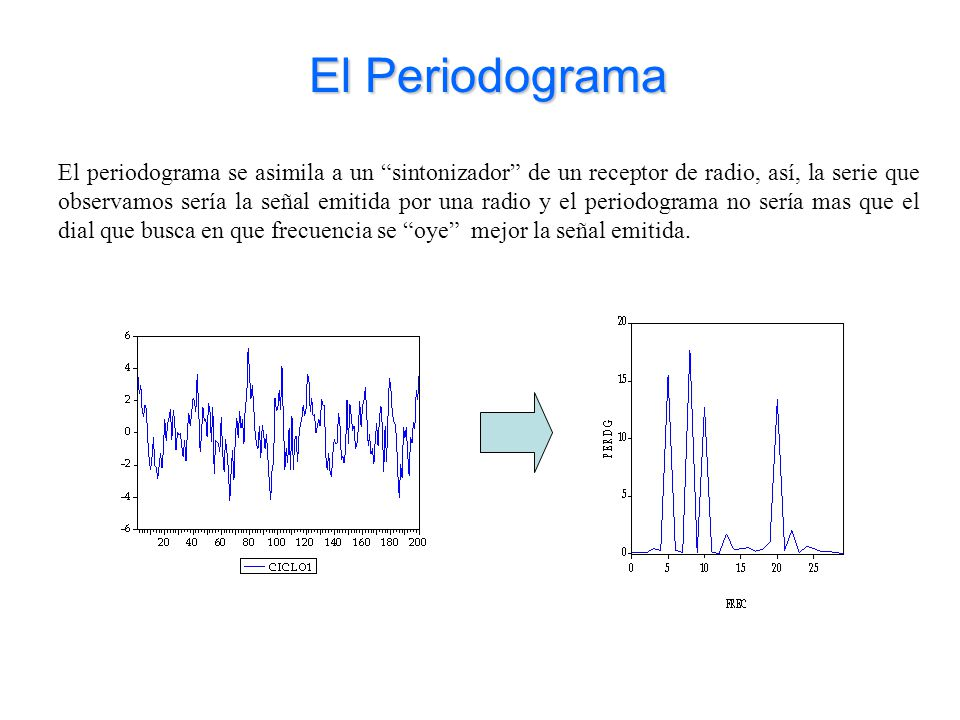
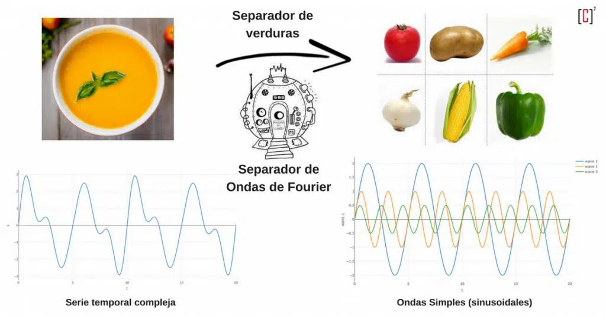
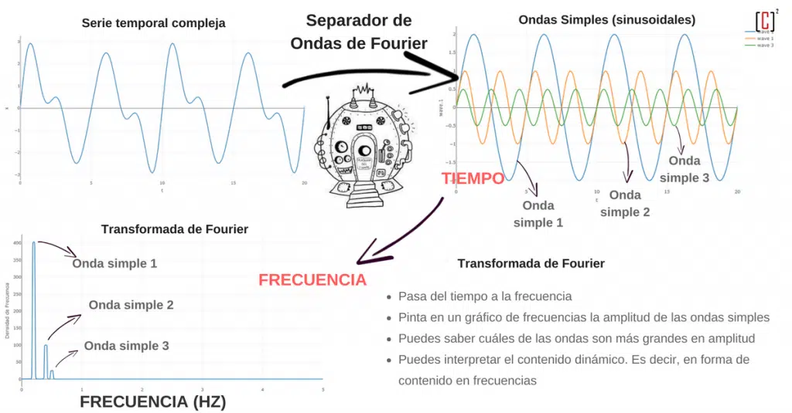
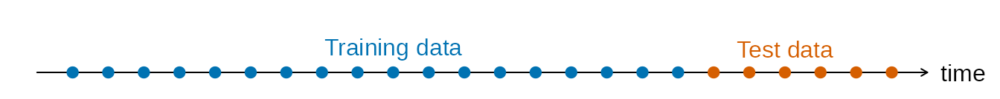
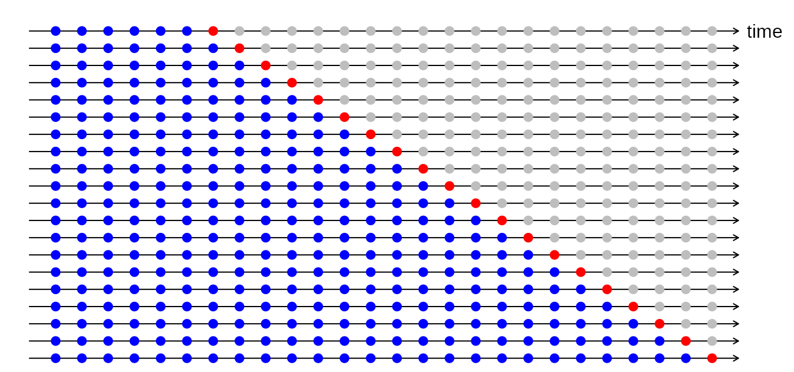
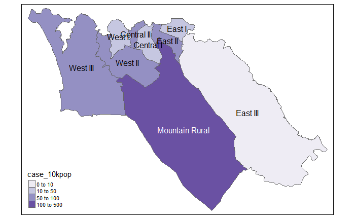
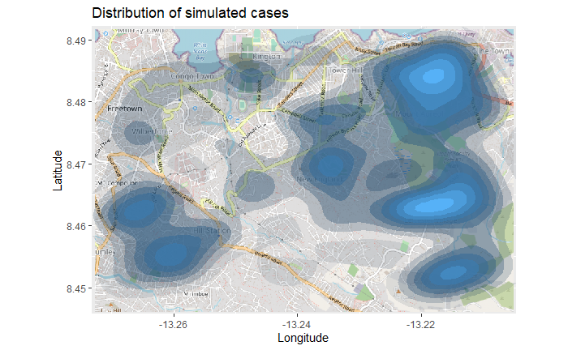
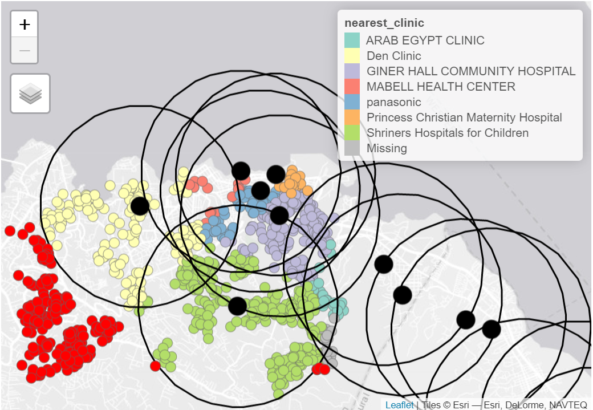
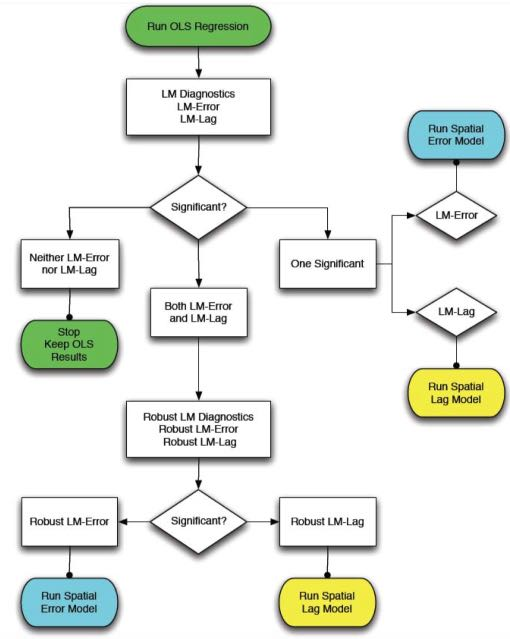

```{r echo = FALSE}
setwd("C:/Users/danfe/Dropbox/Proyectos Daniel/Cursos - diplomados - Maestrias/Programa de autoformación en investigación y análisis de datos/Rmarkdowns/Estadística/Programa de formación/Semana15 Series_temp_Geoespa")

knitr::opts_chunk$set(echo = TRUE, warning = FALSE, message = FALSE,
                         fig.show = "asis", results = "show",
                      fig.align='center',
                      fig.path = "figures/",  # Configura el directorio donde se guardan los gráficos
  dev = "png")
```


# Series temporales y detección de brotes

## Preparación

**Paquetes**

```{r}
pacman::p_load(rio,          # Importación de fichero
               here,         # Localizador de archivos
               tidyverse,    # gestión de datos + gráficos ggplot2
               tsibble,      # manejar conjuntos de datos de series temporales 
               slider,       # para calcular medias móviles
               imputeTS,     # para rellenar valores perdidos
               feasts,       # para descomposición de series temporales y autocorrelación
               forecast,     # ajustar los términos sin y cosin a los datos (nota: debe cargarse después de feasts)
               trending,     # ajustar y evaluar modelos 
               tmaptools,    # para obtener geocoordenadas (lon/lat) basadas en nombres de lugares
               ecmwfr,       # para interactuar con copernicus sateliate CDS API
               stars,        # para leer archivos .nc (datos climáticos)
               units,        # para definir unidades de medida (datos climáticos)
               yardstick,    # para ver la precisión del modelo
               surveillance  # para detectar aberraciones
               )
```

**Cargar datos**

En el siguiente ejemplo utilizamos datos del paquete surveillance sobre Campylobacter en Alemania

```{r}
# importar los recuentos a R
counts <- rio::import("campylobacter_germany.xlsx")
```


```{r, echo=FALSE}

DT::datatable(counts, rownames = T, options = list(pageLength = 100, scrollY = "200px", scrollX=T), class = 'white-space: nowrap' )

```

**Limpiar datos**

El código siguiente se asegura de que la columna de la fecha tenga el formato adecuado. Para esta sección utilizaremos el paquete tsibble y la función yearweek se utilizará para crear una variable de semana de calendario. 

```{r}
## asegura que la columna de fecha tiene el formato apropiado
counts$date <- as.Date(counts$date)

## crea una variable de semana calendario 
## ajusta las definiciones ISO de las semanas que empiezan en lunes
counts <- counts %>% 
     mutate(epiweek = yearweek(date, week_start = 1))
```

**Descargar datos climáticos**

Los datos climáticos de cualquier parte del mundo pueden descargarse del satélite Copérnico de la UE. No se trata de mediciones exactas, sino que se basan en un modelo (similar a la interpolación), pero la ventaja es la cobertura horaria global, así como las previsiones.

Para propósitos de demostración aquí, mostraremos el código R para usar el paquete ecmwfr para extraer estos datos del almacén de datos climáticos de Copernicus. Es necesario crear una cuenta gratuita para que esto funcione. [El sitio web del paquete](https://github.com/bluegreen-labs/ecmwfr#use-copernicus-climate-data-store-cds) tiene una guía útil de cómo hacerlo. A continuación se muestra un código de ejemplo de cómo hacer esto, una vez que tienes las claves de la API adecuada. Tienes que sustituir las X de abajo por los ID de tu cuenta. Tendrás que descargar un año de datos a la vez, de lo contrario el servidor se queda sin tiempo.

Si no estás seguro de las coordenadas de un lugar del que quieres descargar datos, puedes utilizar el paquete tmaptools para obtener las coordenadas de OpenStreetMaps. Una opción alternativa es el paquete photon, aunque todavía no se ha publicado en CRAN; lo bueno de photon es que proporciona más datos contextuales para cuando hay varias coincidencias en la búsqueda.

```{r eval = FALSE}

# No es necesario correr

wf_set_key(user = "XXXXX",
           key = "XXXXXXXXX-XXXX-XXXX-XXXX-XXXXXXXXXXX",
           service = "cds") 

## ejecútalo para cada año de interés (de lo contrario, el servidor dejará de funcionar)
for (i in 2002:2011) {
  
  ## descargarlos preparando una consulta 
  ## ver aquí cómo hacerlo: https://bluegreen-labs.github.io/ecmwfr/articles/cds_vignette.html#the-request-syntax
  ## cambia la consulta a una lista usando el botón addin de arriba (python to list)
  ## ¡¡¡El objetivo es el nombre del fichero de salida!!!
  request <- request <- list(
    product_type = "reanalysis",
    format = "netcdf",
    variable = c("2m_temperature", "total_precipitation"),
    year = c(i),
    month = c("01", "02", "03", "04", "05", "06", "07", "08", "09", "10", "11", "12"),
    day = c("01", "02", "03", "04", "05", "06", "07", "08", "09", "10", "11", "12",
            "13", "14", "15", "16", "17", "18", "19", "20", "21", "22", "23", "24",
            "25", "26", "27", "28", "29", "30", "31"),
    time = c("00:00", "01:00", "02:00", "03:00", "04:00", "05:00", "06:00", "07:00",
             "08:00", "09:00", "10:00", "11:00", "12:00", "13:00", "14:00", "15:00",
             "16:00", "17:00", "18:00", "19:00", "20:00", "21:00", "22:00", "23:00"),
    area = request_coords,
    dataset_short_name = "reanalysis-era5-single-levels",
    target = paste0("germany_weather", i, ".nc")
  )
  
  ## descargar el archivo y almacenarlo en el directorio de trabajo actual
  file <- wf_request(user     = "XXXXX",  # ID de usuario (para autenticación)
                     request  = request,  # la petición
                     transfer = TRUE,     # descargar el archivo
                     path     = here::here("data", "Weather")) ## ruta para guardar los datos
  }
```

Utiliza el siguiente código para importar estos archivos en R con el paquete stars.

```{r}
## definir ruta a carpeta del tiempo 
file_paths <- list.files(
  here::here("Semana15 Series_temp_Geoespa", "data"), # sustituir por la ruta de archivo propia
  full.names = TRUE)

## mantener sólo los que tienen el nombre actual de interés
file_paths <- file_paths[str_detect(file_paths, "germany")]

## leer todos los ficheros como un objeto stars 
data <- stars::read_stars(file_paths)
```

Una vez importados estos archivos como datos del objeto, los convertiremos en un dataframe.

```{r}
## cambiar a un dataframe 
temp_data <- as_tibble(data) %>% 
  ## añadir variables y corregir unidades
  mutate(
    ## crear una variable de calendario de semana actual 
    epiweek = tsibble::yearweek(time), 
    ## crear una variable de fecha (inicio de la semana de calendario)
    date = as.Date(epiweek),
    ## cambiar la temperatura de kelvin a celsius
    t2m = set_units(t2m, celsius), 
    ## cambiar la precipitación de metros a milímetros 
    tp  = set_units(tp, mm)) %>% 
  ## agrupar por semanas (aunque también se mantiene la fecha)
  group_by(epiweek, date) %>% 
  ## obtener la media por semana
  summarise(t2m = as.numeric(mean(t2m)), 
            tp = as.numeric(mean(tp)))
```

## Datos de series temporales
Existen varios paquetes para estructurar y manejar los datos de las series temporales. Como ya hemos dicho, nos centraremos en la familia de paquetes tidyverts y, por tanto, utilizaremos el paquete tsibble para definir nuestro objeto de serie temporal. Tener unos datos definidos como objeto de serie temporal significa que es mucho más fácil estructurar nuestro análisis.

Para ello utilizamos la función tsibble() y especificamos el “índex”, es decir, la variable que especifica la unidad de tiempo de interés. En nuestro caso se trata de la variable epiweek.

Si tuviéramos unos datos con recuentos semanales por provincia, por ejemplo, también podríamos especificar la variable de agrupación utilizando el argumento key =. Esto nos permitiría hacer un análisis para cada grupo.

```{r}
## definir el objeto de serie temporal
counts <- tsibble(counts, index = epiweek)
```

Si observamos el tipo class(counts), veremos que, además de ser un dataframe ordenado (“tbl_df”, “tbl”, “data.frame”), tiene las propiedades adicionales de un dataframe de series temporales (“tbl_ts”).

Se puede echar un vistazo rápido a los datos utilizando ggplot2. En el gráfico vemos que hay un claro patrón estacional y que no hay pérdidas. Sin embargo, parece haber un problema con la notificación al principio de cada año; los casos descienden en la última semana del año y luego aumentan en la primera semana del año siguiente.

```{r}
## trazar un gráfico lineal de casos por semana
ggplot(counts, aes(x = epiweek, y = case)) + 
     geom_line()
```

_**PELIGRO: La mayoría de los conjuntos de datos no están tan limpios como este ejemplo. Tendrás que comprobar si hay duplicados y faltas como se indica a continuación.**_

**Duplicados**
tsibble no permite observaciones duplicadas. Así que cada fila deberá ser única, o única dentro del grupo (variable key). El paquete tiene algunas funciones que ayudan a identificar los duplicados. Entre ellas se encuentran are_duplicated(), que proporciona un vector TRUE/FALSE para saber si la fila es un duplicado, y duplicates(), que proporciona un dataframe de las filas duplicadas.

```{r}
## obtener un vector de TRUE/FALSE si las filas están duplicadas
are_duplicated(counts[1:10,], index = epiweek) 

## obtener un data frame de filas duplicadas 
#duplicates(counts, index = epiweek) 

```

**Valores faltantes**

En nuestra breve inspección anterior hemos visto que no hay faltas, pero también hemos visto que parece haber un problema de retraso en la notificación en torno al año nuevo. Una forma de abordar este problema podría ser establecer estos valores como faltantes y luego imputar los valores. La forma más sencilla de imputación de series temporales consiste en trazar una línea recta entre el último valor no faltante y el siguiente valor no faltante. Para ello, utilizaremos la función na_interpolation() del paquete imputeTS.

Otra alternativa sería calcular una media móvil para intentar suavizar estos aparentes problemas de información.

```{r}
## crear una variable con los faltantes en lugar de las semanas con problemas de información
counts <- counts %>% 
     mutate(case_miss = if_else(
          ## si epiweek contiene 52, 53, 1 ó 2
          str_detect(epiweek, "W51|W52|W53|W01|W02"), 
          ## entonces se establece como missing 
          NA_real_, 
          ## de lo contrario, mantiene el valor por si acaso
          case
     ))

## alternativamente interpola los faltantes por tendencia lineal 
## entre dos puntos adyacentes más cercanos
counts <- counts %>% 
  mutate(case_int = imputeTS::na_interpolation(case_miss)
         )

## para comprobar qué valores se han imputado en comparación con el original
ggplot_na_imputations(counts$case_miss, counts$case_int) + 
  ## hacer un gráfico tradicional (con ejes negros y fondo blanco)
  theme_classic()
```


## Análisis descriptivo

**Medias móviles**

Si los datos tienen mucho ruido (los recuentos suben y bajan), puede ser útil calcular una media móvil. En el ejemplo siguiente, para cada semana se calcula la media de casos de las cuatro semanas anteriores. Esto suaviza los datos para hacerlos más interpretables. En nuestro caso esto no aporta mucho, así que nos quedaremos con los datos interpolados para el análisis posterior.

```{r}
## crear una variable de media móvil (se ocupa de las pérdidas)
counts <- counts %>% 
     ## crear la variable ma_4w 
     ## desplazar sobre cada fila de la variable de caso
     mutate(ma_4wk = slider::slide_dbl(case, 
                               ## para cada fila calcula el nombre
                               ~ mean(.x, na.rm = TRUE),
                               ## utiliza las cuatro semanas anteriores
                               .before = 4))
                               
## hacer una visualización rápida de la diferencia 
ggplot(counts, aes(x = epiweek)) + 
     geom_line(aes(y = case)) + 
     geom_line(aes(y = ma_4wk), colour = "red")
```

**Periodicidad**

```{r, echo=FALSE, fig.cap=" ", out.height=850, out.width=850}

```

A continuación definimos una función personalizada para crear un periodograma.
En primer lugar, se define la función. Sus argumentos incluyen unos datos con las columnas counts, start_week = que es la primera semana de los datos, un número para indicar cuántos períodos por año (por ejemplo, 52, 12) y, por último, el estilo de salida (véanse los detalles en el código siguiente).

```{r}
## Argumentos de la función
###########################
## x es un conjunto de datos
## counts es una variable con datos de recuento o tasas dentro de x  
## start_week es la primera semana del conjunto de datos
## period es el número de unidades en un año 
## output es si quiere devolver el periodograma espectral o las semanas de pico
  ## "periodogram" o "weeks"

# Define la función
periodogram <- function(x, 
                        counts, 
                        start_week = c(2002, 1), 
                        period = 52, 
                        output = "weeks") {
  

    ## asegurarse de que no es un tsibble, filtrar al proyecto y mantener sólo las columnas de interés
    prepare_data <- dplyr::as_tibble(x)
    
    # prepare_data <- prepare_data[prepare_data[[strata]] == j, ]
    prepare_data <- dplyr::select(prepare_data, {{counts}})
    
    ## crear una serie temporal intermedia "zoo" para poder utilizarla con spec.pgram
    zoo_cases <- zoo::zooreg(prepare_data, 
                             start = start_week, frequency = period)
    
    ## obtener un periodograma espectral sin utilizar la transformada rápida de fourier 
    periodo <- spec.pgram(zoo_cases, fast = FALSE, plot = FALSE)
    
    ## devuelve las semanas de pico
    periodo_weeks <- 1 / periodo$freq[order(-periodo$spec)] * period
    
    if (output == "weeks") {
      periodo_weeks
    } else {
      periodo
    }
    
}

## obtener el periodograma espectral para extraer las semanas con las frecuencias más altas 
## (comprobación de la estacionalidad) 
periodo <- periodogram(counts, 
                       case_int, 
                       start_week = c(2002, 1),
                       output = "periodogram")

## extraer el espectro y la frecuencia en un dataframe para graficarlo
periodo <- data.frame(periodo$freq, periodo$spec)

## trazar un periodograma que muestre la periodicidad más frecuente 
ggplot(data = periodo, 
                aes(x = 1/(periodo.freq/52),  y = log(periodo.spec))) + 
  geom_line() + 
  labs(x = "Period (Weeks)", y = "Log(density)")
```
```{r}
## obtener un vector semanas en orden ascendente 
peak_weeks <- periodogram(counts, 
                          case_int, 
                          start_week = c(2002, 1), 
                          output = "weeks")
peak_weeks[1:10]
```

NOTA: Es posible utilizar las semanas anteriores para añadirlas a los términos del seno y del coseno, sin embargo, utilizaremos una función para generar estos términos (véase la sección de regresión más adelante)


**Descomposición**
La descomposición clásica se utiliza para desglosar una serie temporal en varias partes, que en conjunto conforman el patrón que se observa. Estas diferentes partes son:

* La tendencia-ciclo (la dirección a largo plazo de los datos)

* La estacionalidad (patrones repetitivos)

* El azar (lo que queda después de quitar la tendencia y la estacionalidad)

```{r}
## descomponer el conjunto de datos de recuentos 
counts %>% 
  # utilizando un modelo de descomposición clásica aditiva
  model(classical_decomposition(case_int, type = "additive")) %>% 
  ## extraemos la información importante del modelo
  components() %>% 
## genera un gráfico 
  autoplot()
```

**Autocorrelación**
La autocorrelación informa de la relación entre los recuentos de cada semana y las semanas anteriores (denominadas retrasos o retardos).

Utilizando la función ACF(), podemos producir un gráfico que nos muestre un número de líneas para la relación en diferentes retrasos. Cuando el retardo es 0 (x = 0), esta línea sería siempre 1, ya que muestra la relación entre una observación y ella misma (no se muestra aquí). La primera línea mostrada aquí (x = 1) muestra la relación entre cada observación y la observación anterior (retardo de 1), la segunda muestra la relación entre cada observación y la observación anterior (retardo de 2) y así sucesivamente hasta el retardo de 52 que muestra la relación entre cada observación y la observación de 1 año (52 semanas antes).

El uso de la función PACF() (para la autocorrelación parcial) muestra el mismo tipo de relación pero ajustada para todas las demás semanas intermedias. Esto es menos informativo para determinar la periodicidad.

```{r}
## utilizando el conjunto de datos de recuentos
counts %>% 
  ## calcula la autocorrelación utilizando retardos de un año completo
  ACF(case_int, lag_max = 52) %>% 
  ## muestra un gráfico
  autoplot()
```
```{r}
## utilizando el conjunto de datos de recuentos
counts %>% 
  ## calcular la autocorrelación parcial utilizando los retardos de un año completo
  PACF(case_int, lag_max = 52) %>% 
  ## muestra un gráfico
  autoplot()
```

Puedes probar formalmente la hipótesis nula de independencia en una serie temporal (es decir, que no está autocorrelacionada) utilizando la prueba de Ljung-Box (en el paquete stats). Un valor-p significativo sugiere que hay autocorrelación en los datos.


```{r}
## prueba de independencia 
Box.test(counts$case_int, type = "Ljung-Box")
```

# Ajuste de regresiones

Es posible ajustar un gran número de regresiones diferentes a una serie temporal, sin embargo, aquí mostraremos cómo ajustar una regresión binomial negativa, ya que suele ser la más apropiada para los datos de recuento en las enfermedades infecciosas.


**Términos de Fourier**

*Una analogía: la crema de verduras*

Imagínate un sistema que te permita «desmezclar» lo que tienes.

No sé si existe el verbo «desmezclar». Mejor separar, ¿verdad? 😛

¡Eso es! Un sistema capaz de separar los elementos de algo mezclado. ¡Estarás flipando! jejeje

Imagina un sistema que separe las verduras enteras de una crema de verduras. (ya sé que es imposible pero atrévete a imaginarlo)

En una crema de verduras esta todo mezclado. No sabes si comes calabacín, cebolla, patata o que es… Una vez en la boca ya ni lo sabes. El gusto final es la suma de muchos gustos.

¡No te preocupes! Hoy no estás aquí para aprender a separar verduras. Más bien, vas a separar series temporales 🙂

Te presento a La Transformada de Fourier. Un sistema capaz de separar las verduras de la crema de verduras. ¡Es algo extraordinario! ¿No crees?

```{r, echo=FALSE, fig.cap=" ", out.height=850, out.width=850}

```


Una serie temporal es, en el fondo, la suma de muchas ondas como las que has visto antes. Estas ondas tienen la forma típica de un sin(x) o cos(x).

El señor Fourier demostró que existe este sistema «separador de verduras» (matemáticamente hablando).

Siempre puedes separar una serie temporal como la suma de muchas ondas de dimensiones diferentes y con ritmo también diferentes.

Los términos de Fourier son el equivalente a las curvas seno y coseno. La diferencia es que éstos se ajustan basándose en la búsqueda de la combinación de curvas más adecuada para explicar los datos.

Algo así.

Esto es la transformada de Fourier. Es un separador de series temporales en ondas simples.

La gracias del sistema separador de ondas de Fourier es que la serie temporal se expresa en forma de ondas muy simples.


```{r, echo=FALSE, fig.cap=" ", out.height=850, out.width=850}

```


Si sólo se ajusta un término de fourier, esto equivaldría a ajustar un seno y un coseno para el desfase más frecuente que se ve en el periodograma (en nuestro caso, 52 semanas). Utilizamos la función fourier() del paquete forecast.

En el código de abajo asignamos usando el $, ya que fourier() devuelve dos columnas (una para seno y otra para el coseno) y así se añaden al conjunto de datos como una lista, llamada “fourier” - pero esta lista se puede usar como una variable normal en la regresión.

```{r}
## añade los términos de fourier usando las variabless epiweek y case_int
counts$fourier <- dplyr::select(counts, epiweek, case_int) %>% 
  fourier(K = 1)
```

**Binomial negativa**

Es posible ajustar las regresiones utilizando las funciones básicas de stats o MASS (por ejemplo, lm(), glm() y glm.nb()). Sin embargo, utilizaremos las del paquete trending, ya que esto permite calcular intervalos de confianza y predicción adecuados (que de otro modo no están disponibles). La sintaxis es la misma, y se especifica una variable de resultado, luego una tilde (~) y luego se añaden las diversas variables de exposición de interés separadas por un signo más (+).

La otra diferencia es que primero definimos el modelo y luego lo ajustamos a los datos (fit()). Esto es útil porque permite comparar varios modelos diferentes con la misma sintaxis.

SUGERENCIA: Si deseas utilizar tasas, en lugar de recuentos, puedes incluir la variable de población como un término de compensación logarítmica, añadiendo offset(log(population). Entonces tendría que establecerse que la población es 1, antes de usar predict() para producir una tasa.

SUGERENCIA: Para ajustar modelos más complejos, como ARIMA o prophet, consulta el [paquete fable](https://fable.tidyverts.org/)

```{r}
## define el modelo que quieres ajustar (binomial negativo) 
model <- glm_nb_model(
  ## establece el número de casos como resultado de interés
  case_int ~
    ## utiliza epiweek para tener en cuenta la tendencia
    epiweek +
    ## usa los términos de fourier para tener en cuenta la estacionalidad
    fourier)

## ajusta tu modelo utilizando el conjunto de datos de recuentos
fitted_model <- trending::fit(model, data.frame(counts))

## calcula los intervalos de confianza y de predicción  
observed <- predict(fitted_model, simulate_pi = FALSE)

estimate_res <- data.frame(observed$result)

## representar la regresión 
ggplot(data = estimate_res, aes(x = epiweek)) + 
   ## añadir una línea para la estimación del modelo
  geom_line(aes(y = estimate),
            col = "Red") + 
  ## añadir una banda para los intervalos de predicción 
  geom_ribbon(aes(ymin = lower_pi, 
                  ymax = upper_pi), 
              alpha = 0.25) + 
  ## añade una línea para los recuentos de casos observados
  geom_line(aes(y = case_int), 
            col = "black") + 
  ## crea un gráfico tradicional (con ejes negros y fondo blanco)
  theme_classic()
```

**Residuos**

Para ver si nuestro modelo se ajusta a los datos observados, tenemos que observar los residuos. Los residuos son la diferencia entre los recuentos observados y los recuentos estimados a partir del modelo. Podríamos calcularlo simplemente utilizando case_int - estimate, pero la función residuals() lo extrae directamente de la regresión por nosotros.

Lo que vemos a continuación es que no estamos explicando toda la variación que podríamos con el modelo. Es posible que debamos ajustar más términos de Fourier y abordar la amplitud. Sin embargo, para este ejemplo lo dejaremos como está. Los gráficos muestran que nuestro modelo es peor en los picos y en los valles (cuando los recuentos son los más altos y los más bajos) y que es más probable que subestime los recuentos observados.

```{r}
## calcular los residuos 
estimate_res <- estimate_res %>% 
  mutate(resid = fitted_model$result[[1]]$residuals)

## ¿son los residuos bastante constantes a lo largo del tiempo (si no es así: brotes? ¿cambio en la práctica?)
estimate_res %>%
  ggplot(aes(x = epiweek, y = resid)) +
  geom_line() +
  geom_point() + 
  labs(x = "epiweek", y = "Residuals")
```

```{r}
## ¿hay autocorrelación en los residuos (hay un patrón en el error?)  
estimate_res %>% 
  as_tsibble(index = epiweek) %>% 
  ACF(resid, lag_max = 52) %>% 
  autoplot()
```
```{r}
## ¿se distribuyen normalmente los residuos (se subestiman o sobreestiman?)  
estimate_res %>%
  ggplot(aes(x = resid)) +
  geom_histogram(binwidth = 100) +
  geom_rug() +
  labs(y = "count") 
```

```{r}
## comparar los recuentos observados con sus residuos 
  ## tampoco debería haber un patrón 
estimate_res %>%
  ggplot(aes(x = estimate, y = resid)) +
  geom_point() +
  labs(x = "Fitted", y = "Residuals")
```

```{r}
## probar formalmente la autocorrelación de los residuos
## H0 es que los residuos proceden de una serie de ruido blanco (es decir, aleatoria)
## prueba de independencia 
## si el valor p es significativo entonces no es aleatorio
Box.test(estimate_res$resid, type = "Ljung-Box")
```

# Relación de dos series temporales

En este caso, analizamos el uso de los datos meteorológicos (concretamente la temperatura) para explicar los recuentos de casos de campylobacter.


**Fusión de conjuntos de datos**

Podemos unir nuestros conjuntos de datos utilizando la variable semana (epiweek). Para obtener más información sobre la fusión.

```{r}
## left join para que sólo tengamos las filas ya existentes en counts
## elimina la variable fecha de temp_data (de lo contrario estará duplicada)
counts <- left_join(counts, 
                    dplyr::select(temp_data, -date),
                    by = "epiweek")
```

**Análisis descriptivo**
En primer lugar, traza los datos para ver si hay alguna relación evidente. El siguiente gráfico muestra que hay una clara relación en la estacionalidad de las dos variables, y que la temperatura puede alcanzar su punto máximo unas semanas antes que el número de casos.

```{r}
counts %>% 
  ## conservar las variables que nos interesan 
  dplyr::select(epiweek, case_int, t2m) %>% 
  ## cambiar los datos a formato largo
  pivot_longer(
    ## utiliza epiweek como la clave
    !epiweek,
    ## mover los nombres de las columnas a la nueva columna "measure"
    names_to = "measure", 
    ## mover los valores de cell a la nueva columna " values"
    values_to = "value") %>% 
  ## crear un gráfico con el conjunto de datos anterior
  ## dibujar epiweek en el eje-x y valores (recuentos/celsius) en el eje-y 
  ggplot(aes(x = epiweek, y = value)) + 
    ## crea un gráfico separado para los recuentos de temperaturas y casos  
    ## dejar que establezcan sus propios ejes-y
    facet_grid(measure ~ ., scales = "free_y") +
    ## dibuja ambos como una línea
    geom_line()
```
**Retrasos y correlación cruzada*
Para comprobar formalmente qué semanas están más relacionadas entre los casos y la temperatura. Podemos utilizar la función de correlación cruzada (CCF()) del paquete de feats. También se podría visualizar (en lugar de utilizar arrange) utilizando la función autoplot().


```{r}
counts %>% 
  ## calcular la correlación cruzada entre los recuentos interpolados y la temperatura
  CCF(case_int, t2m,
      ## fija el desfase máximo en 52 semanas
      lag_max = 52, 
      ## devuelve el coeficiente de correlación 
      type = "correlation") %>% 
  ## ordena el coeficiente de correlación en orden descendente
  ## muestra los retardos más asociados
  arrange(-ccf) %>% 
  ## muestra sólo los diez primeros 
  slice_head(n = 10)
```

Vemos que un desfase de 4 semanas es el más correlacionado, por lo que creamos una variable de temperatura retardada para incluirla en nuestra regresión.

*PELIGRO: Ten en cuenta que las primeras cuatro semanas de nuestros datos en la variable de temperatura retardada faltan (NA) - ya que no hay cuatro semanas anteriores para obtener datos. Para utilizar este conjunto de datos con la función predict() de trending, necesitamos utilizar el argumento simulate_pi = FALSE dentro de predict() más abajo. Si quisiéramos utilizar la opción de simulación, entonces tenemos que eliminar estas pérdidas y almacenarlas como un nuevo conjunto de datos añadiendo drop_na(t2m_lag4) al fragmento de código que aparece a continuación.*

```{r}
counts <- counts %>% 
  ## crea una nueva variable para la temperatura retardada cada cuatro semanas
  mutate(t2m_lag4 = lag(t2m, n = 4))
```


**Binomial negativa con dos variables*

Ajustamos una regresión binomial negativa como se hizo anteriormente. Esta vez añadimos la variable de temperatura con un retraso de cuatro semanas.

PRECAUCIóN: Observa el uso de simulate_pi = FALSE dentro del argumento predict(). Esto se debe a que el comportamiento por defecto de trending es utilizar el paquete ciTools para estimar un intervalo de predicción. Esto no funciona si hay recuentos NA, y también produce intervalos más granulares. Véase ?trending::predict.trending_model_fit para más detalles.

```{r}
## define el modelo que se quiere ajustar (binomial negativo) 
model <- glm_nb_model(
  ## establecer el número de casos como resultado de interés
  case_int ~
    ## utiliza epiweek para tener en cuenta la tendencia
    epiweek +
    ## usar los términos de fourier para tener en cuenta la estacionalidad
    fourier + 
    ### usa el retraso de cuatro semanas de la temperatura
    t2m_lag4
    )

## ajusta el modelo usando el conjunto de datos de recuentos
fitted_model <- trending::fit(model, data.frame(counts))

## calcula los intervalos de confianza y de predicción 
observed <- predict(fitted_model, simulate_pi = FALSE)
```

Para investigar los términos individuales, podemos sacar la regresión binomial negativa original del formato de trending utilizando get_model() y pasarla a la función tidy() del paquete broom para recuperar las estimaciones exponenciadas y los intervalos de confianza asociados.

Lo que esto nos muestra es que la temperatura retardada, tras controlar la tendencia y la estacionalidad, es similar a los recuentos de casos (estimación ~ 1) y está significativamente asociada. Esto sugiere que podría ser una buena variable para predecir el número de casos futuros (ya que las previsiones climáticas están disponibles).

```{r}
model<-fitted_model %>% 
    get_fitted_model()
model  ## extrae la regresión binomial negativa original
```


```{r}
  ## obtiene un dataframe ordenado de los resultados
library(MASS)

glm.nb(formula = case_int ~ epiweek + fourier + t2m_lag4, data = data.frame(counts), 
    init.theta = 32.80443114, link = log) %>% 
  gtsummary::tbl_regression(exp=T)
```

Una rápida inspección visual del modelo muestra que se podría hacer un mejor trabajo de estimación de los recuentos de casos observados.

```{r}
## traza la regresión 
ggplot(data = estimate_res, aes(x = epiweek)) + 
  ## añade una línea para la estimación del modelo
  geom_line(aes(y = estimate),
            col = "Red") + 
  ## añade una banda para los intervalos de predicción 
  geom_ribbon(aes(ymin = lower_pi, 
                  ymax = upper_pi), 
              alpha = 0.25) + 
  ## añade una línea para los recuentos de casos observados
  geom_line(aes(y = case_int), 
            col = "black") + 
  ## crea un gráfico tradicional (con ejes negros y fondo blanco)
  theme_classic()
```

**Residuos**

Volvemos a investigar los residuos para ver si nuestro modelo se ajusta a los datos observados. Los resultados y la interpretación aquí son similares a los de la regresión anterior, por lo que puede ser más factible quedarse con el modelo más simple sin temperatura.

```{r}
## calcular los residuos 
estimate_res <- estimate_res %>% 
  mutate(resid = case_int - estimate)

## ¿son los residuos bastante constantes a lo largo del tiempo (si no es así: brotes? ¿cambio en la práctica?)
estimate_res %>%
  ggplot(aes(x = epiweek, y = resid)) +
  geom_line() +
  geom_point() + 
  labs(x = "epiweek", y = "Residuals")
```

```{r}
## ¿hay autocorrelación en los residuos (hay un patrón en el error?)  
estimate_res %>% 
  as_tsibble(index = epiweek) %>% 
  ACF(resid, lag_max = 52) %>% 
  autoplot()
```

```{r}
## ¿se distribuyen normalmente los residuos (se subestiman o sobreestiman?)  
estimate_res %>%
  ggplot(aes(x = resid)) +
  geom_histogram(binwidth = 100) +
  geom_rug() +
  labs(y = "count") 
```

```{r}
## compara los recuentos observados con sus residuales
  ## tampoco debería haber un patrón
estimate_res %>%
  ggplot(aes(x = estimate, y = resid)) +
  geom_point() +
  labs(x = "Fitted", y = "Residuals")
```

```{r}
## probar formalmente la autocorrelación de los residuos
## H0 es que los residuos proceden de una serie de ruido blanco (es decir, aleatoria)
## prueba de independencia 
## si el valor p es significativo entonces no es aleatorio
Box.test(estimate_res$resid, type = "Ljung-Box")
```

# Detección de brotes

Aquí mostraremos dos métodos (similares) de detección de brotes. El primero se basa en las secciones anteriores. Utilizamos el paquete trending para ajustar las regresiones a los años anteriores, y luego predecir lo que esperamos ver en el año siguiente. Si los recuentos observados están por encima de lo que esperamos, esto podría sugerir que hay un brote. El segundo método se basa en principios similares, pero utiliza el paquete surveillance, que tiene varios algoritmos diferentes para la detección de aberraciones.

ATENCIÓN: Normalmente, estás interesado en el año actual (donde sólo se conocen los recuentos hasta la semana actual). Así que en este ejemplo pretendemos estar en la semana 39 de 2011.

Paquete trending
Para este método definimos una línea base (que normalmente debería ser de unos 5 años de datos). Ajustamos una regresión a los datos de referencia y la utilizamos para predecir las estimaciones del año siguiente.

Fecha de corte
Es más fácil definir las fechas en un lugar y luego utilizarlas en el resto del código.

Aquí definimos una fecha de inicio (cuando comenzaron nuestras observaciones) y una fecha de corte (el final de nuestro período de referencia - y cuando comienza el período que queremos predecir). ~También definimos cuántas semanas hay en nuestro año de interés (el que vamos a predecir)~. También definimos cuántas semanas hay entre nuestra fecha límite de referencia y la fecha final para la que nos interesa predecir.

NOTA: En este ejemplo pretendemos estar actualmente a finales de septiembre de 2011 (“2011 W39”).

```{r}
## define la fecha de inicio (cuando empezaron las observaciones)
start_date <- min(counts$epiweek)


## define una semana de corte (fin de la línea base, inicio del periodo de predicción)
cut_off <- yearweek("2010-12-31")

## define la última fecha de interés (es decir, el final de la predicción)
end_date <- yearweek("2011-12-31")

## encontrar cuántas semanas en el período (año) de interés
num_weeks <- as.numeric(end_date - cut_off)
```

Añadir filas
Para poder pronosticar en un formato tidyverse, necesitamos tener el número correcto de filas en nuestro conjunto de datos, es decir, una fila por cada semana hasta la end_date (fecha de corte) definida anteriormente. El código siguiente permite añadir estas filas por una variable de agrupación - por ejemplo, si tuviéramos varios países en unos datos, podríamos agrupar por país y luego añadir filas apropiadas para cada uno. La función group_by_key() de tsibble nos permite hacer esta agrupación y luego pasar los datos agrupados a las funciones de dplyr, group_modify() y add_row(). Luego especificamos la secuencia de semanas entre una después de la semana máxima disponible actualmente en los datos y la semana final

```{r eval=FALSE}
## añade las semanas que faltan hasta final de año  
counts2 <- counts 
counts <- counts %>%
  ## agrupa por región
  group_by_key() %>%
  ## para cada grupo, añade filas desde la mayor epiweek hasta el final del año
  group_modify(~add_row(.,
                        epiweek = seq(max(.$epiweek) + 1, 
                                      end_date,
                                      by = 1)))
```

**Términos de Fourier**
Tenemos que redefinir nuestros términos de fourier, ya que queremos ajustarlos sólo a la fecha de referencia y luego predecir (extrapolar) esos términos para el año siguiente. Para ello tenemos que combinar dos listas de salida de la función fourier() juntas; la primera es para los datos de referencia, y la segunda predice para el año de interés (definiendo el argumento h).

N.b. para enlazar filas tenemos que usar rbind() (en lugar de bind_rows de tidyverse) ya que las columnas de fourier son una lista (por lo que no se nombran individualmente).

```{r}
## define los términos de fourier (sencos) 
counts <- counts %>% 
  mutate(
    ## combina los términos de fourier para las semanas anteriores y posteriores a la fecha límite de 2010
    ## (nb. los términos de fourier de 2011 están proyectados)
    fourier = rbind(
      ## obtiene los términos de fourier de años anteriores
      fourier(
        ## conserva sólo las filas anteriores a 2011
        filter(counts, 
               epiweek <= cut_off), 
        ## incluye un conjunto de términos sen cos 
        K = 1
        ), 
      ## predice los términos de fourier para 2011 (usando datos de referencia)
      fourier(
        ## conserva sólo las filas anteriores a 2011
        filter(counts, 
               epiweek <= cut_off),
        ## incluye un conjunto de términos sen cos 
        K = 1, 
        ## predice con 52 semanas de antelación
        h = num_weeks
        )
      )
    )
```


**Dividir los datos y ajustar la regresión*

Ahora tenemos que dividir nuestro conjunto de datos en el período de referencia y el período de predicción. Esto se hace utilizando la función group_split() de dplyr después de group_by(), y creará una lista con dos dataframes, uno para antes de tu corte y otro para después.

A continuación, utilizamos la función pluck() del paquete purrr para extraer los datos del listado (lo que equivale a utilizar corchetes, por ejemplo, dat[1]]), y podemos ajustar nuestro modelo a los datos de referencia, y luego utilizar la función predict() para nuestros datos de interés después del corte.

ATENCIÓN: Observa el uso de simulate_pi = FALSE dentro del argumento predict(). Esto se debe a que el comportamiento por defecto de trending es utilizar el paquete ciTools para estimar un intervalo de predicción. Esto no funciona si hay recuentos NA, y también produce intervalos más granulares. Véase ?trending::predict.trending_model_fit para más detalles.

```{r}
# divide los datos para el ajuste y la predicción
dat <- counts %>% 
  group_by(epiweek <= cut_off) %>%
  group_split()

## define el modelo que se desea ajustar (binomial negativa)  
model <- glm_nb_model(
  ## establece el número de casos como resultado de interés
  case_int ~
    ## usa epiweek para tener en cuenta la tendencia
    epiweek +
    ## utiliza los términos furier para tener en cuenta la estacionalidad
    fourier
)

# define qué datos utilizar para el ajuste y cuáles para la predicción
fitting_data <- pluck(dat, 2)
pred_data <- pluck(dat, 1) %>% 
  dplyr::select(case_int, epiweek, fourier)

# ajusta el modelo 
fitted_model <- trending::fit(model, data.frame(fitting_data))

# obtiene intervalos de confianza y estimaciones para los datos ajustados
observed <- fitted_model %>% 
  predict(simulate_pi = FALSE)

# pronostica con los datos con los que se quiere predecir 
forecasts <- fitted_model %>% 
  predict(data.frame(pred_data), simulate_pi = FALSE)

## combina los conjuntos de datos de referencia y de predicción
observed <- bind_rows(observed$result, forecasts$result)
```

Como anteriormente, podemos visualizar nuestro modelo con ggplot. Resaltamos las alertas con puntos rojos para los recuentos observados por encima del intervalo de predicción del 95%. Esta vez también añadimos una línea vertical para etiquetar cuándo empieza la predicción. ##hastaqui

```{r}
## representar la regresión 
ggplot(data = observed, aes(x = epiweek)) + 
  ## añade una línea para la estimación del modelo
  geom_line(aes(y = estimate),
            col = "grey") + 
  ## añade una banda para los intervalos de predicción 
  geom_ribbon(aes(ymin = lower_pi, 
                  ymax = upper_pi), 
              alpha = 0.25) + 
  ## añade una línea para los recuentos de casos observados
  geom_line(aes(y = case_int), 
            col = "black") + 
  ## representar en puntos los recuentos observados por encima de lo esperado
  geom_point(
    data = filter(observed, case_int > upper_pi), 
    aes(y = case_int), 
    colour = "red", 
    size = 2) + 
  ## añade una línea vertical y una etiqueta para mostrar dónde empieza la previsión
  geom_vline(
           xintercept = as.Date(cut_off), 
           linetype = "dashed") + 
  annotate(geom = "text", 
           label = "Forecast", 
           x = cut_off, 
           y = max(observed$upper_pi) - 250, 
           angle = 90, 
           vjust = 1
           ) + 
  ## realiza un gráfico tradicional (con ejes negros y fondo blanco)
  theme_classic()
```

**Validación de la predicción**

Más allá de la inspección de los residuos, es importante investigar lo bueno que es tu modelo para predecir casos en el futuro. Esto te da una idea de la fiabilidad de tus umbrales de alerta.

La forma tradicional de validar es ver lo bien que se puede predecir el último año anterior al actual (porque aún no se conocen los recuentos del “año actual”). Por ejemplo, en nuestro conjunto de datos, utilizaríamos los datos de 2002 a 2009 para predecir 2010, y luego veríamos la precisión de esas predicciones. A continuación, volveríamos a ajustar el modelo para incluir los datos de 2010 y los utilizaríamos para predecir los recuentos de 2011.

Como puede verse en la siguiente figura de Hyndman et al en “Forecasting principles and practice”.

```{r, echo=FALSE, fig.cap=" ", out.height=850, out.width=850}

```

La desventaja de esto es que no estás usando todos los datos disponibles, y no es el modelo final que estás usando para la predicción.

Una alternativa es utilizar un método llamado validación cruzada. En este caso, se pasan todos los datos disponibles para ajustar múltiples modelos de predicción a un año vista. Se utilizan cada vez más datos en cada modelo, como se ve en la siguiente figura del mismo [texto de Hyndman et al](https://otexts.com/fpp3/). Por ejemplo, el primer modelo utiliza 2002 para predecir 2003, el segundo utiliza 2002 y 2003 para predecir 2004, y así sucesivamente.


```{r, echo=FALSE, fig.cap=" ", out.height=850, out.width=850}

```


A continuación, utilizamos la función map() del paquete purrr para recorrer cada conjunto de datos. Luego, ponemos las estimaciones conjunto de datos y las fusionamos con los recuentos de casos originales, para utilizar el paquete yardstick para calcular las medidas de precisión. Calculamos cuatro medidas que incluyen: Error medio cuadrático (RMSE), Error medio absoluto (MAE), Error medio absoluto a escala (MASE), Error medio porcentual absoluto (MAPE).

ATENCIÓN: Observa el uso de simulate_pi = FALSE dentro del argumento predict(). Esto se debe a que el comportamiento por defecto de la tendencia es utilizar el paquete ciTools para estimar un intervalo de predicción. Esto no funciona si hay recuentos NA, y también produce intervalos más granulares. Véase ?trending::predict.trending_model_fit para más detalles.

```{r}
## Validación cruzada: predicción de la(s) semana(s) anterior(es) basada en una ventana deslizante.

## amplía los datos en ventanas de 52 semanas (antes + después) 
## para predecir 52 semanas por delante
## (crea cadenas de observaciones cada vez más largas - mantiene los datos más antiguos)

## define la ventana que se quiere utilizar
roll_window <- 52

## define las semanas que se quieren predecir 
weeks_ahead <- 52

## crea un conjunto de datos repetidos, cada vez más largos
## etiqueta cada conjunto de datos con un id único
## utiliza sólo casos anteriores al año de interés (es decir, 2011)
case_roll <- counts %>% 
  filter(epiweek < cut_off) %>% 
  ## mantiene sólo las variables de semana y recuento de casos
  dplyr::select(epiweek, case_int) %>% 
    ## elimina las últimas x observaciones 
    ## dependiendo de cuántas semanas se prevean 
    ## (de lo contrario será una previsión real a "desconocido")
    slice(1:(n() - weeks_ahead)) %>%
    as_tsibble(index = epiweek) %>% 
    ## desplaza cada semana en x después de las ventanas para crear ID de agrupación 
    ## dependiendo de lo que especifique roll_window
    stretch_tsibble(.init = roll_window, .step = 1) %>% 
  ## elimina el primer par - ya que no tiene casos "anteriores"
  filter(.id > roll_window)


## para cada uno de los grupos de datos únicos se ejecuta el código siguiente
forecasts <- purrr::map(unique(case_roll$.id), 
                        function(i) {
  
  ## sólo se mantiene el conjunto actual que se está ajustando 
  mini_data <- filter(case_roll, .id == i) %>% 
    as_tibble()
  
  ## crea un conjunto de datos vacío para la previsión 
  forecast_data <- tibble(
    epiweek = seq(max(mini_data$epiweek) + 1,
                  max(mini_data$epiweek) + weeks_ahead,
                  by = 1),
    case_int = rep.int(NA, weeks_ahead),
    .id = rep.int(i, weeks_ahead)
  )
  
  # añade los datos de previsión a los originales 
  mini_data <- bind_rows(mini_data, forecast_data)
  
  ## define los puntos de corte en función de los últimos datos de recuento no faltantes 
  cv_cut_off <- mini_data %>% 
    ## conserva sólo las filas no faltantes
    drop_na(case_int) %>% 
    ## obtiene la última semana
    summarise(max(epiweek)) %>% 
    ## extrae lo que no está en un dataframe
    pull()
  
## convierte mini_data en un tsibble
  mini_data <- tsibble(mini_data, index = epiweek)
  
  ## define los términos de fourier (sencos) 
  mini_data <- mini_data %>% 
    mutate(
    ## combina los términos de fourier para las semanas anteriores y posteriores a la fecha de corte
    fourier = rbind(
      ## obtiene los términos de fourier de años anteriores
      forecast::fourier(
        ## conserva sólo las filas anteriores a la fecha de corte
        filter(mini_data, 
               epiweek <= cv_cut_off), 
        ## incluye un conjunto de términos sen cos 
        K = 1
        ), 
      ## predice los términos de fourier para el año siguiente (utilizando los datos de referencia)
      fourier(
        ## conserva sólo las filas anteriores al corte
        filter(mini_data, 
               epiweek <= cv_cut_off),
        ## incluye un conjunto de términos seno-cos 
        K = 1, 
        ## predice con 52 semanas de antelación
        h = weeks_ahead
        )
      )
    )
  
  
  # divide los datos para el ajuste y la predicción
  dat <- mini_data %>% 
    group_by(epiweek <= cv_cut_off) %>%
    group_split()

  ## define el modelo que se quiere ajustar (binomial negativa) 
  model <- glm_nb_model(
    ## establece el número de casos como resultado de interés
    case_int ~
      ## utiliza epiweek para tener en cuenta la tendencia
      epiweek +
      ## usa los términos de furier para tener en cuenta la estacionalidad
      fourier
  )

  # define qué datos utilizar para el ajuste y cuáles para la predicción
  fitting_data <- pluck(dat, 2)
  pred_data <- pluck(dat, 1)
  
  # ajusta el modelo 
  fitted_model <- trending::fit(model, fitting_data)
  
  # proyecta con los datos que se quieren predecir 
  forecasts <- fitted_model %>% 
    predict(data.frame(pred_data), simulate_pi = FALSE) 
  forecasts <- data.frame(forecasts$result[[1]]) %>% 
    ## conserva sólo la semana y la estimación de la previsión
    dplyr::select(epiweek, estimate)
    
  }
  )

## convierte la lista en un dataframe con todas las proyecciones
forecasts <- bind_rows(forecasts)

## une las proyecciones con los datos observados
forecasts <- left_join(forecasts, 
                       dplyr::select(counts, epiweek, case_int),
                       by = "epiweek")

## usando {yardstick} calcula las métricas
  ## RMSE: Root mean squared error (error cuadrático medio)
  ## MAE: Error medio absoluto  
  ## MASE: Mean absolute scaled error (Error medio absoluto a escala)
  ## MAPE: Error porcentual medio absoluto
model_metrics <- bind_rows(
  ## compara lo observado con lo proyectado en el conjunto de datos de previsiones
  rmse(forecasts, case_int, estimate), 
  mae( forecasts, case_int, estimate),
  mase(forecasts, case_int, estimate),
  mape(forecasts, case_int, estimate),
  ) %>% 
  ## conserva sólo el tipo de métrica y su salida
  dplyr::select(Metric  = .metric, 
         Measure = .estimate) %>% 
  ## convierte en formato ancho para poder enlazar filas después
  pivot_wider(names_from = Metric, values_from = Measure)

## devuelve las métricas del modelo 
model_metrics
```

**paquete surveillance**

En esta sección utilizamos el paquete surveillance para crear umbrales de alerta basados en algoritmos de detección de brotes. Hay varios métodos diferentes disponibles en el paquete, aunque aquí nos centraremos en dos opciones. Para más detalles, consulta estos documentos sobre [la aplicación](https://cran.r-project.org/web/packages/surveillance/vignettes/monitoringCounts.pdf) y [la teoría](https://cran.r-project.org/web/packages/surveillance/vignettes/glrnb.pdf) de los algoritmos utilizados.

La primera opción utiliza el método Farrington mejorado. Este método ajusta un glm binomial negativo (incluyendo la tendencia) y pondera a la baja los brotes pasados (valores atípicos) para crear un nivel de umbral.

La segunda opción utiliza el método glrnb. Esto también se ajusta a un glm binomial negativo, pero incluye la tendencia y los términos de fourier (por lo que se favorece aquí). La regresión se utiliza para calcular la “media de control” (~valores ajustados), y a continuación se utiliza un estadístico de relación de verosimilitud generalizada para evaluar si hay un cambio en la media de cada semana. Ten en cuenta que el umbral de cada semana tiene en cuenta las semanas anteriores, por lo que si hay un cambio sostenido se activará una alarma. (También hay que tener en cuenta que después de cada alarma el algoritmo se reinicia)

Para trabajar con el paquete surveillance, primero tenemos que definir un objeto “surveillance time series” (utilizando la función sts()) para que encaje en el marco de trabajo.

```{r}
## define el objeto series temporales de vigilancia
## nota. se puede incluir un denominador con el objeto población (ver ?sts)
counts_sts <- sts(observed = counts$case_int[!is.na(counts$case_int)],
                  start = c(
                    ## subconjunto para mantener sólo el año desde start_date 
                    as.numeric(str_sub(start_date, 1, 4)), 
                    ## subconjunto para mantener sólo la semana a partir de start_date
                    as.numeric(str_sub(start_date, 7, 8))), 
                  ## define el tipo de datos (en este caso semanales)
                  freq = 52)

## define el rango de semanas que se quiere incluir (es decir, el periodo de predicción)
## nota: el objeto sts sólo cuenta las observaciones sin asignarles un identificador de semana o año. 
## identificador de año - utilizaremos nuestros datos para definir las observaciones adecuadas
weekrange <- cut_off - start_date
```

**Método Farrington**
A continuación, definimos cada uno de nuestros parámetros para el método Farrington en una list. A continuación, ejecutamos el algoritmo utilizando farringtonFlexible() y luego podemos extraer el umbral de una alerta utilizando farringtonmethod@upperbound para incluirlo en nuestro conjunto de datos. También es posible extraer un TRUE/FALSE para cada semana si se activó una alerta (estaba por encima del umbral) utilizando farringtonmethod@alarm.

```{r}
## define control
ctrl <- list(
  ## define para qué periodo de tiempo se quiere el umbral (por ejemplo, 2011)
  range = which(counts_sts@epoch > weekrange),
  b = 9, ## cuántos años hacia atrás para la línea base
  w = 2, ## tamaño de la ventana móvil en semanas
  weightsThreshold = 2.58, ## reponderar brotes pasados (método noufaily mejorado - original sugiere 1)
  ## pastWeeksNotIncluded = 3, ## utiliza todas las semanas disponibles (noufaily sugiere dejar 26)
  trend = TRUE,
  pThresholdTrend = 1, ## 0.05 normalmente, sin embargo se aconseja 1 en el método mejorado (es decir, mantener siempre)
  thresholdMethod = "nbPlugin",
  populationOffset = TRUE
  )

## aplicar el método farrington flexible
farringtonmethod <- farringtonFlexible(counts_sts, ctrl)

## crea una nueva variable en el conjunto de datos original llamada umbral
## que contiene el límite superior de farrington 
## nota: esto es solo para las semanas de 2011 (por lo que hay que hacer un subconjunto de filas)
counts[which(counts$epiweek >= cut_off & 
               !is.na(counts$case_int)),
              "threshold"] <- farringtonmethod@upperbound
```


A continuación, podemos visualizar los resultados en ggplot como se hizo anteriormente.

```{r}
ggplot(counts, aes(x = epiweek)) + 
  ## añade los recuentos de casos observados como una línea
  geom_line(aes(y = case_int, colour = "Observed")) + 
  ## añade el límite superior del algoritmo de aberración
  geom_line(aes(y = threshold, colour = "Alert threshold"), 
            linetype = "dashed", 
            size = 1.5) +
  ## define los colores
  scale_colour_manual(values = c("Observed" = "black", 
                                 "Alert threshold" = "red")) + 
  ## realiza un gráfico tradicional (con ejes negros y fondo blanco)
  theme_classic() + 
  ## elimina el título de la leyenda 
  theme(legend.title = element_blank())
```

**Método GLRNB**

Del mismo modo, para el método GLRNB definimos cada uno de nuestros parámetros en una list, luego ajustamos el algoritmo y extraemos los límites superiores.

ATENCIÓN: Este método utiliza la “fuerza bruta” (similar al bootstrapping) para calcular los umbrales, por lo que puede llevar mucho tiempo.

Consulta la [viñeta GLRNB](https://cran.r-project.org/web/packages/surveillance/vignettes/glrnb.pdf) para más detalles.

```{r}
## define las opciones de control
ctrl <- list(
  ## define para qué periodo de tiempo se quiere el umbral (por ejemplo, 2011)
  range = which(counts_sts@epoch > weekrange),
  mu0 = list(S = 1,    ## número de términos de fourier (armónicos) a incluir
  trend = TRUE,   ## si incluye la tendencia o no
  refit = FALSE), ## si se reajusta el modelo después de cada alarma
  ## cARL = umbral para el estadístico GLR (arbitrario)
     ## 3 ~ término medio para minimizar los falsos positivos
     ## 1 se ajusta al 99%PI de glm.nb - con cambios después de los picos (umbral reducido para la alerta)
   c.ARL = 2,
   # theta = log(1.5), ## equivale a un aumento del 50% de casos en un brote
   ret = "cases"     ## devuelve el límite superior del umbral como recuento de casos
  )

## aplica el método glrnb
glrnbmethod <- glrnb(counts_sts, control = ctrl, verbose = FALSE)

## crea una nueva variable en el conjunto de datos original llamada umbral
## que contiene el límite superior de glrnb 
## nota: esto es solo para las semanas de 2011 (por lo que hay que hacer un subconjunto de filas)
counts[which(counts$epiweek >= cut_off & 
               !is.na(counts$case_int)),
              "threshold_glrnb"] <- glrnbmethod@upperbound
```

visualiza

```{r}
ggplot(counts, aes(x = epiweek)) + 
  ## añade los recuentos de casos observados como una línea
  geom_line(aes(y = case_int, colour = "Observed")) + 
  ## añade el límite superior del algoritmo de aberración
  geom_line(aes(y = threshold_glrnb, colour = "Alert threshold"), 
            linetype = "dashed", 
            size = 1.5) +
  ## define los colores
  scale_colour_manual(values = c("Observed" = "black", 
                                 "Alert threshold" = "red")) + 
  ## realiza un gráfico tradicional (con ejes negros y fondo blanco)
  theme_classic() + 
  ## elimina el título de la leyenda  
  theme(legend.title = element_blank())
```

## Series temporales interrumpidas
Las series temporales interrumpidas (también llamadas análisis de regresión segmentada o de intervención), se utilizan a menudo para evaluar el impacto de las vacunas en la incidencia de la enfermedad. Pero puede utilizarse para evaluar el impacto de una amplia gama de intervenciones o introducciones. Por ejemplo, cambios en los procedimientos hospitalarios o la introducción de una nueva cepa de enfermedad en una población.

En este ejemplo, supondremos que se introdujo una nueva cepa de Campylobacter en Alemania a finales de 2008, y veremos si eso afecta al número de casos. Volveremos a utilizar la regresión binomial negativa. Esta vez, la regresión se dividirá en dos partes, una antes de la intervención (o introducción de la nueva cepa en este caso) y otra después (los períodos anterior y posterior). Esto nos permite calcular una tasa de incidencia comparando los dos periodos de tiempo. Explicar la ecuación podría aclararlo (si no es así, ignórala).

La regresión binomial negativa puede definirse como sigue:

$\log(Y_t)= β_0 + β_1 \times t+ β_2 \times δ(t-t_0) + β_3\times(t-t_0 )^+ + log(pop_t) + e_t$

Donde: 
$(Y_t)$ es el número de casos observados en el momento; $(t)(pop_t)$ es el tamaño de la población en 100.000s en el momento; $(t)$ (no se utiliza aquí); $(t_0)$ es el último año del preperíodo (incluyendo el tiempo de transición si lo hay); $(δ(x)$ es la función indicadora (es 0 si x≤0 y 1 si x >0)(($x^+$)) es el operador de corte (es x si x>0 y 0 en caso contrario); (e_t$) denota el residuo

Se pueden añadir los términos adicionales tendencia y estación según sea necesario.

$β_2 \times δ(t-t_0) + β_3\times(t-t_0 )^+$ es la parte lineal generalizada del periodo posterior y es cero en el periodo anterior. Esto significa que las estimaciones $β_2$ y $β_3$ son los efectos de la intervención.

Aquí tenemos que volver a calcular los términos de Fourier sin previsión, ya que utilizaremos todos los datos de que disponemos (es decir, a posteriori). Además, tenemos que calcular los términos adicionales necesarios para la regresión.

```{r}
## añade los términos de fourier utilizando las variables epiweek y case_int
counts$fourier <- dplyr::select(counts, epiweek, case_int) %>% 
  as_tsibble(index = epiweek) %>% 
  fourier(K = 1)

## define la semana de intervención 
intervention_week <- yearweek("2008-12-31")

## define variables para la regresión 
counts <- counts %>% 
  mutate(
    ## corresponde a t en la fórmula
      ## recuento de semanas (probablemente también se podría usar directamente la variable epiweek)
    # linear = row_number(epiweek), 
    ## corresponde a delta(t-t0) en la fórmula
      ## periodo anterior o posterior a la intervención
    intervention = as.numeric(epiweek >= intervention_week), 
    ## corresponde a (t-t0)^+ en la fórmula
      ## recuento de semanas posteriores a la intervención
      ## ( elige el número mayor entre 0 y lo que resulte del cálculo)
    time_post = pmax(0, epiweek - intervention_week + 1))
```

A continuación, utilizamos estos términos para ajustar una regresión binomial negativa y elaboramos una tabla con el porcentaje de cambio. Lo que muestra este ejemplo es que no hubo ningún cambio significativo.

ATENCIÓN: Observa el uso de simulate_pi = FALSE dentro del argumento de predict(). Esto se debe a que el comportamiento por defecto de la tendencia es utilizar el paquete ciTools para estimar un intervalo de predicción. Esto no funciona si hay recuentos NA, y también produce intervalos más granulares. Véase ?trending::predict.trending_model_fit para más detalles.

```{r}
## define el modelo que se quiere ajustar (binomial negativo) 
model <- glm_nb_model(
  ## establece el número de casos como resultado de interés
  case_int ~
    ## utiliza epiweek para tener en cuenta la tendencia
    epiweek +
    ## utiliza los términos furier para tener en cuenta la estacionalidad
    fourier + 
    ## añade si está en el periodo anterior o posterior 
    intervention + 
    ## añade el tiempo posterior a la intervención 
    time_post
    )

## ajusta el modelo utilizando el conjunto de datos de recuentos
fitted_model <- trending::fit(model, counts)

## calcula los intervalos de confianza y de predicción 
observed <- predict(fitted_model, simulate_pi = FALSE)
```

```{r}
## muestra las estimaciones y el porcentaje de cambio en una tabla
fitted_model%>% get_fitted_model() 
  ## extrae la regresión binomial negativa original
glm.nb(formula = case_int ~ epiweek + fourier + intervention + 
    time_post, data = counts, init.theta = 31.95640523, link = log) %>% 
  gtsummary::tbl_regression(exp=T) 
  
```

Como en el caso anterior, podemos visualizar los resultados de la regresión.

```{r}
estimate_res <- data.frame(observed$result)


ggplot(estimate_res, aes(x = epiweek)) + 
  ## añade los recuentos de casos observados como una línea
  geom_line(aes(y = case_int, colour = "Observed")) + 
  ## añade una línea para la estimación del modelo
  geom_line(aes(y = estimate, col = "Estimate")) + 
  ## añade una banda para los intervalos de predicción 
  geom_ribbon(aes(ymin = lower_pi, 
                  ymax = upper_pi), 
              alpha = 0.25) + 
  ## añade una línea vertical y una etiqueta para mostrar dónde empezó la predicción
  geom_vline(
           xintercept = as.Date(intervention_week), 
           linetype = "dashed") + 
  annotate(geom = "text", 
           label = "Intervention", 
           x = intervention_week, 
           y = max(observed$upper_pi), 
           angle = 90, 
           vjust = 1, hjust=-3
           ) + 
  ## define los colores
  scale_colour_manual(values = c("Observed" = "black", 
                                 "Estimate" = "red")) + 
  ## realiza un gráfico tradicional (con ejes negros y fondo blanco)
  theme_classic()
```

# Conceptos básicos de los SIG (Sistemas de información geográfico)

Los aspectos espaciales de tus datos pueden proporcionar mucha información sobre la situación del brote, y responder a preguntas como:

* ¿Dónde están los focos actuales de la enfermedad?

* ¿Cómo han cambiado los puntos conflictivos con el tiempo?

* ¿Cómo es el acceso a las instalaciones sanitarias? ¿Se necesitan mejoras?

El enfoque actual de esta página de los SIG (Sistemas de información geográfico; GIS, por sus siglas en inglés) es abordar las necesidades de la epidemiología aplicada en su respuesta a los brotes. Exploraremos los métodos básicos de visualización de datos espaciales utilizando los paquetes tmap y ggplot2. También recorreremos algunos de los métodos básicos de gestión y consulta de datos espaciales con el paquete sf. Por último, abordaremos brevemente conceptos de estadística espacial como las relaciones espaciales, la autocorrelación espacial y la regresión espacial utilizando el paquete spdep.

**Términos clave**

Sistemas de Información Geográfica (SIG) - Un SIG es un marco o entorno de trabajo para recopilar, gestionar, analizar y visualizar datos espaciales.

Software SIG
Algunos de los programas de SIG más conocidos permiten la interacción “señalar y clicar” para el desarrollo de mapas y el análisis espacial. Estas herramientas tienen ventajas como no tener que aprender código y la facilidad de seleccionar y colocar manualmente los iconos y características en un mapa. He aquí dos de los más populares:

ArcGIS - Un software comercial de SIG desarrollado por la empresa ESRI, que es muy popular pero bastante caro.

QGIS - Un software de SIG gratuito de código abierto que puede hacer casi todo lo que ArcGIS puede hacer.

El uso de R como SIG puede parecer más intimidante al principio porque, en lugar de “señalar y clicar”, tiene una “interfaz de línea de comandos” (hay que codificar para adquirir el resultado deseado). Sin embargo, esto es una gran ventaja si se necesita producir mapas repetidamente o crear un análisis que sea reproducible.

**Datos espaciales**

1. Datos vectoriales - Es el formato más común de datos espaciales utilizado en los SIG. Los datos vectoriales se componen de características geométricas de vértices y trayectorias. Los datos espaciales vectoriales pueden dividirse a su vez en tres tipos ampliamente utilizados:

* Puntos - Un punto consiste en un par de coordenadas (x,y) que representan una ubicación específica en un sistema de coordenadas. Los puntos son la forma más básica de datos espaciales, y pueden utilizarse para denotar un caso (por ejemplo, el domicilio de un paciente) o una ubicación (por ejemplo, un hospital) en un mapa.

* Líneas - Una línea está compuesta por dos puntos conectados. Las líneas tienen una longitud y pueden utilizarse para indicar cosas como carreteras o ríos.

* Polígonos - Un polígono está compuesto por al menos tres líneas conectadas por puntos. Los polígonos tiene una longitud (es decir, el perímetro del área) así como una medida de área. Los polígonos pueden utilizarse para señalar una zona (por ejemplo, un pueblo) o una estructura (por ejemplo, la superficie real de un hospital).

2. Datos ráster - Es un formato alternativo para los datos espaciales. Los datos ráster son una matriz de celdas (por ejemplo, píxeles) en la que cada celda contiene información como la altura, la temperatura, la pendiente, la cubierta forestal, etc. Suelen ser fotografías aéreas, imágenes de satélite, etc. Las imágenes ráster también pueden utilizarse como “mapas base” debajo de los datos vectoriales.

**Visualización de datos espaciales**
Para representar visualmente los datos espaciales en un mapa, el software SIG requiere que se proporcione suficiente información sobre dónde deben estar las diferentes características y la relación de unas con otras. Si se utilizan datos vectoriales, como ocurre en la mayoría de los casos, esta información suele almacenarse en un archivo shapefile:

Shapefiles - Un shapefile es un formato de datos común para almacenar datos espaciales “vectoriales” consistentes en líneas, puntos o polígonos. Un shapefile es en realidad un grupo de al menos tres archivos - .shp, .shx y .dbf. Estos archivos deben estar en un determinado directorio (una misma carpeta) para que el shapefile se pueda leer. Estos archivos asociados pueden comprimirse en un archivo ZIP para enviarlos por correo electrónico o descargarlos de un sitio web.

El shapefile contendrá información sobre las características con las que estemos tratando, así como su ubicación en la superficie de la Tierra. Esto es importante porque, aunque la Tierra es un globo terráqueo, los mapas suelen ser bidimensionales; las decisiones sobre cómo “aplanar” los datos espaciales pueden tener un gran impacto en el aspecto y la interpretación del mapa resultante.

**Sistemas de referencia de coordenadas (CRS-SRC)** - Un SRC es un sistema basado en coordenadas que se utiliza para localizar accidentes geográficos en la superficie de la Tierra. Tiene unos cuantos componentes clave:

* Sistema de coordenadas - Hay muchos sistemas de coordenadas diferentes, así que asegúrate de saber en qué sistema están tus coordenadas. Los grados de latitud/longitud son muy comunes, pero también puede que tu información esté guardada como coordenadas UTM.

* Units - Asegúrate de saber cuáles son las unidades del sistema de coordenadas (por ejemplo, grados decimales, metros).

* Datum - Es una versión particular modelada de la Tierra. Los datum ya estan establecidos y han sido revisados a lo largo de los años, así que asegúrate de que las capas de tu mapa utilizan el mismo datum.

* Proyección - Es la referencia a la ecuación matemática que se utilizó para proyectar la tierra (realmente redonda) sobre una superficie plana (mapa).

Recuerda que puedes resumir los datos espaciales sin utilizar las herramientas cartográficas que se muestran a continuación. A veces basta con una simple tabla por zonas geográficas (por ejemplo, distrito, país, etc.).

## Introducción a los SIG
Hay un par de elementos clave que deberás tener y en los que deberás pensar para hacer un mapa. Entre ellos están:

Datos: pueden estar con un formato de datos espaciales (como los shapefiles, como se ha indicado anteriormente) o pueden no estar en un formato espacial (por ejemplo, sólo como un csv).

Si tus datos no están en formato espacial, también necesitarás unos datos de referencia. Los datos de referencia consisten en la representación espacial de los datos y sus atributos relacionados, que incluirían el material que contiene la información de ubicación y dirección de características específicas.

Si estás trabajando con límites geográficos predefinidos (por ejemplo, regiones administrativas), probablemente puedas encontrar shapefiles de referencia que te puedes descargar de forma gratuita desde una agencia gubernamental u organización de intercambio de datos. En caso de duda, un buen punto de partida es buscar en Google “[regions] shapefile”

Si tus datos están guardados como direcciones, en vez de como latitud/longitud, puede que tengas que utilizar un motor de geocodificación que te permita hacer la “traducción” de una dirección específica a a datos en formato espacial.

Piensa cómo quieres presentar la información de los datos a tu audiencia. Hay muchos tipos diferentes de mapas, y es importante pensar qué tipo de mapa se ajusta mejor a tus necesidades.

**Tipos de mapas para visualizar tus datos**

- Mapa de coropletas: Es un tipo de mapa temático en el que se utiliza colores, sombreados o patrones para representar regiones geográficas en relación con el valor de un atributo. Por ejemplo, un valor mayor podría indicarse con un color más oscuro que un valor menor. Este tipo de mapa es particularmente útil cuando se visualiza una variable y cómo cambia a través de regiones o áreas geopolíticas definidas.

```{r, echo=FALSE, fig.cap=" ", out.height=850, out.width=850}

```

- Mapa de densidad de calor de casos: Es un tipo de mapa temático en el que se utiliza colores para representar la intensidad de un valor, pero que no utiliza regiones definidas ni límites geopolíticos para agrupar los datos. Este tipo de mapa se suele utilizar para mostrar “puntos conflictivos” o zonas con una alta densidad o concentración de puntos.

```{r, echo=FALSE, fig.cap=" ", out.height=850, out.width=850}

```

- Mapa de densidad de puntos: Es un tipo de mapa temático que utiliza puntos para representar los valores de los datos. Este tipo de mapa es el más adecuado para visualizar cómo están dispersos los datos en el mapa y buscar clústers visualmente.

- Mapa de símbolos proporcionales (mapa de símbolos graduados): es un mapa temático similar a un mapa de coropletas, pero en lugar de utilizar el color para indicar el valor de un atributo, utiliza un símbolo (normalmente un círculo) cuyo tamaño esta en relación con el valor. Por ejemplo, un valor mayor podría indicarse con un símbolo de tamaño mayor que un valor menor. Este tipo de mapa se utiliza mejor cuando se quiere visualizar el tamaño o la cantidad de los datos en distintas regiones geográficas.

También puedes combinar varios tipos de visualizaciones diferentes para mostrar patrones geográficos complejos. Por ejemplo, los casos (puntos) del siguiente mapa están coloreados según su centro sanitario más cercano (véase la leyenda). Los círculos grandes de color negro muestran las zonas de captación de los centros sanitarios de un determinado radio, y los puntos/círculos rojos brillantes son los que no tienen ninguna zona de captación de centros sanitarios dentro de ese radio determinado:

```{r, echo=FALSE, fig.cap=" ", out.height=850, out.width=850}

```

Nota: El enfoque principal de esta semana en el programa se centra en el contexto de respuesta a brotes en el terreno. Por lo tanto, el contenido de esta página cubrirá la manipulación, visualización y análisis básicos de datos espaciales.

## Preparación

**paquetes**

```{r}
pacman::p_load(
  rio,           # para importar datos
  here,          # para localizar archivos
  tidyverse,     # para limpiar, manejar y graficar los datos (incluye el paquete ggplot2)
  sf,            # para manejar datos espaciales usando el formato Simple Feature
  tmap,          # para producir mapas simples, funciona tanto para mapas interactivos como estáticos
  janitor,       # para limpiar los nombres de las columnas
  OpenStreetMap, # para añadir el mapa base OSM en el mapa ggplot
  spdep          # estadísticas espaciales
  ) 
```

**Ejemplos con una base de datos**
A muestra de ejemplo, trabajaremos con una muestra aleatoria de 1000 casos del brote de ébola simulado en el dataframe linelist (computacionalmente, una base de datos pequeña hace que sea más fácil trabajar con este ejemplo).

Los resultados que tengas al correr el código de este ejercicio puede que sean un poco diferentes de los que se aquí mostramos. Esto es porque vamos a estar trabajando con una muestra aleatoria de los casos.

```{r}
#  importar linelist limpio
linelist <- import("linelist_cleaned.rds")  
```
Para seleccionar la muestra aleatoria de 1000 filas utiliza sample() de R base.

```{r}
set.seed(seed = 123)

# genera 1000 números de fila aleatorios, a partir del número de filas de linelist
sample_rows <- sample(nrow(linelist), 1000)

# subconjunto de linelist para mantener sólo las filas de muestra, y todas las columnas
linelist <- linelist[sample_rows,]

```

Ahora queremos convertir este linelist, que es de tipo “dataframe”, en un objeto de tipo “sf” (spatial features, por sus siglas en inglés). Dado que linelist tiene dos columnas “lon” y “lat” que representan la longitud y latitud de la residencia de cada caso, esto será fácil.

Utilizamos la función st_as_sf() del paquete sf (spatial features) para crear el nuevo objeto que llamamos linelist_sf. Este nuevo objeto tiene el mismo aspecto que la linelist, pero las columnas lon y lat han sido designadas como columnas de coordenadas, y se ha asignado un sistema de referencia de coordenadas (CRS) para poder visualizar los puntos. Este CRS es el númermo 4326 que corresponde a coordenadas especificas basadas en el Sistema Geodésico Mundial 1984 (WGS84) - que es el estándar para las coordenadas GPS.

```{r}
# Crea el objeto sf
linelist_sf <- linelist %>%
     sf::st_as_sf(coords = c("lon", "lat"), crs = 4326)
```

Este es el aspecto del dataframe original linelist. En esta demostración, sólo utilizaremos la columna date_onset y geometry (que se construyó a partir de los campos de longitud y latitud anteriores y es la última columna del dataframe).

```{r echo=FALSE}
DT::datatable(linelist_sf, rownames = FALSE, options = list(pageLength = 5, scrollX=T), class = 'white-space: nowrap' )
```

**Archivos shapefiles de límites administrativos**
Primero, descárgate todos los límites administrativos de Sierra Leona del sitio web de Humanitarian Data Exchange (HDX). 

Ahora vamos a hacer lo siguiente para guardar el shapefile del nivel administrativo 3 en R:

Importar el shapefile
Limpiar los nombres de las columnas
Filtrar las filas para mantener sólo las áreas de interés

Para importar un shapefile utilizamos la función read_sf() del paquete sf, y usamos la función here() para que R encuentre el archivo. 

A continuación utilizamos clean_names() del paquete janitor para estandarizar los nombres de las columnas del shapefile. También utilizamos filter() para mantener sólo las filas con admin2name de “Western Area Urban” o “Western Area Rural”.

```{r}
file_paths <- list.files(
  here::here("Semana15 Series_temp_Geoespa", "data2"), # sustituir por la ruta de archivo propia
  full.names = TRUE)

## mantener sólo los que tienen el nombre actual de interés
file_paths <- file_paths[str_detect(file_paths, "sle_adm3.shp")]

file_paths

## leer todos los ficheros como un objeto stars 
sle_adm3_raw <- read_sf(file_paths[1])


sle_adm3 <- sle_adm3_raw %>%
  janitor::clean_names() %>% # estandariza los nombres de las columnas  
  filter(admin2name %in% c("Western Area Urban", "Western Area Rural")) # filter to keep certain areas
```

A continuación puedes ver el aspecto del shapefile después de la importación y limpieza. Desplázate a la derecha para ver cómo hay columnas con el nivel de administración 0 (país), el nivel de administración 1, el nivel de administración 2 y, finalmente, el nivel de administración 3. Cada nivel tiene un nombre y un identificador único “pcode”. El pcode se expande con cada nivel de administración creciente, por ejemplo, SL (Sierra Leona) -> SL04 (Occidental) -> SL0410 (Zona Occidental Rural) -> SL040101 (Koya Rural).

```{r, echo=FALSE}

DT::datatable(sle_adm3, rownames = T, options = list(pageLength = 100, scrollY = "200px", scrollX=T), class = 'white-space: nowrap' )

```

**Datos de población**

```{r}
# Población del nivel ADM3
sle_adm3_pop <- import(here("Semana15 Series_temp_Geoespa", "data2", "sle_admpop_adm3_2020.csv")) %>%
  clean_names() 
```
Este es el aspecto del archivo de población. Desplázate a la derecha para ver cómo cada jurisdicción tiene columnas con la población male, female, y la población total y el desglose de la población en columnas por grupos de edad.


```{r, echo=FALSE}

DT::datatable(sle_adm3_pop, rownames = T, options = list(pageLength = 100, scrollY = "200px", scrollX=T), class = 'white-space: nowrap' )

```

**Instalaciones sanitarias**

Importamos el shapefile de puntos de las instalaciones con read_sf(), limpiamos de nuevo los nombres de las columnas y filtramos para mantener sólo los puntos etiquetados como “hospital”, “clinic” o “doctors”.

```{r}
# Archivo shapefile OSM de centros sanitarios
sle_hf <- sf::read_sf(here("Semana15 Series_temp_Geoespa", "data2", "sle_hf.shp")) %>% 
  clean_names() %>% 
  filter(amenity %in% c("hospital", "clinic", "doctors"))
```

Aquí está el dataframe resultante – desplázate a la derecha para ver el nombre de la instalación y las coordenadas geométricas (geometry).

```{r, echo=FALSE}

DT::datatable(sle_hf, rownames = T, options = list(pageLength = 100, scrollY = "200px", scrollX=T), class = 'white-space: nowrap' )

```


## Trazado de coordenadas

La forma más sencilla de representar las coordenadas X-Y (longitud/latitud, puntos) de los casos es dibujarlas como puntos directamente desde el objeto linelist_sf que ya creamos en la sección de preparación.

El paquete tmap nos permite visualizar este tipo de informacion tanto de modo estático (modo “plot”) como de modo interactivo (modo “view”) con sólo unas pocas líneas de código. La sintaxis de tmap es similar a la de ggplot2, de forma que los comandos se añaden unos a otros con +. 

Lo primero es establecer qué modo tmap queremos. En este caso utilizaremos el modo “plot”, que produce salidas estáticas.

```{r}
tmap_mode("plot") # choose either "view" or "plot"
```

Abajo puedes ver que, por ahora, sólo estamos trazando los puntos. Utilizamos el tm_shape() con el objeto linelist_sf. A continuación, añadimos la informacion de los puntos mediante tm_dots(), especificando el tamaño y el color deseados. Recuerda que el linelist_sf es un objeto sf, con lo que ya tenemos designadas las dos columnas que contienen las coordenadas lat/long y el sistema de referencia de coordenadas (CRS):

```{r}
# Sólo los casos (puntos)
tm_shape(linelist_sf) + tm_dots(size=0.08, col='blue')
```

Por sí solos, los puntos no nos dicen mucho. Así que también tenemos que dibujar los límites administrativos:

Para esto, vamos a usar tm_shape() (documentación), pero en vez de proporcionar el shapefile de los puntos de los casos, proporcionamos el shapefile de los límites administrativos (polígonos).

Con el argumento bbox =(bbox significa “bounding box”) podemos especificar los límites de las coordenadas, lo cual nos ayuda a hacer zoom a una zona específica de interés. Primero mostramos la visualización del mapa sin bbox, y luego con él.

```{r}
# Sólo los límites administrativos (polígonos)
tm_shape(sle_adm3) +               # shapefile de límites administrativos
  tm_polygons(col = "#F7F7F7")+    # muestra los polígonos en gris claro
  tm_borders(col = "#000000",      # muestra las fronteras con color y línea gruesa
             lwd = 2) +
  tm_text("admin3name")            # texto de columna a mostrar para cada polígono


# Same as above, but with zoom from bounding box
tm_shape(sle_adm3,
         bbox = c(-13.3, 8.43,    # esquina
                  -13.2, 8.5)) +  # esquina opuesta
  tm_polygons(col = "#F7F7F7") +
  tm_borders(col = "#000000", lwd = 2) +
  tm_text("admin3name")
```

Con esto ya podemos trazar los puntos y los polígonos juntos:

```{r}
# Todo junto
tm_shape(sle_adm3, bbox = c(-13.3, 8.43, -13.2, 8.5)) +     #
  tm_polygons(col = "#F7F7F7") +
  tm_borders(col = "#000000", lwd = 2) +
  tm_text("admin3name")+
tm_shape(linelist_sf) +
  tm_dots(size=0.08, col='blue', alpha = 0.5) +
  tm_layout(title = "Distribution of Ebola cases")   # da título al mapa
```

## Uniones espaciales

Una unión espacial tiene un propósito similar, pero aprovecha las relaciones espaciales entre bases de datos. En lugar de confiar en los valores comunes de las columnas para hacer coincidir correctamente las observaciones, puede utilizar distintos tipos de relaciones espaciales, como por ejemplo que una característica esté contenida dentro de otra, que sea el “vecino más cercano” de otra característica, o que esté dentro de un buffer de determinado radio de otra.

El paquete sf ofrece varios métodos para las uniones espaciales. Puedes explorar la documentación del método st_join() y otros tipos de uniones espaciales 

**Puntos en el polígono**

Asignación espacial de unidades administrativas a los casos

Aquí se plantea un dilema interesante: la lista de casos no contiene ninguna información sobre las unidades administrativas de los mismos. Aunque lo ideal es recoger dicha información durante la fase inicial de recogida de datos, también podemos asignar unidades administrativas a los casos individuales basándonos en sus relaciones espaciales (es decir, el punto se cruza con un polígono).

A continuación, haremos una intersección espacial de las ubicaciones de nuestros casos (puntos) con los límites de la ADM3 (polígonos):

Comenzamos con la linelist (casos/puntos)
Continuamos con la unión espacial a los límites administrativos, estableciendo el tipo de unión en “st_intersects”
Utilizamos select() para mantener sólo algunas de las nuevas columnas de los límites administrativos (este paso lo realizamos un poco más abajo)

```{r}
linelist_adm <- linelist_sf %>%
  
  # une el fichero de límites administrativos a la lista de casos, basándose en la intersección espacial
  sf::st_join(sle_adm3, join = st_intersects)
```


¡Todas las columnas de sle_adms se han añadido a linelist! Cada caso tiene ahora columnas que detallan los niveles administrativos a los que pertenece. En este ejemplo, sólo queremos mantener dos de las nuevas columnas (las de nivel administrativo 3), así que haremos select() de los nombres de las columnas antiguas de la linelist, y sólo las dos adicionales de interés:

```{r}
linelist_adm <- linelist_sf %>%
  
  # une el fichero de límites administrativos a la lista de casos, basándose en la intersección espacial
  sf::st_join(sle_adm3, join = st_intersects) %>% 
  
  # Mantiene los antiguos nombres de columna y dos nuevos admin de interés
  dplyr::select(names(linelist_sf), admin3name, admin3pcod)
```

Aquí os mostramos los diez primeros casos para que veais que se ha añadido la información correspondiente de sus jurisdicciones a nivel de administración 3 (ADM3), basándose en la región del polígono donde se cruza el punto.

```{r}
# Ahora se verán los nombres ADM3 adjuntos a cada caso
linelist_adm %>% dplyr::select(case_id, admin3name, admin3pcod)
```

Ahora podemos describir nuestros casos por unidad administrativa, algo que no podíamos hacer antes de la unión espacial.

```{r}
# Crear un nuevo dataframe que contiene los recuentos de casos por unidad administrativa
case_adm3 <- linelist_adm %>%          # comienza con linelist con nuevas cols administrativas
  as_tibble() %>%                      # convierte a tibble para una mejor visualización
  group_by(admin3pcod, admin3name) %>% # agrupa por unidad administrativa, tanto por nombre como por pcode
  summarise(cases = n()) %>%           # resumen y recuento de filas
  arrange(desc(cases))                     # ordena en orden descendente

case_adm3
```

También podemos crear un gráfico de barras con el número de casos por unidad administrativa.

En este ejemplo, utilizamos ggplot() con linelist_adm para poder aplicar funciones que manejan factores, como fct_infreq() que ordena las barras por frecuencia

```{r}
ggplot(
    data = linelist_adm,                       # comienza con linelist que contiene información de la unidad administrativa
    mapping = aes(
      x = fct_rev(fct_infreq(admin3name))))+ # el eje-x son unidades admin, ordenadas por frecuencia (invertida)
  geom_bar()+                                # crea barras, la altura es el número de filas
  coord_flip()+                              # invierte los ejes X e Y para facilitar la lectura de las unidades adm
  theme_classic()+                           # simplifica el fondo
  labs(                                      # títulos y etiquetas
    x = "Admin level 3",
    y = "Number of cases",
    title = "Number of cases, by adminstative unit",
    caption = "As determined by a spatial join, from 1000 randomly sampled cases from linelist"
  )
```

**Vecino más cercano**
Encontrar el centro sanitario más cercano

Podría ser útil saber dónde se encuentran los centros sanitarios (clínicas/hospitales) en relación con los focos de la enfermedad.

Podemos utilizar el método de unión st_nearest_feature de la función st_join() (paquete sf) para visualizar el centro sanitario más cercano a cada uno de los casos.

Comenzamos con el shapefile linelist linelist_sf
Unimos espacialmente con sle_hf, que es la ubicación de los centros sanitarios y las clínicas (puntos), estableciendo el tipo de unión en “st_nearest_feature”

```{r}
# Centro sanitario más cercano a cada caso
linelist_sf_hf <- linelist_sf %>%                  # comienza con el shapefile delinelist  
  st_join(sle_hf, join = st_nearest_feature) %>%   # datos de la clínica más cercana unidos a los datos del caso 
  dplyr::select(case_id, osm_id, name, amenity) %>%       # mantiene las columnas de interés, incluyendo id, nombre, tipo y geometría del centro sanitario
  rename("nearest_clinic" = "name")                # renombra para mayor claridad
```

Podemos ver a continuación (primeras 50 filas) que cada caso tiene ahora datos sobre la clínica/hospital más cercano

```{r, echo=FALSE}

DT::datatable(linelist_sf_hf, rownames = T, options = list(pageLength = 100, scrollY = "200px", scrollX=T), class = 'white-space: nowrap' )

```

Podemos ver que “Den Clinic” es el centro sanitario más cercano para aproximadamente el 30% de los casos.

```{r}
# Contar casos por centro sanitario
hf_catchment <- linelist_sf_hf %>%   # comienza con linelist incluyendo datos de la clínica más cercana
  as.data.frame() %>%                # convierte de shapefile a dataframe
  count(nearest_clinic,              # cuenta filas por "nombre" (de la clínica)
        name = "case_n") %>%         # asigna nueva columna de recuento como "case_n"
  arrange(desc(case_n))              # ordena en orden descendente

hf_catchment                         # imprime en la consola
```

Para visualizar los resultados, podemos utilizar tmap - esta vez en modo interactivo para facilitar la visualización


```{r}
tmap_mode("view")   # establece el modo tmap en interactivo

# representar los casos y los puntos de las clínicas 
tm_shape(linelist_sf_hf) +            # representa los casos
  tm_dots(size=0.08,                  # casos coloreados por la clínica más cercana
          col='nearest_clinic') +    
tm_shape(sle_hf) +                    # puntos negros grandes para las clínicas
  tm_dots(size=0.3, col='black', alpha = 0.4) +      
  tm_text("name") +                   # se superpone el nombre de la clínica
tm_view(set.view = c(-13.2284, 8.4699, 13), # ajusta el zoom (coordenadas centrales, zoom)
        set.zoom.limits = c(13,14))+
tm_layout(title = "Cases, colored by nearest clinic")
```

**Buffers**
También podemos explorar cuántos casos se encuentran a menos de 2,5 km (~30 minutos) de distancia a pie del centro sanitario más cercano. Esto se conoce como buffer o zona o ámbito de influencia.

Nota: Para un cálculo más preciso de la distancia, es mejor reproyectar el objeto sf al respectivo sistema de proyección cartográfica local, como UTM (Tierra proyectada sobre una superficie plana). En este ejemplo, para simplificar, nos ceñiremos al sistema de coordenadas geográficas del Sistema Geodésico Mundial (WGS84) (la Tierra representada en una superficie esférica/redonda, por lo que las unidades están en grados decimales). Utilizaremos una conversión general de: 1 grado decimal = ~111km.


En primer lugar, se crea un buffer circular con un radio de ~2,5km alrededor de cada centro sanitario. Esto se hace con la función st_buffer() de tmap. Como la unidad del mapa está en grados decimales lat/long, tenemos que proporcionar el valor de dist en grados decimales, es decir, tenemos que proporcionar un valor de “0,02” (2,5/111 = 0.02 grados decimales, correspondiente a ~2,5km). Si el sistema de coordenadas del mapa está en metros, el número debe proporcionarse en metros.

```{r}
sle_hf_2k <- sle_hf %>%
  st_buffer(dist=0.02)       # grados decimales que se corresponden con aproximadamente 2.5km 
```

A continuación, trazamos las zonas de influencia propiamente dichas, con ese buffer:

```{r}
tmap_mode("plot")
# Crear buffers circulares
tm_shape(sle_hf_2k) +
  tm_borders(col = "black", lwd = 2)+
tm_shape(sle_hf) +                    # trazar las instalaciones clínicas en grandes puntos rojos
  tm_dots(size=0.3, col='black')      
```

En segundo lugar, intersectamos estos buffers con los casos (puntos) utilizando st_join() y el tipo de unión st_intersects. Es decir, ponemos juntos los datos de los buffers y los de los puntos con los que se cruzan.

```{r}
# Intersecta los casos con los buffers
linelist_sf_hf_2k <- linelist_sf_hf %>%
  st_join(sle_hf_2k, join = st_intersects, left = TRUE) %>%
  filter(osm_id.x==osm_id.y | is.na(osm_id.y)) %>%
  dplyr::select(case_id, osm_id.x, nearest_clinic, amenity.x, osm_id.y)
```

Ahora podemos contabilizar cuántos de nuestros casos no estan dentro de ningun buffer (sus puntos no se cruzan con ningún buffer): nrow(linelist_sf_hf_2k[is.na(linelist_sf_hf_2k$osm_id.y),]). Con este código vemos que falta información para este valor (estamos buscando NA), y por tanto, inferimos que estos casos viven a más de 30 minutos a pie del centro sanitario más cercano.

```{r}
# Casos que no se cruzaron con ninguno de los buffers de los centros sanitarios
linelist_sf_hf_2k %>% 
  filter(is.na(osm_id.y)) %>%
  nrow()
```

Podemos visualizar los resultados de forma que los casos que no se cruzan con ningún buffer aparezcan en rojo.

```{r}
tmap_mode("view")

# Primero muestra los casos en puntos
tm_shape(linelist_sf_hf) +
  tm_dots(size=0.08, col='nearest_clinic') +

# representa las instalaciones sanitarias en puntos negros grandes
tm_shape(sle_hf) +                    
  tm_dots(size=0.3, col='black')+   

# A continuación, se superpone el buffer de los centros sanitarios en polilíneas
tm_shape(sle_hf_2k) +
  tm_borders(col = "black", lwd = 2) +

# Se resaltan los casos que no forman parte de ningún centro sanitario
# en puntos rojos  
tm_shape(linelist_sf_hf_2k %>%  filter(is.na(osm_id.y))) +
  tm_dots(size=0.1, col='red') +
tm_view(set.view = c(-13.2284,8.4699, 13), set.zoom.limits = c(13,14))+

# añade el título   
tm_layout(title = "Cases by clinic catchment area")
```

## Mapas de coropletas

Los mapas de coropletas pueden ser útiles para visualizar los datos por áreas predefinidas, como por ejemplo unidades administrativas o áreas de salud. Cuando se responde a un brote esto puede ser muy útil para dirigir los recursos a zonas específicas con altas tasas de incidencia, por ejemplo.

Ahora que tenemos los nombres de las unidades administrativas asignados a todos los casos (véase la sección sobre uniones espaciales, más arriba), podemos empezar a mapear el número de casos por zonas (mapa de coropletas).

Como también tenemos datos de población por ADM3, podemos añadir esta información a la tabla case_adm3 creada anteriormente.

Comenzamos con el dataframe creado en el paso anterior case_adm3, que es una tabla resumen de cada unidad administrativa y su número de casos.

1. Los datos de la población sle_adm3_pop se unen utilizando un left_join() de dplyr utilizando la columna admin3pcod del dataframe case_adm3, y la columna adm_pcode en el dataframe sle_adm3_pop, que tienen la misma información. 

2. select() se aplica al nuevo dataframe, para mantener sólo las columnas que nos interesan - total es la población total.

3. Los casos por cada 10.000 habitantes se calculan como una nueva columna con mutate().

```{r}
# Añadir datos de población y calcular los casos por cada 10K habitantes
case_adm3 <- case_adm3 %>% 
     left_join(sle_adm3_pop,                             # añade columnas del conjunto de datos de población
               by = c("admin3pcod" = "adm3_pcode")) %>%  # join basado en valores comunes entre estas dos columnas
     dplyr::select(names(case_adm3), total) %>%                 # conserva sólo las columnas importantes, incluida la población total
     mutate(case_10kpop = round(cases/total * 10000, 3)) # crea una nueva columna con la tasa de casos por 10000, redondeada a 3 decimales

case_adm3                                                # imprime en la consola para su visualización
```

Para poder mapear estos datos, tenemos que unir esta tabla con el shapefile de polígonos ADM3:

```{r}
case_adm3_sf <- case_adm3 %>%                 # begin with cases & rate by admin unit
  left_join(sle_adm3, by="admin3pcod") %>%    # join a datos del shapefile por columna común
  dplyr::select(objectid, admin3pcod,                # mantiene sólo ciertas columnas de interés
         admin3name = admin3name.x,           # limpia el nombre de una columna
         admin2name, admin1name,
         cases, total, case_10kpop,
         geometry) %>%                        # mantiene la geometría para poder trazar los polígonos
  drop_na(objectid)%>%                        # elimina las filas vacías
  st_as_sf()                                  # convierte a shapefile
```

Para mapear los resultados en un mapa estático:

```{r}
# tmap mode
tmap_mode("plot")               # ver mapa estático

# plot polygons
tm_shape(case_adm3_sf) + 
        tm_polygons("cases") +  # colorea según la columna de número de casos
        tm_text("admin3name")   # visualización del nombre
```

También podemos mapear las tasas de incidencia:

```{r}
# Casos por 10.000 habitantes
tmap_mode("plot")             # modo de visualización estático

# representación del mapa
tm_shape(case_adm3_sf) +                # polígonos del gráfico
  tm_polygons("case_10kpop",            # colorea según la columna que contiene la tasa de casos
              breaks=c(0, 10, 50, 100), # define los puntos de ruptura para los colores
              palette = "Purples"       # usa una paleta de colores púrpura
              ) +
  tm_text("admin3name")                 # muestra el texto
```

## Mapas de calor de densidad contorneada
A continuación describimos cómo conseguir un mapa base para realizar un mapa con ggplot2 utilizando las características de OpenStreetMap. Existen métodos alternativos que incluyen el uso de ggmap que requiere el registro gratuito con Google


```{r}
# cargar el paquete
#instala JAVA https://www.java.com/en/download/manual.jsp
#devtools::install_github("ifellows/ROSM/OpenStreetMap")
#install.packages("rJava", repos="https://rforge.net",type='source')
# TERMINAL setx PATH "C:\Program Files\Java\jre1.8.0_171\bin\server;%PATH%"
# Sys.setenv(JAVA_HOME='C:/Program Files/Java/jre1.8.0_121') # for 64-bit version


library(rJava)
library(OpenStreetMap)

# Ajustar mapa base por rango de coordenadas lat/long. Se elige el tipo de mosaico
map <- openmap(
  upperLeft = c(max(linelist$lat, na.rm=T), max(linelist$lon, na.rm=T)),   # límites del mosaico del mapa base
  lowerRight = c(min(linelist$lat, na.rm=T), min(linelist$lon, na.rm=T)),
  zoom = NULL,
  type = c("osm", "stamen-toner", "stamen-terrain", "stamen-watercolor", "esri","esri-topo")[1])

autoplot.OpenStreetMap(map)

# Projección WGS84
map_latlon <- openproj(map, projection = "+proj=longlat +ellps=WGS84 +datum=WGS84 +no_defs")

# Dibujar el mapa. Se debe usar "autoplot" para trabajar con ggplot
autoplot.OpenStreetMap(map_latlon)
```

A continuación describimos cómo conseguir un mapa de calor de densidad contorneada de casos, sobre un mapa base, comenzando con un listado (una fila por caso).

Crear un mapa base a partir de OpenStreetMap, como se ha descrito anteriormente.
Trazar los casos de linelist utilizando las columnas de latitud y longitud.
Convertir los puntos en un mapa de calor de densidad con stat_density_2d() de ggplot2,
Cuando tenemos un mapa base con coordenadas de latitud y longitud, podemos trazar nuestros casos encima utilizando las coordenadas de latitud y longitud de su residencia.

Partiendo de la función autoplot.OpenStreetMap() para crear el mapa base, se pueden añadir las funciones de ggplot2, como se muestra con geom_point() a continuación:

```{r}
# Dibujar el mapa. Se debe usar "autoplot" para trabajar con ggplot
autoplot.OpenStreetMap(map_latlon)+                 # comienza con el mapa base
  geom_point(                                       # añade puntos xy de las columnas lon y lat de linelist 
    data = linelist,                                
    aes(x = lon, y = lat),
    size = 1, 
    alpha = 0.5,
    show.legend = FALSE) +                          # elimina la leyenda por completo
  labs(x = "Longitude",                             # títulos y etiquetas
       y = "Latitude",
       title = "Cumulative cases")
```

El mapa anterior puede ser difícil de interpretar, especialmente con los puntos superpuestos. Para mejorar esto, vamos a trazar un mapa de densidad en 2d utilizando la función ggplot2 stat_density_2d(). Sguemos utilizando las coordenadas lat/lon del listado, pero ahora estamos realizando una estimación de la densidad del núcleo en 2D y los resultados se muestran con líneas de contorno - como un mapa topográfico. 

```{r}
# comienza con el mapa base
autoplot.OpenStreetMap(map_latlon)+
  
  # añadir el mapa de densidad
  ggplot2::stat_density_2d(
        data = linelist,
        aes(
          x = lon,
          y = lat,
          fill = ..level..,
          alpha = ..level..),
        bins = 10,
        geom = "polygon",
        contour_var = "count",
        show.legend = F) +                          
  
  # especificar escala de color
  scale_fill_gradient(low = "black", high = "red")+
  
  # etiquetas
  labs(x = "Longitude",
       y = "Latitude",
       title = "Distribution of cumulative cases")
```

**Mapa de calor de series temporales**
El mapa de calor de densidad anterior muestra los casos acumulados. Podemos examinar el brote a lo largo del tiempo y del espacio haciendo un facetado del mapa de calor basado en el mes de inicio de los síntomas, si tenemos esta información en el linelist.

Comenzamos con linelist, creando una nueva columna con el Año y el Mes de inicio. La función format() de R base cambia la forma en que se muestra una fecha. En este caso queremos “AAAA-MM”.

```{r}
# Extraer mes de inicio
linelist <- linelist %>% 
  mutate(date_onset_ym = format(date_onset, "%Y-%m"))

# Examinar los valores
table(linelist$date_onset_ym, useNA = "always")
```
Ahora, simplemente introducimos el facetado a través de ggplot2 en el mapa de calor de densidad. Se aplica facet_wrap(), utilizando la nueva columna como filas. Fijamos el número de columnas de facetas en 4 paraque se vea mejor.


```{r}
# paquetes
pacman::p_load(OpenStreetMap, tidyverse)

# comienza con el mapa base
autoplot.OpenStreetMap(map_latlon)+
  
  # añadir el mapa de densidad
  ggplot2::stat_density_2d(
        data = linelist,
        aes(
          x = lon,
          y = lat,
          fill = ..level..,
          alpha = ..level..),
        bins = 10,
        geom = "polygon",
        contour_var = "count",
        show.legend = F) +                          
  
  # especificar escala de color
  scale_fill_gradient(low = "black", high = "red")+
  
  # etiquetas 
  labs(x = "Longitude",
       y = "Latitude",
       title = "Distribution of cumulative cases over time")+
  
  # facetar el gráfico por mes-año de inicio
  facet_wrap(~ date_onset_ym, ncol = 4)               
```

## Estadísticas espaciales

La mayor parte de nuestra discusión hasta ahora se ha centrado en la visualización de datos espaciales. En algunos casos, también puede interesarte utilizar estadísticas espaciales para cuantificar las relaciones espaciales de los atributos de tus datos. En esta sección se ofrece una breve visión general de algunos conceptos claves de la estadística espacial y se sugiere algunos recursos que te resultarán útiles si deseas realizar análisis espaciales más exhaustivos.

**Relaciones espaciales**

Antes de poder calcular cualquier estadística espacial, tenemos que especificar las relaciones entre las características de nuestros datos. Hay muchas formas de conceptualizar las relaciones espaciales, pero un modelo sencillo y comúnmente aplicable es el de la adyacencia, es decir, que esperamos una relación geográfica entre las zonas que comparten una frontera o son “vecinas” unas de otras.

Podemos cuantificar las relaciones de adyacencia entre los polígonos de las regiones administrativas en los datos sle_adm3 que hemos estado utilizando con el paquete spdep. Especificaremos la contigüidad queen, que significa que las regiones serán vecinas si comparten al menos un punto a lo largo de sus fronteras. La alternativa sería la contigüidad rook, que requiere que las regiones compartan un borde - en nuestro caso, con polígonos irregulares, la distinción es trivial, pero en algunos casos la elección entre queen y rook puede ser influyente.

```{r}

sle_adm3_dat <- sle_adm3 %>% 
  inner_join(case_adm3, by = "admin3pcod") # inner join = sólo se conservan los datos de ambos objetos


sle_nb <- spdep::poly2nb(sle_adm3_dat, queen=T) # crear vecinos  
sle_adjmat <- spdep::nb2mat(sle_nb)    # crear matriz que resuma las relaciones de vecindad
sle_listw <- spdep::nb2listw(sle_nb)   # crear el objeto listw (lista de pesos) -- lo necesitaremos más adelante

sle_nb

round(sle_adjmat, digits = 2)
```

La matriz de arriba muestra las relaciones entre las 9 regiones de nuestros datos sle_adm3. Una puntuación de 0 indica que dos regiones no son vecinas, mientras que cualquier valor distinto de 0 indica una relación de vecindad. Los valores de la matriz se han escalado para que cada región tenga un peso total de 1 en la fila.

La mejor manera de visualizar estas relaciones de vecindad es dibujarlas:

```{r}
plot(sle_adm3_dat$geometry) +                                           # representar las fronteras de las regiones
  spdep::plot.nb(sle_nb,as(sle_adm3_dat, 'Spatial'), col='grey', add=T) # añadir relaciones de vecindad
```

Hemos utilizado un enfoque de adyacencia para identificar los polígonos vecinos; los vecinos que identificamos también se denominan a veces vecinos por contigüidad. Pero ésta es sólo una forma de elegir qué regiones se espera que tengan una relación geográfica. Los enfoques alternativos más comunes para identificar las relaciones geográficas generan vecinos basados en la distancia; brevemente, estos son:

K-vecinos más cercanos - Basándose en la distancia entre los centroides (el centro ponderado geográficamente de cada región poligonal), selecciona las n regiones más cercanas como vecinas. También se puede especificar un umbral de proximidad de distancia máxima. En spdep, puedes utilizar knearneigh()

Vecinos de umbral de distancia - Selecciona todos los vecinos dentro de un umbral de distancia. En spdep, estas relaciones de vecindad pueden ser identificadas usando dnearneigh()

**Autocorrelación espacial**

La tan citada primera ley de la geografía de Tobler afirma que “todo está relacionado con todo lo demás, pero las cosas cercanas están más relacionadas que las lejanas”. En epidemiología, esto suele significar que el riesgo de un determinado resultado sanitario en una región determinada es más similar al de sus regiones vecinas que al de las lejanas. Este concepto se ha formalizado como autocorrelación espacial: la propiedad estadística de que las características geográficas con valores similares se agrupan en el espacio. Las medidas estadísticas de autocorrelación espacial pueden utilizarse para cuantificar el alcance de la agrupación espacial de tus datos, localizar dónde se produce la agrupación e identificar patrones compartidos de autocorrelación espacial entre distintas variables de los datos. Esta sección ofrece una visión general de algunas medidas comunes de autocorrelación espacial y cómo calcularlas en R.

I de Moran - Se trata de una estadística de resumen global de la correlación entre el valor de una variable en una región y los valores de la misma variable en las regiones vecinas. La estadística I de Moran suele oscilar entre -1 y 1. Un valor de 0 indica que no hay ningún patrón de correlación espacial, mientras que los valores más cercanos a 1 o -1 indican una mayor autocorrelación espacial (valores similares cercanos) o dispersión espacial (valores disímiles cercanos), respectivamente.

Como ejemplo, calcularemos la estadística I de Moran para cuantificar la autocorrelación espacial en los casos de Ébola que hemos mapeado antes (recordemos que se trata de un subconjunto de casos de la epidemia simulada del dataframe linelist). El paquete spdep tiene una función, moran.test, que puede hacer este cálculo por nosotros:

```{r}
moran_i <-spdep::moran.test(sle_adm3_dat$cases,    # vector numérico con variable de interés.
                            listw=sle_listw)       # objeto listw que resume las relaciones entre vecinos

moran_i                                            # imprimir resultados del test I de Moran
```

El resultado de la función moran.test() nos muestra una estadística I de Moran de round(moran_i$estimate[1],2) = 
`r round(moran_i$estimate[1],2)`. Esto indica la presencia de autocorrelación espacial en nuestros datos; en concreto, sugiere que es probable que las regiones con un número similar de casos de Ébola estén próximas entre sí. El valor p proporcionado por moran.test() se genera mediante la comparación con la expectativa bajo la hipótesis nula de ausencia de autocorrelación espacial, y puede utilizarse si se necesita informar de los resultados de una prueba de hipótesis formal.

I de Moran local - Podemos descomponer la estadística I de Moran (global) calculada anteriormente para identificar la autocorrelación espacial localizada; es decir, para identificar grupos específicos en nuestros datos. Esta estadística, que a veces se denomina indicador local de asociación espacial (LISA), resume el grado de autocorrelación espacial alrededor de cada región individual. Puede ser útil para encontrar puntos “calientes” y “fríos” en el mapa.

Para mostrar un ejemplo, podemos calcular y mapear la I de Moran local para los recuentos de casos de Ébola utilizados anteriormente, con la función local_moran() de spdep:

```{r}
# calcular I de Moran local
local_moran <- spdep::localmoran(                  
  sle_adm3_dat$cases,                              # variable de interés
  listw=sle_listw                                  # objeto listw con pesos de vecindad
)

# unir los resultados a los datos de sf
sle_adm3_dat<- cbind(sle_adm3_dat, local_moran)    

# representar el mapa
ggplot(data=sle_adm3_dat) +
  geom_sf(aes(fill=Ii)) +
  theme_bw() +
  scale_fill_gradient2(low="#2c7bb6", mid="#ffffbf", high="#d7191c",
                       name="Local Moran's I") +
  labs(title="Local Moran's I statistic for Ebola cases",
       subtitle="Admin level 3 regions, Sierra Leone")
```


**Getis-Ord Gi** - Esta es otra estadística que se utiliza comúnmente para el análisis de puntos calientes; en gran parte, la popularidad de esta estadística se relaciona con su uso en la herramienta de análisis de puntos calientes en ArcGIS. Se basa en la suposición de que, normalmente, la diferencia del valor de una variable entre regiones vecinas debería seguir una distribución normal. Utiliza un enfoque de puntuación z para identificar las regiones que tienen valores significativamente más altos (punto caliente) o significativamente más bajos (punto frío) de una variable específica, en comparación con sus vecinos.

Podemos calcular y asignar la estadística Gi* utilizando la función localG() de spdep:

```{r}
# Realizar análisis G local
getis_ord <- spdep::localG(
  sle_adm3_dat$cases,
  sle_listw
)

# join results to sf data
sle_adm3_dat$getis_ord <- as.numeric(getis_ord)

# representar el mapa
ggplot(data=sle_adm3_dat) +
  geom_sf(aes(fill=getis_ord)) +
  theme_bw() +
  scale_fill_gradient2(low="#2c7bb6", mid="#ffffbf", high="#d7191c",
                       name="Gi*") +
  labs(title="Getis-Ord Gi* statistic for Ebola cases",
       subtitle="Admin level 3 regions, Sierra Leone")
```

Como puedes ver, el mapa de Getis-Ord Gi* tiene un aspecto ligeramente diferente del mapa de Moran local elaborado anteriormente. Esto refleja que el método utilizado para calcular estas dos estadísticas es ligeramente diferente. Cuál de ellas debes utilizar depende de tu caso de uso específico y de la pregunta de investigación de interés.

**Prueba L de Lee** - Es una prueba estadística de correlación espacial bivariada. Permite comprobar si el patrón espacial de una determinada variable x es similar al patrón espacial de otra variable, y, que se supone que está relacionada espacialmente con x.

Para dar un ejemplo, vamos a probar si el patrón espacial de los casos de Ébola de la epidemia simulada está correlacionado con el patrón espacial de la población. Para empezar, necesitamos tener una variable population en nuestros datos sle_adm3. Podemos utilizar la variable total del dataframe sle_adm3_pop que hemos cargado anteriormente.

```{r}
sle_adm3_dat <- sle_adm3_dat %>% 
  rename(population = total)                          # renombra 'total' a 'population'
```

Podemos visualizar rápidamente los patrones espaciales de las dos variables una al lado de la otra, para ver si se parecen:

```{r}
tmap_mode("plot")

cases_map <- tm_shape(sle_adm3_dat) + tm_polygons("cases") + tm_layout(main.title="Cases")
pop_map <- tm_shape(sle_adm3_dat) + tm_polygons("population") + tm_layout(main.title="Population")

tmap_arrange(cases_map, pop_map, ncol=2)   # organizar en 2 x 1 facetas
```

Visualmente, los patrones parecen no parecen muy similares. Podemos utilizar la función lee.test() de spdep para comprobar estadísticamente si el patrón de autocorrelación espacial de las dos variables está relacionado. La estadística L será cercana a 0 si no hay correlación entre los patrones, cercana a 1 si hay una fuerte correlación positiva (es decir, los patrones son similares), y cercana a -1 si hay una fuerte correlación negativa (es decir, los patrones son inversos).

```{r}
lee_test <- spdep::lee.test(
  x=sle_adm3_dat$cases,          # variable 1 a comparar
  y=sle_adm3_dat$population,     # variable 2 a comparar
  listw=sle_listw                # objeto listw con pesos de vecindad
)

lee_test
```

El resultado anterior muestra que la estadística L de Lee para nuestras dos variables fue round(lee_test$estimate[1],2), lo que indica una débil correlación negativa. Esto confirma nuestra evaluación visual de que el patrón de los casos y la población no están relacionados entre sí, y proporciona pruebas de que el patrón espacial de los casos no es estrictamente un resultado de la densidad de población en las zonas de alto riesgo.

La estadística L de Lee puede ser útil para hacer este tipo de inferencias sobre la relación entre variables distribuidas espacialmente; sin embargo, para describir la naturaleza de la relación entre dos variables con más detalle, o ajustar por confusión, tenemos que aplicar técnicas de regresión espacial. Describeremos brevemente algunas de estas en la siguiente sección.

## regresión espacial

s posible que quieras hacer inferencias estadísticas sobre las relaciones entre las variables de tus datos espaciales. En estos casos, es útil considerar las técnicas de regresión espacial, es decir, los enfoques de regresión que consideran explícitamente la organización espacial de las unidades en los datos. Algunas de las razones por las que puedes necesitar considerar modelos de regresión espacial, en lugar de modelos de regresión estándar como los GLM, incluyen:

* Los modelos de regresión estándar asumen que los residuos son independientes entre sí. En presencia de una autocorrelación espacial fuerte, es probable que los residuos de un modelo de regresión estándar también estén autocorrelacionados espacialmente, violando así este supuesto. Esto puede dar lugar a problemas de interpretación de los resultados del modelo, en cuyo caso sería preferible un modelo espacial.

* Los modelos de regresión también suelen suponer que el efecto de una variable x es constante en todas las observaciones. En el caso de la heterogeneidad espacial, los efectos que deseamos estimar pueden variar a lo largo del espacio, y podemos estar interesados en cuantificar esas diferencias. En este caso, los modelos de regresión espacial ofrecen más flexibilidad para estimar e interpretar los efectos.

Los detalles de los enfoques de regresión espacial están fuera del alcance de este manual. En su lugar, esta sección ofrece una visión general de los modelos de regresión espacial más comunes y sus usos, y te remite a referencias que pueden ser útiles por si se deseas profundizar en este ámbito.

Modelos de error espacial - Estos modelos suponen que los términos de error entre unidades espaciales están correlacionados, en cuyo caso los datos violarían los supuestos de un modelo OLS estándar. Los modelos de error espacial también se denominan a veces modelos autorregresivos simultáneos (SAR). Pueden ajustarse utilizando la función errorsarlm() del paquete spatialreg (funciones de regresión espacial que solían formar parte de spdep).

Modelos de desfase espacial - Estos modelos suponen que la variable dependiente de una región i está influida no sólo por el valor de las variables independientes en i, sino también por los valores de esas variables en las regiones vecinas a i. Al igual que los modelos de error espacial, los modelos de desfase espacial también se describen a veces como modelos autorregresivos simultáneos (SAR). Pueden ajustarse utilizando la función lagsarlm() del paquete spatialreg.

El paquete spdep contiene varias pruebas de diagnóstico útiles para decidir entre los modelos OLS estándar, de desfase espacial y de error espacial. Estas pruebas, denominadas diagnósticos del multiplicador de Lagrange, pueden utilizarse para identificar el tipo de dependencia espacial en sus datos y elegir el modelo más apropiado. La función lm.LMtests() puede utilizarse para calcular todos los diagnósticos del multiplicador de Lagrange. Anselin (1988) también proporciona una útil herramienta de diagrama de flujo para decidir qué modelo de regresión espacial utilizar basándose en los resultados de las pruebas del multiplicador de Lagrange:

```{r, echo=FALSE, fig.cap=" ", out.height=850, out.width=850}

```


Modelos jerárquicos bayesianos: Los enfoques bayesianos se utilizan habitualmente para algunas aplicaciones del análisis espacial, sobre todo para el mapeo de enfermedades. Se prefieren en los casos en los que los datos de los casos están escasamente distribuidos (por ejemplo, en el caso de un resultado raro) o son estadísticamente “ruidosos”, ya que pueden utilizarse para generar estimaciones “suavizadas” del riesgo de enfermedad al tener en cuenta el proceso espacial latente subyacente. Esto puede mejorar la calidad de las estimaciones. También permiten que el investigador especifique previamente (mediante la elección de “priors” (valores pre-establecidos)) los patrones complejos de correlación espacial que pueden existir en los datos, los cuales pueden tomar en cuenta la variación espacialmente dependiente e independiente en las variables independientes y dependientes. En R, los modelos jerárquicos bayesianos pueden ajustarse utilizando el paquete CARbayes o R-INLA. A través de R también puedes usar software externo que realice estimaciones bayesianas, como JAGS o WinBUGS.

