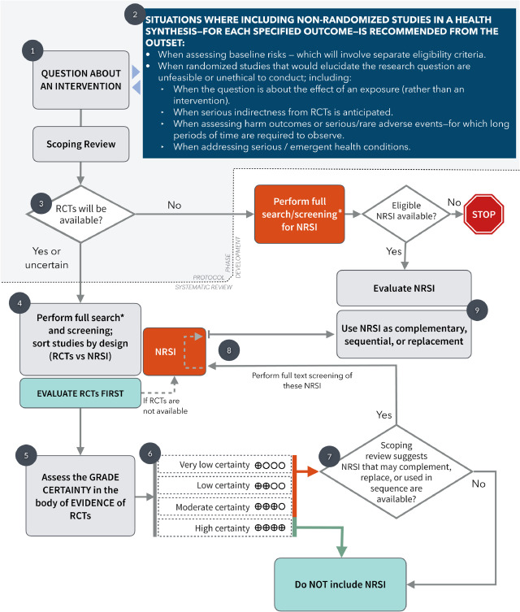
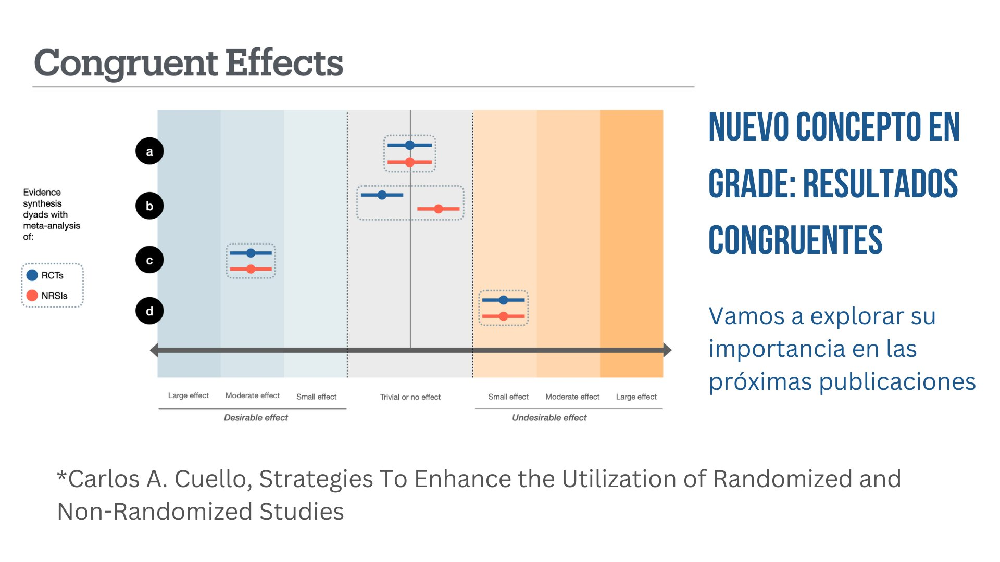
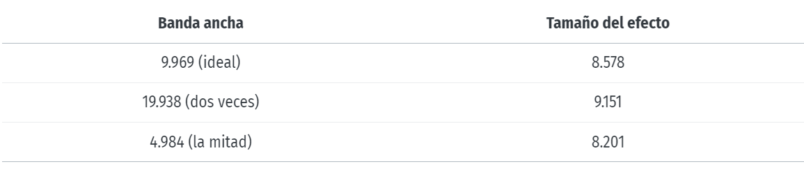
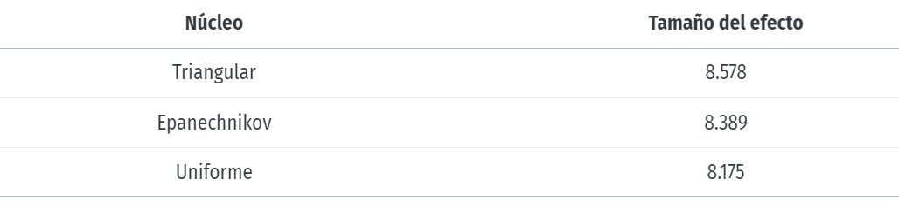
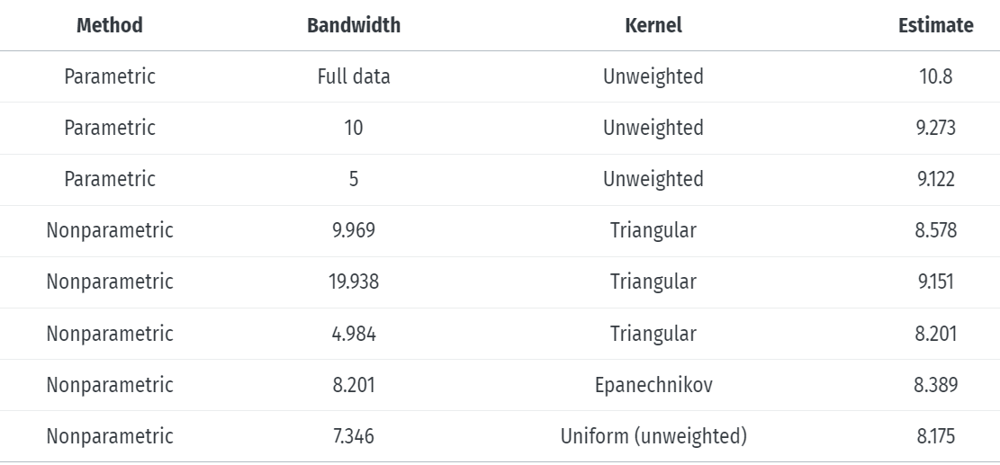

```{r echo = FALSE}
setwd("C:/Users/danfe/Dropbox/Proyectos Daniel/Cursos - diplomados - Maestrias/Programa de autoformación en investigación y análisis de datos/Rmarkdowns/Estadística/Programa de formación/Semana17 ECA")

knitr::opts_chunk$set(echo = TRUE, warning = FALSE, message = FALSE,
                         fig.show = "asis", results = "show",
                      fig.align='center', out.width = "100%", out.height = "100%",
                      fig.path = "figures/",  # Configura el directorio donde se guardan los gráficos
  dev = "png")
```


# Introducción

Los ECAs son generalmente considerados el estándar de oro para evaluar la eficacia de una intervención debido a su capacidad para minimizar el sesgo mediante la aleatorización. Sin embargo, hay situaciones en las que un ECA no es factible o ético, y en esos casos, los ECNA pueden ser útiles.

Algunas circunstancias en las que podría no ser posible contar con ECA y podría hacerse uso de ECNA incluyen:

- Ética: En algunos casos, aleatorizar a los participantes a un grupo de control podría no ser ético. Por ejemplo, si se sospecha que una intervención es significativamente mejor que el tratamiento estándar o si existe una necesidad urgente de tratamiento en todos los pacientes.

- Condiciones raras: Para enfermedades raras o condiciones poco frecuentes, podría ser difícil reclutar un número suficiente de participantes para realizar un ECA adecuado.

- Evidencia Previa Fuerte: Si ya existe una fuerte evidencia previa que apoya la eficacia de una intervención, podría considerarse innecesario realizar un nuevo ECA, optando por un ECNA para confirmar la aplicabilidad en un contexto diferente o para evaluar la implementación.

- Emergencias de Salud Pública: Durante emergencias de salud pública (como pandemias), puede ser necesario implementar intervenciones rápidamente sin esperar los resultados de un ECA. En estos casos, los ECNA pueden proporcionar información valiosa sobre la efectividad de las intervenciones implementadas rápidamente.

- Cuestiones Logísticas o de Costo: En algunos contextos, realizar un ECA puede ser logísticamente difícil o demasiado costoso. Los ECNA pueden ser más viables en términos de tiempo y recursos (EJM: medir el impacto de políticas de salud pública). *NOTA*: piensa en posibles politicas que existen en Perú y al finalizar de leer este instructivo piensa en como podríamos evaluar si funcion o no. 

- Intervenciones de Largo Plazo: Para intervenciones cuyo efecto completo puede no ser evidente hasta muchos años después, como algunos programas de salud pública o tratamientos de enfermedades crónicas, puede ser más práctico utilizar un ECNA.

A pesar de que los ECNA pueden ser útiles en estas circunstancias, es importante tener en cuenta que generalmente tienen un mayor riesgo de sesgo y confusión en comparación con los ECA. Por lo tanto, se deben diseñar cuidadosamente para minimizar estos riesgos y emplear técnicas analíticas avanzadas para intentar abordar posibles fuentes de sesgo.

Incluso bajo el enfoque de GRADE existe circunstancias en las que los ECNA pueden ser la mejor opción para valorar la certeza de la evidencia.

```{r, echo=FALSE, fig.cap="Diagrama de flujo que representa el proceso de realización de una revisión sistemática sobre una intervención de salud considerando el papel de los estudios aleatorios y no aleatorios."}

```

Y lo que podría resultar más util sería triangular la evidencia para determinar efectos potencialmente causales (aunque ningun estudio pueda cumplir al 100% los supuestos de causalidad)

```{r, echo=FALSE, fig.cap=" "}

```

No vamos a complicarnos con tanta teoría pero te recomiendo que leas el siguiente libro [Scott Cunningham. Causal Inference - The Mixtape](https://mixtape.scunning.com/) 

Esta semana revisaremos 3 enfoques utilizados en NRCT.

1. Difference-in-Differences

2. Regression Discontinuity

3. Instrumental Variables


# Difference-in-Differences

El diseño de diferencias en diferencias es una estrategia temprana de identificación cuasiexperimental para estimar los efectos causales que precede al experimento aleatorio en aproximadamente ochenta y cinco años. Se ha convertido en el diseño de investigación más popular en las ciencias sociales cuantitativas y, como tal, merece un estudio cuidadoso por parte de investigadores de todo el mundo.

**Ejemplo**

En 1980, Kentucky aumentó el límite de los ingresos semanales cubiertos por la compensación laboral. Queremos saber si esta nueva política provocó que los trabajadores pasaran más tiempo desempleados. Si los beneficios no son lo suficientemente generosos, los trabajadores podrían demandar a las empresas por lesiones en el trabajo, mientras que los beneficios demasiado generosos podrían causar problemas de riesgo moral e inducir a los trabajadores a ser más imprudentes en el trabajo, o a afirmar que las lesiones fuera del trabajo se produjeron mientras se encontraban en el trabajo.

La principal variable de resultado que nos importa es log_duration(en los datos originales como ldurat, pero le cambiamos el nombre para que sea más legible para los humanos), o la duración registrada (en semanas) de los beneficios de compensación laboral. Lo registramos porque la variable está bastante sesgada: la mayoría de las personas están desempleadas durante unas pocas semanas, y algunas están desempleadas durante mucho tiempo. La política fue diseñada para que el aumento del tope no afectara a los trabajadores de bajos ingresos, pero sí a los de altos ingresos, por lo que utilizamos a los trabajadores de bajos ingresos como nuestro grupo de control y a los trabajadores de altos ingresos como nuestro grupo de tratamiento.

Los datos se incluyen en el paquete Wooldridge injury R como conjunto de datos y, si instala el paquete, lo carga con library(wooldridge)y si ejecutas ?injuryen la consola, podrá ver los detalles completos sobre su contenido. Para darle más práctica con la carga de datos desde archivos externos, exporté los datos de lesiones como un archivo CSV (usando write_csv(injury, "injury.csv")) y los incluí en la carpeta de trabajo

Estas son las columnas principales de las que nos preocuparemos por ahora:

- durat(que cambiaremos de nombre a duration): Duración de las prestaciones por desempleo, medida en semanas

- ldurat(que cambiaremos el nombre a log_duration): Versión registrada de durat( log(durat))

- after_1980(que cambiaremos de nombre a after_1980): Variable indicadora que marca si la observación ocurrió antes (0) o después (1) del cambio de política en 1980. Este es nuestro momento (o antes/después de la variable)

- highearn: Variable indicadora que marca si la observación tiene ingresos bajos (0) o altos (1). Esta es nuestra variable de grupo (o tratamiento/control ).

**Cargar y limpiar datos**

```{r}
library(tidyverse)  # ggplot(), %>%, mutate(), and friends
library(broom)  # Convert models to data frames
library(scales)  # Format numbers with functions like comma(), percent(), and dollar()
library(modelsummary)  # Create side-by-side regression tables

# Load the data.
injury_raw <- read_csv("injury.csv")
```
A continuación, limpiaremos injury_rawun poco los datos para limitarlos a solo observaciones de Kentucky. También cambiaremos el nombre de algunas columnas con nombres extraños:

```{r}
injury <- injury_raw %>%
  filter(ky == 1) %>%
  # The syntax for rename is `new_name = original_name`
  rename(duration = durat, log_duration = ldurat,
         after_1980 = afchnge)
```

**Análisis exploratorio de datos**

Primero, podemos observar la distribución de las prestaciones por desempleo entre personas con ingresos altos y bajos (nuestros grupos de control y tratamiento):

```{r}
ggplot(data = injury, aes(x = duration)) +
  # binwidth = 8 makes each column represent 2 months (8 weeks)
  # boundary = 0 make it so the 0-8 bar starts at 0 and isn't -4 to 4
  geom_histogram(binwidth = 8, color = "white", boundary = 0) +
  facet_wrap(vars(highearn))
```

La distribución está muy sesgada: la mayoría de las personas en ambos grupos reciben entre 0 y 8 semanas de beneficios (¡y un puñado con más de 180 semanas! ¡Eso es 3,5 años!).

Si utilizamos el registro de duración, podemos obtener una distribución menos sesgada que funciona mejor con modelos de regresión:

```{r}
ggplot(data = injury, mapping = aes(x = log_duration)) +
  geom_histogram(binwidth = 0.5, color = "white", boundary = 0) +
  # Uncomment this line if you want to exponentiate the logged values on the
  # x-axis. Instead of showing 1, 2, 3, etc., it'll show e^1, e^2, e^3, etc. and
  # make the labels more human readable
  # scale_x_continuous(labels = trans_format("exp", format = round)) +
  facet_wrap(vars(highearn))
```

También deberíamos comprobar la distribución del desempleo antes y después del cambio de política. Copie/pegue uno de los fragmentos del histograma y cambie las facetas:

```{r}
ggplot(data = injury, mapping = aes(x = log_duration)) +
  geom_histogram(binwidth = 0.5, color = "white", boundary = 0) +
  facet_wrap(vars(after_1980))
```

Las distribuciones parecen normales, pero realmente no podemos ver nada diferente entre los grupos de antes/después y de tratamiento/control. Sin embargo, podemos trazar los promedios. Hay algunas maneras diferentes en que podemos hacer esto.

Puede usar una stat_summary()capa para que ggplot calcule estadísticas resumidas como promedios. Aquí simplemente calculamos la media:

```{r}
ggplot(injury, aes(x = factor(highearn), y = log_duration)) +
  geom_point(size = 0.5, alpha = 0.2) +
  stat_summary(geom = "point", fun = "mean", size = 5, color = "red") +
  facet_wrap(vars(after_1980))
```

Pero también podemos calcular la media y el intervalo de confianza del 95%:

```{r}
ggplot(injury, aes(x = factor(highearn), y = log_duration)) +
  stat_summary(geom = "pointrange", size = 1, color = "red",
               fun.data = "mean_se", fun.args = list(mult = 1.96)) +
  facet_wrap(vars(after_1980))
```

¡Ya podemos empezar a ver la clásica trama de diferencias entre diferencias! Parece que las personas con mayores ingresos después de 1980 tenían en promedio un desempleo más prolongado.

También podemos usar group_by()y summarize()para descubrir las medias del grupo antes de enviar los datos a ggplot. Prefiero hacer esto porque me da más control sobre los datos que estoy trazando:

```{r}
plot_data <- injury %>%
  # Make these categories instead of 0/1 numbers so they look nicer in the plot
  mutate(highearn = factor(highearn, labels = c("Low earner", "High earner")),
         after_1980 = factor(after_1980, labels = c("Before 1980", "After 1980"))) %>%
  group_by(highearn, after_1980) %>%
  summarize(mean_duration = mean(log_duration),
            se_duration = sd(log_duration) / sqrt(n()),
            upper = mean_duration + (1.96 * se_duration),
            lower = mean_duration + (-1.96 * se_duration))

ggplot(plot_data, aes(x = highearn, y = mean_duration)) +
  geom_pointrange(aes(ymin = lower, ymax = upper),
                  color = "darkgreen", size = 1) +
  facet_wrap(vars(after_1980))
```

O bien, trazado en el formato más estándar de diferencia en diferencia:

```{r}
ggplot(plot_data, aes(x = after_1980, y = mean_duration, color = highearn)) +
  geom_pointrange(aes(ymin = lower, ymax = upper), size = 1) +
  # The group = highearn here makes it so the lines go across categories
  geom_line(aes(group = highearn))
```

Comparación entre diferencias a mano

Podemos encontrar esa diferencia exacta completando la tabla 2x2 antes/después del tratamiento/control:

```{r, echo=FALSE, message=FALSE}
# Cargar la librería gt
library(gt)

# Crear el dataframe con los datos proporcionados
tabla_formatos <- data.frame(
  Suposición = c("Antes de 1980", "Después de 1980", "∆"),
  `Personas con bajos ingresos` = c("A", "B", "B - A"),
  `Personas con altos ingresos` = c("C", "D", "D - C"),
  `∆` = c("C-A", "D - B", "(D − C) − (B − A)")
)

# Crear la tabla con gt y aplicar los estilos
tabla_formatos |> 
  gt() |> 
  tab_style(
    style = cell_text(weight = "bold", align = "center"),
    locations = cells_column_labels()
  ) |> 
  tab_style(
    style = cell_text(align = "center"),
    locations = cells_body()
  ) |> 
  tab_options(
    table.width = pct(100),
    table.font.size = "medium"
  ) |> 
  opt_horizontal_padding(scale = 2)
```
A combination of group_by() and summarize() makes this really easy:

```{r}
diffs <- injury %>%
  group_by(after_1980, highearn) %>%
  summarize(mean_duration = mean(log_duration),
            # Calculate average with regular duration too, just for fun
            mean_duration_for_humans = mean(duration))
diffs
```

Podemos sacar cada uno de estos números de la tabla con algunos filter()sy pull():

```{r}
before_treatment <- diffs %>%
  filter(after_1980 == 0, highearn == 1) %>%
  pull(mean_duration)

before_control <- diffs %>%
  filter(after_1980 == 0, highearn == 0) %>%
  pull(mean_duration)

after_treatment <- diffs %>%
  filter(after_1980 == 1, highearn == 1) %>%
  pull(mean_duration)

after_control <- diffs %>%
  filter(after_1980 == 1, highearn == 0) %>%
  pull(mean_duration)

diff_treatment_before_after <- after_treatment - before_treatment
diff_treatment_before_after
## [1] 0.2

diff_control_before_after <- after_control - before_control
diff_control_before_after
## [1] 0.0077

diff_diff <- diff_treatment_before_after - diff_control_before_after
diff_diff
## [1] 0.19
```

La estimación de diferencia en diferencia es 0,19, lo que significa que el programa provoca un aumento en la duración del desempleo de 0,19 semanas registradas. Sin embargo, registrar semanas no tiene sentido, por lo que tenemos que interpretarlo con porcentajes (es decir, tener altos ingresos después del cambio de política provoca un aumento del 19% en la duración del desempleo).

```{r}
ggplot(diffs, aes(x = as.factor(after_1980),
                  y = mean_duration,
                  color = as.factor(highearn))) +
  geom_point() +
  geom_line(aes(group = as.factor(highearn))) +
  # If you use these lines you'll get some extra annotation lines and
  # labels. The annotate() function lets you put stuff on a ggplot that's not
  # part of a dataset. Normally with geom_line, geom_point, etc., you have to
  # plot data that is in columns. With annotate() you can specify your own x and
  # y values.
  annotate(geom = "segment", x = "0", xend = "1",
           y = before_treatment, yend = after_treatment - diff_diff,
           linetype = "dashed", color = "grey50") +
  annotate(geom = "segment", x = "1", xend = "1",
           y = after_treatment, yend = after_treatment - diff_diff,
           linetype = "dotted", color = "blue") +
  annotate(geom = "label", x = "1", y = after_treatment - (diff_diff / 2),
           label = "Program effect", size = 3)+
theme_classic()
```

## Diferencia en diferencia con regresión

Calcular todas las piezas a mano de esta manera es tedioso, ¡así que podemos usar la regresión para hacerlo! Recuerde que debemos incluir variables indicadoras de tratamiento/control y de antes/después, así como la interacción de ambos. Así es como se ve la ecuación matemática:

$$\begin{aligned}
\log(\text{duration}) = &\alpha + \beta \ \text{highearn} + \gamma \ \text{after\_1980} + \\
& \delta \ (\text{highearn} \times \text{after\_1980}) + \epsilon
\end{aligned}$$

El coeficiente $\delta$ es el efecto que al final nos importa: ese es el estimador de diferencia en diferencia.

```{r}
model_small <- lm(log_duration ~ highearn + after_1980 + highearn * after_1980,
                  data = injury)
tidy(model_small)
```

El coeficiente para highearn:after_1980es el mismo que encontramos a mano, ¡como debería ser! Es estadísticamente significativo, por lo que podemos estar bastante seguros de que no es 0.


## Diferencia en diferencia con regresión + controles

Una ventaja de utilizar la regresión para diferencias en diferencias es que podemos incluir variables de control para ayudar a aislar el efecto. Por ejemplo, tal vez los reclamos presentados por trabajadores de la construcción o la industria manufacturera tiendan a tener una duración más larga que los reclamos presentados por trabajadores de otras industrias. O tal vez quienes reclaman lesiones en la espalda tienden a tener reclamos más largos que quienes reclaman lesiones en la cabeza. También es posible que deseemos controlar la demografía de los trabajadores, como el género, el estado civil y la edad.

Estimemos una versión ampliada del modelo de regresión básico con las siguientes variables adicionales:

- male

- married

- age

- hosp(1 = hospitalizado)

- indust(1 = manufactura, 2 = construcción, 3 = otro)

- injtype(1-8; categorías para diferentes tipos de lesiones)

- lprewage(registro del salario antes de presentar un reclamo)

Importante : industy injtypeestán en el conjunto de datos como números (1-3 y 1-8), pero en realidad son categorías. Tenemos que decirle a R que los trate como categorías (o factores), de lo contrario asumirá que puedes tener un tipo de lesión de 3,46 o algo imposible.

```{r}
# Convert industry and injury type to categories/factors
injury_fixed <- injury %>%
  mutate(indust = as.factor(indust),
         injtype = as.factor(injtype))
```

```{r}
model_big <- lm(log_duration ~ highearn + after_1980 + highearn * after_1980 +
                  male + married + age + hosp + indust + injtype + lprewage,
                data = injury_fixed)
tidy(model_big)

# Extract just the diff-in-diff estimate
diff_diff_controls <- tidy(model_big) %>%
  filter(term == "highearn:after_1980") %>%
  pull(estimate)

diff_diff_controls
```

Después de controlar por una serie de controles demográficos, la estimación de la diferencia entre diferencias es menor (0,17), lo que indica que la política provocó un aumento del 17% en la duración de las semanas desempleadas después de una lesión en el lugar de trabajo. Es más pequeño porque las otras variables independientes ahora explican parte de la variación en log_duration.


# Análisis de series temporales interrumpidas

Esta es una breve introducción al análisis de series temporales interrumpidas.

Los métodos a continuación le mostrarán cómo llevar a cabo una serie temporal interrumpida (STI) utilizando mínimos cuadrados generalizados, teniendo en cuenta la autocorrelación a través de un modelo corARMA (existe otros modelos como ARIMA). Empezaremos con algunos modelos bastante sencillos, para pasar después a algo un poco más complicado, antes de añadir un grupo de control.

Vamos a simular un estudio en el que nos interesa saber si los valores de una cantidad (cantidad.x) han cambiado significativamente en respuesta a algún tipo de intervención. Si te ayuda pensar en una situación del mundo real, imagina que hacemos mediciones semanales de cuántas bacterias se encuentran en las manillas de las puertas de los aseos públicos. Nuestra intervención podría consistir en colocar carteles sobre el lavado de manos en todas las puertas. ¿Podemos afirmar que la colocación de los carteles se correlaciona con una disminución del número de bacterias contadas cada semana?

La base de este análisis es el concepto de contrafactualidad. Haremos algunos modelos para estimar lo que ocurrió (el escenario de los hechos) y lo que esperamos que habría ocurrido (el escenario contrafactual) si nunca hubiéramos colgado los carteles sobre el lavado de manos.

El cambio puede adoptar dos formas

- Un cambio radical inmediatamente después de la intervención

por ejemplo, porque las señales son tan eficaces que de repente todo el mundo empieza a lavarse las manos mucho mejor

- Un cambio de pendiente/tendencia tras la intervención

porque, con el tiempo, la presencia de las señales condiciona que cada vez más personas se laven las manos. Otra posibilidad es que, tras un cambio inicial a la baja, empiece a subir porque la gente empiece a ignorar las señales.

Diferentes escenarios del mundo real pueden o no ser compatibles con los supuestos en los que podrían producirse estos tipos de cambio, así que utilice sus conocimientos para decidir cuáles modelizar.

En cada caso construiremos un conjunto de datos que muestre cada componente del modelo en un formato bastante largo. Es totalmente posible utilizar menos variables y utilizar interacciones (que se muestran más adelante en este documento) para modelar todos los diversos componentes del STI, pero esto es más difícil de entender para el principiante y más difícil de decodificar cuando se trata de conciliar el marco de datos con los coeficientes del modelo que se utilizarán para interpretar qué efectos tuvo la interrupción

## ITS no controlada, una intervención

Crearemos un marco de datos ficticio, donde

- time = Un número, el tiempo en semanas de estudio (1 - 100 semanas)

- Intervention = Una indicación binaria de si la Intervención ha tenido lugar en el Momento x

- Post.intervention.time  = Un número, el tiempo transcurrido desde la Intervención

- quantity.x = Lo que queremos medir

```{r}
# create a dummy dataframe
set.seed(123)

# Here the interruption takes place at week 51
df<-tibble::tibble(
  Time = 1:100,
  Intervention = c(rep(0,50),rep(1,50)),
  Post.intervention.time = c(rep(0,50),1:50),
  quantity.x = c(sort(sample(200:300,size = 50,replace = T),decreasing = T)+sample(-20:20,50,replace = T),c(sort(sample(20:170,size = 50,replace = T),decreasing = T)+sample(-40:40,50,replace = T)))
)
```


```{r echo=FALSE}

library(DT)
datatable(df,options = list(pageLength = 100, scrollX=T, scrollY = "200px"))

```

En su forma más simple, el modelo ITS tiene el siguiente aspecto

gls(quantity.x ~ Time + Intervention + Post.intervention.time, data = df,method=“ML”)

Utilizando el comando gls del paquete nlme, podemos crear un modelo que describa el cambio en la cantidad.x a lo largo del tiempo

```{r}
# regresión con comando tradicional
model.a_0 = lm(quantity.x ~ Time + Intervention + Post.intervention.time, 
              data = df)
# Show a summary of the model
summary(model.a_0)


# correremos con gls por facilitarnos la incorporación de otros argumentos pero es lo mismo que una RL 

library(nlme)
model.a = gls(quantity.x ~ Time + Intervention + Post.intervention.time, 
              data = df,method="ML")

# Show a summary of the model
summary(model.a)
```

Estos coeficientes tienen un significado en el mundo real y no están ahí para ser ignorados.

Esto nos dice que la línea modelizada pasa por el eje y en 306.5 unidades y que, antes de la intervención, el valor medio de la cantidad.x disminuía en -2.17 unidades por semana. En el momento de la intervención, se produjo un cambio brusco de -19.8 unidades y, tras la intervención, se produjo una tendencia en la que el valor de la cantidad.x cayó -1.05 unidades más por semana. 

Estos estadísticos nos indican si los cambios que se produjeron en distintos momentos fueron significativos con respecto a lo que hacía la línea antes de la interrupción. Estos valores pueden utilizarse para calcular la diferencia global en la cantidad.x entre los momentos [i] y [ii] mediante esta fórmula

quantity.x[i] = 306.5 + (Time[i]* -2.17) + (Intervention[i]* -19.8) + (Post.intervention.time[i]* -1.05)

quantity.x[ii] = 306.5 + (Time[ii]* -2.17) + (Intervention[ii]* -19.8) + (Post.intervention.time[ii]* -1.05)

absolute difference = difference(quantity.x[i] , quantity.x[ii])

Pero lo que estaría bien sería calcular el escenario contrafactual en el que no se produjo la intervención y estimar la diferencia entre los valores factuales de la cantidad.x en el momento [i] y los contrafactuales en el mismo momento [i].

Es bueno añadir valores de los modelos al df, por lo que a continuación copiaremos los valores modelados de cantidad.x en el df utilizando el comando predictSE.gls del paquete AICcmodavg.

```{r}
library(AICcmodavg)
library(tidyverse)

df<-df %>% mutate(
  model.a.predictions = predictSE.gls (model.a, df, se.fit=T)$fit,
  model.a.se = predictSE.gls (model.a, df, se.fit=T)$se
  )
```

```{r echo=FALSE}

library(DT)
datatable(round(df,2),options = list(pageLength = 100, scrollX=T, scrollY = "200px"))

```

Observe que hemos capturado tanto el valor predicho de cantidad.x como el error estándar de la estimación. Lo necesitaremos para mostrar los márgenes de error y dibujar intervalos de confianza en nuestros gráficos.

Hagamos un dibujo en el que mostraremos los puntos de datos brutos y, a continuación, añadamos los datos modelizados como una línea que describa las observaciones objetivas y una cinta que muestre el intervalo de confianza del 95 % en el modelo

```{r}
ggplot(df,aes(Time,quantity.x))+
  geom_ribbon(aes(ymin = model.a.predictions - (1.96*model.a.se), ymax = model.a.predictions + (1.96*model.a.se)), fill = "lightgreen")+
  geom_line(aes(Time,model.a.predictions),color="black",lty=1)+
  geom_point(alpha=0.3)
```

Sin embargo, antes de ir más lejos, debemos tener en cuenta la autocorrelación de los datos. gls nos permite añadir estructuras corARMA especificando valores para p (el orden autorregresivo) y q (el orden de la media móvil).

Un modelo gls con una corrección corARMA tiene el siguiente aspecto

gls(quantity.x ~ Time + Intervention + Post.intervention.time, data = df,correlation= corARMA(p=1, q=1, form = ~ Time),method=“ML”)

pero la cuestión crítica es cómo elegir los valores correctos de p y q. Hay mucha información sobre esto en Internet, así que lea atentamente porque es importante. Tanto si entiendes exactamente de qué va todo esto como si no, tendrás que tomar medidas para minimizar el problema empíricamente. Lo que hago aquí es aplicar diferentes valores de p y q al modelo gls, capturando el valor del Criterio de Información de Akaike (AIC) para cada modelo. La combinación de valores de p y q que arroje el menor valor de AIC es la que mejor se ajusta a nuestro modelo.

Siendo realistas, aquí hay cierto margen para los sesgos humanos. Es difícil definir con exactitud las cifras adecuadas para este análisis. Yo recomendaría una amplia gama de valores porque a veces las autocorrelaciones pueden ser bastante retardadas.

Vamos a empezar por definir el modelo básico y luego crear una función básica de R que puede aplicar diferentes valores de p y q a ese modelo

```{r}
mod.1 = quantity.x ~ Time + Intervention + Post.intervention.time

fx = function(pval,qval){
  summary(gls(mod.1, data = df, 
              correlation= corARMA(p=pval,q=qval, form = ~ Time),
              method="ML"))$AIC}
```

Nuestro punto de partida es el valor AIC del modelo que ejecutamos anteriormente en el que no se especificaron ni p ni q (es decir, sin autocorrelación)

```{r}
p = summary(gls(mod.1, data = df,method="ML"))$AIC
message(str_c ("AIC Uncorrelated model = ",p))
```
A continuación podemos crear una rejilla de combinaciones de valores de p y q

```{r}
autocorrel = expand.grid(pval = 0:2, qval = 0:2)

```

A continuación, aplicamos la función a todas las combinaciones posibles de p y q. Es de esperar que algunas no funcionen con este conjunto de datos ficticios.

```{r}
for(i in 2:nrow(autocorrel)){
  p[i] = try(summary(gls(mod.1, data = df, 
                         correlation= corARMA(p=autocorrel$pval[i],
                                              q=autocorrel$qval[i], 
                                              form = ~ Time),
                         method="ML"))$AIC)}

autocorrel<- autocorrel %>%
  mutate(AIC = as.numeric(p)) %>%
  arrange(AIC)


autocorrel
```
In this dataset, the best values of p and q appear to be p = 2 and q = 2 Let’s see what effect that has on our model by comparing it to the original model.a


```{r}
model.b = gls(quantity.x ~ Time + Intervention + Post.intervention.time, 
              data = df,method="ML", 
              correlation= corARMA(p=2,q=2, form = ~ Time))
coefficients(model.a)
coefficients(model.b)
```
Puedes ver que hay algunos cambios bastante pequeños en los valores aquí, pero no hice un conjunto de datos que tuviera mucha autocorrelación. Estoy seguro de que hay conjuntos de datos por ahí donde se vería un gran efecto. También hay que tener en cuenta que Post.intervention.time describe una tendencia semanal, por lo que en periodos de tiempo largos, el error aumentaría.

Bien, ahora que hemos tratado con la autocorrelación, asignemos los valores predichos del modelo.b al df

```{r}
df<- df %>% 
  mutate(
      model.b.predictions = predictSE.gls (model.b, df, se.fit=T)$fit,
      model.b.se = predictSE.gls (model.b, df, se.fit=T)$se
        )
```


```{r echo=FALSE}

library(DT)
datatable(round(df,2),options = list(pageLength = 100, scrollX=T, scrollY = "200px"))

```

A continuación debemos preguntarnos qué habría ocurrido si no hubiera habido intervención. Este es el modelo contrafactual.

El modelo gls para el contrafactual tiene el siguiente aspecto...

gls(quantity.x ~ Time, data = df,method=“ML”)

No hay nada inteligente en esto, es el mismo modelo que teníamos antes, sólo que hemos eliminado los argumentos de intervención y post-intervención. Nuestro objetivo aquí es calcular la tendencia pre-intervención y simplemente extrapolar más allá del punto de tiempo de intervención. Esto puede hacerse con la función predictSE.gls.

Para crear el modelo contrafactual, tenemos que crear un nuevo df que trunque los datos en el punto temporal inmediatamente anterior a la intervención. A continuación, ejecutamos predict en el modelo, proporcionando el df original como 'newdata'.

```{r}
df2<-filter(df,Time<51)
model.c = gls(quantity.x ~ Time, data = df2, correlation= corARMA(p=1, q=1, form = ~ Time),method="ML")
```

Veamos cómo se compara el nuevo modelo contrafactual (modelo.c) con el modelo factual (modelo.a).

```{r}
coefficients(model.a)
coefficients(model.c)
```


Como puede ver aquí, el intercepto y la pendiente de los modelos factual y contrafactual son casi idénticos, que es lo que queríamos. 

Aceptaremos un pequeño error en la precisión y utilicemos 'predict' porque nos da estimaciones de confianza precisas, creemos una nueva variable con predicciones del modelo contrafactual, proporcionando el marco de datos completo de 100 semanas como 'newdata'.

```{r}
df<-df %>% mutate(
  model.c.predictions = predictSE.gls (model.c, newdata = df, se.fit=T)$fit,
  model.c.se = predictSE.gls (model.c, df, se.fit=T)$se
)
```

A continuación podemos trazar el gráfico

```{r}
  ggplot(df,aes(Time,quantity.x))+
  geom_ribbon(aes(ymin = model.c.predictions - (1.96*model.c.se), 
                  ymax = model.c.predictions + (1.96*model.c.se)), fill = "pink")+
  geom_line(aes(Time,model.c.predictions),color="red",lty=2)+
  geom_ribbon(aes(ymin = model.b.predictions - (1.96*model.b.se), 
                  ymax = model.b.predictions + (1.96*model.b.se)), fill = "lightgreen")+
  geom_line(aes(Time,model.b.predictions),color="black",lty=1)+
  geom_point(alpha=0.3)
```


La línea continua con la cinta verde son los datos reales, la línea discontinua roja con la cinta rosa es la contrafactual. Aplicando la regla empírica de que si los intervalos de confianza no se solapan, es que está ocurriendo algo significativo, podemos concluir que la interrupción precedió a un cambio de paso significativo en la cantidad.x. Que las líneas también diverjan sugiere que podría haber un cambio de tendencia significativo.

Lo último que nos queda por hacer es calcular esas diferencias relativas. Esto es fácil porque hemos estado añadiendo los valores modelizados al df como variables. Para obtener una lista de las diferencias relativas en diferentes puntos temporales, sólo tenemos que restar lo factual de lo contrafactual.

Aquí' podemos preguntar por las diferencias relativas en las semanas 1 (inicio), 50 (preintervención), 51 (postintervención inmediata) y 100 (final del estudio)

```{r}
format(df$model.b.predictions-df$model.c.predictions,scientific = F)[c(1,50,51,100)]

```

Aquí podemos ver que, antes de la intervención, la diferencia entre la realidad y la contrafactual es esencialmente cero, que es lo que esperamos. En la semana 51 vemos que la diferencia es de 39 unidades, casi la misma que el cambio de paso que vimos en los coeficientes del modelo.b más arriba. En la semana 100, los datos fácticos son 89 unidades inferiores a los contrafácticos, que es el efecto combinado del cambio de paso de la intervención y el cambio de tendencia de la intervención.


## ITS no controlado, dos intervenciones
Algunos diseños pueden incluir múltiples intervenciones y es bastante sencillo ampliar el modelo para tener en cuenta este tipo de cosas Haremos un nuevo conjunto de datos que incluya una segunda intervención y una tendencia post-intervención-2.

```{r}
# create a dummy dataframe
# Here the interruption takes place at week 51
df3<-tibble::tibble(
  Time = 1:150,
  Intervention = c(rep(0,50),rep(1,100)),
  Post.intervention.time = c(rep(0,50),1:100),
  Intervention.2 = c(rep(0,100),rep(1,50)),
  Post.intervention.2.time = c(rep(0,100),1:50),
  quantity.x = c(sort(sample(2000:2500,size = 50,replace = T),decreasing = T)+sample(-20:20,50,replace = T),c(sort(sample(200:1700,size = 50,replace = T),decreasing = T)+sample(-40:40,50,replace = T)),c(sort(sample(200:450,size = 50,replace = T),decreasing = F)+sample(-40:40,50,replace = T)))
)
```


```{r echo=FALSE}

library(DT)
datatable(df3,options = list(pageLength = 100, scrollX=T, scrollY = "200px"))

```

El nuevo modelo ITS tiene el siguiente aspecto

gls(quantity.x ~ Time + Intervention + Post.intervention.time + Intervention.2 + Post.intervention.2.time, data = df,method=“ML”, correlation= corARMA(p=2,q=2, form = ~ Time))

Recuerde que probablemente debería tratar la autocorrelación en este punto. El método es el mismo que antes, así que no lo reproduciré aquí. Sólo voy a inventar algunos valores para p y q

```{r}
model.d = gls(quantity.x ~ Time + Intervention + Post.intervention.time + 
                Intervention.2 + Post.intervention.2.time, 
              data = df3,method="ML", 
              correlation= corARMA(p=2,q=2, form = ~ Time))

# Show a summary of the model
summary(model.d)
```
Si volvemos al ejemplo anterior, más sencillo, probablemente veamos que estos coeficientes son fáciles de explicar.

- El intercepto sigue siendo el valor medio inicial de la cantidad.x

- El tiempo es la pendiente previa a la intervención

- La intervención describe el cambio de paso que se produce en el punto temporal de la intervención

- Tiempo.post.intervención describe el cambio de pendiente adicional que se produce en el punto de tiempo de la intervención

- Intervención.2 describe el cambio de paso que se produce en el punto temporal de la segunda intervención

- Tiempo.post.intervención.2 describe el cambio de pendiente adicional que se produce en el momento de la segunda intervención.

Tomemos los valores modelizados estimados para el nuevo estudio de dos intervenciones

```{r}
df3<-df3 %>% mutate(
  model.d.predictions = predictSE.gls (model.d, df3, se.fit=T)$fit,
  model.d.se = predictSE.gls (model.d, df3, se.fit=T)$se
  )
```

```{r echo=FALSE}

library(DT)
datatable(df3,options = list(pageLength = 100, scrollX=T, scrollY = "200px"))

```

Hagamos un dibujo en el que se muestren los puntos de datos brutos y, a continuación, añadamos los datos modelizados como una línea que describa las observaciones objetivas y una cinta que muestre el intervalo de confianza del 95% sobre el modelo

```{r}
 ggplot(df3,aes(Time,quantity.x))+
  geom_ribbon(aes(ymin = model.d.predictions - (1.96*model.d.se), ymax = model.d.predictions + (1.96*model.d.se)), fill = "lightgreen")+
  geom_line(aes(Time,model.d.predictions),color="black",lty=1)+
  geom_point(alpha=0.3)
```

calculemos el primer contrafactual, que no hubo intervenciones

```{r}
df4<-filter(df3,Time<51)
model.e = gls(quantity.x ~ Time, data = df4, correlation= corARMA(p=1, q=1, form = ~ Time),method="ML")

df3<-df3 %>% mutate(
  model.e.predictions = predictSE.gls (model.e, newdata = df3, se.fit=T)$fit,
  model.e.se = predictSE.gls (model.e, df3, se.fit=T)$se
)
```

y luego el segundo contrafactual, que sólo ocurrió la primera intervención

```{r}
df5<-filter(df3,Time<101)
model.f = gls(quantity.x ~ Time + Intervention + Post.intervention.time, data = df5, correlation= corARMA(p=1, q=1, form = ~ Time),method="ML")

df3<-df3 %>% mutate(
  model.f.predictions = predictSE.gls (model.f, newdata = df3, se.fit=T)$fit,
  model.f.se = predictSE.gls (model.f, df3, se.fit=T)$se
)
```

Por último, vamos a dibujar el gráfico que muestra los datos reales (negro, verde), el primero (rojo, rosa) y el segundo (azul marino, turquesa) contrafactuales

```{r}
ggplot(df3,aes(Time,quantity.x))+
  geom_ribbon(aes(ymin = model.f.predictions - (1.96*model.d.se), ymax = model.f.predictions + (1.96*model.e.se)), fill = "lightblue")+
  geom_line(aes(Time,model.f.predictions),color="blue",lty=2)+
  geom_ribbon(aes(ymin = model.e.predictions - (1.96*model.d.se), ymax = model.e.predictions + (1.96*model.e.se)), fill = "pink")+
  geom_line(aes(Time,model.e.predictions),color="red",lty=2)+
  geom_ribbon(aes(ymin = model.d.predictions - (1.96*model.d.se), ymax = model.d.predictions + (1.96*model.d.se)), fill = "lightgreen")+
  geom_line(aes(Time,model.d.predictions),color="black",lty=1)+
  geom_point(alpha=0.3)

```

Puedes utilizar los valores modelizados almacenados para hacer los cálculos que quieras con respecto a las diferencias relativas. Recuerde que algunas cosas nunca pueden ser inferiores a cero y que su hipótesis probablemente no sea que existe una tendencia lineal que continúa para siempre. En este contexto, piense detenidamente en sus contrafactuales.


## ITS controlado, una intervención
Cuando se trata de series temporales, el STI controlado es lo mejor que se puede hacer. El control permite calibrar el STI para tener en cuenta los cambios seculares y periódicos independientes. Supongamos que la cantidad.x y la cantidad.y están relacionadas. Ambas han mostrado algún tipo de cambio secular de largo alcance (por ejemplo, está la tendencia previa a la intervención en los ejemplos anteriores). Digamos que tanto la cantidad.x como la cantidad.y experimentan una tendencia paralela antes de la intervención.

Se pretende que la intervención afecte al cambio en la cantidad.x, pero no en la cantidad.y, por lo que las tendencias posteriores a la intervención en la cantidad.y pueden tenerse en cuenta en nuestro modelo, reforzando nuestros resultados.

Hagamos un conjunto de datos.

```{r}
# create a dummy dataframe
# Here the interruption takes place at week 51
df.x<-tibble::tibble(
  x = 1,
  Time = 1:100,
  x.Time = x*Time,
  Intervention = c(rep(0,50),rep(1,50)),
  x.Intervention = x*Intervention,
  Post.intervention.time = c(rep(0,50),1:50),
  x.Post.intervention.time = x * Post.intervention.time,
  quantity.x = c(sort(sample(200:300,size = 50,replace = T),decreasing = T)+sample(-20:20,50,replace = T),c(sort(sample(20:170,size = 50,replace = T),decreasing = T)+sample(-40:40,50,replace = T)))
)

df.y<-tibble::tibble(
  x = 0,
  Time = 1:100,
  x.Time = x*Time,
  Intervention = c(rep(0,50),rep(1,50)),
  x.Intervention = x*Intervention,
  Post.intervention.time = c(rep(0,50),1:50),
  x.Post.intervention.time = x * Post.intervention.time,
  quantity.x = c(sort(sample(500:600,size = 50,replace = T),decreasing = T)+sample(-20:20,50,replace = T),c(sort(sample(280:500,size = 50,replace = T),decreasing = T)+sample(-40:40,50,replace = T)))
)

df6 = bind_rows(df.x,df.y) %>% 
  arrange(Time,x)

```

```{r, echo=FALSE}

DT::datatable(df6, options = list(pageLength = 100, scrollY = "200px", scrollX=T))

```

Observe detenidamente el conjunto de datos. He introducido la variable x (que diferencia entre los grupos de control (0) y de prueba (1), además de algunos términos de interacción nuevos, como x.Tiempo, x.Intervención y x.Tiempo.post.intervención. Cada uno de ellos no es más que el valor de la variable multiplicado por x (que indica las variables de control [0, es decir, cantidad.y] o las variables de interés [1, es decir, cantidad.x]). Esto hace que esas variables sean nulas para los controles y que los cambios de paso o tendencia sean significativos para las líneas de los datos relativos a la cantidad.x

El modelo ITS es ahora un poco más complicado. De nuevo, me he saltado el paso en el que probamos diferentes valores de p y q. ¡No debería saltárselo!

gls(quantity.x ~ Time + x.Time + Intervention + x.Intervention + Post.intervention.time + x.Post.intervention.time, data = df6, correlation= corARMA(p=1, q=1, form = ~ Time|x),method=“ML”)

Nótese que hemos tenido que cambiar el argumento form = ~ Time|x) en el corARMA para tener en cuenta el hecho de que necesita corregir la autocorrelación a través del tiempo y a través de los dos grupos donde x == 1 y x == 0

```{r}
model.g = gls(quantity.x ~ x + Time + x.Time + Intervention + x.Intervention +
                Post.intervention.time + x.Post.intervention.time, 
              data = df6,method="ML", 
              correlation= corARMA(p=2,q=2, form = ~ Time|x))

# Show a summary of the model
summary(model.g)
```

Si te vuelves más **sofisticado** en estas cosas, también podrías utilizar términos de interacción en tu modelo para conseguir el mismo resultado

```{r}
model.h = gls(quantity.x ~ Time*x + Intervention*x + Post.intervention.time*x, data = df6,method="ML", correlation= corARMA(p=2,q=2, form = ~ Time|x))

# Show a summary of the model
summary(model.h)
```

¿Ve? ¡Son idénticos! Personalmente prefiero tener las variables como x.Intervention escritas en mis conjuntos de datos en su totalidad. Trabajar con interacciones me confunde y tampoco me gusta la forma en que R presenta los coeficientes fuera de orden.

Así que veamos en detalle la versión corta

```{r}
coefficients(model.g)
```

La interpretación es la siguiente

- Intercepto es el valor medio del grupo de control al inicio del estudio

- x es la diferencia entre Intercepto y el valor de la cantidad.x al inicio del estudio. Cuando dibujemos el gráfico a continuación, verá que la línea para la cantidad.x comienza en 302.6 unidades en la semana 1.

- Tiempo es la pendiente previa a la intervención para el grupo de control

- x.Tiempo es la diferencia entre Tiempo y los valores de cantidad.x (¡vea cómo influye el grupo de control en nuestros resultados!)

- Intervención describe el cambio de paso que se produce en el punto temporal de intervención en el grupo de control

- x.Intervención describe la diferencia en los cambios de paso que se produce en el punto de tiempo de intervención entre los dos grupos

- El tiempo posterior a la intervención describe el cambio de pendiente que se produce en el punto temporal de la intervención en el grupo de control

- x.Tiempo.post.intervención describe la diferencia en los cambios de pendiente que se produce en el punto temporal de la intervención en el grupo de control.

Tomemos los valores modelizados estimados para el nuevo estudio de intervención controlada

```{r}
df6<-df6 %>% mutate(
  model.g.predictions = predictSE.gls (model.g, df6, se.fit=T)$fit,
  model.g.se = predictSE.gls (model.g, df6, se.fit=T)$se
  )
```

A continuación, dibuje un cuadro en el que se muestren los puntos de datos brutos y añada los datos modelizados como una línea que describa las observaciones objetivas y una cinta que muestre el intervalo de confianza del 95% en el modelo.

```{r}
ggplot(df6,aes(Time,quantity.x))+geom_point(color="grey")+
  geom_ribbon(aes(ymin = model.g.predictions - (1.96*model.g.se), ymax = model.g.predictions + (1.96*model.g.se),fill=factor(x),alpha=0.4))+
  geom_line(aes(Time,model.g.predictions,color=factor(x)),lty=1)+
  geom_point(alpha=0.3)
```


Así pues, calculemos los contrafactuales para cada uno de ellos y añadamos las predicciones al conjunto de datos


```{r}
df7<-filter(df6,Time<51)
model.i = gls(quantity.x ~ x + Time + x.Time, data = df7, correlation= corARMA(p=1, q=1, form = ~ Time|x),method="ML")

df6<-df6 %>% mutate(
  model.i.predictions = predictSE.gls (model.i, newdata = df6, se.fit=T)$fit,
  model.i.se = predictSE.gls (model.i, df6, se.fit=T)$se
)
```

A continuación, trace los resultados

```{r}
 ggplot(df6,aes(Time,quantity.x))+geom_point(color="grey")+
  geom_ribbon(aes(ymin = model.g.predictions - (1.96*model.g.se), ymax = model.g.predictions + (1.96*model.g.se),fill=factor(x),alpha=0.4))+
  geom_line(aes(Time,model.g.predictions,color=factor(x)),lty=1)+
  geom_line(aes(Time,model.i.predictions,color=factor(x)),lty=2)+
  geom_ribbon(aes(ymin = model.i.predictions - (1.96*model.i.se), ymax = model.i.predictions + (1.96*model.i.se),fill=factor(x),alpha=0.2))  
```

Podemos ver que en el grupo de interés, ha habido un gran cambio en la cantidad.x desde la intervención, pero también ha habido un gran cambio en la cantidad.y el grupo de control. ¿El efecto que estamos viendo en el grupo de interés se debe simplemente al descenso que se está produciendo en ambos grupos, lo que podría indicar que algún factor extrínseco influyó en el cambio en ambos grupos? Si este fuera el caso (suponiendo que el grupo de control NO se ve afectado por la intervención) entonces estaríamos atribuyendo incorrectamente el resultado a la intervención.

Si observamos detenidamente las tablas de coeficientes, podemos encontrar algunas pistas. Volvamos al análisis totalmente controlado

```{r}
summary(model.g)
```

Aquí tenemos que fijarnos bien en las cifras.

En este caso, se produjo un descenso antes de la intervención en el grupo de control (-2.10 unidades/semana). El grupo de cantidad.x también disminuía, pero a un ritmo ligeramente inferior (-1,89 (-2.10 + 0.21) unidades/semana).

En el momento de la intervención, el grupo de control presentaba un cambio de paso de 1.99 unidades. Entretanto, el grupo de cantidad.x descendió 40,24 unidades en relación con aquél, por lo que en conjunto descendió 34 (1.99 + -35.99) unidades.

Por último, después de la intervención, la tasa de descenso del grupo de control disminuyó (-1.83 unidades/semana), mientras que la del grupo quantity.x fue menos pronunciada (-1.827 + 0.827 = -1 unidades/semana).

Puede que no nos importen demasiado estas tasas y cifras concretas. Lo que más nos importa es el gran titular de cuánto ha cambiado la cantidad.x en comparación con la contrafactual, pero echemos un último vistazo a la tabla, donde los valores p indican si cada coeficiente representa un cambio significativo independiente.

En este caso, Tiempo es significativo, lo que indica que hubo un cambio significativo con el tiempo antes de la intervención. x.Tiempo no es significativo, lo que significa que las tendencias previas a la intervención para la cantidad.x y el grupo de control son las mismas. Interpreto que esto significa que ambos grupos mostraban tendencias similares antes de la intervención.

Mientras tanto, ni Intervención, ni x.Intervención son significativas, por lo que quizá deberíamos interpretarlo como que la intervención no tuvo ningún efecto inmediato en forma de cambio de paso.

Por último, tanto Post.intervención.tiempo como x.Post.intervención.tiempo son significativos, lo que sugiere que algo influyó en las tendencias de ambos grupos, pero que el grupo cantidad.x se vio afectado de forma diferente al control. Esto queda claro en las imágenes, pero hay que pensar en cómo interpretarlo.

Es posible que la Intervención afectara a ambos grupos, lo que sugeriría que se trata de un control mal elegido.

También es posible que algún factor extrínseco afectara a ambos grupos en el momento en que se produjo la intervención. Eso no es bueno porque nos deja en una posición en la que no podemos determinar qué parte del efecto se debe a la intervención y qué parte a los otros factores.

En estos datos ficticios, los controles son bastante malos porque cambian mucho. Esta es la razón por la que gran parte del reto de hacer series temporales

Por último, probemos lo que hace (y lo que no hace) el control observando los números. Al final del estudio, el modelo ITS totalmente controlado estima que existe una diferencia entre los valores reales y contrafactuales de la cantidad.x

```{r}
df6$model.g.predictions[200]-df6$model.i.predictions[200]

```

Comparemos entonces esa estimación con otra a partir de los mismos datos, pero no controlados.

```{r}
model.j = gls(quantity.x ~ Time + Intervention  + Post.intervention.time , data = df.x,method="ML", correlation= corARMA(p=2,q=2, form = ~ Time))

df.x <- df.x %>% 
  mutate(
  model.j.predictions = predictSE.gls (model.j, newdata = df.x, se.fit=T)$fit,
  model.j.se = predictSE.gls (model.j, df.x, se.fit=T)$se  
  )

df8<-filter(df.x,Time<51)

model.k = gls(quantity.x ~ Time, data = df8, correlation= corARMA(p=1, q=1, form = ~ Time),method="ML")

df.x<-df.x %>% mutate(
  model.k.predictions = predictSE.gls (model.k, newdata = df.x, se.fit=T)$fit,
  model.k.se = predictSE.gls (model.k, df.x, se.fit=T)$se
  )

df.x$model.j.predictions[100]-df.x$model.k.predictions[100]
```
Aquí no hay gran cosa. En ambos casos, estimamos un cambio de entre 82 y 84 unidades en el valor de la cantidad.x En realidad, los controles están ahí para darle una visión subjetiva (mirando los gráficos) y estadística (mirando las tablas resumen) de si debe preocuparse de que factores extrínsecos le hayan llevado a atribuir incorrectamente los resultados a su intervención. En mi opinión, se trata de un juego un poco tonto, porque nunca se puede saber realmente si un grupo de control se ve afectado por la intervención, por el factor extrínseco o por ambos. Si ha definido su grupo de control antes de empezar, puede que se esté disparando en el pie al elegir lo incorrecto. Si no lo ha hecho, podría estar eligiendo un grupo de control simplemente porque no cambia cuando, por ejemplo, lo comprueba con un análisis de series temporales sin corregir.

En el primer caso, no sabes qué hacer con los datos ni cómo interpretar los efectos. En el segundo caso, no tiene mucho sentido, porque un grupo de control que haya elegido específicamente por falta de efecto no contribuirá mucho al modelo y, por tanto, tiene poco valor en las estadísticas o el análisis.

El STI controlado es más o menos el patrón oro, aunque personalmente no creo que a menudo aporte mucho utilizar el control. A algunas personas les gusta utilizar controles sintetizados, lo que probablemente sea más sólido.

Ahora debería poder realizar una serie temporal interrumpida bastante sólida, utilizando controles si lo desea y calculando contrafactuales para cada parte del modelo. ¿Por qué no intentar modificar la STI controlada para que tenga dos interrupciones? O quizás añadir algunas covariables periódicas, añadiendo efectos para las estaciones, o eventos específicos del calendario, o temperatura, humedad, región...


# Regression Discontinuity

La razón por la que RDD es tan atractivo para muchos es por su capacidad para eliminar de manera convincente el sesgo de selección. Este atractivo se debe en parte al hecho de que muchos consideran que sus supuestos de identificación subyacentes son más fáciles de aceptar y evaluar. Al hacer que el sesgo de selección sea impotente, el procedimiento es capaz de recuperar los efectos promedio del tratamiento para una subpoblación determinada de unidades.
 
**Ejemplo**

En este ejemplo hipotético, los estudiantes realizan un examen de ingreso al comienzo del año escolar. Aquellos que obtienen una puntuación de 70 o menos se inscriben automáticamente en un programa de tutoría gratuito y reciben asistencia durante todo el año. Al final del año escolar, los estudiantes realizan una prueba final o examen de salida (con un máximo de 100 puntos) para medir cuánto aprendieron en general. Recuerde, este es un ejemplo hipotético y pruebas como esta realmente no existen, pero sígala.

Tiene un conjunto de datos con cuatro columnas:

* id: El DNI del estudiante

* entrance_exam: Puntuación del examen de ingreso del estudiante (sobre 100)

* exit_exam: Puntuación del examen de salida del estudiante (sobre 100)

* tutoring: Una variable indicadora que muestra si el estudiante estaba matriculado en el programa de tutoría.

**Cargar y limpiar datos**

```{r}
library(tidyverse)  # ggplot(), %>%, mutate(), and friends
library(broom)  # Convert models to data frames
library(rdrobust)  # For robust nonparametric regression discontinuity
library(rddensity)  # For nonparametric regression discontinuity density tests
library(modelsummary)  # Create side-by-side regression tables

# Load the data.
tutoring <- read_csv("tutoring_program.csv")
```
## Paso 1: Determinar si el proceso de asignación de tratamiento se basa en reglas

Para unirse al programa de tutoría, los estudiantes deben obtener 70 puntos o menos en el examen de ingreso. Los estudiantes que obtengan una puntuación superior a 70 no son elegibles para el programa. Dado que tenemos una regla clara de 70 puntos, podemos asumir que el proceso de participación en el programa de tutoría se basa en reglas.


## Paso 2: Determinar si el diseño es borroso o nítido

Como sabemos que el programa se aplicó según una regla, a continuación queremos averiguar con qué rigor se aplicó la regla. El umbral era 70 puntos en la prueba: ¿las personas que obtuvieron una puntuación de 68 se escaparon de las grietas burocráticas y no participaron, o las personas que obtuvieron una puntuación de 73 se colaron en el programa? La forma más sencilla de comprobarlo es con un gráfico y podemos obtener números exactos con una tabla.

```{r}
ggplot(tutoring, aes(x = entrance_exam, y = tutoring, color = tutoring)) +
  # Make points small and semi-transparent since there are lots of them
  geom_point(size = 0.5, alpha = 0.5,
             position = position_jitter(width = 0, height = 0.25, seed = 1234)) +
  # Add vertical line
  geom_vline(xintercept = 70) +
  # Add labels
  labs(x = "Entrance exam score", y = "Participated in tutoring program") +
  # Turn off the color legend, since it's redundant
  guides(color = "none")
```

Esto parece bastante claro: no parece que personas con una puntuación inferior a 70 hayan participado en el programa. Esto lo podemos comprobar con una tabla. No hay personas donde entrance_examsea mayor que 70 y tutoringsea falso, ni personas donde entrance_examsea menor que 70 y tutoringsea verdadero.

```{r}
tutoring %>%
  group_by(tutoring, entrance_exam <= 70) %>%
  summarize(count = n())
```

## Paso 3: Verifique si hay discontinuidad al ejecutar la variable alrededor del punto de corte

A continuación, necesitamos ver si hubo alguna manipulación en la variable de ejecución; tal vez muchas personas se agruparon alrededor de 70 debido a cómo se calificó la prueba (es decir, los estudiantes querían ingresar al programa, por lo que deliberadamente obtuvieron malos resultados en el examen para obtener menores de 70 años). Podemos hacer esto de un par de maneras diferentes. Primero, haremos un histograma de la variable en ejecución (puntuaciones de las pruebas) y veremos si hay grandes saltos alrededor del umbral:

```{r}
ggplot(tutoring, aes(x = entrance_exam, fill = tutoring)) +
  geom_histogram(binwidth = 2, color = "white", boundary = 70) +
  geom_vline(xintercept = 70) +
  labs(x = "Entrance exam score", y = "Count", fill = "In program")
```

Aquí no parece que haya un salto alrededor del límite: hay una pequeña diferencia visible entre la altura de las barras justo antes y después del umbral de 70 puntos, pero parece seguir la forma general de la distribución general. Podemos comprobar si ese salto es estadísticamente significativo con una prueba de densidad de McCrary. Esto coloca los datos en contenedores como un histograma y luego traza los promedios y los intervalos de confianza de esos contenedores. Si los intervalos de confianza de las líneas de densidad no se superponen, entonces es probable que haya algo sistemáticamente incorrecto en la forma en que se calificó la prueba (es decir, demasiadas personas obtuvieron 69 frente a 71). Si los intervalos de confianza se superponen, no hay ninguna diferencia significativa alrededor del umbral y estamos bien.

Primero utilizamos rddensity()para hacer la prueba estadística real. Necesita alimentarlo con dos cosas: la variable de ejecución y el límite.


```{r}
# Notice this tutoring$entrance_exam syntax. This is one way for R to access
# columns in data frames---it means "use the entrance_exam column in the
# tutoring data frame". The general syntax for it is data_frame$column_name
test_density <- rddensity(tutoring$entrance_exam, c = 70)
summary(test_density)
```

Luego podemos trazar esa prueba de densidad:

```{r}
# La sintaxis para rdplotdensity es un poco torpe aquí. Usted tiene que alimentar el
# la prueba rddensity(), y luego tienes que especificar x, que es tu variable de ejecución
# variable (¡otra vez!). El argumento tipo le dice al gráfico que muestre tanto puntos como # líneas.
# líneas---sin él, sólo mostrará líneas.
#
# Finalmente, observe cómo asigné la salida de rdplotdensity a una variable llamada
# plot_density_test. En teoría, esto debería hacer que no muestre nada---toda la salida # debería ir a ese objeto.
# salida debería ir a ese objeto. Debido a un error en rdplotdensity, sin embargo, se
# mostrará un gráfico automáticamente incluso si se asigna a una variable veremos dos gráficos idénticos, lo cual es
# molesto. Así que lo guardamos como una variable para ocultar la salida, pero obtener la salida
# de un solo gráfico de todos modos. Uf.
plot_density_test <- rdplotdensity(rdd = test_density,
                                   X = tutoring$entrance_exam,
                                   type = "both")  # This adds both points and lines
```

Hay muchos resultados aquí, pero lo que nos importa es la línea que comienza con "Robusto", que muestra la prueba t para la diferencia en los dos puntos a cada lado del punto de corte en el gráfico. Observe en el gráfico que los intervalos de confianza se superponen sustancialmente. El valor p para el tamaño de esa superposición es 0,5809, que es mucho mayor que 0,05, por lo que no tenemos buena evidencia de que exista una diferencia significativa entre las dos líneas. Según este gráfico y el estadístico t, probablemente podamos decir con seguridad que no hay manipulación ni agrupamiento.

## Paso 4: Verifique la discontinuidad en el resultado entre las variables en ejecución

Ahora que sabemos que este es un diseño elegante y que no hay acumulación de puntajes de exámenes alrededor del umbral de 70 puntos, finalmente podemos ver si hay una discontinuidad en los puntajes finales basados ​​en la participación en el programa de tutoría. Trace la variable de ejecución en el eje x, la variable de resultado en el eje y, y coloree los puntos según si participaron en el programa.

```{r}
ggplot(tutoring, aes(x = entrance_exam, y = exit_exam, color = tutoring)) +
  geom_point(size = 0.5, alpha = 0.5) +
  # Add a line based on a linear model for the people scoring 70 or less
  geom_smooth(data = filter(tutoring, entrance_exam <= 70), method = "lm") +
  # Add a line based on a linear model for the people scoring more than 70
  geom_smooth(data = filter(tutoring, entrance_exam > 70), method = "lm") +
  geom_vline(xintercept = 70) +
  labs(x = "Entrance exam score", y = "Exit exam score", color = "Used tutoring")
```

Según este gráfico, ¡hay una clara discontinuidad! Parece que la participación en el programa de tutoría mejoró las puntuaciones de las pruebas finales.

## Paso 5: mide el tamaño del efecto

ay una discontinuidad, pero ¿qué tan grande es? ¿Y es estadísticamente significativo?

Podemos verificar el tamaño de dos maneras diferentes: de manera paramétrica (es decir, usando lm()parámetros y coeficientes específicos) y de manera no paramétrica (es decir, sin usar lm()ningún tipo de línea recta y en su lugar dibujando líneas que se ajusten a los datos con mayor precisión). Lo haremos en ambos sentidos.

**Estimación paramétrica**

Primero lo haremos paramétricamente usando regresión lineal. Aquí queremos explicar la variación en las puntuaciones finales en función de la puntuación del examen de acceso y la participación en el programa de tutorías:

$$\text{Exit exam} = \beta_0 + \beta_1 \text{Entrance exam score}_\text{centered} + \beta_2 \text{Tutoring program} + \epsilon$$

Para facilitar la interpretación de los coeficientes, podemos centrar la columna del examen de ingreso para que, en lugar de mostrar el puntaje real del examen, muestre cuántos puntos por encima o por debajo de 70 obtuvo el estudiante. De esa manera podemos usar el coeficiente tutoringpara el efecto causal.

```{r}
tutoring_centered <- tutoring %>%
  mutate(entrance_centered = entrance_exam - 70)

model_simple <- lm(exit_exam ~ entrance_centered + tutoring,
                   data = tutoring_centered)
tidy(model_simple)
```


Esto es lo que significan estos coeficientes:

-$\beta_0$: Esta es la intercepción. Debido a que centramos los puntajes de los exámenes de ingreso, muestra el puntaje promedio del examen de salida en el umbral de 70 puntos. Las personas que obtuvieron 70.001 puntos en el examen de ingreso obtienen una media de 59,4 puntos en el examen de salida. (Otra forma de pensar en esto es que muestra la puntuación prevista del examen de salida cuando entrance_centeredes 0 (es decir, 70) y cuando tutoringes FALSE.)

-$\beta_1$: Este es el coeficiente para entrance_centered. Por cada punto superior a 70 que las personas obtienen en el examen de ingreso, obtienen 0,51 puntos más en el examen de salida. Realmente no nos importa mucho este número.

-$\beta_2$: Este es el coeficiente del programa de tutoría y este es el que más nos importa . Este es el cambio en la intersección cuando tutoringes verdadero, o la diferencia entre puntuaciones en el umbral. Participar en el programa de tutoría aumenta los puntajes del examen de salida en 10,8 puntos.

Una ventaja de utilizar un enfoque paramétrico es que puede incluir otras covariables como la demografía. También puede utilizar la regresión polinómica e incluir términos como entrance_centered o entrance_centered o incluso entrance_centered para que la línea se ajuste lo más posible a los datos.

Aquí ajustamos el modelo a todos los datos, pero en la vida real, lo que más nos importa son las observaciones que se encuentran alrededor del umbral, lo que significa que este modelo en realidad es **incorrecto** . Las puntuaciones que son muy altas o muy bajas no deberían influir realmente en el tamaño de nuestro efecto, ya que sólo nos preocupamos por las personas que obtienen una puntuación apenas inferior o ligeramente superior a 70.

Podemos ajustar el mismo modelo pero restringirlo a personas dentro de una ventana o ancho de banda más pequeño, como ±10 puntos o ±5 puntos:

```{r}
model_bw_10 <- lm(exit_exam ~ entrance_centered + tutoring,
                  data = filter(tutoring_centered,
                                entrance_centered >= -10 &
                                  entrance_centered <= 10))
tidy(model_bw_10)
```

```{r}
model_bw_5 <- lm(exit_exam ~ entrance_centered + tutoring,
                  data = filter(tutoring_centered,
                                entrance_centered >= -5 &
                                  entrance_centered <= 5))
tidy(model_bw_5)
```

Podemos comparar todos estos modelos simultáneamente con modelsummary():


```{r}
modelsummary(list("Full data" = model_simple,
                  "Bandwidth = 10" = model_bw_10,
                  "Bandwidth = 5" = model_bw_5))
```

l efecto tutoringdifiere mucho entre estos diferentes modelos, de 9,1 a 10,8. ¿Cuál es la correcta? No sé. Definitivamente no es el de datos completos.

Observe también cuánto cambia el tamaño de la muestra (N) entre los modelos. A medida que se reduce el ancho de banda, se analizan cada vez menos observaciones

```{r}
ggplot(tutoring, aes(x = entrance_exam, y = exit_exam, color = tutoring)) +
  geom_point(size = 0.5, alpha = 0.2) +
  # Add lines for the full model (model_simple)
  geom_smooth(data = filter(tutoring, entrance_exam <= 70),
              method = "lm", se = FALSE, linetype = "dotted", size = 1) +
  geom_smooth(data = filter(tutoring, entrance_exam > 70),
              method = "lm", se = FALSE, linetype = "dotted", size = 1) +
  # Add lines for bandwidth = 10
  geom_smooth(data = filter(tutoring, entrance_exam <= 70, entrance_exam >= 60),
              method = "lm", se = FALSE, linetype = "dashed", size = 1) +
  geom_smooth(data = filter(tutoring, entrance_exam > 70, entrance_exam <= 80),
              method = "lm", se = FALSE, linetype = "dashed", size = 1) +
  # Add lines for bandwidth = 5
  geom_smooth(data = filter(tutoring, entrance_exam <= 70, entrance_exam >= 65),
              method = "lm", se = FALSE, size = 2) +
  geom_smooth(data = filter(tutoring, entrance_exam > 70, entrance_exam <= 75),
              method = "lm", se = FALSE, size = 2) +
  geom_vline(xintercept = 70) +
  # Zoom in
  coord_cartesian(xlim = c(50, 90), ylim = c(55, 75)) +
  labs(x = "Entrance exam score", y = "Exit exam score", color = "Used tutoring")
```

## Estimación no paramétrica

En lugar de utilizar la regresión lineal para medir el tamaño de la discontinuidad, podemos utilizar métodos no paramétricos. Básicamente, esto significa que R no intentará ajustar una línea recta a los datos, sino que se curvará alrededor de los puntos e intentará ajustar todo lo más suavemente posible.

La rdrobust()función hace que sea realmente fácil medir la brecha en el punto de corte con una estimación no paramétrica. Aquí está la versión más simple:

```{r}
# Notice how we have to use the tutoring$exit_exam syntax here. Also make sure
# you set the cutoff with c
rdrobust(y = tutoring$exit_exam, x = tutoring$entrance_exam, c = 70) %>%
  summary()
```
Hay algunos datos importantes que considerar en este resultado:

Lo que más le importa es el tamaño real del efecto. Este es el coeficiente de la tabla inferior, indicado con el método “Convencional”. Aquí es -8,578, lo que significa que el programa de tutoría provoca un cambio de 8 puntos en las puntuaciones de los exámenes de salida. La tabla en la parte inferior también incluye errores estándar, valores p e intervalos de confianza para el coeficiente, tanto estimaciones normales (convencionales) como estimaciones robustas (robustas). Según ambos tipos de estimaciones, este aumento de 8 puntos es estadísticamente significativo (p < 0,001; el intervalo de confianza del 95% definitivamente nunca incluye 0).

Es importante señalar que el coeficiente aquí es en realidad negativo (-8,578), mientras que nuestras estimaciones paramétricas anteriores eran todas positivas. Eso no significa que el programa provoque una caída en los puntajes de las pruebas. Ese valor negativo es sólo un efecto secundario de cómo rdrobust()se mide la brecha. Observa el valor del grupo de tratamiento justo antes del umbral y luego muestra que los puntajes de las pruebas caen al pasar al grupo de control (mientras que antes hablamos de la historia opuesta: los puntajes de las pruebas aumentan a medida que se pasa del grupo de control al grupo de tratamiento). ). No hay forma de voltear el letrero dentro rdrobust(), por lo que debes mirar la trama y ver qué está haciendo realmente la brecha.

El modelo utilizó un ancho de banda de 9,969 ( BW est. (h)en la salida), lo que significa que solo miró a personas con puntuaciones de prueba de 70 ± 10. Decidió este ancho de banda automáticamente, pero puedes cambiarlo a lo que quieras.

El modelo utilizó un núcleo triangular. Esta es la parte más esotérica del modelo: el núcleo decide cuánto peso dar a las observaciones alrededor del límite. Los puntajes de exámenes como 69,99 o 70,01 están muy cerca de 70, por lo que obtienen el mayor peso. Puntuaciones como 67 o 73 están un poco más alejadas, por lo que importan menos. Puntuaciones como 64 o 76 importan aún menos, por lo que obtienen aún menos peso. 

```{r}
asdf <- rdplot(y = tutoring$exit_exam, x = tutoring$entrance_exam, c = 70)

```

¡Mira ese salto de 8,5 puntos a los 70! ¡Limpio!

Observe que los puntos aquí no son en realidad las observaciones del conjunto de datos. La rdplot()función crea grupos de puntos (como un histograma) y luego muestra el resultado promedio dentro de cada grupo. Puede controlar cuántos contenedores se utilizan en el eje x con los argumentos nbinso binselecten rdplot()(ejecútelo ?rdploten su consola para ver todas las opciones posibles para trazar discontinuidades no paramétricas).

**NOTA** Nota al margen : rdplot()utiliza el mismo sistema de trazado que ggplot(), por lo que puedes agregar capas como labs()o geom_point()cualquier otra cosa, lo cual es genial, pero llegar a ese ggplot()objeto subyacente es extraño. Para hacerlo, almacene los resultados de rdplotcomo un objeto, como asdfy luego use asdf$rdplotpara acceder al gráfico:

```{r}
asdf$rdplot +
  labs(x = "Running variable", y = "Outcome variable")
```


De forma predeterminada, rdrobust()elige automáticamente el tamaño del ancho de banda basándose en sofisticados algoritmos que han desarrollado los economistas. Puede usarlo rdbwselect()para ver cuál es ese ancho de banda y, si incluye el all = TRUEargumento, puede ver varios anchos de banda potenciales diferentes basados ​​en varios algoritmos diferentes:

```{r}
# This says to use the mserd version, which according to the help file for
# rdbwselect means "the mean squared error-optimal bandwidth selector for RD
# treatment effects". Sounds great.
rdbwselect(y = tutoring$exit_exam, x = tutoring$entrance_exam, c = 70) %>%
  summary()
```

¿Cuáles son los diferentes anchos de banda posibles que podríamos utilizar?

```{r}
rdbwselect(y = tutoring$exit_exam, x = tutoring$entrance_exam, c = 70, all = TRUE) %>%
  summary()
```

Uf. Hay muchos aquí. El mejor fue mserd, o ±9,69. Algunos dicen ±7, otros ±12, otros son asimétricos y dicen -11,5 antes y +10 después. Pruebe varios anchos de banda diferentes como parte de su análisis de sensibilidad y vea si el tamaño de su efecto cambia sustancialmente como resultado.

Otro enfoque común para el análisis de sensibilidad es utilizar el ancho de banda ideal, el doble del ideal y la mitad del ideal (en nuestro caso, 10, 20 y 5) y ver si la estimación cambia sustancialmente. Utilice el hargumento para especificar su propio ancho de banda

```{r}
rdrobust(y = tutoring$exit_exam, x = tutoring$entrance_exam, c = 70, h = 9.969) %>%
  summary()
```

```{r}
rdrobust(y = tutoring$exit_exam, x = tutoring$entrance_exam, c = 70, h = 9.969 * 2) %>%
  summary()

rdrobust(y = tutoring$exit_exam, x = tutoring$entrance_exam, c = 70, h = 9.969 / 2) %>%
  summary()
```
Aquí los coeficientes cambian ligeramente:

```{r, echo=FALSE, fig.cap=" "}

```

También puedes ajustar el kernel. Por defecto rd_robustutiliza un kernel triangular (las observaciones más distantes tienen menos peso linealmente), pero puedes cambiarlo a Epanechnikov (las observaciones más distantes tienen menos peso siguiendo una curva) o uniforme (las observaciones más distantes tienen el mismo peso que las observaciones más cercanas; esto es no ponderado).

```{r}
# Non-parametric RD with different kernels
rdrobust(y = tutoring$exit_exam, x = tutoring$entrance_exam,
         c = 70, kernel = "triangular") %>%
  summary()  

rdrobust(y = tutoring$exit_exam, x = tutoring$entrance_exam,
         c = 70, kernel = "epanechnikov") %>%
  summary()

rdrobust(y = tutoring$exit_exam, x = tutoring$entrance_exam,
         c = 70, kernel = "uniform") %>%
  summary()
```

De nuevo, los coeficientes cambian ligeramente:


```{r, echo=FALSE, fig.cap=" "}

```

¿Cuál es el mejor? ¯\_(ツ)_/¯. Lo único que realmente importa es que el tamaño y la dirección del efecto no cambien. Sigue siendo positivo y todavía está en el rango de 8 a 9 puntos.

## Paso 6: compara todos los efectos

Acabamos de estimar una tonelada de tamaños de efectos. En la vida real, generalmente solo informarías uno de estos como tu efecto final, pero ejecutarías los diferentes modelos paramétricos y no paramétricos para comprobar qué tan confiables y sólidos son tus hallazgos. Aquí está todo lo que acabamos de encontrar:

```{r, echo=FALSE, fig.cap=" "}

```


En la vida real, probablemente informaría el más simple (fila 4: no paramétrico, ancho de banda automático, núcleo triangular), pero es útil saber cuánto varía el efecto según las especificaciones del modelo.


# Instrumental Variables

Las variables instrumentales (IV) son una técnica utilizada en econometría y estadística para abordar problemas de endogeneidad en modelos de regresión. La endogeneidad ocurre cuando una variable explicativa está correlacionada con el término de error, lo que puede sesgar los resultados de la estimación. Las variables instrumentales ayudan a obtener estimaciones no sesgadas y consistentes en presencia de este problema.

Imagina que queremos estudiar el efecto de la educación en el salario. Podríamos usar la siguiente regresión:

$Salario=β_0+β_1*Educación + ϵ$

Donde:

- Salario: variable dependiente (lo que queremos explicar).

- Educación: variable independiente (lo que creemos que afecta al salario).

- $β_0$ y $β_1$: coeficientes a estimar.

- $ϵ$ término de error (captura otros factores que afectan al salario).


Problema de Endogeneidad
El problema surge si la variable Educación está correlacionada con el término de error  $ϵ$. Por ejemplo, si hay factores no observables como la habilidad innata o la motivación que afectan tanto a la educación como al salario, entonces:

$$ Cov(Educación,ϵ) != 0$$

**ejemplo**
Para todos estos ejemplos, nos interesa la eterna cuestión econométrica de si un año adicional de educación provoca aumentos salariales. A los economistas les encantan estas cosas.

Exploraremos la pregunta con tres conjuntos de datos diferentes: uno falso inventado y dos reales de investigaciones publicadas.

Asegúrese de cargar todas estas bibliotecas antes de comenzar:

```{r}
library(tidyverse)  # ggplot(), %>%, mutate(), and friends
library(broom)  # Convert models to data frames
library(modelsummary)  # Create side-by-side regression tables
library(kableExtra)  # Add fancier formatting to tables
library(estimatr)  # Run 2SLS models in one step with iv_robust()
```

## Educación, salarios y educación del padre (datos falsos)

Primero usemos algunos datos falsos para ver si la educación genera salarios adicionales.

```{r}
ed_fake <- read_csv("father_education.csv")
```
El archivo father_education.csv  contiene cuatro variables:

- wage	Salario semanal

- educ	Años de educación

- ability	Columna mágica que mide tu capacidad para trabajar e ir a la escuela (variable omitida)

- fathereduc	Años de educación para el padre.

### modelo ingenuo

Si realmente pudiéramos medir la capacidad, podríamos estimar este modelo, que cierra la confusa puerta trasera que plantea la capacidad y aísla sólo el efecto de la educación sobre los salarios:

```{r}
model_forbidden <- lm(wage ~ educ + ability, data = ed_fake)
tidy(model_forbidden)
```

Sin embargo, en la vida real no tenemos ability, por lo que nos quedamos atrapados en un modelo ingenuo:

```{r}
model_naive <- lm(wage ~ educ, data = ed_fake)
tidy(model_naive)
```

El modelo ingenuo sobreestima el efecto de la educación sobre los salarios (13.1 frente a 7.8    ) debido al sesgo de la variable omitida. La educación adolece de endogeneidad: hay cosas en el modelo (como la capacidad, oculta en el término de error) que están correlacionadas con él. Cualquier estimación que calculemos será errónea y estará sesgada debido a efectos de selección o sesgo de variable omitida (todos nombres diferentes para la endogeneidad).

### Verificar la validez del instrumento

Para solucionar el problema de la endogeneidad, podemos utilizar un instrumento para eliminar la endogeneidad de la educación y, en su lugar, utilizar una versión especial de la educación basada únicamente en la exogeneidad. Quizás la educación del padre de alguien pueda ser un instrumento para la educación (no es el mejor instrumento, pero lo seguiremos).

Para que un instrumento sea válido, debe cumplir tres criterios:

1. Relevancia : el instrumento está correlacionado con la variable de política.

2. Exclusión : El instrumento se correlaciona con el resultado sólo a través de la variable de política.

3. Exogeneidad : el instrumento no está correlacionado con nada más en el modelo (es decir, variables omitidas)

#### Relevancia

Primero podemos probar la relevancia haciendo un diagrama de dispersión y ejecutando un modelo de policy ~ instrument:

```{r}
ggplot(ed_fake, aes(x = fathereduc, y = educ)) +
  geom_point() +
  geom_smooth(method = "lm")
```

```{r}
check_relevance <- lm(educ ~ fathereduc, data = ed_fake)
tidy(check_relevance)
glance(check_relevance)

```
¡Esto se ve bastante bien! La estadística F está definitivamente por encima de 10 (¡es 7.136!) y existe una relación significativa entre el instrumento y la política. Yo diría que esto es relevante.

#### Exclusión

Para comprobar la exclusión, necesitamos ver si existe una relación entre la educación del padre y los salarios que se produce sólo debido a la educación. Si lo trazamos, veremos una relación:

```{r}
ggplot(ed_fake, aes(x = fathereduc, y = wage)) +
  geom_point() +
  geom_smooth(method = "lm")
```

Esto es de esperarse, ya que en nuestro modelo la educación del padre causa educación, la cual causa los salarios; deberían estar correlacionados. Pero tenemos que utilizar una historia y una teoría convincentes para justificar la idea de que la educación de un padre aumenta el salario por hora sólo porque aumenta la educación de uno , y no existe una prueba estadística real para eso. Buena suerte.

#### Exogeneidad

En realidad, tampoco existe una prueba de exogeneidad, ya que no hay forma de medir otras variables endógenas en el modelo (¡esa es la razón por la que usamos IV en primer lugar!). Como tenemos la abilitycolumna mágica en estos datos falsos, podemos probarla. La educación del padre no debe estar relacionada con la capacidad:

```{r}
ggplot(ed_fake, aes(x = ability, y = fathereduc)) +
  geom_point() +
  geom_smooth(method = "lm")
```

¡Y no lo es! Podemos decir con seguridad que cumple con el supuesto de exogeneidad.

En la vida real, aunque no existe una prueba estadística de exogeneidad. Sólo tenemos que contar una historia basada en la teoría de que el número de años de educación que tiene el padre de uno no está correlacionado con nada más en el modelo (incluidas las variables omitidas). Buena suerte con eso; probablemente no sea un buen instrumento. Esto se relaciona con el argumento de Scott Cunningham de que los instrumentos tienen que ser extraños. Según Scott :

La razón por la que creo esto es porque un instrumento no pertenece al término de error estructural y el término de error estructural son todas las cosas intuitivas que determinan el resultado. Debe ser extraño, de lo contrario probablemente esté en el término de error.

Finjamos que la educación del padre es un instrumento válido y sigamos adelante :)


###  regresión de mínimos cuadrados

Ahora podemos hacer una regresión de mínimos cuadrados en dos etapas (2SLS) y usar el instrumento para filtrar la parte endógena de la educación. La primera etapa predice la educación basada en el instrumento (ya ejecutamos este modelo anteriormente cuando verificamos la relevancia, pero lo haremos nuevamente solo por diversión):


```{r}
first_stage <- lm(educ ~ fathereduc, data = ed_fake)
```

Ahora queremos agregar una columna de educación prevista a nuestro conjunto de datos original. La forma más sencilla de hacerlo es con la augment_columns()función de la biblioteca broom , que conecta valores de un conjunto de datos a un modelo para generar predicciones:

```{r}
ed_fake_with_prediction <- augment_columns(first_stage, ed_fake)
head(ed_fake_with_prediction)
```

Tenga en cuenta un par de estas nuevas columnas. .fittedes el valor ajustado/predicho de la educación, y es la versión de la educación en la que posiblemente se elimina la endogeneidad. .residmuestra qué tan lejos está la predicción de educ. Las otras columnas no importan tanto.

En lugar de lidiar con nombres extraños como .fitted, me gusta cambiar el nombre de la variable ajustada a algo más comprensible después de usar augment_columns:

```{r}
ed_fake_with_prediction <- augment_columns(first_stage, ed_fake) %>%
  rename(educ_hat = .fitted)

head(ed_fake_with_prediction)
```

Ahora podemos usar la nueva educ_hatvariable en nuestro modelo de segunda etapa:


```{r}
second_stage <- lm(wage ~ educ_hat, data = ed_fake_with_prediction)
tidy(second_stage)
```

Podría decirse que la estimación educ_hates más precisa ahora porque hemos utilizado el instrumento para eliminar la parte endógena de la educación y solo deberíamos tener la parte exógena.


Hacer todo ese trabajo en dos etapas es interesante y ayuda con la intuición de las variables instrumentales, pero es tedioso. Más importante aún, los errores estándar educ_hatson incorrectos y el $R^2$ y otros diagnósticos para el modelo de segunda etapa también son incorrectos. Puedes usar matemáticas sofisticadas para ajustar estas cosas en la segunda etapa, pero no vamos a hacer eso. En su lugar, usaremos una función que realiza ambas etapas del modelo 2SLS al mismo tiempo.

Hay varias funciones de diferentes paquetes de R que le permiten realizar 2SLS, y todas funcionan de manera un poco diferente y tienen diferentes beneficios:

- iv_robust()de estimation :

Sintaxis:outcome ~ treatment | instrument
Beneficios: Maneja errores estándar robustos y agrupados

- ivreg()de ivreg :

Sintaxis:outcome ~ treatment | instrument
Beneficios: Incluye un montón de diagnósticos sofisticados

- ivreg()de AER :

Sintaxis:outcome ~ treatment | instrument
Beneficios: Incluye pruebas especiales para instrumentos débiles (que son mejores que el estándar "verificar si F > 10"), como los intervalos de confianza de Anderson-Rubin.

- lfe()de fel :

Sintaxis:outcome ~ treatment | fixed effects | instrument
Beneficios: Maneja los efectos fijos muy rápidamente (algo así como feols()los que usaste en la Serie de problemas 5)

- plm()de plm :
Sintaxis:outcome ~ treatment | instrument
Beneficios: Maneja datos de panel (país/año, estado/año, etc.)

Esta página [aquí](https://raw.githack.com/uo-ec607/lectures/master/08-regression/08-regression.html#Instrumental_variables) tiene ejemplos más detallados de los tres principales: iv_robust(), ivreg() y lfe()

Nosotros solo usaremos iv_robust(). En lugar de ejecutar una primera etapa, generar predicciones y ejecutar una segunda etapa, podemos hacerlo todo a la vez de esta manera:

```{r}
model_2sls <- iv_robust(wage ~ educ | fathereduc,
                        data = ed_fake)
tidy(model_2sls)
```

El coeficiente educaquí es el mismo que educ_hatel del modelo 2SLS manual, ¡pero aquí lo encontramos en una línea de código! Además, los errores y diagnósticos estándar del modelo son todos correctos ahora.


## Educación, salarios y educación de los padres (múltiples instrumentos) (datos reales)

Estos datos provienen del wage2 conjunto de datos del paquete Wooldridge R (¡y son reales!). Los datos se utilizaron en este artículo:

[M. Blackburn y D. Neumark (1992), “Unobserved Ability, Efficiency Wages, and Interindustry Wage Differentials”, Quarterly Journal of Economics 107, 1421-1436.](https://doi.org/10.3386/w3857)

```{r}
wage2 <- read_csv("wage2.csv")
```

Este conjunto de datos incluye un montón de variables diferentes. Si ejecuta library(wooldridge)y luego ejecuta, ?wagepodrá ver la documentación de los datos. Estas son las variables que nos interesan para este ejemplo:

**variables**

- wage	Salario mensual (dólares de 1980)

- educ	Años de educación

- feduc	Años de educación para el padre.

- meduc	Años de educación para la madre.

Para hacer la vida más fácil, cambiaremos el nombre de algunas de las columnas y eliminaremos las filas a las que les faltan datos:

```{r}
ed_real <- wage2 %>%
  rename(education = educ, education_dad = feduc, education_mom = meduc) %>%
  na.omit()  # Get rid of rows with missing values
```

### modelo ingenuo

```{r}
model_naive <- lm(wage ~ education, data = ed_real)
tidy(model_naive)
```

¡Pero esto está mal! La educación es endógena a las cosas no medidas en el modelo (como la capacidad, que vive en el término de error). Podemos aislar la parte exógena de la educación con un instrumento.

### Verificar la validez del instrumento

Antes de realizar cualquier modelo 2SLS, queremos comprobar la validez de los instrumentos. Recuerde, para que un instrumento sea válido, debe cumplir con estos criterios:

- Relevancia : el instrumento está correlacionado con la variable de política.

- Exclusión : El instrumento se correlaciona con el resultado sólo a través de la variable de política.

- Exogeneidad : el instrumento no está correlacionado con nada más en el modelo (es decir, variables omitidas)

#### Relevancia

Podemos verificar la relevancia observando la relación entre los instrumentos y la educación:

```{r}
# Combine father's and mother's education into one column so we can plot both at the same time
ed_real_long <- ed_real %>%
  pivot_longer(cols = c(education_dad, education_mom),
               names_to = "instrument", values_to = "instrument_value")

ggplot(ed_real_long, aes(x = instrument_value, y = education)) +
  # Make points semi-transparent because of overplotting
  geom_point(alpha = 0.2) +
  geom_smooth(method = "lm") +
  facet_wrap(vars(instrument))
```

```{r}
model_check_instruments <- lm(education ~ education_dad + education_mom,
                              data = ed_real)
tidy(model_check_instruments)

glance(model_check_instruments)

```

Existe una relación clara entre ambos instrumentos y la educación, y los coeficientes para cada uno son significativos. El estadístico F del modelo es 83, que es superior a 10, lo que podría ser una buena señal de un instrumento sólido. Sin embargo, es inferior a 104, lo que, según este [artículo](https://arxiv.org/abs/2010.05058), es un mejor umbral para las estadísticas F. Así que tal vez al final no sea tan relevante. Quién sabe.

#### Exclusión

Podemos verificar la exclusión en parte observando la relación entre los instrumentos y el resultado, o los salarios. Deberíamos ver alguna relación:

```{r}
ggplot(ed_real_long, aes(x = instrument_value, y = wage)) +
  geom_point(alpha = 0.5) +
  geom_smooth(method = "lm") +
  facet_wrap(~ instrument)
```

¡Y lo hacemos! Ahora sólo tenemos que argumentar que la única razón por la que existe una relación es que la educación de los padres sólo influye en los salarios a través de la educación. Buena suerte con eso.


#### Exogeneidad

El último paso es demostrar la exogeneidad: que la educación de los padres no está correlacionada con la educación o los salarios. Buena suerte con eso también.


### Regresión

```{r}
model_2sls <- iv_robust(wage ~ education | education_dad + education_mom,
                        data = ed_real)
tidy(model_2sls)
```

Un año extra de escuela genera unos ingresos adicionales de 111,56 dólares al mes (en dólares de 1980).

### Compruebe si hay instrumentos débiles

Sin embargo, podemos hacer un par de pruebas más para determinar la resistencia del instrumento . Primero, si incluye el diagnostics = TRUEargumento al ejecutar iv_robust(), puede obtener algunas estadísticas de diagnóstico adicionales.

Volvamos a ejecutar el modelo 2SLS con iv_robustel diagnóstico activado. Para ver los detalles del diagnóstico, no puede usar tidy()(ya que eso solo muestra los coeficientes), por lo que debe usar summary():

```{r}
model_2sls <- iv_robust(wage ~ education | education_dad + education_mom,
                        data = ed_real, diagnostics = TRUE)
summary(model_2sls)
```

El principal diagnóstico que nos importa aquí es el primero: “Instrumentos débiles”. Esta es una versión un poco más sofisticada de simplemente observar la estadística F de la primera etapa. La hipótesis nula para esta prueba es que los instrumentos que hemos especificado son débiles, por lo que nos gustaría rechazar esa hipótesis nula. Aquí, el valor p es pequeño, por lo que podemos rechazar con seguridad el valor nulo y decir que los instrumentos probablemente no sean débiles. (En general, desea una prueba de instrumentos débiles estadísticamente significativa).

Otro método para comprobar si hay instrumentos débiles es calcular algo llamado conjunto de confianza de Anderson-Rubin, que es esencialmente un intervalo de confianza del 95% para su coeficiente que muestra la estabilidad del coeficiente en función de qué tan débil o fuerte es el instrumento. Esta prueba se inventó alrededor de 1949 y podría decirse que es más sólida que verificar las estadísticas F, pero por alguna razón, ¡nadie la enseña ni la usa realmente! . No está en ninguno de los libros de texto de esta clase y es realmente algo raro. Incluso si busca en Google "instrumentos débiles de prueba de Anderson Rubin", solo encontrará un montón de notas de clases sofisticadas de econometría.

Además, la mayoría de los paquetes 2SLS R automáticos no proporcionan una manera fácil de realizar esta prueba. El único que encontré está en el paquete AER . Básicamente, cree un modelo 2SLS con AER ivreg()y luego alimente ese modelo a la anderson.rubin.ci()función desde el paquete ivpack . Esto no funciona con los modelos que usted fabrica iv_robust()ni con ninguno de los otros paquetes que funcionan con 2SLS, solo con AER ivreg(). Es una molestia.

La instalación de ivpack ya no es posible porque los mantenedores lo abandonaron y no realizaron las actualizaciones necesarias para mantenerlo en CRAN, por lo que se eliminó en junio de 2022. Eso significa que no puede simplemente ejecutarlo install.packages("ivpack").


## Educación, salarios y distancia a la universidad (variables de control) (datos reales)

Para este último ejemplo estimaremos el efecto de la educación sobre los salarios utilizando un instrumento diferente: la proximidad geográfica a las universidades. Estos datos provienen del estudio de 1995 de David Card, donde hizo lo mismo, y están disponibles en la biblioteca de Wooldridge como card. Puede encontrar una descripción de todas las variables aquí ; usaremos estos:

**Variables**

- lwage	Salario anual (formulario de registro)

- educ	Años de educación

- nearc4	Vivir cerca de la universidad (=1) o lejos de la universidad (=0)

- smsa	Vivir en área metropolitana (=1) o no (=0)

- exper	Años de experiencia

- expersq	Años de experiencia (término al cuadrado)

- black	Negro (=1), no negro (=0)

- south	Vivir en el sur (=1) o no (=0)

```{r}
card <- read_csv("card.csv")
```

Una vez más, quiere estimar el efecto de la educación sobre los salarios. Pero para eliminar la endogeneidad que surge de la capacidad, utiliza una variable instrumental diferente: la proximidad a la universidad.

También utiliza variables de control para ayudar a explicar la variación adicional en los salarios: smsa66 + exper + expersq + black + south66.

NOTA IMPORTANTE: Cuando incluye controles, cada variable de control debe ir en ambas etapas . 

Las únicas cosas de la primera etapa que no se trasladan a la segunda etapa son los instrumentos; observe cómo nearc4 está solo en la primera etapa, ya que es el instrumento, pero no está en la segunda etapa. Los demás controles están todos en ambas etapas.

Por tanto, estima un modelo donde:

Primera etapa:
$$\widehat{\text{educ}} = \beta_0 + \beta_1\text{nearc4} + \beta_{2-6}\text{Control variables}$$

Segunda etapa:

$$\text{lwage} = \beta_0 + \beta_1 \widehat{\text{educ}} + \beta_{2-6}\text{Control variables}$$

### Verificar la validez del instrumento

Card proporciona argumentos para respaldar cada una de las tres características principales de una buena variable instrumental:

- Relevancia : las personas que viven cerca de una universidad de 4 años tienen un acceso más fácil a la educación a costos más bajos (sin costos de desplazamiento ni tiempo ni costos de alojamiento), por lo que tienen mayores incentivos para continuar con la educación.

- Exclusión : La proximidad a una universidad no tiene ningún efecto en sus ingresos anuales, a menos que decida continuar sus estudios debido a la universidad cercana.

- Exogeneidad : la capacidad individual no depende de la proximidad a una universidad.
Veamos si estas suposiciones se mantienen:


#### Relevancia

Debe haber una fuerte relación entre el instrumento (distancia a la universidad) y la educación:

```{r}
first_stage <- lm(educ ~ nearc4 + smsa66 + exper + expersq + black + south66,
                  data = card)
tidy(first_stage)

glance(first_stage)

```

Según este modelo de primera etapa, nearc4tiene una relación significativa con educ, y el estadístico F conjunto del modelo es 449, que es definitivamente mayor que 10 y 104. Bien. Lo llamaremos relevante.

#### Exclusión

Para que la distancia a la universidad funcione como instrumento y cumpla con la restricción de exclusión, tenemos que demostrar que la distancia a la universidad genera salarios sólo a través de una mayor educación. Piense en otros caminos posibles entre vivir cerca de una universidad y aumentar los salarios; podría haber otros caminos que no pasen por la educación. Buena suerte.

#### Exogeneidad

Para que la distancia a la universidad funcione como un instrumento exógeno, tenemos que demostrar que ninguno de los factores de confusión no observados entre educación e ingresos está relacionado con la distancia. También buena suerte.

### Estimación 2SLS
Suponiendo que la distancia a la educación sea un instrumento válido (seguro), podemos usarlo en un modelo 2SLS. Recuerde que las variables de control deben ir en ambas etapas, así que especifíquelas en consecuencia en la fórmula del modelo:

```{r}
model_2sls <- iv_robust(lwage ~ educ + smsa66 + exper + expersq + black + south66 |
                          nearc4 + smsa66 + exper + expersq + black + south66,
                        data = card, diagnostics = TRUE)
tidy(model_2sls)
```

Según el coeficiente de educ, un año de educación provoca un aumento del 15,7% en los salarios anuales, en promedio.

¿Es eso una mejora con respecto a un modelo ingenuo en el que no tomamos en cuenta nada de la endogeneidad?

```{r}
model_naive <- lm(lwage ~ educ + smsa66 + exper + expersq + black + south66,
                  data = card)
tidy(model_naive)
```

¡Sí! Sin eliminar la endogeneidad de la educación, un año adicional de educación sólo se asocia con un aumento del 7,6% en los salarios anuales, en promedio.

