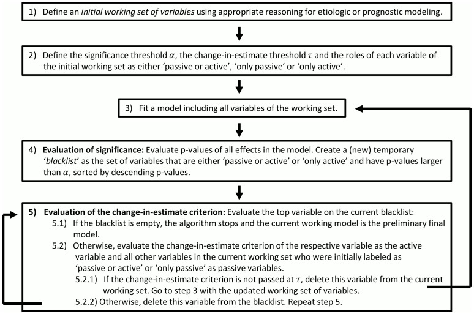

```{r echo = FALSE}
setwd("C:/Users/danfe/Dropbox/Proyectos Daniel/Cursos - diplomados - Maestrias/Programa de autoformación en investigación y análisis de datos/Rmarkdowns/Estadística/Programa de formación/Semana13")

knitr::opts_chunk$set(echo = TRUE, warning = FALSE, message = FALSE,
                         fig.show = "asis", results = "show",
                      fig.align='center',
                      fig.path = "figures/",  # Configura el directorio donde se guardan los gráficos
  dev = "png")
```

# Librerias a usar

```{r echo=FALSE}
pacman::p_load(
  olsrr,
  ggplot2,
  tidyverse,
  car)
```

\newpage

# Introducción

"Los modelos estadísticos son reglas matemáticas simples derivadas de datos empíricos que describen la asociación entre un resultado y varias variables explicativas". Para que sean útiles, los modelos estadísticos deben ser válidos, es decir, proporcionar predicciones con una precisión aceptable, y útiles en la práctica, es decir, permitir conclusiones como "¿qué tan grande es el cambio esperado en el resultado si una de las variables explicativas cambia en una unidad". Si la interpretabilidad de un modelo estadístico es relevante, también se debe tener en cuenta la simplicidad. Entre los partidarios de esta propuesta se encuentran el científico y artista universal Leonardo da Vinci (a quien a menudo se ha atribuido la frase “ La simplicidad es la máxima sofisticación ”), posiblemente el físico Albert Einstein (“ Haz que todo sea lo más simple posible, pero no más simple ”), y el empresario Sir Richard Branson, fundador del Grupo Virgin (“ La complejidad es nuestro enemigo. Cualquier tonto puede hacer algo complicado ”). 

La cita de Sir Richard Branson termina con la apódosis “ Es difícil mantener las cosas simples ”. En el contexto de la selección de variables basada en datos, muchos estadísticos están de acuerdo con Branson, ya que la selección de variables puede inducir problemas tales como coeficientes de regresión sesgados y valores p e invalidez de los niveles de confianza nominales. Según el famoso principio de resolución de problemas "la navaja de Occam", las soluciones más simples son preferibles a las más complejas, ya que son más fáciles de validar. Este principio se utiliza a menudo para justificar "modelos más simples". Sin embargo, en la búsqueda de modelos más simples, el análisis estadístico se vuelve realmente más complejo, ya que entonces hay que abordar problemas adicionales como la inestabilidad del modelo, la posibilidad de que varios modelos compitan con la misma probabilidad, el problema de la inferencia post-selección, etc. Por lo tanto, varios autores de libros de texto sobre modelos estadísticos han planteado preocupaciones diferenciadas sobre el uso de métodos de selección de variables en la práctica, dependiendo de su experiencia personal y áreas de investigación donde las teorías débiles o fuertes pueden dominar, mientras que en otros campos de la investigación empírica, por ejemplo en el aprendizaje automático, la selección de variables (o características) parece ser el estándar. Por lo tanto, existe una necesidad urgente de orientación a través de estas posiciones parcialmente controvertidas sobre la relevancia de los métodos de selección de variables en el análisis de datos de la vida real en las ciencias de la vida.

# Prerrequisitos estadísticos

La selección de variables se refiere al proceso de elegir las variables más relevantes para incluir en un modelo de regresión. Ayudan a mejorar el rendimiento del modelo y evitar un ajuste excesivo.

## Ser conciente del propósito principal del modelo

Shmueli ( 2010 ) identificó tres propósitos principales de los modelos estadísticos. Dentro de las preguntas de investigación predictiva, los modelos predictivos (o de pronóstico) tienen como objetivo predecir con precisión un valor de resultado a partir de un conjunto de predictores. Los modelos explicativos se utilizan en la investigación etiológica y deberían explicar las diferencias en los valores de los resultados mediante diferencias en las variables explicativas. Finalmente, los modelos descriptivos deberían “ captar la asociación entre variables dependientes e independientes ”

## Revisar los supuestos para el modelo elegido

Esto fue evaluado previamente en anteriores sesiones 

## Eventos por variable 

La relación entre el tamaño de la muestra (o el número de eventos) y el número de IV a menudo se expresa en una relación simple, denominada "eventos por variable" (EPV).

EPV cuantifica el equilibrio entre la cantidad de información proporcionada por los datos y el número de parámetros desconocidos que deben estimarse. Es intuitivo suponer que con un tamaño de muestra limitado no es posible estimar con precisión muchos coeficientes de regresión. Por lo tanto, reglas simples como “EPV debe ser al menos mayor que diez” se hicieron populares en la literatura

Si un modelo también puede incluir extensiones como transformaciones no lineales de IV o términos de interacción (producto) que requieren grados de libertad (DF) adicionales, entonces esto debe tenerse en cuenta en el denominador de EPV. Al considerar la selección de variables, lo que cuenta es el número total de IV candidatos (y de sus transformaciones consideradas); Esto a menudo se ha malinterpretado.

# Criterios de selección de variables

## Criterios de significancia

Las pruebas de hipótesis son los criterios más populares utilizados para seleccionar variables en problemas prácticos de modelado. Sin pérdida de generalidad, considere que comparamos dos modelos M 1 : β 0 +  β 1 X 1 +  β 2 X 2 y M 2 : γ 0 +  γ 1 X 1 . La hipótesis nula de que β 2 = 0 implica que β 0 =  γ 0 así como β 1 =  γ 1 . Esta hipótesis podría probarse comparando las probabilidades logarítmicas de M 1 y M 2 (mediante una prueba de razón de verosimilitud), lo que requeriría el ajuste de los dos modelos. 

Las pruebas de razón de verosimilitud proporcionan el mejor control sobre los parámetros molestos al maximizar la verosimilitud sobre ellos tanto en M 1 como en M 2 .

Las pruebas iteradas entre modelos producen algoritmos de selección de variables de selección directa (FS) o eliminación inversa (BE), dependiendo de si se comienza con un modelo vacío o con un modelo con todos los IV que se consideraron inicialmente. Se realiza FS o BE iterativo, utilizando niveles de significancia preespecificados α F o α B , hasta que no se incluyan ni excluyan más variables. Un procedimiento FS que incluye pasos BE a menudo se denomina procedimiento de selección por pasos (hacia adelante) y, correspondientemente, un procedimiento BE con pasos FS se denomina selección hacia atrás por pasos. La mayoría de los estadísticos prefieren BE a FS, especialmente cuando hay colinealidad presente.

Como siempre se requiere en la inferencia estadística, las pruebas entre modelos son confiables sólo si estas comparaciones están preespecificadas, es decir, si se compara un pequeño número de modelos preespecificados. Sin embargo, las pruebas realizadas durante el procedimiento de construcción del modelo no están preespecificadas, ya que los modelos a comparar a menudo ya son el resultado de (varios) pasos previos de inclusión o exclusión de variables. Esto causa dos problemas en la interpretabilidad de los valores p para pruebas de coeficientes de un modelo derivado por selección de variables. En primer lugar, las pruebas múltiples no contabilizadas generalmente conducirán a valores de p subestimados . En segundo lugar, los valores p para las pruebas de coeficientes de un modelo no prueban si una variable es relevante per se, sino más bien si es relevante dado el conjunto particular de variables de ajuste en ese modelo específico.

## Criterios de información

Si bien los criterios de significancia generalmente se aplican para incluir o excluir IV de un modelo, el enfoque de los criterios de información está en seleccionar un modelo de un conjunto de modelos plausibles. Dado que incluir más IV en un modelo aumentará ligeramente el ajuste aparente del modelo (expresado mediante la probabilidad del modelo), se desarrollaron criterios de información para penalizar el ajuste aparente del modelo por la complejidad del modelo. En su trabajo fundamental, Akaike ( 1973 ) propuso aproximar la expectativa de la probabilidad logarítmica con validación cruzada. El criterio de información de Akaike (AIC) se formula de manera equivalente como $$− 2 log (loglihood(M1) - loglihood(M2)) + 2K $$ (“cuanto más pequeño, mejor”).

AIC se puede utilizar para comparar dos modelos incluso si no están anidados jerárquicamente. También se puede utilizar para seleccionar uno entre varios modelos. Por ejemplo, a menudo se utiliza como criterio de selección en un procedimiento de selección del "mejor subconjunto" que evalúa todos los modelos ($$2^k$$ para k variables) resultantes de todas las combinaciones posibles de IV.

El criterio de información bayesiano (BIC) se desarrolló para situaciones en las que se supone la existencia de un modelo verdadero que está en el alcance de todos los modelos que se consideran en la selección del modelo. Con la selección guiada por BIC, el modelo seleccionado converge al modelo generador de datos "verdadero" (de manera puntual)

## Conocimiento de fondo ( criterio epidemiológico)

Muchos autores han destacado repetidamente la importancia de utilizar conocimientos previos para guiar la selección de variables. El conocimiento previo se puede incorporar al menos en dos etapas y requiere una interacción intensiva entre el IP del proyecto de investigación (generalmente un no estadístico) y el estadístico a cargo de diseñar y realizar el análisis estadístico. En la primera etapa, el IP utilizará conocimientos específicos de la materia para derivar una lista de IV que en principio son relevantes como predictores o variables de ajuste para el estudio en cuestión. Esta lista se basará principalmente en la disponibilidad de variables y no debe tener en cuenta la asociación empírica de los IV con la variable de resultado en el conjunto de datos. El número de IV a incluir en la lista también puede estar guiado por el EPV 

A menudo resulta útil redactar un boceto de un gráfico que visualice las supuestas dependencias causales entre los IV, donde el nivel de formalización de esas dependencias a veces puede alcanzar el de un gráfico acíclico dirigido (DAG) 

Dado que uno de los IV es de interés principal, por ejemplo expresando una exposición cuyo efecto debería ser inferido por un estudio, los DAG permiten clasificar los otros IV en factores de confusión, mediadores y colisionadores. Esto es importante porque para obtener una estimación insesgada del efecto causal de la exposición sobre el resultado, se deben ajustar todos los factores de confusión, pero no se deben incluir en un modelo los colisionadores o mediadores.

## Otros 
- Probabilidad penalizada

- Criterio de cambio en la estimación

# Algoritmos de selección de variables

Cada algoritmo de selección de variables tiene uno o varios parámetros de ajuste que pueden fijarse en un valor predeterminado o estimarse, por ejemplo, mediante validación cruzada u optimización AIC. Obsérvese que la validación cruzada por diez y la selección por AIC son asintóticamente equivalentes.

```{r echo =FALSE}
library(gt)
library(knitr)

# Crear la tabla con los datos
tabla_algoritmos <- tribble(
  ~Algoritmo, ~Descripción, ~Regla_de_detención,
  "Eliminación hacia atrás (BE)", "Comienza con el modelo global. Repite: Elimina la variable independiente (VI) menos significativa y vuelve a estimar el modelo. Detente si no queda ninguna VI insignificante.", "Todos los valores p (Wald) en el modelo multivariable < αB",
  "Selección hacia adelante (FS)", "Comienza con el modelo univariable más significativo. Repite: Evalúa el valor agregado de cada VI que actualmente no está en el modelo. Incluye la VI más significativa y vuelve a estimar el modelo. Detente si no queda ninguna VI significativa para incluir.", "Todos los valores p (score) de las variables actualmente no en el modelo multivariable > αF",
  "Hacia adelante paso a paso", "Comienza con el modelo nulo. Repite: Realiza un paso de FS. Después de cada inclusión de una VI, realiza un paso de BE. En los pasos de FS posteriores, reconsidera las VI que se eliminaron en pasos anteriores. Detente si no se puede eliminar o agregar ninguna VI.", "Todos los valores p de las variables en el modelo < αB, y todos los valores p de las variables que no están en el modelo > αF",
  "Hacia atrás paso a paso", "Enfoque paso a paso (ver arriba) comenzando con el modelo global, alternando entre pasos de BE y FS hasta la convergencia.", "Todos los valores p de las variables en el modelo < αB, y todos los valores p de las variables que no están en el modelo > αF",
  "Eliminación hacia atrás aumentada (ABE)", "Combina BE con un criterio de cambio estandarizado en la estimación. Las VI no se excluyen incluso si p > αB si su exclusión causa un cambio estandarizado en la estimación > τ en cualquier otra variable.", "Ninguna variable adicional que excluir por significancia y criterios de cambio en la estimación",
  "Selección del mejor subconjunto", "Estima los 2k modelos posibles. Elije el mejor modelo según un criterio de información, por ejemplo, AIC, BIC.", "Ningún subconjunto de variables alcanza un mejor criterio de información.",
  "Selección univariable", "Estima todos los modelos univariables. Deje que el modelo multivariable incluya todas las VI con p < αU.", "",
  "LASSO", "Impone una penalización en la suma de cuadrados o la verosimilitud que es igual a la suma absoluta de los coeficientes de regresión. El peso relativo de la penalización se optimiza mediante la suma de cuadrados o deviance cruzados validados.", "El peso relativo de la penalización se optimiza mediante la suma de cuadrados o deviance cruzados validados."
)

# Generamos la tabla usando gt
tabla_algoritmos |> 
  gt() |> 
  tab_style(
    style = cell_text(weight = "bold"),
    locations = cells_column_labels()
  ) |> 
  tab_style(
    style = cell_text(v_align = "top"),
    locations = cells_body()
  ) |> 
  opt_horizontal_padding(scale = 3) |> 
  opt_table_font(font = "Jost")

```

# Consecuencias de la selección de variables  

Si bien la selección de variables univariables, es decir, incluir aquellos IV en un modelo multivariable que muestran una asociación significativa con el resultado en modelos univariables, es uno de los enfoques más populares en muchos campos de investigación, en general debe evitarse.

Entre los métodos de selección basados en la significancia, preferimos BE a FS (Mantel, 1970). Según nuestra experiencia, el uso del AIC, que corresponde a α  ≈ 0,157, pero no α  menor, es recomendable si se dispone de menos de 25 EPV. Para muestras con más EPV, los investigadores que crean que existe un modelo simple verdadero y que es identificable pueden preferir un umbral más estricto ( α = 0,05). También pueden preferir BIC, ya que tiene el potencial de identificar asintóticamente el modelo correcto.

# Estabilidad del modelo

Un problema muy importante, pero a menudo ignorado, de la selección de variables basada en datos es la estabilidad del modelo, es decir, la robustez del modelo seleccionado ante pequeñas perturbaciones del conjunto de datos.

El remuestreo bootstrap con reemplazo o el submuestreo sin reemplazo son herramientas valiosas para investigar y cuantificar la estabilidad del modelo de modelos seleccionados.

La idea básica es extraer B remuestras del conjunto de datos original y repetir la selección de variables en cada una de las remuestras. Los tipos importantes de cantidades que este enfoque puede proporcionar son (i) frecuencias de inclusión de arranque para cuantificar la probabilidad de que se seleccione un IV, (ii) distribuciones de muestreo de coeficientes de regresión, (iii) frecuencias de selección de modelos para cuantificar la probabilidad de que se seleccione un conjunto particular de IV. seleccionados, y (iv) frecuencias de inclusión por pares, evaluando si los pares de IV (correlacionados) están compitiendo por la selección.

Además, si se establece en 0 un coeficiente de regresión remuestreado de un IV no seleccionado en un remuestre particular, la distribución remuestreada de los coeficientes de regresión puede dar una idea de la distribución muestral causada por la selección de variables. Por ejemplo, el coeficiente de regresión mediano para cada IV calculado sobre las nuevas muestras puede producir un modelo disperso que es menos propenso a la sobreestimación que si la selección de variables se aplica solo al conjunto de datos original. Los percentiles 2,5 y 97,5 de los coeficientes de regresión remuestreados pueden servir como intervalos de confianza basados en el remuestreo, teniendo en cuenta la incertidumbre del modelo sin hacer suposiciones sobre la forma de la distribución muestral. Sin embargo, pueden subestimar gravemente la verdadera variabilidad si las frecuencias de inclusión del bootstrap son bajas, por ejemplo, inferiores al 50 %.


# RECOMENDACIONES

Muchos investigadores buscan asesoramiento para la situación típica en la que hay muchos IV que potencialmente se pueden considerar en un modelo pero donde el tamaño de la muestra es limitado (EPV ≈10 o menos). En la investigación aplicada, los métodos de selección de variables con demasiada frecuencia se han utilizado incorrectamente, dando a dichos métodos basados ​​en datos el control exclusivo sobre la construcción de modelos. Esto a menudo ha sido el resultado de conceptos erróneos comunes sobre las capacidades de los métodos de selección de variables

## Generar un conjunto de trabajo inicial de variables

El modelado debe comenzar con suposiciones defendibles sobre las funciones de los IV que pueden basarse en conocimientos previos (que un programa de computadora normalmente no posee), es decir, en estudios previos en el mismo campo de investigación, en conocimientos de expertos o en el sentido común. Siguiendo esta regla de oro, a menudo se puede compilar un conjunto de trabajo inicial de IV, el “ modelo global ”, sin utilizar aún el conjunto de datos disponible para descubrir las relaciones de los IV con el resultado 

## Decidir si se debe aplicar la selección de variables

Recomendamos no considerar la selección de variables en los IV “fuertes” y someter a los IV con un papel poco claro a la selección de variables solo con un tamaño de muestra suficiente. Si se aplica la selección de variables, debe ir acompañada de investigaciones de estabilidad. 

Entre los procedimientos de selección de variables, se prefiere BE ya que comienza con el modelo global imparcial supuesto.

AIC ( α B = 0,157) podría usarse como criterio de parada predeterminado, pero en algunas situaciones pueden ser necesarios valores mayores de α B para aumentar la estabilidad. Sólo en conjuntos de datos muy grandes, E P V g l o b a l  > 100, se podría considerar el BIC o α B  ≤ 0,05. Si se debe garantizar que no se pasen por alto predictores o factores de confusión importantes, entonces la ABE puede ser una extensión útil de la BE.

```{r echo = FALSE}
library(gt)
library(knitr)

# Crear la tabla con los datos
tabla_recomendaciones <- tribble(
  ~Situación, ~Recomendación,
  "Para algunas IV se sabe por estudios previos que sus efectos son fuertes, por ejemplo, la edad en estudios de riesgo cardiovascular o el estadio del tumor en el momento del diagnóstico en estudios de cáncer.", "No realice una selección de variables en IV con fuertes efectos conocidos.",
  "EPV global > 25", "La selección de variables (en IV con un tamaño del efecto poco claro) debe ir acompañada de una investigación de estabilidad.",
  "10 < EPV global ≤ 25", "La selección de variables en IV con un tamaño del efecto poco claro debe ir acompañada de métodos de contracción posterior a la estimación (p. ej., Dunkler et al., 2016 ), o se debe realizar una estimación penalizada (selección LASSO). En cualquier caso, se recomienda una investigación de estabilidad.",
  "EPV global ≤ 10", "No se recomienda la selección de variables. Estimar el modelo global con factor de contracción o probabilidad penalizada (regresión de rigde). La interpretación de los efectos puede resultar difícil debido a una estimación sesgada del efecto."
)

# Generamos la tabla usando gt
tabla_recomendaciones |> 
  gt() |> 
  tab_style(
    style = cell_text(weight = "bold"),
    locations = cells_column_labels()
  ) |> 
  tab_style(
    style = cell_text(v_align = "top"),
    locations = cells_body()
  ) |> 
  opt_horizontal_padding(scale = 3) |> 
  opt_table_font(font = "Jost")

```

## Realizar investigaciones de estabilidad y análisis de sensibilidad

Las investigaciones de estabilidad deberían comprender al menos la evaluación del impacto de la selección de variables sobre el sesgo y la varianza del coeficiente de regresión y el cálculo de las frecuencias de inclusión de bootstrap. Opcionalmente, se podrían agregar frecuencias de selección de modelo y frecuencias de inclusión por pares. Una investigación de estabilidad extendida como la realizada por Royston y Sauerbrei (2003), quienes realizaron un nuevo análisis de las fracciones de inclusión bootstrap de cada IV utilizando un análisis log-lineal, puede ser muy informativa pero puede ir más allá de los requisitos habituales.

El sesgo de sobreestimación se produce si se ha seleccionado una variable sólo porque su coeficiente de regresión parecía ser extremo en la muestra particular. Este sesgo condicional se puede expresar en relación con el coeficiente de regresión (supuestamente insesgado) en el modelo global estimado a partir de los datos originales, y calcularse como la diferencia de la media de los coeficientes de regresión remuestreados calculados a partir de aquellas remuestras donde se seleccionó la variable y el modelo global. coeficiente de regresión, dividido por el coeficiente de regresión del modelo global.

Para evaluar la varianza, proponemos calcular la diferencia cuadrática media (RMSD) de las estimaciones de arranque de un coeficiente de regresión y su valor correspondiente (supuesto insesgado) en el modelo global estimado a partir de los datos originales. El “ratio RMSD”, es decir, el RMSD dividido por el error estándar de ese coeficiente en el modelo global, expresa intuitivamente la inflación o deflación de la varianza causada por la selección de variables.

Además, recomendamos realizar análisis de sensibilidad cambiando las decisiones tomadas en los distintos pasos del análisis. Por ejemplo, puede haber conjuntos de supuestos opuestos sobre los roles y fortalezas supuestas de las variables en el primer paso que podrían conducir a diferentes conjuntos de trabajo. O bien, la selección o no selección de IV y los coeficientes de regresión estimados son sensibles a los umbrales de valor p utilizados. Esta sensibilidad se puede visualizar utilizando caminos de estabilidad como se ejemplifica en Dunkler et al. ( 2014 ). Los análisis de sensibilidad deben especificarse previamente en el protocolo de análisis.

El efecto secundario más desagradable de la selección de variables es su impacto en la inferencia sobre los valores verdaderos de los coeficientes de regresión mediante pruebas e intervalos de confianza. Sólo con tamaños de muestra grandes, correspondientes a EPV superiores a 50 o 100, podemos confiar en la capacidad asintótica de algunos métodos de selección de variables para identificar el modelo verdadero, haciendo así que la inferencia sea aproximadamente válida condicionada al modelo seleccionado. Con EPV más desfavorables, la inestabilidad del modelo añade una fuente no despreciable de incertidumbre, que simplemente se ignoraría si se realizara una inferencia únicamente condicional al modelo seleccionado. Se ha señalado que no se puede lograr una inferencia postselección válida (Leeb y Pötscher, 2005 ).


# Aplicación práctica

## Todas las regresiones posibles

Si hay K variables independientes potenciales (además de la constante), entonces habrá $2^k$ distintos subconjuntos de ellos para ser modelados. Por ejemplo, si tiene 10 variables independientes candidatas, el número de subconjuntos que se probarán es $2^{10}$, que es 1024, y si tiene 20 variables candidatas, el número es $2^{20}$, que es más de un millón.

```{r}
model <- lm(mpg ~ disp + hp + wt + qsec, data = mtcars)
ols_step_all_possible(model)
```


## Mejor subconjunto de variables para el modelo de regresión

Seleccione el subconjunto de predictores que mejor cumplan algún criterio objetivo bien definido, como tener el valor R2 más grande o el MSE, Mallow’s Cp o AIC más pequeño.


```{r out.width= "200%"}
model <- lm(mpg ~ disp + hp + wt + qsec, data = mtcars)
ols_step_best_subset(model)
    
```


## Selección paso a paso (Stepwise Selection)

La regresión por pasos es un método para ajustar modelos de regresión que implica la selección iterativa de variables independientes para usar en un modelo. Se puede lograr mediante selección hacia adelante, eliminación hacia atrás o una combinación de ambos métodos. El enfoque de selección directa comienza sin variables y agrega cada nueva variable de forma incremental, probando la significancia estadística, mientras que el método de eliminación hacia atrás comienza con un modelo completo y luego elimina las variables estadísticamente menos significativas una a la vez.

**Base de datos**

Usaremos la siguiente base de datos a lo largo de esta sesión, excepto en el caso de selección jerárquica.

```{r}
# Data a usar
data(surgical)

surgical

```

Format: A data frame with 54 rows and 9 variables:

-   bcs: blood clotting score

-   pindex: prognostic index

-   enzyme_test: enzyme function test score

-   liver_test: liver function test score

-   age: age, in years

-   gender: indicator variable for gender (0 = male, 1 = female)

-   alc_mod: indicator variable for history of alcohol use (0 = None, 1 = Moderate)

-   alc_heavy: indicator variable for history of alcohol use (0 = None, 1 = Heavy)

-   y: Survival Time

 **Modelo**
```{r}
model <- lm(y ~ ., data = surgical)
summary(model)

```
Independientemente del método paso a paso que se utilice, tenemos que especificar el modelo completo, es decir, todas las variables/predictores bajo consideración para olsrrextraer las variables candidatas para selección/eliminación del modelo especificado.


### Selección hacia adelante (Forward selection)

En términos simples, comenzamos con un modelo que contiene todos los predictores ( y ~ .) y agregamos iterativamente las variables estadísticamente más significativas hasta que no se observa ninguna mejora.

```{r}
# stepwise forward regression
ols_step_forward_p(model)
```


### Eliminación hacia atrás (Backward elimination)

Aquí, comenzamos con un modelo que incluye todos los predictores y eliminamos iterativamente las variables estadísticamente menos significativas hasta que el modelo ya no mejora.

```{r}
# stepwise backward regression
ols_step_backward_p(model)
```

### Selección jerárquica (Hierarchical selection)

Cuando utilizamos pvalores como criterio para seleccionar/eliminar variables, podemos habilitar la selección jerárquica. En este método, la búsqueda de la variable más significativa se restringe a la siguiente variable disponible. En el siguiente ejemplo, como liver_testno cumple con el umbral de selección, ninguna de las variables posteriores liver_testse considera para una selección adicional, es decir, la selección gradual finaliza tan pronto como se encuentra una variable que no cumple con el umbral de selección. 

```{r}
# hierarchical selection
m <- lm(y ~ bcs + alc_heavy + pindex + enzyme_test + liver_test + age + gender + alc_mod, data = surgical)
ols_step_forward_p(m, p_val = 0.1, hierarchical = TRUE)
```


### Regresión paso a paso en ambas direcciones (Both-Direction Stepwise Regression)
En la regresión bidireccional, el algoritmo combina pasos hacia adelante y hacia atrás, optimizando el modelo agregando variables significativas y eliminando las insignificantes.

#### Selección paso a paso hacia adelante

```{r}
# Both-Direction Stepwise Regression
ols_step_both_p(model, p_enter = 0.05, p_remove = 0.05, details = T)
```

#### Visualization

Utilice el plot()método para visualizar la selección de variables. Mostrará cómo cambian los criterios de selección de variables en cada paso del proceso de selección junto con la variable seleccionada.

```{r echo=FALSE}
# adjusted r-square 
k <- ols_step_both_p(model, p_enter = 0.05, p_remove = 0.05, details = T)
```

```{r fig.width=12}
plot(k)

```


#### Selección paso a paso hacia atras

```{r}
# Both-direction stepwise regression
both_model <- step(model, direction = "both")

# Modelo final
summary(both_model)
```


### Eliminación hacia atrás aumentada (ABE)

```{r, echo=FALSE, fig.width= "150%"}

```
La función "abe"realiza una eliminación hacia atrás aumentada donde la selección de variables se basa en el cambio de estimación y los criterios de importancia o información. También puede realizar una selección retrospectiva basada en criterios de importancia o de información únicamente desactivando el criterio de cambio en la estimación.

**ARGUMENTOS**

- _include_: un vector que contiene los nombres de las variables que se incluirán en el modelo final. Estas variables se utilizan únicamente como variables pasivas durante el modelado. Estas variables podrían ser variables de exposición de interés o factores de confusión conocidos. Nunca se eliminarán del modelo de trabajo en el proceso de selección, pero se utilizarán pasivamente para evaluar los criterios de cambio en la estimación de otras variables. Tenga en cuenta que las variables que no se especifican como incluidas o activas en el ajuste del modelo se supone que son variables activas y pasivas.

- _tau_: Valor que especifica el umbral del criterio de cambio relativo en la estimación. El valor predeterminado está establecido en 0,05.

- _exact_: Lógico, especifica si el método utilizará el cambio de estimación exacto o su aproximación. El valor predeterminado está establecido en FALSO, lo que significa que el método utilizará la aproximación propuesta por Dunkler et al. Tenga en cuenta que establecerlo en VERDADERO puede ralentizar gravemente el algoritmo, pero establecerlo en FALSO puede, en algunos casos, conducir a una mala aproximación del criterio de cambio en la estimación.

- _criterion_: Cadena que especifica la estrategia para seleccionar variables para la lista negra. Las opciones actualmente admitidas son el nivel de significancia 'alpha', el criterio de información de Akaike 'AIC'y el criterio de información bayesiano 'BIC'. Si está utilizando el nivel de significancia, en ese caso debe especificar el valor de 'alfa' (ver parámetro alpha) y el tipo de estadística de prueba (ver parámetro type.test). El valor predeterminado está configurado en "alpha".

- _alpha_: Valor que especifica el nivel de significancia como se explicó anteriormente. El valor predeterminado está establecido en 0,2.

- _type.test_: Cadena que especifica qué prueba se debe realizar en caso de que el archivo criterion = "alpha". Los valores posibles son "F"y "Chisq"(predeterminado) para clase "lm", "Rao", "LRT"( "Chisq"predeterminado), "F"para clase "glm"y "Chisq"para clase "coxph". Ver también drop1.

- _type.factor_: Cadena que especifica cómo tratar los factores, los valores posibles son "factor"y "individual".

- _verbose_: Lógico que especifica si se debe imprimir el proceso de selección de variables. Nota: esto puede ralentizar gravemente el algoritmo.

```{r}
pacman::p_load(abe)
# using the exact change in the estimate of 5% and significance
# using 0.2 as a threshold
model <- lm(y ~ bcs + pindex + enzyme_test + liver_test + age + 
              factor(gender) + factor(alc_mod) + factor(alc_heavy),
              x = TRUE, y = TRUE,
              data = surgical)

abe.fit<-abe(model, data=surgical,
                        tau=0.05, exp.beta=FALSE, exact=TRUE, criterion="alpha", alpha=0.2,
                        type.test="Chisq", verbose=TRUE, type.factor="factor")
```

# Datos necesarios para la publicación

Usaremos otra base de datos para ejemplificar los siguientes pasos *case1_bodyfat.txt*

Pregunta de investigación: " Nos gustaría aproximar la proporción de grasa corporal mediante medidas antropométricas simples "

```{r}
case1.bodyfat <-
  read.table("data/case1_bodyfat.txt", header = T, sep = ";")

case1.bodyfat
```

## Númeo de eventos por variable
```{r}
pred <- c("age", "weight_kg", "height_cm", "neck", "chest", "abdomen", "hip", 
          "thigh", "knee", "ankle", "biceps", "forearm", "wrist")

# EPV global = 251 / 13  
epv <- dim(case1.bodyfat)[1] / length(pred)
epv

```
## Evaluar la estructura de correlación

```{r}
cor(case1.bodyfat[, pred])
```

## Escoger método de seleccion de variables

Consideramos el abdomen y la altura como dos IV centrales para estimar la proporción de grasa corporal y no los someteremos a una selección de variables. En nuestra evaluación anterior, creemos además que todos los demás IV pueden estar fuertemente interrelacionados e intercambiables cuando se usan para estimar la grasa corporal. Por tanto, los someteremos a BE con AIC como criterio de selección


```{r}
formula <- paste("siri~", paste(pred, collapse = "+"))

full_mod <- lm(formula, data = case1.bodyfat, x = T, y = T)
full_est <- coef(full_mod)
full_se <- coef(summary(full_mod))[, "Std. Error"]

# stepwise backward regression
ols_step_backward_aic(full_mod, include = c("abdomen", "height_cm"), details = F)

# creamos modelo seleccionado
sel_mod <- lm(formula = siri ~ age + height_cm + neck + chest + abdomen + 
    forearm + wrist, data = case1.bodyfat, x = T, y = T)
sel_est <- coef(sel_mod)[c("(Intercept)", pred)]
sel_est[is.na(sel_est)] <- 0
names(sel_est) <- c("(Intercept)", pred)
sel_se <- coef(summary(sel_mod))[, "Std. Error"][c("(Intercept)", pred)]
sel_se[is.na(sel_se)] <- 0


  
```

## revisar la mejora del modelo
El R 2 ajustado aumenta sólo ligeramente del 73,99% en el modelo global al 74,16% en el modelo seleccionado. 

## Calcular los factores de contracción
Se calcularon los factores de contracción posteriores a la estimación, uno global y otro en función de los parámetros. El factor de contracción global modifica todos los coeficientes de regresión por el mismo factor. En este ejemplo es de 0,98, muy próximo a 1, por lo que puede despreciarse. Los factores de contracción en función de los parámetros varían mucho (Tabla suplementaria 3) y están muy correlacionados. Estas cantidades se obtuvieron utilizando el paquete R shrink (Dunkler, Sauerbrei y Heinze, 2016).

```{r}
library(shrink)

sel_mod_shrinkg <- shrink(sel_mod, type="global")
sel_mod_shrinkp <- shrink(sel_mod, type="parameterwise")

sel_mod_shrinkg$ShrinkageFactors
sel_mod_shrinkp$ShrinkageFactors


sel_mod_shrinkp_vcov<-vcov(sel_mod_shrinkp)

round(cbind("Shrinkage factors" = sel_mod_shrinkp$ShrinkageFactors,
            "SE of shrinkage factors" = sqrt(diag(sel_mod_shrinkp_vcov))[-1],
            "Correlation matrix of shrinkage factors" = 
              cov2cor(sel_mod_shrinkp_vcov)[-1,-1]),4)

```
## Presentación de las estimaciones finales

Las medianas de bootstrap podrían obtener un agregado escaso sobre los diferentes modelos estimados en el procedimiento bootstrap; en este análisis se asemeja al modelo seleccionado. Los coeficientes de los IV seleccionados son muy similares a las estimaciones del modelo global, lo que indica que no hay sesgo de selección en el modelo agregado. Los percentiles 2,5 y 97,5 pueden interpretarse como límites de intervalos de confianza del 95% obtenidos mediante inferencia multimodelo basada en remuestreo.

```{r}
# Table 5 in the manuscript

# Bootstrap
bootnum <- 1000
boot_est <-  boot_se <- matrix(0, ncol = length(pred) + 1, nrow = bootnum,
                               dimnames = list(NULL, c("(Intercept)", pred)))

set.seed(5437854)
for (i in 1:bootnum) {
  data_id <- sample(1:dim(case1.bodyfat)[1], replace = T)
  boot_mod <- step(lm(formula, data = case1.bodyfat[data_id, ], 
                             x=T, y=T), 
                         scope = list(upper = formula, 
                                      lower = 
                                        formula(siri ~ abdomen + height_cm)),
                         direction = "backward", trace = 0)
  boot_est[i, names(coef(boot_mod))] <- coef(boot_mod)
  boot_se[i, names(coef(boot_mod))] <- coef(summary(boot_mod))[, "Std. Error"]
}
boot_01 <- (boot_est != 0) * 1
boot_inclusion <- apply(boot_01, 2, function(x) sum(x) / length(x) * 100)

# estimaciones
sqe <- (t(boot_est) - full_est) ^ 2
rmsd <- apply(sqe, 1, function(x) sqrt(mean(x)))
rmsdratio <- rmsd / full_se
boot_mean <- apply(boot_est, 2, mean)
boot_meanratio <- boot_mean / full_est
boot_relbias <- (boot_meanratio / (boot_inclusion / 100) - 1) * 100
boot_median <- apply(boot_est, 2, median)
boot_025per <- apply(boot_est, 2, function(x) quantile(x, 0.025))
boot_975per <- apply(boot_est, 2, function(x) quantile(x, 0.975))
  
overview <- round(cbind(full_est, full_se, boot_inclusion, sel_est, sel_se, 
                        rmsdratio, boot_relbias, boot_median, boot_025per, 
                        boot_975per), 4)
overview <- overview[order(overview[,"boot_inclusion"], decreasing=T),]
```
```{r echo=FALSE}
# Cargar las bibliotecas necesarias
library(dplyr)
library(gt)


# Crear la tabla con gt y aplicar formato
as.data.frame(overview) |> 
rownames_to_column(var = "Variable") %>%  # Agregar la primera columna como Variable
  gt() %>%
  tab_style(
    style = cell_text(weight = "bold", align = "center"),
    locations = cells_column_labels()
  ) %>%
  tab_style(
    style = cell_text(align = "center"),
    locations = cells_body()
  ) %>%
  tab_options(
    table.width = pct(100),
    table.font.size = "medium"
  ) %>%
  opt_horizontal_padding(scale = 2)
```

## Evaluar la inestabilidad del modelo 

El remuestreo Bootstrap indica la inestabilidad de este modelo, ya que fue seleccionado en solo el 2% de los remuestreos, y si los modelos se clasifican por sus frecuencias de selección, ocupa solo el cuarto lugar (Tabla 6). Sin embargo, una frecuencia de modelo de arranque baja como ésta no es atípica en un conjunto de datos biomédicos.

```{r}
# Model frequency ---------------------------------------------------
# Table 6 in the manuscript -----------------------------------------
pred_ord <- names(boot_inclusion)[order(boot_inclusion, decreasing = T)]
boot_01 <- boot_01[, pred_ord]
boot_01 <- cbind(boot_01, count = rep(1, times = bootnum))
boot_modfreq <- aggregate(count ~ ., data = boot_01, sum)
boot_modfreq[, "percent"] <- boot_modfreq$count / bootnum * 100
boot_modfreq <- boot_modfreq[order(boot_modfreq[, "percent"], decreasing = T), ]
boot_modfreq[, "cum_percent"] <- cumsum(boot_modfreq$percent)
boot_modfreq <- boot_modfreq[boot_modfreq[, "cum_percent"] <= 80, ]
if (dim(boot_modfreq)[1] > 20) boot_modfreq <- boot_modfreq[1:20, ]


Model_percent <- cbind("Predictors"= apply(boot_modfreq[,c(2:14)], 1, 
                          function(x) paste(names(x[x==1]), collapse=" ")),
                       boot_modfreq[,c("count", "percent", "cum_percent")])

```
```{r echo=FALSE}
# Cargar las bibliotecas necesarias
library(dplyr)
library(gt)


# Crear la tabla con gt y aplicar formato
as.data.frame(Model_percent) |> 
rownames_to_column(var = "model number") %>%  # Agregar la primera columna como Variable
  gt() %>%
  tab_style(
    style = cell_text(weight = "bold", align = "center"),
    locations = cells_column_labels()
  ) %>%
  tab_style(
    style = cell_text(align = "center"),
    locations = cells_body()
  ) %>%
  tab_options(
    table.width = pct(100),
    table.font.size = "medium"
  ) %>%
  opt_horizontal_padding(scale = 2)
```
```{r}
# Model frequency in % of selected model ----------------------------
sel_modfreq <- sum(apply(boot_01[, -dim(boot_01)[2]], 1, function(x)
    identical(((sel_est != 0) * 1)[pred_ord], x))) / bootnum * 100

sel_modfreq

```

```{r}
# Model frequency in % of selected model ----------------------------
sel_modfreq <- sum(apply(boot_01[, -dim(boot_01)[2]], 1, function(x)
    identical(((sel_est != 0) * 1)[pred_ord], x))) / bootnum * 100

sel_modfreq

```


## Evaluación de inclusion de pares
Las frecuencias de inclusión en pares informan sobre los "equipos de cuerda" y los "competidores" entre las VI (Tabla de Información Complementaria S2). Por ejemplo, el muslo y el bíceps fueron seleccionados solo en el 14.3% de las muestras, mientras que se esperaría una frecuencia del 19.8% (= 47.9% × 43.1%) dado la selección independiente. Por lo tanto, el par se marca con "-" en el triángulo inferior de la Tabla de Información Complementaria S1. El muslo y la cadera se marcan con "+" porque son seleccionados simultáneamente en el 28.7% de las muestras, mientras que la expectativa bajo independencia es solo del 19.8%. En esta tabla, usamos la significancia de una prueba de χ2 al nivel del 0.01 como criterio formal para las marcas. Interesantemente, la edad forma un "equipo de cuerda" con el cuello, el antebrazo, el pecho y el muslo, pero el peso es un competidor para la edad.

```{r}

# Pairwise inclusion frequency in % ----------------------------------
# Supplementary Table 2 in supporting information --------------------
pval <- 0.01
boot_pairfreq <- matrix(100, ncol = length(pred), nrow = length(pred),
                        dimnames = list(pred_ord[-1], 
                                        pred_ord[-1]))

expect_pairfreq <- NULL
combis <- combn(pred_ord[-1], 2)

for (i in 1:dim(combis)[2]) {
  boot_pairfreq[combis[1, i], combis[2, i]] <-
    sum(apply(boot_01[, combis[, i]], 1, sum) == 2) / bootnum * 100
  expect_pairfreq[i] <-
    boot_inclusion[grepl(combis[1, i], pred_ord)][1] *
    boot_inclusion[grepl(combis[2, i], pred_ord)][1] / 100
  boot_pairfreq[combis[2, i], combis[1, i]] <-
    ifelse(is(suppressWarnings(try(chisq.test(boot_01[, combis[1, i]], 
                                              boot_01[, combis[2, i]]), 
                                   silent = T)), "try-error"),
      NA, ifelse(suppressWarnings(
                   chisq.test(boot_01[, combis[1, i]],
                              boot_01[, combis[2, i]])$p.value) > pval,
        "", ifelse(as.numeric(boot_pairfreq[combis[1, i], combis[2, i]]) < 
                     expect_pairfreq[i], "-", "+")))
}

diag(boot_pairfreq) <- boot_inclusion[pred_ord][-1]

# boot_pairfreq
```


```{r echo=FALSE}
# Cargar las bibliotecas necesarias
library(dplyr)
library(gt)


# Crear la tabla con gt y aplicar formato
as.data.frame(boot_pairfreq) |> 
rownames_to_column(var = "Variable") %>%  # Agregar la primera columna como Variable
  gt() %>%
  tab_style(
    style = cell_text(weight = "bold", align = "center"),
    locations = cells_row_groups()
  ) %>%
  tab_style(
    style = cell_text(align = "center"),
    locations = cells_body()
  ) %>%
  tab_options(
    table.width = pct(100),
    table.font.size = "medium"
  ) %>%
  opt_horizontal_padding(scale = 2)
```


# References

*Revisar*

<https://cran.r-project.org/web/packages/olsrr/vignettes/variable_selection.html>

<https://quantifyinghealth.com/stepwise-selection/>

*otras referencias*

Dunkler D, Plischke M, Leffondré K, Heinze G. Augmented backward elimination: a pragmatic and purposeful way to develop statistical models. PLoS One. 2014;9(11):e113677. Published 2014 Nov 21. doi:10.1371/journal.pone.0113677

Heinze G, Wallisch C, Dunkler D. Variable selection - A review and recommendations for the practicing statistician. Biom J. 2018 May;60(3):431-449. doi: 10.1002/bimj.201700067. Epub 2018 Jan 2. PMID: 29292533; PMCID: PMC5969114.

</script>
