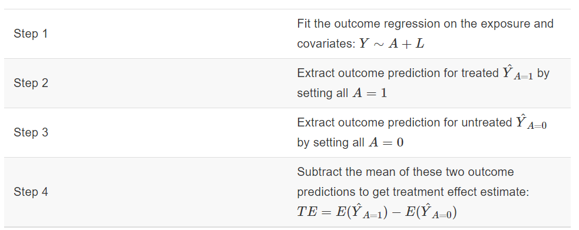
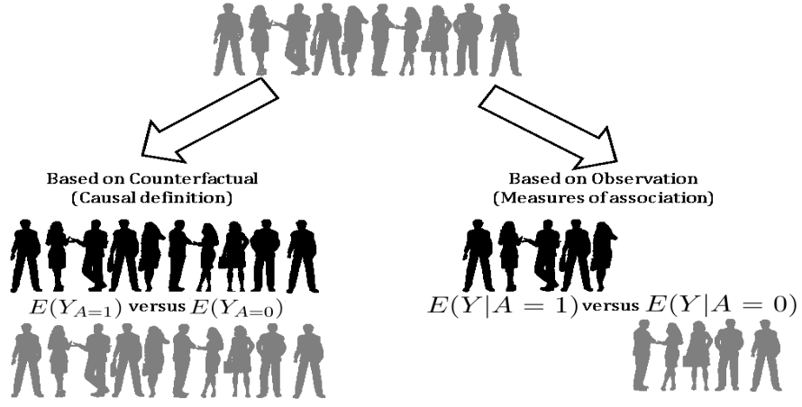
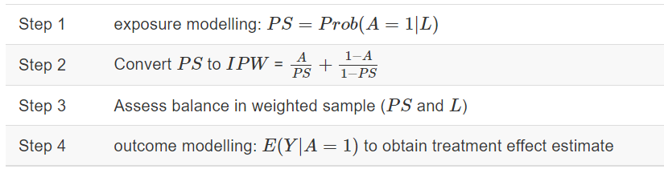
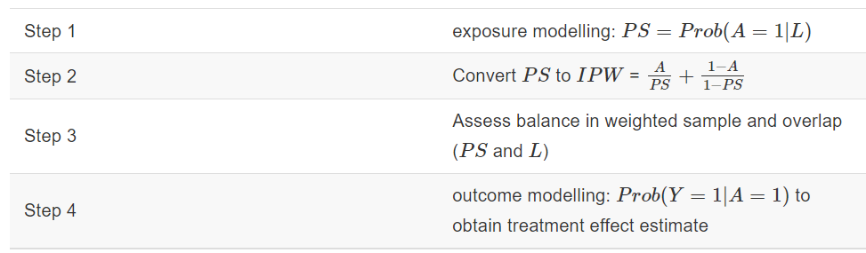
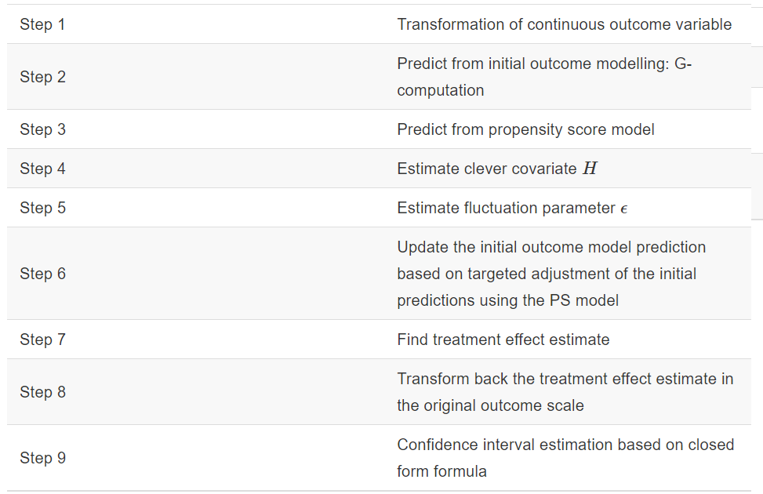
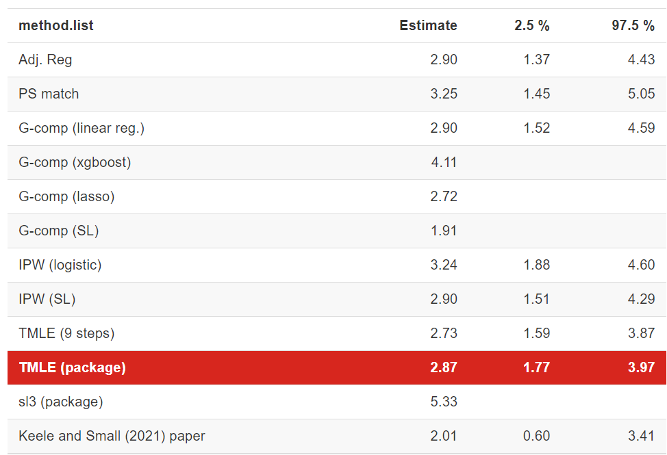
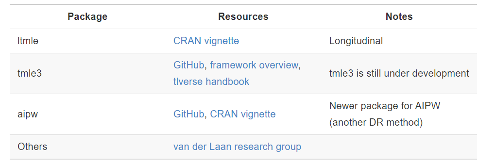

## Importamos datos

```{r}
# load the dataset https://hbiostat.org/data/

setwd("C:/Users/danfe/Dropbox/Proyectos Daniel/Cursos - diplomados - Maestrias/Programa de autoformación en investigación y análisis de datos/Rmarkdowns/Estadística/Programa de formación/Semana23 Metogos_G")

ObsData <- rio::import("rhc.csv")
```

## Limpieza

```{r}
# add column for outcome Y: length of stay 
# Y = date of discharge - study admission date
# Y = date of death - study admission date if date of discharge not available
ObsData$Y <- ObsData$dschdte - ObsData$sadmdte
ObsData$Y[is.na(ObsData$Y)] <- ObsData$dthdte[is.na(ObsData$Y)] - 
  ObsData$sadmdte[is.na(ObsData$Y)]
# remove outcomes we are not examining in this example
ObsData <- dplyr::select(ObsData, 
                         !c(dthdte, lstctdte, dschdte, death, t3d30, dth30, surv2md1))
# remove unnecessary and problematic variables 
ObsData <- dplyr::select(ObsData, 
                         !c(sadmdte, ptid, V1, adld3p, urin1, cat2))

# convert all categorical variables to factors 
factors <- c("cat1", "ca", "cardiohx", "chfhx", "dementhx", "psychhx", 
             "chrpulhx", "renalhx", "liverhx", "gibledhx", "malighx", 
             "immunhx", "transhx", "amihx", "sex", "dnr1", "ninsclas", 
             "resp", "card", "neuro", "gastr", "renal", "meta", "hema", 
             "seps", "trauma", "ortho", "race", "income")
ObsData[factors] <- lapply(ObsData[factors], as.factor)
# convert our treatment A (RHC vs. No RHC) to a binary variable
ObsData$A <- ifelse(ObsData$swang1 == "RHC", 1, 0)
ObsData <- dplyr::select(ObsData, !swang1)
# Categorize the variables to match with the original paper
ObsData$age <- cut(ObsData$age,breaks=c(-Inf, 50, 60, 70, 80, Inf),right=FALSE)
ObsData$race <- factor(ObsData$race, levels=c("white","black","other"))
ObsData$sex <- as.factor(ObsData$sex)
ObsData$sex <- relevel(ObsData$sex, ref = "Male")
ObsData$cat1 <- as.factor(ObsData$cat1)
levels(ObsData$cat1) <- c("ARF","CHF","Other","Other","Other",
                          "Other","Other","MOSF","MOSF")
ObsData$ca <- as.factor(ObsData$ca)
levels(ObsData$ca) <- c("Metastatic","None","Localized (Yes)")
ObsData$ca <- factor(ObsData$ca, levels=c("None",
                                          "Localized (Yes)","Metastatic"))
# Rename variables
names(ObsData) <- c("Disease.category", "Cancer", "Cardiovascular", 
                    "Congestive.HF", "Dementia", "Psychiatric", "Pulmonary", 
                    "Renal", "Hepatic", "GI.Bleed", "Tumor", 
                    "Immunosupperssion", "Transfer.hx", "MI", "age", "sex", 
                    "edu", "DASIndex", "APACHE.score", "Glasgow.Coma.Score", 
                    "blood.pressure", "WBC", "Heart.rate", "Respiratory.rate", 
                    "Temperature", "PaO2vs.FIO2", "Albumin", "Hematocrit", 
                    "Bilirubin", "Creatinine", "Sodium", "Potassium", "PaCo2", 
                    "PH", "Weight", "DNR.status", "Medical.insurance", 
                    "Respiratory.Diag", "Cardiovascular.Diag", 
                    "Neurological.Diag", "Gastrointestinal.Diag", "Renal.Diag",
                    "Metabolic.Diag", "Hematologic.Diag", "Sepsis.Diag", 
                    "Trauma.Diag", "Orthopedic.Diag", "race", "income", 
                    "Y", "A")

 # saveRDS(ObsData, file = "rhcAnalytic.RDS")

ObsData2 <- ObsData
```

## Análisis

```{r}
library(gtsummary) 
set_gtsummary_theme(theme_gtsummary_compact())  

# theme to round percentages to one decimal place 
set_gtsummary_theme(list(`tbl_summary-fn:percent_fun` = function(x) sprintf("%.1f", x * 100)))

# No permite setear lo siguiente pero se puede agregar manualmente
                         #`tbl_regression:estimate_fun` = function(x) style_number(x, digits = 2),
                        #`tbl_regression:pvalue_fun` = function(x) style_pvalue(x, digits = 3)))  


# formato de digitos 
library(magrittr)  
style_percent_1digits <- purrr::partial(gtsummary::style_percent, digits = 1) 
style_number_2digits <- purrr::partial(gtsummary::style_number, digits = 2)
```

### Descriptivo

```{r}
tbl_summary(ObsData)
```

### Crude analysis

```{r}
# adjust the exposure variable (primary interest)
fit0 <- lm(Y~A, data = ObsData)

tbl_regression(fit0)

```

### Adjusted analysis

```{r}
# adjust the exposure variable (primary interest) + covariates
baselinevars <- names(dplyr::select(ObsData, 
                         !c(A,Y)))

out.formula <- as.formula(paste("Y~ A +", 
                               paste(baselinevars, 
                                     collapse = "+")))
fit1 <- lm(out.formula, data = ObsData)

tbl_regression(fit1,
               include = c(A),
               pvalue_fun = function(x) style_pvalue(x, digits = 3))


```

### Evaluamos modelo

```{r}

library(performance)

check_model(fit1)
```

# Propensity score matching

```{r}
set.seed(111)
require(MatchIt)
ps.formula <- as.formula(paste("A~", 
                paste(baselinevars, collapse = "+")))

PS.fit <- glm(ps.formula,family="binomial", 
              data=ObsData)

ObsData$PS <- predict(PS.fit, 
                      newdata = ObsData, type="response") 

logitPS <-  -log(1/ObsData$PS - 1)  

match.obj <- matchit(ps.formula, data =ObsData,
                     distance = ObsData$PS,
                     method = "nearest", replace=FALSE,
                     ratio = 1,
                     caliper = .2*sd(logitPS))
```

**Diagnosis**

```{r}
require(cobalt)
bal.plot(match.obj,  
         var.name = "distance", 
         which = "both", 
         type = "histogram",  
         mirror = TRUE)
```

```{r}
bal.tab(match.obj, un = TRUE, 
        thresholds = c(m = .1))
```

```{r fig.height=15}
love.plot(match.obj, binary = "std", 
          thresholds = c(m = .1))  
```

The love plot suggests satisfactory propensity score matching (all SMD \< 0.1).

#### PSM result

```{r}
matched.data <- match.data(match.obj)   

fit.matched  <- lm(Y~A, matched.data)

tbl_regression(fit.matched )
```

# G-computation

```{r}

ObsData <- ObsData2
dim(ObsData)

```

**Recuerda** G computation utiliza framework de resultados potenciales

```{r echo =FALSE}
small.data <- ObsData[1:6,c("sex","A","Y")]

library(kableExtra)

small.data$id <- c("John","Emma","Isabella","Sophia","Luke", "Mia")
small.data$Y1 <- ifelse(small.data$A==1, small.data$Y, NA)
small.data$Y0 <- ifelse(small.data$A==0, small.data$Y, NA)
small.data$TE <- small.data$Y1 - small.data$Y0
small.data <- small.data[c("id", "sex","A","Y1","Y0", "TE")]
small.data$Y <- NULL
small.data$sex <- as.character(small.data$sex)
m.Y1 <- mean(small.data$Y1, na.rm = TRUE)
m.Y0 <- mean(small.data$Y0, na.rm = TRUE)
mean.values <- round(c(NA,NA, NA, m.Y1, m.Y0,
                 m.Y1 - m.Y0),0)
small.data2 <- rbind(small.data, mean.values)
kable(small.data2, booktabs = TRUE, digits=1,align = "c",
             col.names = c("Subject /  ","Sex /  ",
                           "RHC status (A) /  ", 
                           "Y when A=1 (RHC) /  ", 
                           "Y when A=0 (no RHC) /  ", 
                           "Treatment Effect"))%>%
  row_spec(7, bold = TRUE, color = "white", 
           background = "#D7261E")
```

```{r, echo=FALSE, fig.cap=" "}

```

### Paso 1: Modelar Y\~A + covariables

```{r}
summary(fit1)[1]
out.formula

tbl_regression(fit1,
               include = c(A),
               pvalue_fun = function(x) style_pvalue(x, digits = 3))

```

### Paso 2: Predict outcome for treated (Y \| x = 1)

```{r}

ObsData$Pred.Y1 <- predict(fit1, 
                           newdata = data.frame(A = 1, 
                                                dplyr::select(ObsData, !A)), 
                           type = "response")
```

### Paso 3: Predict outcome for non treated (Y \| x = 0)

```{r}
ObsData$Pred.Y0 <- predict(fit1, 
                           newdata = data.frame(A = 0, 
                                                dplyr::select(ObsData, !A)), 
                           type = "response")
```

### Paso 4: calcular el ATE

```{r}
mean(ObsData$Pred.Y1)
mean(ObsData$Pred.Y0)

ObsData$Pred.TE <- ObsData$Pred.Y1 - ObsData$Pred.Y0  
TE <- mean(ObsData$Pred.TE)
TE
sd(ObsData$Pred.TE)

hist(ObsData$Pred.Y1, 
     main = "Histogram for predicted outcome for treated", 
     xlab = "Y(A=1)")
abline(v=mean(ObsData$Pred.Y1),col="blue", lwd = 4)

hist(ObsData$Pred.Y0, 
     main = "Histogram for predicted outcome for untreated", 
     xlab = "Y(A=0)")
abline(v=mean(ObsData$Pred.Y0),col="blue", lwd = 4)


hist(ObsData$Pred.TE, 
     main = "Histogram for predicted treatment effect", 
     xlab = "Y(A=1) - Y(A=0)")
abline(v=mean(ObsData$Pred.TE),col="blue", lwd = 4)


```

```{r}
small.data1 <- ObsData[1:6,c("A","Pred.Y1","Pred.Y0")]
small.data1$id <- c("John","Emma","Isabella","Sophia","Luke", "Mia")
small.data1 <- small.data1[c("id", "A","Pred.Y1","Pred.Y0")]

small.data01 <- small.data1
small.data01$Pred.Y0 <- small.data1$Pred.Y0
small.data01$Pred.TE <- small.data01$Pred.Y1 - small.data01$Pred.Y0
m.Y1 <- mean(small.data01$Pred.Y1)
m.Y0 <- mean(small.data01$Pred.Y0)
mean.values <- round(c(NA,NA, m.Y1, m.Y0, m.Y1 -m.Y0),1)
small.data2 <- rbind(small.data01, mean.values) 
kable(small.data2, booktabs = TRUE, digits=1,
             col.names = c("id","RHC status (A)",
                           "Y.hat when A=1 (RHC)",
                           "Y.hat when A=0 (no RHC)",
                           "Treatment Effect"))%>%
  row_spec(7, bold = TRUE, color = "white", background = "#D7261E")
```

```{r, echo=FALSE, fig.cap=" "}

```

### Paso 5: Estimating the confidence intervals

Para las estimaciones de intervalos de confianza para el cálculo de G, es necesario utilizar bootstrap.

```{r}
require(boot)
gcomp.boot <- function(formula = out.formula, data = ObsData, indices) {
  boot_sample <- data[indices, ]
  fit.boot <- lm(formula, data = boot_sample)
  Pred.Y1 <- predict(fit.boot, 
                     newdata = data.frame(A = 1, 
                                          dplyr::select(boot_sample, !A)), 
                           type = "response")
  Pred.Y0 <- predict(fit.boot, 
                     newdata = data.frame(A = 0, 
                                          dplyr::select(boot_sample, !A)), 
                           type = "response")
  Pred.TE <- mean(Pred.Y1) - mean(Pred.Y0)
  return(Pred.TE)
}
set.seed(123)
gcomp.res <- boot(data=ObsData, 
                  statistic=gcomp.boot,
                  R=250, 
                  formula=out.formula)
```

```{r}
plot(gcomp.res) 
```

A continuación se presentan dos versiones del intervalo de confianza.

Una se basa en el supuesto de normalidad: estimación puntual - y + con 1,96 multiplicado por la estimación de la DE Otra se basa en percentiles

```{r}
CI1 <- boot.ci(gcomp.res, type="norm") 
CI1

```

```{r}
CI2 <- boot.ci(gcomp.res, type="perc")
CI2
```

# IPTW

Ahora nos interesa sobre todo la modelización de la exposición (por ejemplo, corregir primero el desequilibrio, antes de hacer el análisis de resultados).

```{r}
ObsData <- readRDS(file = "rhcAnalytic.RDS")
baselinevars <- names(dplyr::select(ObsData, !c(A,Y)))
```

## steps

```{r, echo=FALSE, fig.cap=" "}

```

### Step 1: exposure modelling

```{r}
ps.formula <- as.formula(paste("A ~",
                               paste(baselinevars,
                                     collapse = "+")))
ps.formula
```

-   Además de los términos de efecto principal, ¿qué otras especificaciones de modelo son posibles?

    -   Términos comunes para agregar (de hecho, basados ​​en plausibilidad biológica; que requieren conocimiento del área temática)

    -   Interacciones

    -   polinomios o splines

    -   transformaciones

Ajuste de regresión logística para estimar puntuaciones de propensión

```{r}
PS.fit <- glm(ps.formula, family="binomial", data=ObsData)

tbl_regression(PS.fit, exp=TRUE, 
               pvalue_fun = function(x) style_pvalue(x, digits = 3))

```

El coeficiente de ajuste del modelo PS no es motivo de preocupación.

-   El modelo puede ser rico: en la medida en que la predicción sea mejor

-   Pero busque problemas de multicolinealidad.

    -   ¿SE demasiado alto?

Obtener los valores de la puntuación de propensión (PS) del ajuste

```{r}
ObsData$PS <- predict(PS.fit, type="response")

```

Revisar resúmenes:

-   ¿Suficiente superposición?

-   ¿Valores de PS muy cercanos a 0 o 1?

```{r}
summary(ObsData$PS)
plot(density(ObsData$PS))

tapply(ObsData$PS, ObsData$A, summary)


plot(density(ObsData$PS[ObsData$A==0]), 
     col = "red", main = "")
lines(density(ObsData$PS[ObsData$A==1]), 
      col = "blue", lty = 2)
legend("topright", c("No RHC","RHC"), 
       col = c("red", "blue"), lty=1:2)
```

### Step 2: Convert PS to IPW

-   Convierta PS a IPW usando la fórmula. Usamos la fórmula para el efecto promedio del tratamiento (ATE).

```{r}

ObsData$IPW <- ObsData$A/ObsData$PS + (1-ObsData$A)/(1-ObsData$PS)

summary(ObsData$IPW)


```

También es posible utilizar paquetes de software preempaquetados para hacer lo mismo:

```{r}

require(WeightIt)
W.out <- weightit(ps.formula, 
                    data = ObsData, 
                    estimand = "ATE",
                    method = "ps")
summary(W.out$weights)

```

### Paso 3: Evaluación del balance

Evaluar el equilibrio en la muestra ponderada

Podemos comprobar el saldo numéricamente.

-   Establecemos SMD = 0,1 como umbral para el equilibrio.

-   SMD\>0,1 significa que no tenemos equilibrio

```{r}
require(cobalt)
bal.tab(W.out, un = TRUE, 
        thresholds = c(m = .1))
```

```{r fig.height=15}

love.plot(W.out, binary = "std",
          thresholds = c(m = .1),
          abs = TRUE, 
          var.order = "unadjusted", 
          line = TRUE)


```

.fitted

¡Todas las covariables están equilibradas!

¿Crees que estamos frente a ingeniería inversa de un ensayo clínico aleatorio?

### Paso 4: modelado de resultados

Estimar el efecto del tratamiento sobre los resultados

```{r}

out.formula <- as.formula(Y ~ A)
out.fit <- lm(out.formula,
               data = ObsData,
               weights = IPW)

tbl_regression(out.fit, 
               estimate_fun = function(x) style_number(x, digits = 2),
               pvalue_fun = function(x) style_pvalue(x, digits = 3))

```

# IPTW using ML

De manera similar al cálculo G, intentaremos utilizar métodos de aprendizaje automático, en particular Superlearner, para estimar las estimaciones de IPW.

## Pasos del IPTW desde SL

```{r, echo=FALSE, fig.cap=" "}

```

### Step 1: exposure modelling

```{r}

ObsData <- readRDS(file = "rhcAnalytic.RDS")
baselinevars <- names(dplyr::select(ObsData, !c(A,Y)))

ps.formula
```

Ajuste SuperLearner (SL) para estimar puntajes de propensión.

Utilizaremos:

-   Modelo lineal

-   LASSO

-   gradient boosting

```{r}
require(SuperLearner)
require(xgboost)
require(caret)
require(glmnet)
set.seed(123)

ObsData.noYA <- dplyr::select(ObsData, !c(Y,A))

PS.fit.SL <- SuperLearner(Y=ObsData$A, 
                       X=ObsData.noYA, 
                       cvControl = list(V = 3),
                       SL.library=c("SL.glm", "SL.glmnet", "SL.xgboost"), 
                       method="method.NNLS",
                       family="binomial")
```

Aquí `method.AUC`también es posible utilizar en lugar de `method.NNLS`la respuesta binaria. Podríamos utilizar `cvControl = list(V = 3, stratifyCV = TRUE)`para que las divisiones se estratifiquen por la respuesta binaria.

Obtener los valores de la puntuación de propensión (PS) del ajuste

```{r}
all.pred <- predict(PS.fit.SL, type = "response")

ObsData$PS.SL <- all.pred$pred

summary(ObsData$PS.SL)

hist(ObsData$PS.SL)

```

```{r}
tapply(ObsData$PS.SL, ObsData$A, summary)

plot(density(ObsData$PS.SL[ObsData$A==0]), 
     col = "red", main = "")
lines(density(ObsData$PS.SL[ObsData$A==1]), 
      col = "blue", lty = 2)
legend("topright", c("No RHC","RHC"), 
       col = c("red", "blue"), lty=1:2)
```

### Step 2: Convert PS to IPW

```{r}
# Manualmente
ObsData$IPW.SL <- ObsData$A/ObsData$PS.SL + (1-ObsData$A)/(1-ObsData$PS.SL)
summary(ObsData$IPW.SL)
```

```{r eval=FALSE}
# Automatico
require(WeightIt)
W.out <- weightit(ps.formula, 
                    data = ObsData, 
                    estimand = "ATE",
                    method = "super",
                    SL.library = c("SL.glm", 
                                   "SL.glmnet", 
                                   "SL.xgboost"))
summary(W.out$weights)
```

```{r}
# Automatico usando modelo SL previamente realizado
W.out <- weightit(ps.formula, 
                    data = ObsData, 
                    estimand = "ATE",
                    ps = ObsData$PS.SL)
summary(W.out$weights)
```

### Step 3: Balance checking

-   We first check balance numerically for SMD = 0.1 as threshold for balance.

```{r}
bal.tab(W.out, un = TRUE, 
        thresholds = c(m = .1))
```

```{r fig.height=15}
love.plot(W.out, binary = "std",
          thresholds = c(m = .1),
          abs = TRUE, 
          var.order = "unadjusted", 
          line = TRUE)

```

Algunas covariables tienen SMD \> 0,1 (signo de desequilibrio). Este fenómeno es común cuando utilizamos métodos de aprendizaje automático fuertes para obtener PS

## Paso 4: modelado de resultados

Estimar el efecto del tratamiento sobre los resultados

```{r}
out.formula <- as.formula(Y ~ A)
out.fit <- glm(out.formula,
               data = ObsData,
               weights = IPW.SL)

tbl_regression(out.fit,
               include = c(A),
               estimate_fun = function(x) style_number(x, digits = 2), 
               pvalue_fun = function(x) style_pvalue(x, digits = 3))
```

**NOTA:** Ajuste de todas las covariables para abordar posibles factores de confusión residuales (como lo indicó el desequilibrio). Alternativamente, se podría ajustar para covariables seleccionadas que se cree que son las razones del desequilibrio potencial

```{r}
out.formula2 <- as.formula(paste("Y~ A +", 
                               paste(baselinevars, 
                                     collapse = "+")))
out.fit2 <- glm(out.formula2,
               data = ObsData,
               weights = IPW.SL)

tbl_regression(out.fit2,
               include = c(A),
               estimate_fun = function(x) style_number(x, digits = 2), 
               pvalue_fun = function(x) style_pvalue(x, digits = 3))


```

# TMLE

Hablemos de los estimadores doblemente robustos (DR). Los DR tienen varias propiedades importantes:

-   Utilizan información de ambos

    -   La exposición y

    -   Los modelos de resultados.

-   Proporcionan un **estimador consistente** si cualquiera de los modelos mencionados anteriormente se especifica correctamente.

    -   Estimador consistente significa que a medida que aumenta el tamaño de la muestra, la distribución de las estimaciones se concentra cerca del parámetro verdadero.

-   Proporcionan un **estimador eficiente** si tanto el modelo de exposición como el de resultados se especifican correctamente.

    -   estimador eficiente significa que las estimaciones se aproximan al parámetro verdadero en términos de una función de pérdida elegida (por ejemplo, podría ser RMSE).

### (Estimación de máxima verosimilitud dirigida) {.unnumbered}

La estimación de máxima verosimilitud dirigida (TMLE) es un método de DR que utiliza

-   una estimación inicial del modelo de resultados (computación G)

-   El modelo de puntuación de propensión (exposición) mejorado.

Además de ser DR, TMLE tiene otras propiedades deseables:

-   Permite el uso de **algoritmos adaptativos de datos** como el aprendizaje automático sin sacrificar la interpretabilidad.

    -   ML sólo se utiliza en pasos intermedios para desarrollar el estimador, por lo que la optimización e interpretación del estimador en su conjunto permanecen intactas.

    -   El uso del aprendizaje automático puede ayudar a mitigar la especificación incorrecta del modelo.

-   Se ha demostrado que supera a otros métodos, particularmente en **entornos con datos dispersos** .

## Steps

Según [Luque-Fernandez et al.](https://ehsanx.github.io/TMLEworkshop/tmle.html#ref-luque2018targeted) ( [2018](https://ehsanx.github.io/TMLEworkshop/tmle.html#ref-luque2018targeted) ) , necesitamos los siguientes pasos (2-7) para obtener estimaciones puntuales cuando trabajamos con resultados binarios. Pero como trabajamos con resultados continuos, necesitamos un paso de transformación adicional al principio y también al final.

```{r, echo=FALSE, fig.cap=" "}

```

## Paso 1: Transformación de Y

En nuestro ejemplo, el desenlace es continuo.

```{r}

ObsData <- readRDS(file = "rhcAnalytic.RDS")
baselinevars <- names(dplyr::select(ObsData, !c(A,Y)))

summary(ObsData$Y)
plot(density(ObsData$Y), main = "Observed Y")

```

La recomendación general es **transformar** el resultado continuo para que esté dentro del rango \[0,1\] ( [Susan Gruber y Laan 2010](https://ehsanx.github.io/TMLEworkshop/tmle.html#ref-gruber2010targeted) ) .

```{r}
min.Y <- min(ObsData$Y)
max.Y <- max(ObsData$Y)
ObsData$Y.bounded <- (ObsData$Y-min.Y)/(max.Y-min.Y)
```

Compruebe el rango de nuestra variable de resultado transformada

```{r}
summary(ObsData$Y.bounded)
```

## Paso 2: Estimación inicial de G-comp

Construimos nuestro modelo de resultados y hacemos nuestras predicciones iniciales.

Para este paso, utilizaremos **SuperLearner** . Esto no requiere suposiciones a priori sobre la estructura de nuestro modelo de resultados.

```{r}
library(SuperLearner)
set.seed(123)
ObsData.noY <- dplyr::select(ObsData, !c(Y,Y.bounded))
Y.fit.sl <- SuperLearner(Y=ObsData$Y.bounded, 
                       X=ObsData.noY, 
                       cvControl = list(V = 3),
                       SL.library=c("SL.glm", 
                                    "SL.glmnet", 
                                    "SL.xgboost"),
                       method="method.CC_nloglik", 
                       family="gaussian")
```

```{r}
ObsData$init.Pred <- predict(Y.fit.sl, newdata = ObsData.noY, 
                           type = "response")$pred

summary(ObsData$init.Pred)
```

-   Utilizaremos estos valores de predicción iniciales más adelante.

$Q^0(A,L)$ Se utiliza a menudo para representar las predicciones del modelo G-comp inicial.

### Obtener predicciones bajo ambos tratamientos A=0 y A=1

-   Podríamos estimar el efecto del tratamiento a partir de este modelo inicial.

-   Necesitaremos el $Q^0(A=1,L)$ y $Q^0(A=0,L)$predicciones más tarde.

-   $Q^0(A=1,L)$ predicciones:

```{r}
ObsData.noY$A <- 1
ObsData$Pred.Y1 <- predict(Y.fit.sl, newdata = ObsData.noY, 
                           type = "response")$pred
summary(ObsData$Pred.Y1)
```

-   $Q^0(A=0,L)$ predicciones:

```{r}
ObsData.noY$A <- 0
ObsData$Pred.Y0 <- predict(Y.fit.sl, newdata = ObsData.noY, 
                           type = "response")$pred
summary(ObsData$Pred.Y0)
```

### Obtener una estimación del efecto inicial del tratamiento

```{r}
ObsData$Pred.TE <- ObsData$Pred.Y1 - ObsData$Pred.Y0   

summary(ObsData$Pred.TE) 
```

## Paso 3: Modelo PS

En este punto, tenemos nuestra estimación inicial y ahora queremos realizar nuestra mejora específica.

```{r}
library(SuperLearner)
set.seed(124)
ObsData.noYA <- dplyr::select(ObsData, !c(Y,Y.bounded,
                                          A,init.Pred,
                                          Pred.Y1,Pred.Y0,
                                          Pred.TE))
PS.fit.SL <- SuperLearner(Y=ObsData$A, 
                       X=ObsData.noYA, 
                       cvControl = list(V = 3),
                       SL.library=c("SL.glm", 
                                    "SL.glmnet", 
                                    "SL.xgboost"),
                       method="method.CC_nloglik",
                       family="binomial")  

all.pred <- predict(PS.fit.SL, type = "response")
ObsData$PS.SL <- all.pred$pred 
```

Estas predicciones de puntuación de propensión ( `PS.SL`) se representan como $g(A_i=1|L_i)$.

Podemos estimar $g(A_i=0|L_i)$ así como $1 - g(A_i=0|L_i)$ o 1 - `PS.SL`

```{r}
summary(ObsData$PS.SL)

tapply(ObsData$PS.SL, ObsData$A, summary)

```

```{r}
plot(density(ObsData$PS.SL[ObsData$A==0]), 
     col = "red", main = "")
lines(density(ObsData$PS.SL[ObsData$A==1]), 
      col = "blue", lty = 2)
legend("topright", c("No RHC","RHC"), 
       col = c("red", "blue"), lty=1:2) 
```

## Paso 4: Estimación H

Covariable inteligente:

$H(A_i, L_i) = \frac{I(A_i=1)}{g(A_i=1|L_i)} - \frac{I(A_i=0)}{g(A_i=0|L_i)}$

```{r}
ObsData$H.A1L <- (ObsData$A) / ObsData$PS.SL 
ObsData$H.A0L <- (1-ObsData$A) / (1- ObsData$PS.SL)

t(apply(cbind(-ObsData$H.A0L,ObsData$H.A1L), 
      2, summary)) 

ObsData$H.AL <- ObsData$H.A1L - ObsData$H.A0L

summary(ObsData$H.AL)

tapply(ObsData$H.AL, ObsData$A, summary)


```

Los componentes covariables inteligentes agregados o individuales muestran ligeras diferencias en sus resúmenes.

## Paso 5: Estimación $\epsilon$

Parámetro de fluctuación $\epsilon$, que representa **qué tan grande será el ajuste que haremos** a la estimación inicial.

-   El parámetro de fluctuación $\hat\epsilon$ podría ser

    -   un escalar o

    -   un vector con 2 componentes $\hat\epsilon_0$ y $\hat\epsilon_1$.

-   Se estima a través de MLE, utilizando un modelo con un desplazamiento basado en la estimación inicial y covariables inteligentes como variables independientes ([Susan Gruber y Van Der Laan 2009](https://ehsanx.github.io/TMLEworkshop/tmle.html#ref-gruber2009targeted)):

$$E(Y|A,L)(\epsilon) = \frac{1}{1+\exp(-\log\frac{\bar Q^0(A,L)}{(1-\bar Q^0(A,L))}-\epsilon \times H(A,L))}$$

#### $\hat\epsilon = \hat\epsilon_0$ y $\hat\epsilon_1$

Esto se acerca más a cómo `tmle`el paquete implementa covariables inteligentes.

```{r}
eps_mod <- glm(Y.bounded ~ -1 + H.A1L + H.A0L +  
                 offset(qlogis(init.Pred)), 
               family = "binomial",
               data = ObsData)

epsilon <- coef(eps_mod)  

epsilon["H.A1L"]

epsilon["H.A0L"] 
```

Tenga en cuenta que, si `init.Pred`incluye valores negativos, `NaNs`se producirían después de aplicar `qlogis()`

#### Únicamente 1 $\hat\epsilon$

Para fines de demostración

```{r}
eps_mod1 <- glm(Y.bounded ~ -1 + H.AL +
                 offset(qlogis(init.Pred)),
               family = "binomial",
               data = ObsData)
epsilon1 <- coef(eps_mod1) 
epsilon1 
```

Una alternativa podría ser utilizar pesos (*weights*).

## Paso 6: Actualizar

$\hat\epsilon = \hat\epsilon_0$ y $\hat\epsilon_1$

Podemos utilizar `epsilon["H.A1L"]`y `epsilon["H.A0L"]`para actualizar

```{r}
ObsData$Pred.Y1.update <- plogis(qlogis(ObsData$Pred.Y1) +  
                                   epsilon["H.A1L"]*ObsData$H.A1L)
ObsData$Pred.Y0.update <- plogis(qlogis(ObsData$Pred.Y0) + 
                                   epsilon["H.A0L"]*ObsData$H.A0L)
summary(ObsData$Pred.Y1.update)
```

```{r}
summary(ObsData$Pred.Y0.update)  

```

#### Únicamente 1 $\hat\epsilon$

Alternativamente, podríamos utilizar `epsilon`to from `H.AL`para actualizar

```{r}
ObsData$Pred.Y1.update1 <- plogis(qlogis(ObsData$Pred.Y1) +  
                                   epsilon1*ObsData$H.AL)
ObsData$Pred.Y0.update1 <- plogis(qlogis(ObsData$Pred.Y0) + 
                                   epsilon1*ObsData$H.AL)
summary(ObsData$Pred.Y1.update1)

summary(ObsData$Pred.Y0.update1)   

```

Tenga en cuenta que, si `Pred.Y1`y `Pred.Y0`incluyen valores negativos, `NaNs`se producirían después de aplicar `qlogis()`.

## Paso 7: Estimación del efecto

Ahora que se han calculado las predicciones actualizadas de nuestros modelos de resultados, podemos calcular el ATE.

```{r}
ATE.TMLE.bounded.vector <- ObsData$Pred.Y1.update -  
                           ObsData$Pred.Y0.update
summary(ATE.TMLE.bounded.vector) 
```

```{r}
ATE.TMLE.bounded <- mean(ATE.TMLE.bounded.vector, 
                         na.rm = TRUE) 
ATE.TMLE.bounded 
```

#### Únicamente 1 $\hat\epsilon$

Alternativamente, utilice `H.AL`:

```{r}
ATE.TMLE.bounded.vector1 <- ObsData$Pred.Y1.update1 -  
                           ObsData$Pred.Y0.update1
summary(ATE.TMLE.bounded.vector1) 
```

```{r}
ATE.TMLE.bounded1 <- mean(ATE.TMLE.bounded.vector1, 
                         na.rm = TRUE) 
ATE.TMLE.bounded1 
```

## Paso 8: Estimación del efecto de reescalado

Nos aseguramos de transformarnos nuevamente a nuestra escala original.

```{r}
ATE.TMLE <- (max.Y-min.Y)*ATE.TMLE.bounded   
ATE.TMLE 
```

#### Únicamente 1 $\hat\epsilon$

Alternativamente, utilice `H.AL`:

```{r}
ATE.TMLE1 <- (max.Y-min.Y)*ATE.TMLE.bounded1
ATE.TMLE1 
```

## Paso 9: Estimación del intervalo de confianza

-   Dado que los algoritmos de aprendizaje automático se utilizaron solo en pasos intermedios, en lugar de estimar directamente nuestro parámetro de interés, los intervalos de confianza del 95% se pueden calcular directamente ( [Luque-Fernandez et al. 2018](https://ehsanx.github.io/TMLEworkshop/tmle.html#ref-luque2018targeted) ) .

Basándose en la teoría semiparamétrica, ya se ha derivado la fórmula de varianza de forma cerrada ( [Laan y Petersen 2012](https://ehsanx.github.io/TMLEworkshop/tmle.html#ref-van2012targeted) ) .

-   No es necesario el procedimiento de arranque que consume mucho tiempo.

```{r}
ci.estimate <- function(data = ObsData, H.AL.components = 1){
  min.Y <- min(data$Y)
  max.Y <- max(data$Y)
  # transform predicted outcomes back to original scale
  if (H.AL.components == 2){
    data$Pred.Y1.update.rescaled <- 
      (max.Y- min.Y)*data$Pred.Y1.update + min.Y
    data$Pred.Y0.update.rescaled <- 
      (max.Y- min.Y)*data$Pred.Y0.update + min.Y
  } 
  if (H.AL.components == 1) {
    data$Pred.Y1.update.rescaled <- 
      (max.Y- min.Y)*data$Pred.Y1.update1 + min.Y
    data$Pred.Y0.update.rescaled <- 
      (max.Y- min.Y)*data$Pred.Y0.update1 + min.Y
  }
  EY1_TMLE1 <- mean(data$Pred.Y1.update.rescaled, 
                    na.rm = TRUE)
  EY0_TMLE1 <- mean(data$Pred.Y0.update.rescaled, 
                    na.rm = TRUE)
  # ATE efficient influence curve
  D1 <- data$A/data$PS.SL*
    (data$Y - data$Pred.Y1.update.rescaled) + 
    data$Pred.Y1.update.rescaled - EY1_TMLE1
  D0 <- (1 - data$A)/(1 - data$PS.SL)*
    (data$Y - data$Pred.Y0.update.rescaled) + 
    data$Pred.Y0.update.rescaled - EY0_TMLE1
  EIC <- D1 - D0
  # ATE variance
  n <- nrow(data)
  varHat.IC <- var(EIC, na.rm = TRUE)/n
  # ATE 95% CI
  if (H.AL.components == 2) {
    ATE.TMLE.CI <- c(ATE.TMLE - 1.96*sqrt(varHat.IC), 
                   ATE.TMLE + 1.96*sqrt(varHat.IC))
  }
  if (H.AL.components == 1) {
    ATE.TMLE.CI <- c(ATE.TMLE1 - 1.96*sqrt(varHat.IC), 
                   ATE.TMLE1 + 1.96*sqrt(varHat.IC))
  }
  return(ATE.TMLE.CI) 
}
```

```{r}
CI2 <- ci.estimate(data = ObsData, H.AL.components = 2) 
CI2
```

```{r}
CI1 <- ci.estimate(data = ObsData, H.AL.components = 1) 
CI1
```

**Referencias**

-   *Gruber, Susan, and Mark J van der Laan. 2010. “A Targeted Maximum Likelihood Estimator of a Causal Effect on a Bounded Continuous Outcome.” The International Journal of Biostatistics 6 (1).*

-   *Gruber, Susan, and Mark J Van Der Laan. 2009. “Targeted Maximum Likelihood Estimation: A Gentle Introduction.”*

-   *Laan, Mark J van der, and Maya L Petersen. 2012. Targeted Learning. NY: Springer.*

-   *Luque-Fernandez, Miguel Angel, Michael Schomaker, Bernard Rachet, and Mireille E Schnitzer. 2018. “Targeted Maximum Likelihood Estimation for a Binary Treatment: A Tutorial.” Statistics in Medicine 37 (16): 2530–46.*

## TMLE

-   El paquete *tmle* puede manejar

    -   tanto desenlaces binarios como

    -   continuos y

    -   utiliza el paquete *SuperLearner* para construir ambos modelos tal como lo hicimos en los pasos anteriores.

-   La biblioteca SuperLearner predeterminada para estimar el resultado incluye ( [S. Gruber, Van Der Laan y Kennedy 2020](https://ehsanx.github.io/TMLEworkshop/pre-packaged-software.html#ref-tmlePkgDocs) )

    -   `SL.glm`:modelos lineales generalizados (GLM)

    -   `SL.glmnet`:LASSO

    -   `tmle.SL.dbarts2`:modelado y predicción utilizando BART

-   La biblioteca predeterminada para estimar los puntajes de propensión incluye

    -   `SL.glm`:modelos lineales generalizados (GLM)

    -   `tmle.SL.dbarts.k.5`:Envoltorios SL para modelado y predicción utilizando BART

    -   `SL.gam`:modelos aditivos generalizados: (GAMs)

-   Ciertamente es posible utilizar diferentes conjuntos de estudiantes.

    -   Se pueden agregar más métodos mediante

        -   especificar listas de modelos en la *biblioteca Q.SL.library* (para el modelo de resultado) y

        -   *Argumentos de la biblioteca g.SL.library* (para el modelo de puntuación de propensión).

-   Obsérvese también que el resultadoYYse requiere estar dentro del rango de[0,1][0,1]También para este método,

    -   Entonces necesitamos pasar los datos transformados y luego transformar nuevamente la estimación.

```{r}
set.seed(1444) 

ObsData <- readRDS(file = "rhcAnalytic.RDS")
baselinevars <- names(dplyr::select(ObsData, !c(A,Y)))

# transform the outcome to fall within the range [0,1]
min.Y <- min(ObsData$Y)
max.Y <- max(ObsData$Y)
ObsData$Y_transf <- (ObsData$Y-min.Y)/(max.Y-min.Y)

# run tmle from the tmle package 
ObsData.noYA <- dplyr::select(ObsData, 
                              !c(Y_transf, Y, A))
SL.library = c("SL.glm", 
               "SL.glmnet", 
               "SL.xgboost")

tmle.fit <- tmle::tmle(Y = ObsData$Y_transf, 
                   A = ObsData$A, 
                   W = ObsData.noYA, 
                   family = "gaussian", 
                   #V = 3,
                   Q.SL.library = SL.library, 
                   g.SL.library = SL.library)
tmle.fit 

summary(tmle.fit)

tmle_est_tr <- tmle.fit$estimates$ATE$psi
tmle_est_tr

# transform back the ATE estimate
tmle_est <- (max.Y-min.Y)*tmle_est_tr
tmle_est

tmle.ci <- (max.Y-min.Y)*tmle.fit$estimates$ATE$CI
tmle.ci
```

## RHC comparación de resultados

```{r, echo=FALSE, fig.cap=" "}

 
```

[Keele y Small](https://ehsanx.github.io/TMLEworkshop/pre-packaged-software.html#ref-keele2021comparing) ( [2021](https://ehsanx.github.io/TMLEworkshop/pre-packaged-software.html#ref-keele2021comparing) ) utilizaron TMLE-SL basándose en un conjunto de tres SL diferentes: (1) GLM, (2) bosques aleatorios y (3) LASSO.

# Otros paquetes

```{r, echo=FALSE, fig.cap=" "}

```
