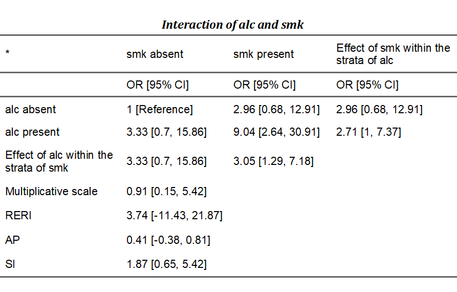
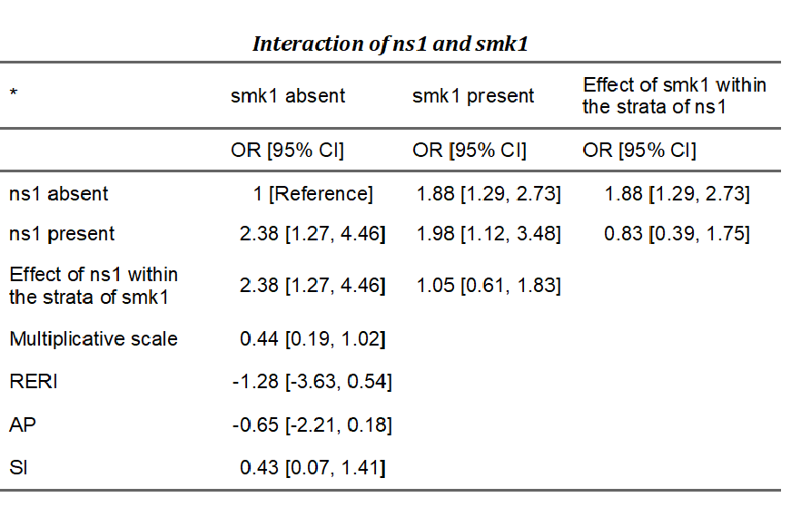

```{r echo = FALSE}
setwd("C:/Users/danfe/Dropbox/Proyectos Daniel/Cursos - diplomados - Maestrias/Programa de autoformación en investigación y análisis de datos/Rmarkdowns/Estadística/Programa de formación/Semana11")

knitr::opts_chunk$set(echo = TRUE, warning = FALSE, message = FALSE,
                         fig.show = "asis", results = "show",
                      fig.align='center',
                      fig.path = "figures/",  # Configura el directorio donde se guardan los gráficos
  dev = "png")
```

\newpage

# ¿Qué es la moderación?

El análisis de moderación también permite comprobar la influencia de una tercera variable, Z, en la relación entre las variables X e Y. En lugar de comprobar un vínculo causal entre estas otras variables, la moderación comprueba cuándo o en qué condiciones se produce un efecto. Los moderadores pueden reforzar, debilitar o invertir la naturaleza de una relación. Por ejemplo, la autoeficacia académica (confianza en la propia capacidad para rendir bien en la escuela) modera la relación entre la importancia de la tarea y la cantidad de ansiedad ante los exámenes que siente un estudiante (Nie, Lau y Liau, 2011). En concreto, los estudiantes con alta autoeficacia experimentan menos ansiedad en los exámenes importantes que los estudiantes con baja autoeficacia, mientras que todos los estudiantes sienten una ansiedad relativamente baja en los exámenes menos importantes. La autoeficacia se considera un moderador en este caso porque interactúa con la importancia de la tarea, creando un efecto diferente sobre la ansiedad ante los exámenes en diferentes niveles de importancia de la tarea.    

En general (y, por tanto, en R), la moderación puede comprobarse mediante la interacción de las variables de interés (moderador con IV) y el trazado de las pendientes simples de la interacción, si está presente. Varios paquetes también incluyen funciones para probar la moderación, pero como los enfoques estadísticos subyacentes son los mismos, aquí sólo se trata en detalle el enfoque "a mano".  


# Análisis de Moderacion

La moderación prueba si una variable (Z) afecta la dirección y/o fuerza de la relación entre un IV (X) y un DV (Y). En otras palabras, pruebas de moderación para interacciones que afectan CUÁNDO ocurren las relaciones entre variables. Los moderadores son conceptualmente diferentes de los mediadores (cuándo versus cómo/por qué), pero algunas variables pueden ser un moderador o un mediador dependiendo de su pregunta. Consulte la documentación del paquete de mediación para conocer formas de probar relaciones de moderación mediada/mediación moderada más complicadas.

Al igual que la mediación, la moderación supone que hay poco o ningún error de medición en la variable moderadora y que el DV no CAUSÓ al moderador. Si es probable que el error del moderador sea alto, los investigadores deben recopilar múltiples indicadores del constructo y utilizar SEM para estimar las variables latentes. Las formas más seguras de asegurarse de que su moderador no sea causado por su DV son manipular experimentalmente la variable o recopilar la medición de su moderador antes de introducir su IV


## Ejemplo de datos de moderación con variables numéricas

Establezca un directorio de trabajo apropiado y genere el siguiente conjunto de datos. 

En este ejemplo diremos que estamos interesados en saber si la relación entre el número de horas de sueño (X) que recibe un estudiante de postgrado y la atención que presta a esta tutoría (Y) está influida por su consumo de café (Z). Aquí creamos el efecto de moderación haciendo que nuestro VD (Y) sea el producto de los niveles del IV (X) y nuestro moderador (Z). 


```{r, message=FALSE}
#setwd("location") #Working directory
set.seed(123)#Standardizes the numbers generated by rnorm; see Chapter 5
N  <- 100 #Number of participants; graduate students
X  <- abs(rnorm(N, 6, 4)) #IV; Hours of sleep
X1 <- abs(rnorm(N, 60, 30)) #Adding some systematic variance for our DV
Z  <- rnorm(N, 30, 8) #Moderator; Ounces of coffee consumed
Y  <- abs((-0.8*X) * (0.2*Z) - 0.5*X - 0.4*X1 + 10 + rnorm(N, 0, 3)) #DV; Attention Paid
Moddata <- data.frame(X, X1, Z, Y)

head(Moddata, 10)

summary(Moddata)
```

# Análisis de moderación con variables numéricas

La moderación puede comprobarse buscando interacciones significativas entre la variable moderadora (Z) y la IV (X). En particular, es importante centrar la media tanto del moderador como del IV para reducir la multicolinealidad y facilitar la interpretación. El centrado puede realizarse utilizando la función *scale*, que resta la media de una variable de cada valor de esa variable. Para obtener más información sobre el uso del centrado, consulte ?scale  

También pueden utilizarse varios paquetes en R para realizar y trazar análisis de moderación, incluyendo la función *moderate.lm* del paquete *QuantPsyc* y el paquete *pequod*. Sin embargo, es sencillo hacer esto "a mano" usando la regresión múltiple tradicional, como se muestra aquí, y el análisis subyacente (interactuando el moderador y el IV) en estos paquetes es idéntico a este enfoque. El paquete *rockchalk* y *interactionR* utilizados aquí son dos de los muchos paquetes de gráficos y trazados disponibles en R y se eligieron porque estaba especialmente diseñado para su uso con análisis de regresión 

## Análisis con rockchalk

```{r, message=FALSE}

#Centering Data
Xc    <- c(scale(X, center=TRUE, scale=FALSE)) #Centering IV; hours of sleep
Zc    <- c(scale(Z,  center=TRUE, scale=FALSE)) #Centering moderator; coffee consumption

#Moderation "By Hand"
library(gvlma)
fitMod <- lm(Y ~ Xc + Zc + Xc*Zc) #Model interacts IV & moderator
summary(fitMod)
coef(summary(fitMod))
gvlma(fitMod) #data is positively skewed; could log transform (see Chap. 10)

#Data Summary
library(stargazer)
stargazer(fitMod,type="text", title = "Sleep and Coffee on Attention")

#Plotting
library(rockchalk)
ps  <- plotSlopes(fitMod, plotx="Xc", modx="Zc", xlab = "Sleep", ylab = "Attention Paid", modxVals = "std.dev")
```


### Interpretación de los resultados de la moderación

Los resultados se presentan de forma similar a los resultados habituales de regresión múltiple. Dado que tenemos interacciones significativas en este modelo, no es necesario interpretar los efectos principales por separado de nuestro IV o de nuestro moderador.

Nuestro modelo manual muestra una interacción significativa entre las horas dormidas y el consumo de café sobre la atención prestada a este tutorial (b = .23, SE = .04, *p* < .001). Sin embargo, necesitaremos descomprimir esta interacción visualmente para tener una mejor idea de lo que esto significa.

La función *rockchalk* trazará automáticamente las pendientes simples (1 DE por encima y 1 DE por debajo de la media) del efecto moderador. Esta figura muestra que los que bebieron menos café (la línea negra) prestaron más atención cuanto más durmieron la noche anterior, pero prestaron menos atención en general que la media (la línea azul). Los que bebieron más café (la línea verde) prestaron más atención cuando durmieron más también y prestaron más atención que la media. La diferencia en las pendientes de los que bebieron más o menos café muestra que el consumo de café modera la relación entre las horas de sueño y la atención prestada.  


# Análisis de moderación con variables categóricas

## Análisis con interactionR

InteractionR permite a los investigadores producir tablas listas para su publicación que incluyen todas las estimaciones de efectos necesarias para el informe completo de modificación de efectos y análisis de interacciones, tal como recomiendan Knol y Vanderweele (2012) [doi:1093/ije/dyr218]. También estima el intervalo de confianza para el trío de medidas de interacción aditivas utilizando el método delta (Hosmer y Lemeshow (1992), [doi:10.1097/00001648-199209000-00012]), el método de recuperación de la varianza (Zou (2008), [doi:10.1093/aje/kwn104]) o el bootstrapping percentil (Assmann et al. (1996), [doi:10.1097/00001648-199605000-00012]). 

### Instalacion
```{r}
# install.packages("devtools")
devtools::install_github("epi-zen/interactionR")

```

### Especificaciones
* *model*: un modelo de regresión ajustado por el usuario con término de interacción para las dos exposiciones consideradas. Puede ser un objeto de clase glm con un enlace válido para regresión logística o aproximantes de razón de riesgo, clase clogit o clase coxph. También puede incluir el ajuste de los factores de confusión, como suele ser el caso.

* *exposure_names*: Un vector de caracteres de dos variables de exposición binarias con nombre presentes en el modelo ajustado. 

*ci.type*: Una cadena de caracteres ("delta" o "mover") que especifica el método a utilizar para la estimación del IC para las medidas de interacción aditiva. Por defecto es "delta".

* *ci.level*: Magnitud del nivel de IC devuelto.

*em*: TRUE, para la evaluación de la modificación del efecto. FALSE, para la interacción.

*recode: Si TRUE, recodifica las exposiciones -si al menos una de las exposiciones es protectora- de forma que el estrato con el riesgo más bajo se convierte en la nueva categoría de referencia cuando las dos exposiciones se consideran conjuntamente. (Véase Knol et al (2011) [doi: 10.1007/s10654-011-9554-9]).


### Ejemplo: El efecto conjunto del alcohol y el tabaco en el cáncer oral. 

Consideremos los datos de casos y controles de Rothman y Keller (1979) [doi: 10.1016/0021-9681(72)90006-9], que estudiaron el efecto conjunto del alcohol y el tabaco en los cánceres orales. Contiene las dos exposiciones, alcohol ('alc') y tabaquismo ('smk'), y el desenlace, cáncer oral ('oc').


```{r example1}
library(interactionR)
data (OCdata)

summary(OCdata)

## fit the interaction model
model.glm <- glm(oc ~ alc*smk, family = binomial(link = "logit"), data = OCdata)
```

A continuación, pase el modelo ajustado a la función que genera un objeto de lista de clase "interactionR".

```{r example2}
table_object = interactionR(model.glm, exposure_names = c("alc", "smk"), ci.type = "mover", ci.level = 0.95, em = F, recode = F)
```

Esto devuelve un objeto de lista de la clase interactionR que incluye un marco de datos que contiene todas las estimaciones del efecto que son necesarias para informar completamente sobre la modificación del efecto o la interacción. El usuario puede acceder a este marco de datos y a otros componentes de la lista para su posterior manipulación, si lo desea. Es importante destacar que el objeto de salida está formateado de tal manera que el marco de datos puede ser procesado por la función de tabulación `interactionR_table()`. Un ejemplo es el siguiente:

```{r example3, eval =FALSE}
interactionR_table(table_object, p.value = T)
```

```{r, echo=FALSE}

```


La función de tabulación generará y guardará una tabla lista para su publicación como un documento de Word en el directorio de trabajo del usuario, si así lo desea. Si el argumento 'ci.type' en la llamada `interactionR()` se hubiera establecido en "delta", los IC para este trío de medidas de interacción serían los indicados por Hosmer y Lemeshow. 

Además de la función principal descrita anteriormente, el paquete también proporciona funciones independientes para cada uno de los métodos de estimación del IC: interactionR_mover(), interactionR_delta() e interactionR_boot(). Esta última implementa el bootstrap percentil de los IC de las medidas de interacción aditivas, tal y como describen Assmann et al, y cuyo uso se muestra en el siguiente ejemplo.


### Ejemplo 2: Efecto de la participación en deportes y el tabaquismo en la hernia discal lumbar.

Para ilustrar la función interactionR_boot(), consideremos los datos de casos y controles del efecto de la participación en deportes y el tabaquismo en la hernia de disco lumbar examinados por Assmann et al. en su análisis. El conjunto de datos está disponible en el paquete como 'HDiscdata' y contiene tres variables binarias: 
i) el resultado. hernia discal lumbar, 'h'; y 
ii & iii) las exposiciones participación deportiva, 'ns', y fumar 'smk'. La función acepta los siguientes argumentos:

* *model*: Un modelo ajustado de clase glm. Requiere que las exposiciones con término de interacción se enumeren primero antes que cualquier otra covariable/confundidor (si procede).

*ci.level*; *em*; *recode*: Como se ha descrito anteriormente para `interactionR()`.

*semilla*: La semilla de números aleatorios que se utilizará para generar las muestras bootstrap (para la reproducibilidad). Por defecto es 12345 pero puede ser cualquier número.

* *s*: Número de remuestreos bootstrap. Por defecto es 1000 

De nuevo, empezamos ajustando un modelo de regresión logística:

```{r example4}
data(HDiscdata)
m2 = glm(h ~ ns*smk, family = binomial(link = 'logit'), data = HDiscdata)
```

A continuación, pasa el objeto a la función `interactionR_boot()` de la siguiente forma:

```{r example5}

table_object2 = interactionR_boot(m2, ci.level = 0.95, em = F, recode = F, seed = 12345, s = 1000)

```

Esto ejecuta una muestra bootstrap no paramétrica 1000 veces con reemplazos y un CI percentil. La función también devuelve un objeto lista de la clase interactionR que contiene todas las estimaciones deseadas y manipulables mediante la función de tabulación - `interactionR_table()` - descrita anteriormente. Llamar a `interactionR_table()` en el objeto devuelto produce una tabla lista para su publicación con estimaciones para el CI de RERI y AP similar a la reportada por Assmann et al. para estos datos. 


```{r example6, eval =FALSE}

interactionR_table(table_object2)

```
```{r, echo=FALSE}

```

Además, el usuario dispone de algunas funciones básicas de R para manipular aún más algunas partes del objeto de salida de interactionR_boot(). Un ejemplo sencillo es

```{r example7}

hist(table_object2$bootstrap)

```

Esto produce histogramas de la distribución de cada uno de los tres parámetros bootstrap (RERI, AP y SI), permitiendo al usuario inspeccionar el rendimiento general y la precisión de las estimaciones devueltas.


# Referencias 

Información sacada de: https://ademos.people.uic.edu/Chapter14.html#


Baron, R., & Kenny, D. (1986). The moderator-mediator variable distinction in social psychological research: Conceptual, strategic, and statistical considerations. Journal of Personality and Social Psychology, 51, 1173-1182.

Cohen, B. H. (2008). Explaining psychological statistics. John Wiley & Sons.

Imai, K., Keele, L., & Tingley, D. (2010). A general approach to causal mediation analysis. Psychological methods, 15(4), 309.

MacKinnon, D. P., Lockwood, C. M., Hoffman, J. M., West, S. G., & Sheets, V. (2002). A comparison of methods to test mediation and other intervening variable effects. Psychological methods, 7(1), 83.

Nie, Y., Lau, S., & Liau, A. K. (2011). Role of academic self-efficacy in moderating the relation between task importance and test anxiety. Learning and Individual Differences, 21(6), 736-741.

Tingley, D., Yamamoto, T., Hirose, K., Keele, L., & Imai, K. (2014). Mediation: R package for causal mediation analysis.
