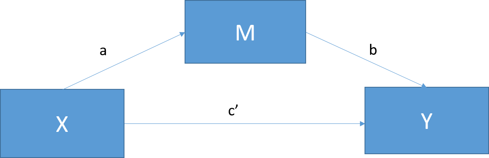

```{r echo = FALSE}
setwd("C:/Users/danfe/Dropbox/Proyectos Daniel/Cursos - diplomados - Maestrias/Programa de autoformación en investigación y análisis de datos/Rmarkdowns/Estadística/Programa de formación/Semana12")

knitr::opts_chunk$set(echo = TRUE, warning = FALSE, message = FALSE,
                         fig.show = "asis", results = "show",
                      fig.align='center',
                      fig.path = "figures/",  # Configura el directorio donde se guardan los gráficos
  dev = "png")
```

# ¿Qué es la medicación?

El análisis de mediación pone a prueba una hipotética cadena causal en la que una variable X afecta a una segunda variable M y, a su vez, esa variable afecta a una tercera variable Y. Los mediadores describen el cómo o el porqué de una relación (normalmente bien establecida) entre otras dos variables y a veces se denominan variables intermedias, ya que suelen describir el proceso a través del cual se produce un efecto. A veces también se denominan efectos indirectos. Por ejemplo, las personas con mayores ingresos tienden a vivir más, pero este efecto se explica por la influencia mediadora de tener acceso a una mejor atención sanitaria.   

En R, este tipo de análisis puede realizarse de dos formas: El método de efectos indirectos en 4 pasos de Baron & Kenny (1986) y el más reciente paquete *mediation* (Tingley, Yamamoto, Hirose, Keele, & Imai, 2014). El método de Baron y Kelly es uno de los métodos originales para probar la mediación, pero tiende a tener una potencia estadística baja. Se trata en este capítulo porque proporciona un enfoque muy claro para establecer relaciones entre variables y los revisores todavía lo solicitan ocasionalmente. Sin embargo, el método del paquete *mediación* es muy recomendable como enfoque más flexible y estadísticamente potente.


## Cómo empezar

Si es necesario, revise el capítulo sobre regresión.
Los supuestos de las pruebas de regresión pueden comprobarse con *gvlma*.
Puede cargar todas las librerías de abajo o cargarlas a medida que avanza. 
Revise la sección de ayuda de cualquier paquete con el que no esté familiarizado *?? nombredelpaquete*. 

```{r, message=FALSE}
library(mediation) #Mediation package
library(rockchalk) #Graphing simple slopes; moderation
library(multilevel) #Sobel Test
library(bda) #Another Sobel Test option
library(gvlma) #Testing Model Assumptions 
library(stargazer) #Handy regression tables

#Useful Help
?lm
?mediation 
?rockchalk
?stargazer

#Optional packages
library(QuantPsyc)
library(pequod)  # devtools::install_github("cran/pequod")
?moderate.lm
?pequod

```


# Análisis de mediación

La mediación prueba si los efectos de X (la variable independiente) sobre Y (la variable dependiente) operan a través de una tercera variable, M (el mediador). De este modo, los mediadores explican la relación causal entre dos variables o "cómo" funciona la relación, por lo que es un método muy popular en la investigación en salud. 

Tanto la mediación como la moderación suponen que hay poco o ningún error de medición en la variable mediadora/moderadora y que la VD **no CAUSÓ** la mediadora/moderadora. Si es probable que el error del mediador sea alto, los investigadores deben recopilar múltiples indicadores del constructo y utilizar SEM para estimar variables latentes. Las formas más seguras de asegurarse de que su mediador no está causado por su VD son manipular experimentalmente la variable o recoger la medida de su mediador antes de introducir su IV. 


Efecto de mediación total
```{r, echo=FALSE}

```
Efecto de mediación parcial
```{r, echo=FALSE}

```

* c = el efecto total de X sobre Y

* c = c' + ab

* c'= el efecto directo de X sobre Y después de controlar por M; c'=c-ab  

* ab= efecto indirecto de X sobre Y

Lo anterior muestra el modelo de mediación estándar. La mediación perfecta se produce cuando el efecto de X sobre Y disminuye a 0 con M en el modelo. La mediación parcial se produce cuando el efecto de X sobre Y disminuye en una cantidad no trivial (la cantidad real es objeto de debate) con M en el modelo.

  
## Ejemplo de datos de mediación 

Establezca un directorio de trabajo apropiado y genere el siguiente conjunto de datos.

En este ejemplo diremos que estamos interesados en saber si el número de horas desde el amanecer (X) afecta las calificaciones subjetivas de vigilia (Y) de 100 estudiantes de posgrado a través del consumo de café (M).

Tenga en cuenta que aquí estamos creando intencionalmente un efecto de mediación (porque las estadísticas siempre son más divertidas si tenemos algo que encontrar) y lo hacemos a continuación creando M para que esté relacionado con X e Y para que esté relacionado con M. Esto crea la cadena causal para que nuestro análisis la analice.

```{r, message=FALSE}
#setwd("user location") #Working directory
set.seed(123) #Standardizes the numbers generated by rnorm; see Chapter 5
N <- 100 #Number of participants; graduate students
X <- rnorm(N, 175, 7) #IV; hours since dawn
M <- 0.7*X + rnorm(N, 0, 5) #Suspected mediator; coffee consumption 
Y <- 0.4*M + rnorm(N, 0, 5) #DV; wakefulness
Meddata <- data.frame(X, M, Y)

```

## Método 1: Baron & Kenny 

Este es el método original de 4 pasos utilizado para describir un efecto de mediación. Los pasos 1 y 2 utilizan la regresión lineal básica, mientras que los pasos 3 y 4 utilizan la regresión múltiple. 

Los pasos:
1. Estimar la relación entre X en Y (horas desde el amanecer en grado de vigilia)
    -La ruta "c" debe ser significativamente diferente de 0; debe tener un efecto total entre el IV y el VD

2. Estimar la relación entre X y M (horas transcurridas desde el amanecer sobre el consumo de café)
    -La ruta "a" debe ser significativamente diferente de 0; el IV y el mediador deben estar relacionados.

3. 3. Estimar la relación entre M y Y controlando por X (consumo de café sobre la vigilia, controlando por las horas desde el amanecer)
    -La ruta "b" debe ser significativamente diferente de 0; mediador y VD deben estar relacionados.
    -El efecto de X sobre Y disminuye con la inclusión de M en el modelo.

4. Estimar la relación entre Y sobre X controlando por M (vigilia sobre horas desde el amanecer, controlando por consumo de café)
    -Debe ser no significativa y cercana a 0.


```{r, message=FALSE}
#1. Total Effect
fit <- lm(Y ~ X, data=Meddata)
summary(fit)

#2. Path A (X on M)
fita <- lm(M ~ X, data=Meddata)
summary(fita)

#3. Path B (M on Y, controlling for X)
fitb <- lm(Y ~ M + X, data=Meddata)
summary(fitb)

#4. Reversed Path C (Y on X, controlling for M)
fitc <- lm(X ~ Y + M, data=Meddata)
summary(fitc)

#Summary Table
stargazer(fit, fita, fitb, fitc, type = "text", title = "Baron and Kenny Method")

```


## Interpretación de los resultados de Barron & Kenny 

Aquí encontramos que nuestro modelo de efecto total muestra una relación positiva significativa entre las horas desde el amanecer (X) y la vigilia (Y). Nuestro modelo Ruta A muestra que las horas desde la caída (X) también están relacionadas positivamente con el consumo de café (M). Nuestro modelo Path B luego muestra que el consumo de café (M) predice positivamente la vigilia (Y) cuando se controla por horas desde el amanecer (X). Finalmente, la vigilia (Y) no predice las horas desde el amanecer (X) cuando se controla el consumo de café (M).

Dado que la relación entre las horas desde el amanecer y la vigilia ya no es significativa cuando se controla el consumo de café, esto sugiere que el consumo de café, de hecho, media esta relación. Sin embargo, este método por sí solo no permite una prueba formal del efecto indirecto, por lo que no sabemos si el cambio en esta relación es realmente significativo.

Hay dos métodos principales para probar formalmente la importancia de la prueba indirecta: la prueba de Sobel y el bootstrapping (cubiertos bajo el método de mediación ).

```{r, message=FALSE}
#Sobel Test
library(multilevel)
?sobel
sobel(Meddata$X, Meddata$M, Meddata$Y)

#or
library(bda)
mediation.test(M,X,Y)
```

La prueba de Sobel utiliza una prueba t especializada para determinar si hay una reducción significativa en el efecto de X sobre Y cuando M está presente. El uso de la función sobel del paquete multinivel le proporcionará tres de los modelos básicos que ejecutamos antes (Mod1 = Efecto total; Mod2 = Ruta B; y Mod3 = Ruta A), así como una estimación del efecto indirecto, el estándar. error de ese efecto y el valor z de ese efecto. Puede usar este valor para calcular su valor p o ejecutar la función mediation.test desde el paquete bda para recibir un valor p para esta estimación.

En este caso, ahora podemos confirmar que la relación entre las horas desde el amanecer y la sensación de vigilia está mediada significativamente por el consumo de café (z' = 3,84, p < 0,001).

Sin embargo, la prueba de Sobel se considera en gran medida un método obsoleto, ya que supone que el efecto indirecto (ab) se distribuye normalmente y tiende a tener el poder adecuado sólo con tamaños de muestra grandes. Por lo tanto, nuevamente, se recomienda encarecidamente utilizar el método de arranque de mediación.

## Método 2: El método *Mediation* Pacakge

Este paquete utiliza el método bootstrapping más reciente de Preacher & Hayes (2004) para abordar las limitaciones de potencia de la Prueba de Sobel. Este método calcula la estimación puntual del efecto indirecto (ab) sobre un gran número de muestras aleatorias (normalmente 1000), por lo que no asume que los datos se distribuyen normalmente y es especialmente más adecuado para tamaños de muestra pequeños que el método de Barron & Kenny.

Para ejecutar la función *media*, necesitaremos de nuevo un modelo de nuestro IV (horas transcurridas desde el amanecer), que prediga nuestro mediador (consumo de café) como nuestro modelo Path A anterior. También necesitaremos un modelo del efecto directo de nuestro IV (horas desde el amanecer) sobre nuestro VD (vigilia), al controlar nuestro mediador (consumo de café). A continuación, podemos utilizar *mediate* para simular repetidamente una comparación entre estos modelos y comprobar la importancia del efecto indirecto del consumo de café. 

```{r, message=FALSE}

#Mediate package
library(mediation)
?mediate
fitM <- lm(M ~ X,     data=Meddata) #IV on M; Hours since dawn predicting coffee consumption
fitY <- lm(Y ~ X + M, data=Meddata) #IV and M on DV; Hours since dawn and coffee predicting wakefulness
gvlma(fitM) #data is positively skewed; could log transform (see assumptions)
gvlma(fitY)
fitMed <- mediate(fitM, fitY, treat="X", mediator="M")
summary(fitMed)
```

```{r}
plot(fitMed)
```


```{r, message=FALSE}
#Bootstrap
fitMedBoot <- mediate(fitM, fitY, boot=TRUE, sims=999, treat="X", mediator="M")
summary(fitMedBoot)
```

```{r}
plot(fitMedBoot)
```


## Interpretación de los resultados de *mediación

La función *mediación* nos da nuestros Efectos de Mediación Causal Promedio (ACME), nuestros Efectos Directos Promedio (ADE), nuestros efectos indirectos y directos combinados (Efecto Total), y el ratio de estas estimaciones (Prop. Mediada). En este caso, el ACME es el efecto indirecto de M (efecto total - efecto directo) y, por tanto, este valor nos indica si nuestro efecto de mediación es significativo. 

En este caso, nuestro modelo **fitMed** muestra de nuevo un efecto significativo del consumo de café en la relación entre las horas transcurridas desde el amanecer y la sensación de vigilia, (ACME = 0,28, *p* < 0,001) sin efecto directo de las horas transcurridas desde el amanecer (ADE = -0,11, *p* = 0,27) y un efecto total significativo (*p* < 0,05). 

A continuación, podemos realizar un bootstrap de esta comparación para verificar este resultado en **fitMedBoot** y volver a encontrar un efecto de mediación significativo (ACME = 0,28; *p* < 0,001) y ningún efecto directo de las horas transcurridas desde el amanecer (ADE = -0,11; *p* = 0,27). Sin embargo, al aumentar la potencia, este análisis ya no muestra un efecto total significativo (*p* = 0,08).


# Referencias

Información sacada de: https://ademos.people.uic.edu/Chapter14.html#

Baron, R., & Kenny, D. (1986). The moderator-mediator variable distinction in social psychological research: Conceptual, strategic, and statistical considerations. Journal of Personality and Social Psychology, 51, 1173-1182.

Cohen, B. H. (2008). Explaining psychological statistics. John Wiley & Sons.

Imai, K., Keele, L., & Tingley, D. (2010). A general approach to causal mediation analysis. Psychological methods, 15(4), 309.

MacKinnon, D. P., Lockwood, C. M., Hoffman, J. M., West, S. G., & Sheets, V. (2002). A comparison of methods to test mediation and other intervening variable effects. Psychological methods, 7(1), 83.

Nie, Y., Lau, S., & Liau, A. K. (2011). Role of academic self-efficacy in moderating the relation between task importance and test anxiety. Learning and Individual Differences, 21(6), 736-741.

Tingley, D., Yamamoto, T., Hirose, K., Keele, L., & Imai, K. (2014). Mediation: R package for causal mediation analysis.

