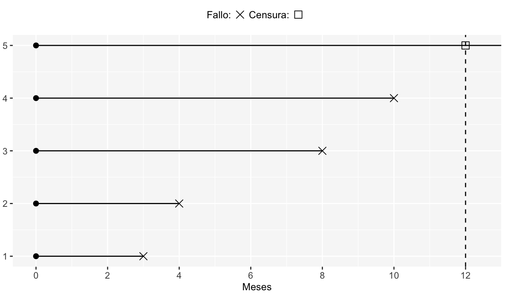
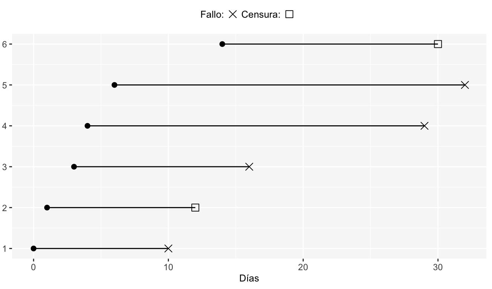

```{r echo = FALSE}
setwd("C:/Users/danfe/Dropbox/Proyectos Daniel/Cursos - diplomados - Maestrias/Programa de autoformación en investigación y análisis de datos/Rmarkdowns/Estadística/Programa de formación/Supervivencia")

knitr::opts_chunk$set(echo = TRUE, warning = FALSE, message = FALSE,
                         fig.show = "asis", results = "show",
                      fig.align='center', out.width = "100%", out.height = "100%",
                      fig.path = "figures/",  # Configura el directorio donde se guardan los gráficos
  dev = "png")
```

# Conceptos básicos 

El análisis de supervivencia corresponde a un conjunto de enfoques estadísticos utilizados para investigar el tiempo que tarda en ocurrir un evento de interés.

El análisis de supervivencia se utiliza en una variedad de campos como:

Estudios de cáncer para análisis del tiempo de supervivencia de los pacientes.
Sociología para el “análisis de la historia de los acontecimientos”,
y en ingeniería para el “análisis del tiempo de falla”.
En los estudios sobre el cáncer, las preguntas de investigación típicas son las siguientes:

¿Cuál es el impacto de determinadas características clínicas en la supervivencia del paciente?
¿Cuál es la probabilidad de que un individuo sobreviva 3 años?
¿Existen diferencias en la supervivencia entre grupos de pacientes?

Comenzamos definiendo los términos fundamentales del análisis de supervivencia, que incluyen:

- Tiempo de supervivencia y evento.

- Censura

- Función de supervivencia y función de peligro.

## Tiempo de supervivencia y tipo de eventos en estudios de cáncer.

Hay diferentes tipos de eventos, incluyendo:


- Recaída

- Progresión

- Muerte

Las dos medidas más importantes en los estudios del cáncer incluyen: i) el tiempo hasta la muerte ; y ii) el tiempo de supervivencia libre de recaída , que corresponde al tiempo entre la respuesta al tratamiento y la recurrencia de la enfermedad. También se conoce como tiempo de supervivencia libre de enfermedad y tiempo de supervivencia libre de eventos 


### Censura 

#### Por la derecha

Como se mencionó anteriormente, el análisis de supervivencia se centra en la duración esperada del tiempo hasta que ocurra un evento de interés (recaída o muerte). Sin embargo, es posible que el evento no sea observado por algunos individuos dentro del período de estudio, lo que produce las llamadas observaciones censuradas .

La censura puede surgir de las siguientes formas:

1. **Censura por la Derecha Tipo I** un paciente no ha experimentado (aún) el evento de interés, como una recaída o muerte, dentro del período de tiempo del estudio;

```{r, echo=FALSE, fig.cap=" "}

```


2. **Censura por la Derecha Tipo II:** Ocurre cuando el estudio continua hasta que se presenta la falla de los primeros  r < n
  individuos. Donde  r es el número de individuos predeterminado a observar y  n es el número total de individuos en el estudio. 

3. **Censura por la Derecha Tipo III:** En general, la censura aleatoria surge cuando los individuos salen del estudio sin presentar la falla por razones no controladas por el investigador. Ejm:

  -  un paciente se pierde del seguimiento durante el período del estudio;

  -  un paciente experimenta un evento diferente que imposibilita un seguimiento posterior.
  
Cuando sucede tal censura, se dice que se tiene una análisis de riesgos competitivos.

Finalmente, si el mecanismo de censura aleatoria es dependiente de los tiempos de falla, se dice que este es una censura informativa, ya que otorga información a los tiempos de falla; en caso contrario es no informativa. 

```{r, echo=FALSE, fig.cap=" "}

```

#### Censura por la Izquierda

Las observaciones censuradas por la izquierda serán aquellas en las que el evento de interés ha tenido lugar antes del punto de inicio del estudio. Así, el tiempo de censura en este caso será el tiempo de inicio del estudio.

Ejemplo

Un ejemplo de este tipo de censura son los tiempos al primer uso de marihuana. El levantamiento de la información se hace sobre alumnos de preparatoria y hay casos en los que el inicio del consumo es a una edad previa al levantamiento de los datos. Entonces aquellos jóvenes cuyo primer uso de marihuana es a una edad previa a la registrada en ese momento, serán consideradas como observaciones censuradas por la izquierda.

Frecuentemente si un estudio tiene censura por la izquierda, entonces se tendrá doble censura, por lo que se denota como  $C_i$  al tiempo antes del cual algunos individuos presentan el evento de interés y $C_d$  al tiempo después del cual algunos de los individuos presentan el evento de interés.

#### Censura por Intervalos

Ocurre cuando los individuos en el estudio son monitoreados intermitentemente en momentos discretos de tiempo, de modo que, es posible que el suceso de estudio haya tenido lugar en un tiempo entre dos de las mediciones.

Si el individuo *i* no ha presentado el evento de interés al fin del tiempo  $I_i$ pero a la siguiente observación $D_i$ sí presentó el evento, entonces es una falla censurada en el intervalo  ($I_i$, $D_i$).

Ejemplo
Un investigador lleva a cabo un estudio en ratas diseñado para evaluar los efectos de dietas ricas en vegetales en el riesgo de cáncer de mama. El tumor mamario es inducido con una única dosis de DMBA al inicio del estudio. 6 semanas después de la administración del DMBA, cada rata es examinada una vez a la semana por 14 semanas y el tiempo en que el tumor es palpable es registrado. Si una rata presenta tumor en la quinta revisión, entonces lo que se sabe es que el tumor en la cuarta revisión no era palpable y por lo tanto este debió presentarse entre la cuarta y quinta revisión dando como resultado que esa observación esta censurada en el intervalo (semana 10, semana 11).


### Funciones de supervivencia y peligro.

Se utilizan dos probabilidades relacionadas para describir los datos de supervivencia: la probabilidad de supervivencia y la probabilidad de peligro .

La probabilidad de supervivencia , también conocida como función de supervivencia. $S( t )$, es la probabilidad de que un individuo sobreviva desde el momento de origen (por ejemplo, diagnóstico de cáncer) hasta un momento futuro específico t.

El peligro , denotado por $h ( t )$, es la probabilidad de que un individuo que está bajo observación en un momento t tenga un evento en ese momento.

Tenga en cuenta que, a diferencia de la función de superviviente, que se centra en no tener un evento, la función de peligro se centra en que el evento ocurra (son complementarias $S( t ) + h ( t ) = 1$).

### Estimación de supervivencia de Kaplan-Meier

El método Kaplan-Meier (KM) es un método no paramétrico utilizado para estimar la probabilidad de supervivencia a partir de los tiempos de supervivencia observados (Kaplan y Meier, 1958).

La probabilidad de supervivencia en el momento ti, $S(ti)$, se calcula de la siguiente manera:

$$S(t_i) = S(t_{i-1})(1-\frac{d_i}{n_i})$$

Donde:

- $S(t_i)$ la probabilidad de estar vivo en $t_i$

- $n_i$ número de pacientes vivos justo antes $t_i$

- $d_i$ el número de eventos en $t_i$

- $t_0 = 0, S(0)=1$ En el tiempo 0 la sobrevida es del 100%

La probabilidad estimada $(S( t ))$ es una función escalonada que cambia de valor solo en el momento de cada evento. También es posible calcular intervalos de confianza para la probabilidad de supervivencia.

La curva de supervivencia de KM, un gráfico de la probabilidad de supervivencia de KM frente al tiempo, proporciona un resumen útil de los datos que se pueden utilizar para estimar medidas como el tiempo medio de supervivencia.


## Análisis de supervivencia en R.

Usaremos dos paquetes R:

- *survival* para análisis de supervivencia informáticos

- *survminer* para resumir y visualizar los resultados del análisis de supervivencia

- *gtsummary* para presentación de tablas

```{r eval = FALSE}
install.packages(c("survival", "survminer"))
```
```{r}
library(survival)
library(survminer)
library(gtsummary)

```

### Conjuntos de datos de ejemplo

Usaremos los datos sobre cáncer de pulmón disponibles en el paquete de *survival*

```{r}
data(lung, package="survival")
```

```{r, echo=FALSE}

DT::datatable(lung, rownames = T, filter="top", options = list(pageLength = 100, scrollY = "200px", scrollX=T), class = 'white-space: nowrap' )

```

- inst: código de institución

- tiempo: tiempo de supervivencia en días

- estado: estado de censura 1=censurado, 2=muerto

- edad: Edad en años

- sexo: Masculino=1 Femenino=2

- ph.ecog: puntuación de rendimiento ECOG (0=bueno 5=muerto)

- ph.karno: puntuación de desempeño de Karnofsky (mala = 0-buena = 100) calificada por el médico

- pat.karno: puntuación de desempeño de Karnofsky según la calificación del paciente

- comida.cal: Calorías consumidas en las comidas

- wt.loss: Pérdida de peso en los últimos seis meses


### Calcular curvas de supervivencia: survfit()

Queremos calcular la probabilidad de supervivencia por sexo.

La función survfit() [en el paquete de supervivencia] se puede utilizar para calcular la estimación de supervivencia de Kaplan-Meier. Entre sus principales argumentos se encuentran:

un objeto de supervivencia creado usando la función Surv () y el conjunto de datos que contiene las variables.

Para calcular las curvas de supervivencia, escriba esto:

```{r}
fit <- survfit(Surv(time, status) ~ sex, data = lung)
print(fit)
```

Por defecto, la función print() muestra un breve resumen de las curvas de supervivencia. Imprime el número de observaciones, el número de eventos, la mediana de supervivencia y los límites de confianza para la mediana.

Si desea mostrar un resumen más completo de las curvas de supervivencia, escriba esto:

```{r}
# Summary of survival curves
summary(fit)
# Access to the sort summary table
summary(fit)$table
```


### Acceso al valor devuelto por survfit()
La función survfit () devuelve una lista de variables, incluidos los siguientes componentes:

- n: número total de sujetos en cada curva.

- tiempo: los puntos de tiempo en la curva.

- n.riesgo: el número de sujetos en riesgo en el momento t

- n.event: el número de eventos que ocurrieron en el momento t.

- n.censor: el número de sujetos censurados que salen del riesgo establecido, sin un evento, en el tiempo t.

- inferior,superior: límites de confianza inferior y superior de la curva, respectivamente.

- estratos: indica estratificación de la estimación de la curva. Si estratos no es NULL, hay varias curvas en el resultado. Los niveles de estratos (un factor) son las etiquetas de las curvas.

Se puede acceder a los componentes de la siguiente manera:

```{r}
d <- data.frame(time = fit$time,
                  n.risk = fit$n.risk,
                  n.event = fit$n.event,
                  n.censor = fit$n.censor,
                  surv = fit$surv,
                  upper = fit$upper,
                  lower = fit$lower
                  )
head(d)
```

### Visualice las curvas de supervivencia

Usaremos la función ggsurvplot () [en el paquete Survminer R] para producir las curvas de supervivencia para los dos grupos de sujetos.

También es posible mostrar:

* los límites de confianza del 95% de la función de supervivencia utilizando el argumento conf.int = TRUE .

* el número y/o el porcentaje de personas en riesgo por tiempo utilizando la opción Risk.table . Los valores permitidos para la tabla de riesgos incluyen:

 - VERDADERO o FALSO especificando si se muestra o no la tabla de riesgos. El valor predeterminado es FALSO.

 - “absoluto” o “porcentaje”: para mostrar el número absoluto y el porcentaje de sujetos en riesgo por tiempo, respectivamente. Utilice "abs_pct" para mostrar tanto el número absoluto como el porcentaje.

* el valor p de la prueba Log-Rank que compara los grupos usando pval = TRUE .

* línea horizontal/vertical en la mediana de supervivencia usando el argumento surv.median.line . Los valores permitidos incluyen uno de c(“none”, “hv”, “h”, “v”). v: vertical, h: horizontal.

```{r out.height="120%"}
# Change color, linetype by strata, risk.table color by strata
ggsurvplot(fit,
          pval = TRUE, conf.int = TRUE,
          risk.table = TRUE, # Add risk table
          risk.table.col = "strata", # Change risk table color by groups
          linetype = "strata", # Change line type by groups
          surv.median.line = "hv", # Specify median survival
          ggtheme = theme_bw(), # Change ggplot2 theme
          palette = c("#E7B800", "#2E9FDF"))
```

La trama se puede personalizar aún más utilizando los siguientes argumentos:

- conf.int.style = “paso” para cambiar el estilo de las bandas del intervalo de confianza.

- xlab para cambiar la etiqueta del eje x.

- break.time.by = 200 romper el eje x en intervalos de tiempo en 200.

- Risk.table = “abs_pct” para mostrar tanto el número absoluto como el porcentaje de personas en riesgo.

- Risk.table.y.text.col = TRUE y Risk.table.y.text = FALSE para proporcionar barras en lugar de nombres en las anotaciones de texto de la leyenda de la tabla de riesgos.

- ncensor.plot = TRUE para trazar el número de sujetos censurados en el momento t. Como sugiere Marcin Kosinski , esta es una buena retroalimentación adicional a las curvas de supervivencia, para que uno pueda darse cuenta: cómo son las curvas de supervivencia, cuál es el número de conjuntos de riesgo Y cuál es la causa de que el conjunto de riesgos se vuelva más pequeño: ¿es así? ¿causado por eventos o por eventos censurados?

- legend.labs para cambiar las etiquetas de leyenda.

```{r fig.width=12, fig.height=8}
ggsurvplot(
   fit,                     # survfit object with calculated statistics.
   pval = TRUE,             # show p-value of log-rank test.
   conf.int = TRUE,         # show confidence intervals for 
                            # point estimaes of survival curves.
   conf.int.style = "step",  # customize style of confidence intervals
   xlab = "Time in days",   # customize X axis label.
   break.time.by = 200,     # break X axis in time intervals by 200.
   ggtheme = theme_light(), # customize plot and risk table with a theme.
   risk.table = "abs_pct",  # absolute number and percentage at risk.
  risk.table.y.text.col = T,# colour risk table text annotations.
  risk.table.y.text = FALSE,# show bars instead of names in text annotations
                            # in legend of risk table.
  ncensor.plot = TRUE,      # plot the number of censored subjects at time t
  surv.median.line = "hv",  # add the median survival pointer.
  legend.labs = 
    c("Male", "Female"),    # change legend labels.
  palette = 
    c("#E7B800", "#2E9FDF") # custom color palettes.
)
```

El diagrama de Kaplan-Meier se puede interpretar de la siguiente manera:


El eje horizontal (eje x) representa el tiempo en días y el eje vertical (eje y) muestra la probabilidad de sobrevivir o la proporción de personas que sobreviven. Las líneas representan curvas de supervivencia de los dos grupos. Una caída vertical en las curvas indica un evento. La marca vertical en las curvas significa que un paciente fue censurado en ese momento.

* En el momento cero, la probabilidad de supervivencia es 1,0 (o el 100% de los participantes están vivos).

* En el momento 250, la probabilidad de supervivencia es aproximadamente 0,55 (o 55%) para el sexo=1 y 0,75 (o 75%) para el sexo=2.

* La mediana de supervivencia es de aproximadamente 270 días para el sexo=1 y 426 días para el sexo=2, lo que sugiere una buena supervivencia para el sexo=2 en comparación con el sexo=1.


Los tiempos medios de supervivencia para cada grupo se pueden obtener utilizando el siguiente código:

```{r}
summary(fit)$table
```

La mediana de los tiempos de supervivencia para cada grupo representa el momento en el que la probabilidad de supervivencia, S(t), es 0,5.

La mediana de supervivencia para el sexo=1 (grupo masculino) es de 270 días, frente a 426 días para el sexo=2 (grupo femenino). Parece haber una ventaja de supervivencia para las mujeres con cáncer de pulmón en comparación con los hombres. Sin embargo, para evaluar si esta diferencia es estadísticamente significativa se requiere una prueba estadística formal, un tema que se analiza en las siguientes secciones.

Tenga en cuenta que los límites de confianza son amplios en la cola de las curvas, lo que dificulta las interpretaciones significativas. Esto puede explicarse por el hecho de que, en la práctica, suele haber pacientes que se pierden durante el seguimiento o están vivos al final del seguimiento. Por lo tanto, puede ser sensato acortar los gráficos antes del final del seguimiento en el eje x (Pocock et al, 2002).

Las curvas de supervivencia se pueden acortar utilizando el argumento xlim de la siguiente manera:

```{r}
ggsurvplot(fit,
          conf.int = TRUE,
          risk.table.col = "strata", # Change risk table color by groups
          ggtheme = theme_bw(), # Change ggplot2 theme
          palette = c("#E7B800", "#2E9FDF"),
          xlim = c(0, 600))
```

enga en cuenta que se pueden especificar tres transformaciones de uso frecuente utilizando el argumento fun :

- “log”: transformación logarítmica de la función de supervivencia,

- “evento”: traza eventos acumulativos (f(y) = 1-y). También se conoce como incidencia acumulada,

- “cumhaz” traza la función de riesgo acumulativo (f(y) = -log(y))

Por ejemplo, para trazar eventos acumulativos, escriba esto:

```{r}
ggsurvplot(fit,
          conf.int = TRUE,
          risk.table.col = "strata", # Change risk table color by groups
          ggtheme = theme_bw(), # Change ggplot2 theme
          palette = c("#E7B800", "#2E9FDF"),
          fun = "event")
```

El peligro acumulativo se utiliza comúnmente para estimar la probabilidad del peligro. Se define como $H(t)=−log(survivalfunction)=−log(S(t))$ El peligro acumulativo $(h( t ))$ puede interpretarse como la fuerza acumulativa de la mortalidad. En otras palabras, corresponde al número de eventos que se esperarían para cada individuo en el tiempo t si el evento fuera un proceso repetible.

Para trazar el riesgo acumulativo, escriba esto:

```{r}
ggsurvplot(fit,
          conf.int = TRUE,
          risk.table.col = "strata", # Change risk table color by groups
          ggtheme = theme_bw(), # Change ggplot2 theme
          palette = c("#E7B800", "#2E9FDF"),
          fun = "cumhaz")
```


### Tabla de vida de Kaplan-Meier: resumen de curvas de supervivencia

Como se mencionó anteriormente, puedes utilizar la función resumen () para tener un resumen completo de las curvas de supervivencia:

```{r eval = FALSE}
summary(fit)
```


También es posible utilizar la función surv_summary () [en el paquete survminer ] para obtener un resumen de las curvas de supervivencia. En comparación con la función resumen() predeterminada, surv_summary() crea un marco de datos que contiene un buen resumen de los resultados de survfit.

```{r}
res.sum <- surv_summary(fit)
head(res.sum)
```
La función surv_summary () devuelve un marco de datos con las siguientes columnas:

- tiempo: los puntos de tiempo en los que la curva tiene un paso.

- n.riesgo: el número de sujetos en riesgo en t.

- n.event: el número de eventos que ocurren en el momento t.

- n.censor: número de eventos censurados.

- surv: estimación de la probabilidad de supervivencia.

- std.err: error estándar de supervivencia.

- superior: extremo superior del intervalo de confianza

- inferior: extremo inferior del intervalo de confianza

- estratos: indica estratificación de la estimación de la curva. Los niveles de estratos (un factor) son las etiquetas de las curvas.

En una situación en la que las curvas de supervivencia se han equipado con una o más variables, el objeto surv_summary contiene columnas adicionales que representan las variables. Esto hace posible facetar la salida de ggsurvplot por estratos o por algunas combinaciones de factores.

El objeto surv_summary también tiene un atributo llamado 'tabla' que contiene información sobre las curvas de supervivencia, incluidas las medianas de supervivencia con intervalos de confianza, así como el número total de sujetos y el número de eventos en cada curva. Para obtener acceso al atributo 'tabla', escriba esto:

```{r}
attr(res.sum, "table")
```


### Prueba de Log-Rank que compara curvas de supervivencia: survdiff()

La prueba de rangos logarítmicos es el método más utilizado para comparar dos o más curvas de supervivencia. La hipótesis nula es que no hay diferencia en la supervivencia entre los dos grupos. La prueba de rango logarítmico es una prueba no paramétrica que no hace suposiciones sobre las distribuciones de supervivencia. Esencialmente, la prueba de rango logarítmico compara el número observado de eventos en cada grupo con lo que se esperaría si la hipótesis nula fuera cierta (es decir, si las curvas de supervivencia fueran idénticas). El estadístico de rango logarítmico se distribuye aproximadamente como un estadístico de prueba de chi-cuadrado.

La función survdiff () [en el paquete de supervivencia ] se puede utilizar para calcular la prueba de rango logarítmico comparando dos o más curvas de supervivencia.

survdiff () se puede utilizar de la siguiente manera:

```{r}
surv_diff <- survdiff(Surv(time, status) ~ sex, data = lung)
surv_diff
```
La función devuelve una lista de componentes, que incluyen:

- n: el número de sujetos en cada grupo.

- obs: el número ponderado observado de eventos en cada grupo.

- exp: el número esperado ponderado de eventos en cada grupo.

- chisq: estadístico chi cuadrado para una prueba de igualdad.

- estratos: opcionalmente, el número de sujetos contenidos en cada estrato.

### Ajustar curvas de supervivencia complejas

En esta sección, calcularemos curvas de supervivencia utilizando la combinación de múltiples factores. A continuación, facetaremos la salida de ggsurvplot() mediante una combinación de factores.


```{r}
require("survival")
```

```{r, echo=FALSE}

DT::datatable(colon, rownames = T,  options = list(pageLength = 100, scrollY = "200px", scrollX=T))

```

Ajustar curvas de supervivencia (complejas) utilizando conjuntos de datos de colon

```{r}
fit2 <- survfit( Surv(time, status) ~ sex + rx + adhere,
                data = colon )
```

Visualice el resultado usando survminer. El siguiente gráfico muestra las curvas de supervivencia según la variable sexo facetadas según los valores de rx y adherente.

```{r}
# Plot survival curves by sex and facet by rx and adhere
ggsurv <- ggsurvplot(fit2, fun = "event", conf.int = TRUE,
                     ggtheme = theme_bw())
   
ggsurv$plot +theme_bw() + 
  theme (legend.position = "right")+
  facet_grid(rx ~ adhere)
```


# Cox Proportional-Hazards Model

El modelo de riesgos proporcionales de Cox (Cox, 1972) es esencialmente un modelo de regresión estadístico comúnmente utilizado en la investigación médica para investigar la asociación entre el tiempo de supervivencia de los pacientes y una o más variables predictivas.

Los métodos mencionados anteriormente (curvas de Kaplan-Meier y pruebas de rangos logarítmicos) son ejemplos de análisis univariado . Describen la supervivencia según un factor bajo investigación, pero ignoran el impacto de cualquier otro.

Además, las curvas de Kaplan-Meier y las pruebas de rangos logarítmicos son útiles sólo cuando la variable predictiva es categórica (p. ej., tratamiento A frente a tratamiento B; hombres frente a mujeres). No funcionan fácilmente con predictores cuantitativos como la expresión genética, el peso o la edad.

Un método alternativo es el análisis de regresión de riesgos proporcionales de Cox, que funciona tanto para variables predictivas cuantitativas como para variables categóricas. Además, el modelo de regresión de Cox amplía los métodos de análisis de supervivencia para evaluar simultáneamente el efecto de varios factores de riesgo sobre el tiempo de supervivencia.

## La necesidad de modelos estadísticos multivariados

En las investigaciones clínicas, hay muchas situaciones en las que varias cantidades conocidas (conocidas como covariables ) afectan potencialmente el pronóstico del paciente.

Por ejemplo, supongamos que se comparan dos grupos de pacientes: aquellos con y sin un genotipo específico. Si uno de los grupos también contiene individuos mayores, cualquier diferencia en la supervivencia puede ser atribuible al genotipo, la edad o incluso ambos. Por lo tanto, cuando se investiga la supervivencia en relación con cualquier factor, a menudo es deseable ajustar el impacto de otros.

El modelo estadístico es una herramienta de uso frecuente que permite analizar la supervivencia respecto de varios factores simultáneamente. Además, el modelo estadístico proporciona el tamaño del efecto de cada factor.

El modelo de riesgos proporcionales de Cox es uno de los métodos más importantes utilizados para modelar datos de análisis de supervivencia. La siguiente sección presenta los conceptos básicos del modelo de regresión de Cox.

## Conceptos básicos del modelo de riesgos proporcionales de Cox

El objetivo del modelo es evaluar simultáneamente el efecto de varios factores sobre la supervivencia. En otras palabras, nos permite examinar cómo factores específicos influyen en la tasa de ocurrencia de un evento particular (por ejemplo, infección, muerte) en un momento particular. Esta tasa se conoce comúnmente como tasa de riesgo. Las variables (o factores) predictivas suelen denominarse covariables en la literatura sobre análisis de supervivencia.

El modelo de Cox se expresa mediante la función de riesgo denotada por h(t). Brevemente, la función de riesgo puede interpretarse como el riesgo de morir en el momento t. Se puede estimar de la siguiente manera:

$$h(t) = h_0(t) \times exp(b_1x_1 + b_2x_2 + ... + b_px_p)$$
dónde,

- t representa el tiempo de supervivencia

- $h(t)$ es la función de riesgo determinada por un conjunto de p covariables $x_1 + x_2 + ... + x_p)$

- los coeficientes $b_1 + b_2 + ... + b_p)$ miden el impacto (es decir, el tamaño del efecto) de las covariables.

- el término $h_0$ se llama peligro de referencia. Corresponde al valor del peligro si todos los $X_i$ son iguales a cero (la cantidad exp(0) es igual a 1). La 't' en h(t) nos recuerda que el peligro puede variar con el tiempo.

El modelo de Cox se puede escribir como una regresión lineal múltiple del logaritmo del riesgo sobre las variables $X_i$, siendo el peligro de referencia un término de "intercepción" que varía con el tiempo.

Las cantidades $Exp (b_i)$ se denominan hazard ratio (HR). un valor de $bi$ mayor que cero, o equivalentemente un índice de riesgo mayor que uno, indica que a medida que el valor de la covariable aumenta, el riesgo del evento aumenta y, por lo tanto, la duración de la supervivencia disminuye.

Dicho de otra manera, un índice de riesgo superior a 1 indica una covariable que está asociada positivamente con la probabilidad del evento y, por lo tanto, asociada negativamente con la duración de la supervivencia.

Tenga en cuenta que en los estudios sobre el cáncer:

- Una covariable con índice de riesgo > 1 (es decir, b > 0) se denomina factor de mal pronóstico.

- Una covariable con índice de riesgo < 1 (es decir, b < 0) se denomina factor de buen pronóstico.

Un supuesto clave del modelo de Cox es que las curvas de riesgo de los grupos de observaciones (o pacientes) deben ser proporcionales y no pueden cruzarse.

Consideremos dos pacientes k y k' que difieren en sus valores x. La función de riesgo correspondiente puede escribirse de la siguiente manera

Función de riesgo para el paciente k:

$h_k(t) = h_0(t)e^{\sum\limits_{i=1}^n{\beta x}}$

Función de riesgo para el paciente k':

$h_{k'}(t) = h_0(t)e^{\sum\limits_{i=1}^n{\beta x'}}$

La hazard ratio para estos dos pacientes es $\frac{h_k(t)}{h_{k'}(t)} = \frac{h_0(t)e^{\sum\limits_{i=1}^n{\beta x}}}{h_0(t)e^{\sum\limits_{i=1}^n{\beta x'}}} = \frac{e^{\sum\limits_{i=1}^n{\beta x}}}{e^{\sum\limits_{i=1}^n{\beta x'}}}$ independiente del tiempo t.

En consecuencia, el modelo de Cox es un modelo de riesgos proporcionales : el riesgo del evento en cualquier grupo es un múltiplo constante del riesgo en cualquier otro. Este supuesto implica que, como se mencionó anteriormente, las curvas de riesgo para los grupos deben ser proporcionales y no pueden cruzarse.

En otras palabras, si un individuo tiene un riesgo de muerte en algún momento inicial que es dos veces mayor que el de otro individuo, entonces en todos los momentos posteriores el riesgo de muerte sigue siendo el doble.


## Calcular el modelo de Cox en R

La función coxph ()[en el paquete de survival ] se puede utilizar para calcular el modelo de regresión de riesgos proporcionales de Cox en R.

**coxph(formula, data, method)**

- Fórmula: es un modelo lineal con un objeto de supervivencia como variable de respuesta. El objeto de supervivencia se crea utilizando la función Surv () de la siguiente manera: Surv(hora, evento) .

- datos: un marco de datos que contiene las variables

- método: se utiliza para especificar cómo manejar los empates El valor predeterminado es 'efron'. Otras opciones son 'breslow' y 'exact'. Generalmente se prefiere el método predeterminado 'efron' al otrora popular método "breslow". El método "exacto" es mucho más intensivo desde el punto de vista computacional.

### Conjuntos de datos de ejemplo

Usaremos los datos del cáncer de pulmón en el paquete survival R.

```{r}
data("lung")

```

```{r, echo=FALSE}

DT::datatable(lung, rownames = T, options = list(pageLength = 100, scrollY = "200px", scrollX=T), class = 'white-space: nowrap' )

```

- inst: código de institución

- tiempo: tiempo de supervivencia en días

- estado: estado de censura 1=censurado, 2=muerto

- edad: Edad en años

- sexo: Masculino=1 Femenino=2

- ph.ecog: puntuación de rendimiento ECOG (0=bueno 5=muerto)

- ph.karno: puntuación de desempeño de Karnofsky (mala = 0-buena = 100) calificada por el médico

- pat.karno: puntuación de desempeño de Karnofsky según la calificación del paciente

- comida.cal: Calorías consumidas en las comidas

- wt.loss: Pérdida de peso en los últimos seis meses


### Calcular el modelo de Cox

Ajustaremos la regresión de Cox utilizando las siguientes covariables: edad, sexo, ph.ecog y wt.loss.

Comenzamos calculando análisis de Cox univariados para todas estas variables; luego ajustaremos análisis de Cox multivariados utilizando dos variables para describir cómo los factores impactan conjuntamente en la supervivencia.

### Regresión de Cox univariada

Los análisis univariados de Cox se pueden calcular de la siguiente manera:

```{r}
res.cox <- coxph(Surv(time, status) ~ sex, data = lung)
res.cox
```

El función summary() para los modelos Cox produce un informe más completo:

```{r}
summary(res.cox)
```
Los resultados de la regresión de Cox se pueden interpretar de la siguiente manera:

1. Significancia estadística . La columna marcada con "z" proporciona el valor del estadístico de Wald. Corresponde a la relación entre cada coeficiente de regresión y su error estándar (z = coef/se(coef)). La estadística de Wald evalúa si la beta (b
) el coeficiente de una variable determinada es estadísticamente significativamente diferente de 0. Del resultado anterior, podemos concluir que la variable sexo tiene coeficientes estadísticamente significativos.

2. Los coeficientes de regresión . La segunda característica a tener en cuenta en los resultados del modelo de Cox es el signo de los coeficientes de regresión (coef). Un signo positivo significa que el peligro (riesgo de muerte) es mayor y, por tanto, el pronóstico peor, para los sujetos con valores más altos de esa variable. La variable sexo se codifica como un vector numérico. 1: macho, 2: hembra. El resumen de R para el modelo de Cox proporciona el índice de riesgo (HR) para el segundo grupo en relación con el primer grupo, es decir, mujeres versus hombres. El coeficiente beta para el sexo = -0,53 indica que las mujeres tienen un menor riesgo de muerte (menores tasas de supervivencia) que los hombres, en estos datos.

3. Razones de riesgo . Los coeficientes exponenciales (exp(coef) = exp(-0,53) = 0,59), también conocidos como índices de riesgo , dan el tamaño del efecto de las covariables. Por ejemplo, ser mujer (sexo=2) reduce el riesgo en un factor de 0,59, o 41%. Ser mujer se asocia con buen pronóstico.

4. Intervalos de confianza de los índices de riesgo . El resultado resumido también proporciona intervalos de confianza superior e inferior del 95 % para el índice de riesgo (exp(coef)), límite inferior del 95 % = 0,4237, límite superior del 95 % = 0,816.

5. Significancia estadística global del modelo . Finalmente, el resultado proporciona valores p para tres pruebas alternativas para la significancia general del modelo: la prueba de razón de verosimilitud, la prueba de Wald y las estadísticas de rango logarítmico de puntuación. Estos tres métodos son asintóticamente equivalentes. Para N lo suficientemente grande, darán resultados similares. Para N pequeño, pueden diferir algo. La prueba de razón de verosimilitud se comporta mejor para tamaños de muestra pequeños, por lo que generalmente se prefiere.

Para aplicar la función coxph univariada a múltiples covariables a la vez, escriba esto:

```{r}
covariates <- c("age", "sex",  "ph.karno", "ph.ecog", "wt.loss")
univ_formulas <- sapply(covariates,
                        function(x) as.formula(paste('Surv(time, status)~', x)))
                        
univ_models <- lapply( univ_formulas, function(x){coxph(x, data = lung)})
# Extract data 
univ_results <- lapply(univ_models,
                       function(x){ 
                          x <- summary(x)
                          p.value<-signif(x$wald["pvalue"], digits=2)
                          wald.test<-signif(x$wald["test"], digits=2)
                          beta<-signif(x$coef[1], digits=2);#coeficient beta
                          HR <-signif(x$coef[2], digits=2);#exp(beta)
                          HR.confint.lower <- signif(x$conf.int[,"lower .95"], 2)
                          HR.confint.upper <- signif(x$conf.int[,"upper .95"],2)
                          HR <- paste0(HR, " (", 
                                       HR.confint.lower, "-", HR.confint.upper, ")")
                          res<-c(beta, HR, wald.test, p.value)
                          names(res)<-c("beta", "HR (95% CI for HR)", "wald.test", 
                                        "p.value")
                          return(res)
                          #return(exp(cbind(coef(x),confint(x))))
                         })
res <- t(as.data.frame(univ_results, check.names = FALSE))
as.data.frame(res)
```
El resultado anterior muestra los coeficientes beta de regresión, los tamaños del efecto (dados como índices de riesgo) y la significación estadística para cada una de las variables en relación con la supervivencia general. Cada factor se evalúa mediante regresiones de Cox univariadas separadas.

Del resultado anterior,

Las variables sexo, edad y ph.ecog tienen coeficientes estadísticamente muy significativos, mientras que el coeficiente de ph.karno no es significativo.

la edad y el ph.ecog tienen coeficientes beta positivos, mientras que el sexo tiene un coeficiente negativo. Por lo tanto, una edad más avanzada y un ph.ecog más alto se asocian con una peor supervivencia, mientras que ser mujer (sexo = 2) se asocia con una mejor supervivencia.


Ahora queremos describir cómo los factores impactan conjuntamente en la supervivencia. Para responder a esta pregunta, realizaremos un análisis de regresión de Cox multivariado. Como la variable ph.karno no es significativa en el análisis univariado de Cox, la omitiremos en el análisis multivariado. Incluiremos los 3 factores (sexo, edad y ph.ecog) en el modelo multivariado.

### Análisis de regresión de Cox multivariado

Una regresión de Cox del tiempo hasta la muerte en las covariables de constante de tiempo se especifica de la siguiente manera:

```{r}
res.cox <- coxph(Surv(time, status) ~ age + sex + ph.ecog, data =  lung)
summary(res.cox)
```
El valor p de las tres pruebas generales (probabilidad, Wald y puntuación) es significativo, lo que indica que el modelo es significativo. Estas pruebas evalúan la hipótesis nula general de que todas las betas (b
) son 0. En el ejemplo anterior, las estadísticas de prueba concuerdan estrechamente y la hipótesis nula general se rechaza rotundamente.

En el análisis multivariado de Cox, las covariables sexo y ph.ecog siguen siendo significativas (p < 0,05). Sin embargo, la covariable edad no logra ser significativa (p = 0,23, que es mayor que 0,05).

El valor p para el sexo es 0,000986, con un índice de riesgo HR = exp(coef) = 0,58, lo que indica una fuerte relación entre el sexo de los pacientes y un menor riesgo de muerte. Los índices de riesgo de las covariables se pueden interpretar como efectos multiplicativos sobre el riesgo. Por ejemplo, manteniendo constantes las otras covariables, ser mujer (sexo = 2) reduce el riesgo en un factor de 0,58, o 42%. Concluimos que ser mujer se asocia con buen pronóstico.

De manera similar, el valor p para ph.ecog es 4,45e-05, con un índice de riesgo HR = 1,59, lo que indica una fuerte relación entre el valor de ph.ecog y un mayor riesgo de muerte. Manteniendo constantes las otras covariables, un valor más alto de ph.ecog se asocia con una supervivencia deficiente.

Por el contrario, el valor p para la edad es ahora p=0,23. El índice de riesgo HR = exp(coef) = 1,01, con un intervalo de confianza del 95% de 0,99 a 1,03. Debido a que el intervalo de confianza para la FC incluye 1, estos resultados indican que la edad contribuye menos a la diferencia en la FC después de ajustar los valores de ph.ecog y el sexo del paciente, y solo tiene una tendencia hacia la significación. Por ejemplo, manteniendo constantes las otras covariables, un año adicional de edad induce un riesgo diario de muerte por un factor de exp(beta) = 1,01, o 1%, lo que no es una contribución significativa.


### Visualización de la distribución estimada de los tiempos de supervivencia.

Habiendo ajustado un modelo de Cox a los datos, es posible visualizar la proporción de supervivencia prevista en cualquier momento dado para un grupo de riesgo particular. La función survfit () estima la proporción de supervivencia, por defecto en los valores medios de las covariables.

```{r}
# Plot the baseline survival function
ggsurvplot(survfit(res.cox), color = "#2E9FDF", data = lung,
           ggtheme = theme_minimal())
```

Quizás deseemos mostrar cómo la supervivencia estimada depende del valor de una covariable de interés.

Tenga en cuenta que queremos evaluar el impacto del sexo en la probabilidad de supervivencia estimada. En este caso, construimos un nuevo marco de datos con dos filas, una para cada valor de sexo; las otras covariables se fijan a sus valores promedio (si son variables continuas) o a su nivel más bajo (si son variables discretas). Para una covariable ficticia, el valor promedio es la proporción codificada 1 en el conjunto de datos. Este marco de datos se pasa a survfit () mediante el argumento newdata :


```{r}
# Create the new data  
sex_df <- with(lung,
               data.frame(sex = c(1, 2), 
                          age = rep(mean(age, na.rm = TRUE), 2),
                          ph.ecog = c(1, 1)
                          )
               )
sex_df
```

```{r}
# Survival curves
fit <- survfit(res.cox, newdata = sex_df)

ggsurvplot(fit, conf.int = TRUE, legend.labs=c("Sex=1", "Sex=2"), data = lung,
           ggtheme = theme_minimal())
```

#  Cox Model Assumptions

El modelo de riesgos proporcionales de Cox parte de varios supuestos. Por tanto, es importante evaluar si un modelo de regresión de Cox ajustado describe adecuadamente los datos.

Aquí, discutiremos tres tipos de diagnósticos para el modelo de Cox:

- Probando el supuesto de riesgos proporcionales.

- Examinar observaciones influyentes (o valores atípicos).

- Detectar no linealidad en la relación entre el riesgo logarítmico y las covariables.

Para comprobar estos supuestos del modelo, se utiliza el método de residuos . Los residuos comunes del modelo de Cox incluyen:

- Residuos de Schoenfeld para comprobar el supuesto de riesgos proporcionales

- Residual de martingale para evaluar la no linealidad

- Residual de desvianza (transformación simétrica de los residuales de Martinguale), para examinar observaciones influyentes

## Diagnóstico para el modelo Cox.

### Prueba del supuesto de peligros proporcionales

El supuesto de riesgos proporcionales (PH) se puede comprobar mediante pruebas estadísticas y diagnósticos gráficos basados en los residuos de Schoenfeld escalados .

En principio, los residuos de Schoenfeld son independientes del tiempo. Un gráfico que muestra un patrón no aleatorio en función del tiempo es evidencia de una violación del supuesto PH.

La función cox.zph () [en el paquete de supervivencia ] proporciona una solución conveniente para probar el supuesto de riesgos proporcionales para cada covariable incluida en un ajuste del modelo de represión de Cox.

Para cada covariable, la función cox.zph () correlaciona el conjunto correspondiente de residuos de Schoenfeld escalados con el tiempo, para probar la independencia entre los residuos y el tiempo. Además, realiza una prueba global para el modelo en su conjunto.

El supuesto de riesgo proporcional está respaldado por una relación no significativa entre los residuos y el tiempo, y refutado por una relación significativa.

Para ilustrar la prueba, comenzamos calculando un modelo de regresión de Cox utilizando el conjunto de datos pulmonares [en el paquete de supervivencia]:

```{r}
library("survival")
res.cox <- coxph(Surv(time, status) ~ age + sex + wt.loss, data =  lung)
res.cox
```
Para probar el supuesto de riesgos proporcionales (PH), escriba esto:

```{r}
test.ph <- cox.zph(res.cox)
test.ph
```

Según el resultado anterior, la prueba no es estadísticamente significativa para cada una de las covariables, y la prueba global tampoco es estadísticamente significativa. Por lo tanto, podemos asumir los riesgos proporcionales.

Es posible hacer un diagnóstico gráfico utilizando la función ggcoxzph () [en el paquete survminer ], que produce, para cada covariable, gráficos de los residuos de Schoenfeld escalados frente al tiempo transformado.

```{r}
ggcoxzph(test.ph)
```

En la figura anterior, la línea continua es un ajuste spline suavizado al gráfico, y las líneas discontinuas representan una banda de error estándar de +/- 2 alrededor del ajuste.

Tenga en cuenta que las desviaciones sistemáticas de una línea horizontal son indicativas de riesgos no proporcionales, ya que los riesgos proporcionales suponen que las estimaciones b1,b2,b3 no varían mucho con el tiempo.

A partir de la inspección gráfica, no existe ningún patrón en el tiempo. El supuesto de riesgos proporcionales parece respaldarse para las covariables sexo (que, recordemos, es un factor de dos niveles, que representa las dos bandas del gráfico), pérdida de peso y edad.

Otro método gráfico para comprobar los riesgos proporcionales es trazar log(-log(S(t))) frente a t o log(t) y buscar paralelismo. Esto sólo se puede hacer para covariables categóricas.

Una violación del supuesto de riesgos proporcionales se puede resolver mediante:

- Agregar interacción covariable*tiempo

- Estratificación

La estratificación es útil para los factores de confusión “molestos”, en los que no interesa estimar el efecto. No se pueden examinar los efectos de la variable de estratificación (John Fox y Sanford Weisberg).

Para leer más sobre cómo adaptarse a los riesgos no proporcionales, lea los siguientes artículos:

- Jadwiga Borucka, PAREXEL, Warsaw, Poland. Extensions of cox model for non-proportional hazards purpose. 2013.

- John Fox & Sanford Weisberg. Cox Proportional-Hazards Regression for Survival Data in R.

- Max Gordon. Dealing with non-proportional hazards in R. March 29, 2016.


### Probando observaciones influyentes

Para probar observaciones influyentes o valores atípicos, podemos visualizar:

los residuos de desviación o los valores dfbeta

La función ggcoxdiagnostics ()[en el paquete survminer ] proporciona una solución conveniente para verificar observaciones influyentes. El formato simplificado es el siguiente:

```{r eval=FALSE}
ggcoxdiagnostics(res.cox, type = , linear.predictions = TRUE)

```

- ajuste: un objeto de clase coxph.object

- tipo: el tipo de residuos a presentar en el eje Y. Los valores permitidos incluyen uno de c(“martingale”, “deviance”, “score”, “schoenfeld”, “dfbeta”, “dfbetas”, “scaledsch”, “partial”).

- predicciones.lineales: un valor lógico que indica si se muestran predicciones lineales para las observaciones (VERDADERO) o simplemente indexadas de observaciones (FALSO) en el eje X.

Al especificar el tipo de argumento = “dfbeta” , se trazan los cambios estimados en los coeficientes de regresión al eliminar cada observación por turno; Asimismo, type=“dfbetas” produce los cambios estimados en los coeficientes divididos por sus errores estándar.

Por ejemplo:

```{r}
ggcoxdiagnostics(res.cox, type = "dfbeta",
                 linear.predictions = FALSE, ggtheme = theme_bw())
```

(Gráficos de índice de dfbeta para la regresión de Cox del tiempo hasta la muerte según la edad, el sexo y la pérdida de peso)

Los gráficos de índice anteriores muestran que comparar las magnitudes de los valores más grandes de dfbeta con los coeficientes de regresión sugiere que ninguna de las observaciones es terriblemente influyente individualmente, aunque algunos de los valores de dfbeta para edad y pérdida de peso son grandes en comparación con los demás.

También es posible comprobar los valores atípicos visualizando los residuos de desviación. El residuo de desviación es una transformación normalizada del residuo de martingala. Estos residuos deben distribuirse aproximadamente simétricamente alrededor de cero con una desviación estándar de 1.

Los valores positivos corresponden a individuos que “murieron demasiado pronto” en comparación con los tiempos de supervivencia esperados.
Los valores negativos corresponden a individuos que “vivieron demasiado”.
Los valores muy grandes o pequeños son valores atípicos que el modelo predice mal.
Ejemplo de residuos de desviación:

```{r}
ggcoxdiagnostics(res.cox, type = "deviance",
                 linear.predictions = FALSE, ggtheme = theme_bw())
```

El patrón parece bastante simétrico alrededor de 0.

### Prueba de no linealidad

A menudo suponemos que las covariables continuas tienen una forma lineal. Sin embargo, esta suposición debe comprobarse.

Trazar los residuos de Martingala frente a covariables continuas es un enfoque común utilizado para detectar no linealidad o, en otras palabras, para evaluar la forma funcional de una covariable. Para una covariable continua determinada, los patrones en el gráfico pueden sugerir que la variable no se ajusta adecuadamente.

La no linealidad no es un problema para las variables categóricas, por lo que solo examinamos gráficos de residuos de martingala y residuos parciales frente a una variable continua.

Los residuos de Martingala pueden presentar cualquier valor en el rango (-INF, +1):

- Un valor de residuos de martinguale cercano a 1 representa individuos que "murieron demasiado pronto",

- y los valores negativos grandes corresponden a individuos que “vivieron demasiado”.

Para evaluar la forma funcional de una variable continua en un modelo de riesgos proporcionales de Cox, usaremos la función ggcoxfunction () [en el paquete survminer R].

La función ggcoxfunction () muestra gráficos de covariables continuas frente a los residuos de martingala del modelo nulo de riesgos proporcionales de Cox. Esto podría ayudar a elegir adecuadamente la forma funcional de la variable continua en el modelo de Cox. Las líneas ajustadas con función lowess deben ser lineales para satisfacer los supuestos del modelo de riesgos proporcionales de Cox.

Por ejemplo, para evaluar la forma funcional de la edad, escriba esto:

```{r}
ggcoxfunctional(Surv(time, status) ~ age + log(age) + sqrt(age), data = lung)

```

Parece que la no linealidad es leve aquí.


# Informe de tablas con gtsummary

```{r}
library(gtsummary)

# Tabla 1
# Deberas añadir los valor p de logranktest para variables independientes categoricas y t-student (por ejmplo) para variables independientes numéricas

lung %>% 
tbl_summary( by= status,
             include = c(age, sex, wt.loss)) %>% 
  add_overall()


# Podemos calcular la mediana de sobrevida para los diferentes grupos

lung$sex2 <- lung$sex %>% factor()
lung$ph.ecog2 <- lung$ph.ecog %>% factor()

tbl_survfit(x = lung,
  y = Surv(time = time, event = status), 
  include = c(sex2, ph.ecog2),
  probs = 0.5,
  label_header = "**Median Survival**")


# Podemos calcular porcentaje de sobrevida en tiempos especificos
list(
    survfit(Surv(time, status) ~ 1, lung),
    survfit(Surv(time, status) ~ sex, lung)
  ) %>%
  tbl_survfit(times = c(250, 750)) %>% 
  add_p() 


# Tabla 2

No_ajustado <- tbl_uvregression(
  data =  lung,
  method=coxph,
  y = Surv(time = time, event =  status),
  exponentiate = TRUE,
  include = c(age, sex, wt.loss),
  pvalue_fun = function(x) style_pvalue(x, digits = 3)
)

No_ajustado

res.cox <- coxph(Surv(time, status) ~ age + sex + wt.loss, data =  lung)

ajustado <- tbl_regression(res.cox, exp=T,
                           pvalue_fun = function(x) style_pvalue(x, digits = 3) )

ajustado

merge <- tbl_merge(
  tbls = list(No_ajustado, ajustado),                          # combina
  tab_spanner = c("**Univariate**", "**Multivariable**")) # establece los nombres de las cabeceras

merge


```

OJO: para la exportación de la tabla a word utiliza:

```{r eval=FALSE}
library(flextable)
library(officer)

# Convertir la tabla gtsummary a flextable
tabla_flextable <- as_flex_table(merge)

# Guardar la tabla en un documento de Word
read_docx() %>%
  body_add_flextable(value = tabla_flextable) %>%
  print(target = "tabla_resumen.docx")
```


# Referencias

Clark TG, Bradburn MJ, Love SB y Altman DG. Análisis de Supervivencia Parte I: Conceptos básicos y primeros análisis. Revista Británica de Cáncer (2003) 89, 232 – 238
Kaplan EL, Meier P (1958) Estimación no paramétrica a partir de observaciones incompletas. J Am Stat Assoc 53: 457–481.
Pocock S, Clayton TC, Altman DG (2002) Gráficas de supervivencia de los resultados del tiempo transcurrido hasta el evento en ensayos clínicos: buenas prácticas y dificultades. Lanceta 359: 1686-1689.


