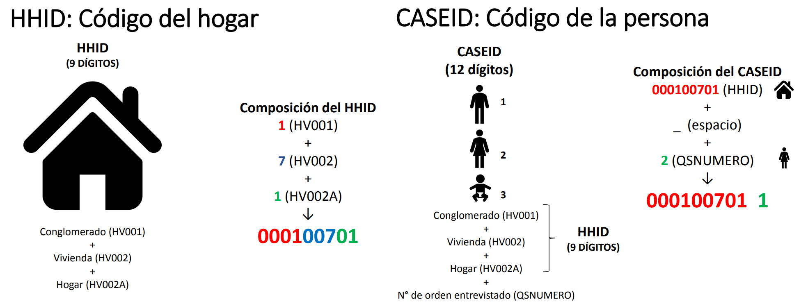
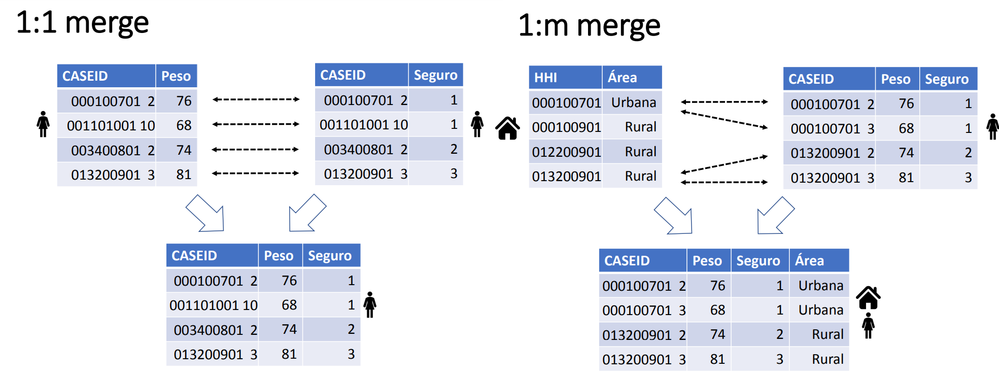

```{r}
#| echo = FALSE

# Cambiar directorio con Control + shift + h

setwd("C:/Users/danfe/Dropbox/Proyectos Daniel/Cursos - diplomados - Maestrias/Programa de autoformación en investigación y análisis de datos/Talleres/Taller 2 ENDES")

knitr::opts_chunk$set(echo = TRUE, warning = FALSE, message = FALSE)
```

## Paso 1: Importación de las bases

```{r}
library(tidyverse)
library(haven)
library(survey)
# devtools::install_github("horaciochacon/ENDES.PE")
library(ENDES.PE)
```

descarga las bases de datos de microdatos de INEI <https://proyectos.inei.gob.pe/microdatos/>

Cargamos las bases de datos de la ENDES 2023 con la función read_sav(), cambiar data por el directorio en el que se encuentre cada base)

```{r eval=FALSE}
Vaso_leche<- read_sav("data/PS_VL_2023.sav")
SALUD     <- read_sav("data/CSALUD01_2023.sav")
MUJER_OBS <- read_sav("data/RE223132_2023.SAV")
MUJER_LAC <- read_sav("data/REC42_2023.SAV")
MUJER_ANT <- read_sav("data/RECH5_2023.SAV")
PERSONA   <- read_sav("data/RECH1_2023.SAV")
VIVIENDA  <- read_sav("data/RECH23_2023.SAV")
HOGAR     <- read_sav("data/RECH0_2023.SAV")
```

Tambien puedes hacer uso de la libreria ENDES.PE

```{r echo=FALSE}
# necesitas actualizar la funcion

consulta_endes <- function(periodo, codigo_modulo, base, guardar = FALSE, ruta = "", codificacion=NULL) {
  # Generamos dos objetos temporales: un archivo y una carpeta 
  temp <- tempfile() ; tempdir <- tempdir()
  
  # Genera una matriz con el número identificador de versiones por cada año
  versiones <- matrix(c(2023, 910, 2022, 786, 2021, 760, 2020, 739, 2019, 691, 
                        2018, 638, 2017,605,2016,548,2015,504,2014,441,
                        2013,407,2012,323,2011,290,2010,260,
                        2009,238,2008,209,2007,194,2006,183,
                        2005,150,2004,120),byrow = T,ncol = 2)
  
  # Extrae el código de la encuesta con la matriz versiones
  codigo_encuesta <- versiones[versiones[,1] == periodo,2]
  ruta_base <- "https://proyectos.inei.gob.pe/iinei/srienaho/descarga/SPSS/" # La ruta de microdatos INEI
  modulo <- paste("-modulo",codigo_modulo,".zip",sep = "")
  url <- paste(ruta_base,codigo_encuesta,modulo,sep = "")
  
  # Descargamos el archivo
  utils::download.file(url,temp)
  
  # Listamos los archivos descargados y seleccionamos la base elegida
  archivos <- utils::unzip(temp,list = T)
  archivos <- archivos[stringr::str_detect(archivos$Name, paste0(base,"\\.")) == TRUE,]
  
  # Elegimos entre guardar los archivos o pasarlos directamente a un objeto
  if(guardar == TRUE) {
    utils::unzip(temp, files = archivos$Name, exdir = paste(getwd(), "/", ruta, sep = ""))
    print(paste("Archivos descargados en: ", getwd(), "/", ruta, sep = ""))
  } 
  else {
    endes <- haven::read_sav(
      utils::unzip(
        temp, 
        files = archivos$Name[grepl(".sav|.SAV",archivos$Name)], 
        exdir = tempdir
        ), 
      encoding = codificacion
      )
    nombres <- toupper(colnames(endes))
    colnames(endes) <- nombres
    endes
  }
}

```

```{r}
# Cargando las base de datos 

año <- 2023

# Household
HOGAR <- consulta_endes(periodo = año, codigo_modulo = 1629, 
                        base = "RECH0_2023",
                        guardar = FALSE, codificacion = "latin1") 

VIVIENDA <- consulta_endes(periodo = año, codigo_modulo = 1630, 
                           base = "RECH23_2023",
                           guardar = FALSE, codificacion = "latin1")


# Subjects
PERSONA <- consulta_endes(periodo = año, codigo_modulo = 1629, 
                          base = "RECH1_2023", 
                          guardar = FALSE, codificacion = "latin1")

SALUD <- consulta_endes(periodo = año, codigo_modulo = 1640, 
                        base = "CSALUD01_2023",
                        guardar = FALSE, codificacion = "latin1")

MUJER_OBS <- consulta_endes(periodo = año, codigo_modulo = 1632, 
                            base = "RE223132_2023", guardar = FALSE,
                            codificacion = "latin1")

MUJER_LAC <- consulta_endes(periodo = año, codigo_modulo = 1634, 
                            base = "REC42_2023",
                            guardar = FALSE, codificacion = "latin1")

MUJER_ANT <- consulta_endes(periodo = año, codigo_modulo = 1638, 
                            base = "RECH5_2023",
                            guardar = FALSE, codificacion = "latin1")


```

## Paso 2: Unión de bases

Visualizaremos los nombres de las primeras variables de cada base

### Llaves para union

HHID para encuestas a nivel de hogar CASEID para encuestas a nivel individual

```{r}


```

```{r}
names(SALUD)[1:10]   #"HHID","QSNUMERO"            # SALUD1
names(PERSONA)[1:10] #"HHID",                       # RECH1
names(VIVIENDA)[1:10]#"HHID"                          # RECH23
names(HOGAR)[1:10]#"HHID"                           # RECH0
names(MUJER_OBS)[1:10]#"CASEID"                      # RE223132
names(MUJER_LAC)[1:10]#"CASEID"                         # REC42
names(MUJER_ANT)[1:10]#"HHID","QSNUMERO"                  # RECH05

```

### Tipos de mergeo

```{r, echo=FALSE}

```

### Mergeo

```{r}
# Unimos base 
base_salud_hogar <- unir_endes(base1 = SALUD, base2 = HOGAR, 
                               tipo_union = "hogar") %>% 
   unir_endes(base2 = VIVIENDA, tipo_union = "hogar") 


base_final <- unir_endes(base1 = base_salud_hogar, base2 = MUJER_ANT, 
                         tipo_union = "individual") %>% 
   unir_endes(base2 = PERSONA, tipo_union = "individual") %>% 
  unir_endes(base2 = MUJER_LAC, tipo_union = "individual") %>% 
   unir_endes(base2 = MUJER_OBS, tipo_union = "individual")


```

**Para guardar en formato dta**

```{r}
#haven::write_dta(base_final, "base_final.dta")
```

## Limpieza de datos

Limpieza de base de datos

Filtramos aquellas personas que concluyeron la encuesta

```{r}
nrow(base_final)

base_final <- base_final %>% 
  filter(QSRESINF == 1)

nrow(base_final)
```

Creamos las variables de interes

```{r}


base <- base_final %>% 
  filter(QSRESINF == 1) %>%   # Filtrar por cuestionario de salud
  mutate(                     
    # Hipertensión
    PAMS = (QS905S + QS903S) / 2,  # PAM sistólica promedio de dos mediciones
    PAMD = (QS905D + QS903D) / 2,  # PAM diastólica promedio de dos mediciones
    HIPERTENSION = case_when(
      PAMS >= 140 | PAMD >= 90 ~ "Sí",
      TRUE ~ "No"), 
    
    HIPERTENSION = as.factor(HIPERTENSION),# Definimos el criterio de HTA con categorías "Sí" y "No"

    # Obesidad QS900 general HA2 en mujeres
    PESO = case_when(
      QS902 == 1 & QS900 >= 1 & QS900 < 999 ~ QS900,
      QS902 == 4 ~ HA2 / 10,
      TRUE ~ NA_real_
    ),
    TALLA = case_when(
      QS902 == 1 & QS901 >= 1 & QS901 < 999 ~ QS901,
      QS902 == 4 ~ HA3 / 10,
      TRUE ~ NA_real_
    ),
    # medición de la entrevistada (mujer)
    ha13tmp = case_when(
      HA13 == 0 ~ 1,
      HA13 == 3 ~ 2,
      HA13 == 4 ~ 3,
      HA13 == 6 ~ 6
    ),
    # medición antropométrica (general)
    RQS902 = ifelse(QS902 == 4, ha13tmp, QS902),
    
    #IMC
    IMC = PESO / (TALLA^2) * 10000,
    OBESIDAD = case_when(
      IMC >= 30 ~ "Obesidad",
      IMC >= 25 & IMC < 30 ~ "Sobrepeso",
      IMC < 25 ~ "Peso normal o bajo"
    ),
    OBESIDAD = factor(OBESIDAD, levels=c("Peso normal o bajo","Sobrepeso", "Obesidad")),

    # Otras variables categóricas
    #Sexo
    SEXO = as_factor(HV104),
    
    #Area de residencia
    AREA_RESIDENCIA = as_factor(HV025),
    
    # Quintil de riqueza
    QUINTIL_BIENESTAR = as_factor(HV270),
    
    #Region natural
    REGION_NATURAL = as_factor(SHREGION),

    # Diseño de encuesta
    CONGLOMERADO = HV001,
    HHID = as.numeric(HHID),
    ESTRATO = HV022,
    PONDERACION = PESO15_AMAS / 1000000
  ) %>% 
  # Filtramos aquellas que no estan embarazadas y aquellos con entrevista y medicion antropometrica
  filter(V213 != 1 | is.na(V213), RQS902 == 1)


# Calculamos la variable dieta

# Fruta
base <- base %>%
  mutate(fruta_dxs = ifelse(QS213U == 1, QS213C, NA), fruta_uxd = QS214C,
         fruta_semana = fruta_dxs * fruta_uxd)

# Jugo de Fruta
base <- base %>%
  mutate(jugof_dxs = ifelse(QS215U == 1, QS215C, NA), jugof_vxd = QS216C,
         jugof_semana = jugof_dxs * jugof_vxd * 2)

# Ensalada de Fruta
base <- base %>%
  mutate(ensaladaf_dxs = ifelse(QS217U == 1, QS217C, NA), ensaladaf_pxd = QS218C,
         ensaladaf_semana = ensaladaf_dxs * ensaladaf_pxd * 2)

# Ensalada de Verdura
base <- base %>%
  mutate(ensaladav_dxs = ifelse(QS219U == 1, QS219C, NA), ensaladav_u = QS220U,
         ensaladav_uxd = coalesce(as.numeric(QS220CV), as.numeric(QS220CC)),
         ensaladav_porcion = ifelse(ensaladav_u == 2, ensaladav_uxd / 4,
                                    ifelse(ensaladav_u == 1, ensaladav_uxd, NA)),
         ensaladav_semana = ensaladav_dxs * ensaladav_porcion)

# Porciones de alimentos sanos
base <- base %>% 
  mutate(frutaensalada_pxs = rowSums(cbind(ensaladav_semana,ensaladaf_semana,
                                           jugof_semana, fruta_semana), 
                                     na.rm = TRUE)) %>% 
  mutate(DIETA = ifelse(frutaensalada_pxs == 0, NA, 
                        as.numeric(frutaensalada_pxs >= 31.5)),
         DIETA = factor(DIETA, labels = c("Consumo inadecuado", "Conssumo adecuado")))


# Generamos la base de datos final solo con las variables necesarias

ENDES <- dplyr::select(base, #HHID, QSNUMERO, 
                CONGLOMERADO = HV001, 
                ESTRATO = HV022, 
                PONDERACION = PONDERACION,
                SEXO = HV104, 
                AREA_RESIDENCIA = HV025, 
                QUINTIL_BIENESTAR = HV270, 
                REGION_NATURAL = SHREGION,
                HIPERTENSION, PESO, TALLA, IMC, OBESIDAD,DIETA)  

# trasformamos las variables de tipo caracter a tipo factor 
ENDES$SEXO<-ENDES$SEXO %>% as_factor()
ENDES$AREA_RESIDENCIA<-ENDES$AREA_RESIDENCIA %>% as_factor()
ENDES$QUINTIL_BIENESTAR<-ENDES$QUINTIL_BIENESTAR %>% as_factor()
ENDES$REGION_NATURAL<-ENDES$REGION_NATURAL %>% as_factor()

```

## Formato de tablas

```{r}
#| label: Tabla1


library(gtsummary)

# tema para redondear porcentajes a un decimal
set_gtsummary_theme(list(
  `tbl_summary-fn:percent_fun` = function(x) sprintf("%.1f", x * 100)
))

theme_gtsummary_compact() 

# formato de digitos
library(magrittr)

style_percent_1digits <- purrr::partial(gtsummary::style_percent, digits = 1)
style_number_2digits <- purrr::partial(gtsummary::style_number, digits = 2)


```

**Eliminamos missings de variables incluidas**

```{r}
nrow(ENDES) 

ENDES %>% summarise(across(everything(), ~ sum(is.na(.))))

ENDES <- na.omit(ENDES)

nrow(ENDES) # 1,148 observations deleted

```

## setear base según diseño muestral

```{r}
library(survey) 

diseño <- svydesign(id =~ CONGLOMERADO, strata =~ ESTRATO, 
                    weights=~ PONDERACION, data=ENDES)  

options(survey.lonely.psu = "certainty")

```

### Tabla 1

**a) datos no ponderados**

```{r}

# visualiza los datos no ponderados
tbl_summary(ENDES[,-c(1:3)],missing = "no",
              statistic= list (all_categorical() ~ "{n}",
                              all_continuous() ~ "{mean} ± {sd}"),
                 digits = all_continuous() ~ 1)

```

**b) datos ponderados**

```{r}

# Datos ponderados

diseño %>%                   
  tbl_svysummary(include = c(SEXO, 
                            AREA_RESIDENCIA, 
                            QUINTIL_BIENESTAR, 
                            REGION_NATURAL,
                            HIPERTENSION, 
                            PESO, TALLA, 
                            IMC, OBESIDAD, DIETA),
                 statistic= list (all_categorical() ~ "{p}",
                              all_continuous() ~ "{mean} ± {sd}"),
                 digits = all_continuous() ~ 2) %>%
   add_ci(style_fun = list(all_categorical() ~ style_percent_1digits,
                            all_continuous() ~ style_number_2digits),
           statistic=all_categorical() ~ "{conf.low} - {conf.high}")

```

## Tabla 2 - bivariado

**a) datos no ponderados**

```{r}
# visualiza los datos no ponderados
tbl_summary(ENDES[,-c(1:3)], by = HIPERTENSION,
            statistic= list (all_categorical() ~ "{n}",
                              all_continuous() ~ "{mean} ± {sd}"),
                 digits = all_continuous() ~ 2)

# Datos ponderados
```

**b) datos ponderados**

```{r}
diseño %>%                   
  tbl_svysummary(include = c(SEXO, 
                            AREA_RESIDENCIA, 
                            QUINTIL_BIENESTAR, 
                            REGION_NATURAL,
                            HIPERTENSION, 
                            PESO, TALLA, 
                            IMC, OBESIDAD, DIETA),
                 by = HIPERTENSION,
                 percent = "row",
                 statistic= list (all_categorical() ~ "{p}",
                              all_continuous() ~ "{mean} ± {sd}"),
                 digits = all_continuous() ~ 2) %>%
   add_ci(style_fun = list(all_categorical() ~ style_percent_1digits,
                            all_continuous() ~ style_number_2digits),
           statistic=all_categorical() ~ "{conf.low} - {conf.high}") %>%  
    add_p(pvalue_fun = ~ style_pvalue(.x, digits = 3))

```

## Tabla 3 - Regressiones

```{r}

# convertimos outcome en 0 y 1

ENDES$HIPERTENSION <- ENDES$HIPERTENSION %>% as.numeric() - 1

diseño <- svydesign(id =~ CONGLOMERADO, strata =~ ESTRATO, 
                    weights=~ PONDERACION, data=ENDES) 

# Regression bivariada

bivariado <- diseño %>%                   
  tbl_uvregression(
      method = survey::svyglm,
      y = HIPERTENSION,
      method.args = list(family = quasipoisson(link="log")),
      include = c(SEXO, 
                            AREA_RESIDENCIA, 
                            QUINTIL_BIENESTAR, 
                            REGION_NATURAL,
                            HIPERTENSION, 
                            PESO, TALLA, 
                            IMC, OBESIDAD, DIETA),
      exponentiate = TRUE,    
      pvalue_fun = ~style_pvalue(.x, digits = 3))


# Regression multivariable
  
regresion_multi <- survey::svyglm(HIPERTENSION ~ SEXO + AREA_RESIDENCIA + 
                                      QUINTIL_BIENESTAR + REGION_NATURAL + 
                                      OBESIDAD + DIETA, 
                                    family = quasipoisson(link="log"), design = diseño)

multivariable <-   tbl_regression(regresion_multi,
      exponentiate = TRUE,    
      pvalue_fun = ~style_pvalue(.x, digits = 3)) 


## combinar con resultados univariantes 
tbl_merge(
  tbls = list(bivariado, multivariable),                          # combina
  tab_spanner = c("**Univariate**", "**Multivariable**")) # establece los nombres de las cabeceras


```

## Evaluar supuestos

```{r}
library(performance)
check_collinearity(regresion_multi)
check_overdispersion(regresion_multi)

model_performance(regresion_multi)
test_likelihoodratio(regresion_multi)
```
