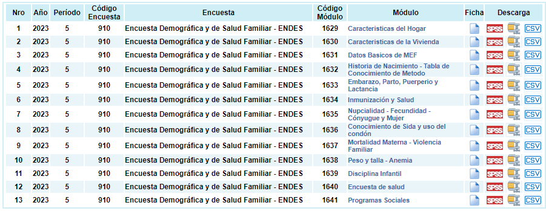
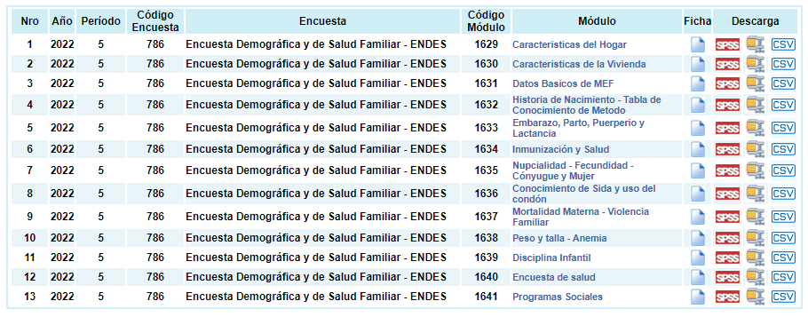
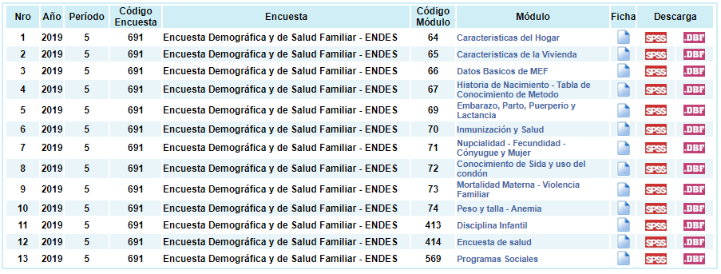

```{r}
#| echo = FALSE

# Cambiar directorio con Control + shift + h

setwd("C:/Users/danfe/Dropbox/Proyectos Daniel/Cursos - diplomados - Maestrias/Programa de autoformación en investigación y análisis de datos/Talleres/Taller 2 ENDES")

knitr::opts_chunk$set(echo = TRUE, warning = FALSE, message = FALSE)
```

## Paso 1: Importación de las bases

```{r}
library(tidyverse)
library(haven)
library(survey)
# devtools::install_github("horaciochacon/ENDES.PE")
library(ENDES.PE)
```

descarga las bases de datos de microdatos de INEI <https://proyectos.inei.gob.pe/microdatos/>

Cargamos las bases de datos de la ENDES 2023 con la función read_sav(), cambiar data por el directorio en el que se encuentre cada base)

```{r eval=FALSE}
SALUD     <- read_sav("data/CSALUD01_2023.sav")
PERSONA   <- read_sav("data/RECH1_2023.SAV")
VIVIENDA  <- read_sav("data/RECH23_2023.SAV")
HOGAR     <- read_sav("data/RECH0_2023.SAV")
RECH6 <- read_sav("data/RECH6_2023.SAV")
CSALUD08 <- read_sav("data/CSALUD08_2023.sav") 
REC0111 <- read_sav("data/REC0111_2023.sav")
REC21<- read_sav("data/REC21_2023.sav")

```

```{r echo=F}
# necesitas actualizar la funcion

consulta_endes <- function(periodo, codigo_modulo, base, guardar = FALSE, ruta = "", codificacion=NULL) {
  # Generamos dos objetos temporales: un archivo y una carpeta 
  temp <- tempfile() ; tempdir <- tempdir()
  
  # Genera una matriz con el número identificador de versiones por cada año
  versiones <- matrix(c(2023, 910, 2022, 786, 2021, 760, 2020, 739, 2019, 691, 
                        2018, 638, 2017,605,2016,548,2015,504,2014,441,
                        2013,407,2012,323,2011,290,2010,260,
                        2009,238,2008,209,2007,194,2006,183,
                        2005,150,2004,120),byrow = T,ncol = 2)
  
  # Extrae el código de la encuesta con la matriz versiones
  codigo_encuesta <- versiones[versiones[,1] == periodo,2]
  ruta_base <- "https://proyectos.inei.gob.pe/iinei/srienaho/descarga/SPSS/" # La ruta de microdatos INEI
  modulo <- paste("-modulo",codigo_modulo,".zip",sep = "")
  url <- paste(ruta_base,codigo_encuesta,modulo,sep = "")
  
  # Descargamos el archivo
  utils::download.file(url,temp)
  
  # Listamos los archivos descargados y seleccionamos la base elegida
  archivos <- utils::unzip(temp,list = T)
  archivos <- archivos[stringr::str_detect(archivos$Name, paste0(base,"\\.")) == TRUE,]
  
  # Elegimos entre guardar los archivos o pasarlos directamente a un objeto
  if(guardar == TRUE) {
    utils::unzip(temp, files = archivos$Name, exdir = paste(getwd(), "/", ruta, sep = ""))
    print(paste("Archivos descargados en: ", getwd(), "/", ruta, sep = ""))
  } 
  else {
    endes <- haven::read_sav(
      utils::unzip(
        temp, 
        files = archivos$Name[grepl(".sav|.SAV",archivos$Name)], 
        exdir = tempdir
        ), 
      encoding = codificacion
      )
    nombres <- toupper(colnames(endes))
    colnames(endes) <- nombres
    endes
  }
}
```

### Año 2023



```{r}
# Cargando las base de datos 

año <- 2023

# Household
HOGAR <- consulta_endes(periodo = año, codigo_modulo = 1629, 
                        base = "RECH0_2023",
                        guardar = FALSE, codificacion = "latin1") 

VIVIENDA <- consulta_endes(periodo = año, codigo_modulo = 1630, 
                           base = "RECH23_2023",
                           guardar = FALSE, codificacion = "latin1")


# Subjects
PERSONA <- consulta_endes(periodo = año, codigo_modulo = 1629, 
                          base = "RECH1_2023", 
                          guardar = FALSE, codificacion = "latin1")

SALUD <- consulta_endes(periodo = año, codigo_modulo = 1640, 
                        base = "CSALUD01_2023",
                        guardar = FALSE, codificacion = "latin1")

REC0111 <- consulta_endes(periodo = año, codigo_modulo = 1631, 
                            base = "REC0111_2023", guardar = FALSE,
                            codificacion = "latin1")

REC21 <- consulta_endes(periodo = año, codigo_modulo = 1632, 
                            base = "REC21_2023",
                            guardar = FALSE, codificacion = "latin1")

CSALUD08<- consulta_endes(periodo = año, codigo_modulo = 1640, 
                            base = "CSALUD08_2023",
                            guardar = FALSE, codificacion = "latin1")


RECH6<- consulta_endes(periodo = año, codigo_modulo = 1638, 
                            base = "RECH6_2023",
                            guardar = FALSE, codificacion = "latin1")


# Unimos base 
CSALUD08$HC0 <- CSALUD08$QS801
REC21$HC0 <- REC21$B16
REC21$HHID <- str_extract(REC21$CASEID, "\\d{9}")
PERSONA$HC0<- PERSONA$HVIDX

base_1 <- left_join(RECH6, CSALUD08, by = c("HC0", "HHID"))
base_1 <- left_join(base_1, REC21, by = c("HC0", "HHID"))
base_1 <- left_join(base_1, REC0111, by= c("HHID","CASEID"))

base_1 <- left_join(base_1, VIVIENDA, by =c("HHID"))
base_1 <- left_join(base_1, HOGAR, by = c("HHID"))
base_1 <- left_join(base_1, SALUD, by = "HHID")

base_1 <- left_join(base_1, PERSONA, c("HHID", "HC0"))

ENDES_2023 <- base_1
ENDES_2023$año <- 2023

```

### Año 2020 a 2022



```{r}
# Cargando las base de datos 

año <- 2020

# Household
HOGAR <- consulta_endes(periodo = año, codigo_modulo = 1629, 
                        base = "RECH0",
                        guardar = FALSE, codificacion = "latin1") 

VIVIENDA <- consulta_endes(periodo = año, codigo_modulo = 1630, 
                           base = "RECH23",
                           guardar = FALSE, codificacion = "latin1")


# Subjects
PERSONA <- consulta_endes(periodo = año, codigo_modulo = 1629, 
                          base = "RECH1", 
                          guardar = FALSE, codificacion = "latin1")

SALUD <- consulta_endes(periodo = año, codigo_modulo = 1640, 
                        base = "CSALUD01",
                        guardar = FALSE, codificacion = "latin1")

REC0111 <- consulta_endes(periodo = año, codigo_modulo = 1631, 
                            base = "REC0111", guardar = FALSE,
                            codificacion = "latin1")

REC21 <- consulta_endes(periodo = año, codigo_modulo = 1632, 
                            base = "REC21",
                            guardar = FALSE, codificacion = "latin1")

CSALUD08<- consulta_endes(periodo = año, codigo_modulo = 1640, 
                            base = "CSALUD08",
                            guardar = FALSE, codificacion = "latin1")


RECH6<- consulta_endes(periodo = año, codigo_modulo = 1638, 
                            base = "RECH6",
                            guardar = FALSE, codificacion = "latin1")


# Unimos base 
CSALUD08$HC0 <- CSALUD08$QS801
REC21$HC0 <- REC21$B16
REC21$HHID <- str_extract(REC21$CASEID, "\\d{9}")
PERSONA$HC0<- PERSONA$HVIDX

base_1 <- left_join(RECH6, CSALUD08, by = c("HC0", "HHID"))
base_1 <- left_join(base_1, REC21, by = c("HC0", "HHID"))
base_1 <- left_join(base_1, REC0111, by= c("HHID","CASEID"))

base_1 <- left_join(base_1, VIVIENDA, by =c("HHID"))
base_1 <- left_join(base_1, HOGAR, by = c("HHID"))
base_1 <- left_join(base_1, SALUD, by = "HHID")

base_1 <- left_join(base_1, PERSONA, c("HHID", "HC0"))

base_1$año <- año


#ENDES_2022 <- base_1
#ENDES_2021 <- base_1
#ENDES_2020 <- base_1


```

### Año 2013 a 2019



```{r}
# Cargando las base de datos 

año <- 2013

# Household
HOGAR <- consulta_endes(periodo = año, codigo_modulo = 64, 
                        base = "RECH0",
                        guardar = FALSE, codificacion = "latin1") 

VIVIENDA <- consulta_endes(periodo = año, codigo_modulo = 65, 
                           base = "RECH23",
                           guardar = FALSE, codificacion = "latin1")


# Subjects
PERSONA <- consulta_endes(periodo = año, codigo_modulo = 64, 
                          base = "RECH1", 
                          guardar = FALSE, codificacion = "latin1")

SALUD <- consulta_endes(periodo = año, codigo_modulo = 414, 
                        base = "CSALUD01",
                        guardar = FALSE, codificacion = "latin1")

REC0111 <- consulta_endes(periodo = año, codigo_modulo = 66, 
                            base = "REC0111", guardar = FALSE,
                            codificacion = "latin1")

REC21 <- consulta_endes(periodo = año, codigo_modulo = 67, 
                            base = "REC21",
                            guardar = FALSE, codificacion = "latin1")

CSALUD08<- consulta_endes(periodo = año, codigo_modulo = 414, 
                            base = "CSALUD08",
                            guardar = FALSE, codificacion = "latin1")


RECH6<- consulta_endes(periodo = año, codigo_modulo = 74, 
                            base = "RECH6",
                            guardar = FALSE, codificacion = "latin1")


# Unimos base 
CSALUD08$HC0 <- CSALUD08$QS801
REC21$HC0 <- REC21$B16
REC21$HHID <- str_extract(REC21$CASEID, "\\d{9}")
PERSONA$HC0<- PERSONA$HVIDX

library(glue)

# 2016
#CSALUD08$HHID <- str_glue("{str_pad(CSALUD08$QHCLUSTER, 4, pad = '0')}{str_pad(CSALUD08$QHNUMBER, 3, pad = '0')}{str_pad(CSALUD08$QHHOME, 2, pad = '0')}")

# 2013 
#CSALUD08$HHID <- str_glue("{str_pad(CSALUD08$QSCLUSTER, 4, pad = '0')}{str_pad(CSALUD08$QSNUMBER, 3, pad = '0')}{str_pad(CSALUD08$QSHOME, 2, pad = '0')}")


base_1 <- left_join(RECH6, CSALUD08, by = c("HC0", "HHID"))
base_1 <- left_join(base_1, REC21, by = c("HC0", "HHID"))
base_1 <- left_join(base_1, REC0111, by= c("HHID","CASEID")) # 2017 a 2019

base_1 <- left_join(base_1, VIVIENDA, by =c("HHID"))
base_1 <- left_join(base_1, HOGAR, by = c("HHID"))
base_1 <- left_join(base_1, SALUD, by = "HHID")

base_1 <- left_join(base_1, PERSONA, c("HHID", "HC0"))

base_1$año <- año


#ENDES_2019 <- base_1
#ENDES_2017 <- base_1  
#ENDES_2016 <- base_1 
#ENDES_2015 <- base_1  # No sale
#ENDES_2014 <- base_1  # HV103.x
#ENDES_2013 <- base_1
ENDES_2012 <- base_1

```

### Año 2012


```{r}
# Cargando las base de datos 

año <- 2012

# Household
HOGAR <- consulta_endes(periodo = año, codigo_modulo = 64, 
                        base = "RECH0",
                        guardar = FALSE, codificacion = "latin1") 

VIVIENDA <- consulta_endes(periodo = año, codigo_modulo = 65, 
                           base = "RECH23",
                           guardar = FALSE, codificacion = "latin1")


# Subjects
PERSONA <- consulta_endes(periodo = año, codigo_modulo = 64, 
                          base = "RECH1", 
                          guardar = FALSE, codificacion = "latin1")

REC0111 <- consulta_endes(periodo = año, codigo_modulo = 66, 
                            base = "REC0111", guardar = FALSE,
                            codificacion = "latin1")

REC21 <- consulta_endes(periodo = año, codigo_modulo = 67, 
                            base = "REC21",
                            guardar = FALSE, codificacion = "latin1")

RECH6<- consulta_endes(periodo = año, codigo_modulo = 74, 
                            base = "RECH6",
                            guardar = FALSE, codificacion = "latin1")


# Unimos base 
REC21$HC0 <- REC21$B16
REC21$HHID <- str_extract(REC21$CASEID, "\\d{9}")
REC0111$HHID <- str_extract(REC0111$CASEID, "\\d{9}")
PERSONA$HC0<- PERSONA$HVIDX

library(glue)

# 2016
#CSALUD08$HHID <- str_glue("{str_pad(CSALUD08$QHCLUSTER, 4, pad = '0')}{str_pad(CSALUD08$QHNUMBER, 3, pad = '0')}{str_pad(CSALUD08$QHHOME, 2, pad = '0')}")

# 2013 
#CSALUD08$HHID <- str_glue("{str_pad(CSALUD08$QSCLUSTER, 4, pad = '0')}{str_pad(CSALUD08$QSNUMBER, 3, pad = '0')}{str_pad(CSALUD08$QSHOME, 2, pad = '0')}")


base_1 <- left_join(RECH6,  REC21, by = c("HC0", "HHID"))
base_1 <- left_join(base_1, REC0111, by= c("HHID","CASEID")) # 2017 a 2019

base_1 <- left_join(base_1, VIVIENDA, by =c("HHID"))
base_1 <- left_join(base_1, HOGAR, by = c("HHID"))

base_1 <- left_join(base_1, PERSONA, c("HHID", "HC0"))

base_1$año <- año

#ENDES_2012 <- base_1

```

```{r}
write_rds(ENDES_2018, "union/ENDES_2018.rds")
write_rds(ENDES_2019, "union/ENDES_2019.rds")
write_rds(ENDES_2020, "union/ENDES_2020.rds")
write_rds(ENDES_2021, "union/ENDES_2021.rds")
write_rds(ENDES_2022, "union/ENDES_2022.rds")
write_rds(ENDES_2023, "union/ENDES_2023.rds")
```

# Limpieza y creación de variables

```{r}
base2 <- base_1 %>% filter(HC1>=6 &             # niño > 6meses
                             !is.na(HC55) &    # anemia
                             HC57!= 9 & 
                             HV103==1 )        # durmio la noche anterior # HV103.x 2014
                             
base3 <- base2 %>% 
  
  mutate(
    
    Altitud=HV040,
    Hb_no_corregida= HC53,
    Edad = HC1, 
    hb_corregida_2024 = ifelse(Altitud >=500, 
                               Hb_no_corregida - (0.0056384*Altitud + 0.0000003*Altitud*Altitud),
                               Hb_no_corregida),
    hb_corregida_2024 = hb_corregida_2024/10,
    anemia_corregida_2024 = case_when(hb_corregida_2024 <10.5 & Edad >=6 & Edad <24 ~ "Sí",
                                      hb_corregida_2024 <11 & Edad >=24 & Edad <60 ~ "Sí",
                                      TRUE ~ "No"),
    
    severidad_anemia_corregida_2024 = case_when(
                                  hb_corregida_2024 <7 & Edad >=6 & Edad <24 ~ "Severa",
                                  hb_corregida_2024 <9.5 & hb_corregida_2024 >=7 & 
                                            Edad >=6 & Edad <24 ~ "Moderada",
                                  hb_corregida_2024 <10.5 & hb_corregida_2024 >=9.5 & 
                                            Edad >=6 & Edad <24 ~ "Leve",
                                  
                                  hb_corregida_2024 <7 & Edad >=24 & Edad <60 ~ "Severa", 
                                  hb_corregida_2024 <10 & hb_corregida_2024 >=7 &
                                            Edad >=24 & Edad <60 ~ "Moderada", 
                                  hb_corregida_2024 <11 & hb_corregida_2024 >=10 &
                                            Edad >=24 & Edad <60 ~ "Leve", 
                                  TRUE ~ "No"),
    
    Hb_corregida = HC56,
    hb_corregida_antig = ifelse(Altitud >=1000, 
                               Hb_no_corregida - (-0.032*Altitud*0.0032808 + 0.022*(Altitud*0.0032808)^2),
                               Hb_no_corregida),
    hb_corregida_antig = Hb_corregida/10,
    anemia_corregida_antigua = case_when(hb_corregida_antig <11 ~ "Sí",
                                      TRUE ~ "No"),
    severidad_anemia_correg_antigua = case_when(
                                  hb_corregida_antig <7  ~ "Severa", 
                                  hb_corregida_antig <10 & hb_corregida_antig >=7  ~ "Moderada", 
                                  hb_corregida_antig <11 & hb_corregida_antig >=10  ~ "Leve", 
                                  TRUE ~ "No"),
    
    hb_no_corregida_antig = Hb_no_corregida/10,

    
    # Otras variables 
    
    
    Edad2 = case_when(
      Edad >= 6 & Edad <= 8 ~ "6 a 8 meses",
      Edad >= 9 & Edad <= 11 ~ "9 a 11 meses",
      Edad >= 12 & Edad <= 17 ~ "12 a 17 meses",
      Edad >= 18 & Edad <= 23 ~ "18 a 23 meses",
      Edad >= 24 & Edad <= 35 ~ "24 a 35 meses",
      Edad >= 36 & Edad <= 47 ~ "36 a 47 meses",
      Edad >= 48 & Edad <= 59 ~ "48 a 59 meses"),
    
     Edad2 = factor(Edad2, 
                    levels = c("6 a 8 meses", "9 a 11 meses", "12 a 17 meses", 
                               "18 a 23 meses", "24 a 35 meses", "36 a 47 meses", 
                               "48 a 59 meses")),
  
    
    #etnia
    etnia = case_when(QS25BB == 3 ~ "Nativo/indigena amazonia",
                      QS25BB %in% c(1:2) ~ "Nativo/indigena amazonia",
                      QS25BB == 3 ~ "Nativo/indigena amazonia",
                      QS25BB %in% c(4,8) ~ "Otro",
                      QS25BB ==5 ~ "Negro/moreno/zambo",
                      QS25BB == 6 ~ "Blanco",
                      QS25BB == 7 ~ "Mestizo",
                      QS25BB == 98 ~ NA),
    
    lengua_materna = case_when(QS25AA == 10 ~ "Castellano",
                               QS25AA %in% c(3:9) ~ "Nativo",
                               QS25AA %in% c(1,2) ~ "Quechua_aymara",
                               QS25BB %in% c(11:12) ~ "Otro"),
    # Educacion_madre
    nivel_educ_madre = as_factor(HC61) %>% haven::zap_label() %>% 
      factor(levels = c("Sin educación", "Primaria", 
                        "Secundaria", "Superior"),
             labels = c("Sin_educ_o_primaria", "Sin_educ_o_primaria", 
                        "Secundaria", "Superior")),
    
    # Quintil de riqueza
    Riqueza = as_factor(HV270) %>% haven::zap_label(),
    
    Rango_de_elevación = case_when(Altitud %in% 1:499 ~ "1 - 499 msnm",
                                   Altitud %in% 500:999 ~ "500 - 999 msnm",
                                   Altitud %in% 1000:1499 ~ "1000 - 1499 msnm",
                                   Altitud %in% 1500:1999 ~ "1500 - 1999 msnm",
                                   Altitud %in% 2000:2499 ~ "2000 - 2499 msnm",
                                   Altitud %in% 2500:2999 ~ "2500 - 2999 msnm",
                                   Altitud %in% 3000:3499 ~ "3000 - 3499 msnm",
                                   Altitud %in% 3500:3999 ~ "3500 - 3999 msnm",
                                   Altitud >= 4000 ~ ">= 4000 msnm"),
    
    Rango_de_elevación = Rango_de_elevación %>% factor(levels = c("1 - 499 msnm", "500 - 999 msnm",
                                   "1000 - 1499 msnm","1500 - 1999 msnm",
                                   "2000 - 2499 msnm","2500 - 2999 msnm",
                                   "3000 - 3499 msnm","3500 - 3999 msnm",
                                   ">= 4000 msnm")),
    
    
    # Diseño de encuesta
    CONGLOMERADO = QHCLUSTER.x,
    ESTRATO = HV022,
    PONDERACION = HV005 / 1000000) # entre 12 años #### n/N
    


names(base3)

base4 <- base3 %>% select(Edad,
                          
                          
                          
                          "CONGLOMERADO","PONDERACION","ESTRATO")
```

Si desean tener la base para analizar en STATA correr el siguiente comando

```{r}
#haven::write_dta(base4,"base_anemia_procesada.dta")

```

## setear base según diseño muestral

```{r}
diseño <- svydesign(id =~ CONGLOMERADO, strata =~ ESTRATO, weights=~ PONDERACION, 
                    data=base4, nest=TRUE) 
options(survey.lonely.psu = "certainty")

```

## Tabla 1 - caracteristicas

```{r echo=FALSE}
# Formateamos los decimales de las tablas 
library(gtsummary)
set.seed(123)

# theme to round percentages to one decimal place
set_gtsummary_theme(list(
  `tbl_summary-fn:percent_fun` = function(x) sprintf("%.1f", x * 100)
))


# formato de digitos
library(magrittr)

style_percent_1digits <- purrr::partial(gtsummary::style_percent, digits = 1)
style_number_2digits <- purrr::partial(gtsummary::style_number, digits = 2)

theme_gtsummary_compact() 

```

# Datos no ponderados

```{r}
#datos no ponderado

tabla1_sin_ponderar <- tbl_summary(base4,
                                   statistic = list(all_continuous() ~ 
                                                      "{mean} ± {sd}",
                                                    all_categorical() ~ "{n}"))

# Exportar la tabla a Excel 
tabla_df <- as.data.frame(tabla1_sin_ponderar)
 xlsx::write.xlsx2(tabla_df, file="tablas_finales.xlsx", sheetName="Tabla1_sin_pond",append = T)
 
 tabla1_sin_ponderar

```

## analisis comparativo anemia WHO 2001 vs 2024

```{r}
tabla2_anemia2024_sin_ponderar <- tbl_summary(base4, 
                                              include =
                                                c("Edad2","Sexo","Riqueza", 
                                                  "tipo_residencia", "Region_natural",
                                                  "Rango_de_elevación", "Region", "Año",
                                                   "severidad_anemia_corregida_2024"),
                                              by = anemia_corregida_2024,
                                              percent="row",
                                   statistic = list(all_continuous() ~ 
                                                      "{mean} ± {sd}",
                                                    all_categorical() ~ "{n}"))

# Exportar la tabla a Excel 
tabla_df2 <- as.data.frame(tabla2_anemia2024_sin_ponderar)
xlsx::write.xlsx2(tabla_df2, file="tablas_finales.xlsx", sheetName="Tabla2_WHO2024_sin_pond",append = T)

tabla2_anemia2024_sin_ponderar
```

```{r}
tabla2_anemia_antigua_correg_sin_ponderar <- tbl_summary(base4, 
                                              include =
                                                c("Edad2","Sexo","Riqueza", 
                                                  "tipo_residencia", "Region_natural",
                                                  "Rango_de_elevación", "Region", "Año",
                                                   "severidad_anemia_correg_antigua"),
                                              by = anemia_corregida_antigua,
                                              percent="row",
                                   statistic = list(all_continuous() ~ 
                                                      "{mean} ± {sd}",
                                                    all_categorical() ~ "{n}"))


# Exportar la tabla a Excel 
tabla_df3 <- as.data.frame(tabla2_anemia_antigua_correg_sin_ponderar)
xlsx::write.xlsx2(tabla_df3, file="tablas_finales.xlsx", sheetName="Tabla2_WHO2001_sin_pond",append = T)

tabla2_anemia_antigua_correg_sin_ponderar

```

# Datos ponderados

```{r}
# Datos ponderados

tabla1_ponderada <-diseño %>% 
  tbl_svysummary(include = c("Edad2","Sexo","Riqueza",
                              "tipo_residencia","Region_natural",
                               "Rango_de_elevación","Region", "Año",
                            "anemia_no_corregida",
                            "severidad_anemia_no_corregida",
                            "anemia_corregida_antigua",
                            "severidad_anemia_correg_antigua",
                            "anemia_corregida_2024",
                            "severidad_anemia_corregida_2024"),
                 statistic = list(all_continuous() ~ "{mean} ({sd})",
                                  all_categorical() ~ "{p}"),
                 digits = all_continuous() ~ 2) %>%
    add_ci(style_fun = list(all_categorical() ~ style_percent_1digits,
                            all_continuous() ~ style_number_2digits),
           statistic=all_categorical() ~ "{conf.low} - {conf.high}")

# Exportar la tabla a Excel 
tabla_df4 <- as.data.frame(tabla1_ponderada)
xlsx::write.xlsx2(tabla_df4, file="tablas_finales.xlsx", sheetName="tabla1_ponderada",append = T)

tabla1_ponderada
```

## Tabla 2 - bivariado

```{r}

# Datos ponderados

severidad_anemia_corregida_2024 <- diseño %>%                   
  tbl_svysummary(include = c("Edad2","Sexo","Riqueza",
                              "tipo_residencia","Region_natural",
                               "Rango_de_elevación","Region", "Año"),
                 by = anemia_corregida_2024,
                 percent = "row",
                 statistic = list(all_continuous() ~ "{mean} ({sd})",
                                  all_categorical() ~ "{p}"),
                 digits = all_continuous() ~ 2) %>%
    add_ci(style_fun = list(all_categorical() ~ style_percent_1digits,
                            all_continuous() ~ style_number_2digits),
           statistic=all_categorical() ~ "{conf.low} - {conf.high}")

# Exportar la tabla a Excel 
tabla_df5 <- as.data.frame(severidad_anemia_corregida_2024)
xlsx::write.xlsx2(tabla_df5, file="tablas_finales.xlsx", sheetName="tabla2WHO2024_ponderada",append = T)

severidad_anemia_corregida_2024

```

```{r}

# Datos ponderados

severidad_anemia_correg_antigua <- diseño %>%                   
  tbl_svysummary(include = c("Edad2","Sexo","Riqueza",
                              "tipo_residencia","Region_natural",
                               "Rango_de_elevación","Region", "Año"),
                 by = anemia_corregida_antigua,
                 percent = "row",
                 statistic = list(all_continuous() ~ "{mean} ({sd})",
                                  all_categorical() ~ "{p}"),
                 digits = all_continuous() ~ 2) %>%
    add_ci(style_fun = list(all_categorical() ~ style_percent_1digits,
                            all_continuous() ~ style_number_2digits),
           statistic=all_categorical() ~ "{conf.low} - {conf.high}")

# Exportar la tabla a Excel 
tabla_df6 <- as.data.frame(severidad_anemia_correg_antigua)
xlsx::write.xlsx2(tabla_df6, file="tablas_finales.xlsx", sheetName="tabla2WHO2001_ponderada",append = T)

severidad_anemia_correg_antigua

```
