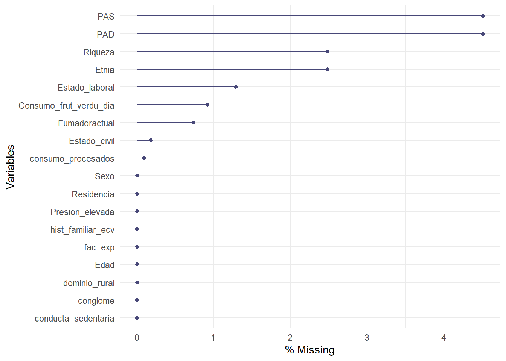
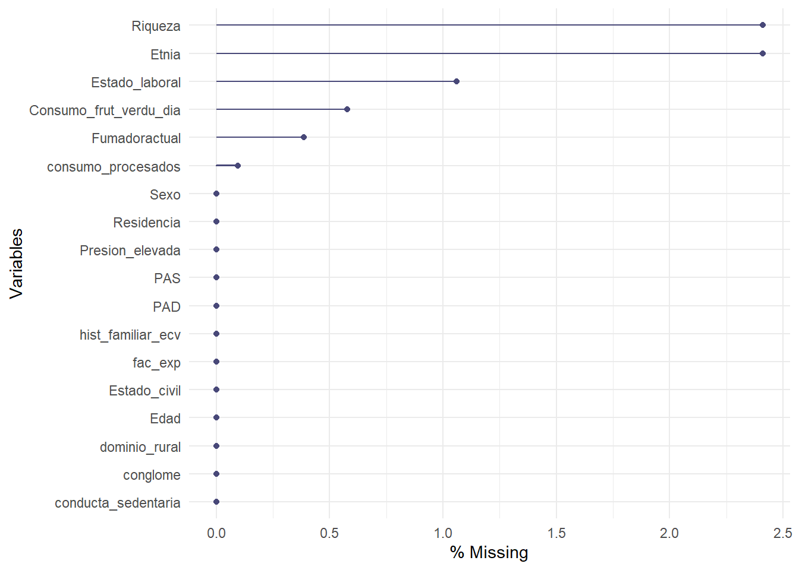
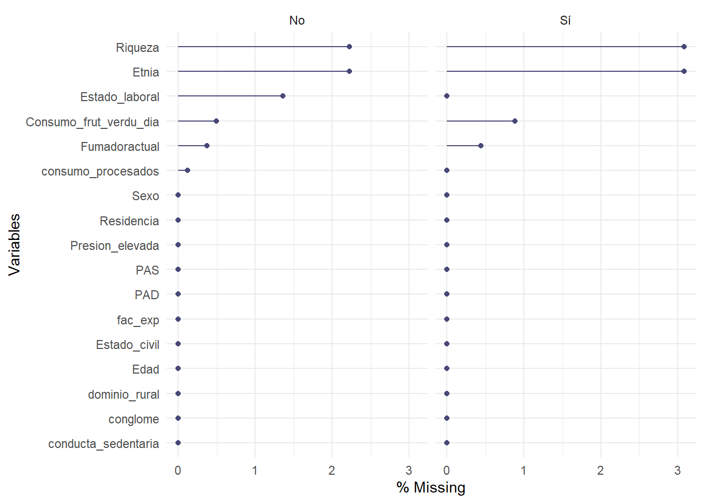
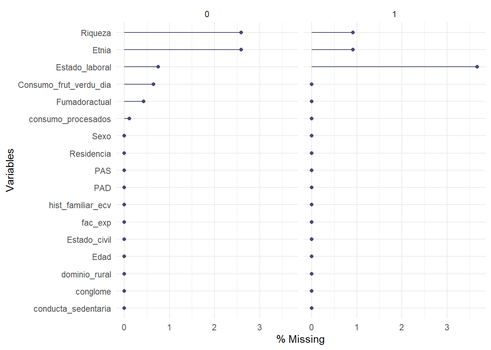
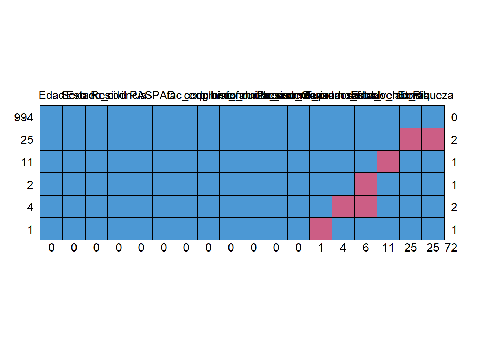
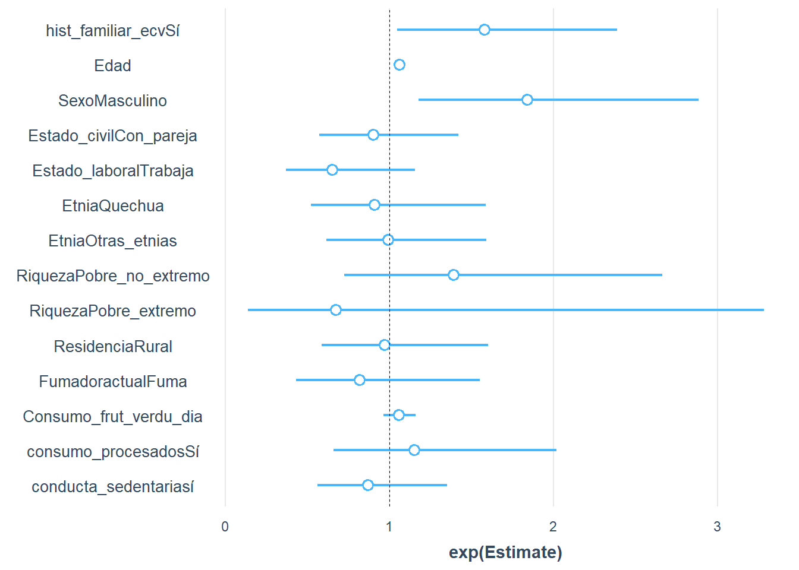
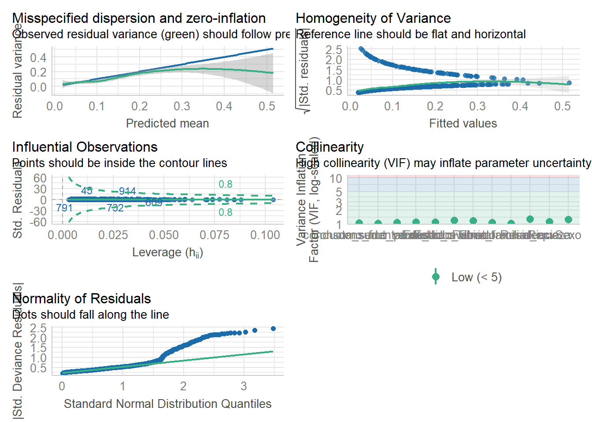

::: title-container


<h1>**Trabajo de fin de máster - Máxima formación - AVANCE**</h1>

<p>Daniel Aarón Fernández Guzmán, MD</p>

<p>2024-09-02</p>
:::

::: callout-note
### Título de proyecto:

Asociación entre la historia familiar de eventos cardiovasculares e hipertensión arterial en una muestra de adultos de Perú
:::


::: {.cell}

:::


### Objetivo {.unnumbered}

El objetivo del presente estudio fue evaluar la asociación entre historia familiar de eventos cardiovasculares e hipertensión arterial.

## Cargar paquetes :D


::: {.cell}

```{.r .cell-code}
library(tidyverse)
library(haven)
library(survey)
library(ENDES.PE)
library(naniar)
library(mice)
```
:::


## 1. Estadística descriptiva

**a) Importamos la base de datos**

Para importar utilizaremos el paquete de `haven` que contiene la función `read_dta` que nos ayudará a importar archivos de STATA (la base fue entregada en dicho formato).


::: {.cell}

```{.r .cell-code}
vianev <- haven::read_dta("base_final_vianev.dta")
```
:::


**b) Seleccionamos variables a utilizar**

Podemos usar `view(base)` para ver que la base de datos .


::: {.cell}

```{.r .cell-code}
dim(vianev)
```

::: {.cell-output .cell-output-stdout}
```
[1] 1086  231
```
:::
:::


Observamos que son 1086 observaciones y 231 variables, pero a nosotros solo nos interesan pocas variables, así que seleccionaremos solo las variables planteadas en nuestro [DAG](https://dagitty.net/mfoVghfXD) (confusores utilizados a partir del estudio de [Valerio et al. 2016](https://www.ncbi.nlm.nih.gov/pmc/articles/PMC5210427/) y [Kulshreshtha et al. 2015](https://www.ncbi.nlm.nih.gov/pmc/articles/PMC4315691/)).


::: {.cell}

```{.r .cell-code}
base2 <- vianev %>% select(Edad = edad_aÑos, 
                         Sexo=sexo, 
                         Estado_civil = estado_civil2,
                         Estado_laboral =ocupacion,
                         Etnia=etnia, 
                         Riqueza =riqueza, 
                         Residencia= residencia, 
                         
                         Fumadoractual=fumadoractual,
                         dias_come_fruta, nfrutasentero, nfruta_decimal,
                         dias_come_verduras, nverduras_entero, nverduras_deci,
                         
                         dias_consume_procesados, dias_consume_chatarra,
                         
                         sentado_horas, sentado_minutos,
                         
                         PAS = resultado_final_sistolica, 
                         PAD = resultado_final_diastolica,
                         alguna_vez_dxhta, medicamentohta, 
                         
                         hist_familiar_iam, hist_familiar_acv,
                         
                         fac_exp, conglome, dominio_rural)
```
:::


**c) Limpieza y creación de variables**

Algunas variables ya tenían etiquetas para sus categorias. Para que R las reconozca utilizamos los siguientes comandos:


::: {.cell}

```{.r .cell-code}
base3 <- base2 %>% mutate(  # Usamos etiquetas que vienen con la base
                          Sexo = as_factor(Sexo),
                          Estado_civil = as_factor(Estado_civil) %>% haven::zap_label(),
                          Estado_laboral = as_factor(Estado_laboral) %>% haven::zap_label(),
                          Riqueza = as_factor(Riqueza) %>% haven::zap_label(),
                          Etnia = as_factor(Etnia) %>% haven::zap_label(),
                          Residencia = as_factor(Residencia) %>% haven::zap_label(), 
                          Fumadoractual = as_factor(Fumadoractual)%>% haven::zap_label(),
                          
                          hist_familiar_ecv = case_when(hist_familiar_iam==1 |
                                                          hist_familiar_acv ==1 ~ "Sí",
                                                        TRUE~"No"),
                          
                          hist_familiar_acv=NULL, hist_familiar_iam = NULL,
                          
                          # Creamos nuevas variables a partir de variables numéricas
                          Consumo_frut_dia =  (nfrutasentero + nfruta_decimal/10) *
                                                     dias_come_fruta/7 ,
                          Consumo_frut_dia = case_when(is.na(Consumo_frut_dia) &
                                                       dias_come_fruta ==0 ~
                                                         0,
                                                       !is.na(Consumo_frut_dia) ~
                                                         Consumo_frut_dia),
                          
                          Consumo_verdu_dia= (nverduras_entero + nverduras_deci/10)*
                                                    dias_come_verduras/7,
                          Consumo_verdu_dia = case_when(is.na(Consumo_verdu_dia) &
                                                       dias_come_verduras ==0 ~
                                                         0,
                                                       !is.na(Consumo_verdu_dia) ~
                                                         Consumo_verdu_dia),
                          
                          
                          Consumo_frut_verdu_dia = round(Consumo_frut_dia+
                                                           Consumo_verdu_dia,2),
                          Consumo_frut_dia= NULL, Consumo_verdu_dia= NULL,
                         
                         consumo_procesados = case_when(dias_consume_procesados == 0 &
                                                        dias_consume_chatarra == 0 ~
                                                          "No",
                                                        dias_consume_procesados == 99 &
                                                        dias_consume_chatarra == 0 ~
                                                          NA,
                                                        TRUE ~ "Sí"),
                         
                         nfrutasentero = NULL, nfruta_decimal = NULL, 
                         dias_come_fruta = NULL, nverduras_entero = NULL,
                         nverduras_deci = NULL, dias_come_verduras = NULL,
                         dias_consume_procesados = NULL, dias_consume_chatarra = NULL,
                         
                         
                         sentado_minutos =   sentado_minutos/60,
                         conducta_sedentaria =  case_when(!is.na(sentado_horas) ~
                                                            sentado_horas,
                                                          TRUE ~sentado_minutos),
                         conducta_sedentaria = round(conducta_sedentaria,2),
                         conducta_sedentaria = case_when(conducta_sedentaria>=6~"sí",
                                                         conducta_sedentaria=NA ~ NA,
                                                         TRUE ~ "No"),
                         
                         
                         sentado_horas= NULL, sentado_minutos=NULL, 
                         
                         Presion_elevada = case_when(PAS >= 140 | PAD >= 90 ~ 1,
                                                     PAS = NA~ NA,
                                                       medicamentohta ==1 | 
                                                       alguna_vez_dxhta== 1 ~ 1,
                                                     TRUE ~ 0),
                         Presion_elevada= Presion_elevada %>% as.factor(),
                         medicamentohta = NULL, alguna_vez_dxhta= NULL) 
```
:::


Visualización de la base de datos limpia


::: {.cell}
::: {.cell-output-display}
```{=html}
<div class="datatables html-widget html-fill-item" id="htmlwidget-ed412c16fa1654313aba" style="width:100%;height:auto;"></div>
<script type="application/json" data-for="htmlwidget-ed412c16fa1654313aba">{"x":{"filter":"none","vertical":false,"data":[["1","2","3","4","5","6","7","8","9","10","11","12","13","14","15","16","17","18","19","20","21","22","23","24","25","26","27","28","29","30","31","32","33","34","35","36","37","38","39","40","41","42","43","44","45","46","47","48","49","50","51","52","53","54","55","56","57","58","59","60","61","62","63","64","65","66","67","68","69","70","71","72","73","74","75","76","77","78","79","80","81","82","83","84","85","86","87","88","89","90","91","92","93","94","95","96","97","98","99","100","101","102","103","104","105","106","107","108","109","110","111","112","113","114","115","116","117","118","119","120","121","122","123","124","125","126","127","128","129","130","131","132","133","134","135","136","137","138","139","140","141","142","143","144","145","146","147","148","149","150","151","152","153","154","155","156","157","158","159","160","161","162","163","164","165","166","167","168","169","170","171","172","173","174","175","176","177","178","179","180","181","182","183","184","185","186","187","188","189","190","191","192","193","194","195","196","197","198","199","200","201","202","203","204","205","206","207","208","209","210","211","212","213","214","215","216","217","218","219","220","221","222","223","224","225","226","227","228","229","230","231","232","233","234","235","236","237","238","239","240","241","242","243","244","245","246","247","248","249","250","251","252","253","254","255","256","257","258","259","260","261","262","263","264","265","266","267","268","269","270","271","272","273","274","275","276","277","278","279","280","281","282","283","284","285","286","287","288","289","290","291","292","293","294","295","296","297","298","299","300","301","302","303","304","305","306","307","308","309","310","311","312","313","314","315","316","317","318","319","320","321","322","323","324","325","326","327","328","329","330","331","332","333","334","335","336","337","338","339","340","341","342","343","344","345","346","347","348","349","350","351","352","353","354","355","356","357","358","359","360","361","362","363","364","365","366","367","368","369","370","371","372","373","374","375","376","377","378","379","380","381","382","383","384","385","386","387","388","389","390","391","392","393","394","395","396","397","398","399","400","401","402","403","404","405","406","407","408","409","410","411","412","413","414","415","416","417","418","419","420","421","422","423","424","425","426","427","428","429","430","431","432","433","434","435","436","437","438","439","440","441","442","443","444","445","446","447","448","449","450","451","452","453","454","455","456","457","458","459","460","461","462","463","464","465","466","467","468","469","470","471","472","473","474","475","476","477","478","479","480","481","482","483","484","485","486","487","488","489","490","491","492","493","494","495","496","497","498","499","500","501","502","503","504","505","506","507","508","509","510","511","512","513","514","515","516","517","518","519","520","521","522","523","524","525","526","527","528","529","530","531","532","533","534","535","536","537","538","539","540","541","542","543","544","545","546","547","548","549","550","551","552","553","554","555","556","557","558","559","560","561","562","563","564","565","566","567","568","569","570","571","572","573","574","575","576","577","578","579","580","581","582","583","584","585","586","587","588","589","590","591","592","593","594","595","596","597","598","599","600","601","602","603","604","605","606","607","608","609","610","611","612","613","614","615","616","617","618","619","620","621","622","623","624","625","626","627","628","629","630","631","632","633","634","635","636","637","638","639","640","641","642","643","644","645","646","647","648","649","650","651","652","653","654","655","656","657","658","659","660","661","662","663","664","665","666","667","668","669","670","671","672","673","674","675","676","677","678","679","680","681","682","683","684","685","686","687","688","689","690","691","692","693","694","695","696","697","698","699","700","701","702","703","704","705","706","707","708","709","710","711","712","713","714","715","716","717","718","719","720","721","722","723","724","725","726","727","728","729","730","731","732","733","734","735","736","737","738","739","740","741","742","743","744","745","746","747","748","749","750","751","752","753","754","755","756","757","758","759","760","761","762","763","764","765","766","767","768","769","770","771","772","773","774","775","776","777","778","779","780","781","782","783","784","785","786","787","788","789","790","791","792","793","794","795","796","797","798","799","800","801","802","803","804","805","806","807","808","809","810","811","812","813","814","815","816","817","818","819","820","821","822","823","824","825","826","827","828","829","830","831","832","833","834","835","836","837","838","839","840","841","842","843","844","845","846","847","848","849","850","851","852","853","854","855","856","857","858","859","860","861","862","863","864","865","866","867","868","869","870","871","872","873","874","875","876","877","878","879","880","881","882","883","884","885","886","887","888","889","890","891","892","893","894","895","896","897","898","899","900","901","902","903","904","905","906","907","908","909","910","911","912","913","914","915","916","917","918","919","920","921","922","923","924","925","926","927","928","929","930","931","932","933","934","935","936","937","938","939","940","941","942","943","944","945","946","947","948","949","950","951","952","953","954","955","956","957","958","959","960","961","962","963","964","965","966","967","968","969","970","971","972","973","974","975","976","977","978","979","980","981","982","983","984","985","986","987","988","989","990","991","992","993","994","995","996","997","998","999","1000","1001","1002","1003","1004","1005","1006","1007","1008","1009","1010","1011","1012","1013","1014","1015","1016","1017","1018","1019","1020","1021","1022","1023","1024","1025","1026","1027","1028","1029","1030","1031","1032","1033","1034","1035","1036","1037","1038","1039","1040","1041","1042","1043","1044","1045","1046","1047","1048","1049","1050","1051","1052","1053","1054","1055","1056","1057","1058","1059","1060","1061","1062","1063","1064","1065","1066","1067","1068","1069","1070","1071","1072","1073","1074","1075","1076","1077","1078","1079","1080","1081","1082","1083","1084","1085","1086"],[59,22,30,27,34,29,57,35,40,31,52,35,18,32,22,40,46,49,44,21,37,57,27,48,40,50,19,42,33,31,53,22,58,30,59,20,39,34,21,54,21,36,25,55,52,55,42,29,36,58,58,47,35,52,42,26,30,27,46,32,39,58,52,49,44,23,49,23,45,35,36,32,59,38,51,56,28,58,56,49,19,36,27,45,50,29,20,23,59,46,21,53,43,59,28,48,45,36,40,59,19,43,56,38,42,39,39,34,49,25,28,19,51,53,48,34,41,31,37,47,40,44,31,35,34,52,47,49,41,34,51,23,38,27,30,52,23,43,41,37,37,44,42,54,48,24,26,34,35,32,20,48,49,34,58,40,35,51,29,55,24,49,28,21,48,24,34,43,56,21,20,30,19,57,24,57,41,23,35,23,29,41,20,50,24,20,28,47,43,54,57,36,36,28,40,50,32,31,55,21,57,34,26,27,57,40,27,44,24,27,37,34,27,40,40,28,41,25,49,45,59,59,26,22,55,50,44,43,47,41,33,55,58,42,49,56,27,50,44,56,32,52,40,20,41,41,37,52,25,40,39,29,28,51,50,51,35,50,38,42,41,43,26,44,22,20,33,29,52,52,44,56,37,54,51,44,34,19,59,57,44,20,18,53,48,57,19,55,54,47,44,35,30,41,41,27,48,37,32,24,41,42,41,52,38,50,24,53,49,25,52,41,21,40,33,20,40,51,29,36,49,59,43,22,45,23,33,40,55,35,32,33,49,20,21,39,42,20,39,32,55,49,35,20,46,51,35,44,43,54,52,55,47,25,35,53,55,22,47,57,22,35,55,58,21,52,39,39,39,39,34,48,22,27,28,41,48,21,44,20,21,44,33,39,43,41,23,24,59,35,41,53,55,30,28,21,29,36,31,44,19,45,43,40,50,34,48,44,27,48,18,21,24,27,41,37,36,54,29,47,33,39,31,37,46,21,34,38,34,35,34,23,39,44,41,32,50,51,31,26,37,33,22,51,29,34,59,35,49,22,20,38,52,29,22,47,41,18,33,49,50,44,40,29,35,56,21,34,55,54,26,36,18,29,54,31,37,26,43,46,22,47,25,49,36,34,49,19,39,59,27,25,20,36,30,38,33,25,58,59,39,43,39,32,27,50,47,43,34,28,39,39,34,27,29,46,32,50,51,35,57,30,38,47,58,30,35,52,58,51,43,25,28,42,27,22,42,43,38,45,35,44,43,41,30,30,21,26,30,32,30,44,40,51,19,57,29,21,46,59,21,58,51,32,38,59,48,29,28,34,30,53,55,19,22,40,54,31,46,34,32,31,55,34,57,28,32,26,52,51,18,23,26,30,47,43,21,21,37,47,20,36,36,19,36,36,51,20,31,42,26,36,55,24,36,24,40,44,39,52,28,29,36,36,42,51,35,42,37,51,42,45,21,32,29,47,49,38,37,41,35,50,31,59,23,43,41,50,57,44,33,19,22,28,36,38,28,25,24,59,23,20,34,50,41,57,25,31,46,45,43,30,21,47,36,59,57,23,46,59,25,44,38,47,32,52,35,18,51,46,21,46,19,26,50,37,38,19,44,58,23,44,36,39,36,21,51,30,55,34,26,33,20,36,51,54,20,44,43,52,59,38,28,27,24,29,51,52,54,29,21,43,53,48,53,19,55,51,29,20,53,28,49,20,20,55,38,48,51,49,33,52,26,49,44,50,22,59,42,49,20,57,39,37,55,53,48,57,52,27,46,48,30,28,46,56,49,27,38,59,32,29,33,56,32,57,29,28,30,42,25,52,32,41,22,32,48,30,35,55,36,50,32,40,25,40,35,54,39,52,23,57,22,32,22,51,35,40,41,40,36,38,20,41,54,40,30,46,35,28,38,25,57,57,44,19,23,45,58,27,45,51,25,53,59,24,38,51,31,32,30,59,38,46,22,47,51,25,45,40,49,20,54,37,36,31,47,24,58,22,43,30,52,24,59,33,26,28,42,33,25,48,47,20,46,24,32,28,41,22,57,25,36,37,19,49,47,35,44,19,32,32,26,59,27,56,32,48,42,29,40,59,53,46,38,35,24,24,45,25,44,29,32,18,39,51,20,41,50,25,55,28,56,33,29,19,48,45,30,25,35,30,30,47,50,45,46,27,46,44,31,29,44,40,34,58,44,20,26,37,30,55,35,52,33,33,54,26,43,35,45,22,47,59,41,21,52,54,32,27,58,29,27,59,21,19,27,38,26,23,36,31,39,30,44,22,21,27,42,31,31,29,49,21,23,44,37,51,58,22,38,51,34,39,21,36,30,52,21,51,46,42,34,25,25,23,49,52,35,49,20,48,58,51,20,54,32,30,40,41,23,21,37,51,41,37,48,41,23,20,39,30,28,44,38,55,58,46,43,47,55,44,20,39,35,24,21,54,42,44,25,51,21,47,53,59,50,32,28,59,38,26,49,21,27,36],["Masculino","Masculino","Masculino","Femenino","Masculino","Femenino","Femenino","Masculino","Masculino","Femenino","Masculino","Masculino","Femenino","Masculino","Femenino","Masculino","Femenino","Masculino","Femenino","Masculino","Masculino","Femenino","Femenino","Masculino","Femenino","Masculino","Masculino","Femenino","Femenino","Masculino","Femenino","Masculino","Femenino","Femenino","Femenino","Femenino","Femenino","Masculino","Femenino","Masculino","Masculino","Femenino","Femenino","Femenino","Masculino","Femenino","Masculino","Femenino","Masculino","Masculino","Femenino","Masculino","Femenino","Femenino","Masculino","Femenino","Masculino","Femenino","Masculino","Masculino","Masculino","Femenino","Masculino","Femenino","Masculino","Femenino","Masculino","Femenino","Masculino","Masculino","Masculino","Femenino","Femenino","Femenino","Femenino","Masculino","Femenino","Masculino","Femenino","Femenino","Masculino","Femenino","Masculino","Femenino","Femenino","Masculino","Masculino","Femenino","Masculino","Femenino","Masculino","Masculino","Femenino","Masculino","Masculino","Femenino","Masculino","Masculino","Femenino","Femenino","Masculino","Femenino","Masculino","Masculino","Masculino","Femenino","Masculino","Femenino","Femenino","Masculino","Femenino","Femenino","Masculino","Masculino","Masculino","Femenino","Femenino","Femenino","Femenino","Femenino","Femenino","Femenino","Masculino","Masculino","Femenino","Masculino","Masculino","Femenino","Masculino","Femenino","Masculino","Femenino","Femenino","Masculino","Masculino","Masculino","Femenino","Femenino","Masculino","Femenino","Masculino","Masculino","Masculino","Masculino","Femenino","Femenino","Femenino","Masculino","Femenino","Femenino","Femenino","Femenino","Femenino","Masculino","Femenino","Femenino","Femenino","Femenino","Masculino","Femenino","Femenino","Femenino","Masculino","Masculino","Femenino","Masculino","Femenino","Femenino","Femenino","Femenino","Masculino","Femenino","Masculino","Femenino","Masculino","Femenino","Femenino","Femenino","Femenino","Femenino","Masculino","Femenino","Femenino","Femenino","Femenino","Femenino","Femenino","Masculino","Femenino","Masculino","Femenino","Femenino","Femenino","Femenino","Femenino","Femenino","Femenino","Masculino","Femenino","Femenino","Masculino","Femenino","Femenino","Masculino","Masculino","Femenino","Masculino","Masculino","Masculino","Femenino","Femenino","Masculino","Femenino","Femenino","Masculino","Masculino","Masculino","Masculino","Femenino","Masculino","Masculino","Femenino","Masculino","Femenino","Femenino","Femenino","Femenino","Masculino","Masculino","Femenino","Femenino","Masculino","Masculino","Femenino","Femenino","Masculino","Femenino","Femenino","Masculino","Masculino","Masculino","Femenino","Femenino","Masculino","Femenino","Masculino","Femenino","Masculino","Masculino","Masculino","Femenino","Masculino","Femenino","Masculino","Femenino","Masculino","Femenino","Masculino","Femenino","Femenino","Masculino","Femenino","Masculino","Masculino","Femenino","Femenino","Femenino","Femenino","Femenino","Masculino","Femenino","Femenino","Masculino","Femenino","Masculino","Femenino","Masculino","Masculino","Femenino","Femenino","Femenino","Masculino","Femenino","Masculino","Femenino","Femenino","Masculino","Femenino","Femenino","Masculino","Femenino","Masculino","Femenino","Femenino","Masculino","Femenino","Masculino","Femenino","Masculino","Femenino","Masculino","Femenino","Femenino","Femenino","Femenino","Femenino","Femenino","Masculino","Femenino","Femenino","Masculino","Femenino","Masculino","Masculino","Femenino","Femenino","Masculino","Masculino","Masculino","Femenino","Masculino","Femenino","Femenino","Masculino","Femenino","Masculino","Masculino","Femenino","Masculino","Femenino","Masculino","Femenino","Femenino","Masculino","Femenino","Femenino","Masculino","Masculino","Masculino","Masculino","Femenino","Masculino","Femenino","Masculino","Femenino","Masculino","Femenino","Masculino","Femenino","Masculino","Femenino","Masculino","Femenino","Masculino","Masculino","Femenino","Femenino","Masculino","Femenino","Femenino","Masculino","Masculino","Femenino","Masculino","Femenino","Femenino","Femenino","Masculino","Femenino","Femenino","Masculino","Masculino","Femenino","Femenino","Femenino","Femenino","Femenino","Femenino","Femenino","Femenino","Masculino","Masculino","Femenino","Femenino","Femenino","Femenino","Masculino","Femenino","Femenino","Masculino","Masculino","Femenino","Femenino","Femenino","Femenino","Masculino","Femenino","Femenino","Masculino","Femenino","Femenino","Femenino","Masculino","Femenino","Femenino","Masculino","Masculino","Femenino","Femenino","Masculino","Masculino","Femenino","Masculino","Femenino","Femenino","Masculino","Femenino","Masculino","Femenino","Masculino","Masculino","Femenino","Masculino","Femenino","Masculino","Femenino","Masculino","Femenino","Femenino","Femenino","Femenino","Femenino","Femenino","Masculino","Femenino","Femenino","Femenino","Masculino","Masculino","Masculino","Femenino","Femenino","Femenino","Masculino","Masculino","Femenino","Femenino","Femenino","Femenino","Femenino","Femenino","Masculino","Femenino","Masculino","Femenino","Femenino","Femenino","Femenino","Femenino","Masculino","Masculino","Femenino","Femenino","Femenino","Femenino","Masculino","Masculino","Femenino","Femenino","Femenino","Femenino","Masculino","Femenino","Masculino","Masculino","Femenino","Masculino","Femenino","Masculino","Femenino","Femenino","Masculino","Masculino","Masculino","Femenino","Femenino","Femenino","Femenino","Femenino","Masculino","Masculino","Masculino","Masculino","Masculino","Femenino","Masculino","Femenino","Masculino","Masculino","Femenino","Femenino","Masculino","Masculino","Femenino","Femenino","Masculino","Femenino","Femenino","Masculino","Femenino","Femenino","Femenino","Femenino","Masculino","Femenino","Femenino","Femenino","Femenino","Femenino","Femenino","Masculino","Femenino","Femenino","Masculino","Femenino","Masculino","Femenino","Femenino","Masculino","Femenino","Femenino","Femenino","Femenino","Masculino","Masculino","Masculino","Masculino","Femenino","Masculino","Masculino","Femenino","Masculino","Femenino","Femenino","Masculino","Femenino","Masculino","Femenino","Femenino","Masculino","Femenino","Masculino","Femenino","Femenino","Femenino","Femenino","Femenino","Masculino","Femenino","Masculino","Masculino","Masculino","Femenino","Femenino","Masculino","Masculino","Femenino","Masculino","Femenino","Femenino","Femenino","Femenino","Femenino","Masculino","Masculino","Femenino","Femenino","Femenino","Masculino","Masculino","Femenino","Femenino","Masculino","Masculino","Femenino","Masculino","Femenino","Femenino","Masculino","Femenino","Masculino","Femenino","Masculino","Femenino","Femenino","Masculino","Masculino","Femenino","Femenino","Femenino","Femenino","Masculino","Femenino","Masculino","Femenino","Femenino","Femenino","Femenino","Femenino","Femenino","Masculino","Masculino","Masculino","Femenino","Femenino","Masculino","Femenino","Masculino","Masculino","Femenino","Femenino","Femenino","Femenino","Femenino","Femenino","Femenino","Femenino","Masculino","Femenino","Masculino","Masculino","Masculino","Masculino","Masculino","Femenino","Masculino","Femenino","Masculino","Masculino","Masculino","Femenino","Masculino","Femenino","Femenino","Masculino","Masculino","Femenino","Masculino","Femenino","Masculino","Masculino","Femenino","Femenino","Masculino","Masculino","Femenino","Masculino","Femenino","Femenino","Masculino","Masculino","Masculino","Masculino","Femenino","Femenino","Femenino","Masculino","Masculino","Femenino","Masculino","Femenino","Masculino","Femenino","Femenino","Femenino","Masculino","Femenino","Femenino","Femenino","Masculino","Femenino","Masculino","Masculino","Femenino","Femenino","Masculino","Masculino","Masculino","Femenino","Masculino","Masculino","Femenino","Masculino","Femenino","Femenino","Femenino","Femenino","Masculino","Masculino","Masculino","Masculino","Masculino","Femenino","Masculino","Masculino","Femenino","Femenino","Femenino","Femenino","Femenino","Masculino","Femenino","Femenino","Femenino","Femenino","Femenino","Masculino","Masculino","Femenino","Femenino","Masculino","Masculino","Masculino","Femenino","Femenino","Masculino","Masculino","Masculino","Femenino","Masculino","Masculino","Femenino","Masculino","Femenino","Femenino","Masculino","Masculino","Femenino","Femenino","Masculino","Femenino","Masculino","Femenino","Masculino","Femenino","Masculino","Masculino","Femenino","Femenino","Femenino","Femenino","Masculino","Femenino","Masculino","Masculino","Masculino","Femenino","Masculino","Femenino","Femenino","Masculino","Femenino","Femenino","Femenino","Femenino","Femenino","Masculino","Masculino","Femenino","Femenino","Femenino","Femenino","Femenino","Femenino","Femenino","Femenino","Masculino","Femenino","Masculino","Femenino","Masculino","Masculino","Femenino","Femenino","Masculino","Femenino","Femenino","Femenino","Masculino","Femenino","Femenino","Femenino","Femenino","Femenino","Femenino","Femenino","Masculino","Masculino","Femenino","Masculino","Masculino","Femenino","Masculino","Masculino","Femenino","Femenino","Masculino","Femenino","Masculino","Femenino","Masculino","Masculino","Masculino","Femenino","Femenino","Masculino","Femenino","Masculino","Masculino","Masculino","Femenino","Femenino","Femenino","Femenino","Femenino","Masculino","Femenino","Masculino","Masculino","Femenino","Femenino","Masculino","Femenino","Femenino","Femenino","Masculino","Masculino","Femenino","Femenino","Masculino","Masculino","Masculino","Femenino","Masculino","Masculino","Femenino","Masculino","Femenino","Masculino","Femenino","Masculino","Femenino","Masculino","Femenino","Femenino","Femenino","Femenino","Femenino","Femenino","Femenino","Femenino","Masculino","Masculino","Femenino","Femenino","Masculino","Femenino","Masculino","Femenino","Femenino","Femenino","Masculino","Femenino","Masculino","Masculino","Femenino","Masculino","Masculino","Femenino","Femenino","Femenino","Femenino","Femenino","Masculino","Masculino","Femenino","Masculino","Femenino","Femenino","Femenino","Femenino","Masculino","Femenino","Femenino","Femenino","Femenino","Masculino","Masculino","Femenino","Masculino","Masculino","Femenino","Femenino","Masculino","Femenino","Masculino","Femenino","Femenino","Masculino","Femenino","Masculino","Masculino","Femenino","Masculino","Femenino","Masculino","Femenino","Masculino","Masculino","Femenino","Masculino","Femenino","Masculino","Femenino","Femenino","Masculino","Masculino","Femenino","Femenino","Masculino","Masculino","Femenino","Femenino","Femenino","Masculino","Femenino","Femenino","Masculino","Femenino","Masculino","Masculino","Masculino","Femenino","Masculino","Masculino","Masculino","Femenino","Masculino","Femenino","Femenino","Masculino","Femenino","Femenino","Femenino","Femenino","Femenino","Femenino","Masculino","Femenino","Masculino","Masculino","Femenino","Femenino","Masculino","Femenino","Femenino","Masculino","Masculino","Femenino","Masculino","Femenino","Masculino","Femenino","Femenino","Femenino","Masculino","Femenino","Masculino","Masculino","Masculino","Femenino","Femenino","Femenino","Femenino","Masculino","Femenino","Femenino","Masculino","Masculino","Femenino","Masculino","Femenino","Masculino","Femenino","Femenino","Femenino","Femenino","Masculino","Masculino","Femenino","Femenino","Femenino","Femenino","Masculino","Masculino","Femenino","Femenino","Masculino","Masculino","Femenino","Femenino","Masculino","Femenino","Femenino","Masculino","Femenino","Masculino","Femenino","Femenino","Masculino","Femenino","Masculino","Femenino","Femenino","Femenino","Masculino","Femenino","Masculino","Femenino","Femenino","Femenino","Masculino","Masculino","Masculino","Femenino","Femenino","Femenino","Femenino","Masculino","Femenino","Femenino","Femenino","Femenino","Femenino","Femenino","Masculino","Masculino","Femenino","Masculino","Masculino","Femenino","Femenino","Masculino","Femenino","Femenino","Masculino","Masculino","Femenino","Femenino","Masculino","Masculino","Femenino","Femenino","Masculino","Masculino","Femenino","Femenino","Masculino","Masculino","Femenino","Femenino","Masculino","Masculino","Femenino","Femenino","Masculino","Masculino","Masculino","Femenino","Masculino","Femenino","Femenino","Femenino","Masculino","Femenino","Masculino"],["Con_pareja","Sin_pareja","Sin_pareja","Con_pareja","Con_pareja","Con_pareja","Con_pareja","Con_pareja","Con_pareja","Con_pareja","Con_pareja","Con_pareja","Con_pareja","Con_pareja","Con_pareja","Con_pareja","Sin_pareja","Con_pareja","Con_pareja","Sin_pareja","Con_pareja","Con_pareja","Sin_pareja","Con_pareja","Con_pareja","Con_pareja","Sin_pareja","Con_pareja","Con_pareja","Sin_pareja","Con_pareja","Sin_pareja","Con_pareja","Sin_pareja","Con_pareja","Sin_pareja","Con_pareja","Con_pareja","Con_pareja","Con_pareja","Sin_pareja","Con_pareja","Sin_pareja","Con_pareja","Sin_pareja","Sin_pareja","Con_pareja","Con_pareja","Con_pareja","Con_pareja","Con_pareja","Con_pareja","Con_pareja","Con_pareja","Con_pareja","Con_pareja","Con_pareja","Con_pareja","Con_pareja","Con_pareja","Con_pareja","Con_pareja","Con_pareja","Con_pareja","Con_pareja","Con_pareja","Con_pareja","Con_pareja","Con_pareja","Con_pareja","Con_pareja","Con_pareja","Sin_pareja","Con_pareja","Con_pareja","Con_pareja","Con_pareja","Con_pareja","Con_pareja","Con_pareja","Sin_pareja","Sin_pareja","Sin_pareja","Sin_pareja","Sin_pareja","Sin_pareja","Sin_pareja","Sin_pareja","Con_pareja","Con_pareja","Sin_pareja","Con_pareja","Con_pareja","Con_pareja","Sin_pareja","Sin_pareja","Sin_pareja","Sin_pareja","Sin_pareja","Con_pareja","Sin_pareja","Con_pareja","Con_pareja","Con_pareja","Con_pareja","Con_pareja","Con_pareja","Con_pareja","Con_pareja","Sin_pareja","Con_pareja","Sin_pareja","Con_pareja","Con_pareja","Con_pareja","Sin_pareja","Sin_pareja","Sin_pareja","Con_pareja","Con_pareja","Con_pareja","Con_pareja","Con_pareja","Con_pareja","Con_pareja","Con_pareja","Sin_pareja","Con_pareja","Con_pareja","Con_pareja","Con_pareja","Sin_pareja","Con_pareja","Sin_pareja","Sin_pareja","Con_pareja","Con_pareja","Sin_pareja","Con_pareja","Con_pareja","Sin_pareja","Con_pareja","Con_pareja","Con_pareja","Con_pareja","Sin_pareja","Sin_pareja","Con_pareja","Con_pareja","Con_pareja","Sin_pareja","Sin_pareja","Con_pareja","Con_pareja","Sin_pareja","Con_pareja","Con_pareja","Sin_pareja","Sin_pareja","Con_pareja","Sin_pareja","Con_pareja","Sin_pareja","Sin_pareja","Con_pareja","Sin_pareja","Con_pareja","Sin_pareja","Con_pareja","Sin_pareja","Sin_pareja","Con_pareja","Sin_pareja","Con_pareja","Con_pareja","Con_pareja","Con_pareja","Con_pareja","Con_pareja","Sin_pareja","Con_pareja","Con_pareja","Sin_pareja","Con_pareja","Sin_pareja","Con_pareja","Con_pareja","Con_pareja","Con_pareja","Con_pareja","Con_pareja","Sin_pareja","Sin_pareja","Con_pareja","Sin_pareja","Con_pareja","Con_pareja","Con_pareja","Con_pareja","Sin_pareja","Con_pareja","Con_pareja","Sin_pareja","Sin_pareja","Con_pareja","Con_pareja","Sin_pareja","Sin_pareja","Sin_pareja","Sin_pareja","Sin_pareja","Sin_pareja","Con_pareja","Sin_pareja","Sin_pareja","Con_pareja","Sin_pareja","Sin_pareja","Con_pareja","Con_pareja","Con_pareja","Con_pareja","Sin_pareja","Sin_pareja","Con_pareja","Sin_pareja","Con_pareja","Con_pareja","Con_pareja","Con_pareja","Con_pareja","Sin_pareja","Con_pareja","Sin_pareja","Con_pareja","Sin_pareja","Con_pareja","Con_pareja","Con_pareja","Con_pareja","Sin_pareja","Sin_pareja","Sin_pareja","Sin_pareja","Con_pareja","Con_pareja","Con_pareja","Con_pareja","Sin_pareja","Con_pareja","Con_pareja","Sin_pareja","Con_pareja","Con_pareja","Con_pareja","Con_pareja","Con_pareja","Con_pareja","Con_pareja","Con_pareja","Con_pareja","Con_pareja","Sin_pareja","Con_pareja","Sin_pareja","Sin_pareja","Con_pareja","Con_pareja","Con_pareja","Con_pareja",null,"Con_pareja","Con_pareja","Con_pareja","Con_pareja","Con_pareja","Sin_pareja","Con_pareja","Sin_pareja","Con_pareja","Con_pareja","Sin_pareja","Sin_pareja","Con_pareja","Con_pareja","Sin_pareja","Sin_pareja","Sin_pareja","Con_pareja","Con_pareja","Sin_pareja","Con_pareja","Con_pareja","Sin_pareja","Con_pareja","Con_pareja","Con_pareja","Con_pareja","Con_pareja","Con_pareja","Con_pareja","Con_pareja","Con_pareja","Con_pareja","Sin_pareja","Sin_pareja","Con_pareja","Con_pareja","Con_pareja","Sin_pareja","Con_pareja","Con_pareja","Con_pareja","Con_pareja","Con_pareja","Sin_pareja","Con_pareja","Con_pareja","Con_pareja","Con_pareja","Con_pareja","Con_pareja","Con_pareja","Sin_pareja","Sin_pareja","Con_pareja","Con_pareja","Con_pareja","Con_pareja","Con_pareja","Con_pareja","Con_pareja","Sin_pareja","Sin_pareja","Sin_pareja","Con_pareja","Con_pareja","Con_pareja","Con_pareja","Sin_pareja","Con_pareja","Sin_pareja","Sin_pareja","Sin_pareja","Con_pareja","Con_pareja","Sin_pareja","Con_pareja","Con_pareja","Con_pareja","Sin_pareja","Con_pareja","Con_pareja","Sin_pareja","Con_pareja","Con_pareja","Sin_pareja","Sin_pareja","Con_pareja","Con_pareja","Sin_pareja","Con_pareja","Con_pareja","Sin_pareja","Sin_pareja","Sin_pareja","Con_pareja","Con_pareja","Con_pareja","Con_pareja","Con_pareja","Con_pareja","Sin_pareja","Con_pareja","Con_pareja","Con_pareja","Con_pareja","Con_pareja","Con_pareja","Con_pareja","Sin_pareja","Con_pareja","Con_pareja","Con_pareja","Con_pareja","Con_pareja","Con_pareja","Con_pareja","Con_pareja","Con_pareja","Con_pareja","Con_pareja","Con_pareja","Sin_pareja","Sin_pareja","Sin_pareja","Con_pareja","Con_pareja","Con_pareja","Con_pareja","Sin_pareja","Sin_pareja","Con_pareja","Con_pareja","Con_pareja","Sin_pareja","Con_pareja","Con_pareja","Sin_pareja","Con_pareja","Sin_pareja","Sin_pareja","Sin_pareja","Sin_pareja","Con_pareja","Con_pareja","Con_pareja","Sin_pareja","Con_pareja","Con_pareja","Sin_pareja","Con_pareja","Sin_pareja","Con_pareja","Con_pareja","Sin_pareja","Sin_pareja","Sin_pareja","Con_pareja","Con_pareja","Con_pareja","Con_pareja","Con_pareja","Con_pareja","Sin_pareja","Sin_pareja","Con_pareja","Sin_pareja","Sin_pareja","Sin_pareja","Con_pareja","Con_pareja","Sin_pareja","Con_pareja","Con_pareja","Con_pareja","Sin_pareja","Con_pareja","Sin_pareja","Con_pareja","Sin_pareja","Con_pareja","Con_pareja","Sin_pareja","Sin_pareja","Con_pareja","Con_pareja","Sin_pareja","Con_pareja","Con_pareja","Sin_pareja","Con_pareja","Sin_pareja","Con_pareja","Sin_pareja","Con_pareja","Sin_pareja","Con_pareja","Sin_pareja","Con_pareja","Sin_pareja","Con_pareja","Sin_pareja","Con_pareja","Sin_pareja","Con_pareja","Con_pareja","Con_pareja","Con_pareja","Con_pareja","Sin_pareja","Con_pareja","Sin_pareja","Con_pareja","Con_pareja","Con_pareja","Sin_pareja","Sin_pareja","Con_pareja","Sin_pareja","Sin_pareja","Sin_pareja","Sin_pareja","Sin_pareja","Con_pareja","Con_pareja","Con_pareja","Sin_pareja","Con_pareja","Con_pareja","Con_pareja","Con_pareja","Sin_pareja","Sin_pareja","Con_pareja","Con_pareja","Con_pareja","Con_pareja","Sin_pareja","Sin_pareja","Con_pareja","Sin_pareja","Con_pareja","Sin_pareja","Sin_pareja","Sin_pareja","Sin_pareja","Con_pareja","Con_pareja","Con_pareja","Con_pareja","Sin_pareja","Con_pareja","Con_pareja","Sin_pareja","Sin_pareja","Con_pareja","Con_pareja","Con_pareja","Con_pareja","Sin_pareja","Con_pareja","Con_pareja","Con_pareja","Sin_pareja","Sin_pareja","Con_pareja","Con_pareja","Sin_pareja","Con_pareja","Con_pareja","Con_pareja","Con_pareja","Sin_pareja","Con_pareja","Con_pareja","Sin_pareja","Sin_pareja","Sin_pareja","Con_pareja","Con_pareja","Sin_pareja","Con_pareja","Sin_pareja","Sin_pareja","Sin_pareja","Sin_pareja","Sin_pareja","Con_pareja","Con_pareja","Sin_pareja",null,"Con_pareja","Con_pareja","Con_pareja","Con_pareja","Con_pareja","Con_pareja","Con_pareja","Con_pareja","Con_pareja","Con_pareja","Con_pareja","Sin_pareja","Sin_pareja","Con_pareja","Con_pareja","Sin_pareja","Sin_pareja","Con_pareja","Con_pareja","Con_pareja","Con_pareja","Sin_pareja","Con_pareja","Con_pareja","Con_pareja","Sin_pareja","Con_pareja","Con_pareja","Sin_pareja","Sin_pareja","Con_pareja","Con_pareja","Con_pareja","Con_pareja","Sin_pareja","Sin_pareja","Con_pareja","Con_pareja","Sin_pareja","Con_pareja","Con_pareja","Sin_pareja","Con_pareja","Con_pareja","Con_pareja","Sin_pareja","Sin_pareja","Sin_pareja","Sin_pareja","Sin_pareja","Con_pareja","Sin_pareja","Sin_pareja","Sin_pareja","Con_pareja","Con_pareja","Con_pareja","Con_pareja","Sin_pareja","Sin_pareja","Con_pareja","Con_pareja","Con_pareja","Sin_pareja","Con_pareja","Con_pareja","Con_pareja","Sin_pareja","Con_pareja","Con_pareja","Sin_pareja","Con_pareja","Sin_pareja","Con_pareja","Con_pareja","Sin_pareja","Sin_pareja","Con_pareja","Con_pareja","Con_pareja","Con_pareja","Sin_pareja","Sin_pareja","Sin_pareja","Con_pareja","Sin_pareja","Con_pareja","Con_pareja","Sin_pareja","Sin_pareja","Sin_pareja","Sin_pareja","Con_pareja","Con_pareja","Sin_pareja","Sin_pareja","Sin_pareja","Con_pareja","Sin_pareja","Sin_pareja","Sin_pareja","Sin_pareja","Sin_pareja","Con_pareja","Sin_pareja","Con_pareja","Sin_pareja","Con_pareja","Con_pareja","Sin_pareja","Sin_pareja","Sin_pareja","Con_pareja","Con_pareja","Con_pareja","Sin_pareja","Con_pareja","Con_pareja","Sin_pareja","Sin_pareja","Sin_pareja","Con_pareja","Sin_pareja","Con_pareja","Con_pareja","Sin_pareja","Con_pareja","Con_pareja","Sin_pareja","Con_pareja","Sin_pareja","Sin_pareja","Con_pareja","Sin_pareja","Sin_pareja","Sin_pareja","Sin_pareja","Con_pareja","Sin_pareja","Con_pareja","Con_pareja","Con_pareja","Sin_pareja","Sin_pareja","Con_pareja","Con_pareja","Sin_pareja","Con_pareja","Sin_pareja","Con_pareja","Sin_pareja","Con_pareja","Con_pareja","Con_pareja","Sin_pareja","Con_pareja","Con_pareja","Sin_pareja","Con_pareja","Con_pareja","Con_pareja","Con_pareja","Sin_pareja","Sin_pareja","Con_pareja","Con_pareja","Con_pareja","Sin_pareja","Sin_pareja","Sin_pareja","Con_pareja","Con_pareja","Con_pareja","Sin_pareja","Con_pareja","Con_pareja","Sin_pareja","Sin_pareja","Sin_pareja","Sin_pareja","Con_pareja","Sin_pareja","Con_pareja","Con_pareja","Con_pareja","Con_pareja","Con_pareja","Sin_pareja","Sin_pareja","Con_pareja","Con_pareja","Con_pareja","Sin_pareja","Con_pareja","Sin_pareja","Con_pareja","Con_pareja","Con_pareja","Sin_pareja","Con_pareja","Con_pareja","Sin_pareja","Con_pareja","Con_pareja","Sin_pareja","Con_pareja","Con_pareja","Con_pareja","Con_pareja","Con_pareja","Con_pareja","Sin_pareja","Sin_pareja","Sin_pareja","Con_pareja","Con_pareja","Sin_pareja","Sin_pareja","Con_pareja","Con_pareja","Con_pareja","Sin_pareja","Con_pareja","Con_pareja","Con_pareja","Con_pareja","Con_pareja","Con_pareja","Sin_pareja","Con_pareja","Con_pareja","Con_pareja","Con_pareja","Con_pareja","Con_pareja","Con_pareja","Con_pareja","Con_pareja","Sin_pareja","Con_pareja","Con_pareja","Sin_pareja","Sin_pareja","Con_pareja","Con_pareja","Con_pareja","Con_pareja","Sin_pareja","Con_pareja","Con_pareja","Sin_pareja","Con_pareja","Sin_pareja","Con_pareja","Con_pareja","Con_pareja","Con_pareja","Con_pareja","Con_pareja","Sin_pareja","Sin_pareja","Con_pareja","Con_pareja","Con_pareja","Con_pareja","Con_pareja","Sin_pareja","Con_pareja","Con_pareja","Sin_pareja","Sin_pareja","Con_pareja","Con_pareja","Sin_pareja","Sin_pareja","Sin_pareja","Con_pareja","Con_pareja","Con_pareja","Con_pareja","Con_pareja","Con_pareja","Con_pareja","Sin_pareja","Con_pareja","Con_pareja","Con_pareja","Con_pareja","Sin_pareja","Con_pareja","Con_pareja","Sin_pareja","Con_pareja","Con_pareja","Con_pareja","Sin_pareja","Con_pareja","Con_pareja","Sin_pareja","Sin_pareja","Sin_pareja","Con_pareja","Con_pareja","Con_pareja","Sin_pareja","Sin_pareja","Con_pareja","Sin_pareja","Con_pareja","Con_pareja","Con_pareja","Sin_pareja","Con_pareja","Con_pareja","Sin_pareja","Con_pareja","Con_pareja","Con_pareja","Sin_pareja","Sin_pareja","Con_pareja","Sin_pareja","Con_pareja","Sin_pareja","Con_pareja","Con_pareja","Con_pareja","Con_pareja","Sin_pareja","Sin_pareja","Con_pareja","Con_pareja","Sin_pareja","Sin_pareja","Con_pareja","Con_pareja","Con_pareja","Sin_pareja","Con_pareja","Con_pareja","Sin_pareja","Con_pareja","Sin_pareja","Sin_pareja","Con_pareja","Con_pareja","Sin_pareja","Con_pareja","Con_pareja","Con_pareja","Con_pareja","Con_pareja","Con_pareja","Con_pareja","Con_pareja","Con_pareja","Con_pareja","Con_pareja","Con_pareja","Con_pareja","Con_pareja","Con_pareja","Con_pareja","Con_pareja","Sin_pareja","Sin_pareja","Sin_pareja","Sin_pareja","Con_pareja","Con_pareja","Con_pareja","Con_pareja","Con_pareja","Con_pareja","Con_pareja","Con_pareja","Con_pareja","Sin_pareja","Con_pareja","Con_pareja","Con_pareja","Sin_pareja","Con_pareja","Con_pareja","Sin_pareja","Con_pareja","Con_pareja","Con_pareja","Con_pareja","Con_pareja","Con_pareja","Con_pareja","Sin_pareja","Sin_pareja","Con_pareja","Sin_pareja","Con_pareja","Sin_pareja","Con_pareja","Con_pareja","Con_pareja","Con_pareja","Con_pareja","Con_pareja","Con_pareja","Con_pareja","Con_pareja","Con_pareja","Con_pareja","Sin_pareja","Sin_pareja","Sin_pareja","Con_pareja","Sin_pareja","Sin_pareja","Sin_pareja","Sin_pareja","Con_pareja","Sin_pareja","Con_pareja","Sin_pareja","Con_pareja","Con_pareja","Con_pareja","Con_pareja","Con_pareja","Sin_pareja","Con_pareja","Con_pareja","Con_pareja","Con_pareja","Con_pareja","Con_pareja","Sin_pareja","Con_pareja","Sin_pareja","Con_pareja","Con_pareja","Con_pareja","Sin_pareja","Con_pareja","Sin_pareja","Sin_pareja","Sin_pareja","Con_pareja","Con_pareja","Con_pareja","Con_pareja","Con_pareja","Sin_pareja","Con_pareja","Con_pareja","Sin_pareja","Sin_pareja","Con_pareja","Con_pareja","Con_pareja","Con_pareja","Con_pareja","Con_pareja","Con_pareja","Con_pareja","Con_pareja","Con_pareja","Sin_pareja","Sin_pareja","Con_pareja","Con_pareja","Sin_pareja","Con_pareja","Con_pareja","Con_pareja","Sin_pareja","Sin_pareja","Con_pareja","Con_pareja","Con_pareja","Con_pareja","Sin_pareja","Sin_pareja","Con_pareja","Con_pareja","Con_pareja","Con_pareja","Con_pareja","Con_pareja","Sin_pareja","Sin_pareja","Con_pareja","Con_pareja","Con_pareja","Con_pareja","Con_pareja","Con_pareja","Sin_pareja","Sin_pareja","Con_pareja","Con_pareja","Con_pareja","Con_pareja","Sin_pareja","Con_pareja","Con_pareja","Sin_pareja","Con_pareja","Con_pareja","Con_pareja","Con_pareja","Con_pareja","Con_pareja","Sin_pareja","Con_pareja","Con_pareja","Con_pareja","Con_pareja","Con_pareja","Con_pareja","Con_pareja","Con_pareja","Sin_pareja","Con_pareja","Sin_pareja","Sin_pareja","Con_pareja"],["Trabaja","Trabaja","Trabaja","Trabaja","Trabaja","Trabaja","No_trabaja","No_trabaja","Trabaja","No_trabaja","Trabaja","Trabaja","Trabaja","Trabaja","No_trabaja","Trabaja","Trabaja","Trabaja","Trabaja","Trabaja","Trabaja","No_trabaja","No_trabaja","Trabaja","Trabaja","Trabaja",null,"No_trabaja","No_trabaja","Trabaja","No_trabaja","Trabaja","No_trabaja","No_trabaja","No_trabaja","No_trabaja","Trabaja","Trabaja","Trabaja","No_trabaja","Trabaja","No_trabaja","No_trabaja","Trabaja","Trabaja","Trabaja","Trabaja","Trabaja","Trabaja","Trabaja","Trabaja","Trabaja","No_trabaja","Trabaja","Trabaja","Trabaja","Trabaja","No_trabaja","Trabaja","Trabaja","Trabaja","No_trabaja","Trabaja","No_trabaja","Trabaja","Trabaja","Trabaja","No_trabaja","Trabaja","Trabaja","Trabaja","Trabaja","Trabaja","Trabaja","Trabaja","Trabaja","Trabaja","Trabaja","No_trabaja","No_trabaja","Trabaja","Trabaja","Trabaja","Trabaja","Trabaja","Trabaja","Trabaja","No_trabaja","Trabaja","Trabaja","No_trabaja","Trabaja","Trabaja","Trabaja","Trabaja","Trabaja","Trabaja","Trabaja","No_trabaja","No_trabaja","No_trabaja","Trabaja","Trabaja","Trabaja","Trabaja","Trabaja","Trabaja","No_trabaja","No_trabaja","Trabaja","Trabaja","No_trabaja","Trabaja","Trabaja","Trabaja","Trabaja","Trabaja","Trabaja","Trabaja","Trabaja","Trabaja","No_trabaja","Trabaja","Trabaja","No_trabaja","Trabaja","Trabaja","Trabaja","Trabaja","No_trabaja","Trabaja","No_trabaja","Trabaja","Trabaja","Trabaja","Trabaja","No_trabaja","Trabaja","No_trabaja","Trabaja","Trabaja","Trabaja","Trabaja","Trabaja","No_trabaja","No_trabaja","Trabaja","Trabaja","Trabaja","Trabaja","No_trabaja","Trabaja","No_trabaja","Trabaja","No_trabaja","Trabaja","Trabaja","Trabaja","Trabaja","No_trabaja","Trabaja","Trabaja","Trabaja","Trabaja","No_trabaja","Trabaja","No_trabaja","Trabaja","Trabaja","No_trabaja","Trabaja","Trabaja","No_trabaja","No_trabaja","Trabaja","No_trabaja","No_trabaja","No_trabaja","Trabaja","Trabaja","Trabaja","Trabaja","Trabaja","No_trabaja","Trabaja","No_trabaja","Trabaja","Trabaja","Trabaja","Trabaja","Trabaja","Trabaja","Trabaja","No_trabaja","Trabaja","No_trabaja","No_trabaja","Trabaja","No_trabaja","No_trabaja","No_trabaja","Trabaja","Trabaja","Trabaja","Trabaja","No_trabaja","Trabaja","Trabaja","Trabaja","Trabaja","Trabaja","Trabaja","Trabaja","No_trabaja","Trabaja","Trabaja","Trabaja","Trabaja","No_trabaja","Trabaja","Trabaja","Trabaja","No_trabaja","Trabaja","No_trabaja","Trabaja","No_trabaja","No_trabaja","Trabaja","No_trabaja","No_trabaja","Trabaja","Trabaja","Trabaja","Trabaja","Trabaja","No_trabaja","Trabaja","Trabaja","Trabaja","No_trabaja","Trabaja","Trabaja","Trabaja","Trabaja","Trabaja","Trabaja","Trabaja","No_trabaja","Trabaja","Trabaja",null,"Trabaja","Trabaja","No_trabaja","Trabaja","Trabaja","Trabaja","No_trabaja","No_trabaja","Trabaja","No_trabaja","Trabaja","Trabaja","No_trabaja","Trabaja","Trabaja","No_trabaja","Trabaja","Trabaja",null,"Trabaja","Trabaja","No_trabaja","Trabaja","No_trabaja","Trabaja","Trabaja","No_trabaja","No_trabaja","No_trabaja","Trabaja","No_trabaja","Trabaja","Trabaja","Trabaja","Trabaja","Trabaja","Trabaja","Trabaja","Trabaja","Trabaja","No_trabaja","Trabaja","Trabaja","No_trabaja","Trabaja","Trabaja","Trabaja","No_trabaja","Trabaja","Trabaja","Trabaja","Trabaja","Trabaja","Trabaja","No_trabaja","No_trabaja","Trabaja","Trabaja","Trabaja","No_trabaja","Trabaja","Trabaja","Trabaja","No_trabaja","Trabaja","Trabaja","Trabaja","No_trabaja","Trabaja","No_trabaja","No_trabaja","Trabaja","No_trabaja","Trabaja","Trabaja","Trabaja","Trabaja","Trabaja","Trabaja","Trabaja","Trabaja","No_trabaja","Trabaja","Trabaja","Trabaja","No_trabaja","No_trabaja","Trabaja","Trabaja","Trabaja","No_trabaja",null,"Trabaja","Trabaja","Trabaja","Trabaja","No_trabaja","Trabaja","Trabaja","Trabaja","Trabaja","Trabaja","Trabaja","Trabaja","Trabaja","No_trabaja","No_trabaja","No_trabaja","No_trabaja","Trabaja","Trabaja","Trabaja","No_trabaja","Trabaja","No_trabaja","Trabaja","No_trabaja","Trabaja","No_trabaja","Trabaja","Trabaja","No_trabaja","No_trabaja","No_trabaja","Trabaja","Trabaja","No_trabaja","No_trabaja","No_trabaja","Trabaja","Trabaja","Trabaja","Trabaja","Trabaja","Trabaja","No_trabaja","No_trabaja","Trabaja","Trabaja","No_trabaja","Trabaja","Trabaja","Trabaja","Trabaja","No_trabaja","No_trabaja","Trabaja","No_trabaja","No_trabaja","Trabaja","Trabaja","No_trabaja","No_trabaja","Trabaja","Trabaja","No_trabaja","No_trabaja","Trabaja","No_trabaja","Trabaja","Trabaja","Trabaja","Trabaja","Trabaja","Trabaja","Trabaja","No_trabaja","Trabaja","No_trabaja","Trabaja","Trabaja","No_trabaja","Trabaja","No_trabaja","Trabaja","Trabaja","No_trabaja","No_trabaja","No_trabaja","No_trabaja","No_trabaja","Trabaja","No_trabaja","No_trabaja","Trabaja","Trabaja","Trabaja","Trabaja","Trabaja","Trabaja","No_trabaja","Trabaja","Trabaja","No_trabaja","Trabaja","Trabaja","Trabaja","Trabaja","Trabaja","Trabaja","Trabaja","Trabaja","No_trabaja","Trabaja","No_trabaja","No_trabaja","No_trabaja","Trabaja","Trabaja","Trabaja","Trabaja","No_trabaja","Trabaja","Trabaja","No_trabaja","Trabaja","Trabaja","No_trabaja","Trabaja","Trabaja","Trabaja","Trabaja","Trabaja","Trabaja","Trabaja","No_trabaja","Trabaja","No_trabaja","No_trabaja","Trabaja","Trabaja","Trabaja","Trabaja","No_trabaja","No_trabaja","No_trabaja","No_trabaja","Trabaja","No_trabaja","No_trabaja","No_trabaja","Trabaja","Trabaja","Trabaja","Trabaja","No_trabaja","Trabaja","Trabaja","Trabaja","Trabaja","Trabaja","No_trabaja","No_trabaja","Trabaja","Trabaja","Trabaja","Trabaja","Trabaja","No_trabaja","No_trabaja","Trabaja","Trabaja","No_trabaja","Trabaja","Trabaja","Trabaja","Trabaja","No_trabaja","Trabaja","No_trabaja","No_trabaja","Trabaja","Trabaja","Trabaja","No_trabaja","No_trabaja","Trabaja","No_trabaja","Trabaja","No_trabaja","No_trabaja","Trabaja","No_trabaja","No_trabaja","Trabaja","Trabaja","Trabaja","Trabaja","Trabaja","Trabaja","Trabaja","Trabaja","Trabaja","Trabaja","Trabaja","Trabaja","Trabaja","Trabaja","Trabaja","Trabaja","No_trabaja","Trabaja","No_trabaja","Trabaja","Trabaja","Trabaja","No_trabaja","Trabaja","No_trabaja",null,"No_trabaja","Trabaja","Trabaja","Trabaja","Trabaja","Trabaja","Trabaja","No_trabaja","Trabaja","Trabaja","No_trabaja","No_trabaja","Trabaja","Trabaja","Trabaja","No_trabaja","Trabaja","Trabaja","Trabaja","Trabaja","Trabaja","Trabaja","Trabaja","Trabaja","Trabaja","Trabaja","Trabaja",null,"Trabaja","No_trabaja","Trabaja","No_trabaja","No_trabaja","Trabaja","Trabaja","Trabaja","No_trabaja","Trabaja","Trabaja","Trabaja","No_trabaja","Trabaja","Trabaja","No_trabaja","Trabaja","No_trabaja","Trabaja","No_trabaja","Trabaja","Trabaja","Trabaja","Trabaja","Trabaja","No_trabaja","Trabaja","Trabaja","Trabaja","No_trabaja","Trabaja","No_trabaja","No_trabaja","Trabaja","Trabaja","Trabaja","Trabaja","Trabaja","Trabaja","Trabaja","Trabaja","Trabaja","Trabaja","Trabaja","No_trabaja","Trabaja","Trabaja","Trabaja","Trabaja","Trabaja","Trabaja","Trabaja","Trabaja","Trabaja","No_trabaja","Trabaja","Trabaja","Trabaja","No_trabaja","Trabaja",null,"No_trabaja","No_trabaja","Trabaja","Trabaja","Trabaja","Trabaja","No_trabaja","No_trabaja","Trabaja","Trabaja","Trabaja","Trabaja","No_trabaja","Trabaja","Trabaja","No_trabaja","Trabaja","Trabaja","Trabaja","Trabaja","Trabaja","No_trabaja","Trabaja","No_trabaja","Trabaja","Trabaja","Trabaja","Trabaja","Trabaja","Trabaja","Trabaja","Trabaja","Trabaja","Trabaja","Trabaja","Trabaja","No_trabaja","Trabaja","Trabaja","Trabaja","Trabaja","No_trabaja","Trabaja","Trabaja","Trabaja","Trabaja","No_trabaja","Trabaja","Trabaja","No_trabaja","Trabaja","Trabaja","Trabaja","Trabaja","Trabaja","Trabaja","No_trabaja","No_trabaja","Trabaja","Trabaja","No_trabaja","Trabaja","Trabaja",null,"No_trabaja","No_trabaja","Trabaja","No_trabaja","Trabaja","No_trabaja","Trabaja","Trabaja","No_trabaja","Trabaja","Trabaja","Trabaja","Trabaja","Trabaja","No_trabaja","No_trabaja","Trabaja","Trabaja","Trabaja","Trabaja","Trabaja","Trabaja","Trabaja","Trabaja","No_trabaja","No_trabaja","Trabaja","Trabaja","Trabaja","Trabaja","Trabaja","Trabaja","No_trabaja","Trabaja","Trabaja","Trabaja","Trabaja","No_trabaja","Trabaja","Trabaja","Trabaja","Trabaja","Trabaja","Trabaja","Trabaja","Trabaja","Trabaja","Trabaja","Trabaja","Trabaja","Trabaja","Trabaja","Trabaja","Trabaja","Trabaja","Trabaja","Trabaja","No_trabaja","Trabaja","Trabaja","Trabaja","Trabaja","Trabaja","Trabaja","Trabaja","Trabaja","Trabaja","Trabaja","Trabaja","Trabaja","Trabaja","Trabaja","Trabaja","Trabaja","Trabaja","Trabaja","Trabaja","Trabaja","No_trabaja","No_trabaja","No_trabaja","Trabaja","Trabaja","No_trabaja",null,"Trabaja","Trabaja","Trabaja","Trabaja","Trabaja","No_trabaja","Trabaja","No_trabaja","Trabaja","Trabaja","Trabaja","Trabaja","Trabaja","Trabaja","No_trabaja",null,"No_trabaja","Trabaja","Trabaja","Trabaja","No_trabaja","Trabaja","Trabaja","No_trabaja","Trabaja","Trabaja","Trabaja","Trabaja","Trabaja","No_trabaja","Trabaja","Trabaja","Trabaja","Trabaja","Trabaja","No_trabaja","Trabaja","Trabaja","Trabaja","Trabaja","Trabaja","Trabaja","Trabaja","Trabaja","Trabaja","No_trabaja","Trabaja","No_trabaja","Trabaja","No_trabaja","Trabaja","Trabaja","Trabaja","Trabaja","Trabaja","No_trabaja","No_trabaja","Trabaja","No_trabaja","No_trabaja","No_trabaja","Trabaja","Trabaja","No_trabaja","No_trabaja","Trabaja","Trabaja","Trabaja","No_trabaja","Trabaja","Trabaja","Trabaja","Trabaja","Trabaja","Trabaja","Trabaja","Trabaja","Trabaja","No_trabaja","No_trabaja","No_trabaja","Trabaja","Trabaja","No_trabaja","Trabaja","Trabaja","Trabaja","Trabaja","No_trabaja","No_trabaja","Trabaja","Trabaja","Trabaja","Trabaja","No_trabaja","Trabaja","Trabaja","Trabaja","Trabaja","Trabaja","Trabaja","Trabaja","No_trabaja","Trabaja","Trabaja","Trabaja","Trabaja","Trabaja","No_trabaja","No_trabaja","Trabaja","Trabaja","Trabaja","Trabaja","No_trabaja","Trabaja","Trabaja","Trabaja",null,null,"Trabaja","No_trabaja","Trabaja","Trabaja","Trabaja","Trabaja","No_trabaja","Trabaja","Trabaja","Trabaja","Trabaja","Trabaja","No_trabaja","Trabaja","Trabaja","No_trabaja","Trabaja","Trabaja","No_trabaja","Trabaja","Trabaja","Trabaja","Trabaja","Trabaja","Trabaja","Trabaja","Trabaja","Trabaja","No_trabaja","Trabaja","Trabaja","Trabaja","Trabaja","Trabaja","Trabaja","Trabaja","Trabaja","No_trabaja","No_trabaja","Trabaja","No_trabaja","Trabaja","No_trabaja","Trabaja","No_trabaja","No_trabaja","Trabaja","Trabaja","Trabaja","Trabaja","No_trabaja","Trabaja","Trabaja","Trabaja","No_trabaja","Trabaja","No_trabaja","Trabaja","Trabaja","Trabaja","Trabaja","Trabaja","No_trabaja","Trabaja","Trabaja","No_trabaja","No_trabaja","Trabaja","Trabaja","No_trabaja","Trabaja","Trabaja","Trabaja","No_trabaja","No_trabaja","No_trabaja","Trabaja","Trabaja","Trabaja","No_trabaja","No_trabaja","Trabaja","Trabaja","Trabaja","Trabaja","Trabaja","Trabaja","Trabaja","Trabaja","No_trabaja","No_trabaja",null,"Trabaja","Trabaja","Trabaja","Trabaja","Trabaja","Trabaja","No_trabaja","Trabaja","No_trabaja","Trabaja","No_trabaja","No_trabaja","Trabaja","Trabaja","Trabaja","Trabaja","Trabaja","No_trabaja","Trabaja","Trabaja","Trabaja","Trabaja","No_trabaja","No_trabaja","No_trabaja","No_trabaja","Trabaja","Trabaja","Trabaja","Trabaja","Trabaja","Trabaja","Trabaja","Trabaja","Trabaja","Trabaja","Trabaja","No_trabaja","No_trabaja","No_trabaja","Trabaja","Trabaja","Trabaja","Trabaja","Trabaja","Trabaja","Trabaja","Trabaja",null,"No_trabaja","No_trabaja","Trabaja","Trabaja","Trabaja","Trabaja","Trabaja","Trabaja","Trabaja","No_trabaja","Trabaja","Trabaja","No_trabaja","No_trabaja","Trabaja","Trabaja","Trabaja","Trabaja","Trabaja","Trabaja","Trabaja","Trabaja","Trabaja","Trabaja","Trabaja"],["Mestizo","Mestizo","Quechua","Mestizo","Mestizo","Otras_etnias","Otras_etnias","Otras_etnias","Otras_etnias","Mestizo","Otras_etnias","Mestizo","Mestizo","Mestizo","Mestizo","Mestizo","Mestizo","Mestizo","Mestizo","Mestizo","Otras_etnias","Mestizo","Mestizo","Mestizo","Mestizo","Otras_etnias","Mestizo","Mestizo","Mestizo",null,"Mestizo","Otras_etnias","Mestizo","Otras_etnias","Mestizo","Mestizo","Mestizo","Mestizo","Mestizo","Quechua","Mestizo",null,"Mestizo","Quechua","Quechua","Quechua","Quechua","Quechua","Quechua","Quechua","Quechua",null,"Quechua","Quechua","Mestizo","Quechua","Quechua","Quechua","Quechua","Quechua","Quechua","Quechua","Quechua","Quechua","Quechua","Quechua","Quechua","Quechua","Quechua","Quechua","Quechua","Quechua","Quechua","Quechua","Quechua","Quechua","Quechua","Quechua","Quechua","Quechua","Otras_etnias","Otras_etnias","Mestizo","Mestizo","Quechua","Otras_etnias","Mestizo","Mestizo",null,"Mestizo","Mestizo","Otras_etnias","Mestizo","Quechua","Otras_etnias","Mestizo","Otras_etnias","Mestizo","Quechua","Quechua","Quechua","Quechua","Quechua","Quechua","Quechua","Quechua","Quechua","Otras_etnias","Quechua","Quechua","Quechua","Quechua","Quechua","Quechua","Quechua","Quechua","Quechua","Otras_etnias","Otras_etnias","Mestizo","Otras_etnias","Otras_etnias","Mestizo","Otras_etnias","Otras_etnias","Otras_etnias","Otras_etnias","Otras_etnias","Otras_etnias","Otras_etnias","Otras_etnias","Otras_etnias","Otras_etnias","Otras_etnias","Otras_etnias","Mestizo","Mestizo","Mestizo","Quechua","Quechua","Mestizo","Otras_etnias",null,"Otras_etnias","Otras_etnias","Mestizo","Otras_etnias","Quechua","Mestizo","Otras_etnias","Otras_etnias","Quechua","Mestizo","Otras_etnias","Otras_etnias","Mestizo","Mestizo","Mestizo","Mestizo","Mestizo","Mestizo","Mestizo","Mestizo","Mestizo","Mestizo","Mestizo","Mestizo","Mestizo","Mestizo","Mestizo","Mestizo","Quechua","Mestizo","Otras_etnias","Mestizo","Otras_etnias","Otras_etnias","Mestizo","Mestizo","Mestizo","Quechua","Otras_etnias","Mestizo","Quechua","Otras_etnias","Otras_etnias","Otras_etnias","Quechua","Otras_etnias","Otras_etnias","Otras_etnias","Mestizo","Otras_etnias","Mestizo","Mestizo","Mestizo","Otras_etnias","Mestizo","Mestizo","Mestizo","Mestizo","Mestizo","Otras_etnias","Mestizo","Otras_etnias","Mestizo","Otras_etnias","Mestizo","Otras_etnias","Mestizo","Quechua","Mestizo","Mestizo","Otras_etnias",null,null,null,"Quechua","Mestizo","Mestizo","Mestizo","Mestizo","Mestizo","Mestizo","Mestizo","Mestizo","Mestizo",null,"Mestizo","Mestizo","Mestizo","Quechua","Mestizo","Mestizo","Mestizo","Mestizo","Mestizo","Otras_etnias","Mestizo","Mestizo","Mestizo","Mestizo","Otras_etnias","Otras_etnias","Mestizo","Mestizo","Mestizo","Mestizo","Mestizo","Otras_etnias","Quechua","Quechua","Mestizo","Mestizo","Mestizo","Quechua","Quechua","Otras_etnias","Otras_etnias","Quechua","Quechua","Quechua","Quechua","Quechua","Otras_etnias","Otras_etnias",null,"Quechua",null,"Quechua","Quechua","Quechua",null,"Quechua","Quechua","Quechua","Quechua","Mestizo","Quechua","Quechua","Otras_etnias","Quechua","Quechua","Quechua","Quechua","Quechua","Mestizo","Quechua","Quechua","Quechua","Quechua","Otras_etnias","Quechua","Quechua","Quechua","Quechua","Quechua","Quechua","Quechua","Quechua","Quechua","Quechua","Otras_etnias","Mestizo","Otras_etnias","Quechua","Quechua","Otras_etnias","Otras_etnias","Mestizo","Otras_etnias","Otras_etnias","Otras_etnias","Quechua","Otras_etnias","Quechua","Quechua","Quechua","Quechua","Quechua","Quechua","Otras_etnias","Quechua","Quechua","Quechua","Quechua","Otras_etnias","Quechua","Otras_etnias","Otras_etnias","Otras_etnias","Mestizo","Mestizo","Mestizo","Mestizo","Mestizo","Mestizo","Mestizo","Mestizo","Mestizo","Mestizo","Mestizo","Otras_etnias","Mestizo","Otras_etnias","Mestizo","Mestizo","Mestizo","Mestizo","Mestizo","Mestizo","Otras_etnias","Otras_etnias","Quechua","Mestizo","Mestizo","Quechua","Mestizo","Quechua","Quechua","Mestizo","Otras_etnias","Otras_etnias","Quechua","Quechua","Otras_etnias",null,"Mestizo","Mestizo","Otras_etnias","Otras_etnias","Mestizo","Otras_etnias","Otras_etnias","Otras_etnias","Mestizo","Mestizo","Mestizo","Otras_etnias","Otras_etnias","Otras_etnias","Otras_etnias","Otras_etnias","Mestizo","Otras_etnias","Otras_etnias","Otras_etnias","Otras_etnias","Otras_etnias","Otras_etnias","Otras_etnias","Mestizo","Otras_etnias","Mestizo","Mestizo",null,"Quechua","Otras_etnias","Mestizo","Otras_etnias","Mestizo","Otras_etnias","Otras_etnias","Otras_etnias","Mestizo","Mestizo","Mestizo","Otras_etnias","Otras_etnias","Mestizo","Mestizo","Mestizo","Otras_etnias","Mestizo","Otras_etnias","Mestizo","Otras_etnias","Mestizo","Mestizo","Mestizo","Mestizo","Otras_etnias","Mestizo","Mestizo","Mestizo","Mestizo","Mestizo","Mestizo","Mestizo","Mestizo","Otras_etnias","Mestizo","Otras_etnias","Otras_etnias","Otras_etnias","Otras_etnias","Otras_etnias","Mestizo","Mestizo","Mestizo","Mestizo","Otras_etnias","Mestizo","Quechua","Mestizo","Mestizo","Otras_etnias","Otras_etnias","Otras_etnias","Mestizo","Otras_etnias","Otras_etnias","Mestizo","Mestizo","Mestizo","Otras_etnias","Mestizo","Otras_etnias","Otras_etnias","Mestizo","Otras_etnias","Otras_etnias","Mestizo","Otras_etnias","Mestizo","Mestizo","Mestizo","Otras_etnias","Mestizo","Mestizo","Mestizo","Otras_etnias","Otras_etnias","Mestizo","Otras_etnias","Mestizo","Mestizo","Mestizo","Mestizo","Otras_etnias","Mestizo","Mestizo","Mestizo","Quechua","Mestizo","Mestizo","Otras_etnias","Otras_etnias","Mestizo","Quechua","Otras_etnias","Quechua","Otras_etnias","Mestizo","Mestizo","Otras_etnias","Otras_etnias","Quechua","Quechua","Otras_etnias","Otras_etnias","Mestizo","Mestizo","Mestizo","Otras_etnias","Mestizo","Mestizo","Mestizo","Otras_etnias","Mestizo","Quechua","Mestizo",null,"Mestizo","Mestizo","Mestizo","Mestizo","Mestizo","Mestizo","Quechua","Otras_etnias","Mestizo","Otras_etnias","Otras_etnias","Otras_etnias","Otras_etnias","Mestizo","Mestizo","Mestizo","Mestizo","Quechua","Otras_etnias","Otras_etnias","Otras_etnias","Quechua","Mestizo","Otras_etnias","Quechua","Otras_etnias","Mestizo","Mestizo","Mestizo","Mestizo","Mestizo","Mestizo","Mestizo","Mestizo","Mestizo","Mestizo","Mestizo","Mestizo","Otras_etnias","Mestizo","Mestizo","Mestizo","Quechua","Mestizo","Quechua","Quechua","Quechua","Mestizo","Mestizo","Otras_etnias","Mestizo","Mestizo","Otras_etnias","Otras_etnias",null,"Otras_etnias","Mestizo","Mestizo","Mestizo","Mestizo","Mestizo","Mestizo","Mestizo","Mestizo","Mestizo","Mestizo","Mestizo","Mestizo","Mestizo","Mestizo","Otras_etnias","Mestizo","Mestizo","Mestizo","Quechua","Mestizo","Quechua","Mestizo","Otras_etnias","Mestizo","Mestizo","Mestizo","Mestizo","Mestizo","Mestizo","Otras_etnias","Otras_etnias","Mestizo","Mestizo","Mestizo","Mestizo","Mestizo","Quechua","Otras_etnias","Otras_etnias","Otras_etnias","Mestizo","Mestizo","Otras_etnias","Otras_etnias","Otras_etnias","Mestizo","Mestizo","Quechua","Otras_etnias","Mestizo","Quechua","Mestizo","Mestizo","Otras_etnias","Quechua","Mestizo","Mestizo","Mestizo","Otras_etnias","Quechua","Mestizo","Mestizo","Otras_etnias","Mestizo","Mestizo","Mestizo","Otras_etnias","Mestizo","Otras_etnias","Mestizo","Otras_etnias","Mestizo","Mestizo","Mestizo","Mestizo","Otras_etnias","Mestizo","Mestizo","Mestizo","Mestizo","Mestizo","Mestizo","Mestizo","Otras_etnias","Mestizo","Otras_etnias","Mestizo","Mestizo","Mestizo","Mestizo","Mestizo","Mestizo","Mestizo","Mestizo","Otras_etnias","Mestizo","Mestizo","Mestizo","Quechua","Quechua","Mestizo","Mestizo","Mestizo","Mestizo","Quechua","Otras_etnias","Otras_etnias","Mestizo","Mestizo","Otras_etnias","Mestizo","Mestizo","Mestizo","Mestizo","Otras_etnias","Mestizo","Otras_etnias","Mestizo","Mestizo","Mestizo","Mestizo","Mestizo","Otras_etnias","Otras_etnias","Mestizo","Mestizo","Mestizo","Otras_etnias","Otras_etnias","Otras_etnias","Mestizo","Mestizo","Mestizo","Mestizo",null,"Mestizo","Mestizo","Mestizo",null,"Otras_etnias","Quechua","Mestizo","Quechua","Mestizo","Otras_etnias","Otras_etnias","Otras_etnias","Otras_etnias","Mestizo","Mestizo","Otras_etnias","Otras_etnias","Mestizo","Mestizo","Quechua","Mestizo","Mestizo","Otras_etnias","Mestizo","Mestizo","Mestizo","Mestizo","Quechua","Mestizo","Mestizo","Mestizo","Mestizo","Mestizo","Quechua","Mestizo","Otras_etnias","Otras_etnias","Otras_etnias","Mestizo","Mestizo","Otras_etnias",null,"Otras_etnias","Quechua","Otras_etnias","Mestizo","Otras_etnias","Mestizo","Otras_etnias","Otras_etnias","Mestizo","Otras_etnias","Mestizo","Mestizo","Quechua","Quechua","Mestizo","Mestizo","Quechua","Otras_etnias","Mestizo","Mestizo","Mestizo","Quechua","Mestizo",null,"Mestizo",null,"Otras_etnias","Mestizo","Mestizo","Mestizo","Mestizo","Otras_etnias","Otras_etnias","Mestizo","Mestizo","Mestizo","Otras_etnias","Mestizo","Otras_etnias","Mestizo","Otras_etnias","Mestizo","Mestizo","Mestizo","Mestizo","Mestizo","Otras_etnias","Otras_etnias","Otras_etnias","Otras_etnias","Otras_etnias","Mestizo","Otras_etnias","Otras_etnias","Mestizo","Mestizo","Otras_etnias","Otras_etnias","Otras_etnias","Otras_etnias","Mestizo","Mestizo","Mestizo","Mestizo","Mestizo","Mestizo","Otras_etnias","Mestizo","Mestizo","Mestizo","Otras_etnias","Mestizo","Otras_etnias","Otras_etnias","Otras_etnias","Otras_etnias","Otras_etnias","Mestizo","Otras_etnias","Otras_etnias","Quechua","Otras_etnias","Mestizo","Mestizo","Mestizo","Mestizo","Otras_etnias","Mestizo","Mestizo","Mestizo","Mestizo","Mestizo","Quechua","Quechua","Quechua","Quechua","Quechua","Quechua","Quechua","Quechua","Quechua","Quechua","Quechua","Mestizo","Mestizo","Mestizo","Mestizo","Mestizo","Mestizo","Mestizo","Mestizo","Mestizo","Mestizo","Otras_etnias","Mestizo","Otras_etnias","Otras_etnias","Otras_etnias","Mestizo","Mestizo","Otras_etnias","Mestizo","Otras_etnias","Mestizo","Mestizo","Mestizo",null,null,"Mestizo","Mestizo","Otras_etnias","Otras_etnias","Mestizo","Mestizo","Quechua","Quechua","Otras_etnias","Otras_etnias","Quechua","Quechua","Otras_etnias","Quechua","Quechua","Otras_etnias","Quechua","Quechua","Quechua","Quechua","Quechua","Quechua","Quechua","Quechua","Otras_etnias","Otras_etnias","Otras_etnias","Mestizo","Mestizo","Mestizo","Otras_etnias","Mestizo","Mestizo","Otras_etnias","Mestizo","Otras_etnias","Mestizo","Mestizo","Mestizo","Mestizo","Mestizo","Mestizo","Otras_etnias","Mestizo","Otras_etnias","Otras_etnias","Mestizo","Otras_etnias","Otras_etnias","Otras_etnias","Mestizo","Mestizo","Mestizo","Otras_etnias","Mestizo","Mestizo","Mestizo","Mestizo","Mestizo","Mestizo","Otras_etnias","Otras_etnias","Quechua","Mestizo","Otras_etnias","Otras_etnias","Otras_etnias","Otras_etnias","Otras_etnias","Otras_etnias","Mestizo","Otras_etnias","Quechua","Otras_etnias","Quechua","Otras_etnias","Otras_etnias","Mestizo","Mestizo","Otras_etnias","Mestizo","Mestizo","Mestizo","Mestizo","Otras_etnias","Mestizo","Mestizo","Otras_etnias","Otras_etnias","Mestizo","Mestizo","Otras_etnias","Otras_etnias","Otras_etnias","Mestizo","Otras_etnias","Mestizo","Mestizo","Mestizo","Mestizo","Otras_etnias","Mestizo",null,"Mestizo","Mestizo","Mestizo","Mestizo","Mestizo","Mestizo","Quechua","Mestizo","Mestizo","Mestizo","Mestizo","Otras_etnias","Mestizo","Mestizo","Mestizo","Mestizo","Mestizo","Mestizo","Mestizo","Otras_etnias","Otras_etnias","Otras_etnias","Otras_etnias","Otras_etnias","Mestizo","Otras_etnias","Otras_etnias","Otras_etnias","Mestizo","Otras_etnias","Otras_etnias","Otras_etnias","Quechua","Quechua","Quechua","Quechua","Mestizo","Mestizo","Otras_etnias",null,"Quechua","Quechua","Quechua","Mestizo","Otras_etnias","Otras_etnias","Mestizo","Mestizo","Mestizo","Otras_etnias","Otras_etnias","Quechua","Mestizo","Quechua","Mestizo","Mestizo","Quechua","Mestizo",null,"Otras_etnias","Otras_etnias","Mestizo","Otras_etnias","Otras_etnias","Mestizo","Mestizo","Quechua","Mestizo","Mestizo","Mestizo","Mestizo","Quechua","Mestizo","Mestizo","Mestizo","Mestizo","Mestizo","Quechua","Mestizo","Otras_etnias","Mestizo","Mestizo","Mestizo","Mestizo","Otras_etnias","Otras_etnias","Mestizo",null,"Mestizo","Quechua","Otras_etnias","Mestizo","Mestizo","Mestizo","Otras_etnias","Mestizo","Otras_etnias","Mestizo","Mestizo","Mestizo","Quechua","Quechua","Otras_etnias","Otras_etnias","Otras_etnias","Mestizo","Mestizo","Mestizo","Mestizo"],["No_pobre","No_pobre","No_pobre","No_pobre","Pobre_no_extremo","Pobre_no_extremo","No_pobre","Pobre_extremo","Pobre_extremo","No_pobre","No_pobre","Pobre_no_extremo","No_pobre","No_pobre","No_pobre","No_pobre","No_pobre","Pobre_no_extremo","Pobre_extremo","Pobre_extremo","Pobre_extremo","Pobre_extremo","Pobre_no_extremo","No_pobre","No_pobre","No_pobre","No_pobre","No_pobre","No_pobre",null,"Pobre_no_extremo","No_pobre","No_pobre","No_pobre","Pobre_no_extremo","No_pobre","No_pobre","No_pobre","No_pobre","No_pobre","No_pobre",null,"No_pobre","No_pobre","No_pobre","No_pobre","No_pobre","Pobre_extremo","No_pobre","Pobre_no_extremo","Pobre_no_extremo",null,"No_pobre","No_pobre","No_pobre","No_pobre","No_pobre","Pobre_no_extremo","Pobre_no_extremo","No_pobre","No_pobre","No_pobre","Pobre_extremo","Pobre_extremo","Pobre_no_extremo","Pobre_no_extremo","No_pobre","Pobre_no_extremo","No_pobre","Pobre_extremo","Pobre_no_extremo","Pobre_no_extremo","No_pobre","No_pobre","No_pobre","No_pobre","No_pobre","No_pobre","No_pobre","No_pobre","No_pobre","No_pobre","No_pobre","No_pobre","No_pobre","No_pobre","No_pobre","No_pobre",null,"No_pobre","No_pobre","No_pobre","No_pobre","No_pobre","No_pobre","No_pobre","No_pobre","No_pobre","No_pobre","No_pobre","No_pobre","No_pobre","No_pobre","Pobre_extremo","No_pobre","No_pobre","No_pobre","Pobre_extremo","Pobre_no_extremo","No_pobre","No_pobre","Pobre_no_extremo","No_pobre","No_pobre","No_pobre","No_pobre","No_pobre","Pobre_no_extremo","No_pobre","No_pobre","No_pobre","Pobre_no_extremo","No_pobre","Pobre_no_extremo","Pobre_extremo","Pobre_extremo","No_pobre","No_pobre","No_pobre","Pobre_extremo","Pobre_no_extremo","Pobre_no_extremo","Pobre_no_extremo","No_pobre","No_pobre","Pobre_no_extremo","Pobre_no_extremo","Pobre_no_extremo","No_pobre","No_pobre","No_pobre","No_pobre",null,"No_pobre","No_pobre","No_pobre","No_pobre","No_pobre","No_pobre","No_pobre","No_pobre","No_pobre","No_pobre","No_pobre","No_pobre","No_pobre","No_pobre","Pobre_no_extremo","No_pobre","No_pobre","No_pobre","No_pobre","No_pobre","No_pobre","No_pobre","No_pobre","No_pobre","No_pobre","No_pobre","No_pobre","No_pobre","No_pobre","No_pobre","No_pobre","No_pobre","No_pobre","No_pobre","Pobre_no_extremo","No_pobre","No_pobre","No_pobre","No_pobre","No_pobre","Pobre_no_extremo","Pobre_no_extremo","Pobre_no_extremo","Pobre_no_extremo","No_pobre","No_pobre","No_pobre","No_pobre","No_pobre","No_pobre","No_pobre","No_pobre","No_pobre","No_pobre","No_pobre","No_pobre","No_pobre","No_pobre","No_pobre","No_pobre","No_pobre","No_pobre","No_pobre","No_pobre","No_pobre","No_pobre","No_pobre","No_pobre","No_pobre","No_pobre","Pobre_no_extremo",null,null,null,"No_pobre","No_pobre","No_pobre","No_pobre","No_pobre","No_pobre","No_pobre","No_pobre","No_pobre","No_pobre",null,"No_pobre","No_pobre","No_pobre","No_pobre","No_pobre","No_pobre","No_pobre","No_pobre","No_pobre","No_pobre","No_pobre","No_pobre","No_pobre","No_pobre","No_pobre","No_pobre","No_pobre","No_pobre","No_pobre","No_pobre","No_pobre","No_pobre","No_pobre","No_pobre","No_pobre","No_pobre","No_pobre","Pobre_no_extremo","No_pobre","Pobre_no_extremo","Pobre_no_extremo","No_pobre","No_pobre","No_pobre","No_pobre","Pobre_no_extremo","Pobre_no_extremo","Pobre_no_extremo",null,"Pobre_extremo",null,"No_pobre","Pobre_no_extremo","No_pobre",null,"Pobre_no_extremo","No_pobre","Pobre_extremo","No_pobre","No_pobre","No_pobre","No_pobre","Pobre_no_extremo","Pobre_no_extremo","Pobre_no_extremo","No_pobre","Pobre_extremo","No_pobre","No_pobre","No_pobre","No_pobre","Pobre_no_extremo","Pobre_no_extremo","Pobre_no_extremo","Pobre_no_extremo","Pobre_no_extremo","No_pobre","Pobre_no_extremo","Pobre_no_extremo","Pobre_no_extremo","Pobre_no_extremo","Pobre_no_extremo","Pobre_no_extremo","Pobre_no_extremo","No_pobre","No_pobre","No_pobre","No_pobre","No_pobre","No_pobre","No_pobre","No_pobre","No_pobre","No_pobre","No_pobre","No_pobre","Pobre_no_extremo","Pobre_no_extremo","Pobre_no_extremo","Pobre_no_extremo","Pobre_extremo","No_pobre","No_pobre","Pobre_no_extremo","No_pobre","No_pobre","Pobre_no_extremo","No_pobre","No_pobre","No_pobre","No_pobre","No_pobre","Pobre_no_extremo","No_pobre","No_pobre","No_pobre","No_pobre","No_pobre","No_pobre","No_pobre","No_pobre","No_pobre","No_pobre","No_pobre","No_pobre","No_pobre","No_pobre","No_pobre","No_pobre","No_pobre","No_pobre","No_pobre","No_pobre","No_pobre","No_pobre","No_pobre","No_pobre","No_pobre","No_pobre","No_pobre","Pobre_extremo","No_pobre","No_pobre","No_pobre","No_pobre","No_pobre","Pobre_no_extremo","No_pobre",null,"Pobre_extremo","Pobre_extremo","No_pobre","Pobre_no_extremo","No_pobre","No_pobre","No_pobre","No_pobre","No_pobre","No_pobre","No_pobre","Pobre_no_extremo","No_pobre","No_pobre","Pobre_no_extremo","Pobre_no_extremo","No_pobre","No_pobre","No_pobre","No_pobre","No_pobre","No_pobre","No_pobre","No_pobre","No_pobre","No_pobre","No_pobre","No_pobre",null,"Pobre_no_extremo","No_pobre","Pobre_no_extremo","Pobre_no_extremo","Pobre_no_extremo","Pobre_extremo","Pobre_extremo","Pobre_no_extremo","No_pobre","No_pobre","Pobre_extremo","Pobre_no_extremo","Pobre_extremo","No_pobre","No_pobre","No_pobre","No_pobre","No_pobre","No_pobre","No_pobre","No_pobre","Pobre_no_extremo","No_pobre","No_pobre","No_pobre","Pobre_no_extremo","No_pobre","No_pobre","No_pobre","No_pobre","No_pobre","No_pobre","No_pobre","No_pobre","No_pobre","No_pobre","No_pobre","No_pobre","No_pobre","No_pobre","No_pobre","No_pobre","No_pobre","No_pobre","No_pobre","No_pobre","No_pobre","No_pobre","Pobre_no_extremo","Pobre_no_extremo","Pobre_no_extremo","Pobre_no_extremo","No_pobre","No_pobre","No_pobre","No_pobre","No_pobre","No_pobre","No_pobre","Pobre_no_extremo","No_pobre","No_pobre","No_pobre","No_pobre","No_pobre","No_pobre","No_pobre","No_pobre","No_pobre","No_pobre","No_pobre","No_pobre","No_pobre","No_pobre","No_pobre","No_pobre","Pobre_no_extremo","No_pobre","No_pobre","No_pobre","No_pobre","Pobre_no_extremo","No_pobre","No_pobre","No_pobre","No_pobre","No_pobre","No_pobre","No_pobre","No_pobre","No_pobre","No_pobre","No_pobre","No_pobre","No_pobre","No_pobre","No_pobre","No_pobre","No_pobre","No_pobre","No_pobre","No_pobre","No_pobre","No_pobre","No_pobre","No_pobre","No_pobre","No_pobre","No_pobre","No_pobre","No_pobre","No_pobre","No_pobre","No_pobre","No_pobre","No_pobre",null,"Pobre_no_extremo","Pobre_no_extremo","No_pobre","No_pobre","No_pobre","No_pobre","No_pobre","No_pobre","No_pobre","No_pobre","No_pobre","No_pobre","No_pobre","No_pobre","Pobre_no_extremo","No_pobre","No_pobre","No_pobre","No_pobre","No_pobre","No_pobre","Pobre_no_extremo","No_pobre","No_pobre","No_pobre","No_pobre","No_pobre","No_pobre","No_pobre","No_pobre","No_pobre","No_pobre","No_pobre","No_pobre","No_pobre","No_pobre","Pobre_no_extremo","Pobre_no_extremo","No_pobre","Pobre_no_extremo","No_pobre","No_pobre","No_pobre","No_pobre","No_pobre","No_pobre","No_pobre","No_pobre","No_pobre","Pobre_no_extremo","No_pobre","No_pobre","No_pobre","No_pobre",null,"No_pobre","Pobre_no_extremo","No_pobre","No_pobre","No_pobre","No_pobre","Pobre_no_extremo","No_pobre","No_pobre","No_pobre","No_pobre","No_pobre","No_pobre","No_pobre","No_pobre","No_pobre","No_pobre","No_pobre","No_pobre","Pobre_no_extremo","No_pobre","No_pobre","No_pobre","No_pobre","No_pobre","No_pobre","No_pobre","No_pobre","No_pobre","No_pobre","Pobre_no_extremo","No_pobre","No_pobre","Pobre_no_extremo","Pobre_no_extremo","No_pobre","No_pobre","No_pobre","Pobre_no_extremo","Pobre_no_extremo","Pobre_no_extremo","No_pobre","No_pobre","No_pobre","Pobre_no_extremo","Pobre_no_extremo","No_pobre","No_pobre","No_pobre","No_pobre","No_pobre","No_pobre","No_pobre","No_pobre","No_pobre","Pobre_no_extremo","No_pobre","Pobre_no_extremo","No_pobre","No_pobre","No_pobre","No_pobre","No_pobre","No_pobre","No_pobre","No_pobre","No_pobre","No_pobre","No_pobre","No_pobre","No_pobre","No_pobre","No_pobre","No_pobre","No_pobre","No_pobre","No_pobre","No_pobre","No_pobre","No_pobre","No_pobre","No_pobre","No_pobre","No_pobre","No_pobre","No_pobre","No_pobre","No_pobre","No_pobre","No_pobre","No_pobre","No_pobre","No_pobre","No_pobre","No_pobre","No_pobre","No_pobre","No_pobre","No_pobre","No_pobre","No_pobre","No_pobre","No_pobre","Pobre_no_extremo","Pobre_no_extremo","No_pobre","No_pobre","No_pobre","No_pobre","No_pobre","No_pobre","No_pobre","No_pobre","No_pobre","No_pobre","No_pobre","No_pobre","No_pobre","No_pobre","No_pobre","Pobre_no_extremo","Pobre_no_extremo","No_pobre","No_pobre","No_pobre","No_pobre","No_pobre","No_pobre","No_pobre","No_pobre","No_pobre","No_pobre","No_pobre","No_pobre","No_pobre",null,"No_pobre","No_pobre","No_pobre",null,"Pobre_no_extremo","No_pobre","No_pobre","No_pobre","No_pobre","No_pobre","No_pobre","No_pobre","No_pobre","No_pobre","No_pobre","No_pobre","No_pobre","No_pobre","Pobre_no_extremo","Pobre_no_extremo","No_pobre","No_pobre","No_pobre","No_pobre","No_pobre","No_pobre","No_pobre","No_pobre","No_pobre","No_pobre","No_pobre","No_pobre","Pobre_no_extremo","Pobre_no_extremo","No_pobre","No_pobre","No_pobre","No_pobre","No_pobre","No_pobre","No_pobre",null,"No_pobre","Pobre_no_extremo","No_pobre","No_pobre","No_pobre","No_pobre","No_pobre","No_pobre","No_pobre","No_pobre","No_pobre","No_pobre","Pobre_no_extremo","No_pobre","No_pobre","No_pobre","No_pobre","No_pobre","No_pobre","No_pobre","No_pobre","Pobre_no_extremo","Pobre_no_extremo",null,"No_pobre",null,"No_pobre","No_pobre","No_pobre","No_pobre","Pobre_no_extremo","No_pobre","No_pobre","No_pobre","No_pobre","No_pobre","No_pobre","No_pobre","No_pobre","No_pobre","Pobre_extremo","No_pobre","No_pobre","No_pobre","No_pobre","Pobre_extremo","Pobre_extremo","Pobre_no_extremo","Pobre_no_extremo","Pobre_no_extremo","Pobre_no_extremo","No_pobre","Pobre_no_extremo","Pobre_no_extremo","Pobre_extremo","Pobre_no_extremo","Pobre_no_extremo","Pobre_no_extremo","No_pobre","Pobre_no_extremo","Pobre_no_extremo","No_pobre","No_pobre","No_pobre","No_pobre","Pobre_extremo","Pobre_extremo","No_pobre","No_pobre","No_pobre","No_pobre","Pobre_no_extremo","Pobre_no_extremo","Pobre_no_extremo","Pobre_no_extremo","No_pobre","No_pobre","No_pobre","No_pobre","No_pobre","No_pobre","No_pobre","No_pobre","No_pobre","No_pobre","No_pobre","No_pobre","No_pobre","No_pobre","No_pobre","No_pobre","Pobre_no_extremo","No_pobre","No_pobre","Pobre_no_extremo","Pobre_no_extremo","Pobre_no_extremo","Pobre_no_extremo","No_pobre","Pobre_extremo","Pobre_no_extremo","Pobre_no_extremo","No_pobre","No_pobre","No_pobre","No_pobre","No_pobre","No_pobre","No_pobre","No_pobre","No_pobre","No_pobre","No_pobre","No_pobre","Pobre_no_extremo","Pobre_no_extremo","No_pobre","No_pobre","No_pobre","No_pobre","No_pobre","Pobre_no_extremo","Pobre_no_extremo","No_pobre","No_pobre","No_pobre",null,null,"No_pobre","No_pobre","No_pobre","No_pobre","Pobre_no_extremo","No_pobre","No_pobre","No_pobre","No_pobre","No_pobre","Pobre_no_extremo","Pobre_no_extremo","Pobre_no_extremo","Pobre_no_extremo","No_pobre","No_pobre","No_pobre","No_pobre","No_pobre","Pobre_extremo","No_pobre","No_pobre","No_pobre","No_pobre","No_pobre","No_pobre","No_pobre","No_pobre","No_pobre","No_pobre","Pobre_no_extremo","No_pobre","No_pobre","No_pobre","No_pobre","No_pobre","Pobre_no_extremo","No_pobre","No_pobre","Pobre_no_extremo","No_pobre","No_pobre","No_pobre","No_pobre","Pobre_no_extremo","Pobre_no_extremo","Pobre_no_extremo","No_pobre","No_pobre","No_pobre","No_pobre","No_pobre","No_pobre","No_pobre","No_pobre","No_pobre","No_pobre","No_pobre","No_pobre","No_pobre","No_pobre","No_pobre","No_pobre","Pobre_no_extremo","No_pobre","No_pobre","No_pobre","No_pobre","No_pobre","No_pobre","No_pobre","No_pobre","No_pobre","No_pobre","No_pobre","Pobre_no_extremo","No_pobre","No_pobre","No_pobre","No_pobre","No_pobre","No_pobre","No_pobre","No_pobre","No_pobre","No_pobre","No_pobre","No_pobre","No_pobre","No_pobre","No_pobre","No_pobre","No_pobre","No_pobre","No_pobre","No_pobre","No_pobre","No_pobre","No_pobre","No_pobre","No_pobre","No_pobre",null,"No_pobre","No_pobre","No_pobre","No_pobre","No_pobre","No_pobre","No_pobre","No_pobre","No_pobre","No_pobre","No_pobre","No_pobre","No_pobre","No_pobre","No_pobre","No_pobre","Pobre_no_extremo","No_pobre","Pobre_no_extremo","Pobre_no_extremo","No_pobre","Pobre_no_extremo","Pobre_extremo","Pobre_extremo","Pobre_no_extremo","No_pobre","No_pobre","No_pobre","No_pobre","No_pobre","No_pobre","No_pobre","No_pobre","Pobre_no_extremo","No_pobre","No_pobre","No_pobre","No_pobre","Pobre_no_extremo",null,"Pobre_no_extremo","Pobre_no_extremo","No_pobre","No_pobre","Pobre_no_extremo","No_pobre","No_pobre","No_pobre","No_pobre","No_pobre","No_pobre","Pobre_no_extremo","No_pobre","No_pobre","No_pobre","No_pobre","No_pobre","No_pobre",null,"Pobre_extremo","Pobre_extremo","No_pobre","No_pobre","No_pobre","No_pobre","No_pobre","No_pobre","No_pobre","No_pobre","No_pobre","No_pobre","No_pobre","No_pobre","No_pobre","No_pobre","No_pobre","No_pobre","No_pobre","No_pobre","No_pobre","No_pobre","No_pobre","No_pobre","No_pobre","No_pobre","No_pobre","No_pobre",null,"Pobre_no_extremo","No_pobre","No_pobre","No_pobre","No_pobre","No_pobre","No_pobre","No_pobre","No_pobre","No_pobre","No_pobre","No_pobre","No_pobre","No_pobre","No_pobre","No_pobre","No_pobre","No_pobre","No_pobre","No_pobre","No_pobre"],["Urbano","Urbano","Urbano","Urbano","Urbano","Rural","Rural","Rural","Rural","Rural","Rural","Rural","Rural","Rural","Rural","Rural","Rural","Rural","Rural","Rural","Rural","Rural","Rural","Rural","Rural","Rural","Rural","Rural","Rural","Rural","Rural","Urbano","Urbano","Urbano","Urbano","Urbano","Urbano","Urbano","Urbano","Rural","Rural","Rural","Urbano","Urbano","Urbano","Urbano","Rural","Rural","Rural","Rural","Rural","Rural","Rural","Urbano","Urbano","Urbano","Urbano","Rural","Rural","Rural","Rural","Rural","Rural","Rural","Rural","Rural","Rural","Rural","Rural","Rural","Rural","Rural","Rural","Rural","Rural","Rural","Rural","Rural","Rural","Rural","Rural","Urbano","Urbano","Urbano","Urbano","Urbano","Urbano","Urbano","Urbano","Urbano","Urbano","Urbano","Urbano","Rural","Rural","Rural","Rural","Rural","Urbano","Urbano","Urbano","Urbano","Urbano","Rural","Rural","Rural","Rural","Rural","Rural","Rural","Rural","Rural","Rural","Rural","Rural","Rural","Rural","Rural","Urbano","Urbano","Rural","Rural","Rural","Rural","Rural","Rural","Rural","Rural","Rural","Rural","Rural","Rural","Rural","Rural","Rural","Rural","Rural","Urbano","Urbano","Urbano","Urbano","Urbano","Urbano","Urbano","Urbano","Urbano","Urbano","Urbano","Urbano","Urbano","Urbano","Urbano","Urbano","Urbano","Urbano","Urbano","Urbano","Urbano","Urbano","Urbano","Urbano","Urbano","Urbano","Urbano","Urbano","Urbano","Urbano","Urbano","Urbano","Urbano","Urbano","Urbano","Urbano","Urbano","Urbano","Urbano","Urbano","Urbano","Urbano","Urbano","Urbano","Urbano","Urbano","Urbano","Urbano","Urbano","Urbano","Urbano","Urbano","Urbano","Urbano","Urbano","Urbano","Urbano","Urbano","Urbano","Urbano","Urbano","Urbano","Urbano","Urbano","Urbano","Urbano","Urbano","Urbano","Urbano","Urbano","Urbano","Urbano","Urbano","Urbano","Urbano","Urbano","Urbano","Urbano","Urbano","Urbano","Urbano","Urbano","Urbano","Urbano","Urbano","Urbano","Urbano","Urbano","Urbano","Urbano","Urbano","Urbano","Urbano","Urbano","Urbano","Urbano","Urbano","Urbano","Urbano","Urbano","Urbano","Urbano","Urbano","Urbano","Urbano","Urbano","Urbano","Urbano","Urbano","Urbano","Urbano","Urbano","Urbano","Urbano","Urbano","Urbano","Urbano","Urbano","Urbano","Urbano","Rural","Rural","Rural","Rural","Rural","Rural","Rural","Rural","Rural","Rural","Rural","Rural","Rural","Rural","Rural","Rural","Rural","Rural","Rural","Urbano","Urbano","Rural","Rural","Rural","Rural","Rural","Rural","Rural","Rural","Rural","Rural","Rural","Rural","Rural","Rural","Rural","Rural","Rural","Rural","Rural","Rural","Rural","Rural","Rural","Rural","Urbano","Urbano","Urbano","Urbano","Urbano","Rural","Rural","Rural","Rural","Rural","Rural","Rural","Rural","Rural","Rural","Rural","Rural","Rural","Rural","Rural","Rural","Rural","Rural","Rural","Rural","Rural","Rural","Rural","Rural","Urbano","Urbano","Urbano","Urbano","Urbano","Urbano","Urbano","Urbano","Urbano","Urbano","Urbano","Urbano","Rural","Rural","Rural","Rural","Rural","Rural","Rural","Urbano","Urbano","Urbano","Urbano","Urbano","Urbano","Urbano","Urbano","Rural","Rural","Rural","Rural","Rural","Rural","Rural","Rural","Rural","Rural","Rural","Urbano","Urbano","Urbano","Urbano","Urbano","Urbano","Urbano","Urbano","Urbano","Urbano","Urbano","Urbano","Urbano","Urbano","Urbano","Urbano","Urbano","Urbano","Urbano","Rural","Rural","Rural","Rural","Rural","Rural","Rural","Rural","Rural","Rural","Rural","Rural","Rural","Rural","Rural","Rural","Rural","Rural","Rural","Rural","Rural","Urbano","Urbano","Urbano","Urbano","Urbano","Urbano","Urbano","Urbano","Urbano","Urbano","Urbano","Urbano","Urbano","Urbano","Urbano","Urbano","Urbano","Urbano","Rural","Rural","Rural","Rural","Rural","Rural","Rural","Rural","Rural","Rural","Rural","Rural","Urbano","Urbano","Urbano","Urbano","Urbano","Urbano","Urbano","Urbano","Urbano","Urbano","Urbano","Urbano","Urbano","Urbano","Urbano","Urbano","Urbano","Urbano","Urbano","Urbano","Urbano","Urbano","Urbano","Urbano","Urbano","Urbano","Urbano","Urbano","Urbano","Urbano","Urbano","Urbano","Urbano","Urbano","Urbano","Urbano","Urbano","Urbano","Urbano","Urbano","Urbano","Urbano","Urbano","Urbano","Urbano","Urbano","Urbano","Urbano","Urbano","Urbano","Urbano","Urbano","Urbano","Urbano","Urbano","Urbano","Urbano","Urbano","Urbano","Urbano","Urbano","Urbano","Urbano","Urbano","Urbano","Urbano","Urbano","Urbano","Urbano","Urbano","Urbano","Urbano","Urbano","Urbano","Urbano","Urbano","Urbano","Urbano","Urbano","Urbano","Urbano","Urbano","Urbano","Urbano","Urbano","Urbano","Urbano","Urbano","Urbano","Urbano","Urbano","Urbano","Urbano","Urbano","Urbano","Urbano","Urbano","Urbano","Urbano","Urbano","Urbano","Urbano","Urbano","Urbano","Urbano","Urbano","Urbano","Urbano","Urbano","Urbano","Urbano","Urbano","Urbano","Urbano","Urbano","Urbano","Urbano","Urbano","Urbano","Urbano","Urbano","Urbano","Urbano","Urbano","Urbano","Urbano","Urbano","Urbano","Urbano","Urbano","Urbano","Urbano","Urbano","Urbano","Urbano","Urbano","Urbano","Urbano","Urbano","Urbano","Urbano","Urbano","Urbano","Urbano","Urbano","Urbano","Urbano","Urbano","Urbano","Urbano","Urbano","Urbano","Urbano","Urbano","Urbano","Urbano","Urbano","Urbano","Urbano","Urbano","Urbano","Urbano","Urbano","Urbano","Urbano","Urbano","Urbano","Urbano","Urbano","Urbano","Urbano","Urbano","Urbano","Urbano","Urbano","Urbano","Urbano","Urbano","Urbano","Urbano","Urbano","Urbano","Urbano","Urbano","Urbano","Urbano","Urbano","Urbano","Urbano","Urbano","Urbano","Urbano","Urbano","Urbano","Urbano","Urbano","Urbano","Urbano","Urbano","Urbano","Urbano","Urbano","Urbano","Urbano","Urbano","Urbano","Urbano","Urbano","Urbano","Urbano","Urbano","Urbano","Urbano","Urbano","Urbano","Urbano","Urbano","Urbano","Urbano","Urbano","Urbano","Urbano","Urbano","Urbano","Urbano","Urbano","Urbano","Urbano","Urbano","Urbano","Urbano","Urbano","Urbano","Urbano","Urbano","Urbano","Urbano","Urbano","Urbano","Urbano","Urbano","Urbano","Urbano","Urbano","Urbano","Urbano","Urbano","Urbano","Urbano","Urbano","Urbano","Urbano","Urbano","Urbano","Urbano","Urbano","Urbano","Urbano","Urbano","Urbano","Urbano","Urbano","Urbano","Urbano","Urbano","Urbano","Urbano","Urbano","Urbano","Urbano","Urbano","Urbano","Urbano","Urbano","Urbano","Urbano","Urbano","Urbano","Urbano","Urbano","Urbano","Urbano","Urbano","Urbano","Urbano","Urbano","Urbano","Urbano","Urbano","Urbano","Urbano","Urbano","Urbano","Urbano","Urbano","Urbano","Urbano","Urbano","Urbano","Urbano","Urbano","Urbano","Urbano","Urbano","Urbano","Urbano","Urbano","Urbano","Urbano","Urbano","Urbano","Urbano","Urbano","Urbano","Urbano","Urbano","Urbano","Urbano","Urbano","Urbano","Urbano","Urbano","Urbano","Urbano","Rural","Rural","Rural","Rural","Urbano","Urbano","Urbano","Urbano","Urbano","Rural","Rural","Rural","Rural","Urbano","Urbano","Urbano","Urbano","Urbano","Urbano","Urbano","Urbano","Urbano","Urbano","Urbano","Urbano","Urbano","Urbano","Urbano","Urbano","Urbano","Rural","Rural","Rural","Rural","Rural","Rural","Rural","Rural","Rural","Rural","Rural","Rural","Rural","Rural","Rural","Rural","Rural","Rural","Rural","Rural","Rural","Rural","Rural","Rural","Rural","Rural","Rural","Rural","Urbano","Urbano","Urbano","Urbano","Rural","Rural","Urbano","Urbano","Urbano","Urbano","Urbano","Urbano","Urbano","Urbano","Urbano","Urbano","Urbano","Urbano","Urbano","Urbano","Rural","Rural","Rural","Rural","Rural","Rural","Rural","Rural","Rural","Rural","Urbano","Urbano","Urbano","Urbano","Urbano","Urbano","Urbano","Urbano","Urbano","Urbano","Urbano","Urbano","Urbano","Urbano","Urbano","Urbano","Urbano","Urbano","Rural","Rural","Rural","Rural","Rural","Rural","Rural","Rural","Rural","Rural","Rural","Urbano","Urbano","Urbano","Urbano","Rural","Rural","Rural","Rural","Rural","Rural","Rural","Rural","Rural","Rural","Rural","Rural","Rural","Rural","Rural","Rural","Rural","Urbano","Urbano","Urbano","Rural","Rural","Rural","Rural","Rural","Rural","Rural","Rural","Rural","Rural","Rural","Rural","Rural","Rural","Rural","Rural","Rural","Rural","Rural","Rural","Rural","Rural","Urbano","Urbano","Urbano","Urbano","Urbano","Urbano","Urbano","Urbano","Rural","Rural","Rural","Rural","Rural","Urbano","Urbano","Urbano","Urbano","Urbano","Urbano","Urbano","Urbano","Urbano","Rural","Rural","Urbano","Urbano","Urbano","Urbano","Urbano","Urbano","Urbano","Urbano","Urbano","Urbano","Urbano","Urbano","Urbano","Urbano","Rural","Rural","Urbano","Urbano","Urbano","Urbano","Urbano","Urbano","Urbano","Urbano","Urbano","Urbano","Urbano","Urbano","Urbano","Urbano","Urbano","Urbano","Rural","Rural","Rural","Rural","Rural","Rural","Rural","Rural","Rural","Rural","Rural","Rural","Rural","Rural","Rural","Rural","Rural","Rural","Rural","Urbano","Urbano","Urbano","Urbano","Urbano","Urbano","Urbano","Rural","Rural","Rural","Rural","Rural","Rural","Urbano","Urbano","Urbano","Rural","Rural","Rural","Rural","Rural","Urbano","Urbano","Urbano","Urbano","Urbano","Rural","Rural","Urbano","Urbano","Urbano","Rural","Rural","Rural","Rural","Rural","Rural","Rural","Rural","Rural","Urbano","Urbano","Urbano","Urbano","Urbano","Urbano","Urbano","Urbano","Urbano","Urbano","Urbano","Urbano","Urbano","Urbano","Urbano","Urbano","Urbano","Urbano","Urbano","Urbano","Urbano","Urbano","Urbano","Urbano","Urbano","Urbano","Urbano","Rural","Rural","Rural","Rural","Rural","Rural","Rural","Rural","Rural","Rural","Rural","Rural","Rural","Rural","Urbano","Urbano","Urbano","Urbano"],["No_fuma","No_fuma","No_fuma","No_fuma","No_fuma","No_fuma","No_fuma","No_fuma","No_fuma","No_fuma","No_fuma","No_fuma","No_fuma","No_fuma","No_fuma","No_fuma","No_fuma","Fuma","No_fuma","No_fuma","No_fuma","No_fuma","No_fuma","No_fuma","No_fuma","No_fuma","No_fuma","No_fuma","No_fuma","No_fuma","No_fuma","No_fuma","No_fuma","No_fuma","No_fuma","No_fuma","No_fuma","Fuma","No_fuma","No_fuma","No_fuma","No_fuma","No_fuma","No_fuma","Fuma","No_fuma","No_fuma","No_fuma","No_fuma","No_fuma","No_fuma","No_fuma","No_fuma","No_fuma","No_fuma","No_fuma","No_fuma","No_fuma","No_fuma","No_fuma","No_fuma","No_fuma","No_fuma","No_fuma","No_fuma","No_fuma","No_fuma","No_fuma","No_fuma","No_fuma","No_fuma","No_fuma","No_fuma","No_fuma","No_fuma",null,"No_fuma","No_fuma","No_fuma","No_fuma","No_fuma","No_fuma",null,"No_fuma","No_fuma","Fuma","No_fuma","No_fuma","No_fuma","No_fuma","No_fuma","Fuma","No_fuma","No_fuma","No_fuma","No_fuma","No_fuma","Fuma","No_fuma","No_fuma","Fuma","No_fuma","No_fuma","Fuma","No_fuma","No_fuma","Fuma","No_fuma","No_fuma","Fuma","No_fuma","No_fuma","No_fuma","No_fuma","Fuma","No_fuma","No_fuma","No_fuma","No_fuma","No_fuma","No_fuma","No_fuma","No_fuma","No_fuma","No_fuma","No_fuma","No_fuma","No_fuma","No_fuma","No_fuma","No_fuma","No_fuma","No_fuma","No_fuma","No_fuma","No_fuma","No_fuma","No_fuma","No_fuma","No_fuma","Fuma","No_fuma","No_fuma","No_fuma","No_fuma","No_fuma","No_fuma","No_fuma","No_fuma","Fuma","No_fuma","No_fuma","No_fuma","No_fuma","No_fuma","No_fuma","No_fuma",null,"Fuma","No_fuma","No_fuma","No_fuma","No_fuma","Fuma","No_fuma","Fuma","No_fuma","No_fuma","No_fuma","No_fuma","No_fuma","No_fuma","No_fuma","Fuma","Fuma","No_fuma","No_fuma","No_fuma","No_fuma","No_fuma","No_fuma","No_fuma","No_fuma","No_fuma","No_fuma","No_fuma","No_fuma","No_fuma","No_fuma","No_fuma","No_fuma","No_fuma","No_fuma","Fuma","No_fuma","No_fuma","No_fuma","No_fuma","No_fuma","Fuma","No_fuma","Fuma","No_fuma","Fuma","No_fuma","No_fuma","Fuma","No_fuma","Fuma","Fuma","No_fuma","No_fuma","No_fuma","No_fuma","No_fuma","Fuma","No_fuma","No_fuma","No_fuma","No_fuma",null,"No_fuma","No_fuma","No_fuma","No_fuma","No_fuma","No_fuma","Fuma","No_fuma","Fuma","No_fuma","Fuma","No_fuma","No_fuma","Fuma","No_fuma","Fuma","No_fuma","No_fuma","No_fuma","No_fuma","No_fuma","No_fuma","No_fuma","No_fuma","No_fuma","No_fuma","No_fuma","No_fuma","No_fuma","No_fuma","Fuma","No_fuma","No_fuma","No_fuma","Fuma","No_fuma","No_fuma","No_fuma","No_fuma","No_fuma","No_fuma","Fuma","No_fuma","No_fuma","No_fuma","No_fuma","No_fuma","No_fuma","No_fuma",null,"No_fuma","No_fuma","No_fuma","No_fuma","No_fuma","No_fuma","No_fuma","No_fuma","No_fuma","No_fuma","No_fuma","No_fuma","Fuma","No_fuma","No_fuma","Fuma","No_fuma","No_fuma","No_fuma","No_fuma","No_fuma","No_fuma","No_fuma","No_fuma","No_fuma","No_fuma","No_fuma","No_fuma","No_fuma","Fuma","No_fuma","No_fuma","No_fuma","No_fuma","No_fuma","No_fuma","No_fuma","No_fuma","No_fuma","No_fuma","No_fuma","No_fuma","No_fuma","No_fuma","No_fuma","No_fuma","Fuma","No_fuma","No_fuma","No_fuma","No_fuma","No_fuma","No_fuma","No_fuma","Fuma","Fuma","No_fuma","Fuma","No_fuma","No_fuma","No_fuma","Fuma","No_fuma","No_fuma","No_fuma","No_fuma","No_fuma","No_fuma","Fuma","No_fuma","No_fuma","No_fuma","No_fuma","No_fuma","No_fuma","No_fuma","No_fuma","No_fuma","No_fuma","No_fuma","Fuma","No_fuma","Fuma","No_fuma","No_fuma","No_fuma","Fuma","No_fuma","No_fuma","No_fuma","Fuma","No_fuma","No_fuma","No_fuma","No_fuma","No_fuma","Fuma","No_fuma","No_fuma","No_fuma","No_fuma","No_fuma","No_fuma","No_fuma","No_fuma","No_fuma","No_fuma","No_fuma","No_fuma","No_fuma","No_fuma","No_fuma","No_fuma","No_fuma","No_fuma","No_fuma","No_fuma","No_fuma","No_fuma","No_fuma","No_fuma","No_fuma","No_fuma","No_fuma","No_fuma","No_fuma","No_fuma","No_fuma","No_fuma","No_fuma","No_fuma","Fuma","No_fuma","No_fuma","No_fuma","Fuma","No_fuma","No_fuma","No_fuma","No_fuma","No_fuma","No_fuma","No_fuma","No_fuma","No_fuma","No_fuma",null,"No_fuma","No_fuma","No_fuma","No_fuma","No_fuma","No_fuma","No_fuma","No_fuma","Fuma","No_fuma","No_fuma","No_fuma","No_fuma","No_fuma","No_fuma","No_fuma","No_fuma","No_fuma","No_fuma","No_fuma","No_fuma","No_fuma","No_fuma","No_fuma","No_fuma","No_fuma","No_fuma","No_fuma","No_fuma","No_fuma","Fuma","No_fuma","No_fuma","No_fuma","No_fuma","No_fuma","No_fuma","No_fuma","No_fuma","No_fuma","No_fuma","No_fuma","No_fuma","No_fuma","No_fuma","No_fuma","No_fuma","No_fuma","No_fuma","No_fuma","No_fuma","No_fuma","No_fuma","No_fuma","No_fuma","No_fuma","No_fuma","No_fuma","No_fuma","No_fuma","No_fuma","No_fuma","No_fuma","No_fuma","No_fuma","No_fuma","No_fuma","No_fuma","No_fuma","No_fuma","No_fuma","Fuma","Fuma","No_fuma","No_fuma","No_fuma","No_fuma","No_fuma","No_fuma","No_fuma","Fuma","Fuma","Fuma","No_fuma","Fuma","No_fuma","No_fuma","No_fuma","No_fuma","No_fuma","No_fuma","No_fuma","No_fuma","No_fuma","No_fuma","No_fuma","No_fuma","No_fuma","No_fuma","Fuma","No_fuma","No_fuma","Fuma","No_fuma","No_fuma","No_fuma","No_fuma","No_fuma","No_fuma","No_fuma","No_fuma","No_fuma","No_fuma","No_fuma","No_fuma","Fuma","No_fuma","No_fuma","No_fuma","No_fuma","No_fuma","No_fuma","No_fuma","No_fuma","No_fuma","No_fuma","No_fuma","No_fuma","No_fuma","No_fuma","No_fuma","No_fuma","No_fuma","No_fuma","No_fuma","No_fuma","No_fuma","No_fuma","No_fuma","No_fuma","No_fuma","No_fuma","No_fuma",null,"No_fuma","No_fuma","No_fuma","No_fuma","No_fuma","Fuma","Fuma","No_fuma","No_fuma","No_fuma","No_fuma","Fuma","No_fuma","Fuma","No_fuma","No_fuma","No_fuma","No_fuma","No_fuma","No_fuma","No_fuma","Fuma","No_fuma","Fuma","Fuma","No_fuma","No_fuma","No_fuma","Fuma","Fuma","No_fuma","No_fuma","No_fuma","No_fuma","No_fuma","No_fuma","No_fuma","No_fuma","No_fuma","No_fuma","No_fuma","No_fuma","No_fuma","No_fuma","No_fuma","No_fuma","No_fuma","No_fuma","No_fuma","No_fuma","Fuma","No_fuma","No_fuma","No_fuma","No_fuma","No_fuma","No_fuma","No_fuma","No_fuma","No_fuma","No_fuma","No_fuma","No_fuma","No_fuma","No_fuma","No_fuma","No_fuma","No_fuma","No_fuma","No_fuma","No_fuma","Fuma","Fuma","No_fuma","No_fuma","Fuma","Fuma","Fuma","Fuma","No_fuma","No_fuma","No_fuma","No_fuma","No_fuma","Fuma","No_fuma","No_fuma","No_fuma","No_fuma","No_fuma","Fuma","No_fuma","No_fuma","No_fuma","No_fuma","No_fuma","Fuma","Fuma","No_fuma","Fuma","Fuma","No_fuma","No_fuma","No_fuma","No_fuma","No_fuma","No_fuma","No_fuma","No_fuma","No_fuma","No_fuma","No_fuma","No_fuma","No_fuma","No_fuma","No_fuma","No_fuma","No_fuma","No_fuma","No_fuma","Fuma","No_fuma","No_fuma","No_fuma","No_fuma","No_fuma","Fuma","Fuma","Fuma","No_fuma","Fuma","Fuma","No_fuma","No_fuma","No_fuma","No_fuma","Fuma","No_fuma","Fuma","No_fuma","No_fuma","No_fuma","No_fuma","Fuma","No_fuma","No_fuma","No_fuma","No_fuma","No_fuma","No_fuma","No_fuma","No_fuma","No_fuma","No_fuma","No_fuma","No_fuma","No_fuma","No_fuma","Fuma","No_fuma","No_fuma","No_fuma","Fuma","Fuma","No_fuma","No_fuma","No_fuma","No_fuma","No_fuma","No_fuma","No_fuma","No_fuma","No_fuma","Fuma","No_fuma","No_fuma","No_fuma","No_fuma","No_fuma","Fuma","No_fuma","Fuma","No_fuma","No_fuma","No_fuma","No_fuma","No_fuma","No_fuma","No_fuma","No_fuma","No_fuma","No_fuma","No_fuma","No_fuma","No_fuma","No_fuma","No_fuma","No_fuma","No_fuma","No_fuma","No_fuma","No_fuma","No_fuma","No_fuma","No_fuma","No_fuma","No_fuma","No_fuma","No_fuma","No_fuma","No_fuma","No_fuma","No_fuma","No_fuma","No_fuma","No_fuma","Fuma","No_fuma","Fuma","Fuma","No_fuma","No_fuma","No_fuma","No_fuma","No_fuma","No_fuma","Fuma","No_fuma","No_fuma","No_fuma","No_fuma","No_fuma","No_fuma","No_fuma","No_fuma","No_fuma","No_fuma","No_fuma","No_fuma","No_fuma","No_fuma","Fuma","No_fuma","No_fuma","Fuma","No_fuma","Fuma","Fuma","No_fuma","No_fuma",null,"No_fuma","No_fuma","No_fuma","No_fuma","No_fuma","No_fuma","No_fuma","No_fuma","Fuma","No_fuma","No_fuma","No_fuma","Fuma","No_fuma","No_fuma","No_fuma","No_fuma","No_fuma","Fuma","No_fuma","No_fuma","No_fuma","No_fuma","No_fuma","No_fuma","No_fuma","No_fuma","No_fuma","No_fuma","No_fuma","No_fuma","No_fuma","No_fuma","No_fuma","No_fuma","No_fuma","No_fuma","No_fuma","No_fuma","No_fuma","No_fuma","No_fuma","No_fuma","No_fuma","No_fuma","No_fuma","No_fuma","No_fuma","No_fuma","Fuma","No_fuma","No_fuma","Fuma","No_fuma","No_fuma","No_fuma","No_fuma","No_fuma","No_fuma","No_fuma","Fuma","No_fuma","No_fuma","No_fuma","No_fuma","No_fuma","No_fuma","No_fuma","No_fuma","No_fuma","No_fuma","No_fuma","No_fuma","No_fuma","No_fuma","No_fuma","No_fuma","Fuma","No_fuma","Fuma","No_fuma","No_fuma","No_fuma","Fuma","No_fuma","No_fuma","No_fuma","No_fuma","No_fuma","No_fuma","Fuma","No_fuma","No_fuma","No_fuma","No_fuma","No_fuma","No_fuma","No_fuma","No_fuma","No_fuma","No_fuma","No_fuma","No_fuma","No_fuma","No_fuma","No_fuma","No_fuma","No_fuma","No_fuma","No_fuma","No_fuma","No_fuma","No_fuma","No_fuma","No_fuma","No_fuma","No_fuma","No_fuma","No_fuma","No_fuma","No_fuma","No_fuma","No_fuma","No_fuma","No_fuma","No_fuma","No_fuma","No_fuma","No_fuma","No_fuma","No_fuma","Fuma","No_fuma","No_fuma","No_fuma","No_fuma","No_fuma","No_fuma","No_fuma","Fuma","No_fuma","No_fuma","No_fuma","No_fuma","No_fuma","No_fuma","Fuma","Fuma","No_fuma","No_fuma","No_fuma","No_fuma","No_fuma","No_fuma","No_fuma","No_fuma","No_fuma","No_fuma","No_fuma","No_fuma","No_fuma","No_fuma","No_fuma","No_fuma","No_fuma","No_fuma","No_fuma","No_fuma","No_fuma","No_fuma","No_fuma","No_fuma","No_fuma","No_fuma","No_fuma","No_fuma","No_fuma","Fuma","No_fuma","No_fuma","No_fuma","No_fuma","No_fuma","No_fuma","Fuma","Fuma","No_fuma","No_fuma","No_fuma","No_fuma","Fuma","Fuma","No_fuma","No_fuma","No_fuma","No_fuma","No_fuma","No_fuma","No_fuma","No_fuma","No_fuma","No_fuma","No_fuma","No_fuma","No_fuma","No_fuma","No_fuma","No_fuma","No_fuma","Fuma","No_fuma","No_fuma","Fuma","No_fuma","No_fuma","No_fuma","No_fuma","Fuma","No_fuma","Fuma","No_fuma","No_fuma","No_fuma","No_fuma","No_fuma","No_fuma","No_fuma","No_fuma","No_fuma","No_fuma","No_fuma","No_fuma","No_fuma","No_fuma","No_fuma","No_fuma","No_fuma","No_fuma","No_fuma","No_fuma","No_fuma","No_fuma","No_fuma","No_fuma","No_fuma","No_fuma","No_fuma","Fuma","No_fuma","No_fuma","No_fuma","Fuma","No_fuma","No_fuma","No_fuma","No_fuma","No_fuma","No_fuma","No_fuma","No_fuma","No_fuma","No_fuma","No_fuma","No_fuma","No_fuma","Fuma","No_fuma","No_fuma","No_fuma","No_fuma","No_fuma","No_fuma","Fuma"],[145,93,111,101,96,93,128,110,112,91,120,114,97,108,95,118,82,103,107,115,116,121,99,119,117,108,110,102,85,116,89,109,112,112,110,85,104,132,94,133,139,101,94,102,104,100,108,140,103,88,93,92,95,122,99,94,125,106,108,107,118,101,114,82,113,110,113,85,102,120,101,85,122,117,116,136,85,120,101,106,100,100,104,99,106,104,118,90,122,106,null,112,103,118,111,127,112,113,109,108,110,117,106,113,120,95,null,95,105,98,98,104,120,108,117,99,120,106,null,99,84,null,114,132,null,131,101,127,102,107,124,106,118,103,120,110,84,90,88,null,121,138,117,131,112,102,115,121,99,101,97,103,117,107,170,null,87,null,null,123,94,96,106,104,112,112,103,99,153,93,111,91,109,107,113,113,90,114,105,89,108,115,84,101,90,86,93,102,83,130,127,110,122,91,101,113,99,114,130,87,105,93,91,114,111,110,115,128,117,101,108,null,92,83,124,115,122,117,119,131,117,110,116,104,111,105,111,135,115,137,92,132,118,90,84,119,106,101,148,123,109,129,107,101,107,107,102,130,99,191,96,112,105,90,100,98,null,111,99,103,124,101,122,117,90,112,null,85,110,120,null,100,114,123,null,107,93,99,114,102,103,120,122,115,115,99,117,93,107,95,112,112,109,82,104,null,97,103,141,null,138,95,107,118,93,116,null,111,104,85,122,95,116,124,101,104,100,130,122,122,108,102,101,99,120,110,111,118,116,93,89,112,148,103,97,95,90,127,131,112,117,142,119,102,120,115,99,126,126,108,82,110,null,102,97,null,138,98,101,123,117,107,106,123,89,90,98,119,94,93,115,106,105,99,111,105,91,null,126,106,136,106,98,99,113,127,126,null,167,128,185,109,93,105,102,113,108,109,109,105,96,115,105,105,106,110,93,null,92,119,104,106,79,87,110,86,101,null,107,120,135,null,125,83,125,93,106,100,115,99,115,100,102,113,105,91,114,117,108,123,106,99,96,101,100,92,120,115,124,99,90,109,99,107,85,119,84,88,89,161,158,103,93,109,94,107,104,84,110,133,104,123,100,119,101,112,91,96,108,99,90,119,110,101,84,null,98,91,100,119,111,93,115,106,85,103,88,125,166,112,102,110,131,89,null,128,114,100,123,94,102,100,91,163,103,90,93,96,106,105,126,82,107,113,111,139,101,169,117,106,112,98,101,124,109,90,133,108,106,124,96,97,119,113,99,102,92,null,105,118,91,115,85,105,93,104,93,102,112,113,105,null,88,91,117,144,112,112,117,97,102,139,131,114,114,110,93,109,125,104,103,96,111,116,87,131,86,84,119,102,105,101,110,94,108,98,115,90,117,105,95,109,100,88,89,null,108,100,92,95,115,112,116,101,87,114,93,145,104,106,93,105,111,90,97,79,86,108,91,118,118,111,103,115,84,123,115,117,116,null,null,null,112,87,118,108,102,103,110,109,149,79,102,null,116,89,113,93,109,133,113,103,112,104,96,111,105,117,99,121,101,111,88,107,90,112,109,90,103,111,96,137,99,123,null,130,109,101,109,153,100,114,127,112,92,98,105,103,121,115,139,121,89,115,123,101,110,99,106,108,118,93,98,109,99,119,120,107,94,116,117,100,116,101,101,null,120,123,112,115,101,115,126,95,98,93,158,99,104,106,104,105,97,112,94,130,104,102,102,100,105,125,null,107,123,135,113,116,101,96,126,133,139,96,113,82,107,116,110,94,102,115,null,90,110,134,117,109,137,122,118,118,null,112,125,109,105,101,110,100,86,95,105,120,null,null,124,112,105,111,139,92,131,146,120,null,114,119,119,122,102,130,120,111,null,201,87,127,106,130,99,91,86,107,112,119,111,97,102,93,107,112,125,90,101,87,90,94,103,115,109,106,81,98,113,91,97,116,91,92,116,118,121,112,94,92,113,99,97,100,102,147,91,140,105,109,124,117,122,99,112,118,97,120,107,null,113,111,113,91,88,89,92,106,124,null,121,98,117,101,125,94,101,88,93,103,111,113,106,103,106,92,96,129,99,128,102,123,104,91,122,103,126,109,113,99,100,118,129,null,113,97,105,106,95,108,110,111,123,123,146,92,127,111,101,111,118,115,95,108,110,113,81,122,105,111,113,107,102,105,112,null,106,105,122,107,139,110,96,116,113,115,101,114,93,111,131,118,105,124,120,117,143,119,101,100,null,116,99,113,172,134,98,112,113,86,102,109,111,null,104,93,97,94,114,94,90,110,118,98,108,76,101,91,97,92,84,131,124,111,null,125,103,95,114,82,105,102,91,102,95,124,110,107,94,102,112,125,116,140,103,110,109,83,89,100,97,111,99,88,89,119,103,117,109,117,98,107,115,95,96,110,120,84,93,118,108,82,98,109,126,105,93,129,117,118,92,123,122,104,90,121,103,121,118,107,115,95,101,142,103,86,96,126,91,104],[102,62,69,64,59,57,82,67,67,62,90,65,72,71,65,70,63,68,67,72,71,77,58,75,76,76,65,73,58,75,65,70,63,65,69,54,82,83,64,96,93,72,75,75,61,75,73,91,74,65,72,65,69,76,59,78,86,67,68,72,85,71,67,55,75,71,75,68,69,76,64,64,79,100,75,86,66,75,65,71,75,65,71,66,75,71,72,72,71,74,null,77,76,69,83,86,69,82,79,80,77,83,60,60,79,62,null,58,76,62,71,78,80,72,75,71,82,67,null,69,53,null,79,83,null,87,60,82,70,82,79,77,81,64,72,77,58,73,56,null,77,85,70,94,76,71,81,71,77,75,66,73,73,71,88,null,53,null,null,85,60,60,70,69,72,69,71,76,89,68,63,59,67,78,66,80,65,68,66,60,67,82,58,72,59,54,67,67,59,78,72,72,91,61,75,76,67,71,99,62,64,72,56,66,73,68,67,79,72,66,63,null,70,55,75,71,85,87,69,90,72,67,77,78,72,75,71,89,73,92,70,78,86,60,59,71,81,73,102,81,61,85,76,64,81,74,76,78,69,120,65,74,71,71,79,61,null,80,69,77,77,68,77,75,68,71,null,56,77,85,null,67,80,90,null,59,63,63,86,79,76,82,85,76,80,74,65,69,70,59,78,73,76,67,57,null,67,67,87,null,84,66,77,73,63,83,null,76,76,60,73,68,83,85,68,76,68,83,74,78,68,70,66,67,74,70,73,77,70,64,60,84,91,74,67,66,60,64,95,69,88,93,81,75,80,77,67,66,66,74,58,78,null,56,71,null,98,70,76,80,71,55,75,67,60,61,73,64,54,77,73,66,66,67,94,67,65,null,75,67,88,69,57,62,69,86,72,null,107,77,121,77,71,70,66,69,68,76,80,77,73,88,68,70,74,73,53,null,61,69,60,72,47,62,67,55,67,null,78,80,81,null,80,73,82,57,70,67,81,64,81,61,64,58,61,66,76,66,72,79,68,65,59,66,70,59,77,67,79,62,61,73,74,67,59,82,59,55,63,107,91,68,65,75,63,62,67,59,79,86,71,76,63,82,64,73,62,69,70,60,64,77,65,74,64,null,62,56,66,74,75,59,77,67,61,65,72,77,92,66,58,74,85,64,null,86,73,70,62,64,70,69,60,101,73,69,67,68,66,62,74,59,75,76,79,86,75,77,82,72,74,68,71,86,74,62,85,73,75,79,63,65,84,81,63,59,62,null,71,68,53,79,58,79,65,70,60,59,73,74,59,null,64,56,81,84,64,59,81,59,75,85,95,66,79,83,62,73,79,67,67,64,68,78,68,74,56,52,71,71,75,75,69,64,70,60,73,64,73,64,64,74,60,53,64,null,69,81,64,70,73,70,76,76,63,76,65,102,66,67,59,70,81,57,68,58,60,64,61,76,78,71,73,64,59,84,82,72,78,null,null,null,83,61,69,61,69,70,73,70,97,57,64,null,76,62,71,61,77,87,76,67,74,74,72,75,64,75,68,70,72,78,60,67,60,75,64,61,62,75,64,89,68,76,null,80,69,77,86,88,64,79,80,74,61,66,65,63,82,80,74,79,62,72,77,71,73,67,68,64,67,68,66,70,64,79,74,65,67,79,77,64,74,68,64,null,77,82,66,63,61,71,80,63,70,68,100,64,75,67,72,66,61,77,65,81,67,71,63,68,72,87,null,61,81,73,77,76,75,58,66,80,70,64,76,56,77,73,74,69,78,74,null,59,75,76,81,78,99,83,89,84,null,77,83,71,72,64,69,66,65,62,74,78,null,null,66,70,71,74,85,63,77,90,78,null,67,66,76,80,65,80,76,77,null,114,66,84,63,74,75,62,62,72,92,76,72,67,67,69,81,74,72,64,69,58,65,67,72,74,79,70,57,62,77,55,57,85,61,69,77,75,67,75,56,61,87,70,69,71,70,92,64,95,72,59,69,70,69,63,71,73,65,77,64,null,66,71,73,64,69,62,66,78,77,null,86,76,80,63,85,57,75,60,75,71,67,89,73,65,76,63,64,70,70,68,64,73,65,59,75,71,77,63,77,64,61,67,83,null,76,74,70,66,59,71,73,71,78,89,90,57,78,80,61,72,78,73,50,76,65,67,77,77,71,67,76,65,73,71,77,null,76,74,81,60,90,75,72,81,78,76,67,78,61,68,87,75,67,77,95,78,98,79,64,62,null,75,60,75,100,82,80,73,71,50,66,58,67,null,64,60,63,62,75,72,65,63,61,63,65,62,58,54,68,75,59,78,82,82,null,87,67,69,63,53,71,81,62,71,63,73,81,66,68,69,80,73,73,82,73,72,75,55,67,64,64,81,59,54,63,80,67,72,76,72,69,72,61,62,78,69,85,52,64,67,67,64,66,74,78,64,63,78,86,86,65,74,68,63,56,85,63,84,82,75,69,62,64,90,71,59,61,67,65,67],[6024.633932450221,6024.633932450221,5975.453247287363,15056.31015258837,9823.237798744045,6703.930381896439,6703.930381896439,6703.930381896439,6703.930381896439,6703.930381896438,6703.930381896438,6703.930381896439,6703.930381896439,4790.455101656667,4790.455101656667,4790.455101656667,4790.455101656667,4790.455101656667,4790.455101656667,4790.455101656667,4790.455101656667,4790.455101656667,4790.455101656667,4790.455101656667,4790.455101656667,4790.455101656667,4790.455101656667,4790.455101656667,4790.455101656667,4790.455101656667,4790.455101656667,16383.53566142468,17502.90766313693,17502.90766313693,17502.90766313693,22401.97733296845,22401.97733296845,45356.24299969459,45356.24299969459,6669.852105215661,6669.852105215661,6669.852105215661,23958.74690329863,17424.543202399,17424.543202399,17424.543202399,12310.81469761439,12310.81469761439,12310.81469761439,12310.81469761439,12310.81469761439,12310.81469761439,12310.81469761439,18941.52610739881,17500.32303400977,17500.32303400977,23571.59505798518,7228.588661503173,7228.588661503175,7228.588661503175,7228.588661503175,7228.588661503175,7228.588661503175,7228.588661503175,7228.588661503173,7228.588661503173,7228.588661503173,7228.588661503173,7228.588661503173,7228.588661503173,7228.588661503173,7228.588661503173,7228.588661503175,7228.588661503175,7228.588661503175,7228.588661503173,7228.588661503173,7228.588661503175,7228.588661503175,7228.588661503175,7228.588661503175,42027.80567373362,41057.13890878745,36562.52975805838,36562.52975805838,42027.80567373362,42027.80567373362,41057.13890878745,41057.13890878745,41057.13890878745,29715.79301878677,29715.79301878677,29609.23408917051,10574.98204745082,10574.98204745082,5540.512089344028,5540.512089344028,5540.512089344027,37740.12800415453,28305.0960031159,28305.0960031159,9563.145353325182,9563.145353325182,10369.01616847013,10369.01616847013,10369.01616847013,10369.01616847013,10369.01616847014,10369.01616847014,10369.01616847013,10369.01616847013,10369.01616847013,10369.01616847014,10369.01616847014,10369.01616847013,10369.01616847013,10369.01616847013,10369.01616847013,25040.46247336126,37088.20324269697,18461.04625560138,18461.04625560138,18461.04625560138,15808.86478517719,15808.86478517719,15808.86478517719,15808.86478517719,15808.86478517719,15808.86478517719,15808.86478517719,15808.86478517719,15808.86478517719,15808.86478517719,15808.86478517719,12556.67147167228,12556.67147167228,12556.67147167228,7582.282916365754,7582.282916365754,7582.282916365754,7582.282916365754,7582.282916365754,7582.282916365754,7582.282916365754,7582.282916365754,7582.282916365754,7582.282916365754,7582.282916365754,7582.282916365754,7582.282916365754,7582.282916365754,7582.282916365754,7582.282916365754,7582.282916365754,6554.176758214468,6554.176758214468,6554.176758214468,6554.176758214468,7082.352174627355,6554.176758214465,6554.176758214465,6554.176758214465,6554.176758214465,6554.176758214465,6554.176758214465,6554.176758214465,6554.176758214465,6554.176758214468,6554.176758214468,6554.176758214468,6554.176758214468,7082.352174627351,7082.352174627351,7082.352174627351,7082.352174627351,7082.352174627351,7582.282916365754,7582.282916365754,7582.282916365754,7582.282916365754,7582.282916365754,7582.282916365754,7582.282916365754,7582.282916365754,7582.282916365754,7582.282916365754,7582.282916365754,7582.282916365754,7582.282916365754,7582.282916365754,7582.282916365754,7582.282916365754,7582.282916365754,7582.282916365754,8316.052230852763,8316.052230852763,6554.176758214468,6554.176758214465,6554.176758214465,6554.176758214465,7082.352174627355,7082.352174627355,6554.176758214465,6554.176758214465,6554.176758214465,6554.176758214465,6554.176758214465,7082.352174627355,7082.352174627355,6554.176758214468,6554.176758214468,8316.052230852763,8316.052230852763,8316.052230852763,8316.052230852763,8316.052230852763,8316.052230852763,7082.352174627351,7082.352174627351,7082.352174627355,7082.352174627355,7082.352174627355,7082.352174627355,7082.352174627355,7082.352174627355,7082.352174627355,8316.052230852763,8316.052230852763,8316.052230852763,8316.052230852763,8316.052230852763,8316.052230852763,8316.052230852763,8316.052230852763,6554.176758214468,6554.176758214468,6554.176758214468,8316.052230852763,7082.352174627351,7082.352174627355,7082.352174627355,7082.352174627355,7082.352174627355,7082.352174627355,7082.352174627355,7082.352174627355,7082.352174627355,7082.352174627351,7082.352174627351,7082.352174627351,41049.04778575415,53876.8752188023,41049.04778575415,46795.91447575972,46795.91447575972,60989.39698445723,60989.39698445723,12729.68182264024,12729.68182264024,12729.68182264023,12729.68182264023,12729.68182264023,12729.68182264023,12729.68182264023,12729.68182264023,12729.68182264023,12729.68182264023,12729.68182264023,12729.68182264023,12729.68182264023,12729.68182264023,12729.68182264023,12729.68182264023,12729.68182264024,12729.68182264024,12729.68182264024,15827.13949833773,15827.13949833773,7515.342211081886,7515.342211081886,7515.342211081886,7515.342211081886,7515.342211081886,7515.342211081886,7515.342211081886,7515.342211081886,7515.342211081886,7515.342211081886,7515.342211081886,7515.342211081886,7515.342211081886,7515.342211081886,7515.342211081886,7515.342211081886,7515.342211081886,7515.342211081886,7515.342211081886,7515.342211081886,7515.342211081886,7515.342211081886,7515.342211081886,7515.342211081886,20740.70123905028,24173.05299422001,10350.25825240427,24208.38305556583,22062.39259065119,9143.655727558207,9143.655727558207,11551.91393483714,11551.91393483714,11551.91393483714,11551.91393483714,11551.91393483714,9143.655727558207,9143.655727558207,9143.655727558207,9143.655727558207,9143.655727558207,9143.655727558207,9143.655727558207,9143.655727558207,9143.655727558207,9143.655727558207,9143.655727558207,9143.655727558205,9143.655727558205,9143.655727558205,9143.655727558205,9143.655727558207,9143.655727558207,10071.48349837063,10743.54123407506,10424.66900566643,10424.66900566643,18808.35268532504,18808.35268532504,18808.35268532504,20522.6149492028,20522.6149492028,10732.67826116693,10732.67826116693,10732.67826116693,3112.921607260149,3112.921607260149,3112.921607260149,3112.921607260149,3112.921607260149,3112.921607260149,3112.921607260149,24314.99128265566,24314.99128265566,24314.99128265566,30913.2123053853,30913.2123053853,42131.76762375791,13978.14738263444,13978.14738263444,10199.9484755531,10199.9484755531,10199.9484755531,10199.9484755531,11837.37484262862,11837.37484262862,10199.9484755531,10199.9484755531,10199.9484755531,10199.9484755531,10199.9484755531,32304.14806298904,32304.14806298904,32902.37302711848,32902.37302711848,32902.37302711848,26650.92215196596,26650.92215196596,29612.13572440662,29612.13572440662,20785.78908897808,20785.78908897808,16406.3981616704,29364.78358095932,29364.78358095932,44956.03063716724,25438.30917010915,25438.30917010915,25438.30917010915,25438.30917010915,9132.505180160735,9132.505180160735,9132.505180160735,9132.505180160735,9132.505180160735,9132.505180160735,9132.505180160735,9132.505180160735,9132.505180160737,9132.505180160737,13186.37451422102,13186.37451422102,13186.37451422102,13186.37451422102,13186.37451422102,13186.37451422102,13186.37451422102,13186.37451422102,13186.37451422102,13186.37451422102,13186.37451422102,20155.9931512325,20155.9931512325,20155.9931512325,20155.99315123249,20155.99315123249,18545.53162682713,22978.68325474782,22978.68325474782,22978.68325474782,22978.68325474782,22978.68325474782,13643.58798530854,22851.90081803336,22851.90081803336,15810.1381374389,15810.1381374389,17183.06287630418,15609.02435727452,4923.479931380793,4923.479931380793,4923.479931380793,4923.479931380793,4923.479931380793,4923.479931380793,4923.479931380793,4923.479931380793,4923.479931380793,4923.479931380793,4923.479931380793,4923.479931380793,19833.61335307434,19833.61335307434,19833.61335307434,22825.75329858125,22825.75329858125,22105.53002077457,22105.53002077457,19833.61335307434,19833.61335307434,19833.61335307434,19833.61335307434,19833.61335307434,19833.61335307434,18104.52911203709,18104.52911203709,18104.52911203709,19833.61335307434,19833.61335307434,19833.61335307434,19833.61335307434,22825.75329858125,22825.75329858125,22825.75329858125,22825.75329858125,22825.75329858125,22825.75329858125,22825.75329858125,22825.75329858125,22825.75329858125,22825.75329858125,22825.75329858125,22825.75329858125,22825.75329858125,22825.75329858125,22825.75329858125,22825.75329858125,22825.75329858125,22825.75329858125,22825.75329858125,22825.75329858125,22825.75329858125,22825.75329858125,22105.53002077457,22105.53002077457,22105.53002077457,22105.53002077457,22105.53002077457,22825.75329858125,22825.75329858125,22825.75329858125,22105.53002077457,22105.53002077457,22105.53002077457,22105.53002077457,22825.75329858125,22825.75329858125,22825.75329858125,22825.75329858125,22825.75329858125,22105.53002077457,22105.53002077457,22105.53002077457,22825.75329858125,22825.75329858125,22825.75329858125,22825.75329858125,22825.75329858125,22825.75329858125,22105.53002077457,22105.53002077457,19833.61335307434,19833.61335307434,22105.53002077457,22105.53002077457,22105.53002077457,22105.53002077457,22825.75329858125,22825.75329858125,22825.75329858125,22825.75329858125,22825.75329858125,22825.75329858125,22825.75329858125,22825.75329858125,22825.75329858125,22825.75329858125,22825.75329858125,22825.75329858125,22825.75329858125,22825.75329858125,22825.75329858125,22105.53002077457,22105.53002077457,22105.53002077457,22105.53002077457,22105.53002077457,22105.53002077457,22105.53002077457,22105.53002077457,22825.75329858125,22825.75329858125,22105.53002077457,22105.53002077457,22105.53002077457,22105.53002077457,22105.53002077457,22105.53002077457,22105.53002077457,22825.75329858125,22825.75329858125,22105.53002077457,22105.53002077457,22105.53002077457,19833.61335307434,19833.61335307434,19833.61335307434,19833.61335307434,19833.61335307434,19833.61335307434,22105.53002077457,22105.53002077457,22105.53002077457,22105.53002077457,22105.53002077457,22105.53002077457,22105.53002077457,22105.53002077457,22105.53002077457,19833.61335307434,19833.61335307434,19833.61335307434,19833.61335307434,19833.61335307434,22105.53002077457,22105.53002077457,22105.53002077457,22105.53002077457,22105.53002077457,22105.53002077457,22105.53002077457,22105.53002077457,22105.53002077457,22105.53002077457,22825.75329858125,22825.75329858125,22825.75329858125,22825.75329858125,22825.75329858125,22105.53002077457,22105.53002077457,22105.53002077457,22105.53002077457,22105.53002077457,22105.53002077457,22105.53002077457,19833.61335307434,19833.61335307434,19833.61335307434,19833.61335307434,19833.61335307434,19833.61335307434,19833.61335307434,19833.61335307434,19833.61335307434,22105.53002077457,22105.53002077457,19833.61335307434,19833.61335307434,19833.61335307434,19833.61335307434,22825.75329858125,22825.75329858125,22825.75329858125,22105.53002077457,22105.53002077457,30745.07871728822,30745.07871728822,30745.07871728822,30745.07871728822,22105.53002077457,22105.53002077457,22105.53002077457,22105.53002077457,22105.53002077457,22105.53002077457,22825.75329858125,22825.75329858125,22105.53002077457,22105.53002077457,22105.53002077457,22825.75329858125,22825.75329858125,22825.75329858125,22825.75329858125,22825.75329858125,22825.75329858125,18104.52911203709,18104.52911203709,18104.52911203709,18104.52911203709,18104.52911203709,18104.52911203709,30745.07871728822,30745.07871728822,18104.52911203709,18104.52911203709,22825.75329858125,22825.75329858125,22825.75329858125,22825.75329858125,22825.75329858125,22825.75329858125,22825.75329858125,22825.75329858125,30745.07871728822,30745.07871728822,30745.07871728822,18104.5291120371,18104.5291120371,18104.5291120371,30745.07871728822,30745.07871728822,30745.07871728822,30745.07871728822,30745.07871728822,22825.75329858125,22825.75329858125,22825.75329858125,22825.75329858125,22825.75329858125,22105.53002077457,22105.53002077457,22105.53002077457,22105.53002077457,18104.52911203709,18104.52911203709,18104.52911203709,18104.52911203709,18104.52911203709,18104.52911203709,30745.07871728822,30745.07871728822,30745.07871728822,30745.07871728822,30745.07871728822,30745.07871728822,30745.07871728822,22825.75329858125,22825.75329858125,22825.75329858125,22825.75329858125,30745.07871728822,30745.07871728822,30745.07871728822,30745.07871728822,30745.07871728822,30745.07871728822,18104.5291120371,18104.5291120371,18104.5291120371,18104.52911203709,18104.52911203709,18104.52911203709,18104.52911203709,22825.75329858125,22825.75329858125,22825.75329858125,22105.53002077457,22105.53002077457,22105.53002077457,22105.53002077457,22105.53002077457,22105.53002077457,22105.53002077457,22105.53002077457,22825.75329858125,22825.75329858125,22825.75329858125,22105.53002077457,22105.53002077457,22105.53002077457,22105.53002077457,22105.53002077457,22105.53002077457,22105.53002077457,22105.53002077457,22825.75329858125,22825.75329858125,22825.75329858125,22825.75329858125,22825.75329858125,22825.75329858125,22105.53002077457,22105.53002077457,22105.53002077457,22105.53002077457,22105.53002077457,22105.53002077457,22105.53002077457,22105.53002077457,22105.53002077457,30745.07871728822,30745.07871728822,30745.07871728822,30745.07871728822,19833.61335307434,19833.61335307434,19833.61335307434,19833.61335307434,19833.61335307434,22105.53002077457,22105.53002077457,15741.03089972468,15741.03089972468,15741.03089972468,16639.10186961139,20798.87733701424,20798.87733701424,16639.10186961139,21299.99454429139,17749.99545357616,21299.99454429139,14024.58624789314,19244.84890683114,5866.968257062617,5866.968257062617,5866.968257062617,10245.773076112,6405.39247148536,6405.39247148536,6405.39247148536,6405.39247148536,6405.39247148536,5866.96825706262,5866.96825706262,5866.96825706262,5866.96825706262,20525.59588734002,20525.59588734002,19923.76514372974,19923.76514372974,18692.95339739895,18692.95339739895,19923.76514372974,19923.76514372974,26434.4795518773,26434.4795518773,17719.32868306875,15904.38264270707,15904.38264270707,15904.38264270707,18003.56969047368,16022.64502263605,18240.48540904137,8393.112442219304,8393.112442219304,8393.112442219304,8393.112442219304,8393.112442219306,8393.112442219306,8393.112442219306,8393.112442219306,8393.112442219306,8393.112442219304,8393.112442219304,8393.112442219304,8393.112442219304,8393.112442219304,8393.112442219304,8393.112442219306,8393.112442219306,8393.112442219304,8393.112442219304,8393.112442219304,8393.112442219304,8393.112442219304,8393.112442219304,8393.112442219304,8393.112442219304,8393.112442219304,8393.112442219304,8393.112442219304,6559.795919799613,6559.795919799614,6559.795919799614,9143.236418159899,2702.147196588457,2702.147196588457,2787.713577541723,2787.713577541723,4263.551153757396,3512.519107702571,3512.519107702571,3512.519107702571,4301.13400974783,4301.13400974783,4301.13400974783,11765.05659119391,8556.40479359557,11765.05659119391,16764.04275212305,16764.04275212305,4098.747992680605,4098.747992680605,4098.747992680605,4098.747992680605,4098.747992680605,4098.747992680605,4098.747992680605,4098.747992680605,6041.554413491907,6041.554413491907,26786.98277499212,26786.98277499212,26786.98277499212,24740.75492412467,26786.98277499212,26786.98277499212,26786.98277499212,52664.45723835721,24753.26912684177,24753.26912684177,29457.89579249003,22432.91717949625,22432.91717949625,22432.91717949625,29543.72326485402,32396.76641947518,30760.56609525926,30760.56609525926,6532.088710268877,6532.088710268877,6532.088710268877,6532.088710268877,6532.088710268877,6532.088710268877,6532.088710268877,6532.088710268877,6532.088710268877,6532.088710268877,6532.088710268877,47798.24662167833,85290.38121933803,78857.32022498673,78857.32022498673,21755.25666073881,21755.25666073881,21755.25666073881,21755.25666073881,21755.25666073881,21755.25666073881,21755.25666073881,21755.25666073881,21755.25666073881,21755.25666073881,21755.25666073881,21755.25666073881,21755.25666073881,21755.25666073881,21755.25666073881,21755.25666073881,21755.25666073881,34933.63143679475,34933.63143679475,18977.08512337079,10447.39922363053,10447.39922363053,10447.39922363053,10447.39922363053,10447.39922363053,10447.39922363053,10447.39922363053,10447.39922363053,10447.39922363053,10447.39922363053,10447.39922363053,10447.39922363053,10447.39922363053,10447.39922363053,10447.39922363053,10447.39922363053,10447.39922363053,10447.39922363053,10447.39922363053,10447.39922363053,10447.39922363053,10447.39922363053,15003.20423307083,11907.30494688161,11907.30494688161,14709.02375791258,32789.32572802959,32789.32572802959,32789.32572802959,36718.5615102076,10447.39922363053,10447.39922363053,10447.39922363053,10447.39922363053,10447.39922363053,12433.22857276168,12433.22857276168,11701.86218612864,9946.582858209342,5861.379184301933,5861.379184301933,11701.86218612864,11701.86218612864,11701.86218612864,2245.9621880718,2245.9621880718,6918.526685877143,6918.526685877143,7212.039939217385,9116.176339038118,9116.176339038118,9116.176339038118,9557.577786707678,9557.577786707678,9557.577786707678,6039.256904597339,12516.7245390341,8677.805441191078,8677.805441191078,9045.954762938578,1111.840679910008,1111.840679910008,14035.85344806781,14035.85344806781,14035.85344806781,11144.20771455384,11144.20771455384,11144.20771455384,11972.40643958614,11144.20771455384,11144.20771455384,14035.85344806781,14035.85344806781,13645.96863006593,7981.16108572073,7981.16108572073,5659.735607003012,6080.347456117983,5483.00231079084,5483.00231079084,5483.00231079084,5483.00231079084,5483.00231079084,5483.00231079084,5483.00231079084,5483.00231079084,5483.00231079084,5483.00231079084,5483.00231079084,5483.00231079084,5483.00231079084,5483.00231079084,5483.002310790842,5483.002310790842,5483.002310790842,5483.002310790842,5483.002310790842,7582.282916365754,7582.282916365754,7582.282916365754,7582.282916365754,34780.91966384921,6895.740216825806,3145.253735398325,7228.588661503175,7228.588661503175,7228.588661503175,3018.18624810987,3018.18624810987,3018.18624810987,22401.97733296845,14690.40500356303,14690.40500356303,12310.81469761439,12310.81469761439,12310.81469761439,5540.512089344027,15808.86478517719,7082.352174627355,7082.352174627355,7082.352174627355,7082.352174627355,7082.352174627355,11551.91393483714,11551.91393483714,18111.747030313,24314.99128265566,24314.99128265566,10199.9484755531,10199.9484755531,10199.9484755531,10199.9484755531,11837.37484262862,11837.37484262862,9132.505180160735,9132.505180160735,9132.505180160735,20155.9931512325,20155.9931512325,19833.61335307434,19833.61335307434,19833.61335307434,18104.52911203709,18104.52911203709,18104.52911203709,18104.52911203709,18104.52911203709,19833.61335307434,19833.61335307434,19833.61335307434,22825.75329858125,22825.75329858125,22825.75329858125,18104.5291120371,22825.75329858125,22825.75329858125,22105.53002077457,22105.53002077457,22105.53002077457,22105.53002077457,22825.75329858125,22825.75329858125,19704.19958243454,15325.48856411575,5866.968257062617,5866.968257062617,5866.968257062617,6532.088710268877,6532.088710268877,6532.088710268877,6532.088710268877,6532.088710268877,6532.088710268877,21755.25666073881,21755.25666073881,10447.39922363053,10447.39922363053,10447.39922363053,5861.379184301933,5861.379184301933,11144.20771455384,11144.20771455384],[5007,5007,5013,5041,5061,5074,5074,5074,5074,5091,5091,5107,5107,5124,5124,5130,5130,5132,5132,5132,5138,5138,5138,5149,5149,5155,5155,5155,5155,5155,5158,5184,5193,5193,5193,5204,5204,5224,5224,5230,5230,5230,5255,5260,5263,5263,5283,5283,5284,5284,5284,5319,5319,5347,5351,5351,5372,5384,5392,5392,5392,5398,5398,5398,5402,5402,5402,5408,5408,5408,5427,5427,5429,5429,5429,5442,5442,5447,5447,5460,5460,5472,5473,5500,5500,5524,5539,5567,5567,5567,5622,5622,5639,5677,5677,5681,5681,5684,5686,5707,5707,5738,5738,5767,5767,5767,5770,5785,5785,5792,5792,5792,5799,5799,5810,5810,5813,5813,5862,5890,5920,5925,5925,5933,5933,5933,5937,5937,5938,5940,5940,5940,5978,5978,5984,5984,5984,6028,6028,6028,6032,6032,6034,6034,6034,6034,6034,6038,6038,6038,6042,6042,6042,6042,6044,6044,6044,6044,6048,6052,6052,6052,6052,6052,6059,6059,6059,6060,6060,6060,6060,6061,6061,6061,6061,6061,6063,6064,6064,6065,6065,6065,6065,6065,6065,6065,6069,6070,6070,6070,6070,6078,6078,6078,6084,6084,6085,6092,6092,6092,6095,6095,6098,6098,6098,6098,6098,6102,6102,6109,6109,6119,6119,6119,6119,6119,6119,6125,6125,6126,6126,6126,6126,6126,6128,6128,6135,6135,6135,6141,6141,6141,6148,6148,6149,6149,6149,6156,6166,6172,6172,6174,6179,6179,6179,6179,6180,6184,6184,6184,6195,6206,6213,6222,6222,6266,6266,6287,6287,6292,6292,6292,6292,6314,6314,6314,6314,6322,6322,6335,6343,6343,6343,6352,6352,6352,6364,6364,6396,6396,6403,6403,6403,6416,6416,6417,6421,6421,6421,6433,6438,6438,6438,6438,6448,6460,6460,6460,6483,6483,6483,6483,6518,6540,6563,6566,6567,6569,6569,6580,6580,6580,6581,6584,6595,6595,6595,6597,6597,6621,6621,6621,6645,6645,6645,6651,6651,6651,6651,6652,6652,6712,6713,6717,6717,6767,6767,6767,6798,6798,6809,6809,6809,6856,6856,6866,6866,6867,6867,6867,6893,6902,6902,6931,6931,6960,6981,6981,7002,7010,7010,7010,7016,7016,7028,7033,7033,7033,7033,7090,7090,7098,7101,7101,7108,7122,7145,7145,7169,7169,7182,7203,7203,7206,7208,7208,7208,7208,7239,7239,7239,7239,7240,7240,7240,7240,7241,7241,7246,7246,7246,7248,7248,7248,7253,7253,7253,7279,7279,7308,7308,7308,7310,7310,7326,7339,7339,7339,7347,7360,7386,7394,7394,7411,7411,7412,7439,7442,7443,7443,7443,7446,7446,7446,7446,7460,7460,7462,7462,7484,7484,7484,7488,7488,7492,7492,7498,7498,7511,7511,7511,7511,7523,7523,7523,7528,7528,7528,7528,7529,7529,7529,7530,7530,7530,7531,7531,7531,7531,7532,7532,7532,7532,7533,7533,7533,7533,7534,7535,7541,7541,7544,7544,7544,7544,7546,7547,7547,7549,7554,7554,7554,7554,7555,7555,7555,7555,7559,7561,7561,7561,7563,7563,7563,7564,7564,7564,7565,7565,7567,7567,7568,7571,7571,7571,7572,7572,7572,7572,7574,7574,7574,7575,7575,7577,7577,7577,7579,7579,7579,7582,7582,7582,7582,7585,7585,7585,7585,7587,7587,7591,7591,7591,7591,7591,7591,7591,7596,7596,7601,7601,7601,7603,7603,7603,7605,7605,7605,7606,7606,7606,7606,7608,7608,7608,7608,7608,7615,7615,7615,7615,7615,7616,7616,7616,7616,7621,7621,7621,7621,7621,7621,7622,7622,7622,7622,7622,7623,7623,7623,7623,7626,7628,7628,7630,7630,7630,7630,7630,7647,7647,7647,7647,7649,7649,7650,7650,7650,7650,7661,7661,7661,7663,7663,7666,7666,7666,7666,7668,7668,7671,7671,7671,7671,7672,7672,7692,7692,7692,7696,7696,7696,7696,7703,7703,7706,7706,7706,7706,7709,7709,7711,7711,7713,7713,7732,7739,7739,7739,7739,7745,7745,7745,7748,7748,7748,7759,7759,7759,7765,7765,7765,7769,7792,7798,7798,7798,7798,7798,7801,7801,7801,7801,7812,7812,7812,7812,7812,7816,7829,7829,7829,7831,7831,7835,7836,7842,7842,7842,7842,7867,7880,7880,7881,7881,7881,7888,7888,7888,7894,7894,7898,7898,7915,7915,7915,7921,7921,7921,7921,7925,7925,7925,7925,7936,7936,7936,7937,7937,7937,7937,7937,7943,7943,7943,7950,7950,7954,7954,7954,7954,7960,7960,7960,7960,7962,7962,7962,7962,7962,7964,7964,7964,7964,7970,7970,7970,7970,7970,7977,7977,7991,7992,7992,8010,8013,8014,8021,8034,8036,8037,8055,8059,8131,8131,8131,8138,8141,8141,8141,8141,8141,8176,8176,8176,8176,8188,8188,8199,8199,8201,8201,8206,8206,8238,8245,8264,8269,8269,8269,8281,8305,8307,8311,8311,8311,8311,8315,8315,8315,8317,8317,8318,8318,8318,8318,8322,8322,8327,8327,8330,8330,8330,8330,8332,8332,8332,8335,8342,8342,8342,8386,8389,8390,8408,8461,8461,8478,8478,8485,8497,8509,8509,8571,8571,8571,8616,8641,8643,8676,8676,8693,8701,8701,8701,8702,8707,8707,8716,8729,8729,8757,8757,8757,8770,8783,8783,8783,8814,8820,8820,8831,8852,8852,8852,8857,8862,8863,8863,8913,8913,8913,8916,8916,8916,8918,8918,8918,8945,8945,8965,8997,9031,9031,9040,9040,9040,9040,9045,9049,9057,9057,9063,9072,9072,9072,9073,9073,9105,9105,9105,9168,9168,9173,9179,9179,9179,9180,9180,9183,9183,9184,9184,9184,9185,9185,9187,9187,9188,9188,9188,9194,9194,9194,9194,9194,9218,9232,9233,9248,9257,9257,9258,9277,9286,9286,9287,9287,9287,9325,9325,9337,9342,9343,9345,9400,9401,9404,9450,9450,9469,9469,9470,9471,9478,9478,9525,9525,9525,9531,9539,9557,9557,9559,9583,9583,9607,9607,9607,9638,9638,9638,9646,9649,9650,9655,9659,9684,9695,9695,9719,9720,9730,9731,9731,9731,9735,9735,9735,9736,9736,9736,9736,9740,9740,9740,9756,9756,9756,9770,9770,9820,9820,9820,9820,9824,9841,9868,9943,9943,9943,9945,9945,9945,10010,10012,10012,10020,10020,10020,10049,10071,10080,10080,10080,10080,10080,10111,10111,10122,10133,10133,10142,10142,10142,10142,10150,10150,10183,10183,10183,10194,10194,10210,10210,10210,10211,10211,10211,10211,10211,10227,10227,10227,10229,10229,10229,10230,10239,10239,10245,10245,10245,10245,10247,10247,10253,10254,10262,10262,10262,10323,10327,10327,10327,10327,10327,10342,10342,10359,10359,10359,10371,10371,10380,10380],[1,1,1,1,1,2,2,2,2,2,2,2,2,2,2,2,2,2,2,2,2,2,2,2,2,2,2,2,2,2,2,1,1,1,1,1,1,1,1,2,2,2,1,1,1,1,2,2,2,2,2,2,2,1,1,1,1,2,2,2,2,2,2,2,2,2,2,2,2,2,2,2,2,2,2,2,2,2,2,2,2,1,1,1,1,1,1,1,1,1,1,1,1,2,2,2,2,2,1,1,1,1,1,2,2,2,2,2,2,2,2,2,2,2,2,2,2,2,1,1,2,2,2,2,2,2,2,2,2,2,2,2,2,2,2,2,2,3,3,3,3,3,3,3,3,3,3,3,3,3,3,3,3,3,3,3,3,3,3,3,3,3,3,3,3,3,3,3,3,3,3,3,3,3,3,3,3,3,3,3,3,3,3,3,3,3,3,3,3,3,3,3,3,3,3,3,3,3,3,3,3,3,3,3,3,3,3,3,3,3,3,3,3,3,3,3,3,3,3,3,3,3,3,3,3,3,3,3,3,3,3,3,3,3,3,3,3,3,3,3,3,3,3,3,3,3,3,3,3,3,1,1,1,1,1,1,1,2,2,2,2,2,2,2,2,2,2,2,2,2,2,2,2,2,2,2,1,1,2,2,2,2,2,2,2,2,2,2,2,2,2,2,2,2,2,2,2,2,2,2,2,2,1,1,1,1,1,2,2,2,2,2,2,2,2,2,2,2,2,2,2,2,2,2,2,2,2,2,2,2,2,1,1,1,1,1,1,1,1,1,1,1,1,2,2,2,2,2,2,2,1,1,1,1,1,1,1,1,2,2,2,2,2,2,2,2,2,2,2,1,1,1,1,1,1,1,1,1,1,1,1,1,1,1,1,1,1,1,2,2,2,2,2,2,2,2,2,2,2,2,2,2,2,2,2,2,2,2,2,1,1,1,1,1,1,1,1,1,1,1,1,1,1,1,1,1,1,2,2,2,2,2,2,2,2,2,2,2,2,3,3,3,3,3,3,3,3,3,3,3,3,3,3,3,3,3,3,3,3,3,3,3,3,3,3,3,3,3,3,3,3,3,3,3,3,3,3,3,3,3,3,3,3,3,3,3,3,3,3,3,3,3,3,3,3,3,3,3,3,3,3,3,3,3,3,3,3,3,3,3,3,3,3,3,3,3,3,3,3,3,3,3,3,3,3,3,3,3,3,3,3,3,3,3,3,3,3,3,3,3,3,3,3,3,3,3,3,3,3,3,3,3,3,3,3,3,3,3,3,3,3,3,3,3,3,3,3,3,3,3,3,3,3,3,3,3,3,3,3,3,3,3,3,3,3,3,3,3,3,3,3,3,3,3,3,3,3,3,3,3,3,3,3,3,3,3,3,3,3,3,3,3,3,3,3,3,3,3,3,3,3,3,3,3,3,3,3,3,3,3,3,3,3,3,3,3,3,3,3,3,3,3,3,3,3,3,3,3,3,3,3,3,3,3,3,3,3,3,3,3,3,3,3,3,3,3,3,3,3,3,3,3,3,3,3,3,3,3,3,3,3,3,3,3,3,3,3,3,3,3,3,3,3,3,3,3,3,3,3,3,3,3,3,3,3,3,3,3,3,3,3,3,3,3,3,3,3,3,3,3,3,3,3,3,3,3,3,3,3,3,3,3,3,3,3,3,3,3,3,3,3,3,3,3,3,3,3,3,3,3,3,1,1,1,1,1,1,1,1,1,1,1,1,2,2,2,2,3,3,3,3,3,2,2,2,2,1,1,1,1,1,1,1,1,1,1,1,1,1,1,1,1,1,2,2,2,2,2,2,2,2,2,2,2,2,2,2,2,2,2,2,2,2,2,2,2,2,2,2,2,2,1,1,1,1,2,2,1,1,1,1,1,1,1,1,1,1,1,1,1,1,2,2,2,2,2,2,2,2,2,2,1,1,1,1,1,1,1,1,1,1,1,1,1,1,1,1,1,1,2,2,2,2,2,2,2,2,2,2,2,1,1,1,1,2,2,2,2,2,2,2,2,2,2,2,2,2,2,2,2,2,1,1,1,2,2,2,2,2,2,2,2,2,2,2,2,2,2,2,2,2,2,2,2,2,2,1,1,1,1,1,1,1,1,2,2,2,2,2,1,1,1,1,1,1,1,1,1,2,2,1,1,1,1,1,1,1,1,1,1,1,1,1,1,2,2,1,1,1,1,1,1,1,1,1,1,1,1,1,1,1,1,2,2,2,2,2,2,2,2,2,2,2,2,2,2,2,2,2,2,2,3,3,3,3,1,1,1,2,2,2,2,2,2,1,1,1,2,2,2,2,2,3,3,3,3,3,2,2,1,1,1,2,2,2,2,2,2,2,2,2,1,1,3,3,3,3,3,3,3,3,3,3,3,3,3,3,3,3,3,3,3,3,3,3,3,1,1,2,2,2,2,2,2,2,2,2,2,2,2,2,2,1,1,1,1],["No","No","No","Sí","No","No","Sí","No","No","No","No","No","No","No","No","Sí","Sí","No","No","Sí","No","No","No","No","No","No","No","No","Sí","Sí","No","No","No","No","No","No","Sí","No","No","No","No","Sí","Sí","No","Sí","No","No","No","No","Sí","No","No","No","No","No","Sí","Sí","No","Sí","No","No","No","No","No","No","No","Sí","Sí","No","No","No","No","No","No","No","Sí","No","No","No","No","No","No","No","No","No","Sí","No","Sí","Sí","No","No","No","Sí","No","No","Sí","No","Sí","No","No","No","No","Sí","No","No","No","No","Sí","No","No","No","No","No","No","No","No","Sí","No","No","Sí","No","Sí","Sí","No","No","No","No","No","No","No","Sí","No","Sí","No","No","Sí","No","Sí","Sí","No","Sí","Sí","No","No","Sí","Sí","Sí","No","No","No","No","No","Sí","Sí","Sí","Sí","No","No","No","Sí","Sí","No","No","Sí","No","No","No","Sí","Sí","Sí","Sí","No","No","No","No","No","No","No","No","Sí","No","No","No","Sí","Sí","Sí","No","No","No","Sí","No","No","No","Sí","No","No","No","No","Sí","No","No","No","No","Sí","No","No","No","No","Sí","No","No","No","No","No","Sí","Sí","Sí","No","No","No","No","Sí","Sí","Sí","Sí","No","No","Sí","No","Sí","No","No","No","No","No","No","No","Sí","Sí","No","No","No","No","No","Sí","No","Sí","No","Sí","Sí","Sí","No","No","No","No","No","No","No","No","No","No","Sí","No","No","No","No","No","No","No","No","No","Sí","No","No","No","No","No","No","No","No","No","No","No","No","No","Sí","No","No","No","No","No","No","No","No","No","No","No","No","Sí","Sí","Sí","No","No","No","Sí","No","No","No","No","No","No","Sí","No","No","No","No","No","No","No","No","No","No","No","Sí","No","Sí","No","No","No","No","No","No","Sí","No","Sí","Sí","No","Sí","Sí","Sí","No","No","No","No","No","No","No","Sí","No","No","No","No","No","No","No","No","Sí","No","No","No","No","Sí","Sí","No","No","No","No","No","No","Sí","No","No","Sí","No","Sí","No","No","Sí","No","Sí","No","No","No","Sí","No","No","No","Sí","No","No","No","No","No","No","No","No","No","No","No","No","No","No","No","No","No","No","No","No","No","No","No","Sí","No","No","No","No","No","No","No","No","No","No","No","No","Sí","Sí","No","No","No","No","No","No","No","Sí","No","No","No","No","No","No","No","No","No","No","No","No","Sí","No","No","Sí","No","No","Sí","Sí","Sí","No","No","No","No","Sí","No","Sí","No","No","No","No","No","No","No","No","No","Sí","No","Sí","No","No","Sí","No","No","No","No","No","No","No","No","No","No","No","No","No","No","No","No","No","No","Sí","No","No","No","No","No","No","No","No","No","No","No","No","No","No","No","No","No","No","No","No","Sí","Sí","No","No","No","No","No","No","No","No","Sí","No","No","No","No","No","No","No","No","No","No","Sí","No","No","No","No","Sí","Sí","No","No","No","No","Sí","No","No","No","No","No","No","No","No","No","No","No","No","No","No","Sí","Sí","No","No","No","Sí","Sí","No","Sí","No","No","Sí","Sí","Sí","No","No","No","No","No","Sí","Sí","No","Sí","No","No","No","No","Sí","No","No","Sí","No","No","No","No","No","No","No","No","No","No","No","No","No","No","Sí","No","No","No","No","No","No","No","No","Sí","No","No","No","No","Sí","No","Sí","No","No","No","No","Sí","Sí","No","Sí","Sí","No","No","No","No","No","Sí","Sí","No","No","No","No","No","No","No","No","No","No","No","No","Sí","No","No","No","No","No","No","Sí","No","Sí","Sí","Sí","No","Sí","No","No","No","No","No","No","No","No","Sí","Sí","No","No","No","Sí","Sí","No","Sí","No","Sí","Sí","No","No","Sí","Sí","No","Sí","No","No","No","Sí","Sí","No","Sí","No","Sí","Sí","No","No","Sí","No","No","Sí","No","No","Sí","No","No","No","Sí","Sí","No","Sí","No","No","No","No","No","No","Sí","No","No","Sí","No","Sí","Sí","Sí","No","Sí","No","No","No","No","No","Sí","No","No","No","No","No","No","No","Sí","No","No","Sí","No","No","No","No","No","Sí","No","No","No","No","No","No","No","No","No","No","No","No","No","No","No","No","No","No","No","No","No","Sí","No","No","No","No","No","Sí","No","Sí","No","Sí","Sí","No","No","No","No","No","No","No","No","No","No","Sí","No","No","No","No","No","No","No","Sí","No","No","No","No","Sí","No","Sí","No","Sí","Sí","Sí","No","Sí","No","No","No","No","No","No","No","No","No","Sí","No","No","Sí","No","No","No","No","Sí","No","Sí","No","No","No","No","No","No","No","No","No","No","Sí","Sí","No","No","No","No","No","No","No","No","No","No","No","No","No","Sí","No","No","No","No","No","No","No","No","No","No","Sí","No","No","No","No","No","No","No","No","No","No","No","No","Sí","No","No","No","No","No","No","No","No","Sí","No","No","Sí","No","No","No","No","No","No","No","Sí","No","No","No","No","No","No","No","No","No","No","No","No","No","No","No","No","No","No","No","No","No","Sí","No","No","No","No","Sí","No","No","No","No","No","No","Sí","No","Sí","No","Sí","No","No","No","No","No","Sí","Sí","No","No","Sí","No","No","No","Sí","No","No","No","No","No","No","No","Sí","Sí","No","No","No","No","No","Sí","No","Sí","No","No","No","No","Sí","No","No","No","No","No","No","No","No","No","No","No","No","No","No","No","No","Sí","No","Sí","No","No","No","No","No","No","No","No","No","No","No","No","No","No","No","No","No","No","No","No","Sí","No","No","No","No","No","Sí","No","No","No","Sí","No","No","No","No","No","Sí","No","No","Sí","No","Sí","No","No","No","No","No","No","No","No","No","No","Sí","Sí","No","No","No","Sí","No","No","No","Sí","No","No","No","No","No","No","No","No","No","No","No","No","No","No","No","No","No","Sí"],[4,2,0.43,3.23,0.5,13.21,3.11,0.6899999999999999,0.77,0.83,0.43,0.31,1.07,0.21,1.07,3.77,1.19,0.9,1.36,1.36,0.6899999999999999,0.89,1.13,2.73,2.57,1.1,0,1.43,0.66,1.31,0.4,3.61,1.46,1.49,6.7,4.41,9.81,0.39,4.03,2.2,6.77,0.73,1.67,1.27,0,0.63,0.54,0.41,1.36,0,0,4.24,1.26,7.4,5.96,1.79,2.8,4.29,4.96,4.31,3.64,1.5,0.2,0.24,3.39,4.14,0.9399999999999999,4.13,1.91,0.29,2.06,3.9,0.96,2.21,0.86,null,4.26,1.03,0.73,2.41,0.9,2.73,null,3.6,2.27,0.54,1.21,2.21,2.5,3.53,1.09,2.17,0.79,1.07,1.53,4.26,2.8,1.2,2.69,1.8,3.64,0.6899999999999999,3.71,1.14,1.31,2.6,1.97,0.83,0.67,1.37,2.09,1.5,1.8,1.93,2.76,0.7,0.57,15.8,6.23,2.54,2.93,2.6,7.21,0.36,1.84,0.54,1.74,0.86,6.01,0.9,0.04,0.66,2.4,1.23,3.13,1.43,0.9399999999999999,2.51,6.57,0.6,1.4,1.54,2.1,1.83,3.2,5.6,2.79,2.84,1.1,1.34,3.17,3.44,3.69,1.39,3.06,2.76,2.1,null,2.41,2.49,1.34,2.09,2.29,3.89,2.44,2.56,5.6,0.91,3.07,3.61,2.61,1.07,0.53,0.14,8.94,0.64,2.47,0.41,2.79,1.97,0.43,0.51,0.97,0.86,3.89,0.83,0,1.24,4.14,1.3,1.31,4.16,1,1.97,1.01,1.87,2.6,0,1.79,0.36,4.14,1.01,3.91,0.21,3.26,2.9,0.11,0.16,0.73,1.66,2.91,4.2,2.59,1.89,3.01,0.86,0.5,0.9399999999999999,3.81,1.84,null,1.23,1.03,2.89,2.93,2.57,0,0,2.8,1.93,1.26,0.91,0.96,4.47,0.59,1.14,1.63,1.14,1.46,1.34,1.11,3.2,1.6,2.23,0.6,1.57,5.9,1.37,2.29,4.91,1.09,2.09,5.06,1.3,2.64,0.23,1.41,1.54,0.53,1.64,1.74,2.77,15.2,1.03,1.47,1.73,2.8,0.39,0,1.19,null,0.76,0.86,0.54,0.53,0,1.66,0.54,1.97,0.39,1,11.6,2.81,1.64,4.59,1.8,1.03,1.37,3.64,1.49,4.41,0.41,0.74,0.74,1.04,6.87,7.21,1.71,1.83,1.83,1.47,0.23,4.89,3.37,0.89,6.2,0.77,0.5,0.04,1.06,2.19,0.24,0.97,2.41,0.06,0.8,0.9399999999999999,0.7,1.34,0.79,0.43,0.44,0.93,3.24,0.5600000000000001,3.23,0.24,1.31,0,0.8100000000000001,0.47,1.17,3.33,1.71,5.9,2.43,3.57,5.14,2.1,1.16,2.83,0.39,0.86,1.51,2.01,0.04,0.63,0.7,0.47,6.31,5.29,4.71,7.04,1.59,0.5600000000000001,6.2,5.4,0.9,1.47,3.49,4.4,2.17,0.57,0.6899999999999999,1.03,0.77,1.49,3.69,0.77,3,1.19,2.93,2.14,1.83,1.8,2.76,1.61,3,0.86,3.71,1.39,2.8,0.34,7.36,1.57,3.3,1.44,7.46,2.23,1.49,0.57,2.2,4.9,2.27,3.37,3.53,3.64,1.99,1,0.21,0.64,5.16,0.73,2.07,2,1.31,0,1.57,0.43,1.14,7.74,0.7,1.56,0.9,0.29,2.07,2.21,null,3.53,1.2,1.8,6.1,2.51,3.06,3,2.34,0.84,5.89,0.71,5.77,0.57,1.29,1,0.44,2.61,2.57,2.73,4.24,3.2,5.56,3.56,4.39,1.63,2.07,2.4,1.31,6.5,5.8,3.3,1.49,2.11,0.87,0.53,3.66,4.5,1,1.67,1.4,1.14,4.06,8.6,1.31,1.9,5.17,3.71,5.37,1.03,3.51,5.79,1.33,4.1,1.83,3.37,0.14,2.36,2.39,1.69,2.4,3.8,0.87,5.93,1.83,3.61,1.83,1.74,4.37,2.6,0.66,1.46,0.97,2.04,4.66,4.4,0.86,1.93,null,2.23,0.59,6.5,1.9,2.46,2.31,6,6.67,1.23,7.04,0.64,2.03,11.04,3.49,1.46,6.2,2.87,2.86,1.41,3.2,2.06,1.16,0.6,2.34,4.06,2.81,3.9,4,2.09,3.86,2.44,4.41,2,2.3,1.4,0.99,0.89,1.11,0.24,0.46,1.21,0.63,0.34,1.03,1.3,3.11,2.26,4.4,4.71,6.14,3.44,5.01,5.47,0.26,2.23,1.41,2.39,3.63,0.89,0.93,7.27,1.2,3.34,0.8100000000000001,5.61,null,3.21,0.83,1.64,1.79,2.34,2.44,1.54,1.93,0.77,1.11,0.64,2.53,3.29,2.26,1.5,0.6,0.6899999999999999,0.84,1.84,0.5600000000000001,2.03,2.83,1.17,2.36,0.99,2.2,0.53,3.9,9.83,0.21,5.74,3.5,4.7,3.9,2.61,1.11,6.2,1.73,2.79,1.89,4.84,null,1.39,3.13,2.6,2,0.23,8,4.9,0.2,7.36,0.53,1.66,0.7,0.8100000000000001,6.99,3.16,1.01,3.56,2.97,0.74,0.43,4.8,1.4,2.23,1.2,0.66,0.07000000000000001,0.9,1.01,0.8100000000000001,0.47,3.11,2.37,2.23,4.49,6.2,2.86,2.9,1.94,2.24,1.21,0.8100000000000001,3.27,2.43,11.57,1.34,0.29,2.5,3.1,0.5600000000000001,1.91,1.71,2.16,0.7,0.8,4.9,4.79,4.21,3.99,0.71,2.37,9.4,4.4,13.53,2.14,1.71,0.86,2.81,6.6,3.03,0.87,0.74,0.6899999999999999,0.7,0.89,2.33,5.67,2.96,6,1.43,2.84,0.53,6.3,0.34,0.86,0.4,1.6,1.11,2.06,5.07,4.8,7.81,1.36,1.93,4.49,1.51,1.9,0.6,0.53,1,2.41,5.03,1.26,1.9,6.5,2.23,3.66,6.71,5.43,0,0.61,2.09,3.81,0.86,3.14,1.36,0.9399999999999999,2.3,0.5,1.06,3.29,0.9,0.46,2.59,0.5,1.54,1.66,0.8,0.79,1.64,2.17,1.37,0.34,5.81,1.91,0.97,3.19,3.23,3.41,3.33,3.47,8.9,0.8,1.13,0.83,2.64,3.77,2.24,2.13,1.83,0.87,1.5,3.8,5,0,0.49,3.23,1.57,4.7,5.44,0.86,1.21,0.43,0.36,2.39,0.8,8.1,3.91,2.39,4.5,3.2,1.06,0.73,0.26,2.2,0.66,0.86,2.09,0.5,4.24,1.99,0.37,3.67,0.64,0.73,2.74,1.01,0.8100000000000001,0.49,1.2,0.77,1.44,0.37,0.71,4.4,2.1,2.2,2.31,8.33,1.43,0.93,6.79,0.26,0.67,0.86,6.74,0,0.9,1.83,null,1.21,2.09,4.87,0.71,0.49,2.54,0.51,0.9399999999999999,0,2.83,0.5,1.89,0.59,1.14,1.34,5.19,1.33,0.64,1.03,1.43,2.14,1.73,0.76,1.4,2.73,1.14,1.54,2.01,1.16,3.76,2.94,3.07,0.77,1.16,1.51,0.43,2.11,1.89,6.5,11.57,4.39,1.61,1.23,4.67,3.5,1.63,5.2,3.86,2.03,8.859999999999999,2.41,5.34,1.09,3.34,0.74,1.4,14.29,3.76,1,1.01,1.26,2.11,3.84,0,1.37,1.6,4.39,2.69,2.81,0.27,2.21,3.2,0.29,2.83,1.33,0.39,0.76,1.21,3.41,1.09,1.26,2.74,0.34,0.4,2.64,5.81,3.54,1,1.44,0.53,0.63,0,0.21,1.69,1,1.57,0.5600000000000001,0.6899999999999999,3.23,0.47,0.4,1.29,3.19,0.59,1.37,0.1,1.66,0.43,0,0.11,0.11,3.7,0.64,2.57,1.29,1,5.74,0.8,0.34,4.7,2.3,3.26,1.21,2.11,1.13,0.86,0.53,2.83,1.83,6.44,0,1.59,2.3,4.1,2.46,0.5600000000000001,2.97,0.57,1.54,3.94,0.9,0,1.57,1.44,0.66,0.51,0.57,1.37,1.11,4.29,1.91,1.77,3.94,0.89,3.19,3.5,1.27,2.3,0.09,2.71,6.6,1.23,2.51,0.36,0.47,3.47,1.87,0.29,6.54,0.54,0.57,1.94,1.7,0.87,0.47,2.63,6.09,1.01,0.21,4.23,1.03,4.03,3.77,0.9399999999999999,0.97,2.31,3.89,3.87,0.86,0.57,0.63,5.4,4.86,0.23,0.29,0.43,3.11,0.93,0,2.09,1.86,2.21,0.49,2.66,1.87,5.29,2.9,16.53,0.79,2.77,3.36,1.73,1.64,2.9,1,0.93,1.33,1.67,0.37,2.06,1.69,3.54,3.1,3.77,2.7,3.2,7.16,1.26,3.34,3,5.16,5.37,2.87,0.63,5.03,1.59,7.8,4.44,1.11,6.83,7.8,4.06,1.13,1.03,4.59,1.61,6.51,5.4,4.77,1.43,1.41,1.44,5.2,1.41,0,0.64,0.8100000000000001,4.19,2.97,1.94,1.06,0.64,0.26,0.86,3.9,3.04,1.61,0.33,0.74,1.33,1.26,0.83,0.24],["Sí","Sí","No","Sí","Sí","Sí","Sí","No","No","Sí","Sí","Sí","Sí","Sí","Sí","Sí","Sí","No","No","Sí","Sí","Sí","Sí","Sí","Sí","No","Sí","No","Sí","No","Sí","Sí","No","No","Sí","Sí","Sí","Sí","Sí","Sí","Sí","Sí","Sí","Sí","Sí","No","Sí","Sí","Sí","No","No","No","Sí","Sí","Sí","Sí","No","No","Sí","Sí","Sí","Sí","No","No","No","No","No","Sí","Sí","Sí","No","No","Sí","No","No","Sí","Sí","Sí","Sí","Sí","Sí","Sí","Sí","Sí","Sí","Sí","Sí","Sí","Sí","Sí","No","Sí","Sí","No","Sí","No","Sí","Sí","Sí","Sí","Sí","Sí","Sí","No","No","No","No","No","No","Sí","Sí","No","No","No","No","Sí","No","No","No","No","No","Sí","No","Sí","No","Sí","No","No","Sí","No","Sí","No","No","Sí","Sí","Sí","Sí","Sí","No","No","Sí","Sí","Sí","Sí","Sí","Sí","Sí","Sí","Sí","Sí","Sí","Sí","Sí","Sí","Sí","Sí","Sí","Sí","Sí","Sí","Sí","Sí","No","Sí","Sí","Sí","Sí","Sí","Sí","Sí","Sí","Sí","Sí","No","Sí","Sí","Sí","Sí","No","Sí","Sí","Sí","Sí","Sí","Sí","Sí","Sí","Sí","Sí","Sí","Sí","Sí","Sí","Sí","Sí","Sí","Sí","Sí","No","Sí","Sí","Sí","Sí","Sí","No","No","Sí","Sí","Sí","Sí","Sí","Sí","Sí","Sí","Sí","Sí","Sí","Sí","Sí","Sí","Sí","Sí","Sí","Sí","Sí","Sí","Sí","Sí","Sí","Sí","Sí","Sí","Sí","Sí","Sí","Sí","Sí","Sí","Sí","No","Sí","No","Sí","Sí","Sí","Sí","Sí","Sí","Sí","Sí","Sí","Sí","Sí","Sí","Sí","No","No","No","Sí","Sí","Sí","Sí","Sí","No","Sí","Sí","Sí","Sí","No","No","Sí","No","Sí","No","No","No","Sí","Sí","No","Sí","Sí","No","No","Sí","Sí","Sí","Sí","No","Sí","Sí","Sí","No","Sí","Sí","Sí","Sí","Sí","Sí","Sí","Sí","Sí","Sí","Sí","No","Sí","Sí","Sí","No","No","No","No","No","Sí","Sí","Sí","No","No","Sí","No","Sí","No","No","No","No","Sí","Sí","Sí","Sí","Sí","No","Sí","Sí","Sí","Sí","Sí","Sí","Sí","Sí","Sí","Sí","Sí","Sí","No","Sí","Sí","Sí","Sí","Sí","Sí","Sí","Sí","Sí","Sí","Sí","Sí","Sí","Sí","Sí","Sí","Sí","Sí","Sí","No","No","Sí","Sí","Sí","Sí","Sí","No","No","Sí","Sí","Sí","Sí","No","Sí","Sí","Sí","Sí","Sí","Sí","Sí","Sí","Sí","Sí","Sí","Sí","Sí","Sí","Sí","Sí","No","Sí","Sí","Sí","Sí","Sí","Sí","No","No","Sí","Sí","No","Sí","Sí","No","No","No","Sí","Sí","Sí","Sí","Sí","Sí","No","No","Sí","Sí","Sí","Sí","No","No","No","No","Sí","Sí","Sí","No","No","No","No","No","No","No","No","Sí","Sí","Sí","Sí","Sí","Sí","Sí","No","Sí","Sí","No","No","Sí","Sí","Sí","Sí","Sí","No","Sí","Sí","Sí","Sí","Sí","Sí","No","Sí","No","Sí","Sí","Sí","Sí","Sí","Sí","Sí","Sí","Sí","Sí","Sí","Sí","Sí","Sí","No","Sí","No","Sí","No","Sí","Sí","Sí","Sí","Sí","Sí","Sí","Sí","Sí","Sí","Sí","No","Sí","Sí","Sí","Sí","Sí","Sí","Sí","Sí","Sí","Sí","Sí","Sí","Sí","Sí","Sí","Sí","Sí","No","Sí","Sí","No","Sí","Sí","Sí","Sí","Sí","No","Sí","Sí","No","No","No","No","Sí","Sí","Sí","Sí","Sí","Sí","Sí","Sí","Sí","Sí","No","Sí","Sí","Sí","Sí","Sí","Sí","Sí","Sí","Sí","Sí","Sí","No","Sí","Sí","No","Sí","Sí","Sí","Sí","Sí","Sí","Sí","Sí","Sí","Sí","Sí","Sí","Sí","No","Sí","No","Sí","Sí","Sí","Sí","Sí","Sí","Sí","Sí","Sí","Sí","Sí","Sí","Sí","Sí","Sí","Sí","Sí","Sí","Sí","Sí","Sí","Sí","Sí","Sí","Sí","Sí","Sí","Sí","Sí","Sí","Sí","Sí","Sí","Sí","Sí","Sí","Sí","Sí","Sí","Sí","Sí","Sí","Sí","Sí","Sí","Sí","Sí","Sí","Sí","Sí","Sí","Sí","Sí","Sí","Sí","Sí","Sí","Sí","Sí","Sí","Sí","Sí","Sí","Sí","Sí","Sí","Sí","Sí","Sí","Sí","Sí","Sí","Sí","Sí","Sí","Sí","Sí","Sí","Sí","Sí","Sí","No","Sí","Sí","Sí","Sí","Sí","Sí","Sí","Sí","Sí","Sí","Sí","Sí","Sí","Sí","Sí","No","Sí","Sí","Sí","Sí","Sí","Sí","Sí","Sí","Sí","Sí","Sí","Sí","Sí","Sí","Sí","Sí","Sí","Sí","Sí","Sí","Sí","Sí","Sí","Sí","Sí","Sí","Sí","Sí","Sí","Sí","Sí","Sí","Sí","No","Sí","Sí","No","Sí","Sí","Sí","Sí","Sí","No","Sí","Sí","Sí","Sí","Sí","No","Sí","Sí","Sí","Sí","No","Sí","Sí","Sí","Sí","Sí","No","No","No","Sí","Sí","Sí","Sí","Sí","Sí","Sí","Sí","Sí","Sí","Sí","Sí","Sí","Sí","Sí","Sí","Sí","Sí","Sí","Sí","Sí","Sí","Sí","Sí","Sí","Sí","Sí","Sí","Sí","Sí","No","Sí","Sí","Sí","Sí","Sí","Sí","Sí","Sí","Sí","Sí","Sí","Sí","Sí","Sí","Sí","Sí","Sí","Sí","Sí","Sí","Sí","Sí","No","No","Sí","Sí","Sí","Sí","Sí","Sí","Sí","No","Sí","No","No","No","No","Sí","Sí","Sí","No","Sí","No","No","No","No","Sí","No","No","Sí","Sí","Sí","Sí","Sí","Sí","No","No","Sí","Sí","Sí","Sí","Sí","Sí","Sí","Sí","Sí","Sí","No","Sí","No","Sí","Sí","Sí","Sí","Sí","Sí",null,"Sí","Sí","Sí","Sí","Sí","Sí","Sí","Sí","Sí","No","No","Sí","Sí","Sí","Sí","Sí","No","Sí","Sí","Sí","Sí","Sí","Sí","Sí","Sí","Sí","Sí","Sí","Sí","Sí","No","Sí","Sí","Sí","Sí","No","No","Sí","No","Sí","No","Sí","Sí","Sí","No","Sí","Sí","No","Sí","Sí","No","Sí","Sí","Sí","Sí","Sí","Sí","Sí","Sí","Sí","Sí","Sí","Sí","Sí","No","Sí","Sí","No","Sí","No","No","No","No","Sí","No","No","No","No","Sí","Sí","Sí","No","Sí","Sí","Sí","Sí","Sí","Sí","Sí","Sí","Sí","Sí","No","Sí","No","Sí","Sí","Sí","Sí","Sí","Sí","Sí","Sí","Sí","No","Sí","Sí","Sí","Sí","No","Sí","Sí","Sí","Sí","Sí","Sí","Sí","Sí","No","Sí","Sí","Sí","Sí","Sí","No","No","Sí","Sí","Sí","Sí","Sí","Sí","No","No","Sí","Sí","No","Sí","Sí","Sí","Sí","Sí","Sí","Sí","Sí","Sí","Sí","Sí","Sí","No","No","Sí","Sí","Sí","Sí","Sí","Sí","Sí","Sí","No","No","Sí","Sí","Sí","Sí","Sí","Sí","Sí","No","Sí","Sí","Sí","Sí","No","Sí","No","Sí","Sí","Sí","Sí","No","Sí","Sí","Sí","Sí","Sí","Sí","Sí","Sí","Sí","Sí","Sí","Sí","Sí","Sí","Sí","No","Sí","No","No","No","No","Sí","Sí","Sí","Sí","Sí","Sí","Sí","Sí","Sí","Sí","Sí","Sí","Sí","Sí","Sí","Sí","Sí","Sí","Sí","Sí","Sí","Sí","Sí","Sí","Sí","Sí","No","Sí","Sí","Sí","Sí","Sí","Sí","Sí","Sí","Sí","Sí","Sí","Sí","Sí","No","Sí","No","Sí","Sí","Sí","Sí"],["No","sí","sí","sí","No","No","No","No","No","No","sí","No","No","No","No","No","No","No","No","No","No","No","No","sí","No","sí","No","No","No","No","sí","No","No","No","No","sí","No","No","sí","sí","sí","No","sí","sí","No","No","No","No","sí","No","sí","No","No","No","sí","sí","No","No","No","No","sí","No","No","sí","No","No","No","No","No","No","No","No","No","No","No","sí","sí","No","No","sí","No","No","sí","No","sí","No","No","No","No","sí","sí","sí","No","No","sí","No","No","sí","No","No","sí","No","sí","No","No","No","No","No","No","No","No","sí","No","No","No","No","No","No","sí","No","No","No","No","No","No","No","No","No","No","No","sí","sí","No","No","No","No","No","No","No","No","No","No","No","No","sí","sí","No","sí","sí","No","sí","No","No","No","No","sí","sí","No","No","No","No","sí","No","No","No","No","No","sí","sí","sí","No","No","sí","No","sí","No","No","No","No","No","sí","No","sí","No","No","No","No","sí","No","sí","No","No","No","No","sí","sí","sí","sí","No","sí","sí","sí","sí","No","No","No","sí","sí","No","No","No","No","sí","No","No","No","No","No","No","No","No","No","No","No","No","sí","No","No","No","No","sí","sí","No","No","No","No","No","No","sí","sí","No","No","sí","No","sí","No","sí","No","No","sí","No","No","No","No","No","No","No","No","No","No","No","No","No","No","sí","sí","No","No","No","No","No","No","No","No","No","No","No","No","No","sí","sí","No","sí","No","No","No","No","No","No","No","No","No","No","No","No","No","No","No","No","No","No","No","No","No","No","No","No","No","No","No","No","No","No","sí","No","No","No","No","sí","No","No","No","No","No","No","No","No","No","No","No","No","sí","sí","No","No","No","No","sí","sí","sí","sí","No","sí","No","sí","sí","No","No","sí","No","No","No","sí","sí","sí","No","No","sí","No","No","sí","No","No","No","sí","No","No","sí","No","No","sí","sí","sí","No","No","No","No","No","No","No","sí","sí","No","sí","No","No","No","sí","No","No","No","No","No","sí","No","No","sí","No","No","No","sí","sí","No","No","No","No","No","No","No","No","sí","No","No","sí","No","sí","sí","No","sí","sí","No","No","sí","No","No","No","No","No","sí","No","sí","No","No","sí","No","No","No","sí","sí","No","No","No","sí","No","No","No","No","No","No","No","sí","No","No","sí","sí","No","No","sí","sí","sí","No","No","sí","No","No","No","sí","No","No","No","sí","No","sí","sí","No","No","No","No","No","No","sí","No","sí","sí","sí","No","No","sí","No","No","No","sí","No","No","No","No","sí","sí","No","No","No","No","sí","sí","No","No","sí","No","No","No","No","sí","sí","No","No","No","No","No","sí","No","sí","sí","sí","No","sí","sí","No","sí","No","No","No","sí","sí","sí","No","No","sí","No","sí","sí","No","No","No","No","sí","No","sí","No","No","No","No","No","No","No","sí","sí","sí","No","No","No","sí","No","No","No","sí","sí","sí","No","No","No","sí","sí","No","No","No","No","sí","sí","No","sí","No","sí","sí","sí","sí","sí","No","sí","No","No","No","sí","sí","No","No","sí","No","sí","No","No","No","No","No","No","sí","No","No","No","sí","No","sí","sí","No","No","sí","sí","No","sí","No","sí","sí","sí","No","No","sí","No","No","sí","sí","No","No","No","sí","No","No","sí","No","sí","No","No","No","No","No","sí","sí","No","No","No","No","No","No","No","No","sí","No","sí","sí","sí","sí","No","No","sí","sí","sí","sí","sí","sí","sí","No","No","No","sí","sí","No","sí","No","No","No","sí","sí","sí","sí","sí","sí","No","No","No","sí","No","No","No","No","No","sí","sí","sí","No","sí","sí","No","sí","sí","No","No","No","No","No","No","No","No","No","No","No","No","No","sí","sí","sí","No","No","No","No","No","No","No","No","sí","sí","sí","sí","sí","No","No","No","No","sí","No","No","No","sí","sí","No","No","sí","sí","No","sí","No","sí","sí","No","No","No","No","sí","No","sí","No","No","No","No","sí","No","No","No","No","No","No","No","No","No","No","No","sí","sí","No","No","No","No","No","sí","sí","No","No","No","sí","No","sí","No","No","sí","No","No","sí","sí","sí","No","No","No","No","No","No","No","No","No","No","No","No","No","sí","No","No","No","No","sí","sí","No","No","No","No","sí","No","No","No","No","No","No","No","No","sí","sí","sí","No","No","sí","sí","No","No","No","sí","No","No","No","No","sí","No","No","No","No","No","No","No","No","No","No","No","No","sí","sí","No","No","No","sí","No","sí","No","No","No","sí","No","No","No","No","No","No","sí","No","No","No","No","No","No","sí","sí","No","No","No","No","sí","No","No","No","No","No","No","sí","No","No","No","sí","sí","No","No","No","No","No","No","No","No","No","No","No","No","No","No","sí","No","No","sí","sí","No","No","No","No","sí","No","sí","No","No","sí","sí","sí","sí","sí","No","No","No","No","No","No","sí","sí","No","No","sí","No","No","No","No","sí","sí","sí","No","sí","No","No","No","No","No","sí","sí","sí","sí","No","No","No","No","No","No","No","No","No","sí","No","No","sí","No","sí","sí","sí","No","sí","No","No","sí","No","No","No","No","No","No","No","No","sí","No","No","No","No","No","No","sí","No","No","No","No","sí","No","sí","No","sí","No","sí","No","sí","No","No","sí","No","No","No","No","No","No","No","No","No","No","No","No","No","sí","sí","No","No","No","No","No","No","sí","sí","sí","sí","No","No","No","No","sí","No","sí","sí","No","No","No","No","sí","No","No","sí","No","sí","No","No","No","sí","No","sí","sí","No","No","No","sí","No","No","No","No","No","No","sí","No","No","No","sí","sí","sí","sí","No"],["1","0","0","1","0","0","1","0","0","0","1","0","0","0","0","0","0","0","0","0","0","0","0","0","0","0","0","0","0","0","0","1","0","0","0","0","0","0","0","1","1","0","0","0","0","0","0","1","0","0","0","0","0","0","0","0","0","0","0","0","0","0","0","0","0","0","0","0","0","0","0","0","0","1","1","0","0","1","0","0","0","0","0","0","0","0","0","0","1","0","0","0","0","0","0","0","0","0","0","0","0","0","0","0","0","0","0","0","0","0","0","0","0","0","0","1","0","0","0","0","0","1","0","0","0","0","0","0","1","0","0","0","0","0","0","0","0","0","0","0","0","0","0","1","0","0","1","0","1","0","0","0","0","0","1","0","0","0","0","0","0","0","0","0","1","0","0","1","1","0","0","0","0","0","0","1","0","0","0","0","0","0","0","0","0","0","0","0","0","0","1","0","1","0","0","0","0","0","1","0","0","0","0","0","0","0","0","0","0","0","0","0","0","0","0","0","0","0","0","1","0","0","0","0","0","0","0","0","0","1","0","1","0","0","0","1","1","0","1","0","0","0","0","0","0","0","0","0","0","1","0","0","0","0","0","0","0","0","0","0","0","0","0","0","0","0","0","0","0","0","0","0","0","1","0","0","0","0","0","0","0","0","0","1","0","0","0","0","0","0","0","0","0","0","0","1","0","1","1","0","0","0","0","0","0","1","0","0","0","0","0","0","0","0","0","0","0","0","0","0","0","0","0","0","0","0","0","0","0","0","1","0","1","0","1","0","0","0","1","0","0","1","0","0","0","0","0","0","0","0","0","0","0","0","0","0","1","0","0","1","0","0","0","0","0","0","0","0","0","0","0","0","0","0","1","0","0","0","0","0","0","0","0","0","0","0","0","0","1","0","1","0","0","0","0","0","1","0","0","0","0","0","0","0","0","0","0","0","0","0","0","0","0","0","0","0","0","0","0","0","0","0","0","0","0","0","0","0","0","0","0","0","0","0","0","0","0","1","0","0","0","0","0","0","0","0","0","0","0","0","0","0","0","0","0","0","0","0","0","1","1","1","0","0","0","1","0","0","0","0","0","0","0","0","0","0","0","0","0","0","0","1","0","0","0","0","0","0","0","0","0","0","0","0","0","0","0","0","1","0","0","0","0","0","0","0","0","0","0","0","0","0","0","1","0","0","0","0","0","0","0","0","0","0","1","0","0","1","0","0","0","0","0","0","0","0","0","0","0","1","0","0","0","0","0","0","0","0","0","0","0","0","0","0","0","0","0","0","0","0","0","0","0","0","0","1","0","0","0","0","0","0","1","1","0","0","0","0","0","0","0","1","0","0","0","0","0","0","0","1","0","0","0","0","0","0","0","0","0","0","0","0","0","0","0","0","0","0","0","0","0","0","0","0","0","0","0","1","0","0","0","0","0","0","0","0","0","0","0","0","0","0","0","0","0","0","0","0","0","0","0","0","0","0","0","0","0","0","1","0","1","0","0","0","0","0","0","0","0","1","0","0","0","0","0","0","1","0","0","0","0","0","0","0","0","0","0","0","0","1","0","0","0","0","0","0","0","0","0","1","0","0","0","0","0","0","0","0","0","0","0","1","0","0","0","0","0","0","0","0","0","0","0","0","0","0","0","0","0","0","0","0","0","0","0","0","0","0","0","0","0","0","0","0","0","0","1","0","0","0","0","0","0","0","0","0","0","1","0","0","0","0","0","0","0","0","0","0","0","0","0","0","0","0","0","0","0","0","0","0","0","0","0","0","0","0","0","0","1","1","0","0","0","1","0","0","0","0","0","1","0","0","0","0","0","0","0","0","0","1","0","0","0","1","0","0","0","0","0","0","0","0","0","0","0","1","0","0","0","0","0","0","0","0","1","0","1","0","0","0","0","0","1","0","0","0","0","0","0","0","0","0","0","0","0","0","0","1","0","0","0","0","0","0","0","0","0","0","0","0","0","1","0","1","0","0","0","1","1","0","1","0","0","0","0","0","0","0","0","0","0","0","0","0","0","0","0","0","0","0","0","0","1","0","0","0","0","0","0","0","0","0","0","0","0","0","0","0","0","0","0","0","0","0","0","0","0","0","0","0","0","0","1","0","0","0","0","0","0","0","1","0","0","0","0","0","0","0","1","0","0","0","0","0","0","0","0","0","0","0","0","0","0","0","0","0","1","0","0","0","0","1","0","0","0","0","0","0","0","0","1","0","1","1","0","0","0","0","0","0","1","0","0","0","0","0","0","0","0","0","0","0","0","0","0","0","0","0","0","1","0","0","0","0","0","0","0","0","0","0","0","0","0","0","0","0","0","0","0","0","0","0","0","0","0","0","0","1","0","1","0","0","0","1","0","0","0","0","0","0","0","0","0","0","0","0","0","0","0","0","0","0","0","0","0","1","0","0","1","0","0","0","0","0","0","0","0","0","0","0","0","0","0","0","0","1","0","0","0","1","0","0","1","0","0","0"]],"container":"<table class=\"white-space: nowrap\">\n  <thead>\n    <tr>\n      <th> <\/th>\n      <th>Edad<\/th>\n      <th>Sexo<\/th>\n      <th>Estado_civil<\/th>\n      <th>Estado_laboral<\/th>\n      <th>Etnia<\/th>\n      <th>Riqueza<\/th>\n      <th>Residencia<\/th>\n      <th>Fumadoractual<\/th>\n      <th>PAS<\/th>\n      <th>PAD<\/th>\n      <th>fac_exp<\/th>\n      <th>conglome<\/th>\n      <th>dominio_rural<\/th>\n      <th>hist_familiar_ecv<\/th>\n      <th>Consumo_frut_verdu_dia<\/th>\n      <th>consumo_procesados<\/th>\n      <th>conducta_sedentaria<\/th>\n      <th>Presion_elevada<\/th>\n    <\/tr>\n  <\/thead>\n<\/table>","options":{"pageLength":100,"scrollY":"200px","scrollX":true,"columnDefs":[{"className":"dt-right","targets":[1,9,10,11,12,13,15]},{"orderable":false,"targets":0},{"name":" ","targets":0},{"name":"Edad","targets":1},{"name":"Sexo","targets":2},{"name":"Estado_civil","targets":3},{"name":"Estado_laboral","targets":4},{"name":"Etnia","targets":5},{"name":"Riqueza","targets":6},{"name":"Residencia","targets":7},{"name":"Fumadoractual","targets":8},{"name":"PAS","targets":9},{"name":"PAD","targets":10},{"name":"fac_exp","targets":11},{"name":"conglome","targets":12},{"name":"dominio_rural","targets":13},{"name":"hist_familiar_ecv","targets":14},{"name":"Consumo_frut_verdu_dia","targets":15},{"name":"consumo_procesados","targets":16},{"name":"conducta_sedentaria","targets":17},{"name":"Presion_elevada","targets":18}],"order":[],"autoWidth":false,"orderClasses":false}},"evals":[],"jsHooks":[]}</script>
```
:::
:::


Realizamos un análisis descriptivo rápido


::: {.cell}

```{.r .cell-code}
skimr::skim(base3)
```

::: {.cell-output-display}
Table: Data summary

|                         |      |
|:------------------------|:-----|
|Name                     |base3 |
|Number of rows           |1086  |
|Number of columns        |18    |
|_______________________  |      |
|Column type frequency:   |      |
|character                |3     |
|factor                   |8     |
|numeric                  |7     |
|________________________ |      |
|Group variables          |None  |


**Variable type: character**

|skim_variable       | n_missing| complete_rate| min| max| empty| n_unique| whitespace|
|:-------------------|---------:|-------------:|---:|---:|-----:|--------:|----------:|
|hist_familiar_ecv   |         0|             1|   2|   2|     0|        2|          0|
|consumo_procesados  |         1|             1|   2|   2|     0|        2|          0|
|conducta_sedentaria |         0|             1|   2|   2|     0|        2|          0|


**Variable type: factor**

|skim_variable   | n_missing| complete_rate|ordered | n_unique|top_counts                   |
|:---------------|---------:|-------------:|:-------|--------:|:----------------------------|
|Sexo            |         0|          1.00|FALSE   |        2|Fem: 620, Mas: 466           |
|Estado_civil    |         2|          1.00|FALSE   |        2|Con: 706, Sin: 378           |
|Estado_laboral  |        14|          0.99|FALSE   |        2|Tra: 773, No_: 299           |
|Etnia           |        27|          0.98|FALSE   |        3|Mes: 533, Otr: 318, Que: 208 |
|Riqueza         |        27|          0.98|FALSE   |        3|No_: 851, Pob: 170, Pob: 38  |
|Residencia      |         0|          1.00|FALSE   |        2|Urb: 709, Rur: 377           |
|Fumadoractual   |         8|          0.99|FALSE   |        2|No_: 945, Fum: 133           |
|Presion_elevada |         0|          1.00|FALSE   |        2|0: 975, 1: 111               |


**Variable type: numeric**

|skim_variable          | n_missing| complete_rate|     mean|      sd|      p0|     p25|      p50|      p75|     p100|hist  |
|:----------------------|---------:|-------------:|--------:|-------:|-------:|-------:|--------:|--------:|--------:|:-----|
|Edad                   |         0|          1.00|    38.28|   11.68|   18.00|   29.00|    38.00|    48.00|    59.00|▇▇▇▇▇ |
|PAS                    |        49|          0.95|   108.37|   15.00|   76.00|   99.00|   107.00|   117.00|   201.00|▅▇▁▁▁ |
|PAD                    |        49|          0.95|    71.49|    9.47|   47.00|   65.00|    71.00|    77.00|   121.00|▂▇▃▁▁ |
|fac_exp                |         0|          1.00| 15748.38| 9551.37| 1111.84| 7582.28| 13812.06| 22105.53| 85290.38|▇▆▁▁▁ |
|conglome               |         0|          1.00|  7567.52| 1387.99| 5007.00| 6343.00|  7591.00|  8331.50| 10380.00|▃▃▇▃▃ |
|dominio_rural          |         0|          1.00|     2.20|    0.78|    1.00|    2.00|     2.00|     3.00|     3.00|▅▁▆▁▇ |
|Consumo_frut_verdu_dia |        10|          0.99|     2.33|    2.11|    0.00|    0.86|     1.72|     3.20|    16.53|▇▂▁▁▁ |
:::
:::


**d) Evaluamos datos perdidos**


::: {.cell}

```{.r .cell-code}
# Porcentaje de TODOS los valores del marco de datos que faltan
pct_miss(base3)
```

::: {.cell-output .cell-output-stdout}
```
[1] 0.9566196
```
:::

```{.r .cell-code}
# Porcentaje de filas en las que falta algún valor
pct_miss_case(base3)
```

::: {.cell-output .cell-output-stdout}
```
[1] 8.471455
```
:::

```{.r .cell-code}
# visualización de los missings por variable 
gg_miss_var(base3, show_pct = TRUE)
```

::: {.cell-output-display}
{width=672}
:::
:::


Filtramos los missings de la variable desenlace (HTA) incluyendo PAS y PAD


::: {.cell}

```{.r .cell-code}
nrow(base3)
```

::: {.cell-output .cell-output-stdout}
```
[1] 1086
```
:::

```{.r .cell-code}
base4 <- base3 %>% drop_na(c(9:10,18))

nrow(base4)
```

::: {.cell-output .cell-output-stdout}
```
[1] 1037
```
:::
:::


Volvemos a evaluar patrones en datos perdidos


::: {.cell}

```{.r .cell-code}
# visualización de los missings por variable 
gg_miss_var(base4, show_pct = TRUE)
```

::: {.cell-output-display}
{width=672}
:::

```{.r .cell-code}
# ver por exposición
base4 %>% 
  gg_miss_var(show_pct = TRUE, facet = hist_familiar_ecv)
```

::: {.cell-output-display}
{width=672}
:::

```{.r .cell-code}
# ver por desenlace
base4 %>% 
  gg_miss_var(show_pct = TRUE, facet = Presion_elevada)
```

::: {.cell-output-display}
{width=672}
:::

```{.r .cell-code}
# Los datos perdidos son completamente al azar (p>0.05)
mcar_test(base4)
```

::: {.cell-output .cell-output-stdout}
```
# A tibble: 1 × 4
  statistic    df p.value missing.patterns
      <dbl> <dbl>   <dbl>            <int>
1      96.4    83   0.149                6
```
:::
:::


## Análisis descriptivo

Formatos para tablas


::: {.cell tbl-cap='Características de la muestra'}

```{.r .cell-code}
library(gtsummary)

# tema para redondear porcentajes a un decimal
set_gtsummary_theme(list(
  `tbl_summary-fn:percent_fun` = function(x) sprintf("%.1f", x * 100)
))

theme_gtsummary_compact() 

# formato de digitos
library(magrittr)

style_percent_1digits <- purrr::partial(gtsummary::style_percent, digits = 1)
style_number_2digits <- purrr::partial(gtsummary::style_number, digits = 2)
```
:::


### Tabla 1

**a) datos no ponderados**


::: {.cell}

```{.r .cell-code}
tabla1_sin_ponderar<-  tbl_summary(base4[,-c(11:13)],missing = "no",
                                    statistic=all_categorical() ~ "{n}")

# Exportar la tabla a Excel 
# tabla_df <- as.data.frame(tabla1_sin_ponderar)
# xlsx::write.xlsx2(tabla_df, file="tablas_finales.xlsx", sheetName="Tabla1_sin_pond",append = T)
#  
 
 tabla1_sin_ponderar
```

::: {.cell-output-display}
```{=html}
<div id="ipindzlaip" style="padding-left:0px;padding-right:0px;padding-top:10px;padding-bottom:10px;overflow-x:auto;overflow-y:auto;width:auto;height:auto;">
<style>#ipindzlaip table {
  font-family: system-ui, 'Segoe UI', Roboto, Helvetica, Arial, sans-serif, 'Apple Color Emoji', 'Segoe UI Emoji', 'Segoe UI Symbol', 'Noto Color Emoji';
  -webkit-font-smoothing: antialiased;
  -moz-osx-font-smoothing: grayscale;
}

#ipindzlaip thead, #ipindzlaip tbody, #ipindzlaip tfoot, #ipindzlaip tr, #ipindzlaip td, #ipindzlaip th {
  border-style: none;
}

#ipindzlaip p {
  margin: 0;
  padding: 0;
}

#ipindzlaip .gt_table {
  display: table;
  border-collapse: collapse;
  line-height: normal;
  margin-left: auto;
  margin-right: auto;
  color: #333333;
  font-size: 13px;
  font-weight: normal;
  font-style: normal;
  background-color: #FFFFFF;
  width: auto;
  border-top-style: solid;
  border-top-width: 2px;
  border-top-color: #A8A8A8;
  border-right-style: none;
  border-right-width: 2px;
  border-right-color: #D3D3D3;
  border-bottom-style: solid;
  border-bottom-width: 2px;
  border-bottom-color: #A8A8A8;
  border-left-style: none;
  border-left-width: 2px;
  border-left-color: #D3D3D3;
}

#ipindzlaip .gt_caption {
  padding-top: 4px;
  padding-bottom: 4px;
}

#ipindzlaip .gt_title {
  color: #333333;
  font-size: 125%;
  font-weight: initial;
  padding-top: 4px;
  padding-bottom: 4px;
  padding-left: 5px;
  padding-right: 5px;
  border-bottom-color: #FFFFFF;
  border-bottom-width: 0;
}

#ipindzlaip .gt_subtitle {
  color: #333333;
  font-size: 85%;
  font-weight: initial;
  padding-top: 3px;
  padding-bottom: 5px;
  padding-left: 5px;
  padding-right: 5px;
  border-top-color: #FFFFFF;
  border-top-width: 0;
}

#ipindzlaip .gt_heading {
  background-color: #FFFFFF;
  text-align: center;
  border-bottom-color: #FFFFFF;
  border-left-style: none;
  border-left-width: 1px;
  border-left-color: #D3D3D3;
  border-right-style: none;
  border-right-width: 1px;
  border-right-color: #D3D3D3;
}

#ipindzlaip .gt_bottom_border {
  border-bottom-style: solid;
  border-bottom-width: 2px;
  border-bottom-color: #D3D3D3;
}

#ipindzlaip .gt_col_headings {
  border-top-style: solid;
  border-top-width: 2px;
  border-top-color: #D3D3D3;
  border-bottom-style: solid;
  border-bottom-width: 2px;
  border-bottom-color: #D3D3D3;
  border-left-style: none;
  border-left-width: 1px;
  border-left-color: #D3D3D3;
  border-right-style: none;
  border-right-width: 1px;
  border-right-color: #D3D3D3;
}

#ipindzlaip .gt_col_heading {
  color: #333333;
  background-color: #FFFFFF;
  font-size: 100%;
  font-weight: normal;
  text-transform: inherit;
  border-left-style: none;
  border-left-width: 1px;
  border-left-color: #D3D3D3;
  border-right-style: none;
  border-right-width: 1px;
  border-right-color: #D3D3D3;
  vertical-align: bottom;
  padding-top: 5px;
  padding-bottom: 6px;
  padding-left: 5px;
  padding-right: 5px;
  overflow-x: hidden;
}

#ipindzlaip .gt_column_spanner_outer {
  color: #333333;
  background-color: #FFFFFF;
  font-size: 100%;
  font-weight: normal;
  text-transform: inherit;
  padding-top: 0;
  padding-bottom: 0;
  padding-left: 4px;
  padding-right: 4px;
}

#ipindzlaip .gt_column_spanner_outer:first-child {
  padding-left: 0;
}

#ipindzlaip .gt_column_spanner_outer:last-child {
  padding-right: 0;
}

#ipindzlaip .gt_column_spanner {
  border-bottom-style: solid;
  border-bottom-width: 2px;
  border-bottom-color: #D3D3D3;
  vertical-align: bottom;
  padding-top: 5px;
  padding-bottom: 5px;
  overflow-x: hidden;
  display: inline-block;
  width: 100%;
}

#ipindzlaip .gt_spanner_row {
  border-bottom-style: hidden;
}

#ipindzlaip .gt_group_heading {
  padding-top: 1px;
  padding-bottom: 1px;
  padding-left: 5px;
  padding-right: 5px;
  color: #333333;
  background-color: #FFFFFF;
  font-size: 100%;
  font-weight: initial;
  text-transform: inherit;
  border-top-style: solid;
  border-top-width: 2px;
  border-top-color: #D3D3D3;
  border-bottom-style: solid;
  border-bottom-width: 2px;
  border-bottom-color: #D3D3D3;
  border-left-style: none;
  border-left-width: 1px;
  border-left-color: #D3D3D3;
  border-right-style: none;
  border-right-width: 1px;
  border-right-color: #D3D3D3;
  vertical-align: middle;
  text-align: left;
}

#ipindzlaip .gt_empty_group_heading {
  padding: 0.5px;
  color: #333333;
  background-color: #FFFFFF;
  font-size: 100%;
  font-weight: initial;
  border-top-style: solid;
  border-top-width: 2px;
  border-top-color: #D3D3D3;
  border-bottom-style: solid;
  border-bottom-width: 2px;
  border-bottom-color: #D3D3D3;
  vertical-align: middle;
}

#ipindzlaip .gt_from_md > :first-child {
  margin-top: 0;
}

#ipindzlaip .gt_from_md > :last-child {
  margin-bottom: 0;
}

#ipindzlaip .gt_row {
  padding-top: 1px;
  padding-bottom: 1px;
  padding-left: 5px;
  padding-right: 5px;
  margin: 10px;
  border-top-style: solid;
  border-top-width: 1px;
  border-top-color: #D3D3D3;
  border-left-style: none;
  border-left-width: 1px;
  border-left-color: #D3D3D3;
  border-right-style: none;
  border-right-width: 1px;
  border-right-color: #D3D3D3;
  vertical-align: middle;
  overflow-x: hidden;
}

#ipindzlaip .gt_stub {
  color: #333333;
  background-color: #FFFFFF;
  font-size: 100%;
  font-weight: initial;
  text-transform: inherit;
  border-right-style: solid;
  border-right-width: 2px;
  border-right-color: #D3D3D3;
  padding-left: 5px;
  padding-right: 5px;
}

#ipindzlaip .gt_stub_row_group {
  color: #333333;
  background-color: #FFFFFF;
  font-size: 100%;
  font-weight: initial;
  text-transform: inherit;
  border-right-style: solid;
  border-right-width: 2px;
  border-right-color: #D3D3D3;
  padding-left: 5px;
  padding-right: 5px;
  vertical-align: top;
}

#ipindzlaip .gt_row_group_first td {
  border-top-width: 2px;
}

#ipindzlaip .gt_row_group_first th {
  border-top-width: 2px;
}

#ipindzlaip .gt_summary_row {
  color: #333333;
  background-color: #FFFFFF;
  text-transform: inherit;
  padding-top: 1px;
  padding-bottom: 1px;
  padding-left: 5px;
  padding-right: 5px;
}

#ipindzlaip .gt_first_summary_row {
  border-top-style: solid;
  border-top-color: #D3D3D3;
}

#ipindzlaip .gt_first_summary_row.thick {
  border-top-width: 2px;
}

#ipindzlaip .gt_last_summary_row {
  padding-top: 1px;
  padding-bottom: 1px;
  padding-left: 5px;
  padding-right: 5px;
  border-bottom-style: solid;
  border-bottom-width: 2px;
  border-bottom-color: #D3D3D3;
}

#ipindzlaip .gt_grand_summary_row {
  color: #333333;
  background-color: #FFFFFF;
  text-transform: inherit;
  padding-top: 1px;
  padding-bottom: 1px;
  padding-left: 5px;
  padding-right: 5px;
}

#ipindzlaip .gt_first_grand_summary_row {
  padding-top: 1px;
  padding-bottom: 1px;
  padding-left: 5px;
  padding-right: 5px;
  border-top-style: double;
  border-top-width: 6px;
  border-top-color: #D3D3D3;
}

#ipindzlaip .gt_last_grand_summary_row_top {
  padding-top: 1px;
  padding-bottom: 1px;
  padding-left: 5px;
  padding-right: 5px;
  border-bottom-style: double;
  border-bottom-width: 6px;
  border-bottom-color: #D3D3D3;
}

#ipindzlaip .gt_striped {
  background-color: rgba(128, 128, 128, 0.05);
}

#ipindzlaip .gt_table_body {
  border-top-style: solid;
  border-top-width: 2px;
  border-top-color: #D3D3D3;
  border-bottom-style: solid;
  border-bottom-width: 2px;
  border-bottom-color: #D3D3D3;
}

#ipindzlaip .gt_footnotes {
  color: #333333;
  background-color: #FFFFFF;
  border-bottom-style: none;
  border-bottom-width: 2px;
  border-bottom-color: #D3D3D3;
  border-left-style: none;
  border-left-width: 2px;
  border-left-color: #D3D3D3;
  border-right-style: none;
  border-right-width: 2px;
  border-right-color: #D3D3D3;
}

#ipindzlaip .gt_footnote {
  margin: 0px;
  font-size: 90%;
  padding-top: 1px;
  padding-bottom: 1px;
  padding-left: 5px;
  padding-right: 5px;
}

#ipindzlaip .gt_sourcenotes {
  color: #333333;
  background-color: #FFFFFF;
  border-bottom-style: none;
  border-bottom-width: 2px;
  border-bottom-color: #D3D3D3;
  border-left-style: none;
  border-left-width: 2px;
  border-left-color: #D3D3D3;
  border-right-style: none;
  border-right-width: 2px;
  border-right-color: #D3D3D3;
}

#ipindzlaip .gt_sourcenote {
  font-size: 90%;
  padding-top: 1px;
  padding-bottom: 1px;
  padding-left: 5px;
  padding-right: 5px;
}

#ipindzlaip .gt_left {
  text-align: left;
}

#ipindzlaip .gt_center {
  text-align: center;
}

#ipindzlaip .gt_right {
  text-align: right;
  font-variant-numeric: tabular-nums;
}

#ipindzlaip .gt_font_normal {
  font-weight: normal;
}

#ipindzlaip .gt_font_bold {
  font-weight: bold;
}

#ipindzlaip .gt_font_italic {
  font-style: italic;
}

#ipindzlaip .gt_super {
  font-size: 65%;
}

#ipindzlaip .gt_footnote_marks {
  font-size: 75%;
  vertical-align: 0.4em;
  position: initial;
}

#ipindzlaip .gt_asterisk {
  font-size: 100%;
  vertical-align: 0;
}

#ipindzlaip .gt_indent_1 {
  text-indent: 5px;
}

#ipindzlaip .gt_indent_2 {
  text-indent: 10px;
}

#ipindzlaip .gt_indent_3 {
  text-indent: 15px;
}

#ipindzlaip .gt_indent_4 {
  text-indent: 20px;
}

#ipindzlaip .gt_indent_5 {
  text-indent: 25px;
}
</style>
<table class="gt_table" data-quarto-disable-processing="false" data-quarto-bootstrap="false">
  <thead>
    <tr class="gt_col_headings">
      <th class="gt_col_heading gt_columns_bottom_border gt_left" rowspan="1" colspan="1" scope="col" id="&lt;strong&gt;Characteristic&lt;/strong&gt;"><strong>Characteristic</strong></th>
      <th class="gt_col_heading gt_columns_bottom_border gt_center" rowspan="1" colspan="1" scope="col" id="&lt;strong&gt;N = 1,037&lt;/strong&gt;&lt;span class=&quot;gt_footnote_marks&quot; style=&quot;white-space:nowrap;font-style:italic;font-weight:normal;&quot;&gt;&lt;sup&gt;1&lt;/sup&gt;&lt;/span&gt;"><strong>N = 1,037</strong><span class="gt_footnote_marks" style="white-space:nowrap;font-style:italic;font-weight:normal;"><sup>1</sup></span></th>
    </tr>
  </thead>
  <tbody class="gt_table_body">
    <tr><td headers="label" class="gt_row gt_left">Edad</td>
<td headers="stat_0" class="gt_row gt_center">38 (29, 48)</td></tr>
    <tr><td headers="label" class="gt_row gt_left">Sexo</td>
<td headers="stat_0" class="gt_row gt_center"><br /></td></tr>
    <tr><td headers="label" class="gt_row gt_left">    Femenino</td>
<td headers="stat_0" class="gt_row gt_center">582</td></tr>
    <tr><td headers="label" class="gt_row gt_left">    Masculino</td>
<td headers="stat_0" class="gt_row gt_center">455</td></tr>
    <tr><td headers="label" class="gt_row gt_left">Estado_civil</td>
<td headers="stat_0" class="gt_row gt_center"><br /></td></tr>
    <tr><td headers="label" class="gt_row gt_left">    Sin_pareja</td>
<td headers="stat_0" class="gt_row gt_center">366</td></tr>
    <tr><td headers="label" class="gt_row gt_left">    Con_pareja</td>
<td headers="stat_0" class="gt_row gt_center">671</td></tr>
    <tr><td headers="label" class="gt_row gt_left">Estado_laboral</td>
<td headers="stat_0" class="gt_row gt_center"><br /></td></tr>
    <tr><td headers="label" class="gt_row gt_left">    No_trabaja</td>
<td headers="stat_0" class="gt_row gt_center">279</td></tr>
    <tr><td headers="label" class="gt_row gt_left">    Trabaja</td>
<td headers="stat_0" class="gt_row gt_center">747</td></tr>
    <tr><td headers="label" class="gt_row gt_left">Etnia</td>
<td headers="stat_0" class="gt_row gt_center"><br /></td></tr>
    <tr><td headers="label" class="gt_row gt_left">    Mestizo</td>
<td headers="stat_0" class="gt_row gt_center">513</td></tr>
    <tr><td headers="label" class="gt_row gt_left">    Quechua</td>
<td headers="stat_0" class="gt_row gt_center">197</td></tr>
    <tr><td headers="label" class="gt_row gt_left">    Otras_etnias</td>
<td headers="stat_0" class="gt_row gt_center">302</td></tr>
    <tr><td headers="label" class="gt_row gt_left">Riqueza</td>
<td headers="stat_0" class="gt_row gt_center"><br /></td></tr>
    <tr><td headers="label" class="gt_row gt_left">    No_pobre</td>
<td headers="stat_0" class="gt_row gt_center">819</td></tr>
    <tr><td headers="label" class="gt_row gt_left">    Pobre_no_extremo</td>
<td headers="stat_0" class="gt_row gt_center">156</td></tr>
    <tr><td headers="label" class="gt_row gt_left">    Pobre_extremo</td>
<td headers="stat_0" class="gt_row gt_center">37</td></tr>
    <tr><td headers="label" class="gt_row gt_left">Residencia</td>
<td headers="stat_0" class="gt_row gt_center"><br /></td></tr>
    <tr><td headers="label" class="gt_row gt_left">    Urbano</td>
<td headers="stat_0" class="gt_row gt_center">679</td></tr>
    <tr><td headers="label" class="gt_row gt_left">    Rural</td>
<td headers="stat_0" class="gt_row gt_center">358</td></tr>
    <tr><td headers="label" class="gt_row gt_left">Fumadoractual</td>
<td headers="stat_0" class="gt_row gt_center"><br /></td></tr>
    <tr><td headers="label" class="gt_row gt_left">    No_fuma</td>
<td headers="stat_0" class="gt_row gt_center">905</td></tr>
    <tr><td headers="label" class="gt_row gt_left">    Fuma</td>
<td headers="stat_0" class="gt_row gt_center">128</td></tr>
    <tr><td headers="label" class="gt_row gt_left">PAS</td>
<td headers="stat_0" class="gt_row gt_center">107 (99, 117)</td></tr>
    <tr><td headers="label" class="gt_row gt_left">PAD</td>
<td headers="stat_0" class="gt_row gt_center">71 (65, 77)</td></tr>
    <tr><td headers="label" class="gt_row gt_left">hist_familiar_ecv</td>
<td headers="stat_0" class="gt_row gt_center"><br /></td></tr>
    <tr><td headers="label" class="gt_row gt_left">    No</td>
<td headers="stat_0" class="gt_row gt_center">810</td></tr>
    <tr><td headers="label" class="gt_row gt_left">    Sí</td>
<td headers="stat_0" class="gt_row gt_center">227</td></tr>
    <tr><td headers="label" class="gt_row gt_left">Consumo_frut_verdu_dia</td>
<td headers="stat_0" class="gt_row gt_center">1.69 (0.86, 3.19)</td></tr>
    <tr><td headers="label" class="gt_row gt_left">consumo_procesados</td>
<td headers="stat_0" class="gt_row gt_center"><br /></td></tr>
    <tr><td headers="label" class="gt_row gt_left">    No</td>
<td headers="stat_0" class="gt_row gt_center">200</td></tr>
    <tr><td headers="label" class="gt_row gt_left">    Sí</td>
<td headers="stat_0" class="gt_row gt_center">836</td></tr>
    <tr><td headers="label" class="gt_row gt_left">conducta_sedentaria</td>
<td headers="stat_0" class="gt_row gt_center"><br /></td></tr>
    <tr><td headers="label" class="gt_row gt_left">    No</td>
<td headers="stat_0" class="gt_row gt_center">712</td></tr>
    <tr><td headers="label" class="gt_row gt_left">    sí</td>
<td headers="stat_0" class="gt_row gt_center">325</td></tr>
    <tr><td headers="label" class="gt_row gt_left">Presion_elevada</td>
<td headers="stat_0" class="gt_row gt_center"><br /></td></tr>
    <tr><td headers="label" class="gt_row gt_left">    0</td>
<td headers="stat_0" class="gt_row gt_center">928</td></tr>
    <tr><td headers="label" class="gt_row gt_left">    1</td>
<td headers="stat_0" class="gt_row gt_center">109</td></tr>
  </tbody>
  
  <tfoot class="gt_footnotes">
    <tr>
      <td class="gt_footnote" colspan="2"><span class="gt_footnote_marks" style="white-space:nowrap;font-style:italic;font-weight:normal;"><sup>1</sup></span> Median (IQR); n</td>
    </tr>
  </tfoot>
</table>
</div>
```
:::
:::


**b) datos ponderados**


::: {.cell}

```{.r .cell-code}
# diseño muestral complejo
diseño <- svydesign(id =~ conglome, strata =~ dominio_rural, weights=~ fac_exp, 
                    data=base4, nest=TRUE) 
options(survey.lonely.psu = "certainty")


tabla1_ponderada <-diseño %>% 
  tbl_svysummary(statistic=all_categorical() ~ "{p}", missing = "no",
                 include = c(names(base4[,-c(11:13)]))) %>%
    add_ci(style_fun = list(all_categorical() ~ style_percent_1digits,
                            all_continuous() ~ style_number_2digits),
           statistic=all_categorical() ~ "{conf.low} - {conf.high}")


# Exportar la tabla a Excel 
# tabla_df <- as.data.frame(tabla1_ponderada)
#  xlsx::write.xlsx2(tabla_df, file="tablas_finales.xlsx", sheetName="Tabla1_pond",append = T)
 
 tabla1_ponderada
```

::: {.cell-output-display}
```{=html}
<div id="ocxlxbsiec" style="padding-left:0px;padding-right:0px;padding-top:10px;padding-bottom:10px;overflow-x:auto;overflow-y:auto;width:auto;height:auto;">
<style>#ocxlxbsiec table {
  font-family: system-ui, 'Segoe UI', Roboto, Helvetica, Arial, sans-serif, 'Apple Color Emoji', 'Segoe UI Emoji', 'Segoe UI Symbol', 'Noto Color Emoji';
  -webkit-font-smoothing: antialiased;
  -moz-osx-font-smoothing: grayscale;
}

#ocxlxbsiec thead, #ocxlxbsiec tbody, #ocxlxbsiec tfoot, #ocxlxbsiec tr, #ocxlxbsiec td, #ocxlxbsiec th {
  border-style: none;
}

#ocxlxbsiec p {
  margin: 0;
  padding: 0;
}

#ocxlxbsiec .gt_table {
  display: table;
  border-collapse: collapse;
  line-height: normal;
  margin-left: auto;
  margin-right: auto;
  color: #333333;
  font-size: 13px;
  font-weight: normal;
  font-style: normal;
  background-color: #FFFFFF;
  width: auto;
  border-top-style: solid;
  border-top-width: 2px;
  border-top-color: #A8A8A8;
  border-right-style: none;
  border-right-width: 2px;
  border-right-color: #D3D3D3;
  border-bottom-style: solid;
  border-bottom-width: 2px;
  border-bottom-color: #A8A8A8;
  border-left-style: none;
  border-left-width: 2px;
  border-left-color: #D3D3D3;
}

#ocxlxbsiec .gt_caption {
  padding-top: 4px;
  padding-bottom: 4px;
}

#ocxlxbsiec .gt_title {
  color: #333333;
  font-size: 125%;
  font-weight: initial;
  padding-top: 4px;
  padding-bottom: 4px;
  padding-left: 5px;
  padding-right: 5px;
  border-bottom-color: #FFFFFF;
  border-bottom-width: 0;
}

#ocxlxbsiec .gt_subtitle {
  color: #333333;
  font-size: 85%;
  font-weight: initial;
  padding-top: 3px;
  padding-bottom: 5px;
  padding-left: 5px;
  padding-right: 5px;
  border-top-color: #FFFFFF;
  border-top-width: 0;
}

#ocxlxbsiec .gt_heading {
  background-color: #FFFFFF;
  text-align: center;
  border-bottom-color: #FFFFFF;
  border-left-style: none;
  border-left-width: 1px;
  border-left-color: #D3D3D3;
  border-right-style: none;
  border-right-width: 1px;
  border-right-color: #D3D3D3;
}

#ocxlxbsiec .gt_bottom_border {
  border-bottom-style: solid;
  border-bottom-width: 2px;
  border-bottom-color: #D3D3D3;
}

#ocxlxbsiec .gt_col_headings {
  border-top-style: solid;
  border-top-width: 2px;
  border-top-color: #D3D3D3;
  border-bottom-style: solid;
  border-bottom-width: 2px;
  border-bottom-color: #D3D3D3;
  border-left-style: none;
  border-left-width: 1px;
  border-left-color: #D3D3D3;
  border-right-style: none;
  border-right-width: 1px;
  border-right-color: #D3D3D3;
}

#ocxlxbsiec .gt_col_heading {
  color: #333333;
  background-color: #FFFFFF;
  font-size: 100%;
  font-weight: normal;
  text-transform: inherit;
  border-left-style: none;
  border-left-width: 1px;
  border-left-color: #D3D3D3;
  border-right-style: none;
  border-right-width: 1px;
  border-right-color: #D3D3D3;
  vertical-align: bottom;
  padding-top: 5px;
  padding-bottom: 6px;
  padding-left: 5px;
  padding-right: 5px;
  overflow-x: hidden;
}

#ocxlxbsiec .gt_column_spanner_outer {
  color: #333333;
  background-color: #FFFFFF;
  font-size: 100%;
  font-weight: normal;
  text-transform: inherit;
  padding-top: 0;
  padding-bottom: 0;
  padding-left: 4px;
  padding-right: 4px;
}

#ocxlxbsiec .gt_column_spanner_outer:first-child {
  padding-left: 0;
}

#ocxlxbsiec .gt_column_spanner_outer:last-child {
  padding-right: 0;
}

#ocxlxbsiec .gt_column_spanner {
  border-bottom-style: solid;
  border-bottom-width: 2px;
  border-bottom-color: #D3D3D3;
  vertical-align: bottom;
  padding-top: 5px;
  padding-bottom: 5px;
  overflow-x: hidden;
  display: inline-block;
  width: 100%;
}

#ocxlxbsiec .gt_spanner_row {
  border-bottom-style: hidden;
}

#ocxlxbsiec .gt_group_heading {
  padding-top: 1px;
  padding-bottom: 1px;
  padding-left: 5px;
  padding-right: 5px;
  color: #333333;
  background-color: #FFFFFF;
  font-size: 100%;
  font-weight: initial;
  text-transform: inherit;
  border-top-style: solid;
  border-top-width: 2px;
  border-top-color: #D3D3D3;
  border-bottom-style: solid;
  border-bottom-width: 2px;
  border-bottom-color: #D3D3D3;
  border-left-style: none;
  border-left-width: 1px;
  border-left-color: #D3D3D3;
  border-right-style: none;
  border-right-width: 1px;
  border-right-color: #D3D3D3;
  vertical-align: middle;
  text-align: left;
}

#ocxlxbsiec .gt_empty_group_heading {
  padding: 0.5px;
  color: #333333;
  background-color: #FFFFFF;
  font-size: 100%;
  font-weight: initial;
  border-top-style: solid;
  border-top-width: 2px;
  border-top-color: #D3D3D3;
  border-bottom-style: solid;
  border-bottom-width: 2px;
  border-bottom-color: #D3D3D3;
  vertical-align: middle;
}

#ocxlxbsiec .gt_from_md > :first-child {
  margin-top: 0;
}

#ocxlxbsiec .gt_from_md > :last-child {
  margin-bottom: 0;
}

#ocxlxbsiec .gt_row {
  padding-top: 1px;
  padding-bottom: 1px;
  padding-left: 5px;
  padding-right: 5px;
  margin: 10px;
  border-top-style: solid;
  border-top-width: 1px;
  border-top-color: #D3D3D3;
  border-left-style: none;
  border-left-width: 1px;
  border-left-color: #D3D3D3;
  border-right-style: none;
  border-right-width: 1px;
  border-right-color: #D3D3D3;
  vertical-align: middle;
  overflow-x: hidden;
}

#ocxlxbsiec .gt_stub {
  color: #333333;
  background-color: #FFFFFF;
  font-size: 100%;
  font-weight: initial;
  text-transform: inherit;
  border-right-style: solid;
  border-right-width: 2px;
  border-right-color: #D3D3D3;
  padding-left: 5px;
  padding-right: 5px;
}

#ocxlxbsiec .gt_stub_row_group {
  color: #333333;
  background-color: #FFFFFF;
  font-size: 100%;
  font-weight: initial;
  text-transform: inherit;
  border-right-style: solid;
  border-right-width: 2px;
  border-right-color: #D3D3D3;
  padding-left: 5px;
  padding-right: 5px;
  vertical-align: top;
}

#ocxlxbsiec .gt_row_group_first td {
  border-top-width: 2px;
}

#ocxlxbsiec .gt_row_group_first th {
  border-top-width: 2px;
}

#ocxlxbsiec .gt_summary_row {
  color: #333333;
  background-color: #FFFFFF;
  text-transform: inherit;
  padding-top: 1px;
  padding-bottom: 1px;
  padding-left: 5px;
  padding-right: 5px;
}

#ocxlxbsiec .gt_first_summary_row {
  border-top-style: solid;
  border-top-color: #D3D3D3;
}

#ocxlxbsiec .gt_first_summary_row.thick {
  border-top-width: 2px;
}

#ocxlxbsiec .gt_last_summary_row {
  padding-top: 1px;
  padding-bottom: 1px;
  padding-left: 5px;
  padding-right: 5px;
  border-bottom-style: solid;
  border-bottom-width: 2px;
  border-bottom-color: #D3D3D3;
}

#ocxlxbsiec .gt_grand_summary_row {
  color: #333333;
  background-color: #FFFFFF;
  text-transform: inherit;
  padding-top: 1px;
  padding-bottom: 1px;
  padding-left: 5px;
  padding-right: 5px;
}

#ocxlxbsiec .gt_first_grand_summary_row {
  padding-top: 1px;
  padding-bottom: 1px;
  padding-left: 5px;
  padding-right: 5px;
  border-top-style: double;
  border-top-width: 6px;
  border-top-color: #D3D3D3;
}

#ocxlxbsiec .gt_last_grand_summary_row_top {
  padding-top: 1px;
  padding-bottom: 1px;
  padding-left: 5px;
  padding-right: 5px;
  border-bottom-style: double;
  border-bottom-width: 6px;
  border-bottom-color: #D3D3D3;
}

#ocxlxbsiec .gt_striped {
  background-color: rgba(128, 128, 128, 0.05);
}

#ocxlxbsiec .gt_table_body {
  border-top-style: solid;
  border-top-width: 2px;
  border-top-color: #D3D3D3;
  border-bottom-style: solid;
  border-bottom-width: 2px;
  border-bottom-color: #D3D3D3;
}

#ocxlxbsiec .gt_footnotes {
  color: #333333;
  background-color: #FFFFFF;
  border-bottom-style: none;
  border-bottom-width: 2px;
  border-bottom-color: #D3D3D3;
  border-left-style: none;
  border-left-width: 2px;
  border-left-color: #D3D3D3;
  border-right-style: none;
  border-right-width: 2px;
  border-right-color: #D3D3D3;
}

#ocxlxbsiec .gt_footnote {
  margin: 0px;
  font-size: 90%;
  padding-top: 1px;
  padding-bottom: 1px;
  padding-left: 5px;
  padding-right: 5px;
}

#ocxlxbsiec .gt_sourcenotes {
  color: #333333;
  background-color: #FFFFFF;
  border-bottom-style: none;
  border-bottom-width: 2px;
  border-bottom-color: #D3D3D3;
  border-left-style: none;
  border-left-width: 2px;
  border-left-color: #D3D3D3;
  border-right-style: none;
  border-right-width: 2px;
  border-right-color: #D3D3D3;
}

#ocxlxbsiec .gt_sourcenote {
  font-size: 90%;
  padding-top: 1px;
  padding-bottom: 1px;
  padding-left: 5px;
  padding-right: 5px;
}

#ocxlxbsiec .gt_left {
  text-align: left;
}

#ocxlxbsiec .gt_center {
  text-align: center;
}

#ocxlxbsiec .gt_right {
  text-align: right;
  font-variant-numeric: tabular-nums;
}

#ocxlxbsiec .gt_font_normal {
  font-weight: normal;
}

#ocxlxbsiec .gt_font_bold {
  font-weight: bold;
}

#ocxlxbsiec .gt_font_italic {
  font-style: italic;
}

#ocxlxbsiec .gt_super {
  font-size: 65%;
}

#ocxlxbsiec .gt_footnote_marks {
  font-size: 75%;
  vertical-align: 0.4em;
  position: initial;
}

#ocxlxbsiec .gt_asterisk {
  font-size: 100%;
  vertical-align: 0;
}

#ocxlxbsiec .gt_indent_1 {
  text-indent: 5px;
}

#ocxlxbsiec .gt_indent_2 {
  text-indent: 10px;
}

#ocxlxbsiec .gt_indent_3 {
  text-indent: 15px;
}

#ocxlxbsiec .gt_indent_4 {
  text-indent: 20px;
}

#ocxlxbsiec .gt_indent_5 {
  text-indent: 25px;
}
</style>
<table class="gt_table" data-quarto-disable-processing="false" data-quarto-bootstrap="false">
  <thead>
    <tr class="gt_col_headings">
      <th class="gt_col_heading gt_columns_bottom_border gt_left" rowspan="1" colspan="1" scope="col" id="&lt;strong&gt;Characteristic&lt;/strong&gt;"><strong>Characteristic</strong></th>
      <th class="gt_col_heading gt_columns_bottom_border gt_center" rowspan="1" colspan="1" scope="col" id="&lt;strong&gt;N = 16,241,998&lt;/strong&gt;&lt;span class=&quot;gt_footnote_marks&quot; style=&quot;white-space:nowrap;font-style:italic;font-weight:normal;&quot;&gt;&lt;sup&gt;1&lt;/sup&gt;&lt;/span&gt;"><strong>N = 16,241,998</strong><span class="gt_footnote_marks" style="white-space:nowrap;font-style:italic;font-weight:normal;"><sup>1</sup></span></th>
      <th class="gt_col_heading gt_columns_bottom_border gt_center" rowspan="1" colspan="1" scope="col" id="&lt;strong&gt;95% CI&lt;/strong&gt;&lt;span class=&quot;gt_footnote_marks&quot; style=&quot;white-space:nowrap;font-style:italic;font-weight:normal;&quot;&gt;&lt;sup&gt;2&lt;/sup&gt;&lt;/span&gt;"><strong>95% CI</strong><span class="gt_footnote_marks" style="white-space:nowrap;font-style:italic;font-weight:normal;"><sup>2</sup></span></th>
    </tr>
  </thead>
  <tbody class="gt_table_body">
    <tr><td headers="label" class="gt_row gt_left">Edad</td>
<td headers="stat_0" class="gt_row gt_center">38 (28, 48)</td>
<td headers="ci_stat_0" class="gt_row gt_center">37.42, 38.95</td></tr>
    <tr><td headers="label" class="gt_row gt_left">Sexo</td>
<td headers="stat_0" class="gt_row gt_center"><br /></td>
<td headers="ci_stat_0" class="gt_row gt_center"><br /></td></tr>
    <tr><td headers="label" class="gt_row gt_left">    Femenino</td>
<td headers="stat_0" class="gt_row gt_center">56.5</td>
<td headers="ci_stat_0" class="gt_row gt_center">53.3 - 59.7</td></tr>
    <tr><td headers="label" class="gt_row gt_left">    Masculino</td>
<td headers="stat_0" class="gt_row gt_center">43.5</td>
<td headers="ci_stat_0" class="gt_row gt_center">40.3 - 46.7</td></tr>
    <tr><td headers="label" class="gt_row gt_left">Estado_civil</td>
<td headers="stat_0" class="gt_row gt_center"><br /></td>
<td headers="ci_stat_0" class="gt_row gt_center"><br /></td></tr>
    <tr><td headers="label" class="gt_row gt_left">    Sin_pareja</td>
<td headers="stat_0" class="gt_row gt_center">37.9</td>
<td headers="ci_stat_0" class="gt_row gt_center">34.6 - 41.3</td></tr>
    <tr><td headers="label" class="gt_row gt_left">    Con_pareja</td>
<td headers="stat_0" class="gt_row gt_center">62.1</td>
<td headers="ci_stat_0" class="gt_row gt_center">58.7 - 65.4</td></tr>
    <tr><td headers="label" class="gt_row gt_left">Estado_laboral</td>
<td headers="stat_0" class="gt_row gt_center"><br /></td>
<td headers="ci_stat_0" class="gt_row gt_center"><br /></td></tr>
    <tr><td headers="label" class="gt_row gt_left">    No_trabaja</td>
<td headers="stat_0" class="gt_row gt_center">26.4</td>
<td headers="ci_stat_0" class="gt_row gt_center">23.4 - 29.7</td></tr>
    <tr><td headers="label" class="gt_row gt_left">    Trabaja</td>
<td headers="stat_0" class="gt_row gt_center">73.6</td>
<td headers="ci_stat_0" class="gt_row gt_center">70.3 - 76.6</td></tr>
    <tr><td headers="label" class="gt_row gt_left">Etnia</td>
<td headers="stat_0" class="gt_row gt_center"><br /></td>
<td headers="ci_stat_0" class="gt_row gt_center"><br /></td></tr>
    <tr><td headers="label" class="gt_row gt_left">    Mestizo</td>
<td headers="stat_0" class="gt_row gt_center">52.7</td>
<td headers="ci_stat_0" class="gt_row gt_center">48.4 - 56.9</td></tr>
    <tr><td headers="label" class="gt_row gt_left">    Quechua</td>
<td headers="stat_0" class="gt_row gt_center">17.8</td>
<td headers="ci_stat_0" class="gt_row gt_center">14.9 - 21.1</td></tr>
    <tr><td headers="label" class="gt_row gt_left">    Otras_etnias</td>
<td headers="stat_0" class="gt_row gt_center">29.6</td>
<td headers="ci_stat_0" class="gt_row gt_center">25.7 - 33.7</td></tr>
    <tr><td headers="label" class="gt_row gt_left">Riqueza</td>
<td headers="stat_0" class="gt_row gt_center"><br /></td>
<td headers="ci_stat_0" class="gt_row gt_center"><br /></td></tr>
    <tr><td headers="label" class="gt_row gt_left">    No_pobre</td>
<td headers="stat_0" class="gt_row gt_center">83.9</td>
<td headers="ci_stat_0" class="gt_row gt_center">80.7 - 86.7</td></tr>
    <tr><td headers="label" class="gt_row gt_left">    Pobre_no_extremo</td>
<td headers="stat_0" class="gt_row gt_center">13.7</td>
<td headers="ci_stat_0" class="gt_row gt_center">11.1 - 16.8</td></tr>
    <tr><td headers="label" class="gt_row gt_left">    Pobre_extremo</td>
<td headers="stat_0" class="gt_row gt_center">2.4</td>
<td headers="ci_stat_0" class="gt_row gt_center">1.65 - 3.49</td></tr>
    <tr><td headers="label" class="gt_row gt_left">Residencia</td>
<td headers="stat_0" class="gt_row gt_center"><br /></td>
<td headers="ci_stat_0" class="gt_row gt_center"><br /></td></tr>
    <tr><td headers="label" class="gt_row gt_left">    Urbano</td>
<td headers="stat_0" class="gt_row gt_center">79.9</td>
<td headers="ci_stat_0" class="gt_row gt_center">77.9 - 81.7</td></tr>
    <tr><td headers="label" class="gt_row gt_left">    Rural</td>
<td headers="stat_0" class="gt_row gt_center">20.1</td>
<td headers="ci_stat_0" class="gt_row gt_center">18.3 - 22.1</td></tr>
    <tr><td headers="label" class="gt_row gt_left">Fumadoractual</td>
<td headers="stat_0" class="gt_row gt_center"><br /></td>
<td headers="ci_stat_0" class="gt_row gt_center"><br /></td></tr>
    <tr><td headers="label" class="gt_row gt_left">    No_fuma</td>
<td headers="stat_0" class="gt_row gt_center">86.6</td>
<td headers="ci_stat_0" class="gt_row gt_center">83.6 - 89.1</td></tr>
    <tr><td headers="label" class="gt_row gt_left">    Fuma</td>
<td headers="stat_0" class="gt_row gt_center">13.4</td>
<td headers="ci_stat_0" class="gt_row gt_center">10.9 - 16.4</td></tr>
    <tr><td headers="label" class="gt_row gt_left">PAS</td>
<td headers="stat_0" class="gt_row gt_center">106 (98, 116)</td>
<td headers="ci_stat_0" class="gt_row gt_center">106.84, 108.84</td></tr>
    <tr><td headers="label" class="gt_row gt_left">PAD</td>
<td headers="stat_0" class="gt_row gt_center">71 (64, 77)</td>
<td headers="ci_stat_0" class="gt_row gt_center">70.71, 71.95</td></tr>
    <tr><td headers="label" class="gt_row gt_left">hist_familiar_ecv</td>
<td headers="stat_0" class="gt_row gt_center"><br /></td>
<td headers="ci_stat_0" class="gt_row gt_center"><br /></td></tr>
    <tr><td headers="label" class="gt_row gt_left">    No</td>
<td headers="stat_0" class="gt_row gt_center">77.5</td>
<td headers="ci_stat_0" class="gt_row gt_center">74.3 - 80.5</td></tr>
    <tr><td headers="label" class="gt_row gt_left">    Sí</td>
<td headers="stat_0" class="gt_row gt_center">22.5</td>
<td headers="ci_stat_0" class="gt_row gt_center">19.5 - 25.7</td></tr>
    <tr><td headers="label" class="gt_row gt_left">Consumo_frut_verdu_dia</td>
<td headers="stat_0" class="gt_row gt_center">1.93 (0.94, 3.34)</td>
<td headers="ci_stat_0" class="gt_row gt_center">2.30, 2.62</td></tr>
    <tr><td headers="label" class="gt_row gt_left">consumo_procesados</td>
<td headers="stat_0" class="gt_row gt_center"><br /></td>
<td headers="ci_stat_0" class="gt_row gt_center"><br /></td></tr>
    <tr><td headers="label" class="gt_row gt_left">    No</td>
<td headers="stat_0" class="gt_row gt_center">17.0</td>
<td headers="ci_stat_0" class="gt_row gt_center">14.3 - 20.1</td></tr>
    <tr><td headers="label" class="gt_row gt_left">    Sí</td>
<td headers="stat_0" class="gt_row gt_center">83.0</td>
<td headers="ci_stat_0" class="gt_row gt_center">79.9 - 85.7</td></tr>
    <tr><td headers="label" class="gt_row gt_left">conducta_sedentaria</td>
<td headers="stat_0" class="gt_row gt_center"><br /></td>
<td headers="ci_stat_0" class="gt_row gt_center"><br /></td></tr>
    <tr><td headers="label" class="gt_row gt_left">    No</td>
<td headers="stat_0" class="gt_row gt_center">64.9</td>
<td headers="ci_stat_0" class="gt_row gt_center">61.1 - 68.6</td></tr>
    <tr><td headers="label" class="gt_row gt_left">    sí</td>
<td headers="stat_0" class="gt_row gt_center">35.1</td>
<td headers="ci_stat_0" class="gt_row gt_center">31.4 - 38.9</td></tr>
    <tr><td headers="label" class="gt_row gt_left">Presion_elevada</td>
<td headers="stat_0" class="gt_row gt_center"><br /></td>
<td headers="ci_stat_0" class="gt_row gt_center"><br /></td></tr>
    <tr><td headers="label" class="gt_row gt_left">    0</td>
<td headers="stat_0" class="gt_row gt_center">90.4</td>
<td headers="ci_stat_0" class="gt_row gt_center">88.0 - 92.3</td></tr>
    <tr><td headers="label" class="gt_row gt_left">    1</td>
<td headers="stat_0" class="gt_row gt_center">9.6</td>
<td headers="ci_stat_0" class="gt_row gt_center">7.74 - 12.0</td></tr>
  </tbody>
  
  <tfoot class="gt_footnotes">
    <tr>
      <td class="gt_footnote" colspan="3"><span class="gt_footnote_marks" style="white-space:nowrap;font-style:italic;font-weight:normal;"><sup>1</sup></span> Median (IQR); %</td>
    </tr>
    <tr>
      <td class="gt_footnote" colspan="3"><span class="gt_footnote_marks" style="white-space:nowrap;font-style:italic;font-weight:normal;"><sup>2</sup></span> CI = Confidence Interval</td>
    </tr>
  </tfoot>
</table>
</div>
```
:::
:::


## Estadística inferencial - pruebas de hipótesis

### Tabla 2 - Por outcome

**a) datos no ponderados**


::: {.cell}

```{.r .cell-code}
tabla2_sin_ponderar<- tbl_summary(base4[,-c(11:13)],missing = "no", 
                                  by="Presion_elevada",
                                  statistic=all_categorical() ~ "{n}",
                                  percent = "row")

# Exportar la tabla a Excel 
# tabla_df <- as.data.frame(tabla2_sin_ponderar)
#  xlsx::write.xlsx2(tabla_df, file="tablas_finales.xlsx", sheetName="Tabla2_outc_sin_pond",append = T)
 
 
 tabla2_sin_ponderar
```

::: {.cell-output-display}
```{=html}
<div id="qyvlihierh" style="padding-left:0px;padding-right:0px;padding-top:10px;padding-bottom:10px;overflow-x:auto;overflow-y:auto;width:auto;height:auto;">
<style>#qyvlihierh table {
  font-family: system-ui, 'Segoe UI', Roboto, Helvetica, Arial, sans-serif, 'Apple Color Emoji', 'Segoe UI Emoji', 'Segoe UI Symbol', 'Noto Color Emoji';
  -webkit-font-smoothing: antialiased;
  -moz-osx-font-smoothing: grayscale;
}

#qyvlihierh thead, #qyvlihierh tbody, #qyvlihierh tfoot, #qyvlihierh tr, #qyvlihierh td, #qyvlihierh th {
  border-style: none;
}

#qyvlihierh p {
  margin: 0;
  padding: 0;
}

#qyvlihierh .gt_table {
  display: table;
  border-collapse: collapse;
  line-height: normal;
  margin-left: auto;
  margin-right: auto;
  color: #333333;
  font-size: 13px;
  font-weight: normal;
  font-style: normal;
  background-color: #FFFFFF;
  width: auto;
  border-top-style: solid;
  border-top-width: 2px;
  border-top-color: #A8A8A8;
  border-right-style: none;
  border-right-width: 2px;
  border-right-color: #D3D3D3;
  border-bottom-style: solid;
  border-bottom-width: 2px;
  border-bottom-color: #A8A8A8;
  border-left-style: none;
  border-left-width: 2px;
  border-left-color: #D3D3D3;
}

#qyvlihierh .gt_caption {
  padding-top: 4px;
  padding-bottom: 4px;
}

#qyvlihierh .gt_title {
  color: #333333;
  font-size: 125%;
  font-weight: initial;
  padding-top: 4px;
  padding-bottom: 4px;
  padding-left: 5px;
  padding-right: 5px;
  border-bottom-color: #FFFFFF;
  border-bottom-width: 0;
}

#qyvlihierh .gt_subtitle {
  color: #333333;
  font-size: 85%;
  font-weight: initial;
  padding-top: 3px;
  padding-bottom: 5px;
  padding-left: 5px;
  padding-right: 5px;
  border-top-color: #FFFFFF;
  border-top-width: 0;
}

#qyvlihierh .gt_heading {
  background-color: #FFFFFF;
  text-align: center;
  border-bottom-color: #FFFFFF;
  border-left-style: none;
  border-left-width: 1px;
  border-left-color: #D3D3D3;
  border-right-style: none;
  border-right-width: 1px;
  border-right-color: #D3D3D3;
}

#qyvlihierh .gt_bottom_border {
  border-bottom-style: solid;
  border-bottom-width: 2px;
  border-bottom-color: #D3D3D3;
}

#qyvlihierh .gt_col_headings {
  border-top-style: solid;
  border-top-width: 2px;
  border-top-color: #D3D3D3;
  border-bottom-style: solid;
  border-bottom-width: 2px;
  border-bottom-color: #D3D3D3;
  border-left-style: none;
  border-left-width: 1px;
  border-left-color: #D3D3D3;
  border-right-style: none;
  border-right-width: 1px;
  border-right-color: #D3D3D3;
}

#qyvlihierh .gt_col_heading {
  color: #333333;
  background-color: #FFFFFF;
  font-size: 100%;
  font-weight: normal;
  text-transform: inherit;
  border-left-style: none;
  border-left-width: 1px;
  border-left-color: #D3D3D3;
  border-right-style: none;
  border-right-width: 1px;
  border-right-color: #D3D3D3;
  vertical-align: bottom;
  padding-top: 5px;
  padding-bottom: 6px;
  padding-left: 5px;
  padding-right: 5px;
  overflow-x: hidden;
}

#qyvlihierh .gt_column_spanner_outer {
  color: #333333;
  background-color: #FFFFFF;
  font-size: 100%;
  font-weight: normal;
  text-transform: inherit;
  padding-top: 0;
  padding-bottom: 0;
  padding-left: 4px;
  padding-right: 4px;
}

#qyvlihierh .gt_column_spanner_outer:first-child {
  padding-left: 0;
}

#qyvlihierh .gt_column_spanner_outer:last-child {
  padding-right: 0;
}

#qyvlihierh .gt_column_spanner {
  border-bottom-style: solid;
  border-bottom-width: 2px;
  border-bottom-color: #D3D3D3;
  vertical-align: bottom;
  padding-top: 5px;
  padding-bottom: 5px;
  overflow-x: hidden;
  display: inline-block;
  width: 100%;
}

#qyvlihierh .gt_spanner_row {
  border-bottom-style: hidden;
}

#qyvlihierh .gt_group_heading {
  padding-top: 1px;
  padding-bottom: 1px;
  padding-left: 5px;
  padding-right: 5px;
  color: #333333;
  background-color: #FFFFFF;
  font-size: 100%;
  font-weight: initial;
  text-transform: inherit;
  border-top-style: solid;
  border-top-width: 2px;
  border-top-color: #D3D3D3;
  border-bottom-style: solid;
  border-bottom-width: 2px;
  border-bottom-color: #D3D3D3;
  border-left-style: none;
  border-left-width: 1px;
  border-left-color: #D3D3D3;
  border-right-style: none;
  border-right-width: 1px;
  border-right-color: #D3D3D3;
  vertical-align: middle;
  text-align: left;
}

#qyvlihierh .gt_empty_group_heading {
  padding: 0.5px;
  color: #333333;
  background-color: #FFFFFF;
  font-size: 100%;
  font-weight: initial;
  border-top-style: solid;
  border-top-width: 2px;
  border-top-color: #D3D3D3;
  border-bottom-style: solid;
  border-bottom-width: 2px;
  border-bottom-color: #D3D3D3;
  vertical-align: middle;
}

#qyvlihierh .gt_from_md > :first-child {
  margin-top: 0;
}

#qyvlihierh .gt_from_md > :last-child {
  margin-bottom: 0;
}

#qyvlihierh .gt_row {
  padding-top: 1px;
  padding-bottom: 1px;
  padding-left: 5px;
  padding-right: 5px;
  margin: 10px;
  border-top-style: solid;
  border-top-width: 1px;
  border-top-color: #D3D3D3;
  border-left-style: none;
  border-left-width: 1px;
  border-left-color: #D3D3D3;
  border-right-style: none;
  border-right-width: 1px;
  border-right-color: #D3D3D3;
  vertical-align: middle;
  overflow-x: hidden;
}

#qyvlihierh .gt_stub {
  color: #333333;
  background-color: #FFFFFF;
  font-size: 100%;
  font-weight: initial;
  text-transform: inherit;
  border-right-style: solid;
  border-right-width: 2px;
  border-right-color: #D3D3D3;
  padding-left: 5px;
  padding-right: 5px;
}

#qyvlihierh .gt_stub_row_group {
  color: #333333;
  background-color: #FFFFFF;
  font-size: 100%;
  font-weight: initial;
  text-transform: inherit;
  border-right-style: solid;
  border-right-width: 2px;
  border-right-color: #D3D3D3;
  padding-left: 5px;
  padding-right: 5px;
  vertical-align: top;
}

#qyvlihierh .gt_row_group_first td {
  border-top-width: 2px;
}

#qyvlihierh .gt_row_group_first th {
  border-top-width: 2px;
}

#qyvlihierh .gt_summary_row {
  color: #333333;
  background-color: #FFFFFF;
  text-transform: inherit;
  padding-top: 1px;
  padding-bottom: 1px;
  padding-left: 5px;
  padding-right: 5px;
}

#qyvlihierh .gt_first_summary_row {
  border-top-style: solid;
  border-top-color: #D3D3D3;
}

#qyvlihierh .gt_first_summary_row.thick {
  border-top-width: 2px;
}

#qyvlihierh .gt_last_summary_row {
  padding-top: 1px;
  padding-bottom: 1px;
  padding-left: 5px;
  padding-right: 5px;
  border-bottom-style: solid;
  border-bottom-width: 2px;
  border-bottom-color: #D3D3D3;
}

#qyvlihierh .gt_grand_summary_row {
  color: #333333;
  background-color: #FFFFFF;
  text-transform: inherit;
  padding-top: 1px;
  padding-bottom: 1px;
  padding-left: 5px;
  padding-right: 5px;
}

#qyvlihierh .gt_first_grand_summary_row {
  padding-top: 1px;
  padding-bottom: 1px;
  padding-left: 5px;
  padding-right: 5px;
  border-top-style: double;
  border-top-width: 6px;
  border-top-color: #D3D3D3;
}

#qyvlihierh .gt_last_grand_summary_row_top {
  padding-top: 1px;
  padding-bottom: 1px;
  padding-left: 5px;
  padding-right: 5px;
  border-bottom-style: double;
  border-bottom-width: 6px;
  border-bottom-color: #D3D3D3;
}

#qyvlihierh .gt_striped {
  background-color: rgba(128, 128, 128, 0.05);
}

#qyvlihierh .gt_table_body {
  border-top-style: solid;
  border-top-width: 2px;
  border-top-color: #D3D3D3;
  border-bottom-style: solid;
  border-bottom-width: 2px;
  border-bottom-color: #D3D3D3;
}

#qyvlihierh .gt_footnotes {
  color: #333333;
  background-color: #FFFFFF;
  border-bottom-style: none;
  border-bottom-width: 2px;
  border-bottom-color: #D3D3D3;
  border-left-style: none;
  border-left-width: 2px;
  border-left-color: #D3D3D3;
  border-right-style: none;
  border-right-width: 2px;
  border-right-color: #D3D3D3;
}

#qyvlihierh .gt_footnote {
  margin: 0px;
  font-size: 90%;
  padding-top: 1px;
  padding-bottom: 1px;
  padding-left: 5px;
  padding-right: 5px;
}

#qyvlihierh .gt_sourcenotes {
  color: #333333;
  background-color: #FFFFFF;
  border-bottom-style: none;
  border-bottom-width: 2px;
  border-bottom-color: #D3D3D3;
  border-left-style: none;
  border-left-width: 2px;
  border-left-color: #D3D3D3;
  border-right-style: none;
  border-right-width: 2px;
  border-right-color: #D3D3D3;
}

#qyvlihierh .gt_sourcenote {
  font-size: 90%;
  padding-top: 1px;
  padding-bottom: 1px;
  padding-left: 5px;
  padding-right: 5px;
}

#qyvlihierh .gt_left {
  text-align: left;
}

#qyvlihierh .gt_center {
  text-align: center;
}

#qyvlihierh .gt_right {
  text-align: right;
  font-variant-numeric: tabular-nums;
}

#qyvlihierh .gt_font_normal {
  font-weight: normal;
}

#qyvlihierh .gt_font_bold {
  font-weight: bold;
}

#qyvlihierh .gt_font_italic {
  font-style: italic;
}

#qyvlihierh .gt_super {
  font-size: 65%;
}

#qyvlihierh .gt_footnote_marks {
  font-size: 75%;
  vertical-align: 0.4em;
  position: initial;
}

#qyvlihierh .gt_asterisk {
  font-size: 100%;
  vertical-align: 0;
}

#qyvlihierh .gt_indent_1 {
  text-indent: 5px;
}

#qyvlihierh .gt_indent_2 {
  text-indent: 10px;
}

#qyvlihierh .gt_indent_3 {
  text-indent: 15px;
}

#qyvlihierh .gt_indent_4 {
  text-indent: 20px;
}

#qyvlihierh .gt_indent_5 {
  text-indent: 25px;
}
</style>
<table class="gt_table" data-quarto-disable-processing="false" data-quarto-bootstrap="false">
  <thead>
    <tr class="gt_col_headings">
      <th class="gt_col_heading gt_columns_bottom_border gt_left" rowspan="1" colspan="1" scope="col" id="&lt;strong&gt;Characteristic&lt;/strong&gt;"><strong>Characteristic</strong></th>
      <th class="gt_col_heading gt_columns_bottom_border gt_center" rowspan="1" colspan="1" scope="col" id="&lt;strong&gt;0&lt;/strong&gt;, N = 928&lt;span class=&quot;gt_footnote_marks&quot; style=&quot;white-space:nowrap;font-style:italic;font-weight:normal;&quot;&gt;&lt;sup&gt;1&lt;/sup&gt;&lt;/span&gt;"><strong>0</strong>, N = 928<span class="gt_footnote_marks" style="white-space:nowrap;font-style:italic;font-weight:normal;"><sup>1</sup></span></th>
      <th class="gt_col_heading gt_columns_bottom_border gt_center" rowspan="1" colspan="1" scope="col" id="&lt;strong&gt;1&lt;/strong&gt;, N = 109&lt;span class=&quot;gt_footnote_marks&quot; style=&quot;white-space:nowrap;font-style:italic;font-weight:normal;&quot;&gt;&lt;sup&gt;1&lt;/sup&gt;&lt;/span&gt;"><strong>1</strong>, N = 109<span class="gt_footnote_marks" style="white-space:nowrap;font-style:italic;font-weight:normal;"><sup>1</sup></span></th>
    </tr>
  </thead>
  <tbody class="gt_table_body">
    <tr><td headers="label" class="gt_row gt_left">Edad</td>
<td headers="stat_1" class="gt_row gt_center">37 (28, 47)</td>
<td headers="stat_2" class="gt_row gt_center">49 (37, 55)</td></tr>
    <tr><td headers="label" class="gt_row gt_left">Sexo</td>
<td headers="stat_1" class="gt_row gt_center"><br /></td>
<td headers="stat_2" class="gt_row gt_center"><br /></td></tr>
    <tr><td headers="label" class="gt_row gt_left">    Femenino</td>
<td headers="stat_1" class="gt_row gt_center">524</td>
<td headers="stat_2" class="gt_row gt_center">58</td></tr>
    <tr><td headers="label" class="gt_row gt_left">    Masculino</td>
<td headers="stat_1" class="gt_row gt_center">404</td>
<td headers="stat_2" class="gt_row gt_center">51</td></tr>
    <tr><td headers="label" class="gt_row gt_left">Estado_civil</td>
<td headers="stat_1" class="gt_row gt_center"><br /></td>
<td headers="stat_2" class="gt_row gt_center"><br /></td></tr>
    <tr><td headers="label" class="gt_row gt_left">    Sin_pareja</td>
<td headers="stat_1" class="gt_row gt_center">334</td>
<td headers="stat_2" class="gt_row gt_center">32</td></tr>
    <tr><td headers="label" class="gt_row gt_left">    Con_pareja</td>
<td headers="stat_1" class="gt_row gt_center">594</td>
<td headers="stat_2" class="gt_row gt_center">77</td></tr>
    <tr><td headers="label" class="gt_row gt_left">Estado_laboral</td>
<td headers="stat_1" class="gt_row gt_center"><br /></td>
<td headers="stat_2" class="gt_row gt_center"><br /></td></tr>
    <tr><td headers="label" class="gt_row gt_left">    No_trabaja</td>
<td headers="stat_1" class="gt_row gt_center">252</td>
<td headers="stat_2" class="gt_row gt_center">27</td></tr>
    <tr><td headers="label" class="gt_row gt_left">    Trabaja</td>
<td headers="stat_1" class="gt_row gt_center">669</td>
<td headers="stat_2" class="gt_row gt_center">78</td></tr>
    <tr><td headers="label" class="gt_row gt_left">Etnia</td>
<td headers="stat_1" class="gt_row gt_center"><br /></td>
<td headers="stat_2" class="gt_row gt_center"><br /></td></tr>
    <tr><td headers="label" class="gt_row gt_left">    Mestizo</td>
<td headers="stat_1" class="gt_row gt_center">461</td>
<td headers="stat_2" class="gt_row gt_center">52</td></tr>
    <tr><td headers="label" class="gt_row gt_left">    Quechua</td>
<td headers="stat_1" class="gt_row gt_center">175</td>
<td headers="stat_2" class="gt_row gt_center">22</td></tr>
    <tr><td headers="label" class="gt_row gt_left">    Otras_etnias</td>
<td headers="stat_1" class="gt_row gt_center">268</td>
<td headers="stat_2" class="gt_row gt_center">34</td></tr>
    <tr><td headers="label" class="gt_row gt_left">Riqueza</td>
<td headers="stat_1" class="gt_row gt_center"><br /></td>
<td headers="stat_2" class="gt_row gt_center"><br /></td></tr>
    <tr><td headers="label" class="gt_row gt_left">    No_pobre</td>
<td headers="stat_1" class="gt_row gt_center">729</td>
<td headers="stat_2" class="gt_row gt_center">90</td></tr>
    <tr><td headers="label" class="gt_row gt_left">    Pobre_no_extremo</td>
<td headers="stat_1" class="gt_row gt_center">140</td>
<td headers="stat_2" class="gt_row gt_center">16</td></tr>
    <tr><td headers="label" class="gt_row gt_left">    Pobre_extremo</td>
<td headers="stat_1" class="gt_row gt_center">35</td>
<td headers="stat_2" class="gt_row gt_center">2</td></tr>
    <tr><td headers="label" class="gt_row gt_left">Residencia</td>
<td headers="stat_1" class="gt_row gt_center"><br /></td>
<td headers="stat_2" class="gt_row gt_center"><br /></td></tr>
    <tr><td headers="label" class="gt_row gt_left">    Urbano</td>
<td headers="stat_1" class="gt_row gt_center">604</td>
<td headers="stat_2" class="gt_row gt_center">75</td></tr>
    <tr><td headers="label" class="gt_row gt_left">    Rural</td>
<td headers="stat_1" class="gt_row gt_center">324</td>
<td headers="stat_2" class="gt_row gt_center">34</td></tr>
    <tr><td headers="label" class="gt_row gt_left">Fumadoractual</td>
<td headers="stat_1" class="gt_row gt_center"><br /></td>
<td headers="stat_2" class="gt_row gt_center"><br /></td></tr>
    <tr><td headers="label" class="gt_row gt_left">    No_fuma</td>
<td headers="stat_1" class="gt_row gt_center">808</td>
<td headers="stat_2" class="gt_row gt_center">97</td></tr>
    <tr><td headers="label" class="gt_row gt_left">    Fuma</td>
<td headers="stat_1" class="gt_row gt_center">116</td>
<td headers="stat_2" class="gt_row gt_center">12</td></tr>
    <tr><td headers="label" class="gt_row gt_left">PAS</td>
<td headers="stat_1" class="gt_row gt_center">106 (98, 115)</td>
<td headers="stat_2" class="gt_row gt_center">121 (111, 140)</td></tr>
    <tr><td headers="label" class="gt_row gt_left">PAD</td>
<td headers="stat_1" class="gt_row gt_center">70 (64, 76)</td>
<td headers="stat_2" class="gt_row gt_center">80 (71, 92)</td></tr>
    <tr><td headers="label" class="gt_row gt_left">hist_familiar_ecv</td>
<td headers="stat_1" class="gt_row gt_center"><br /></td>
<td headers="stat_2" class="gt_row gt_center"><br /></td></tr>
    <tr><td headers="label" class="gt_row gt_left">    No</td>
<td headers="stat_1" class="gt_row gt_center">733</td>
<td headers="stat_2" class="gt_row gt_center">77</td></tr>
    <tr><td headers="label" class="gt_row gt_left">    Sí</td>
<td headers="stat_1" class="gt_row gt_center">195</td>
<td headers="stat_2" class="gt_row gt_center">32</td></tr>
    <tr><td headers="label" class="gt_row gt_left">Consumo_frut_verdu_dia</td>
<td headers="stat_1" class="gt_row gt_center">1.67 (0.86, 3.19)</td>
<td headers="stat_2" class="gt_row gt_center">1.80 (1.03, 3.23)</td></tr>
    <tr><td headers="label" class="gt_row gt_left">consumo_procesados</td>
<td headers="stat_1" class="gt_row gt_center"><br /></td>
<td headers="stat_2" class="gt_row gt_center"><br /></td></tr>
    <tr><td headers="label" class="gt_row gt_left">    No</td>
<td headers="stat_1" class="gt_row gt_center">181</td>
<td headers="stat_2" class="gt_row gt_center">19</td></tr>
    <tr><td headers="label" class="gt_row gt_left">    Sí</td>
<td headers="stat_1" class="gt_row gt_center">746</td>
<td headers="stat_2" class="gt_row gt_center">90</td></tr>
    <tr><td headers="label" class="gt_row gt_left">conducta_sedentaria</td>
<td headers="stat_1" class="gt_row gt_center"><br /></td>
<td headers="stat_2" class="gt_row gt_center"><br /></td></tr>
    <tr><td headers="label" class="gt_row gt_left">    No</td>
<td headers="stat_1" class="gt_row gt_center">633</td>
<td headers="stat_2" class="gt_row gt_center">79</td></tr>
    <tr><td headers="label" class="gt_row gt_left">    sí</td>
<td headers="stat_1" class="gt_row gt_center">295</td>
<td headers="stat_2" class="gt_row gt_center">30</td></tr>
  </tbody>
  
  <tfoot class="gt_footnotes">
    <tr>
      <td class="gt_footnote" colspan="3"><span class="gt_footnote_marks" style="white-space:nowrap;font-style:italic;font-weight:normal;"><sup>1</sup></span> Median (IQR); n</td>
    </tr>
  </tfoot>
</table>
</div>
```
:::
:::


**b) datos ponderados**


::: {.cell}

```{.r .cell-code}
# diseño muestral complejo

tabla2_ponderada <-diseño %>% 
  tbl_svysummary(statistic=all_categorical() ~ "{p}", by ="Presion_elevada",
                                  percent = "row", 
                 missing = "no",
                 include = c(names(base4[,-c(11:13)]))) %>%
    add_ci(style_fun = list(all_categorical() ~ style_percent_1digits,
                            all_continuous() ~ style_number_2digits),
           statistic=all_categorical() ~ "{conf.low} - {conf.high}") %>% 
  add_p(pvalue_fun = ~ style_pvalue(.x, digits = 3))


# Exportar la tabla a Excel 
# tabla_df <- as.data.frame(tabla2_ponderada)
#  xlsx::write.xlsx2(tabla_df, file="tablas_finales.xlsx", sheetName="Tabla2_outc_pond",append = T)
 
 tabla2_ponderada
```

::: {.cell-output-display}
```{=html}
<div id="qhrhveqloo" style="padding-left:0px;padding-right:0px;padding-top:10px;padding-bottom:10px;overflow-x:auto;overflow-y:auto;width:auto;height:auto;">
<style>#qhrhveqloo table {
  font-family: system-ui, 'Segoe UI', Roboto, Helvetica, Arial, sans-serif, 'Apple Color Emoji', 'Segoe UI Emoji', 'Segoe UI Symbol', 'Noto Color Emoji';
  -webkit-font-smoothing: antialiased;
  -moz-osx-font-smoothing: grayscale;
}

#qhrhveqloo thead, #qhrhveqloo tbody, #qhrhveqloo tfoot, #qhrhveqloo tr, #qhrhveqloo td, #qhrhveqloo th {
  border-style: none;
}

#qhrhveqloo p {
  margin: 0;
  padding: 0;
}

#qhrhveqloo .gt_table {
  display: table;
  border-collapse: collapse;
  line-height: normal;
  margin-left: auto;
  margin-right: auto;
  color: #333333;
  font-size: 13px;
  font-weight: normal;
  font-style: normal;
  background-color: #FFFFFF;
  width: auto;
  border-top-style: solid;
  border-top-width: 2px;
  border-top-color: #A8A8A8;
  border-right-style: none;
  border-right-width: 2px;
  border-right-color: #D3D3D3;
  border-bottom-style: solid;
  border-bottom-width: 2px;
  border-bottom-color: #A8A8A8;
  border-left-style: none;
  border-left-width: 2px;
  border-left-color: #D3D3D3;
}

#qhrhveqloo .gt_caption {
  padding-top: 4px;
  padding-bottom: 4px;
}

#qhrhveqloo .gt_title {
  color: #333333;
  font-size: 125%;
  font-weight: initial;
  padding-top: 4px;
  padding-bottom: 4px;
  padding-left: 5px;
  padding-right: 5px;
  border-bottom-color: #FFFFFF;
  border-bottom-width: 0;
}

#qhrhveqloo .gt_subtitle {
  color: #333333;
  font-size: 85%;
  font-weight: initial;
  padding-top: 3px;
  padding-bottom: 5px;
  padding-left: 5px;
  padding-right: 5px;
  border-top-color: #FFFFFF;
  border-top-width: 0;
}

#qhrhveqloo .gt_heading {
  background-color: #FFFFFF;
  text-align: center;
  border-bottom-color: #FFFFFF;
  border-left-style: none;
  border-left-width: 1px;
  border-left-color: #D3D3D3;
  border-right-style: none;
  border-right-width: 1px;
  border-right-color: #D3D3D3;
}

#qhrhveqloo .gt_bottom_border {
  border-bottom-style: solid;
  border-bottom-width: 2px;
  border-bottom-color: #D3D3D3;
}

#qhrhveqloo .gt_col_headings {
  border-top-style: solid;
  border-top-width: 2px;
  border-top-color: #D3D3D3;
  border-bottom-style: solid;
  border-bottom-width: 2px;
  border-bottom-color: #D3D3D3;
  border-left-style: none;
  border-left-width: 1px;
  border-left-color: #D3D3D3;
  border-right-style: none;
  border-right-width: 1px;
  border-right-color: #D3D3D3;
}

#qhrhveqloo .gt_col_heading {
  color: #333333;
  background-color: #FFFFFF;
  font-size: 100%;
  font-weight: normal;
  text-transform: inherit;
  border-left-style: none;
  border-left-width: 1px;
  border-left-color: #D3D3D3;
  border-right-style: none;
  border-right-width: 1px;
  border-right-color: #D3D3D3;
  vertical-align: bottom;
  padding-top: 5px;
  padding-bottom: 6px;
  padding-left: 5px;
  padding-right: 5px;
  overflow-x: hidden;
}

#qhrhveqloo .gt_column_spanner_outer {
  color: #333333;
  background-color: #FFFFFF;
  font-size: 100%;
  font-weight: normal;
  text-transform: inherit;
  padding-top: 0;
  padding-bottom: 0;
  padding-left: 4px;
  padding-right: 4px;
}

#qhrhveqloo .gt_column_spanner_outer:first-child {
  padding-left: 0;
}

#qhrhveqloo .gt_column_spanner_outer:last-child {
  padding-right: 0;
}

#qhrhveqloo .gt_column_spanner {
  border-bottom-style: solid;
  border-bottom-width: 2px;
  border-bottom-color: #D3D3D3;
  vertical-align: bottom;
  padding-top: 5px;
  padding-bottom: 5px;
  overflow-x: hidden;
  display: inline-block;
  width: 100%;
}

#qhrhveqloo .gt_spanner_row {
  border-bottom-style: hidden;
}

#qhrhveqloo .gt_group_heading {
  padding-top: 1px;
  padding-bottom: 1px;
  padding-left: 5px;
  padding-right: 5px;
  color: #333333;
  background-color: #FFFFFF;
  font-size: 100%;
  font-weight: initial;
  text-transform: inherit;
  border-top-style: solid;
  border-top-width: 2px;
  border-top-color: #D3D3D3;
  border-bottom-style: solid;
  border-bottom-width: 2px;
  border-bottom-color: #D3D3D3;
  border-left-style: none;
  border-left-width: 1px;
  border-left-color: #D3D3D3;
  border-right-style: none;
  border-right-width: 1px;
  border-right-color: #D3D3D3;
  vertical-align: middle;
  text-align: left;
}

#qhrhveqloo .gt_empty_group_heading {
  padding: 0.5px;
  color: #333333;
  background-color: #FFFFFF;
  font-size: 100%;
  font-weight: initial;
  border-top-style: solid;
  border-top-width: 2px;
  border-top-color: #D3D3D3;
  border-bottom-style: solid;
  border-bottom-width: 2px;
  border-bottom-color: #D3D3D3;
  vertical-align: middle;
}

#qhrhveqloo .gt_from_md > :first-child {
  margin-top: 0;
}

#qhrhveqloo .gt_from_md > :last-child {
  margin-bottom: 0;
}

#qhrhveqloo .gt_row {
  padding-top: 1px;
  padding-bottom: 1px;
  padding-left: 5px;
  padding-right: 5px;
  margin: 10px;
  border-top-style: solid;
  border-top-width: 1px;
  border-top-color: #D3D3D3;
  border-left-style: none;
  border-left-width: 1px;
  border-left-color: #D3D3D3;
  border-right-style: none;
  border-right-width: 1px;
  border-right-color: #D3D3D3;
  vertical-align: middle;
  overflow-x: hidden;
}

#qhrhveqloo .gt_stub {
  color: #333333;
  background-color: #FFFFFF;
  font-size: 100%;
  font-weight: initial;
  text-transform: inherit;
  border-right-style: solid;
  border-right-width: 2px;
  border-right-color: #D3D3D3;
  padding-left: 5px;
  padding-right: 5px;
}

#qhrhveqloo .gt_stub_row_group {
  color: #333333;
  background-color: #FFFFFF;
  font-size: 100%;
  font-weight: initial;
  text-transform: inherit;
  border-right-style: solid;
  border-right-width: 2px;
  border-right-color: #D3D3D3;
  padding-left: 5px;
  padding-right: 5px;
  vertical-align: top;
}

#qhrhveqloo .gt_row_group_first td {
  border-top-width: 2px;
}

#qhrhveqloo .gt_row_group_first th {
  border-top-width: 2px;
}

#qhrhveqloo .gt_summary_row {
  color: #333333;
  background-color: #FFFFFF;
  text-transform: inherit;
  padding-top: 1px;
  padding-bottom: 1px;
  padding-left: 5px;
  padding-right: 5px;
}

#qhrhveqloo .gt_first_summary_row {
  border-top-style: solid;
  border-top-color: #D3D3D3;
}

#qhrhveqloo .gt_first_summary_row.thick {
  border-top-width: 2px;
}

#qhrhveqloo .gt_last_summary_row {
  padding-top: 1px;
  padding-bottom: 1px;
  padding-left: 5px;
  padding-right: 5px;
  border-bottom-style: solid;
  border-bottom-width: 2px;
  border-bottom-color: #D3D3D3;
}

#qhrhveqloo .gt_grand_summary_row {
  color: #333333;
  background-color: #FFFFFF;
  text-transform: inherit;
  padding-top: 1px;
  padding-bottom: 1px;
  padding-left: 5px;
  padding-right: 5px;
}

#qhrhveqloo .gt_first_grand_summary_row {
  padding-top: 1px;
  padding-bottom: 1px;
  padding-left: 5px;
  padding-right: 5px;
  border-top-style: double;
  border-top-width: 6px;
  border-top-color: #D3D3D3;
}

#qhrhveqloo .gt_last_grand_summary_row_top {
  padding-top: 1px;
  padding-bottom: 1px;
  padding-left: 5px;
  padding-right: 5px;
  border-bottom-style: double;
  border-bottom-width: 6px;
  border-bottom-color: #D3D3D3;
}

#qhrhveqloo .gt_striped {
  background-color: rgba(128, 128, 128, 0.05);
}

#qhrhveqloo .gt_table_body {
  border-top-style: solid;
  border-top-width: 2px;
  border-top-color: #D3D3D3;
  border-bottom-style: solid;
  border-bottom-width: 2px;
  border-bottom-color: #D3D3D3;
}

#qhrhveqloo .gt_footnotes {
  color: #333333;
  background-color: #FFFFFF;
  border-bottom-style: none;
  border-bottom-width: 2px;
  border-bottom-color: #D3D3D3;
  border-left-style: none;
  border-left-width: 2px;
  border-left-color: #D3D3D3;
  border-right-style: none;
  border-right-width: 2px;
  border-right-color: #D3D3D3;
}

#qhrhveqloo .gt_footnote {
  margin: 0px;
  font-size: 90%;
  padding-top: 1px;
  padding-bottom: 1px;
  padding-left: 5px;
  padding-right: 5px;
}

#qhrhveqloo .gt_sourcenotes {
  color: #333333;
  background-color: #FFFFFF;
  border-bottom-style: none;
  border-bottom-width: 2px;
  border-bottom-color: #D3D3D3;
  border-left-style: none;
  border-left-width: 2px;
  border-left-color: #D3D3D3;
  border-right-style: none;
  border-right-width: 2px;
  border-right-color: #D3D3D3;
}

#qhrhveqloo .gt_sourcenote {
  font-size: 90%;
  padding-top: 1px;
  padding-bottom: 1px;
  padding-left: 5px;
  padding-right: 5px;
}

#qhrhveqloo .gt_left {
  text-align: left;
}

#qhrhveqloo .gt_center {
  text-align: center;
}

#qhrhveqloo .gt_right {
  text-align: right;
  font-variant-numeric: tabular-nums;
}

#qhrhveqloo .gt_font_normal {
  font-weight: normal;
}

#qhrhveqloo .gt_font_bold {
  font-weight: bold;
}

#qhrhveqloo .gt_font_italic {
  font-style: italic;
}

#qhrhveqloo .gt_super {
  font-size: 65%;
}

#qhrhveqloo .gt_footnote_marks {
  font-size: 75%;
  vertical-align: 0.4em;
  position: initial;
}

#qhrhveqloo .gt_asterisk {
  font-size: 100%;
  vertical-align: 0;
}

#qhrhveqloo .gt_indent_1 {
  text-indent: 5px;
}

#qhrhveqloo .gt_indent_2 {
  text-indent: 10px;
}

#qhrhveqloo .gt_indent_3 {
  text-indent: 15px;
}

#qhrhveqloo .gt_indent_4 {
  text-indent: 20px;
}

#qhrhveqloo .gt_indent_5 {
  text-indent: 25px;
}
</style>
<table class="gt_table" data-quarto-disable-processing="false" data-quarto-bootstrap="false">
  <thead>
    <tr class="gt_col_headings">
      <th class="gt_col_heading gt_columns_bottom_border gt_left" rowspan="1" colspan="1" scope="col" id="&lt;strong&gt;Characteristic&lt;/strong&gt;"><strong>Characteristic</strong></th>
      <th class="gt_col_heading gt_columns_bottom_border gt_center" rowspan="1" colspan="1" scope="col" id="&lt;strong&gt;0&lt;/strong&gt;, N = 14,675,704&lt;span class=&quot;gt_footnote_marks&quot; style=&quot;white-space:nowrap;font-style:italic;font-weight:normal;&quot;&gt;&lt;sup&gt;1&lt;/sup&gt;&lt;/span&gt;"><strong>0</strong>, N = 14,675,704<span class="gt_footnote_marks" style="white-space:nowrap;font-style:italic;font-weight:normal;"><sup>1</sup></span></th>
      <th class="gt_col_heading gt_columns_bottom_border gt_center" rowspan="1" colspan="1" scope="col" id="&lt;strong&gt;95% CI&lt;/strong&gt;&lt;span class=&quot;gt_footnote_marks&quot; style=&quot;white-space:nowrap;font-style:italic;font-weight:normal;&quot;&gt;&lt;sup&gt;2&lt;/sup&gt;&lt;/span&gt;"><strong>95% CI</strong><span class="gt_footnote_marks" style="white-space:nowrap;font-style:italic;font-weight:normal;"><sup>2</sup></span></th>
      <th class="gt_col_heading gt_columns_bottom_border gt_center" rowspan="1" colspan="1" scope="col" id="&lt;strong&gt;1&lt;/strong&gt;, N = 1,566,294&lt;span class=&quot;gt_footnote_marks&quot; style=&quot;white-space:nowrap;font-style:italic;font-weight:normal;&quot;&gt;&lt;sup&gt;1&lt;/sup&gt;&lt;/span&gt;"><strong>1</strong>, N = 1,566,294<span class="gt_footnote_marks" style="white-space:nowrap;font-style:italic;font-weight:normal;"><sup>1</sup></span></th>
      <th class="gt_col_heading gt_columns_bottom_border gt_center" rowspan="1" colspan="1" scope="col" id="&lt;strong&gt;95% CI&lt;/strong&gt;&lt;span class=&quot;gt_footnote_marks&quot; style=&quot;white-space:nowrap;font-style:italic;font-weight:normal;&quot;&gt;&lt;sup&gt;2&lt;/sup&gt;&lt;/span&gt;"><strong>95% CI</strong><span class="gt_footnote_marks" style="white-space:nowrap;font-style:italic;font-weight:normal;"><sup>2</sup></span></th>
      <th class="gt_col_heading gt_columns_bottom_border gt_center" rowspan="1" colspan="1" scope="col" id="&lt;strong&gt;p-value&lt;/strong&gt;&lt;span class=&quot;gt_footnote_marks&quot; style=&quot;white-space:nowrap;font-style:italic;font-weight:normal;&quot;&gt;&lt;sup&gt;3&lt;/sup&gt;&lt;/span&gt;"><strong>p-value</strong><span class="gt_footnote_marks" style="white-space:nowrap;font-style:italic;font-weight:normal;"><sup>3</sup></span></th>
    </tr>
  </thead>
  <tbody class="gt_table_body">
    <tr><td headers="label" class="gt_row gt_left">Edad</td>
<td headers="stat_1" class="gt_row gt_center">37 (28, 47)</td>
<td headers="ci_stat_1" class="gt_row gt_center">36.61, 38.20</td>
<td headers="stat_2" class="gt_row gt_center">49 (37, 56)</td>
<td headers="ci_stat_2" class="gt_row gt_center">43.07, 47.91</td>
<td headers="p.value" class="gt_row gt_center"><0.001</td></tr>
    <tr><td headers="label" class="gt_row gt_left">Sexo</td>
<td headers="stat_1" class="gt_row gt_center"><br /></td>
<td headers="ci_stat_1" class="gt_row gt_center"><br /></td>
<td headers="stat_2" class="gt_row gt_center"><br /></td>
<td headers="ci_stat_2" class="gt_row gt_center"><br /></td>
<td headers="p.value" class="gt_row gt_center">0.048</td></tr>
    <tr><td headers="label" class="gt_row gt_left">    Femenino</td>
<td headers="stat_1" class="gt_row gt_center">92.0</td>
<td headers="ci_stat_1" class="gt_row gt_center">89.4 - 94.0</td>
<td headers="stat_2" class="gt_row gt_center">8.0</td>
<td headers="ci_stat_2" class="gt_row gt_center">5.97 - 10.6</td>
<td headers="p.value" class="gt_row gt_center"><br /></td></tr>
    <tr><td headers="label" class="gt_row gt_left">    Masculino</td>
<td headers="stat_1" class="gt_row gt_center">88.2</td>
<td headers="ci_stat_1" class="gt_row gt_center">84.3 - 91.2</td>
<td headers="stat_2" class="gt_row gt_center">11.8</td>
<td headers="ci_stat_2" class="gt_row gt_center">8.76 - 15.7</td>
<td headers="p.value" class="gt_row gt_center"><br /></td></tr>
    <tr><td headers="label" class="gt_row gt_left">Estado_civil</td>
<td headers="stat_1" class="gt_row gt_center"><br /></td>
<td headers="ci_stat_1" class="gt_row gt_center"><br /></td>
<td headers="stat_2" class="gt_row gt_center"><br /></td>
<td headers="ci_stat_2" class="gt_row gt_center"><br /></td>
<td headers="p.value" class="gt_row gt_center">0.074</td></tr>
    <tr><td headers="label" class="gt_row gt_left">    Sin_pareja</td>
<td headers="stat_1" class="gt_row gt_center">92.5</td>
<td headers="ci_stat_1" class="gt_row gt_center">89.0 - 95.0</td>
<td headers="stat_2" class="gt_row gt_center">7.5</td>
<td headers="ci_stat_2" class="gt_row gt_center">5.02 - 11.0</td>
<td headers="p.value" class="gt_row gt_center"><br /></td></tr>
    <tr><td headers="label" class="gt_row gt_left">    Con_pareja</td>
<td headers="stat_1" class="gt_row gt_center">89.0</td>
<td headers="ci_stat_1" class="gt_row gt_center">86.1 - 91.4</td>
<td headers="stat_2" class="gt_row gt_center">11.0</td>
<td headers="ci_stat_2" class="gt_row gt_center">8.61 - 13.9</td>
<td headers="p.value" class="gt_row gt_center"><br /></td></tr>
    <tr><td headers="label" class="gt_row gt_left">Estado_laboral</td>
<td headers="stat_1" class="gt_row gt_center"><br /></td>
<td headers="ci_stat_1" class="gt_row gt_center"><br /></td>
<td headers="stat_2" class="gt_row gt_center"><br /></td>
<td headers="ci_stat_2" class="gt_row gt_center"><br /></td>
<td headers="p.value" class="gt_row gt_center">0.799</td></tr>
    <tr><td headers="label" class="gt_row gt_left">    No_trabaja</td>
<td headers="stat_1" class="gt_row gt_center">91.1</td>
<td headers="ci_stat_1" class="gt_row gt_center">86.3 - 94.3</td>
<td headers="stat_2" class="gt_row gt_center">8.9</td>
<td headers="ci_stat_2" class="gt_row gt_center">5.69 - 13.7</td>
<td headers="p.value" class="gt_row gt_center"><br /></td></tr>
    <tr><td headers="label" class="gt_row gt_left">    Trabaja</td>
<td headers="stat_1" class="gt_row gt_center">90.5</td>
<td headers="ci_stat_1" class="gt_row gt_center">87.7 - 92.7</td>
<td headers="stat_2" class="gt_row gt_center">9.5</td>
<td headers="ci_stat_2" class="gt_row gt_center">7.35 - 12.3</td>
<td headers="p.value" class="gt_row gt_center"><br /></td></tr>
    <tr><td headers="label" class="gt_row gt_left">Etnia</td>
<td headers="stat_1" class="gt_row gt_center"><br /></td>
<td headers="ci_stat_1" class="gt_row gt_center"><br /></td>
<td headers="stat_2" class="gt_row gt_center"><br /></td>
<td headers="ci_stat_2" class="gt_row gt_center"><br /></td>
<td headers="p.value" class="gt_row gt_center">0.960</td></tr>
    <tr><td headers="label" class="gt_row gt_left">    Mestizo</td>
<td headers="stat_1" class="gt_row gt_center">90.3</td>
<td headers="ci_stat_1" class="gt_row gt_center">87.3 - 92.7</td>
<td headers="stat_2" class="gt_row gt_center">9.7</td>
<td headers="ci_stat_2" class="gt_row gt_center">7.25 - 12.7</td>
<td headers="p.value" class="gt_row gt_center"><br /></td></tr>
    <tr><td headers="label" class="gt_row gt_left">    Quechua</td>
<td headers="stat_1" class="gt_row gt_center">91.0</td>
<td headers="ci_stat_1" class="gt_row gt_center">85.8 - 94.4</td>
<td headers="stat_2" class="gt_row gt_center">9.0</td>
<td headers="ci_stat_2" class="gt_row gt_center">5.59 - 14.2</td>
<td headers="p.value" class="gt_row gt_center"><br /></td></tr>
    <tr><td headers="label" class="gt_row gt_left">    Otras_etnias</td>
<td headers="stat_1" class="gt_row gt_center">90.2</td>
<td headers="ci_stat_1" class="gt_row gt_center">85.5 - 93.5</td>
<td headers="stat_2" class="gt_row gt_center">9.8</td>
<td headers="ci_stat_2" class="gt_row gt_center">6.50 - 14.5</td>
<td headers="p.value" class="gt_row gt_center"><br /></td></tr>
    <tr><td headers="label" class="gt_row gt_left">Riqueza</td>
<td headers="stat_1" class="gt_row gt_center"><br /></td>
<td headers="ci_stat_1" class="gt_row gt_center"><br /></td>
<td headers="stat_2" class="gt_row gt_center"><br /></td>
<td headers="ci_stat_2" class="gt_row gt_center"><br /></td>
<td headers="p.value" class="gt_row gt_center">0.420</td></tr>
    <tr><td headers="label" class="gt_row gt_left">    No_pobre</td>
<td headers="stat_1" class="gt_row gt_center">90.7</td>
<td headers="ci_stat_1" class="gt_row gt_center">88.2 - 92.7</td>
<td headers="stat_2" class="gt_row gt_center">9.3</td>
<td headers="ci_stat_2" class="gt_row gt_center">7.27 - 11.8</td>
<td headers="p.value" class="gt_row gt_center"><br /></td></tr>
    <tr><td headers="label" class="gt_row gt_left">    Pobre_no_extremo</td>
<td headers="stat_1" class="gt_row gt_center">87.7</td>
<td headers="ci_stat_1" class="gt_row gt_center">78.5 - 93.3</td>
<td headers="stat_2" class="gt_row gt_center">12.3</td>
<td headers="ci_stat_2" class="gt_row gt_center">6.71 - 21.5</td>
<td headers="p.value" class="gt_row gt_center"><br /></td></tr>
    <tr><td headers="label" class="gt_row gt_left">    Pobre_extremo</td>
<td headers="stat_1" class="gt_row gt_center">95.3</td>
<td headers="ci_stat_1" class="gt_row gt_center">81.5 - 99.0</td>
<td headers="stat_2" class="gt_row gt_center">4.7</td>
<td headers="ci_stat_2" class="gt_row gt_center">1.04 - 18.5</td>
<td headers="p.value" class="gt_row gt_center"><br /></td></tr>
    <tr><td headers="label" class="gt_row gt_left">Residencia</td>
<td headers="stat_1" class="gt_row gt_center"><br /></td>
<td headers="ci_stat_1" class="gt_row gt_center"><br /></td>
<td headers="stat_2" class="gt_row gt_center"><br /></td>
<td headers="ci_stat_2" class="gt_row gt_center"><br /></td>
<td headers="p.value" class="gt_row gt_center">0.767</td></tr>
    <tr><td headers="label" class="gt_row gt_left">    Urbano</td>
<td headers="stat_1" class="gt_row gt_center">90.2</td>
<td headers="ci_stat_1" class="gt_row gt_center">87.4 - 92.5</td>
<td headers="stat_2" class="gt_row gt_center">9.8</td>
<td headers="ci_stat_2" class="gt_row gt_center">7.54 - 12.6</td>
<td headers="p.value" class="gt_row gt_center"><br /></td></tr>
    <tr><td headers="label" class="gt_row gt_left">    Rural</td>
<td headers="stat_1" class="gt_row gt_center">90.9</td>
<td headers="ci_stat_1" class="gt_row gt_center">87.1 - 93.6</td>
<td headers="stat_2" class="gt_row gt_center">9.1</td>
<td headers="ci_stat_2" class="gt_row gt_center">6.40 - 12.9</td>
<td headers="p.value" class="gt_row gt_center"><br /></td></tr>
    <tr><td headers="label" class="gt_row gt_left">Fumadoractual</td>
<td headers="stat_1" class="gt_row gt_center"><br /></td>
<td headers="ci_stat_1" class="gt_row gt_center"><br /></td>
<td headers="stat_2" class="gt_row gt_center"><br /></td>
<td headers="ci_stat_2" class="gt_row gt_center"><br /></td>
<td headers="p.value" class="gt_row gt_center">0.695</td></tr>
    <tr><td headers="label" class="gt_row gt_left">    No_fuma</td>
<td headers="stat_1" class="gt_row gt_center">90.2</td>
<td headers="ci_stat_1" class="gt_row gt_center">87.7 - 92.2</td>
<td headers="stat_2" class="gt_row gt_center">9.8</td>
<td headers="ci_stat_2" class="gt_row gt_center">7.81 - 12.3</td>
<td headers="p.value" class="gt_row gt_center"><br /></td></tr>
    <tr><td headers="label" class="gt_row gt_left">    Fuma</td>
<td headers="stat_1" class="gt_row gt_center">91.3</td>
<td headers="ci_stat_1" class="gt_row gt_center">84.6 - 95.2</td>
<td headers="stat_2" class="gt_row gt_center">8.7</td>
<td headers="ci_stat_2" class="gt_row gt_center">4.76 - 15.4</td>
<td headers="p.value" class="gt_row gt_center"><br /></td></tr>
    <tr><td headers="label" class="gt_row gt_left">PAS</td>
<td headers="stat_1" class="gt_row gt_center">105 (97, 114)</td>
<td headers="ci_stat_1" class="gt_row gt_center">104.96, 106.76</td>
<td headers="stat_2" class="gt_row gt_center">122 (110, 142)</td>
<td headers="ci_stat_2" class="gt_row gt_center">121.92, 130.84</td>
<td headers="p.value" class="gt_row gt_center"><0.001</td></tr>
    <tr><td headers="label" class="gt_row gt_left">PAD</td>
<td headers="stat_1" class="gt_row gt_center">70 (64, 76)</td>
<td headers="ci_stat_1" class="gt_row gt_center">69.64, 70.76</td>
<td headers="stat_2" class="gt_row gt_center">79 (71, 92)</td>
<td headers="ci_stat_2" class="gt_row gt_center">79.12, 84.70</td>
<td headers="p.value" class="gt_row gt_center"><0.001</td></tr>
    <tr><td headers="label" class="gt_row gt_left">hist_familiar_ecv</td>
<td headers="stat_1" class="gt_row gt_center"><br /></td>
<td headers="ci_stat_1" class="gt_row gt_center"><br /></td>
<td headers="stat_2" class="gt_row gt_center"><br /></td>
<td headers="ci_stat_2" class="gt_row gt_center"><br /></td>
<td headers="p.value" class="gt_row gt_center">0.033</td></tr>
    <tr><td headers="label" class="gt_row gt_left">    No</td>
<td headers="stat_1" class="gt_row gt_center">91.5</td>
<td headers="ci_stat_1" class="gt_row gt_center">89.2 - 93.4</td>
<td headers="stat_2" class="gt_row gt_center">8.5</td>
<td headers="ci_stat_2" class="gt_row gt_center">6.64 - 10.8</td>
<td headers="p.value" class="gt_row gt_center"><br /></td></tr>
    <tr><td headers="label" class="gt_row gt_left">    Sí</td>
<td headers="stat_1" class="gt_row gt_center">86.4</td>
<td headers="ci_stat_1" class="gt_row gt_center">80.4 - 90.8</td>
<td headers="stat_2" class="gt_row gt_center">13.6</td>
<td headers="ci_stat_2" class="gt_row gt_center">9.22 - 19.6</td>
<td headers="p.value" class="gt_row gt_center"><br /></td></tr>
    <tr><td headers="label" class="gt_row gt_left">Consumo_frut_verdu_dia</td>
<td headers="stat_1" class="gt_row gt_center">1.93 (0.91, 3.32)</td>
<td headers="ci_stat_1" class="gt_row gt_center">2.27, 2.60</td>
<td headers="stat_2" class="gt_row gt_center">1.85 (1.03, 3.67)</td>
<td headers="ci_stat_2" class="gt_row gt_center">2.16, 3.25</td>
<td headers="p.value" class="gt_row gt_center">0.389</td></tr>
    <tr><td headers="label" class="gt_row gt_left">consumo_procesados</td>
<td headers="stat_1" class="gt_row gt_center"><br /></td>
<td headers="ci_stat_1" class="gt_row gt_center"><br /></td>
<td headers="stat_2" class="gt_row gt_center"><br /></td>
<td headers="ci_stat_2" class="gt_row gt_center"><br /></td>
<td headers="p.value" class="gt_row gt_center">0.937</td></tr>
    <tr><td headers="label" class="gt_row gt_left">    No</td>
<td headers="stat_1" class="gt_row gt_center">90.2</td>
<td headers="ci_stat_1" class="gt_row gt_center">84.3 - 94.0</td>
<td headers="stat_2" class="gt_row gt_center">9.8</td>
<td headers="ci_stat_2" class="gt_row gt_center">5.99 - 15.7</td>
<td headers="p.value" class="gt_row gt_center"><br /></td></tr>
    <tr><td headers="label" class="gt_row gt_left">    Sí</td>
<td headers="stat_1" class="gt_row gt_center">90.4</td>
<td headers="ci_stat_1" class="gt_row gt_center">87.9 - 92.4</td>
<td headers="stat_2" class="gt_row gt_center">9.6</td>
<td headers="ci_stat_2" class="gt_row gt_center">7.62 - 12.1</td>
<td headers="p.value" class="gt_row gt_center"><br /></td></tr>
    <tr><td headers="label" class="gt_row gt_left">conducta_sedentaria</td>
<td headers="stat_1" class="gt_row gt_center"><br /></td>
<td headers="ci_stat_1" class="gt_row gt_center"><br /></td>
<td headers="stat_2" class="gt_row gt_center"><br /></td>
<td headers="ci_stat_2" class="gt_row gt_center"><br /></td>
<td headers="p.value" class="gt_row gt_center">0.236</td></tr>
    <tr><td headers="label" class="gt_row gt_left">    No</td>
<td headers="stat_1" class="gt_row gt_center">89.5</td>
<td headers="ci_stat_1" class="gt_row gt_center">86.6 - 91.9</td>
<td headers="stat_2" class="gt_row gt_center">10.5</td>
<td headers="ci_stat_2" class="gt_row gt_center">8.14 - 13.4</td>
<td headers="p.value" class="gt_row gt_center"><br /></td></tr>
    <tr><td headers="label" class="gt_row gt_left">    sí</td>
<td headers="stat_1" class="gt_row gt_center">91.9</td>
<td headers="ci_stat_1" class="gt_row gt_center">88.3 - 94.5</td>
<td headers="stat_2" class="gt_row gt_center">8.1</td>
<td headers="ci_stat_2" class="gt_row gt_center">5.48 - 11.7</td>
<td headers="p.value" class="gt_row gt_center"><br /></td></tr>
  </tbody>
  
  <tfoot class="gt_footnotes">
    <tr>
      <td class="gt_footnote" colspan="6"><span class="gt_footnote_marks" style="white-space:nowrap;font-style:italic;font-weight:normal;"><sup>1</sup></span> Median (IQR); %</td>
    </tr>
    <tr>
      <td class="gt_footnote" colspan="6"><span class="gt_footnote_marks" style="white-space:nowrap;font-style:italic;font-weight:normal;"><sup>2</sup></span> CI = Confidence Interval</td>
    </tr>
    <tr>
      <td class="gt_footnote" colspan="6"><span class="gt_footnote_marks" style="white-space:nowrap;font-style:italic;font-weight:normal;"><sup>3</sup></span> Wilcoxon rank-sum test for complex survey samples; chi-squared test with Rao &amp; Scott’s second-order correction</td>
    </tr>
  </tfoot>
</table>
</div>
```
:::
:::


### Tabla 3 - Por exposición

**a) datos no ponderados**


::: {.cell}

```{.r .cell-code}
tabla3_sin_ponderar<- tbl_summary(base4[,-c(11:13)],missing = "no",
                                  by="hist_familiar_ecv",
                                  percent = "row",
                                  statistic=all_categorical() ~ "{n}")

# Exportar la tabla a Excel 
# tabla_df <- as.data.frame(tabla3_sin_ponderar)
#  xlsx::write.xlsx2(tabla_df, file="tablas_finales.xlsx", sheetName="Tabla3_expo_sin_pond",append = T)
 
 
 tabla3_sin_ponderar
```

::: {.cell-output-display}
```{=html}
<div id="mzacuxthfs" style="padding-left:0px;padding-right:0px;padding-top:10px;padding-bottom:10px;overflow-x:auto;overflow-y:auto;width:auto;height:auto;">
<style>#mzacuxthfs table {
  font-family: system-ui, 'Segoe UI', Roboto, Helvetica, Arial, sans-serif, 'Apple Color Emoji', 'Segoe UI Emoji', 'Segoe UI Symbol', 'Noto Color Emoji';
  -webkit-font-smoothing: antialiased;
  -moz-osx-font-smoothing: grayscale;
}

#mzacuxthfs thead, #mzacuxthfs tbody, #mzacuxthfs tfoot, #mzacuxthfs tr, #mzacuxthfs td, #mzacuxthfs th {
  border-style: none;
}

#mzacuxthfs p {
  margin: 0;
  padding: 0;
}

#mzacuxthfs .gt_table {
  display: table;
  border-collapse: collapse;
  line-height: normal;
  margin-left: auto;
  margin-right: auto;
  color: #333333;
  font-size: 13px;
  font-weight: normal;
  font-style: normal;
  background-color: #FFFFFF;
  width: auto;
  border-top-style: solid;
  border-top-width: 2px;
  border-top-color: #A8A8A8;
  border-right-style: none;
  border-right-width: 2px;
  border-right-color: #D3D3D3;
  border-bottom-style: solid;
  border-bottom-width: 2px;
  border-bottom-color: #A8A8A8;
  border-left-style: none;
  border-left-width: 2px;
  border-left-color: #D3D3D3;
}

#mzacuxthfs .gt_caption {
  padding-top: 4px;
  padding-bottom: 4px;
}

#mzacuxthfs .gt_title {
  color: #333333;
  font-size: 125%;
  font-weight: initial;
  padding-top: 4px;
  padding-bottom: 4px;
  padding-left: 5px;
  padding-right: 5px;
  border-bottom-color: #FFFFFF;
  border-bottom-width: 0;
}

#mzacuxthfs .gt_subtitle {
  color: #333333;
  font-size: 85%;
  font-weight: initial;
  padding-top: 3px;
  padding-bottom: 5px;
  padding-left: 5px;
  padding-right: 5px;
  border-top-color: #FFFFFF;
  border-top-width: 0;
}

#mzacuxthfs .gt_heading {
  background-color: #FFFFFF;
  text-align: center;
  border-bottom-color: #FFFFFF;
  border-left-style: none;
  border-left-width: 1px;
  border-left-color: #D3D3D3;
  border-right-style: none;
  border-right-width: 1px;
  border-right-color: #D3D3D3;
}

#mzacuxthfs .gt_bottom_border {
  border-bottom-style: solid;
  border-bottom-width: 2px;
  border-bottom-color: #D3D3D3;
}

#mzacuxthfs .gt_col_headings {
  border-top-style: solid;
  border-top-width: 2px;
  border-top-color: #D3D3D3;
  border-bottom-style: solid;
  border-bottom-width: 2px;
  border-bottom-color: #D3D3D3;
  border-left-style: none;
  border-left-width: 1px;
  border-left-color: #D3D3D3;
  border-right-style: none;
  border-right-width: 1px;
  border-right-color: #D3D3D3;
}

#mzacuxthfs .gt_col_heading {
  color: #333333;
  background-color: #FFFFFF;
  font-size: 100%;
  font-weight: normal;
  text-transform: inherit;
  border-left-style: none;
  border-left-width: 1px;
  border-left-color: #D3D3D3;
  border-right-style: none;
  border-right-width: 1px;
  border-right-color: #D3D3D3;
  vertical-align: bottom;
  padding-top: 5px;
  padding-bottom: 6px;
  padding-left: 5px;
  padding-right: 5px;
  overflow-x: hidden;
}

#mzacuxthfs .gt_column_spanner_outer {
  color: #333333;
  background-color: #FFFFFF;
  font-size: 100%;
  font-weight: normal;
  text-transform: inherit;
  padding-top: 0;
  padding-bottom: 0;
  padding-left: 4px;
  padding-right: 4px;
}

#mzacuxthfs .gt_column_spanner_outer:first-child {
  padding-left: 0;
}

#mzacuxthfs .gt_column_spanner_outer:last-child {
  padding-right: 0;
}

#mzacuxthfs .gt_column_spanner {
  border-bottom-style: solid;
  border-bottom-width: 2px;
  border-bottom-color: #D3D3D3;
  vertical-align: bottom;
  padding-top: 5px;
  padding-bottom: 5px;
  overflow-x: hidden;
  display: inline-block;
  width: 100%;
}

#mzacuxthfs .gt_spanner_row {
  border-bottom-style: hidden;
}

#mzacuxthfs .gt_group_heading {
  padding-top: 1px;
  padding-bottom: 1px;
  padding-left: 5px;
  padding-right: 5px;
  color: #333333;
  background-color: #FFFFFF;
  font-size: 100%;
  font-weight: initial;
  text-transform: inherit;
  border-top-style: solid;
  border-top-width: 2px;
  border-top-color: #D3D3D3;
  border-bottom-style: solid;
  border-bottom-width: 2px;
  border-bottom-color: #D3D3D3;
  border-left-style: none;
  border-left-width: 1px;
  border-left-color: #D3D3D3;
  border-right-style: none;
  border-right-width: 1px;
  border-right-color: #D3D3D3;
  vertical-align: middle;
  text-align: left;
}

#mzacuxthfs .gt_empty_group_heading {
  padding: 0.5px;
  color: #333333;
  background-color: #FFFFFF;
  font-size: 100%;
  font-weight: initial;
  border-top-style: solid;
  border-top-width: 2px;
  border-top-color: #D3D3D3;
  border-bottom-style: solid;
  border-bottom-width: 2px;
  border-bottom-color: #D3D3D3;
  vertical-align: middle;
}

#mzacuxthfs .gt_from_md > :first-child {
  margin-top: 0;
}

#mzacuxthfs .gt_from_md > :last-child {
  margin-bottom: 0;
}

#mzacuxthfs .gt_row {
  padding-top: 1px;
  padding-bottom: 1px;
  padding-left: 5px;
  padding-right: 5px;
  margin: 10px;
  border-top-style: solid;
  border-top-width: 1px;
  border-top-color: #D3D3D3;
  border-left-style: none;
  border-left-width: 1px;
  border-left-color: #D3D3D3;
  border-right-style: none;
  border-right-width: 1px;
  border-right-color: #D3D3D3;
  vertical-align: middle;
  overflow-x: hidden;
}

#mzacuxthfs .gt_stub {
  color: #333333;
  background-color: #FFFFFF;
  font-size: 100%;
  font-weight: initial;
  text-transform: inherit;
  border-right-style: solid;
  border-right-width: 2px;
  border-right-color: #D3D3D3;
  padding-left: 5px;
  padding-right: 5px;
}

#mzacuxthfs .gt_stub_row_group {
  color: #333333;
  background-color: #FFFFFF;
  font-size: 100%;
  font-weight: initial;
  text-transform: inherit;
  border-right-style: solid;
  border-right-width: 2px;
  border-right-color: #D3D3D3;
  padding-left: 5px;
  padding-right: 5px;
  vertical-align: top;
}

#mzacuxthfs .gt_row_group_first td {
  border-top-width: 2px;
}

#mzacuxthfs .gt_row_group_first th {
  border-top-width: 2px;
}

#mzacuxthfs .gt_summary_row {
  color: #333333;
  background-color: #FFFFFF;
  text-transform: inherit;
  padding-top: 1px;
  padding-bottom: 1px;
  padding-left: 5px;
  padding-right: 5px;
}

#mzacuxthfs .gt_first_summary_row {
  border-top-style: solid;
  border-top-color: #D3D3D3;
}

#mzacuxthfs .gt_first_summary_row.thick {
  border-top-width: 2px;
}

#mzacuxthfs .gt_last_summary_row {
  padding-top: 1px;
  padding-bottom: 1px;
  padding-left: 5px;
  padding-right: 5px;
  border-bottom-style: solid;
  border-bottom-width: 2px;
  border-bottom-color: #D3D3D3;
}

#mzacuxthfs .gt_grand_summary_row {
  color: #333333;
  background-color: #FFFFFF;
  text-transform: inherit;
  padding-top: 1px;
  padding-bottom: 1px;
  padding-left: 5px;
  padding-right: 5px;
}

#mzacuxthfs .gt_first_grand_summary_row {
  padding-top: 1px;
  padding-bottom: 1px;
  padding-left: 5px;
  padding-right: 5px;
  border-top-style: double;
  border-top-width: 6px;
  border-top-color: #D3D3D3;
}

#mzacuxthfs .gt_last_grand_summary_row_top {
  padding-top: 1px;
  padding-bottom: 1px;
  padding-left: 5px;
  padding-right: 5px;
  border-bottom-style: double;
  border-bottom-width: 6px;
  border-bottom-color: #D3D3D3;
}

#mzacuxthfs .gt_striped {
  background-color: rgba(128, 128, 128, 0.05);
}

#mzacuxthfs .gt_table_body {
  border-top-style: solid;
  border-top-width: 2px;
  border-top-color: #D3D3D3;
  border-bottom-style: solid;
  border-bottom-width: 2px;
  border-bottom-color: #D3D3D3;
}

#mzacuxthfs .gt_footnotes {
  color: #333333;
  background-color: #FFFFFF;
  border-bottom-style: none;
  border-bottom-width: 2px;
  border-bottom-color: #D3D3D3;
  border-left-style: none;
  border-left-width: 2px;
  border-left-color: #D3D3D3;
  border-right-style: none;
  border-right-width: 2px;
  border-right-color: #D3D3D3;
}

#mzacuxthfs .gt_footnote {
  margin: 0px;
  font-size: 90%;
  padding-top: 1px;
  padding-bottom: 1px;
  padding-left: 5px;
  padding-right: 5px;
}

#mzacuxthfs .gt_sourcenotes {
  color: #333333;
  background-color: #FFFFFF;
  border-bottom-style: none;
  border-bottom-width: 2px;
  border-bottom-color: #D3D3D3;
  border-left-style: none;
  border-left-width: 2px;
  border-left-color: #D3D3D3;
  border-right-style: none;
  border-right-width: 2px;
  border-right-color: #D3D3D3;
}

#mzacuxthfs .gt_sourcenote {
  font-size: 90%;
  padding-top: 1px;
  padding-bottom: 1px;
  padding-left: 5px;
  padding-right: 5px;
}

#mzacuxthfs .gt_left {
  text-align: left;
}

#mzacuxthfs .gt_center {
  text-align: center;
}

#mzacuxthfs .gt_right {
  text-align: right;
  font-variant-numeric: tabular-nums;
}

#mzacuxthfs .gt_font_normal {
  font-weight: normal;
}

#mzacuxthfs .gt_font_bold {
  font-weight: bold;
}

#mzacuxthfs .gt_font_italic {
  font-style: italic;
}

#mzacuxthfs .gt_super {
  font-size: 65%;
}

#mzacuxthfs .gt_footnote_marks {
  font-size: 75%;
  vertical-align: 0.4em;
  position: initial;
}

#mzacuxthfs .gt_asterisk {
  font-size: 100%;
  vertical-align: 0;
}

#mzacuxthfs .gt_indent_1 {
  text-indent: 5px;
}

#mzacuxthfs .gt_indent_2 {
  text-indent: 10px;
}

#mzacuxthfs .gt_indent_3 {
  text-indent: 15px;
}

#mzacuxthfs .gt_indent_4 {
  text-indent: 20px;
}

#mzacuxthfs .gt_indent_5 {
  text-indent: 25px;
}
</style>
<table class="gt_table" data-quarto-disable-processing="false" data-quarto-bootstrap="false">
  <thead>
    <tr class="gt_col_headings">
      <th class="gt_col_heading gt_columns_bottom_border gt_left" rowspan="1" colspan="1" scope="col" id="&lt;strong&gt;Characteristic&lt;/strong&gt;"><strong>Characteristic</strong></th>
      <th class="gt_col_heading gt_columns_bottom_border gt_center" rowspan="1" colspan="1" scope="col" id="&lt;strong&gt;No&lt;/strong&gt;, N = 810&lt;span class=&quot;gt_footnote_marks&quot; style=&quot;white-space:nowrap;font-style:italic;font-weight:normal;&quot;&gt;&lt;sup&gt;1&lt;/sup&gt;&lt;/span&gt;"><strong>No</strong>, N = 810<span class="gt_footnote_marks" style="white-space:nowrap;font-style:italic;font-weight:normal;"><sup>1</sup></span></th>
      <th class="gt_col_heading gt_columns_bottom_border gt_center" rowspan="1" colspan="1" scope="col" id="&lt;strong&gt;Sí&lt;/strong&gt;, N = 227&lt;span class=&quot;gt_footnote_marks&quot; style=&quot;white-space:nowrap;font-style:italic;font-weight:normal;&quot;&gt;&lt;sup&gt;1&lt;/sup&gt;&lt;/span&gt;"><strong>Sí</strong>, N = 227<span class="gt_footnote_marks" style="white-space:nowrap;font-style:italic;font-weight:normal;"><sup>1</sup></span></th>
    </tr>
  </thead>
  <tbody class="gt_table_body">
    <tr><td headers="label" class="gt_row gt_left">Edad</td>
<td headers="stat_1" class="gt_row gt_center">38 (29, 48)</td>
<td headers="stat_2" class="gt_row gt_center">39 (28, 49)</td></tr>
    <tr><td headers="label" class="gt_row gt_left">Sexo</td>
<td headers="stat_1" class="gt_row gt_center"><br /></td>
<td headers="stat_2" class="gt_row gt_center"><br /></td></tr>
    <tr><td headers="label" class="gt_row gt_left">    Femenino</td>
<td headers="stat_1" class="gt_row gt_center">451</td>
<td headers="stat_2" class="gt_row gt_center">131</td></tr>
    <tr><td headers="label" class="gt_row gt_left">    Masculino</td>
<td headers="stat_1" class="gt_row gt_center">359</td>
<td headers="stat_2" class="gt_row gt_center">96</td></tr>
    <tr><td headers="label" class="gt_row gt_left">Estado_civil</td>
<td headers="stat_1" class="gt_row gt_center"><br /></td>
<td headers="stat_2" class="gt_row gt_center"><br /></td></tr>
    <tr><td headers="label" class="gt_row gt_left">    Sin_pareja</td>
<td headers="stat_1" class="gt_row gt_center">282</td>
<td headers="stat_2" class="gt_row gt_center">84</td></tr>
    <tr><td headers="label" class="gt_row gt_left">    Con_pareja</td>
<td headers="stat_1" class="gt_row gt_center">528</td>
<td headers="stat_2" class="gt_row gt_center">143</td></tr>
    <tr><td headers="label" class="gt_row gt_left">Estado_laboral</td>
<td headers="stat_1" class="gt_row gt_center"><br /></td>
<td headers="stat_2" class="gt_row gt_center"><br /></td></tr>
    <tr><td headers="label" class="gt_row gt_left">    No_trabaja</td>
<td headers="stat_1" class="gt_row gt_center">222</td>
<td headers="stat_2" class="gt_row gt_center">57</td></tr>
    <tr><td headers="label" class="gt_row gt_left">    Trabaja</td>
<td headers="stat_1" class="gt_row gt_center">577</td>
<td headers="stat_2" class="gt_row gt_center">170</td></tr>
    <tr><td headers="label" class="gt_row gt_left">Etnia</td>
<td headers="stat_1" class="gt_row gt_center"><br /></td>
<td headers="stat_2" class="gt_row gt_center"><br /></td></tr>
    <tr><td headers="label" class="gt_row gt_left">    Mestizo</td>
<td headers="stat_1" class="gt_row gt_center">383</td>
<td headers="stat_2" class="gt_row gt_center">130</td></tr>
    <tr><td headers="label" class="gt_row gt_left">    Quechua</td>
<td headers="stat_1" class="gt_row gt_center">168</td>
<td headers="stat_2" class="gt_row gt_center">29</td></tr>
    <tr><td headers="label" class="gt_row gt_left">    Otras_etnias</td>
<td headers="stat_1" class="gt_row gt_center">241</td>
<td headers="stat_2" class="gt_row gt_center">61</td></tr>
    <tr><td headers="label" class="gt_row gt_left">Riqueza</td>
<td headers="stat_1" class="gt_row gt_center"><br /></td>
<td headers="stat_2" class="gt_row gt_center"><br /></td></tr>
    <tr><td headers="label" class="gt_row gt_left">    No_pobre</td>
<td headers="stat_1" class="gt_row gt_center">628</td>
<td headers="stat_2" class="gt_row gt_center">191</td></tr>
    <tr><td headers="label" class="gt_row gt_left">    Pobre_no_extremo</td>
<td headers="stat_1" class="gt_row gt_center">130</td>
<td headers="stat_2" class="gt_row gt_center">26</td></tr>
    <tr><td headers="label" class="gt_row gt_left">    Pobre_extremo</td>
<td headers="stat_1" class="gt_row gt_center">34</td>
<td headers="stat_2" class="gt_row gt_center">3</td></tr>
    <tr><td headers="label" class="gt_row gt_left">Residencia</td>
<td headers="stat_1" class="gt_row gt_center"><br /></td>
<td headers="stat_2" class="gt_row gt_center"><br /></td></tr>
    <tr><td headers="label" class="gt_row gt_left">    Urbano</td>
<td headers="stat_1" class="gt_row gt_center">501</td>
<td headers="stat_2" class="gt_row gt_center">178</td></tr>
    <tr><td headers="label" class="gt_row gt_left">    Rural</td>
<td headers="stat_1" class="gt_row gt_center">309</td>
<td headers="stat_2" class="gt_row gt_center">49</td></tr>
    <tr><td headers="label" class="gt_row gt_left">Fumadoractual</td>
<td headers="stat_1" class="gt_row gt_center"><br /></td>
<td headers="stat_2" class="gt_row gt_center"><br /></td></tr>
    <tr><td headers="label" class="gt_row gt_left">    No_fuma</td>
<td headers="stat_1" class="gt_row gt_center">713</td>
<td headers="stat_2" class="gt_row gt_center">192</td></tr>
    <tr><td headers="label" class="gt_row gt_left">    Fuma</td>
<td headers="stat_1" class="gt_row gt_center">94</td>
<td headers="stat_2" class="gt_row gt_center">34</td></tr>
    <tr><td headers="label" class="gt_row gt_left">PAS</td>
<td headers="stat_1" class="gt_row gt_center">107 (99, 116)</td>
<td headers="stat_2" class="gt_row gt_center">108 (99, 119)</td></tr>
    <tr><td headers="label" class="gt_row gt_left">PAD</td>
<td headers="stat_1" class="gt_row gt_center">70 (64, 77)</td>
<td headers="stat_2" class="gt_row gt_center">72 (66, 79)</td></tr>
    <tr><td headers="label" class="gt_row gt_left">Consumo_frut_verdu_dia</td>
<td headers="stat_1" class="gt_row gt_center">1.66 (0.86, 3.17)</td>
<td headers="stat_2" class="gt_row gt_center">1.83 (0.86, 3.23)</td></tr>
    <tr><td headers="label" class="gt_row gt_left">consumo_procesados</td>
<td headers="stat_1" class="gt_row gt_center"><br /></td>
<td headers="stat_2" class="gt_row gt_center"><br /></td></tr>
    <tr><td headers="label" class="gt_row gt_left">    No</td>
<td headers="stat_1" class="gt_row gt_center">163</td>
<td headers="stat_2" class="gt_row gt_center">37</td></tr>
    <tr><td headers="label" class="gt_row gt_left">    Sí</td>
<td headers="stat_1" class="gt_row gt_center">646</td>
<td headers="stat_2" class="gt_row gt_center">190</td></tr>
    <tr><td headers="label" class="gt_row gt_left">conducta_sedentaria</td>
<td headers="stat_1" class="gt_row gt_center"><br /></td>
<td headers="stat_2" class="gt_row gt_center"><br /></td></tr>
    <tr><td headers="label" class="gt_row gt_left">    No</td>
<td headers="stat_1" class="gt_row gt_center">553</td>
<td headers="stat_2" class="gt_row gt_center">159</td></tr>
    <tr><td headers="label" class="gt_row gt_left">    sí</td>
<td headers="stat_1" class="gt_row gt_center">257</td>
<td headers="stat_2" class="gt_row gt_center">68</td></tr>
    <tr><td headers="label" class="gt_row gt_left">Presion_elevada</td>
<td headers="stat_1" class="gt_row gt_center"><br /></td>
<td headers="stat_2" class="gt_row gt_center"><br /></td></tr>
    <tr><td headers="label" class="gt_row gt_left">    0</td>
<td headers="stat_1" class="gt_row gt_center">733</td>
<td headers="stat_2" class="gt_row gt_center">195</td></tr>
    <tr><td headers="label" class="gt_row gt_left">    1</td>
<td headers="stat_1" class="gt_row gt_center">77</td>
<td headers="stat_2" class="gt_row gt_center">32</td></tr>
  </tbody>
  
  <tfoot class="gt_footnotes">
    <tr>
      <td class="gt_footnote" colspan="3"><span class="gt_footnote_marks" style="white-space:nowrap;font-style:italic;font-weight:normal;"><sup>1</sup></span> Median (IQR); n</td>
    </tr>
  </tfoot>
</table>
</div>
```
:::
:::


**b) datos ponderados**


::: {.cell}

```{.r .cell-code}
# diseño muestral complejo

tabla3_ponderada <-diseño %>% 
  tbl_svysummary(statistic=all_categorical() ~ "{p}", by ="hist_familiar_ecv",
                                  percent = "row",
                 missing = "no",
                 include = c(names(base4[,-c(11:13)]))) %>%
    add_ci(style_fun = list(all_categorical() ~ style_percent_1digits,
                            all_continuous() ~ style_number_2digits),
           statistic=all_categorical() ~ "{conf.low} - {conf.high}") %>% 
  add_p(pvalue_fun = ~ style_pvalue(.x, digits = 3))


# Exportar la tabla a Excel 
# tabla_df <- as.data.frame(tabla3_ponderada)
#  xlsx::write.xlsx2(tabla_df, file="tablas_finales.xlsx", sheetName="Tabla3_expo_pond",append = T)
 
 tabla3_ponderada
```

::: {.cell-output-display}
```{=html}
<div id="fjoemgywul" style="padding-left:0px;padding-right:0px;padding-top:10px;padding-bottom:10px;overflow-x:auto;overflow-y:auto;width:auto;height:auto;">
<style>#fjoemgywul table {
  font-family: system-ui, 'Segoe UI', Roboto, Helvetica, Arial, sans-serif, 'Apple Color Emoji', 'Segoe UI Emoji', 'Segoe UI Symbol', 'Noto Color Emoji';
  -webkit-font-smoothing: antialiased;
  -moz-osx-font-smoothing: grayscale;
}

#fjoemgywul thead, #fjoemgywul tbody, #fjoemgywul tfoot, #fjoemgywul tr, #fjoemgywul td, #fjoemgywul th {
  border-style: none;
}

#fjoemgywul p {
  margin: 0;
  padding: 0;
}

#fjoemgywul .gt_table {
  display: table;
  border-collapse: collapse;
  line-height: normal;
  margin-left: auto;
  margin-right: auto;
  color: #333333;
  font-size: 13px;
  font-weight: normal;
  font-style: normal;
  background-color: #FFFFFF;
  width: auto;
  border-top-style: solid;
  border-top-width: 2px;
  border-top-color: #A8A8A8;
  border-right-style: none;
  border-right-width: 2px;
  border-right-color: #D3D3D3;
  border-bottom-style: solid;
  border-bottom-width: 2px;
  border-bottom-color: #A8A8A8;
  border-left-style: none;
  border-left-width: 2px;
  border-left-color: #D3D3D3;
}

#fjoemgywul .gt_caption {
  padding-top: 4px;
  padding-bottom: 4px;
}

#fjoemgywul .gt_title {
  color: #333333;
  font-size: 125%;
  font-weight: initial;
  padding-top: 4px;
  padding-bottom: 4px;
  padding-left: 5px;
  padding-right: 5px;
  border-bottom-color: #FFFFFF;
  border-bottom-width: 0;
}

#fjoemgywul .gt_subtitle {
  color: #333333;
  font-size: 85%;
  font-weight: initial;
  padding-top: 3px;
  padding-bottom: 5px;
  padding-left: 5px;
  padding-right: 5px;
  border-top-color: #FFFFFF;
  border-top-width: 0;
}

#fjoemgywul .gt_heading {
  background-color: #FFFFFF;
  text-align: center;
  border-bottom-color: #FFFFFF;
  border-left-style: none;
  border-left-width: 1px;
  border-left-color: #D3D3D3;
  border-right-style: none;
  border-right-width: 1px;
  border-right-color: #D3D3D3;
}

#fjoemgywul .gt_bottom_border {
  border-bottom-style: solid;
  border-bottom-width: 2px;
  border-bottom-color: #D3D3D3;
}

#fjoemgywul .gt_col_headings {
  border-top-style: solid;
  border-top-width: 2px;
  border-top-color: #D3D3D3;
  border-bottom-style: solid;
  border-bottom-width: 2px;
  border-bottom-color: #D3D3D3;
  border-left-style: none;
  border-left-width: 1px;
  border-left-color: #D3D3D3;
  border-right-style: none;
  border-right-width: 1px;
  border-right-color: #D3D3D3;
}

#fjoemgywul .gt_col_heading {
  color: #333333;
  background-color: #FFFFFF;
  font-size: 100%;
  font-weight: normal;
  text-transform: inherit;
  border-left-style: none;
  border-left-width: 1px;
  border-left-color: #D3D3D3;
  border-right-style: none;
  border-right-width: 1px;
  border-right-color: #D3D3D3;
  vertical-align: bottom;
  padding-top: 5px;
  padding-bottom: 6px;
  padding-left: 5px;
  padding-right: 5px;
  overflow-x: hidden;
}

#fjoemgywul .gt_column_spanner_outer {
  color: #333333;
  background-color: #FFFFFF;
  font-size: 100%;
  font-weight: normal;
  text-transform: inherit;
  padding-top: 0;
  padding-bottom: 0;
  padding-left: 4px;
  padding-right: 4px;
}

#fjoemgywul .gt_column_spanner_outer:first-child {
  padding-left: 0;
}

#fjoemgywul .gt_column_spanner_outer:last-child {
  padding-right: 0;
}

#fjoemgywul .gt_column_spanner {
  border-bottom-style: solid;
  border-bottom-width: 2px;
  border-bottom-color: #D3D3D3;
  vertical-align: bottom;
  padding-top: 5px;
  padding-bottom: 5px;
  overflow-x: hidden;
  display: inline-block;
  width: 100%;
}

#fjoemgywul .gt_spanner_row {
  border-bottom-style: hidden;
}

#fjoemgywul .gt_group_heading {
  padding-top: 1px;
  padding-bottom: 1px;
  padding-left: 5px;
  padding-right: 5px;
  color: #333333;
  background-color: #FFFFFF;
  font-size: 100%;
  font-weight: initial;
  text-transform: inherit;
  border-top-style: solid;
  border-top-width: 2px;
  border-top-color: #D3D3D3;
  border-bottom-style: solid;
  border-bottom-width: 2px;
  border-bottom-color: #D3D3D3;
  border-left-style: none;
  border-left-width: 1px;
  border-left-color: #D3D3D3;
  border-right-style: none;
  border-right-width: 1px;
  border-right-color: #D3D3D3;
  vertical-align: middle;
  text-align: left;
}

#fjoemgywul .gt_empty_group_heading {
  padding: 0.5px;
  color: #333333;
  background-color: #FFFFFF;
  font-size: 100%;
  font-weight: initial;
  border-top-style: solid;
  border-top-width: 2px;
  border-top-color: #D3D3D3;
  border-bottom-style: solid;
  border-bottom-width: 2px;
  border-bottom-color: #D3D3D3;
  vertical-align: middle;
}

#fjoemgywul .gt_from_md > :first-child {
  margin-top: 0;
}

#fjoemgywul .gt_from_md > :last-child {
  margin-bottom: 0;
}

#fjoemgywul .gt_row {
  padding-top: 1px;
  padding-bottom: 1px;
  padding-left: 5px;
  padding-right: 5px;
  margin: 10px;
  border-top-style: solid;
  border-top-width: 1px;
  border-top-color: #D3D3D3;
  border-left-style: none;
  border-left-width: 1px;
  border-left-color: #D3D3D3;
  border-right-style: none;
  border-right-width: 1px;
  border-right-color: #D3D3D3;
  vertical-align: middle;
  overflow-x: hidden;
}

#fjoemgywul .gt_stub {
  color: #333333;
  background-color: #FFFFFF;
  font-size: 100%;
  font-weight: initial;
  text-transform: inherit;
  border-right-style: solid;
  border-right-width: 2px;
  border-right-color: #D3D3D3;
  padding-left: 5px;
  padding-right: 5px;
}

#fjoemgywul .gt_stub_row_group {
  color: #333333;
  background-color: #FFFFFF;
  font-size: 100%;
  font-weight: initial;
  text-transform: inherit;
  border-right-style: solid;
  border-right-width: 2px;
  border-right-color: #D3D3D3;
  padding-left: 5px;
  padding-right: 5px;
  vertical-align: top;
}

#fjoemgywul .gt_row_group_first td {
  border-top-width: 2px;
}

#fjoemgywul .gt_row_group_first th {
  border-top-width: 2px;
}

#fjoemgywul .gt_summary_row {
  color: #333333;
  background-color: #FFFFFF;
  text-transform: inherit;
  padding-top: 1px;
  padding-bottom: 1px;
  padding-left: 5px;
  padding-right: 5px;
}

#fjoemgywul .gt_first_summary_row {
  border-top-style: solid;
  border-top-color: #D3D3D3;
}

#fjoemgywul .gt_first_summary_row.thick {
  border-top-width: 2px;
}

#fjoemgywul .gt_last_summary_row {
  padding-top: 1px;
  padding-bottom: 1px;
  padding-left: 5px;
  padding-right: 5px;
  border-bottom-style: solid;
  border-bottom-width: 2px;
  border-bottom-color: #D3D3D3;
}

#fjoemgywul .gt_grand_summary_row {
  color: #333333;
  background-color: #FFFFFF;
  text-transform: inherit;
  padding-top: 1px;
  padding-bottom: 1px;
  padding-left: 5px;
  padding-right: 5px;
}

#fjoemgywul .gt_first_grand_summary_row {
  padding-top: 1px;
  padding-bottom: 1px;
  padding-left: 5px;
  padding-right: 5px;
  border-top-style: double;
  border-top-width: 6px;
  border-top-color: #D3D3D3;
}

#fjoemgywul .gt_last_grand_summary_row_top {
  padding-top: 1px;
  padding-bottom: 1px;
  padding-left: 5px;
  padding-right: 5px;
  border-bottom-style: double;
  border-bottom-width: 6px;
  border-bottom-color: #D3D3D3;
}

#fjoemgywul .gt_striped {
  background-color: rgba(128, 128, 128, 0.05);
}

#fjoemgywul .gt_table_body {
  border-top-style: solid;
  border-top-width: 2px;
  border-top-color: #D3D3D3;
  border-bottom-style: solid;
  border-bottom-width: 2px;
  border-bottom-color: #D3D3D3;
}

#fjoemgywul .gt_footnotes {
  color: #333333;
  background-color: #FFFFFF;
  border-bottom-style: none;
  border-bottom-width: 2px;
  border-bottom-color: #D3D3D3;
  border-left-style: none;
  border-left-width: 2px;
  border-left-color: #D3D3D3;
  border-right-style: none;
  border-right-width: 2px;
  border-right-color: #D3D3D3;
}

#fjoemgywul .gt_footnote {
  margin: 0px;
  font-size: 90%;
  padding-top: 1px;
  padding-bottom: 1px;
  padding-left: 5px;
  padding-right: 5px;
}

#fjoemgywul .gt_sourcenotes {
  color: #333333;
  background-color: #FFFFFF;
  border-bottom-style: none;
  border-bottom-width: 2px;
  border-bottom-color: #D3D3D3;
  border-left-style: none;
  border-left-width: 2px;
  border-left-color: #D3D3D3;
  border-right-style: none;
  border-right-width: 2px;
  border-right-color: #D3D3D3;
}

#fjoemgywul .gt_sourcenote {
  font-size: 90%;
  padding-top: 1px;
  padding-bottom: 1px;
  padding-left: 5px;
  padding-right: 5px;
}

#fjoemgywul .gt_left {
  text-align: left;
}

#fjoemgywul .gt_center {
  text-align: center;
}

#fjoemgywul .gt_right {
  text-align: right;
  font-variant-numeric: tabular-nums;
}

#fjoemgywul .gt_font_normal {
  font-weight: normal;
}

#fjoemgywul .gt_font_bold {
  font-weight: bold;
}

#fjoemgywul .gt_font_italic {
  font-style: italic;
}

#fjoemgywul .gt_super {
  font-size: 65%;
}

#fjoemgywul .gt_footnote_marks {
  font-size: 75%;
  vertical-align: 0.4em;
  position: initial;
}

#fjoemgywul .gt_asterisk {
  font-size: 100%;
  vertical-align: 0;
}

#fjoemgywul .gt_indent_1 {
  text-indent: 5px;
}

#fjoemgywul .gt_indent_2 {
  text-indent: 10px;
}

#fjoemgywul .gt_indent_3 {
  text-indent: 15px;
}

#fjoemgywul .gt_indent_4 {
  text-indent: 20px;
}

#fjoemgywul .gt_indent_5 {
  text-indent: 25px;
}
</style>
<table class="gt_table" data-quarto-disable-processing="false" data-quarto-bootstrap="false">
  <thead>
    <tr class="gt_col_headings">
      <th class="gt_col_heading gt_columns_bottom_border gt_left" rowspan="1" colspan="1" scope="col" id="&lt;strong&gt;Characteristic&lt;/strong&gt;"><strong>Characteristic</strong></th>
      <th class="gt_col_heading gt_columns_bottom_border gt_center" rowspan="1" colspan="1" scope="col" id="&lt;strong&gt;No&lt;/strong&gt;, N = 12,591,134&lt;span class=&quot;gt_footnote_marks&quot; style=&quot;white-space:nowrap;font-style:italic;font-weight:normal;&quot;&gt;&lt;sup&gt;1&lt;/sup&gt;&lt;/span&gt;"><strong>No</strong>, N = 12,591,134<span class="gt_footnote_marks" style="white-space:nowrap;font-style:italic;font-weight:normal;"><sup>1</sup></span></th>
      <th class="gt_col_heading gt_columns_bottom_border gt_center" rowspan="1" colspan="1" scope="col" id="&lt;strong&gt;95% CI&lt;/strong&gt;&lt;span class=&quot;gt_footnote_marks&quot; style=&quot;white-space:nowrap;font-style:italic;font-weight:normal;&quot;&gt;&lt;sup&gt;2&lt;/sup&gt;&lt;/span&gt;"><strong>95% CI</strong><span class="gt_footnote_marks" style="white-space:nowrap;font-style:italic;font-weight:normal;"><sup>2</sup></span></th>
      <th class="gt_col_heading gt_columns_bottom_border gt_center" rowspan="1" colspan="1" scope="col" id="&lt;strong&gt;Sí&lt;/strong&gt;, N = 3,650,863&lt;span class=&quot;gt_footnote_marks&quot; style=&quot;white-space:nowrap;font-style:italic;font-weight:normal;&quot;&gt;&lt;sup&gt;1&lt;/sup&gt;&lt;/span&gt;"><strong>Sí</strong>, N = 3,650,863<span class="gt_footnote_marks" style="white-space:nowrap;font-style:italic;font-weight:normal;"><sup>1</sup></span></th>
      <th class="gt_col_heading gt_columns_bottom_border gt_center" rowspan="1" colspan="1" scope="col" id="&lt;strong&gt;95% CI&lt;/strong&gt;&lt;span class=&quot;gt_footnote_marks&quot; style=&quot;white-space:nowrap;font-style:italic;font-weight:normal;&quot;&gt;&lt;sup&gt;2&lt;/sup&gt;&lt;/span&gt;"><strong>95% CI</strong><span class="gt_footnote_marks" style="white-space:nowrap;font-style:italic;font-weight:normal;"><sup>2</sup></span></th>
      <th class="gt_col_heading gt_columns_bottom_border gt_center" rowspan="1" colspan="1" scope="col" id="&lt;strong&gt;p-value&lt;/strong&gt;&lt;span class=&quot;gt_footnote_marks&quot; style=&quot;white-space:nowrap;font-style:italic;font-weight:normal;&quot;&gt;&lt;sup&gt;3&lt;/sup&gt;&lt;/span&gt;"><strong>p-value</strong><span class="gt_footnote_marks" style="white-space:nowrap;font-style:italic;font-weight:normal;"><sup>3</sup></span></th>
    </tr>
  </thead>
  <tbody class="gt_table_body">
    <tr><td headers="label" class="gt_row gt_left">Edad</td>
<td headers="stat_1" class="gt_row gt_center">38 (28, 48)</td>
<td headers="ci_stat_1" class="gt_row gt_center">37.19, 38.97</td>
<td headers="stat_2" class="gt_row gt_center">39 (28, 47)</td>
<td headers="ci_stat_2" class="gt_row gt_center">36.98, 40.12</td>
<td headers="p.value" class="gt_row gt_center">0.600</td></tr>
    <tr><td headers="label" class="gt_row gt_left">Sexo</td>
<td headers="stat_1" class="gt_row gt_center"><br /></td>
<td headers="ci_stat_1" class="gt_row gt_center"><br /></td>
<td headers="stat_2" class="gt_row gt_center"><br /></td>
<td headers="ci_stat_2" class="gt_row gt_center"><br /></td>
<td headers="p.value" class="gt_row gt_center">0.526</td></tr>
    <tr><td headers="label" class="gt_row gt_left">    Femenino</td>
<td headers="stat_1" class="gt_row gt_center">76.7</td>
<td headers="ci_stat_1" class="gt_row gt_center">72.5 - 80.4</td>
<td headers="stat_2" class="gt_row gt_center">23.3</td>
<td headers="ci_stat_2" class="gt_row gt_center">19.6 - 27.5</td>
<td headers="p.value" class="gt_row gt_center"><br /></td></tr>
    <tr><td headers="label" class="gt_row gt_left">    Masculino</td>
<td headers="stat_1" class="gt_row gt_center">78.6</td>
<td headers="ci_stat_1" class="gt_row gt_center">73.6 - 82.9</td>
<td headers="stat_2" class="gt_row gt_center">21.4</td>
<td headers="ci_stat_2" class="gt_row gt_center">17.1 - 26.4</td>
<td headers="p.value" class="gt_row gt_center"><br /></td></tr>
    <tr><td headers="label" class="gt_row gt_left">Estado_civil</td>
<td headers="stat_1" class="gt_row gt_center"><br /></td>
<td headers="ci_stat_1" class="gt_row gt_center"><br /></td>
<td headers="stat_2" class="gt_row gt_center"><br /></td>
<td headers="ci_stat_2" class="gt_row gt_center"><br /></td>
<td headers="p.value" class="gt_row gt_center">0.796</td></tr>
    <tr><td headers="label" class="gt_row gt_left">    Sin_pareja</td>
<td headers="stat_1" class="gt_row gt_center">78.0</td>
<td headers="ci_stat_1" class="gt_row gt_center">72.5 - 82.8</td>
<td headers="stat_2" class="gt_row gt_center">22.0</td>
<td headers="ci_stat_2" class="gt_row gt_center">17.2 - 27.5</td>
<td headers="p.value" class="gt_row gt_center"><br /></td></tr>
    <tr><td headers="label" class="gt_row gt_left">    Con_pareja</td>
<td headers="stat_1" class="gt_row gt_center">77.2</td>
<td headers="ci_stat_1" class="gt_row gt_center">73.2 - 80.8</td>
<td headers="stat_2" class="gt_row gt_center">22.8</td>
<td headers="ci_stat_2" class="gt_row gt_center">19.2 - 26.8</td>
<td headers="p.value" class="gt_row gt_center"><br /></td></tr>
    <tr><td headers="label" class="gt_row gt_left">Estado_laboral</td>
<td headers="stat_1" class="gt_row gt_center"><br /></td>
<td headers="ci_stat_1" class="gt_row gt_center"><br /></td>
<td headers="stat_2" class="gt_row gt_center"><br /></td>
<td headers="ci_stat_2" class="gt_row gt_center"><br /></td>
<td headers="p.value" class="gt_row gt_center">0.189</td></tr>
    <tr><td headers="label" class="gt_row gt_left">    No_trabaja</td>
<td headers="stat_1" class="gt_row gt_center">80.7</td>
<td headers="ci_stat_1" class="gt_row gt_center">74.5 - 85.6</td>
<td headers="stat_2" class="gt_row gt_center">19.3</td>
<td headers="ci_stat_2" class="gt_row gt_center">14.4 - 25.5</td>
<td headers="p.value" class="gt_row gt_center"><br /></td></tr>
    <tr><td headers="label" class="gt_row gt_left">    Trabaja</td>
<td headers="stat_1" class="gt_row gt_center">76.1</td>
<td headers="ci_stat_1" class="gt_row gt_center">72.1 - 79.6</td>
<td headers="stat_2" class="gt_row gt_center">23.9</td>
<td headers="ci_stat_2" class="gt_row gt_center">20.4 - 27.9</td>
<td headers="p.value" class="gt_row gt_center"><br /></td></tr>
    <tr><td headers="label" class="gt_row gt_left">Etnia</td>
<td headers="stat_1" class="gt_row gt_center"><br /></td>
<td headers="ci_stat_1" class="gt_row gt_center"><br /></td>
<td headers="stat_2" class="gt_row gt_center"><br /></td>
<td headers="ci_stat_2" class="gt_row gt_center"><br /></td>
<td headers="p.value" class="gt_row gt_center">0.007</td></tr>
    <tr><td headers="label" class="gt_row gt_left">    Mestizo</td>
<td headers="stat_1" class="gt_row gt_center">73.8</td>
<td headers="ci_stat_1" class="gt_row gt_center">68.8 - 78.2</td>
<td headers="stat_2" class="gt_row gt_center">26.2</td>
<td headers="ci_stat_2" class="gt_row gt_center">21.8 - 31.2</td>
<td headers="p.value" class="gt_row gt_center"><br /></td></tr>
    <tr><td headers="label" class="gt_row gt_left">    Quechua</td>
<td headers="stat_1" class="gt_row gt_center">86.6</td>
<td headers="ci_stat_1" class="gt_row gt_center">80.3 - 91.1</td>
<td headers="stat_2" class="gt_row gt_center">13.4</td>
<td headers="ci_stat_2" class="gt_row gt_center">8.91 - 19.7</td>
<td headers="p.value" class="gt_row gt_center"><br /></td></tr>
    <tr><td headers="label" class="gt_row gt_left">    Otras_etnias</td>
<td headers="stat_1" class="gt_row gt_center">78.9</td>
<td headers="ci_stat_1" class="gt_row gt_center">73.1 - 83.8</td>
<td headers="stat_2" class="gt_row gt_center">21.1</td>
<td headers="ci_stat_2" class="gt_row gt_center">16.2 - 26.9</td>
<td headers="p.value" class="gt_row gt_center"><br /></td></tr>
    <tr><td headers="label" class="gt_row gt_left">Riqueza</td>
<td headers="stat_1" class="gt_row gt_center"><br /></td>
<td headers="ci_stat_1" class="gt_row gt_center"><br /></td>
<td headers="stat_2" class="gt_row gt_center"><br /></td>
<td headers="ci_stat_2" class="gt_row gt_center"><br /></td>
<td headers="p.value" class="gt_row gt_center">0.011</td></tr>
    <tr><td headers="label" class="gt_row gt_left">    No_pobre</td>
<td headers="stat_1" class="gt_row gt_center">76.0</td>
<td headers="ci_stat_1" class="gt_row gt_center">72.4 - 79.4</td>
<td headers="stat_2" class="gt_row gt_center">24.0</td>
<td headers="ci_stat_2" class="gt_row gt_center">20.6 - 27.6</td>
<td headers="p.value" class="gt_row gt_center"><br /></td></tr>
    <tr><td headers="label" class="gt_row gt_left">    Pobre_no_extremo</td>
<td headers="stat_1" class="gt_row gt_center">84.4</td>
<td headers="ci_stat_1" class="gt_row gt_center">76.9 - 89.8</td>
<td headers="stat_2" class="gt_row gt_center">15.6</td>
<td headers="ci_stat_2" class="gt_row gt_center">10.2 - 23.1</td>
<td headers="p.value" class="gt_row gt_center"><br /></td></tr>
    <tr><td headers="label" class="gt_row gt_left">    Pobre_extremo</td>
<td headers="stat_1" class="gt_row gt_center">92.9</td>
<td headers="ci_stat_1" class="gt_row gt_center">79.6 - 97.8</td>
<td headers="stat_2" class="gt_row gt_center">7.1</td>
<td headers="ci_stat_2" class="gt_row gt_center">2.21 - 20.4</td>
<td headers="p.value" class="gt_row gt_center"><br /></td></tr>
    <tr><td headers="label" class="gt_row gt_left">Residencia</td>
<td headers="stat_1" class="gt_row gt_center"><br /></td>
<td headers="ci_stat_1" class="gt_row gt_center"><br /></td>
<td headers="stat_2" class="gt_row gt_center"><br /></td>
<td headers="ci_stat_2" class="gt_row gt_center"><br /></td>
<td headers="p.value" class="gt_row gt_center"><0.001</td></tr>
    <tr><td headers="label" class="gt_row gt_left">    Urbano</td>
<td headers="stat_1" class="gt_row gt_center">75.1</td>
<td headers="ci_stat_1" class="gt_row gt_center">71.2 - 78.7</td>
<td headers="stat_2" class="gt_row gt_center">24.9</td>
<td headers="ci_stat_2" class="gt_row gt_center">21.3 - 28.8</td>
<td headers="p.value" class="gt_row gt_center"><br /></td></tr>
    <tr><td headers="label" class="gt_row gt_left">    Rural</td>
<td headers="stat_1" class="gt_row gt_center">87.0</td>
<td headers="ci_stat_1" class="gt_row gt_center">82.7 - 90.3</td>
<td headers="stat_2" class="gt_row gt_center">13.0</td>
<td headers="ci_stat_2" class="gt_row gt_center">9.70 - 17.3</td>
<td headers="p.value" class="gt_row gt_center"><br /></td></tr>
    <tr><td headers="label" class="gt_row gt_left">Fumadoractual</td>
<td headers="stat_1" class="gt_row gt_center"><br /></td>
<td headers="ci_stat_1" class="gt_row gt_center"><br /></td>
<td headers="stat_2" class="gt_row gt_center"><br /></td>
<td headers="ci_stat_2" class="gt_row gt_center"><br /></td>
<td headers="p.value" class="gt_row gt_center">0.488</td></tr>
    <tr><td headers="label" class="gt_row gt_left">    No_fuma</td>
<td headers="stat_1" class="gt_row gt_center">77.9</td>
<td headers="ci_stat_1" class="gt_row gt_center">74.4 - 81.0</td>
<td headers="stat_2" class="gt_row gt_center">22.1</td>
<td headers="ci_stat_2" class="gt_row gt_center">19.0 - 25.6</td>
<td headers="p.value" class="gt_row gt_center"><br /></td></tr>
    <tr><td headers="label" class="gt_row gt_left">    Fuma</td>
<td headers="stat_1" class="gt_row gt_center">74.8</td>
<td headers="ci_stat_1" class="gt_row gt_center">65.4 - 82.4</td>
<td headers="stat_2" class="gt_row gt_center">25.2</td>
<td headers="ci_stat_2" class="gt_row gt_center">17.6 - 34.6</td>
<td headers="p.value" class="gt_row gt_center"><br /></td></tr>
    <tr><td headers="label" class="gt_row gt_left">PAS</td>
<td headers="stat_1" class="gt_row gt_center">106 (98, 115)</td>
<td headers="ci_stat_1" class="gt_row gt_center">106.21, 108.51</td>
<td headers="stat_2" class="gt_row gt_center">106 (99, 118)</td>
<td headers="ci_stat_2" class="gt_row gt_center">107.46, 111.52</td>
<td headers="p.value" class="gt_row gt_center">0.157</td></tr>
    <tr><td headers="label" class="gt_row gt_left">PAD</td>
<td headers="stat_1" class="gt_row gt_center">70 (64, 77)</td>
<td headers="ci_stat_1" class="gt_row gt_center">70.16, 71.54</td>
<td headers="stat_2" class="gt_row gt_center">72 (66, 78)</td>
<td headers="ci_stat_2" class="gt_row gt_center">71.67, 74.28</td>
<td headers="p.value" class="gt_row gt_center">0.008</td></tr>
    <tr><td headers="label" class="gt_row gt_left">Consumo_frut_verdu_dia</td>
<td headers="stat_1" class="gt_row gt_center">1.90 (0.93, 3.34)</td>
<td headers="ci_stat_1" class="gt_row gt_center">2.26, 2.60</td>
<td headers="stat_2" class="gt_row gt_center">1.97 (0.98, 3.28)</td>
<td headers="ci_stat_2" class="gt_row gt_center">2.18, 2.95</td>
<td headers="p.value" class="gt_row gt_center">0.530</td></tr>
    <tr><td headers="label" class="gt_row gt_left">consumo_procesados</td>
<td headers="stat_1" class="gt_row gt_center"><br /></td>
<td headers="ci_stat_1" class="gt_row gt_center"><br /></td>
<td headers="stat_2" class="gt_row gt_center"><br /></td>
<td headers="ci_stat_2" class="gt_row gt_center"><br /></td>
<td headers="p.value" class="gt_row gt_center">0.779</td></tr>
    <tr><td headers="label" class="gt_row gt_left">    No</td>
<td headers="stat_1" class="gt_row gt_center">78.4</td>
<td headers="ci_stat_1" class="gt_row gt_center">71.1 - 84.3</td>
<td headers="stat_2" class="gt_row gt_center">21.6</td>
<td headers="ci_stat_2" class="gt_row gt_center">15.7 - 28.9</td>
<td headers="p.value" class="gt_row gt_center"><br /></td></tr>
    <tr><td headers="label" class="gt_row gt_left">    Sí</td>
<td headers="stat_1" class="gt_row gt_center">77.3</td>
<td headers="ci_stat_1" class="gt_row gt_center">73.7 - 80.6</td>
<td headers="stat_2" class="gt_row gt_center">22.7</td>
<td headers="ci_stat_2" class="gt_row gt_center">19.4 - 26.3</td>
<td headers="p.value" class="gt_row gt_center"><br /></td></tr>
    <tr><td headers="label" class="gt_row gt_left">conducta_sedentaria</td>
<td headers="stat_1" class="gt_row gt_center"><br /></td>
<td headers="ci_stat_1" class="gt_row gt_center"><br /></td>
<td headers="stat_2" class="gt_row gt_center"><br /></td>
<td headers="ci_stat_2" class="gt_row gt_center"><br /></td>
<td headers="p.value" class="gt_row gt_center">0.774</td></tr>
    <tr><td headers="label" class="gt_row gt_left">    No</td>
<td headers="stat_1" class="gt_row gt_center">77.2</td>
<td headers="ci_stat_1" class="gt_row gt_center">73.3 - 80.7</td>
<td headers="stat_2" class="gt_row gt_center">22.8</td>
<td headers="ci_stat_2" class="gt_row gt_center">19.3 - 26.7</td>
<td headers="p.value" class="gt_row gt_center"><br /></td></tr>
    <tr><td headers="label" class="gt_row gt_left">    sí</td>
<td headers="stat_1" class="gt_row gt_center">78.2</td>
<td headers="ci_stat_1" class="gt_row gt_center">72.1 - 83.2</td>
<td headers="stat_2" class="gt_row gt_center">21.8</td>
<td headers="ci_stat_2" class="gt_row gt_center">16.8 - 27.9</td>
<td headers="p.value" class="gt_row gt_center"><br /></td></tr>
    <tr><td headers="label" class="gt_row gt_left">Presion_elevada</td>
<td headers="stat_1" class="gt_row gt_center"><br /></td>
<td headers="ci_stat_1" class="gt_row gt_center"><br /></td>
<td headers="stat_2" class="gt_row gt_center"><br /></td>
<td headers="ci_stat_2" class="gt_row gt_center"><br /></td>
<td headers="p.value" class="gt_row gt_center">0.033</td></tr>
    <tr><td headers="label" class="gt_row gt_left">    0</td>
<td headers="stat_1" class="gt_row gt_center">78.5</td>
<td headers="ci_stat_1" class="gt_row gt_center">75.2 - 81.5</td>
<td headers="stat_2" class="gt_row gt_center">21.5</td>
<td headers="ci_stat_2" class="gt_row gt_center">18.5 - 24.8</td>
<td headers="p.value" class="gt_row gt_center"><br /></td></tr>
    <tr><td headers="label" class="gt_row gt_left">    1</td>
<td headers="stat_1" class="gt_row gt_center">68.3</td>
<td headers="ci_stat_1" class="gt_row gt_center">57.6 - 77.4</td>
<td headers="stat_2" class="gt_row gt_center">31.7</td>
<td headers="ci_stat_2" class="gt_row gt_center">22.6 - 42.4</td>
<td headers="p.value" class="gt_row gt_center"><br /></td></tr>
  </tbody>
  
  <tfoot class="gt_footnotes">
    <tr>
      <td class="gt_footnote" colspan="6"><span class="gt_footnote_marks" style="white-space:nowrap;font-style:italic;font-weight:normal;"><sup>1</sup></span> Median (IQR); %</td>
    </tr>
    <tr>
      <td class="gt_footnote" colspan="6"><span class="gt_footnote_marks" style="white-space:nowrap;font-style:italic;font-weight:normal;"><sup>2</sup></span> CI = Confidence Interval</td>
    </tr>
    <tr>
      <td class="gt_footnote" colspan="6"><span class="gt_footnote_marks" style="white-space:nowrap;font-style:italic;font-weight:normal;"><sup>3</sup></span> Wilcoxon rank-sum test for complex survey samples; chi-squared test with Rao &amp; Scott’s second-order correction</td>
    </tr>
  </tfoot>
</table>
</div>
```
:::
:::


## Tabla 4 -

### Regresiones con data imputada y ponderada


::: {.cell}

```{.r .cell-code}
base4$Presion_elevada<- as.numeric(base4$Presion_elevada)-1

library(mice, warn.conflicts = FALSE)

# show the missing data pattern
md.pattern(base4)
```

::: {.cell-output-display}
{width=672}
:::

::: {.cell-output .cell-output-stdout}
```
    Edad Sexo Estado_civil Residencia PAS PAD fac_exp conglome dominio_rural
994    1    1            1          1   1   1       1        1             1
25     1    1            1          1   1   1       1        1             1
11     1    1            1          1   1   1       1        1             1
2      1    1            1          1   1   1       1        1             1
4      1    1            1          1   1   1       1        1             1
1      1    1            1          1   1   1       1        1             1
       0    0            0          0   0   0       0        0             0
    hist_familiar_ecv conducta_sedentaria Presion_elevada consumo_procesados
994                 1                   1               1                  1
25                  1                   1               1                  1
11                  1                   1               1                  1
2                   1                   1               1                  1
4                   1                   1               1                  1
1                   1                   1               1                  0
                    0                   0               0                  1
    Fumadoractual Consumo_frut_verdu_dia Estado_laboral Etnia Riqueza   
994             1                      1              1     1       1  0
25              1                      1              1     0       0  2
11              1                      1              0     1       1  1
2               1                      0              1     1       1  1
4               0                      0              1     1       1  2
1               1                      1              1     1       1  1
                4                      6             11    25      25 72
```
:::

```{.r .cell-code}
# multiple impute the missing values
imp <- suppressWarnings(mice::mice(base4, maxit = 20, m = 5, seed = 123))
```

::: {.cell-output .cell-output-stdout}
```

 iter imp variable
  1   1  Estado_laboral  Etnia  Riqueza  Fumadoractual  Consumo_frut_verdu_dia
  1   2  Estado_laboral  Etnia  Riqueza  Fumadoractual  Consumo_frut_verdu_dia
  1   3  Estado_laboral  Etnia  Riqueza  Fumadoractual  Consumo_frut_verdu_dia
  1   4  Estado_laboral  Etnia  Riqueza  Fumadoractual  Consumo_frut_verdu_dia
  1   5  Estado_laboral  Etnia  Riqueza  Fumadoractual  Consumo_frut_verdu_dia
  2   1  Estado_laboral  Etnia  Riqueza  Fumadoractual  Consumo_frut_verdu_dia
  2   2  Estado_laboral  Etnia  Riqueza  Fumadoractual  Consumo_frut_verdu_dia
  2   3  Estado_laboral  Etnia  Riqueza  Fumadoractual  Consumo_frut_verdu_dia
  2   4  Estado_laboral  Etnia  Riqueza  Fumadoractual  Consumo_frut_verdu_dia
  2   5  Estado_laboral  Etnia  Riqueza  Fumadoractual  Consumo_frut_verdu_dia
  3   1  Estado_laboral  Etnia  Riqueza  Fumadoractual  Consumo_frut_verdu_dia
  3   2  Estado_laboral  Etnia  Riqueza  Fumadoractual  Consumo_frut_verdu_dia
  3   3  Estado_laboral  Etnia  Riqueza  Fumadoractual  Consumo_frut_verdu_dia
  3   4  Estado_laboral  Etnia  Riqueza  Fumadoractual  Consumo_frut_verdu_dia
  3   5  Estado_laboral  Etnia  Riqueza  Fumadoractual  Consumo_frut_verdu_dia
  4   1  Estado_laboral  Etnia  Riqueza  Fumadoractual  Consumo_frut_verdu_dia
  4   2  Estado_laboral  Etnia  Riqueza  Fumadoractual  Consumo_frut_verdu_dia
  4   3  Estado_laboral  Etnia  Riqueza  Fumadoractual  Consumo_frut_verdu_dia
  4   4  Estado_laboral  Etnia  Riqueza  Fumadoractual  Consumo_frut_verdu_dia
  4   5  Estado_laboral  Etnia  Riqueza  Fumadoractual  Consumo_frut_verdu_dia
  5   1  Estado_laboral  Etnia  Riqueza  Fumadoractual  Consumo_frut_verdu_dia
  5   2  Estado_laboral  Etnia  Riqueza  Fumadoractual  Consumo_frut_verdu_dia
  5   3  Estado_laboral  Etnia  Riqueza  Fumadoractual  Consumo_frut_verdu_dia
  5   4  Estado_laboral  Etnia  Riqueza  Fumadoractual  Consumo_frut_verdu_dia
  5   5  Estado_laboral  Etnia  Riqueza  Fumadoractual  Consumo_frut_verdu_dia
  6   1  Estado_laboral  Etnia  Riqueza  Fumadoractual  Consumo_frut_verdu_dia
  6   2  Estado_laboral  Etnia  Riqueza  Fumadoractual  Consumo_frut_verdu_dia
  6   3  Estado_laboral  Etnia  Riqueza  Fumadoractual  Consumo_frut_verdu_dia
  6   4  Estado_laboral  Etnia  Riqueza  Fumadoractual  Consumo_frut_verdu_dia
  6   5  Estado_laboral  Etnia  Riqueza  Fumadoractual  Consumo_frut_verdu_dia
  7   1  Estado_laboral  Etnia  Riqueza  Fumadoractual  Consumo_frut_verdu_dia
  7   2  Estado_laboral  Etnia  Riqueza  Fumadoractual  Consumo_frut_verdu_dia
  7   3  Estado_laboral  Etnia  Riqueza  Fumadoractual  Consumo_frut_verdu_dia
  7   4  Estado_laboral  Etnia  Riqueza  Fumadoractual  Consumo_frut_verdu_dia
  7   5  Estado_laboral  Etnia  Riqueza  Fumadoractual  Consumo_frut_verdu_dia
  8   1  Estado_laboral  Etnia  Riqueza  Fumadoractual  Consumo_frut_verdu_dia
  8   2  Estado_laboral  Etnia  Riqueza  Fumadoractual  Consumo_frut_verdu_dia
  8   3  Estado_laboral  Etnia  Riqueza  Fumadoractual  Consumo_frut_verdu_dia
  8   4  Estado_laboral  Etnia  Riqueza  Fumadoractual  Consumo_frut_verdu_dia
  8   5  Estado_laboral  Etnia  Riqueza  Fumadoractual  Consumo_frut_verdu_dia
  9   1  Estado_laboral  Etnia  Riqueza  Fumadoractual  Consumo_frut_verdu_dia
  9   2  Estado_laboral  Etnia  Riqueza  Fumadoractual  Consumo_frut_verdu_dia
  9   3  Estado_laboral  Etnia  Riqueza  Fumadoractual  Consumo_frut_verdu_dia
  9   4  Estado_laboral  Etnia  Riqueza  Fumadoractual  Consumo_frut_verdu_dia
  9   5  Estado_laboral  Etnia  Riqueza  Fumadoractual  Consumo_frut_verdu_dia
  10   1  Estado_laboral  Etnia  Riqueza  Fumadoractual  Consumo_frut_verdu_dia
  10   2  Estado_laboral  Etnia  Riqueza  Fumadoractual  Consumo_frut_verdu_dia
  10   3  Estado_laboral  Etnia  Riqueza  Fumadoractual  Consumo_frut_verdu_dia
  10   4  Estado_laboral  Etnia  Riqueza  Fumadoractual  Consumo_frut_verdu_dia
  10   5  Estado_laboral  Etnia  Riqueza  Fumadoractual  Consumo_frut_verdu_dia
  11   1  Estado_laboral  Etnia  Riqueza  Fumadoractual  Consumo_frut_verdu_dia
  11   2  Estado_laboral  Etnia  Riqueza  Fumadoractual  Consumo_frut_verdu_dia
  11   3  Estado_laboral  Etnia  Riqueza  Fumadoractual  Consumo_frut_verdu_dia
  11   4  Estado_laboral  Etnia  Riqueza  Fumadoractual  Consumo_frut_verdu_dia
  11   5  Estado_laboral  Etnia  Riqueza  Fumadoractual  Consumo_frut_verdu_dia
  12   1  Estado_laboral  Etnia  Riqueza  Fumadoractual  Consumo_frut_verdu_dia
  12   2  Estado_laboral  Etnia  Riqueza  Fumadoractual  Consumo_frut_verdu_dia
  12   3  Estado_laboral  Etnia  Riqueza  Fumadoractual  Consumo_frut_verdu_dia
  12   4  Estado_laboral  Etnia  Riqueza  Fumadoractual  Consumo_frut_verdu_dia
  12   5  Estado_laboral  Etnia  Riqueza  Fumadoractual  Consumo_frut_verdu_dia
  13   1  Estado_laboral  Etnia  Riqueza  Fumadoractual  Consumo_frut_verdu_dia
  13   2  Estado_laboral  Etnia  Riqueza  Fumadoractual  Consumo_frut_verdu_dia
  13   3  Estado_laboral  Etnia  Riqueza  Fumadoractual  Consumo_frut_verdu_dia
  13   4  Estado_laboral  Etnia  Riqueza  Fumadoractual  Consumo_frut_verdu_dia
  13   5  Estado_laboral  Etnia  Riqueza  Fumadoractual  Consumo_frut_verdu_dia
  14   1  Estado_laboral  Etnia  Riqueza  Fumadoractual  Consumo_frut_verdu_dia
  14   2  Estado_laboral  Etnia  Riqueza  Fumadoractual  Consumo_frut_verdu_dia
  14   3  Estado_laboral  Etnia  Riqueza  Fumadoractual  Consumo_frut_verdu_dia
  14   4  Estado_laboral  Etnia  Riqueza  Fumadoractual  Consumo_frut_verdu_dia
  14   5  Estado_laboral  Etnia  Riqueza  Fumadoractual  Consumo_frut_verdu_dia
  15   1  Estado_laboral  Etnia  Riqueza  Fumadoractual  Consumo_frut_verdu_dia
  15   2  Estado_laboral  Etnia  Riqueza  Fumadoractual  Consumo_frut_verdu_dia
  15   3  Estado_laboral  Etnia  Riqueza  Fumadoractual  Consumo_frut_verdu_dia
  15   4  Estado_laboral  Etnia  Riqueza  Fumadoractual  Consumo_frut_verdu_dia
  15   5  Estado_laboral  Etnia  Riqueza  Fumadoractual  Consumo_frut_verdu_dia
  16   1  Estado_laboral  Etnia  Riqueza  Fumadoractual  Consumo_frut_verdu_dia
  16   2  Estado_laboral  Etnia  Riqueza  Fumadoractual  Consumo_frut_verdu_dia
  16   3  Estado_laboral  Etnia  Riqueza  Fumadoractual  Consumo_frut_verdu_dia
  16   4  Estado_laboral  Etnia  Riqueza  Fumadoractual  Consumo_frut_verdu_dia
  16   5  Estado_laboral  Etnia  Riqueza  Fumadoractual  Consumo_frut_verdu_dia
  17   1  Estado_laboral  Etnia  Riqueza  Fumadoractual  Consumo_frut_verdu_dia
  17   2  Estado_laboral  Etnia  Riqueza  Fumadoractual  Consumo_frut_verdu_dia
  17   3  Estado_laboral  Etnia  Riqueza  Fumadoractual  Consumo_frut_verdu_dia
  17   4  Estado_laboral  Etnia  Riqueza  Fumadoractual  Consumo_frut_verdu_dia
  17   5  Estado_laboral  Etnia  Riqueza  Fumadoractual  Consumo_frut_verdu_dia
  18   1  Estado_laboral  Etnia  Riqueza  Fumadoractual  Consumo_frut_verdu_dia
  18   2  Estado_laboral  Etnia  Riqueza  Fumadoractual  Consumo_frut_verdu_dia
  18   3  Estado_laboral  Etnia  Riqueza  Fumadoractual  Consumo_frut_verdu_dia
  18   4  Estado_laboral  Etnia  Riqueza  Fumadoractual  Consumo_frut_verdu_dia
  18   5  Estado_laboral  Etnia  Riqueza  Fumadoractual  Consumo_frut_verdu_dia
  19   1  Estado_laboral  Etnia  Riqueza  Fumadoractual  Consumo_frut_verdu_dia
  19   2  Estado_laboral  Etnia  Riqueza  Fumadoractual  Consumo_frut_verdu_dia
  19   3  Estado_laboral  Etnia  Riqueza  Fumadoractual  Consumo_frut_verdu_dia
  19   4  Estado_laboral  Etnia  Riqueza  Fumadoractual  Consumo_frut_verdu_dia
  19   5  Estado_laboral  Etnia  Riqueza  Fumadoractual  Consumo_frut_verdu_dia
  20   1  Estado_laboral  Etnia  Riqueza  Fumadoractual  Consumo_frut_verdu_dia
  20   2  Estado_laboral  Etnia  Riqueza  Fumadoractual  Consumo_frut_verdu_dia
  20   3  Estado_laboral  Etnia  Riqueza  Fumadoractual  Consumo_frut_verdu_dia
  20   4  Estado_laboral  Etnia  Riqueza  Fumadoractual  Consumo_frut_verdu_dia
  20   5  Estado_laboral  Etnia  Riqueza  Fumadoractual  Consumo_frut_verdu_dia
```
:::

```{.r .cell-code}
library(survey)
library(mitools)
imp_list <- imputationList(lapply(1:imp$m, function(n) mice::complete(imp, action = n)))
summary(imp_list)
```

::: {.cell-output .cell-output-stdout}
```
            Length Class  Mode
imputations 5      -none- list
call        2      -none- call
```
:::

```{.r .cell-code}
# diseño muestral complejo
diseño <- svydesign(id =~ conglome, strata =~ dominio_rural, weights=~ fac_exp, 
                    data=imp_list, nest=TRUE) 
options(survey.lonely.psu = "certainty")
```
:::


Modelo crudo


::: {.cell}

```{.r .cell-code}
# Modelo crudo
model <- with(diseño, svyglm(Presion_elevada ~ hist_familiar_ecv, 
                             family = quasipoisson(link = "log"))) 

results <- pool(model)

summary(results, conf.int = TRUE, exp = TRUE) %>% 
  select(term, RP = estimate,"2.5 %","97.5 %", p.value) %>% 
  filter(term!= "(Intercept)") %>% 
  mutate(across(2:4, ~ round(., 2)))%>% 
  mutate(across(5, ~ round(., 3)))
```

::: {.cell-output .cell-output-stdout}
```
                 term  RP 2.5 % 97.5 % p.value
1 hist_familiar_ecvSí 1.6  1.04   2.46   0.032
```
:::
:::


Modelo ajustado


::: {.cell}

```{.r .cell-code}
# Modelo ajustado

model <- with(diseño, svyglm(Presion_elevada ~ hist_familiar_ecv + Edad + Sexo + Estado_civil + Estado_laboral + Etnia + Riqueza + Residencia +  Fumadoractual + Consumo_frut_verdu_dia + consumo_procesados+ conducta_sedentaria, 
                             family = quasipoisson(link = "log"))) 

results <- pool(model)

summary(results, conf.int = TRUE, exp = TRUE) %>% 
  select(term, RP = estimate,"2.5 %","97.5 %", p.value) %>% 
  filter(term!= "(Intercept)") %>% 
  mutate(across(2:4, ~ round(., 2)))%>% 
  mutate(across(5, ~ round(., 3)))
```

::: {.cell-output .cell-output-stdout}
```
                      term   RP 2.5 % 97.5 % p.value
1      hist_familiar_ecvSí 1.58  1.05   2.39   0.030
2                     Edad 1.06  1.04   1.08   0.000
3            SexoMasculino 1.84  1.18   2.88   0.008
4   Estado_civilCon_pareja 0.90  0.57   1.42   0.651
5    Estado_laboralTrabaja 0.65  0.37   1.15   0.141
6             EtniaQuechua 0.91  0.52   1.59   0.737
7        EtniaOtras_etnias 0.99  0.62   1.59   0.969
8  RiquezaPobre_no_extremo 1.39  0.73   2.66   0.320
9     RiquezaPobre_extremo 0.67  0.14   3.28   0.625
10         ResidenciaRural 0.97  0.59   1.60   0.903
11       FumadoractualFuma 0.82  0.43   1.55   0.537
12  Consumo_frut_verdu_dia 1.06  0.96   1.16   0.235
13    consumo_procesadosSí 1.15  0.66   2.02   0.622
14   conducta_sedentariasí 0.87  0.56   1.35   0.534
```
:::

```{.r .cell-code}
library(jtools)
plot_summs(results, exp=T)
```

::: {.cell-output-display}
{width=672}
:::
:::


### Regresiones con data ponderada, pero sin imputar

Crudo


::: {.cell}

```{.r .cell-code}
# diseño muestral complejo
diseño <- svydesign(id =~ conglome, strata =~ dominio_rural, weights=~ fac_exp, 
                    data=base4, nest=TRUE) 
options(survey.lonely.psu = "certainty")

bivariado <- diseño %>%                   
  tbl_uvregression(
      method = survey::svyglm,
      y = Presion_elevada,
      method.args = list(family = quasipoisson(link="log")),
      include = c( hist_familiar_ecv , Edad, Sexo, Estado_civil,
                   Estado_laboral, Etnia, Riqueza , Residencia,
                   Fumadoractual, Consumo_frut_verdu_dia,
                   consumo_procesados, conducta_sedentaria),
      exponentiate = TRUE,    
      pvalue_fun = ~style_pvalue(.x, digits = 3))
```
:::


Ajustado


::: {.cell}

```{.r .cell-code}
# Regression multivariable
  regresion_multi <- survey::svyglm(Presion_elevada ~ hist_familiar_ecv + Edad + 
                                      Sexo + Estado_civil + Estado_laboral + 
                                      Etnia + Riqueza + Residencia +  
                                      Fumadoractual + Consumo_frut_verdu_dia +
                                      consumo_procesados+ conducta_sedentaria, 
                                    family = quasipoisson(link="log"), 
                                    design = diseño)

multivariable <-   tbl_regression(regresion_multi,
      exponentiate = TRUE, 
      pvalue_fun = ~style_pvalue(.x, digits = 3)) 


## combinar con resultados univariantes 
tbl_merge(
  tbls = list(bivariado, multivariable),                          # combina
  tab_spanner = c("**Univariate**", "**Multivariable**")) # establece los nombres de las cabeceras
```

::: {.cell-output-display}
```{=html}
<div id="gpvglovvjs" style="padding-left:0px;padding-right:0px;padding-top:10px;padding-bottom:10px;overflow-x:auto;overflow-y:auto;width:auto;height:auto;">
<style>#gpvglovvjs table {
  font-family: system-ui, 'Segoe UI', Roboto, Helvetica, Arial, sans-serif, 'Apple Color Emoji', 'Segoe UI Emoji', 'Segoe UI Symbol', 'Noto Color Emoji';
  -webkit-font-smoothing: antialiased;
  -moz-osx-font-smoothing: grayscale;
}

#gpvglovvjs thead, #gpvglovvjs tbody, #gpvglovvjs tfoot, #gpvglovvjs tr, #gpvglovvjs td, #gpvglovvjs th {
  border-style: none;
}

#gpvglovvjs p {
  margin: 0;
  padding: 0;
}

#gpvglovvjs .gt_table {
  display: table;
  border-collapse: collapse;
  line-height: normal;
  margin-left: auto;
  margin-right: auto;
  color: #333333;
  font-size: 13px;
  font-weight: normal;
  font-style: normal;
  background-color: #FFFFFF;
  width: auto;
  border-top-style: solid;
  border-top-width: 2px;
  border-top-color: #A8A8A8;
  border-right-style: none;
  border-right-width: 2px;
  border-right-color: #D3D3D3;
  border-bottom-style: solid;
  border-bottom-width: 2px;
  border-bottom-color: #A8A8A8;
  border-left-style: none;
  border-left-width: 2px;
  border-left-color: #D3D3D3;
}

#gpvglovvjs .gt_caption {
  padding-top: 4px;
  padding-bottom: 4px;
}

#gpvglovvjs .gt_title {
  color: #333333;
  font-size: 125%;
  font-weight: initial;
  padding-top: 4px;
  padding-bottom: 4px;
  padding-left: 5px;
  padding-right: 5px;
  border-bottom-color: #FFFFFF;
  border-bottom-width: 0;
}

#gpvglovvjs .gt_subtitle {
  color: #333333;
  font-size: 85%;
  font-weight: initial;
  padding-top: 3px;
  padding-bottom: 5px;
  padding-left: 5px;
  padding-right: 5px;
  border-top-color: #FFFFFF;
  border-top-width: 0;
}

#gpvglovvjs .gt_heading {
  background-color: #FFFFFF;
  text-align: center;
  border-bottom-color: #FFFFFF;
  border-left-style: none;
  border-left-width: 1px;
  border-left-color: #D3D3D3;
  border-right-style: none;
  border-right-width: 1px;
  border-right-color: #D3D3D3;
}

#gpvglovvjs .gt_bottom_border {
  border-bottom-style: solid;
  border-bottom-width: 2px;
  border-bottom-color: #D3D3D3;
}

#gpvglovvjs .gt_col_headings {
  border-top-style: solid;
  border-top-width: 2px;
  border-top-color: #D3D3D3;
  border-bottom-style: solid;
  border-bottom-width: 2px;
  border-bottom-color: #D3D3D3;
  border-left-style: none;
  border-left-width: 1px;
  border-left-color: #D3D3D3;
  border-right-style: none;
  border-right-width: 1px;
  border-right-color: #D3D3D3;
}

#gpvglovvjs .gt_col_heading {
  color: #333333;
  background-color: #FFFFFF;
  font-size: 100%;
  font-weight: normal;
  text-transform: inherit;
  border-left-style: none;
  border-left-width: 1px;
  border-left-color: #D3D3D3;
  border-right-style: none;
  border-right-width: 1px;
  border-right-color: #D3D3D3;
  vertical-align: bottom;
  padding-top: 5px;
  padding-bottom: 6px;
  padding-left: 5px;
  padding-right: 5px;
  overflow-x: hidden;
}

#gpvglovvjs .gt_column_spanner_outer {
  color: #333333;
  background-color: #FFFFFF;
  font-size: 100%;
  font-weight: normal;
  text-transform: inherit;
  padding-top: 0;
  padding-bottom: 0;
  padding-left: 4px;
  padding-right: 4px;
}

#gpvglovvjs .gt_column_spanner_outer:first-child {
  padding-left: 0;
}

#gpvglovvjs .gt_column_spanner_outer:last-child {
  padding-right: 0;
}

#gpvglovvjs .gt_column_spanner {
  border-bottom-style: solid;
  border-bottom-width: 2px;
  border-bottom-color: #D3D3D3;
  vertical-align: bottom;
  padding-top: 5px;
  padding-bottom: 5px;
  overflow-x: hidden;
  display: inline-block;
  width: 100%;
}

#gpvglovvjs .gt_spanner_row {
  border-bottom-style: hidden;
}

#gpvglovvjs .gt_group_heading {
  padding-top: 1px;
  padding-bottom: 1px;
  padding-left: 5px;
  padding-right: 5px;
  color: #333333;
  background-color: #FFFFFF;
  font-size: 100%;
  font-weight: initial;
  text-transform: inherit;
  border-top-style: solid;
  border-top-width: 2px;
  border-top-color: #D3D3D3;
  border-bottom-style: solid;
  border-bottom-width: 2px;
  border-bottom-color: #D3D3D3;
  border-left-style: none;
  border-left-width: 1px;
  border-left-color: #D3D3D3;
  border-right-style: none;
  border-right-width: 1px;
  border-right-color: #D3D3D3;
  vertical-align: middle;
  text-align: left;
}

#gpvglovvjs .gt_empty_group_heading {
  padding: 0.5px;
  color: #333333;
  background-color: #FFFFFF;
  font-size: 100%;
  font-weight: initial;
  border-top-style: solid;
  border-top-width: 2px;
  border-top-color: #D3D3D3;
  border-bottom-style: solid;
  border-bottom-width: 2px;
  border-bottom-color: #D3D3D3;
  vertical-align: middle;
}

#gpvglovvjs .gt_from_md > :first-child {
  margin-top: 0;
}

#gpvglovvjs .gt_from_md > :last-child {
  margin-bottom: 0;
}

#gpvglovvjs .gt_row {
  padding-top: 1px;
  padding-bottom: 1px;
  padding-left: 5px;
  padding-right: 5px;
  margin: 10px;
  border-top-style: solid;
  border-top-width: 1px;
  border-top-color: #D3D3D3;
  border-left-style: none;
  border-left-width: 1px;
  border-left-color: #D3D3D3;
  border-right-style: none;
  border-right-width: 1px;
  border-right-color: #D3D3D3;
  vertical-align: middle;
  overflow-x: hidden;
}

#gpvglovvjs .gt_stub {
  color: #333333;
  background-color: #FFFFFF;
  font-size: 100%;
  font-weight: initial;
  text-transform: inherit;
  border-right-style: solid;
  border-right-width: 2px;
  border-right-color: #D3D3D3;
  padding-left: 5px;
  padding-right: 5px;
}

#gpvglovvjs .gt_stub_row_group {
  color: #333333;
  background-color: #FFFFFF;
  font-size: 100%;
  font-weight: initial;
  text-transform: inherit;
  border-right-style: solid;
  border-right-width: 2px;
  border-right-color: #D3D3D3;
  padding-left: 5px;
  padding-right: 5px;
  vertical-align: top;
}

#gpvglovvjs .gt_row_group_first td {
  border-top-width: 2px;
}

#gpvglovvjs .gt_row_group_first th {
  border-top-width: 2px;
}

#gpvglovvjs .gt_summary_row {
  color: #333333;
  background-color: #FFFFFF;
  text-transform: inherit;
  padding-top: 1px;
  padding-bottom: 1px;
  padding-left: 5px;
  padding-right: 5px;
}

#gpvglovvjs .gt_first_summary_row {
  border-top-style: solid;
  border-top-color: #D3D3D3;
}

#gpvglovvjs .gt_first_summary_row.thick {
  border-top-width: 2px;
}

#gpvglovvjs .gt_last_summary_row {
  padding-top: 1px;
  padding-bottom: 1px;
  padding-left: 5px;
  padding-right: 5px;
  border-bottom-style: solid;
  border-bottom-width: 2px;
  border-bottom-color: #D3D3D3;
}

#gpvglovvjs .gt_grand_summary_row {
  color: #333333;
  background-color: #FFFFFF;
  text-transform: inherit;
  padding-top: 1px;
  padding-bottom: 1px;
  padding-left: 5px;
  padding-right: 5px;
}

#gpvglovvjs .gt_first_grand_summary_row {
  padding-top: 1px;
  padding-bottom: 1px;
  padding-left: 5px;
  padding-right: 5px;
  border-top-style: double;
  border-top-width: 6px;
  border-top-color: #D3D3D3;
}

#gpvglovvjs .gt_last_grand_summary_row_top {
  padding-top: 1px;
  padding-bottom: 1px;
  padding-left: 5px;
  padding-right: 5px;
  border-bottom-style: double;
  border-bottom-width: 6px;
  border-bottom-color: #D3D3D3;
}

#gpvglovvjs .gt_striped {
  background-color: rgba(128, 128, 128, 0.05);
}

#gpvglovvjs .gt_table_body {
  border-top-style: solid;
  border-top-width: 2px;
  border-top-color: #D3D3D3;
  border-bottom-style: solid;
  border-bottom-width: 2px;
  border-bottom-color: #D3D3D3;
}

#gpvglovvjs .gt_footnotes {
  color: #333333;
  background-color: #FFFFFF;
  border-bottom-style: none;
  border-bottom-width: 2px;
  border-bottom-color: #D3D3D3;
  border-left-style: none;
  border-left-width: 2px;
  border-left-color: #D3D3D3;
  border-right-style: none;
  border-right-width: 2px;
  border-right-color: #D3D3D3;
}

#gpvglovvjs .gt_footnote {
  margin: 0px;
  font-size: 90%;
  padding-top: 1px;
  padding-bottom: 1px;
  padding-left: 5px;
  padding-right: 5px;
}

#gpvglovvjs .gt_sourcenotes {
  color: #333333;
  background-color: #FFFFFF;
  border-bottom-style: none;
  border-bottom-width: 2px;
  border-bottom-color: #D3D3D3;
  border-left-style: none;
  border-left-width: 2px;
  border-left-color: #D3D3D3;
  border-right-style: none;
  border-right-width: 2px;
  border-right-color: #D3D3D3;
}

#gpvglovvjs .gt_sourcenote {
  font-size: 90%;
  padding-top: 1px;
  padding-bottom: 1px;
  padding-left: 5px;
  padding-right: 5px;
}

#gpvglovvjs .gt_left {
  text-align: left;
}

#gpvglovvjs .gt_center {
  text-align: center;
}

#gpvglovvjs .gt_right {
  text-align: right;
  font-variant-numeric: tabular-nums;
}

#gpvglovvjs .gt_font_normal {
  font-weight: normal;
}

#gpvglovvjs .gt_font_bold {
  font-weight: bold;
}

#gpvglovvjs .gt_font_italic {
  font-style: italic;
}

#gpvglovvjs .gt_super {
  font-size: 65%;
}

#gpvglovvjs .gt_footnote_marks {
  font-size: 75%;
  vertical-align: 0.4em;
  position: initial;
}

#gpvglovvjs .gt_asterisk {
  font-size: 100%;
  vertical-align: 0;
}

#gpvglovvjs .gt_indent_1 {
  text-indent: 5px;
}

#gpvglovvjs .gt_indent_2 {
  text-indent: 10px;
}

#gpvglovvjs .gt_indent_3 {
  text-indent: 15px;
}

#gpvglovvjs .gt_indent_4 {
  text-indent: 20px;
}

#gpvglovvjs .gt_indent_5 {
  text-indent: 25px;
}
</style>
<table class="gt_table" data-quarto-disable-processing="false" data-quarto-bootstrap="false">
  <thead>
    <tr class="gt_col_headings gt_spanner_row">
      <th class="gt_col_heading gt_columns_bottom_border gt_left" rowspan="2" colspan="1" scope="col" id="&lt;strong&gt;Characteristic&lt;/strong&gt;"><strong>Characteristic</strong></th>
      <th class="gt_center gt_columns_top_border gt_column_spanner_outer" rowspan="1" colspan="4" scope="colgroup" id="&lt;strong&gt;Univariate&lt;/strong&gt;">
        <span class="gt_column_spanner"><strong>Univariate</strong></span>
      </th>
      <th class="gt_center gt_columns_top_border gt_column_spanner_outer" rowspan="1" colspan="3" scope="colgroup" id="&lt;strong&gt;Multivariable&lt;/strong&gt;">
        <span class="gt_column_spanner"><strong>Multivariable</strong></span>
      </th>
    </tr>
    <tr class="gt_col_headings">
      <th class="gt_col_heading gt_columns_bottom_border gt_center" rowspan="1" colspan="1" scope="col" id="&lt;strong&gt;N&lt;/strong&gt;"><strong>N</strong></th>
      <th class="gt_col_heading gt_columns_bottom_border gt_center" rowspan="1" colspan="1" scope="col" id="&lt;strong&gt;IRR&lt;/strong&gt;&lt;span class=&quot;gt_footnote_marks&quot; style=&quot;white-space:nowrap;font-style:italic;font-weight:normal;&quot;&gt;&lt;sup&gt;1&lt;/sup&gt;&lt;/span&gt;"><strong>IRR</strong><span class="gt_footnote_marks" style="white-space:nowrap;font-style:italic;font-weight:normal;"><sup>1</sup></span></th>
      <th class="gt_col_heading gt_columns_bottom_border gt_center" rowspan="1" colspan="1" scope="col" id="&lt;strong&gt;95% CI&lt;/strong&gt;&lt;span class=&quot;gt_footnote_marks&quot; style=&quot;white-space:nowrap;font-style:italic;font-weight:normal;&quot;&gt;&lt;sup&gt;1&lt;/sup&gt;&lt;/span&gt;"><strong>95% CI</strong><span class="gt_footnote_marks" style="white-space:nowrap;font-style:italic;font-weight:normal;"><sup>1</sup></span></th>
      <th class="gt_col_heading gt_columns_bottom_border gt_center" rowspan="1" colspan="1" scope="col" id="&lt;strong&gt;p-value&lt;/strong&gt;"><strong>p-value</strong></th>
      <th class="gt_col_heading gt_columns_bottom_border gt_center" rowspan="1" colspan="1" scope="col" id="&lt;strong&gt;IRR&lt;/strong&gt;&lt;span class=&quot;gt_footnote_marks&quot; style=&quot;white-space:nowrap;font-style:italic;font-weight:normal;&quot;&gt;&lt;sup&gt;1&lt;/sup&gt;&lt;/span&gt;"><strong>IRR</strong><span class="gt_footnote_marks" style="white-space:nowrap;font-style:italic;font-weight:normal;"><sup>1</sup></span></th>
      <th class="gt_col_heading gt_columns_bottom_border gt_center" rowspan="1" colspan="1" scope="col" id="&lt;strong&gt;95% CI&lt;/strong&gt;&lt;span class=&quot;gt_footnote_marks&quot; style=&quot;white-space:nowrap;font-style:italic;font-weight:normal;&quot;&gt;&lt;sup&gt;1&lt;/sup&gt;&lt;/span&gt;"><strong>95% CI</strong><span class="gt_footnote_marks" style="white-space:nowrap;font-style:italic;font-weight:normal;"><sup>1</sup></span></th>
      <th class="gt_col_heading gt_columns_bottom_border gt_center" rowspan="1" colspan="1" scope="col" id="&lt;strong&gt;p-value&lt;/strong&gt;"><strong>p-value</strong></th>
    </tr>
  </thead>
  <tbody class="gt_table_body">
    <tr><td headers="label" class="gt_row gt_left">Edad</td>
<td headers="stat_n_1" class="gt_row gt_center">16,241,997</td>
<td headers="estimate_1" class="gt_row gt_center">1.06</td>
<td headers="ci_1" class="gt_row gt_center">1.04, 1.08</td>
<td headers="p.value_1" class="gt_row gt_center"><0.001</td>
<td headers="estimate_2" class="gt_row gt_center">1.06</td>
<td headers="ci_2" class="gt_row gt_center">1.04, 1.08</td>
<td headers="p.value_2" class="gt_row gt_center"><0.001</td></tr>
    <tr><td headers="label" class="gt_row gt_left">Sexo</td>
<td headers="stat_n_1" class="gt_row gt_center">16,241,997</td>
<td headers="estimate_1" class="gt_row gt_center"><br /></td>
<td headers="ci_1" class="gt_row gt_center"><br /></td>
<td headers="p.value_1" class="gt_row gt_center"><br /></td>
<td headers="estimate_2" class="gt_row gt_center"><br /></td>
<td headers="ci_2" class="gt_row gt_center"><br /></td>
<td headers="p.value_2" class="gt_row gt_center"><br /></td></tr>
    <tr><td headers="label" class="gt_row gt_left">    Femenino</td>
<td headers="stat_n_1" class="gt_row gt_center"><br /></td>
<td headers="estimate_1" class="gt_row gt_center">—</td>
<td headers="ci_1" class="gt_row gt_center">—</td>
<td headers="p.value_1" class="gt_row gt_center"><br /></td>
<td headers="estimate_2" class="gt_row gt_center">—</td>
<td headers="ci_2" class="gt_row gt_center">—</td>
<td headers="p.value_2" class="gt_row gt_center"><br /></td></tr>
    <tr><td headers="label" class="gt_row gt_left">    Masculino</td>
<td headers="stat_n_1" class="gt_row gt_center"><br /></td>
<td headers="estimate_1" class="gt_row gt_center">1.48</td>
<td headers="ci_1" class="gt_row gt_center">1.00, 2.17</td>
<td headers="p.value_1" class="gt_row gt_center">0.049</td>
<td headers="estimate_2" class="gt_row gt_center">1.77</td>
<td headers="ci_2" class="gt_row gt_center">1.13, 2.77</td>
<td headers="p.value_2" class="gt_row gt_center">0.013</td></tr>
    <tr><td headers="label" class="gt_row gt_left">Estado_civil</td>
<td headers="stat_n_1" class="gt_row gt_center">16,241,997</td>
<td headers="estimate_1" class="gt_row gt_center"><br /></td>
<td headers="ci_1" class="gt_row gt_center"><br /></td>
<td headers="p.value_1" class="gt_row gt_center"><br /></td>
<td headers="estimate_2" class="gt_row gt_center"><br /></td>
<td headers="ci_2" class="gt_row gt_center"><br /></td>
<td headers="p.value_2" class="gt_row gt_center"><br /></td></tr>
    <tr><td headers="label" class="gt_row gt_left">    Sin_pareja</td>
<td headers="stat_n_1" class="gt_row gt_center"><br /></td>
<td headers="estimate_1" class="gt_row gt_center">—</td>
<td headers="ci_1" class="gt_row gt_center">—</td>
<td headers="p.value_1" class="gt_row gt_center"><br /></td>
<td headers="estimate_2" class="gt_row gt_center">—</td>
<td headers="ci_2" class="gt_row gt_center">—</td>
<td headers="p.value_2" class="gt_row gt_center"><br /></td></tr>
    <tr><td headers="label" class="gt_row gt_left">    Con_pareja</td>
<td headers="stat_n_1" class="gt_row gt_center"><br /></td>
<td headers="estimate_1" class="gt_row gt_center">1.47</td>
<td headers="ci_1" class="gt_row gt_center">0.96, 2.25</td>
<td headers="p.value_1" class="gt_row gt_center">0.079</td>
<td headers="estimate_2" class="gt_row gt_center">0.92</td>
<td headers="ci_2" class="gt_row gt_center">0.58, 1.46</td>
<td headers="p.value_2" class="gt_row gt_center">0.721</td></tr>
    <tr><td headers="label" class="gt_row gt_left">Estado_laboral</td>
<td headers="stat_n_1" class="gt_row gt_center">16,060,102</td>
<td headers="estimate_1" class="gt_row gt_center"><br /></td>
<td headers="ci_1" class="gt_row gt_center"><br /></td>
<td headers="p.value_1" class="gt_row gt_center"><br /></td>
<td headers="estimate_2" class="gt_row gt_center"><br /></td>
<td headers="ci_2" class="gt_row gt_center"><br /></td>
<td headers="p.value_2" class="gt_row gt_center"><br /></td></tr>
    <tr><td headers="label" class="gt_row gt_left">    No_trabaja</td>
<td headers="stat_n_1" class="gt_row gt_center"><br /></td>
<td headers="estimate_1" class="gt_row gt_center">—</td>
<td headers="ci_1" class="gt_row gt_center">—</td>
<td headers="p.value_1" class="gt_row gt_center"><br /></td>
<td headers="estimate_2" class="gt_row gt_center">—</td>
<td headers="ci_2" class="gt_row gt_center">—</td>
<td headers="p.value_2" class="gt_row gt_center"><br /></td></tr>
    <tr><td headers="label" class="gt_row gt_left">    Trabaja</td>
<td headers="stat_n_1" class="gt_row gt_center"><br /></td>
<td headers="estimate_1" class="gt_row gt_center">1.07</td>
<td headers="ci_1" class="gt_row gt_center">0.64, 1.77</td>
<td headers="p.value_1" class="gt_row gt_center">0.800</td>
<td headers="estimate_2" class="gt_row gt_center">0.66</td>
<td headers="ci_2" class="gt_row gt_center">0.38, 1.17</td>
<td headers="p.value_2" class="gt_row gt_center">0.155</td></tr>
    <tr><td headers="label" class="gt_row gt_left">Etnia</td>
<td headers="stat_n_1" class="gt_row gt_center">15,911,235</td>
<td headers="estimate_1" class="gt_row gt_center"><br /></td>
<td headers="ci_1" class="gt_row gt_center"><br /></td>
<td headers="p.value_1" class="gt_row gt_center"><br /></td>
<td headers="estimate_2" class="gt_row gt_center"><br /></td>
<td headers="ci_2" class="gt_row gt_center"><br /></td>
<td headers="p.value_2" class="gt_row gt_center"><br /></td></tr>
    <tr><td headers="label" class="gt_row gt_left">    Mestizo</td>
<td headers="stat_n_1" class="gt_row gt_center"><br /></td>
<td headers="estimate_1" class="gt_row gt_center">—</td>
<td headers="ci_1" class="gt_row gt_center">—</td>
<td headers="p.value_1" class="gt_row gt_center"><br /></td>
<td headers="estimate_2" class="gt_row gt_center">—</td>
<td headers="ci_2" class="gt_row gt_center">—</td>
<td headers="p.value_2" class="gt_row gt_center"><br /></td></tr>
    <tr><td headers="label" class="gt_row gt_left">    Quechua</td>
<td headers="stat_n_1" class="gt_row gt_center"><br /></td>
<td headers="estimate_1" class="gt_row gt_center">0.93</td>
<td headers="ci_1" class="gt_row gt_center">0.54, 1.61</td>
<td headers="p.value_1" class="gt_row gt_center">0.804</td>
<td headers="estimate_2" class="gt_row gt_center">0.83</td>
<td headers="ci_2" class="gt_row gt_center">0.47, 1.48</td>
<td headers="p.value_2" class="gt_row gt_center">0.532</td></tr>
    <tr><td headers="label" class="gt_row gt_left">    Otras_etnias</td>
<td headers="stat_n_1" class="gt_row gt_center"><br /></td>
<td headers="estimate_1" class="gt_row gt_center">1.02</td>
<td headers="ci_1" class="gt_row gt_center">0.65, 1.60</td>
<td headers="p.value_1" class="gt_row gt_center">0.947</td>
<td headers="estimate_2" class="gt_row gt_center">1.00</td>
<td headers="ci_2" class="gt_row gt_center">0.62, 1.62</td>
<td headers="p.value_2" class="gt_row gt_center">0.993</td></tr>
    <tr><td headers="label" class="gt_row gt_left">Riqueza</td>
<td headers="stat_n_1" class="gt_row gt_center">15,911,235</td>
<td headers="estimate_1" class="gt_row gt_center"><br /></td>
<td headers="ci_1" class="gt_row gt_center"><br /></td>
<td headers="p.value_1" class="gt_row gt_center"><br /></td>
<td headers="estimate_2" class="gt_row gt_center"><br /></td>
<td headers="ci_2" class="gt_row gt_center"><br /></td>
<td headers="p.value_2" class="gt_row gt_center"><br /></td></tr>
    <tr><td headers="label" class="gt_row gt_left">    No_pobre</td>
<td headers="stat_n_1" class="gt_row gt_center"><br /></td>
<td headers="estimate_1" class="gt_row gt_center">—</td>
<td headers="ci_1" class="gt_row gt_center">—</td>
<td headers="p.value_1" class="gt_row gt_center"><br /></td>
<td headers="estimate_2" class="gt_row gt_center">—</td>
<td headers="ci_2" class="gt_row gt_center">—</td>
<td headers="p.value_2" class="gt_row gt_center"><br /></td></tr>
    <tr><td headers="label" class="gt_row gt_left">    Pobre_no_extremo</td>
<td headers="stat_n_1" class="gt_row gt_center"><br /></td>
<td headers="estimate_1" class="gt_row gt_center">1.32</td>
<td headers="ci_1" class="gt_row gt_center">0.70, 2.51</td>
<td headers="p.value_1" class="gt_row gt_center">0.388</td>
<td headers="estimate_2" class="gt_row gt_center">1.38</td>
<td headers="ci_2" class="gt_row gt_center">0.69, 2.75</td>
<td headers="p.value_2" class="gt_row gt_center">0.358</td></tr>
    <tr><td headers="label" class="gt_row gt_left">    Pobre_extremo</td>
<td headers="stat_n_1" class="gt_row gt_center"><br /></td>
<td headers="estimate_1" class="gt_row gt_center">0.50</td>
<td headers="ci_1" class="gt_row gt_center">0.11, 2.22</td>
<td headers="p.value_1" class="gt_row gt_center">0.362</td>
<td headers="estimate_2" class="gt_row gt_center">0.68</td>
<td headers="ci_2" class="gt_row gt_center">0.14, 3.35</td>
<td headers="p.value_2" class="gt_row gt_center">0.635</td></tr>
    <tr><td headers="label" class="gt_row gt_left">Residencia</td>
<td headers="stat_n_1" class="gt_row gt_center">16,241,997</td>
<td headers="estimate_1" class="gt_row gt_center"><br /></td>
<td headers="ci_1" class="gt_row gt_center"><br /></td>
<td headers="p.value_1" class="gt_row gt_center"><br /></td>
<td headers="estimate_2" class="gt_row gt_center"><br /></td>
<td headers="ci_2" class="gt_row gt_center"><br /></td>
<td headers="p.value_2" class="gt_row gt_center"><br /></td></tr>
    <tr><td headers="label" class="gt_row gt_left">    Urbano</td>
<td headers="stat_n_1" class="gt_row gt_center"><br /></td>
<td headers="estimate_1" class="gt_row gt_center">—</td>
<td headers="ci_1" class="gt_row gt_center">—</td>
<td headers="p.value_1" class="gt_row gt_center"><br /></td>
<td headers="estimate_2" class="gt_row gt_center">—</td>
<td headers="ci_2" class="gt_row gt_center">—</td>
<td headers="p.value_2" class="gt_row gt_center"><br /></td></tr>
    <tr><td headers="label" class="gt_row gt_left">    Rural</td>
<td headers="stat_n_1" class="gt_row gt_center"><br /></td>
<td headers="estimate_1" class="gt_row gt_center">0.94</td>
<td headers="ci_1" class="gt_row gt_center">0.61, 1.45</td>
<td headers="p.value_1" class="gt_row gt_center">0.767</td>
<td headers="estimate_2" class="gt_row gt_center">1.03</td>
<td headers="ci_2" class="gt_row gt_center">0.61, 1.73</td>
<td headers="p.value_2" class="gt_row gt_center">0.910</td></tr>
    <tr><td headers="label" class="gt_row gt_left">Fumadoractual</td>
<td headers="stat_n_1" class="gt_row gt_center">16,178,236</td>
<td headers="estimate_1" class="gt_row gt_center"><br /></td>
<td headers="ci_1" class="gt_row gt_center"><br /></td>
<td headers="p.value_1" class="gt_row gt_center"><br /></td>
<td headers="estimate_2" class="gt_row gt_center"><br /></td>
<td headers="ci_2" class="gt_row gt_center"><br /></td>
<td headers="p.value_2" class="gt_row gt_center"><br /></td></tr>
    <tr><td headers="label" class="gt_row gt_left">    No_fuma</td>
<td headers="stat_n_1" class="gt_row gt_center"><br /></td>
<td headers="estimate_1" class="gt_row gt_center">—</td>
<td headers="ci_1" class="gt_row gt_center">—</td>
<td headers="p.value_1" class="gt_row gt_center"><br /></td>
<td headers="estimate_2" class="gt_row gt_center">—</td>
<td headers="ci_2" class="gt_row gt_center">—</td>
<td headers="p.value_2" class="gt_row gt_center"><br /></td></tr>
    <tr><td headers="label" class="gt_row gt_left">    Fuma</td>
<td headers="stat_n_1" class="gt_row gt_center"><br /></td>
<td headers="estimate_1" class="gt_row gt_center">0.88</td>
<td headers="ci_1" class="gt_row gt_center">0.48, 1.64</td>
<td headers="p.value_1" class="gt_row gt_center">0.697</td>
<td headers="estimate_2" class="gt_row gt_center">0.92</td>
<td headers="ci_2" class="gt_row gt_center">0.49, 1.75</td>
<td headers="p.value_2" class="gt_row gt_center">0.802</td></tr>
    <tr><td headers="label" class="gt_row gt_left">hist_familiar_ecv</td>
<td headers="stat_n_1" class="gt_row gt_center">16,241,997</td>
<td headers="estimate_1" class="gt_row gt_center"><br /></td>
<td headers="ci_1" class="gt_row gt_center"><br /></td>
<td headers="p.value_1" class="gt_row gt_center"><br /></td>
<td headers="estimate_2" class="gt_row gt_center"><br /></td>
<td headers="ci_2" class="gt_row gt_center"><br /></td>
<td headers="p.value_2" class="gt_row gt_center"><br /></td></tr>
    <tr><td headers="label" class="gt_row gt_left">    No</td>
<td headers="stat_n_1" class="gt_row gt_center"><br /></td>
<td headers="estimate_1" class="gt_row gt_center">—</td>
<td headers="ci_1" class="gt_row gt_center">—</td>
<td headers="p.value_1" class="gt_row gt_center"><br /></td>
<td headers="estimate_2" class="gt_row gt_center">—</td>
<td headers="ci_2" class="gt_row gt_center">—</td>
<td headers="p.value_2" class="gt_row gt_center"><br /></td></tr>
    <tr><td headers="label" class="gt_row gt_left">    Sí</td>
<td headers="stat_n_1" class="gt_row gt_center"><br /></td>
<td headers="estimate_1" class="gt_row gt_center">1.60</td>
<td headers="ci_1" class="gt_row gt_center">1.04, 2.46</td>
<td headers="p.value_1" class="gt_row gt_center">0.032</td>
<td headers="estimate_2" class="gt_row gt_center">1.57</td>
<td headers="ci_2" class="gt_row gt_center">1.02, 2.43</td>
<td headers="p.value_2" class="gt_row gt_center">0.040</td></tr>
    <tr><td headers="label" class="gt_row gt_left">Consumo_frut_verdu_dia</td>
<td headers="stat_n_1" class="gt_row gt_center">16,133,305</td>
<td headers="estimate_1" class="gt_row gt_center">1.05</td>
<td headers="ci_1" class="gt_row gt_center">0.96, 1.15</td>
<td headers="p.value_1" class="gt_row gt_center">0.276</td>
<td headers="estimate_2" class="gt_row gt_center">1.05</td>
<td headers="ci_2" class="gt_row gt_center">0.95, 1.16</td>
<td headers="p.value_2" class="gt_row gt_center">0.319</td></tr>
    <tr><td headers="label" class="gt_row gt_left">consumo_procesados</td>
<td headers="stat_n_1" class="gt_row gt_center">16,230,232</td>
<td headers="estimate_1" class="gt_row gt_center"><br /></td>
<td headers="ci_1" class="gt_row gt_center"><br /></td>
<td headers="p.value_1" class="gt_row gt_center"><br /></td>
<td headers="estimate_2" class="gt_row gt_center"><br /></td>
<td headers="ci_2" class="gt_row gt_center"><br /></td>
<td headers="p.value_2" class="gt_row gt_center"><br /></td></tr>
    <tr><td headers="label" class="gt_row gt_left">    No</td>
<td headers="stat_n_1" class="gt_row gt_center"><br /></td>
<td headers="estimate_1" class="gt_row gt_center">—</td>
<td headers="ci_1" class="gt_row gt_center">—</td>
<td headers="p.value_1" class="gt_row gt_center"><br /></td>
<td headers="estimate_2" class="gt_row gt_center">—</td>
<td headers="ci_2" class="gt_row gt_center">—</td>
<td headers="p.value_2" class="gt_row gt_center"><br /></td></tr>
    <tr><td headers="label" class="gt_row gt_left">    Sí</td>
<td headers="stat_n_1" class="gt_row gt_center"><br /></td>
<td headers="estimate_1" class="gt_row gt_center">0.98</td>
<td headers="ci_1" class="gt_row gt_center">0.59, 1.63</td>
<td headers="p.value_1" class="gt_row gt_center">0.937</td>
<td headers="estimate_2" class="gt_row gt_center">1.24</td>
<td headers="ci_2" class="gt_row gt_center">0.69, 2.22</td>
<td headers="p.value_2" class="gt_row gt_center">0.480</td></tr>
    <tr><td headers="label" class="gt_row gt_left">conducta_sedentaria</td>
<td headers="stat_n_1" class="gt_row gt_center">16,241,997</td>
<td headers="estimate_1" class="gt_row gt_center"><br /></td>
<td headers="ci_1" class="gt_row gt_center"><br /></td>
<td headers="p.value_1" class="gt_row gt_center"><br /></td>
<td headers="estimate_2" class="gt_row gt_center"><br /></td>
<td headers="ci_2" class="gt_row gt_center"><br /></td>
<td headers="p.value_2" class="gt_row gt_center"><br /></td></tr>
    <tr><td headers="label" class="gt_row gt_left">    No</td>
<td headers="stat_n_1" class="gt_row gt_center"><br /></td>
<td headers="estimate_1" class="gt_row gt_center">—</td>
<td headers="ci_1" class="gt_row gt_center">—</td>
<td headers="p.value_1" class="gt_row gt_center"><br /></td>
<td headers="estimate_2" class="gt_row gt_center">—</td>
<td headers="ci_2" class="gt_row gt_center">—</td>
<td headers="p.value_2" class="gt_row gt_center"><br /></td></tr>
    <tr><td headers="label" class="gt_row gt_left">    sí</td>
<td headers="stat_n_1" class="gt_row gt_center"><br /></td>
<td headers="estimate_1" class="gt_row gt_center">0.77</td>
<td headers="ci_1" class="gt_row gt_center">0.50, 1.19</td>
<td headers="p.value_1" class="gt_row gt_center">0.239</td>
<td headers="estimate_2" class="gt_row gt_center">0.89</td>
<td headers="ci_2" class="gt_row gt_center">0.56, 1.40</td>
<td headers="p.value_2" class="gt_row gt_center">0.605</td></tr>
  </tbody>
  
  <tfoot class="gt_footnotes">
    <tr>
      <td class="gt_footnote" colspan="8"><span class="gt_footnote_marks" style="white-space:nowrap;font-style:italic;font-weight:normal;"><sup>1</sup></span> IRR = Incidence Rate Ratio, CI = Confidence Interval</td>
    </tr>
  </tfoot>
</table>
</div>
```
:::
:::


### Regresion con imputación, pero sin ponderacion

Crudo


::: {.cell}

```{.r .cell-code}
suppressWarnings(mice::mice(base4, m = 5)) %>%
    with(glm(Presion_elevada ~ hist_familiar_ecv,
             family = quasipoisson(link="log"))) %>%
    tbl_regression(exponentiate = TRUE,
                    pvalue_fun = function(x) style_pvalue(x, digits = 3) )
```

::: {.cell-output .cell-output-stdout}
```

 iter imp variable
  1   1  Estado_laboral  Etnia  Riqueza  Fumadoractual  Consumo_frut_verdu_dia
  1   2  Estado_laboral  Etnia  Riqueza  Fumadoractual  Consumo_frut_verdu_dia
  1   3  Estado_laboral  Etnia  Riqueza  Fumadoractual  Consumo_frut_verdu_dia
  1   4  Estado_laboral  Etnia  Riqueza  Fumadoractual  Consumo_frut_verdu_dia
  1   5  Estado_laboral  Etnia  Riqueza  Fumadoractual  Consumo_frut_verdu_dia
  2   1  Estado_laboral  Etnia  Riqueza  Fumadoractual  Consumo_frut_verdu_dia
  2   2  Estado_laboral  Etnia  Riqueza  Fumadoractual  Consumo_frut_verdu_dia
  2   3  Estado_laboral  Etnia  Riqueza  Fumadoractual  Consumo_frut_verdu_dia
  2   4  Estado_laboral  Etnia  Riqueza  Fumadoractual  Consumo_frut_verdu_dia
  2   5  Estado_laboral  Etnia  Riqueza  Fumadoractual  Consumo_frut_verdu_dia
  3   1  Estado_laboral  Etnia  Riqueza  Fumadoractual  Consumo_frut_verdu_dia
  3   2  Estado_laboral  Etnia  Riqueza  Fumadoractual  Consumo_frut_verdu_dia
  3   3  Estado_laboral  Etnia  Riqueza  Fumadoractual  Consumo_frut_verdu_dia
  3   4  Estado_laboral  Etnia  Riqueza  Fumadoractual  Consumo_frut_verdu_dia
  3   5  Estado_laboral  Etnia  Riqueza  Fumadoractual  Consumo_frut_verdu_dia
  4   1  Estado_laboral  Etnia  Riqueza  Fumadoractual  Consumo_frut_verdu_dia
  4   2  Estado_laboral  Etnia  Riqueza  Fumadoractual  Consumo_frut_verdu_dia
  4   3  Estado_laboral  Etnia  Riqueza  Fumadoractual  Consumo_frut_verdu_dia
  4   4  Estado_laboral  Etnia  Riqueza  Fumadoractual  Consumo_frut_verdu_dia
  4   5  Estado_laboral  Etnia  Riqueza  Fumadoractual  Consumo_frut_verdu_dia
  5   1  Estado_laboral  Etnia  Riqueza  Fumadoractual  Consumo_frut_verdu_dia
  5   2  Estado_laboral  Etnia  Riqueza  Fumadoractual  Consumo_frut_verdu_dia
  5   3  Estado_laboral  Etnia  Riqueza  Fumadoractual  Consumo_frut_verdu_dia
  5   4  Estado_laboral  Etnia  Riqueza  Fumadoractual  Consumo_frut_verdu_dia
  5   5  Estado_laboral  Etnia  Riqueza  Fumadoractual  Consumo_frut_verdu_dia
```
:::

::: {.cell-output-display}
```{=html}
<div id="emagrxonrj" style="padding-left:0px;padding-right:0px;padding-top:10px;padding-bottom:10px;overflow-x:auto;overflow-y:auto;width:auto;height:auto;">
<style>#emagrxonrj table {
  font-family: system-ui, 'Segoe UI', Roboto, Helvetica, Arial, sans-serif, 'Apple Color Emoji', 'Segoe UI Emoji', 'Segoe UI Symbol', 'Noto Color Emoji';
  -webkit-font-smoothing: antialiased;
  -moz-osx-font-smoothing: grayscale;
}

#emagrxonrj thead, #emagrxonrj tbody, #emagrxonrj tfoot, #emagrxonrj tr, #emagrxonrj td, #emagrxonrj th {
  border-style: none;
}

#emagrxonrj p {
  margin: 0;
  padding: 0;
}

#emagrxonrj .gt_table {
  display: table;
  border-collapse: collapse;
  line-height: normal;
  margin-left: auto;
  margin-right: auto;
  color: #333333;
  font-size: 13px;
  font-weight: normal;
  font-style: normal;
  background-color: #FFFFFF;
  width: auto;
  border-top-style: solid;
  border-top-width: 2px;
  border-top-color: #A8A8A8;
  border-right-style: none;
  border-right-width: 2px;
  border-right-color: #D3D3D3;
  border-bottom-style: solid;
  border-bottom-width: 2px;
  border-bottom-color: #A8A8A8;
  border-left-style: none;
  border-left-width: 2px;
  border-left-color: #D3D3D3;
}

#emagrxonrj .gt_caption {
  padding-top: 4px;
  padding-bottom: 4px;
}

#emagrxonrj .gt_title {
  color: #333333;
  font-size: 125%;
  font-weight: initial;
  padding-top: 4px;
  padding-bottom: 4px;
  padding-left: 5px;
  padding-right: 5px;
  border-bottom-color: #FFFFFF;
  border-bottom-width: 0;
}

#emagrxonrj .gt_subtitle {
  color: #333333;
  font-size: 85%;
  font-weight: initial;
  padding-top: 3px;
  padding-bottom: 5px;
  padding-left: 5px;
  padding-right: 5px;
  border-top-color: #FFFFFF;
  border-top-width: 0;
}

#emagrxonrj .gt_heading {
  background-color: #FFFFFF;
  text-align: center;
  border-bottom-color: #FFFFFF;
  border-left-style: none;
  border-left-width: 1px;
  border-left-color: #D3D3D3;
  border-right-style: none;
  border-right-width: 1px;
  border-right-color: #D3D3D3;
}

#emagrxonrj .gt_bottom_border {
  border-bottom-style: solid;
  border-bottom-width: 2px;
  border-bottom-color: #D3D3D3;
}

#emagrxonrj .gt_col_headings {
  border-top-style: solid;
  border-top-width: 2px;
  border-top-color: #D3D3D3;
  border-bottom-style: solid;
  border-bottom-width: 2px;
  border-bottom-color: #D3D3D3;
  border-left-style: none;
  border-left-width: 1px;
  border-left-color: #D3D3D3;
  border-right-style: none;
  border-right-width: 1px;
  border-right-color: #D3D3D3;
}

#emagrxonrj .gt_col_heading {
  color: #333333;
  background-color: #FFFFFF;
  font-size: 100%;
  font-weight: normal;
  text-transform: inherit;
  border-left-style: none;
  border-left-width: 1px;
  border-left-color: #D3D3D3;
  border-right-style: none;
  border-right-width: 1px;
  border-right-color: #D3D3D3;
  vertical-align: bottom;
  padding-top: 5px;
  padding-bottom: 6px;
  padding-left: 5px;
  padding-right: 5px;
  overflow-x: hidden;
}

#emagrxonrj .gt_column_spanner_outer {
  color: #333333;
  background-color: #FFFFFF;
  font-size: 100%;
  font-weight: normal;
  text-transform: inherit;
  padding-top: 0;
  padding-bottom: 0;
  padding-left: 4px;
  padding-right: 4px;
}

#emagrxonrj .gt_column_spanner_outer:first-child {
  padding-left: 0;
}

#emagrxonrj .gt_column_spanner_outer:last-child {
  padding-right: 0;
}

#emagrxonrj .gt_column_spanner {
  border-bottom-style: solid;
  border-bottom-width: 2px;
  border-bottom-color: #D3D3D3;
  vertical-align: bottom;
  padding-top: 5px;
  padding-bottom: 5px;
  overflow-x: hidden;
  display: inline-block;
  width: 100%;
}

#emagrxonrj .gt_spanner_row {
  border-bottom-style: hidden;
}

#emagrxonrj .gt_group_heading {
  padding-top: 1px;
  padding-bottom: 1px;
  padding-left: 5px;
  padding-right: 5px;
  color: #333333;
  background-color: #FFFFFF;
  font-size: 100%;
  font-weight: initial;
  text-transform: inherit;
  border-top-style: solid;
  border-top-width: 2px;
  border-top-color: #D3D3D3;
  border-bottom-style: solid;
  border-bottom-width: 2px;
  border-bottom-color: #D3D3D3;
  border-left-style: none;
  border-left-width: 1px;
  border-left-color: #D3D3D3;
  border-right-style: none;
  border-right-width: 1px;
  border-right-color: #D3D3D3;
  vertical-align: middle;
  text-align: left;
}

#emagrxonrj .gt_empty_group_heading {
  padding: 0.5px;
  color: #333333;
  background-color: #FFFFFF;
  font-size: 100%;
  font-weight: initial;
  border-top-style: solid;
  border-top-width: 2px;
  border-top-color: #D3D3D3;
  border-bottom-style: solid;
  border-bottom-width: 2px;
  border-bottom-color: #D3D3D3;
  vertical-align: middle;
}

#emagrxonrj .gt_from_md > :first-child {
  margin-top: 0;
}

#emagrxonrj .gt_from_md > :last-child {
  margin-bottom: 0;
}

#emagrxonrj .gt_row {
  padding-top: 1px;
  padding-bottom: 1px;
  padding-left: 5px;
  padding-right: 5px;
  margin: 10px;
  border-top-style: solid;
  border-top-width: 1px;
  border-top-color: #D3D3D3;
  border-left-style: none;
  border-left-width: 1px;
  border-left-color: #D3D3D3;
  border-right-style: none;
  border-right-width: 1px;
  border-right-color: #D3D3D3;
  vertical-align: middle;
  overflow-x: hidden;
}

#emagrxonrj .gt_stub {
  color: #333333;
  background-color: #FFFFFF;
  font-size: 100%;
  font-weight: initial;
  text-transform: inherit;
  border-right-style: solid;
  border-right-width: 2px;
  border-right-color: #D3D3D3;
  padding-left: 5px;
  padding-right: 5px;
}

#emagrxonrj .gt_stub_row_group {
  color: #333333;
  background-color: #FFFFFF;
  font-size: 100%;
  font-weight: initial;
  text-transform: inherit;
  border-right-style: solid;
  border-right-width: 2px;
  border-right-color: #D3D3D3;
  padding-left: 5px;
  padding-right: 5px;
  vertical-align: top;
}

#emagrxonrj .gt_row_group_first td {
  border-top-width: 2px;
}

#emagrxonrj .gt_row_group_first th {
  border-top-width: 2px;
}

#emagrxonrj .gt_summary_row {
  color: #333333;
  background-color: #FFFFFF;
  text-transform: inherit;
  padding-top: 1px;
  padding-bottom: 1px;
  padding-left: 5px;
  padding-right: 5px;
}

#emagrxonrj .gt_first_summary_row {
  border-top-style: solid;
  border-top-color: #D3D3D3;
}

#emagrxonrj .gt_first_summary_row.thick {
  border-top-width: 2px;
}

#emagrxonrj .gt_last_summary_row {
  padding-top: 1px;
  padding-bottom: 1px;
  padding-left: 5px;
  padding-right: 5px;
  border-bottom-style: solid;
  border-bottom-width: 2px;
  border-bottom-color: #D3D3D3;
}

#emagrxonrj .gt_grand_summary_row {
  color: #333333;
  background-color: #FFFFFF;
  text-transform: inherit;
  padding-top: 1px;
  padding-bottom: 1px;
  padding-left: 5px;
  padding-right: 5px;
}

#emagrxonrj .gt_first_grand_summary_row {
  padding-top: 1px;
  padding-bottom: 1px;
  padding-left: 5px;
  padding-right: 5px;
  border-top-style: double;
  border-top-width: 6px;
  border-top-color: #D3D3D3;
}

#emagrxonrj .gt_last_grand_summary_row_top {
  padding-top: 1px;
  padding-bottom: 1px;
  padding-left: 5px;
  padding-right: 5px;
  border-bottom-style: double;
  border-bottom-width: 6px;
  border-bottom-color: #D3D3D3;
}

#emagrxonrj .gt_striped {
  background-color: rgba(128, 128, 128, 0.05);
}

#emagrxonrj .gt_table_body {
  border-top-style: solid;
  border-top-width: 2px;
  border-top-color: #D3D3D3;
  border-bottom-style: solid;
  border-bottom-width: 2px;
  border-bottom-color: #D3D3D3;
}

#emagrxonrj .gt_footnotes {
  color: #333333;
  background-color: #FFFFFF;
  border-bottom-style: none;
  border-bottom-width: 2px;
  border-bottom-color: #D3D3D3;
  border-left-style: none;
  border-left-width: 2px;
  border-left-color: #D3D3D3;
  border-right-style: none;
  border-right-width: 2px;
  border-right-color: #D3D3D3;
}

#emagrxonrj .gt_footnote {
  margin: 0px;
  font-size: 90%;
  padding-top: 1px;
  padding-bottom: 1px;
  padding-left: 5px;
  padding-right: 5px;
}

#emagrxonrj .gt_sourcenotes {
  color: #333333;
  background-color: #FFFFFF;
  border-bottom-style: none;
  border-bottom-width: 2px;
  border-bottom-color: #D3D3D3;
  border-left-style: none;
  border-left-width: 2px;
  border-left-color: #D3D3D3;
  border-right-style: none;
  border-right-width: 2px;
  border-right-color: #D3D3D3;
}

#emagrxonrj .gt_sourcenote {
  font-size: 90%;
  padding-top: 1px;
  padding-bottom: 1px;
  padding-left: 5px;
  padding-right: 5px;
}

#emagrxonrj .gt_left {
  text-align: left;
}

#emagrxonrj .gt_center {
  text-align: center;
}

#emagrxonrj .gt_right {
  text-align: right;
  font-variant-numeric: tabular-nums;
}

#emagrxonrj .gt_font_normal {
  font-weight: normal;
}

#emagrxonrj .gt_font_bold {
  font-weight: bold;
}

#emagrxonrj .gt_font_italic {
  font-style: italic;
}

#emagrxonrj .gt_super {
  font-size: 65%;
}

#emagrxonrj .gt_footnote_marks {
  font-size: 75%;
  vertical-align: 0.4em;
  position: initial;
}

#emagrxonrj .gt_asterisk {
  font-size: 100%;
  vertical-align: 0;
}

#emagrxonrj .gt_indent_1 {
  text-indent: 5px;
}

#emagrxonrj .gt_indent_2 {
  text-indent: 10px;
}

#emagrxonrj .gt_indent_3 {
  text-indent: 15px;
}

#emagrxonrj .gt_indent_4 {
  text-indent: 20px;
}

#emagrxonrj .gt_indent_5 {
  text-indent: 25px;
}
</style>
<table class="gt_table" data-quarto-disable-processing="false" data-quarto-bootstrap="false">
  <thead>
    <tr class="gt_col_headings">
      <th class="gt_col_heading gt_columns_bottom_border gt_left" rowspan="1" colspan="1" scope="col" id="&lt;strong&gt;Characteristic&lt;/strong&gt;"><strong>Characteristic</strong></th>
      <th class="gt_col_heading gt_columns_bottom_border gt_center" rowspan="1" colspan="1" scope="col" id="&lt;strong&gt;IRR&lt;/strong&gt;&lt;span class=&quot;gt_footnote_marks&quot; style=&quot;white-space:nowrap;font-style:italic;font-weight:normal;&quot;&gt;&lt;sup&gt;1&lt;/sup&gt;&lt;/span&gt;"><strong>IRR</strong><span class="gt_footnote_marks" style="white-space:nowrap;font-style:italic;font-weight:normal;"><sup>1</sup></span></th>
      <th class="gt_col_heading gt_columns_bottom_border gt_center" rowspan="1" colspan="1" scope="col" id="&lt;strong&gt;95% CI&lt;/strong&gt;&lt;span class=&quot;gt_footnote_marks&quot; style=&quot;white-space:nowrap;font-style:italic;font-weight:normal;&quot;&gt;&lt;sup&gt;1&lt;/sup&gt;&lt;/span&gt;"><strong>95% CI</strong><span class="gt_footnote_marks" style="white-space:nowrap;font-style:italic;font-weight:normal;"><sup>1</sup></span></th>
      <th class="gt_col_heading gt_columns_bottom_border gt_center" rowspan="1" colspan="1" scope="col" id="&lt;strong&gt;p-value&lt;/strong&gt;"><strong>p-value</strong></th>
    </tr>
  </thead>
  <tbody class="gt_table_body">
    <tr><td headers="label" class="gt_row gt_left">hist_familiar_ecv</td>
<td headers="estimate" class="gt_row gt_center"><br /></td>
<td headers="ci" class="gt_row gt_center"><br /></td>
<td headers="p.value" class="gt_row gt_center"><br /></td></tr>
    <tr><td headers="label" class="gt_row gt_left">    No</td>
<td headers="estimate" class="gt_row gt_center">—</td>
<td headers="ci" class="gt_row gt_center">—</td>
<td headers="p.value" class="gt_row gt_center"><br /></td></tr>
    <tr><td headers="label" class="gt_row gt_left">    Sí</td>
<td headers="estimate" class="gt_row gt_center">1.48</td>
<td headers="ci" class="gt_row gt_center">1.00, 2.19</td>
<td headers="p.value" class="gt_row gt_center">0.048</td></tr>
  </tbody>
  
  <tfoot class="gt_footnotes">
    <tr>
      <td class="gt_footnote" colspan="4"><span class="gt_footnote_marks" style="white-space:nowrap;font-style:italic;font-weight:normal;"><sup>1</sup></span> IRR = Incidence Rate Ratio, CI = Confidence Interval</td>
    </tr>
  </tfoot>
</table>
</div>
```
:::
:::


Ajustado


::: {.cell}

```{.r .cell-code}
suppressWarnings(mice::mice(base4, m = 5)) %>%
    with(glm(Presion_elevada ~ hist_familiar_ecv + Edad + Sexo + Estado_civil + Estado_laboral + Etnia + Riqueza + Residencia +  Fumadoractual + Consumo_frut_verdu_dia + consumo_procesados+ conducta_sedentaria, family = quasipoisson(link="log"))) %>%
    tbl_regression(exponentiate = TRUE,
                    pvalue_fun = function(x) style_pvalue(x, digits = 3) )
```

::: {.cell-output .cell-output-stdout}
```

 iter imp variable
  1   1  Estado_laboral  Etnia  Riqueza  Fumadoractual  Consumo_frut_verdu_dia
  1   2  Estado_laboral  Etnia  Riqueza  Fumadoractual  Consumo_frut_verdu_dia
  1   3  Estado_laboral  Etnia  Riqueza  Fumadoractual  Consumo_frut_verdu_dia
  1   4  Estado_laboral  Etnia  Riqueza  Fumadoractual  Consumo_frut_verdu_dia
  1   5  Estado_laboral  Etnia  Riqueza  Fumadoractual  Consumo_frut_verdu_dia
  2   1  Estado_laboral  Etnia  Riqueza  Fumadoractual  Consumo_frut_verdu_dia
  2   2  Estado_laboral  Etnia  Riqueza  Fumadoractual  Consumo_frut_verdu_dia
  2   3  Estado_laboral  Etnia  Riqueza  Fumadoractual  Consumo_frut_verdu_dia
  2   4  Estado_laboral  Etnia  Riqueza  Fumadoractual  Consumo_frut_verdu_dia
  2   5  Estado_laboral  Etnia  Riqueza  Fumadoractual  Consumo_frut_verdu_dia
  3   1  Estado_laboral  Etnia  Riqueza  Fumadoractual  Consumo_frut_verdu_dia
  3   2  Estado_laboral  Etnia  Riqueza  Fumadoractual  Consumo_frut_verdu_dia
  3   3  Estado_laboral  Etnia  Riqueza  Fumadoractual  Consumo_frut_verdu_dia
  3   4  Estado_laboral  Etnia  Riqueza  Fumadoractual  Consumo_frut_verdu_dia
  3   5  Estado_laboral  Etnia  Riqueza  Fumadoractual  Consumo_frut_verdu_dia
  4   1  Estado_laboral  Etnia  Riqueza  Fumadoractual  Consumo_frut_verdu_dia
  4   2  Estado_laboral  Etnia  Riqueza  Fumadoractual  Consumo_frut_verdu_dia
  4   3  Estado_laboral  Etnia  Riqueza  Fumadoractual  Consumo_frut_verdu_dia
  4   4  Estado_laboral  Etnia  Riqueza  Fumadoractual  Consumo_frut_verdu_dia
  4   5  Estado_laboral  Etnia  Riqueza  Fumadoractual  Consumo_frut_verdu_dia
  5   1  Estado_laboral  Etnia  Riqueza  Fumadoractual  Consumo_frut_verdu_dia
  5   2  Estado_laboral  Etnia  Riqueza  Fumadoractual  Consumo_frut_verdu_dia
  5   3  Estado_laboral  Etnia  Riqueza  Fumadoractual  Consumo_frut_verdu_dia
  5   4  Estado_laboral  Etnia  Riqueza  Fumadoractual  Consumo_frut_verdu_dia
  5   5  Estado_laboral  Etnia  Riqueza  Fumadoractual  Consumo_frut_verdu_dia
```
:::

::: {.cell-output-display}
```{=html}
<div id="trcydxirgj" style="padding-left:0px;padding-right:0px;padding-top:10px;padding-bottom:10px;overflow-x:auto;overflow-y:auto;width:auto;height:auto;">
<style>#trcydxirgj table {
  font-family: system-ui, 'Segoe UI', Roboto, Helvetica, Arial, sans-serif, 'Apple Color Emoji', 'Segoe UI Emoji', 'Segoe UI Symbol', 'Noto Color Emoji';
  -webkit-font-smoothing: antialiased;
  -moz-osx-font-smoothing: grayscale;
}

#trcydxirgj thead, #trcydxirgj tbody, #trcydxirgj tfoot, #trcydxirgj tr, #trcydxirgj td, #trcydxirgj th {
  border-style: none;
}

#trcydxirgj p {
  margin: 0;
  padding: 0;
}

#trcydxirgj .gt_table {
  display: table;
  border-collapse: collapse;
  line-height: normal;
  margin-left: auto;
  margin-right: auto;
  color: #333333;
  font-size: 13px;
  font-weight: normal;
  font-style: normal;
  background-color: #FFFFFF;
  width: auto;
  border-top-style: solid;
  border-top-width: 2px;
  border-top-color: #A8A8A8;
  border-right-style: none;
  border-right-width: 2px;
  border-right-color: #D3D3D3;
  border-bottom-style: solid;
  border-bottom-width: 2px;
  border-bottom-color: #A8A8A8;
  border-left-style: none;
  border-left-width: 2px;
  border-left-color: #D3D3D3;
}

#trcydxirgj .gt_caption {
  padding-top: 4px;
  padding-bottom: 4px;
}

#trcydxirgj .gt_title {
  color: #333333;
  font-size: 125%;
  font-weight: initial;
  padding-top: 4px;
  padding-bottom: 4px;
  padding-left: 5px;
  padding-right: 5px;
  border-bottom-color: #FFFFFF;
  border-bottom-width: 0;
}

#trcydxirgj .gt_subtitle {
  color: #333333;
  font-size: 85%;
  font-weight: initial;
  padding-top: 3px;
  padding-bottom: 5px;
  padding-left: 5px;
  padding-right: 5px;
  border-top-color: #FFFFFF;
  border-top-width: 0;
}

#trcydxirgj .gt_heading {
  background-color: #FFFFFF;
  text-align: center;
  border-bottom-color: #FFFFFF;
  border-left-style: none;
  border-left-width: 1px;
  border-left-color: #D3D3D3;
  border-right-style: none;
  border-right-width: 1px;
  border-right-color: #D3D3D3;
}

#trcydxirgj .gt_bottom_border {
  border-bottom-style: solid;
  border-bottom-width: 2px;
  border-bottom-color: #D3D3D3;
}

#trcydxirgj .gt_col_headings {
  border-top-style: solid;
  border-top-width: 2px;
  border-top-color: #D3D3D3;
  border-bottom-style: solid;
  border-bottom-width: 2px;
  border-bottom-color: #D3D3D3;
  border-left-style: none;
  border-left-width: 1px;
  border-left-color: #D3D3D3;
  border-right-style: none;
  border-right-width: 1px;
  border-right-color: #D3D3D3;
}

#trcydxirgj .gt_col_heading {
  color: #333333;
  background-color: #FFFFFF;
  font-size: 100%;
  font-weight: normal;
  text-transform: inherit;
  border-left-style: none;
  border-left-width: 1px;
  border-left-color: #D3D3D3;
  border-right-style: none;
  border-right-width: 1px;
  border-right-color: #D3D3D3;
  vertical-align: bottom;
  padding-top: 5px;
  padding-bottom: 6px;
  padding-left: 5px;
  padding-right: 5px;
  overflow-x: hidden;
}

#trcydxirgj .gt_column_spanner_outer {
  color: #333333;
  background-color: #FFFFFF;
  font-size: 100%;
  font-weight: normal;
  text-transform: inherit;
  padding-top: 0;
  padding-bottom: 0;
  padding-left: 4px;
  padding-right: 4px;
}

#trcydxirgj .gt_column_spanner_outer:first-child {
  padding-left: 0;
}

#trcydxirgj .gt_column_spanner_outer:last-child {
  padding-right: 0;
}

#trcydxirgj .gt_column_spanner {
  border-bottom-style: solid;
  border-bottom-width: 2px;
  border-bottom-color: #D3D3D3;
  vertical-align: bottom;
  padding-top: 5px;
  padding-bottom: 5px;
  overflow-x: hidden;
  display: inline-block;
  width: 100%;
}

#trcydxirgj .gt_spanner_row {
  border-bottom-style: hidden;
}

#trcydxirgj .gt_group_heading {
  padding-top: 1px;
  padding-bottom: 1px;
  padding-left: 5px;
  padding-right: 5px;
  color: #333333;
  background-color: #FFFFFF;
  font-size: 100%;
  font-weight: initial;
  text-transform: inherit;
  border-top-style: solid;
  border-top-width: 2px;
  border-top-color: #D3D3D3;
  border-bottom-style: solid;
  border-bottom-width: 2px;
  border-bottom-color: #D3D3D3;
  border-left-style: none;
  border-left-width: 1px;
  border-left-color: #D3D3D3;
  border-right-style: none;
  border-right-width: 1px;
  border-right-color: #D3D3D3;
  vertical-align: middle;
  text-align: left;
}

#trcydxirgj .gt_empty_group_heading {
  padding: 0.5px;
  color: #333333;
  background-color: #FFFFFF;
  font-size: 100%;
  font-weight: initial;
  border-top-style: solid;
  border-top-width: 2px;
  border-top-color: #D3D3D3;
  border-bottom-style: solid;
  border-bottom-width: 2px;
  border-bottom-color: #D3D3D3;
  vertical-align: middle;
}

#trcydxirgj .gt_from_md > :first-child {
  margin-top: 0;
}

#trcydxirgj .gt_from_md > :last-child {
  margin-bottom: 0;
}

#trcydxirgj .gt_row {
  padding-top: 1px;
  padding-bottom: 1px;
  padding-left: 5px;
  padding-right: 5px;
  margin: 10px;
  border-top-style: solid;
  border-top-width: 1px;
  border-top-color: #D3D3D3;
  border-left-style: none;
  border-left-width: 1px;
  border-left-color: #D3D3D3;
  border-right-style: none;
  border-right-width: 1px;
  border-right-color: #D3D3D3;
  vertical-align: middle;
  overflow-x: hidden;
}

#trcydxirgj .gt_stub {
  color: #333333;
  background-color: #FFFFFF;
  font-size: 100%;
  font-weight: initial;
  text-transform: inherit;
  border-right-style: solid;
  border-right-width: 2px;
  border-right-color: #D3D3D3;
  padding-left: 5px;
  padding-right: 5px;
}

#trcydxirgj .gt_stub_row_group {
  color: #333333;
  background-color: #FFFFFF;
  font-size: 100%;
  font-weight: initial;
  text-transform: inherit;
  border-right-style: solid;
  border-right-width: 2px;
  border-right-color: #D3D3D3;
  padding-left: 5px;
  padding-right: 5px;
  vertical-align: top;
}

#trcydxirgj .gt_row_group_first td {
  border-top-width: 2px;
}

#trcydxirgj .gt_row_group_first th {
  border-top-width: 2px;
}

#trcydxirgj .gt_summary_row {
  color: #333333;
  background-color: #FFFFFF;
  text-transform: inherit;
  padding-top: 1px;
  padding-bottom: 1px;
  padding-left: 5px;
  padding-right: 5px;
}

#trcydxirgj .gt_first_summary_row {
  border-top-style: solid;
  border-top-color: #D3D3D3;
}

#trcydxirgj .gt_first_summary_row.thick {
  border-top-width: 2px;
}

#trcydxirgj .gt_last_summary_row {
  padding-top: 1px;
  padding-bottom: 1px;
  padding-left: 5px;
  padding-right: 5px;
  border-bottom-style: solid;
  border-bottom-width: 2px;
  border-bottom-color: #D3D3D3;
}

#trcydxirgj .gt_grand_summary_row {
  color: #333333;
  background-color: #FFFFFF;
  text-transform: inherit;
  padding-top: 1px;
  padding-bottom: 1px;
  padding-left: 5px;
  padding-right: 5px;
}

#trcydxirgj .gt_first_grand_summary_row {
  padding-top: 1px;
  padding-bottom: 1px;
  padding-left: 5px;
  padding-right: 5px;
  border-top-style: double;
  border-top-width: 6px;
  border-top-color: #D3D3D3;
}

#trcydxirgj .gt_last_grand_summary_row_top {
  padding-top: 1px;
  padding-bottom: 1px;
  padding-left: 5px;
  padding-right: 5px;
  border-bottom-style: double;
  border-bottom-width: 6px;
  border-bottom-color: #D3D3D3;
}

#trcydxirgj .gt_striped {
  background-color: rgba(128, 128, 128, 0.05);
}

#trcydxirgj .gt_table_body {
  border-top-style: solid;
  border-top-width: 2px;
  border-top-color: #D3D3D3;
  border-bottom-style: solid;
  border-bottom-width: 2px;
  border-bottom-color: #D3D3D3;
}

#trcydxirgj .gt_footnotes {
  color: #333333;
  background-color: #FFFFFF;
  border-bottom-style: none;
  border-bottom-width: 2px;
  border-bottom-color: #D3D3D3;
  border-left-style: none;
  border-left-width: 2px;
  border-left-color: #D3D3D3;
  border-right-style: none;
  border-right-width: 2px;
  border-right-color: #D3D3D3;
}

#trcydxirgj .gt_footnote {
  margin: 0px;
  font-size: 90%;
  padding-top: 1px;
  padding-bottom: 1px;
  padding-left: 5px;
  padding-right: 5px;
}

#trcydxirgj .gt_sourcenotes {
  color: #333333;
  background-color: #FFFFFF;
  border-bottom-style: none;
  border-bottom-width: 2px;
  border-bottom-color: #D3D3D3;
  border-left-style: none;
  border-left-width: 2px;
  border-left-color: #D3D3D3;
  border-right-style: none;
  border-right-width: 2px;
  border-right-color: #D3D3D3;
}

#trcydxirgj .gt_sourcenote {
  font-size: 90%;
  padding-top: 1px;
  padding-bottom: 1px;
  padding-left: 5px;
  padding-right: 5px;
}

#trcydxirgj .gt_left {
  text-align: left;
}

#trcydxirgj .gt_center {
  text-align: center;
}

#trcydxirgj .gt_right {
  text-align: right;
  font-variant-numeric: tabular-nums;
}

#trcydxirgj .gt_font_normal {
  font-weight: normal;
}

#trcydxirgj .gt_font_bold {
  font-weight: bold;
}

#trcydxirgj .gt_font_italic {
  font-style: italic;
}

#trcydxirgj .gt_super {
  font-size: 65%;
}

#trcydxirgj .gt_footnote_marks {
  font-size: 75%;
  vertical-align: 0.4em;
  position: initial;
}

#trcydxirgj .gt_asterisk {
  font-size: 100%;
  vertical-align: 0;
}

#trcydxirgj .gt_indent_1 {
  text-indent: 5px;
}

#trcydxirgj .gt_indent_2 {
  text-indent: 10px;
}

#trcydxirgj .gt_indent_3 {
  text-indent: 15px;
}

#trcydxirgj .gt_indent_4 {
  text-indent: 20px;
}

#trcydxirgj .gt_indent_5 {
  text-indent: 25px;
}
</style>
<table class="gt_table" data-quarto-disable-processing="false" data-quarto-bootstrap="false">
  <thead>
    <tr class="gt_col_headings">
      <th class="gt_col_heading gt_columns_bottom_border gt_left" rowspan="1" colspan="1" scope="col" id="&lt;strong&gt;Characteristic&lt;/strong&gt;"><strong>Characteristic</strong></th>
      <th class="gt_col_heading gt_columns_bottom_border gt_center" rowspan="1" colspan="1" scope="col" id="&lt;strong&gt;IRR&lt;/strong&gt;&lt;span class=&quot;gt_footnote_marks&quot; style=&quot;white-space:nowrap;font-style:italic;font-weight:normal;&quot;&gt;&lt;sup&gt;1&lt;/sup&gt;&lt;/span&gt;"><strong>IRR</strong><span class="gt_footnote_marks" style="white-space:nowrap;font-style:italic;font-weight:normal;"><sup>1</sup></span></th>
      <th class="gt_col_heading gt_columns_bottom_border gt_center" rowspan="1" colspan="1" scope="col" id="&lt;strong&gt;95% CI&lt;/strong&gt;&lt;span class=&quot;gt_footnote_marks&quot; style=&quot;white-space:nowrap;font-style:italic;font-weight:normal;&quot;&gt;&lt;sup&gt;1&lt;/sup&gt;&lt;/span&gt;"><strong>95% CI</strong><span class="gt_footnote_marks" style="white-space:nowrap;font-style:italic;font-weight:normal;"><sup>1</sup></span></th>
      <th class="gt_col_heading gt_columns_bottom_border gt_center" rowspan="1" colspan="1" scope="col" id="&lt;strong&gt;p-value&lt;/strong&gt;"><strong>p-value</strong></th>
    </tr>
  </thead>
  <tbody class="gt_table_body">
    <tr><td headers="label" class="gt_row gt_left">hist_familiar_ecv</td>
<td headers="estimate" class="gt_row gt_center"><br /></td>
<td headers="ci" class="gt_row gt_center"><br /></td>
<td headers="p.value" class="gt_row gt_center"><br /></td></tr>
    <tr><td headers="label" class="gt_row gt_left">    No</td>
<td headers="estimate" class="gt_row gt_center">—</td>
<td headers="ci" class="gt_row gt_center">—</td>
<td headers="p.value" class="gt_row gt_center"><br /></td></tr>
    <tr><td headers="label" class="gt_row gt_left">    Sí</td>
<td headers="estimate" class="gt_row gt_center">1.44</td>
<td headers="ci" class="gt_row gt_center">0.96, 2.16</td>
<td headers="p.value" class="gt_row gt_center">0.080</td></tr>
    <tr><td headers="label" class="gt_row gt_left">Edad</td>
<td headers="estimate" class="gt_row gt_center">1.06</td>
<td headers="ci" class="gt_row gt_center">1.04, 1.08</td>
<td headers="p.value" class="gt_row gt_center"><0.001</td></tr>
    <tr><td headers="label" class="gt_row gt_left">Sexo</td>
<td headers="estimate" class="gt_row gt_center"><br /></td>
<td headers="ci" class="gt_row gt_center"><br /></td>
<td headers="p.value" class="gt_row gt_center"><br /></td></tr>
    <tr><td headers="label" class="gt_row gt_left">    Femenino</td>
<td headers="estimate" class="gt_row gt_center">—</td>
<td headers="ci" class="gt_row gt_center">—</td>
<td headers="p.value" class="gt_row gt_center"><br /></td></tr>
    <tr><td headers="label" class="gt_row gt_left">    Masculino</td>
<td headers="estimate" class="gt_row gt_center">1.28</td>
<td headers="ci" class="gt_row gt_center">0.85, 1.93</td>
<td headers="p.value" class="gt_row gt_center">0.239</td></tr>
    <tr><td headers="label" class="gt_row gt_left">Estado_civil</td>
<td headers="estimate" class="gt_row gt_center"><br /></td>
<td headers="ci" class="gt_row gt_center"><br /></td>
<td headers="p.value" class="gt_row gt_center"><br /></td></tr>
    <tr><td headers="label" class="gt_row gt_left">    Sin_pareja</td>
<td headers="estimate" class="gt_row gt_center">—</td>
<td headers="ci" class="gt_row gt_center">—</td>
<td headers="p.value" class="gt_row gt_center"><br /></td></tr>
    <tr><td headers="label" class="gt_row gt_left">    Con_pareja</td>
<td headers="estimate" class="gt_row gt_center">0.89</td>
<td headers="ci" class="gt_row gt_center">0.58, 1.35</td>
<td headers="p.value" class="gt_row gt_center">0.584</td></tr>
    <tr><td headers="label" class="gt_row gt_left">Estado_laboral</td>
<td headers="estimate" class="gt_row gt_center"><br /></td>
<td headers="ci" class="gt_row gt_center"><br /></td>
<td headers="p.value" class="gt_row gt_center"><br /></td></tr>
    <tr><td headers="label" class="gt_row gt_left">    No_trabaja</td>
<td headers="estimate" class="gt_row gt_center">—</td>
<td headers="ci" class="gt_row gt_center">—</td>
<td headers="p.value" class="gt_row gt_center"><br /></td></tr>
    <tr><td headers="label" class="gt_row gt_left">    Trabaja</td>
<td headers="estimate" class="gt_row gt_center">0.80</td>
<td headers="ci" class="gt_row gt_center">0.50, 1.28</td>
<td headers="p.value" class="gt_row gt_center">0.359</td></tr>
    <tr><td headers="label" class="gt_row gt_left">Etnia</td>
<td headers="estimate" class="gt_row gt_center"><br /></td>
<td headers="ci" class="gt_row gt_center"><br /></td>
<td headers="p.value" class="gt_row gt_center"><br /></td></tr>
    <tr><td headers="label" class="gt_row gt_left">    Mestizo</td>
<td headers="estimate" class="gt_row gt_center">—</td>
<td headers="ci" class="gt_row gt_center">—</td>
<td headers="p.value" class="gt_row gt_center"><br /></td></tr>
    <tr><td headers="label" class="gt_row gt_left">    Quechua</td>
<td headers="estimate" class="gt_row gt_center">1.06</td>
<td headers="ci" class="gt_row gt_center">0.63, 1.77</td>
<td headers="p.value" class="gt_row gt_center">0.836</td></tr>
    <tr><td headers="label" class="gt_row gt_left">    Otras_etnias</td>
<td headers="estimate" class="gt_row gt_center">1.17</td>
<td headers="ci" class="gt_row gt_center">0.76, 1.79</td>
<td headers="p.value" class="gt_row gt_center">0.472</td></tr>
    <tr><td headers="label" class="gt_row gt_left">Riqueza</td>
<td headers="estimate" class="gt_row gt_center"><br /></td>
<td headers="ci" class="gt_row gt_center"><br /></td>
<td headers="p.value" class="gt_row gt_center"><br /></td></tr>
    <tr><td headers="label" class="gt_row gt_left">    No_pobre</td>
<td headers="estimate" class="gt_row gt_center">—</td>
<td headers="ci" class="gt_row gt_center">—</td>
<td headers="p.value" class="gt_row gt_center"><br /></td></tr>
    <tr><td headers="label" class="gt_row gt_left">    Pobre_no_extremo</td>
<td headers="estimate" class="gt_row gt_center">1.02</td>
<td headers="ci" class="gt_row gt_center">0.60, 1.74</td>
<td headers="p.value" class="gt_row gt_center">0.938</td></tr>
    <tr><td headers="label" class="gt_row gt_left">    Pobre_extremo</td>
<td headers="estimate" class="gt_row gt_center">0.65</td>
<td headers="ci" class="gt_row gt_center">0.16, 2.62</td>
<td headers="p.value" class="gt_row gt_center">0.539</td></tr>
    <tr><td headers="label" class="gt_row gt_left">Residencia</td>
<td headers="estimate" class="gt_row gt_center"><br /></td>
<td headers="ci" class="gt_row gt_center"><br /></td>
<td headers="p.value" class="gt_row gt_center"><br /></td></tr>
    <tr><td headers="label" class="gt_row gt_left">    Urbano</td>
<td headers="estimate" class="gt_row gt_center">—</td>
<td headers="ci" class="gt_row gt_center">—</td>
<td headers="p.value" class="gt_row gt_center"><br /></td></tr>
    <tr><td headers="label" class="gt_row gt_left">    Rural</td>
<td headers="estimate" class="gt_row gt_center">0.93</td>
<td headers="ci" class="gt_row gt_center">0.59, 1.45</td>
<td headers="p.value" class="gt_row gt_center">0.745</td></tr>
    <tr><td headers="label" class="gt_row gt_left">Fumadoractual</td>
<td headers="estimate" class="gt_row gt_center"><br /></td>
<td headers="ci" class="gt_row gt_center"><br /></td>
<td headers="p.value" class="gt_row gt_center"><br /></td></tr>
    <tr><td headers="label" class="gt_row gt_left">    No_fuma</td>
<td headers="estimate" class="gt_row gt_center">—</td>
<td headers="ci" class="gt_row gt_center">—</td>
<td headers="p.value" class="gt_row gt_center"><br /></td></tr>
    <tr><td headers="label" class="gt_row gt_left">    Fuma</td>
<td headers="estimate" class="gt_row gt_center">0.89</td>
<td headers="ci" class="gt_row gt_center">0.49, 1.62</td>
<td headers="p.value" class="gt_row gt_center">0.695</td></tr>
    <tr><td headers="label" class="gt_row gt_left">Consumo_frut_verdu_dia</td>
<td headers="estimate" class="gt_row gt_center">1.04</td>
<td headers="ci" class="gt_row gt_center">0.96, 1.14</td>
<td headers="p.value" class="gt_row gt_center">0.319</td></tr>
    <tr><td headers="label" class="gt_row gt_left">consumo_procesados</td>
<td headers="estimate" class="gt_row gt_center"><br /></td>
<td headers="ci" class="gt_row gt_center"><br /></td>
<td headers="p.value" class="gt_row gt_center"><br /></td></tr>
    <tr><td headers="label" class="gt_row gt_left">    No</td>
<td headers="estimate" class="gt_row gt_center">—</td>
<td headers="ci" class="gt_row gt_center">—</td>
<td headers="p.value" class="gt_row gt_center"><br /></td></tr>
    <tr><td headers="label" class="gt_row gt_left">    Sí</td>
<td headers="estimate" class="gt_row gt_center">1.29</td>
<td headers="ci" class="gt_row gt_center">0.78, 2.12</td>
<td headers="p.value" class="gt_row gt_center">0.322</td></tr>
    <tr><td headers="label" class="gt_row gt_left">conducta_sedentaria</td>
<td headers="estimate" class="gt_row gt_center"><br /></td>
<td headers="ci" class="gt_row gt_center"><br /></td>
<td headers="p.value" class="gt_row gt_center"><br /></td></tr>
    <tr><td headers="label" class="gt_row gt_left">    No</td>
<td headers="estimate" class="gt_row gt_center">—</td>
<td headers="ci" class="gt_row gt_center">—</td>
<td headers="p.value" class="gt_row gt_center"><br /></td></tr>
    <tr><td headers="label" class="gt_row gt_left">    sí</td>
<td headers="estimate" class="gt_row gt_center">0.93</td>
<td headers="ci" class="gt_row gt_center">0.61, 1.41</td>
<td headers="p.value" class="gt_row gt_center">0.717</td></tr>
  </tbody>
  
  <tfoot class="gt_footnotes">
    <tr>
      <td class="gt_footnote" colspan="4"><span class="gt_footnote_marks" style="white-space:nowrap;font-style:italic;font-weight:normal;"><sup>1</sup></span> IRR = Incidence Rate Ratio, CI = Confidence Interval</td>
    </tr>
  </tfoot>
</table>
</div>
```
:::
:::


### Regresion sin ponderacion ni imputación


::: {.cell}

```{.r .cell-code}
tidy_robust <- function(x, 
                        exponentiate = FALSE, 
                        conf.level = 0.95, 
                        robust = c("HC0", "HC1", "HC2", "HC3", "HC4", "HC4m", "HC5"), 
                        ...) {
  robust <- match.arg(robust)
  
  jtools::summ(x, confint = TRUE, ci.width = conf.level, 
               exp = exponentiate, robust = robust) %>%
    purrr::pluck("coeftable") %>%
    as.data.frame() %>%
    tibble::rownames_to_column() %>%
    setNames(c("term", "estimate", "conf.low", "conf.high", 
               "statistic", "p.value"))
}
```
:::


Crudo


::: {.cell}

```{.r .cell-code}
base4 %>% 
with(glm(Presion_elevada ~ hist_familiar_ecv 
         , family = poisson(link="log"))) %>%
    tbl_regression(exponentiate = TRUE,
                    tidy_fun = tidy_robust,
                    pvalue_fun = function(x) style_pvalue(x, digits = 3) )
```

::: {.cell-output-display}
```{=html}
<div id="bccjctdoyy" style="padding-left:0px;padding-right:0px;padding-top:10px;padding-bottom:10px;overflow-x:auto;overflow-y:auto;width:auto;height:auto;">
<style>#bccjctdoyy table {
  font-family: system-ui, 'Segoe UI', Roboto, Helvetica, Arial, sans-serif, 'Apple Color Emoji', 'Segoe UI Emoji', 'Segoe UI Symbol', 'Noto Color Emoji';
  -webkit-font-smoothing: antialiased;
  -moz-osx-font-smoothing: grayscale;
}

#bccjctdoyy thead, #bccjctdoyy tbody, #bccjctdoyy tfoot, #bccjctdoyy tr, #bccjctdoyy td, #bccjctdoyy th {
  border-style: none;
}

#bccjctdoyy p {
  margin: 0;
  padding: 0;
}

#bccjctdoyy .gt_table {
  display: table;
  border-collapse: collapse;
  line-height: normal;
  margin-left: auto;
  margin-right: auto;
  color: #333333;
  font-size: 13px;
  font-weight: normal;
  font-style: normal;
  background-color: #FFFFFF;
  width: auto;
  border-top-style: solid;
  border-top-width: 2px;
  border-top-color: #A8A8A8;
  border-right-style: none;
  border-right-width: 2px;
  border-right-color: #D3D3D3;
  border-bottom-style: solid;
  border-bottom-width: 2px;
  border-bottom-color: #A8A8A8;
  border-left-style: none;
  border-left-width: 2px;
  border-left-color: #D3D3D3;
}

#bccjctdoyy .gt_caption {
  padding-top: 4px;
  padding-bottom: 4px;
}

#bccjctdoyy .gt_title {
  color: #333333;
  font-size: 125%;
  font-weight: initial;
  padding-top: 4px;
  padding-bottom: 4px;
  padding-left: 5px;
  padding-right: 5px;
  border-bottom-color: #FFFFFF;
  border-bottom-width: 0;
}

#bccjctdoyy .gt_subtitle {
  color: #333333;
  font-size: 85%;
  font-weight: initial;
  padding-top: 3px;
  padding-bottom: 5px;
  padding-left: 5px;
  padding-right: 5px;
  border-top-color: #FFFFFF;
  border-top-width: 0;
}

#bccjctdoyy .gt_heading {
  background-color: #FFFFFF;
  text-align: center;
  border-bottom-color: #FFFFFF;
  border-left-style: none;
  border-left-width: 1px;
  border-left-color: #D3D3D3;
  border-right-style: none;
  border-right-width: 1px;
  border-right-color: #D3D3D3;
}

#bccjctdoyy .gt_bottom_border {
  border-bottom-style: solid;
  border-bottom-width: 2px;
  border-bottom-color: #D3D3D3;
}

#bccjctdoyy .gt_col_headings {
  border-top-style: solid;
  border-top-width: 2px;
  border-top-color: #D3D3D3;
  border-bottom-style: solid;
  border-bottom-width: 2px;
  border-bottom-color: #D3D3D3;
  border-left-style: none;
  border-left-width: 1px;
  border-left-color: #D3D3D3;
  border-right-style: none;
  border-right-width: 1px;
  border-right-color: #D3D3D3;
}

#bccjctdoyy .gt_col_heading {
  color: #333333;
  background-color: #FFFFFF;
  font-size: 100%;
  font-weight: normal;
  text-transform: inherit;
  border-left-style: none;
  border-left-width: 1px;
  border-left-color: #D3D3D3;
  border-right-style: none;
  border-right-width: 1px;
  border-right-color: #D3D3D3;
  vertical-align: bottom;
  padding-top: 5px;
  padding-bottom: 6px;
  padding-left: 5px;
  padding-right: 5px;
  overflow-x: hidden;
}

#bccjctdoyy .gt_column_spanner_outer {
  color: #333333;
  background-color: #FFFFFF;
  font-size: 100%;
  font-weight: normal;
  text-transform: inherit;
  padding-top: 0;
  padding-bottom: 0;
  padding-left: 4px;
  padding-right: 4px;
}

#bccjctdoyy .gt_column_spanner_outer:first-child {
  padding-left: 0;
}

#bccjctdoyy .gt_column_spanner_outer:last-child {
  padding-right: 0;
}

#bccjctdoyy .gt_column_spanner {
  border-bottom-style: solid;
  border-bottom-width: 2px;
  border-bottom-color: #D3D3D3;
  vertical-align: bottom;
  padding-top: 5px;
  padding-bottom: 5px;
  overflow-x: hidden;
  display: inline-block;
  width: 100%;
}

#bccjctdoyy .gt_spanner_row {
  border-bottom-style: hidden;
}

#bccjctdoyy .gt_group_heading {
  padding-top: 1px;
  padding-bottom: 1px;
  padding-left: 5px;
  padding-right: 5px;
  color: #333333;
  background-color: #FFFFFF;
  font-size: 100%;
  font-weight: initial;
  text-transform: inherit;
  border-top-style: solid;
  border-top-width: 2px;
  border-top-color: #D3D3D3;
  border-bottom-style: solid;
  border-bottom-width: 2px;
  border-bottom-color: #D3D3D3;
  border-left-style: none;
  border-left-width: 1px;
  border-left-color: #D3D3D3;
  border-right-style: none;
  border-right-width: 1px;
  border-right-color: #D3D3D3;
  vertical-align: middle;
  text-align: left;
}

#bccjctdoyy .gt_empty_group_heading {
  padding: 0.5px;
  color: #333333;
  background-color: #FFFFFF;
  font-size: 100%;
  font-weight: initial;
  border-top-style: solid;
  border-top-width: 2px;
  border-top-color: #D3D3D3;
  border-bottom-style: solid;
  border-bottom-width: 2px;
  border-bottom-color: #D3D3D3;
  vertical-align: middle;
}

#bccjctdoyy .gt_from_md > :first-child {
  margin-top: 0;
}

#bccjctdoyy .gt_from_md > :last-child {
  margin-bottom: 0;
}

#bccjctdoyy .gt_row {
  padding-top: 1px;
  padding-bottom: 1px;
  padding-left: 5px;
  padding-right: 5px;
  margin: 10px;
  border-top-style: solid;
  border-top-width: 1px;
  border-top-color: #D3D3D3;
  border-left-style: none;
  border-left-width: 1px;
  border-left-color: #D3D3D3;
  border-right-style: none;
  border-right-width: 1px;
  border-right-color: #D3D3D3;
  vertical-align: middle;
  overflow-x: hidden;
}

#bccjctdoyy .gt_stub {
  color: #333333;
  background-color: #FFFFFF;
  font-size: 100%;
  font-weight: initial;
  text-transform: inherit;
  border-right-style: solid;
  border-right-width: 2px;
  border-right-color: #D3D3D3;
  padding-left: 5px;
  padding-right: 5px;
}

#bccjctdoyy .gt_stub_row_group {
  color: #333333;
  background-color: #FFFFFF;
  font-size: 100%;
  font-weight: initial;
  text-transform: inherit;
  border-right-style: solid;
  border-right-width: 2px;
  border-right-color: #D3D3D3;
  padding-left: 5px;
  padding-right: 5px;
  vertical-align: top;
}

#bccjctdoyy .gt_row_group_first td {
  border-top-width: 2px;
}

#bccjctdoyy .gt_row_group_first th {
  border-top-width: 2px;
}

#bccjctdoyy .gt_summary_row {
  color: #333333;
  background-color: #FFFFFF;
  text-transform: inherit;
  padding-top: 1px;
  padding-bottom: 1px;
  padding-left: 5px;
  padding-right: 5px;
}

#bccjctdoyy .gt_first_summary_row {
  border-top-style: solid;
  border-top-color: #D3D3D3;
}

#bccjctdoyy .gt_first_summary_row.thick {
  border-top-width: 2px;
}

#bccjctdoyy .gt_last_summary_row {
  padding-top: 1px;
  padding-bottom: 1px;
  padding-left: 5px;
  padding-right: 5px;
  border-bottom-style: solid;
  border-bottom-width: 2px;
  border-bottom-color: #D3D3D3;
}

#bccjctdoyy .gt_grand_summary_row {
  color: #333333;
  background-color: #FFFFFF;
  text-transform: inherit;
  padding-top: 1px;
  padding-bottom: 1px;
  padding-left: 5px;
  padding-right: 5px;
}

#bccjctdoyy .gt_first_grand_summary_row {
  padding-top: 1px;
  padding-bottom: 1px;
  padding-left: 5px;
  padding-right: 5px;
  border-top-style: double;
  border-top-width: 6px;
  border-top-color: #D3D3D3;
}

#bccjctdoyy .gt_last_grand_summary_row_top {
  padding-top: 1px;
  padding-bottom: 1px;
  padding-left: 5px;
  padding-right: 5px;
  border-bottom-style: double;
  border-bottom-width: 6px;
  border-bottom-color: #D3D3D3;
}

#bccjctdoyy .gt_striped {
  background-color: rgba(128, 128, 128, 0.05);
}

#bccjctdoyy .gt_table_body {
  border-top-style: solid;
  border-top-width: 2px;
  border-top-color: #D3D3D3;
  border-bottom-style: solid;
  border-bottom-width: 2px;
  border-bottom-color: #D3D3D3;
}

#bccjctdoyy .gt_footnotes {
  color: #333333;
  background-color: #FFFFFF;
  border-bottom-style: none;
  border-bottom-width: 2px;
  border-bottom-color: #D3D3D3;
  border-left-style: none;
  border-left-width: 2px;
  border-left-color: #D3D3D3;
  border-right-style: none;
  border-right-width: 2px;
  border-right-color: #D3D3D3;
}

#bccjctdoyy .gt_footnote {
  margin: 0px;
  font-size: 90%;
  padding-top: 1px;
  padding-bottom: 1px;
  padding-left: 5px;
  padding-right: 5px;
}

#bccjctdoyy .gt_sourcenotes {
  color: #333333;
  background-color: #FFFFFF;
  border-bottom-style: none;
  border-bottom-width: 2px;
  border-bottom-color: #D3D3D3;
  border-left-style: none;
  border-left-width: 2px;
  border-left-color: #D3D3D3;
  border-right-style: none;
  border-right-width: 2px;
  border-right-color: #D3D3D3;
}

#bccjctdoyy .gt_sourcenote {
  font-size: 90%;
  padding-top: 1px;
  padding-bottom: 1px;
  padding-left: 5px;
  padding-right: 5px;
}

#bccjctdoyy .gt_left {
  text-align: left;
}

#bccjctdoyy .gt_center {
  text-align: center;
}

#bccjctdoyy .gt_right {
  text-align: right;
  font-variant-numeric: tabular-nums;
}

#bccjctdoyy .gt_font_normal {
  font-weight: normal;
}

#bccjctdoyy .gt_font_bold {
  font-weight: bold;
}

#bccjctdoyy .gt_font_italic {
  font-style: italic;
}

#bccjctdoyy .gt_super {
  font-size: 65%;
}

#bccjctdoyy .gt_footnote_marks {
  font-size: 75%;
  vertical-align: 0.4em;
  position: initial;
}

#bccjctdoyy .gt_asterisk {
  font-size: 100%;
  vertical-align: 0;
}

#bccjctdoyy .gt_indent_1 {
  text-indent: 5px;
}

#bccjctdoyy .gt_indent_2 {
  text-indent: 10px;
}

#bccjctdoyy .gt_indent_3 {
  text-indent: 15px;
}

#bccjctdoyy .gt_indent_4 {
  text-indent: 20px;
}

#bccjctdoyy .gt_indent_5 {
  text-indent: 25px;
}
</style>
<table class="gt_table" data-quarto-disable-processing="false" data-quarto-bootstrap="false">
  <thead>
    <tr class="gt_col_headings">
      <th class="gt_col_heading gt_columns_bottom_border gt_left" rowspan="1" colspan="1" scope="col" id="&lt;strong&gt;Characteristic&lt;/strong&gt;"><strong>Characteristic</strong></th>
      <th class="gt_col_heading gt_columns_bottom_border gt_center" rowspan="1" colspan="1" scope="col" id="&lt;strong&gt;IRR&lt;/strong&gt;&lt;span class=&quot;gt_footnote_marks&quot; style=&quot;white-space:nowrap;font-style:italic;font-weight:normal;&quot;&gt;&lt;sup&gt;1&lt;/sup&gt;&lt;/span&gt;"><strong>IRR</strong><span class="gt_footnote_marks" style="white-space:nowrap;font-style:italic;font-weight:normal;"><sup>1</sup></span></th>
      <th class="gt_col_heading gt_columns_bottom_border gt_center" rowspan="1" colspan="1" scope="col" id="&lt;strong&gt;95% CI&lt;/strong&gt;&lt;span class=&quot;gt_footnote_marks&quot; style=&quot;white-space:nowrap;font-style:italic;font-weight:normal;&quot;&gt;&lt;sup&gt;1&lt;/sup&gt;&lt;/span&gt;"><strong>95% CI</strong><span class="gt_footnote_marks" style="white-space:nowrap;font-style:italic;font-weight:normal;"><sup>1</sup></span></th>
      <th class="gt_col_heading gt_columns_bottom_border gt_center" rowspan="1" colspan="1" scope="col" id="&lt;strong&gt;p-value&lt;/strong&gt;"><strong>p-value</strong></th>
    </tr>
  </thead>
  <tbody class="gt_table_body">
    <tr><td headers="label" class="gt_row gt_left">hist_familiar_ecv</td>
<td headers="estimate" class="gt_row gt_center"><br /></td>
<td headers="ci" class="gt_row gt_center"><br /></td>
<td headers="p.value" class="gt_row gt_center"><br /></td></tr>
    <tr><td headers="label" class="gt_row gt_left">    No</td>
<td headers="estimate" class="gt_row gt_center">—</td>
<td headers="ci" class="gt_row gt_center">—</td>
<td headers="p.value" class="gt_row gt_center"><br /></td></tr>
    <tr><td headers="label" class="gt_row gt_left">    Sí</td>
<td headers="estimate" class="gt_row gt_center">1.48</td>
<td headers="ci" class="gt_row gt_center">1.01, 2.18</td>
<td headers="p.value" class="gt_row gt_center">0.045</td></tr>
  </tbody>
  
  <tfoot class="gt_footnotes">
    <tr>
      <td class="gt_footnote" colspan="4"><span class="gt_footnote_marks" style="white-space:nowrap;font-style:italic;font-weight:normal;"><sup>1</sup></span> IRR = Incidence Rate Ratio, CI = Confidence Interval</td>
    </tr>
  </tfoot>
</table>
</div>
```
:::
:::


Ajustado


::: {.cell}

```{.r .cell-code}
base4 %>% 
with(glm(Presion_elevada ~ hist_familiar_ecv + Edad + Sexo + Estado_civil + Estado_laboral + Etnia + Riqueza + Residencia +  Fumadoractual + Consumo_frut_verdu_dia + consumo_procesados+ conducta_sedentaria, family = poisson(link="log"))) %>%
    tbl_regression(exponentiate = TRUE,
                    tidy_fun = tidy_robust,
                    pvalue_fun = function(x) style_pvalue(x, digits = 3) )
```

::: {.cell-output-display}
```{=html}
<div id="rkdxffvson" style="padding-left:0px;padding-right:0px;padding-top:10px;padding-bottom:10px;overflow-x:auto;overflow-y:auto;width:auto;height:auto;">
<style>#rkdxffvson table {
  font-family: system-ui, 'Segoe UI', Roboto, Helvetica, Arial, sans-serif, 'Apple Color Emoji', 'Segoe UI Emoji', 'Segoe UI Symbol', 'Noto Color Emoji';
  -webkit-font-smoothing: antialiased;
  -moz-osx-font-smoothing: grayscale;
}

#rkdxffvson thead, #rkdxffvson tbody, #rkdxffvson tfoot, #rkdxffvson tr, #rkdxffvson td, #rkdxffvson th {
  border-style: none;
}

#rkdxffvson p {
  margin: 0;
  padding: 0;
}

#rkdxffvson .gt_table {
  display: table;
  border-collapse: collapse;
  line-height: normal;
  margin-left: auto;
  margin-right: auto;
  color: #333333;
  font-size: 13px;
  font-weight: normal;
  font-style: normal;
  background-color: #FFFFFF;
  width: auto;
  border-top-style: solid;
  border-top-width: 2px;
  border-top-color: #A8A8A8;
  border-right-style: none;
  border-right-width: 2px;
  border-right-color: #D3D3D3;
  border-bottom-style: solid;
  border-bottom-width: 2px;
  border-bottom-color: #A8A8A8;
  border-left-style: none;
  border-left-width: 2px;
  border-left-color: #D3D3D3;
}

#rkdxffvson .gt_caption {
  padding-top: 4px;
  padding-bottom: 4px;
}

#rkdxffvson .gt_title {
  color: #333333;
  font-size: 125%;
  font-weight: initial;
  padding-top: 4px;
  padding-bottom: 4px;
  padding-left: 5px;
  padding-right: 5px;
  border-bottom-color: #FFFFFF;
  border-bottom-width: 0;
}

#rkdxffvson .gt_subtitle {
  color: #333333;
  font-size: 85%;
  font-weight: initial;
  padding-top: 3px;
  padding-bottom: 5px;
  padding-left: 5px;
  padding-right: 5px;
  border-top-color: #FFFFFF;
  border-top-width: 0;
}

#rkdxffvson .gt_heading {
  background-color: #FFFFFF;
  text-align: center;
  border-bottom-color: #FFFFFF;
  border-left-style: none;
  border-left-width: 1px;
  border-left-color: #D3D3D3;
  border-right-style: none;
  border-right-width: 1px;
  border-right-color: #D3D3D3;
}

#rkdxffvson .gt_bottom_border {
  border-bottom-style: solid;
  border-bottom-width: 2px;
  border-bottom-color: #D3D3D3;
}

#rkdxffvson .gt_col_headings {
  border-top-style: solid;
  border-top-width: 2px;
  border-top-color: #D3D3D3;
  border-bottom-style: solid;
  border-bottom-width: 2px;
  border-bottom-color: #D3D3D3;
  border-left-style: none;
  border-left-width: 1px;
  border-left-color: #D3D3D3;
  border-right-style: none;
  border-right-width: 1px;
  border-right-color: #D3D3D3;
}

#rkdxffvson .gt_col_heading {
  color: #333333;
  background-color: #FFFFFF;
  font-size: 100%;
  font-weight: normal;
  text-transform: inherit;
  border-left-style: none;
  border-left-width: 1px;
  border-left-color: #D3D3D3;
  border-right-style: none;
  border-right-width: 1px;
  border-right-color: #D3D3D3;
  vertical-align: bottom;
  padding-top: 5px;
  padding-bottom: 6px;
  padding-left: 5px;
  padding-right: 5px;
  overflow-x: hidden;
}

#rkdxffvson .gt_column_spanner_outer {
  color: #333333;
  background-color: #FFFFFF;
  font-size: 100%;
  font-weight: normal;
  text-transform: inherit;
  padding-top: 0;
  padding-bottom: 0;
  padding-left: 4px;
  padding-right: 4px;
}

#rkdxffvson .gt_column_spanner_outer:first-child {
  padding-left: 0;
}

#rkdxffvson .gt_column_spanner_outer:last-child {
  padding-right: 0;
}

#rkdxffvson .gt_column_spanner {
  border-bottom-style: solid;
  border-bottom-width: 2px;
  border-bottom-color: #D3D3D3;
  vertical-align: bottom;
  padding-top: 5px;
  padding-bottom: 5px;
  overflow-x: hidden;
  display: inline-block;
  width: 100%;
}

#rkdxffvson .gt_spanner_row {
  border-bottom-style: hidden;
}

#rkdxffvson .gt_group_heading {
  padding-top: 1px;
  padding-bottom: 1px;
  padding-left: 5px;
  padding-right: 5px;
  color: #333333;
  background-color: #FFFFFF;
  font-size: 100%;
  font-weight: initial;
  text-transform: inherit;
  border-top-style: solid;
  border-top-width: 2px;
  border-top-color: #D3D3D3;
  border-bottom-style: solid;
  border-bottom-width: 2px;
  border-bottom-color: #D3D3D3;
  border-left-style: none;
  border-left-width: 1px;
  border-left-color: #D3D3D3;
  border-right-style: none;
  border-right-width: 1px;
  border-right-color: #D3D3D3;
  vertical-align: middle;
  text-align: left;
}

#rkdxffvson .gt_empty_group_heading {
  padding: 0.5px;
  color: #333333;
  background-color: #FFFFFF;
  font-size: 100%;
  font-weight: initial;
  border-top-style: solid;
  border-top-width: 2px;
  border-top-color: #D3D3D3;
  border-bottom-style: solid;
  border-bottom-width: 2px;
  border-bottom-color: #D3D3D3;
  vertical-align: middle;
}

#rkdxffvson .gt_from_md > :first-child {
  margin-top: 0;
}

#rkdxffvson .gt_from_md > :last-child {
  margin-bottom: 0;
}

#rkdxffvson .gt_row {
  padding-top: 1px;
  padding-bottom: 1px;
  padding-left: 5px;
  padding-right: 5px;
  margin: 10px;
  border-top-style: solid;
  border-top-width: 1px;
  border-top-color: #D3D3D3;
  border-left-style: none;
  border-left-width: 1px;
  border-left-color: #D3D3D3;
  border-right-style: none;
  border-right-width: 1px;
  border-right-color: #D3D3D3;
  vertical-align: middle;
  overflow-x: hidden;
}

#rkdxffvson .gt_stub {
  color: #333333;
  background-color: #FFFFFF;
  font-size: 100%;
  font-weight: initial;
  text-transform: inherit;
  border-right-style: solid;
  border-right-width: 2px;
  border-right-color: #D3D3D3;
  padding-left: 5px;
  padding-right: 5px;
}

#rkdxffvson .gt_stub_row_group {
  color: #333333;
  background-color: #FFFFFF;
  font-size: 100%;
  font-weight: initial;
  text-transform: inherit;
  border-right-style: solid;
  border-right-width: 2px;
  border-right-color: #D3D3D3;
  padding-left: 5px;
  padding-right: 5px;
  vertical-align: top;
}

#rkdxffvson .gt_row_group_first td {
  border-top-width: 2px;
}

#rkdxffvson .gt_row_group_first th {
  border-top-width: 2px;
}

#rkdxffvson .gt_summary_row {
  color: #333333;
  background-color: #FFFFFF;
  text-transform: inherit;
  padding-top: 1px;
  padding-bottom: 1px;
  padding-left: 5px;
  padding-right: 5px;
}

#rkdxffvson .gt_first_summary_row {
  border-top-style: solid;
  border-top-color: #D3D3D3;
}

#rkdxffvson .gt_first_summary_row.thick {
  border-top-width: 2px;
}

#rkdxffvson .gt_last_summary_row {
  padding-top: 1px;
  padding-bottom: 1px;
  padding-left: 5px;
  padding-right: 5px;
  border-bottom-style: solid;
  border-bottom-width: 2px;
  border-bottom-color: #D3D3D3;
}

#rkdxffvson .gt_grand_summary_row {
  color: #333333;
  background-color: #FFFFFF;
  text-transform: inherit;
  padding-top: 1px;
  padding-bottom: 1px;
  padding-left: 5px;
  padding-right: 5px;
}

#rkdxffvson .gt_first_grand_summary_row {
  padding-top: 1px;
  padding-bottom: 1px;
  padding-left: 5px;
  padding-right: 5px;
  border-top-style: double;
  border-top-width: 6px;
  border-top-color: #D3D3D3;
}

#rkdxffvson .gt_last_grand_summary_row_top {
  padding-top: 1px;
  padding-bottom: 1px;
  padding-left: 5px;
  padding-right: 5px;
  border-bottom-style: double;
  border-bottom-width: 6px;
  border-bottom-color: #D3D3D3;
}

#rkdxffvson .gt_striped {
  background-color: rgba(128, 128, 128, 0.05);
}

#rkdxffvson .gt_table_body {
  border-top-style: solid;
  border-top-width: 2px;
  border-top-color: #D3D3D3;
  border-bottom-style: solid;
  border-bottom-width: 2px;
  border-bottom-color: #D3D3D3;
}

#rkdxffvson .gt_footnotes {
  color: #333333;
  background-color: #FFFFFF;
  border-bottom-style: none;
  border-bottom-width: 2px;
  border-bottom-color: #D3D3D3;
  border-left-style: none;
  border-left-width: 2px;
  border-left-color: #D3D3D3;
  border-right-style: none;
  border-right-width: 2px;
  border-right-color: #D3D3D3;
}

#rkdxffvson .gt_footnote {
  margin: 0px;
  font-size: 90%;
  padding-top: 1px;
  padding-bottom: 1px;
  padding-left: 5px;
  padding-right: 5px;
}

#rkdxffvson .gt_sourcenotes {
  color: #333333;
  background-color: #FFFFFF;
  border-bottom-style: none;
  border-bottom-width: 2px;
  border-bottom-color: #D3D3D3;
  border-left-style: none;
  border-left-width: 2px;
  border-left-color: #D3D3D3;
  border-right-style: none;
  border-right-width: 2px;
  border-right-color: #D3D3D3;
}

#rkdxffvson .gt_sourcenote {
  font-size: 90%;
  padding-top: 1px;
  padding-bottom: 1px;
  padding-left: 5px;
  padding-right: 5px;
}

#rkdxffvson .gt_left {
  text-align: left;
}

#rkdxffvson .gt_center {
  text-align: center;
}

#rkdxffvson .gt_right {
  text-align: right;
  font-variant-numeric: tabular-nums;
}

#rkdxffvson .gt_font_normal {
  font-weight: normal;
}

#rkdxffvson .gt_font_bold {
  font-weight: bold;
}

#rkdxffvson .gt_font_italic {
  font-style: italic;
}

#rkdxffvson .gt_super {
  font-size: 65%;
}

#rkdxffvson .gt_footnote_marks {
  font-size: 75%;
  vertical-align: 0.4em;
  position: initial;
}

#rkdxffvson .gt_asterisk {
  font-size: 100%;
  vertical-align: 0;
}

#rkdxffvson .gt_indent_1 {
  text-indent: 5px;
}

#rkdxffvson .gt_indent_2 {
  text-indent: 10px;
}

#rkdxffvson .gt_indent_3 {
  text-indent: 15px;
}

#rkdxffvson .gt_indent_4 {
  text-indent: 20px;
}

#rkdxffvson .gt_indent_5 {
  text-indent: 25px;
}
</style>
<table class="gt_table" data-quarto-disable-processing="false" data-quarto-bootstrap="false">
  <thead>
    <tr class="gt_col_headings">
      <th class="gt_col_heading gt_columns_bottom_border gt_left" rowspan="1" colspan="1" scope="col" id="&lt;strong&gt;Characteristic&lt;/strong&gt;"><strong>Characteristic</strong></th>
      <th class="gt_col_heading gt_columns_bottom_border gt_center" rowspan="1" colspan="1" scope="col" id="&lt;strong&gt;IRR&lt;/strong&gt;&lt;span class=&quot;gt_footnote_marks&quot; style=&quot;white-space:nowrap;font-style:italic;font-weight:normal;&quot;&gt;&lt;sup&gt;1&lt;/sup&gt;&lt;/span&gt;"><strong>IRR</strong><span class="gt_footnote_marks" style="white-space:nowrap;font-style:italic;font-weight:normal;"><sup>1</sup></span></th>
      <th class="gt_col_heading gt_columns_bottom_border gt_center" rowspan="1" colspan="1" scope="col" id="&lt;strong&gt;95% CI&lt;/strong&gt;&lt;span class=&quot;gt_footnote_marks&quot; style=&quot;white-space:nowrap;font-style:italic;font-weight:normal;&quot;&gt;&lt;sup&gt;1&lt;/sup&gt;&lt;/span&gt;"><strong>95% CI</strong><span class="gt_footnote_marks" style="white-space:nowrap;font-style:italic;font-weight:normal;"><sup>1</sup></span></th>
      <th class="gt_col_heading gt_columns_bottom_border gt_center" rowspan="1" colspan="1" scope="col" id="&lt;strong&gt;p-value&lt;/strong&gt;"><strong>p-value</strong></th>
    </tr>
  </thead>
  <tbody class="gt_table_body">
    <tr><td headers="label" class="gt_row gt_left">hist_familiar_ecv</td>
<td headers="estimate" class="gt_row gt_center"><br /></td>
<td headers="ci" class="gt_row gt_center"><br /></td>
<td headers="p.value" class="gt_row gt_center"><br /></td></tr>
    <tr><td headers="label" class="gt_row gt_left">    No</td>
<td headers="estimate" class="gt_row gt_center">—</td>
<td headers="ci" class="gt_row gt_center">—</td>
<td headers="p.value" class="gt_row gt_center"><br /></td></tr>
    <tr><td headers="label" class="gt_row gt_left">    Sí</td>
<td headers="estimate" class="gt_row gt_center">1.48</td>
<td headers="ci" class="gt_row gt_center">1.01, 2.17</td>
<td headers="p.value" class="gt_row gt_center">0.044</td></tr>
    <tr><td headers="label" class="gt_row gt_left">Edad</td>
<td headers="estimate" class="gt_row gt_center">1.06</td>
<td headers="ci" class="gt_row gt_center">1.04, 1.08</td>
<td headers="p.value" class="gt_row gt_center"><0.001</td></tr>
    <tr><td headers="label" class="gt_row gt_left">Sexo</td>
<td headers="estimate" class="gt_row gt_center"><br /></td>
<td headers="ci" class="gt_row gt_center"><br /></td>
<td headers="p.value" class="gt_row gt_center"><br /></td></tr>
    <tr><td headers="label" class="gt_row gt_left">    Femenino</td>
<td headers="estimate" class="gt_row gt_center">—</td>
<td headers="ci" class="gt_row gt_center">—</td>
<td headers="p.value" class="gt_row gt_center"><br /></td></tr>
    <tr><td headers="label" class="gt_row gt_left">    Masculino</td>
<td headers="estimate" class="gt_row gt_center">1.26</td>
<td headers="ci" class="gt_row gt_center">0.84, 1.89</td>
<td headers="p.value" class="gt_row gt_center">0.261</td></tr>
    <tr><td headers="label" class="gt_row gt_left">Estado_civil</td>
<td headers="estimate" class="gt_row gt_center"><br /></td>
<td headers="ci" class="gt_row gt_center"><br /></td>
<td headers="p.value" class="gt_row gt_center"><br /></td></tr>
    <tr><td headers="label" class="gt_row gt_left">    Sin_pareja</td>
<td headers="estimate" class="gt_row gt_center">—</td>
<td headers="ci" class="gt_row gt_center">—</td>
<td headers="p.value" class="gt_row gt_center"><br /></td></tr>
    <tr><td headers="label" class="gt_row gt_left">    Con_pareja</td>
<td headers="estimate" class="gt_row gt_center">0.89</td>
<td headers="ci" class="gt_row gt_center">0.60, 1.33</td>
<td headers="p.value" class="gt_row gt_center">0.573</td></tr>
    <tr><td headers="label" class="gt_row gt_left">Estado_laboral</td>
<td headers="estimate" class="gt_row gt_center"><br /></td>
<td headers="ci" class="gt_row gt_center"><br /></td>
<td headers="p.value" class="gt_row gt_center"><br /></td></tr>
    <tr><td headers="label" class="gt_row gt_left">    No_trabaja</td>
<td headers="estimate" class="gt_row gt_center">—</td>
<td headers="ci" class="gt_row gt_center">—</td>
<td headers="p.value" class="gt_row gt_center"><br /></td></tr>
    <tr><td headers="label" class="gt_row gt_left">    Trabaja</td>
<td headers="estimate" class="gt_row gt_center">0.79</td>
<td headers="ci" class="gt_row gt_center">0.50, 1.23</td>
<td headers="p.value" class="gt_row gt_center">0.289</td></tr>
    <tr><td headers="label" class="gt_row gt_left">Etnia</td>
<td headers="estimate" class="gt_row gt_center"><br /></td>
<td headers="ci" class="gt_row gt_center"><br /></td>
<td headers="p.value" class="gt_row gt_center"><br /></td></tr>
    <tr><td headers="label" class="gt_row gt_left">    Mestizo</td>
<td headers="estimate" class="gt_row gt_center">—</td>
<td headers="ci" class="gt_row gt_center">—</td>
<td headers="p.value" class="gt_row gt_center"><br /></td></tr>
    <tr><td headers="label" class="gt_row gt_left">    Quechua</td>
<td headers="estimate" class="gt_row gt_center">1.06</td>
<td headers="ci" class="gt_row gt_center">0.67, 1.69</td>
<td headers="p.value" class="gt_row gt_center">0.800</td></tr>
    <tr><td headers="label" class="gt_row gt_left">    Otras_etnias</td>
<td headers="estimate" class="gt_row gt_center">1.18</td>
<td headers="ci" class="gt_row gt_center">0.78, 1.77</td>
<td headers="p.value" class="gt_row gt_center">0.436</td></tr>
    <tr><td headers="label" class="gt_row gt_left">Riqueza</td>
<td headers="estimate" class="gt_row gt_center"><br /></td>
<td headers="ci" class="gt_row gt_center"><br /></td>
<td headers="p.value" class="gt_row gt_center"><br /></td></tr>
    <tr><td headers="label" class="gt_row gt_left">    No_pobre</td>
<td headers="estimate" class="gt_row gt_center">—</td>
<td headers="ci" class="gt_row gt_center">—</td>
<td headers="p.value" class="gt_row gt_center"><br /></td></tr>
    <tr><td headers="label" class="gt_row gt_left">    Pobre_no_extremo</td>
<td headers="estimate" class="gt_row gt_center">0.99</td>
<td headers="ci" class="gt_row gt_center">0.57, 1.69</td>
<td headers="p.value" class="gt_row gt_center">0.962</td></tr>
    <tr><td headers="label" class="gt_row gt_left">    Pobre_extremo</td>
<td headers="estimate" class="gt_row gt_center">0.67</td>
<td headers="ci" class="gt_row gt_center">0.16, 2.80</td>
<td headers="p.value" class="gt_row gt_center">0.586</td></tr>
    <tr><td headers="label" class="gt_row gt_left">Residencia</td>
<td headers="estimate" class="gt_row gt_center"><br /></td>
<td headers="ci" class="gt_row gt_center"><br /></td>
<td headers="p.value" class="gt_row gt_center"><br /></td></tr>
    <tr><td headers="label" class="gt_row gt_left">    Urbano</td>
<td headers="estimate" class="gt_row gt_center">—</td>
<td headers="ci" class="gt_row gt_center">—</td>
<td headers="p.value" class="gt_row gt_center"><br /></td></tr>
    <tr><td headers="label" class="gt_row gt_left">    Rural</td>
<td headers="estimate" class="gt_row gt_center">0.94</td>
<td headers="ci" class="gt_row gt_center">0.62, 1.41</td>
<td headers="p.value" class="gt_row gt_center">0.749</td></tr>
    <tr><td headers="label" class="gt_row gt_left">Fumadoractual</td>
<td headers="estimate" class="gt_row gt_center"><br /></td>
<td headers="ci" class="gt_row gt_center"><br /></td>
<td headers="p.value" class="gt_row gt_center"><br /></td></tr>
    <tr><td headers="label" class="gt_row gt_left">    No_fuma</td>
<td headers="estimate" class="gt_row gt_center">—</td>
<td headers="ci" class="gt_row gt_center">—</td>
<td headers="p.value" class="gt_row gt_center"><br /></td></tr>
    <tr><td headers="label" class="gt_row gt_left">    Fuma</td>
<td headers="estimate" class="gt_row gt_center">0.95</td>
<td headers="ci" class="gt_row gt_center">0.53, 1.71</td>
<td headers="p.value" class="gt_row gt_center">0.877</td></tr>
    <tr><td headers="label" class="gt_row gt_left">Consumo_frut_verdu_dia</td>
<td headers="estimate" class="gt_row gt_center">1.03</td>
<td headers="ci" class="gt_row gt_center">0.95, 1.12</td>
<td headers="p.value" class="gt_row gt_center">0.429</td></tr>
    <tr><td headers="label" class="gt_row gt_left">consumo_procesados</td>
<td headers="estimate" class="gt_row gt_center"><br /></td>
<td headers="ci" class="gt_row gt_center"><br /></td>
<td headers="p.value" class="gt_row gt_center"><br /></td></tr>
    <tr><td headers="label" class="gt_row gt_left">    No</td>
<td headers="estimate" class="gt_row gt_center">—</td>
<td headers="ci" class="gt_row gt_center">—</td>
<td headers="p.value" class="gt_row gt_center"><br /></td></tr>
    <tr><td headers="label" class="gt_row gt_left">    Sí</td>
<td headers="estimate" class="gt_row gt_center">1.38</td>
<td headers="ci" class="gt_row gt_center">0.83, 2.31</td>
<td headers="p.value" class="gt_row gt_center">0.218</td></tr>
    <tr><td headers="label" class="gt_row gt_left">conducta_sedentaria</td>
<td headers="estimate" class="gt_row gt_center"><br /></td>
<td headers="ci" class="gt_row gt_center"><br /></td>
<td headers="p.value" class="gt_row gt_center"><br /></td></tr>
    <tr><td headers="label" class="gt_row gt_left">    No</td>
<td headers="estimate" class="gt_row gt_center">—</td>
<td headers="ci" class="gt_row gt_center">—</td>
<td headers="p.value" class="gt_row gt_center"><br /></td></tr>
    <tr><td headers="label" class="gt_row gt_left">    sí</td>
<td headers="estimate" class="gt_row gt_center">0.91</td>
<td headers="ci" class="gt_row gt_center">0.61, 1.37</td>
<td headers="p.value" class="gt_row gt_center">0.658</td></tr>
  </tbody>
  
  <tfoot class="gt_footnotes">
    <tr>
      <td class="gt_footnote" colspan="4"><span class="gt_footnote_marks" style="white-space:nowrap;font-style:italic;font-weight:normal;"><sup>1</sup></span> IRR = Incidence Rate Ratio, CI = Confidence Interval</td>
    </tr>
  </tfoot>
</table>
</div>
```
:::

```{.r .cell-code}
library(performance)

model_d <- glm(Presion_elevada ~ hist_familiar_ecv + Edad + Sexo + 
                    Estado_civil + Estado_laboral + Etnia + Riqueza + 
                    Residencia +  Fumadoractual + Consumo_frut_verdu_dia +
                    consumo_procesados + conducta_sedentaria, 
                  family = quasipoisson(link = "log"), 
                  data = base4)

check_model(model_d)
```

::: {.cell-output-display}
{width=672}
:::
:::

