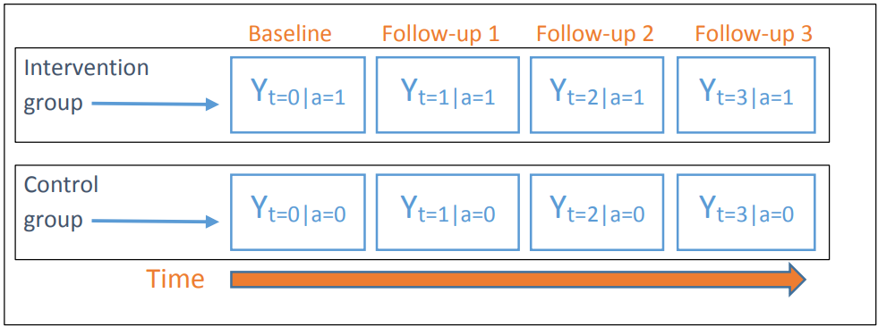
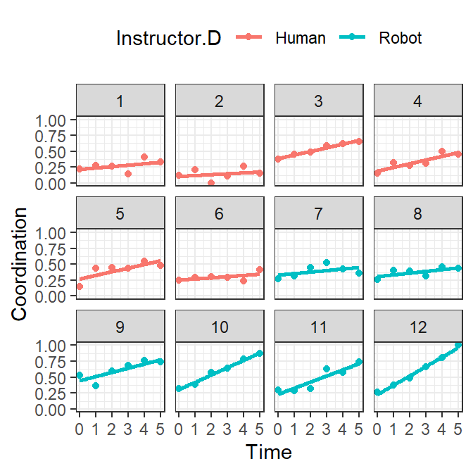
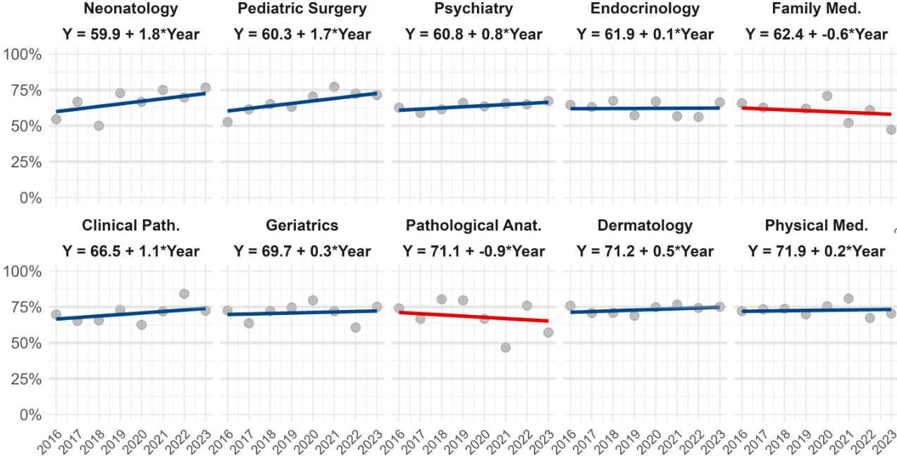
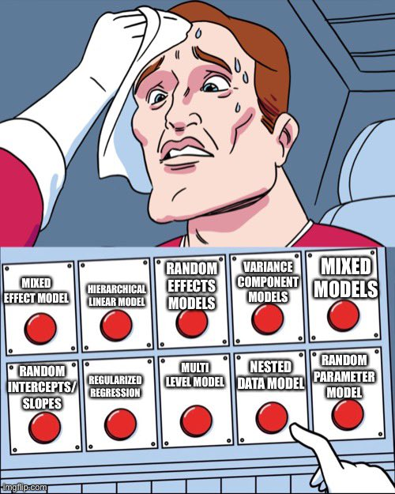

```{r echo = FALSE}

setwd("C:/Users/danfe/Dropbox/Proyectos Daniel/Cursos - diplomados - Maestrias/Programa de autoformación en investigación y análisis de datos/Talleres/Taller 4 Análisis de datos longitudinales")

knitr::opts_chunk$set(echo = TRUE, warning = FALSE, message = FALSE)
```

### **¿En qué situaciones veremos datos longitudinales?**

1.  ECA con multiples seguimientos para el desenlace.

```{r, echo=FALSE, fig.cap=" "}

```

```{r, echo=FALSE, fig.cap=" "}

```

2.  Datos de panel (datos poblacionales, ecologicos)

```{r, echo=FALSE, fig.cap=" "}

```

### ¿Como analizarlos?

El análisis de datos longitudinales incluye a los modelos lineales de efectos mixtos y los modelos marginales (GEE).

## Modelos de efectos mixtos

Los modelos de efectos mixtos son opciones populares para modelar mediciones repetidas, como datos longitudinales o agrupados. Algunos ejemplos de datos longitudinales incluyen mediciones de presión arterial tomadas a lo largo del tiempo de las mismas personas y recuento de CD4 a lo largo del tiempo de las mismas personas. Algunos ejemplos de datos agrupados incluyen estudiantes dentro de escuelas y pacientes dentro de hospitales. Hay dos componentes en un modelo de efectos mixtos: efectos fijos y efectos aleatorios:

-   Los efectos fijos se refieren a tendencias generales que son aplicables a todas las materias/grupos. Esto implica que podríamos querer investigar cómo se desempeñan los estudiantes (en promedio) en diferentes materias, como matemáticas e historia. Estos efectos se observan comúnmente, es decir, son fijos, en todas las escuelas.

-   Los efectos aleatorios capturan las características únicas de cada asignatura o grupo de asignaturas que las diferencian entre sí. Por ejemplo, algunas escuelas pueden tener mejores recursos, profesores más experimentados o un entorno de aprendizaje más propicio. Estas diferencias son específicas de cada escuela y utilizamos efectos aleatorios para capturarlas.

```{r, echo=FALSE, fig.cap=" "}

```

```{r}
# packages
library(pacman)
p_load(kableExtra)
p_load(Matrix)
p_load(jtools)
p_load(HSAUR2)
p_load(tidyverse)
p_load(dplyr)
```

::: callout-caution
### Importante

-   Los modelos lineales de efectos mixtos se basan en la idea de que la correlación de las respuestas de un individuo depende de algunas características individuales no observadas.

-   En los modelos lineales de efectos mixtos, tratamos estas características no observadas como efectos aleatorios en nuestro modelo. Si pudiéramos condicionar los efectos aleatorios, entonces se podría suponer que las mediciones repetidas son independientes.
:::

#### Datos

Vamos a utilizar el conjunto de datos `BtheB,`del paquete `HSAUR2` para explicar el modelo lineal de efectos mixtos:

```{r}
library(HSAUR2)

data("BtheB")

kable(head(BtheB, 10))%>%
  kable_styling(bootstrap_options = "striped", full_width = F, 
                position = "center")
```

-   Una forma típica de datos de medición repetida a partir de datos de un ensayo clínico.

-   Los individuos se asignan a diferentes tratamientos y luego se toma la respuesta del Inventario de Depresión de Beck II al inicio, a los 2, 3, 5 y 8 meses.

```{r}
## Box-plot 
data("BtheB", package = "HSAUR2")

layout(matrix(1:2, nrow = 1))

ylim <- range(BtheB[,grep("bdi", names(BtheB))],na.rm = TRUE)
tau <- subset(BtheB, treatment == "TAU")[, grep("bdi", names(BtheB))]
boxplot(tau, main = "Treated as Usual", ylab = "BDI",
        xlab = "Time (in months)", 
        names = c(0, 2, 3, 5, 8),ylim = ylim)
btheb <- subset(BtheB, treatment == "BtheB")[, grep("bdi", names(BtheB))]
boxplot(btheb, main = "Beat the Blues", ylab = "BDI",
        xlab = "Time (in months)", 
        names = c(0, 2, 3, 5, 8),ylim = ylim)
```

-   Los diagramas de caja en paralelo muestran las distribuciones de BDI a lo largo del tiempo entre los grupos de control (tratamiento habitual) y de intervención (superación de la tristeza).

-   A medida que pasa el tiempo, las caídas en el BDI son más evidentes en la intervención, lo que puede indicar que la intervención es efectiva.

#### Modelo regular con intersección y pendiente fijas

Para comparar, comenzamos con el modelo lineal de efectos fijos, es decir, un modelo lineal regular sin ningún efecto aleatorio:

```{r}
## Para analizar los datos, primero tenemos que convertir el conjunto de datos a un formato listo para el análisis
BtheB$subject <- factor(rownames(BtheB))
nobs <- nrow(BtheB)

BtheB_long <- reshape(BtheB, idvar = "subject", 
                      varying = c("bdi.2m", "bdi.3m", "bdi.5m", 
                                  "bdi.8m"), 
                      direction = "long")

BtheB_long$time <- rep(c(2, 3, 5, 8), rep(nobs, 4))

kable(subset(BtheB_long,  subject == 2))%>%
  kable_styling(bootstrap_options = "striped", full_width = F, 
                position = "left")

kable(head( BtheB_long %>% arrange(desc(subject)), 15)) %>%
  kable_styling(bootstrap_options = "striped", full_width = FALSE, 
                position = "left")
```

```{r}
lmfit <- lm(bdi ~ bdi.pre + time + treatment + drug +length, 
            data = BtheB_long, na.action = na.omit)

summ(lmfit, confint = T, digits = 3)
```

::: callout-note
### Interpretación ingenua :D

En la población de estudio, la intervención "Beat the Blues" se asoció con un reducción en promedio de 3.32 puntos en la escala de depresión, este resultado fue estadísticamente significativo.
:::

#### Intersección aleatoria pero pendiente fija

Comencemos con un modelo con un punto de corte aleatorio pero una pendiente fija. En este caso, la línea de regresión resultante para cada individuo es paralela (para una pendiente fija) pero tiene puntos de corte diferentes (para un punto de corte aleatorio).

```{r}
## Fit a random intercept model with lme4 package
library(lme4)
BtheB_lmer1 <- lmer(bdi ~ bdi.pre + time + treatment + drug +length + (1 | subject),
                    data = BtheB_long, 
                    REML = FALSE, na.action = na.omit)

summary(BtheB_lmer1)

summ(BtheB_lmer1, confint = T, digits = 3)
```

::: callout-note
### Interpretación con defectos :D

En la población de estudio, la intervención "Beat the Blues" se asoció con un reducción en promedio de 2.34 puntos en la escala de depresión en cada sujeto, este resultado no fue estadísticamente significativo.
:::

::: callout-tip
### Importante

-   AIC, BIC y -loglik, etc., son estadísticas de bondad de ajuste que indican qué tan bien se ajusta el modelo a los datos. Dado que no existe un estándar que indique qué valores de estas estadísticas son buenos, sin comparación con otros modelos, tienen poca información que ofrecer.

-   Efectos fijos: este es el resultado estándar que tendremos en cualquier modelo de efectos fijos. La interpretación de los coeficientes estimados será similar a la de un modelo lineal regular.

-   Puede comparar los resultados con el modelo lineal regular y entonces encontrará que **lm** tiende a **subestimar** el SE para los coeficientes estimados.
:::

```{r}
library(ggplot2)
BtheB_longna <- na.omit(BtheB_long)
dat <- data.frame(time=BtheB_longna$time,pred=fitted(BtheB_lmer1),
                  Subject= BtheB_longna$subject)
ggplot(data=dat,aes(x=time, y=pred, group=Subject, 
                    color=Subject)) + theme_classic() +
    geom_line() 
```

Como podemos ver, para cada individuo tenemos diferentes intersecciones, pero la pendiente a lo largo del tiempo de seguimiento es la misma. A continuación, ajustaremos el modelo con intersección aleatoria y pendiente aleatoria.

#### Intersección aleatoria y pendiente aleatoria

En los códigos siguientes, ajustamos un modelo de efectos mixtos con intersección aleatoria y pendiente aleatoria:

```{r}
## Podemos ajustar un modelo de pendiente e intercepto aleatorio utilizando el paquete lme4 y tratar la variable tiempo como pendiente aleatoria. 
library("lme4")
BtheB_lmer2 <- lmer(bdi ~ bdi.pre + time + treatment + drug +length + 
                   (time | subject), data = BtheB_long, REML = FALSE, 
                   na.action = na.omit)

summ(BtheB_lmer2, confint = T, digits = 3)
```

La interpretación de los resultados del modelo será similar a la del modelo con solo intersecciones aleatorias. Grafiquemos los datos:

```{r}
library(ggplot2)
BtheB_longna <- na.omit(BtheB_long)
dat <- data.frame(time=BtheB_longna$time,pred=fitted(BtheB_lmer2),
                  Subject= BtheB_longna$subject)
ggplot(data=dat,aes(x=time, y=pred, group=Subject, color=Subject)) + 
  theme_classic() +
    geom_line() 
```

De la figura podemos ver que tenemos diferentes intersecciones y diferentes pendientes a lo largo del tiempo de seguimiento para cada individuo.

#### Elección entre modelos

Una pregunta común es si debo agregar una pendiente aleatoria a nuestro modelo o si una intersección aleatoria es suficiente. Tal vez queramos comparar los modelos en términos de AIC y BIC. Los valores más pequeños indican un mejor modelo.

-   **Generalmente, lm** no se considerará un competidor de **lme,** ya que básicamente se aplican a diferentes tipos de datos.

-   Al elegir entre una intersección aleatoria y una pendiente aleatoria, una solución rápida es ajustar todos los modelos posibles y luego realizar pruebas de razón de verosimilitud.

-   Por ejemplo, no estoy seguro de si debería utilizar solo la intersección aleatoria o la intersección aleatoria más la pendiente aleatoria. Podría ajustar ambos modelos y luego realizar una prueba de razón de verosimilitud:

```{r}
anova(BtheB_lmer1, BtheB_lmer2)

```

El valor p no significativo muestra que el segundo modelo no es estadísticamente diferente del primer modelo. Por lo tanto, añadir una pendiente aleatoria no es necesario

### Predicción de efectos aleatorios

Si ha observado que en la salida R del modelo lineal de efectos mixtos, los efectos aleatorios no se estiman en el modelo.

-   Podríamos utilizar el modelo ajustado para predecir efectos aleatorios.

-   Además, los efectos aleatorios previstos se pueden utilizar para examinar las suposiciones que tenemos para el modelo lineal de efectos mixtos.

La función **ranef** se utiliza para predecir el efecto aleatorio en R

```{r}
qint <- ranef(BtheB_lmer1)$subject[["(Intercept)"]]
qint
```

### Verificar supuestos

Recuerda que tenemos dos supuestos en el modelo lineal de efectos mixtos con intersección aleatoria:

-   El término de error sigue una distribución normal

-   beta para el sujeto i sigue una distribución normal

Hemos predicho los valores del efecto aleatorio y hemos podido extraer los residuos del modelo ajustado. Por lo tanto, podemos utilizar el gráfico QQ para comprobar su normalidad.

```{r}
# Assumption 1
qres <- residuals(BtheB_lmer1)
qqnorm(qres, xlim = c(-3, 3), ylim = c(-20, 20), 
       ylab = "Estimated residuals",
       main = "Residuals")
qqline(qres)
```

```{r}

# Assumption 2
qint <- ranef(BtheB_lmer1)$subject[["(Intercept)"]]
qqnorm(qint, ylab = "Estimated random intercepts", 
       xlim = c(-3, 3), ylim = c(-20, 20),
       main = "Random intercepts")
qqline(qint)
```

Como los puntos están casi en las líneas, podemos decir que se cumple el supuesto de normalidad.

#### Modelo regular considerando solo medición final

Solo como demostración veamos el modelo donde no se hubiera tenido mediciones multiples y solo se midió el desenlace a los 8 meses

```{r}

lmfit0 <- lm(bdi.8m ~   treatment + drug +length,              
             data = BtheB, na.action = na.omit) 

require(jtools)
summ(lmfit0, confint = T, digits = 3)
```

# GEE

Las ecuaciones de estimación generalizadas, o GEE, son un método para modelar datos longitudinales o agrupados. Se utilizan habitualmente con datos no normales, como datos binarios o de recuento. El nombre hace referencia a un conjunto de ecuaciones que se resuelven para obtener estimaciones de parámetros (es decir, coeficientes del modelo). 

A menudo modelamos datos longitudinales o agrupados con modelos de efectos mixtos o multinivel. ¿En qué se diferencia el GEE?

1.  La principal diferencia es que se trata de un *modelo marginal* . Busca modelar un promedio de población. Los modelos de efectos mixtos/multinivel son modelos *específicos de sujeto* o *condicionales* . Nos permiten estimar diferentes parámetros para cada sujeto o conglomerado. En otras palabras, las estimaciones de los parámetros son *condicionales* al sujeto o conglomerado. Esto, a su vez, proporciona información sobre la variabilidad entre sujetos o conglomerados. También podemos obtener un modelo a nivel de población a partir de un modelo de efectos mixtos, pero es básicamente un promedio de los modelos específicos de sujeto.

2.  El modelo GEE está pensado para agrupaciones simples o medidas repetidas. No puede adaptarse fácilmente a diseños más complejos, como grupos anidados o cruzados; por ejemplo, medidas repetidas anidadas dentro de un sujeto o grupo. Esto es más adecuado para un modelo de efectos mixtos.

3.  Los cálculos de GEE suelen ser más sencillos que los cálculos de modelos de efectos mixtos. GEE no utiliza los métodos de probabilidad que emplean los modelos de efectos mixtos, lo que significa que GEE a veces puede estimar modelos más complejos.

4.  Debido a que GEE no utiliza métodos de probabilidad, el “modelo” estimado es incompleto y no es adecuado para la simulación.

5.  GEE nos permite especificar una estructura de correlación para diferentes respuestas dentro de un sujeto o grupo. Por ejemplo, podemos especificar que la correlación de las mediciones tomadas más cerca unas de otras sea mayor que la de las tomadas más lejos. Esto no es algo que actualmente sea posible en el popular paquete lme4.

::: callout-tip
### Nota

-   El modelo GEE es un modelo promediado por población (por ejemplo, marginal), mientras que los modelos de efectos mixtos son específicos de cada sujeto o grupo. Por ejemplo, podemos utilizar el modelo GEE cuando nos interesa explorar el efecto promedio de la población. Por otro lado, cuando nos interesan los efectos específicos de cada individuo o grupo, podemos utilizar los modelos de efectos mixtos.

-   Además, a diferencia de los modelos de efectos mixtos donde asumimos un término de error y coeficientes beta para el sujetoiAmbos siguen una distribución normal, la distribución GEE es libre. Sin embargo, en GEE, asumimos algunas estructuras de correlación dentro de los sujetos/grupos. Por lo tanto, podemos usar GEE para datos no normales, como datos sesgados, datos binarios o datos de recuento.
:::

```{r}
#  packages

require(HSAUR2)
library(gee)
library(MuMIn)
library(geepack)
library("lme4")
require(afex)
```

### Descripción de datos

Además del conjunto de datos BtheB en la parte 1, utilizamos datos respiratorios del paquete **HSAUR2** para demostrar el análisis con respuestas no normales:

-   La variable de respuesta en este conjunto de datos es **el estado** (el estado respiratorio), que es una respuesta binaria.

-   Otras covariables son: tratamiento, edad, género, centro de estudio.

-   La respuesta se ha medido a los 0, 1, 2, 3 y 4 meses para cada sujeto.

```{r}
data("respiratory", package = "HSAUR2")
kable(head(respiratory,20))
```

### Métodos para distribuciones no normales

-   Además de las variables de respuesta distribuidas normalmente, la variable de respuesta también puede seguir distribuciones no normales, como respuestas binarias o de conteo.

-   Hemos aprendido regresión logística o regresión de Poisson (glm) para analizar datos binarios y de conteo, pero no están considerando la estructura de “medición repetida”.

-   La consecuencia de ignorar la estructura de mediciones longitudinales/repetidas es tener errores estándar estimados incorrectos para los coeficientes de regresión. Por lo tanto, nuestra inferencia no será válida. Sin embargo, el glm aún brinda coeficientes beta estimados consistentes.

-   Existen muchas estructuras de correlación en el modelado de GEE.

-   En el caso de respuestas no normales, diferentes suposiciones sobre estas estructuras de correlación pueden llevar a diferentes interpretaciones de los coeficientes beta. Aquí, presentaremos dos modelos GEE diferentes: **el modelo marginal** y **el modelo condicional** .

### Modelos marginales

Las mediciones repetidas y los datos longitudinales tienen respuestas tomadas en diferentes puntos temporales. Por lo tanto, podríamos simplemente revisarlos como muchas series de datos transversales. Cada dato transversal puede analizarse utilizando el glm presentado en lecciones anteriores. Luego, se puede suponer una estructura de correlación para conectar diferentes "secciones transversales". Las estructuras de correlación comunes son:

#### Una estructura independiente

Una estructura independiente que supone que las medidas repetidas son independientes. Un ejemplo de estructura independiente es básicamente una matriz identidad:

$$
\left(\begin{array}{ccc} 
1 & 0 & 0\\ 0 & 1 & 0\\0 & 0 & 1
\end{array}\right)
$$

#### Una correlación intercambiable

Una correlación intercambiable supone que para cada individuo, la correlación entre cada par de medidas repetidas es la misma, es decir, $Cor(Y_{ij},Y_{ik})=\rho$. En la matriz de correlación, sólo $\rho$ es desconocido. Por lo tanto, es una matriz de correlación de trabajo de un solo parámetro. Un ejemplo de matriz de correlación intercambiable es:

$$
\left(\begin{array}{ccc} 
1 & \rho & \rho\\ 
\rho & 1 & \rho\\
\rho & \rho & 1
\end{array}\right)
$$

#### Una correlación autorregresiva AR-1

Definido como $Cor(Y_{ij},Y_{ik})=\rho^{|k-j|}$. Si se toman dos mediciones en dos puntos temporales más cercanos, la correlación es mayor que si se toman en dos puntos temporales más alejados. También es una matriz de correlación de trabajo de un solo parámetro. Un ejemplo de matriz de correlación AR-1 es:

$$
\left(\begin{array}{ccc} 
1 & \rho & \rho^2\\ 
\rho & 1 & \rho\\
\rho^2 & \rho & 1
\end{array}\right)
$$

#### Una correlación no estructurada

Diferentes pares de observación para cada individuo tienen diferentes correlaciones $Cor(Y_{ij},Y_{ik})=\rho_{jk}$. Supongamos que cada individuo tiene $K$ pares de mediciones, es una matriz de correlación de trabajo de $K(K-1)/2$ parámetros. Un ejemplo de matriz de correlación no estructurada es:

$$
\left(\begin{array}{ccc} 
1 & \rho_{12} & \rho_{13}\\ 
\rho_{12} & 1 & \rho_{23}\\
\rho_{13} & \rho_{23} & 1
\end{array}\right)
$$

-   A veces, especificar una matriz de correlación “correcta” es difícil. Sin embargo, el modelo marginal (normalmente utilizamos GEE) nos proporciona coeficientes estimados consistentes incluso con una estructura de correlación mal especificada.

### Modelos condicionales

-   En los modelos marginales de GEE, los coeficientes de regresión estimados son efectos marginales (o promediados por la población). Por lo tanto, la interpretación se realiza a nivel de población. Es casi imposible hacer inferencias sobre cualquier individuo o grupo específico.

-   Una solución es elaborar modelos condicionales. El enfoque de efectos aleatorios de la parte 1 se puede extender a la respuesta no gaussiana.

### Modelos GEE

Después de la breve introducción de dos modelos, echemos un vistazo a ejemplos reales.

#### Desenlace binario

Utilizaremos el conjunto de datos **respiratory**:

```{r}
library(gee)
data("respiratory", package = "HSAUR2")

## Data manipulation
resp <- subset(respiratory, month > "0")
resp$baseline <- rep(subset(respiratory, month == "0")$status, rep(4, 111))

## Change the response to 0 and 1
resp$nstat <- as.numeric(resp$status == "good")
resp$month <- resp$month[, drop = TRUE]
```

```{r}
kable(head(resp[30:40,], 20))
```

Ahora ajustaremos un modelo glm regular, es decir, un modelo sin efectos aleatorios ni estructuras de correlación. Para los resultados binarios, los coeficientes estimados son probabilidades logarítmicas.

```{r}
## Regular GLM 
resp_glm <- glm(status ~ centre + treatment + gender + baseline+ age, 
                data = resp, family = "binomial")

summ(resp_glm, digits = 3, confint = T, exp = T)
```

Ahora ajustaremos GEE con estructura de correlación independiente:

```{r}
library(gtsummary)

## GEE with identity matrix
resp_gee.in <- gee(nstat ~ centre + treatment + gender + baseline + age, 
                 data = resp, family = "binomial", 
                 id = subject, 
                 corstr = "independence", # "independence", "fixed", "stat_M_dep",
                                          #"non_stat_M_dep", "exchangeable", 
                                          # "AR-M" and "unstructured"
                 scale.fix = TRUE, scale.value = 1)

summary(resp_gee.in)

```

-   Este modelo supone una estructura de correlación independiente, la salida será igual a glm.

-   Los resultados partieron de un resumen de residuos.

-   Los coeficientes estimados son los mismos que los del modelo generalizado. En el caso de los resultados binarios, se pueden interpretar como probabilidades logarítmicas. El error estándar ingenuo y el valor z se estiman directamente a partir de este modelo. El error estándar robusto y el valor z son estimaciones tipo sándwich.

-   La diferencia entre ingenuo y robusto indica que la estructura de correlación puede no ser buena.

-   La correlación de trabajo es la estructura de correlación estimada a partir de los datos (matriz de identidad para la independencia).

Ajustemos el modelo GEE con estructura de correlación intercambiable:

```{r}
## GEE with exchangeable matrix
resp_gee.ex <- gee(nstat ~ centre + treatment + gender + baseline+ age, 
                 data = resp, family = "binomial", 
                 id = subject, corstr = "exchangeable", 
                 scale.fix = TRUE, scale.value = 1)

summary(resp_gee.ex)

```

-   Este modelo supone una estructura de correlación intercambiable.

-   Los resultados partieron de un resumen de residuos.

-   Los coeficientes estimados son el mismo GLM. Para el resultado binario, aún puede interpretarlos como probabilidades logarítmicas. El error estándar ingenuo y el valor z se estiman directamente a partir de este modelo. El error estándar robusto y el valor z son estimaciones tipo sándwich

-   La diferencia entre ingenuo y robusto es menor, lo que indica que la estructura de correlación está mejor especificada.

-   La correlación de trabajo es la estructura de correlación estimada a partir de los datos.

Verifiquemos los coeficientes estimados de los tres modelos.

```{r}
summary(resp_glm)$coefficients

```

```{r}
summary(resp_gee.in)$coefficients

```

```{r}
summary(resp_gee.ex)$coefficients

```

El modelo GEE con matriz de identidad es igual que el modelo GLM. Si cambiamos la estructura de correlación a intercambiable, no cambia las estimaciones beta, pero los EE ingenuos están más cerca del EE robusto, lo que indica que la estructura de correlación intercambiable es un mejor reflejo de las estructuras de correlación.

Extraer la medida de efecto e IC95%

```{r}
library(gtsummary)
tbl_regression(resp_glm, exp=T,
               pvalue_fun = function(x) style_pvalue(x, digits = 3))

tbl_regression(resp_gee.in, exp=T ,
               pvalue_fun = function(x) style_pvalue(x, digits = 3))

tbl_regression(resp_gee.ex, exp=T,
               pvalue_fun = function(x) style_pvalue(x, digits = 3))

```

#### Respuesta gaussiana

La GEE también se puede aplicar a la respuesta gaussiana

```{r}
library(gee)
library(HSAUR2)
BtheB$subject <- factor(rownames(BtheB))
nobs <- nrow(BtheB)

BtheB_long <- reshape(BtheB, idvar = "subject", 
                      varying = c("bdi.2m", "bdi.3m", "bdi.5m", "bdi.8m"), 
                      direction = "long")

BtheB_long$time <- rep(c(2, 3, 5, 8), rep(nobs, 4))
osub <- order(as.integer(BtheB_long$subject))
BtheB_long <- BtheB_long[osub,]

btb_gee.ind <- gee(bdi ~ bdi.pre + treatment + length + drug, 
               data = BtheB_long, id = subject, 
               family = gaussian, corstr = "independence")


summary(btb_gee.ind)
```

-   Este modelo supone una estructura de correlación independiente.

-   Los resultados partieron de un resumen de residuos.

-   El coeficiente estimado se interpretará de la misma manera que el modelo lineal. El SE ingenuo y el valor z se estiman directamente a partir de este modelo. El SE robusto y el valor z son estimaciones tipo sándwich

-   La correlación de trabajo es la estructura de correlación estimada a partir de los datos (matriz de identidad para la independencia).

Con matriz de correlación intercambiable:

```{r}
btb_gee.ex <- gee(bdi ~ bdi.pre + treatment + length + drug,
                data = BtheB_long, id = subject, 
                family = gaussian, corstr = "exchangeable")

summary(btb_gee.ex)
```

-   La interpretación de los coeficientes estimados es similar a la del modelo lineal. El SE ingenuo y el valor z se estiman directamente a partir de este modelo. El SE robusto y el valor z son estimaciones tipo sándwich.

-   La correlación de trabajo es la estructura de correlación estimada a partir de los datos.

-   Cuando cambiamos la estructura de correlación, las estimaciones y el error estándar ingenuo y z cambian. Un error estándar ingenuo más cercano al error estándar robusto indica que la estructura de correlación está mejor especificada.

### Comparar con efectos aleatorios

Comparemos los modelos GEE con los modelos de efectos mixtos.

```{r}
## Generalized mixed effect model model
library("lme4")
resp_lmer <- glmer(nstat ~ baseline + month + treatment + 
                   gender + age + centre + 
                    (1 | subject), family = binomial(), 
                  data = resp)

require(afex)
resp_afex <- mixed(nstat ~ baseline + month + treatment + 
                   gender + age + centre + 
                    (1 | subject), family = binomial(), 
                  data = resp, method = "LRT")
```

```{r}
## GEE model
resp_gee3 <- gee(nstat ~ baseline + month + treatment + 
                   gender + age + centre, 
                 data = resp, family = "binomial", 
                 id = subject, corstr = "exchangeable", 
                 scale.fix = TRUE, scale.value = 1)

library(MuMIn)
library(geepack)
resp_gee4 <- geeglm(nstat ~ baseline + month + treatment + 
                   gender + age + centre, 
                 data = resp, family = "binomial", 
                 id = subject, corstr = "exchangeable", 
                 scale.fix = TRUE)
resp_gee5 <- geeglm(nstat ~ baseline + month + treatment + 
                   gender + age + centre, 
                 data = resp, family = "binomial", 
                 id = subject, corstr = "independence", 
                 scale.fix = TRUE)
resp_gee6 <- geeglm(nstat ~ baseline + month + treatment + 
                   gender + age + centre, 
                 data = resp, family = "binomial", 
                 id = subject, corstr = "ar1", 
                 scale.fix = TRUE)
QIC(resp_gee4)
QIC(resp_gee5)
QIC(resp_gee6)
```

```{r}
resp_gee4a <- geeglm(nstat ~ month + treatment + gender + age + centre, 
                 data = resp, family = "binomial", 
                 id = subject, corstr = "exchangeable", 
                 scale.fix = TRUE)

resp_gee4b <- geeglm(nstat ~ treatment + gender + age + centre, 
                 data = resp, family = "binomial", 
                 id = subject, corstr = "exchangeable", 
                 scale.fix = TRUE)

resp_gee4c <- geeglm(nstat ~ gender + age + centre, 
                 data = resp, family = "binomial", 
                 id = subject, corstr = "exchangeable", 
                 scale.fix = TRUE)

resp_gee4d <- geeglm(nstat ~ age + centre, 
                 data = resp, family = "binomial", 
                 id = subject, corstr = "exchangeable", 
                 scale.fix = TRUE)

resp_gee4e <- geeglm(nstat ~ centre, 
                 data = resp, family = "binomial", 
                 id = subject, corstr = "exchangeable", 
                 scale.fix = TRUE)
QIC(resp_gee4)
QIC(resp_gee4a)[2]
QIC(resp_gee4b)[2]
QIC(resp_gee4c)[2]
QIC(resp_gee4d)[2]
QIC(resp_gee4e)[2]
# Covariates are selected based on the QICu criteria

```

```{r}
## compare estimates (conditional vs. marginal)
summary(resp_lmer)$coefficients # Model failed to converge
summary(resp_afex)$coefficients # Model failed to converge
summary(resp_gee3)$coefficients # Marginalized model
summary(resp_gee4)$coefficients # Marginalized model

```

La significancia de las variables es similar en ambas variables, pero los coeficientes estimados son mayores en el modelo de efectos mixtos generalizados. Sin embargo, esto no significa que los coeficientes estimados sean inconsistentes. En cambio, los dos modelos están estimando parámetros diferentes. Recuerde que el modelo de efectos mixtos está condicionado a los efectos aleatorios, mientras que el GEE es un modelo marginalizado.

# Caso de la vida real 1 :D

En cada momento, la respuesta de depresión del sujeto fue un “1”, que en este caso significa “Normal”. Una respuesta de 0 significa “Anormal”

```{r}
URL <- "http://static.lib.virginia.edu/statlab/materials/data/depression.csv"
dat <- read.csv(URL, stringsAsFactors = TRUE)
dat$id <- factor(dat$id)
dat$drug <- relevel(dat$drug, ref = "standard")

kable(head(dat[889:1000,], 10))%>%
  kable_styling(bootstrap_options = "striped", full_width = F, 
                position = "center")

```

En total tenemos datos sobre 340 temas.

```{r}
length(unique(dat$id))

```

Tabla descriptiva de las caracteristicas basales (ver si la aleatorización funcionó)

```{r}
tbl_summary(data = dat %>% filter(time==0) %>% select(1,2,5))

tbl_summary(data = dat %>% filter(time==0) %>% select(1,2,5),
            by=drug, percent = "row") %>% 
  add_p(pvalue_fun = function(x) style_pvalue(x, digits = 3))

```

Ahora, usemos GEE para estimar un modelo marginal para el efecto de `diagnosis`, `drug`y `time`en la `depression`respuesta. También permitiremos una interacción para `drug`y `time`. (Esto significa que estamos permitiendo que la trayectoria de la respuesta varíe dependiendo de `drug`). Usaremos la `gee()`función en el paquete gee para llevar a cabo el modelado. 

```{r}
dep_gee <- gee(depression ~ diagnose + drug*time,
               data = dat, 
               id = id, 
               family = binomial,
               corstr = "independence")

summary(dep_gee)

tbl_regression(dep_gee, exp=T,
               pvalue_fun = function(x) style_pvalue(x, digits = 3))

```

El coeficiente de tiempo es 0,48. Si exponenciamos, obtenemos un odds ratio de 1,62. Esto indica que las probabilidades de responder como "Normal" al medicamento estándar aumentan aproximadamente un 62% por cada unidad de aumento en el tiempo. El `drugnew:time`coeficiente es 1,02. Lo sumamos al `time`coeficiente para obtener el efecto del tiempo para el nuevo medicamento: 0,48 + 1,02 = 1,5. La exponenciación nos da aproximadamente 4,5. Esto indica que las probabilidades de responder como "Normal" al nuevo medicamento aumentan 4,5 veces por cada unidad de aumento en el tiempo. Nos sentimos bastante confiados en la dirección de estos efectos dado que los coeficientes son mucho mayores que sus errores estándar asociados.

ablando de errores estándar, observe que tenemos dos de ellos: "Ingenuo" y "Robusto". Casi siempre querremos usar las estimaciones "Robustas" porque las varianzas de las estimaciones de coeficientes tienden a ser demasiado pequeñas cuando las respuestas dentro de los sujetos están correlacionadas (Bilder y Loughin, 2015). En este caso, no hay mucha diferencia entre las estimaciones ingenuas y robustas, lo que sugiere que el supuesto de independencia de la estructura de correlación parece realista.

Por último, el “Parámetro de escala estimado” se informa como 0,9854. A veces, se lo denomina *parámetro de dispersión* . Es similar a lo que se informa cuando se ejecuta `glm()`con `family = quasibinomial`para modelar la sobredispersión. Se calcula de forma predeterminada. Si no queremos calcularlo (es decir, establecerlo en 1), podemos establecer `scale.fix = TRUE`.

Ahora, probemos un modelo con una estructura de correlación intercambiable. Esto indica que todos los pares de respuestas dentro de un sujeto están igualmente correlacionados. Para ello, establecemos `corstr = "exchangeable"`.

```{r}
dep_gee2 <- gee(depression ~ diagnose + drug*time,
               data = dat, 
               id = id, 
               family = binomial,
               corstr = "exchangeable")

summary(dep_gee2)

tbl_regression(dep_gee2, exp=T,
               pvalue_fun = function(x) style_pvalue(x, digits = 3))

```

La matriz de “correlación de trabajo” muestra una estimación de -0,003433 como la correlación común entre pares de observaciones dentro de un sujeto. Esto es minúsculo y parece que podríamos salirnos con la nuestra tratando estos datos como 1020 observaciones independientes en lugar de 340 sujetos con 3 observaciones cada uno.

Otra posibilidad de correlación es una estructura autorregresiva. Esto permite que las correlaciones de las mediciones tomadas más cerca unas de otras sean mayores que las de las tomadas más lejos. La estructura autorregresiva más común es la AR-1. En nuestro caso, esto significaría que las mediciones 1 y 2 tienen una correlación de $\rho^1$ mientras que las medidas 1 y 3 tienen una correlación de $\rho^2$

```{r}
dep_gee3 <- gee(depression ~ diagnose + drug*time,
               data = dat, 
               id = id, 
               family = binomial,
               corstr = "AR-M", Mv = 1)

summary(dep_gee3)

tbl_regression(dep_gee3, exp=T,
               pvalue_fun = function(x) style_pvalue(x, digits = 3))

```

Otra estructura de correlación de interés es la matriz “no estructurada”. Esta permite que *todas* las correlaciones varíen libremente. Probablemente sea mejor evitar las matrices no estructuradas a menos que tenga razones sólidas para dudar de que una estructura más simple sea suficiente.

¿Cómo elegir qué estructura de correlación utilizar? La buena noticia es que las estimaciones de GEE son válidas incluso si se especifica incorrectamente la estructura de correlación (Agresti, 2002). Por supuesto, esto supone que el modelo es correcto, pero tampoco ningún modelo es exactamente correcto. Agresti sugiere utilizar la estructura intercambiable como punto de partida y luego comprobar cómo cambian las estimaciones de los coeficientes y los errores estándar con otras estructuras de correlación. Si los cambios son mínimos, se debe optar por la estructura de correlación más simple.

¿Cómo se compara el modelo GEE con la estructura de correlación intercambiable con un modelo generalizado de efectos mixtos? Ajustemos el modelo y comparemos los resultados. 

A continuación, permitimos que la intersección sea condicional al sujeto. Esto significa que obtendremos 340 modelos *específicos del sujeto* con diferentes intersecciones pero coeficientes idénticos para todo lo demás.

```{r}
# install.packages("lme4)
library(lme4) # version 1.1-31
dep_glmer <- glmer(depression ~ diagnose + drug*time + (1|id), 
               data = dat, family = binomial)

summ(dep_glmer, confint = T, digits = 3, exp=T)

```

Los coeficientes del modelo que se enumeran en “Efectos fijos:” son casi idénticos a los coeficientes GEE. En lugar de una matriz de correlación funcional, obtenemos una sección “Efectos aleatorios:” que resume la variabilidad entre sujetos. Técnicamente, asumimos que el efecto aleatorio de cada sujeto se extrae de una distribución normal con media 0 y cierta desviación estándar fija.

Para el modelo de efectos mixtos, podemos utilizar la `ggemmeans()`función del paquete ggeffects. La `ggemmeans()`función llama a la `emmeans()`función del paquete del mismo nombre. La `emmeans()`función calcula los efectos marginales y funciona tanto para modelos GEE como para modelos de efectos mixtos.

```{r}
# install.packages("ggeffects")
library(ggeffects) # version 1.2.0
plot(ggemmeans(dep_glmer, terms = c("time", "drug"), 
               condition = c(diagnose = "severe"))) + 
  ggplot2::ggtitle("GLMER Effect plot")
```

```{r}
library(emmeans) # version 1.8.4-1
emm_out <- emmeans(dep_gee2, specs = c("time", "drug"), 
        at = list(diagnose = "severe"), 
        cov.keep = "time", 
        regrid = "response") %>% 
  as.data.frame()


library(ggplot2) # version 3.4.1
ggplot(emm_out) +
  aes(x = time, y = prob, color = drug, fill = drug) +
  geom_line() +
  geom_ribbon(aes(ymin = asymp.LCL, ymax = asymp.UCL, 
                  color = NULL), alpha = 0.15) +
  scale_color_brewer(palette = "Set1") +
  scale_fill_brewer(palette = "Set1", guide = NULL) +
  scale_y_continuous(labels = scales::percent) +
  theme_ggeffects() +
  labs(title = "GEE Effect plot", y = "depression")
```

El gráfico GEE es prácticamente idéntico al `glmer`gráfico. Para este conjunto de datos en particular, no parece haber diferencia alguna en el modelo que usemos.

```{r}
library(geepack) # version 1.3.9
dep_gee4 <- geeglm(depression ~ diagnose + drug*time,
                   data = dat,
                   id = id,
                   family = binomial,
                   corstr = "exchangeable")
# create effect plot
plot(ggemmeans(dep_gee4, terms = c("time", "drug"),
               condition = c(diagnose = "severe"))) + 
  ggplot2::ggtitle("GEE Effect plot")
```

# Caso de la vida real 2 :D

Los niños con TEA suelen tener dificultades con las habilidades motoras y una coordinación interpersonal deficiente. Su capacidad reducida para coordinarse con las personas puede hacer que se queden fuera del juego con otros niños, lo que los aísla. Los esfuerzos anteriores para mejorar su coordinación interpersonal a menudo han fracasado porque los niños con TEA se sienten abrumados por la gente. Por lo tanto, las sesiones de entrenamiento a menudo fracasan. Sin embargo, los niños con TEA gravitan hacia la electrónica y se ha observado que están interesados ​​y cómodos con los robots. Srinivasan et al., (2015) plantearon la hipótesis de que los niños con TEA podrían coordinarse mejor con los robots porque a) a los niños con TEA les encantan los robots y b) los robots son menos amenazantes ya que transmiten menos información (no abruman al niño). Srinivasan et al., (2015) descubrieron que hacer que los niños "bailen" con robots bailarines mejoraba su capacidad de coordinación interpersonal.

Hoy examinaremos un estudio simulado de coordinación interpersonal en 12 niños con TEA. Cada niño se sometió a 6 sesiones de entrenamiento (incluida la sesión inicial en la que se les realizó una evaluación de TEA para ver en qué punto del espectro se encontraban; Chlebowski et al. 2010). Se les pidió a los niños que “bailaran” con un instructor y su padre en cada una de las 6 sesiones. En la última parte de la sesión se evaluó su grado de coordinación (de 0 a 1) con el nuevo instructor que estaba en la sala durante la sesión, pero no bailó. Para la mitad de los niños, el instructor era humano y para la otra mitad, un robot.

-   Al igual que con todos nuestros otros análisis, los datos están en formato largo (para Longitudinal puede verlos llamados datos de período a período)

    -   El tiempo está codificado para comenzar en 0 (línea de base o primera medición).

    -   Instructor (0,1): 0: Humano; 1: Robot

    -   Coordinación (0-1): Grado de coordinación (DV)

    -   TEA: Puntuación del espectro del TEA (posible covariable)

    -   [Descargar datos](https://www.alexanderdemos.org/Mixed/LongData1.csv)

```{r}
LongSim<-read.csv("LongData1.csv")

kable(head(LongSim, 20))%>%
  kable_styling(bootstrap_options = "striped", full_width = F, 
                position = "center")

```

### Codificación

-   Se deben tomar decisiones sobre cómo codificar *al instructor.*

    -   ¿Código ficticio o de efectos? Por hoy, solo vamos a codificar nuestro tratamiento con código ficticio.

```{r}
#Dummy
LongSim$Instructor.D<-factor(LongSim$Instructor,
                             levels = c(0,1),
                             labels = c("Human","Robot"))
```

-   Hay que tomar decisiones sobre cómo codificar *Time* . Cada decisión cambiará la forma en que interpretamos nuestro modelo. Lo codificaremos ahora para más adelante:

    -   Podemos dejar *el Tiempo* como está: comienza en 0 y progresa en las unidades de medida.

    -   Tiempo central *Tiempo* : Entonces hay 6 sesiones (0-5), por lo tanto el centro es 2,5: Entonces Sesión \# - 2,5

    -   (Nota: *sí, puedes marcar el tiempo con Zscore o con Zscore, pero NO el centro* )

```{r}
# Centered
LongSim$Time.C<-scale(LongSim$Time, scale=F, center=T)[,]
```

## Parcelas de espagueti

-   Los modelos longitudinales se evalúan mejor con gráficos de espagueti. Cuando se tiene una pequeña cantidad de sujetos, se pueden representar gráficamente como "facetas".

-   Graficaremos a cada persona en una faceta y agregaremos su modelo lineal para cada sujeto.

```{r  fig.height=5, fig.width=5}
# Make sure that subject is a factor
LongSim$Subject<-as.factor(LongSim$Subject)

Speg.1<-ggplot(data = LongSim, aes(x=Time,y=Coordination))+
  facet_wrap(~Subject)+
  geom_point(aes(color=Instructor.D))+
  geom_smooth(method='lm', se=FALSE,aes(color=Instructor.D))+
  xlab("Time")+ylab("Coordination")+
  theme_bw()+
  theme(legend.position = "top")
Speg.1
```

-   Si tienes demasiados sujetos, puedes representar gráficamente los resultados de esta manera

-   A la izquierda, puedes ajustar una regresión por sujeto, a la derecha trazas líneas en lugar de la pendiente.

```{r fig.height=7, fig.width=6}
theme_set(theme_bw(base_size = 12, base_family = ""))

Speg.2<-ggplot(data = LongSim, aes(x=Time,y=Coordination, group=Subject, color=Subject))+
  facet_wrap(~Instructor.D)+
  geom_point()+
  geom_smooth(method='lm', se=FALSE)+
  xlab("Time")+ylab("Coordination")+
  theme(legend.position = "none")


Speg.3<-ggplot(data = LongSim, aes(x=Time,y=Coordination, group=Subject, color=Subject))+
  facet_wrap(~Instructor.D)+
  geom_point()+
  geom_line()+
  xlab("Time")+ylab("Coordination")+
  theme(legend.position = "none")


library(patchwork)

Speg.2 / Speg.3
```

## Modelado para examinar la estructura aleatoria

-   El sujeto es la variable de Nivel 2 (al igual que en nuestros modelos mixtos de medidas repetidas)

-   Podemos demostrarlo a través de nuestro análisis ICC

### Modelo nulo con intercepto aleatorio

```{r}
Null<-lmer(Coordination ~ 1+(1|Subject), data=LongSim, REML=FALSE)
summ(Null)
```

```{r fig.height=7, fig.width=6}
theme_set(theme_bw(base_size = 12, base_family = ""))

LongSim$Null<-predict(Null, newdata=LongSim)

Speg.Null.1<-ggplot(data = LongSim)+
  facet_wrap(~Subject)+
  geom_point(aes(x=Time,y=Coordination,color=Instructor.D))+
  geom_line(aes(x=Time,y=Null, color=Instructor.D))+
  xlab("Time")+ylab("Coordination")+
  theme(legend.position = "top")


Speg.Null.2<-ggplot(data = LongSim)+
  facet_wrap(~Instructor.D)+
  geom_point(aes(x=Time,y=Coordination, group=Subject,color=Subject))+
  geom_line(aes(x=Time,y=Null,group=Subject,color=Subject))+
  xlab("Time")+ylab("Coordination")+
  theme(legend.position = "none")

Speg.Null.1 / Speg.Null.2
```

### Modelo nulo de pendientes e intersecciones aleatorias

-   Dejaremos que la intersección y el tiempo varíen en relación con cada sujeto: `(1+Time|Subject)`

    -   Tenga en cuenta que puede bloquear la correlación entre la pendiente/intersección como antes si la correlación es -1/1:`(1+Time||Subject)`

```{r}
RISlope<-lmer(Coordination ~ 1+(1+Time|Subject), data=LongSim, REML=FALSE)

summ(RISlope)
```

```{r fig.height=7, fig.width=6}
theme_set(theme_bw(base_size = 12, base_family = ""))

LongSim$RISlope<-predict(RISlope, newdata=LongSim)
Speg.R.I.Slope.1<-ggplot(data = LongSim)+
  facet_wrap(~Subject)+
  geom_point(aes(x=Time,y=Coordination, color=Instructor.D))+
  geom_line(aes(x=Time,y=RISlope, color=Instructor.D))+
  xlab("Time")+ylab("Coordination")+
  theme(legend.position = "top")


Speg.R.I.Slope.2<-ggplot(data = LongSim)+
  facet_wrap(~Instructor.D)+
  geom_point(aes(x=Time,y=Coordination, group=Subject,color=Subject))+
  geom_line(aes(x=Time,y=RISlope,group=Subject,color=Subject))+
  xlab("Time")+ylab("Coordination")+
  theme(legend.position = "none")

Speg.R.I.Slope.1 / Speg.R.I.Slope.2
```

### Modelo de pendientes aleatorias únicamente

-   Podría ser que no haya una intercepción aleatoria, por lo que puedes eliminarla (pero debes tener una razón)

-   Dejaremos que el tiempo varíe en relación a cada sujeto: `(0+Time|Subject)`

```{r}
RSlope<-lmer(Coordination ~ 1+(0+Time|Subject), data=LongSim, REML=FALSE)

summ(RSlope)
```

```{r fig.height=8, fig.width=5}
theme_set(theme_bw(base_size = 12, base_family = ""))

LongSim$RSlope<-predict(RSlope, newdata=LongSim)

Speg.R.Slope.1<-ggplot(data = LongSim)+
  facet_wrap(Instructor.D~Subject)+
  geom_point(aes(x=Time,y=Coordination, color=Instructor.D))+
  geom_line(aes(x=Time,y=RSlope, color=Instructor.D))+
  xlab("Time")+ylab("Coordination")+
  theme(legend.position = "top")


Speg.R.Slope.2<-ggplot(data = LongSim)+
  facet_wrap(~Instructor.D)+
  geom_point(aes(x=Time,y=Coordination, group=Subject,color=Subject))+
  geom_line(aes(x=Time,y=RSlope,group=Subject,color=Subject))+
  xlab("Time")+ylab("Coordination")+
  theme(legend.position = "none")

Speg.R.Slope.1 / Speg.R.Slope.2
```

```{r}
anova(RSlope, RISlope)

```

## Modelado de resultados

-   El objetivo anterior era comprender los efectos aleatorios. Esto es útil si desea comprender sus datos, pero cuando pase a la modelización para la publicación, deberá *configurar* sus efectos aleatorios y pasar a la prueba de efectos fijos.

-   La estructura más obvia para la mayoría de los datos longitudinales (de 2 niveles) es utilizar pendientes e intersecciones aleatorias (observe la correlación entre ellas).

-   Ahora también exploraremos los diferentes esquemas de codificación para comprender los modelos.

### Instructor codificado con tiempo no centrado y ficticio

-   Nota: debido a que el Instructor está codificado 0/1, también puede ingresarlo en el modelo en lugar de hacerlo como un factor (obtendrá la misma respuesta)

#### Efectos principales

```{r}
MainEffect.1<-lmer(Coordination ~ Time + Instructor.D+(1+Time|Subject), 
                   data=LongSim, REML=FALSE)
summ(MainEffect.1, digits=3, confint=T)
```

##### Interpretación

-   **Tiempo** : Después de cada sesión, los niños mejoran su coordinación *independientemente* de la instrucción (la estimación es la pendiente a lo largo de las sesiones)

-   **Instructor.DRobot** : t \< 1,96 (por lo tanto, no es significativo). Si hubiera sido significativo, significaría que los niños que tenían al robot como instructor tenían una coordinación general más alta \[ **promedio de todas las sesiones** \] (la estimación informada es la diferencia entre el humano y el robot)

#### Interacción

```{r}
Interaction.1<-lmer(Coordination ~ Time*Instructor.D+(1+Time|Subject), 
                    data=LongSim, REML=FALSE)
summ(Interaction.1, digits=3, confint=T)
```

##### Interpretación

-   **Tiempo** : pendiente sobre sesiones para niños que tuvieron el *instructor humano* .

-   **Instructor.DRobot** : Es la diferencia entre humano y robot cuando Tiempo = 0 \[ **Línea base** \].

    -   Para demostrar esto podemos ajustar el modelo y restar los valores ajustados: *Robot \@ Tiempo 0 - Humano \@ Tiempo 0*

<!-- -->

-   **Tiempo:Instructor.DRobot** : diferencia de pendiente a lo largo de las sesiones = pendiente \@ *instructor robot* - pendiente \@ *instructor humano*

```{r}
library(effects)
effect(c("Time*Instructor.D"),Interaction.1) 

library(ggeffects)
plot(ggemmeans(Interaction.1, terms = c("Time", "Instructor.D"))) + 
  ggplot2::ggtitle("GLMER Effect plot")
```

# Covariables fijas

-   Tuvimos una covariable: la puntuación del espectro autista de cada niño.

-   Podemos simplemente agregarlo a nuestro modelo si queremos controlarlo, pero realmente deberías centrarlo para que la intersección no cambie.

```{r}
LongSim$ASD.C<-scale(LongSim$ASD, scale=F, center=T)[,]

```

-   Puedes agregarlo a tu modelo como cualquier regresión.

```{r}
Cov1.Model<-lmer(Coordination ~ Time*Instructor.D+ASD.C
                +(1+Time|Subject), 
                data=LongSim, REML=FALSE)

summ(Cov1.Model, digits=3, confint=T)
```

```{r}
anova(Interaction.1,Cov1.Model)

```

-   Nuestra pendiente ya no es significativa, lo que significa que la covariable podría estar explicando parte de nuestra interacción en el nivel medio de la puntuación del TEA. Esto sugiere una interacción de tres vías.

```{r}
Cov2.Model<-lmer(Coordination ~ Time*Instructor.D*ASD.C
                +(1+Time|Subject), data=LongSim, REML=FALSE)

summ(Cov2.Model, digits=3, confint=T)
```

```{r}
anova(Cov1.Model,Cov2.Model)

```

-   La triple vía mejoró el ajuste del modelo.

-   **Tiempo:Instructor.DRobot** : es la diferencia de pendiente a lo largo de las sesiones = pendiente \@ *instructor robot* - pendiente \@ *instructor humano* \[\@ en el nivel promedio de TEA\]

-   **Tiempo:Instructor.DRobot:ASD.C** : es la diferencia de pendiente a lo largo de las sesiones = pendiente \@ *instructor robot* - pendiente \@ *instructor humano* \[como una función del puntaje ASD\]

    -   Por lo tanto, la diferencia de pendiente entre el robot y el instructor humano se hace mayor a medida que aumenta el nivel de TEA. Vea el gráfico a continuación para comprender esto:

## Parcela de 3 vías

### Grafiquemos para entender mejor

-   Lo graficaremos como cualquier otra interacción en una regresión que involucra dos variables continuas.

-   Necesitaremos encontrar 1 DE por encima/por debajo de la media de la covariable (que estaba centrada en la media)

```{r}
SDN1<- -sd(LongSim$ASD.C)
SDP1<- +sd(LongSim$ASD.C)

Fitted.Cov2<-effect(c("Time*Instructor.D*ASD.C"),Cov2.Model, 
                    xlevel=list(Time=seq(0,5,1),
                                ASD.C=c(SDN1,0,SDP1)))

library(ggeffects)
plot(ggemmeans(Cov2.Model, terms = c("Time", "Instructor.D", "ASD.C"))) + 
  ggplot2::ggtitle("GLMER Effect plot")+
  theme_bw()
```

## Prueba de interacciones simples

-   Si quieres saber si la interacción es significativa en cada nivel de puntuación de TEA, simplemente tienes que volver a centrar el TEA. Ya sabemos que el gráfico del medio era significativo. Vamos a observar los términos **de Time:Instructor.DRobot** a medida que cambiamos el punto central en TEA.C.

### Prueba -1 DE de TEA

-   Movemos el centro para que sea -1 SD sumando 1 SD

```{r}
LongSim$ASD.N1sd<-LongSim$ASD.C+sd(LongSim$ASD.C)

Cov2.Model.Simple.N1sd<-lmer(Coordination ~ Time*Instructor.D*ASD.N1sd
                +(1+Time|Subject), data=LongSim, REML=FALSE)

summ(Cov2.Model.Simple.N1sd, digits=3, confint=T)
```

-   **Tiempo:Instructor.DRobot** no es significativo. Por lo tanto, el panel izquierdo de nuestro gráfico no es una interacción.

### Prueba +1 DE de TEA

-   Movemos el centro a +1 SD restando 1 SD

```{r}
LongSim$ASD.P1sd<-LongSim$ASD.C-sd(LongSim$ASD.C)

Cov2.Model.Simple.P1sd<-lmer(Coordination ~ Time*Instructor.D*ASD.P1sd
                +(1+Time|Subject), data=LongSim, REML=FALSE)

summ(Cov2.Model.Simple.P1sd, digits=3, confint=T)
```

-   **Tiempo:Instructor.DRobot** es importante (como debe ser). Por lo tanto, el panel derecho de nuestro gráfico es una interacción.

-   En resumen, nuestra interacción bidireccional cambia en función de la puntuación del TEA.
