```{r echo = FALSE}

setwd("C:/Users/danfe/Dropbox/Proyectos Daniel/Cursos - diplomados - Maestrias/Programa de autoformación en investigación y análisis de datos/Talleres")

knitr::opts_chunk$set(echo = TRUE, warning = FALSE, message = FALSE)
```

# Análisis de series de tiempo

1.  Ejemplo una serie de tiempo de pasajeros.

2.  Ejemplo calentamiento global

3.  Ejemplo datos de avistamientos de tiburones en buceo

```{r}
#Cargar librerias
library(pacman)
p_load(xts)
p_load(aTSA)
p_load(ggplot2)
p_load(fable)
p_load(fpp2)
p_load(forecast)
p_load(tsibble)
p_load(tseries)
p_load(tsbox)
p_load(plyr)
p_load(reshape)
p_load(RCurl)

```

## Ejemplo 1: Serie de tiempo de pasajeros

```{r}

#cargar datos

data("AirPassengers")
#Primero se deben graficar los datos para ver posibles patrones
plot(AirPassengers, type="o", xlab="Tiempo", ylab="Valores", main="Pasajeros")

```

Graficar la autocorrelación

```{r}
acf(AirPassengers, lag=48, col = 2, xlab = "lag", ylab ="Valores de AC")
```

Autcorrelación parcial

```{r}
pacf(AirPassengers, lag=48, col = 2, xlab = "lag", ylab ="Valores de AC")
```

Como hay confirmación de tendencia se hace la diferencia (1 - lag)

```{r}
plot(diff(AirPassengers), xlab="Tiempo", ylab="Valores")

acf(diff(AirPassengers), lag=48, col = 2, xlab = "lag", ylab ="Valores de AC")

pacf(diff(AirPassengers), lag=48, col = 2, xlab = "lag", ylab ="Valores de AC")
```

Como la varianza va incremento en el tiempo se debe trasformar con logaritmos para buscar la homogeneidad de las varianzas

```{r}
plot(diff(log(AirPassengers)), xlab="Tiempo", ylab="Valores")

acf(diff(log(AirPassengers)), lag=48, col = 2, xlab = "lag", ylab ="Valores de AC")

pacf(diff(log(AirPassengers)), lag=48, col = 2, xlab = "lag", ylab ="Valores de AC")
```

Augmented Dickey-Fuller test para ver no estacionaridad

Devuelve la probabilidad de ser no estacionaria

-   Si es mayor que 0.05 la serie es no estacionaria (tiene tendencia)

-   Si es menor que 0.05 es estacionaria (No hay tendencia)

```{r}
adf.test(diff(log(AirPassengers)), alternative="stationary")

```

Ajuste automatico de los coeficientes

```{r}
ARIMAmodel <- auto.arima(log(AirPassengers))
ARIMAmodel
```


(p,d,q) parte regular

(P, D, Q) parte estacional

Al modelar datos con modelos ARIMA, a veces resulta útil representar gráficamente las raíces características inversas. Las siguientes funciones calcularán y representarán gráficamente las raíces inversas de cualquier modelo ARIMA ajustado (incluidos los modelos estacionales).

### Diagnóstico del modelo

```{r}
# Método 1

tsdiag(ARIMAmodel) # Demuestra que el modelo no presenta autocorrelación entre residuos

Box.test(ARIMAmodel$residuals, lag = 10, type = "Ljung-Box") # = ruido blanco

```

```{r}
# Método 2
checkresiduals(ARIMAmodel) # modelo con solo ruido blanco = adecuado para predicciones
```

### Observados vs esperados del modelo

```{r}

plot(ARIMAmodel$x, col="red")
lines(fitted(ARIMAmodel), col="blue")

ARIMAmodeldlog <- auto.arima(diff(log(AirPassengers)))
ARIMAmodeldlog
plot(ARIMAmodeldlog$x, col="red")
lines(fitted(ARIMAmodeldlog), col="blue")
```

### Predicción

```{r}
forecast(ARIMAmodeldlog, h = 12)
autoplot(forecast(ARIMAmodeldlog, h = 12))

autoplot(forecast(ARIMAmodel, h = 12))

airpass<- as.data.frame(forecast(ARIMAmodel, h = 12))

exp(airpass$`Point Forecast`)
```

## Ejemplo 2: Calentamiento global

```{r}
#Datos de temperatura mundial
URL<-url("https://crudata.uea.ac.uk/cru/data/temperature/HadCRUT5.0Analysis_gl.txt")

gtemp<- read.table(URL, fill=TRUE)
View(gtemp)
## Poner los nombres de las columnas
colnames(gtemp)<-c("Año", month.abb, "Anual")
View(gtemp)

##Esta hoja de datos tienen dos tipos de fila, una para anomalía y otra de temperatura
##Solo ocupamos el primer tipo, por lo cual es siguiente comando
##elimina el en una secuencia "[-seq" segundo tipo "(2,nrow(c)," cada 2 filas "by=2"
gtemp<-gtemp[-seq(2,nrow(gtemp), by=2),]
## Poner el año como nombre de la fila
rownames(gtemp) <- gtemp[,1]
attach(gtemp)

```

Primero se deben graficar los datos para ver posibles patrones

```{r}
#Primero se deben graficar los datos para ver posibles patrones
plot(Anual ~ Año, data = gtemp, type = "o", xlab="Año",ylab = "Anomalía",
     main = "Temperatura 1850-2024")
#Graficar la autocorrelación
acf(Anual, col="2", lag=20)
#Graficar la autocorrelación parcial
pacf(Anual,col="2", lag=20)
```

Como hay confirmación de tendencia se hace la diferencia (1 lag)

```{r}
plot(diff(Anual), type="o", xlab="Lag", ylab="Dif. Anomalía")
#Graficar la autocorrelación
acf(Anual, col="2", lag=20)
#Graficar la autocorrelación parcial
pacf(Anual,col="2", lag=20)
```

Evaluamos si hay estacionalidad

```{r}
adf.test(diff(log(AirPassengers)), alternative="stationary")

```

Corremos modelo de forma manual

```{r}
# de acuerdo a gráficos
ARIMAmodel1 <- arima(Anual, order=c(3,1,0))
ARIMAmodel2 <- arima(Anual, order=c(3,1,1))
# Comparador aleatorio
ARIMAmodel3 <- arima(Anual, order=c(0,1,3))

AIC <- c(ARIMAmodel1$aic, ARIMAmodel2$aic, ARIMAmodel3$aic)
Loglik<- c(ARIMAmodel1$loglik, ARIMAmodel2$loglik, ARIMAmodel3$loglik)

data.frame(Loglik, AIC)
```

Corremos modelo de forma automática

```{r}
ARIMAmodel2 <- auto.arima(Anual)
ARIMAmodel2
```

### Diagnóstico del modelo

```{r}
checkresiduals(ARIMAmodel2)
```

### observados vs esperados

```{r}
plot(ARIMAmodel2$x, col="red")
lines(fitted(ARIMAmodel2), col ="blue")
```

### Predicción

```{r}
forecast(ARIMAmodel2, h = 12)
autoplot(forecast(ARIMAmodel2, h = 12))
```

## Ejemplo 3: Avistamiento de tiburones

```{r}
# Crear la base de datos de avistamientos de tiburones martillo
tiburones_data <- data.frame(
  Año = rep(2003:2006, each = 12),
  Mes = rep(c("Jan", "Feb", "Mar", "Apr", "May", "Jun", "Jul", "Aug", "Sep", "Oct", "Nov", "Dec"), 4),
  Avistamientos = c(
    66, 35, 77, 82, 20, 101, 147, 94, 111, 99, 49, 82,
    56, 46, 22, 22, 139, 71, 142, 75, 54, 8, 38, 62,
    83, 45, 71, 84, 130, 73, 62, 94, 89, 3, 54, 26,
    22, 19, 151, 173, 172, 97, 134, 184, 193, 195, 202, 96
  )
)

# Convertir a serie temporal
martillo.ts <- ts(tiburones_data$Avistamientos, start = c(2003, 1), end = c(2006, 12), frequency = 12)

martillo.ts
```

Podemos descomponer la serie

```{r}
library(forecast)
library(sweep)
fit_decomposed <- martillo.ts %>%
    decompose()

plot(fit_decomposed)
```

```{r}
acf(diff(martillo.ts), col="2", lag=24)
pacf(diff(martillo.ts), col="2", lag=24)

```

```{r}
ARIMAmodel1<-auto.arima(martillo.ts)
ARIMAmodel1
ARIMAmodel2<-arima(martillo.ts, order=c(0,1,1), seasonal=c(0,0,1))
```

```{r}
checkresiduals(ARIMAmodel1)
```

```{r}
plot(ARIMAmodel1$x,col="black")
lines(fitted(ARIMAmodel1), col="blue")
```

```{r}
plot(forecast(ARIMAmodel1))
```

# Interrupted Time Series

```{r}
library( "scales" )        # variable transforms, formatting tables
library( "stargazer" )     # formatting regression output
library( "dplyr" )         # data wrangling
library( "pander" )        # nice tables
#devtools::install_github( repo="OuhscBbmc/Wats")
library( "Wats" )          # time series plots
```

## Descripción general del modelo

Las series temporales interrumpidas se pueden utilizar cuando:

1.  Tenemos datos sobre un resultado a lo largo del tiempo (datos longitudinales) Y

2.  Queremos entender cómo y si el resultado ha cambiado después de una intervención, una política o un programa que se implementó para toda la población en un momento específico en el tiempo.

Sus datos deben incluir observaciones **antes y después** de la intervención. Cuantas más observaciones tenga de ambos lados de la intervención, más sólido será su modelo (normalmente).

Algunos ejemplos incluyen:

| **Datos**                                                               | **Pregunta de investigación**                                                                                    |
|:---------------------------|:-------------------------------------------|
| Datos anuales sobre el consumo de marihuana en un estado                | ¿Aumenta el consumo de marihuana después de que el estado aprueba una ley que legaliza su uso?                   |
| Datos mensuales de empleo en empresas locales de una ciudad             | ¿Un aumento del salario mínimo afecta los niveles de empleo locales?                                             |
| Número de libros leídos mensualmente por los estudiantes de una escuela | ¿La apertura de una nueva biblioteca dentro de la escuela afecta el número de libros leídos por los estudiantes? |

La variable dependiente en estos modelos será a veces un promedio de la población. Por ejemplo, el PIB de un país, la tasa de criminalidad de una ciudad o la puntuación media en matemáticas de una escuela.

A diferencia de la mayoría de los otros modelos de políticas que requieren muchos controles, estos modelos son útiles porque pueden generar inferencias válidas en determinadas circunstancias con solo dos variables independientes: el tiempo y la fecha de inicio del programa.

Para nuestro primer ejemplo, supongamos que tenemos datos sobre el consumo total de tabaco en un estado de EE. UU. desde un momento determinado (t0) hasta diez años después (t10). Nuestras observaciones se representan en el gráfico 1.1 que aparece a continuación. La línea sugiere una tendencia ascendente, ya que los residentes del estado consumen más tabaco con el paso del tiempo.

```{r, echo=FALSE, fig.cap="Figura 1.1: Consumo anual de tabaco desde t0 hasta t10"}
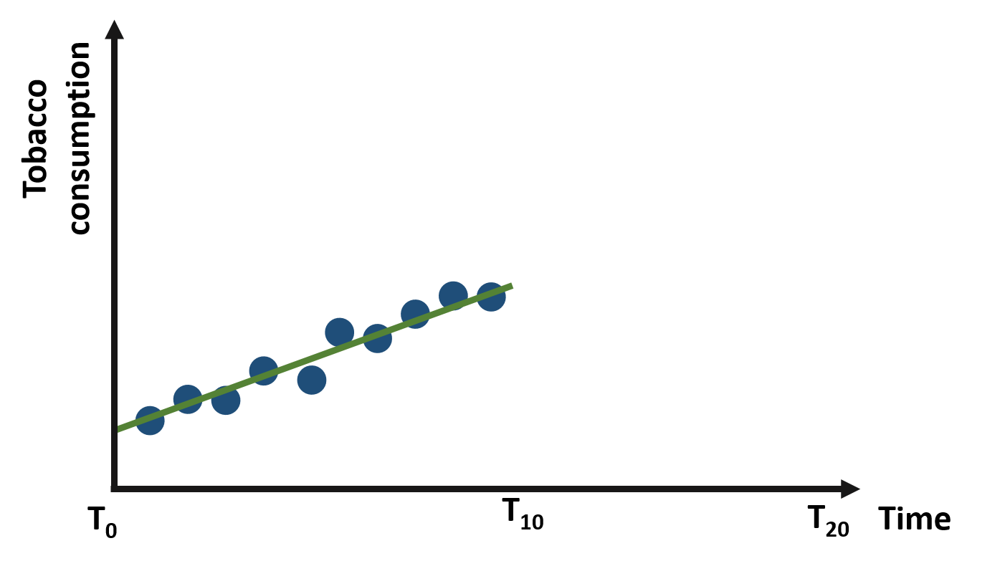
```

Imaginemos ahora que los responsables políticos deciden introducir un nuevo impuesto al tabaco al final del año t10 para reducir su consumo. ¿Cuáles son los posibles resultados de esta intervención?

Podemos representar algunos resultados posibles en las figuras 1.2 - 1.5 .

En la figura 1.2 , el impuesto no tiene efecto sobre el consumo de tabaco, que continúa aumentando con la misma tendencia que antes.

```{r, echo=FALSE, fig.cap="Figura 1.2: Sin efecto de política "}
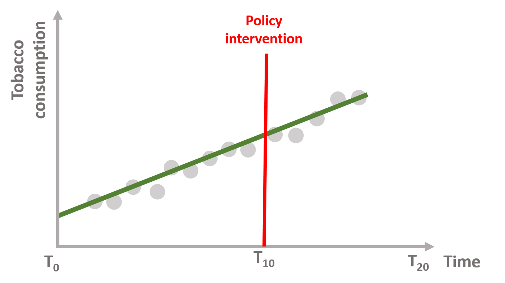
```

En la figura 1.3 , el impuesto reduce el consumo de tabaco inmediatamente después de la intervención política, pero la tendencia al alza continúa a lo largo del tiempo. Hay un efecto inmediato de la política , pero no un efecto sostenido.

```{r, echo=FALSE, fig.cap="Figura 1.3: Efecto inmediato de la política"}
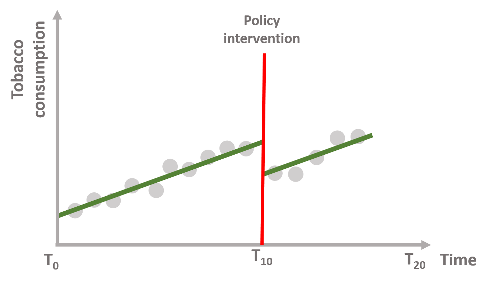
```

En la figura 1.4 , el impuesto no reduce el consumo de tabaco inmediatamente, pero sí modifica la tendencia a la baja a largo plazo. No hay un efecto inmediato de la política, pero observamos un efecto sostenido de la misma

```{r, echo=FALSE, fig.cap="Figura 1.4: Efecto sostenido de la política "}
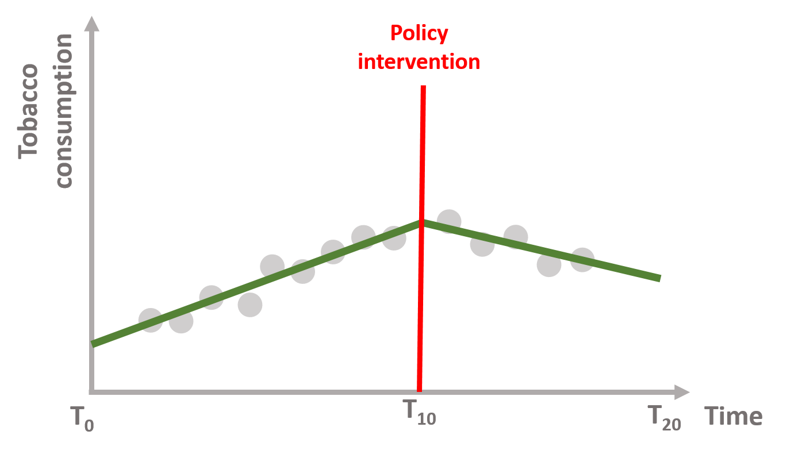
```

Por último, también podemos imaginar que el impuesto reduce el consumo de tabaco inmediatamente después y cambia la tendencia a la baja. La figura 1.5 muestra **un efecto de política tanto inmediato como sostenido** .

```{r, echo=FALSE, fig.cap="Figura 1.5: Efecto inmediato y sostenido de la política"}
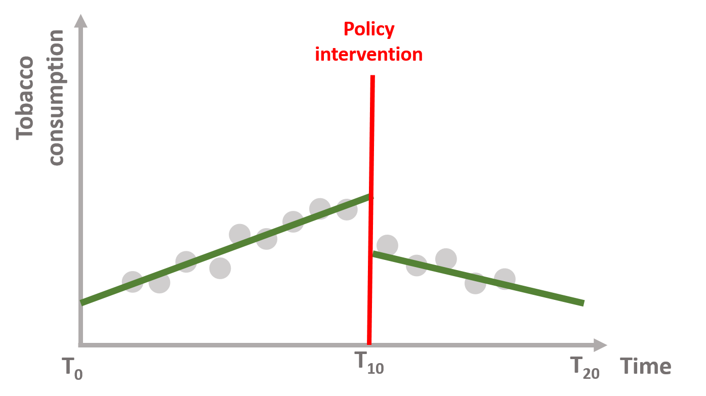
```

Las series temporales interrumpidas nos permiten investigar cada efecto, entendiendo así si la intervención política:

-   no tiene efecto; O

-   tiene sólo un efecto inmediato; O

-   tiene sólo un efecto sostenido y a largo plazo; O

-   tiene un efecto tanto inmediato como sostenido.

```{r, echo=FALSE, fig.cap="Figure 2Examples of impact models used in ITS\n(a) Level change; (b) Slope change; (c) Level and slope change; (d) Slope change following a lag; (e) Temporary level change; (f) Temporary slope change leading to a level change."}
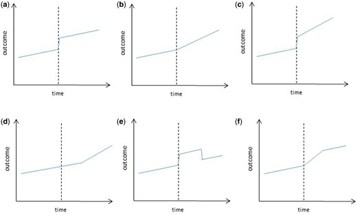
```

## El modelo estadístico

En términos matemáticos, significa que la ecuación de la serie temporal incluye cuatro coeficientes clave:

$$
\begin{equation} 
\text{Y} = \text{b}_0 + \text{b}_1T + \text{b}_2D + \text{b}_3P + \text{e}
  \tag{1.1}
\end{equation}
$$ Dónde:

$Y$ es la variable de resultado;

$T$ es una variable continua que indica el tiempo (por ejemplo, días, meses, años…) transcurrido desde el inicio del período de observación;

$D$ es una variable ficticia que indica la observación recopilada antes (=0) o después (=1) de la intervención política;

$P$ es una variable continua que indica el tiempo transcurrido desde que se produjo la intervención (antes de que se produjera la intervención P será igual a 0).

Nuestro conjunto de datos se verá así:

```{r, echo=FALSE, fig.cap="Figure 1.6: A time series dataset "}
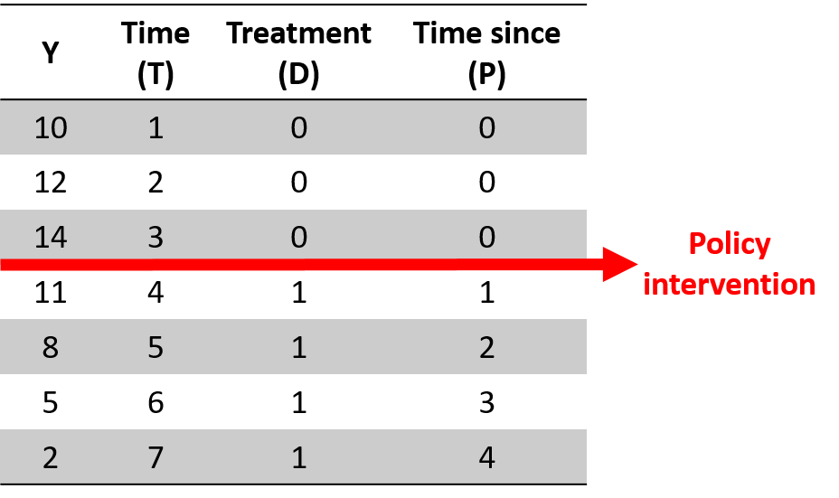
```

Podemos ilustrar gráficamente cada coeficiente y construir gradualmente la ecuación (1.1) .

En la figura 1.7 ,$b0$ es el nivel de referencia del resultado (la intersección o constante) y $b1$ es la pendiente de la recta antes de la intervención (línea verde).

$$
\begin{equation} 
\text{Y} = \text{b}_0 + \text{b}_1T + \text{e}
  \tag{1.1}
\end{equation}
$$

```{r, echo=FALSE, fig.cap="Figura 1.7: Coeficientes b0 y b1, si b2 = 0 y b3 = 0"}
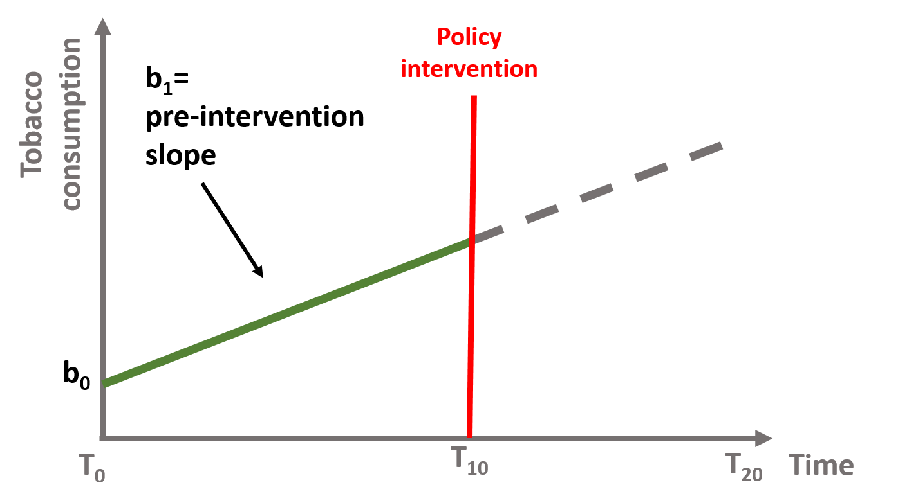
```

En la figura 1.8 , $b_2$ es el efecto inmediato que ocurre después de la intervención. Representa cómo ha cambiado el nivel de resultado desde la última observación antes de la intervención hasta la primera después. En este caso, la pendiente de la línea no ha cambiado y las líneas después y antes de la intervención son paralelas. Su pendiente es igual a $b_1$.

$$
\begin{equation} 
\text{Y} = \text{b}_0 + \text{b}_1T + \text{b}_2D + \text{e}
  \tag{1.2}
\end{equation}
$$

```{r, echo=FALSE, fig.cap="Figura 1.8: Coeficiente b0, b1 y b2, si b3 = 0 "}
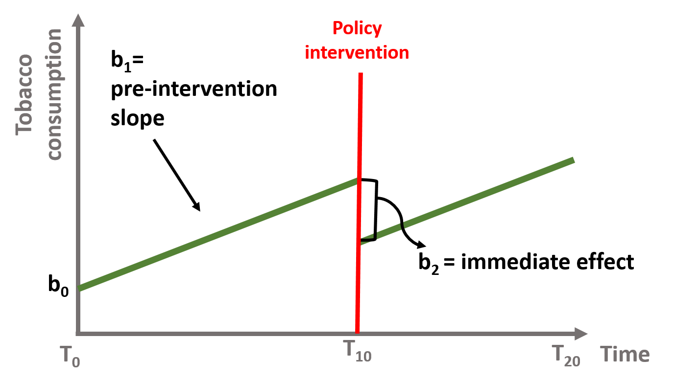
```

En la figura 1.9, la pendiente ha cambiado después de la intervención.$b_3$ es la diferencia entre la pendiente de la línea antes y la pendiente de la línea después de la intervención. Representa el efecto sostenido de la intervención de política. Nótese que $b_2$ = 0, lo que significa que no ha habido ningún efecto inmediato de la política.

$$
\begin{equation} 
\text{Y} = \text{b}_0 + \text{b}_1T + \text{b}_2D + \text{b}_3P + \text{e}
  \tag{1.3}
\end{equation}
$$

```{r, echo=FALSE, fig.cap="Figura 1.9: Coeficiente b0, b1 y b3, con b2 = 0"}
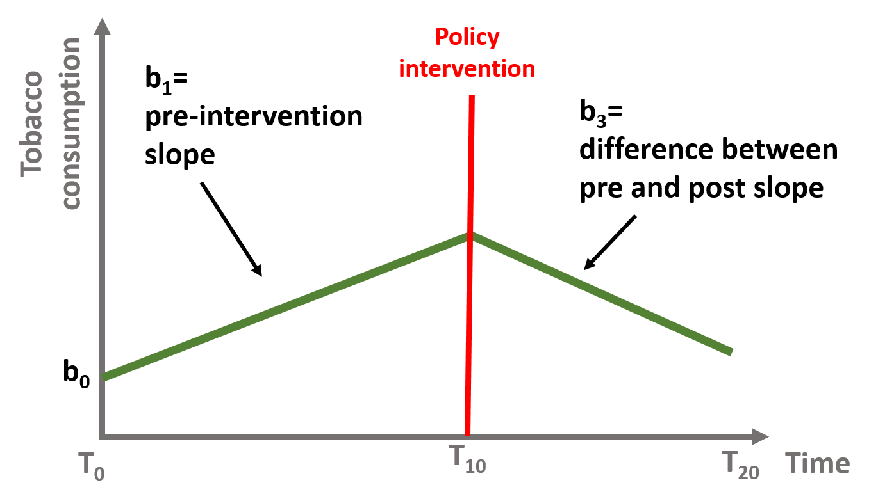
```

Finalmente, en la figura 1.10 , tenemos un efecto inmediato y sostenido y $b_2$ y $b_3$ Ambos son diferentes de cero.

$$
\begin{equation} 
\text{Y} = \text{b}_0 + \text{b}_1T + \text{b}_2D + \text{b}_3P + \text{e}
  \tag{1.4}
\end{equation}
$$

```{r, echo=FALSE, fig.cap="Figura 1.10: Coeficiente b0, b1, b2 y b3 "}
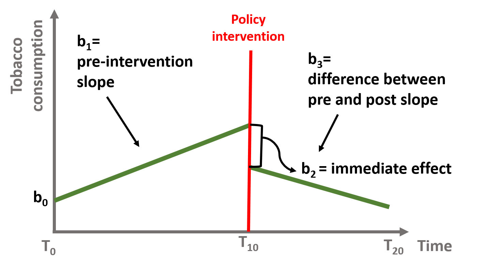
```

## El contrafactual

En las series temporales, es importante comprender el contrafactual, es decir, lo que le habría ocurrido a $Y$ si no se hubiera producido la intervención o política.

Tomemos un caso en el que nuestra intervención política tuvo un efecto tanto inmediato como sostenido, como se muestra en la figura 1.11. La línea verde está representada por la ecuación inicial, donde $b_2$ y $b_3$. Ambos son diferentes de 0. $$
\begin{equation} 
\text{Y} = \text{b}_0 + \text{b}_1T + \text{b}_2D + \text{b}_3P + \text{e}
  \tag{1.1}
\end{equation}
$$

Para calcular el contrafactual, debemos suponer que la intervención nunca se ha producido y que no ha habido ningún efecto inmediato ni sostenido. En otras palabras, si la intervención de política no se hubiera producido, la línea verde habría continuado como lo muestra la línea gris punteada. Nuestra ecuación se convertiría en:

$$
\begin{equation} 
\text{Y} = \text{b}_0 + \text{b}_1T + \text{b}_2*0 + \text{b}_3*0 + \text{e}
  \tag{1.5}
\end{equation}
$$

```{r, echo=FALSE, fig.cap="Figura 1.11: Contrafactual de series temporales"}
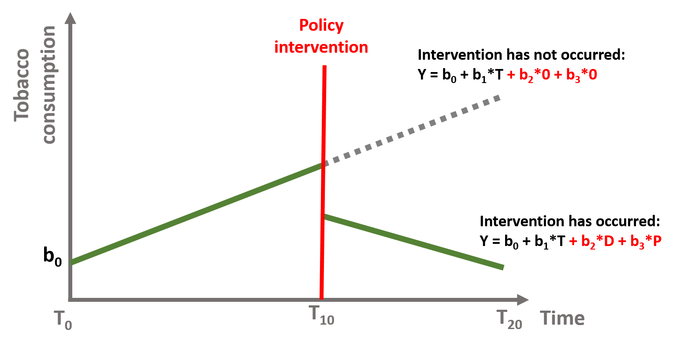
```

Podemos calcular el contrafactual para cada punto en el tiempo. Por ejemplo, observamos t = 12. La $Y$ predicha se calcula en la siguienteecuación. La $Y$ predicha para t = 12 cae sobre la línea verde en la figura 1.12 . Su contrafactual está presentada con la línea de puntos.

\$\$ \begin{equation} 
\text{Y} = \text{b}_0 + \text{b}_1*12 + \text{b}_2*D*1 + \text{b}_3*P*2 + \text{e}
  \tag{1.7}
\end{equation}

\$\$

\$\$ \begin{equation} 
\text{Y} = \text{b}_0 + \text{b}_1*12 + \text{b}_2*D*0 + \text{b}_3*P*0 + \text{e}
  \tag{1.8}
\end{equation} \$\$

```{r, echo=FALSE, fig.cap="Figura 1.12: Serie temporal contrafactual, T=12"}
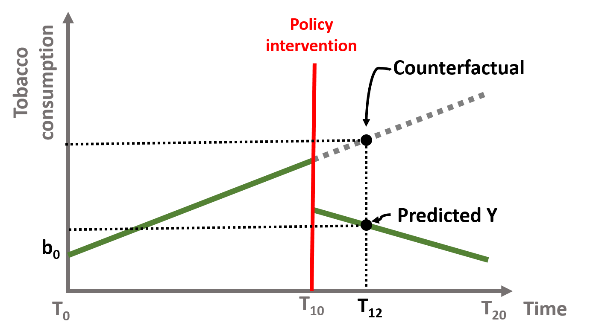
```

El contrafactual cambia en cada momento. Veamos el caso t = 18.

$$
\begin{equation} 
\text{Y} = \text{b}_0 + \text{b}_1*18 + \text{b}_2*D*1 + \text{b}_3*P*8 + \text{e}
  \tag{1.9}
\end{equation}
$$

$$
\begin{equation} 
\text{Y} = \text{b}_0 + \text{b}_1*18 + \text{b}_2*D*0 + \text{b}_3*P*0 + \text{e}
  \tag{1.10}
\end{equation}
$$

```{r, echo=FALSE, fig.cap="Figura 1.13: Serie temporal contrafactual, T=18 "}
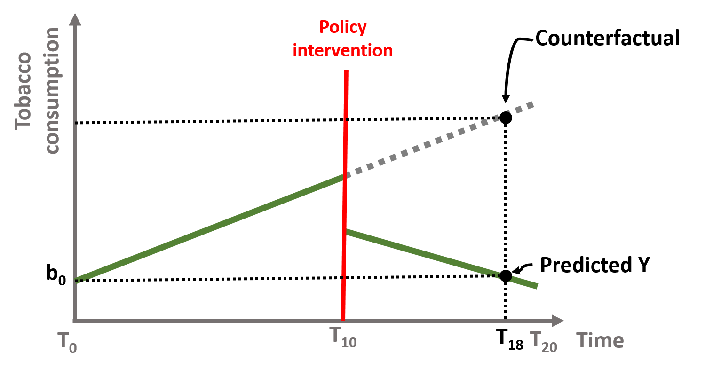
```

## Ejemplo práctico

Aplicaremos estos conceptos en el siguiente ejemplo práctico.

Vamos a echar un vistazo a un conjunto de datos simulados que describen el bienestar de una clase de estudiantes. El bienestar de los estudiantes es un tema cada vez más discutido en [los debates de políticas](http://oecdeducationtoday.blogspot.com/2018/03/mental-health-students-school.html) y algunos estados están introduciendo [clases de educación sobre salud mental](https://www.nbcnews.com/better/health/fall-all-new-york-students-will-be-learning-about-mental-ncna911031) (incluso algunas [universidades](https://www.nytimes.com/2018/01/26/nyregion/at-yale-class-on-happiness-draws-huge-crowd-laurie-santos.html) ).

El conjunto de datos contiene 365 observaciones diarias del bienestar de una clase de estudiantes. El bienestar se mide mediante un índice de 0 a 300. En t = 201, los estudiantes comenzarán a asistir a una clase de educación sobre salud mental. Queremos entender cómo (y si) mejora su bienestar.

```{r}
# load data from GitHub
URL <- "https://github.com/DS4PS/pe4ps-textbook/blob/master/data/time-series-example.rds?raw=true"
dataTS <- readRDS(gzcon(url( URL )))
```

En primer lugar, observamos cómo se estructura el conjunto de datos utilizando la función *de cabeza* y *cola* . También podemos observar las filas 198 a 204, donde se produce la interrupción.

```{r}
dataTS$Y <- round(dataTS$Y,1)

d.temp <- rbind( head(dataTS), c("...","...","...","..."),
                 dataTS[ 198:200, ], 
                 c("**START**","**TREATMENT**","---","---"), 
                 dataTS[ 201:204, ],  
                 c("...","...","...","..."),
                 tail(dataTS) )

row.names( d.temp ) <- NULL  
pander( d.temp )
```

```{r}
attach(dataTS)

plot( dataTS$T, dataTS$Y,
      bty="n", pch=19, col="gray",
      ylim = c(0, 300), xlim=c(0,400),
      xlab = "Time (days)", 
      ylab = "Wellbeing Index" )

# Line marking the interruption
abline( v=200, col="firebrick", lty=2 )
text( 200, 300, "Start of Wellbeing Classes", col="firebrick", cex=1.3, pos=4 )

# Add the regression line
ts <- lm( Y ~ T + D + P, data=dataTS )
lines( dataTS$T, ts$fitted.values, col="steelblue", lwd=2 )
```

El conjunto de datos contiene cuatro variables:

| **Columna** | **Nombre de la variable**                | **Descripción**                               |
|:---------------|:----------------------------|:---------------------------|
| $Y$         | Bienestar                                | Índice de bienestar (de 0 a 300)              |
| T           | Tiempo                                   | Tiempo (de 1 a 365)                           |
| D           | Tratamiento                              | Observación post (=1) y pre (=0) intervención |
| P           | Tiempo transcurrido desde el tratamiento | Tiempo transcurrido desde la intervención     |

Nuestro modelo se basa en la ecuación  1.1 :

$$
\begin{equation} \text{Y} = \text{b}_0 + \text{b}_1*Time + \text{b}_2*Treatment + \text{b}_3*Time Since Treatment + \text{e} \tag{2.1} \end{equation}
$$

Podemos ejecutar el modelo usando la función **lm** en R.

```{r}
regTS = lm ( Y ~ T + D + P, data=dataTS)  # Our time series model

library(gtsummary)
tbl_regression(regTS, intercept = TRUE)
```

Interpretemos nuestros coeficientes:

-   El coeficiente **de tiempo** indica la tendencia del bienestar antes de la intervención. Es positivo y significativo, lo que indica que el bienestar de los estudiantes aumenta con el tiempo. Por cada día que pasa, el bienestar aumenta 0,19 puntos en el índice.\

-   El coeficiente **de tratamiento** indica el aumento del bienestar de los estudiantes inmediatamente después de la intervención. Podemos ver que el efecto inmediato es positivo y significativo indicando que asistir a la primera clase aumentó el bienestar de los estudiantes en 13,09.\

-   El coeficiente **de tiempo transcurrido desde el tratamiento** indica que la tendencia ha cambiado tras la intervención. El efecto sostenido es positivo y significativo, indicando que por cada día que pasa tras la intervención, el bienestar de los estudiantes aumenta 0,54 puntos en el índice.

## Representación gráfica de los resultados

Un ejercicio útil es calcular los resultados en diferentes puntos del tiempo como hicimos en la sección previa. Por ejemplo, podemos calcular el resultado justo después de la intervención, que ocurrió en el momento = 200. Tenga en cuenta que, si bien Tiempo = 201,Tiempo transcurrido desde el tratamiento es igual a 1 porque es el primer día después de la intervención

$$
\begin{equation} \text{Y} = \text{b}_0 + \text{b}_1*201 + \text{b}_2*1 + \text{b}_3*1 + \text{e} \tag{2.2} \end{equation}
$$

También podemos representar el punto en un gráfico:

```{r fig.cap="Figura 2.1: Nivel de bienestar en t = 201"}
# We create a small dataset with the new values
data1 <- as.data.frame( cbind( T = 201, D = 1, P = 1 )) 

# We use the function predict to (1) take the 
#  coefficients estimated in regTS and 
#  (2) calculate the outcome Y based on the 
#  values we set in the new datset
y1 <- predict( regTS, data1 ) 

# We plot our initial observations, the column Y in our dataset
plot( Y,
      bty="n",
      col = gray(0.5,0.5), pch=19,
      xlim = c(1, 365), 
      ylim = c(0, 300),
      xlab = "Time (days)", 
      ylab = "Wellbeing Index")

# We add a point showing the level of wellbeing at time = 201)
points( 201, y1, col = "dodgerblue4", 
        pch = 19, bg = "dodgerblue4", cex = 2 )
text( 201, y1, labels = "t = 201", pos = 4, cex = 1 )

# Line marking the interruption
abline( v=200, col="red", lty=2 )
```

El contrafactual al día 30 pos intervención

```{r}
data2 <- as.data.frame( cbind( T = 230, D = 1, P = 30 )) # New data

data3 <- as.data.frame(cbind( T= 230, D = 0, P = 0)) # Data if the intervention does not occur

y2 <- predict( regTS, data2 ) # We predict the new outcome

y3 <- predict(regTS, data3) #Counterfactual

# We plot our initial observations, the column Y in our dataset
plot( Y,
      bty="n",
      col = gray(0.5,0.5), pch=19,
      xlim = c(1, 365), 
      ylim = c(0, 300),
      xlab = "Time (days)", 
      ylab = "Wellbeing Index")

# We add a  point showing the level of wellbeing at time = 230
points(230, y2, col = "dodgerblue4", pch = 19, bg = "red", cex = 2)

# We add a point indicating the counterfactual
points(230, y3, col = "darkorange2", pch = 19, cex = 2)

# Label for our predicted outcome
text(230, y2, labels = "Y at t = 230", pos = 4, cex = 1)

#Label for the counterfactual 
text(230, y3, labels = "C at t = 230", pos = 4, cex = 1)

# Line marking the interruption
abline( v=200, col="red", lty=2 )
```

Por último, podemos observar los resultados trazando todos los resultados previstos y sus contrafácticos. En la figura 2.5 podemos ver que hay un aumento en el índice de bienestar después de la intervención. La línea discontinua representa el contrafáctico.

```{r}
pred1 <- predict(regTS, dataTS) 
# To estimate all predicted values of Y, we just use our dataset

datanew <- as.data.frame(cbind(T = rep(1 : 365), D = rep(0), P = rep(0))) 
# Create a new dataset where Treatment and Time Since Treatment are equal to 0 as the intervention did not occur.

pred2 <- predict(regTS, datanew) 
# Predict the counterfactuals

plot( Y,
      bty="n",
      col = gray(0.5,0.5), pch=19,
      xlim = c(1, 365), 
      ylim = c(0, 400),
      xlab = "Time (days)", 
      ylab = "Wellbeing index")

lines( rep(1:199), pred1[1:199], col="dodgerblue4", lwd = 3 )
lines( rep(201:365), pred1[201:365], col="dodgerblue4", lwd = 3 )
lines( rep(200:365), pred2[200:365], col="darkorange2", lwd = 3, lty = 5 ) 

text(0, 45, labels = "Predicted values", pos = 4, cex = 1, col = "dodgerblue3")
text(300, 95, labels = "Counterfactual", pos = 4, cex = 1, col = "darkorange2")

# Line marking the interruption
abline( v=200, col="darkorange2", lty=2 )
```

## Efectos retardados en series temporales

Tenga en cuenta que los coeficientes obtenidos a partir de la ecuación 2.1 *no* nos indican si la diferencia entre cada punto (los resultados previstos) y su contrafáctico es estadísticamente significativa. Sólo nos indican si

1.  Hay un cambio inmediato después de la intervención y

2.  La pendiente ha cambiado después de la intervención.

No existe ninguna prueba estadística para determinar si existe una diferencia estadísticamente significativa entre un resultado previsto y su contrafáctico. Esto tiene implicaciones importantes. Podría ser que el efecto de la intervención *varíe con el tiempo,* como en la figura 2.6. En este caso, hay una caída en el bienestar de los estudiantes justo después de la intervención. Por ejemplo, podría ser que la clase desafíe a los estudiantes a pensar en sus emociones, disminuyendo así su sensación general de bienestar.

Representamos estos resultados en el gráfico 2.6. Según el momento temporal que consideremos en el gráfico, la intervención tuvo un efecto negativo o positivo. Si observamos los resultados inmediatamente después de que se produjo la intervención (línea punteada roja), podríamos concluir que el efecto es negativo. Pero si consideramos un cierto retraso y observamos la intervención en t = 300 (línea punteada verde), el efecto es positivo.

En las series temporales es importante pensar en **cuándo** es probable que se produzca el efecto. Analizamos otro ejemplo en la siguiente sección.

```{r, echo=FALSE, fig.cap="Figura 2.6: El efecto de los cambios de política a lo largo del tiempo"}
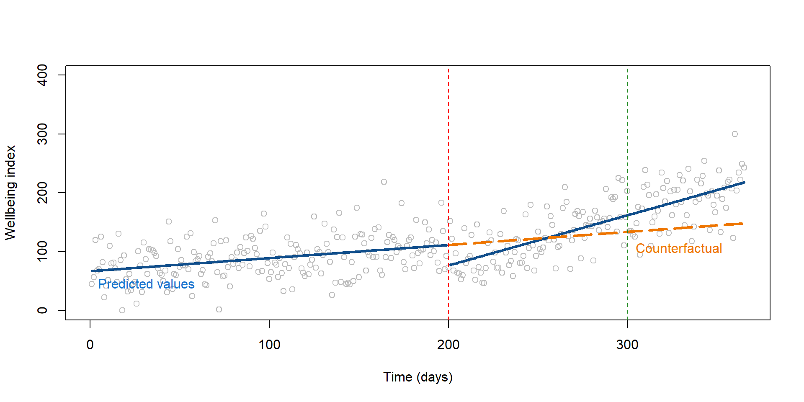
```

# Replicación de un estudio

Vamos a replicar un estudio realizado por [Rodgers, John y Coleman (2005)](https://www-jstor-org.ezproxy1.lib.asu.edu/stable/pdf/4147334.pdf?refreqid=excelsior%3A41336456a16a95f70eb557b0257c5013) para investigar las tasas de fertilidad en Oklahoma después del [atentado de Oklahoma City en 1995](https://www.britannica.com/event/Oklahoma-City-bombing) , que mató a 168 personas.

[Las teorías](https://www.prb.org/whywedontexpectababyboomafter911/) sugieren que las tasas de natalidad responden a situaciones socioculturales, incluida la ocurrencia de grandes desastres, tanto naturales, como huracanes, como provocados por el hombre, como el 11 de septiembre. Las personas se sienten más propensas a tener hijos como respuesta a pérdidas importantes de vidas o porque se sienten más cercanas a los valores tradicionales (como tener una familia) cuando ocurren eventos inesperados. Por el contrario, podrían estar menos dispuestas a tener hijos cuando experimentan eventos que afectan negativamente su estilo de vida.

La evidencia que apoya estas teorías es [limitada](https://www.nytimes.com/2002/06/11/nyregion/baby-boom-nobody-told-stork-little-evidence-seen-yet-post-9-11-surge-births.html) , pero se han llevado a cabo investigaciones al respecto, especialmente a medida que las tasas de fertilidad [fueron disminuyendo de manera constante en los últimos años](https://ourworldindata.org/fertility-rate) .

Los datos utilizados en el estudio están disponibles en el paquete [Wats](https://cran.r-project.org/web/packages/Wats/Wats.pdf) en R y fueron utilizados por [Rodgers, Beasley y Schuelke para analizar la representación de series de tiempo interrumpidas](https://www.tandfonline.com/doi/full/10.1080/00273171.2014.946589?scroll=top&needAccess=true) .

## Datos

Comenzamos cargando el paquete Wats y los datos.

```{r}
library( "Wats" )
# Upload the data from the package
data( county_month_birth_rate_2014_version )

# We rename the data set to avoid the long name!
data <- county_month_birth_rate_2014_version 
```

Éstas son las variables contenidas en el conjunto de datos.

| **Nombre de la variable** | **Descripción**                                          |
|:-------------------|:---------------------------------------------------|
| Fips                      | Código fips                                              |
| Nombre del condado        | Nombre del condado                                       |
| Año                       | Año (1990-1999)                                          |
| Mes                       | Mes                                                      |
| Población fecunda         | Población fecunda                                        |
| Conteo de nacimientos     | Número de nacimientos en el mes                          |
| Fecha                     | Fecha en que se recogieron los datos                     |
| Días en el mes            | Número de días del mes                                   |
| Días en el año            | Número de días del año                                   |
| Identificación de etapa   | Indica el tiempo transcurrido 9 meses desde el bombardeo |
| Tasa de natalidad mensual | Nacimiento                                               |

El conjunto de datos contiene observaciones de varios condados, pero para este ejercicio vamos a considerar solo el condado de la ciudad de Oklahoma.

```{r}
#Subset the data to keep only Oklahoma county data
oklahoma <- subset(data, data$county_name == "oklahoma") 
```

Para tener una primera idea de los datos, podemos observar este gráfico que Rodgers y sus colegas utilizaron para representar la tasa de natalidad a lo largo del tiempo en el condado de Oklahoma:Para tener una primera idea de los datos, podemos observar este gráfico que Rodgers y sus colegas utilizaron para representar la tasa de natalidad a lo largo del tiempo en el condado de Oklahoma:

```{r, echo=FALSE, fig.cap="Figura 3.1: Condado de Oklahoma, tasa de natalidad a lo largo del tiempo (Fuente: Rodgers et al., 2005)"}
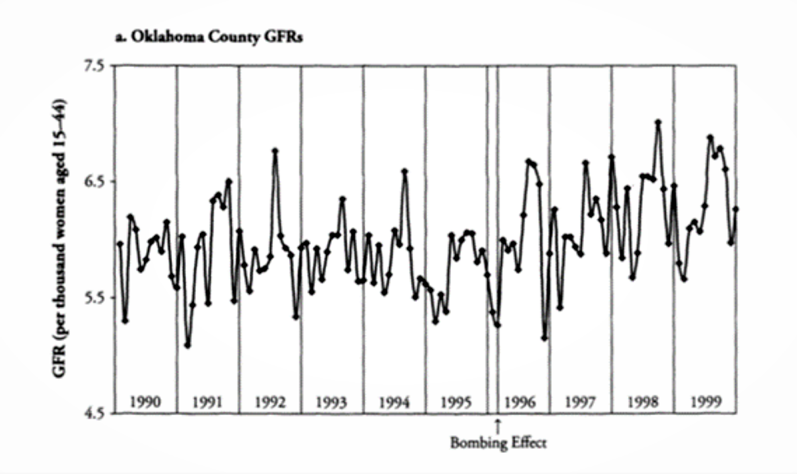

```

## Análisis

Al preparar datos para el análisis de series de tiempo, necesitamos crear tres nuevas variables para aplicar nuestra ecuación de series de tiempo 1.1 :

1.  una variable que indica el tiempo;

2.  una variable que indica si la observación ocurrió antes y después del evento;

3.  una variable que indica el tiempo transcurrido desde el bombardeo.

```{r}
# Create a time variable from 1 to last row of the dataset
oklahoma$time <- rep( 1 : nrow( oklahoma )) 

# Create a dummy variable equal to 1 if after 1995 or after May 1995, and equal to 0 otherwise
oklahoma$treatment <- ifelse( oklahoma$year > 1995 | oklahoma$year == 1995 & oklahoma$month >= 5, 1, 0)

# Create a dummy variable that is equal to 0 before time = 64 (when the event occured) and 1 otherwise.

# If we look at the frequency of the treatment variable, we see that 64 rows has received no treatment and 56 rows did receive the treatment. 
table(oklahoma$treatment)

# The new variable will have 64 zeros and then will count time from 1 to 56
oklahoma$timeSince <- c(rep(0, 64), rep(1:56))
```

Ahora podemos calcular los coeficientes como lo hicimos antes:

```{r}
reg_OK <- lm( birth_rate_monthly ~ 
              time + 
              treatment + 
              timeSince, 
              data = oklahoma)

tbl_regression(reg_OK, intercept = TRUE)
```

¿Puedes interpretar los resultados de la tabla? En particular:

1.  ¿Cuál era la tendencia de la tasa de natalidad antes del evento?

2.  ¿Cuál fue el cambio en la tasa de natalidad inmediatamente después del evento?

3.  ¿Cuál es la tendencia de la tasa de natalidad después del evento?

Podemos ver que:

-   Cada mes, la tasa de natalidad disminuyó en un 0,005%. La disminución, aunque pequeña, es estadísticamente significativa a partir de cero.

-   El evento no tiene un efecto inmediato sobre la tasa de natalidad ya que el coeficiente de tratamiento no es significativamente diferente de cero.

-   La diferencia entre la pendiente de la línea antes y después de la intervención es positiva y estadísticamente significativa, lo que sugiere un efecto sostenido del evento. Podemos calcular la nueva pendiente: (-0,005) + 0,0014 = 0,009. Después de la intervención, la tasa de natalidad aumenta positivamente en 0,009 cada mes.

Podemos observar nuestra tasa de natalidad observada y prevista en un gráfico:

```{r fig.cap="Figura 3.2: Tasas de natalidad observadas y previstas en el condado de Oklahoma"}
# Predict Birth rate
pred_OK <- predict( reg_OK, oklahoma )

plot( oklahoma$birth_rate_monthly,
      col = "gray",
      xlim = c( 1, nrow (oklahoma) ), 
      ylim = c( (min ( oklahoma$birth_rate_monthly ) - 0.5), 
                (max (oklahoma$birth_rate_monthly) + 0.5)),
      xlab = "Time (days)", 
      ylab = "Birth rate" )

lines( pred_OK, col="dodgerblue4", lwd = 3 )

# Line marking the interruption
abline( v=64, col="red", lty=2 )
```

## Efecto retardado

Al realizar un análisis de series temporales interrumpidas es importante pensar en las posibles amenazas a la validez del estudio. En este caso, Rodgers y sus colegas observaron que sería difícil observar un aumento en la tasa de natalidad justo después del evento por la sencilla razón de que un embarazo dura 9 meses.

Podemos volver a realizar nuestro análisis y ver si podemos encontrar un efecto inmediato nueve meses después del atentado. Lo hacemos modificando nuestras variables Tratamiento y Tiempo transcurrido desde el tratamiento para indicar un momento diferente en el tiempo.

```{r}
oklahoma$treatment2 <- ifelse(oklahoma$year > 1996 | oklahoma$year == 1996 & oklahoma$month >= 2, 1, 0)
# Our new treatment variable is equal to 1 if the bombing has occured and 9 months have passed.It is equal to zero otherwise.

oklahoma$timeSince2 <- ifelse(oklahoma$time <= 73, 0, rep(1 : 73))
# Our Time Since Treatment variable starts 9 months after the bombing, instead than at the time of the bombing.
```

```{r}
reg_OK2 = lm(birth_rate_monthly ~ 
             time + 
             treatment2 + 
             timeSince2,
             data = oklahoma)

tbl_regression(reg_OK2, intercept = TRUE)
```

Nuevamente, no encontramos un efecto inmediato significativo. Dadas las evidencias adicionales, podemos descartar que se haya producido un efecto inmediato como resultado del evento.

# Notas adicionales

En esta sección vamos a discutir algunas cuestiones adicionales que quizás deba tener en cuenta con las series de tiempo interrumpidas.

## Autocorrelación

La autocorrelación es un problema importante cuando se trabaja con series temporales. La autocorrelación se produce cuando la observación en un momento determinado depende de las observaciones en otro momento determinado. Por ejemplo:

-   Es posible que tu nivel de bienestar dependa de cómo te hayas sentido en los últimos días;

-   El número de horas que estudias hoy puede depender de cuántas horas hayas estudiado hace una semana;

-   La difusión de enfermedades a lo largo del tiempo depende de si ha habido otros casos en las últimas semanas;

-   y así sucesivamente. La autocorrelación es un fenómeno común.

Cuando utilizamos MCO, asumimos que los términos de error asociados con cada observación **no** están correlacionados. Sin embargo, esta suposición no se cumple en presencia de autocorrelación porque los términos de error están correlacionados entre las observaciones. Si no se corrige la autocorrelación, se pueden subestimar los errores estándar, lo que significa que se está sobrestimando la significación estadística.

Se puede evaluar la autocorrelación observando el patrón de residuos. Si los residuos están dispersos aleatoriamente, entonces no hay autocorrelación.

```{r fig.cap="Figura 4.1: Residuos de una serie temporal"}
regTS_OK <- lm(birth_rate_monthly ~ time, data = oklahoma)
# Calculate a simple regression where birth rate depends only on time 

plot(resid( regTS_OK ))
```

En ocasiones, puede resultar difícil detectar patrones de correlación pequeños utilizando el gráfico de residuos como el de la figura [4.1](https://ds4ps.org/pe4ps-textbook/docs/p-020-time-series.html#fig:fres) . Como alternativa, podemos probar la autocorrelación de los residuos utilizando la prueba de Durbin-Watson del paquete **lmtest** .

```{r}
#install.packages("lmtest", repos="https://cran.cnr.berkeley.edu")

library("lmtest")

dwtest(oklahoma$birth_rate_monthly ~ oklahoma$time)
```

La prueba es positiva porque el valor p es menor que 0,05. Podemos concluir que la autocorrelación es un problema.

La función **acf** es otra forma sencilla de representar gráficamente los residuos y evaluar la autocorrelación. Podemos echarle un vistazo.

```{r fig.cap="Figura 4.2: Diagrama de autocorrelación"}
regTS_OK <- lm(birth_rate_monthly ~ time, data = oklahoma)
# We run again a simple regression where the outcome depends solely on time

acf(resid( regTS_OK ))
```

En la figura 4.2 , el eje x representa el tiempo, mientras que el eje y es el nivel de autocorrelación. Si una línea sale de la línea horizontal azul, la autocorrelación es significativa en ese momento (valor p \<= 0,05).

En nuestra figura, parece que nuestros términos de error están correlacionados en T = 1, T = 11 y T = 12. Podemos recuperar de la función acf el nivel de correlación.

```{r fig.show='hide'}
# Correlation at time 1 (note that 0 is time 1, so time 1 is actually our second observation )
acf(resid( regTS_OK ))$acf[2]   

# Correlation at time 12 
acf(resid( regTS_OK) )$acf[12]

# Correlation at time 13 
acf(resid( regTS_OK ))$acf[13]
```

Podemos utilizar el valor de la correlación que acabamos de recuperar para corregir nuestros errores estándar.

Otra alternativa es un [modelo ARIMA](https://datascienceplus.com/time-series-analysis-using-arima-model-in-r/) que permite ajustar la autocorrelación y otras características de las series temporales, como la estacionalidad.

## Tiempo del efecto de la intervención

Las series temporales pueden complicarse porque pueden existir efectos tardíos (como vimos en la Sección [3](https://ds4ps.org/pe4ps-textbook/docs/p-020-time-series.html#replication-of-a-study) ) que pueden ser engañosos. Un ejemplo clásico son los programas de entrenamiento. Imaginemos un estado que introduce un nuevo programa de entrenamiento en T = 8 y queremos evaluar el efecto inmediato y sostenido. Nuestros datos están representados en la figura 4.3 .

Observa las líneas. Si consideramos el tiempo de intervención, concluiríamos que el programa tiene un efecto negativo sobre los ingresos. Pero esto se debe a que las personas abandonan el mercado laboral o dejan de trabajar porque necesitan asistir a la capacitación. Los ingresos, de hecho, aumentan con el tiempo cuando las personas se reincorporan al mercado laboral.

```{r, echo=FALSE, fig.cap="Figura 4.3: Figura 13. Intervención del programa de capacitación"}
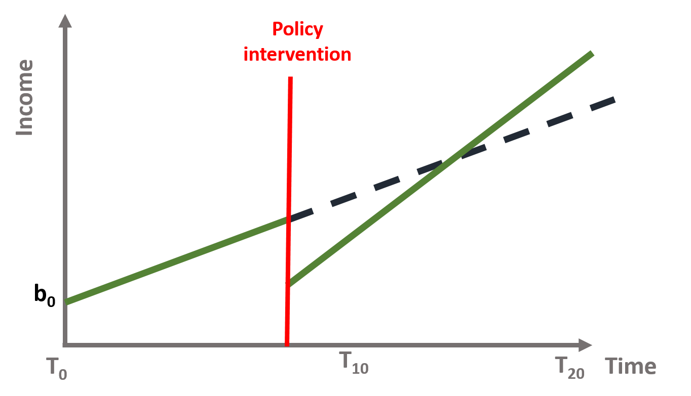
```

En las series temporales es importante pensar en **cuándo** es probable que se produzca el efecto. Como mencionamos en las primeras secciones, no podemos comprobar si la diferencia de pendiente es significativa en diferentes puntos del tiempo.

Si sospechamos que existe un efecto tardío, podemos observar los efectos inmediatos y sostenidos algunos meses después de la intervención. En el ejemplo de entrenamiento, observaríamos un efecto positivo inmediato si analizamos t = 18. Además, el coeficiente “Tiempo transcurrido desde el tratamiento” habría indicado un efecto positivo mayor.

```{r, echo=FALSE, fig.cap="Figura 4.4: Figura 14. Intervención del programa de capacitación "}
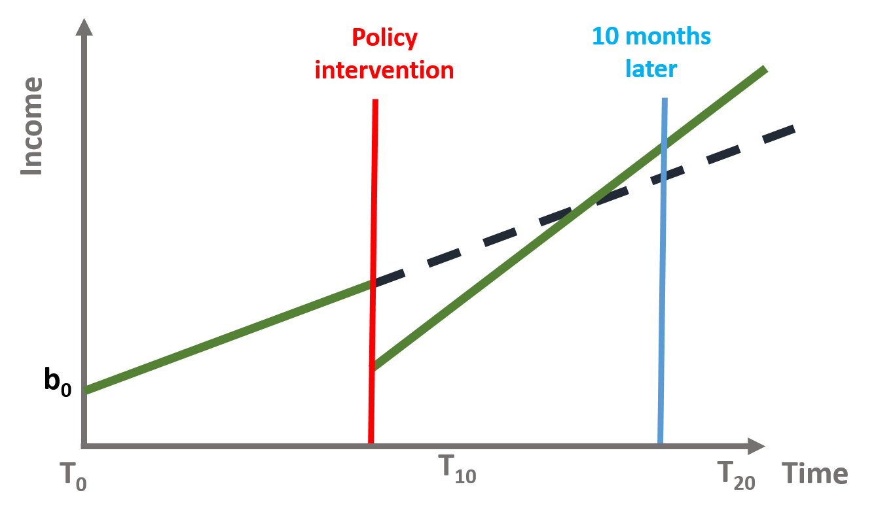
```

## Regresión a la media

También es difícil saber durante cuánto tiempo se mantendrá el efecto de una política. En varios casos, los investigadores observan una *regresión al* fenómeno medio, mientras que el resultado vuelve lentamente a su valor inicial.

Por ejemplo, pensemos en nuestro primer ejemplo sobre el bienestar. Es posible que el programa escolar tenga un efecto positivo a corto plazo, ya que los estudiantes se benefician de la nueva clase. Pero a largo plazo, es probable que los estudiantes se acostumbren al programa de bienestar y su bienestar vuelva a sus valores iniciales. Esto se muestra en la figura 4.5 .

También existen factores que escapan al control de los responsables de las políticas y que podrían afectar el efecto sostenido de la intervención. Por ejemplo, la familia y otros factores ambientales podrían hacer que el bienestar vuelva a su valor inicial.

```{r, echo=FALSE, fig.cap="Figura 4.5: Regresión a la media "}
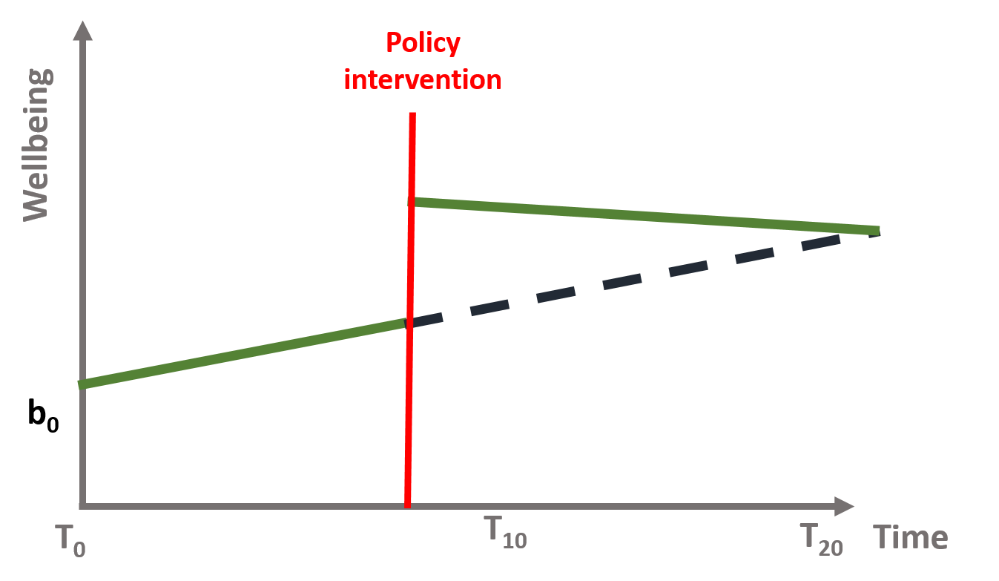
```

## Amenazas a la validez: grupos de control y series temporales múltiples

Finalmente, las series temporales también están sujetas a amenazas a la validez interna, tales como:

-   Otro acontecimiento ocurrió al mismo tiempo de la intervención y provocó el efecto inmediato y sostenido que observamos;

-   Procesos de selección, ya que sólo algunos individuos se ven afectados por la intervención política.

Para abordar estos problemas, puede:

-   Utilizar como control un grupo que no esté sujeto a la intervención (por ejemplo, estudiantes que no asisten a la clase de bienestar)

Este diseño garantiza que el efecto observado sea el resultado de la intervención de política. Los datos tendrán dos observaciones por cada punto en el tiempo e incluirán una variable ficticia para diferenciar el tratamiento (=1) y el control (=0). El modelo tiene una estructura similar pero (1) incluiremos una variable ficticia que indica el grupo de tratamiento y el grupo de control y (2) interactuaremos la variable ficticia del grupo con los 3 coeficientes de la serie temporal para ver si hay una diferencia estadísticamente significativa entre los 2 grupos.

Puedes ver esto en la siguiente ecuación, donde $G$ Es una variable que indica grupo de tratamiento y control.

$$
\begin{equation} \text{Y} = \text{b}_0 + \text{b}_1*T + \text{b}_2*D + \text{b}_3*P + \text{b}_4*G + \text{b}_5*G*T + \text{b}_6*G*D + \text{b}_7*G*P \tag{4.1} \end{equation}
$$

Para interpretar los coeficientes es necesario recordar que el grupo de referencia es el grupo de tratamiento (=1). La variable ficticia de grupo (b4) indica la diferencia entre el grupo de tratamiento y el grupo de control. b5 representa la diferencia de pendiente entre el grupo de intervención y el grupo de control en el periodo previo a la intervención. b6 representa la diferencia entre el grupo de control y el grupo de intervención asociado a la intervención. b7 representa la diferencia entre el efecto sostenido del grupo de control y el grupo de intervención después de la intervención.

```{r, echo=FALSE, fig.cap="Figura 4.6: Serie temporal con grupo de control "}
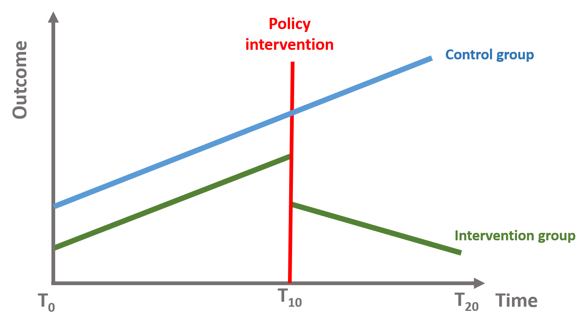
```

-   Analizar múltiples series de tiempo donde el efecto se ha producido en múltiples puntos en el tiempo.

También podemos tomar dos (o más) grupos en los que la intervención ocurrió en diferentes puntos del tiempo y ver si el efecto de la intervención es significativo para ambos.

```{r, echo=FALSE, fig.cap="Figura 4.7: Series temporales con intervención en diferentes puntos del tiempo"}
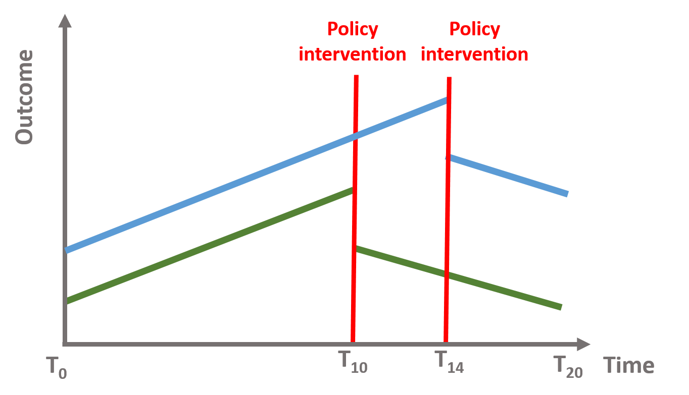
```
