```{r echo = FALSE}

setwd("C:/Users/danfe/Dropbox/Proyectos Daniel/Cursos - diplomados - Maestrias/Programa de autoformación en investigación y análisis de datos/Talleres/Taller 6 Matching y propensity score")

knitr::opts_chunk$set(echo = TRUE, warning = FALSE, message = FALSE)

```

# Balance en ECA vs EO

```{r, echo=FALSE, fig.cap=" "}
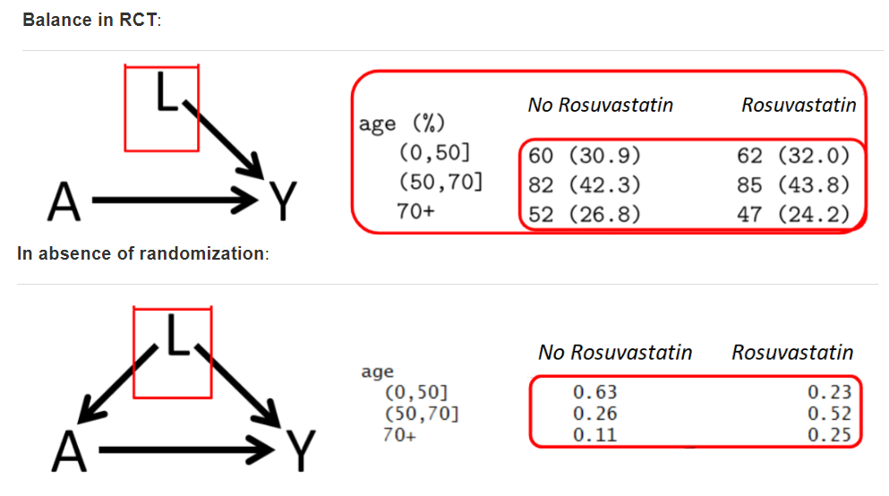
```

Para comparar las características basales entre los dos grupos de tratamiento, utilizamos

-   Prueba t (para variables continuas) y

-   prueba de chi-cuadrado (para variables categóricas)

-   Tambien puede usarse la diferencias de medias estandarizadas (SMD)

    -   Para factores de confusión continuos:

$$
SDM_{continuous} = \frac{\bar{L}_{A=1} - \bar{L}_{A=0}}{\sqrt{\frac{(n_1 - 1) \cdot s^2_{A=1} + (n_0 - 1) \cdot s^2_{A=0}}{n_1 + n_0 - 2}}}
$$

-   Para factores de confusión binarios:

$$
SDM_{binary} = \frac{\hat{p}_{A=1} - \hat{p}_{A=0}}{\sqrt{\frac{\hat{p}_{A=1} \times (1 - \hat{p}_{A=1}) + \hat{p}_{A=0} \times (1 - \hat{p}_{A=0})}{2}}}
$$

-   Para factores de confusión categóricos (más de 2 categorías):

    -   Calcular el SMD para variables categóricas es un poco más complicado, ya que requiere algunos cálculos adicionales y promediar los resultados de los SMD específicos de la categoría. Consulte las fórmulas en Yang y Dalton. También es posible informar el SMD para cada categoría por separado (similar al sistema binario).

Generalmente $0.1$ se utiliza como punto de corte para SMD, pero algunos sugieren puntos de corte menos estrictos.

```{r, echo=FALSE, fig.cap=" "}

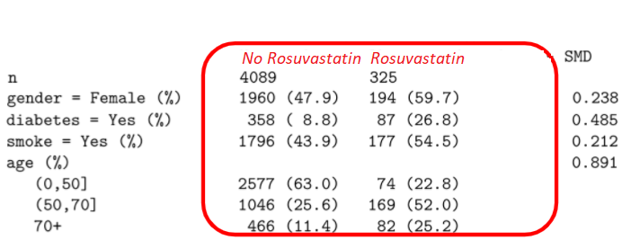

```

# Control de confusión vs ajuste estadístico

### ¿Por qué ajustar?

En ausencia de aleatorización, estimación del efecto del tratamiento ATE

-   Efecto del tratamiento

-   Diferencias sistemáticas entre 2 grupos (factor de confusión)

    -   Los médicos pueden recetar más tratamientos a pacientes frágiles y de mayor edad.

    -   Aquí la edad es un factor de confusión (No intercambiabilidad).

### Métodos de ajuste en análisis

+---------------------------------------------------------------------------------------------------------------------------------------------------------------------------------------------------------------------------------------------------------------------------------------------------------------------------------------------------------------------------------------------------------------------------------------------------------------------------------------------------------------------+-------------------------------------------+-----------------------------------------+
| **Method**                                                                                                                                                                                                                                                                                                                                                                                                                                                                                                          | **Exposure model** (A∼...)                | **Outcome Model** (Y∼...)               |
+=====================================================================================================================================================================================================================================================================================================================================================================================================================================================================================================================+===========================================+=========================================+
| Regression (Gauss 1821 †)                                                                                                                                                                                                                                                                                                                                                                                                                                                                                           | No A modelling                            | Yes (Y∼A+L)                             |
+---------------------------------------------------------------------------------------------------------------------------------------------------------------------------------------------------------------------------------------------------------------------------------------------------------------------------------------------------------------------------------------------------------------------------------------------------------------------------------------------------------------------+-------------------------------------------+-----------------------------------------+
| Instrumental variable methods (2SLS) ††                                                                                                                                                                                                                                                                                                                                                                                                                                                                             | A∼IV+L, but explicitly to obtain $\hat A$ | Y∼$\hat A$+L                            |
+---------------------------------------------------------------------------------------------------------------------------------------------------------------------------------------------------------------------------------------------------------------------------------------------------------------------------------------------------------------------------------------------------------------------------------------------------------------------------------------------------------------------+-------------------------------------------+-----------------------------------------+
| Propensity score matching ([Rosenbaum and Rubin 1983](https://ehsanx.github.io/psw/balance.html#ref-rosenbaum1983central))                                                                                                                                                                                                                                                                                                                                                                                          | Yes (A∼L)                                 | Crude comparison on matched data (Y∼A)  |
+---------------------------------------------------------------------------------------------------------------------------------------------------------------------------------------------------------------------------------------------------------------------------------------------------------------------------------------------------------------------------------------------------------------------------------------------------------------------------------------------------------------------+-------------------------------------------+-----------------------------------------+
| Propensity score Weighting ([Rosenbaum and Rubin 1983](https://ehsanx.github.io/psw/balance.html#ref-rosenbaum1983central))                                                                                                                                                                                                                                                                                                                                                                                         | Yes (A∼L)                                 | Crude comparison on weighted data (Y∼A) |
+---------------------------------------------------------------------------------------------------------------------------------------------------------------------------------------------------------------------------------------------------------------------------------------------------------------------------------------------------------------------------------------------------------------------------------------------------------------------------------------------------------------------+-------------------------------------------+-----------------------------------------+
| Propensity score double adjustment                                                                                                                                                                                                                                                                                                                                                                                                                                                                                  | Yes (A∼L)                                 | Yes (Y∼A+L)                             |
+---------------------------------------------------------------------------------------------------------------------------------------------------------------------------------------------------------------------------------------------------------------------------------------------------------------------------------------------------------------------------------------------------------------------------------------------------------------------------------------------------------------------+-------------------------------------------+-----------------------------------------+
| Decision tree-based method ([Breiman et al. 1984](https://ehsanx.github.io/psw/balance.html#ref-breiman1984classification))                                                                                                                                                                                                                                                                                                                                                                                         | No A modelling                            | Yes (Y∼A+L)                             |
+---------------------------------------------------------------------------------------------------------------------------------------------------------------------------------------------------------------------------------------------------------------------------------------------------------------------------------------------------------------------------------------------------------------------------------------------------------------------------------------------------------------------+-------------------------------------------+-----------------------------------------+
| G-Computation ([J. Robins 1986](https://ehsanx.github.io/psw/balance.html#ref-robins1986new))                                                                                                                                                                                                                                                                                                                                                                                                                       | No A modelling                            | Yes (Y∼A=1 + L)\                        |
|                                                                                                                                                                                                                                                                                                                                                                                                                                                                                                                     |                                           | vs. (Y∼A=0 + L)                         |
+---------------------------------------------------------------------------------------------------------------------------------------------------------------------------------------------------------------------------------------------------------------------------------------------------------------------------------------------------------------------------------------------------------------------------------------------------------------------------------------------------------------------+-------------------------------------------+-----------------------------------------+
| Random Forest ([Ho 1995](https://ehsanx.github.io/psw/balance.html#ref-ho1995random))                                                                                                                                                                                                                                                                                                                                                                                                                               | No A modelling                            | Yes (Y∼A+L)                             |
+---------------------------------------------------------------------------------------------------------------------------------------------------------------------------------------------------------------------------------------------------------------------------------------------------------------------------------------------------------------------------------------------------------------------------------------------------------------------------------------------------------------------+-------------------------------------------+-----------------------------------------+
| Double robust ([J. M. Robins and Rotnitzky 2001](https://ehsanx.github.io/psw/balance.html#ref-rrr)), ([Van Der Laan and Rubin 2006](https://ehsanx.github.io/psw/balance.html#ref-van2006targeted)) (augmented weighted, or TMLE), causal forest ([Athey and Wager 2019](https://ehsanx.github.io/psw/balance.html#ref-athey2019estimating)), double machine learning (DML) ([Chernozhukov et al. 2017](https://ehsanx.github.io/psw/balance.html#ref-chernozhukov2017double)), potentially using machine learning | Yes (A∼L)                                 | Yes (Y∼A+L)                             |
+---------------------------------------------------------------------------------------------------------------------------------------------------------------------------------------------------------------------------------------------------------------------------------------------------------------------------------------------------------------------------------------------------------------------------------------------------------------------------------------------------------------------+-------------------------------------------+-----------------------------------------+

† ([Stanton 2001](https://ehsanx.github.io/psw/balance.html#ref-stanton2001galton)). †† other economic models also exists: Structural equation modeling, Difference-in-differences, Regression discontinuity, Interrupted time series

## Falta de superposición

-   La “falta de superposición completa” ocurre si hay un espacio de covariables de referencia donde hay pacientes expuestos, pero no control, o viceversa.

    -   La región sin superposición es una limitación inherente de los datos.

```{r, echo=FALSE, fig.cap=" "}
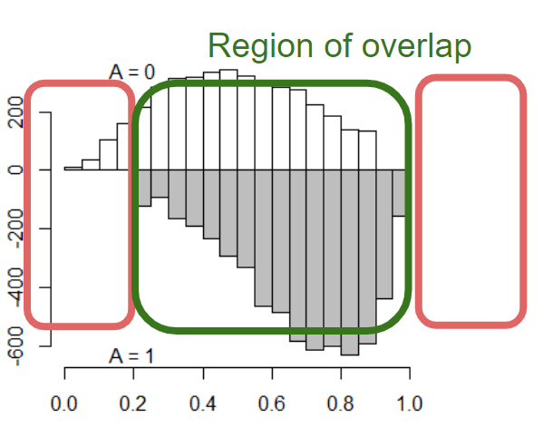
```

-   **El ajuste de regresión** generalmente no ofrece ninguna solución a esto.

    -   En consecuencia, la inferencia no es generalizable más allá de la región de superposición.

# Matching y propensity score

Para más detalles: <https://ds4ps.org/pe4ps-textbook/docs/p-080-matching>

Usaremos la base de datos de NHANES: <https://wwwn.cdc.gov/nchs/nhanes/default.aspx>

```{r}
load(file="NHANES17.RData") 
require(dplyr) 
analytic <- dplyr::select(analytic, 
                  cholesterol, # outcome
                  gender, age, race, education, 
                  married, bmi, # confounders
                  diabetes) # exposure
analytic$cholesterol <- ifelse(analytic$cholesterol > 240, 1, 0)
analytic$diabetes <- ifelse(analytic$diabetes == "Yes", 1, 0)

```

```{r}
library(gtsummary) 
set_gtsummary_theme(theme_gtsummary_compact())  

# theme to round percentages to one decimal place 
set_gtsummary_theme(list(`tbl_summary-fn:percent_fun` = function(x) sprintf("%.1f", x * 100)))

# No permite setear lo siguiente pero se puede agregar manualmente
                         #`tbl_regression:estimate_fun` = function(x) style_number(x, digits = 2),
                        #`tbl_regression:pvalue_fun` = function(x) style_pvalue(x, digits = 3)))  


# formato de digitos 
library(magrittr)  
style_percent_1digits <- purrr::partial(gtsummary::style_percent, digits = 1) 
style_number_2digits <- purrr::partial(gtsummary::style_number, digits = 2)


tbl_summary(analytic)
```

```{r, echo=FALSE, fig.cap=" "}
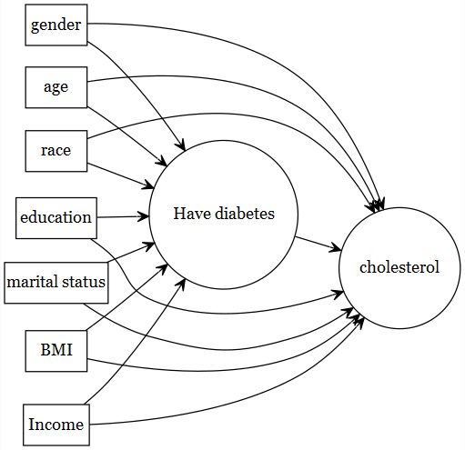
```

-   ¿Qué problema resuelve el emparejamiento y cuándo es apropiado?

    La randomización en un RCT tiene como objetivo crear grupos contrafacticos. En estudios observacionales no se puede manipular la asignación, pero sí se puede agrupar para que los grupos sean comparables

```{r, echo=FALSE, fig.cap=" "}
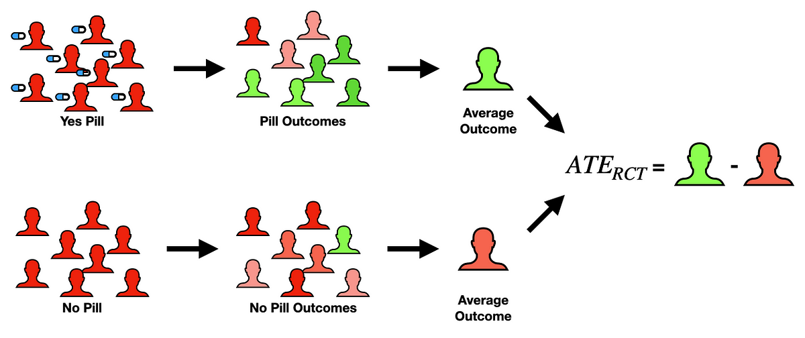
```

```{r, echo=FALSE, fig.cap=" "}
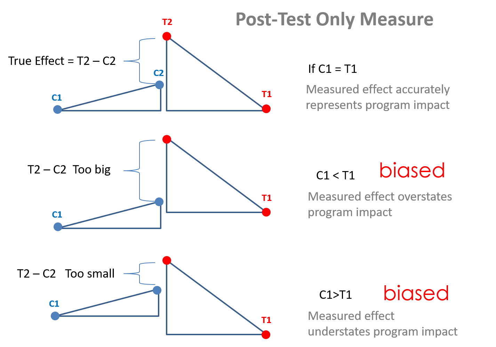
```

En nuestros datos veamos si son comparables por la variable de exposición

```{r}
tbl_summary(analytic, by = diabetes) %>% 
  add_p(pvalue_fun = function(x) style_pvalue(x, digits = 3))

```

-   ¿Qué es matching?

```{r, echo=FALSE, fig.cap=" "}
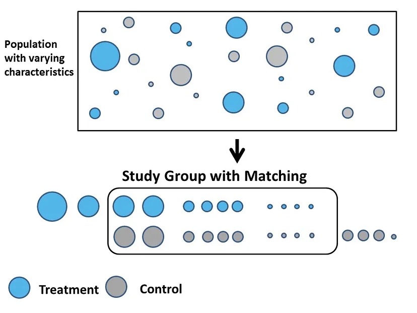
```

-   ¿Qué es una puntuación de propensión?

$PS = Prob(A=1|L)$

```{r, echo=FALSE, fig.cap=" "}
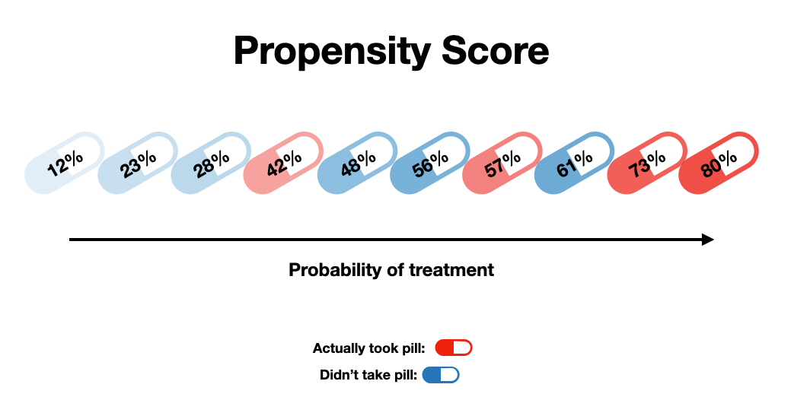
```

-   ¿Cómo se pueden estimar los puntajes de propensión y utilizarlos para el emparejamiento?

Existen muchas formas de utilizar los puntajes de propensión (PS) en el análisis

***Coincidencia o emparejamiento por PS***

```{r, echo=FALSE, fig.cap=" "}
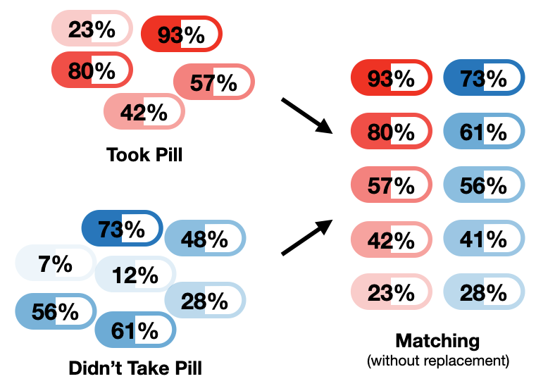
```

***Estratificación PS***

```{r, echo=FALSE, fig.cap=" "}
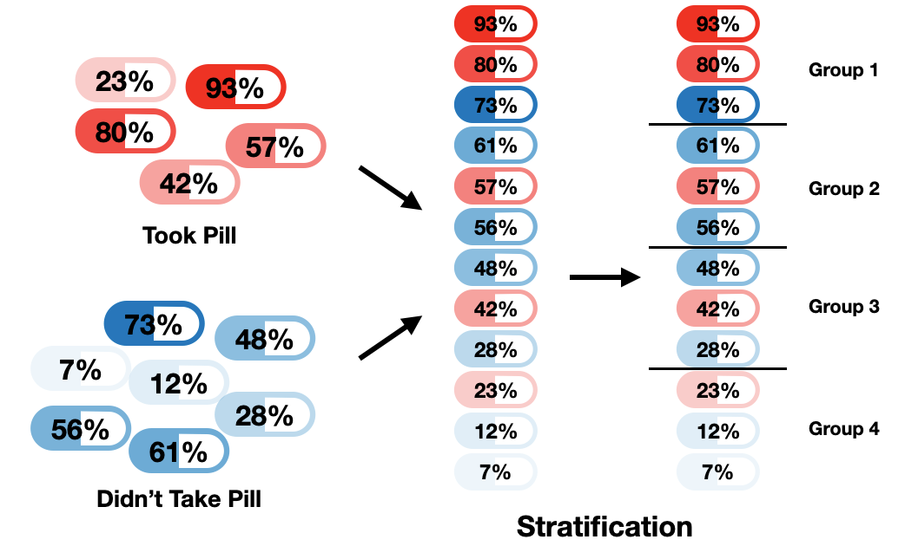
```

***PS utilizado como covariable***

$Y = X + PS$

-   ¿Cuál es la principal debilidad del emparejamiento, y estratificación por PS?

La inferencia todavia no es generalizable más allá de la región de superposición.

***Ponderación PS***

Separamos a ponderación por PS del resto porque en este método no se excluyen aquellos que no matchearon y construye dos grupos comparables (intercambiabilidad).

Por ello, este método (IPW) se considerá un método G

```{r, echo=FALSE, fig.cap=" "}
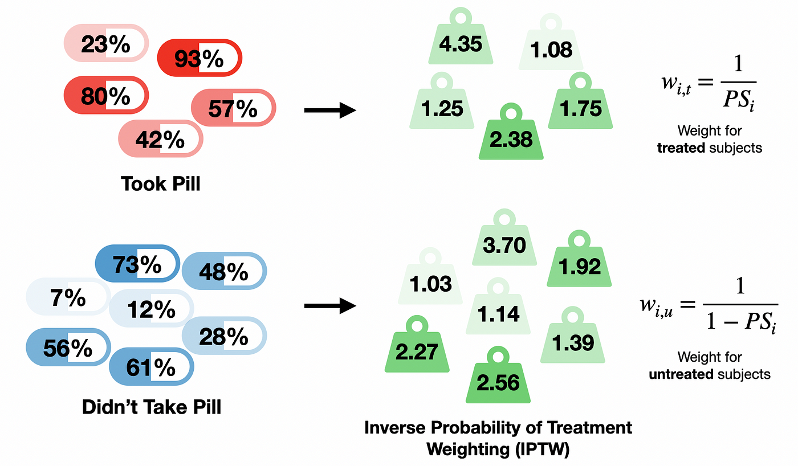
```

```{r, echo=FALSE, fig.cap=" "}
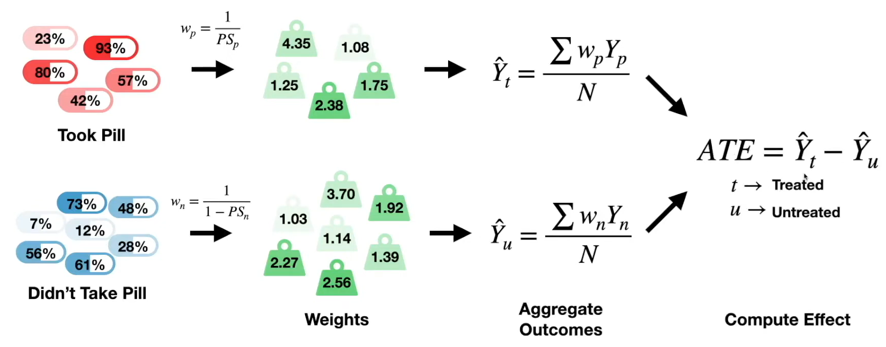
```

# PS matching

## Pasos


## PASO 1: Modelado de la exposición $Prob (A \text{~} L)$

```{r}
baselinevars <- c("gender", "age", "race", "education", "married", "bmi")
ps.formula <- as.formula(paste("diabetes", "~", paste(baselinevars, collapse = "+")))
ps.formula
```

```{r}
# fit logistic regression to estimate propensity scores
PS.fit <- glm(ps.formula,family="binomial", data=analytic)
require(jtools)
summ(PS.fit, confint = T, digits = 3)
```

-   El coeficiente de ajuste del modelo PS no es motivo de preocupación

-   El modelo puede ser rico: en la medida en que la predicción sea mejor

-   Pero evite problemas de multicolinealidad.

    -   ¿SE demasiado alto?

### Estabilidad del PS

-   **¿Cuántas variables** son demasiadas en el modelo PS?

    -   Depende del tamaño de la muestra.

        -   Demasiadas variables (y demasiadas interacciones + polinomios) significan demasiados parámetro por estimar

        -   Si hay una gran cantidad de datos disponibles, puede que no haya problema.

    -   Nuevamente observe la estabilidad: los coeficientes del modelo de exposición SE

**¿Estrategias de modelado alternativas?**

-   ML

### Estimación del PS

```{r}
# extract estimated propensity scores from the fit
analytic$PS <- predict(PS.fit, newdata = analytic, type="response")

require(cobalt)
bal.plot(analytic, var.name = "PS", 
         treat = "diabetes", 
         which = "both", 
         data = analytic)
```

## PASO 2: Propensity score Matching

-   PS es una variable continua.

    -   No es posible realizar una coincidencia exacta.

    -   A continuación se muestra un ejemplo de paciente de control (tratamiento = 0) con PS = 0,25

    -   Queremos encontrar un paciente tratado (tratamiento = 1) con un PS más cercano a 0,25.

```{r}
require(cobalt)
library(ggplot2)
bal.plot(analytic, var.name = "PS", 
         treat = "diabetes", 
         which = "both", 
         data = analytic) + 
  geom_vline(xintercept=0.25, linetype="dashed", color = "red")
```

### Método de correspondencia NN

Coincida utilizando estimaciones de puntuaciones de propensión con las siguientes opciones (opciones más simples)

-   **Método de emparejamiento** :

    -   coincidencia de vecino más cercano (NN)

-   **¿Se puede elegir el mismo sujeto sólo una vez** ?

    -   Coincidencia sin reemplazo

-   **Proximidad de los sujetos tratados-no tratados** :

    -   con calibrador = 0.2\*DE del logit del puntaje de propensión

-   **Relación de sujetos tratados y no tratados** :

    -   con una proporción de 1:1 (emparejamiento por pares)

### Ajuste inicial

Coincidencia 1:1 NN utilizando estimaciones de puntuaciones de propensión

```{r}
set.seed(123)
require(MatchIt)
match.obj <- matchit(ps.formula, data = analytic,
                     distance = 'logit', 
                     method = "nearest", 
                     replace=FALSE,
                     ratio = 1)
analytic$PS <- match.obj$distance
summary(match.obj$distance)
```

```{r}
match.obj

```

### Ajuste fino: añadir calibrador

Se sugiere utilizar una desviación estándar del logit del puntaje de propensión como calibrador para permitir una mejor comparabilidad de los grupos.

```{r}
logitPS <-  -log(1/analytic$PS - 1) 
# logit of the propensity score
0.2*sd(logitPS) # suggested in the literature

# choosing too strict PS has unintended consequences 

set.seed(123)
require(MatchIt)
match.obj <- matchit(ps.formula, data = analytic,
                     distance = 'logit', 
                     method = "nearest", 
                     replace=FALSE,
                     caliper = .2*sd(logitPS), 
                     ratio = 1)
analytic$PS <- match.obj$distance
summary(match.obj$distance)

match.obj

```

## PASO 3: Equilibrio y superposición

**¡El equilibrio es más importante que la predicción** !

-   Criterios para evaluar el éxito del paso 2: estimación del PS

    -   Mejor equilibrio

    -   Mejor superposición \[¡sin extrapolación!\]

    -   PS = 0 o PS = 1 necesita una inspección minuciosa

### Evaluación del equilibrio por SMD

**Datos completos** :

```{r}
library(tableone)
tab1e <- CreateTableOne(vars = baselinevars,
                        data = analytic, 
                        strata = "diabetes",
                        includeNA = TRUE,
                        test = TRUE, smd = TRUE)
print(tab1e, showAllLevels = FALSE, smd = TRUE, test = TRUE)
```

**Datos coincidentes** :

```{r}
matched.data <- match.data(match.obj)
tab1m <- CreateTableOne(vars = baselinevars, 
                        strata = "diabetes", 
                        data = matched.data, 
                        includeNA = TRUE, 
                        test = TRUE, smd = TRUE)

```

Compare la similitud de las características basales entre sujetos tratados y no tratados en una muestra emparejada por puntuación de propensión.

-   En este caso, compararemos SMD \< 0,1 o no.

-   En alguna literatura se proponen otros valores generosos (0,25). ( [Austin 2011b](https://ehsanx.github.io/psw/s3.html#ref-austin2011introduction) )

```{r}
print(tab1m, showAllLevels = FALSE, smd = TRUE, test = FALSE) 

```

```{r}
require(cobalt)
bal.plot(match.obj,  
         var.name = "distance", 
         which = "both", 
         type = "histogram",  
         mirror = TRUE)
```

```{r}
bal.tab(match.obj, un = TRUE, 
        thresholds = c(m = .1))
```

```{r}
love.plot(match.obj, binary = "std", 
          thresholds = c(m = .1))  
```

### SMD frente a valores P

Es posible obtener valores p para verificar el equilibrio, pero se desaconseja enfáticamente.

-   La evaluación del equilibrio basada en el valor P puede verse influenciada por el tamaño de la muestra

```{r}
print(tab1m, showAllLevels = FALSE, smd = FALSE, test = TRUE) 

```

## Visualización para superposición

```{r}
boxplot(PS ~ diabetes, data = analytic, 
        lwd = 2, ylab = 'PS')
stripchart(PS ~ diabetes, vertical = TRUE, 
           data = analytic, method = "jitter", 
           add = TRUE, pch = 20, col = 'blue')
```

```{r}
plot(match.obj, type = "jitter")
```

Visualización para evaluar problemas de superposición

```{r}
plot(match.obj, type = "hist")
```

## PASO 4: Modelado de resultados

-   Cierta flexibilidad en la elección del modelo de resultados

    -   considerado independiente del modelado de exposición

    -   Algunos proponen un enfoque doblemente robusto

    -   ¿Ajustando únicamente las covariables desequilibradas?

        -   El doble ajuste puede abordar la confusión residual ( [Nguyen et al., 2017](https://ehsanx.github.io/psw/s4.html#ref-nguyen2017double) )

## Modelo de resultados crudos

Estimar el efecto del tratamiento sobre los resultados utilizando una muestra emparejada por puntuación de propensión

```{r}
library(Publish)
fitc <- glm(cholesterol~diabetes,
            family=binomial, data = analytic)
publish(fitc)

```

```{r}
fit3 <- glm(cholesterol~diabetes,
            family=binomial, data = matched.data)
publish(fit3)
```

# Doble ajuste

Estimar el efecto del tratamiento sobre los resultados utilizando una muestra emparejada por puntaje de propensión y ajustar por covariables desequilibradas

```{r}
fit3r <- glm(cholesterol~diabetes + race,
            family=binomial, data = matched.data)
publish(fit3r)
```

## Modelo de resultados ajustado

¡Ajuste todas las covariables, nuevamente! (sugerido)

```{r}
out.formula <- as.formula(paste("cholesterol", "~ diabetes +", 
                               paste(baselinevars, 
                                     collapse = "+")))
out.formula

fit3b <- glm(out.formula,
            family=binomial, data = matched.data)
publish(fit3b)
```

El análisis anterior no tiene en cuenta los pares coincidentes durante la regresión.

## Consideraciones sobre la varianza

La literatura propone diferentes estrategias:

-   No controlar por pares/grupos

    -   Uselo `glm`como es

-   control de pares/grupos

    -   utilizar `cluster`opción (preferible)

    -   utilizar GEE o

    -   utilizar logística condicional

### Opción de clúster

A continuación se muestra un ejemplo que utiliza la opción de clúster:

```{r}
require(jtools)
summ(fit3b, rubust = "HC0", confint = TRUE, digists = 3, 
     cluster = "subclass", model.info = FALSE, 
     model.fit = FALSE, exp = TRUE)
```

### Bootstrap

-   Bootstrap para pares emparejados para WOR ( [Austin y Small 2014](https://ehsanx.github.io/psw/s4.html#ref-austin2014use) )

    -   método sencillo para estimar SE

    -   Puede que no sea apropiado para WR

-   A continuación se muestra un ejemplo de arranque de bloque; consulte [las viñetas](https://cran.r-project.org/web/packages/MatchIt/vignettes/estimating-effects.html) del paquete MatchIt para obtener detalles adicionales.

```{r}
library(boot)
# For binary outcomes
# with covariate adjustment and bootstrapping
pair_ids <- levels(matched.data$subclass)
est_fun <- function(pairs, i) {
  # See MatchIt vignettes
  #Compute number of times each pair is present
  numreps <- table(pairs[i])
  
  #For each pair p, copy corresponding matched.data row indices numreps[p] times
  ids <- unlist(lapply(pair_ids[pair_ids %in% names(numreps)],
                       function(p) rep(which(matched.data$subclass == p), 
                                              numreps[p])))
  
  #Subset matched.data with block bootstrapped ids
  matched.data_boot <- matched.data[ids,]
  
  #Fitting outcome the model
  out.formula <- as.formula(paste("cholesterol", "~ diabetes +", 
                               paste(baselinevars, 
                                     collapse = "+")))
  fit_boot <- glm(out.formula,
            family = binomial(link = "logit"), 
            weights = weights,
            data = matched.data_boot)
  
  #Estimate potential outcomes for each unit
  #Under control
  matched.data_boot$diabetes <- 0
  P0 <- weighted.mean(predict(fit_boot, matched.data_boot, type = "response"),
                      w = matched.data_boot$weights)
  Odds0 <- P0 / (1 - P0)
  
  #Under treatment
  matched.data_boot$diabetes <- 1
  P1 <- weighted.mean(predict(fit_boot, matched.data_boot, type = "response"),
                      w = matched.data_boot$weights)
  Odds1 <- P1 / (1 - P1)

  #Return marginal odds ratio
  return(Odds1 / Odds0)
}

boot_est <- boot(pair_ids, est_fun, R = 1000)
# R must be larger than # of data rows
boot_est

boot.ci(boot_est, type = "bca")

```

# PS vs. Double robust methods

Es importante comprender las fuentes de sesgo

Sesgo = Promedio de nuestras estimaciones en muestreo repetido - efecto real del tratamiento = sesgo debido a la muestra finita + sesgo debido a no diseñar el estudio adecuadamente + sesgo debido a la especificación incorrecta del modelo

La parte anterior suele ser menos comentada. Los métodos no paramétricos o de aprendizaje automático podrían ser una ventaja si se utilizan correctamente para reducir el sesgo debido a esta fuente. Este es un tema para otro tutorial, pero aquí mostraremos un ejemplo de la implicación de evitar la posibilidad de una especificación incorrecta del modelo.

Usando el ejemplo de Kang y Schafer ( [2007](https://ehsanx.github.io/psw/misspecify.html#ref-kang2007demystifying) ) , Naimi, Mishler y Kennedy ( [2017](https://ehsanx.github.io/psw/misspecify.html#ref-naimi2017challenges) ) y Balzer y Westling ( [2021](https://ehsanx.github.io/psw/misspecify.html#ref-balzer2021demystifying) ) , supongamos que no observamos la C variables directamente, y solo tenemos acceso a un conjunto de covariables transformadas

$L1=exp(C1/2)$

$L2=[(C2/(1+exp(C1))+10)]$

$L3=[(C1∗C3/25+0.6)^3]$

$L4=[(C2+C4+20)^2$

```{r}
create.data <- function(n, te = 6){
  # original covariates that generates A and Y
  C1 <- rnorm(n,0,1)
  C2 <- rnorm(n,0,1)
  C3 <- rnorm(n,0,1)
  C4 <- rnorm(n,0,1)
  pscore <- plogis(-1 +log(1.75)*(C1+C2+C3+C4) )
  # treatment generation model
  A <- rbinom(n, 1, pscore)
  eps <- rnorm(n,0,6) # error term
  get.Y <- function(A, TE=te) {120+TE*A+3*(C1+C2+C3+C4)+eps}
  Y1 <- get.Y(A=1, TE=te)
  Y0 <- get.Y(A=0, TE=te)
  # potential outcomes
  PO <- data.frame(cbind(pscore, Y1,Y0, C1, C2, C3, C4))
  # outcome generation model
  Y <- get.Y(A=A, TE=te)
  # misspecified versions of covariates
  L1 <- exp(C1/2)
  L2 <- C2/(1+exp(C1)) + 10
  L3 <- (C1*C3/25 + 0.6)^3
  L4 <- (C2 + C4 + 20)^2
  obs <- data.frame(cbind(L1,L2,L3,L4,A,Y))
  return(list(observed=obs, 
              Potential.Outcome= PO, 
              ate = mean(PO$Y1)-mean(PO$Y0)))
}

create.data(6)
```

## Comprensión del sesgo de muestra finita

Primer intento:

```{r}
set.seed(1)
result.data <- create.data(100)
round(coef(glm(Y ~ A + L1 + L2 + L3 + L4, family="gaussian", 
               data=result.data$observed)),2)
```

Segundo intento:

```{r}
set.seed(22)
result.data <- create.data(100)
round(coef(glm(Y ~ A + L1 + L2 + L3 + L4, family="gaussian", 
               data=result.data$observed)),2)
```

Tercer intento:

```{r}
set.seed(33)
result.data <- create.data(100)
round(coef(glm(Y ~ A + L1 + L2 + L3 + L4, family="gaussian", 
               data=result.data$observed)),2)
```

## Estimación utilizando diferentes métodos

Ahora trabajamos con datos más grandes: n = 10,000

```{r}
set.seed(123)
result.data <- create.data(10000)
```

### Regresión

```{r}
round(coef(glm(Y ~ A + L1 + L2 + L3 + L4, family="gaussian", 
               data=result.data$observed)),2)
```

### Puntuación de propensión

```{r}
require(MatchIt)
match.obj <- matchit(A ~ L1 + L2 + L3 + L4, method = "nearest", 
                     data = result.data$observed,
                     distance = 'logit', 
                     caliper = 0.2,
                     replace = FALSE, 
                     ratio = 1)
match.obj

matched.data <- match.data(match.obj)

round(coef(glm(Y ~ A, 
               family="gaussian", 
               data=matched.data)),2)
```

Resultados ajuste

```{r}
round(coef(glm(Y ~ A + L1 + L2 + L3 + L4, 
               family="gaussian", 
               data=matched.data)),2)
```

### Método de aprendizaje automático doble

Estamos usando DML con un solo método de aprendizaje:

```{r}
res <- result.data$observed
require(DoubleML)
dd <- DoubleMLData$new(res, 
                       y_col = "Y", 
                       d_cols = "A", 
                       x_cols = c("L1","L2","L3","L4"))
library(mlr3)
library(mlr3learners)
lgr::get_logger("mlr3")$set_threshold("warn")

learner = lrn("regr.ranger", 
              num.trees=500, 
              mtry=floor(sqrt(5)), 
              max.depth=5, 
              min.node.size=2)
ml_g = learner$clone() # outcome modelling
ml_m = learner$clone() # exposure modelling

set.seed(1234)
dml.res <- DoubleMLPLR$new(dd, ml_g=ml_g, ml_m=ml_m)
dml.res$fit()
print(dml.res)
```

```{r}
dml.res$summary()
```

### Error común

-   Resultados PS = 'causal';

-   regresión = 'no causal'.

No. “Los resultados de ambos métodos deberían llevar a las mismas conclusiones” ( [D’Agostino Jr 1998](https://ehsanx.github.io/psw/final.html#ref-d1998propensity) ) .

Cuando los resultados se desvían, ¡es importante investigar por qué!

Establecer la causalidad requiere establecer temporalmente y la integración de la experiencia en el área temática.

## Beneficios del PS

-   **Intuitivo** : comparar dos grupos similares

-   **Proceso de 2 pasos**

    -   Alienta a los investigadores a pensar en el proceso de generación de tratamientos.

    -   Ajuste el modelo de resultados con sólo variables importantes.

    -   Permite pensar más en la etapa de diseño (buena separación del proceso de construcción del modelo de resultados).

-   Ajuste **de modelo PS robusto** (con términos de orden superior); enfoque en la predicción; preocupación menor por la sobreparametrización.

-   **Reducir la dimensión** , útil cuando la exposición es frecuente pero el resultado es raro (evento por variable).

    -   Un modelo de resultados más pequeños puede ser útil en los controles diagnósticos.

-   **Diagnóstico**

    -   El diagnóstico (comprobación del equilibrio) es mucho más sencillo en comparación con el gráfico residual/de influencia.

    -   La comparación gráfica ayuda a identificar áreas que no se superponen.

## Limitaciones del PS

-   Población coincidente versus población objetivo: a menudo no son lo mismo.

    -   La correspondencia de PS puede proporcionar una estimación del efecto de un subconjunto, que puede ser difícil de identificar en la población real.

-   ¡Puede eliminar muchos sujetos del estudio!

-   El SMD se utiliza con mucha frecuencia, pero puede no ser suficiente para determinar el equilibrio.

## ¿Cuándo el PS puede no ser útil?

-   Cuando el resultado es común (cinco veces el número de variables disponibles), entonces el PS puede no tener ninguna ventaja sobre el modelo de regresión

-   El PS no puede hacer nada con respecto a la confusión no medida, como tampoco lo puede hacer la regresión de resultados.

    -   Considere enfoques de variables instrumentales (VI).

-   Se pueden utilizar enfoques no paramétricos (ML) para relajar el supuesto de linealidad al estimar PS, pero la estimación de la varianza se vuelve difícil.

    -   Se deben utilizar métodos doblemente robustos cuando se utilizan enfoques no paramétricos (ML).

# IPW

## Cargamos las librerias

```{r}
library(tidyverse)
library(broom)
library(scales)
library(ggdag)
library(dagitty)
library(truncnorm)
library(ipw)
library(WeightIt)
```

## Tratamientos binarios

En este ejemplo, generaremos un DAG para un programa hipotético en el que el uso de mosquiteros reduce el riesgo de malaria. Esa relación se ve afectada tanto por los ingresos como por la salud, y los ingresos influyen en la salud. Tanto los ingresos como la salud aumentan la probabilidad de uso de mosquiteros.

El tratamiento aquí es binario: o la gente usa las redes o no las usa.

```{r}
mosquito_dag <- dagify(mal ~ net + inc + hlth,
                       net ~ inc + hlth,
                       hlth ~ inc,
                       coords = list(x = c(mal = 4, net = 1, inc = 2, hlth = 3),
                                     y = c(mal = 1, net = 1, inc = 2, hlth = 2)),
                       exposure = "net",
                       outcome = "mal")

ggdag_status(mosquito_dag) +
  guides(color = "none") +
  theme_dag()
```

Mediremos estos nodos de la siguiente manera:

Riesgo de malaria : escala de 0 a 100, en general alrededor de 40, pero con un rango de entre 10 y 80. Es mejor utilizar una distribución Beta. Uso de la red : variable binaria 0/1, VERDADERO/FALSO, donde el 50 % de las personas utilizan redes. Lo mejor es utilizar una distribución binomial. Sin embargo, dado que queremos utilizar otras variables que aumenten la probabilidad de utilizar una red, generaremos una variable continua latente, la reescalaremos a 0-1 y luego la utilizaremos como probabilidades rbinom()y asignaremos a las personas a un tratamiento en función de esas probabilidades. Ingresos : ingresos semanales, medidos en dólares, generalmente alrededor de 500 ± 300. Es mejor utilizar una distribución normal. Salud : escala de 0 a 100, generalmente alrededor de 70, pero también puede variar entre 50 y 100. Es mejor utilizar una distribución Beta.

**Creamos la base de datos**

```{r}
# Make this randomness consistent
set.seed(1234)

# Simulate 1138 people (just for fun)
n_people <- 1138

net_data <- tibble(
  # Make an ID column (not necessary, but nice to have)
  id = 1:n_people,
  # Generate income variable: normal, 500 ± 300
  income = rnorm(n_people, mean = 500, sd = 75)
) %>% 
  # Generate health variable: beta, centered around 70ish
  mutate(health_base = rbeta(n_people, shape1 = 7, shape2 = 4) * 100,
         # Health increases by 0.02 for every dollar in income
         health_income_effect = income * 0.02,
         # Make the final health score and add some noise
         health = health_base + health_income_effect + rnorm(n_people, mean = 0, sd = 3),
         # Rescale so it doesn't go above 100
         health = rescale(health, to = c(min(health), 100))) %>% 
  # Generate net variable based on income, health, and random noise
  mutate(net_score = (0.5 * income) + (1.5 * health) + rnorm(n_people, mean = 0, sd = 15),
         # Scale net score down to 0.05 to 0.95 to create a probability of using a net
         net_probability = rescale(net_score, to = c(0.05, 0.95)),
         # Randomly generate a 0/1 variable using that probability
         net = rbinom(n_people, 1, net_probability)) %>% 
  # Finally generate a malaria risk variable based on income, health, net use,
  # and random noise
  mutate(malaria_risk_base = rbeta(n_people, shape1 = 4, shape2 = 5) * 100,
         # Risk goes down by 10 when using a net. Because we rescale things,
         # though, we have to make the effect a lot bigger here so it scales
         # down to -10. Risk also decreases as health and income go up. I played
         # with these numbers until they created reasonable coefficients.
         malaria_effect = (-30 * net) + (-1.9 * health) + (-0.1 * income),
         # Make the final malaria risk score and add some noise
         malaria_risk = malaria_risk_base + malaria_effect + rnorm(n_people, 0, sd = 3),
         # Rescale so it doesn't go below 0,
         malaria_risk = rescale(malaria_risk, to = c(5, 70))) %>% 
  select(-c(health_base, health_income_effect, net_score, net_probability, 
            malaria_risk_base, malaria_effect))

head(net_data)
```

```{r}
# Wrong correlation-is-not-causation effect
model_net_naive <- lm(malaria_risk ~ net, data = net_data)
tidy(model_net_naive)
```

Según la lógica del cálculo do , debemos realizar ajustes tanto en función del ingreso como de la salud:

```{r}
adjustmentSets(mosquito_dag)

```

Lo haremos con ponderación de probabilidad inversa. Primero, utilizaremos los factores de confusión de salud e ingresos para predecir el tratamiento o el uso neto, y luego generaremos puntajes de propensión. Luego, utilizaremos esos puntajes de propensión para generar ponderaciones de probabilidad inversa siguiendo esta fórmula:

$$\frac{\text{Treatment}}{\text{Propensity}} + \frac{1 - \text{Treatment}}{1 - \text{Propensity}}$$

## IPW paso a paso, tratamiento binario

Así es como lo hacemos con R:

```{r}
# Logit model to predict net use
model_predict_net <- glm(net ~ income + health,
                         family = binomial(link = "logit"),
                         data = net_data)

# Generate propensity scores and IPWs
net_data_ipw <- augment_columns(model_predict_net, net_data,
                                type.predict = "response") %>% 
  rename(propensity = .fitted) %>% 
  mutate(ipw = (net / propensity) + ((1 - net) / (1 - propensity)))

net_data_ipw %>% 
  select(id, income, health, net, malaria_risk, propensity, ipw) %>% 
  head()
```

Finalmente, utilizaremos esos pesos en un modelo de regresión para encontrar el ATE. Después de ajustar los factores de confusión y cerrar las vías de entrada abiertas por los ingresos y la salud, el efecto de las redes es -10,5 , que es más preciso que la estimación ingenua que encontramos antes. ¡Genial!

```{r}
model_net_ipw <- lm(malaria_risk ~ net, data = net_data_ipw, weights = ipw)
tidy(model_net_ipw)
```

## IPW con el paquete WeightIt , tratamiento binario

```{r}
weights_weightit <- weightit(net ~ income + health,  # Model net use with confounders
                             data = net_data, 
                             estimand = "ATE",  # Find the ATE
                             method = "ps")  # Build weights with propensity scores
weights_weightit

head(weights_weightit$weights)

net_data_weightit <- net_data %>% 
  mutate(ipw = weights_weightit$weights)

model_net_weightit <- lm(malaria_risk ~ net, 
                         data = net_data_weightit, weights = ipw)
tidy(model_net_weightit)

```

## Tratamientos continuos

Los pesos de probabilidad inversa también funcionan con variables de tratamiento continuas, pero las matemáticas son un poco complicadas.

Para este ejemplo, generaremos un DAG para un programa hipotético en el que las familias más pobres reciben subvenciones en efectivo que pueden gastar en suministros para la prevención de la malaria, como mosquiteros, tratamientos químicos y medicamentos. Es un programa voluntario: las personas se autoseleccionan para participar y asumiremos que se inscribirán las personas con peores puntuaciones de salud y menores ingresos. El monto de la subvención depende de los ingresos.

El tratamiento es continuo: las personas reciben distintas cantidades de dinero en concepto de subvenciones contra la malaria. Para simplificar, todo el mundo recibe una subvención.

El DAG se ve igual que antes (ya que estamos tratando de mantener las cosas súper simples aquí):

```{r}
grant_dag <- dagify(mal ~ grant + inc + hlth,
                    grant ~ inc + hlth,
                    hlth ~ inc,
                    coords = list(x = c(mal = 4, grant = 1, inc = 2, hlth = 3),
                                  y = c(mal = 1, grant = 1, inc = 2, hlth = 2)),
                    exposure = "grant",
                    outcome = "mal")

ggdag_status(grant_dag) +
  guides(color = "none") +
  theme_dag()
```

Mediremos estos nodos de la siguiente manera:

Riesgo de malaria : escala de 0 a 100, en general alrededor de 40, pero con un rango de entre 10 y 80. Es mejor utilizar una distribución Beta. Subvención : cantidad entre 5 y 40, con un centro en torno a 20. Ingresos : ingresos semanales, medidos en dólares, generalmente alrededor de 500 ± 300. Es mejor utilizar una distribución normal. Salud : escala de 0 a 100, generalmente alrededor de 70, pero también puede variar entre 50 y 100. Es mejor utilizar una distribución Beta.

```{r}
# Make this randomness consistent
set.seed(1234)

# Simulate 1504 people
n_people <- 1504

grant_data <- tibble(
  # Make an ID column (not necessary, but nice to have)
  id = 1:n_people,
  # Generate income variable: normal, 500 ± 300
  income = rnorm(n_people, mean = 500, sd = 75)
) %>%
  # Generate health variable: beta, centered around 70ish
  mutate(health_base = rbeta(n_people, shape1 = 7, shape2 = 4) * 100,
         # Health increases by 0.02 for every dollar in income
         health_income_effect = income * 0.02,
         # Make the final health score and add some noise
         health = health_base + health_income_effect + rnorm(n_people, mean = 0, sd = 3),
         # Rescale so it doesn't go above 100
         health = rescale(health, to = c(min(health), 100))) %>% 
  # Generate grant variable
  mutate(grant_base = rtruncnorm(n_people, mean = 18, sd = 10, a = 5, b = 40),
         # Grants are higher for people with lower incomes; higher for people with lower health
         grant_effect = (income * -0.25) + (health * -0.5),
         # Make the final grant amount + noise + rescale it back down
         grant = grant_base + grant_effect + rnorm(n_people, mean = 0, sd = 8),
         grant = round(rescale(grant, to = c(5, 40)), 0)) %>% 
  # Finally generate a malaria risk variable based on income, health, grant amount,
  # and random noise
  mutate(malaria_risk_base = rbeta(n_people, shape1 = 4, shape2 = 5) * 100,
         # Risk goes down as grant money goes up. I played with these numbers
         # until they created reasonable coefficients.
         malaria_effect = (-40 * grant) + (-25 * health) + (-0.05 * income),
         # Make the final malaria risk score and add some noise
         malaria_risk = malaria_risk_base + malaria_effect + rnorm(n_people, 0, sd = 3),
         # Rescale so it doesn't go below 0,
         malaria_risk = rescale(malaria_risk, to = c(5, 70))) %>% 
  select(-c(health_base, health_income_effect, grant_base, grant_effect, 
            malaria_risk_base, malaria_effect))

head(grant_data)
```

## IPW manual, tratamiento continuo

Si sólo analizamos el efecto de las subvenciones sobre el riesgo de malaria sin ningún ajuste, cada dólar de subvención adicional provoca una reducción de 0,4 puntos de riesgo de malaria. Sin embargo, una vez más, esto es erróneo debido a la confusión.

```{r}
# Wrong correlation-is-not-causation effect
model_grant_naive <- lm(malaria_risk ~ grant, data = grant_data)
tidy(model_grant_naive)
```

Según la lógica del cálculo do , nuevamente necesitamos ajustar tanto los ingresos como la salud:

```{r}
adjustmentSets(grant_dag)

```

Aquí es donde las matemáticas se complican. Cuando trabajamos con un tratamiento binario, calculamos el índice de propensión para cada observación y luego usamos esta fórmula para generar ponderaciones de probabilidad inversa:

Sin embargo, no podemos hacer eso con variables de tratamiento continuas, ya que realmente no tenemos puntajes de propensión. En su lugar, usamos esta fórmula complicada, pero no demasiado aterradora \[de Naimi et al. 14\] <https://doi.org/10.1097/eDe.0000000000000053>

$$\text{IPW} = \frac{f_X (X; \mu_1, \sigma^2_1)}{f_{X | C} (X | C = c; \mu_2, \sigma^2_2)}$$

Uf. Son muchas matemáticas, pero no es tan complicado si las analizamos en detalle

Podemos calcular cada elemento de esta fracción y luego generar los pesos de probabilidad inversa. A continuación, se muestra cómo hacerlo con R:

```{r}
# The numerator is the probability distribution of just the treatment variable.
# We'll use a normal distribution for it (hence dnorm()). We need to feed
# dnorm() the grant amount for each person, the predicted value from a simple
# grant ~ 1 model, and the sd of the residuals from that model
model_num <- lm(grant ~ 1, data = grant_data)
num <- dnorm(grant_data$grant,
             predict(model_num),
             sd(model_num$residuals))

# The denominator is the probability distribution of the treatment variable
# explained by the confounders. We'll again use a normal distribution for it.
# We'll feed dnorm() the grant amount, the predicted value from a model that
# includes the confounders, and the sd of the residuals from that model
model_den <- lm(grant ~ health + income, data = grant_data)
den <- dnorm(grant_data$grant,
             predict(model_den),
             sd(model_den$residuals))

# Finally, we make actual IPW weights by building the fraction
grant_data_ipw <- grant_data %>% 
  mutate(ipw = num / den)

head(grant_data_ipw)
```

Ahora podemos usar los pesos para encontrar el ATE tal como lo hicimos con el tratamiento binario:

```{r}
model_grant_ipw <- lm(malaria_risk ~ grant, data = grant_data_ipw, weights = ipw)
tidy(model_grant_ipw)
```

Por lo tanto, cada dólar de subvención provoca una reducción de -1,1 puntos de riesgo de malaria . ¡Genial!

## IPW con el paquete WeightIt , tratamiento continuo

El paquete WeightIt también maneja pesos continuos. La sintaxis es mucho más sencilla: no hay necesidad de preocuparse por numeradores y denominadores.

```{r}
weights_weightit <- weightit(grant ~ income + health,  # Model grant amount with confounders
                             data = grant_data, 
                             estimand = "ATE",
                             stabilize = TRUE)
weights_weightit

head(weights_weightit$weights)

```

Sin embargo, por razones matemáticas que no entiendo, los pesos que genera no son los mismos que los que obtenemos al hacerlo a mano o con ipwpoint(). De hecho, son casi exactamente el doble de grandes que los ipwpoint()pesos manuales y :

```{r}
# Manual weights
head(grant_data_ipw$ipw)

# weightit() weights / 2
head(weights_weightit$weights) / 2
```

Seguramente hay un argumento weightit()que me estoy perdiendo en alguna parte.

De todos modos, por razones más matemáticas que no entiendo (posiblemente el escalamiento no afecta en el resultado), el ATE es idéntico aunque los pesos se duplican aproximadamente:

```{r}
grant_data_weightit <- grant_data %>% 
  mutate(ipw = weights_weightit$weights)

model_grant_weightit <- lm(malaria_risk ~ grant, 
                           data = grant_data_weightit, weights = ipw)
tidy(model_grant_weightit)
```
