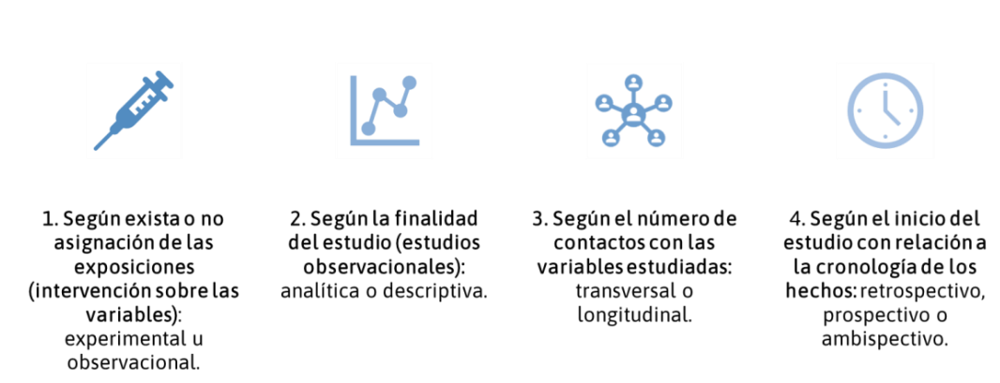
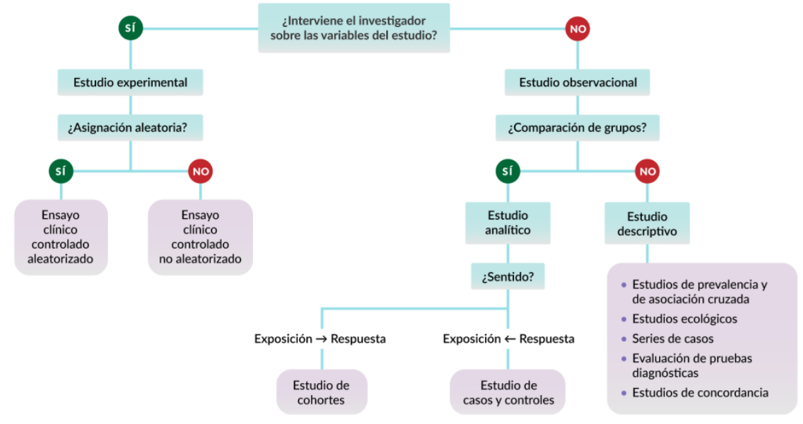
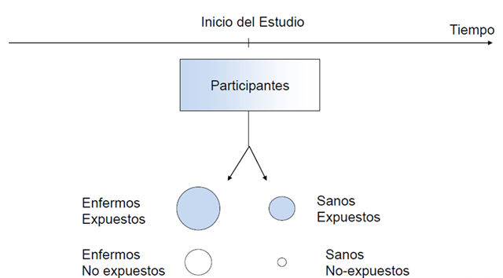
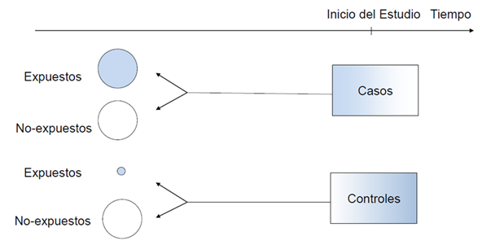
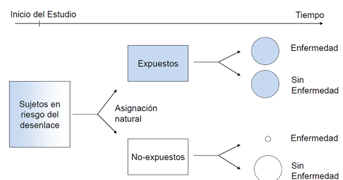

# Diseños de investigación: qué responde cada uno

::: {.callout-note}
## 🩺 Escenario

Quieres saber si el **uso crónico de AINE** acelera la pérdida de función renal en adultos mayores con ERC. Puedes (a) medir TFGe y uso de AINE en una sola consulta, (b) seguir durante años a usuarios y no usuarios, o (c) partir de quienes ya progresaron a diálisis y preguntarles por sus AINE del pasado. Es la misma duda con tres diseños, y cada uno da una respuesta distinta (y con distintos riesgos de equivocarse).
:::

## Lo que vamos a hacer

-   Conocer los diseños de los estudios primarios cuantitativos y la pregunta que mejor responde cada uno.
-   Ver con **datos simulados** por qué el diseño decide qué medida de asociación es válida.
-   Resolver el "reto del día": diseñar el estudio de los AINE.



## Paso 1. El mapa de diseños

-   **Experimentales:** ensayos clínicos (aleatorizados o no), ensayos comunitarios y preclínicos.
-   **Observacionales analíticos** (comparan grupos): transversal analítico, casos y controles, cohorte.
-   **Observacionales descriptivos:** prevalencia o incidencia, ecológicos (datos agregados por región o servicio), series y reportes de casos.



No hay una única clasificación (cada fuente la dibuja un poco distinta). Lo importante no es la etiqueta, sino la **pregunta que el diseño puede responder**.

## Paso 2. Ensayos clínicos

Un ensayo clínico evalúa de forma experimental la eficacia y la seguridad de un fármaco, técnica o estrategia en personas. Se describen con cuatro ejes: *asignación* (aleatorizado o no), *conocimiento* (abierto o ciego), *objetivo* (superioridad, no inferioridad, equivalencia) y *estructura* (grupos paralelos, cruzados, factoriales); además, la *fase* (I seguridad; II eficacia inicial; III comparación a gran escala; IV vigilancia tras la aprobación).

El ensayo que suele evaluar eficacia y seguridad es **aleatorizado, controlado, de grupos paralelos y de superioridad**. Qué hace especial a la aleatorización, el cegamiento y el análisis por intención de tratar lo desarrollamos en el Capítulo 3.1; el reporte se hace con CONSORT.

## Paso 3. Los tres diseños observacionales analíticos

Piensa en cada uno como **desde dónde parte el investigador**.

### Transversal analítico: la fotografía

Mide exposición y desenlace **en el mismo momento**. Es rápido y barato, y sirve para generar hipótesis.



*Ejemplo:* medir en una consulta la albuminuria y si la presión arterial está controlada. Verás si se asocian, pero no sabrás qué fue primero: ¿el mal control eleva la albuminuria, la albuminuria dificulta controlar la presión o ambas comparten una causa? Medida típica: **razón de prevalencias**.

### Casos y controles: parte del desenlace

Se eligen personas **con** el desenlace (casos) y **sin** él (controles) y se compara su **exposición pasada**. Es eficiente para enfermedades raras o de latencia larga.



*Ejemplo:* casos son pacientes hospitalizados con lesión renal aguda (LRA); controles son hospitalizados sin LRA de la misma población, y a todos se les pregunta por AINE en la semana previa.

Lo que se debe cuidar:

-   *Casos:* mejor los **incidentes** (diagnósticos nuevos); los prevalentes suelen ser más leves y su exposición, difícil de medir.
-   *Controles:* deben salir de **la misma población base** que los casos, elegirse **sin mirar la exposición** y medirse igual que los casos. Rara vez hay ganancia con más de 4 controles por caso.
-   Como el investigador *decide* cuántos controles incluir, **no puede calcular riesgos**: la medida válida es el **odds ratio (OR)**.

### Cohorte: parte de la exposición

Se sigue a **expuestos y no expuestos** (libres del desenlace al inicio) y se compara cuántos desarrollan el evento. Puede ser *prospectiva* (sigues hacia el futuro) o *retrospectiva* (reconstruyes con registros).



*Ejemplo:* pacientes con albuminuria severa (UACR ≥ 300 mg/g) frente a quienes tienen menos, seguidos 5 años para ver quiénes inician diálisis o trasplante. Permite calcular **incidencia, riesgo relativo, tasas y HR**, y establece que la exposición **precede** al desenlace. Su costo: seguimiento largo, pérdidas y confusión.

### Veámoslo con datos: un universo, dos diseños

En la base **simulada** `ckd_isglt2` (5000 pacientes) tenemos a todos seguidos 36 meses. Usémosla como "el universo" y veamos qué obtiene cada diseño al preguntar si iniciar un iSGLT2 se asocia con el evento renal.

```{r}
#| label: universo-disenos
library(tidyverse)
source("R/funciones_epi.R")                     # medidas_2x2()
source("R/funciones_extra_a.R")                # pct(): formato de porcentajes
ckd <- read_csv("Bases/ckd_isglt2.csv", show_col_types = FALSE)

# a) COHORTE: seguimos a todos (iSGLT2 -> evento). Filas = expuestos / no expuestos
tab_c <- table(isglt2 = ckd$isglt2, evento = ckd$evento)
cohorte <- medidas_2x2(tab_c["1", "1"], tab_c["1", "0"], tab_c["0", "1"], tab_c["0", "0"])
cohorte
```

La cohorte da riesgos de `r pct(cohorte$estimado[1])` (con iSGLT2) y `r pct(cohorte$estimado[2])` (sin él): **RR = `r num(cohorte$estimado[4], 2)`** y **OR = `r num(cohorte$estimado[5], 2)`**.

Ahora hacemos un estudio de **casos y controles** con la misma población: tomamos a todos los que tuvieron evento y a 2 controles por caso.

```{r}
#| label: universo-casos-controles
set.seed(2025)                                   # para reproducir el sorteo de controles
casos     <- ckd |> filter(evento == 1)
controles <- ckd |> filter(evento == 0) |> slice_sample(n = 2 * nrow(casos))
cc <- bind_rows(casos, controles)

tab_cc <- table(isglt2 = cc$isglt2, caso = cc$evento)    # filas = expuestos / no expuestos
casos_controles <- medidas_2x2(tab_cc["1", "1"], tab_cc["1", "0"], tab_cc["0", "1"], tab_cc["0", "0"])
casos_controles
```

**Qué vemos.** El OR del estudio de casos y controles (`r num(casos_controles$estimado[5], 2)`) es casi el de la cohorte (`r num(cohorte$estimado[5], 2)`) aunque se usó una fracción de los pacientes. Pero las "proporciones" que imprime la función (`r pct(casos_controles$estimado[1], 0)` vs. `r pct(casos_controles$estimado[2], 0)`) y el RR (`r num(casos_controles$estimado[4], 2)`) **no significan nada**: dependen de cuántos controles decidimos sortear. Por eso el diseño de casos y controles solo entrega un OR válido (Capítulo 2.2).

::: {.callout-warning}
## ⚠️ Trampa frecuente: cohorte retrospectiva no es casos y controles

En una cohorte retrospectiva partes de personas **en riesgo** (libres del desenlace) y reconstruyes con registros qué les pasó: puedes calcular incidencias. En casos y controles partes de quienes **ya tienen** el desenlace y de un grupo de comparación sin él: no puedes. La diferencia no es si miras al pasado, sino *desde dónde partes*.
:::

## Paso 4. Diseños descriptivos

-   **Prevalencia (transversal):** proporción de personas con la condición en un momento. *Ej.:* prevalencia de ERC en adultos con diabetes de una región.
-   **Incidencia:** casos **nuevos** en un periodo. Exige seguimiento (cohorte) o registros con fecha de diagnóstico; una sola encuesta transversal **no** estima incidencia. *Ej.:* nuevos ingresos a diálisis por año en una región.
-   **Ecológico:** el dato es de un grupo, no de un paciente (cada punto es una región). Cuidado con la **falacia ecológica**: lo que ocurre entre regiones no tiene por qué ocurrir dentro de cada paciente. *Ej.:* tasa regional de diabetes y tasa regional de ingreso a diálisis.
-   **Serie de casos:** describe a un grupo con una condición, **sin comparador**. Sirve para identificar patrones y generar hipótesis. *Ej.:* presentación y evolución de pacientes con nefritis lúpica clase IV en un año.

## Reto del día

Eres residente y quieres saber si el **uso crónico de AINE** se asocia con mayor progresión de ERC en adultos mayores. Para **uno** de estos diseños, escribe un esquema de 5 líneas (quiénes, cómo mides la exposición, cómo defines progresión, qué medida usarás, qué sesgo temerías más):

-   **Transversal analítico:** ¿cómo medirías AINE y TFGe en un solo momento? ¿Qué limitación tiene frente a los otros?
-   **Cohorte:** ¿cómo seguirías 3 a 5 años a usuarios y no usuarios para comparar pérdida de TFGe o inicio de diálisis?
-   **Casos y controles:** ¿cómo elegirías casos (pacientes que progresan) y controles? ¿Qué sesgos acechan en esa elección?

::: {.callout-important}
## 🎯 En resumen: ¿qué diseño uso?

| Pregunta | Diseño | Medida típica | Principal limitación |
|---|---|---|---|
| ¿Cuántos tienen la condición? | Transversal (prevalencia) | Prevalencia | No hay secuencia temporal |
| ¿Se asocia A con B en un momento? | Transversal analítico | RP, OR | Causalidad inversa |
| ¿Qué exposiciones tuvieron quienes tienen una enfermedad rara? | Casos y controles | OR | Selección de controles; sesgo de recuerdo |
| ¿Qué le ocurre a quienes están expuestos? | Cohorte | RR, tasa, HR | Costo, pérdidas, confusión |
| ¿Funciona esta intervención? | ECA | RR, diferencia de riesgos, HR | Costo, factibilidad, validez externa |
| ¿Cómo evolucionan unos pocos pacientes? | Serie de casos | Descripción | Sin comparador |
:::

## Referencias

1.  Torales J, Barrios I. Diseño de investigaciones: algoritmo de clasificación y características esenciales. *Med Clín Soc*. 2023;7(3):210-235. <https://doi.org/10.52379/mcs.v7i3.349>

2.  Ledesma Albarrán JM, Gutiérrez Olid M. Estudios experimentales. Ensayo clínico aleatorizado. *Form Act Pediatr Aten Prim*. 2013;6:123-132. <https://fapap.es/articulo/246/estudios-experimentales-ensayo-clinico-aleatorizado>

3.  Pita Fernández S. Epidemiología. Conceptos básicos. En: *Tratado de Epidemiología Clínica*. Madrid: DuPont Pharma; 1995. p. 25-47.

## Nota editorial

-   Esta sección fue editada con asistencia de IA (ChatGPT; revisión editorial con Claude). Los datos de los ejemplos son simulados.
