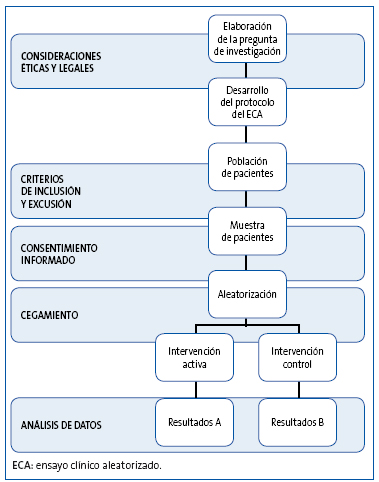

# Diseños de investigación

Un estudio bien diseñado es la piedra angular de una investigación científica rigurosa y confiable. El diseño de investigación define la estrategia metodológica que guiará la recopilación, y en cierto grado el análisis e interpretación de los datos, asegurando que los datos obtenidos permitan conclusiones válidas a partir de resultados reproducibles. En el ámbito de la Medicina y las Ciencias de la Salud, la elección del diseño adecuado es crucial, ya que impacta directamente en la solidez de la evidencia científica generada.

Los diseños de investigación pueden clasificarse en diversas categorías según su estructura, enfoque metodológico y finalidad. Existen diseños experimentales, observacionales, longitudinales, transversales, entre otros. Un diseño bien estructurado permite minimizar sesgos, optimizar la validez de los resultados y garantizar que la investigación pueda responder de manera objetiva y precisa a los interrogantes planteados.


En esta sección, abordaremos brevemente los distintos tipos de diseños de investigación empleados en estudios primarios dentro del paradigma cuantitativo. Exploraremos sus características esenciales, ventajas y limitaciones, proporcionando ejemplos que facilitarán la comprensión de su aplicación en el contexto biomédico.

## Clasificación general

Los diseños en estudios de tipo experimental se enumeran a continuación:

1.  Ensayos clínicos

    1.  Ensayos clínicos aleatorizados (ECA)

    2.  Ensayos clínicos no aleatorizados (ECNA)

    3.  Ensayos comunitarios

2.  Ensayos no clínicos o pre-clínicos

Por otro lado, los diseños en estudios observacionales "analíticos" son:

1.  Transversal analítico

2.  Caso-control

3.  Cohorte

Por último, se pueden considerar dentro de los diseños de estudios observacionales "descriptivos" a:

1.  Estudios de Prevalencia o Incidencia

2.  Estudios ecológicos o de panel

3.  Serie de casos o reportes de casos


::: callout-warning
## ⚠️ Cuidado: no hay una única clasificación

Muchas fuentes bibliográficas clasifican los diseños de forma algo distinta. Esta clasificación sirve para ordenarlos, pero lo importante es la **pregunta** que cada diseño puede responder *\[lo descubriremos en la siguiente sección\]*.
:::

## Ensayos clínicos

Un EC es una evaluación experimental de un producto, sustancia, medicamento, técnica diagnóstica o terapéutica que, a través de su aplicación a seres humanos, pretende valorar su eficacia y seguridad.

Existen varios tipos de diseño de ensayos clínicos, que se pueden clasificar de la siguiente manera:

```{r, echo=FALSE, message=FALSE, warning=FALSE}
library(DT)

# Crear el data frame con la información
tabla_ensayos <- data.frame(
  Clasificación = c(
    "📌 Según la asignación", " ",
    "📌 Según el conocimiento", " ",
    "📌 Según el resultado esperado", " ", " ",
    "📌 Según la estructura del tratamiento", " ", " ",
    "📌 Según la fase de investigación", " ", " ", " "
  ),
  Tipo = c(
    "Ensayos no aleatorizados", "Ensayos aleatorizados",
    "Estudios abiertos", "Estudios ciegos",
    "Ensayos de superioridad", "Ensayos de bioequivalencia", "Ensayos de no inferioridad",
    "Ensayos paralelos", "Ensayos cruzados", "Ensayos factoriales",
    "Ensayos clínicos fase I", "Ensayos clínicos fase II", "Ensayos clínicos fase III", "Ensayos clínicos fase IV"
  ),
  Descripción = c(
    "Asignación sin aleatorización. Ejemplo: Estudio con pacientes según disponibilidad.",
    "Distribución aleatoria en grupos. Ejemplo: Sorteo para recibir tratamiento A o B.",
    "Todos conocen la asignación. Ejemplo: Comparación de dos cirugías distintas.",
    "Se oculta la asignación. Ejemplo: Uso de placebo en ensayo farmacológico.",
    "Busca demostrar mayor eficacia. Ejemplo: Nuevo fármaco contra placebo.",
    "Compara formulaciones similares. Ejemplo: Genérico vs. medicamento de marca.",
    "Demuestra que no es peor. Ejemplo: Tratamiento más barato igual de eficaz.",
    "Cada grupo recibe un tratamiento. Ejemplo: Comparación de dos dietas en diabéticos.",
    "Cada participante prueba ambos tratamientos. Ejemplo: Grupo A y luego B, viceversa.",
    "Evalúa múltiples combinaciones. Ejemplo: Diferentes dosis de dos fármacos.",
    "Evalúa seguridad en voluntarios. Ejemplo: Nueva molécula en 10 pacientes.",
    "Prueba eficacia inicial. Ejemplo: 100 pacientes con la enfermedad.",
    "Comparación a gran escala. Ejemplo: Miles de personas en múltiples hospitales.",
    "Monitorea efectos tras aprobación. Ejemplo: Detección de efectos adversos raros."
  )
)

# Crear la tabla con DT
datatable(
  tabla_ensayos,
  options = list(
    pageLength = 14,  # Número de filas visibles por página
    autoWidth = TRUE,  # Ajuste automático del ancho de las columnas
    columnDefs = list(
      list(width = '20%', targets = 0, className = "small-text"),  
      list(width = '20%', targets = 1, className = "small-text"), 
      list(width = '60%', targets = 2, className = "small-text")
      )
  ),
  rownames = FALSE) %>%
  formatStyle(
    columns = names(tabla_ensayos), 
    fontSize = '12px' # Reducir tamaño de letra a 12px
  )

```

###  {.unnumbered}

**Metodología de un ECA**

*Selección de Participantes y Tamaño de la Muestra*

Los participantes de un ECA deben otorgar su consentimiento informado. La población experimental se define por criterios de inclusión y exclusión, lo que equilibra validez interna y generalización. La determinación del tamaño muestral debe garantizar suficiente poder estadístico para detectar diferencias significativas sin desperdiciar recursos. Un muestreo incorrecto puede sesgar los resultados.

*Asignación Aleatoria y Sesgo de Selección*

La aleatorización distribuye equitativamente a los participantes en los grupos de intervención, minimizando sesgos y equilibrando factores pronósticos. Existen métodos como la aleatorización simple, por bloques y estratificada. Además, el enmascaramiento evita que los investigadores o participantes influyan en los resultados.

*Enmascaramiento (Cegamiento)*

Se utilizan técnicas de cegamiento para evitar sesgos. Existen tres niveles:

-   Simple ciego: el participante desconoce el tratamiento.

-   Doble ciego: tanto el participante como el investigador lo desconocen.

-   Triple ciego: también lo desconoce quien analiza los datos.

Si no es posible el doble ciego, se puede emplear una evaluación no enmascarada de los resultados (open label).

*Pérdidas, Abandonos y Sesgo de Seguimiento*

Es crucial registrar las pérdidas y sus causas para evitar el sesgo de seguimiento. El análisis por intención de tratar conserva la aleatorización y refleja la práctica clínica real.

```{r, echo=FALSE, out.width="80%"}


```

*Directrices para el reporte de los ECA*

Existen guías que rigen que se debe reportar al momento de publicar un ECA, siendo la declaración CONSORT la más utilizada. CONSORT proporciona una lista de verificación de 25 ítems y un diagrama de flujo para mejorar la transparencia y la validez de los estudios. Se han desarrollado extensiones para otros tipos de ensayos, disponibles en [EQUATOR Network](https://www.equator-network.org/).

::: callout-note
## ¡Atención!

Los ECA que suelen evaluar seguridad y eficacia suelen ser Ensayos clínicos aleatorizados, controlados (contra placebo, otra intervención o cuidado estandar), de grupos paralelos, y de superioridad.

Sobre este tipo de estudios ampliaremos en otros capítulos.
:::

## Diseño transversal analítico

El diseño transversal analítico es un tipo de metodología en estudios observacionales en el que se analizan **asociaciones** entre variables en un solo punto en el tiempo. A diferencia de los estudios longitudinales, que observan a los sujetos durante un periodo determinado, los estudios transversales ofrecen una fotografía instantánea de la población en estudio.


Este diseño es útil para explorar factores de riesgo y asociaciones epidemiológicas en una población determinada. Se utiliza ampliamente en estudios de salud pública y en la investigación clínica cuando se busca evaluar patrones o tendencias sin necesidad de un seguimiento prolongado.

*Ejemplo*

🩺 Un estudio puede evaluar la relación entre la **albuminuria** y la **hipertensión arterial no controlada** en pacientes con enfermedad renal crónica de un hospital. Se medirían la presión arterial y la albuminuria de cada participante en un solo momento. Los datos permitirían identificar si ambas se asocian, pero no determinar si el mal control de la presión aumenta la albuminuria, si la albuminuria dificulta controlar la presión, o si ambas comparten una causa.

*Ventajas y desventajas*

| **Ventajas**                                                 | **Desventajas**                                     |
|-----------------------------------------|-------------------------------|
| Rápidos y de bajo costo.                                     | No determinan causalidad.                           |
| Permiten estudiar múltiples variables simultáneamente.       | Pueden presentar sesgos importantes de selección. |
| Son útiles para generar hipótesis para estudios posteriores. | No identifican cambios a lo largo del tiempo.       |

## Diseño de casos-controles

El diseño de casos y controles es un tipo de metodología que se emplea para investigar la relación entre una exposición y una enfermedad o condición específica. Se basa en la comparación entre un grupo de individuos que presentan la enfermedad (casos) y un grupo de individuos sin la enfermedad (controles), evaluando *retrospectivamente* su exposición a factores de riesgo.


*Características principales*

-   Observacional y retrospectivo: Se parte del desenlace (enfermedad) y se busca en el pasado la exposición a posibles factores de riesgo.

-   Comparativo: Se analizan diferencias entre los casos (afectados) y los controles (no afectados).

-   Eficiente para enfermedades raras: Especialmente útil en patologías poco frecuentes o con largos períodos de latencia.

-   Menos costoso y más rápido que estudios prospectivos como cohortes o ensayos clínicos.

-   Por sí solo no permite estimar incidencia ni prevalencia (depende de cuántos controles se elijan): la medida de asociación válida es la *odds ratio (OR)*, que bajo ciertas condiciones aproxima el riesgo relativo (o la razón de tasas, si se usa muestreo por densidad de incidencia).

::: callout-warning
## Advertencia!

En este tipo de diseño debes de partir conociendo el desenlace en los participantes. Posteriormente, se encuesta o se busca en sus registros para determinar si estuvieron o no expuestos al factor de interes.
:::

*Ejemplo*

🩺 Un estudio puede investigar si el **uso reciente de AINE** se asocia con **lesión renal aguda (LRA)** hospitalaria. Se seleccionan dos grupos:

-   Casos: Pacientes hospitalizados con diagnóstico de LRA.

-   Controles: Pacientes hospitalizados sin LRA, de la misma población base y con características similares (edad, sexo, servicio).

A ambos grupos se les pregunta (o se revisa en registros) el uso de AINE en la semana previa. Si los casos tienen una mayor proporción de uso de AINE que los controles, se puede sugerir una asociación entre AINE y LRA.

*Ventajas y desventajas*

| **Ventajas**                                               | **Desventajas**                                                          |
|--------------------------------|----------------------------------------|
| Útil para estudiar enfermedades raras.                     | No establece causalidad, solo asociación.                                |
| Requiere menos tiempo y recursos que estudios de cohortes. | Puede haber sesgo de recuerdo (los casos recuerdan mejor su exposición). |
| Posibilita el análisis de múltiples factores de riesgo.    | Difícil seleccionar controles adecuados.                                 |

::: callout-note
## ¡Atención!

La *selección de casos* puede obtenerse a partir de:

-   Casos incidentes: Nuevos diagnósticos en un periodo definido. Es la mejor alternativa; pero requiere “acumular” casos.

-   Casos prevalentes: Casos en un periodo definido (nuevos y antiguos). Usualmente son más leves; difícil medir la exposición

-   Casos fatales: Casos que fallecieron

Mientras, la *selección de controles*:

-   Se debe obtener de la misma población base que los casos. Esto determina en gran medida la validez del estudio

-   Deben seleccionarse independientemente de la exposición

-   La evaluación de la exposición debe ser equivalente a la usada en los casos

-   Se puede seleccionar más de un control por caso (como máximo se recomienda 4 controles por caso)
:::

## Diseño de cohorte

El diseño de cohorte es un tipo de metodología que se basa en el seguimiento de un grupo de individuos a lo largo del tiempo para evaluar la relación entre una exposición y la aparición de una enfermedad o condición de interés. Este diseño es particularmente útil para estudiar relaciones con consideración temporal.


*Características principales*

-   Se realiza un seguimiento de los participantes durante un periodo determinado.

-   Permite calcular incidencia y riesgo relativo: A diferencia de los estudios de casos y controles, en los estudios de cohorte se pueden calcular tasas de incidencia y riesgo relativo (RR).

-   Puede ser prospectivo o retrospectivo:

    -   Prospectivo: Se sigue a los individuos desde el presente hacia el futuro.

    -   Retrospectivo: Se utilizan registros pasados para reconstruir la exposición y el desenlace.

::: callout-note
## ¡Atención!

La diferencia entre un estudio de cohorte retrospectivo y un estudio de casos y controles radica en la selección de la población. En un estudio de cohorte, se parte de un grupo de individuos que están en riesgo de desarrollar el desenlace de interés y se les sigue en el tiempo para evaluar la incidencia de la enfermedad. En cambio, en un estudio de casos y controles, los casos ya han desarrollado la enfermedad, y los controles se seleccionan sin la enfermedad, pero no necesariamente comparten el mismo riesgo de desarrollarla.
:::

*Ejemplo de estudio de cohorte*

🩺 Un estudio puede evaluar la relación entre la **albuminuria severa** y la **progresión a insuficiencia renal** en pacientes con ERC. Se seleccionan dos grupos de individuos:

-   Expuestos: Pacientes con albuminuria severa (UACR ≥ 300 mg/g).

-   No expuestos: Pacientes con albuminuria menor.

Ambos grupos son seguidos durante 5 años para determinar cuántos inician diálisis o trasplante. Si la incidencia es mayor en el grupo con albuminuria severa, se puede inferir una **asociación** entre albuminuria y progresión (y, si el análisis lo permite, discutir su valor pronóstico).

*Ventajas y desventajas*

| **Ventajas**                                                | **Desventajas**                                              |
|------------------------------------|------------------------------------|
| Establece secuencia temporal entre exposición y enfermedad. | Puede ser costoso y requerir largos períodos de seguimiento. |
| Permite calcular incidencia y riesgo relativo.              | Puede haber pérdida de participantes (sesgo de seguimiento). |
| Útil para estudiar exposiciones raras.                      | No es eficiente para enfermedades poco frecuentes.           |

## Reto del día

🩺 Imagina que eres un residente de nefrología y quieres evaluar si el **uso crónico de AINE** se asocia con una mayor **progresión de la enfermedad renal crónica** en adultos mayores. Basándote en los diferentes diseños de estudio, responde:

*Diseño transversal analítico:*

-   ¿Cómo recolectarías los datos en un único momento para evaluar la relación entre uso crónico de AINE y una TFGe baja?

-   ¿Qué limitaciones tiene este enfoque en comparación con otros diseños?

*Diseño de cohorte:*

-   ¿Cómo estructurarías un seguimiento de pacientes con ERC durante 3 a 5 años para comparar la progresión (pérdida de TFGe o inicio de diálisis) entre usuarios y no usuarios de AINE?

-   ¿Qué ventajas ofrece este diseño respecto al transversal?

*Diseño de casos y controles:*

-   ¿Cómo seleccionarías casos (pacientes que progresan a insuficiencia renal) y controles (pacientes con ERC que no progresan) para evaluar si el uso de AINE es un factor de riesgo?

-   ¿Cuáles serían los posibles sesgos en la selección de los controles?

🔍 Tu reto: Elige uno de estos diseños y plantea un esquema metodológico breve sobre cómo lo llevarías a cabo.

## Otros diseños

**Diseño Ecológico**

Este diseño estudia asociaciones a nivel poblacional en lugar de individuos, analizando datos agregados (también llamados de panel) para identificar tendencias u asociaciones.

*Características principales:*

-   Se basa en datos secundarios (estadísticas nacionales, registros de salud, encuestas poblacionales).

-   No permite establecer causalidad directa debido a la falacia ecológica.

-   Se usa para generar hipótesis epidemiológicas.

Ejemplo:

🩺 Un análisis de la relación entre la tasa regional de diabetes tipo 2 y la tasa regional de ingreso a diálisis. Cada punto es una **región**, no un paciente: no sabemos si los pacientes que ingresan a diálisis en una región son los mismos que tienen diabetes (falacia ecológica).

**Diseño de Serie de Casos**

Este diseño describe características de un grupo de individuos con una condición específica, *sin incluir un grupo de comparación*.

*Características principales:*

-   Se enfoca en la descripción detallada de los sujetos.

-   No permite inferencias causales ni comparaciones directas.

-   Es útil para identificar patrones y generar hipótesis.

Ejemplo:

🩺 Un estudio que describe la presentación clínica, el tratamiento y la evolución de un grupo de pacientes con nefritis lúpica clase IV atendidos en un hospital durante un año.

::: callout-tip
## ¡Consejo!

Una serie de casos puede considerarse una cohorte en el sentido de que todos los participantes comparten características similares. Sin embargo, para que un estudio sea clasificado como un diseño de cohorte, es necesario que incluya tanto un grupo de individuos expuestos como un grupo de no expuestos que tendran una medicion de variables en por lo menos dos veces en el tiempo, permitiendo así la comparación de resultados entre ambos grupos.
:::

**Estudio de prevalencia / incidencia**

Estos estudios miden la *prevalencia* o la *incidencia* de una condición o de un factor de riesgo y son útiles para generar hipótesis, aunque no permiten establecer causalidad.

1.  *Estudios de prevalencia* (diseño **transversal**)

    -   Miden la frecuencia de una enfermedad o condición en una población en un momento determinado.

    -   Se expresan como proporciones (% de personas afectadas).

    -   Son útiles en salud pública para conocer la carga de una enfermedad y planificar estrategias de intervención.

    -   Ejemplo: prevalencia de ERC en adultos con diabetes de una región.

2.  *Estudios de incidencia*

    -   Miden el número de casos **nuevos** de una enfermedad en un periodo específico, por lo que requieren **seguimiento** (cohortes) o fuentes que registren el momento del diagnóstico (registros, vigilancia).

    -   Una única encuesta transversal **no** permite estimar incidencia; solo encuestas repetidas o registros permiten aproximarla.

    -   Se expresan como incidencia acumulada o como tasa de incidencia (casos nuevos por población en riesgo o por persona-tiempo).

    -   Ejemplo: nuevos casos de enfermedad renal terminal que inician diálisis cada año en una región.

*Diferencias clave*

| Característica      | Estudios de Prevalencia                  | Estudios de Incidencia                                                            |
|-------------------|---------------------------|---------------------------|
| **¿Qué mide?**      | Casos existentes en un momento dado      | Casos nuevos en un período                                                        |
| **Tipo de estudio** | Transversal                              | Cohorte, o registros/vigilancia (no una única encuesta transversal)               |
| **Utilidad**        | Describir la carga de enfermedad         | Analizar la velocidad de aparición de la enfermedad                               |
| **Ejemplo**         | Prevalencia de ERC en adultos con diabetes | Nuevos ingresos a diálisis en un año                                            |

Ambos tipos de estudios son esenciales en epidemiología para comprender el estado de salud de una población y orientar políticas sanitarias.

::: {.callout-important}
## 🎯 En resumen: ¿qué diseño uso?

| Pregunta | Diseño | Medida típica | Principal limitación |
|---|---|---|---|
| ¿Cuántos tienen la condición? | Transversal (prevalencia) | Prevalencia | No hay secuencia temporal |
| ¿Se asocia A con B en un momento? | Transversal analítico | RP, OR | Causalidad inversa |
| ¿Qué exposiciones tuvieron quienes tienen una enfermedad rara? | Casos y controles | OR | Selección de controles; sesgo de recuerdo |
| ¿Qué le ocurre a quienes están expuestos? | Cohorte | RR, tasa, HR | Costo, pérdidas de seguimiento, confusión |
| ¿Funciona esta intervención? | ECA | RR, diferencia de riesgos, HR | Costo, factibilidad, validez externa |
| ¿Cómo evolucionan unos pocos pacientes? | Serie o reporte de casos | Descripción | Sin comparador |
:::

## Referencia

1.  Torales Julio, Barrios Iván. Diseño de investigaciones: algoritmo de clasificación y características esenciales. Med. clín. soc. \[Internet\]. 2023 Dec \[cited 2025 Feb 09\] ; 7( 3 ): 210-235. Available from: <https://doi.org/10.52379/mcs.v7i3.349>

2.  Ledesma Albarrán JM, Gutiérrez Olid M. Estudios experimentales. Ensayo clínico aleatorizado. Form Act Pediatr Aten Prim. 2013;6;123-32. Available from: <https://fapap.es/articulo/246/estudios-experimentales-ensayo-clinico-aleatorizado>

3.  Unidad de Epidemiología Clínica y Bioestadística. Complexo Hospitalario Juan Canalejo. A Coruña. Pita Fernández, S. Epidemiología. Conceptos básicos. En: Tratado de Epidemiología Clínica. Madrid; DuPont Pharma, S.A.; Unidad de epidemiología Clínica, Departamento de Medicina y Psiquiatría. Universidad de Alicante: 1995. p. 25-47. Actualización 28/02/2001

## Nota editorial

-   Esta sección fue editada con asistencia de IA (ChatGPT; revisión editorial con Claude).
