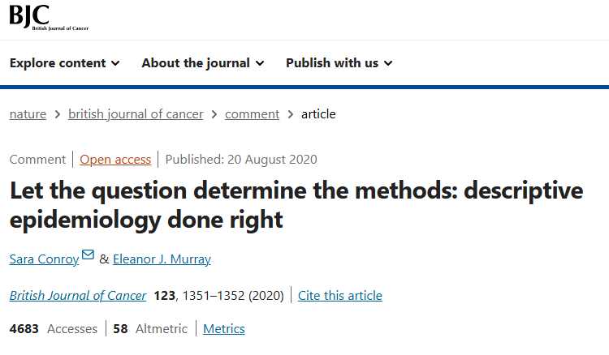

# Tareas científicas

Quisiera comenzar esta sección citando a [Conroy et al. 2020](https://www.nature.com/articles/s41416-020-1019-z) "Deja que la pregunta determine los métodos"



*Comentario realizado*

"En 2017, [Pedersen et al.](https://www.nature.com/articles/bjc2017146). publicaron un estudio que exploró la posible asociación estadística entre el hombro congelado y el diagnóstico de cáncer. Recientemente, la discusión de este artículo en Twitter criticó a los autores por no controlar los factores de confusión. Pero, ¿qué significa controlar los factores de confusión y cuándo realmente necesitamos hacerlo?"

La confusión se define típicamente como una variable que está relacionada tanto con la variable principal de interés como con el resultado, pero que no está en la vía causal.

La decisión de controlar un factor de confusión depende de la pregunta científica específica y, por lo general, ocurre cuando el enfoque de la pregunta de investigación es investigar una relación causal entre la variable principal de interés y el resultado. Sin embargo, no todas las investigaciones requieren una pregunta causal. Para entender el propósito de un estudio (es decir, descriptivo, causal o predictivo), es fundamental que se expliquen claramente los objetivos de la investigación. El artículo de Pedersen es un gran ejemplo de un estudio con una pregunta de investigación que no es causal y, por lo tanto, no necesita controlar los factores de confusión.

## Tipos de Tareas Científicas

En la investigación científica, cada estudio debe estructurarse en función de su objetivo, los datos disponibles y la pregunta que pretende responder. De esta manera, podemos categorizar los estudios en distintos tipos de tareas científicas.

1.  Tareas Descriptivas

2.  Tareas Predictivas

3.  Tareas Explicativas o de Inferencia Causal

```{r, echo=FALSE, warning=F, message=F}
library(DT)

# Crear los datos en un dataframe
tabla <- data.frame(
  `Tarea` = c("📌 Descripción", "📌 Predicción", "📌 Inferencia Causal"),
  `Ejemplo` = c(
    "🩺 ¿Cómo se pueden clasificar los pacientes de 60–80 años con ERC G3–G4 y diabetes según sus características clínicas (fenotipos)?",
    "🩺 ¿Cuál es la probabilidad de que un paciente con ERC G3–G4 inicie diálisis en los próximos 5 años, según su edad, sexo, TFGe y albuminuria?",
    "🩺 ¿El inicio de un iSGLT2 reducirá, en promedio, el riesgo de progresión de la ERC en adultos con diabetes tipo 2 y ciertas características?"
  ),
  `Datos` = c(
    "• Criterios de elegibilidad <br> • Características (edad, TFGe, albuminuria, comorbilidades ...)",
    "• Criterios de elegibilidad <br> • Salida (inicio de diálisis o trasplante en 5 años) <br> • Entradas (edad, sexo, TFGe, albuminuria en la línea base)",
    "• Criterios de elegibilidad <br> • Resultado (pendiente de TFGe o evento renal) <br> • Tratamiento (inicio de iSGLT2 en la línea base) <br> • Confusores <br> • Modificadores de efecto (opcional)"
  ),
  `Análisis` = c(
    "Análisis de clúster <br> ...",
    "Regresión <br> Árboles de decisión <br> Bosques aleatorios <br> Máquinas de vectores de soporte <br> Redes neuronales <br> ...",
    "Regresión <br> Emparejamiento <br> Ponderación por probabilidad inversa <br> Fórmula-G <br> Estimación-G <br> Estimación con variable instrumental <br> ..."
  )
)

# Crear la tabla con DT
datatable(
  tabla,
  escape = FALSE,  # Permitir que <br> se renderice como HTML
  options = list(
    pageLength = 3,  # Número de filas visibles por página
    autoWidth = TRUE,  # Ajuste automático del ancho de las columnas
    scrollX = TRUE,    # Permitir desplazamiento horizontal si es necesario
    columnDefs = list(
      list(targets = 0, className = "small-text"),  
      list(targets = 1, className = "small-text"), 
      list(targets = 2, className = "small-text"),
      list(targets = 3, className = "small-text")
    )
  ),
  rownames = FALSE
) %>%
  formatStyle(
    columns = names(tabla), 
    fontSize = '12px'  # Reducir tamaño de letra a 12px
  )

```

::: callout-tip
## 💡 Tip práctico

Esta clasificación llegará a tener más sentido al momento de elegir el análisis: **la pregunta decide el método**, no al revés. Antes de abrir R, escribe en una frase si tu pregunta es *descriptiva*, *predictiva* o *causal*.
:::

::: callout-warning
## ⚠️ Cuidado con los mitos

Es posible que muchos docentes o investigadores te hayan mencionado:

-   Únicamente los ensayos clínicos pueden evaluar causalidad

-   En estudios descriptivos no se pueden calcular medidas de asociación, como el riesgo relativo (RR)

-   Todo análisis de asociación requiere ajustar o controlar por confusores.

-   Los análisis descriptivos no son importantes para tomar decisiones

Sin embargo, en las siguientes secciones matizaremos muchos de estos comentarios.
:::

::: {.callout-important}
## 🎯 En resumen

| | Descriptiva | Predictiva | Causal |
|---|---|---|---|
| **Pregunta** | ¿Qué ocurre? | ¿Qué le ocurrirá a este paciente? | ¿Qué pasaría si intervenimos? |
| **Ejemplo en nefrología** | Fenotipos de pacientes con ERC | Riesgo de diálisis a 5 años (p. ej., KFRE) | Efecto de iniciar un iSGLT2 |
| **¿Ajusto por confusores?** | Solo si lo justifico | No | **Sí**, guiado por un DAG |
| **Análisis típicos** | Frecuencias, medias, clústeres | Regresión, aprendizaje automático | Ensayos, emparejamiento, IPW, fórmula g |
:::

## Referencias

1.  Conroy, S., Murray, E.J. Let the question determine the methods: descriptive epidemiology done right. Br J Cancer 123, 1351–1352 (2020). <https://doi.org/10.1038/s41416-020-1019-z>

2.  Pedersen, A., Horváth-Puhó, E., Ehrenstein, V. et al. Frozen shoulder and risk of cancer: a population-based cohort study. Br J Cancer 117, 144–147 (2017). <https://doi.org/10.1038/bjc.2017.146>

3.  Lesko CR, Fox MP, Edwards JK. A Framework for Descriptive Epidemiology. Am J Epidemiol. 2022;191(12):2063-2070. doi:[10.1093/aje/kwac115](https://doi.org/10.1093/aje/kwac115)

4.  Hernán, M. A., Hsu, J., & Healy, B. A Second Chance to Get Causal Inference Right: A Classification of Data Science Tasks. CHANCE, 2019; 32(1), 42–49. <https://doi.org/10.1080/09332480.2019.1579578>

## Nota editorial

-   Esta sección fue editada con asistencia de IA (ChatGPT; revisión editorial con Claude).
