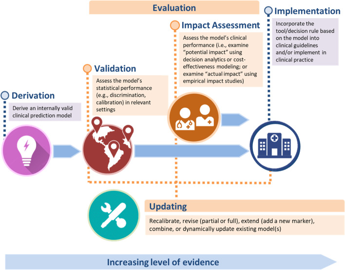
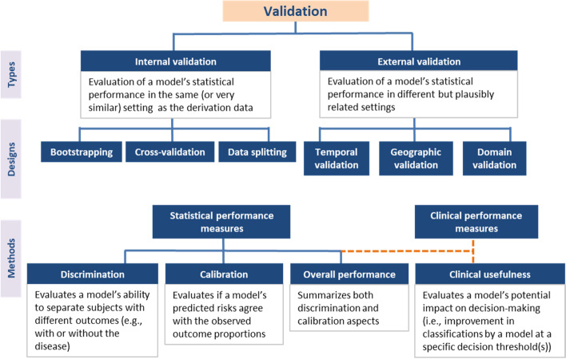

# Tareas predictivas: anticipar, no explicar

::: {.callout-note}
## 🩺 Escenario

Una paciente de 68 años con ERC G3b y albuminuria A3 pregunta: *"Doctor, ¿voy a llegar a diálisis?"* Tú necesitas una probabilidad a 2 y 5 años para decidir cuándo derivarla a educación pre-diálisis y planificar el acceso vascular. No te pide saber **por qué** progresa, sino **cuánto riesgo tiene**. Eso es predecir.
:::

## Lo que vamos a hacer

-   Distinguir predicción **diagnóstica** de **pronóstica**.
-   Ver con datos simulados cómo la clasificación KDIGO ya es un modelo pronóstico sencillo.
-   Recorrer el ciclo de vida de un modelo: desarrollo, validación, impacto y actualización.

## Paso 1. Diagnóstico vs. pronóstico

Un modelo de predicción clínica estima la probabilidad de un desenlace a partir de varias variables del paciente. Según el tiempo del desenlace:

-   **Diagnóstico:** ¿tiene el paciente la condición *ahora*? *Ej.:* ¿tiene lesión renal aguda este paciente hospitalizado, según un biomarcador urinario y su creatinina?
-   **Pronóstico:** ¿tendrá el desenlace *en el futuro*? *Ej.:* la ecuación de riesgo de insuficiencia renal (**KFRE**, Tangri y col., 2011) combina edad, sexo, TFGe y cociente albúmina/creatinina y estima el riesgo a 2 y 5 años; se compara con un umbral de decisión (derivación, acceso vascular).

Fíjate en lo que **no** hace: la KFRE no dice que la albuminuria *cause* la insuficiencia renal ni qué pasaría si se interviene sobre ella. **Predice; no explica** (lo veremos de nuevo en el Capítulo 2.4).

{width=70% fig-align="center"}

## Paso 2. Un modelo pronóstico en miniatura: el mapa de riesgo KDIGO

Un ejemplo ya conocido de pronóstico es el mapa de calor KDIGO, que combina la categoría de TFGe (G) y de albuminuria (A) en un riesgo "bajo / moderado / alto / muy alto". Veamos si ordena el riesgo en la base **simulada** `ckd_isglt2`:

```{r}
#| label: kdigo-pronostico
library(tidyverse)
source("R/funciones_epi.R")                    # categoria_g(), categoria_a(), riesgo_kdigo()
source("R/funciones_extra_a.R")               # pct()
ckd <- read_csv("Bases/ckd_isglt2.csv", show_col_types = FALSE)

kdigo <- ckd |>
  mutate(riesgo = riesgo_kdigo(categoria_g(tfg_basal), categoria_a(uacr))) |>
  group_by(riesgo) |>
  summarise(pacientes = n(), evento_36m = mean(evento))   # proporción con evento renal a 36 meses
kdigo
```

**Qué vemos.** El evento renal pasa de `r pct(kdigo$evento_36m[1])` en riesgo bajo a `r pct(kdigo$evento_36m[4])` en riesgo muy alto: el mapa **ordena** a los pacientes. Eso es discriminación pronóstica. Pero es un modelo tosco (solo 4 niveles); modelos como la KFRE usan variables continuas y dan una probabilidad concreta para cada paciente.

## Paso 3. Qué se le exige a un modelo antes de usarlo

Un buen rendimiento en los datos con que se desarrolló **no basta**. El ciclo de vida de un modelo incluye cuatro etapas:

{width=80% fig-align="center"}

-   **Validación interna:** ¿el modelo se reproduce en la misma población? Se usa *bootstrap* o validación cruzada para medir el sobreajuste. Dividir los datos en "entrenamiento" y "prueba" se desaconseja: gasta muestra y da estimaciones imprecisas.
-   **Validación externa:** ¿funciona en otro lugar o momento? Puede ser *temporal* (años posteriores), *geográfica* (otro hospital o país) o *de dominio* (otro contexto clínico, la más exigente). Idealmente la hacen investigadores independientes, y la muestra debe ser suficiente (la antigua regla de "100 eventos y 100 no eventos" hoy se reemplaza por calcular la precisión que se necesita).
-   **Evaluación de impacto:** ¿mejora las decisiones y los desenlaces? Un modelo con buena discriminación puede ser inútil si no cambia lo que haces. El impacto *potencial* se estima con medidas de utilidad clínica (beneficio neto) o modelos económicos; el *real* exige estudios empíricos, idealmente ensayos con y sin el modelo (que son escasos; hay alternativas, ver Janse y col., 2025).
-   **Actualización:** reutilizar un modelo existente suele ser mejor que crear otro: *recalibrarlo* (corregir el nivel de riesgo), *revisarlo* (reestimar coeficientes), *extenderlo* (añadir un predictor) o combinarlo con otros.

¿Cómo juzgar el rendimiento? Con tres preguntas:

1.  **Discriminación:** ¿separa a quienes tendrán el desenlace de quienes no? (estadístico C o AUC).
2.  **Calibración:** ¿el riesgo predicho coincide con el observado? Si dice 20 %, ¿se observa cerca de 20 %?
3.  **Utilidad clínica:** ¿mejora las decisiones? (beneficio neto).

::: {.callout-warning}
## ⚠️ Trampa frecuente: la exactitud diagnóstica es impacto *potencial*

Calcular la sensibilidad y la especificidad de una prueba solo muestra su impacto *potencial*, no que los pacientes vayan a estar mejor. Por eso, en las guías de práctica clínica, sensibilidad y especificidad se tratan como desenlaces *sustitutos*. Y en lugar de seguir creando modelos nuevos, suele ser más útil validar y actualizar los que ya existen.
:::

::: {.callout-important}
## 🎯 En resumen

| Etapa | Qué se hace | Pregunta clave |
|---|---|---|
| **Desarrollo** | Construir el modelo | ¿Hay suficientes eventos por predictor? |
| **Validación interna** | Bootstrap o validación cruzada | ¿Hay sobreajuste? |
| **Validación externa** | Temporal, geográfica, de dominio | ¿Funciona en otro lugar y otro momento? |
| **Evaluación de impacto** | Estudios de uso del modelo | ¿Mejora las decisiones y los desenlaces? |
| **Actualización** | Recalibrar, revisar, extender | ¿Sigue siendo válido hoy? |

Se **reporta** con **TRIPOD+AI** y se **evalúa el riesgo de sesgo** con **PROBAST**. Un modelo se juzga por su discriminación, su calibración y su utilidad, no por la "significación" de sus coeficientes.
:::

**Ejercicio.** (1) ¿La KFRE es una herramienta diagnóstica o pronóstica? (2) Un modelo de riesgo desarrollado en un hospital de Lima se usará en una clínica rural de Cusco: ¿qué tipo de validación necesita antes? (3) Si el modelo predice 10 % de riesgo pero se observa 25 %, ¿falla la discriminación o la calibración?

## Referencias

1.  Binuya MAE, Engelhardt EG, Schats W, Schmidt MK, Steyerberg EW. Methodological guidance for the evaluation and updating of clinical prediction models: a systematic review. *BMC Med Res Methodol*. 2022;22(1):316. <https://doi.org/10.1186/s12874-022-01801-8>

2.  Janse RJ, Stel VS, Jager KJ, Tripepi G, Zoccali C, Dekker FW, van Diepen M. When impact trials are not feasible: alternatives to study the impact of prediction models on clinical practice. *Nephrol Dial Transplant*. 2025;40(1):27-33. <https://doi.org/10.1093/ndt/gfae170>

3.  Tangri N, Stevens LA, Griffith J, et al. A predictive model for progression of chronic kidney disease to kidney failure. *JAMA*. 2011;305(15):1553-1559.

4.  Hernán MA, Hsu J, Healy B. A second chance to get causal inference right: a classification of data science tasks. *CHANCE*. 2019;32(1):42-49. <https://doi.org/10.1080/09332480.2019.1579578>

## Nota editorial

-   Esta sección fue editada con asistencia de IA (ChatGPT; revisión editorial con Claude). Los datos son simulados.
