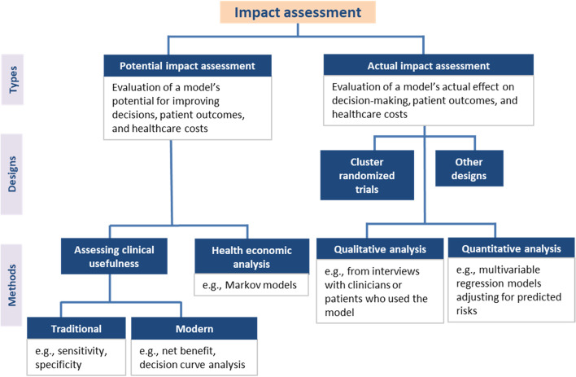
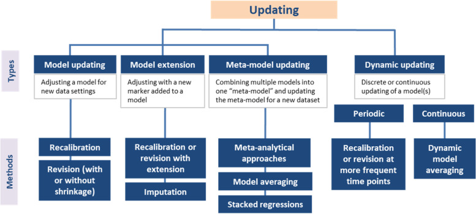

# Tareas predictivas

Los modelos de predicción clínica son herramientas fundamentales para estimar resultados de salud en pacientes, ya sea en el presente (**diagnóstico**) o en el futuro (**pronóstico**). Tradicionalmente, estos modelos se basaban en análisis de regresión multivariable, pero el avance del aprendizaje automático ha permitido el desarrollo de enfoques más sofisticados con una mayor capacidad de procesamiento y precisión. Su aplicación en la medicina personalizada ha crecido exponencialmente, facilitando la toma de decisiones mediante la estimación del riesgo individualizado.

Sin embargo, para que un modelo predictivo sea útil en la práctica clínica, debe someterse a una rigurosa evaluación de su validez e impacto. A pesar de la existencia de múltiples guías metodológicas, muchas herramientas predictivas no avanzan más allá de su fase de desarrollo inicial o presentan limitaciones en su aplicación real. Además, la continua creación de nuevos modelos, en lugar de la optimización de los ya existentes, genera redundancia y desperdicio de recursos. Por lo tanto, es crucial avanzar en la validación, actualización y adaptación de modelos predictivos, garantizando su aplicabilidad en diversos entornos clínicos y poblacionales.

::: {style="text-align: center;"}
{width="400" height="250"}
:::

**Ejemplo de Predicción para Diagnóstico**

Contexto: Un médico quiere identificar si un paciente tiene diabetes basándose en sus características clínicas.

🔹 Pregunta: ¿Este paciente tiene diabetes en este momento?\
🔹 Datos: Edad, nivel de glucosa en sangre, presión arterial, índice de masa corporal (IMC), antecedentes familiares de diabetes.\
🔹 Modelo: Algoritmo de clasificación (Regresión logística, Árboles de decisión, Redes neuronales).\
🔹 Salida esperada: Probabilidad de que el paciente tenga diabetes (Sí/No).

💡 Ejemplo real: El modelo FINDRISC es una herramienta usada para predecir el riesgo de diabetes tipo 2 a partir de variables clínicas y de estilo de vida.

**Ejemplo de Predicción para Pronóstico**

Contexto: Un oncólogo desea estimar el riesgo de recurrencia del cáncer en un paciente tratado con cirugía.

🔹 Pregunta: ¿Cuál es la probabilidad de que el cáncer reaparezca en los próximos 5 años?\
🔹 Datos: Edad, tipo de tumor, nivel de marcadores tumorales, estado de ganglios linfáticos, tratamiento recibido.\
🔹 Modelo: Modelos de supervivencia (Regresión de Cox, Redes neuronales profundas).\
🔹 Salida esperada: Probabilidad de recurrencia en distintos períodos de tiempo (6 meses, 1 año, 5 años).

💡 Ejemplo real: PREDICT es un modelo que estima la supervivencia en pacientes con cáncer de mama basado en características clínico-patológicas.

**Ejemplo de pronóstico en nefrología**

🩺 Contexto: un nefrólogo quiere decidir cuándo derivar a un paciente con ERC a educación pre-diálisis y planificación de acceso vascular.\
🔹 Pregunta: ¿Cuál es la probabilidad de que este paciente llegue a insuficiencia renal en 2 y 5 años?\
🔹 Datos: edad, sexo, TFGe y cociente albúmina/creatinina.\
🔹 Modelo: regresión de Cox (ecuación de riesgo de insuficiencia renal, **KFRE**).\
🔹 Salida esperada: riesgo a 2 y 5 años, que se compara con umbrales de decisión (por ejemplo, derivación).

💡 Nota: la KFRE **predice**; no dice que la albuminuria *cause* la insuficiencia renal ni qué pasaría si se interviene sobre ella.

::: callout-warning
## Diferencia clave:

-   📌 *Diagnóstico* → Se enfoca en el presente: determinar si una enfermedad está presente o no.

-   📌 *Pronóstico* → Se enfoca en el futuro: predecir la evolución o el desenlace de una enfermedad.
:::

## Validación

La validación es el proceso de evaluar el rendimiento de un modelo en entornos específicos. Existen dos tipos principales de validación: interna y externa.

::: {style="text-align: center;"}

:::

#### Validación Interna

Evalúa la reproducibilidad del modelo en la misma población de los datos de derivación. Se utilizan técnicas de remuestreo como bootstrapping o validación cruzada para evaluar el sobreajuste y aplicar correcciones si es necesario. No se recomienda la simple división de datos en conjuntos de entrenamiento y prueba, ya que limita la muestra y puede generar estimaciones imprecisas.

#### Validación Externa

Mide la capacidad del modelo para generalizarse a nuevas poblaciones o entornos. Se distinguen tres tipos principales:

-   **Validación temporal**: Evaluación en datos de un período más reciente.

-   **Validación geográfica**: Prueba en distintas ubicaciones.

-   **Validación de dominio**: Aplicación en diferentes entornos clínicos.

La validación de dominio es la más rigurosa, pues implica evaluar el desempeño del modelo en entornos muy distintos.

### Cuándo y Cómo Validar

Un modelo debe validarse internamente antes de ser probado en entornos externos. No hay consenso sobre cuántas validaciones acumulativas son necesarias. Se recomienda un tamaño de muestra suficiente (por ejemplo, al menos 100 eventos y 100 no eventos) para asegurar precisión en las estimaciones de desempeño. Métodos más avanzados pueden mejorar la evaluación de la validez mediante estimaciones de medidas de rendimiento en lugar de cálculos de potencia.

#### Evaluación de la Validez

Idealmente, la validación externa debe ser realizada por investigadores independientes. Comparar el contexto de los datos de derivación y validación ayuda a evaluar la transportabilidad del modelo. La heterogeneidad en la población de validación fortalece la prueba del modelo.

Se pueden analizar distintos aspectos del desempeño:

1.  **Discriminación**: Capacidad del modelo para separar sujetos con diferentes resultados. Se evalúa con la estadística de concordancia (C) o AUROC. Otras medidas incluyen la estadística D y la pendiente de discriminación.

2.  **Calibración**: Grado de concordancia entre riesgos predichos y observados. Se analizan gráficos de calibración y medidas como la pendiente de calibración y la relación O/E.

3.  **Rendimiento general**: Incluye medidas como la variación explicada (R²) y la puntuación Brier.

### Determinar si un Modelo es "Suficientemente Bueno"

Un modelo debe evaluarse considerando discriminación y calibración. Si se prioriza la identificación de sujetos de alto riesgo, la discriminación es clave. Si el modelo presenta mala calibración, se puede mejorar mediante recalibración. La adecuación del desempeño depende del contexto de aplicación y debe evaluarse con medidas de decisión analítica, como el Beneficio Neto.

## Evaluación de Impacto

### ¿Qué es la Evaluación de Impacto?

Los modelos con un buen desempeño estadístico no garantizan automáticamente un impacto positivo en la práctica clínica. Aunque un modelo tenga una buena discriminación y calibración, puede ser clínicamente inútil si no aporta información novedosa o si sus predicciones no son relevantes en el contexto de la toma de decisiones clínicas. Factores externos, como interpretaciones clínicas, adherencia o aceptabilidad, pueden afectar el impacto real de un modelo. La evaluación de impacto analiza las consecuencias de utilizar un modelo en la práctica clínica, considerando cambios en la toma de decisiones, resultados en los pacientes y costos de atención médica.

### ¿Cómo se Puede Evaluar el Impacto?

La evaluación de impacto puede ser potencial o real.

::: {style="text-align: center;"}

:::

-   **Impacto Potencial:** Examina el impacto teórico a través de medidas de desempeño clínico y modelos de análisis de decisiones.

    -   **Utilidad Clínica:** Se evalúa con medidas como sensibilidad, especificidad y el Beneficio Neto, que pondera los beneficios y los daños clínicos.

    -   **Análisis Económico de la Salud:** Utiliza modelos de análisis de decisiones (Markov, árboles de decisión) para evaluar la relación costo-efectividad.
    
::: callout-note
## ¡Atención!

1. Los estudios que evalúan la exactitud diagnóstica de cualquier test, marcador, sintoma, signo, etc, pertenece a estudios predictivos que intentan evaluar el impacto potencial.

2. Debido a que la sensibilidad y la especificidad solo valoran el impacto potencial, estos son considerados como desenlaces sub-rogados en las preguntas clínicas de las Guías de Práctica Clínica basadas en evidencia.
:::

-   **Impacto Real:** Se mide en estudios empíricos, como ensayos aleatorizados, comparando grupos con y sin el uso del modelo. Puede evaluarse de manera asistida (dejando espacio para la interpretación clínica) o directiva (sugiriendo decisiones específicas basadas en el modelo).

::: callout-note
## ¡Atención!

Son muy escasos los estudios que evalúan el impacto real mediante un ECA y se han propuesto otras alternativas. [Consulta más información aquí](https://doi.org/10.1093/ndt/gfae170)
:::

### ¿Cuándo se Debe Evaluar el Impacto?

No todos los modelos requieren evaluación de impacto. Es esencial para modelos que guían decisiones terapéuticas o de diagnóstico. Se recomienda realizarla después de la validación externa y antes de la implementación.

## Actualización de Modelos

### ¿Qué es la Actualización de Modelos y Cuándo es Útil?

Frecuentemente se derivan nuevos modelos en lugar de aprovechar los existentes. Reutilizar y actualizar modelos previos es más eficiente y evita sobreajustes. La actualización es recomendable cuando un modelo existente tiene buena discriminación pero problemas de calibración, cuando surgen nuevos predictores relevantes o cuando hay cambios en la población objetivo.

::: {style="text-align: center;"}

:::

### ¿Cómo se Pueden Actualizar los Modelos?

Existen cuatro enfoques principales para la actualización de modelos basados en regresión:

1.  **Recalibración:** Ajusta la intersección del modelo o reestima el predictor lineal para corregir descalibraciones menores.

2.  **Revisión del Modelo:** Reestima algunos o todos los coeficientes del modelo original para reflejar mejor la nueva población.

3.  **Extensión del Modelo:** Agrega nuevos predictores relevantes, evitando sobreajustes mediante técnicas de contracción.

4.  **Actualización de Metamodelos:** Combina varios modelos existentes en uno más generalizable, utilizando enfoques metaanalíticos o de regresión apilada.

Cada enfoque se elige según la magnitud del cambio requerido y la disponibilidad de datos. Idealmente, los modelos actualizados deben someterse a una evaluación adicional para validar su desempeño y utilidad clínica.

::: {.callout-tip}
## 💡 Tip práctico: guías para modelos de predicción

-   Para **reportar** un modelo: **TRIPOD+AI**.
-   Para **evaluar el riesgo de sesgo** de un modelo publicado: **PROBAST**.
-   Un modelo se juzga por su **discriminación** (AUC), su **calibración** y su **utilidad clínica** (beneficio neto), no por la significación de sus coeficientes.
:::

::: {.callout-important}
## 🎯 En resumen

| Etapa | Qué se hace | Pregunta clave |
|---|---|---|
| **Desarrollo** | Construir el modelo | ¿Hay suficientes eventos por predictor? |
| **Validación interna** | Bootstrap o validación cruzada | ¿Hay sobreajuste? |
| **Validación externa** | Temporal, geográfica, de dominio | ¿Funciona en otro lugar y otro momento? |
| **Evaluación de impacto** | Estudios de uso del modelo | ¿Mejora las decisiones y los desenlaces? |
| **Actualización** | Recalibrar, revisar, extender | ¿Sigue siendo válido hoy? |
:::

## Referencias

1.  Conroy, S., Murray, E.J. Let the question determine the methods: descriptive epidemiology done right. Br J Cancer 123, 1351–1352 (2020). <https://doi.org/10.1038/s41416-020-1019-z>

2.  Hernán, M. A., Hsu, J., & Healy, B. A Second Chance to Get Causal Inference Right: A Classification of Data Science Tasks. CHANCE, 2019; 32(1), 42–49. <https://doi.org/10.1080/09332480.2019.1579578>

3. Binuya MAE, Engelhardt EG, Schats W, Schmidt MK, Steyerberg EW. Methodological guidance for the evaluation and updating of clinical prediction models: a systematic review. BMC Med Res Methodol. 2022;22(1):316. Published 2022 Dec 12. <https://doi.org/10.1186/s12874-022-01801-8>

4. Roemer J Janse, Vianda S Stel, Kitty J Jager, Giovanni Tripepi, Carmine Zoccali, Friedo W Dekker, Merel van Diepen, When impact trials are not feasible: alternatives to study the impact of prediction models on clinical practice, Nephrology Dialysis Transplantation, Volume 40, Issue 1, January 2025, Pages 27–33, <https://doi.org/10.1093/ndt/gfae170>

## Nota editorial

-   Esta sección fue editada con asistencia de IA (ChatGPT; revisión editorial con Claude).
