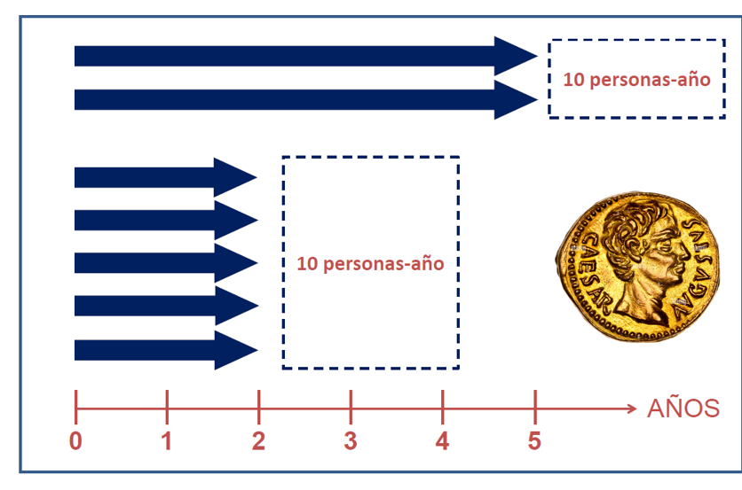

# Medidas de frecuencia: ¿cuántos tienen, cuántos se enferman y a qué velocidad?

::: {.callout-note}
## 🩺 Escenario

Revisas el registro de tu servicio y te hacen tres preguntas que parecen la misma, pero no lo son:

-   *"¿Cuántos pacientes de mi clínica de ERC tienen anemia **hoy**?"* → **prevalencia**.
-   *"De los que hoy no tienen anemia, ¿qué proporción la desarrollará en 3 años?"* → **incidencia acumulada** (riesgo).
-   *"¿A qué **velocidad** aparece la anemia en mi cohorte, si unos se siguen 2 años y otros 7?"* → **tasa de incidencia**.

Para contar bien hay que elegir bien la medida. Antes de comparar grupos, hay que saber contar.
:::

## Lo que vamos a hacer

-   Calcular las tres medidas **a mano**, con una cohorte de 10 pacientes que puedes ver completa.
-   Repetirlas con la base **simulada** `ckd_isglt2` (5000 pacientes), con su intervalo de confianza.
-   Entender cómo se relacionan: por qué la prevalencia depende de la duración de la enfermedad.

## Paso 1. Una cohorte de diez pacientes

Usamos una cohorte pequeña e **hipotética** de 10 pacientes con ERC avanzada. Cada barra es el seguimiento de un paciente. El punto rojo marca el **inicio de anemia** (Hb < 10 g/dL), que una vez aparece persiste; el triángulo, el **fallecimiento**.

```{r}
#| label: datos-seguimiento
library(tidyverse)
source("R/funciones_extra_a.R")          # pct(): formato de porcentajes

seguimiento <- tribble(
  ~id,  ~entrada, ~salida, ~anemia_inicio, ~muerte,
  "P1",  2015.0,  2021.0,  2018.0, 0,
  "P2",  2016.0,  2023.0,  2019.0, 0,
  "P3",  2016.5,  2020.5,  2019.0, 1,
  "P4",  2017.0,  2024.0,  NA,     0,
  "P5",  2017.0,  2019.0,  2017.0, 1,
  "P6",  2018.0,  2024.0,  2021.0, 0,
  "P7",  2018.5,  2022.0,  NA,     1,
  "P8",  2019.0,  2024.0,  2023.0, 0,
  "P9",  2019.5,  2023.0,  NA,     0,
  "P10", 2020.0,  2024.0,  NA,     0
) |>
  mutate(id = factor(id, levels = rev(paste0("P", 1:10))))

seguimiento
```

```{r}
#| label: fig-seguimiento
#| fig-cap: "Seguimiento de 10 pacientes con ERC avanzada (datos hipotéticos). Punto rojo: inicio de anemia. Triángulo: fallecimiento. Línea azul: fecha de corte para la prevalencia."
#| fig-width: 8
#| fig-height: 4.5

grafico_seguimiento <- function(datos) {
  ggplot(datos, aes(y = id)) +
    geom_segment(aes(x = entrada, xend = salida, yend = id),
                 color = "grey60", linewidth = 1.6) +
    geom_point(aes(x = anemia_inicio), color = "firebrick", size = 4, na.rm = TRUE) +
    geom_point(data = filter(datos, muerte == 1), aes(x = salida), shape = 17, size = 3.5) +
    scale_x_continuous(breaks = 2015:2024) +
    labs(x = "Año calendario", y = NULL) +
    theme_minimal(base_size = 13) +
    theme(panel.grid.minor = element_blank())
}

grafico_seguimiento(seguimiento) +
  geom_vline(xintercept = 2021.5, linetype = "dashed", color = "steelblue") +
  annotate("text", x = 2021.5, y = 10.6, label = "Corte para prevalencia",
           color = "steelblue", hjust = -0.05, size = 3.5)
```

## Paso 2. Prevalencia: la fotografía

**Idea.** Proporción de personas que **tienen** la condición en un momento dado (casos existentes, nuevos y antiguos).

$$
\text{Prevalencia} = \frac{\text{Casos existentes en el momento de corte}}{\text{Personas observadas en ese momento}}
$$

*Pregunta:* ¿cuál fue la prevalencia de anemia el 30 de junio de 2021 (`2021.5`)? Contamos solo a quienes estaban **bajo observación** ese día:

```{r}
#| label: prevalencia-juguete
fecha_corte <- 2021.5

prevalencia <- seguimiento |>
  filter(entrada <= fecha_corte, salida > fecha_corte) |>      # bajo observación ese día
  summarise(
    n_observados = n(),
    n_casos      = sum(!is.na(anemia_inicio) & anemia_inicio <= fecha_corte),
    prevalencia  = n_casos / n_observados
  )
prevalencia
```

**Qué vemos.** Ese día había `r prevalencia$n_observados` pacientes bajo observación y `r prevalencia$n_casos` tenían anemia: **prevalencia = `r pct(prevalencia$prevalencia)`**. Los pacientes que ya habían salido del estudio (P1, P3 y P5) **no** entran al denominador.

Cuando en lugar de un día se mira un intervalo, se habla de **prevalencia de periodo**: cuenta a quien tenía la condición al inicio del periodo *más* los casos nuevos durante él, entre todos los observados en ese intervalo.

```{r}
#| label: prevalencia-periodo
inicio_periodo <- 2019.5; fin_periodo <- 2021.5

prevalencia_periodo <- seguimiento |>
  filter(entrada <= fin_periodo, salida >= inicio_periodo) |>   # observados en algún momento del periodo
  summarise(
    n_observados = n(),
    n_casos      = sum(!is.na(anemia_inicio) & anemia_inicio <= pmin(fin_periodo, salida)),
    prevalencia  = n_casos / n_observados
  )
prevalencia_periodo
```

La prevalencia de periodo (`r pct(prevalencia_periodo$prevalencia)`) es mayor que la puntual (`r pct(prevalencia$prevalencia)`) porque incluye a los casos nuevos del intervalo. Por eso, al leer un estudio, comprueba cuál de las dos se reporta.

### Con la base simulada

Con una base real, la prevalencia y su intervalo de confianza (IC) salen en pocas líneas. Usamos la base **simulada** `ckd_isglt2` (descrita en el Capítulo 3.2), con `binom.test()` para el IC exacto (Clopper-Pearson):

```{r}
#| label: prevalencia-real
ckd <- read_csv("Bases/ckd_isglt2.csv", show_col_types = FALSE)

# Prevalencia de albuminuria severa (UACR >= 300 mg/g) con IC 95 %
n_total <- nrow(ckd)
n_alb   <- sum(ckd$uacr >= 300)
prev_alb <- binom.test(n_alb, n_total) |>
  broom::tidy() |>
  select(prevalencia = estimate, ic_inferior = conf.low, ic_superior = conf.high)
prev_alb
```

La prevalencia de albuminuria severa es `r pct(prev_alb$prevalencia)` (IC 95 % `r pct(prev_alb$ic_inferior)` a `r pct(prev_alb$ic_superior)`). Para una **tabla de frecuencias** por categoría, `count()` y un `mutate()` bastan. Aquí con las categorías G de TFGe de KDIGO (función `categoria_g()` del libro):

```{r}
#| label: prevalencia-por-estadio
source("R/funciones_epi.R")              # categoria_g()

ckd |>
  mutate(estadio = categoria_g(tfg_basal)) |>
  count(estadio) |>
  mutate(prevalencia = pct(n / sum(n)))
```

## Paso 3. Incidencia acumulada (riesgo): la película hasta un punto

**Idea.** Proporción de personas **libres** de la condición al inicio que la **desarrollan** durante un periodo. Es una **probabilidad** (el riesgo medio del grupo).

$$
\text{Incidencia acumulada} = \frac{\text{Casos nuevos en el periodo}}{\text{Personas en riesgo al inicio}}
$$

*Pregunta:* tomando como inicio el 30 de junio de 2018 (`2018.5`), ¿cuál es el riesgo de desarrollar anemia en los siguientes 3 años? Partimos solo de quienes están bajo observación **y sin anemia** al inicio:

```{r}
#| label: incidencia-acumulada-juguete
indice <- 2018.5
fin    <- indice + 3

cohorte <- seguimiento |>
  filter(entrada <= indice, salida > indice,                 # bajo observación al inicio
         is.na(anemia_inicio) | anemia_inicio > indice)      # libres de anemia al inicio

inc_acum <- cohorte |>
  summarise(
    en_riesgo = n(),
    casos     = sum(!is.na(anemia_inicio) & anemia_inicio <= fin),
    riesgo    = casos / en_riesgo
  )
inc_acum
```

**Qué vemos.** Hay `r inc_acum$en_riesgo` pacientes en riesgo y `r inc_acum$casos` desarrollan anemia en 3 años: **incidencia acumulada a 3 años = `r pct(inc_acum$riesgo, 0)`**. Pero esta fórmula solo es válida si **todos** completan el seguimiento o presentan el evento. Si hay pérdidas o fallecimientos antes del final, el denominador engaña: ahí se usan las **tasas** (siguiente paso) o las **curvas de Kaplan-Meier** (Capítulo 9).

## Paso 4. Tasa de incidencia: la velocidad

**Idea.** Casos nuevos por unidad de **persona-tiempo en riesgo**. Describe la *velocidad* de aparición y permite que cada paciente aporte un seguimiento distinto.

$$
\text{Tasa de incidencia} = \frac{\text{Casos nuevos}}{\text{Persona-tiempo en riesgo}}
$$

Cómo se cuenta la persona-tiempo:

-   Cada paciente aporta tiempo **desde que entra en riesgo hasta que ocurre el evento, fallece o sale del seguimiento** (lo que ocurra primero).
-   Quien ya tiene la condición al inicio (P5) **no aporta**: ya no está en riesgo de un *primer* episodio.
-   Tras el evento ya no se cuenta tiempo en riesgo (P1 deja de aportar en 2018).
-   1 persona-año = 1 persona seguida 1 año = 2 personas seguidas 6 meses cada una.

{width=60% fig-align="center"}

```{r}
#| label: tasa-juguete
persona_tiempo <- seguimiento |>
  filter(is.na(anemia_inicio) | anemia_inicio > entrada) |>        # excluye prevalentes (P5)
  mutate(
    fin_riesgo = if_else(!is.na(anemia_inicio), anemia_inicio, salida),
    pt   = fin_riesgo - entrada,
    caso = as.integer(!is.na(anemia_inicio))
  )

tasa <- persona_tiempo |>
  summarise(casos = sum(caso), persona_anios = sum(pt),
            tasa_100 = 100 * casos / persona_anios)
tasa
```

**Qué vemos.** Hubo `r tasa$casos` casos en `r tasa$persona_anios` persona-años: **`r num(tasa$tasa_100, 1)` casos nuevos por 100 persona-años**.

### Con la base simulada

En `ckd_isglt2`, el evento es el compuesto renal (TFGe −40 %, diálisis o trasplante), con seguimiento máximo de 36 meses. `poisson.test()` da la tasa y su IC exacto:

```{r}
#| label: tasa-real
eventos        <- sum(ckd$evento)
persona_anios  <- sum(ckd$tiempo_meses) / 12

tasa_real <- poisson.test(eventos, T = persona_anios) |>
  broom::tidy() |>
  transmute(eventos = eventos, persona_anios = round(persona_anios),
            tasa_100pa = 100 * estimate,
            ic_inferior_100pa = 100 * conf.low,
            ic_superior_100pa = 100 * conf.high)
tasa_real
```

La tasa es **`r sprintf('%.1f', tasa_real$tasa_100pa)` eventos por 100 persona-años** (IC 95 % `r sprintf('%.1f', tasa_real$ic_inferior_100pa)` a `r sprintf('%.1f', tasa_real$ic_superior_100pa)`), con `r tasa_real$eventos` eventos en `r format(tasa_real$persona_anios, big.mark = ' ', scientific = FALSE)` persona-años.

## Paso 5. ¿Cómo se relacionan? Prevalencia ≈ incidencia × duración

Cuando la incidencia y la duración de la condición son estables, la prevalencia es aproximadamente

$$
P \approx I \times D
$$

donde $I$ es la incidencia y $D$ la duración media. La consecuencia clínica es sorprendente: la **prevalencia puede subir sin que suba la incidencia**, simplemente porque los pacientes viven más tiempo con la condición. Lo comprobamos con una simulación **hipotética**: cada año inician hemodiálisis crónica 100 pacientes nuevos, y la sobrevida en diálisis tiene una duración media de 5 años; luego, de 7.5 años.

```{r}
#| label: prevalencia-duracion
set.seed(2025)

# Simula 40 años de llegadas (inicio de diálisis) y cuenta cuántos siguen en diálisis al final
prevalentes_al_final <- function(incidencia_anual, duracion_media, horizonte = 40) {
  n_llegadas <- rpois(1, incidencia_anual * horizonte)
  inicio <- runif(n_llegadas, 0, horizonte)                     # momento de inicio de diálisis
  salida <- inicio + rexp(n_llegadas, 1 / duracion_media)       # momento de muerte o trasplante
  sum(inicio <= horizonte & salida > horizonte)                 # siguen en diálisis al final
}

tibble(duracion_media = c(5, 7.5), incidencia_anual = 100) |>
  mutate(esperado_I_x_D = incidencia_anual * duracion_media,
         simulado       = map_dbl(duracion_media, \(d) prevalentes_al_final(100, d)))
```

Con la misma incidencia (100 al año), la prevalencia pasa de unos 500 a unos 750 pacientes en diálisis al alargar la duración media de 5 a 7.5 años: cuanto mejor se trate a quienes ya están en diálisis, más grande será la unidad. Es una razón por la cual **prevalencia e incidencia no se pueden usar como sinónimos** al planificar recursos.

::: {.callout-warning}
## ⚠️ Trampas frecuentes

-   **Denominador mal definido.** Antes de calcular, pregunta: *¿quién está en riesgo y desde cuándo?* Casi todos los errores vienen de ahí (por ejemplo, incluir en el denominador de la incidencia a quienes ya tenían la condición).
-   **Prevalencia = incidencia.** La prevalencia mezcla *cuántos se enferman* con *cuánto dura* la enfermedad: una condición crónica que no mata (hipertensión arterial) tiene prevalencia alta aunque su incidencia sea baja. Y en un estudio transversal solo puedes medir prevalencia: no puedes hablar de "riesgo", porque no sabes qué ocurrió primero.
:::

::: {.callout-tip}
## 💡 Proporción, razón o tasa

-   **Proporción:** el numerador está *dentro* del denominador (prevalencia, incidencia acumulada); va de 0 a 1.
-   **Razón:** compara dos cantidades que pueden ser independientes (p. ej., 2 hombres por cada mujer).
-   **Tasa:** tiene **tiempo** en el denominador (casos por persona-año). Es la única que admite seguimientos de distinta duración.

En el lenguaje clínico se dice "tasa de mortalidad" aun cuando es una proporción. Pregúntate siempre: *¿el denominador lleva tiempo?* Y no confundas *mortalidad* (muertes entre toda la población) con *letalidad* (muertes entre quienes tienen la enfermedad).
:::

::: {.callout-important}
## 🎯 En resumen

| Medida | Qué cuenta | Denominador | ¿Incluye tiempo? | Rango |
|---|---|---|---|---|
| **Prevalencia** | Casos existentes (nuevos y antiguos) | Personas observadas en el momento de corte | No | 0 a 1 (o %) |
| **Incidencia acumulada** (riesgo) | Casos **nuevos** en un periodo | Personas en riesgo al inicio | Solo como ventana fija | 0 a 1 (o %) |
| **Tasa de incidencia** | Casos **nuevos** | Persona-tiempo en riesgo | Sí | 0 a infinito (casos por 100 persona-años) |

-   La prevalencia es una fotografía; la incidencia acumulada, el riesgo hasta un punto; la tasa, la velocidad.
-   Define siempre **quién está en riesgo y desde cuándo**.
-   Con incidencia estable, $P \approx I \times D$.
:::

**Ejercicio.** (1) Verdadero o falso, y explica: (a) la prevalencia es una tasa; (b) la incidencia acumulada asume seguimiento completo; (c) todas las razones son tasas. (2) Una cohorte de 100 hombres sanos se sigue 10 años para ver cáncer de próstata: 10 se pierden al primer año, 20 desarrollan cáncer al quinto año y el resto completa los 10 años sin cáncer. Calcula el total de persona-años. (3) En 2001 hubo 2900 casos nuevos de cáncer de mama en Alabama y 200 en Alaska: ¿puedes decir que la incidencia es mayor en Alabama? *(Pista: ¿cuál es el denominador?)*

## Referencias

1.  Zafra-Tanaka JH, Taype-Rondan A, Fernandez-Guzman D. Cómo entender las medidas de efecto en la investigación clínica: interpretación práctica y aplicación. *Rev Cuerpo Méd Hosp Nac Almanzor Aguinaga Asenjo*. 2023;16. <https://cmhnaaa.org.pe/ojs/index.php/rcmhnaaa/article/view/1935>

2.  Hernán MA, Robins JM. *Causal Inference: What If*. Chapman & Hall/CRC; 2020.

## Nota editorial

-   Esta sección fue editada con asistencia de IA (ChatGPT; revisión editorial con Claude). Los datos son hipotéticos o simulados. El ejercicio 2 y la idea de contar prevalencia puntual y de periodo se adaptaron de las diapositivas del autor (medidas de frecuencia).
