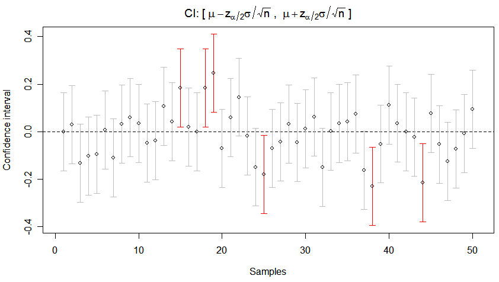

# Medidas de asociación: ¿cuántas veces más (o menos) frecuente?

::: {.callout-note}
## 🩺 Escenario

En una semana lees tres resúmenes: *"con iSGLT2 hubo 43 % menos eventos renales (RR 0.57)"*, *"los casos de lesión renal aguda tuvieron 3.8 veces los odds de haber usado AINE (OR 3.8)"* y *"la hiperpotasemia fue 2.6 veces más prevalente con IECA/ARA-II (RP 2.6)"*. Son tres medidas distintas, con nombres parecidos, y no se interpretan igual. Aquí aprenderás cuál usar según el diseño y cómo decir cada resultado con palabras.
:::

## Lo que vamos a hacer

-   Calcular **RP, RR, RTI, OR y HR** con ejemplos de nefrología.
-   Leer el **intervalo de confianza** y el valor *p* sin caer en las trampas clásicas.
-   Redactar la interpretación con una **plantilla** y una función de R.
-   Comparar cada medida **cruda** con la **verdad** en datos simulados.

## Paso 0. Una idea común y la medida según el diseño

Todas las medidas de asociación comparan la frecuencia de un desenlace entre dos grupos (expuestos y no expuestos) **dividiéndolas**. Si no hay asociación, el cociente vale **1**: es el valor nulo. Mayor que 1, el desenlace es más frecuente en el grupo expuesto; menor que 1, menos frecuente.

La medida que corresponde depende de **qué midió el diseño** (Capítulo 1.2):

-   **Transversal:** razón de prevalencias (**RP**).
-   **Cohorte o ECA con seguimiento completo:** riesgo relativo (**RR**); con seguimiento desigual, razón de tasas (**RTI**) o **HR**.
-   **Casos y controles:** solo el **OR**.
-   **Regresión logística**, en cualquier diseño: el **OR**.

En todo el capítulo usamos la base **simulada** `ckd_isglt2` (adultos con ERC y DM2) y la pregunta: *en adultos con ERC (G3-G4) y DM2 (**P**), ¿quienes **inician un iSGLT2** (**I**), comparados con quienes no (**C**), tienen menos **eventos renales** (TFGe −40 %, diálisis o trasplante) a 36 meses (**O**)?*

```{r}
#| label: setup-22
library(tidyverse)
library(survival)
source("R/funciones_epi.R")          # medidas_2x2()
source("R/funciones_extra_a.R")      # pct(), interpretar_asociacion()

ckd <- read_csv("Bases/ckd_isglt2.csv", show_col_types = FALSE) |>
  mutate(grupo = factor(isglt2, levels = c(0, 1), labels = c("Sin iSGLT2", "Con iSGLT2")))

# La "verdad" (solo posible porque la base es simulada): efectos causales reales
oraculo <- read_csv("Bases/ckd_isglt2_oraculo.csv", show_col_types = FALSE)
rr_verdadero <- mean(oraculo$evento_36m_1) / mean(oraculo$evento_36m_0)   # riesgo si todos tratados / si ninguno
```

## Paso 1. Razón de prevalencias (RP): la fotografía comparada

**Qué compara.** La prevalencia de la condición en expuestos y no expuestos, medida en **un solo momento** (estudio transversal).

$$
\text{RP} = \frac{\text{Prevalencia en expuestos}}{\text{Prevalencia en no expuestos}}
$$

*Ejemplo (hipotético):* en 400 pacientes con ERC se midió el potasio en la consulta; 200 usaban IECA/ARA-II y 200 no. Hubo hiperpotasemia (K⁺ ≥ 5.5 mEq/L) en 36 de los que usaban IECA/ARA-II y en 14 de los que no. La función `medidas_2x2()` pide las cuatro celdas de la tabla 2×2 en este orden: expuestos con evento (`a`), expuestos sin evento (`b`), no expuestos con evento (`c`) y no expuestos sin evento (`d`).

```{r}
#| label: rp
rp <- medidas_2x2(a = 36, b = 164,     # con IECA/ARA-II: con y sin hiperpotasemia
                  c = 14, d = 186)     # sin IECA/ARA-II: con y sin hiperpotasemia
rp
```

**Qué vemos.** La prevalencia fue 18 % vs. 7 %: **RP = `r num(rp$estimado[4], 2)`** (IC 95 % `r num(rp$ic_inf[4], 2)` a `r num(rp$ic_sup[4], 2)`). *"La prevalencia de hiperpotasemia fue 2.6 veces mayor entre quienes usaban IECA/ARA-II."* Pero en un transversal no sabes qué ocurrió primero: un paciente con hiperpotasemia pudo *suspender* el IECA, lo que enmascara la asociación (causalidad inversa).

## Paso 2. Riesgo relativo (RR): la comparación de riesgos

**Qué compara.** La **incidencia acumulada** (riesgo) del evento en dos grupos seguidos el mismo periodo.

$$
\text{RR} = \frac{\text{Riesgo en expuestos}}{\text{Riesgo en no expuestos}}
$$

```{r}
#| label: rr-ckd
tabla <- table(grupo = ckd$grupo, evento = ckd$evento)
tabla

res_rr <- medidas_2x2(
  a = tabla["Con iSGLT2", "1"], b = tabla["Con iSGLT2", "0"],
  c = tabla["Sin iSGLT2", "1"], d = tabla["Sin iSGLT2", "0"]
)
res_rr
```

**Qué vemos.** El riesgo a 36 meses fue `r pct(res_rr$estimado[1])` con iSGLT2 y `r pct(res_rr$estimado[2])` sin él: **RR = `r num(res_rr$estimado[4], 2)`** (IC 95 % `r num(res_rr$ic_inf[4], 2)` a `r num(res_rr$ic_sup[4], 2)`) y diferencia de riesgos de `r num(100 * res_rr$estimado[3], 1)` puntos porcentuales.

**Cómo decirlo.** RR = 1: riesgo igual. RR = 0.57: riesgo **43 % menor** (1 − 0.57). RR = 1.5: **50 % mayor**. RR = 3: **3 veces** el del grupo de referencia. Cuidado: "3 veces mayor" no es "3 % mayor" ni "30 % mayor". Para evitar confusiones, escribe siempre junto al RR las dos cifras absolutas: *"`r pct(res_rr$estimado[1])` vs. `r pct(res_rr$estimado[2])`"*.

El RR también se puede estimar con una **regresión de Poisson con errores robustos** (útil cuando después quieras ajustar por covariables). Da el mismo resultado:

```{r}
#| label: rr-poisson
mod_pois <- glm(evento ~ grupo, family = poisson, data = ckd)
se_robusto <- sqrt(diag(sandwich::vcovHC(mod_pois, type = "HC0")))["grupoCon iSGLT2"]
tibble(RR = exp(coef(mod_pois)[["grupoCon iSGLT2"]]),
       ic_inf = exp(coef(mod_pois)[["grupoCon iSGLT2"]] - 1.96 * se_robusto),
       ic_sup = exp(coef(mod_pois)[["grupoCon iSGLT2"]] + 1.96 * se_robusto))
```

::: {.callout-warning}
## ⚠️ Trampa frecuente: estas medidas son crudas, no son "el efecto"

El RR crudo es `r num(res_rr$estimado[4], 2)`, pero en esta base simulada **conocemos la verdad**: si *todos* los pacientes hubieran recibido el fármaco, el riesgo habría sido `r num(rr_verdadero, 2)` veces el que habrían tenido sin él. La asociación cruda **exagera** el beneficio porque quienes reciben el fármaco son más jóvenes, menos frágiles y con mejor TFGe. Medir una asociación no es lo mismo que estimar un efecto; convertir lo primero en lo segundo es el tema de la Parte 3.
:::

## Paso 3. Razón de tasas de incidencia (RTI): cuando el seguimiento es desigual

**Qué compara.** Dos **tasas** (casos por persona-tiempo). Es la medida adecuada cuando los pacientes se siguen tiempos distintos (fallecimientos, pérdidas, ingreso escalonado).

$$
\text{RTI} = \frac{\text{Tasa de incidencia en expuestos}}{\text{Tasa de incidencia en no expuestos}}
$$

```{r}
#| label: rti
pt <- ckd |>
  group_by(grupo) |>
  summarise(eventos = sum(evento), persona_anios = sum(tiempo_meses) / 12,
            tasa_100pa = 100 * eventos / persona_anios)
pt

# RTI con IC 95 % (método de Wald en escala log)
exp_g <- pt |> filter(grupo == "Con iSGLT2"); ctl <- pt |> filter(grupo == "Sin iSGLT2")
rti    <- exp_g$tasa_100pa / ctl$tasa_100pa
se_log <- sqrt(1 / exp_g$eventos + 1 / ctl$eventos)
rti_tab <- tibble(RTI = rti, ic_inf = exp(log(rti) - 1.96 * se_log), ic_sup = exp(log(rti) + 1.96 * se_log))
rti_tab
```

**Qué vemos.** Las tasas son `r num(exp_g$tasa_100pa, 1)` y `r num(ctl$tasa_100pa, 1)` eventos por 100 persona-años: **RTI = `r num(rti, 2)`**, es decir, la velocidad de aparición del evento fue `r round(100 * (1 - rti))` % menor con iSGLT2. La RTI se parece al RR cuando el evento es poco frecuente, el seguimiento es similar y casi no hay censura; aquí el evento ocurre en ~15 % y por eso difieren ligeramente.

## Paso 4. Odds ratio (OR): la medida de los casos y controles

**Qué compara.** Los **odds** de un evento entre grupos. Un *odds* es la probabilidad de que ocurra dividida entre la de que no ocurra (si $p = 0.2$, el odds es $0.2/0.8 = 0.25$, "una contra cuatro"):

$$
\text{odds} = \frac{p}{1 - p} \qquad\qquad \text{OR} = \frac{\text{odds en expuestos}}{\text{odds en no expuestos}}
$$

*Ejemplo (hipotético, casos y controles):* ¿el uso reciente de AINE se asocia con lesión renal aguda (LRA) hospitalaria? Se incluyeron 100 casos de LRA y 200 controles hospitalizados sin LRA. Entre los casos, 40 habían usado AINE y 60 no; entre los controles, 30 sí y 170 no. Recuerda el orden: las **filas** de `medidas_2x2()` son los grupos de exposición (con y sin AINE) y las columnas, los casos y controles.

```{r}
#| label: or-cc
or_cc <- medidas_2x2(a = 40, b = 30,       # con AINE: casos, controles
                     c = 60, d = 170)      # sin AINE: casos, controles
or_cc
```

**Qué vemos.** En casos y controles **solo el OR es válido**: las "proporciones" y el RR que imprime la tabla dependen de cuántos controles decidiste incluir, no de la realidad. **OR = `r num(or_cc$estimado[5], 2)`** (IC 95 % `r num(or_cc$ic_inf[5], 2)` a `r num(or_cc$ic_sup[5], 2)`): *"los casos tuvieron 3.8 veces los odds de haber usado AINE que los controles"*.

### El OR exagera cuando el evento es común

Con eventos raros (< 10 %), OR ≈ RR. Con eventos frecuentes, el OR se aleja de 1 más que el RR:

```{r}
#| label: fig-or-rr
#| fig-cap: "Para un mismo RR (0.5 o 2), el OR depende del riesgo basal: cuanto más común el evento, más se aleja de 1."
#| fig-width: 6.5
#| fig-height: 3.8
curva <- expand_grid(riesgo_basal = seq(0.01, 0.9, by = 0.01), rr = c(0.5, 2)) |>
  filter(rr * riesgo_basal < 1) |>                      # el riesgo expuesto no puede superar 1
  mutate(or = (rr * riesgo_basal / (1 - rr * riesgo_basal)) / (riesgo_basal / (1 - riesgo_basal)),
         rr = factor(rr, levels = c(0.5, 2), labels = c("RR = 0.5", "RR = 2")))

curva |>
  ggplot(aes(riesgo_basal, or, color = rr)) +
  geom_line(linewidth = 1.1) +
  geom_hline(yintercept = c(0.5, 2), linetype = "dotted") +
  scale_y_log10() +
  labs(x = "Riesgo en el grupo no expuesto", y = "OR (escala log)", color = NULL) +
  theme_minimal(base_size = 13)
```

En `ckd` hay un desenlace **común**: pérdida rápida de TFGe (caída mayor a 3 mL/min/1.73 m² por año). Mira cuánto se separan RR y OR:

```{r}
#| label: or-vs-rr-comun
ckd <- ckd |> mutate(caida_rapida = as.integer(pendiente_tfg < -3))
t2 <- table(grupo = ckd$grupo, caida = ckd$caida_rapida)
or_rr_comun <- medidas_2x2(t2["Con iSGLT2", "1"], t2["Con iSGLT2", "0"],
                           t2["Sin iSGLT2", "1"], t2["Sin iSGLT2", "0"]) |>
  filter(str_detect(medida, "RR|OR"))
or_rr_comun
```

La pérdida rápida ocurre en `r pct(mean(ckd$caida_rapida), 0)` de los pacientes. Con ese riesgo, el OR (`r num(or_rr_comun$estimado[2], 2)`) parece un efecto mucho más fuerte que el RR (`r num(or_rr_comun$estimado[1], 2)`), aunque es la misma asociación.

::: {.callout-tip}
## 💡 ¿RR u OR?

Si tienes una **cohorte o un ECA**, reporta **RR** (y la diferencia de riesgos). Reserva el OR para **casos y controles** o para cuando tu modelo (regresión logística) lo exija, y recuerda que el OR **no es un riesgo**. Con desenlaces comunes, evita traducir un OR como "veces más riesgo".
:::

## Paso 5. Hazard ratio (HR): la velocidad en el tiempo

**Qué compara.** El **hazard** (riesgo instantáneo) de presentar el evento en cada momento del seguimiento, entre quienes aún no lo han presentado. Se estima con modelos de supervivencia (Cox) y se resume en **un** número si el HR es aproximadamente **constante** en el tiempo. Piensa en el hazard como la "velocidad" a la que se acumulan los eventos en cada instante; **no es una probabilidad** y no es lo mismo que el RR, aunque a veces se parezcan.

$$
\text{HR} = \frac{\text{hazard en expuestos}}{\text{hazard en no expuestos}}
$$

```{r}
#| label: fig-km
#| fig-cap: "Curvas de Kaplan-Meier: probabilidad de permanecer libre de evento renal, según inicio de iSGLT2 (datos simulados, sin ajuste)."
#| fig-width: 7
#| fig-height: 6
library(survminer)

ajuste_km <- survfit(Surv(tiempo_meses, evento) ~ grupo, data = ckd)

ggsurvplot(
  ajuste_km, data = ckd,
  conf.int = TRUE, risk.table = TRUE, pval = FALSE,
  xlab = "Meses de seguimiento", ylab = "Libre de evento renal",
  legend.title = "", legend.labs = c("Sin iSGLT2", "Con iSGLT2"),
  palette = c("#D55E00", "#0072B2"), break.time.by = 6
)
```

```{r}
#| label: cox
cox <- coxph(Surv(tiempo_meses, evento) ~ grupo, data = ckd)
hr_tab <- summary(cox)$conf.int
hr_tab
```

**Qué vemos.** **HR = `r round(exp(coef(cox)), 2)`** (IC 95 % `r num(hr_tab[1, 3], 2)` a `r num(hr_tab[1, 4], 2)`): en cualquier momento del seguimiento, los pacientes con iSGLT2 tuvieron en promedio `r round(100 * (1 - exp(coef(cox))))` % menos riesgo instantáneo de evento renal. Y de nuevo, la verdad: en el guion que genera estos datos, el fármaco reduce el hazard de **cada paciente** a 0.70 de su valor (HR individual = 0.70). El HR crudo (`r num(exp(coef(cox)))`) parece mejor porque quienes reciben el fármaco ya eran, en promedio, más sanos.

Dos advertencias: "redujo el riesgo en X %" suele ser una mala traducción de un HR, que es una razón de **velocidades**, no de proporciones de pacientes (Hernán, 2010). Y antes de resumir con un único HR, verifica la **proporcionalidad de hazards** (`cox.zph(cox)`; lo veremos en el Capítulo 9).

## Paso 6. Cómo escribir el resultado: una plantilla

Un resultado mal redactado desperdicia un análisis bien hecho. La plantilla de interpretación que usa el autor en sus cursos (inspirada en las de EviSalud) tiene siempre las mismas casillas:

> En **[población]**, **[la prevalencia / el riesgo / la tasa / los odds / el hazard]** de **[desenlace]** en el grupo **[expuesto]** fue **[X veces / X %] [mayor / menor]** que en el grupo **[control]**. Este resultado **[fue / no fue]** estadísticamente significativo.

Cuando la exposición es numérica, cambia la casilla de los grupos: *"En [población], **por cada [unidad adicional]** de [exposición], [medida] de [desenlace] fue [X %] [mayor / menor]…"*. La función `interpretar_asociacion()` rellena las casillas por ti (revisa siempre que la frase tenga sentido clínico):

```{r}
#| label: plantilla-interpretacion
poblacion <- "En adultos con ERC G3-G4 y diabetes tipo 2"

interpretar_asociacion("RR", res_rr$estimado[4], res_rr$ic_inf[4], res_rr$ic_sup[4],
                       poblacion, "de evento renal a 36 meses",
                       expuesto = "que inició iSGLT2", control = "que no lo inició")

interpretar_asociacion("HR", exp(coef(cox)), hr_tab[1, 3], hr_tab[1, 4],
                       poblacion, "de evento renal",
                       expuesto = "con iSGLT2", control = "sin iSGLT2")

# Exposición numérica: HR por cada 10 mL/min/1.73 m2 adicionales de TFGe basal
cox_tfg <- coxph(Surv(tiempo_meses, evento) ~ I(tfg_basal / 10), data = ckd)
ci_tfg  <- summary(cox_tfg)$conf.int
interpretar_asociacion("HR", ci_tfg[1, 1], ci_tfg[1, 3], ci_tfg[1, 4],
                       poblacion, "de evento renal",
                       unidad = "10 mL/min/1.73 m² adicionales de TFGe basal")
```

## Paso 7. Valor *p* e intervalo de confianza

Además del valor puntual, muestra siempre su **precisión**.

-   **IC 95 %:** rango de valores del parámetro compatibles con los datos y el modelo. En 50 muestras repetidas, en promedio 95 % de los intervalos contienen el valor verdadero (los rojos de la figura no).
-   **Valor *p*:** probabilidad de observar un resultado tan extremo como el obtenido (o más) **si la hipótesis nula fuera cierta** (por ejemplo, RR = 1).

{width=70% fig-align="center"}

**Una regla mnemotécnica del autor: el 1 es la oveja negra.** Para una razón (RR, OR, HR, RP, RTI), el 1 es el valor "sin asociación". Si el IC **toca el 1**, el resultado no es estadísticamente significativo; si **todo el intervalo está por encima de 1**, es significativo y de "riesgo"; si **todo está por debajo de 1**, es significativo y "protector". Por ejemplo: HR = 1.85 (IC 95 % 1.15 a 2.96, *p* = 0.011) es compatible con aumentos de 15 % a 196 % del hazard; OR = 1.15 (IC 0.90 a 1.35) toca el 1; OR = 0.80 (IC 0.70 a 0.99) es protector.

Lo que el valor *p* **no** es:

-   No es la probabilidad de que la hipótesis nula sea cierta.
-   No mide el **tamaño** ni la **importancia clínica** del efecto.
-   "*p* < 0.05" no significa "efecto real", ni "*p* ≥ 0.05", "no hay efecto": con muestras grandes cualquier diferencia mínima es "significativa" y con muestras pequeñas un efecto importante puede no serlo.

Reporta **estimado + IC 95 % + una medida absoluta**, y deja el valor *p* como complemento. Mira siempre el **límite del IC más cercano a 1**: ¿seguiría siendo clínicamente relevante?

::: {.callout-important}
## 🎯 En resumen: ¿qué medida uso?

| Medida | Compara… | Diseño típico | Valor nulo | Función en R |
|---|---|---|---|---|
| **RP** (razón de prevalencias) | Prevalencias | Transversal | 1 | 2×2 o `glm(family = poisson)` con IC robusto |
| **RR** (riesgo relativo) | Incidencias acumuladas | Cohorte, ECA | 1 | 2×2 o `glm(family = poisson)` con IC robusto |
| **RTI** (razón de tasas de incidencia) | Tasas con persona-tiempo | Cohorte con seguimiento desigual | 1 | `poisson.test()`; `glm(family = poisson, offset = log(pt))` |
| **OR** (odds ratio) | *Odds* de evento (o de exposición) | Casos y controles; regresión logística | 1 | `glm(family = binomial)` |
| **HR** (hazard ratio) | Riesgo instantáneo en el tiempo | Análisis de supervivencia | 1 | `survival::coxph()` |

-   Todas valen **1 si no hay asociación**; el IC que toca el 1 no es significativo.
-   El OR **no es un riesgo** y exagera cuando el evento es común.
-   Redacta con la plantilla y acompaña la medida relativa de una **absoluta** (Capítulo 2.3).
-   Una asociación cruda **no** es un efecto causal: compárala con la verdad cuando la tengas.
:::

**Ejercicio.** (1) Con los datos de `ckd`, calcula la RP de **albuminuria severa** (UACR ≥ 300 mg/g) según tenga o no **enfermedad cardiovascular previa** (`ecv`) y redáctala con `interpretar_asociacion()`. (2) En un estudio de casos y controles, ¿por qué no puedes reportar un RR? (3) Un artículo reporta "OR = 0.45, IC 95 % 0.30 a 0.68" para un desenlace que ocurre en 40 % de los pacientes: ¿puedes decir que el riesgo fue 55 % menor? ¿Por qué?

## Referencias

1.  Zafra-Tanaka JH, Taype-Rondan A, Fernandez-Guzman D. Cómo entender las medidas de efecto en la investigación clínica: interpretación práctica y aplicación. *Rev Cuerpo Méd Hosp Nac Almanzor Aguinaga Asenjo*. 2023;16. <https://cmhnaaa.org.pe/ojs/index.php/rcmhnaaa/article/view/1935>

2.  Hernán MA. The hazards of hazard ratios. *Epidemiology*. 2010;21(1):13-15.

3.  Greenland S, Senn SJ, Rothman KJ, et al. Statistical tests, P values, confidence intervals, and power: a guide to misinterpretations. *Eur J Epidemiol*. 2016;31:337-350.

## Nota editorial

-   Esta sección fue editada con asistencia de IA (ChatGPT; revisión editorial con Claude). Los ejemplos con datos hipotéticos o simulados no corresponden a pacientes reales. Se corrigió el orden de las celdas del ejemplo de casos y controles (el OR no cambia, pero ahora las filas representan los grupos de exposición). La plantilla de interpretación y la regla de "la oveja negra" se adaptaron de las diapositivas y plantillas del autor.
