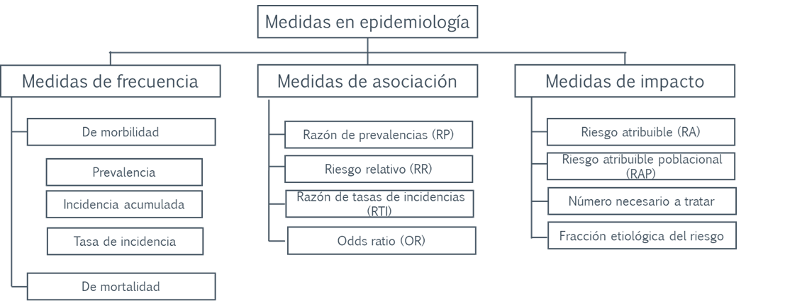

# Capítulo 2: Medidas en epidemiología

Antes de hablar de causalidad conviene dominar las **medidas en epidemiología**: son el idioma con el que se describe cuántos pacientes tienen una enfermedad, se compara entre grupos y se estima el impacto de una intervención. Entenderlas mejora la lectura de los estudios y las decisiones que tomas con el paciente que tienes enfrente.

::: {.callout-note}
## 🩺 Tres preguntas, tres tipos de medida

-   *"¿Cuántos pacientes de mi clínica tienen anemia o albuminuria severa?"* → **medidas de frecuencia** (prevalencia, incidencia).
-   *"¿Los pacientes que usan un iSGLT2 tienen menos eventos renales que los que no?"* → **medidas de asociación** (RR, OR, HR…).
-   *"¿A cuántos debo tratar durante 3 años para evitar un evento renal?"* → **medidas de impacto** (diferencia de riesgos, NNT).
:::

## Lo que vas a aprender

| Subcapítulo | Medidas | Responde a |
|---|---|---|
| 2.1 Frecuencia | Prevalencia, incidencia acumulada, tasa de incidencia | ¿Cuántos? ¿Con qué velocidad? |
| 2.2 Asociación | RP, RR, RTI, OR, HR, plantillas de interpretación | ¿Cuántas veces más (o menos) frecuente? |
| 2.3 Impacto | Diferencia de riesgos, NNT, RRR, fracciones atribuibles | ¿Cuántos pacientes se benefician o se dañan? |
| 2.4 ¿Qué es una asociación? | Descriptiva, explicativa, predictiva | ¿Cómo interpreto una asociación según la pregunta? |

En todos los subcapítulos con código usamos la base **simulada** `Bases/ckd_isglt2.csv` (adultos con enfermedad renal crónica y diabetes tipo 2). Como es simulada, también existe una versión "oráculo" con la verdad conocida, que nos permite comprobar cuánto engañan las medidas **crudas**. Los datos no provienen de pacientes reales.

## Para leer más

-   Zafra-Tanaka JH, Taype-Rondan A, Fernandez-Guzman D. Cómo entender las medidas de efecto en la investigación clínica: interpretación práctica y aplicación. *Rev Cuerpo Méd Hosp Nac Almanzor Aguinaga Asenjo*. 2023;16. <https://cmhnaaa.org.pe/ojs/index.php/rcmhnaaa/article/view/1935>
-   Hernán MA. The hazards of hazard ratios. *Epidemiology*. 2010;21(1):13-15.
-   Greenland S, Senn SJ, Rothman KJ, et al. Statistical tests, P values, confidence intervals, and power: a guide to misinterpretations. *Eur J Epidemiol*. 2016;31:337-350.
-   Altman DG. Confidence intervals for the number needed to treat. *BMJ*. 1998;317:1309-1312.
-   Knol MJ, VanderWeele TJ. Recommendations for presenting analyses of effect modification and interaction. *Int J Epidemiol*. 2012;41:514-520.
-   *Epidemiological Methods* (E. Karim), libro en línea: <https://ehsanx.github.io/EpiMethods/>. *Lectura recomendada por el autor; no se pudo consultar al preparar este capítulo.*

## Nota editorial

-   Esta sección fue editada con asistencia de IA (ChatGPT; revisión editorial con Claude).
