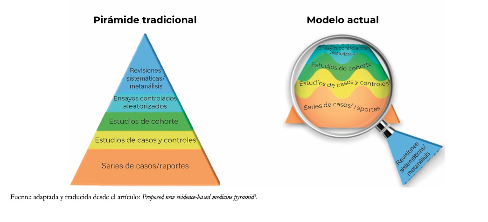
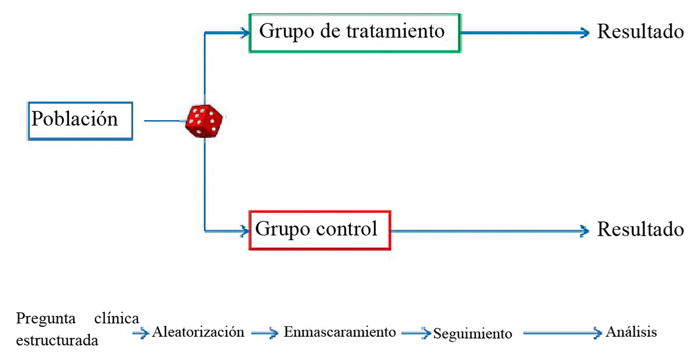
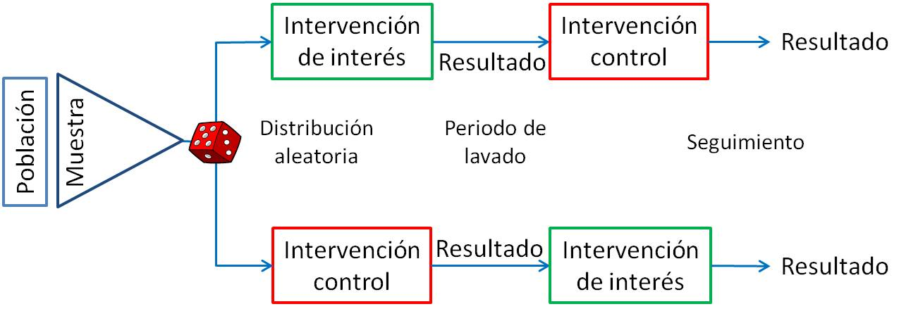
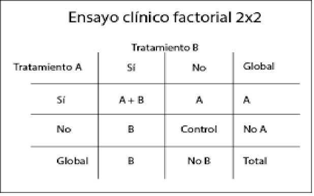
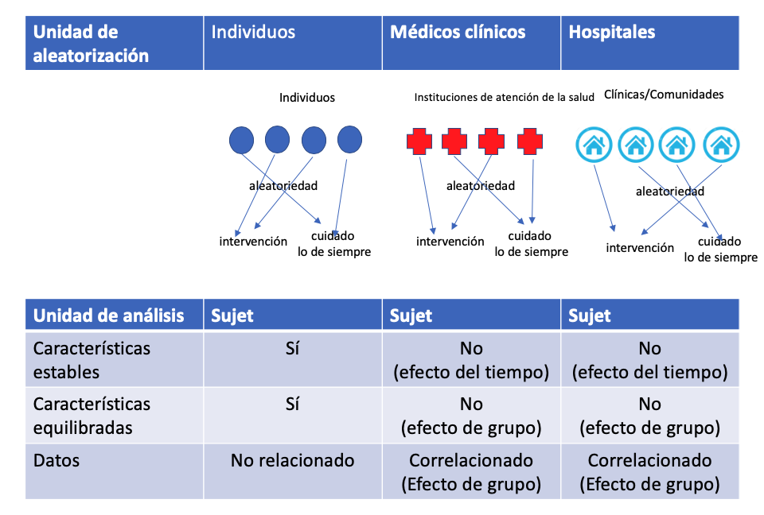
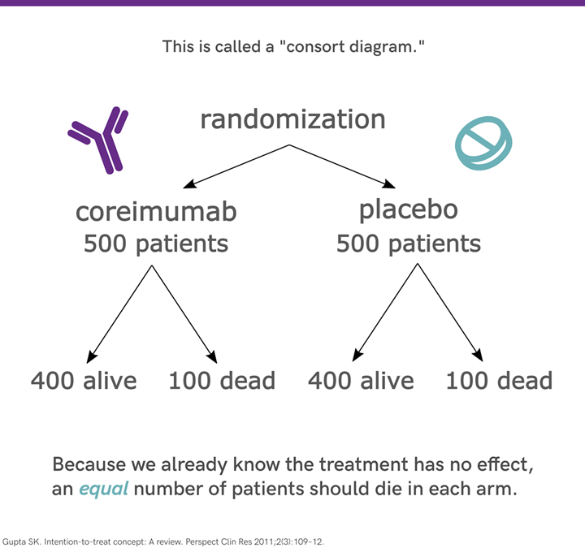
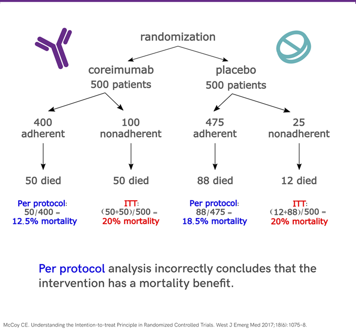
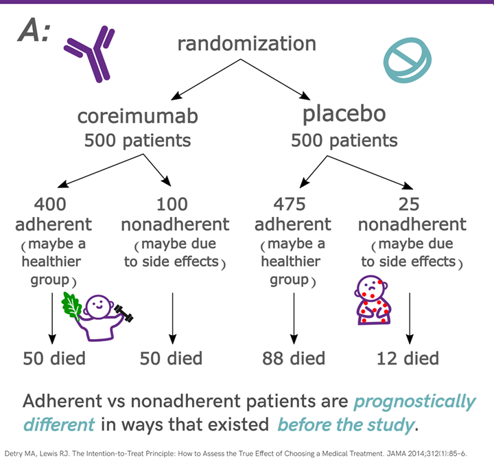
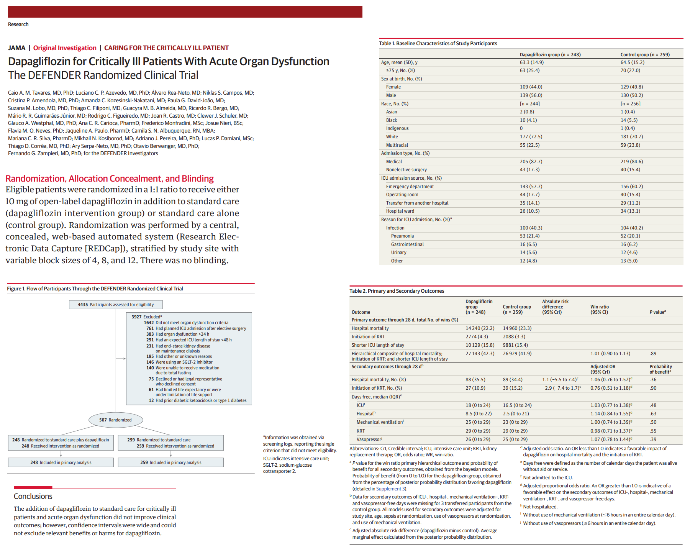

# Introducción a los fundamentos de los ensayos controlados aleatorios

## Introducción

La medicina basada en evidencia se fundamenta en la capacidad de responder con certeza a preguntas clínicas relevantes. Entre los diversos diseños de investigación, el ensayo clínico aleatorizado (ECA) representa el estándar de oro para establecer relaciones causales entre una intervención y sus efectos. Su fortaleza radica en la aleatorización, que permite balancear factores conocidos y desconocidos entre grupos, reduciendo el riesgo de sesgo y proporcionando estimaciones imparciales del efecto del tratamiento.

A diferencia de los estudios observacionales, donde los participantes eligen o son asignados a intervenciones por razones clínicas, los ECA introducen deliberadamente una intervención bajo condiciones controladas, permitiendo inferencias causales más sólidas. Esta capacidad es crucial tanto en la investigación básica como en la toma de decisiones clínicas, regulatorias y de salud pública.

El interés por los ECA ha crecido en múltiples disciplinas más allá de la medicina, incluyendo psicología, economía y ciencias sociales, dada su capacidad para responder preguntas como: ¿cuál tratamiento es más efectivo?, ¿cuál estrategia reduce más el riesgo de eventos adversos?, o ¿cómo impacta una política pública en una población específica?

::: callout-warning
## ⚠️ Cuidado: eficacia vs. efectividad

Es importante distinguir entre dos conceptos clave: *eficacia* y *efectividad*. La *eficacia* se refiere al desempeño de una intervención en condiciones ideales y controladas (usualmente en ECA explicativos), mientras que la *efectividad* evalúa su impacto en condiciones del mundo real (ECA pragmáticos).
:::

Por tanto, los ECA no sólo informan sobre el efecto potencial de una intervención, sino que también orientan decisiones clínicas personalizadas, políticas de salud pública y cobertura de tratamientos por parte de sistemas sanitarios.

> 📌 *Ejemplo*: El estudio SPRINT (2015) comparó el control intensivo de la presión arterial con el control estándar. Gracias a su diseño aleatorizado, se pudo establecer con claridad que la intervención intensiva redujo significativamente el riesgo cardiovascular.
>
> 🩺 *Ejemplo en nefrología*: los ensayos CREDENCE, DAPA-CKD y EMPA-KIDNEY asignaron al azar a pacientes con enfermedad renal crónica a un iSGLT2 o a placebo y evaluaron desenlaces renales y cardiovasculares. Gracias a la aleatorización, las diferencias observadas pueden atribuirse al fármaco y no a quién lo recibía.

### 📊 Jerarquía de la evidencia

Recuerda también, que la evidencia proveniente de ECA es resumida en RS de ECA, y gracias a ellas podemos valorar la certeza del cuerpo de la evidencia para que se tomen decisiones en salud pública.

{width="500" height="250"}

## Preguntas de investigación que se responden mejor con ECA

El ECA es particularmente útil para responder preguntas sobre *intervenciones*. Estas preguntas deben centrarse en determinar si una acción causa un cambio en un desenlace. En otras palabras, un ECA responde: “¿Qué pasaría si aplicáramos esta intervención en esta población?”

Este tipo de diseño *no es el más adecuado para explorar asociaciones, identificar factores pronósticos, establecer prevalencias o generar hipótesis*. Para eso, existen otros diseños como estudios de cohortes, transversales o estudios de casos y controles.

### ✅ Características ideales de una pregunta para un ECA:

-   Involucra una intervención consistente (un fármaco, una cirugía, un programa educativo).

-   Tiene al menos una *alternativa comparativa* (placebo, tratamiento estándar, otra intervención activa).

-   Se espera que la intervención tenga un *efecto medible* sobre uno o más desenlaces.

-   Los desenlaces son *clínicamente relevantes* y medibles con precisión.

### 🧩 Ejemplos

| Área          | Ejemplo de pregunta                                                                                                                                      |
|---------------------|---------------------------------------------------|
| Cardiología   | ¿La administración de un inhibidor de SGLT2 reduce el riesgo cardiovascular en pacientes con insuficiencia cardíaca con fracción de eyección conservada? |
| Nefrología    | ¿La restricción de sodio mejora la presión arterial y la proteinuria en pacientes con enfermedad renal crónica estadio 3-4?                              |
| Salud pública | ¿La implementación de recordatorios por SMS mejora la adherencia al tratamiento antituberculoso?                                                         |
| Oncología     | ¿La quimioterapia adyuvante con capecitabina mejora la sobrevida global en pacientes con cáncer de mama triple negativo en estadio temprano?             |

## *Pasos para el diseño y realización de un ECA*

Diseñar y ejecutar un ECA implica una serie de decisiones estratégicas y metodológicas que determinan la validez interna y externa del estudio. Un diseño riguroso maximiza la posibilidad de obtener resultados fiables, éticos y clínicamente útiles.

A continuación, se presentan los pasos clave para planificar y ejecutar un ECA.

### 🧩 Plantear una pregunta de investigación clara (formato PICO)

Una pregunta bien estructurada nos guiará todo el proceso, incluyendo el diseño, la recolección de datos, la interpretación y las conclusiones del estudio.

¿qué intervención queremos evaluar, en qué población, frente a qué comparador y con qué desenlace?

-   *P*: Población

-   *I*: Intervención

-   *C*: Comparador

-   *O*: Resultado (Outcome)

> 📌 *Ejemplo PICO*:
>
> En adultos mayores con enfermedad renal crónica (P), ¿la administración de estatinas (I), comparada con placebo (C), reduce la mortalidad cardiovascular (O)?

### 🧪 Justificación del ECA: *equipoise*

Debe existir una *incertidumbre clínica genuina* sobre cuál intervención es mejor. Esto es fundamental para justificar la aleatorización desde el punto de vista ético.

### 🧬 Selección de la población de estudio

-   *Criterios de inclusión*: delimitan a quién está dirigida la intervención.

-   *Criterios de exclusión*: protegen la seguridad de los pacientes y aseguran consistencia.

Un equilibrio entre criterios estrictos (mayor validez interna) y una muestra representativa (mayor validez externa) es crucial para que los resultados de un ECA sean útiles en la práctica clínica.

### 🧰 Elección del tipo de diseño

-   *Paralelo*: los participantes se asignan a uno de dos (*o más*) grupos y permanecen allí durante todo el estudio.

{width="500" height="250"}

-   *Cruzado* (*crossover*): los participantes reciben ambos tratamientos en distintos momentos.

{width="500" height="250"}

-   *Factorial*: evalúa múltiples intervenciones y las combinaciones posibles.

{width="500" height="250"}

### 🔀 Aleatorización

La aleatorización asigna a los participantes a los grupos de estudio de forma imparcial, equilibrando características basales (conocidas y *desconocidas*).

En la mayoría de los ECA, esta asignación se realiza a nivel individual, aunque puede generar problemas como la *contaminación*, especialmente cuando un mismo profesional atiende a ambos grupos. En tales casos, se prefiere la aleatorización por conglomerados, donde se asignan grupos completos (por ejemplo, farmacéuticos, salas u hospitales) a un solo brazo del estudio. Este método reduce la contaminación, pero requiere un mayor tamaño muestral y puede limitar la participación de investigadores.

-   *Simple*: como lanzar una moneda, mediante sobres o software

-   *Estratificada*: asegura el balance de variables clave.

-   *Por bloques*: mantiene tamaños de grupo similares.

-   *Por conglomerados*: útil cuando se aleatorizan grupos (ej., hospitales).

{width="500" height="250"}

También pueden emplearse diseños más complejos como la aleatorización serial o factorial. Sea cual sea el método, es fundamental asegurar que cada paciente sea aleatorizado una sola vez y mantener *oculto el esquema de asignación* para minimizar el sesgo de selección

### 🕶️ Enmascaramiento (cegamiento)

El enmascaramiento minimiza el sesgo en la administración de la intervención y evaluación de los desenlaces.

-   *Sin ciego o etiqueta abierta*: todos conocen a que brazo pertenecen

-   *Simple ciego*: el paciente desconoce en que brazo pertenece

-   *Doble ciego*: paciente y evaluador están cegados.

-   *Triple ciego*: también el analista está cegado.

#### *¿Siempre es posible el cegamiento?*

La respuesta corta es no. Existen situaciones donde el cegamiento es impracticable o incluso éticamente cuestionable. Por ejemplo, en intervenciones quirúrgicas, cambios de estilo de vida o tratamientos con efectos secundarios evidentes (como un fármaco que causa alopecia), es difícil o imposible ocultar la intervención.

En estos casos, se recomienda implementar estrategias alternativas, como:

-   *Uso de evaluadores ciegos* para medir desenlaces.

-   *Desenlaces objetivos* menos susceptibles a interpretación subjetiva.

-   *Análisis por intención de tratar*, que ayuda a minimizar el sesgo por abandono.

Incluso cuando el cegamiento no es viable, debe justificarse claramente y explicarse cómo se abordarán los posibles sesgos.

### 🧮 Cálculo del tamaño muestral

Se basa en:

-   Magnitud del efecto esperado

-   Variabilidad del desenlace

-   Nivel de significancia (alfa) y potencia (1 - beta)

Este apartado se abordará en otr capítulo.

> 📌 *Consejo*: sobrestimar ligeramente el tamaño muestral ayuda a compensar las pérdidas.

### 🎯 Definición de desenlaces

-   *Primarios*: aquellos sobre los que se basarán las conclusiones. Idealmente estos desenlaces deben ser clinicos e importantes para los pacientes. (ejemplo: mortalidad, infarto, fracturas, eventos adversos, etc.)

-   *Secundarios*: otros relevantes, pero no centrales. aqui se incluyen desenlaces subrogados (ejemplo HbA1c, colesterol, leucocitos, etc.)

-   Deben ser *medibles*, *clínicamente importantes* y definidos *previamente*.

::: callout-warning
## ⚠️ Cuidado con los desenlaces subrogados

Ten en cuenta que muchos desenlaces subrogados no necesariamente se traduciran en un outcome clinico importante. Por lo que, se sugiere usarlos e interpretarlos con cautela

Ejemplos:

-   Un fármaco que reduce el LDL no necesariamente reduce la mortalidad: puede mejorar el valor de laboratorio sin mejorar (o incluso empeorando) el desenlace clínico.

-   🩺 En nefrología, la **TFGe** y la **albuminuria** son desenlaces subrogados de uso frecuente; los desenlaces que importan al paciente son la **diálisis, el trasplante, los eventos cardiovasculares y la muerte**. Una mejora de la albuminuria solo tiene valor si se traduce en menos de estos eventos.
:::

### 📋 Planificación del análisis estadístico

-   Se debe establecer antes del inicio.

-   ¿Análisis por intención de tratar o por protocolo? *Ver más adelante*

-   Métodos para manejar datos faltantes.

-   Estrategias de ajuste si se planea un análisis multivariable.

### 🔐 Consideraciones éticas y registro del ensayo

-   Aprobación por un comité de ética.

-   *Consentimiento informado*.

-   Registro público del ECA (*ej.*: ClinicalTrials.gov).

### 🛠️ Implementación y monitoreo

-   Capacitación del personal.

-   Supervisión continua del cumplimiento del protocolo.

-   Registro estandarizado de datos.

-   Evaluación de efectos adversos.

### ✅ Interpretación y reporte (revisar CONSORT)

-   Uso de la guía CONSORT para informar de forma transparente.

-   Inclusión de diagrama de flujo del estudio.

-   Evaluación crítica de limitaciones.

## *Tipos de sesgo en ECA y como minimizarlos*

Aunque los ECA son el estándar de oro para establecer relaciones causales, *no están libres de sesgos*. Identificar y reducir estos sesgos es esencial para preservar la validez interna de los resultados.

### 🎯 ¿Qué es el sesgo?

El sesgo es un *error sistemático* en el diseño, realización o análisis del estudio que lleva a una *estimación incorrecta del efecto verdadero* de la intervención.

### 🧠 Sesgo de selección

*¿Qué es?*\
Ocurre cuando las características iniciales de los grupos difieren de manera sistemática, alterando la comparabilidad.

*Cómo prevenirlo:*

-   *Aleatorización adecuada*: usar generadores de números aleatorios y ocultamiento de la secuencia.

-   *Ocultamiento de la asignación*: quien inscribe al participante no debe conocer el grupo asignado y los participantes no deberían poder ser capaces de predecir el orden de la secuencia.

### 😷 Sesgo de desempeño

*¿Qué es?*\
Se produce cuando los participantes o personal del estudio modifican su comportamiento por conocer la intervención asignada.

*Cómo prevenirlo:*

-   *Enmascaramiento (cegamiento)* del participante y del personal sanitario.

-   Protocolos estandarizados para el manejo de ambos grupos.

### 📈 Sesgo de detección

*¿Qué es?*\
Aparece cuando la evaluación de los desenlaces se ve influida por el conocimiento del grupo asignado.

*Cómo prevenirlo:*

-   *Cegamiento de los evaluadores de desenlaces*.

-   Uso de *desenlaces objetivos*, medibles y validados.

### 🧾 Sesgo de desgaste (attrition bias)

*¿Qué es?*\
Se produce cuando hay *pérdida diferencial* de participantes entre grupos o abandonos no informados adecuadamente.

*Cómo prevenirlo:*

-   Registro y reporte claro de todas las pérdidas (uso de diagrama CONSORT).

-   *Análisis por intención de tratar*: incluye a todos los asignados al grupo, sin importar si completaron el estudio.

### 📊 Sesgo de notificación (reporting bias)

*¿Qué es?*\
Ocurre cuando se reportan solo los resultados estadísticamente significativos o favorables, ignorando otros desenlaces preespecificados.

*Cómo prevenirlo:*

-   *Registro prospectivo* del protocolo (ej. en ClinicalTrials.gov).

-   Reporte completo según *guía CONSORT*.

-   Declaración clara de todos los desenlaces medidos.

## *ECA explicativos vs ECA pragmáticos*

Los ensayos clínicos no son todos iguales: *la intención con la que se diseñan influye profundamente en su estructura, ejecución e interpretación*. Aquí entra una distinción clave: *ensayos explicativos* y *ensayos pragmáticos*. Comprender estas diferencias permite al investigador adaptar su diseño a los objetivos clínicos o de salud pública.

### 🧪 Ensayos explicativos

*¿Para qué sirven?*\
Buscan responder si una intervención *puede* funcionar en condiciones ideales. Evalúan *eficacia*.

*Características:*

-   Población homogénea y altamente seleccionada.

-   Alta adherencia esperada.

-   Estricto control de la intervención.

-   Desenlaces intermedios o fisiológicos.

-   Mayor validez interna.

*Ejemplo:*\
Ensayo farmacológico fase III que evalúa la respuesta bioquímica a una nueva molécula en un entorno hospitalario controlado.

### 🌍 Ensayos pragmáticos

*¿Para qué sirven?*\
Evalúan si una intervención *funciona* en el mundo real. Evalúan *efectividad*.

*Características:*

-   Inclusión de pacientes diversos.

-   Condiciones clínicas habituales.

-   Menor control sobre la intervención.

-   Desenlaces clínicos relevantes para pacientes.

-   Mayor validez externa.

*Ejemplo:*\
Ensayo que compara atención habitual vs intervención en múltiples centros de atención primaria con seguimiento mínimo.

### ⚖️ ¿Cuál elegir?

| Característica                   | Ensayo Explicativo          | Ensayo Pragmático             |
|--------------------------|----------------------|------------------------|
| Objetivo principal               | Eficacia                    | Efectividad                   |
| Población                        | Altamente seleccionada      | Representativa del mundo real |
| Condiciones de intervención      | Muy controladas             | Rutina clínica                |
| Generalización (validez externa) | Baja                        | Alta                          |
| Medición de adherencia           | Estricta                    | Mínima supervisión            |
| Desenlaces                       | Intermedios / biomarcadores | Clínicos relevantes           |

Esta distinción no es dicotómica, sino *un espectro*. Muchos ensayos tienen componentes de ambos enfoques. Para ayudar a su diseño y reporte, se ha desarrollado la herramienta *PRECIS-2* (PRagmatic-Explanatory Continuum Indicator Summary), que permite visualizar en una rueda múltiples dimensiones de un ECA.

> ⚠️ *El uso de PRECIS-2 es especialmente útil cuando se planifica un estudio multicéntrico con políticas de salud involucradas.*

## *Análisis por intención de tratar y por protocolo*

Uno de los aspectos más debatidos en el análisis de ECA es la forma en que se tratan los datos de los participantes una vez iniciado el estudio. ¿Qué ocurre si algunos abandonan el tratamiento? ¿O si no cumplen con el protocolo? ¿Debemos analizarlos tal como fueron asignados originalmente o solo considerar a quienes siguieron fielmente el tratamiento? La respuesta a estas preguntas define dos enfoques fundamentales: el análisis por *intención de tratar (ITT)* y el análisis *por protocolo (PP)*.

::: {style="text-align: center;"}
{width="600" height="550"}
:::

### *El principio de intención de tratar (ITT)*

El análisis por intención de tratar consiste en incluir en el análisis final a todos los participantes *según el grupo al que fueron asignados originalmente por la aleatorización*, independientemente de si completaron el tratamiento, lo interrumpieron o cambiaron de grupo. Esta estrategia refleja lo que realmente sucede en la práctica clínica: los pacientes no siempre siguen al pie de la letra las indicaciones.

Este enfoque es considerado el *estándar de oro* para mantener la *validez interna* del ensayo, ya que *preserva los beneficios de la aleatorización*, asegurando que las comparaciones entre grupos no estén sesgadas por características post-asignación.

Por ejemplo, imaginemos un ECA que compara dos medicamentos. Algunos pacientes del grupo A no toman el medicamento por efectos secundarios (no adherentes), mientras que otros del grupo B lo suspenden por falta de eficacia (no adherentes). El análisis ITT incluirá a todos en sus grupos asignados, respetando la asignación original, y por tanto, **preservando la comparabilidad que creó la aleatorización**.

::: {.callout-warning}
## ⚠️ Cuidado: ITT no corrige la falta de adherencia

El ITT protege contra el **sesgo de selección posterior a la aleatorización**, pero **no** corrige la mala adherencia: estima el efecto de *ser asignado* al tratamiento, que se **diluye** hacia el valor nulo si muchos pacientes no lo toman. Por eso un ITT "negativo" puede esconder un fármaco que sí funciona en quienes lo toman, y por eso en estudios de **no inferioridad** el ITT puede favorecer falsamente al tratamiento nuevo.
:::

::: {style="text-align: center;"}
{width="600" height="550"}
:::

Si consideramos el ejemplo, segun el análisis por ITT, la mortalidad fue del 20% en el grupo de coreimumab y del 20% en grupo placebo, lo que nos da un RR = 1.

La conclusión con este análisis será que coreimumab no modifica la mortalidad (conclusión conservadora para un ensayo de superioridad: evita declarar un beneficio que no existe).

### *Análisis por protocolo (PP)*

El análisis por protocolo, en cambio, solo considera a aquellos participantes que *cumplieron estrictamente con el protocolo del estudio*, es decir, que recibieron el tratamiento completo como estaba planificado, sin desviaciones (excluye a los no adherentes).

Este tipo de análisis busca estimar el *efecto del tratamiento en condiciones ideales*, lo cual puede ser útil cuando se desea entender el potencial terapéutico máximo de una intervención. No obstante, *sacrifica la aleatorización*, ya que al excluir a quienes no cumplieron el protocolo, se introduce el riesgo de comparar grupos no equivalentes.

::: {style="text-align: center;"}
{width="500" height="450"}
:::

Bajo este análisis, el ECA informa que la mortalidad en el grupo de coreimumab fue de 12.5% y en el grupo de placebo fue de 18.5%. El RR reportado será = 0.68. Así, la conclusión bajo este enfoque será que coreimmumab reduce en un 32% la mortalidad, una conclusión aparentemente ventajosa pero que puede estar sesgada: al excluir a los no adherentes, el PP ya no compara grupos creados por azar, sino adherentes con no adherentes (y los pacientes que cumplen suelen tener mejor pronóstico).

### *¿Cuál elegir?*

En general, se recomienda utilizar ambos análisis de forma complementaria (ITT como principal en superioridad; en no inferioridad se examinan ambos). Cuando los resultados de ITT y PP son consistentes, se refuerza la *robustez de las conclusiones*. Sin embargo, si difieren significativamente, se debe interpretar con cautela, considerando posibles explicaciones como la falta de adherencia, eventos adversos o sesgo de selección.

### *Recomendaciones prácticas*

-   *Siempre reporte el análisis ITT* como análisis principal.

-   Realice un análisis PP *como análisis secundario*, claramente identificado como tal.

-   Documente claramente los *criterios para definir adherencia* al protocolo.

-   Reporte las razones de exclusión en PP y el número de pérdidas para mantener la transparencia.

::: {.callout-note}
## ¡Atención! No adherencia vs. pérdida de seguimiento vs. "ITT modificado"

Son tres situaciones distintas:

-   **No adherencia**: el paciente no toma el tratamiento asignado, pero **sí** se conoce su desenlace. En el ITT se mantiene en su grupo.
-   **Pérdida de seguimiento**: **no** se conoce el desenlace. No se resuelve "excluyendo" a los perdidos; hay que **reportarlas** (diagrama CONSORT) y abordarlas con métodos de datos faltantes (imputación múltiple, ponderación) bajo supuestos explícitos, y con análisis de sensibilidad.
-   **ITT modificado (mITT)**: término usado de forma muy variable (p. ej., excluir a los aleatorizados que nunca recibieron una dosis o sin medición posbasal). **Cada exclusión puede reintroducir sesgo** y la definición debe estar **preespecificada** y justificada en el protocolo. Desconfía de un mITT que no se define con claridad.
:::

*En conclusión*, los enfoques ITT y PP responden a preguntas diferentes: uno nos dice qué pasaría si se implementa la intervención en condiciones reales; el otro, qué podría pasar si todo saliera según lo planeado. Saber cuándo y cómo usar cada uno es fundamental para interpretar adecuadamente los resultados de un ECA y comunicar sus hallazgos de forma responsable.

## *Selección y evaluación de desenlaces clínicos*

Uno de los pilares más importantes —y a veces subestimados— en el diseño de un ensayo clínico controlado aleatorizado (ECA) es la definición clara y precisa de los *desenlaces*. Los desenlaces (también conocidos como resultados o endpoints) son las variables que se medirán para evaluar la eficacia, seguridad o impacto de la intervención. En otras palabras, son el reflejo de lo que queremos cambiar o mejorar con el tratamiento.

Un buen desenlace no solo debe ser clínicamente relevante, sino también medible, reproducible y apropiado para la población de estudio. La selección incorrecta o ambigua de desenlaces puede llevar a interpretaciones erróneas o incluso a que un ECA se considere inválido, por muy bien diseñado que esté en otros aspectos.

### *Desenlaces primarios y secundarios: jerarquía y enfoque*

En la mayoría de los ECA, se define un único *desenlace primario*, que será la base para el cálculo del tamaño muestral y la principal medida de éxito del estudio. Además, se pueden definir *desenlaces secundarios*, que exploran otros efectos potenciales de la intervención, aunque no están necesariamente alimentando las hipótesis principales.

Por ejemplo, en un ECA sobre un nuevo antihipertensivo:

-   *Desenlace primario*: cambio en la presión arterial sistólica a 12 semanas.

-   *Desenlaces secundarios*: eventos cardiovasculares mayores, adherencia al tratamiento, efectos adversos, calidad de vida.

Elegir múltiples desenlaces primarios puede ser tentador, pero también puede complicar la interpretación estadística y aumentar el riesgo de errores tipo I (falsos positivos). Por esta razón, las guías CONSORT recomiendan declarar *explícitamente un solo desenlace primario* y justificar cualquier desenlace compuesto.

### *Tipos de desenlaces*

Los desenlaces pueden clasificarse según su naturaleza:

-   *Clínicos duros*: como mortalidad, infarto, ingreso hospitalario. Son los más robustos y relevantes.

-   *Surrogados (subrogados)*: como presión arterial, colesterol, HbA1c. Aunque más fáciles de medir, deben estar validados como predictores confiables de eventos clínicos.

-   *Desenlaces subjetivos*: calidad de vida, dolor, bienestar. Requieren escalas validadas y, si es posible, cegamiento para evitar sesgos.

-   *Desenlaces Compuestos*: combinación de varios eventos (ej. “mortalidad cardiovascular, IAM o ACV”). Útiles cuando los eventos son infrecuentes, pero su interpretación exige cautela: no todos los componentes tienen el mismo peso clínico.

### *Precisión y validación de los desenlaces*

Todo desenlace debe cumplir tres criterios esenciales:

1.  *Definición operativa clara*: Debe estar especificado cómo se medirá el desenlace, en qué momento y con qué herramientas.

2.  *Validez clínica*: El desenlace debe estar alineado con la perspectiva del paciente, el profesional de salud y los objetivos del estudio.

3.  *Fiabilidad de la medición*: Las herramientas usadas deben ser consistentes, estandarizadas y validadas en la población objetivo.

### *Buenas prácticas al definir desenlaces*

-   Evitar el desenlace compuesto si los componentes varían mucho en gravedad.

-   Preespecificar todos los desenlaces en el protocolo, evitando introducir nuevos tras el análisis.

-   Usar escalas validadas para medir desenlaces subjetivos.

-   Incluir desenlaces centrados en el paciente, no solo biomarcadores.

-   Evitar sesgos de medición mediante cegamiento o herramientas objetivas.

## *Objetivo de la aleatorización*

El propósito de la aleatorización es crear grupos comparables en características *pronósticas* como edad, sexo, presión arterial, TFG basal y comorbilidades, de modo que *las diferencias en los resultados puedan atribuirse únicamente a la intervención y no a otros factores*.

Veamos un ejemplo publicado:

*Referencia:* Tavares CAM, Azevedo LCP, Rea-Neto Á, et al. "Dapagliflozina para pacientes críticos con disfunción orgánica aguda: ensayo clínico aleatorizado DEFENDER." JAMA. Publicado en línea el 14 de junio de 2024

::: {style="text-align: center;"}
{width="700" height="550"}
:::

### 🎯 Objetivo del Estudio

Evaluar si la adición de dapagliflozina al tratamiento estándar mejora los resultados clínicos en pacientes críticamente enfermos con disfunción orgánica aguda.

### 🔄 Método de Aleatorización

El estudio fue un ensayo clínico multicéntrico, aleatorizado y abierto, realizado en 22 unidades de cuidados intensivos (UCI) en Brasil. Los participantes fueron asignados al azar en una proporción 1:1 para recibir 10 mg de dapagliflozina más atención estándar o atención estándar sola durante un máximo de 14 días o hasta el alta de la UCI, lo que ocurriera primero. Al revisar un ensayo, comprueba siempre **cómo se generó la secuencia de aleatorización** (software, sistema centralizado) y **cómo se ocultó** la asignación (sobres opacos, sistema web); esos detalles se describen en la sección de métodos del artículo.

### 📊 Flujograma de Participantes (CONSORT)

El estudio siguió las directrices CONSORT para reportar el flujo de participantes:

-   *Evaluados para inclusión:* reporta criterios estrictos para ser potencialmente seleccionado para el estudio.

-   *Aleatorizados:* 507 pacientes

    -   *Grupo Dapagliflozina:* 248 pacientes

    -   *Grupo Control:* 259 pacientes

-   *Analizados:* Todos los pacientes aleatorizados fueron incluidos en el análisis por intención de tratar.

### ⚖️ Balance Basal

Las características basales de los participantes, como edad, sexo, tipo de disfunción orgánica y comorbilidades, fueron similares entre los grupos, indicando un adecuado equilibrio basal gracias a la aleatorización.

### 📈 Desenlace Principal

El desenlace primario fue una combinación jerárquica de mortalidad hospitalaria, inicio de terapia de reemplazo renal y duración de la estancia en la UCI durante 28 días. No se encontró diferencias estadisticamente significativas.


## Práctica en R: aleatorizar y comparar ITT con PP

Dos tareas prácticas: **generar una lista de aleatorización** y **ver con una simulación** por qué el análisis por protocolo puede engañar.

### Generar una lista de aleatorización

```{r}
#| label: aleatorizacion
library(tidyverse)
set.seed(2025)            # semilla: permite reproducir la lista (guárdala y no la compartas con quien recluta)

# a) Aleatorización simple (como lanzar una moneda)
simple <- sample(c("iSGLT2", "Control"), size = 20, replace = TRUE)
table(simple)             # los grupos pueden quedar desbalanceados con n pequeño

# b) Aleatorización por bloques de 4 (mantiene los grupos balanceados)
bloques <- function(n_bloques, tam = 4) {
  unlist(replicate(n_bloques, sample(rep(c("iSGLT2", "Control"), tam / 2)), simplify = FALSE))
}
por_bloques <- bloques(5)
table(por_bloques)

# c) Aleatorización estratificada: bloques dentro de cada estrato (aquí, diabetes sí/no)
lista <- tibble(id = 1:96, diabetes = rep(c("Sí", "No"), each = 48)) |>
  group_by(diabetes) |>
  mutate(grupo = bloques(n() / 4)) |>
  ungroup()
table(lista$diabetes, lista$grupo)
```

::: {.callout-tip}
## 💡 Tip práctico

En un ensayo real la lista la genera alguien **independiente** del reclutamiento y se oculta (sobres opacos o sistema centralizado). Variar el tamaño del bloque (4, 6, 8) evita que el investigador pueda **predecir** la siguiente asignación.
:::

### ITT frente a PP: una simulación

Simulamos un ensayo de 4000 pacientes. El tratamiento reduce un desenlace en 0.5 unidades **en quien lo recibe**. Los pacientes con peor pronóstico abandonan el tratamiento con más frecuencia.

```{r}
#| label: itt-pp
set.seed(10)
n <- 4000
pronostico <- rnorm(n)                                   # mayor = peor pronóstico
asignado   <- rbinom(n, 1, 0.5)                          # aleatorización
adherente  <- rbinom(n, 1, plogis(1.2 - 1.2 * pronostico))  # los de peor pronóstico abandonan más
recibe     <- asignado * adherente                       # recibe el fármaco solo si fue asignado Y adhiere
desenlace  <- 1.0 * pronostico - 0.5 * recibe + rnorm(n) # efecto verdadero del tratamiento recibido: -0.5

ensayo <- tibble(pronostico, asignado, adherente, recibe, desenlace)

tibble(
  análisis = c("Verdad (efecto de recibir el fármaco)",
               "ITT (todos, según lo asignado)",
               "PP ingenuo (solo adherentes vs. todos los controles)"),
  estimado = c(
    -0.5,
    coef(lm(desenlace ~ asignado, data = ensayo))[["asignado"]],
    mean(ensayo$desenlace[ensayo$asignado == 1 & ensayo$adherente == 1]) -
      mean(ensayo$desenlace[ensayo$asignado == 0])
  )
) |> mutate(estimado = round(estimado, 2))
```

-   El **ITT** subestima el efecto de *recibir* el fármaco porque `r scales::percent(mean(ensayo$adherente[ensayo$asignado == 1]), 1)` de los asignados lo toma (el efecto se **diluye**), pero es una comparación **válida**.
-   El **PP ingenuo** exagera el efecto: compara a los adherentes (de mejor pronóstico) con todos los controles. **Se rompió la aleatorización.**

::: {.callout-note}
## ¿Cómo estimar el efecto "por protocolo" sin engañarse?

Con métodos de inferencia causal: se **pondera** por la probabilidad de ser adherente según el pronóstico y otras variables (la misma lógica de ponderación del Capítulo 3.2). Veremos esos análisis en capítulos posteriores.
:::

::: {.callout-important}
## 🎯 En resumen

| Concepto | Qué recordar |
|---|---|
| **Aleatorización** | Equilibra factores conocidos y desconocidos; el **ocultamiento** de la secuencia es tan importante como el azar |
| **Cegamiento** | Reduce sesgos de desempeño y de detección; si no es posible, usa desenlaces objetivos y evaluadores ciegos |
| **ITT** | Analiza según lo asignado; análisis principal en superioridad; estima el efecto de la **asignación** |
| **PP** | Excluye a los no adherentes; **rompe la aleatorización**; interpretar con cautela |
| **Pérdidas** | Se reportan (CONSORT) y se abordan con métodos para datos faltantes; no se resuelven excluyendo pacientes |
| **Desenlaces** | Un solo primario, clínicamente relevante, preespecificado; los subrogados (TFGe, albuminuria) con cautela |
| **Reporte** | CONSORT + registro prospectivo del protocolo |
:::

## Nota editorial

-   Esta sección fue editada con asistencia de IA (ChatGPT; revisión editorial con Claude). Los datos de la simulación son ficticios.
