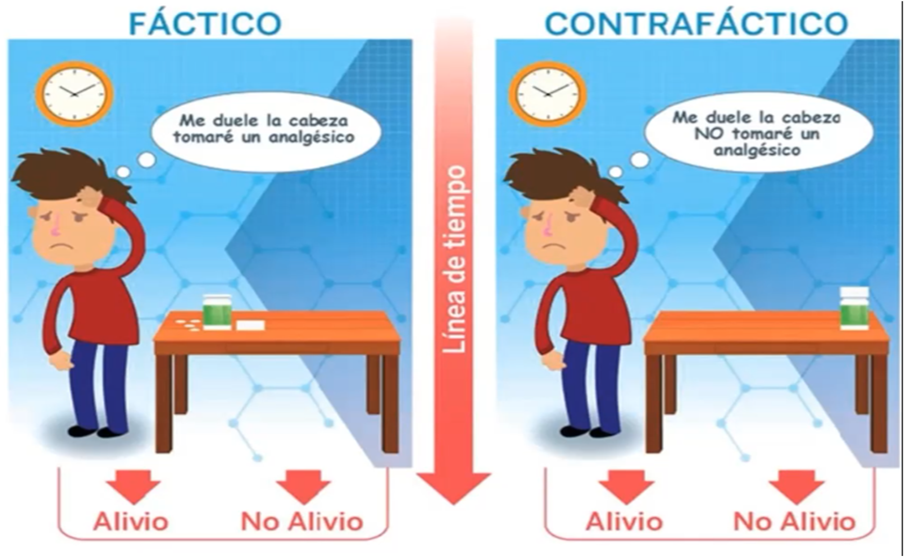

# Inferencia causal: resultados potenciales y estimandos

Responder preguntas causales es el objetivo de la mayoría de decisiones clínicas: *¿este fármaco enlentece la progresión de la enfermedad renal?, ¿esta estrategia de diálisis mejora la supervivencia?* Los ensayos aleatorizados no siempre son posibles (por ética, costo o tiempo), así que necesitamos aprender a responder estas preguntas con **datos observacionales** sin engañarnos.

En este capítulo aprenderás:

-   qué significa **efecto causal** en términos de *resultados potenciales* (el marco de Rubin);
-   los tres **estimandos** más usados (ATE, ATT, ATU) y cuál responde cada pregunta clínica;
-   por qué la comparación directa entre tratados y no tratados **está sesgada**;
-   los tres **supuestos** que permiten estimar un efecto causal;
-   cómo estimar ATE, ATT y ATU con **ponderación por probabilidad inversa** y **estandarización (fórmula g)**, y comprobar el resultado porque conocemos la verdad (datos simulados).

```{r}
#| label: setup-32
library(tidyverse)
library(marginaleffects)
source("R/funciones_epi.R")

theme_set(theme_minimal(base_size = 13) + theme(panel.grid.minor = element_blank()))
```

## Cómo pensar la causalidad: cuatro marcos complementarios

No existe una definición única de causa; los marcos siguientes se **complementan**:

| Marco | Idea central | Para qué sirve | Capítulo |
|---|---|---|---|
| **Criterios de Hill** | Lista de consideraciones para juzgar si una asociación es causal | Evaluar la plausibilidad de una causa (¿fuerte?, ¿temporal?, ¿dosis-respuesta?) | Este |
| **Causa suficiente-componente (Rothman)** | La enfermedad aparece cuando se completa un conjunto de "causas componentes" | Entender que casi ninguna causa es suficiente por sí sola (interacción) | Este |
| **Resultados potenciales (Rubin)** | El efecto causal es la diferencia entre lo que *habría* ocurrido con y sin tratamiento | **Definir** con precisión qué efecto queremos estimar | Este |
| **Grafos acíclicos dirigidos (Pearl)** | Dibujar las suposiciones causales como flechas | **Decidir** qué variables ajustar y cuáles no | Capítulo 3.3 |

::: {.callout-tip}
## 💡 Tip práctico

Úsalos en este orden: **Rubin** para definir la pregunta ("¿efecto de qué contra qué, en quién?"), **DAG** para decidir el análisis, y **Hill** para valorar críticamente la conclusión final.
:::

### Criterios de Hill

Bradford Hill (1965) propuso nueve consideraciones para decidir si una asociación observada es causal. Son una guía de razonamiento, **no una lista de verificación** (ninguno es imprescindible, salvo la temporalidad).

| Criterio | Pregunta | Ejemplo en nefrología |
|---|---|---|
| Fuerza de asociación | ¿La asociación es grande? | Albuminuria severa y riesgo de insuficiencia renal |
| Consistencia | ¿Se repite en distintas poblaciones y estudios? | Reducción de eventos renales con iSGLT2 en varios ensayos |
| Especificidad | ¿La exposición se vincula a un desenlace específico? | Rara vez aplica (una exposición suele tener varios efectos) |
| **Temporalidad** | ¿La exposición precede al desenlace? | Iniciar el fármaco **antes** de medir la pendiente de TFGe |
| Gradiente biológico | ¿Hay dosis-respuesta? | Más albuminuria, más riesgo |
| Plausibilidad | ¿Hay un mecanismo biológico creíble? | Efecto hemodinámico glomerular (retroalimentación tubuloglomerular) |
| Coherencia | ¿Concuerda con lo que se sabe de la enfermedad? | Compatible con la historia natural de la ERC diabética |
| Experimento | ¿La evidencia experimental respalda el hallazgo? | Ensayos aleatorizados |
| Analogía | ¿Hay efectos análogos conocidos? | Otros fármacos que reducen la presión intraglomerular |

Estos criterios **no** ofrecen una definición replicable de causa ni un método de estimación; para eso necesitamos los marcos siguientes.

### Modelo de causa suficiente-componente (Rothman)

Rothman propone que cada enfermedad es el resultado de **conjuntos de causas componentes** que, al completarse, forman una **causa suficiente**. Una misma enfermedad puede tener varias causas suficientes distintas y una causa componente puede aparecer en varias de ellas (si aparece en todas, es *necesaria*).

```{r}
#| label: fig-rothman
#| fig-cap: "Tres causas suficientes hipotéticas de progresión de ERC. Cada círculo es una causa suficiente; cada porción, una causa componente. La diabetes (A) está en todos: es 'necesaria' en este ejemplo hipotético."
#| fig-width: 8
#| fig-height: 2.8
pie_data <- tribble(
  ~causa_suficiente, ~componente,
  "Causa suficiente I",   "A. Diabetes",
  "Causa suficiente I",   "B. HTA no controlada",
  "Causa suficiente I",   "C. Albuminuria",
  "Causa suficiente II",  "A. Diabetes",
  "Causa suficiente II",  "D. AINE crónicos",
  "Causa suficiente II",  "E. Hipovolemia",
  "Causa suficiente III", "A. Diabetes",
  "Causa suficiente III", "F. Predisposición genética",
  "Causa suficiente III", "G. Obesidad"
) |> mutate(valor = 1)

ggplot(pie_data, aes(x = "", y = valor, fill = componente)) +
  geom_col(color = "white", width = 1) +
  geom_text(aes(label = str_extract(componente, "^[A-Z]")),
            position = position_stack(vjust = 0.5), color = "white", fontface = "bold") +
  coord_polar(theta = "y") +
  facet_wrap(~causa_suficiente) +
  scale_fill_brewer(palette = "Dark2", name = NULL) +
  theme_void(base_size = 12) +
  theme(legend.position = "right")
```

**Idea clave para el clínico:** *eliminar un solo componente* (p. ej., controlar la PA) puede impedir las causas suficientes en las que participa, aunque no cure todo. Además explica la **interacción**: los componentes se necesitan entre sí.

## Resultados potenciales: la idea central

Para cada paciente imaginamos **dos mundos**:

-   $Y^1$: lo que le ocurriría **si recibe** el tratamiento;
-   $Y^0$: lo que le ocurriría **si no lo recibe**.

El **efecto causal individual** es la diferencia: $\delta_i = Y^1_i - Y^0_i$. El problema fundamental de la inferencia causal es que **solo vemos uno de los dos mundos**: el del tratamiento que realmente recibió.

```{r}
#| label: fig-contrafactual
#| out-width: "80%"
#| fig-cap: "Mundo factual y mundo contrafáctico: de cada paciente solo observamos uno."

```

::: {.callout-note}
## 🩺 Viñeta clínica

Ocho pacientes con ERC y diabetes. Para cada uno conocemos (en esta tabla didáctica, que **no es observable en la vida real**) cuál sería su **pendiente anual de TFGe** (mL/min/1.73 m²/año; más alto = mejor) con iSGLT2 ($Y^1$) y sin iSGLT2 ($Y^0$). El grupo de edad ($Z$) influye en el pronóstico **y** en quién recibe el fármaco: los más jóvenes lo reciben con más frecuencia.
:::

```{r}
#| label: tbl-po-8
vineta <- tribble(
  ~id, ~edad,    ~tratado, ~y1,  ~y0,
  1,   "Joven",  1,        -0.5, -1.0,
  2,   "Joven",  1,        -0.8, -1.2,
  3,   "Joven",  1,        -0.7, -1.0,
  4,   "Joven",  0,        -0.9, -1.1,
  5,   "Mayor",  1,        -1.8, -3.5,
  6,   "Mayor",  0,        -2.0, -3.0,
  7,   "Mayor",  0,        -2.4, -3.6,
  8,   "Mayor",  0,        -2.2, -3.3
) |>
  mutate(ite = y1 - y0,                           # efecto individual (inobservable)
         y   = if_else(tratado == 1, y1, y0))     # lo que realmente observamos

vineta
```

### Efectos medios: ATE, ATT y ATU

Como los efectos individuales no son observables, resumimos el efecto en **grupos**:

| Estimando | Significado | Fórmula | Pregunta clínica |
|---|---|---|---|
| **ATE** (efecto medio del tratamiento) | Efecto si **toda** la población recibiera tratamiento vs. ninguno | $E[Y^1 - Y^0]$ | ¿Y si indicamos el fármaco a *todos* los pacientes elegibles? |
| **ATT** (efecto en los tratados) | Efecto **en quienes sí lo recibieron** | $E[Y^1 - Y^0 \mid X=1]$ | ¿Qué ganaron los pacientes que lo toman? (¿y si lo retiramos?) |
| **ATU** (efecto en los no tratados) | Efecto **en quienes no lo recibieron** | $E[Y^1 - Y^0 \mid X=0]$ | ¿Qué ganarían los que hoy no lo reciben si ampliamos la indicación? |

```{r}
#| label: ate-att-atu-8
efectos_verdaderos <- vineta |>
  summarise(
    ATE = mean(ite),
    ATT = mean(ite[tratado == 1]),
    ATU = mean(ite[tratado == 0])
  )
efectos_verdaderos
```

El **ATE** es `r round(efectos_verdaderos$ATE, 2)`, el **ATT** `r round(efectos_verdaderos$ATT, 2)` y el **ATU** `r round(efectos_verdaderos$ATU, 2)` mL/min/1.73 m²/año. El ATE es el promedio ponderado de los otros dos:

$$
\text{ATE} = \pi_{\text{tratados}} \times \text{ATT} + \pi_{\text{no tratados}} \times \text{ATU}
$$

::: {.callout-warning}
## ⚠️ Cuidado: ¿qué estimando necesita tu pregunta?

Un comité de farmacia que decide cubrir un fármaco para todos los pacientes elegibles necesita el **ATE**. Un servicio que se pregunta qué ocurriría si **retira** el fármaco a quienes ya lo reciben necesita el **ATT**. Un servicio que quiere **ampliar** la indicación a quienes hoy no lo reciben necesita el **ATU**. Los tres pueden ser distintos cuando hay *heterogeneidad del efecto*.
:::

### ¿Qué vemos en la vida real?

En la práctica solo conocemos `y`, no `y1` ni `y0`. La comparación "natural" es la diferencia de medias observadas:

```{r}
#| label: ingenuo-8
ingenuo <- vineta |>
  group_by(tratado) |>
  summarise(media_y = mean(y)) |>
  summarise(dif_ingenua = media_y[tratado == 1] - media_y[tratado == 0])

ingenuo
```

La diferencia ingenua es **`r round(ingenuo$dif_ingenua, 2)`**, más del doble del ATE verdadero (`r round(efectos_verdaderos$ATE, 2)`). ¿Por qué?

### Sesgo de selección

La diferencia observada se descompone en dos partes:

$$
\underbrace{E[Y \mid X=1] - E[Y \mid X=0]}_{\text{diferencia observada}} =
\underbrace{E[Y^1 - Y^0 \mid X=1]}_{\text{ATT}} +
\underbrace{E[Y^0 \mid X=1] - E[Y^0 \mid X=0]}_{\text{sesgo de selección}}
$$

El sesgo de selección compara cómo **evolucionarían sin tratamiento** los pacientes que recibieron el fármaco frente a los que no lo recibieron. Si los tratados son más jóvenes y de mejor pronóstico, su $Y^0$ ya sería mejor aunque nunca hubieran recibido nada:

```{r}
#| label: sesgo-seleccion-8
vineta |>
  summarise(
    diferencia_observada = mean(y[tratado == 1]) - mean(y[tratado == 0]),
    ATT                  = mean(ite[tratado == 1]),
    sesgo_de_seleccion   = mean(y0[tratado == 1]) - mean(y0[tratado == 0])
  ) |>
  mutate(suma_ATT_mas_sesgo = ATT + sesgo_de_seleccion)
```

::: {.callout-important}
## 🎯 Idea central

Comparar tratados con no tratados mezcla el **efecto del tratamiento** con las **diferencias previas** entre los grupos. Todo el trabajo de la inferencia causal consiste en eliminar la segunda parte.
:::

### Una solución sencilla: estratificar

Aquí la edad es la causa común. Podemos comparar **dentro** de cada grupo de edad y luego promediar:

```{r}
#| label: estratificacion-8
estratos <- vineta |>
  group_by(edad) |>
  summarise(
    n = n(),
    efecto_estrato = mean(y[tratado == 1]) - mean(y[tratado == 0])
  ) |>
  mutate(peso = n / sum(n))

estratos

estratos |> summarise(ATE_estratificado = sum(peso * efecto_estrato))
```

El estimado estratificado (`r round(sum(estratos$peso * estratos$efecto_estrato), 2)`) se acerca mucho más al ATE verdadero que la diferencia ingenua; no es exacto porque solo tenemos 8 pacientes. Con muchos confusores continuos la estratificación no es práctica: usaremos **ponderación** y **estandarización**.

## Los tres supuestos de identificación

Para que un análisis de datos observacionales estime un efecto causal necesitamos que se cumplan tres supuestos. **No se pueden comprobar con los datos**: se defienden con conocimiento clínico.

::: {.callout-important}
## 🎯 En resumen

| Supuesto | En palabras | Pregunta de control | Ejemplo en nefrología |
|---|---|---|---|
| **Consistencia** | Lo que llamamos "tratamiento" está bien definido y el resultado de un paciente no depende del tratamiento de otros | ¿"iSGLT2" es *el mismo* tratamiento para todos? ¿Qué fármaco, dosis, adherencia? | "Inicio de dapagliflozina 10 mg" es una intervención definible; "uso de iSGLT2" ambiguo |
| **Intercambiabilidad** (ausencia de confusión no medida) | Tratados y no tratados serían comparables si tuvieran las mismas covariables | ¿Medí **todo** lo que influye a la vez en la decisión de tratar y en el desenlace? | ¿Medí fragilidad, adherencia, motivación? |
| **Positividad** | Todo tipo de paciente tiene probabilidad > 0 de recibir cada opción | ¿Existen pacientes similares a los tratados que **no** recibieron el fármaco, y viceversa? | Si no se inicia nunca con TFGe < 20, no hay tratados en ese rango: no existe comparación posible para esos pacientes |
:::

-   **Consistencia** tiene dos partes: *una versión bien definida del tratamiento* y *ausencia de interferencia* (el tratamiento de un paciente no cambia el resultado de otro). En nefrología la interferencia es rara, pero ocurre, por ejemplo, con vacunas o prácticas de una unidad de diálisis que se contagian entre pacientes.
-   **Intercambiabilidad** incluye la versión *condicional*: tratados y no tratados son intercambiables **dentro de cada nivel** de las covariables medidas. No implica que el ATT sea igual al ATU o al ATE: esos pueden diferir si el efecto varía entre pacientes.
-   **Positividad** se puede **revisar** en los datos (¿hay superposición de puntajes de propensión?) y su fracaso se manifiesta en pesos extremos.

## Causalidad en ensayos clínicos

La **aleatorización** hace que el tratamiento no dependa de ninguna característica del paciente. Por eso:

-   garantiza la **intercambiabilidad** (en promedio, los grupos son iguales, incluso en factores desconocidos);
-   garantiza la **positividad** (probabilidad de asignación conocida, típicamente 50 %);
-   facilita la **consistencia** (el investigador define la intervención).

Pero **no basta con aleatorizar**: el abandono diferencial, la mala adherencia, los criterios de elegibilidad amplios y la ausencia de enmascaramiento pueden romper estos supuestos. Es lo que vimos en el Capítulo 3.1 con los análisis ITT y por protocolo.

### Cuando no podemos aleatorizar: emular un ensayo

Una buena práctica es **especificar el ensayo que haríamos si pudiéramos** y luego emularlo con los datos observacionales ("ensayo objetivo", *target trial emulation*). Todos los elementos son los de un protocolo:

| Elemento | Ensayo ideal | Emulación con datos observacionales (nuestro ejemplo) |
|---|---|---|
| **Elegibilidad** | ERC G3-G4, DM2, sin diálisis, sin contraindicación | Mismos criterios en el registro, aplicados **en el momento cero** |
| **Estrategias de tratamiento** | Iniciar iSGLT2 vs. no iniciar | Pacientes que inician vs. no inician en el periodo de enrolamiento |
| **Asignación** | Aleatoria | Dependiente de las covariables: se *corrige* con ponderación o estandarización |
| **Inicio del seguimiento** | Al aleatorizar | Al **cumplir la elegibilidad y recibir (o no) el tratamiento** (evita sesgo de tiempo inmortal) |
| **Desenlace** | Pendiente de TFGe a 1 año; evento renal a 3 años | Igual, definido igual en todos |
| **Contraste causal** | Efecto de la **asignación** (ITT) y/o del **tratamiento recibido** (PP) | Igual; aclarar cuál |
| **Análisis** | Comparación ITT | Ajuste por confusores del DAG, con análisis de sensibilidad |

::: {.callout-tip}
## 💡 Tip práctico

Antes de abrir R, completa esta tabla para tu pregunta. Si no puedes llenar una fila (por ejemplo, "momento cero"), tu pregunta todavía no es una pregunta causal bien formulada.
:::

## Un ejemplo con datos simulados

Ahora trabajaremos con un registro **simulado** de 5000 adultos con ERC (G3-G4) y diabetes tipo 2 de una consulta de nefrología. **Pregunta causal:** *¿iniciar un iSGLT2 modifica la pendiente anual de la TFGe, comparado con no iniciarlo?*

Cargamos la versión "oráculo", que incluye además lo que **nunca** tendríamos en la vida real: los resultados potenciales de cada paciente.

```{r}
#| label: carga-oraculo
oraculo <- read_csv("Bases/ckd_isglt2_oraculo.csv", show_col_types = FALSE)
glimpse(oraculo)
```

| Variable | Descripción |
|---|---|
| `isglt2` | **Tratamiento**: inició iSGLT2 (1) o no (0) |
| `pendiente_tfg` | **Desenlace**: cambio anual de TFGe (mL/min/1.73 m²/año); más alto = mejor |
| `edad`, `sexo`, `hba1c`, `pas`, `tfg_basal`, `uacr`, `ecv` | Covariables clínicas medidas |
| `fragilidad` | Fragilidad (en la vida real, por ejemplo, la Clinical Frailty Scale). **En este capítulo la suponemos medida.** |
| `pendiente_0`, `pendiente_1`, `ite` | Oráculo: resultados potenciales y efecto individual |

```{r}
#| label: fig-dag-ckd
#| fig-cap: "Suposiciones causales del ejemplo (simplificado). Los confusores (en naranja) causan a la vez la decisión de tratar y el desenlace."
#| fig-width: 7.5
#| fig-height: 4
nodos <- tribble(
  ~nombre, ~x, ~y, ~etiqueta, ~rol,
  "X", 1, 1, "Inicio de\niSGLT2", "exposicion",
  "Y", 5, 1, "Pendiente\nde TFGe", "desenlace",
  "C", 3, 2.6, "Edad, TFGe basal, albuminuria,\nPAS, HbA1c, enfermedad CV", "confusor",
  "F", 3, 0.2, "Fragilidad", "confusor"
)
aristas <- tribble(
  ~de, ~a,
  "X", "Y",
  "C", "X", "C", "Y",
  "F", "X", "F", "Y"
)
dibujar_dag(nodos, aristas)
```

### Los valores verdaderos (solo posible porque simulamos)

```{r}
#| label: verdad
verdad <- oraculo |>
  summarise(
    ATE = mean(ite),
    ATT = mean(ite[isglt2 == 1]),
    ATU = mean(ite[isglt2 == 0])
  )
verdad
```

Es decir, con iSGLT2 la pérdida de TFGe se enlentece, **en promedio**, `r round(verdad$ATE, 2)` mL/min/1.73 m²/año en toda la población. Como el efecto es mayor en pacientes con más albuminuria y estos reciben el fármaco con más frecuencia, el ATT (`r round(verdad$ATT, 2)`) supera al ATU (`r round(verdad$ATU, 2)`).

### La estimación ingenua

```{r}
#| label: ingenuo-ckd
ingenuo_ckd <- oraculo |>
  group_by(isglt2) |>
  summarise(media = mean(pendiente_tfg)) |>
  summarise(dif = media[isglt2 == 1] - media[isglt2 == 0])
ingenuo_ckd
```

La diferencia cruda es **`r round(ingenuo_ckd$dif, 2)`**: sobrestima el efecto en `r round(100 * (ingenuo_ckd$dif / verdad$ATE - 1))` %. Los pacientes que reciben iSGLT2 son más jóvenes, menos frágiles y con mejor TFGe: ya habrían evolucionado mejor aunque no recibieran el fármaco.

### Ponderación por probabilidad inversa (IPW)

La idea: usar los confusores para predecir **la probabilidad de recibir el tratamiento** (el *puntaje de propensión*, PS) y **ponderar** a cada paciente para construir una pseudo-población en la que los confusores ya no se relacionan con el tratamiento, como en un ensayo.

**Paso 1.** Modelo del puntaje de propensión.

```{r}
#| label: ps-modelo
modelo_ps <- glm(
  isglt2 ~ edad + sexo + hba1c + pas + tfg_basal + log(uacr) + ecv + fragilidad,
  data = oraculo, family = binomial()
)

oraculo <- oraculo |> mutate(ps = fitted(modelo_ps))
summary(oraculo$ps)
```

**Paso 2.** Pesos según el estimando. $p_i$ es el PS de cada paciente:

| Estimando | Peso de los tratados | Peso de los no tratados |
|---|---|---|
| ATE | $1/p_i$ | $1/(1-p_i)$ |
| ATT | 1 | $p_i/(1-p_i)$ |
| ATU | $(1-p_i)/p_i$ | 1 |

```{r}
#| label: ps-pesos
oraculo <- oraculo |>
  mutate(
    w_ate = isglt2 / ps + (1 - isglt2) / (1 - ps),
    w_att = isglt2 + (1 - isglt2) * ps / (1 - ps),
    w_atu = (1 - isglt2) + isglt2 * (1 - ps) / ps
  )

oraculo |> summarise(across(c(w_ate, w_att, w_atu), list(min = min, mediana = median, max = max)))
```

::: {.callout-tip}
## 💡 Tip práctico: ¿por qué "inversa"?

Un paciente con alta probabilidad de recibir el fármaco que **sí** lo recibe es lo esperado y pesa poco. Un paciente con baja probabilidad que **sí** lo recibe es "raro", representa a muchos pacientes similares que no lo recibieron y por eso pesa más. Los pesos muy grandes (aquí, cercanos a 30) señalan problemas de **positividad** y desestabilizan la estimación.
:::

La figura muestra cómo el ponderar equilibra la distribución del PS entre grupos:

```{r}
#| label: fig-ps-hist
#| fig-cap: "Histograma espejo del puntaje de propensión. Arriba: tratados; abajo: no tratados. Contorno: población original. Relleno: pseudo-población ponderada (ATE), donde ambos grupos tienen la misma distribución de PS."
#| fig-width: 7
#| fig-height: 4.2
ggplot(oraculo, aes(x = ps)) +
  # pseudo-población ponderada (relleno)
  geom_histogram(data = filter(oraculo, isglt2 == 1), aes(weight = w_ate, y = after_stat(count)),
                 bins = 40, fill = "#0072B2", alpha = 0.45) +
  geom_histogram(data = filter(oraculo, isglt2 == 0), aes(weight = w_ate, y = -after_stat(count)),
                 bins = 40, fill = "#D55E00", alpha = 0.45) +
  # población original (contorno)
  geom_histogram(data = filter(oraculo, isglt2 == 1), aes(y = after_stat(count)),
                 bins = 40, fill = NA, color = "#0072B2") +
  geom_histogram(data = filter(oraculo, isglt2 == 0), aes(y = -after_stat(count)),
                 bins = 40, fill = NA, color = "#D55E00") +
  geom_hline(yintercept = 0) +
  scale_y_continuous(labels = abs) +
  labs(x = "Puntaje de propensión", y = "Pacientes (o pacientes ponderados)")
```

**Paso 3.** Modelo del desenlace ponderado. El coeficiente del tratamiento es el estimador:

```{r}
#| label: ipw-estimadores
estima_ipw <- function(datos, peso) {
  coef(lm(pendiente_tfg ~ isglt2, data = datos, weights = datos[[peso]]))[["isglt2"]]
}

ipw <- tibble(
  estimando = c("ATE", "ATT", "ATU"),
  verdadero = c(verdad$ATE, verdad$ATT, verdad$ATU),
  ipw       = c(estima_ipw(oraculo, "w_ate"), estima_ipw(oraculo, "w_att"),
                estima_ipw(oraculo, "w_atu"))
)
ipw
```

### Estandarización (fórmula g)

Otra forma de pensarlo es más cercana al marco de resultados potenciales: **ajustar un modelo del desenlace** con el tratamiento y los confusores, y luego **predecir para cada paciente** qué ocurriría si todos recibieran el fármaco y si ninguno lo recibiera.

1.  Ajustar un modelo del desenlace con tratamiento, confusores e interacciones.
2.  Predecir el desenlace de **cada** paciente poniendo `isglt2 = 1`.
3.  Predecir el desenlace de **cada** paciente poniendo `isglt2 = 0`.
4.  Promediar la diferencia: en toda la población (**ATE**), solo en tratados (**ATT**) o solo en no tratados (**ATU**).

```{r}
#| label: gformula
modelo_resultado <- lm(
  pendiente_tfg ~ isglt2 * (edad + sexo + hba1c + pas + tfg_basal + log(uacr) + ecv + fragilidad),
  data = oraculo
)

estandarizar <- function(modelo, datos) {
  mean(predict(modelo, mutate(datos, isglt2 = 1)) - predict(modelo, mutate(datos, isglt2 = 0)))
}

gformula <- tibble(
  estimando = c("ATE", "ATT", "ATU"),
  gformula  = c(estandarizar(modelo_resultado, oraculo),
                estandarizar(modelo_resultado, filter(oraculo, isglt2 == 1)),
                estandarizar(modelo_resultado, filter(oraculo, isglt2 == 0)))
)
```

El paquete `{marginaleffects}` hace lo mismo en una sola línea (y calcula el error estándar):

```{r}
#| label: marginaleffects
avg_comparisons(modelo_resultado, variables = "isglt2")                                      # ATE
avg_comparisons(modelo_resultado, variables = "isglt2", newdata = filter(oraculo, isglt2 == 1))   # ATT
```

### Comparación con la verdad

```{r}
#| label: tbl-resumen-estimandos
resumen <- ipw |>
  left_join(gformula, by = "estimando") |>
  mutate(across(where(is.numeric), ~ round(., 2)))
resumen
```

Los dos métodos recuperan los valores verdaderos con muy buena aproximación **porque medimos y ajustamos todos los confusores** (incluida la fragilidad). En el Capítulo 3.4 veremos qué pasa cuando un confusor **no se mide**.

::: {.callout-important}
## 🎯 En resumen: qué estimando, cómo interpretarlo

| Estimando | Interpretación en este ejemplo | Cuándo es el relevante |
|---|---|---|
| **ATE** | Iniciar iSGLT2 enlentece la pérdida de TFGe en ≈ `r round(resumen$gformula[1], 1)` mL/min/1.73 m²/año **en toda la población** de la consulta | Decidir una política para todos |
| **ATT** | El mismo efecto, **en quienes ya lo recibieron** (≈ `r round(resumen$gformula[2], 1)`) | Evaluar qué ocurriría si se retira el tratamiento |
| **ATU** | El efecto **en quienes no lo recibieron** (≈ `r round(resumen$gformula[3], 1)`) | Ampliar la indicación a nuevos pacientes |

**Nota:** la diferencia entre ATT y ATU refleja la **heterogeneidad del efecto**: aquí el beneficio es mayor cuanto más albuminuria, y quienes la tienen reciben el fármaco con más frecuencia.
:::

## ¿Qué otros métodos existen?

Los métodos que ajustan por confusores medidos (regresión, emparejamiento, PS, estandarización) no son los únicos. Cuando hay confusión **no medida**, existen estrategias de diseño que aprovechan fuentes de variación "casi aleatorias":

| Método | Idea | Estima | Ejemplo en nefrología |
|---|---|---|---|
| **Diferencias en diferencias** | Compara el **cambio** antes-después en un grupo expuesto vs. uno no expuesto (usa un grupo control) | Generalmente el **ATT** | Cambio en la tasa de derivación a nefrología tras una política aplicada solo en algunas regiones |
| **Regresión discontinua** | Compara pacientes justo por encima y por debajo de un umbral | Efecto **local** cerca del umbral | Indicar un manejo si la TFGe es < 30 vs. ≥ 30 |
| **Variables instrumentales** | Usa una variable que cambia el tratamiento pero no afecta directamente al desenlace | Efecto en los **"cumplidores"** del instrumento (LATE) | Preferencia del médico tratante por un fármaco como instrumento |
| **Controles sintéticos** | Construye un "control" ponderado a partir de varias unidades | ATT en una unidad tratada | Impacto de un programa en una región |

::: {.callout-warning}
## ⚠️ Cuidado

Ningún método estima "el efecto causal" en general: cada uno responde a un **estimando distinto** (ATE, ATT, LATE…) y descansa en supuestos distintos. Define primero tu pregunta (Rubin) y luego elige el método.
:::

::: {.callout-important}
## 🎯 Para llevarte

1.  El efecto causal es la diferencia entre **dos mundos**; solo observamos uno.
2.  **ATE, ATT y ATU** responden preguntas distintas: elige según la decisión clínica.
3.  La diferencia cruda = efecto + **sesgo de selección**.
4.  Los supuestos de **consistencia, intercambiabilidad y positividad** no se verifican con datos: se argumentan.
5.  IPW y estandarización recuperan el efecto verdadero **si** se miden todos los confusores.
:::

## Referencias

-   Hernán MA, Robins JM. *Causal Inference: What If*. Chapman & Hall/CRC; 2020. (Caps. 1-3)
-   Barrett M, D'Agostino McGowan L, Gerke T. *Causal Inference in R*. 2025. <https://www.r-causal.org/>
-   Greifer N, Stuart EA. Choosing the estimand when matching or weighting in observational studies. 2021. <https://doi.org/10.48550/arXiv.2106.10577>
-   Rothman KJ. Causes. *Am J Epidemiol*. 1976;104(6):587-592.
-   Hill AB. The environment and disease: association or causation? *Proc R Soc Med*. 1965;58:295-300.
-   Hernán MA, Robins JM. Using big data to emulate a target trial when a randomized trial is not available. *Am J Epidemiol*. 2016;183(8):758-764.
-   Ross RD, Shi X, Caram MEV, et al. Veridical causal inference using propensity score methods for comparative effectiveness research with medical claims. *Health Serv Outcomes Res Method*. 2020. <https://doi.org/10.1007/s10742-020-00222-8>

## Nota editorial

-   Esta sección fue editada con asistencia de IA (ChatGPT; revisión editorial con Claude). Los datos son simulados; el esquema didáctico (viñeta de ocho pacientes, ATE/ATT/ATU, IPW y estandarización) sigue la exposición de la bibliografía citada, adaptada a un ejemplo nefrológico original.
